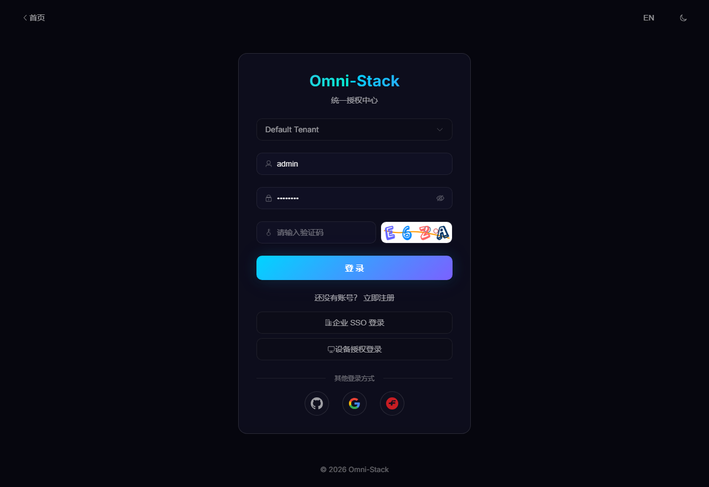
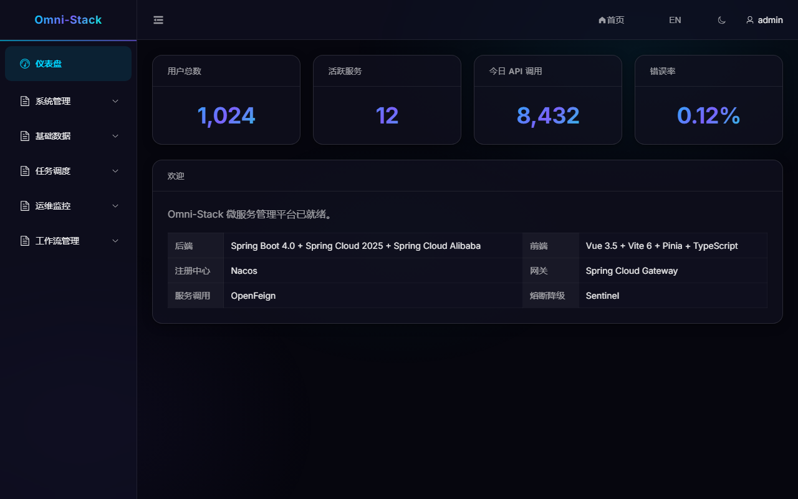
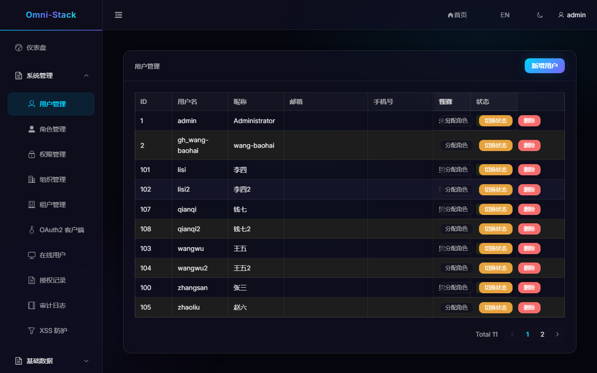
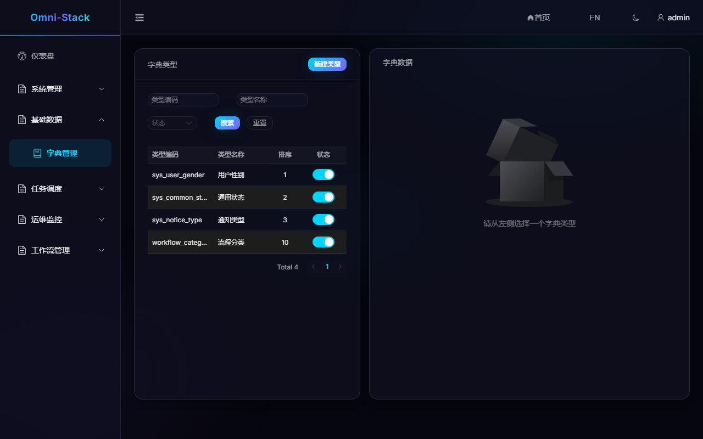

# Omni-Stack

> 基于 Spring Boot 4 + Vue 3 的微服务脚手架平台，采用 Harness 工业设计模式构建，为 AI 辅助开发提供行业最佳实践基础。
>
> **一条命令启动全家桶：中间件 + 4 个微服务 + 前端，共 12 个 Docker 容器。**

**[English](README.en.md)** | **[日本語](README.jp.md)** | **[한국어](README.kr.md)**

**GitHub**: https://github.com/wang-baohai/Omni-Stack | **Gitee**: https://gitee.com/wang-baohai/Omni-Stack

**联系邮箱**: wangbaohai1993@gmail.com

---

## 特性亮点

- **JDK 25** + Spring Boot 4.0.6 + Spring Cloud 2025.1.1 + Spring Cloud Alibaba 2025.1.0.0 全栈最新技术
- **Docker 全家桶一键部署**：`start.bat` / `./start.sh` 一条命令启动 12 个容器（MySQL、Redis、Nacos、RocketMQ、XXL-JOB、4 个后端微服务、前端），详见 [Docker 部署指南](docs/docker-deployment.md)
- **多提供商社交登录**：GitHub + Google + Gitee OAuth2 一键登录（策略模式可扩展），首次登录自动注册
- **三层 XSS 纵深防御**：Jackson 反序列化器 + Servlet Filter + Gateway 安全响应头，按租户配置，前端管理界面完整可用
- **Common Starter 生态**：8 个自动装配模块（mybatis / redis / operlog / job / mqlog / workflow），新服务引入依赖即获能力，零配置
- **双轨制定时任务**：XXL-JOB 3.3.1 系统任务 + 用户任务双模式，前端 Cron 编辑器 + 执行日志实时推送，详见 [docs/scheduling.md](docs/scheduling.md)
- **Transactional Outbox 可靠消息**：本地发件箱 + XXL-JOB 中继 + 指数退避重试 + 死信管理，详见 [docs/mq-reliability.md](docs/mq-reliability.md)
- **可视化 BPMN 工作流**：Flowable 7.x 引擎，前端拖拽建模 + 双版本管理 + 多实例会签 + 动态候选人解析，详见 [docs/workflow.md](docs/workflow.md)
- **完整 RBAC 权限体系**：功能权限（动态菜单 + v-permission + @PreAuthorize）+ 数据权限（DataPermissionInterceptor 六级过滤），详见 [docs/architecture.md](docs/architecture.md)
- **AI 原生工程**：AGENTS.md 执行手册 + docs/ 系统真相 + Skills 行为扩展，前两层定住，第三层交给 AI 高速生产

## 技术栈

| 层级 | 技术 | 版本 |
|------|------|------|
| JDK | OpenJDK | 25 |
| 后端框架 | Spring Boot | 4.0.6 |
| 微服务框架 | Spring Cloud + Spring Cloud Alibaba | 2025.1.1 / 2025.1.0.0 |
| API 网关 | Spring Cloud Gateway Server (WebFlux) | 5.0.1 |
| 注册/配置 | Nacos Server | v3.1.1 |
| 流控/熔断 | Sentinel Dashboard | 1.8.8 |
| 消息队列 | Apache RocketMQ | 5.3.2 |
| 任务调度 | XXL-JOB Admin | 3.3.1 |
| 工作流引擎 | Flowable BPMN | 7.x |
| 前端框架 | Vue 3 + TypeScript | 3.5.35 / 5.9.3 |
| 构建工具 | Vite 8 (Rolldown) | 8.0.14 |
| UI 框架 | Element Plus | 2.14.0 |
| 状态管理 | Pinia | 3.0.4 |
| Node.js | Node.js LTS | >= 22.12.0 |

## 架构概览

```
                                 ┌─────────────────┐
                                 │    omni-auth     │
                                 │   Spring :8100   │
                                 │  Security+OAuth2 │
                                 └─────────────────┘
                                        ▲
┌─────────────────┐     ┌──────────────────┐
│   omni-frontend  │────>│   omni-gateway    │lb://
│   Vue 3 SPA     │/api │  WebFlux :8102    │────>┌─────────────────┐
│   Nginx :3000   │────>│  StripPrefix=2    │     │    omni-base     │
└─────────────────┘     └──────────────────┘     │   Spring :8101   │
                            │                    └─────────────────┘
                            │                    ┌─────────────────┐
                            │                    │  omni-workflow   │
                            │                    │  Flowable :8103  │
                            │                    └─────────────────┘
                    ┌───────┴────────┐
                    │  MySQL :3306   │  持久化存储
                    │  Redis :6379   │  缓存 + 验证码
                    │  Nacos :8848   │  服务发现 + 配置中心
                    │  RocketMQ      │  消息队列（异步投递）
                    │  XXL-JOB       │  分布式任务调度
                    └────────────────┘
```

**请求流转**：浏览器 `:3000` → Nginx 反代 → Gateway `:8102` → `lb://` → 后端服务

## 项目结构

```
Omni-Stack/
├── AGENTS.md                           # AI 执行手册（硬约束 + 构建命令 + 检查清单）
├── start.bat / start.sh                # Docker 全家桶一键启动脚本
├── stop.bat / stop.sh                  # 一键停止脚本
├── docker-compose.yml                  # 12 容器全家桶编排
├── docker/
│   ├── backend/Dockerfile              # 后端多阶段构建（Maven 编译 + JRE 运行）
│   ├── frontend/Dockerfile             # 前端多阶段构建（npm 编译 + Nginx）
│   ├── frontend/nginx.conf             # Nginx 反代配置
│   └── rocketmq/broker-docker.conf     # RocketMQ Broker 配置
├── docs/                               # 系统真相文档（深度技术文档，支持多语言）
│   ├── architecture.md                 #   系统边界、模块地图、数据流、RBAC 权限体系
│   ├── api-contract.md                 #   响应格式、错误码、分页、命名规范
│   ├── backend-patterns.md             #   后端分层、校验、异常、日志、安全权限
│   ├── frontend-patterns.md            #   前端目录、API 层、状态管理、权限控制
│   ├── core-flows.md                   #   登录/OAuth2/RBAC 权限流程端到端追踪
│   ├── scheduling.md                   #   定时任务系统深度技术文档
│   ├── workflow.md                     #   工作流引擎深度技术文档
│   ├── mq-reliability.md              #   可靠消息发送深度技术文档
│   └── docker-deployment.md            #   Docker 全家桶部署深度指南
├── scripts/sql/                        # 数据库初始化脚本
│   ├── init-all.sql                    #   权威 DDL + 种子数据
│   ├── init-nacos.sql                  #   Nacos MySQL 持久化
│   └── init-xxl-job.sql               #   XXL-JOB 数据库
├── omni-backend/                       # Maven 多模块后端
│   ├── omni-common-core/               #   纯 POJO：R<T>, PageResult, XSS SPI
│   ├── omni-common/                    #   Web 自动配置：Jackson, CORS, XSS Filter
│   ├── omni-common-mybatis/            #   MyBatis-Plus Starter
│   ├── omni-common-redis/              #   阻塞式 Redis Starter
│   ├── omni-common-redis-reactive/     #   响应式 Redis Starter（Gateway 专用）
│   ├── omni-common-operlog/            #   操作日志 Starter
│   ├── omni-common-job/                #   定时任务 Starter
│   ├── omni-common-mqlog/              #   MQ 消息可靠性 Starter
│   ├── omni-common-workflow/           #   工作流 Starter
│   ├── omni-auth/                      #   认证服务 (8100)
│   ├── omni-base/                      #   基础数据服务 (8101)
│   ├── omni-workflow/                  #   工作流引擎服务 (8103)
│   └── omni-gateway/                   #   API 网关 (8102)
└── omni-frontend/                      # Vue 3 SPA (3000)
```

## Docker 一键部署（推荐）

一条命令启动全部 12 个容器：中间件（MySQL、Redis、Nacos、RocketMQ、XXL-JOB）+ 4 个后端微服务 + 前端。

### 前置条件

| 软件 | 版本要求 | 说明 |
|------|---------|------|
| Docker Desktop | 任意稳定版 | Windows 需 WSL2 后端 |
| Git | 任意 | 克隆项目 |

> 无需安装 JDK、Node.js、Maven —— 全部在 Docker 容器内完成构建和运行。

### 启动

| 平台 | 命令 |
|------|------|
| Windows | 右键 `start.bat` → **以管理员身份运行** |
| Linux / macOS | `./start.sh` |

脚本自动完成：检测 Docker → 启动 Docker 引擎（如未运行）→ 端口保护（Windows Hyper-V/WSL2）→ 拉取中间件镜像 → 构建应用镜像 → 启动全部容器。

```bash
# 启动全部服务
./start.sh

# 仅启动指定服务（如只启动中间件）
./start.sh mysql redis

# 查看服务状态
docker compose ps

# 停止全部服务
./stop.sh
```

### 服务端口

| 服务 | 端口 | 说明 |
|------|------|------|
| **前端** | **http://localhost:3000** | **访问入口，Nginx 反代到 Gateway** |
| 认证服务 | http://localhost:8100 | Spring Security + OAuth2 |
| 基础数据服务 | http://localhost:8101 | 字典/组织/用户/日志/任务 |
| API 网关 | http://localhost:8102 | Spring Cloud Gateway (WebFlux) |
| 工作流引擎 | http://localhost:8103 | Flowable BPMN |
| MySQL | localhost:3306 | root/root |
| Redis | localhost:6379 | 无密码 |
| Nacos 控制台 | http://localhost:8080 | nacos/nacos |
| XXL-JOB 调度中心 | http://localhost:18080 | admin/123456 |
| RocketMQ NameServer | localhost:19876 | 宿主机映射端口（容器内 9876） |

### 验证

```bash
# 1. 访问前端
open http://localhost:3000

# 2. 验证验证码接口
curl http://localhost:3000/api/auth/captcha

# 3. 检查所有容器状态
docker compose ps
```

**默认登录账号**：`admin` / `admin123`

### 常见问题

| 问题 | 原因 | 解决方案 |
|------|------|---------|
| 镜像拉取失败 | 国内网络问题 | 配置 Docker 镜像加速：`"registry-mirrors": ["https://docker.1ms.run"]` |
| 端口绑定失败 (Windows) | Hyper-V/WSL2 端口保留冲突 | `start.bat` 已自动处理端口保护，需以管理员身份运行 |
| RocketMQ 端口 9876 冲突 | Windows Hyper-V 保留端口范围 | 宿主机映射已改为 19876，容器内仍为 9876 |
| 502 Bad Gateway | Nginx 反代端口配置错误 | 确认 nginx.conf 中 proxy_pass 使用容器内部端口 `8080`（非宿主机端口 `8102`） |
| Nacos 启动失败 | 健康检查端点变更 | Nacos v3.1.1 使用 `GET /nacos/`（非 `/nacos/actuator/health`） |
| 构建超时 | Maven 依赖下载慢 | 后端 Dockerfile 已内置阿里云 Maven 镜像加速 |

> 深度故障排查指南见 [docs/docker-deployment.md](docs/docker-deployment.md)

## 本地开发

适合需要调试和修改代码的场景，中间件用 Docker，后端和前端在本地运行。

### 前置条件

| 软件 | 版本 | 说明 |
|------|------|------|
| JDK | 25 | 必须设置 `JAVA_HOME` |
| Node.js | >= 22.12.0 | 含 npm |
| Docker Desktop | 任意 | 仅运行中间件 |

### 步骤

```bash
# 1. 启动中间件（仅中间件，不启动应用容器）
./start.sh mysql redis nacos rocketmq-namesrv rocketmq-broker xxl-job-admin

# 等待 Nacos 就绪（约 30 秒），访问 http://localhost:8080 确认

# 2. 构建并启动后端
export JAVA_HOME="/path/to/jdk-25"
cd omni-backend && ./mvnw clean install
cd omni-auth && ./mvnw spring-boot:run       # 端口 8100（新终端窗口继续）
cd omni-base && ./mvnw spring-boot:run        # 端口 8101
cd omni-gateway && ./mvnw spring-boot:run     # 端口 8102
cd omni-workflow && ./mvnw spring-boot:run    # 端口 8103

# 3. 启动前端
cd omni-frontend && npm install && npm run dev  # 端口 3000
```

> Maven Wrapper 已内置（3.9.16），无需全局安装 Maven。构建顺序由 Maven reactor 自动解析。

### 社交登录配置

支持 GitHub、Google、Gitee 三个 OAuth2 提供商。凭证配置在 `application-local.yml`（被 `.gitignore` 排除），详见 [docs/core-flows.md](docs/core-flows.md)。

## 功能概览

| 登录页 | 数据看板 |
|--------|----------|
|  |  |

| 用户管理 | 字典管理 |
|----------|----------|
|  |  |

## 模块概览

### 后端微服务

| 模块 | 端口 | 职责 | 深度文档 |
|------|------|------|---------|
| omni-auth | 8100 | 认证授权：登录、JWT、OAuth2、RBAC、XSS 配置管理 | [core-flows.md](docs/core-flows.md) |
| omni-base | 8101 | 基础数据：字典、组织、用户、日志、定时任务、MQ 消息管理 | [scheduling.md](docs/scheduling.md) |
| omni-workflow | 8103 | 工作流引擎：BPMN 模型管理、审批、流程实例 | [workflow.md](docs/workflow.md) |
| omni-gateway | 8102 | API 网关：路由转发、JWT 验证、CORS、安全响应头 | [architecture.md](docs/architecture.md) |

### Common Starter 生态（8 模块）

新微服务引入依赖即获能力，`AutoConfiguration.imports` 零配置自动装配：

| 模块 | 能力 | 适用服务 |
|------|------|---------|
| `omni-common-core` | 纯 POJO：`R<T>`、`PageResult`、`BaseEntity`、XSS SPI、UserJobHandler SPI | 所有服务 |
| `omni-common` | Web 自动配置：Jackson、CORS、全局异常、XSS Filter | Servlet 服务 |
| `omni-common-mybatis` | MyBatis-Plus + MySQL 驱动 + 分页插件 | Servlet 服务 |
| `omni-common-redis` | 阻塞式 Redis + RedisTemplate 序列化 + RedisUtils | Servlet 服务 |
| `omni-common-redis-reactive` | 响应式 Redis（WebFlux 服务专用，**不可与阻塞式混用**） | Gateway |
| `omni-common-operlog` | 操作日志：@OperLog AOP + RocketMQ 异步 + 实体 diff + 热冷表归档 | 业务服务 |
| `omni-common-job` | 定时任务：XXL-JOB 自动装配 + @SystemJobMeta 双注解驱动 | 业务服务 |
| `omni-common-mqlog` | 可靠消息：Transactional Outbox + 中继投递 + 死信管理 | Servlet 服务 |
| `omni-common-workflow` | 工作流：Flowable 自动配置 + ApprovalService SPI | 工作流服务 |

> 详细设计见 [docs/backend-patterns.md](docs/backend-patterns.md) 和 [docs/architecture.md](docs/architecture.md)

### 前端

Vue 3 + TypeScript + Vite 8 + Element Plus + Pinia 3，详细开发规范见 [docs/frontend-patterns.md](docs/frontend-patterns.md)。

| 层级 | 目录 | 职责 |
|------|------|------|
| API 层 | `src/api/` | 按领域拆分，统一 Axios 实例，类型安全 |
| Store 层 | `src/stores/` | Pinia Composition API，一 Store 一领域 |
| 路由层 | `src/router/` | 懒加载 + 导航守卫 |
| 视图层 | `src/views/` | SFC 顺序：script → template → style |
| 类型层 | `src/types/` | 共享类型唯一来源（禁止重复定义） |

## 开发指南（新成员必读）

项目采用 **Harness 工业设计模式**，系统知识分三层：**Architecture → Patterns → Code**。修改代码前，先读对应的 `docs/` 文档。

| 规则 | 说明 |
|------|------|
| 依赖注入 | `@RequiredArgsConstructor` + `final` 字段，禁止 `@Autowired` |
| 返回值 | 所有 Controller 返回 `R<T>`，分页用 `R<PageResult<T>>` |
| 异常 | 业务异常抛 `BusinessException`，`GlobalExceptionHandler` 统一处理 |
| 日志 | `@Slf4j` + 参数化占位符，禁止 `System.out.println` |
| 权限 | 写操作必须声明 `@PreAuthorize`，格式 `resource:action` |
| 前端类型 | `ApiResponse`/`PageResult` 只从 `src/types/api.ts` 导入 |
| 前端组件 | SFC 顺序：`<script setup>` → `<template>` → `<style scoped>` |

```bash
# 提交前验证
cd omni-backend && ./mvnw clean install        # 后端编译
cd omni-frontend && npm run build && npm run lint  # 前端构建 + Lint
```

> 完整规约见 [docs/backend-patterns.md](docs/backend-patterns.md) 和 [docs/frontend-patterns.md](docs/frontend-patterns.md)，API 契约见 [docs/api-contract.md](docs/api-contract.md)

## 常见陷阱

| 陷阱 | 说明 | 解决方案 |
|------|------|---------|
| Gateway 路由不生效 | 5.x 配置前缀已变更 | 使用 `spring.cloud.gateway.server.webflux` |
| Maven class version 错误 | JAVA_HOME 未指向 JDK 25 | 设置 `JAVA_HOME` 到 JDK 25 目录 |
| Redis Starter 混用 | 阻塞式引入 WebFlux 服务 | Gateway 只能用 `omni-common-redis-reactive` |
| Docker 502 错误 | Nginx proxy_pass 端口错误 | 容器间通信用内部端口 `8080`，非宿主机映射端口 |
| Docker 端口冲突 | Hyper-V/WSL2 保留端口 | `start.bat` 自动处理，需管理员权限运行 |
| Nacos 健康检查失败 | v3.1.1 端点变更 | 使用 `GET /nacos/`，非 `/nacos/actuator/health` |
| 前端类型不匹配 | `ApiResponse` 多处定义 | 只从 `@/types/api` 导入 |
| Stream 消费者 OFFLINE | function.definition 命名空间错误 | 放在 `spring.cloud.function` 下，非 `spring.cloud.stream.function` |

## AI 原生工程

- **`AGENTS.md`**：AI 执行手册，硬约束 + 执行规则 + 完成检查清单
- **`docs/`**：系统真相文档，AI 修改代码前先阅读以理解系统上下文
- **`.qoder/skills/`**：AI 行为扩展单元（如 `/grill-me` 方案压力测试）

> **前两层（Architecture + Patterns）定住，第三层（Code）才能放心交给 AI 高速生产。**

## 许可证

[Apache License 2.0](LICENSE)

---

## 支持项目

如果这个项目对你有帮助，欢迎 Star 支持！

**GitHub**: [https://github.com/wang-baohai/Omni-Stack](https://github.com/wang-baohai/Omni-Stack)
**Gitee**: [https://gitee.com/wang-baohai/Omni-Stack](https://gitee.com/wang-baohai/Omni-Stack)

期待你的 [PR](https://github.com/wang-baohai/Omni-Stack/pulls)！

---

**© Wang Baohai**
