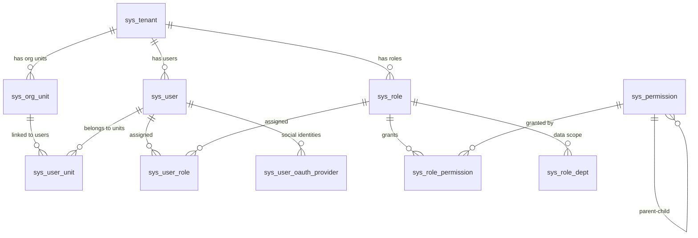

# System Architecture

> This document is the complete technical reference for Omni-Stack system architecture. It covers system positioning, technology selection rationale, module map, local architecture design, data flows, Docker deployment architecture, and extension guides.  
> For Docker deployment details, see [docker-deployment.en.md](docker-deployment.en.md).

---

## Table of Contents

- [1. System Positioning](#1-system-positioning)
- [2. Technology Selection Rationale](#2-technology-selection-rationale)
- [3. System Boundaries](#3-system-boundaries)
- [4. Module Map](#4-module-map)
- [5. Dependency Graph](#5-dependency-graph)
- [6. Local Architecture Design](#6-local-architecture-design)
- [7. Data Flow](#7-data-flow)
- [8. External Dependencies](#8-external-dependencies)
- [9. Infrastructure](#9-infrastructure)
- [10. Docker Deployment Architecture](#10-docker-deployment-architecture)
- [11. RBAC Permission System](#11-rbac-permission-system)
- [12. Key Constraints](#12-key-constraints)
- [13. Extension Points](#13-extension-points)
- [14. Tutorial: Onboarding a New Microservice](#14-tutorial-onboarding-a-new-microservice)

---

## 1. System Positioning

Omni-Stack is a microservices scaffolding platform providing a ready-to-use Spring Cloud + Vue 3 full-stack development environment. Teams can rapidly build business systems on a standardized, production-grade infrastructure.

**Core Design Philosophy**:

- **Harness Pattern**: Architecture → Patterns → Code three-tier progression, where architectural decisions drive code conventions
- **Common Starter Ecosystem**: 8 auto-configuration modules enabling zero-config infrastructure access for new services
- **Gateway-Centralized Authentication**: JWT verification concentrated at the gateway, with downstream services receiving identity via a trusted header chain
- **Transactional Outbox**: MQ message reliability guaranteed through a local transaction table + asynchronous relay

---

## 2. Technology Selection Rationale

### 2.1 Why Spring Boot 4 + JDK 25

| Consideration | Decision Rationale |
|--------------|-------------------|
| **Jakarta EE 11** | Spring Boot 4 is based on Jakarta EE 11; `jakarta.*` packages are standard with no migration cost |
| **Virtual Threads** | JDK 25's virtual threads are mature and stable, ideal for I/O-intensive microservice scenarios (database queries, HTTP calls) |
| **Spring Security 7** | SAS (Spring Authorization Server) deeply integrates with Spring Security 7, with native OAuth2 + OIDC support |
| **GraalVM Compatible** | Spring Boot 4's AOT compilation support is more mature; Native Image can be chosen in the future to reduce startup time and memory footprint |

### 2.2 Why Spring Cloud Gateway 5.x (WebFlux)

| Consideration | Decision Rationale |
|--------------|-------------------|
| **Reactive Model** | Gateway is an I/O-intensive routing proxy; WebFlux's Netty event loop model is more efficient than Servlet thread pools |
| **Sleuth → Micrometer** | Gateway 5.x uses Micrometer Tracing, consistent with Spring Boot 4's observability ecosystem |
| **Route DSL** | The `spring.cloud.gateway.server.webflux.routes` config prefix, though verbose, provides declarative routing + filter chains |
| **Caveat** | Config prefix must be `spring.cloud.gateway.server.webflux`; the old prefix `spring.cloud.gateway` is silently ignored |

### 2.3 Why Nacos v3.1.1

| Consideration | Decision Rationale |
|--------------|-------------------|
| **Service Discovery + Config Center in One** | Compared to Eureka (discovery only) + Config Server (config only), Nacos solves both problems with a single component |
| **MySQL External Storage** | Nacos v3 supports MySQL persistence (`nacos_config` database), avoiding embedded Derby's single-point limitations |
| **gRPC Long Connections** | v3 uses gRPC instead of HTTP short polling, reducing service registration/discovery latency from seconds to milliseconds |
| **Health Check Endpoint Change** | v3.1.1 changed the endpoint from `/nacos/actuator/health` to `GET /nacos/`, requiring Docker healthcheck adaptation |

### 2.4 Why Flowable 7.x

| Consideration | Decision Rationale |
|--------------|-------------------|
| **Open-Source BPMN Engine** | Flowable is a fork of Activiti with higher community activity and more mature Spring Boot integration |
| **Native Multi-Instance (MI) Support** | Countersign approval requires MI features; Flowable's `completionCondition` mechanism is a natural fit |
| **Version 7.x Refactoring** | 7.x refactored the API layer with better compatibility for Spring Boot 3/4 |
| **vs Camunda** | Camunda 8.x shifted to Zeebe (distributed engine) with a steeper learning curve; Flowable maintains the embedded engine model, better suited for small-to-medium scale |

### 2.5 Why XXL-JOB over Quartz

| Consideration | Decision Rationale |
|--------------|-------------------|
| **Visual Management** | XXL-JOB Admin provides a web console supporting task CRUD, manual triggering, and execution log viewing |
| **Distributed Scheduling** | XXL-JOB's scheduler is an independent process; executors (business services) are stateless and naturally horizontally scalable |
| **Existing Project Dependency** | The project already uses XXL-JOB for scheduled tasks; MQ message relay reuses the same scheduling engine without introducing new dependencies |
| **vs Quartz** | Quartz requires a database for scheduling metadata; cluster mode depends on database locks, increasing operational complexity |

---

## 3. System Boundaries

| Boundary | Omni-Stack Frontend (omni-frontend) | Omni-Stack Backend (omni-backend) |
|----------|--------------------------------------|-----------------------------------|
| Responsibility | Presentation, interaction, routing, form UX, user state rendering | Business rules, permission checks, data consistency, persistence, audit |
| Prohibited | Must not contain business logic affecting data correctness | Must not contain presentation logic or UI concerns |
| Validation | Client-side UX validation (required fields, format hints) | Server-side authoritative validation (Jakarta Bean Validation) |

---

## 4. Module Map

### 4.1 Common Starter Ecosystem (8 Auto-Configuration Modules)

| Module | Role | Technology | Boundary Constraint |
|--------|------|------------|---------------------|
| `omni-common-core` | Pure POJO: `R<T>`, `PageResult`, `BaseEntity`, `BusinessException`, XSS SPI (`XssConfigProvider`), `UserJobHandler` SPI | Lombok, Jackson JSR310 | **Zero Spring dependencies**; no framework annotations |
| `omni-common` | Web auto-config: Jackson time config, CORS, `GlobalExceptionHandler`, XSS Filter/Sanitizer/Deserializer | Spring Boot Web (optional), Validation (optional) | No business logic; cross-cutting web concerns only |
| `omni-common-mybatis` | MyBatis-Plus Starter: pagination interceptor, MySQL driver, YAML defaults | MyBatis-Plus 3.5.16, MySQL Connector | `@ConditionalOnMissingBean` allows service-level override |
| `omni-common-redis` | Blocking Redis Starter: `RedisTemplate` (Jackson serialization) + `RedisUtils` | Spring Data Redis (Lettuce), commons-pool2 | **Servlet services only**; never in WebFlux |
| `omni-common-redis-reactive` | Reactive Redis Starter: `spring-boot-starter-data-redis-reactive` + YAML defaults | Spring Data Redis Reactive | **WebFlux services only**; never in Servlet |
| `omni-common-job` | XXL-JOB integration: auto-configuration, admin HTTP client, system job registry, job metadata annotations | XXL-JOB Core 3.3.1, Spring Boot Web (optional) | Scheduling infrastructure only; no business task logic |
| `omni-common-mqlog` | Reliable MQ message sending: Transactional Outbox, relay job, strategy-based sender, internal query API | Spring Cloud Stream RocketMQ (optional), omni-common-job (optional) | MQ infrastructure only; no business message logic |
| `omni-common-operlog` | Operation log aspect and producer: `@OperLog` annotation-driven, supports both reliable and direct sending modes | Spring AOP, omni-common-mqlog (optional) | Operation log concern only |

### 4.2 Microservice Modules (4)

| Module | Port | Role | Core Dependencies |
|--------|------|------|-------------------|
| `omni-auth` :8100 | 8100 | Authentication & authorization: login, captcha, JWT, multi-tenant, OAuth2 Authorization Server, XSS config management, RBAC permissions, online user management | Spring Boot Web, Spring Security, OAuth2 Authorization Server |
| `omni-base` :8101 | 8101 | Base data management: dictionary CRUD, scheduled tasks (system + user), operation log archival, MQ message management | Spring Boot Web, Spring Security, mybatis, redis, job, mqlog |
| `omni-workflow` :8103 | 8103 | Workflow engine: BPMN model management, process instances, approvals, task assignment, statistics | Spring Boot Web, Spring Security, omni-common-workflow, Flowable 7.x |
| `omni-gateway` :8102 | 8102 | API Gateway: request routing, JWT authentication filtering, CORS handling, security headers | Spring Cloud Gateway Server (WebFlux), omni-common-redis-reactive |

### 4.3 Frontend Module

| Module | Port | Technology Stack | Role |
|--------|------|-----------------|------|
| `omni-frontend` | 3000 (dev) / 3000 (Nginx) | Vue 3, Pinia 3, Vue Router 4, Element Plus, Axios, Vite 8 | Presentation-layer SPA; no data-authoritative business rules |

---

## 5. Dependency Graph

```
omni-common-core  (pure POJO: R<T>, PageResult, BaseEntity, XSS SPI, UserJobHandler SPI — zero Spring deps)
    ^          ^          ^          ^          ^
    |          |          |          |          |
omni-common  omni-common-mybatis  omni-common-redis   omni-common-redis-reactive   omni-common-job
(Web auto-   (MyBatis-Plus +      (blocking Redis +    (reactive Redis,            (XXL-JOB integration:
 config)      MySQL driver)        RedisUtils)           standalone)                auto-config, admin client,
    ^   ^          ^    ^              ^    ^                   ^                    system job registry)
    |   |          |    |              |    |                   |                          ^
    |   +----------+----+--------------+----+                  |                          |
    |                     |                                     |                          |
omni-auth :8100     omni-base :8101                     omni-gateway :8102
(Servlet, Security,  (Servlet, Security,                 (WebFlux, depends on
 OAuth2 Auth Server)  Dictionary CRUD,                   core + redis-reactive,
    |                 Scheduling tasks)                    NOT omni-common)
    |                    |                                     |
    +-- registers with Nacos --+                               |
                               |                               |
omni-gateway --- routes via lb:// ---> omni-auth, omni-base, omni-workflow
    |
omni-frontend --- /api proxy :3000 ---> omni-gateway :8102

omni-base --- XxlJobAdminClient (HTTP) ---> XXL-JOB Admin :18080
```

**Build dependency order**: `omni-common-core` → `omni-common` → `omni-common-mybatis` / `omni-common-redis` / `omni-common-redis-reactive` → `omni-auth` / `omni-base` / `omni-workflow` / `omni-gateway`. Maven reactor automatically resolves ordering from `<modules>` declaration.

### Module-to-Whole Relationship

Each module plays a clearly defined role in the overall architecture:

| Module | Contribution to the Whole |
|--------|--------------------------|
| `omni-common-core` | **Foundation layer**: Shared POJO definitions and SPI interfaces across all modules; zero framework dependency ensures portability |
| `omni-common-*` starters | **Auto-configuration layer**: Zero-config access via `AutoConfiguration.imports`; new services only need to add Maven dependencies |
| `omni-auth` | **Security hub**: Centralized authentication, authorization, and JWT issuance; the trust chain origin for the entire system |
| `omni-gateway` | **Traffic entry**: The sole entry point for all HTTP requests; JWT verification + identity propagation + route distribution |
| `omni-base` | **Data foundation**: Central management of dictionary, logs, scheduled tasks, and other shared business data |
| `omni-workflow` | **Process engine**: Independently deployed BPMN workflow service; Flowable dependencies isolated via `omni-common-workflow` starter |

---

## 6. Local Architecture Design

### 6.1 omni-auth Security Filter Chain

As the authentication and authorization hub, omni-auth maintains two independent security filter chains internally:

```
┌─────────────────────────────────────────────────────────────────────┐
│ Chain 1 (Order 1): OAuth2 Authorization Server Endpoints            │
│ securityMatcher: /oauth2/**, /login, /.well-known/**                │
│                                                                     │
│ Request → SecurityContextPersistenceFilter                          │
│         → DeviceClientAuthenticationFilter (public client auth)     │
│         → DeviceRedirectFilter (device authorization redirect)      │
│         → OAuth2AuthorizationEndpointFilter (auth code issuance)    │
│         → OAuth2TokenEndpointFilter (token issuance/refresh)        │
│                                                                     │
│ Session policy: STATELESS (OAuth2 endpoints are stateless)          │
├─────────────────────────────────────────────────────────────────────┤
│ Chain 2 (Order 2): Business API Endpoints                           │
│ securityMatcher: NOT /oauth2/**                                     │
│                                                                     │
│ Request → GatewayPreAuthFilter (builds Authentication from          │
│                                  X-User-* headers)                  │
│         → DataScopeResolveFilter (@Order(0), resolves data scope)   │
│         → AuthorizationFilter (@PreAuthorize method-level check)    │
│                                                                     │
│ Session policy: STATELESS (API requests don't create HttpSession)   │
│ Auth whitelist: /api/auth/**, /actuator/**, /error                 │
└─────────────────────────────────────────────────────────────────────┘
```

**Key Component Interactions**:

| Component | Location | Responsibility |
|-----------|----------|---------------|
| `AuthorizationServerConfig` | omni-auth/config | Dual filter chain config, JWK key source (RSA 2048), OAuth2 client registration |
| `OmniUserDetailsService` | omni-auth/security | Multi-tenant user loading (`tenantId:username` format) |
| `GatewayPreAuthFilter` | omni-auth/security | Builds `Authentication` from Gateway-forwarded headers (X-User-Id/Name/Tenant/Roles/Scopes) |
| `DataScopeResolveFilter` | omni-auth/security | Resolves user data permission scope, writes to `DataScopeContext` (ThreadLocal) |
| `DeviceClientAuthenticationFilter` | omni-auth/security | RFC 8628 device code grant public client authentication |
| `JwtTokenService` | omni-auth/service | RS256-signed JWT generation |

### 6.2 omni-gateway WebFlux Pipeline

The Gateway is built on Spring Cloud Gateway's reactive WebFlux technology stack. The request processing pipeline:

```
HTTP Request In
    │
    ▼
CorsConfig (CorsWebFilter)
    │ Handles OPTIONS preflight requests, adds CORS headers
    │ Higher priority than AuthFilter to prevent preflight interception
    ▼
AuthFilter (GlobalFilter, order=-100)
    │ 1. Whitelist paths pass through (/api/auth/login, /oauth2/**, /actuator/**)
    │ 2. Extract Authorization: Bearer <JWT> header
    │ 3. JwkKeyProvider fetches RSA public key (WebClient → omni-auth:8080/oauth2/jwks, cached 5 min)
    │ 4. RSASSAVerifier verifies JWT signature (RS256)
    │ 5. Check expiration time
    │ 6. Check token blacklist (ReactiveStringRedisTemplate → Redis)
    │ 7. Extract claims, inject forwarded request headers:
    │    X-User-Id, X-User-Name, X-Tenant-Id, X-User-Roles, X-User-Scopes
    ▼
SecurityHeadersFilter (WebFilter)
    │ Adds security headers: X-Content-Type-Options, X-Frame-Options, Referrer-Policy
    ▼
Spring Cloud Gateway Route Engine
    │ 1. Route matching: Path=/api/auth/** → lb://omni-auth
    │ 2. StripPrefix=2: /api/auth/login → /login
    │ 3. Load balancing: fetch instance list from Nacos service discovery
    ▼
Forward to downstream microservice (omni-auth / omni-base / omni-workflow)
```

**Key Design Decisions**:

- **JwkKeyProvider uses `WebClient.create()`**: WebFlux environment doesn't auto-configure `WebClient.Builder` bean, so it's created manually
- **Public key cached 5 minutes**: Avoids calling the JWKS endpoint on every request; `volatile` ensures multi-thread visibility
- **`onErrorResume` catches only `SecurityException`**: Prevents downstream routing errors (service unavailable, timeout) from being misreported as JWT verification failures

### 6.3 omni-base / omni-workflow Security Model

Downstream microservices (base, workflow) adopt a unified **gateway pre-authentication model**:

```
Request enters (already JWT-verified by Gateway)
    │
    ▼
GatewayPreAuthFilter (OncePerRequestFilter)
    │ Builds UsernamePasswordAuthenticationToken from X-User-* headers
    │ Roles get ROLE_ prefix, permissions added directly as authority
    │ Written to SecurityContextHolder
    ▼
AuthorizationFilter
    │ @PreAuthorize("hasAuthority('dict:type:list')") method-level permission check
    ▼
Business Controller → Service → Mapper
```

**Design Rationale**: JWT verification is centralized at the Gateway; downstream services trust the headers injected by the Gateway. This way, each service doesn't need independent JWT verification configuration, reducing complexity and key management overhead.

---

## 7. Data Flow

### 7.1 User Login Request Flow

```
Browser (Vue SPA)
    │  HTTP request (e.g., POST /api/auth/login)
    ▼
Vite Dev Server (:3000)  -- proxy /api/** -->
    │
Gateway (:8102)
    │  1. Route matching: Path=/api/auth/** -> lb://omni-auth
    │  2. StripPrefix=2: /api/auth/login -> /login
    ▼
Auth Service (:8100)
    │  1. AuthController receives /login
    │  2. CaptchaService validates captcha (Redis)
    │  3. OmniUserDetailsService authenticates user (multi-tenant tenantId:username)
    │  4. JwtTokenService generates RS256-signed JWT
    │  5. Response wrapped in R<T>
    ▼
JSON Response: { code: 200, message: "success", data: { accessToken, tokenType, expiresIn } }
    │
Browser stores JWT and uses it for subsequent authenticated requests
```

### 7.2 MQ Reliable Message Delivery Flow

```
Business Service (e.g., omni-base)
    │  @Transactional
    │  ReliableMessageTemplate.send(bindingName, payload)
    ▼
sys_mq_message table (status=PENDING, same local transaction)
    │
    │  XXL-JOB mqRelayHandler (every 10s)
    ▼
MqMessageRelayService.relayAll()
    │  1. SELECT * FROM sys_mq_message WHERE status IN (PENDING, FAILED) AND next_retry_time <= NOW() LIMIT 100
    │  2. MessageSender.send(message) — strategy pattern by broker_type
    │  3a. Success → status=SENT
    │  3b. Failure → retry_count++, next_retry_time = NOW() + 2^retryCount * 10s
    │      Exceeds max_retry → status=DEAD_LETTER, error_msg recorded
    ▼
RocketMQ Broker (via StreamBridge)
    │
    │  Admin UI (omni-base MqMessageController)
    ▼
Monitoring Page: query/resend/skip dead-letter messages
```

> See [mq-reliability.en.md](mq-reliability.en.md) for details.

---

## 8. External Dependencies

| Service | Purpose | Version | Port |
|---------|---------|---------|------|
| MySQL | Primary relational database (Auth + RBAC + business data) | 8.4 | 3306 |
| Redis | Captcha storage, session cache, token blacklist | 7.4 | 6379 |
| Nacos Server | Service discovery + configuration center | v3.1.1 | 8080, 8848, 9848 |
| Sentinel Dashboard | Flow control + circuit breaking dashboard | 1.8.8 | 8858 |
| XXL-JOB Admin | Distributed task scheduling console | 3.3.1 | 18080 |
| RocketMQ | Message queue (NameServer + Broker) | 5.3.2 | 9876, 10909-10912 |

All services can be started with a single command: `docker compose up -d`. See `docker-compose.yml` in the project root.

**Start order**: MySQL → Redis → Nacos → RocketMQ → XXL-JOB Admin → Backend services (Auth, Base, Workflow, Gateway) → Frontend

---

## 9. Infrastructure

### 9.1 Docker Compose Orchestration

The project root `docker-compose.yml` defines all 12 containers:

- **Named volumes** (`mysql-data`, `redis-data`) for data persistence across restarts
- **Health checks** (depends_on + service_healthy) ensuring layered startup chain
- **Bridge network** (`omni-network`) for inter-container communication
- **Migration startup gate**: the one-shot `omni-db-migrator` applies Liquibase structure and idempotent seeds for all nine databases; Nacos, XXL-JOB, and applications start only after it succeeds

### 9.2 Database Schema

#### omni_auth Database (14 tables)

**OAuth2 Authorization (3 tables)**:

| Table | Purpose |
|-------|---------|
| `oauth2_registered_client` | OAuth2 client registrations (client_id, secrets, grant types, scopes) |
| `oauth2_authorization` | Active OAuth2 authorization records (access tokens, refresh tokens, authorization codes) |
| `oauth2_authorization_consent` | User-consented scopes per client |

**Multi-Tenant RBAC (11 tables)**:

| Table | Purpose |
|-------|---------|
| `sys_tenant` | Tenant registry (multi-tenancy root) |
| `sys_org_unit` | Organizational units with materialized path hierarchy |
| `sys_user` | User accounts (linked to tenant + org unit) |
| `sys_role` | Role definitions (scoped to tenant) |
| `sys_permission` | Permission tree (menu, button, API; materialized path) |
| `sys_user_role` | User-to-role assignments |
| `sys_role_permission` | Role-to-permission assignments |
| `sys_user_unit` | User-to-org-unit assignments (primary/secondary) |
| `sys_role_dept` | Role-to-department data scope bindings |
| `sys_token_blacklist` | Revoked JWT token blacklist |
| `sys_user_oauth_provider` | Third-party social login identity linking |
| `sys_xss_config` | Per-tenant XSS global toggle |
| `sys_xss_blacklist_rule` | XSS blacklist rules |



#### omni_base Database

**Data Dictionary (2 tables)**: `sys_dict_type` (type registry) + `sys_dict_data` (data entries)

**Scheduled Tasks (3 tables)**: `sys_user_job_type` (task type catalog) + `sys_user_job` (user task instances) + `sys_user_job_log` (execution history)

> See [scheduling.en.md](scheduling.en.md) for details.

#### omni_workflow Database

**Workflow (7 tables)**: `wf_process_model` (model registry) + `wf_process_model_version` (version history) + `wf_process_instance_ext` (instance extension) + `wf_todo_task` (pending task cache) + `wf_cc_record` (CC records) + `wf_form_schema` (form schemas) + `wf_delegation_rule` (delegation rules)

> See [workflow.en.md](workflow.en.md) for details.

**Authoritative database sources**: `database/changelog/` owns schema, indexes, constraints, and upgrades. `scripts/sql/seed/` owns formal idempotent seeds, guarded by source SHA-256 values and natural-key assertions in `database/seed/manifest.yaml`. `scripts/sql/init-all.sql` is a compatibility-era legacy file and is not used by Compose initialization.

---

## 10. Docker Deployment Architecture

### 10.1 Container Network Topology

All containers share a Docker Bridge network `omni-network`:

```
┌───────────────────────────────────────────────────────────────────────┐
│                      Docker Network: omni-network                     │
│                                                                       │
│  ┌─────────────┐    ┌──────────┐    ┌────────┐    ┌──────────────┐  │
│  │ omni-       │    │ omni-    │    │ omni-  │    │ omni-        │  │
│  │ frontend    │───>│ gateway  │───>│ auth   │    │ workflow     │  │
│  │ :3000       │    │ :8080    │    │ :8080  │    │ :8080        │  │
│  │ (Nginx)     │    │ (WebFlux)│    │        │    │              │  │
│  └─────────────┘    └────┬─────┘    └───┬────┘    └──────────────┘  │
│                          │              │                             │
│                          │    ┌─────────┤    ┌──────────────┐       │
│                          └───>│ omni-   │    │ omni-        │       │
│                               │ base    │    │ common-job   │       │
│                               │ :8080   │    │ (XXL-JOB     │       │
│                               └────┬────┘    │  executor)   │       │
│                                    │         └──────────────┘       │
│  ┌────────┐  ┌────────┐  ┌────────┐  ┌──────────────┐  ┌────────┐ │
│  │ MySQL  │  │ Redis  │  │ Nacos  │  │ RocketMQ     │  │XXL-JOB │ │
│  │ :3306  │  │ :6379  │  │ :8848  │  │ NS:9876      │  │:8080   │ │
│  │        │  │        │  │ :9848  │  │ Broker:10909 │  │        │ │
│  └────────┘  └────────┘  └────────┘  └──────────────┘  └────────┘ │
└───────────────────────────────────────────────────────────────────────┘
        ↕ Host port mapping
   :3000    :8100-8103   :3306  :6379  :8080  :8848  :19876  :18080
```

### 10.2 Service Discovery Mechanism

```
omni-auth starts
    │ @EnableDiscoveryClient
    │ spring.cloud.nacos.discovery.server-addr = nacos:8848
    ▼
Nacos registration: service=omni-auth, ip=<container-internal-IP>, port=8080
    │
omni-gateway starts
    │ @EnableDiscoveryClient
    │ spring.cloud.gateway.server.webflux.discovery.locator.enabled=true
    ▼
Gateway routing: lb://omni-auth → query Nacos for instance list → load-balanced forwarding
```

**Key Configuration**:
- `SPRING_CLOUD_NACOS_DISCOVERY_IP: ""` — lets Nacos auto-detect the container-internal IP
- Docker internal communication uses **container-internal port 8080**, not the host-mapped port

### 10.3 Environment Variable Override Strategy

Spring Boot environment variables take precedence over `application.yml`; Docker deployment makes extensive use of this mechanism:

| Environment Variable | Overrides | Example Value |
|---------------------|-----------|---------------|
| `SPRING_DATASOURCE_URL` | `spring.datasource.url` | `jdbc:mysql://mysql:3306/omni_auth` |
| `SPRING_DATA_REDIS_HOST` | `spring.data.redis.host` | `redis` |
| `SPRING_CLOUD_NACOS_DISCOVERY_SERVER_ADDR` | `spring.cloud.nacos.discovery.server-addr` | `nacos:8848` |
| `AUTH_JWKS_URI` | `auth.jwks.uri` | `http://omni-auth:8080/oauth2/jwks` |
| `SERVER_PORT` | `server.port` | `8080` |

> Complete environment variable override table: see [docker-deployment.en.md](docker-deployment.en.md) Section 6.

---

## 11. RBAC Permission System

### 11.1 Design Philosophy

Omni-Stack adopts the **RBAC-0 basic permission model** (User-Role-Permission), divided into two independent but complementary subsystems:

1. **Functional Permission**: Controls what users "can do" — menu visibility + button/API-level operation permissions
2. **Data Permission**: Controls what data users "can see" — row-level filtering based on organizational membership

In multi-tenant scenarios, usernames are unique within a tenant (the `sys_user` table uses a `(username, tenant_id)` composite unique key), with permission codes in `resource:action` format (fine-grained API level).

### 11.2 Functional Permission Architecture

Functional permission is implemented as **menu filtering + button-level control + API authorization** three-layer defense:

```
┌─────────────────────────────────────────────────────────────┐
│ Layer 1: Dynamic Menu Filtering (MenuController)            │
│ Backend recursively filters the permission tree based on    │
│ user permissions, returning only DIRECTORY (with visible    │
│ children) and MENU (with permission codes) nodes            │
│ → Frontend dynamically registers routes + renders sidebar   │
├─────────────────────────────────────────────────────────────┤
│ Layer 2: Button-Level Control (v-permission directive)      │
│ Vue custom directive v-permission="'system:user:create'"    │
│ Queries permission codes from PermissionStore, hides        │
│ unauthorized buttons via display:none                       │
├─────────────────────────────────────────────────────────────┤
│ Layer 3: API Authorization (Spring Security @PreAuthorize)  │
│ Controller methods declare @PreAuthorize("hasAuthority()")  │
│ Spring Security validates JWT permission set before method  │
└─────────────────────────────────────────────────────────────┘
```

**Permission Tree Structure** (`sys_permission` table, materialized path):

| Node Type | Purpose | Example |
|-----------|---------|---------|
| `DIRECTORY` | Menu group directory | "System Management" |
| `MENU` | Routable menu page | "User Management" (path: /system/user) |
| `BUTTON` | Button/API operation | "Create User" (code: system:user:create) |
| `API` | Fine-grained API endpoint | "GET /api/auth/user/list" |

### 11.3 Data Permission Architecture

Data permission is based on **MyBatis-Plus `DataPermissionInterceptor`** for automatic SQL interception, with zero intrusion into business code.

**Six-Level Data Scope (dataScope)**:

| Level | dataScope Value | Meaning | Priority |
|-------|----------------|---------|----------|
| Most permissive | `ALL` | All data (cross-tenant) | 1 |
| | `TENANT` | All data within current tenant | 2 |
| | `DEPT_AND_BELOW` | Current department and all subordinates | 3 |
| | `DEPT` | Current department only | 4 |
| | `CUSTOM` | Custom department set (`sys_role_dept` join table) | 5 |
| Most restrictive | `SELF` | Own data only | 6 |

**Multi-role merge rule**: Most permissive wins — when a user has multiple roles, the dataScope with the smallest priority value is used.

**Request-level data flow**:

```
HTTP Request (with X-User-Id, X-Tenant-Id headers)
    │
    ▼
DataScopeResolveFilter (OncePerRequestFilter, @Order(0))
    │ 1. Extract userId, tenantId from headers
    │ 2. Query all user roles → sys_role_mapper.selectRolesByUserId()
    │ 3. Merge all roles' dataScope → take most permissive
    │ 4. Resolve accessible org unit ID set (DEPT*/CUSTOM query materialized path descendants)
    │ 5. Write to DataScopeContext (ThreadLocal)
    ▼
MyBatis-Plus DataPermissionInterceptor
    │ Intercepts sys_user table SELECT queries
    │ Calls DataPermissionHandlerImpl.getSqlSegment()
    │ Auto-appends WHERE conditions based on effectiveScope:
    │   ALL/TENANT → no append
    │   SELF       → WHERE sys_user.id = {userId}
    │   DEPT*/CUSTOM → WHERE sys_user.primary_unit_id IN (...)
    ▼
Business Code (Controller → Service → Mapper)
    │ Zero intrusion; no awareness of data permission required
    ▼
DataScopeContext.clear() (finally block, prevents ThreadLocal leak)
```

**Two Filtering Modes**:

| Mode | Use Case | Implementation |
|------|----------|---------------|
| SQL Interception | Database queries (e.g., user list) | `DataPermissionInterceptor` + `DataPermissionHandlerImpl` auto-appends WHERE |
| In-Memory Filtering | Non-DB data (e.g., online users in Redis) | Controller reads `DataScopeContext`, filters by `primaryUnitId` |

### 11.4 RBAC Management Flows

- **Role Management**: Create role → Assign permissions (`sys_role_permission`) → Set data scope (`sys_role.data_scope`) → Custom departments (`sys_role_dept`, CUSTOM scope only)
- **User Authorization**: Create user → Assign roles (`sys_user_role`) → Assign org units (`sys_user_unit`, mark primary)
- **Menu Rendering**: Login → JWT contains permission codes → Frontend calls `/api/auth/menus` → Backend recursive filtering → Frontend dynamic route registration
- **Data Query**: Request → Gateway injects identity headers → Filter resolves data scope → MyBatis-Plus auto-appends SQL → Returns filtered data

> Complete RBAC flow sequence diagrams: see [core-flows.en.md](core-flows.en.md)

---

## 12. Key Constraints

1. **JDK 25 required**: Spring Boot 4.x Maven plugin requires Java 17+; this project targets JDK 25. `JAVA_HOME` must be set before running any Maven commands.
2. **Gateway 5.x config prefix**: Routes and settings must be under `spring.cloud.gateway.server.webflux`, NOT `spring.cloud.gateway` (the old prefix is silently ignored).
3. **Build order**: `omni-common-core` must be installed first, followed by `omni-common`, then the common starters. Use `./mvnw clean install` from the parent POM — Maven reactor resolves ordering automatically.
4. **No direct service-to-service calls**: Inter-service communication must go through OpenFeign clients, never raw HTTP calls.
5. **Gateway is reactive**: `omni-gateway` runs on WebFlux. It depends on `omni-common-core` (POJO only) and `omni-common-redis-reactive`, but NOT on `omni-common` or `omni-common-redis` (blocking Redis would starve Netty event loop threads).
6. **Redis starter exclusivity**: `omni-common-redis` (blocking) and `omni-common-redis-reactive` (reactive) must not be mixed in the same service. Servlet services use blocking; WebFlux services use reactive.
7. **XXL-JOB Admin must be running** before `omni-base` starts. The `XxlJobSpringExecutor` registers with Admin on startup; user task creation/updates require `XxlJobAdminClient` HTTP calls.
8. **omni-common-job is a library module** — it cannot run independently. Only Servlet services should depend on it. WebFlux services must not depend on it (XXL-JOB executor uses blocking I/O).

---

## 13. Extension Points

### 13.1 Adding a New OAuth2 Social Login Provider

The social login framework uses the Strategy Pattern via `OAuth2ProviderHandler` interface. Adding a new provider requires:

1. **Create handler implementation**: Create `XxxOAuth2Handler.java` implementing `OAuth2ProviderHandler`, annotated with `@Component("xxx")`. Implement `getProviderId()`, `buildAuthorizationUrl()`, `exchangeCodeForAccessToken()`, and `fetchUserProfile()` (returning the unified `ProviderUser` DTO).
2. **Add configuration**: Add a new `XxxProperties` inner static class in `OAuth2Properties.java`.
3. **Configure credentials**: Add `auth.oauth2.xxx.*` section in `application.yml`.
4. **Add username prefix**: Add a case in `SocialLoginServiceImpl.getUsernamePrefix()` switch expression.

`SocialLoginServiceImpl` automatically discovers new handlers via Spring's `Map<String, OAuth2ProviderHandler>` injection.

**Currently implemented**: GitHub, Google, Gitee.

> See [core-flows.en.md](core-flows.en.md) Flow 4 for details.

### 13.2 Adding XSS Protection to a New Service

The XSS defense system is modular — new services inherit protection by depending on the Common Starter ecosystem:

1. Add `omni-common-core` + `omni-common` dependencies
2. Implement `XssConfigProvider` SPI interface
3. Use Redis caching strategy (`xss:enabled:{tenantId}` + `xss:rules:{tenantId}`, 30-minute TTL)
4. `XssAutoConfiguration` is registered via `AutoConfiguration.imports` — no manual `@ComponentScan` needed

### 13.3 Adding a New User Task Type

The user task system uses an SPI pattern via `UserJobHandler`:

1. INSERT into `sys_user_job_type` to register the task type (unique `type_code`, maps to Bean name)
2. Create a `@Component("{type_code}")` class implementing `UserJobHandler`
3. `UserJobHandlerRegistry` auto-discovers all implementations via `Map<String, UserJobHandler>` injection

> Complete tutorial: see [scheduling.en.md](scheduling.en.md) Chapter 4.

---

## 14. Tutorial: Onboarding a New Microservice

The following example creates `omni-order` (order service) to demonstrate the complete onboarding steps.

### 14.1 Create Maven Module

```
omni-backend/
└── omni-order/                    # New module
    ├── pom.xml
    └── src/main/java/com/omni/order/
        ├── OrderApplication.java
        ├── controller/
        ├── service/
        ├── mapper/
        ├── entity/
        └── config/
```

### 14.2 Configure POM Dependencies

```xml
<dependencies>
    <!-- Required Common Starters -->
    <dependency>
        <groupId>com.omni</groupId>
        <artifactId>omni-common-core</artifactId>   <!-- R<T>, PageResult -->
    </dependency>
    <dependency>
        <groupId>com.omni</groupId>
        <artifactId>omni-common</artifactId>         <!-- Web auto-config + XSS -->
    </dependency>
    <dependency>
        <groupId>com.omni</groupId>
        <artifactId>omni-common-mybatis</artifactId> <!-- MyBatis-Plus + MySQL -->
    </dependency>
    <dependency>
        <groupId>com.omni</groupId>
        <artifactId>omni-common-redis</artifactId>   <!-- Redis cache -->
    </dependency>
    <!-- Add as needed -->
    <dependency>
        <groupId>com.omni</groupId>
        <artifactId>omni-common-job</artifactId>     <!-- If scheduled tasks needed -->
    </dependency>
</dependencies>
```

### 14.3 Register in Parent POM

Add to `omni-backend/pom.xml` `<modules>`:

```xml
<modules>
    <!-- existing modules... -->
    <module>omni-order</module>
</modules>
```

### 14.4 Configure application.yml

```yaml
server:
  port: 8104                        # Unique port

spring:
  application:
    name: omni-order                # Nacos service name
  datasource:
    url: jdbc:mysql://localhost:3306/omni_order?...
    username: root
    password: root
  data:
    redis:
      host: 127.0.0.1
      port: 6379
      database: 4                   # Dedicated Redis DB
  cloud:
    nacos:
      discovery:
        server-addr: ${NACOS_SERVER_ADDR:127.0.0.1:8848}
        ip: 127.0.0.1
```

### 14.5 Add Gateway Route

Add to `omni-gateway/application.yml`:

```yaml
- id: omni-order
  uri: lb://omni-order
  predicates:
    - Path=/api/order/**
  filters:
    - StripPrefix=2
```

### 14.6 Add Permission Seed Data

Add idempotent `sys_permission` records in `scripts/sql/seed/auth.sql`, then refresh its checksum and natural-key assertions in `database/seed/manifest.yaml`:

```sql
INSERT INTO sys_permission (tenant_id, parent_id, name, code, type, path, ...) VALUES
(1, 0, 'Order Management', NULL, 'DIRECTORY', '/order', ...),
(1, @order_dir, 'Order List', 'order:list:page', 'MENU', 'list', ...),
(1, @order_list, 'View Order', 'order:detail:query', 'BUTTON', NULL, ...);
```

### 14.7 Docker Deployment Configuration

Add service definition to `docker-compose.yml`:

```yaml
omni-order:
  build:
    context: ./omni-backend
    dockerfile: ../docker/backend/Dockerfile
    args:
      SERVICE_NAME: omni-order
  ports:
    - "8104:8080"
  environment:
    SERVER_PORT: "8080"
    SPRING_DATASOURCE_URL: "jdbc:mysql://mysql:3306/omni_order?..."
    SPRING_DATA_REDIS_HOST: redis
    SPRING_CLOUD_NACOS_DISCOVERY_SERVER_ADDR: nacos:8848
  depends_on:
    nacos: { condition: service_healthy }
    redis: { condition: service_healthy }
    mysql: { condition: service_healthy }
```

### 14.8 Verification Checklist

- [ ] `mvn clean install` compiles successfully
- [ ] Service visible in Nacos console after local startup
- [ ] `GET /api/order/xxx` routes successfully through Gateway
- [ ] `@PreAuthorize` annotations work (requires `GatewayPreAuthFilter`)
- [ ] XSS protection auto-configured (depends on `omni-common`)
- [ ] MyBatis-Plus pagination auto-configured

> MyBatis-Plus pagination, Jackson time config, CORS, `GlobalExceptionHandler`, and XSS Filter all auto-configure via `AutoConfiguration.imports` — no manual `@ComponentScan("com.omni.common")` needed.
