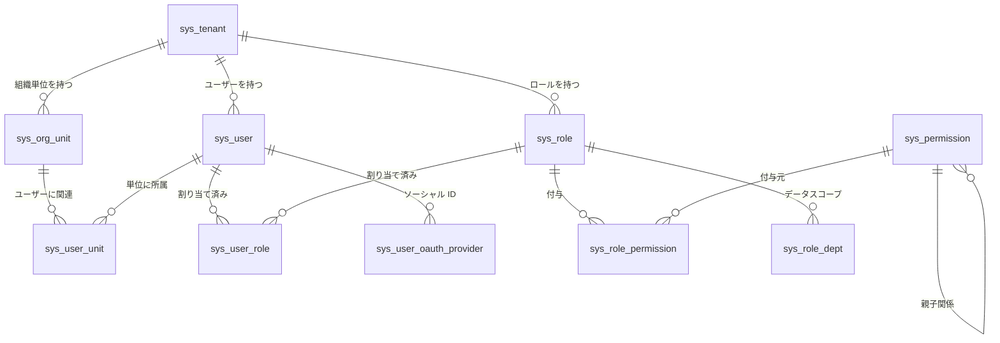

# システムアーキテクチャ

> 本文書は Omni-Stack システムアーキテクチャの完全な技術リファレンスです。システムの位置づけ、技術選定の考え方、モジュールマップ、局所アーキテクチャ設計、データフロー、Docker デプロイアーキテクチャ、拡張ガイドを網羅しています。  
> Docker デプロイの詳細は [docker-deployment.jp.md](docker-deployment.jp.md) を参照してください。

---

## 目次

- [1. システムの位置づけ](#1-システムの位置づけ)
- [2. 技術選定の考え方](#2-技術選定の考え方)
- [3. システム境界](#3-システム境界)
- [4. モジュールマップ](#4-モジュールマップ)
- [5. 依存関係グラフ](#5-依存関係グラフ)
- [6. 局所アーキテクチャ設計](#6-局所アーキテクチャ設計)
- [7. データフロー](#7-データフロー)
- [8. 外部依存](#8-外部依存)
- [9. インフラストラクチャ](#9-インフラストラクチャ)
- [10. Docker デプロイアーキテクチャ](#10-docker-デプロイアーキテクチャ)
- [11. RBAC 権限体系](#11-rbac-権限体系)
- [12. 主要制約](#12-主要制約)
- [13. 拡張ポイント](#13-拡張ポイント)
- [14. 実践チュートリアル：新マイクロサービスの接続](#14-実践チュートリアル新マイクロサービスの接続)

---

## 1. システムの位置づけ

Omni-Stack は、すぐに使える Spring Cloud + Vue 3 フルスタック開発環境を提供するマイクロサービススキャフォールディングプラットフォームです。チームは標準化された本番グレードのインフラ上でビジネスシステムを迅速に構築できます。

**コア設計哲学**：

- **Harness パターン**：Architecture → Patterns → Code の3層構造。アーキテクチャの決定がコード規約を駆動
- **Common Starter エコシステム**：8つの自動設定モジュールにより、新サービスがゼロコンフィグでインフラにアクセス
- **Gateway 集中認証**：JWT 検証は Gateway に集中し、下流サービスは信頼ヘッダーチェーンでアイデンティティを受信
- **Transactional Outbox**：MQ メッセージの信頼性をローカルトランザクションテーブル + 非同期リレーで保証

---

## 2. 技術選定の考え方

### 2.1 Spring Boot 4 + JDK 25 を選んだ理由

| 検討事項 | 決定理由 |
|---------|---------|
| **Jakarta EE 11** | Spring Boot 4 は Jakarta EE 11 ベース。`jakarta.*` パッケージが標準で、移行コストなし |
| **仮想スレッド** | JDK 25 の仮想スレッドは成熟・安定。I/O 集約型のマイクロサービス（DB クエリ、HTTP 呼び出し）に最適 |
| **Spring Security 7** | SAS（Spring Authorization Server）が Spring Security 7 と深く統合。OAuth2 + OIDC ネイティブサポート |
| **GraalVM 互換** | Spring Boot 4 の AOT コンパイルサポートがより成熟。将来 Native Image で起動時間とメモリ使用量を削減可能 |

### 2.2 Spring Cloud Gateway 5.x（WebFlux）を選んだ理由

| 検討事項 | 決定理由 |
|---------|---------|
| **リアクティブモデル** | Gateway は I/O 集約型のルーティングプロキシ。WebFlux の Netty イベントループモデルは Servlet スレッドプールより効率的 |
| **Sleuth → Micrometer** | Gateway 5.x は Micrometer Tracing を使用。Spring Boot 4 のオブザーバビリティ体系と一貫 |
| **ルート DSL** | `spring.cloud.gateway.server.webflux.routes` 設定プレフィックスは冗長だが、宣言的ルーティング + フィルターチェーンを提供 |
| **注意点** | 設定プレフィックスは `spring.cloud.gateway.server.webflux` でなければならない。旧プレフィックス `spring.cloud.gateway` はサイレントに無視される |

### 2.3 Nacos v3.1.1 を選んだ理由

| 検討事項 | 決定理由 |
|---------|---------|
| **サービスディスカバリ + 設定センター一体化** | Eureka（ディスカバリのみ）+ Config Server（設定のみ）と異なり、Nacos は単一コンポーネントで両方を解決 |
| **MySQL 外部ストレージ** | Nacos v3 は MySQL 永続化（`nacos_config` データベース）をサポート。組み込み Derby のシングルポイント制限を回避 |
| **gRPC 長接続** | v3 は HTTP ショートポーリングの代わりに gRPC を使用。サービス登録/ディスカバリの遅延が秒単位からミリ秒単位に短縮 |
| **ヘルスチェックエンドポイント変更** | v3.1.1 でエンドポイントが `/nacos/actuator/health` から `GET /nacos/` に変更。Docker healthcheck の適応が必要 |

### 2.4 Flowable 7.x を選んだ理由

| 検討事項 | 決定理由 |
|---------|---------|
| **オープンソース BPMN エンジン** | Flowable は Activiti のフォーク。コミュニティがより活発で Spring Boot 統合がより成熟 |
| **ネイティブマルチインスタンス（MI）サポート** | 会承認には MI 機能が必要。Flowable の `completionCondition` メカニズムは自然に適合 |
| **バージョン 7.x リファクタリング** | 7.x は API 層をリファクタリング。Spring Boot 3/4 との互換性が向上 |
| **Camunda との比較** | Camunda 8.x は Zeebe（分散エンジン）に移行し学習曲線が急。Flowable は組み込みエンジンモデルを維持し、中小規模に適する |

### 2.5 Quartz ではなく XXL-JOB を選んだ理由

| 検討事項 | 決定理由 |
|---------|---------|
| **視覚的管理** | XXL-JOB Admin は Web コンソールを提供。タスク CRUD、手動トリガー、実行ログ表示をサポート |
| **分散スケジューリング** | XXL-JOB のスケジューラーは独立プロセス。エグゼキューター（ビジネスサービス）はステートレスで自然に水平スケーリング可能 |
| **既存プロジェクト依存** | プロジェクトは既に XXL-JOB を定时タスクに使用。MQ メッセージリレーも同じスケジューリングエンジンを再利用し、新依存を導入しない |
| **Quartz との比較** | Quartz はスケジューリングメタデータにデータベースが必要。クラスタモードはデータベースロックに依存し、運用複雑度がより高い |

---

## 3. システム境界

| 境界 | Omni-Stack フロントエンド (omni-frontend) | Omni-Stack バックエンド (omni-backend) |
|------|------------------------------------------|---------------------------------------|
| 責任 | 表示、インタラクション、ルーティング、フォーム UX、ユーザー状態レンダリング | ビジネスルール、権限チェック、データ一貫性、永続化、監査 |
| 禁止 | データの正確性に影響するビジネスロジックを含めない | 表示ロジックや UI の関心事を含めない |
| バリデーション | クライアント側 UX バリデーション（必須項目、フォーマットヒント） | サーバー側の権威バリデーション（Jakarta Bean Validation） |

---

## 4. モジュールマップ

### 4.1 Common Starter エコシステム（8 つの自動設定モジュール）

| モジュール | 役割 | 技術スタック | 境界制約 |
|-----------|------|-------------|---------|
| `omni-common-core` | 純 POJO：`R<T>`、`PageResult`、`BaseEntity`、`BusinessException`、XSS SPI（`XssConfigProvider`）、`UserJobHandler` SPI | Lombok、Jackson JSR310 | **Spring 依存ゼロ**、フレームワークアノテーションなし |
| `omni-common` | Web 自動設定：Jackson 時間設定、CORS、`GlobalExceptionHandler`、XSS Filter/Sanitizer/Deserializer | Spring Boot Web（optional）、Validation（optional） | ビジネスロジックなし。横断的 Web 関心事のみ |
| `omni-common-mybatis` | MyBatis-Plus Starter：ページネーションインターセプター、MySQL ドライバー、YAML デフォルト | MyBatis-Plus 3.5.16、MySQL Connector | `@ConditionalOnMissingBean` でサービスレベルオーバーライド可能 |
| `omni-common-redis` | ブロッキング Redis Starter：`RedisTemplate`（Jackson シリアライゼーション）+ `RedisUtils` | Spring Data Redis（Lettuce）、commons-pool2 | **Servlet サービス専用**。WebFlux では絶対使用しない |
| `omni-common-redis-reactive` | リアクティブ Redis Starter：`spring-boot-starter-data-redis-reactive` + YAML デフォルト | Spring Data Redis Reactive | **WebFlux サービス専用**。Servlet では絶対使用しない |
| `omni-common-job` | XXL-JOB 統合：自動設定、Admin HTTP クライアント、システムジョブレジストリ、ジョブメタデータアノテーション | XXL-JOB Core 3.3.1、Spring Boot Web（optional） | スケジューリングインフラのみ。ビジネスタスクロジックなし |
| `omni-common-mqlog` | 信頼 MQ メッセージ送信：Transactional Outbox、リレイジョブ、ストラテジーベース送信、内部クエリ API | Spring Cloud Stream RocketMQ（optional）、omni-common-job（optional） | MQ インフラのみ。ビジネスメッセージロジックなし |
| `omni-common-operlog` | 操作ログアスペクトとプロデューサー：`@OperLog` アノテーション駆動、信頼メッセージと直接送信の両モード対応 | Spring AOP、omni-common-mqlog（optional） | 操作ログ関心事のみ |

### 4.2 マイクロサービスモジュール（4 つ）

| モジュール | ポート | 役割 | コア依存 |
|-----------|--------|------|---------|
| `omni-auth` :8100 | 8100 | 認証認可：ログイン、CAPTCHA、JWT、マルチテナント、OAuth2 認可サーバー、XSS 設定管理、RBAC 権限、オンラインユーザー管理 | Spring Boot Web、Spring Security、OAuth2 Authorization Server |
| `omni-base` :8101 | 8101 | 基礎データ：辞書 CRUD、定时タスク管理（システム + ユーザー）、操作ログアーカイブ、MQ メッセージ管理 | Spring Boot Web、Spring Security、mybatis、redis、job、mqlog |
| `omni-workflow` :8103 | 8103 | ワークフローエンジン：BPMN モデル管理、プロセスインスタンス、承認、タスク割り当て、統計 | Spring Boot Web、Spring Security、omni-common-workflow、Flowable 7.x |
| `omni-gateway` :8102 | 8102 | API Gateway：リクエストルーティング、JWT 認証フィルタリング、CORS 処理、セキュリティヘッダー | Spring Cloud Gateway Server（WebFlux）、omni-common-redis-reactive |

### 4.3 フロントエンドモジュール

| モジュール | ポート | 技術スタック | 役割 |
|-----------|--------|-------------|------|
| `omni-frontend` | 3000（dev）/ 3000（Nginx） | Vue 3、Pinia 3、Vue Router 4、Element Plus、Axios、Vite 8 | 表示層 SPA。データ権威性のあるビジネスルールなし |

---

## 5. 依存関係グラフ

```
omni-common-core  (純 POJO: R<T>, PageResult, BaseEntity, XSS SPI, UserJobHandler SPI — Spring 依存ゼロ)
    ^          ^          ^          ^          ^
    |          |          |          |          |
omni-common  omni-common-mybatis  omni-common-redis   omni-common-redis-reactive   omni-common-job
(Web 自動    (MyBatis-Plus +      (ブロッキング        (リアクティブ Redis,          (XXL-JOB 統合:
 設定)        MySQL ドライバー)    Redis + RedisUtils)   独立モジュール)              自動設定, Admin Client,
    ^   ^          ^    ^              ^    ^                   ^                     システムジョブレジストリ)
    |   |          |    |              |    |                   |                          ^
    |   +----------+----+--------------+----+                  |                          |
    |                     |                                     |                          |
omni-auth :8100     omni-base :8101                     omni-gateway :8102
(Servlet, Security,  (Servlet, Security,                 (WebFlux, core +
 OAuth2 Auth Server)  辞書 CRUD,                          redis-reactive に依存,
    |                 定时タスク)                          omni-common には非依存)
    |                    |                                     |
    +-- Nacos に登録 --+                                      |
                               |                               |
omni-gateway --- lb:// でルーティング ---> omni-auth, omni-base, omni-workflow
    |
omni-frontend --- /api プロキシ :3000 ---> omni-gateway :8102

omni-base --- XxlJobAdminClient (HTTP) ---> XXL-JOB Admin :18080
```

**ビルド依存順序**：`omni-common-core` → `omni-common` → `omni-common-mybatis` / `omni-common-redis` / `omni-common-redis-reactive` → `omni-auth` / `omni-base` / `omni-workflow` / `omni-gateway`。Maven reactor が `<modules>` 宣言から順序を自動解決。

### モジュールと全体の関係

各モジュールは全体アーキテクチャにおいて明確な役割を担います：

| モジュール | 全体への貢献 |
|-----------|-------------|
| `omni-common-core` | **基盤層**：全モジュール共有の POJO 定義と SPI インターフェース。フレームワーク依存ゼロで移植性を保証 |
| `omni-common-*` starters | **自動設定層**：`AutoConfiguration.imports` によるゼロコンフィグアクセス。新サービスは Maven 依存追加のみ |
| `omni-auth` | **セキュリティハブ**：認証・認可・JWT 発行を集中処理。システム全体の信頼チェーンの起点 |
| `omni-gateway` | **トラフィックエントリ**：全 HTTP リクエストの唯一のエントリポイント。JWT 検証 + アイデンティティ伝播 + ルート配布 |
| `omni-base` | **データ基盤**：辞書、ログ、定时タスクなどの共通ビジネスデータの管理センター |
| `omni-workflow` | **プロセスエンジン**：独立デプロイの BPMN ワークフローサービス。Flowable 依存を `omni-common-workflow` starter で分離 |

---

## 6. 局所アーキテクチャ設計

### 6.1 omni-auth セキュリティフィルターチェーン

omni-auth は認証認可のハブとして、内部に2つの独立したセキュリティフィルターチェーンを維持します：

```
┌─────────────────────────────────────────────────────────────────────┐
│ Chain 1 (Order 1): OAuth2 認可サーバーエンドポイント                  │
│ securityMatcher: /oauth2/**, /login, /.well-known/**                │
│                                                                     │
│ リクエスト → SecurityContextPersistenceFilter                       │
│            → DeviceClientAuthenticationFilter（パブリッククライアント認証）│
│            → DeviceRedirectFilter（デバイス認可フローリダイレクト）    │
│            → OAuth2AuthorizationEndpointFilter（認可コード発行）      │
│            → OAuth2TokenEndpointFilter（トークン発行/更新）          │
│                                                                     │
│ セッションポリシー: STATELESS（OAuth2 エンドポイントはステートレス）  │
├─────────────────────────────────────────────────────────────────────┤
│ Chain 2 (Order 2): ビジネス API エンドポイント                       │
│ securityMatcher: NOT /oauth2/**                                     │
│                                                                     │
│ リクエスト → GatewayPreAuthFilter（X-User-* ヘッダーから            │
│                                   Authentication を構築）           │
│            → DataScopeResolveFilter（@Order(0)、データ権限範囲解決）  │
│            → AuthorizationFilter（@PreAuthorize メソッドレベル権限）  │
│                                                                     │
│ セッションポリシー: STATELESS（API リクエストは HttpSession 作成しない）│
│ 認証ホワイトリスト: /api/auth/**, /actuator/**, /error              │
└─────────────────────────────────────────────────────────────────────┘
```

**主要コンポーネントの連携**：

| コンポーネント | 場所 | 責任 |
|-------------|------|------|
| `AuthorizationServerConfig` | omni-auth/config | デュアルフィルターチェーン設定、JWK キーソース（RSA 2048）、OAuth2 クライアント登録 |
| `OmniUserDetailsService` | omni-auth/security | マルチテナントユーザー読み込み（`tenantId:username` 形式） |
| `GatewayPreAuthFilter` | omni-auth/security | Gateway 転送ヘッダーから `Authentication` を構築（X-User-Id/Name/Tenant/Roles/Scopes） |
| `DataScopeResolveFilter` | omni-auth/security | ユーザーデータ権限範囲を解決し `DataScopeContext`（ThreadLocal）に書き込み |
| `DeviceClientAuthenticationFilter` | omni-auth/security | RFC 8628 デバイスコード認可フローのパブリッククライアント認証 |
| `JwtTokenService` | omni-auth/service | RS256 署名 JWT 生成 |

### 6.2 omni-gateway WebFlux パイプライン

Gateway は Spring Cloud Gateway のリアクティブ WebFlux 技術スタック上に構築されています。リクエスト処理パイプライン：

```
HTTP リクエスト受信
    │
    ▼
CorsConfig (CorsWebFilter)
    │ OPTIONS プリフライトリクエストを処理、CORS ヘッダーを追加
    │ AuthFilter より優先度が高く、プリフライトがインターセプトされないようにする
    ▼
AuthFilter (GlobalFilter, order=-100)
    │ 1. ホワイトリストパスは通過（/api/auth/login, /oauth2/**, /actuator/**）
    │ 2. Authorization: Bearer <JWT> ヘッダーを抽出
    │ 3. JwkKeyProvider が RSA 公開鍵を取得（WebClient → omni-auth:8080/oauth2/jwks、5分キャッシュ）
    │ 4. RSASSAVerifier で JWT 署名を検証（RS256）
    │ 5. 有効期限をチェック
    │ 6. トークンブラックリストをチェック（ReactiveStringRedisTemplate → Redis）
    │ 7. クレームを抽出し、転送リクエストヘッダーを注入：
    │    X-User-Id, X-User-Name, X-Tenant-Id, X-User-Roles, X-User-Scopes
    ▼
SecurityHeadersFilter (WebFilter)
    │ セキュリティヘッダーを追加：X-Content-Type-Options, X-Frame-Options, Referrer-Policy
    ▼
Spring Cloud Gateway ルーティングエンジン
    │ 1. ルートマッチング：Path=/api/auth/** → lb://omni-auth
    │ 2. StripPrefix=2：/api/auth/login → /login
    │ 3. 負荷分散：Nacos サービスディスカバリからインスタンスリストを取得
    ▼
下流マイクロサービスに転送（omni-auth / omni-base / omni-workflow）
```

**主要設計判断**：

- **JwkKeyProvider は `WebClient.create()` を使用**：WebFlux 環境では `WebClient.Builder` bean が自動設定されないため手動で作成
- **公開鍵 5 分キャッシュ**：毎リクエストの JWKS エンドポイント呼び出しを回避。`volatile` でマルチスレッド可視性を保証
- **`onErrorResume` は `SecurityException` のみキャッチ**：下流ルーティングエラー（サービス利用不可、タイムアウト）が JWT 検証失敗として誤報告されることを防止

### 6.3 omni-base / omni-workflow セキュリティモデル

下流マイクロサービス（base、workflow）は統一された**Gateway 事前認証モデル**を採用：

```
リクエスト受信（Gateway により JWT 検証済み）
    │
    ▼
GatewayPreAuthFilter（OncePerRequestFilter）
    │ X-User-* ヘッダーから UsernamePasswordAuthenticationToken を構築
    │ ロールには ROLE_ プレフィックスを付与、権限は直接 authority として追加
    │ SecurityContextHolder に書き込み
    ▼
AuthorizationFilter
    │ @PreAuthorize("hasAuthority('dict:type:list')") メソッドレベル権限チェック
    ▼
ビジネス Controller → Service → Mapper
```

**設計原理**：JWT 検証は Gateway に集中。下流サービスは Gateway が注入するヘッダーを信頼。これにより各サービスが独立した JWT 検証設定を必要とせず、複雑さとキー管理コストを削減。

---

## 7. データフロー

### 7.1 ユーザーログインリクエストフロー

```
ブラウザ (Vue SPA)
    │  HTTP リクエスト (例: POST /api/auth/login)
    ▼
Vite Dev Server (:3000)  -- /api/** をプロキシ -->
    │
Gateway (:8102)
    │  1. ルートマッチング: Path=/api/auth/** -> lb://omni-auth
    │  2. StripPrefix=2: /api/auth/login -> /login
    ▼
Auth Service (:8100)
    │  1. AuthController が /login を受信
    │  2. CaptchaService が CAPTCHA を検証 (Redis)
    │  3. OmniUserDetailsService がユーザーを認証（マルチテナント tenantId:username）
    │  4. JwtTokenService が RS256 署名 JWT を生成
    │  5. レスポンスを R<T> でラップ
    ▼
JSON レスポンス: { code: 200, message: "success", data: { accessToken, tokenType, expiresIn } }
    │
ブラウザが JWT を保存し、後続リクエストで自動使用
```

### 7.2 MQ 信頼メッセージ配信フロー

```
ビジネスサービス (例: omni-base)
    │  @Transactional
    │  ReliableMessageTemplate.send(bindingName, payload)
    ▼
sys_mq_message テーブル (status=PENDING、同一ローカルトランザクション)
    │
    │  XXL-JOB mqRelayHandler (10秒ごと)
    ▼
MqMessageRelayService.relayAll()
    │  1. SELECT * FROM sys_mq_message WHERE status IN (PENDING, FAILED) AND next_retry_time <= NOW() LIMIT 100
    │  2. MessageSender.send(message) — broker_type によるストラテジーパターン
    │  3a. 成功 → status=SENT
    │  3b. 失敗 → retry_count++, next_retry_time = NOW() + 2^retryCount * 10s
    │      max_retry 超過 → status=DEAD_LETTER, error_msg を記録
    ▼
RocketMQ Broker (StreamBridge 経由)
    │
    │  管理 UI (omni-base MqMessageController)
    ▼
監視ページ: デッドレターメッセージのクエリ/再送/スキップ
```

> 詳細は [mq-reliability.jp.md](mq-reliability.jp.md) を参照。

---

## 8. 外部依存

| サービス | 用途 | バージョン | ポート |
|---------|------|-----------|--------|
| MySQL | メインリレーショナルデータベース（Auth + RBAC + ビジネスデータ） | 8.4 | 3306 |
| Redis | CAPTCHA ストレージ、セッションキャッシュ、トークンブラックリスト | 7.4 | 6379 |
| Nacos Server | サービスディスカバリ + 設定センター | v3.1.1 | 8080, 8848, 9848 |
| Sentinel Dashboard | フロー制御 + サーキットブレーキングダッシュボード | 1.8.8 | 8858 |
| XXL-JOB Admin | 分散タスクスケジューリングコンソール | 3.3.1 | 18080 |
| RocketMQ | メッセージキュー（NameServer + Broker） | 5.3.2 | 9876, 10909-10912 |

全サービスは1コマンドで起動可能：`docker compose up -d`。プロジェクトルートの `docker-compose.yml` を参照。

**起動順序**：MySQL → Redis → Nacos → RocketMQ → XXL-JOB Admin → バックエンドサービス（Auth, Base, Workflow, Gateway）→ フロントエンド

---

## 9. インフラストラクチャ

### 9.1 Docker Compose オーケストレーション

プロジェクトルートの `docker-compose.yml` は全12コンテナを定義：

- **名前付きボリューム**（`mysql-data`、`redis-data`）で再起動時のデータ永続化
- **ヘルスチェック**（depends_on + service_healthy）で段階的起動チェーンを保証
- **ブリッジネットワーク**（`omni-network`）でコンテナ間通信
- **マイグレーション起動ゲート**：one-shot の `omni-db-migrator` が Liquibase により 9 DB の構造と冪等シードを適用し、成功後にのみ Nacos、XXL-JOB、各アプリを起動

### 9.2 データベーススキーマ

#### omni_auth データベース（14 テーブル）

**OAuth2 認可（3 テーブル）**：

| テーブル | 用途 |
|---------|------|
| `oauth2_registered_client` | OAuth2 クライアント登録 |
| `oauth2_authorization` | アクティブな OAuth2 認可レコード |
| `oauth2_authorization_consent` | ユーザー同意済みスコープ |

**マルチテナント RBAC（11 テーブル）**：

| テーブル | 用途 |
|---------|------|
| `sys_tenant` | テナントレジストリ |
| `sys_org_unit` | 組織単位（マテリアライズドパス階層） |
| `sys_user` | ユーザーアカウント |
| `sys_role` | ロール定義 |
| `sys_permission` | 権限ツリー（メニュー、ボタン、API） |
| `sys_user_role` | ユーザー・ロール関連 |
| `sys_role_permission` | ロール・権限関連 |
| `sys_user_unit` | ユーザー・組織単位関連 |
| `sys_role_dept` | ロール・部署データスコープバインディング |
| `sys_token_blacklist` | 無効化 JWT ブラックリスト |
| `sys_user_oauth_provider` | サードパーティソーシャルログイン ID リンク |
| `sys_xss_config` | テナントレベル XSS グローバルスイッチ |
| `sys_xss_blacklist_rule` | XSS ブラックリストルール |



#### omni_base データベース

**データ辞書（2 テーブル）**：`sys_dict_type` + `sys_dict_data`

**定时タスク（3 テーブル）**：`sys_user_job_type` + `sys_user_job` + `sys_user_job_log`

#### omni_workflow データベース

**ワークフロー（7 テーブル）**：`wf_process_model` + `wf_process_model_version` + `wf_process_instance_ext` + `wf_todo_task` + `wf_cc_record` + `wf_form_schema` + `wf_delegation_rule`

**データベースの正規情報源**：スキーマ、インデックス、制約、アップグレードは `database/changelog/`、正式な冪等シードは `scripts/sql/seed/` で管理し、`database/seed/manifest.yaml` の SHA-256 と自然キー検証で保護します。`scripts/sql/init-all.sql` は互換期間のレガシーファイルであり、Compose 初期化では使用しません。

---

## 10. Docker デプロイアーキテクチャ

### 10.1 コンテナネットワークトポロジ

全コンテナは Docker Bridge ネットワーク `omni-network` を共有：

```
┌───────────────────────────────────────────────────────────────────────┐
│                      Docker Network: omni-network                     │
│                                                                       │
│  ┌─────────────┐    ┌──────────┐    ┌────────┐    ┌──────────────┐  │
│  │ omni-       │    │ omni-    │    │ omni-  │    │ omni-        │  │
│  │ frontend    │───>│ gateway  │───>│ auth   │    │ workflow     │  │
│  │ :3000       │    │ :8080    │    │ :8080  │    │ :8080        │  │
│  │ (Nginx)     │    │ (WebFlux)│    │        │    │              │  │
│  └─────────────┘    └────┬─────┘    └───┬────┘    └──────────────┘  │
│                          │              │                             │
│                          │    ┌─────────┤    ┌──────────────┐       │
│                          └───>│ omni-   │    │ omni-        │       │
│                               │ base    │    │ common-job   │       │
│                               │ :8080   │    │ (XXL-JOB     │       │
│                               └────┬────┘    │  executor)   │       │
│                                    │         └──────────────┘       │
│  ┌────────┐  ┌────────┐  ┌────────┐  ┌──────────────┐  ┌────────┐ │
│  │ MySQL  │  │ Redis  │  │ Nacos  │  │ RocketMQ     │  │XXL-JOB │ │
│  │ :3306  │  │ :6379  │  │ :8848  │  │ NS:9876      │  │:8080   │ │
│  └────────┘  └────────┘  └────────┘  └──────────────┘  └────────┘ │
└───────────────────────────────────────────────────────────────────────┘
        ↕ ホストポートマッピング
   :3000    :8100-8103   :3306  :6379  :8080  :8848  :19876  :18080
```

### 10.2 サービスディスカバリメカニズム

```
omni-auth 起動
    │ @EnableDiscoveryClient
    │ spring.cloud.nacos.discovery.server-addr = nacos:8848
    ▼
Nacos 登録: service=omni-auth, ip=<コンテナ内部IP>, port=8080
    │
omni-gateway 起動
    │ @EnableDiscoveryClient
    │ spring.cloud.gateway.server.webflux.discovery.locator.enabled=true
    ▼
Gateway ルーティング: lb://omni-auth → Nacos からインスタンスリストを取得 → 負荷分散転送
```

**主要設定**：
- `SPRING_CLOUD_NACOS_DISCOVERY_IP: ""` — Nacos にコンテナ内部 IP を自動検出させる
- Docker 内部通信は**コンテナ内部ポート 8080** を使用。ホストマッピングポートではない

### 10.3 環境変数オーバーライド戦略

Spring Boot の環境変数は `application.yml` より優先度が高い。Docker デプロイではこのメカニズムを多用：

| 環境変数 | オーバーライド対象 | 例 |
|---------|-------------------|-----|
| `SPRING_DATASOURCE_URL` | `spring.datasource.url` | `jdbc:mysql://mysql:3306/omni_auth` |
| `SPRING_DATA_REDIS_HOST` | `spring.data.redis.host` | `redis` |
| `SPRING_CLOUD_NACOS_DISCOVERY_SERVER_ADDR` | `spring.cloud.nacos.discovery.server-addr` | `nacos:8848` |
| `AUTH_JWKS_URI` | `auth.jwks.uri` | `http://omni-auth:8080/oauth2/jwks` |
| `SERVER_PORT` | `server.port` | `8080` |

---

## 11. RBAC 権限体系

### 11.1 設計哲学

Omni-Stack は **RBAC-0 基礎権限モデル**（ユーザー・ロール・権限）を採用し、2つの独立かつ補完的なサブシステムに分かれています：

1. **機能権限**：ユーザーが「何ができるか」を制御 — メニュー表示 + ボタン/API レベル操作権限
2. **データ権限**：ユーザーが「どのデータを見られるか」を制御 — 組織所属に基づく行レベルフィルタリング

### 11.2 機能権限アーキテクチャ

機能権限は **メニューフィルタリング + ボタンレベル制御 + API 認可** の3層防御で実装：

```
┌─────────────────────────────────────────────────────────────┐
│ Layer 1: 動的メニューフィルタリング（MenuController）        │
│ バックエンドがユーザー権限集合に基づき権限ツリーを再帰的に    │
│ フィルタリング。DIRECTORY（可視子ノードあり）と MENU        │
│ （権限コードあり）ノードのみ返却                             │
├─────────────────────────────────────────────────────────────┤
│ Layer 2: ボタンレベル権限制御（v-permission ディレクティブ）  │
│ Vue カスタムディレクティブ v-permission="'system:user:create'"│
│ PermissionStore から権限コードを照会し無権限ボタンを非表示    │
├─────────────────────────────────────────────────────────────┤
│ Layer 3: API 認可（Spring Security @PreAuthorize）           │
│ Controller メソッドが @PreAuthorize("hasAuthority()") を宣言  │
│ Spring Security がメソッド呼び出し前に JWT 権限集合を検証     │
└─────────────────────────────────────────────────────────────┘
```

### 11.3 データ権限アーキテクチャ

データ権限は **MyBatis-Plus `DataPermissionInterceptor`** に基づく SQL 自動インターセプトで、ビジネスコードへの侵入ゼロ。

**6 レベルデータスコープ（dataScope）**：

| レベル | dataScope 値 | 意味 | 優先度 |
|--------|-------------|------|--------|
| 最も緩和 | `ALL` | 全データ（テナント越え） | 1 |
| | `TENANT` | 現テナントの全データ | 2 |
| | `DEPT_AND_BELOW` | 現部署と全ての子部署 | 3 |
| | `DEPT` | 現部署のみ | 4 |
| | `CUSTOM` | カスタム部署集合 | 5 |
| 最も厳格 | `SELF` | 自分のデータのみ | 6 |

**マルチロールマージルール**：最も緩和が優先。複数ロールを持つユーザーは最小の優先度数値の dataScope を使用。

---

## 12. 主要制約

1. **JDK 25 必須**：Spring Boot 4.x Maven plugin は Java 17+ 必須。本プロジェクトは JDK 25 を対象。`JAVA_HOME` を Maven コマンド実行前に設定すること。
2. **Gateway 5.x 設定プレフィックス**：ルートと設定は `spring.cloud.gateway.server.webflux` の下に配置。旧プレフィックスはサイレントに無視される。
3. **ビルド順序**：`omni-common-core` → `omni-common` → common starters → マイクロサービス。`./mvnw clean install` を親 POM から実行。
4. **直接サービス間呼び出し禁止**：サービス間通信は OpenFeign クライアント経由。生の HTTP 呼び出しは禁止。
5. **Gateway はリアクティブ**：`omni-gateway` は WebFlux 上で動作。`omni-common-core` と `omni-common-redis-reactive` に依存するが、`omni-common` と `omni-common-redis` には**依存しない**。
6. **Redis Starter 排他性**：ブロッキング版とリアクティブ版は同じサービスで混在不可。
7. **XXL-JOB Admin 先行起動必須**：`omni-base` 起動前に Admin が稼働していること。
8. **omni-common-job はライブラリモジュール**：独立実行不可。Servlet サービスのみ依存可能。

---

## 13. 拡張ポイント

### 13.1 新規 OAuth2 ソーシャルログインプロバイダーの追加

ソーシャルログインフレームワークは `OAuth2ProviderHandler` インターフェースによるストラテジーパターンを使用：

1. `XxxOAuth2Handler.java` を作成し `OAuth2ProviderHandler` を実装。`@Component("xxx")` でアノテート
2. `OAuth2Properties.java` に `XxxProperties` 内部静的クラスを追加
3. `application.yml` に `auth.oauth2.xxx.*` 設定セクションを追加
4. `SocialLoginServiceImpl.getUsernamePrefix()` switch 式に case を追加

**現在実装済み**：GitHub、Google、Gitee。

### 13.2 新サービスへの XSS 防護追加

XSS 防御システムはモジュラー — 新サービスは Common Starter エコシステムに依存することで防護を継承：

1. `omni-common-core` + `omni-common` 依存を追加
2. `XssConfigProvider` SPI インターフェースを実装
3. Redis キャッシュ戦略を使用（30 分 TTL）
4. `XssAutoConfiguration` は `AutoConfiguration.imports` で自動登録

### 13.3 新規ユーザータスクタイプの追加

ユーザータスクシステムは `UserJobHandler` による SPI パターンを使用：

1. `sys_user_job_type` に INSERT してタスクタイプを登録
2. `@Component("{type_code}")` クラスを作成し `UserJobHandler` を実装
3. `UserJobHandlerRegistry` が `Map<String, UserJobHandler>` 注入で自動検出

---

## 14. 実践チュートリアル：新マイクロサービスの接続

`omni-order`（注文サービス）の作成を例に、完全な接続手順を示します。

### 14.1 Maven モジュールの作成

```
omni-backend/
└── omni-order/
    ├── pom.xml
    └── src/main/java/com/omni/order/
        ├── OrderApplication.java
        ├── controller/
        ├── service/
        ├── mapper/
        ├── entity/
        └── config/
```

### 14.2 POM 依存の設定

```xml
<dependencies>
    <dependency>
        <groupId>com.omni</groupId>
        <artifactId>omni-common-core</artifactId>
    </dependency>
    <dependency>
        <groupId>com.omni</groupId>
        <artifactId>omni-common</artifactId>
    </dependency>
    <dependency>
        <groupId>com.omni</groupId>
        <artifactId>omni-common-mybatis</artifactId>
    </dependency>
    <dependency>
        <groupId>com.omni</groupId>
        <artifactId>omni-common-redis</artifactId>
    </dependency>
</dependencies>
```

### 14.3 親 POM への登録

`omni-backend/pom.xml` の `<modules>` に追加：

```xml
<modules>
    <!-- 既存モジュール... -->
    <module>omni-order</module>
</modules>
```

### 14.4 application.yml の設定

```yaml
server:
  port: 8104
spring:
  application:
    name: omni-order
  datasource:
    url: jdbc:mysql://localhost:3306/omni_order?...
    username: root
    password: root
  data:
    redis:
      host: 127.0.0.1
      port: 6379
      database: 4
  cloud:
    nacos:
      discovery:
        server-addr: ${NACOS_SERVER_ADDR:127.0.0.1:8848}
        ip: 127.0.0.1
```

### 14.5 Gateway ルートの追加

`omni-gateway/application.yml` に追加：

```yaml
- id: omni-order
  uri: lb://omni-order
  predicates:
    - Path=/api/order/**
  filters:
    - StripPrefix=2
```

### 14.6 権限シードデータの追加

`scripts/sql/seed/auth.sql` に冪等な `sys_permission` レコードを追加し、`database/seed/manifest.yaml` のチェックサムと自然キー検証を更新します。

### 14.7 Docker デプロイ設定

`docker-compose.yml` にサービス定義を追加：

```yaml
omni-order:
  build:
    context: ./omni-backend
    dockerfile: ../docker/backend/Dockerfile
    args:
      SERVICE_NAME: omni-order
  ports:
    - "8104:8080"
  environment:
    SERVER_PORT: "8080"
    SPRING_DATASOURCE_URL: "jdbc:mysql://mysql:3306/omni_order?..."
    SPRING_DATA_REDIS_HOST: redis
    SPRING_CLOUD_NACOS_DISCOVERY_SERVER_ADDR: nacos:8848
  depends_on:
    nacos: { condition: service_healthy }
    redis: { condition: service_healthy }
    mysql: { condition: service_healthy }
```

### 14.8 検証チェックリスト

- [ ] `mvn clean install` が正常にコンパイルされる
- [ ] ローカル起動後、Nacos コンソールで `omni-order` サービスが可視
- [ ] `GET /api/order/xxx` が Gateway 経由で正常にルーティングされる
- [ ] `@PreAuthorize` アノテーションが機能する
- [ ] XSS 防護が自動設定される
- [ ] MyBatis-Plus ページネーションが自動設定される

> MyBatis-Plus ページネーション、Jackson 時間設定、CORS、`GlobalExceptionHandler`、XSS Filter はすべて `AutoConfiguration.imports` 経由で自動設定 — 手動 `@ComponentScan("com.omni.common")` は不要。
