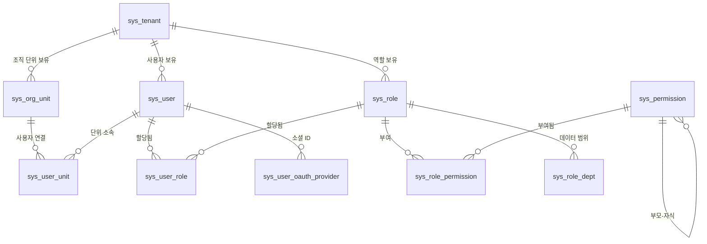

# 시스템 아키텍처

> 본 문서는 Omni-Stack 시스템 아키텍처의 완전한 기술 레퍼런스입니다. 시스템 포지셔닝, 기술 선정 근거, 모듈 맵, 로컬 아키텍처 설계, 데이터 흐름, Docker 배포 아키텍처, 확장 가이드를 포함합니다.  
> Docker 배포 세부사항은 [docker-deployment.kr.md](docker-deployment.kr.md)를 참조하세요.

---

## 목차

- [1. 시스템 포지셔닝](#1-시스템-포지셔닝)
- [2. 기술 선정 근거](#2-기술-선정-근거)
- [3. 시스템 경계](#3-시스템-경계)
- [4. 모듈 맵](#4-모듈-맵)
- [5. 의존성 그래프](#5-의존성-그래프)
- [6. 로컬 아키텍처 설계](#6-로컬-아키텍처-설계)
- [7. 데이터 흐름](#7-데이터-흐름)
- [8. 외부 의존성](#8-외부-의존성)
- [9. 인프라스트럭처](#9-인프라스트럭처)
- [10. Docker 배포 아키텍처](#10-docker-배포-아키텍처)
- [11. RBAC 권한 체계](#11-rbac-권한-체계)
- [12. 주요 제약사항](#12-주요-제약사항)
- [13. 확장 포인트](#13-확장-포인트)
- [14. 실전 튜토리얼: 새 마이크로서비스 연동](#14-실전-튜토리얼-새-마이크로서비스-연동)

---

## 1. 시스템 포지셔닝

Omni-Stack은 즉시 사용 가능한 Spring Cloud + Vue 3 풀스택 개발 환경을 제공하는 마이크로서비스 스캐폴딩 플랫폼입니다. 팀은 표준화되고 프로덕션 등급의 인프라 위에서 비즈니스 시스템을 빠르게 구축할 수 있습니다.

**핵심 설계 철학**:

- **Harness 패턴**: Architecture → Patterns → Code 3계층 구조. 아키텍처 결정이 코드 컨벤션을 주도
- **Common Starter 생태계**: 8개의 자동 구성 모듈로 새 서비스가 제로 설정으로 인프라에 접근
- **Gateway 중앙 인증**: JWT 검증이 Gateway에 집중되고, 하위 서비스는 신뢰 헤더 체인으로 아이덴티티 수신
- **Transactional Outbox**: MQ 메시지 신뢰성을 로컬 트랜잭션 테이블 + 비동기 릴레이로 보장

---

## 2. 기술 선정 근거

### 2.1 Spring Boot 4 + JDK 25를 선택한 이유

| 고려사항 | 결정 근거 |
|---------|---------|
| **Jakarta EE 11** | Spring Boot 4는 Jakarta EE 11 기반. `jakarta.*` 패키지가 표준이며 마이그레이션 비용 없음 |
| **가상 스레드** | JDK 25의 가상 스레드는 성숙하고 안정적. I/O 집약적 마이크로서비스(데이터베이스 쿼리, HTTP 호출)에 최적 |
| **Spring Security 7** | SAS(Spring Authorization Server)가 Spring Security 7과 깊이 통합. OAuth2 + OIDC 네이티브 지원 |
| **GraalVM 호환** | Spring Boot 4의 AOT 컴파일 지원이 더 성숙. 향후 Native Image로 시작 시간과 메모리 사용량 감소 가능 |

### 2.2 Spring Cloud Gateway 5.x(WebFlux)를 선택한 이유

| 고려사항 | 결정 근거 |
|---------|---------|
| **리액티브 모델** | Gateway는 I/O 집약적 라우팅 프록시. WebFlux의 Netty 이벤트 루프 모델이 Servlet 스레드 풀보다 효율적 |
| **Sleuth → Micrometer** | Gateway 5.x는 Micrometer Tracing을 사용. Spring Boot 4의 관찰성 체계와 일관 |
| **라우팅 DSL** | `spring.cloud.gateway.server.webflux.routes` 설정 접두사는 길지만 선언적 라우팅 + 필터 체인 제공 |
| **주의사항** | 설정 접두사는 반드시 `spring.cloud.gateway.server.webflux`여야 함. 구 접두사는 자동으로 무시됨 |

### 2.3 Nacos v3.1.1을 선택한 이유

| 고려사항 | 결정 근거 |
|---------|---------|
| **서비스 검색 + 설정 센터 통합** | Eureka(검색만) + Config Server(설정만)과 달리 Nacos는 단일 컴포넌트로 두 문제 해결 |
| **MySQL 외부 스토리지** | Nacos v3는 MySQL 영속화(`nacos_config` 데이터베이스) 지원. 내장 Derby의 단일 장애점 제한 회피 |
| **gRPC 장기간 연결** | v3는 HTTP 단기 폴링 대신 gRPC 사용. 서비스 등록/검색 지연이 초 단위에서 밀리초 단위로 단축 |
| **헬스 체크 엔드포인트 변경** | v3.1.1에서 엔드포인트가 `/nacos/actuator/health`에서 `GET /nacos/`로 변경. Docker healthcheck 적응 필요 |

### 2.4 Flowable 8.x를 선택한 이유

| 고려사항 | 결정 근거 |
|---------|---------|
| **오픈소스 BPMN 엔진** | Flowable은 Activiti의 포크. 커뮤니티가 더 활발하고 Spring Boot 통합이 더 성숙 |
| **네이티브 멀티 인스턴스(MI) 지원** | 회서명 승인에 MI 기능 필요. Flowable의 `completionCondition` 메커니즘이 자연스럽게 적합 |
| **버전 7.x 리팩토링** | 7.x는 API 계층을 리팩토링. Spring Boot 3/4와의 호환성 개선 |
| **Camunda와 비교** | Camunda 8.x는 Zeebe(분산 엔진)로 전환하여 학습 곡선이 가파름. Flowable은 내장 엔진 모델 유지, 중소 규모에 더 적합 |

### 2.5 Quartz 대신 XXL-JOB을 선택한 이유

| 고려사항 | 결정 근거 |
|---------|---------|
| **시각적 관리** | XXL-JOB Admin은 웹 콘솔 제공. 작업 CRUD, 수동 트리거, 실행 로그 조회 지원 |
| **분산 스케줄링** | XXL-JOB의 스케줄러는 독립 프로세스. 실행자(비즈니스 서비스)는 무상태로 자연스럽게 수평 확장 가능 |
| **기존 프로젝트 의존성** | 프로젝트는 이미 XXL-JOB을 예약 작업에 사용. MQ 메시지 릴레이도 같은 스케줄링 엔진을 재사용하여 새 의존성 미도입 |
| **Quartz와 비교** | Quartz는 스케줄링 메타데이터에 데이터베이스 필요. 클러스터 모드는 데이터베이스 락에 의존하여 운영 복잡도 더 높음 |

---

## 3. 시스템 경계

| 경계 | Omni-Stack 프론트엔드 (omni-frontend) | Omni-Stack 백엔드 (omni-backend) |
|------|---------------------------------------|----------------------------------|
| 책임 | 프레젠테이션, 상호작용, 라우팅, 폼 UX, 사용자 상태 렌더링 | 비즈니스 규칙, 권한 검증, 데이터 일관성, 영속화, 감사 |
| 금지 | 데이터 정확성에 영향을 미치는 비즈니스 로직 포함 금지 | 프레젠테이션 로직이나 UI 관심사 포함 금지 |
| 유효성 검사 | 클라이언트 측 UX 유효성 검사(필수 항목, 형식 힌트) | 서버 측 권위 유효성 검사(Jakarta Bean Validation) |

---

## 4. 모듈 맵

### 4.1 Common Starter 생태계 (10개 공통 모듈)

| 모듈 | 역할 | 기술 스택 | 경계 제약 |
|------|------|-----------|-----------|
| `omni-common-core` | 순수 POJO: `R<T>`, `PageResult`, `BaseEntity`, `BusinessException`, XSS SPI, `UserJobHandler` SPI | Lombok, Jackson JSR310 | **Spring 의존성 제로**, 프레임워크 어노테이션 없음 |
| `omni-common` | Web 자동 구성: Jackson 시간 설정, CORS, `GlobalExceptionHandler`, XSS Filter/Sanitizer | Spring Boot Web(optional), Validation(optional) | 비즈니스 로직 없음. 횡단 웹 관심사만 |
| `omni-common-mybatis` | MyBatis-Plus Starter: 페이징 인터셉터, MySQL 드라이버, YAML 기본값 | MyBatis-Plus 3.5.16, MySQL Connector | `@ConditionalOnMissingBean`으로 서비스 수준 재정의 가능 |
| `omni-common-redis` | 블로킹 Redis Starter: `RedisTemplate`(Jackson 직렬화) + `RedisUtils` | Spring Data Redis(Lettuce), commons-pool2 | **Servlet 서비스 전용**. WebFlux에서 절대 사용 금지 |
| `omni-common-redis-reactive` | 리액티브 Redis Starter: `spring-boot-starter-data-redis-reactive` | Spring Data Redis Reactive | **WebFlux 서비스 전용**. Servlet에서 절대 사용 금지 |
| `omni-common-job` | XXL-JOB 통합: 자동 구성, Admin HTTP 클라이언트, 시스템 작업 레지스트리 | XXL-JOB Core 3.3.1 | 스케줄링 인프라만. 비즈니스 작업 로직 없음 |
| `omni-common-mqlog` | 신뢰 MQ 메시지 전송: Transactional Outbox, 릴레이 작업, 전략 기반 송신자 | Spring Cloud Stream RocketMQ(optional) | MQ 인프라만. 비즈니스 메시지 로직 없음 |
| `omni-common-operlog` | 운영 로그 관점 및 프로듀서: `@OperLog` 어노테이션 기반 | Spring AOP, omni-common-mqlog(optional) | 운영 로그 관심사만 |
| `omni-common-workflow` | Flowable 자동 구성 및 승인 SPI | Flowable 8.0.0 | Workflow 서비스만 사용, 비즈니스 서비스는 프로세스 런타임에 의존 금지 |
| `omni-common-service` | Servlet 비즈니스 서비스 조합 Starter: Gateway 사전 인증, 요청 신원/테넌트, 내부 API, DataScope, 고정 MyBatis 순서, XSS 원점 폴백과 보안 기준선 | Spring Security, OpenFeign, MyBatis-Plus, Redis | Gateway/Auth 에는 미적용; 도메인 테이블 매핑과 AccessGuard 는 계속 서비스에서 구현 |

### 4.2 마이크로서비스 모듈 (8개)

| 모듈 | 포트 | 역할 | 핵심 의존성 |
|------|------|------|-------------|
| `omni-auth` :8100 | 8100 | 인증 및 인가: 로그인, CAPTCHA, JWT, 멀티 테넌트, OAuth2 인가 서버, XSS 설정 관리, RBAC 권한 | Spring Boot Web, Spring Security, OAuth2 Authorization Server |
| `omni-base` :8101 | 8101 | 기초 데이터: 사전 CRUD, 예약 작업 관리, 운영 로그 아카이브, MQ 메시지 관리 | Spring Boot Web, Spring Security, mybatis, redis, job, mqlog |
| `omni-workflow` :8103 | 8103 | 워크플로우 엔진: BPMN 모델 관리, 프로세스 인스턴스, 승인, 작업 할당, 통계 | Spring Boot Web, Spring Security, omni-common-workflow, Flowable 8.0.0 |
| `omni-crm` :8104 | 8104 | CRM 영업 전 클로즈드 루프: 리드, 고객, 연락처, 기회, 후속 관리, 전환 및 개요 | Spring Boot Web, Spring Security, mybatis, redis, job, mqlog |
| `omni-srm` :8105 | 8105 | SRM 공급업체 클로즈드 루프: 마스터, 진입 상태 머신, 연락처/자격/은행, 성과 평가, 위험, 초대 및 공급업체 포털 | Spring Boot Web, Spring Security, mybatis, redis, job, mqlog |
| `omni-procurement` :8106 | 8106 | 조달 실행 클로즈드 루프: 품목 카탈로그, 구매 요청 승인, 견적 요청 및 비교, 구매 주문과 입고 | Spring Boot Web, Spring Security, mybatis, redis, job, mqlog, OpenFeign |
| `omni-asset` :8107 | 8107 | 자산 전체 수명주기: 조달 검수 계상, 원장, 할당/반환, 이동, 처분 및 개요 | Spring Boot Web, Spring Security, mybatis, redis, job, mqlog, OpenFeign |
| `omni-gateway` :8102 | 8102 | API Gateway: 요청 라우팅, JWT 인증 필터링, CORS 처리, 보안 헤더 | Spring Cloud Gateway Server(WebFlux), omni-common-redis-reactive |

### 4.3 프론트엔드 모듈

| 모듈 | 포트 | 기술 스택 | 역할 |
|------|------|-----------|------|
| `omni-frontend` | 3000(dev) / 3000(Nginx) | Vue 3, Pinia 3, Vue Router 4, Element Plus, Axios, Vite 8 | 프레젠테이션 계층 SPA. 데이터 권위 비즈니스 규칙 없음 |

---

## 5. 의존성 그래프

```
omni-common-core  (순수 POJO: R<T>, PageResult, BaseEntity, XSS SPI, UserJobHandler SPI — Spring 의존성 제로)
    ^          ^          ^          ^          ^
    |          |          |          |          |
omni-common  omni-common-mybatis  omni-common-redis   omni-common-redis-reactive   omni-common-job
(Web 자동    (MyBatis-Plus +      (블로킹 Redis +     (리액티브 Redis,              (XXL-JOB 통합:
 구성)        MySQL 드라이버)      RedisUtils)          독립 모듈)                   자동 구성, Admin 클라이언트)
    ^   ^          ^    ^              ^    ^                   ^                          ^
    |   +----------+----+--------------+----+                  |                          |
    |                     |                                     |                          |
omni-auth :8100     omni-base :8101                     omni-gateway :8102
(Servlet, Security,  (Servlet, Security,                 (WebFlux, core +
 OAuth2 Auth Server)  사전 CRUD,                          redis-reactive 의존,
    |                 예약 작업)                           omni-common 비의존)
    |                    |                                     |
    +-- Nacos에 등록 ---+                                     |
                               |                               |
omni-gateway --- lb://로 라우팅 ---> omni-auth, omni-base, omni-workflow
    |
omni-frontend --- /api 프록시 :3000 ---> omni-gateway :8102

omni-base --- XxlJobAdminClient (HTTP) ---> XXL-JOB Admin :18080
```

**빌드 의존성 순서**: `omni-common-core` → `omni-common` → common starters → 마이크로서비스. Maven reactor가 `<modules>` 선언에서 순서를 자동 해결.

### 모듈과 전체의 관계

각 모듈은 전체 아키텍처에서 명확한 역할을 수행합니다:

| 모듈 | 전체에 대한 기여 |
|------|-----------------|
| `omni-common-core` | **기반 계층**: 모든 모듈이 공유하는 POJO 정의와 SPI 인터페이스. 프레임워크 의존성 제로로 이식성 보장 |
| `omni-common-*` starters | **자동 구성 계층**: `AutoConfiguration.imports`를 통한 제로 설정 접근. 새 서비스는 Maven 의존성 추가만 |
| `omni-auth` | **보안 허브**: 인증·인가·JWT 발급을 집중 처리. 시스템 전체 신뢰 체인의 시작점 |
| `omni-gateway` | **트래픽 진입점**: 모든 HTTP 요청의 유일한 진입점. JWT 검증 + 아이덴티티 전파 + 라우팅 분배 |
| `omni-base` | **데이터 기반**: 사전, 로그, 예약 작업 등 공통 비즈니스 데이터의 관리 센터 |
| `omni-workflow` | **프로세스 엔진**: 독립 배포 BPMN 워크플로우 서비스. Flowable 의존성을 `omni-common-workflow` starter로 격리 |

---

## 6. 로컬 아키텍처 설계

### 6.1 omni-auth 보안 필터 체인

omni-auth는 인증 인가 허브로서 내부에 두 개의 독립적인 보안 필터 체인을 유지합니다:

```
┌─────────────────────────────────────────────────────────────────────┐
│ Chain 1 (Order 1): OAuth2 인가 서버 엔드포인트                       │
│ securityMatcher: /oauth2/**, /login, /.well-known/**                │
│                                                                     │
│ 요청 → SecurityContextPersistenceFilter                             │
│      → DeviceClientAuthenticationFilter (퍼블릭 클라이언트 인증)      │
│      → DeviceRedirectFilter (디바이스 인가 플로우 리다이렉트)         │
│      → OAuth2AuthorizationEndpointFilter (인가 코드 발급)            │
│      → OAuth2TokenEndpointFilter (토큰 발급/갱신)                   │
│                                                                     │
│ 세션 정책: STATELESS (OAuth2 엔드포인트는 무상태)                    │
├─────────────────────────────────────────────────────────────────────┤
│ Chain 2 (Order 2): 비즈니스 API 엔드포인트                           │
│ securityMatcher: NOT /oauth2/**                                     │
│                                                                     │
│ 요청 → GatewayPreAuthFilter (X-User-* 헤더에서 Authentication 구축) │
│      → DataScopeResolveFilter (@Order(0), 데이터 권한 범위 해석)     │
│      → AuthorizationFilter (@PreAuthorize 메서드 수준 권한 검증)     │
│                                                                     │
│ 세션 정책: STATELESS (API 요청은 HttpSession 생성 안 함)             │
│ 인증 화이트리스트: /api/auth/**, /actuator/**, /error               │
└─────────────────────────────────────────────────────────────────────┘
```

**핵심 컴포넌트 상호작용**:

| 컴포넌트 | 위치 | 책임 |
|---------|------|------|
| `AuthorizationServerConfig` | omni-auth/config | 듀얼 필터 체인 설정, JWK 키 소스(RSA 2048), OAuth2 클라이언트 등록 |
| `OmniUserDetailsService` | omni-auth/security | 멀티 테넌트 사용자 로드(`tenantId:username` 형식) |
| `GatewayPreAuthFilter` | omni-auth/security | Gateway 전달 헤더에서 `Authentication` 구축(X-User-Id/Name/Tenant/Roles/Scopes) |
| `DataScopeResolveFilter` | omni-auth/security | 사용자 데이터 권한 범위 해석, `DataScopeContext`(ThreadLocal)에 기록 |
| `DeviceClientAuthenticationFilter` | omni-auth/security | RFC 8628 디바이스 코드 인가 플로우 퍼블릭 클라이언트 인증 |
| `JwtTokenService` | omni-auth/service | RS256 서명 JWT 생성 |

### 6.2 omni-gateway WebFlux 파이프라인

Gateway는 Spring Cloud Gateway의 리액티브 WebFlux 기술 스택 위에 구축됩니다. 요청 처리 파이프라인:

```
HTTP 요청 수신
    │
    ▼
CorsConfig (CorsWebFilter)
    │ OPTIONS 프리플라이트 요청 처리, CORS 헤더 추가
    │ AuthFilter보다 높은 우선순위로 프리플라이트가 인터셉트되지 않도록 함
    ▼
AuthFilter (GlobalFilter, order=-100)
    │ 1. 화이트리스트 경로 통과 (/api/auth/login, /oauth2/**, /actuator/**)
    │ 2. Authorization: Bearer <JWT> 헤더 추출
    │ 3. JwkKeyProvider가 RSA 공개키 획득 (WebClient → omni-auth:8080/oauth2/jwks, 5분 캐시)
    │ 4. RSASSAVerifier로 JWT 서명 검증 (RS256)
    │ 5. 만료 시간 확인
    │ 6. 토큰 블랙리스트 확인 (ReactiveStringRedisTemplate → Redis)
    │ 7. 클레임 추출, 전달 요청 헤더 주입:
    │    X-User-Id, X-User-Name, X-Tenant-Id, X-User-Roles, X-User-Scopes
    ▼
SecurityHeadersFilter (WebFilter)
    │ 보안 헤더 추가: X-Content-Type-Options, X-Frame-Options, Referrer-Policy
    ▼
Spring Cloud Gateway 라우팅 엔진
    │ 1. 라우트 매칭: Path=/api/auth/** → lb://omni-auth
    │ 2. StripPrefix=2: /api/auth/login → /login
    │ 3. 부하 분산: Nacos 서비스 검색에서 인스턴스 목록 획득
    ▼
하위 마이크로서비스로 전달 (omni-auth / omni-base / omni-workflow)
```

**핵심 설계 결정**:

- **JwkKeyProvider는 `WebClient.create()` 사용**: WebFlux 환경에서는 `WebClient.Builder` bean이 자동 구성되지 않으므로 수동 생성
- **공개키 5분 캐시**: 매 요청마다 JWKS 엔드포인트 호출 회피. `volatile`로 멀티스레드 가시성 보장
- **`onErrorResume`은 `SecurityException`만 캡처**: 하위 라우팅 오류(서비스 불가용, 타임아웃)가 JWT 검증 실패로 오보고되는 것 방지

### 6.3 omni-base / omni-workflow 보안 모델

하위 마이크로서비스(base, workflow)는 통합된 **Gateway 사전 인증 모델**을 채택:

```
요청 수신 (Gateway에서 이미 JWT 검증됨)
    │
    ▼
GatewayPreAuthFilter (OncePerRequestFilter)
    │ X-User-* 헤더에서 UsernamePasswordAuthenticationToken 구축
    │ 역할에는 ROLE_ 접두사 추가, 권한은 직접 authority로 추가
    │ SecurityContextHolder에 기록
    ▼
AuthorizationFilter
    │ @PreAuthorize("hasAuthority('dict:type:list')") 메서드 수준 권한 검증
    ▼
비즈니스 Controller → Service → Mapper
```

**설계 원리**: JWT 검증은 Gateway에 집중. 하위 서비스는 Gateway가 주입하는 헤더를 신뢰. 각 서비스가 독립적인 JWT 검증 설정을 필요로 하지 않아 복잡도와 키 관리 비용 절감.

---

## 7. 데이터 흐름

### 7.1 사용자 로그인 요청 흐름

```
브라우저 (Vue SPA)
    │  HTTP 요청 (예: POST /api/auth/login)
    ▼
Vite Dev Server (:3000)  -- /api/** 프록시 -->
    │
Gateway (:8102)
    │  1. 라우트 매칭: Path=/api/auth/** -> lb://omni-auth
    │  2. StripPrefix=2: /api/auth/login -> /login
    ▼
Auth Service (:8100)
    │  1. AuthController가 /login 수신
    │  2. CaptchaService가 CAPTCHA 검증 (Redis)
    │  3. OmniUserDetailsService가 사용자 인증 (멀티 테넌트 tenantId:username)
    │  4. JwtTokenService가 RS256 서명 JWT 생성
    │  5. 응답을 R<T>로 래핑
    ▼
JSON 응답: { code: 200, message: "success", data: { accessToken, tokenType, expiresIn } }
    │
브라우저가 JWT를 저장하고 후속 요청에서 자동 사용
```

### 7.2 MQ 신뢰 메시지 전송 흐름

```
비즈니스 서비스 (예: omni-base)
    │  @Transactional
    │  ReliableMessageTemplate.send(bindingName, payload)
    ▼
sys_mq_message 테이블 (status=PENDING, 동일 로컬 트랜잭션)
    │
    │  XXL-JOB mqRelayHandler (10초마다)
    ▼
MqMessageRelayService.relayAll()
    │  1. SELECT * FROM sys_mq_message WHERE status IN (PENDING, FAILED) AND next_retry_time <= NOW() LIMIT 100
    │  2. MessageSender.send(message) — broker_type별 전략 패턴
    │  3a. 성공 → status=SENT
    │  3b. 실패 → retry_count++, next_retry_time = NOW() + 2^retryCount * 10s
    │      max_retry 초과 → status=DEAD_LETTER, error_msg 기록
    ▼
RocketMQ Broker (StreamBridge 경유)
    │
    │  관리 UI (omni-base MqMessageController)
    ▼
모니터링 페이지: 데드 레터 메시지 조회/재전송/건너뛰기
```

> 세부사항은 [mq-reliability.kr.md](mq-reliability.kr.md) 참조.

---

## 8. 외부 의존성

| 서비스 | 용도 | 버전 | 포트 |
|--------|------|------|------|
| MySQL | 메인 관계형 데이터베이스 (Auth + RBAC + 비즈니스 데이터) | 8.4 | 3306 |
| Redis | CAPTCHA 저장소, 세션 캐시, 토큰 블랙리스트 | 7.4 | 6379 |
| Nacos Server | 서비스 검색 + 설정 센터 | v3.1.1 | 8080, 8848, 9848 |
| Sentinel Dashboard | 흐름 제어 + 서킷 브레이킹 대시보드 | 1.8.8 | 8858 |
| XXL-JOB Admin | 분산 작업 스케줄링 콘솔 | 3.3.1 | 18080 |
| RocketMQ | 메시지 큐 (NameServer + Broker) | 5.3.2 | 9876, 10909-10912 |

전체 스택은 `docker compose --profile full up -d` 로 시작할 수 있습니다. 일상 개발은 `omni dev up --preset <id>` 로 최소 의존성 클로저를 시작합니다. `--observability` 를 추가하면 Prometheus, Pushgateway, Node Exporter, cAdvisor, Grafana, Tempo, Loki, Alloy, OTel Collector 와 Alertmanager 가 시작되고 로컬 Trace 내보내기가 활성화됩니다. 통일 진입점은 저장소 루트의 `compose.yaml` 이며, 관측 의미와 보안 경계는 [observability.kr.md](observability.kr.md) 참조.

**시작 순서**: MySQL → Redis → Nacos → RocketMQ → XXL-JOB Admin → 백엔드 서비스(Auth, Base, Workflow, CRM, SRM, Procurement, Asset, Gateway) → 프론트엔드

---

## 9. 인프라스트럭처

### 9.1 Docker Compose 오케스트레이션

저장소 루트 `compose.yaml` 이 include 로 `compose.infra.yaml` 와 `compose.apps.yaml` 을 통합하며, full profile 이 16 개 컨테이너를 정의:

- **이름 있는 볼륨**(`mysql-data`, `redis-data`)으로 재시작 시 데이터 영속화
- **헬스 체크**(depends_on + service_healthy)로 계층적 시작 체인 보장
- **브리지 네트워크**(`omni-network`)로 컨테이너 간 통신
- **마이그레이션 시작 게이트**: one-shot `omni-db-migrator`가 Liquibase로 9개 DB의 구조와 멱등 시드를 적용하며, 성공한 뒤에만 Nacos, XXL-JOB 및 애플리케이션이 시작됨

### 9.2 데이터베이스 스키마

#### omni_auth 데이터베이스 (14 테이블)

**OAuth2 인가 (3 테이블)**: `oauth2_registered_client`, `oauth2_authorization`, `oauth2_authorization_consent`

**멀티 테넌트 RBAC (11 테이블)**: `sys_tenant`, `sys_org_unit`, `sys_user`, `sys_role`, `sys_permission`, `sys_user_role`, `sys_role_permission`, `sys_user_unit`, `sys_role_dept`, `sys_token_blacklist`, `sys_user_oauth_provider`, `sys_xss_config`, `sys_xss_blacklist_rule`



#### omni_base 데이터베이스

**데이터 사전 (2 테이블)**: `sys_dict_type` + `sys_dict_data`

**예약 작업 (3 테이블)**: `sys_user_job_type` + `sys_user_job` + `sys_user_job_log`

#### omni_workflow 데이터베이스

**워크플로우 (7 테이블)**: `wf_process_model`(모델 등록) + `wf_process_model_version`(버전 이력) + `wf_process_instance_ext`(인스턴스 확장) + `wf_todo_task`(할 일 캐시) + `wf_cc_record`(참조 기록) + `wf_form_schema`(폼 스키마) + `wf_delegation_rule`(승인 위임 규칙)

> 상세는 [workflow.kr.md](workflow.kr.md)

#### omni_crm 데이터베이스

**CRM 핵심 테이블(11 테이블)**: `crm_tenant_config`, `crm_pipeline`, `crm_pipeline_stage`, `crm_lead`, `crm_lead_conversion`, `crm_customer`, `crm_contact`, `crm_opportunity`, `crm_opportunity_stage_history`, `crm_activity`, `crm_owner_change_log`, 그리고 서비스별 독립 `sys_mq_message` Outbox. 모든 `crm_*` 테이블은 `tenant_id` 를 포함하며, 권한 부여 루트 테이블은 owner 스냅샷을 보존하고 낙관적 잠금을 사용.

> 도메인 실행 제약은 [crm.kr.md](crm.kr.md), 설계 기준선은 [design/crm-design.kr.md](design/crm-design.kr.md)

#### omni_srm 데이터베이스

**SRM 핵심 테이블**: 공급업체 마스터, 연락처, 자격, 은행 계좌, 평가, 위험, 포털 사용자 연결, 초대 Saga 및 견적 협업 테이블, 그리고 서비스 독립 `sys_mq_message` Outbox. 권한이 부여된 하위 리소스는 모두 Supplier 또는 Evaluation 집계 루트를 거쳐 테넌트와 데이터 범위를 상속.

> 상세는 [design/srm-design.kr.md](design/srm-design.kr.md)

#### omni_procurement 데이터베이스

**Procurement 핵심 테이블**: 테넌트 설정, 품목/분류, 승인 경로, 구매 요청 및 명세, RFQ 및 공급업체/명세, 구매 주문 및 명세, 입고 및 명세, 공통 Inbox 와 서비스 독립 Outbox. 구매 요청은 신청자 범위로 필터링하고, RFQ/PO/GR 은 owner 범위로 필터링하며, 하위 테이블은 집계 루트를 거쳐 상속.

> 상세는 [design/procurement-design.kr.md](design/procurement-design.kr.md)

#### omni_asset 데이터베이스

**Asset 핵심 테이블**: `ast_asset`(자산 집계 루트), `ast_asset_history`(불변 이력), `ast_transfer`(이동), `ast_disposal`(처분), `ast_inbox_event`(서비스 간 소비 멱등성), 그리고 서비스 독립 `sys_mq_message` Outbox. 구매 유래 카드 생성은 입고 행과 단위 일련번호로 멱등성을 보장하며, 이동과 처분은 집계 루트의 활동 작업 필드로 동시 점유를 통일.

> 상세는 [design/asset-design.kr.md](design/asset-design.kr.md)

**데이터베이스 공식 소스**: 스키마, 인덱스, 제약 조건 및 업그레이드는 `database/changelog/`가 관리합니다. 공식 멱등 시드는 `scripts/sql/seed/`가 관리하며 `database/seed/manifest.yaml`의 SHA-256 및 자연 키 검증으로 보호됩니다. `scripts/sql/init-all.sql`은 호환 기간의 레거시 파일이며 Compose 초기화에는 사용되지 않습니다.

---

## 10. Docker 배포 아키텍처

### 10.1 컨테이너 네트워크 토폴로지

모든 컨테이너는 Docker 브리지 네트워크 `omni-network`를 공유:

```
┌───────────────────────────────────────────────────────────────────────┐
│                      Docker Network: omni-network                     │
│                                                                       │
│  ┌─────────────┐    ┌──────────┐    ┌────────┐    ┌──────────────┐  │
│  │ omni-       │    │ omni-    │    │ omni-  │    │ omni-        │  │
│  │ frontend    │───>│ gateway  │───>│ auth   │    │ workflow     │  │
│  │ :3000       │    │ :8080    │    │ :8080  │    │ :8080        │  │
│  │ (Nginx)     │    │ (WebFlux)│    │        │    │              │  │
│  └─────────────┘    └────┬─────┘    └───┬────┘    └──────────────┘  │
│                          │              │                             │
│                          │    ┌─────────┤    ┌──────────────┐       │
│                          └───>│ omni-   │    │ omni-        │       │
│                               │ base    │    │ common-job   │       │
│                               │ :8080   │    │ (XXL-JOB     │       │
│                               └────┬────┘    │  executor)   │       │
│                                    │         └──────────────┘       │
│  ┌────────┐  ┌────────┐  ┌────────┐  ┌──────────────┐  ┌────────┐ │
│  │ MySQL  │  │ Redis  │  │ Nacos  │  │ RocketMQ     │  │XXL-JOB │ │
│  │ :3306  │  │ :6379  │  │ :8848  │  │ NS:9876      │  │:8080   │ │
│  └────────┘  └────────┘  └────────┘  └──────────────┘  └────────┘ │
└───────────────────────────────────────────────────────────────────────┘
        ↕ 호스트 포트 매핑
   :3000    :8100-8103   :3306  :6379  :8080  :8848  :19876  :18080
```

### 10.2 서비스 검색 메커니즘

```
omni-auth 시작
    │ @EnableDiscoveryClient
    │ spring.cloud.nacos.discovery.server-addr = nacos:8848
    ▼
Nacos 등록: service=omni-auth, ip=<컨테이너 내부 IP>, port=8080
    │
omni-gateway 시작
    │ @EnableDiscoveryClient
    │ spring.cloud.gateway.server.webflux.discovery.locator.enabled=true
    ▼
Gateway 라우팅: lb://omni-auth → Nacos에서 인스턴스 목록 조회 → 부하 분산 전달
```

**핵심 설정**:
- `SPRING_CLOUD_NACOS_DISCOVERY_IP: ""` — Nacos가 컨테이너 내부 IP를 자동 감지하도록 설정
- Docker 내부 통신은 **컨테이너 내부 포트 8080** 사용. 호스트 매핑 포트 아님

### 10.3 환경 변수 재정의 전략

Spring Boot 환경 변수는 `application.yml`보다 우선순위가 높음. Docker 배포에서 이 메커니즘을 광범위하게 사용:

| 환경 변수 | 재정의 대상 | 예시 값 |
|-----------|------------|---------|
| `SPRING_DATASOURCE_URL` | `spring.datasource.url` | `jdbc:mysql://mysql:3306/omni_auth` |
| `SPRING_DATA_REDIS_HOST` | `spring.data.redis.host` | `redis` |
| `SPRING_CLOUD_NACOS_DISCOVERY_SERVER_ADDR` | `spring.cloud.nacos.discovery.server-addr` | `nacos:8848` |
| `AUTH_JWKS_URI` | `auth.jwks.uri` | `http://omni-auth:8080/oauth2/jwks` |
| `SERVER_PORT` | `server.port` | `8080` |

---

## 11. RBAC 권한 체계

### 11.1 설계 철학

Omni-Stack은 **RBAC-0 기본 권한 모델**(사용자-역할-권한)을 채택하며, 두 개의 독립적이면서 상호보완적인 하위 시스템으로 나뉩니다:

1. **기능 권한**: 사용자가 "무엇을 할 수 있는지" 제어 — 메뉴 표시 + 버튼/API 수준 작업 권한
2. **데이터 권한**: 사용자가 "어떤 데이터를 볼 수 있는지" 제어 — 조직 소속 기반 행 수준 필터링

멀티 테넌트 시나리오에서 사용자 이름은 테넌트 내에서 고유(`sys_user` 테이블은 `(username, tenant_id)` 복합 고유 키 사용)하며, 권한 코드는 `resource:action` 형식(세밀한 API 수준)입니다.

### 11.2 기능 권한 아키텍처

기능 권한은 **메뉴 필터링 + 버튼 수준 제어 + API 인가** 3계층 방어:

```
┌─────────────────────────────────────────────────────────────┐
│ Layer 1: 동적 메뉴 필터링 (MenuController)                  │
│ 백엔드가 사용자 권한 집합을 기반으로 권한 트리를 재귀적으로    │
│ 필터링. DIRECTORY(표시 가능한 자식 있음)와 MENU(권한 코드    │
│ 있음) 노드만 반환                                            │
├─────────────────────────────────────────────────────────────┤
│ Layer 2: 버튼 수준 권한 제어 (v-permission 지시자)            │
│ Vue 커스텀 지시자 v-permission="'system:user:create'"        │
│ PermissionStore에서 권한 코드 조회, 권한 없는 버튼 숨김      │
├─────────────────────────────────────────────────────────────┤
│ Layer 3: API 인가 (Spring Security @PreAuthorize)            │
│ Controller 메서드가 @PreAuthorize("hasAuthority()") 선언     │
│ Spring Security가 메서드 호출 전에 JWT 권한 집합 검증        │
└─────────────────────────────────────────────────────────────┘
```

**권한 트리 구조** (`sys_permission` 테이블, 구체화된 경로):

| 노드 타입 | 용도 | 예시 |
|-----------|------|------|
| `DIRECTORY` | 메뉴 그룹 디렉토리 | "시스템 관리" |
| `MENU` | 라우팅 가능한 메뉴 페이지 | "사용자 관리" (path: /system/user) |
| `BUTTON` | 버튼/API 작업 | "사용자 생성" (code: system:user:create) |
| `API` | 세밀한 API 엔드포인트 | "GET /api/auth/user/list" |

### 11.3 데이터 권한 아키텍처

데이터 권한은 **MyBatis-Plus `DataPermissionInterceptor`** 기반 SQL 자동 인터셉트로 구현되며, 비즈니스 코드 제로 침입.

**6단계 데이터 범위(dataScope)**:

| 단계 | dataScope 값 | 의미 | 우선순위 |
|------|-------------|------|---------|
| 가장 관대 | `ALL` | 모든 데이터(테넌트 간) | 1 |
| | `TENANT` | 현재 테넌트의 모든 데이터 | 2 |
| | `DEPT_AND_BELOW` | 현재 부서 및 모든 하위 부서 | 3 |
| | `DEPT` | 현재 부서만 | 4 |
| | `CUSTOM` | 커스텀 부서 집합(`sys_role_dept` 조인 테이블) | 5 |
| 가장 엄격 | `SELF` | 자신의 데이터만 | 6 |

**다중 역할 병합 규칙**: 가장 관대한 것이 우선 — 사용자가 여러 역할을 가질 때 우선순위 수치가 가장 작은 dataScope 사용.

**요청 수준 데이터 흐름**:

```
HTTP 요청 (X-User-Id, X-Tenant-Id 헤더 포함)
    │
    ▼
DataScopeResolveFilter (OncePerRequestFilter, @Order(0))
    │ 1. 헤더에서 userId, tenantId 추출
    │ 2. 사용자의 모든 역할 조회
    │ 3. 모든 역할의 dataScope 병합 → 가장 관대한 것 선택
    │ 4. 접근 가능한 조직 단위 ID 집합 해석
    │ 5. DataScopeContext(ThreadLocal)에 기록
    ▼
MyBatis-Plus DataPermissionInterceptor
    │ sys_user 테이블 SELECT 쿼리 인터셉트
    │ effectiveScope에 기반하여 WHERE 조건 자동 추가:
    │   ALL/TENANT → 추가 없음
    │   SELF       → WHERE sys_user.id = {userId}
    │   DEPT*/CUSTOM → WHERE sys_user.primary_unit_id IN (...)
    ▼
비즈니스 코드 (Controller → Service → Mapper)
    │ 제로 침입, 데이터 권한 인식 불필요
    ▼
DataScopeContext.clear() (finally 블록, ThreadLocal 누수 방지)
```

**두 가지 필터링 모드**:

| 모드 | 사용 사례 | 구현 방식 |
|------|-----------|-----------|
| SQL 인터셉트 | 데이터베이스 쿼리(예: 사용자 목록) | `DataPermissionInterceptor`가 WHERE 자동 추가 |
| 메모리 필터링 | 비 DB 데이터(예: Redis의 온라인 사용자) | Controller가 `DataScopeContext`를 읽어 `primaryUnitId`로 필터링 |

### 11.4 RBAC 관리 흐름

- **역할 관리**: 역할 생성 → 권한 할당(`sys_role_permission`) → 데이터 범위 설정(`sys_role.data_scope`) → 커스텀 부서(`sys_role_dept`, CUSTOM 범위만)
- **사용자 인가**: 사용자 생성 → 역할 할당(`sys_user_role`) → 조직 단위 할당(`sys_user_unit`, primary 표시)
- **메뉴 렌더링**: 로그인 → JWT에 권한 코드 포함 → 프론트엔드 `/api/auth/menus` 호출 → 백엔드 재귀 필터링 → 프론트엔드 동적 라우트 등록
- **데이터 쿼리**: 요청 → Gateway가 아이덴티티 헤더 주입 → Filter가 데이터 범위 해석 → MyBatis-Plus가 SQL 자동 추가 → 필터링된 데이터 반환

---

## 12. 주요 제약사항

1. **JDK 25 필수**: Spring Boot 4.x Maven plugin은 Java 17+ 필수. 본 프로젝트는 JDK 25 대상. `JAVA_HOME`을 Maven 명령 실행 전에 설정해야 함.
2. **Gateway 5.x 설정 접두사**: 라우트와 설정은 `spring.cloud.gateway.server.webflux` 아래에 배치해야 함. 구 접두사는 자동으로 무시됨.
3. **빌드 순서**: `omni-common-core`를 먼저 설치한 후 `omni-common`, 그 다음 common starters. `./mvnw clean install`을 부모 POM에서 실행.
4. **직접 서비스 간 호출 금지**: 서비스 간 통신은 반드시 OpenFeign 클라이언트 경유. 원시 HTTP 호출 금지.
5. **Gateway는 리액티브**: `omni-gateway`는 WebFlux에서 실행. `omni-common-core`와 `omni-common-redis-reactive`에 의존하지만 `omni-common`과 `omni-common-redis`에는 **의존하지 않음**.
6. **Redis Starter 상호 배타성**: 블로킹 버전과 리액티브 버전은 동일 서비스에서 혼재 불가.
7. **XXL-JOB Admin 선행 실행 필수**: `omni-base` 시작 전에 Admin이 실행 중이어야 함.
8. **omni-common-job은 라이브러리 모듈**: 독립 실행 불가. Servlet 서비스만 의존 가능.

---

## 13. 확장 포인트

### 13.1 새 OAuth2 소셜 로그인 공급자 추가

소셜 로그인 프레임워크는 `OAuth2ProviderHandler` 인터페이스를 통한 전략 패턴 사용:

1. `XxxOAuth2Handler.java`를 생성하고 `OAuth2ProviderHandler` 구현. `@Component("xxx")`로 어노테이션
2. `OAuth2Properties.java`에 `XxxProperties` 내부 정적 클래스 추가
3. `application.yml`에 `auth.oauth2.xxx.*` 설정 섹션 추가
4. `SocialLoginServiceImpl.getUsernamePrefix()` switch 표현식에 case 추가

**현재 구현됨**: GitHub, Google, Gitee.

### 13.2 새 서비스에 XSS 보호 추가

XSS 방어 시스템은 모듈식 — 새 서비스는 Common Starter 생태계에 의존함으로써 보호를 상속:

1. `omni-common-core` + `omni-common` 의존성 추가
2. `XssConfigProvider` SPI 인터페이스 구현
3. Redis 캐시 전략 사용(30분 TTL)
4. `XssAutoConfiguration`은 `AutoConfiguration.imports`로 자동 등록

### 13.3 새 사용자 작업 유형 추가

사용자 작업 시스템은 `UserJobHandler`를 통한 SPI 패턴 사용:

1. `sys_user_job_type`에 INSERT하여 작업 유형 등록(고유 `type_code`, Bean 이름에 매핑)
2. `@Component("{type_code}")` 클래스를 생성하고 `UserJobHandler` 구현
3. `UserJobHandlerRegistry`가 `Map<String, UserJobHandler>` 주입으로 자동 감지

---

## 14. 실전 튜토리얼: 새 마이크로서비스 연동

`omni-order`(주문 서비스) 생성을 예로 완전한 연동 단계를 보여줍니다.

### 14.1 Maven 모듈 생성

```
omni-backend/
└── omni-order/
    ├── pom.xml
    └── src/main/java/com/omni/order/
        ├── OrderApplication.java
        ├── controller/
        ├── service/
        ├── mapper/
        ├── entity/
        └── config/
```

### 14.2 POM 의존성 설정

```xml
<dependencies>
    <!-- 필수 Common Starters -->
    <dependency>
        <groupId>com.omni</groupId>
        <artifactId>omni-common-core</artifactId>
    </dependency>
    <dependency>
        <groupId>com.omni</groupId>
        <artifactId>omni-common</artifactId>
    </dependency>
    <dependency>
        <groupId>com.omni</groupId>
        <artifactId>omni-common-mybatis</artifactId>
    </dependency>
    <dependency>
        <groupId>com.omni</groupId>
        <artifactId>omni-common-redis</artifactId>
    </dependency>
</dependencies>
```

### 14.3 부모 POM에 등록

`omni-backend/pom.xml`의 `<modules>`에 추가:

```xml
<modules>
    <!-- 기존 모듈... -->
    <module>omni-order</module>
</modules>
```

### 14.4 application.yml 설정

```yaml
server:
  port: 8104
spring:
  application:
    name: omni-order
  datasource:
    url: jdbc:mysql://localhost:3306/omni_order?...
    username: root
    password: root
  data:
    redis:
      host: 127.0.0.1
      port: 6379
      database: 4
  cloud:
    nacos:
      discovery:
        server-addr: ${NACOS_SERVER_ADDR:127.0.0.1:8848}
        ip: 127.0.0.1
```

### 14.5 Gateway 라우트 추가

`omni-gateway/application.yml`에 추가:

```yaml
- id: omni-order
  uri: lb://omni-order
  predicates:
    - Path=/api/order/**
  filters:
    - StripPrefix=2
```

### 14.6 권한 시드 데이터 추가

`scripts/sql/seed/auth.sql`에 멱등 `sys_permission` 레코드를 추가하고 `database/seed/manifest.yaml`의 체크섬과 자연 키 검증을 갱신합니다.

### 14.7 Docker 배포 설정

`compose.apps.yaml` 에 유일한 서비스 정의를 추가하고 적용할 profiles 를 선언:

```yaml
omni-order:
  build:
    context: ./omni-backend
    dockerfile: ../docker/backend/Dockerfile
    args:
      SERVICE_NAME: omni-order
  ports:
    - "8104:8080"
  environment:
    SERVER_PORT: "8080"
    SPRING_DATASOURCE_URL: "jdbc:mysql://mysql:3306/omni_order?..."
    SPRING_DATA_REDIS_HOST: redis
    SPRING_CLOUD_NACOS_DISCOVERY_SERVER_ADDR: nacos:8848
  depends_on:
    nacos: { condition: service_healthy }
    redis: { condition: service_healthy }
    mysql: { condition: service_healthy }
```

### 14.8 검증 체크리스트

- [ ] `mvn clean install`이 성공적으로 컴파일됨
- [ ] 로컬 시작 후 Nacos 콘솔에서 `omni-order` 서비스가 표시됨
- [ ] `GET /api/order/xxx`가 Gateway를 통해 성공적으로 라우팅됨
- [ ] `@PreAuthorize` 어노테이션이 작동함
- [ ] XSS 보호가 자동 설정됨
- [ ] MyBatis-Plus 페이징이 자동 설정됨

> MyBatis-Plus 페이징, Jackson 시간 설정, CORS, `GlobalExceptionHandler`, XSS Filter 모두 `AutoConfiguration.imports`를 통해 자동 구성 — 수동 `@ComponentScan("com.omni.common")` 불필요.
