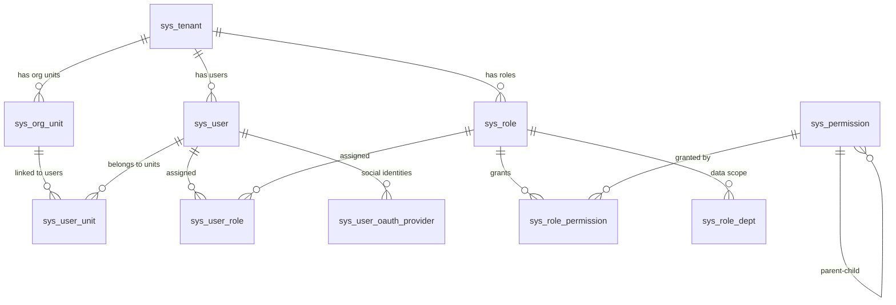

# System Architecture

## Goal

Omni-Stack is a microservices scaffolding platform providing a ready-to-use Spring Cloud + Vue 3 full-stack development environment. It enables teams to rapidly build business systems on a standardized, production-grade infrastructure.

## System Boundaries

| Boundary | Omni-Stack Frontend (omni-frontend) | Omni-Stack Backend (omni-backend) |
|----------|--------------------------------------|-----------------------------------|
| Responsibility | Presentation, interaction, routing, form UX, user state rendering | Business rules, permission checks, data consistency, persistence, audit |
| Prohibited | Must not contain business logic affecting data correctness | Must not contain presentation logic or UI concerns |
| Validation | Client-side UX validation (required fields, format hints) | Server-side authoritative validation (Jakarta Bean Validation) |

## Module Map

| Module | Role | Port | Technology | Boundary Constraint |
|--------|------|------|------------|---------------------|
| `omni-common` | Shared models, utils, exception handling, Jackson config | N/A (library) | Spring Boot Web (optional), Validation (optional), Lombok | No business logic; only cross-cutting concerns |
| `omni-gateway` | API Gateway, request routing, authentication filter | 8102 | Spring Cloud Gateway Server (WebFlux) | No business logic; routing and cross-cutting filters only |
| `omni-auth` | Authentication microservice (login, captcha, JWT, multi-tenant) | 8100 | Spring Boot Web, Spring Security, OAuth2 Authorization Server | Authentication logic lives here; no direct HTTP/response manipulation in Service layer |
| `omni-frontend` | Vue 3 SPA | 3000 (dev) | Vue 3, Pinia, Vue Router, Element Plus, Axios | Presentation layer only; no data-authoritative business rules |

## Dependency Graph

```
omni-common  (shared library, no Spring Boot main class)
    ^                ^
    |                |
omni-auth        (omni-gateway does NOT depend on omni-common;
    |             it uses the reactive WebFlux stack independently)
    |
    +-- registers with Nacos --+
                               |
omni-gateway --- routes via lb:// ---> omni-auth
    |
omni-frontend --- /api proxy :3000 ---> omni-gateway :8102
```

**Build dependency**: `omni-common` must be `mvn install`-ed before `omni-auth` or `omni-gateway` can compile.

## Data Flow

```
Browser (Vue SPA)
    |  HTTP request (e.g., POST /api/auth/login)
    v
Vite Dev Server (:3000)  -- proxy /api/** -->
    |
Gateway (:8102)
    |  1. Route matching: Path=/api/auth/** -> lb://omni-auth
    |  2. StripPrefix=2: /api/auth/login -> /login
    v
Auth Service (:8100)
    |  1. AuthController receives /login
    |  2. CaptchaService validates captcha (Redis)
    |  3. OmniUserDetailsService authenticates user (multi-tenant)
    |  4. JwtTokenService generates RS256-signed JWT
    |  5. Response wrapped in R<T>
    v
JSON Response: { code: 200, message: "success", data: { accessToken, tokenType, expiresIn } }
    |
Browser stores JWT and uses it for subsequent authenticated requests
```

## External Dependencies

| Service | Purpose | Version | Port |
|---------|---------|---------|------|
| MySQL | Primary relational database (Auth + RBAC schemas) | 8.4 | 3306 |
| Redis | Captcha storage, session cache | 7.4 | 6379 |
| Nacos Server | Service discovery + configuration center | v3.1.1 | 8080, 8848 |
| Sentinel Dashboard | Flow control + circuit breaking dashboard | 1.8.8 | 8858 |

All services can be started with a single command: `docker compose up -d`. See `docker-compose.yml` in the project root.

**Start order**: MySQL -> Redis -> Nacos -> Sentinel -> Backend services (Auth, Gateway) -> Frontend

## Infrastructure

### Docker Compose Orchestration

The project root `docker-compose.yml` defines all four middleware services with:

- **Named volumes** (`mysql-data`, `redis-data`) for data persistence across restarts
- **Health checks** on MySQL and Redis to ensure readiness before dependent services start
- **Bridge network** (`omni-network`) for inter-service communication
- **SQL init mount**: `scripts/sql/init-all.sql` is mounted into MySQL's `docker-entrypoint-initdb.d/` for automatic first-run database initialization

### Database Schema

The `omni_auth` database contains 14 tables organized into two domains:

**OAuth2 Authorization (3 tables)**:

| Table | Purpose |
|-------|---------|
| `oauth2_registered_client` | OAuth2 client registrations (client_id, secrets, grant types, scopes) |
| `oauth2_authorization` | Active OAuth2 authorization records (access tokens, refresh tokens, authorization codes) |
| `oauth2_authorization_consent` | User-consented scopes per client |

**Multi-Tenant RBAC (11 tables)**:

| Table | Purpose |
|-------|---------|
| `sys_tenant` | Tenant registry (multi-tenancy root) |
| `sys_org_unit` | Organizational units with materialized path hierarchy |
| `sys_user` | User accounts (linked to tenant + org unit) |
| `sys_role` | Role definitions (scoped to tenant) |
| `sys_permission` | Permission tree (menu, button, API; materialized path) |
| `sys_user_role` | User-to-role assignments |
| `sys_role_permission` | Role-to-permission assignments |
| `sys_user_unit` | User-to-org-unit assignments (primary/secondary) |
| `sys_role_dept` | Role-to-department data scope bindings |
| `sys_token_blacklist` | Revoked JWT token blacklist |
| `sys_user_oauth_provider` | Third-party social login identity linking (GitHub/Google/WeChat/Gitee) |



Additionally, the `nacos_config` database (separate MySQL instance, same container) contains 10 tables for Nacos v3.1.1 configuration and permission management. See `scripts/sql/init-nacos.sql`.

Authoritative DDL and seed data: `scripts/sql/init-all.sql`.

## Key Constraints

1. **JDK 25 required**: Spring Boot 4.x Maven plugin requires Java 17+; this project targets JDK 25. `JAVA_HOME` must be set before running any Maven commands.
2. **Gateway 5.x config prefix**: Routes and settings must be under `spring.cloud.gateway.server.webflux`, NOT `spring.cloud.gateway` (the old prefix is silently ignored).
3. **Build order**: `omni-common` must be installed first. Use `./mvnw install -N && ./mvnw install -pl omni-common` from the parent POM if needed.
4. **No direct service-to-service calls**: Inter-service communication must go through OpenFeign clients, never raw HTTP calls.
5. **Gateway is reactive**: `omni-gateway` runs on WebFlux, not Servlet. It cannot depend on `omni-common` (which includes `spring-boot-starter-web`).

## Extension Points

### Adding a New Microservice

1. Create a new Maven module under `omni-backend/` (e.g., `omni-order`)
2. Add dependency on `omni-common` in the new module's `pom.xml`
3. Register the module in the parent `pom.xml` `<modules>` section
4. Add `@ComponentScan(basePackages = {"com.omni.order", "com.omni.common"})` to the application class (until auto-config is set up)
5. Configure `application.yml` with Nacos discovery and a unique port
6. Add a Gateway route in `omni-gateway/application.yml` for the new service

### Adding a New Frontend View

1. Create `src/views/<feature>/index.vue` following the SFC order: `<script setup>` -> `<template>` -> `<style scoped>`
2. Add a route in `src/router/index.ts` with `meta: { title, icon, requiresAuth }`
3. Create API functions in `src/api/<domain>.ts` using the shared Axios instance
4. If needed, create a Pinia store in `src/stores/<domain>.ts` using Composition API style
