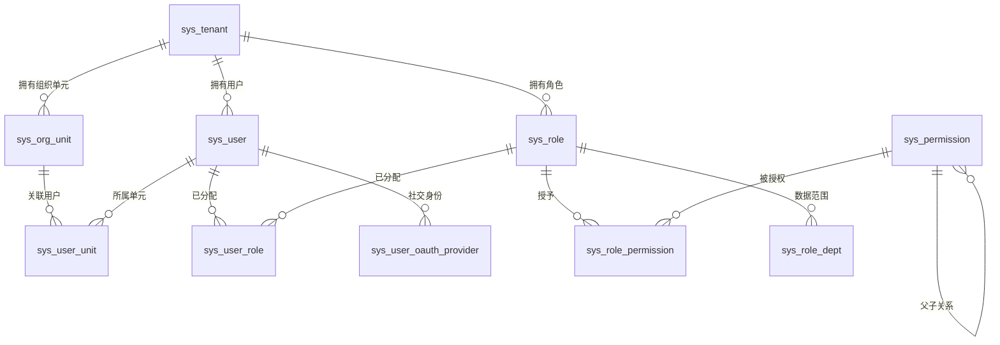

# 系统架构

> 本文档是 Omni-Stack 系统架构的完整技术参考。涵盖系统定位、技术选型思考、模块地图、局部架构设计、数据流、Docker 部署架构和扩展指南。  
> Docker 部署细节详见 [docker-deployment.md](docker-deployment.md)。

---

## 目录

- [1. 系统定位](#1-系统定位)
- [2. 技术选型思考](#2-技术选型思考)
- [3. 系统边界](#3-系统边界)
- [4. 模块地图](#4-模块地图)
- [5. 依赖关系图](#5-依赖关系图)
- [6. 局部架构设计](#6-局部架构设计)
- [7. 数据流](#7-数据流)
- [8. 外部依赖](#8-外部依赖)
- [9. 基础设施](#9-基础设施)
- [10. Docker 部署架构](#10-docker-部署架构)
- [11. RBAC 权限体系](#11-rbac-权限体系)
- [12. 关键约束](#12-关键约束)
- [13. 扩展点](#13-扩展点)
- [14. 实战示例：接入新微服务](#14-实战示例接入新微服务)

---

## 1. 系统定位

Omni-Stack 是一个微服务脚手架平台，提供开箱即用的 Spring Cloud + Vue 3 全栈开发环境。团队可以在标准化、生产级的基础设施上快速构建业务系统。

**核心设计哲学**：

- **Harness 模式**：Architecture → Patterns → Code 三层递进，架构决策驱动代码规范
- **Common Starter 生态**：8 个自动装配模块，新服务零配置接入基础设施
- **Gateway 中心化认证**：JWT 验证集中在网关，下游服务通过请求头信任链传递身份
- **Transactional Outbox**：MQ 消息可靠性通过本地事务表 + 异步中继保障

---

## 2. 技术选型思考

### 2.1 为什么选择 Spring Boot 4 + JDK 25

| 考量 | 决策理由 |
|------|----------|
| **Jakarta EE 11** | Spring Boot 4 基于 Jakarta EE 11，`jakarta.*` 包名已是标准，无需迁移成本 |
| **Virtual Threads** | JDK 25 的虚拟线程成熟稳定，适合 I/O 密集的微服务场景（数据库查询、HTTP 调用） |
| **Spring Security 7** | SAS（Spring Authorization Server）与 Spring Security 7 深度集成，OAuth2 + OIDC 原生支持 |
| **GraalVM 兼容** | Spring Boot 4 的 AOT 编译支持更完善，未来可选择 Native Image 降低启动时间和内存占用 |

### 2.2 为什么选择 Spring Cloud Gateway 5.x（WebFlux）

| 考量 | 决策理由 |
|------|----------|
| **响应式模型** | Gateway 是 I/O 密集的路由代理，WebFlux 的 Netty 事件循环模型比 Servlet 线程池更高效 |
| **Sleuth → Micrometer** | Gateway 5.x 使用 Micrometer Tracing，与 Spring Boot 4 的可观测性体系一致 |
| **路由 DSL** | `spring.cloud.gateway.server.webflux.routes` 配置前缀虽然冗长，但提供了声明式路由 + 过滤器链 |
| **注意事项** | 配置前缀必须是 `spring.cloud.gateway.server.webflux`，旧前缀 `spring.cloud.gateway` 被静默忽略 |

### 2.3 为什么选择 Nacos v3.1.1

| 考量 | 决策理由 |
|------|----------|
| **服务发现 + 配置中心一体** | 相比 Eureka（仅服务发现）+ Config Server（仅配置），Nacos 一个组件解决两个问题 |
| **MySQL 外部存储** | Nacos v3 支持 MySQL 持久化（`nacos_config` 数据库），避免嵌入式 Derby 的单点限制 |
| **gRPC 长连接** | v3 使用 gRPC 替代 HTTP 短轮询，服务注册/发现的延迟从秒级降到毫秒级 |
| **健康检查端点变更** | v3.1.1 的端点从 `/nacos/actuator/health` 变为 `GET /nacos/`，Docker healthcheck 需适配 |

### 2.4 为什么选择 Flowable 7.x

| 考量 | 决策理由 |
|------|----------|
| **开源 BPMN 引擎** | Flowable 是 Activiti 的 fork，社区活跃度更高，Spring Boot 集成更成熟 |
| **多实例（MI）原生支持** | 会签审批需要 MI 特性，Flowable 的 `completionCondition` 机制天然适配 |
| **版本 7.x 重构** | 7.x 版本重构了 API 层，与 Spring Boot 3/4 的兼容性更好 |
| **对比 Camunda** | Camunda 8.x 转向 Zeebe（分布式引擎），学习曲线更陡；Flowable 保持嵌入式引擎模式，更适合中小规模 |

### 2.5 为什么选择 XXL-JOB 而非 Quartz

| 考量 | 决策理由 |
|------|----------|
| **可视化管理** | XXL-JOB Admin 提供 Web 控制台，支持任务 CRUD、手动触发、执行日志查看 |
| **分布式调度** | XXL-JOB 的调度中心是独立进程，执行器（业务服务）无状态，天然支持水平扩展 |
| **项目已有依赖** | 项目已使用 XXL-JOB 做定时任务，MQ 消息中继复用同一调度引擎，不引入新依赖 |
| **对比 Quartz** | Quartz 需要数据库存储调度元数据，集群模式下依赖数据库锁，运维复杂度更高 |

---

## 3. 系统边界

| 边界 | Omni-Stack 前端（omni-frontend） | Omni-Stack 后端（omni-backend） |
|------|----------------------------------|--------------------------------|
| 职责 | 展示、交互、路由、表单 UX、用户状态渲染 | 业务规则、权限校验、数据一致性、持久化、审计 |
| 禁止 | 不得包含影响数据正确性的业务逻辑 | 不得包含展示逻辑或 UI 关注点 |
| 验证 | 客户端 UX 验证（必填项、格式提示） | 服务端权威验证（Jakarta Bean Validation） |

---

## 4. 模块地图

### 4.1 Common Starter 生态（8 个自动装配模块）

| 模块 | 职责 | 技术栈 | 边界约束 |
|------|------|--------|----------|
| `omni-common-core` | 纯 POJO：`R<T>`、`PageResult`、`BaseEntity`、`BusinessException`、XSS SPI（`XssConfigProvider`）、`UserJobHandler` SPI | Lombok、Jackson JSR310 | **零 Spring 依赖**，无框架注解 |
| `omni-common` | Web 自动装配：Jackson 时间配置、CORS、`GlobalExceptionHandler`、XSS Filter/Sanitizer/Deserializer | Spring Boot Web（optional）、Validation（optional） | 无业务逻辑，仅横切 Web 关注点 |
| `omni-common-mybatis` | MyBatis-Plus Starter：分页拦截器、MySQL 驱动、YAML 默认值 | MyBatis-Plus 3.5.16、MySQL Connector | `@ConditionalOnMissingBean` 允许服务级覆盖 |
| `omni-common-redis` | 阻塞式 Redis Starter：`RedisTemplate`（Jackson 序列化）+ `RedisUtils` | Spring Data Redis（Lettuce）、commons-pool2 | **仅 Servlet 服务使用**，禁止在 WebFlux 中引入 |
| `omni-common-redis-reactive` | 响应式 Redis Starter：`spring-boot-starter-data-redis-reactive` + YAML 默认值 | Spring Data Redis Reactive | **仅 WebFlux 服务使用**，禁止在 Servlet 中引入 |
| `omni-common-job` | XXL-JOB 集成：自动装配、Admin HTTP Client、系统任务注册、任务元数据注解 | XXL-JOB Core 3.3.1、Spring Boot Web（optional） | 仅调度基础设施，无业务任务逻辑 |
| `omni-common-mqlog` | 可靠 MQ 消息发送：Transactional Outbox、中继任务、策略模式发送器、内部查询 API | Spring Cloud Stream RocketMQ（optional）、omni-common-job（optional） | 仅 MQ 基础设施，无业务消息逻辑 |
| `omni-common-operlog` | 操作日志切面与生产者：`@OperLog` 注解驱动，支持可靠消息和直接发送两种模式 | Spring AOP、omni-common-mqlog（optional） | 仅操作日志关注点 |

### 4.2 微服务模块（5 个）

| 模块 | 端口 | 职责 | 核心依赖 |
|------|------|------|----------|
| `omni-auth` :8100 | 8100 | 认证授权：登录、验证码、JWT、多租户、OAuth2 授权服务器、XSS 配置管理、RBAC 权限、在线用户管理 | Spring Boot Web、Spring Security、OAuth2 Authorization Server |
| `omni-base` :8101 | 8101 | 基础数据：字典 CRUD、定时任务管理（系统 + 用户）、操作日志归档、MQ 消息管理 | Spring Boot Web、Spring Security、mybatis、redis、job、mqlog |
| `omni-workflow` :8103 | 8103 | 工作流引擎：BPMN 模型管理、流程实例、审批、任务分派、统计 | Spring Boot Web、Spring Security、omni-common-workflow、Flowable 7.x |
| `omni-crm` :8104 | 8104 | CRM 销售前闭环：线索、客户、联系人、商机、跟进、转换与概览 | Spring Boot Web、Spring Security、mybatis、redis、job、mqlog |
| `omni-gateway` :8102 | 8102 | API 网关：请求路由、JWT 认证过滤、CORS 处理、安全响应头 | Spring Cloud Gateway Server（WebFlux）、omni-common-redis-reactive |

### 4.3 前端模块

| 模块 | 端口 | 技术栈 | 职责 |
|------|------|--------|------|
| `omni-frontend` | 3000（dev）/ 3000（Nginx） | Vue 3、Pinia 3、Vue Router 4、Element Plus、Axios、Vite 8 | 展示层 SPA，不含数据权威性业务规则 |

---

## 5. 依赖关系图

```
omni-common-core  (纯 POJO: R<T>, PageResult, BaseEntity, XSS SPI, UserJobHandler SPI — 零 Spring 依赖)
    ^          ^          ^          ^          ^
    |          |          |          |          |
omni-common  omni-common-mybatis  omni-common-redis   omni-common-redis-reactive   omni-common-job
(Web auto-   (MyBatis-Plus +      (阻塞式 Redis +      (响应式 Redis,               (XXL-JOB 集成:
 config)      MySQL 驱动)          RedisUtils)           独立模块)                   自动配置, Admin Client,
    ^   ^          ^    ^              ^    ^                   ^                     系统任务注册)
    |   |          |    |              |    |                   |                          ^
    |   +----------+----+--------------+----+                  |                          |
    |                     |                                     |                          |
omni-auth :8100     omni-base :8101                     omni-gateway :8102
(Servlet, Security,  (Servlet, Security,                 (WebFlux, 依赖
 OAuth2 Auth Server)  字典 CRUD,                          core + redis-reactive,
    |                 定时任务管理)                         不依赖 omni-common)
    |                    |                                     |
    +-- 注册到 Nacos --+                                      |
                               |                               |
omni-gateway --- 通过显式 lb:// 路由 ---> omni-auth, omni-base, omni-workflow, omni-crm
    |
omni-frontend --- /api 代理 :3000 ---> omni-gateway :8102

omni-base --- XxlJobAdminClient (HTTP) ---> XXL-JOB Admin :18080
```

**构建依赖顺序**：`omni-common-core` → `omni-common` → `omni-common-mybatis` / `omni-common-redis` / `omni-common-redis-reactive` → `omni-auth` / `omni-base` / `omni-workflow` / `omni-crm` / `omni-gateway`。Maven reactor 从 `<modules>` 声明自动解析顺序。

### 局部与整体关系

每个模块在整体架构中承担明确的角色：

| 模块 | 对整体的支撑 |
|------|-------------|
| `omni-common-core` | **基石层**：所有模块共享的 POJO 定义和 SPI 接口，零框架依赖保证可移植性 |
| `omni-common-*` starters | **自动装配层**：通过 `AutoConfiguration.imports` 实现零配置接入，新服务只需添加 Maven 依赖 |
| `omni-auth` | **安全中枢**：集中处理认证、授权、JWT 签发，是整个系统信任链的起点 |
| `omni-gateway` | **流量入口**：所有 HTTP 请求的唯一入口，JWT 验证 + 身份传播 + 路由分发 |
| `omni-base` | **数据基座**：字典、日志、定时任务等公共业务数据的管理中心 |
| `omni-workflow` | **流程引擎**：独立部署的 BPMN 工作流服务，通过 `omni-common-workflow` starter 隔离 Flowable 依赖 |
| `omni-crm` | **销售业务域**：独立拥有 CRM 数据，通过 Auth 内部接口复用租户用户、组织和 permission-aware 数据范围 |

---

## 6. 局部架构设计

### 6.1 omni-auth 安全过滤器链（Security Filter Chain）

omni-auth 作为认证授权中枢，内部维护两条独立的安全过滤器链：

```
┌─────────────────────────────────────────────────────────────────────┐
│ Chain 1 (Order 1): OAuth2 授权服务器端点                              │
│ securityMatcher: /oauth2/**, /login, /.well-known/**                │
│                                                                     │
│ 请求 → SecurityContextPersistenceFilter                             │
│      → DeviceClientAuthenticationFilter（设备码公有客户端认证）        │
│      → DeviceRedirectFilter（设备授权流程重定向）                      │
│      → OAuth2AuthorizationEndpointFilter（授权码颁发）               │
│      → OAuth2TokenEndpointFilter（Token 颁发/刷新）                  │
│                                                                     │
│ 会话策略: STATELESS（OAuth2 端点无状态）                              │
├─────────────────────────────────────────────────────────────────────┤
│ Chain 2 (Order 2): 业务 API 端点                                    │
│ securityMatcher: NOT /oauth2/**                                     │
│                                                                     │
│ 请求 → GatewayPreAuthFilter（从 X-User-* 请求头构建 Authentication） │
│      → DataScopeResolveFilter（@Order(0)，解析数据权限范围）          │
│      → AuthorizationFilter（@PreAuthorize 方法级权限校验）           │
│                                                                     │
│ 会话策略: STATELESS（API 请求不创建 HttpSession）                    │
│ 认证白名单: /api/auth/**, /actuator/**, /error                     │
└─────────────────────────────────────────────────────────────────────┘
```

**关键组件交互**：

| 组件 | 位置 | 职责 |
|------|------|------|
| `AuthorizationServerConfig` | omni-auth/config | 双过滤器链配置、JWK 密钥源（RSA 2048）、OAuth2 客户端注册 |
| `OmniUserDetailsService` | omni-auth/security | 多租户用户加载（`tenantId:username` 格式） |
| `GatewayPreAuthFilter` | omni-auth/security | 从 Gateway 转发的请求头构建 `Authentication`（X-User-Id/Name/Tenant/Roles/Scopes） |
| `DataScopeResolveFilter` | omni-auth/security | 解析用户数据权限范围，写入 `DataScopeContext`（ThreadLocal） |
| `DeviceClientAuthenticationFilter` | omni-auth/security | RFC 8628 设备码授权流程的公有客户端认证 |
| `JwtTokenService` | omni-auth/service | RS256 签名 JWT 生成 |

### 6.2 omni-gateway WebFlux 管道

Gateway 基于 Spring Cloud Gateway 的响应式 WebFlux 技术栈，请求处理管道如下：

```
HTTP 请求进入
    │
    ▼
CorsConfig (CorsWebFilter)
    │ 处理 OPTIONS 预检请求，添加 CORS 响应头
    │ 优先级高于 AuthFilter，确保预检不被拦截
    ▼
AuthFilter (GlobalFilter, order=-100)
    │ 1. 白名单路径放行（/api/auth/login, /oauth2/**, /actuator/**）
    │ 2. 提取 Authorization: Bearer <JWT> 请求头
    │ 3. JwkKeyProvider 获取 RSA 公钥（WebClient → omni-auth:8080/oauth2/jwks，缓存 5 分钟）
    │ 4. RSASSAVerifier 验证 JWT 签名（RS256）
    │ 5. 检查过期时间
    │ 6. 检查 Token 黑名单（ReactiveStringRedisTemplate → Redis）
    │ 7. 提取 claims，注入转发请求头：
    │    X-User-Id, X-User-Name, X-Tenant-Id, X-User-Roles, X-User-Scopes
    ▼
SecurityHeadersFilter (WebFilter)
    │ 添加安全响应头：X-Content-Type-Options, X-Frame-Options, Referrer-Policy
    ▼
Spring Cloud Gateway 路由引擎
    │ 1. Route 匹配：Path=/api/auth/** → lb://omni-auth
    │ 2. 保留完整路径：/api/auth/login → /api/auth/login
    │ 3. 负载均衡：通过 Nacos 服务发现获取实例列表
    ▼
转发至下游微服务（omni-auth / omni-base / omni-workflow / omni-crm）
```

**关键设计决策**：

- **JwkKeyProvider 使用 `WebClient.create()`**：WebFlux 环境不自动配置 `WebClient.Builder` bean，因此手动创建
- **公钥缓存 5 分钟**：避免每次请求都调用 JWKS 端点，`volatile` 保证多线程可见性
- **`onErrorResume` 仅捕获 `SecurityException`**：避免下游路由错误（服务不可用、超时）被误报为 JWT 验证失败

### 6.3 omni-base / omni-workflow / omni-crm 安全模型

下游微服务（base、workflow、crm）采用统一的**网关预认证模型**。CRM 进一步以完整 permissionCode 从 Auth 解析数据范围，TenantLine 与 DataPermission 拦截器共同约束每条业务 SQL：

```
请求进入（已经 Gateway JWT 验证）
    │
    ▼
GatewayPreAuthFilter（OncePerRequestFilter）
    │ 从 X-User-* 请求头构建 UsernamePasswordAuthenticationToken
    │ 角色加 ROLE_ 前缀，权限直接作为 authority
    │ 写入 SecurityContextHolder
    ▼
AuthorizationFilter
    │ @PreAuthorize("hasAuthority('dict:type:list')") 方法级权限校验
    ▼
业务 Controller → Service → Mapper
```

**设计原理**：JWT 验证集中在 Gateway，下游服务信任 Gateway 注入的请求头。这样每个服务不需要独立配置 JWT 验证逻辑，降低复杂度和密钥管理成本。

---

## 7. 数据流

### 7.1 用户登录请求流

```
Browser (Vue SPA)
    │  HTTP 请求 (e.g., POST /api/auth/login)
    ▼
Vite Dev Server (:3000)  -- proxy /api/** -->
    │
Gateway (:8102)
    │  1. 路由匹配: Path=/api/auth/** -> lb://omni-auth
    │  2. 保留完整路径: /api/auth/login -> /api/auth/login
    ▼
Auth Service (:8100)
    │  1. AuthController 接收 /api/auth/login
    │  2. CaptchaService 验证验证码 (Redis)
    │  3. OmniUserDetailsService 认证用户 (多租户 tenantId:username)
    │  4. JwtTokenService 生成 RS256 签名 JWT
    │  5. 响应封装为 R<T>
    ▼
JSON 响应: { code: 200, message: "success", data: { accessToken, tokenType, expiresIn } }
    │
Browser 存储 JWT，后续请求自动携带
```

### 7.2 MQ 消息可靠投递流

```
业务服务 (e.g., omni-base / omni-crm)
    │  @Transactional
    │  ReliableMessageTemplate.send(bindingName, payload)
    ▼
sys_mq_message 表 (status=PENDING，同一本地事务)
    │
    │  XXL-JOB mqRelayHandler (每 10 秒)
    ▼
MqMessageRelayService.relayAll()
    │  1. SELECT * FROM sys_mq_message WHERE status IN (PENDING, FAILED) AND next_retry_time <= NOW() LIMIT 100
    │  2. MessageSender.send(message) — 策略模式按 broker_type 分发
    │  3a. 成功 → status=SENT
    │  3b. 失败 → retry_count++, next_retry_time = NOW() + 2^retryCount * 10s
    │      超过 max_retry → status=DEAD_LETTER, 记录 error_msg
    ▼
RocketMQ Broker (通过 StreamBridge)
    │
    │  管理 UI (omni-base 聚合本地与 CRM 内部 Outbox API)
    ▼
监控页面: 查询/重发/跳过死信消息
```

> 详见 [mq-reliability.md](mq-reliability.md)

---

## 8. 外部依赖

| 服务 | 用途 | 版本 | 端口 |
|------|------|------|------|
| MySQL | 主关系型数据库（Auth + RBAC + 业务数据） | 8.4 | 3306 |
| Redis | 验证码存储、会话缓存、Token 黑名单 | 7.4 | 6379 |
| Nacos Server | 服务发现 + 配置中心 | v3.1.1 | 8080, 8848, 9848 |
| Sentinel Dashboard | 流量控制 + 熔断降级控制台 | 1.8.8 | 8858 |
| XXL-JOB Admin | 分布式任务调度控制台 | 3.3.1 | 18080 |
| RocketMQ | 消息队列（NameServer + Broker） | 5.3.2 | 9876, 10909-10912 |

所有服务可通过一条命令启动：`docker compose up -d`。详见项目根目录 `docker-compose.yml`。

**启动顺序**：MySQL → Redis → Nacos → RocketMQ → XXL-JOB Admin → 后端服务（Auth, Base, Workflow, CRM, Gateway）→ 前端

---

## 9. 基础设施

### 9.1 Docker Compose 编排

项目根目录 `docker-compose.yml` 定义了所有 12 个容器：

- **命名卷**（`mysql-data`、`redis-data`）用于数据持久化
- **健康检查**（depends_on + service_healthy）确保分层启动链
- **Bridge 网络**（`omni-network`）用于容器间通信
- **SQL 初始化挂载**：`scripts/sql/init-all.sql`、`init-nacos.sql`、`init-xxl-job.sql` 挂载到 MySQL 的 `docker-entrypoint-initdb.d/`

### 9.2 数据库 Schema

#### omni_auth 数据库（14 表）

**OAuth2 授权（3 表）**：

| 表名 | 用途 |
|------|------|
| `oauth2_registered_client` | OAuth2 客户端注册（client_id、密钥、授权类型、作用域） |
| `oauth2_authorization` | 活跃的 OAuth2 授权记录（Access Token、Refresh Token、授权码） |
| `oauth2_authorization_consent` | 用户同意的作用域 |

**多租户 RBAC（11 表）**：

| 表名 | 用途 |
|------|------|
| `sys_tenant` | 租户注册表（多租户根） |
| `sys_org_unit` | 组织单元（物化路径层级结构） |
| `sys_user` | 用户账户（关联租户 + 组织单元） |
| `sys_role` | 角色定义（租户范围内） |
| `sys_permission` | 权限树（菜单、按钮、API；物化路径） |
| `sys_user_role` | 用户-角色关联 |
| `sys_role_permission` | 角色-权限关联 |
| `sys_user_unit` | 用户-组织单元关联（主/副） |
| `sys_role_dept` | 角色-部门数据范围绑定 |
| `sys_token_blacklist` | 已撤销 JWT 黑名单 |
| `sys_user_oauth_provider` | 第三方社交登录身份绑定 |
| `sys_xss_config` | 租户级 XSS 全局开关 |
| `sys_xss_blacklist_rule` | XSS 黑名单规则 |



#### omni_base 数据库

**数据字典（2 表）**：`sys_dict_type`（字典类型注册）+ `sys_dict_data`（字典数据条目）

**定时任务（3 表）**：`sys_user_job_type`（任务类型目录）+ `sys_user_job`（用户任务实例）+ `sys_user_job_log`（执行历史）

> 详见 [scheduling.md](scheduling.md)

#### omni_workflow 数据库

**工作流（7 表）**：`wf_process_model`（模型注册）+ `wf_process_model_version`（版本历史）+ `wf_process_instance_ext`（实例扩展）+ `wf_todo_task`（待办缓存）+ `wf_cc_record`（抄送记录）+ `wf_form_schema`（表单 Schema）+ `wf_delegation_rule`（审批委托规则）

> 详见 [workflow.md](workflow.md)

#### omni_crm 数据库

**CRM 核心表（11 表）**：`crm_tenant_config`、`crm_pipeline`、`crm_pipeline_stage`、`crm_lead`、`crm_lead_conversion`、`crm_customer`、`crm_contact`、`crm_opportunity`、`crm_opportunity_stage_history`、`crm_activity`、`crm_owner_change_log`，另含每服务独立的 `sys_mq_message` Outbox。所有 `crm_*` 表均含 `tenant_id`，授权根表保存 owner 快照并使用乐观锁。

> 详见 [crm-design.md](crm-design.md)

**权威 DDL 和种子数据**：`scripts/sql/init-all.sql`

---

## 10. Docker 部署架构

### 10.1 容器网络拓扑

所有容器共享 Docker Bridge 网络 `omni-network`：

```
┌───────────────────────────────────────────────────────────────────────┐
│                      Docker Network: omni-network                     │
│                                                                       │
│  ┌─────────────┐    ┌──────────┐    ┌────────┐    ┌──────────────┐  │
│  │ omni-       │    │ omni-    │    │ omni-  │    │ omni-        │  │
│  │ frontend    │───>│ gateway  │───>│ auth   │    │ workflow     │  │
│  │ :3000       │    │ :8080    │    │ :8080  │    │ :8080        │  │
│  │ (Nginx)     │    │ (WebFlux)│    │        │    │              │  │
│  └─────────────┘    └────┬─────┘    └───┬────┘    └──────────────┘  │
│                          │              │                             │
│                          │    ┌─────────┤    ┌──────────────┐       │
│                          └───>│ omni-   │    │ omni-        │       │
│                               │ base    │    │ common-job   │       │
│                               │ :8080   │    │ (XXL-JOB     │       │
│                               └────┬────┘    │  executor)   │       │
│                                    │         └──────────────┘       │
│  ┌────────┐  ┌────────┐  ┌────────┐  ┌──────────────┐  ┌────────┐ │
│  │ MySQL  │  │ Redis  │  │ Nacos  │  │ RocketMQ     │  │XXL-JOB │ │
│  │ :3306  │  │ :6379  │  │ :8848  │  │ NS:9876      │  │:8080   │ │
│  │        │  │        │  │ :9848  │  │ Broker:10909 │  │        │ │
│  └────────┘  └────────┘  └────────┘  └──────────────┘  └────────┘ │
└───────────────────────────────────────────────────────────────────────┘
        ↕ 宿主机端口映射
   :3000    :8100-8104   :3306  :6379  :8080  :8848  :19876  :18080
```

### 10.2 服务发现机制

```
omni-auth 启动
    │ @EnableDiscoveryClient
    │ spring.cloud.nacos.discovery.server-addr = nacos:8848
    ▼
Nacos 注册: service=omni-auth, ip=<容器内IP>, port=8080
    │
omni-gateway 启动
    │ @EnableDiscoveryClient
    │ spring.cloud.gateway.server.webflux.discovery.locator.enabled=false
    ▼
Gateway 显式路由: /api/crm/** → lb://omni-crm → Nacos 查询实例列表 → 负载均衡转发
```

**关键配置**：
- `SPRING_CLOUD_NACOS_DISCOVERY_IP: ""` — 让 Nacos 自动检测容器内 IP
- Docker 内部通信使用**容器内部端口 8080**，不是宿主机映射端口

### 10.3 环境变量覆盖策略

Spring Boot 环境变量优先级高于 `application.yml`，Docker 部署大量使用此机制：

| 环境变量 | 覆盖的配置项 | 示例值 |
|----------|-------------|--------|
| `SPRING_DATASOURCE_URL` | `spring.datasource.url` | `jdbc:mysql://mysql:3306/omni_auth` |
| `SPRING_DATA_REDIS_HOST` | `spring.data.redis.host` | `redis` |
| `SPRING_CLOUD_NACOS_DISCOVERY_SERVER_ADDR` | `spring.cloud.nacos.discovery.server-addr` | `nacos:8848` |
| `AUTH_JWKS_URI` | `auth.jwks.uri` | `http://omni-auth:8080/oauth2/jwks` |
| `SERVER_PORT` | `server.port` | `8080` |

> 完整环境变量覆盖表详见 [docker-deployment.md](docker-deployment.md) 第 6 节。

---

## 11. RBAC 权限体系

### 11.1 设计理念

Omni-Stack 采用 **RBAC-0 基础权限模型**（用户-角色-权限），分为两个独立但互补的子系统：

1. **功能权限**（Functional Permission）：控制用户"能做什么" — 菜单可见性 + 按钮/API 级操作权限
2. **数据权限**（Data Permission）：控制用户"能看哪些数据" — 基于组织归属的行级过滤

多租户场景下，用户名在租户内唯一（`sys_user` 表使用 `(username, tenant_id)` 联合唯一键），权限编码格式为 `resource:action`（细粒度 API 级）。

### 11.2 功能权限架构

功能权限实现为 **菜单过滤 + 按钮级控制 + API 鉴权** 三层防护：

```
┌─────────────────────────────────────────────────────────────┐
│ Layer 1: 动态菜单过滤（MenuController）                      │
│ 后端基于用户权限集合递归过滤权限树，                           │
│ 仅返回 DIRECTORY（有可见子节点）和 MENU（有权限编码）节点       │
│ → 前端据动态注册路由 + 渲染侧边栏                             │
├─────────────────────────────────────────────────────────────┤
│ Layer 2: 按钮级权限控制（v-permission 指令）                  │
│ Vue 自定义指令 v-permission="'system:user:create'"            │
│ 从 PermissionStore 查询权限编码，display:none 隐藏无权限按钮    │
├─────────────────────────────────────────────────────────────┤
│ Layer 3: API 鉴权（Spring Security @PreAuthorize）           │
│ Controller 方法声明 @PreAuthorize("hasAuthority('xxx')")      │
│ Spring Security 在方法调用前校验 JWT 中的权限集合              │
└─────────────────────────────────────────────────────────────┘
```

**权限树结构**（`sys_permission` 表，物化路径）：

| 节点类型 | 用途 | 示例 |
|---------|------|------|
| `DIRECTORY` | 菜单分组目录 | "系统管理" |
| `MENU` | 可路由菜单页面 | "用户管理" (path: /system/user) |
| `BUTTON` | 按钮/API 操作 | "创建用户" (code: system:user:create) |
| `API` | 细粒度 API 端点 | "GET /api/auth/user/list" |

### 11.3 数据权限架构

数据权限基于 **MyBatis-Plus `DataPermissionInterceptor`** 实现 SQL 自动拦截，业务代码零侵入。

**六级数据范围（dataScope）**：

| 级别 | dataScope 值 | 含义 | 优先级 |
|------|-------------|------|--------|
| 最宽松 | `ALL` | 所有数据（跨租户） | 1 |
| | `TENANT` | 本租户所有数据 | 2 |
| | `DEPT_AND_BELOW` | 本部门及所有下级部门 | 3 |
| | `DEPT` | 仅本部门 | 4 |
| | `CUSTOM` | 自定义部门集合（`sys_role_dept` 关联表） | 5 |
| 最严格 | `SELF` | 仅自己的数据 | 6 |

**多角色合并规则**：最宽松优先 — 当用户拥有多个角色时，取优先级数值最小的 dataScope。

**请求级数据流**：

```
HTTP Request (含 X-User-Id, X-Tenant-Id Header)
    │
    ▼
DataScopeResolveFilter (OncePerRequestFilter, @Order(0))
    │ 1. 从 Header 提取 userId, tenantId
    │ 2. 查询用户所有角色 → sys_role_mapper.selectRolesByUserId()
    │ 3. 合并所有角色的 dataScope → 取最宽松
    │ 4. 解析可访问的组织单元 ID 集合（DEPT*/CUSTOM 查询物化路径后代）
    │ 5. 写入 DataScopeContext (ThreadLocal)
    ▼
MyBatis-Plus DataPermissionInterceptor
    │ 拦截 sys_user 表的 SELECT 查询
    │ 调用 DataPermissionHandlerImpl.getSqlSegment()
    │ 根据 effectiveScope 自动追加 WHERE 条件：
    │   ALL/TENANT → 不追加
    │   SELF       → WHERE sys_user.id = {userId}
    │   DEPT*/CUSTOM → WHERE sys_user.primary_unit_id IN (...)
    ▼
业务代码（Controller → Service → Mapper）
    │ 零侵入，无需感知数据权限存在
    ▼
DataScopeContext.clear() (finally 块，防止 ThreadLocal 泄漏)
```

**两种过滤模式**：

| 模式 | 适用场景 | 实现方式 |
|------|---------|---------|
| SQL 拦截 | 数据库查询（如用户列表） | `DataPermissionInterceptor` + `DataPermissionHandlerImpl` 自动追加 WHERE |
| 内存过滤 | 非数据库数据（如 Redis 中的在线用户） | Controller 读取 `DataScopeContext` 按 `primaryUnitId` 过滤 |

### 11.4 RBAC 管理流程

- **角色管理**：创建角色 → 分配权限（`sys_role_permission`）→ 设置数据范围（`sys_role.data_scope`）→ 自定义部门（`sys_role_dept`，仅 CUSTOM 范围）
- **用户授权**：创建用户 → 分配角色（`sys_user_role`）→ 分配组织单元（`sys_user_unit`，标记 primary）
- **菜单渲染**：登录 → JWT 含权限编码 → 前端调用 `/api/auth/menus` → 后端递归过滤 → 前端动态注册路由
- **数据查询**：请求 → Gateway 注入身份头 → Filter 解析数据范围 → MyBatis-Plus 自动追加 SQL → 返回过滤后数据

> 完整 RBAC 流程时序图详见 [core-flows.md](core-flows.md)

---

## 12. 关键约束

1. **JDK 25 必须**：Spring Boot 4.x Maven plugin 要求 Java 17+；本项目目标 JDK 25。`JAVA_HOME` 必须在运行 Maven 命令前设置。
2. **Gateway 5.x 配置前缀**：路由和设置必须在 `spring.cloud.gateway.server.webflux` 下，旧前缀 `spring.cloud.gateway` 被静默忽略。
3. **构建顺序**：`omni-common-core` 必须先 install，然后 `omni-common`，再 common starters。使用 `./mvnw clean install` 从父 POM — Maven reactor 自动解析顺序。
4. **无直接服务间调用**：服务间通信必须通过 OpenFeign 客户端，不得使用原始 HTTP 调用。
5. **Gateway 是响应式的**：`omni-gateway` 运行在 WebFlux 上。依赖 `omni-common-core`（纯 POJO）和 `omni-common-redis-reactive`，**不依赖** `omni-common` 或 `omni-common-redis`（阻塞式 Redis 会饿死 Netty 事件循环线程）。
6. **Redis Starter 互斥**：`omni-common-redis`（阻塞式）和 `omni-common-redis-reactive`（响应式）不得在同一服务中混用。Servlet 服务用阻塞式；WebFlux 服务用响应式。
7. **XXL-JOB Admin 必须先启动**：`XxlJobSpringExecutor` 在启动时注册到 Admin；用户任务创建/更新需要 `XxlJobAdminClient` HTTP 调用。
8. **omni-common-job 是库模块**：不能独立运行。只有 Servlet 服务应该依赖它。WebFlux 服务不得依赖（XXL-JOB executor 使用阻塞 I/O）。

---

## 13. 扩展点

### 13.1 新增 OAuth2 社交登录提供商

社交登录框架使用策略模式（`OAuth2ProviderHandler` 接口），新增提供商（如 Google、WeChat）需要：

1. **创建处理器实现**：创建 `XxxOAuth2Handler.java` 实现 `OAuth2ProviderHandler`，注解 `@Component("xxx")`。实现 `getProviderId()`、`buildAuthorizationUrl()`、`exchangeCodeForAccessToken()`、`fetchUserProfile()`（返回统一的 `ProviderUser` DTO）。
2. **添加配置**：在 `OAuth2Properties.java` 中新增 `XxxProperties` 内部静态类。
3. **配置凭证**：在 `application.yml` 中添加 `auth.oauth2.xxx.*` 配置节。
4. **添加用户名前缀**：在 `SocialLoginServiceImpl.getUsernamePrefix()` switch 表达式中添加 case。

`SocialLoginServiceImpl` 通过 Spring 的 `Map<String, OAuth2ProviderHandler>` 注入自动发现新处理器。

**当前已实现**：GitHub、Google、Gitee。

> 详见 [core-flows.md](core-flows.md) Flow 4

### 13.2 新增 XSS 防护到新服务

XSS 防御系统是模块化的 — 新服务通过依赖 Common Starter 生态继承防护：

1. 添加 `omni-common-core` + `omni-common` 依赖
2. 实现 `XssConfigProvider` SPI 接口
3. 使用 Redis 缓存策略（`xss:enabled:{tenantId}` + `xss:rules:{tenantId}`，30 分钟 TTL）
4. `XssAutoConfiguration` 通过 `AutoConfiguration.imports` 自动注册

### 13.3 新增用户任务类型

用户任务系统使用 SPI 模式（`UserJobHandler`）：

1. INSERT `sys_user_job_type` 注册任务类型（`type_code` 唯一，映射到 Bean 名称）
2. 创建 `@Component("{type_code}")` 类实现 `UserJobHandler`
3. `UserJobHandlerRegistry` 通过 `Map<String, UserJobHandler>` 注入自动发现

> 完整教程详见 [scheduling.md](scheduling.md) 第 4 章

---

## 14. 实战示例：接入新微服务

以下以创建 `omni-order`（订单服务）为例，展示完整的接入步骤。

### 14.1 创建 Maven 模块

```
omni-backend/
└── omni-order/                    # 新模块
    ├── pom.xml
    └── src/main/java/com/omni/order/
        ├── OrderApplication.java
        ├── controller/
        ├── service/
        ├── mapper/
        ├── entity/
        └── config/
```

### 14.2 配置 POM 依赖

```xml
<dependencies>
    <!-- 必须的 Common Starters -->
    <dependency>
        <groupId>com.omni</groupId>
        <artifactId>omni-common-core</artifactId>   <!-- R<T>, PageResult -->
    </dependency>
    <dependency>
        <groupId>com.omni</groupId>
        <artifactId>omni-common</artifactId>         <!-- Web 自动装配 + XSS -->
    </dependency>
    <dependency>
        <groupId>com.omni</groupId>
        <artifactId>omni-common-mybatis</artifactId> <!-- MyBatis-Plus + MySQL -->
    </dependency>
    <dependency>
        <groupId>com.omni</groupId>
        <artifactId>omni-common-redis</artifactId>   <!-- Redis 缓存 -->
    </dependency>
    <!-- 按需添加 -->
    <dependency>
        <groupId>com.omni</groupId>
        <artifactId>omni-common-job</artifactId>     <!-- 如需定时任务 -->
    </dependency>
</dependencies>
```

### 14.3 注册到父 POM

在 `omni-backend/pom.xml` 的 `<modules>` 中添加：

```xml
<modules>
    <!-- 现有模块... -->
    <module>omni-order</module>
</modules>
```

### 14.4 配置 application.yml

```yaml
server:
  port: 8104                        # 唯一端口

spring:
  application:
    name: omni-order                # Nacos 服务名
  datasource:
    url: jdbc:mysql://localhost:3306/omni_order?...
    username: root
    password: root
  data:
    redis:
      host: 127.0.0.1
      port: 6379
      database: 4                   # 独立 Redis DB
  cloud:
    nacos:
      discovery:
        server-addr: ${NACOS_SERVER_ADDR:127.0.0.1:8848}
        ip: 127.0.0.1
```

### 14.5 添加 Gateway 路由

在 `omni-gateway/application.yml` 中添加：

```yaml
- id: omni-order
  uri: lb://omni-order
  predicates:
    - Path=/api/order/**
```

下游 Controller 保留并声明完整 `/api/order/**` 路径；当前网关不做 `StripPrefix`。

### 14.6 添加权限种子数据

在 `scripts/sql/init-all.sql` 中添加 `sys_permission` 记录：

```sql
INSERT INTO sys_permission
    (tenant_id, parent_id, permission_name, permission_code, type, path, depth, sort, status) VALUES
(1, 0, '订单管理', 'order', 'DIRECTORY', '/<目录ID>/', 1, 1, 1),
(1, @order_dir, '订单列表', 'order:list', 'MENU', '/<目录ID>/<菜单ID>/', 2, 1, 1),
(1, @order_list, '查看订单', 'order:detail:query', 'API', '/<目录ID>/<菜单ID>/<权限ID>/', 3, 1, 1);
```

### 14.7 Docker 部署配置

在 `docker-compose.yml` 中添加服务定义：

```yaml
omni-order:
  build:
    context: ./omni-backend
    dockerfile: ../docker/backend/Dockerfile
    args:
      SERVICE_NAME: omni-order
  ports:
    - "8104:8080"
  environment:
    SERVER_PORT: "8080"
    SPRING_DATASOURCE_URL: "jdbc:mysql://mysql:3306/omni_order?..."
    SPRING_DATA_REDIS_HOST: redis
    SPRING_CLOUD_NACOS_DISCOVERY_SERVER_ADDR: nacos:8848
  depends_on:
    nacos: { condition: service_healthy }
    redis: { condition: service_healthy }
    mysql: { condition: service_healthy }
```

### 14.8 验证清单

- [ ] `mvn clean install` 编译通过
- [ ] 本地启动后 Nacos 控制台可见 `omni-order` 服务
- [ ] `GET /api/order/xxx` 通过 Gateway 路由成功
- [ ] `@PreAuthorize` 权限注解生效（需要 `GatewayPreAuthFilter`）
- [ ] XSS 防护自动生效（依赖 `omni-common`）
- [ ] MyBatis-Plus 分页自动配置

> MyBatis-Plus 分页、Jackson 时间配置、CORS、`GlobalExceptionHandler`、XSS Filter 全部通过 `AutoConfiguration.imports` 自动配置 — 无需手动 `@ComponentScan("com.omni.common")`。
