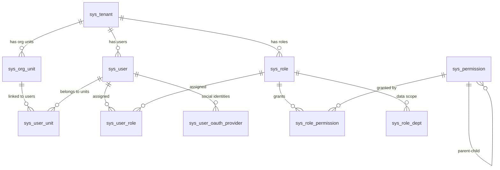
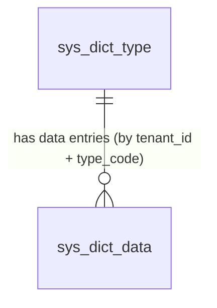
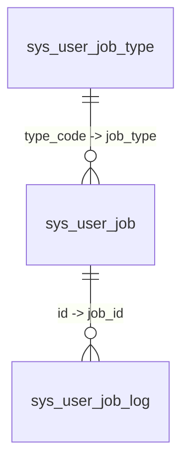

# System Architecture

## Goal

Omni-Stack is a microservices scaffolding platform providing a ready-to-use Spring Cloud + Vue 3 full-stack development environment. It enables teams to rapidly build business systems on a standardized, production-grade infrastructure.

## System Boundaries

| Boundary | Omni-Stack Frontend (omni-frontend) | Omni-Stack Backend (omni-backend) |
|----------|--------------------------------------|-----------------------------------|
| Responsibility | Presentation, interaction, routing, form UX, user state rendering | Business rules, permission checks, data consistency, persistence, audit |
| Prohibited | Must not contain business logic affecting data correctness | Must not contain presentation logic or UI concerns |
| Validation | Client-side UX validation (required fields, format hints) | Server-side authoritative validation (Jakarta Bean Validation) |

## Module Map

| Module | Role | Port | Technology | Boundary Constraint |
|--------|------|------|------------|---------------------|
| `omni-common-core` | Pure POJO: `R<T>`, `PageResult`, `BaseEntity`, `BusinessException`, XSS SPI (`XssConfigProvider`) | N/A (library) | Lombok, Jackson JSR310 | Zero Spring dependencies; no framework annotations |
| `omni-common` | Web auto-config: Jackson time config, CORS, `GlobalExceptionHandler`, XSS Filter/Sanitizer/Deserializer | N/A (library) | Spring Boot Web (optional), Validation (optional) | No business logic; cross-cutting web concerns only |
| `omni-common-mybatis` | MyBatis-Plus starter: pagination interceptor, MySQL driver, YAML defaults | N/A (library) | MyBatis-Plus 3.5.16, MySQL Connector | `@ConditionalOnMissingBean` allows service-level override |
| `omni-common-redis` | Blocking Redis starter: `RedisTemplate` (Jackson serialization) + `RedisUtils` | N/A (library) | Spring Data Redis (Lettuce), commons-pool2 | Servlet services only; never in WebFlux |
| `omni-common-redis-reactive` | Reactive Redis starter: `spring-boot-starter-data-redis-reactive` + YAML defaults | N/A (library) | Spring Data Redis Reactive | WebFlux services only; never in Servlet |
| `omni-common-job` | XXL-JOB integration: auto-configuration, admin HTTP client, system job registry, job metadata annotations | N/A (library) | XXL-JOB Core 3.3.1, Spring Boot Web (optional) | Scheduling infrastructure only; no business task logic |
| `omni-auth` | Authentication microservice (login, captcha, JWT, multi-tenant, XSS config management) | 8100 | Spring Boot Web, Spring Security, OAuth2 Authorization Server | Authentication logic lives here; no direct HTTP/response manipulation in Service layer |
| `omni-base` | Base data management: dictionary CRUD, scheduled tasks (system + user), operation log archival | 8101 | Spring Boot Web, Spring Security, omni-common-mybatis, omni-common-redis, omni-common-job | Data dictionary + scheduling; no auth/user logic |
| `omni-gateway` | API Gateway, request routing, authentication filter | 8102 | Spring Cloud Gateway Server (WebFlux) | No business logic; routing and cross-cutting filters only |
| `omni-frontend` | Vue 3 SPA | 3000 (dev) | Vue 3, Pinia, Vue Router, Element Plus, Axios | Presentation layer only; no data-authoritative business rules |

## Dependency Graph

```
omni-common-core  (pure POJO: R<T>, PageResult, BaseEntity, XSS SPI, UserJobHandler SPI — zero Spring deps)
    ^          ^          ^          ^          ^
    |          |          |          |          |
omni-common  omni-common-mybatis  omni-common-redis   omni-common-redis-reactive   omni-common-job
(Web auto-   (MyBatis-Plus +      (blocking Redis +    (reactive Redis,            (XXL-JOB integration:
 config)      MySQL driver)        RedisUtils)           standalone)                auto-config, admin client,
    ^   ^          ^    ^              ^    ^                   ^                    system job registry)
    |   |          |    |              |    |                   |                          ^
    |   +----------+----+--------------+----+                  |                          |
    |                     |                                     |                          |
omni-auth :8100     omni-base :8101                     omni-gateway :8102
(Servlet, Security,  (Servlet, Security,                 (WebFlux, depends on
 OAuth2 Auth Server)  Dictionary CRUD,                   core + redis-reactive,
    |                 Scheduling tasks)                    NOT omni-common)
    |                    |                                     |
    +-- registers with Nacos --+                               |
                               |                               |
omni-gateway --- routes via lb:// ---> omni-auth, omni-base
    |
omni-frontend --- /api proxy :3000 ---> omni-gateway :8102

omni-base --- XxlJobAdminClient (HTTP) ---> XXL-JOB Admin :18080
```

**Build dependency**: `omni-common-core` must be `mvn install`-ed first, then `omni-common`, then `omni-common-mybatis` / `omni-common-redis` / `omni-common-redis-reactive`, before `omni-auth`, `omni-base`, or `omni-gateway` can compile. Maven reactor resolves ordering automatically from `<modules>` declaration.

## Data Flow

```
Browser (Vue SPA)
    |  HTTP request (e.g., POST /api/auth/login)
    v
Vite Dev Server (:3000)  -- proxy /api/** -->
    |
Gateway (:8102)
    |  1. Route matching: Path=/api/auth/** -> lb://omni-auth
    |  2. StripPrefix=2: /api/auth/login -> /login
    v
Auth Service (:8100)
    |  1. AuthController receives /login
    |  2. CaptchaService validates captcha (Redis)
    |  3. OmniUserDetailsService authenticates user (multi-tenant)
    |  4. JwtTokenService generates RS256-signed JWT
    |  5. Response wrapped in R<T>
    v
JSON Response: { code: 200, message: "success", data: { accessToken, tokenType, expiresIn } }
    |
Browser stores JWT and uses it for subsequent authenticated requests
```

## External Dependencies

| Service | Purpose | Version | Port |
|---------|---------|---------|------|
| MySQL | Primary relational database (Auth + RBAC schemas) | 8.4 | 3306 |
| Redis | Captcha storage, session cache | 7.4 | 6379 |
| Nacos Server | Service discovery + configuration center | v3.1.1 | 8080, 8848 |
| Sentinel Dashboard | Flow control + circuit breaking dashboard | 1.8.8 | 8858 |
| XXL-JOB Admin | Distributed task scheduling console | 3.3.1 | 18080 |

All services can be started with a single command: `docker compose up -d`. See `docker-compose.yml` in the project root.

**Start order**: MySQL -> Redis -> Nacos -> Sentinel -> XXL-JOB Admin -> Backend services (Auth, Base, Gateway) -> Frontend

## Infrastructure

### Docker Compose Orchestration

The project root `docker-compose.yml` defines all four middleware services with:

- **Named volumes** (`mysql-data`, `redis-data`) for data persistence across restarts
- **Health checks** on MySQL and Redis to ensure readiness before dependent services start
- **Bridge network** (`omni-network`) for inter-service communication
- **SQL init mount**: `scripts/sql/init-all.sql` is mounted into MySQL's `docker-entrypoint-initdb.d/` for automatic first-run database initialization

### Database Schema

The `omni_auth` database contains 14 tables organized into two domains:

**OAuth2 Authorization (3 tables)**:

| Table | Purpose |
|-------|---------|
| `oauth2_registered_client` | OAuth2 client registrations (client_id, secrets, grant types, scopes) |
| `oauth2_authorization` | Active OAuth2 authorization records (access tokens, refresh tokens, authorization codes) |
| `oauth2_authorization_consent` | User-consented scopes per client |

**Multi-Tenant RBAC (11 tables)**:

| Table | Purpose |
|-------|---------|
| `sys_tenant` | Tenant registry (multi-tenancy root) |
| `sys_org_unit` | Organizational units with materialized path hierarchy |
| `sys_user` | User accounts (linked to tenant + org unit) |
| `sys_role` | Role definitions (scoped to tenant) |
| `sys_permission` | Permission tree (menu, button, API; materialized path) |
| `sys_user_role` | User-to-role assignments |
| `sys_role_permission` | Role-to-permission assignments |
| `sys_user_unit` | User-to-org-unit assignments (primary/secondary) |
| `sys_role_dept` | Role-to-department data scope bindings |
| `sys_token_blacklist` | Revoked JWT token blacklist |
| `sys_user_oauth_provider` | Third-party social login identity linking (GitHub/Google/WeChat/Gitee) |
| `sys_xss_config` | Per-tenant XSS global toggle (enabled/disabled) |
| `sys_xss_blacklist_rule` | XSS blacklist rules (HTML_TAG, EVENT_HANDLER, DANGEROUS_PROTOCOL, CUSTOM_PATTERN) |



Additionally, the `nacos_config` database (separate MySQL instance, same container) contains 10 tables for Nacos v3.1.1 configuration and permission management. See `scripts/sql/init-nacos.sql`.

Authoritative DDL and seed data: `scripts/sql/init-all.sql`.

### omni_base Database

The `omni_base` database contains 2 tables for data dictionary management, served by the `omni-base` microservice:

**Data Dictionary (2 tables)**:

| Table | Purpose |
|-------|---------|
| `sys_dict_type` | Dictionary type registry — defines encoding categories (e.g., `sys_user_gender`). Unique key `(tenant_id, type_code)`. Columns: `id`, `tenant_id`, `type_code`, `type_name`, `remark`, `sort`, `status`, `create_time`, `update_time`, `create_by`, `update_by` |
| `sys_dict_data` | Dictionary data entries — concrete key-value pairs within a type (e.g., `1=Male, 2=Female`). Indexed on `(tenant_id, type_code)`. Columns: `id`, `tenant_id`, `type_code`, `dict_value`, `dict_label`, `tag_type`, `remark`, `sort`, `status`, `create_time`, `update_time`, `create_by`, `update_by` |



**Seed data** (tenant 1): 3 preset dictionary types (`sys_user_gender`, `sys_common_status`, `sys_notice_type`) with 7 data entries. See `scripts/sql/init-all.sql` Section 5.

### Scheduling Tables

The `omni_base` database also contains 3 tables for scheduled task management, served by the `omni-base` microservice:

**Scheduled Tasks (3 tables)**:

| Table | Purpose |
|-------|---------|
| `sys_user_job_type` | Task type catalog — defines available task types with `type_code` (unique, maps to `UserJobHandler` Bean name), `type_name`, `description`, and `param_template` (JSON Schema for dynamic form rendering) |
| `sys_user_job` | User task instances — `job_name`, `job_type` (FK to `type_code`), `cron_expression`, `job_params` (JSON), `xxl_job_id` (link to XXL-JOB), `last_fire_time`, `status`, `create_by` (ownership) |
| `sys_user_job_log` | Execution history — `job_id`, `fire_time`, `execute_time_ms`, `status` (0=fail, 1=success), `result_message` (for frontend notification), `error_message` |



**Seed data** (tenant 1): 1 preset task type (`Task-00001` — Drink Water Reminder with `cupShape` parameter). See `scripts/sql/init-all.sql` Section 6.

Detailed scheduling architecture: see `docs/scheduling.md`.

## RBAC Permission System

### Design Philosophy

Omni-Stack 采用 **RBAC-0 基础权限模型**（用户-角色-权限），分为两个独立但互补的子系统：

1. **功能权限**（Functional Permission）：控制用户"能做什么" — 菜单可见性 + 按钮/API 级操作权限
2. **数据权限**（Data Permission）：控制用户"能看哪些数据" — 基于组织归属的行级过滤

多租户场景下，用户名在租户内唯一（`sys_user` 表使用 `(username, tenant_id)` 联合唯一键），权限编码格式为 `resource:action`（细粒度 API 级）。

### Functional Permission Architecture

功能权限实现为 **菜单过滤 + 按钮级控制 + API 鉴权** 三层防护：

```
┌─────────────────────────────────────────────────────────────┐
│ Layer 1: 动态菜单过滤（MenuController）                      │
│ 后端基于用户权限集合递归过滤权限树，                           │
│ 仅返回 DIRECTORY（有可见子节点）和 MENU（有权限编码）节点       │
│ → 前端据动态注册路由 + 渲染侧边栏                             │
├─────────────────────────────────────────────────────────────┤
│ Layer 2: 按钮级权限控制（v-permission 指令）                  │
│ Vue 自定义指令 v-permission="'system:user:create'"            │
│ 从 PermissionStore 查询权限编码，display:none 隐藏无权限按钮    │
├─────────────────────────────────────────────────────────────┤
│ Layer 3: API 鉴权（Spring Security @PreAuthorize）           │
│ Controller 方法声明 @PreAuthorize("hasAuthority('xxx')")      │
│ Spring Security 在方法调用前校验 JWT 中的权限集合              │
└─────────────────────────────────────────────────────────────┘
```

**关键组件**：

| 组件 | 位置 | 职责 |
|------|------|------|
| `MenuController` | omni-auth | 动态菜单树过滤与输出 |
| `PermissionService` | omni-auth | 权限树查询、角色-权限关联管理 |
| `usePermissionStore` | omni-frontend | Pinia Store，存储权限编码列表和菜单树 |
| `v-permission` 指令 | omni-frontend | 按钮级 DOM 显隐控制 |

**权限树结构**（`sys_permission` 表，物化路径）：

| 节点类型 | 用途 | 示例 |
|---------|------|------|
| `DIRECTORY` | 菜单分组目录 | "系统管理" |
| `MENU` | 可路由菜单页面 | "用户管理" (path: /system/user) |
| `BUTTON` | 按钮/API 操作 | "创建用户" (code: system:user:create) |
| `API` | 细粒度 API 端点 | "GET /api/auth/user/list" |

### Data Permission Architecture

数据权限基于 **MyBatis-Plus `DataPermissionInterceptor`** 实现 SQL 自动拦截，业务代码零侵入。

**六级数据范围（dataScope）**：

| 级别 | dataScope 值 | 含义 | 优先级 |
|------|-------------|------|--------|
| 最宽松 | `ALL` | 所有数据（跨租户） | 1 |
| | `TENANT` | 本租户所有数据 | 2 |
| | `DEPT_AND_BELOW` | 本部门及所有下级部门 | 3 |
| | `DEPT` | 仅本部门 | 4 |
| | `CUSTOM` | 自定义部门集合（`sys_role_dept` 关联表） | 5 |
| 最严格 | `SELF` | 仅自己的数据 | 6 |

**多角色合并规则**：最宽松优先 — 当用户拥有多个角色时，取优先级数值最小的 dataScope。

**请求级数据流**：

```
HTTP Request (含 X-User-Id, X-Tenant-Id Header)
    │
    v
DataScopeResolveFilter (OncePerRequestFilter, @Order(0))
    │ 1. 从 Header 提取 userId, tenantId
    │ 2. 查询用户所有角色 → sys_role_mapper.selectRolesByUserId()
    │ 3. 合并所有角色的 dataScope → 取最宽松
    │ 4. 解析可访问的组织单元 ID 集合（DEPT*/CUSTOM 查询物化路径后代）
    │ 5. 写入 DataScopeContext (ThreadLocal)
    v
MyBatis-Plus DataPermissionInterceptor
    │ 拦截 sys_user 表的 SELECT 查询
    │ 调用 DataPermissionHandlerImpl.getSqlSegment()
    │ 根据 effectiveScope 自动追加 WHERE 条件：
    │   ALL/TENANT → 不追加
    │   SELF       → WHERE sys_user.id = {userId}
    │   DEPT*/CUSTOM → WHERE sys_user.primary_unit_id IN (...)
    v
业务代码（Controller → Service → Mapper）
    │ 零侵入，无需感知数据权限存在
    │ 特殊情况（在线用户等内存数据）：Controller 读取 DataScopeContext 手动过滤
    v
DataScopeContext.clear() (finally 块，防止 ThreadLocal 泄漏)
```

**关键实现类**：

| 类 | 包路径 | 职责 |
|----|--------|------|
| `DataScopeContext` | `com.omni.auth.security` | ThreadLocal 存储请求级数据范围（userId, tenantId, primaryUnitId, effectiveScope, accessibleUnitIds） |
| `DataScopeResolveFilter` | `com.omni.auth.security` | Spring Security 过滤器，解析用户角色并写入 DataScopeContext |
| `DataPermissionHandlerImpl` | `com.omni.auth.security` | 实现 `MultiDataPermissionHandler`，为 sys_user 表生成 WHERE 条件 |
| `MyBatisPlusConfig` | `com.omni.auth.config` | 注册 DataPermissionInterceptor（必须在 PaginationInnerInterceptor 之前） |

**两种过滤模式**：

| 模式 | 适用场景 | 实现方式 |
|------|---------|---------|
| SQL 拦截 | 数据库查询（如用户列表） | `DataPermissionInterceptor` + `DataPermissionHandlerImpl` 自动追加 WHERE |
| 内存过滤 | 非数据库数据（如 Redis 中的在线用户） | Controller 读取 `DataScopeContext` 按 `primaryUnitId` 过滤 |

### RBAC Management Flows

**角色管理**：创建角色 → 分配权限（`sys_role_permission`）→ 设置数据范围（`sys_role.data_scope`）→ 自定义部门（`sys_role_dept`，仅 CUSTOM 范围）

**用户授权**：创建用户 → 分配角色（`sys_user_role`）→ 分配组织单元（`sys_user_unit`，标记 primary）

**菜单渲染**：登录 → JWT 含权限编码 → 前端调用 `/api/auth/menus` → 后端递归过滤 → 前端动态注册路由

**数据查询**：请求 → Gateway 注入身份头 → Filter 解析数据范围 → MyBatis-Plus 自动追加 SQL → 返回过滤后数据

## Key Constraints

1. **JDK 25 required**: Spring Boot 4.x Maven plugin requires Java 17+; this project targets JDK 25. `JAVA_HOME` must be set before running any Maven commands.
2. **Gateway 5.x config prefix**: Routes and settings must be under `spring.cloud.gateway.server.webflux`, NOT `spring.cloud.gateway` (the old prefix is silently ignored).
3. **Build order**: `omni-common-core` must be installed first, followed by `omni-common`, then the common starters (`omni-common-mybatis`, `omni-common-redis`, `omni-common-redis-reactive`). Use `./mvnw clean install` from the parent POM — Maven reactor resolves ordering automatically from `<modules>` declaration.
4. **No direct service-to-service calls**: Inter-service communication must go through OpenFeign clients, never raw HTTP calls.
5. **Gateway is reactive**: `omni-gateway` runs on WebFlux. It depends on `omni-common-core` (POJO only) and `omni-common-redis-reactive`, but NOT on `omni-common` or `omni-common-redis` (blocking Redis would starve Netty event loop threads).
6. **Redis starter exclusivity**: `omni-common-redis` (blocking) and `omni-common-redis-reactive` (reactive) must not be mixed in the same service. Servlet services use blocking; WebFlux services use reactive.
7. **XXL-JOB Admin must be running** before `omni-base` starts. The `XxlJobSpringExecutor` registers with XXL-JOB Admin on startup; user task creation/updates require `XxlJobAdminClient` HTTP calls.
8. **omni-common-job is a library module** — it cannot run independently. Only Servlet services should depend on it. WebFlux services must not depend on it (XXL-JOB executor uses blocking I/O).

## Extension Points

### Adding a New Microservice

The Common Starter ecosystem auto-configures most infrastructure. Follow this checklist:

1. Create a new Maven module under `omni-backend/` (e.g., `omni-order`)
2. Add POM dependencies: `omni-common-core` + `omni-common` (web auto-config) + `omni-common-mybatis` (database) + `omni-common-redis` (cache)
3. Register the module in the parent `pom.xml` `<modules>` section
4. Configure `application.yml`: `spring.datasource.*`, `spring.data.redis.host/port/database`, Nacos discovery, unique port
5. Add `@MapperScan("com.omni.order.mapper")` to the application class
6. Implement `XssConfigProvider` SPI for XSS protection (auto-configured via `omni-common`)
7. Add a Gateway route in `omni-gateway/application.yml` for the new service (e.g., `Path=/api/order/**`)
8. Add `sys_permission` seed data in `scripts/sql/init-all.sql` for new API permission codes

> MyBatis-Plus pagination, Jackson time config, CORS, `GlobalExceptionHandler`, and XSS filter all auto-configure via `AutoConfiguration.imports` — no manual `@ComponentScan` of `com.omni.common` needed.

### Adding a New Frontend View

1. Create `src/views/<feature>/index.vue` following the SFC order: `<script setup>` -> `<template>` -> `<style scoped>`
2. Add a route in `src/router/index.ts` with `meta: { title, icon, requiresAuth }`
3. Create API functions in `src/api/<domain>.ts` using the shared Axios instance
4. If needed, create a Pinia store in `src/stores/<domain>.ts` using Composition API style

### Adding a New OAuth2 Social Login Provider

The social login framework uses the Strategy Pattern via `OAuth2ProviderHandler` interface. Adding a new provider (e.g., Google, WeChat) requires:

1. **Create handler implementation**: Create `XxxOAuth2Handler.java` implementing `OAuth2ProviderHandler`, annotated with `@Component("xxx")`. Implement `getProviderId()`, `buildAuthorizationUrl()`, `exchangeCodeForAccessToken()`, and `fetchUserProfile()` (returning the unified `ProviderUser` DTO).

2. **Add configuration**: Add a new `XxxProperties` inner static class in `OAuth2Properties.java` with `clientId`, `clientSecret`, `redirectUri` fields. Add a corresponding field `private XxxProperties xxx = new XxxProperties()` in the outer class.

3. **Configure credentials**: Add `auth.oauth2.xxx.*` section in `application.yml` with environment variable bindings (`${XXX_CLIENT_ID:placeholder}`).

4. **Add username prefix**: Add a case in `SocialLoginServiceImpl.getUsernamePrefix()` switch expression (e.g., `"google" -> "go_"`).

`SocialLoginServiceImpl` automatically discovers new handlers via Spring's `Map<String, OAuth2ProviderHandler>` injection — no changes to the orchestration layer needed.

**Currently implemented providers**: GitHub (`@Component("github")`), Google (`@Component("google")`), Gitee (`@Component("gitee")`).

### Adding XSS Protection to a New Service

The XSS defense system is modular — new services inherit protection by depending on the Common Starter ecosystem:

1. **Add dependency**: Include `omni-common-core` (contains `XssConfigProvider` SPI interface) + `omni-common` (contains `XssAutoConfiguration`, `XssFilter`, `XssSanitizer`) in the new service's `pom.xml`
2. **Implement SPI**: Create `XssConfigProviderImpl` in the new service module, implementing `XssConfigProvider` from `omni-common-core`. This method returns `XssSettings` (enabled flag + rule list) for a given tenant ID
3. **Cache strategy**: Use Redis keys `xss:enabled:{tenantId}` + `xss:rules:{tenantId}` with 30-minute TTL. Invalidate on write operations
4. **Auto-configuration**: `XssAutoConfiguration` is registered via `AutoConfiguration.imports` in `omni-common` — no manual `@ComponentScan` needed
5. **Gateway headers**: `SecurityHeadersFilter` in `omni-gateway` adds `X-Content-Type-Options`, `X-Frame-Options`, and `Referrer-Policy` on all responses automatically

### Adding a New User Task Type

The user task system uses an SPI pattern via `UserJobHandler` to add new schedulable task types:

1. **Register the type**: INSERT into `sys_user_job_type` with a unique `type_code`, display name, and `param_template` JSON Schema (drives the dynamic form in the workspace UI)
2. **Implement the handler**: Create a class implementing `UserJobHandler`, annotated with `@Component("{type_code}")` — the Bean name **must exactly match** `type_code`
3. **Implement `execute()`**: Business logic using `UserJobMessage.getJobParams()` for task parameters
4. **Implement `getResultMessage()`** (optional): Return user-readable text stored in `sys_user_job_log.result_message`, displayed as a frontend notification

The `UserJobHandlerRegistry` auto-discovers all implementations via Spring's `Map<String, UserJobHandler>` injection. No registration code or configuration changes needed.

Full tutorial with DrinkWater example: see `docs/scheduling.md` Chapter 4.
