# Core Flows

> This document traces key user flows end-to-end, from browser interaction through backend processing and back. Use it as a reference when implementing or modifying features.
> For an architecture overview, see [architecture.en.md](architecture.en.md). For Docker deployment configuration, see [docker-deployment.en.md](docker-deployment.en.md). For API contracts, see [api-contract.en.md](api-contract.en.md).

## Flow 1: User Login (Username + Password + Captcha + JWT)

### Overview

The user submits a username, password, and captcha code through the frontend login page. The request is forwarded via the Gateway to the Auth service for authentication.
A JWT Token is returned for subsequent request authentication. Multi-tenant login is supported (`tenantId:username` format).

### Sequence

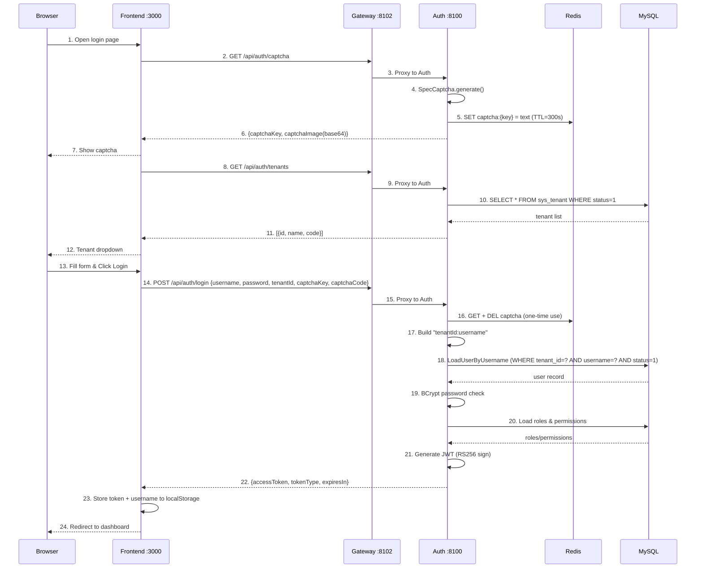

<details>
<summary>ASCII Version (click to expand)</summary>

```
Browser            Frontend :3000          Gateway :8102          Auth :8100           Redis              MySQL
  |                    |                       |                     |                   |                  |
  | 1. Open login page |                       |                     |                   |                  |
  |                    |                       |                     |                   |                  |
  |                    | 2. GET /api/auth/captcha                   |                   |                  |
  |                    |---------------------->|                     |                   |                  |
  |                    |                       | 3. Proxy to Auth    |                   |                  |
  |                    |                       |-------------------->|                   |                  |
  |                    |                       |                     | 4. SpecCaptcha    |                  |
  |                    |                       |                     |    generate()     |                  |
  |                    |                       |                     | 5. SET captcha:   |                  |
  |                    |                       |                     |    {key} = text   |                  |
  |                    |                       |                     |    TTL=300s ----->|                  |
  |                    |                       |                     |                   |                  |
  |                    | 6. {captchaKey, captchaImage(base64)}      |                   |                  |
  |                    |<----------------------|<--------------------|                   |                  |
  | 7. Show captcha    |                       |                     |                   |                  |
  |<-------------------|                       |                     |                   |                  |
  |                    |                       |                     |                   |                  |
  |                    | 8. GET /api/auth/tenants                    |                   |                  |
  |                    |---------------------->|                     |                   |                  |
  |                    |                       | 9. Proxy to Auth    |                   |                  |
  |                    |                       |-------------------->|                   |                  |
  |                    |                       |                     | 10. SELECT * FROM |                  |
  |                    |                       |                     |     sys_tenant    |                  |
  |                    |                       |                     |     WHERE status=1|                  |
  |                    |                       |                     |-------------------------------------->|
  |                    |                       |                     |                   |    tenant list    |
  |                    |                       |                     |<--------------------------------------|
  |                    | 11. [{id,name,code}]  |                     |                   |                  |
  |                    |<----------------------|<--------------------|                   |                  |
  | 12. Tenant dropdown|                       |                     |                   |                  |
  |<-------------------|                       |                     |                   |                  |
  |                    |                       |                     |                   |                  |
  | 13. Fill form      |                       |                     |                   |                  |
  |     (username,     |                       |                     |                   |                  |
  |      password,     |                       |                     |                   |                  |
  |      captcha,      |                       |                     |                   |                  |
  |      tenant)       |                       |                     |                   |                  |
  | 14. Click Login -->|                       |                     |                   |                  |
  |                    |                       |                     |                   |                  |
  |                    | 15. POST /api/auth/login                   |                   |                  |
  |                    |   {username, password, |                   |                   |                  |
  |                    |    tenantId, captchaKey,                   |                   |                  |
  |                    |    captchaCode} ------>|                   |                   |                  |
  |                    |                       | 16. Proxy to Auth   |                   |                  |
  |                    |                       |-------------------->|                   |                  |
  |                    |                       |                     |                   |                  |
  |                    |                       |                     | 17. Validate captcha                  |
  |                    |                       |                     |    GET + DEL ---->|                  |
  |                    |                       |                     |    (one-time use) |                  |
  |                    |                       |                     |                   |                  |
  |                    |                       |                     | 18. Build username as                 |
  |                    |                       |                     |     "tenantId:username"               |
  |                    |                       |                     |     (e.g. "1:admin")                  |
  |                    |                       |                     |                   |                  |
  |                    |                       |                     | 19. LoadUserByUsername                |
  |                    |                       |                     |     Parse tenant + username           |
  |                    |                       |                     |     WHERE tenant_id=? AND             |
  |                    |                       |                     |           username=? AND status=1     |
  |                    |                       |                     |-------------------------------------->|
  |                    |                       |                     |                   |    user record    |
  |                    |                       |                     |<--------------------------------------|
  |                    |                       |                     |                   |                  |
  |                    |                       |                     | 20. BCrypt password check             |
  |                    |                       |                     |                   |                  |
  |                    |                       |                     | 21. Load roles & permissions          |
  |                    |                       |                     |-------------------------------------->|
  |                    |                       |                     |                   |   roles/permissions
  |                    |                       |                     |<--------------------------------------|
  |                    |                       |                     |                   |                  |
  |                    |                       |                     | 22. Generate JWT   |                  |
  |                    |                       |                     |     RS256 sign     |                  |
  |                    |                       |                     |     (RSA private   |                  |
  |                    |                       |                     |      key from JWK) |                  |
  |                    |                       |                     |                   |                  |
  |                    | 23. {accessToken, tokenType:"Bearer",       |                   |                  |
  |                    |      expiresIn:900}   |                     |                   |                  |
  |                    |<----------------------|<--------------------|                   |                  |
  |                    |                       |                     |                   |                  |
  |                    | 24. Store token + username to localStorage |                   |                  |
  |                    |                       |                     |                   |                  |
  | 25. Redirect to    |                       |                     |                   |                  |
  |     dashboard      |                       |                     |                   |                  |
  |<-------------------|                       |                     |                   |                  |
  |                    |                       |                     |                   |                  |
```

</details>

### Post-Login: Authenticated Request Flow

After successful login, all frontend API requests automatically include the JWT Token, and the Gateway is responsible for verification:

```
Browser            Frontend               Gateway :8102           Downstream Service
  |                    |                       |                        |
  | 1. Navigate to     |                       |                        |
  |    protected page  |                       |                        |
  |                    | 2. Axios GET          |                        |
  |                    |    Authorization:      |                        |
  |                    |    Bearer <JWT> ------>|                        |
  |                    |                       |                        |
  |                    |                       | 3. AuthFilter:         |
  |                    |                       |    - Extract Bearer token
  |                    |                       |    - Get RSA public key |
  |                    |                       |      (from JwkKeyProvider,
  |                    |                       |       cached 5min TTL)  |
  |                    |                       |    - RSASSAVerifier:   |
  |                    |                       |      verify RS256 sig  |
  |                    |                       |    - Check exp claim   |
  |                    |                       |                        |
  |                    |                       | 4. Inject headers:     |
  |                    |                       |    X-User-Id: 1        |
  |                    |                       |    X-Tenant-Id: 1      |
  |                    |                       |    X-User-Name: admin  |
  |                    |                       |    X-User-Roles: admin |
  |                    |                       |    X-User-Scopes: read |
  |                    |                       |                        |
  |                    |                       | 5. Forward request --->|
  |                    |                       |                        |
  |                    |                       |    6. Response <-------|
  |                    | 7. JSON data <--------|                        |
  | 8. Render page     |                       |                        |
  |<-------------------|                       |                        |
```

### Key Components

| Step | File | Logic |
|------|------|-------|
| Form UI | `src/views/login/LoginForm.vue` | Element Plus form: username, password, captcha, tenant dropdown |
| Captcha load | `src/views/login/LoginForm.vue` | `GET /api/auth/captcha` -> display base64 PNG, store captchaKey |
| Tenant load | `src/views/login/LoginForm.vue` | `GET /api/auth/tenants` -> populate `<el-select>` dropdown |
| Login submit | `src/views/login/LoginForm.vue` | `handleLogin()`: validate form -> POST `/api/auth/login` |
| Token storage | `src/stores/user.ts` | `setToken()` + `setUsername()` persist to `localStorage` |
| Request auth | `src/api/request.ts` | Axios request interceptor: `Authorization: Bearer <token>` |
| Vite proxy | `vite.config.ts` | `/api` -> `http://localhost:8102` (Gateway) |
| Gateway filter | `AuthFilter.java` | JWT RS256 signature verification + claims extraction + identity header injection |
| JWK provider | `JwkKeyProvider.java` | Fetches RSA public key from Auth `/oauth2/jwks`, cached for 5 minutes |
| Captcha service | `CaptchaServiceImpl.java` | SpecCaptcha generation + Redis storage (TTL 300s, one-time use) |
| Auth controller | `AuthController.java` | `POST /login`: captcha -> authenticate -> roles -> JWT |
| User details | `OmniUserDetailsService.java` | Multi-tenant parsing of `tenantId:username` + BCrypt password verification |
| JWT service | `JwtTokenServiceImpl.java` | RSA private key signing, generates JWT containing user identity and permissions |

### JWT Token Structure

The JWT issued by the Auth service contains the following claims:

```json
{
  "header": {
    "alg": "RS256",
    "kid": "<key-id-from-jwk>"
  },
  "payload": {
    "sub": "1",
    "tenant_id": "1",
    "username": "admin",
    "roles": ["admin"],
    "scope": "read write",
    "iat": 1748000000,
    "exp": 1748000900
  }
}
```

| Claim | Description |
|-------|-------------|
| `sub` | User ID (`sys_user.id`) |
| `tenant_id` | Tenant ID (`sys_tenant.id`) |
| `username` | Login username |
| `roles` | List of user roles (e.g., `["admin", "editor"]`) |
| `scope` | Permission scope, space-separated |
| `iat` | Issued at time (Unix timestamp) |
| `exp` | Expiration time (`iat` + 900 seconds = 15 minutes) |

### Multi-Tenant Login Mechanism

The tenant is specified via the `tenantId` parameter during login. The Auth service internally formats the username as `tenantId:username` (e.g., `1:admin`),
which is parsed by `OmniUserDetailsService.loadUserByUsername()`:

```
Frontend submits: { username: "admin", tenantId: 1 }
  -> AuthController constructs: "1:admin"
  -> OmniUserDetailsService parses: tenantId=1, actualUsername="admin"
  -> SQL: SELECT * FROM sys_user WHERE tenant_id=1 AND username='admin' AND status=1
```

If no `:` is included (direct username login), `tenantId=1` is used by default for backward compatibility.

### Captcha Lifecycle

```
1. Generate: SpecCaptcha -> base64 PNG
2. Store: Redis SET captcha:{uuid} = "a3f8" EX 300
3. Verify: Redis GET captcha:{uuid} -> DELETE captcha:{uuid} (one-time use, anti-replay)
   - key not found -> "Captcha expired" (expired or already used)
   - value mismatch  -> "Invalid captcha"
```

### Current Status

- **Login**: Fully implemented — captcha + multi-tenant + JWT Token issuance
- **Gateway JWT Verification**: Fully implemented — RS256 signature check + claims extraction + identity header injection
- **Frontend**: All mock code removed, connected to real APIs
- **Token Validity**: 15 minutes (900 seconds), no refresh token mechanism yet

## Flow 2: OAuth2 Authorization Code + PKCE Login

### Overview

The frontend acts as an OAuth2 public client (SPA), completing the PKCE authorization code flow through Spring Authorization Server's OAuth2 authorization endpoint.
After the user approves on the Auth service's consent page, the frontend exchanges the authorization code + code_verifier for an access_token and id_token.
Suitable for third-party integrations or scenarios requiring standardized OAuth2 authentication.

### Sequence

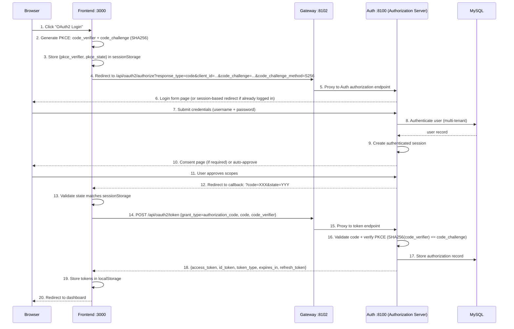

### Key Components

| Step | File | Logic |
|------|------|-------|
| PKCE generator | `src/utils/oauth2.ts` | Generates code_verifier (43-128 char random string) + SHA256 code_challenge |
| PKCE storage | `src/utils/oauth2.ts` | Stores `pkce_verifier` and `pkce_state` in sessionStorage |
| Authorization redirect | `src/utils/oauth2.ts` | Constructs `/oauth2/authorize` URL with PKCE parameters |
| Token exchange | `src/api/auth.ts` | POST `/oauth2/token`, sends code_verifier to Auth service for verification |
| Token storage | `src/stores/user.ts` | Stores access_token + id_token in localStorage |
| Authorization endpoint | Spring Authorization Server | `/oauth2/authorize` — login form + authorization consent |
| Token endpoint | Spring Authorization Server | `/oauth2/token` — authorization code to token exchange |
| PKCE validator | Spring Authorization Server | Compares SHA256(code_verifier) with stored code_challenge |

### PKCE Storage Keys

| sessionStorage Key | Description | Lifecycle |
|--------------------|-------------|-----------|
| `pkce_verifier` | Random code_verifier string | Written when authorization is initiated, deleted after token exchange |
| `pkce_state` | CSRF protection state parameter | Written when authorization is initiated, deleted after callback validation |

### Current Status

- **Authorization Server**: Spring Authorization Server 7.x configured with RS256 JWK signing
- **OAuth2 Client**: `omni-spa` client registered (authorization_code + PKCE grant type)
- **Frontend PKCE Utility**: `src/utils/oauth2.ts` implements verifier/challenge generation and token exchange
- **Token Types**: access_token (opaque) + id_token (JWT, containing user information)

---

## Flow 3: OAuth2 Device Authorization Grant

### Overview

The Device Authorization Grant (RFC 8628) is designed for devices without a browser or with limited input capabilities (IoT, CLI tools, etc.). The device obtains a `device_code` and `user_code` via `/oauth2/device_authorization`. The user enters the `user_code` on another device to complete authorization, and the device polls `/oauth2/token` to obtain an access token.

The frontend provides a simulated entry point (`/device` page) for conveniently testing the complete device authorization flow in a browser.

### Sequence

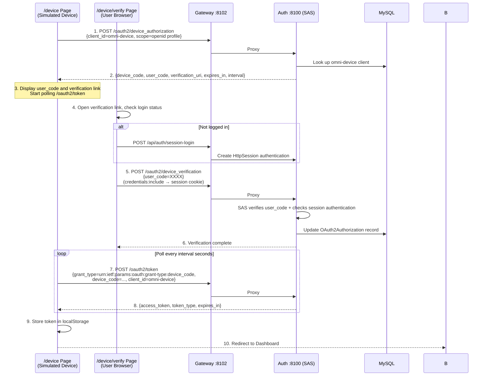

### Key Components

| Step | File | Responsibility |
|------|------|----------------|
| Device authorization request | `src/api/auth.ts` → `requestDeviceAuthorization()` | POST `/oauth2/device_authorization`, obtain device code |
| Token polling | `src/api/auth.ts` → `pollDeviceToken()` | POST `/oauth2/token`, handle `authorization_pending` |
| Device simulator page | `src/views/device/index.vue` | Display user_code + countdown + polling |
| Device verification page | `src/views/device/verify.vue` | Embedded login + user_code input + authorization consent |
| Login page entry | `src/components/LoginForm.vue` | "Device Authorization Login" button |
| Device authorization endpoint | Spring Authorization Server | `/oauth2/device_authorization` — built into SAS |
| Device verification endpoint | Spring Authorization Server | `/oauth2/device_verification` — built into SAS |
| Device client | `DeviceClientInitializer.java` | Registers `omni-device` client at startup |
| Redirect filter | `AuthorizationServerConfig.java` | Redirects unauthenticated users to the frontend verification page |

### Device Client Configuration

| Configuration | Value |
|--------|-------|
| Client ID | `omni-device` |
| Authentication Method | `NONE` (public client, no clientSecret) |
| Grant Types | `urn:ietf:params:oauth:grant-type:device_code` + `refresh_token` |
| Scopes | `openid`, `profile` |
| Require PKCE | `false` |
| Require Authorization Consent | `false` (user clicking "Authorize" is considered consent, no additional SAS consent form needed) |

### Polling Behavior

| Error Code | Meaning | Handling |
|------------|---------|----------|
| `authorization_pending` | User has not yet completed authorization | Continue polling |
| `slow_down` | Polling too frequently | Continue polling (SAS automatically increases interval) |
| `expired_token` | device_code has expired | Stop polling, prompt user to restart |
| `access_denied` | User denied authorization | Stop polling, notify user |

### Current Status

- **Device Authorization Endpoint**: SAS 7 enabled via `deviceAuthorizationEndpoint(Customizer.withDefaults())`
- **Device Verification Endpoint**: SAS 7 enabled via `deviceVerificationEndpoint(Customizer.withDefaults())`
- **Device Client**: `omni-device` client automatically registered by `DeviceClientInitializer` at startup
- **Frontend Pages**: `/device` (device simulator) and `/device/verify` (verification page) implemented
- **Login Entry**: "Device Authorization Login" button added to the login page

---

## Flow 4: OAuth2 Social Login (GitHub / Google / Gitee)

### Overview

Users log into the system with one click using their GitHub, Google, or Gitee account. The backend uses the Strategy Pattern, defining a unified `OAuth2ProviderHandler` interface with `buildAuthorizationUrl` / `exchangeCodeForAccessToken` / `fetchUserProfile` methods. Each provider is implemented as a separate `@Component`, and Spring's `Map<String, OAuth2ProviderHandler>` auto-injection enables multi-provider dispatch. Currently, GitHub, Google, and Gitee handlers are implemented; the frontend WeChat login button is a placeholder (backend Handler not yet implemented).

The frontend initiates a `window.location.href` navigation to the Auth service's `/api/auth/oauth2/{provider}` endpoint. The Auth service selects the corresponding Handler implementation based on the provider parameter, generates an HMAC-signed state parameter, and issues a 302 redirect to the third-party authorization page. After the user authorizes on the third-party platform, the callback reaches the Auth service, where the Handler completes state verification → token exchange → user info retrieval → local user lookup or auto-creation → JWT issuance. Finally, a 302 redirect sends the user to the frontend callback page (JWT carried in URL fragment).

### Sequence

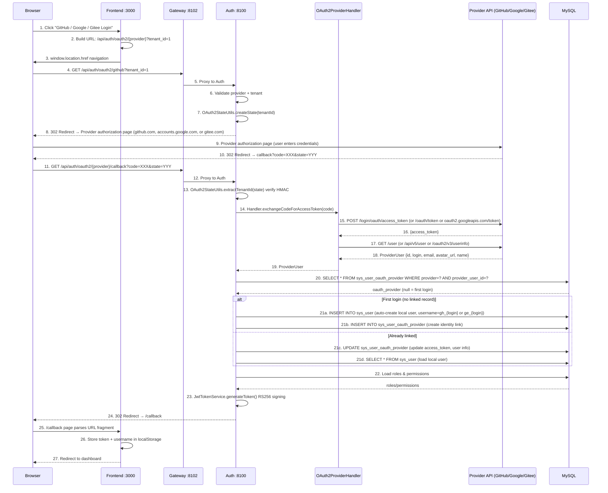

<details>
<summary>ASCII Version (click to expand)</summary>

```
Browser            Frontend :3000          Gateway :8102          Auth :8100           Provider API         MySQL
  |                    |                       |                     |                     |                   |
  | 1. Click social    |                       |                     |                     |                   |
  |    login button    |                       |                     |                     |                   |
  |                    | 2. Build URL          |                     |                     |                   |
  |                    |    /api/auth/oauth2/  |                     |                     |                   |
  |                    |    {provider}?tenant_id=1                   |                     |                   |
  | 3. window.location |                       |                     |                     |                   |
  |    .href --------->|                       |                     |                     |                   |
  |                    |                       |                     |                     |                   |
  | 4. GET /api/auth/oauth2/{provider}?tenant_id=1                   |                   |
  |                    |                       |                     |                     |                   |
  |                    |                       | 5. Proxy            |                     |                   |
  |                    |                       |-------------------->|                     |                   |
  |                    |                       |                     | 6. Validate provider |                   |
  |                    |                       |                     |    + tenant          |                   |
  |                    |                       |                     | 7. createState()     |                   |
  |                    |                       |                     |    HMAC-SHA256 sign  |                   |
  |                    |                       |                     |                     |                   |
  | 8. 302 Redirect -> Provider authorization page (github.com, accounts.google.com or gitee.com) |                   |
  |                    |                       |                     |                     |                   |
  | 9. Provider login  |                       |                     |                     |                   |
  |    (user/password) |                       |                     |                     |                   |
  |--------------------|-------------------------------------------->|------------------------------------------>|
  |                    |                       |                     |                     |                   |
  | 10. 302 callback?code=XXX&state=YYY        |                     |                     |                   |
  |<---------------------------------------------------------------------------------------|                   |
  |                    |                       |                     |                     |                   |
  | 11. GET /api/auth/oauth2/{provider}/callback                     |                     |                   |
  |--------------------|---------------------->|                     |                     |                   |
  |                    |                       | 12. Proxy           |                     |                   |
  |                    |                       |-------------------->|                     |                   |
  |                    |                       |                     |                     |                   |
  |                    |                       |                     | 13. Verify state     |                   |
  |                    |                       |                     |     HMAC signature   |                   |
  |                    |                       |                     |                     |                   |
  |                    |                       |                     | 14-19. Handler: exchange code,          |
  |                    |                       |                     |   get access_token, fetch user profile  |
  |                    |                       |                     |-------------------->|                   |
  |                    |                       |                     |    ProviderUser     |                   |
  |                    |                       |                     |<--------------------|                   |
  |                    |                       |                     |                     |                   |
  |                    |                       |                     | 20. Lookup oauth provider               |
  |                    |                       |                     |------------------------------------------>|
  |                    |                       |                     |                     |    oauth_provider   |
  |                    |                       |                     |<------------------------------------------|
  |                    |                       |                     |                     |                   |
  |                    |                       |                     | 21. Create/Update user + oauth link      |
  |                    |                       |                     |------------------------------------------>|
  |                    |                       |                     |                     |                   |
  |                    |                       |                     | 22. Load roles/perms |                   |
  |                    |                       |                     |------------------------------------------>|
  |                    |                       |                     |                     |   roles/permissions |
  |                    |                       |                     |<------------------------------------------|
  |                    |                       |                     |                     |                   |
  |                    |                       |                     | 23. Generate JWT (RS256)                |
  |                    |                       |                     |                     |                   |
  | 24. 302 /callback#token=JWT&username=xxx                         |                     |                   |
  |<---------------------------------------------------------------------------------------|                   |
  |                    |                       |                     |                     |                   |
  | 25. /callback page |                       |                     |                     |                   |
  |    parse fragment  |                       |                     |                     |                   |
  |                    | 26. Store token        |                     |                     |                   |
  |                    |     to localStorage    |                     |                     |                   |
  | 27. Redirect to    |                       |                     |                     |                   |
  |     dashboard      |                       |                     |                     |                   |
  |<-------------------|                       |                     |                     |                   |
```

</details>

### Key Components

| Step | File | Responsibility |
|------|------|----------------|
| Login buttons | `src/components/LoginForm.vue` | "GitHub / Google / Gitee" third-party login buttons, calls `getThirdPartyLoginUrl()` |
| Frontend initiation | `src/api/auth.ts` | `getThirdPartyLoginUrl(provider, tenantId)` builds redirect URL |
| Callback page | `src/views/callback/index.vue` | Parses JWT from URL fragment, stores in localStorage |
| Login initiation endpoint | `SocialLoginController.java` | `GET /api/auth/oauth2/{provider}` — state generation + 302 redirect |
| Callback handling endpoint | `SocialLoginController.java` | `GET /api/auth/oauth2/{provider}/callback` — token exchange + user creation + JWT issuance |
| Business orchestration | `SocialLoginServiceImpl.java` | Complete callback flow: state verification → Handler dispatch → user lookup/creation → JWT |
| Strategy interface | `OAuth2ProviderHandler.java` | Strategy interface defining `buildAuthorizationUrl` / `exchangeCodeForAccessToken` / `fetchUserProfile` |
| GitHub implementation | `GitHubOAuth2Handler.java` | GitHub OAuth2 implementation (`@Component("github")`), builds auth URL, exchanges access_token, fetches user profile |
| Google implementation | `GoogleOAuth2Handler.java` | Google OAuth2 implementation (`@Component("google")`), accesses Google APIs via local proxy, derives username from email |
| Gitee implementation | `GiteeOAuth2Handler.java` | Gitee OAuth2 implementation (`@Component("gitee")`), integrates with Gitee OAuth2 API |
| Unified user DTO | `ProviderUser.java` | Unified third-party user info DTO, abstracting away provider-specific field differences |
| State signing | `OAuth2StateUtils.java` | HMAC-SHA256 signature generation and verification (`tenantId|timestamp|hmac`) |
| Identity linking | `SysUserOauthProviderMapper.java` | Queries and persists user-to-third-party identity bindings |
| JWT issuance | `JwtTokenServiceImpl.java` | Issues RS256 JWT containing roles and permissions for social login users |

### State Signing Mechanism

The OAuth2 state parameter uses HMAC-SHA256 signing, with the format `tenantId|timestamp|hmac`:

```
Generate: HMAC-SHA256(tenantId + "|" + timestamp, secretKey) → hmac
Format: "1|1780636194690|9d9d878ba61253dd..."

Verify:
1. Split by "|" into [tenantId, timestamp, hmac]
2. Recompute HMAC-SHA256(tenantId + "|" + timestamp, secretKey)
3. Compare computed result with the provided hmac
4. Check if timestamp has expired (anti-replay attack)
```

### Automatic User Creation Mechanism

On first third-party login, the system automatically creates a local user:

```
1. Username: Generated with provider prefix
   - GitHub: gh_{login} (e.g., gh_wang-baohai)
   - Google: go_{email_prefix} (e.g., go_john, from john@gmail.com)
   - Gitee:  ge_{login} (e.g., ge_zhang-san)
   - On conflict fallback: {prefix}_{login}_{provider_user_id}
2. Nickname: Third-party platform display name (or login if unavailable)
3. Email: Third-party platform email
4. Avatar: Third-party platform avatar_url
5. Password: null (cannot log in via password, social login only)
6. Status: Enabled (status=1)
7. Tenant: The tenantId specified at login time
8. Roles: No default roles (admin must manually assign)
```

### sys_user_oauth_provider Table Design

| Field | Type | Description |
|-------|------|-------------|
| `id` | BIGINT AUTO_INCREMENT | Primary key |
| `user_id` | BIGINT NOT NULL | References `sys_user.id` |
| `provider` | VARCHAR(32) NOT NULL | Provider identifier (github/google/wechat/gitee) |
| `provider_user_id` | VARCHAR(100) NOT NULL | User's unique ID on the third-party platform |
| `provider_username` | VARCHAR(100) | Username on the third-party platform |
| `provider_email` | VARCHAR(200) | Email on the third-party platform |
| `provider_avatar` | VARCHAR(500) | Avatar URL on the third-party platform |
| `access_token` | VARCHAR(500) | Most recent Access Token |
| `UNIQUE (provider, provider_user_id)` | | Prevents duplicate linking |

### Error Handling

| Scenario | Handling | Frontend Behavior |
|----------|----------|-------------------|
| User denies authorization | 302 → `/login?error=user_denied` | Login page shows "Authorization denied" |
| Missing callback parameters | 302 → `/login?error=invalid_callback` | Login page shows "Invalid callback" |
| State verification failure | Throws BusinessException → 302 → `/login?error=social_login_failed` | Login page shows error message |
| Third-party API error | Throws BusinessException (502) | Login page shows "Authorization code exchange failed" (GitHub: access_token endpoint / Google: token endpoint / Gitee: token endpoint) |
| User info fetch failure | Throws BusinessException (502) | Login page shows "Failed to get user info" (GitHub: /user endpoint / Google: /oauth2/v3/userinfo endpoint / Gitee: /api/v5/user endpoint) |
| User is disabled | Throws BusinessException (403) | Login page shows "User has been disabled" |

### Current Status

- **OAuth2 Social Login**: GitHub, Google, and Gitee implemented end-to-end and verified
- **State Signing**: HMAC-SHA256 for tamper-proofing + anti-replay
- **Automatic User Creation**: Local user auto-registration on first third-party login + identity linking (GitHub: `gh_` prefix, Google: `go_` prefix, Gitee: `ge_` prefix)
- **redirect_uri**: Supports configuration via `application.yml` + environment variable override
- **Frontend Callback**: `/callback` page parses JWT from URL fragment and auto-logs in
- **Strategy Pattern**: `OAuth2ProviderHandler` interface + `Map<String, OAuth2ProviderHandler>` injection; adding a new provider only requires implementing the Handler interface
- **Multi-Provider Extension**: `sys_user_oauth_provider` table supports github/google/wechat/gitee; GitHub, Google, and Gitee are currently implemented, WeChat frontend button is a placeholder

## Flow 5: RBAC Functional Permissions — Dynamic Menu Loading and Button Authorization

### Overview

After successful login, the frontend fetches a dynamic menu tree from the backend (filtered by user permissions), and uses it to register routes and render the sidebar.
Buttons within pages are shown/hidden via the `v-permission` directive, and API-level authorization is enforced via `@PreAuthorize`.

### Sequence

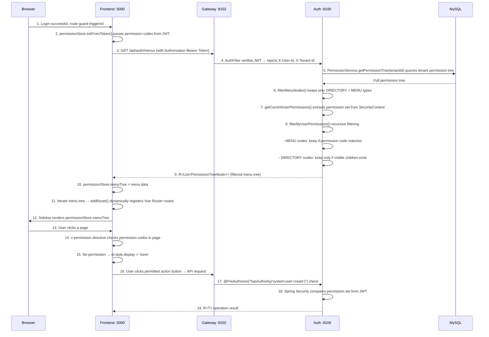

### Key Implementation Details

**Backend menu filtering logic** (`MenuController`):

1. Query tenant's full permission tree → `permissionService.getPermissionTree(tenantId)`
2. First filter: keep only nodes with `type = DIRECTORY | MENU` (discard BUTTON and API)
3. Second filter: extract current user's permission set from `SecurityContext` (excluding `ROLE_` prefix)
4. Recursive filtering: MENU nodes check if `permissionCode` is in the permission set; DIRECTORY nodes first recurse into children, kept only if visible children exist
5. Falls back to returning all menus when permission info is unavailable

**Frontend button permission control** (`v-permission` directive):

```vue
<el-button v-permission="'system:user:create'" type="primary">Add</el-button>
<el-button v-permission="'system:user:update'" size="small">Edit</el-button>
<el-button v-permission="'system:user:delete'" size="small" type="danger">Delete</el-button>
```

- Uses `display: none` instead of `removeChild` for Vue reactive update compatibility
- Checks are executed in `mounted` and `updated` hooks
- Applied pages: User Management, Role Management, Organization Management, Tenant Management, Online Users, OAuth2 Client Management

### Current Status

- **Dynamic Menus**: Backend `MenuController` fully implemented, frontend `usePermissionStore` dynamic route registration
- **Button Permissions**: `v-permission` custom directive applied to 6 management pages (20+ buttons total)
- **API Authorization**: All Controller write methods declare `@PreAuthorize`
- **Permission Code Format**: `resource:action` (e.g., `system:user:create`)

## Flow 6: RBAC Data Permissions — Request-Level Row Data Filtering

### Overview

When each HTTP request arrives, `DataScopeResolveFilter` parses the current user's data scope.
MyBatis-Plus `DataPermissionInterceptor` automatically appends WHERE conditions to `sys_user` table queries,
achieving row-level data filtering with zero intrusion on business code.

### Sequence

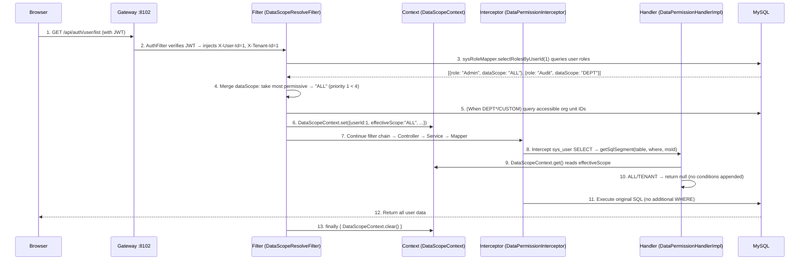

### DataScope Filter Conditions Reference

| effectiveScope | SQL Appended Condition | Description |
|---------------|------------------------|-------------|
| `ALL` | None | Cross-tenant visibility of all data |
| `TENANT` | None | Existing `tenant_id` filtering is sufficient |
| `DEPT` | `WHERE sys_user.primary_unit_id IN ({own dept IDs})` | Own department users only |
| `DEPT_AND_BELOW` | `WHERE sys_user.primary_unit_id IN ({own dept + descendant IDs})` | Own department + subordinates |
| `CUSTOM` | `WHERE sys_user.primary_unit_id IN ({custom dept + descendant IDs})` | Custom scope |
| `SELF` | `WHERE sys_user.id = {current user ID}` | Self only |

### Organization Unit Descendant Query

`DEPT_AND_BELOW` and `CUSTOM` scopes require querying all descendant nodes of an organization unit:

```java
// SysOrgUnitMapper
List<Long> selectDescendantIdsByPath(String path);
// SQL: SELECT id FROM sys_org_unit WHERE path LIKE '{path}%' AND id != {selfId}
```

Leverages the materialized path (`path` field, e.g., `1/2/5/`) in the `sys_org_unit` table for efficient ancestor-descendant queries.

### In-Memory Filtering Mode (Online Users Scenario)

Online user data is stored in Redis and cannot be filtered via SQL interceptors. The Controller reads the data scope from `DataScopeContext` and filters manually:

```java
// OnlineUserController.list()
List<OnlineUserVO> list = onlineUserService.listOnlineUsers();
DataScopeContext.DataScopeInfo scope = DataScopeContext.get();
if (scope != null) {
    list = filterByDataScope(list, scope);
}
// ALL/TENANT → all, DEPT*/CUSTOM → filter by primaryUnitId, SELF → self only
```

### Configuration Registration Order

```java
// MyBatisPlusConfig
MybatisPlusInterceptor interceptor = new MybatisPlusInterceptor();
// Data permission must be registered before the pagination interceptor
interceptor.addInnerInterceptor(new DataPermissionInterceptor(new DataPermissionHandlerImpl()));
interceptor.addInnerInterceptor(new PaginationInnerInterceptor(DbType.MYSQL));
```

**Reason**: When the pagination interceptor executes `SELECT COUNT(*)` queries, data permission conditions must already be appended, otherwise the COUNT result will be inconsistent with actual data.

### Current Status

- **SQL Interception**: `DataPermissionInterceptor` + `DataPermissionHandlerImpl` fully implemented, currently filters only `sys_user` table
- **Request-Level Context**: `DataScopeResolveFilter` + `DataScopeContext` ThreadLocal management
- **Multi-Role Merging**: Most-permissive-wins strategy implemented
- **In-Memory Filtering**: `OnlineUserController` implements `primaryUnitId`-based in-memory filtering
- **Materialized Path Query**: `SysOrgUnitMapper.selectDescendantIdsByPath()` efficiently retrieves descendant nodes

## Flow 7: User Creation — Three Pathways

### Overview

The system supports three user creation pathways covering different scenarios: self-service registration (for new users), admin backend creation (for operations staff), and social login auto-creation (for first-time third-party OAuth2 login users). All pathways automatically assign the `USER` default role under the current tenant (`data_scope=SELF`), with no initial organization unit assignment (`primaryUnitId` is `null`), requiring admin assignment later.

### Sequence

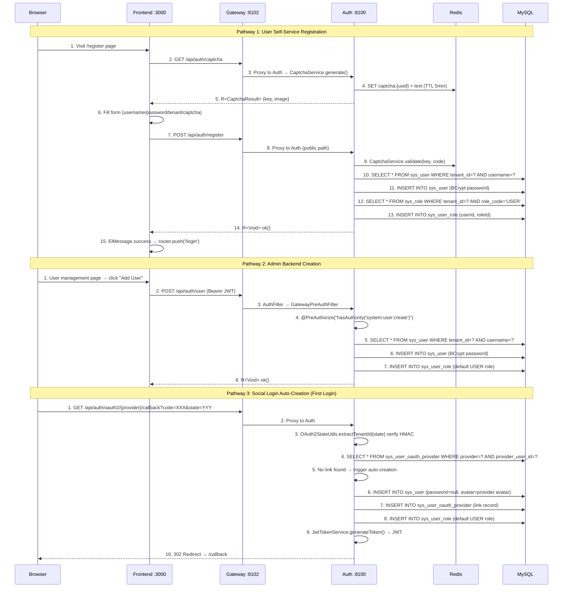

### Three Pathways Comparison

| Dimension | Self-Service Registration | Admin Creation | Social Login Auto-Creation |
|-----------|--------------------------|----------------|-----------------------------|
| **Entry Point** | `POST /api/auth/register` | `POST /api/auth/user` | Internal OAuth2 callback |
| **Auth Requirement** | None (public endpoint) | `system:user:create` permission | None (OAuth2 callback) |
| **Captcha** | Yes (Redis one-time) | No | No |
| **Tenant Determination** | User selects from dropdown | Admin specifies | HMAC-signed state parameter |
| **Password** | BCrypt encoded | BCrypt encoded | `null` (social login only) |
| **Username** | User-chosen (3-32 chars) | Admin-specified (no length limit) | Auto-generated: `gh_`/`go_`/`ge_` + third-party username |
| **Default Role** | `USER` (`data_scope=SELF`) | `USER` | `USER` |
| **Organization Unit** | Not assigned (`primaryUnitId=null`) | Not assigned | Not assigned |
| **Username Conflict** | Throws `BusinessException(400)` | Throws `BusinessException(400)` | Fallback: `{prefix}{login}_{providerUserId}` |
| **Post-Creation Behavior** | Show success → redirect to login page | Return to user list | Auto-issue JWT → redirect to frontend |

### Key Components

| Component | File | Responsibility |
|-----------|------|----------------|
| `AuthController.register()` | `omni-auth/.../controller/AuthController.java` | Self-service registration entry, delegates to `UserService` |
| `UserController.create()` | `omni-auth/.../controller/UserController.java` | Admin creation entry, requires `@PreAuthorize` |
| `SocialLoginServiceImpl.handleCallback()` | `omni-auth/.../service/impl/SocialLoginServiceImpl.java` | Social login callback handling, includes auto-creation logic |
| `UserServiceImpl.registerUser()` | `omni-auth/.../service/impl/UserServiceImpl.java` | Self-service registration: captcha validation → uniqueness check → insert → assign role |
| `UserServiceImpl.createUser()` | `omni-auth/.../service/impl/UserServiceImpl.java` | Admin creation: uniqueness check → insert → assign role |
| `SocialLoginServiceImpl.createNewUser()` | `omni-auth/.../service/impl/SocialLoginServiceImpl.java` | Social login auto-creation: username generation → insert → OAuth link record → assign role |
| `UserServiceImpl.assignDefaultRole()` | `omni-auth/.../service/impl/UserServiceImpl.java` | Shared method: queries tenant `USER` role → writes to `sys_user_role` |
| `RegisterRequest` | `omni-auth/.../dto/RegisterRequest.java` | Self-service registration DTO (includes captcha fields) |
| `CreateUserRequest` | `omni-auth/.../dto/CreateUserRequest.java` | Admin creation DTO (includes phone/gender) |
| Registration page | `omni-frontend/src/views/register/index.vue` | Frontend registration form (with confirm password, tenant selection) |

### Current Status

- **Self-Service Registration**: `POST /api/auth/register` fully implemented, frontend registration page `/register` ready, Gateway whitelist configured
- **Admin Creation**: `POST /api/auth/user` fully implemented, frontend user management page ready, `@PreAuthorize` permission control active
- **Social Login Auto-Creation**: `SocialLoginServiceImpl.createNewUser()` fully implemented, supports GitHub/Google/Gitee with username conflict fallback
- **Default Role Assignment**: All three pathways share the `assignDefaultRole()` method; role assignment failure only logs a warning without blocking creation
- **Organization Unit**: None of the three pathways assign an organization unit; `primaryUnitId` remains `null`, requiring manual admin assignment later

---

## Flow 8: XSS Protection — Request Sanitization and Configuration Management

### 8A. XSS Request Sanitization (Automatically Executed on Every Request)

```
Client Request
    │
    ▼
┌─────────────────────────────────────────┐
│ Gateway: SecurityHeadersFilter          │
│  → Add X-Content-Type-Options: nosniff  │
│  → Add X-Frame-Options: DENY           │
│  → Add Referrer-Policy: strict-origin  │
│  → AuthFilter: JWT verification + identity header injection │
└────────────────┬────────────────────────┘
                 │ Forward to omni-auth
                 ▼
┌─────────────────────────────────────────┐
│ Layer 2: XssFilter (OncePerRequestFilter)│
│  1. XssConfigProvider.getXssSettings()   │
│     → Redis cache hit? Return cached    │
│     → Miss? Query DB + write to cache   │
│  2. If enabled=false → skip sanitization│
│  3. If enabled=true → wrap Request     │
│     → XssHttpServletRequestWrapper      │
│     → Override getParameter/getParameterValues│
│     → XssRuleHolder.set(rules) ThreadLocal│
└────────────────┬────────────────────────┘
                 │
                 ▼
┌─────────────────────────────────────────┐
│ Layer 1: XssStringDeserializer          │
│  (Jackson SimpleModule auto-registered) │
│  → String fields in @RequestBody JSON  │
│  → Automatically passed through XssSanitizer.sanitize() │
└────────────────┬────────────────────────┘
                 │
                 ▼
            Controller
```

**XssSanitizer Sanitization Rules** (dispatched by ruleType):

| ruleType | Sanitization Method | Example |
|----------|---------------------|--------|
| `HTML_TAG` | Regex strip of paired `<tag>...</tag>` and self-closing `<tag/>` tags | `<script>alert(1)</script>` → `alert(1)` |
| `EVENT_HANDLER` | Regex strip of `on*` attributes | `onclick="..."` → removed |
| `DANGEROUS_PROTOCOL` | Replace `javascript:` / `vbscript:` / `data:` protocol strings | `javascript:alert(1)` → empty string |
| `CUSTOM_PATTERN` | Custom regex match and replace | `expression(...)` → removed |

**ThreadLocal Cleanup**: `XssFilter` calls `XssRuleHolder.clear()` in the `finally` block to prevent memory leaks.

### 8B. XSS Configuration Management (Admin Operations)

```
Admin (Frontend XSS Protection Configuration Page)
    │
    ├─ Global toggle switch
    │  PUT /api/auth/xss-config/toggle
    │  → XssConfigController.toggleGlobal()
    │  → @PreAuthorize("hasAuthority('system:xssconfig:update')")
    │  → XssConfigServiceImpl.toggleGlobal()
    │     → UPDATE sys_xss_config SET enabled = ? WHERE tenant_id = ?
    │     → Delete Redis cache: xss:enabled:{tenantId}, xss:rules:{tenantId}
    │
    ├─ Create rule
    │  POST /api/auth/xss-config/rules
    │  → @PreAuthorize("hasAuthority('system:xssconfig:create')")
    │  → Validate ruleType enum + pattern regex validity
    │  → INSERT sys_xss_blacklist_rule
    │  → Delete Redis cache
    │
    ├─ Update rule
    │  PUT /api/auth/xss-config/rules/{id}
    │  → @PreAuthorize("hasAuthority('system:xssconfig:update')")
    │  → UPDATE sys_xss_blacklist_rule
    │  → Delete Redis cache
    │
    ├─ Delete rule
    │  DELETE /api/auth/xss-config/rules/{id}
    │  → @PreAuthorize("hasAuthority('system:xssconfig:delete')")
    │  → DELETE sys_xss_blacklist_rule
    │  → Delete Redis cache
    │
    └─ Toggle single rule
       PUT /api/auth/xss-config/rules/{id}/toggle
       → @PreAuthorize("hasAuthority('system:xssconfig:update')")
       → UPDATE sys_xss_blacklist_rule SET enabled = NOT enabled
       → Delete Redis cache
```

**Cache Strategy**:
- Redis Keys: `xss:enabled:{tenantId}` (string "true"/"false") + `xss:rules:{tenantId}` (JSON array)
- TTL: 30 minutes
- Invalidation: All write operations (toggle, CRUD) proactively `DEL` both cache keys
- Cache-aside: `XssConfigProviderImpl.loadFromDbAndCache()` queries DB and backfills cache on cache miss

### Key Components

| Component | File Path | Responsibility |
|-----------|-----------|----------------|
| `XssConfigController` | `omni-auth/.../controller/XssConfigController.java` | XSS configuration management REST API (7 endpoints) |
| `XssConfigServiceImpl` | `omni-auth/.../service/impl/XssConfigServiceImpl.java` | Configuration CRUD + Redis cache invalidation |
| `XssConfigProviderImpl` | `omni-auth/.../security/XssConfigProviderImpl.java` | Configuration loading (Redis first → DB fallback) |
| `XssFilter` | `omni-common/.../security/xss/XssFilter.java` | Servlet Filter, loads config + ThreadLocal setup |
| `XssSanitizer` | `omni-common/.../security/xss/XssSanitizer.java` | Core sanitization logic (4 rule types) |
| `XssStringDeserializer` | `omni-common/.../security/xss/XssStringDeserializer.java` | Jackson deserializer wrapper, auto-cleans JSON strings |
| `SecurityHeadersFilter` | `omni-gateway/.../config/SecurityHeadersFilter.java` | Gateway security response headers |
| XSS management page | `omni-frontend/src/views/system/xssconfig/index.vue` | Global toggle + rule CRUD table |

### Current Status

- **Three-Layer Sanitization**: Jackson deserializer + Servlet Filter + Gateway security headers all implemented and auto-configured
- **Configuration Management**: Global toggle + rule CRUD + single rule toggle — 7 API endpoints fully implemented
- **Frontend Page**: `System Management → XSS Protection Config` ready, supports paginated rule list, create/edit dialogs, v-permission button authorization
- **Cache Strategy**: Redis cache + write-operation proactive invalidation implemented
- **Tenant Isolation**: Configuration and rules isolated by `tenant_id`

---

## Flow 9: Data Dictionary Management — Type+Data Two-Level Structure CRUD

### Overview

The Base service (`omni-base :8101`) provides data dictionary management using a "type + data" two-level structure. Dictionary types (`sys_dict_type`) define code categories (e.g., `sys_user_gender`), while dictionary data (`sys_dict_data`) defines specific key-value pairs (e.g., `1=Male, 2=Female, 0=Unknown`). The frontend uses a master-detail layout — type list on the left, data list on the right — supporting full CRUD operations and Redis cache management.

### Sequence

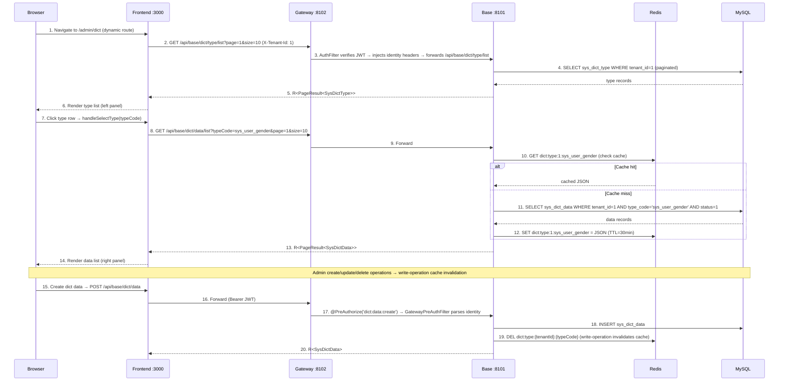

<details>
<summary>ASCII Version (click to expand)</summary>

```
Browser            Frontend :3000          Gateway :8102          Base :8101           Redis              MySQL
  |                    |                       |                     |                   |                  |
  | 1. Navigate to     |                       |                     |                   |                  |
  |    /admin/dict     |                       |                     |                   |                  |
  |                    | 2. GET /api/base/dict/type/list              |                   |                  |
  |                    |---------------------->|                     |                   |                  |
  |                    |                       | 3. AuthFilter →     |                   |                  |
  |                    |                       |    forward path     |                   |                  |
  |                    |                       |-------------------->|                   |                  |
  |                    |                       |                     | 4. SELECT         |                  |
  |                    |                       |                     |    sys_dict_type  |                  |
  |                    |                       |                     |    WHERE tenant_id=1                 |
  |                    |                       |                     |-------------------------------------->|
  |                    |                       |                     |                   |    type records   |
  |                    |                       |                     |<--------------------------------------|
  |                    | 5. R<PageResult>      |                     |                   |                  |
  |                    |<----------------------|<--------------------|                   |                  |
  | 6. Render type     |                       |                     |                   |                  |
  |    list (left)     |                       |                     |                   |                  |
  |<-------------------|                       |                     |                   |                  |
  |                    |                       |                     |                   |                  |
  | 7. Click type row  |                       |                     |                   |                  |
  |                    | 8. GET /api/base/dict/data/list?typeCode=... |                   |                  |
  |                    |---------------------->|                     |                   |                  |
  |                    |                       | 9. Forward -------->|                   |                  |
  |                    |                       |                     | 10. GET cache     |                  |
  |                    |                       |                     |------------------>|                  |
  |                    |                       |                     |                   |  hit? cached JSON |
  |                    |                       |                     |<------------------|                  |
  |                    |                       |                     |                   |                  |
  |                    |                       |                     | [if miss: SELECT sys_dict_data ----->|
  |                    |                       |                     |  SET cache <---------------------------|
  |                    |                       |                     |                   |                  |
  |                    | 13. R<PageResult>     |                     |                   |                  |
  |                    |<----------------------|<--------------------|                   |                  |
  | 14. Render data    |                       |                     |                   |                  |
  |     list (right)   |                       |                     |                   |                  |
  |<-------------------|                       |                     |                   |                  |
  |                    |                       |                     |                   |                  |
  | 15. Create data -->|                       |                     |                   |                  |
  |                    | 16. POST /api/base/dict/data                 |                   |                  |
  |                    |---------------------->|                     |                   |                  |
  |                    |                       | 17. @PreAuthorize   |                   |                  |
  |                    |                       |-------------------->|                   |                  |
  |                    |                       |                     | 18. INSERT ------>|                  |
  |                    |                       |                     | 19. DEL cache --->|                  |
  |                    | 20. R<SysDictData>    |                     |                   |                  |
  |                    |<----------------------|<--------------------|                   |                  |
```

</details>

### Key Components

| Component | File Path | Responsibility |
|-----------|-----------|----------------|
| `DictTypeController` | `omni-base/.../controller/DictTypeController.java` | Dictionary type REST API (6 endpoints), `@PreAuthorize` permission control |
| `DictDataController` | `omni-base/.../controller/DictDataController.java` | Dictionary data REST API (5 endpoints), `@PreAuthorize` permission control |
| `DictTypeServiceImpl` | `omni-base/.../service/impl/DictTypeServiceImpl.java` | Type CRUD + cascade delete data + cache invalidation |
| `DictDataServiceImpl` | `omni-base/.../service/impl/DictDataServiceImpl.java` | Data CRUD + cache-aside caching + manual refresh |
| `GatewayPreAuthFilter` | `omni-base/.../security/GatewayPreAuthFilter.java` | Builds SecurityContext from Gateway-injected X-User-* headers |
| `XssConfigProviderImpl` | `omni-base/.../security/XssConfigProviderImpl.java` | Redis-only strategy XSS SPI implementation (relies on auth service cache writes) |
| Dictionary management page | `omni-frontend/src/views/base/dict/index.vue` | Master-detail layout: left type list + right data list |
| Dictionary API module | `omni-frontend/src/api/dict.ts` | 11 typed API functions + TypeScript interface definitions |

### Cache Strategy

**Cache-aside pattern**:

| Item | Value |
|------|-------|
| Redis Key | `dict:type:{tenantId}:{typeCode}` |
| TTL | 30 minutes |
| Serialization | JSON (`GenericJacksonJsonRedisSerializer`) |

**Read path** (`DictDataServiceImpl.listEnabledData()`):
1. Check Redis cache → hit: deserialize and return
2. Miss → query DB (`status=1`, sorted by `sort` then `id`) → serialize and write to Redis (TTL 30min)

**Write path** (all CRUD operations):
1. Write to DB first (INSERT / UPDATE / DELETE)
2. Then DEL Redis key (write-operation cache invalidation, lazy-loaded on next read)

**Manual refresh** (`DictDataServiceImpl.refreshCache()`):
1. DEL Redis key
2. Query DB
3. Write to Redis (immediate backfill, suitable for data inconsistency scenarios)

**Cascade delete**: When deleting a dictionary type, all associated dictionary data is deleted in a single `@Transactional` operation, and corresponding caches are invalidated.

### Permission Tree

```
base (DIRECTORY, id=50)             ← "Base Data" top-level menu
  └── base:dict (MENU, id=51)       ← "Dictionary Management" second-level menu
        ├── dict:type:list     (API, id=52)
        ├── dict:type:create   (API, id=53)
        ├── dict:type:update   (API, id=54)
        ├── dict:type:delete   (API, id=55)
        ├── dict:data:list     (API, id=56)
        ├── dict:data:create   (API, id=57)
        ├── dict:data:update   (API, id=58)
        ├── dict:data:delete   (API, id=59)
        └── dict:data:refresh  (API, id=60)
```

All 11 permission nodes are assigned to the `SUPER_ADMIN` role (role_id=1).

### Current Status

- **Backend**: 11 API endpoints fully implemented (6 type + 5 data), `@PreAuthorize` permission control active
- **Frontend**: Master-detail layout page ready, `v-permission` button authorization applied to all action buttons
- **Cache**: Cache-aside + write-operation invalidation + manual refresh implemented
- **Seed Data**: 3 preset dictionary types (`sys_user_gender`, `sys_common_status`, `sys_notice_type`) + 7 data entries (tenant 1)
- **Gateway Route**: `Path=/api/base/**` → `lb://omni-base` configured (no StripPrefix, controllers use full paths)
- **Security Architecture**: `GatewayPreAuthFilter` builds Spring Security context from Gateway-injected identity headers, `XssConfigProviderImpl` adopts Redis-only strategy to inherit XSS protection

---

## Flow 10: Operation Logs — AOP Collection + RocketMQ Async Write + Hot/Cold Archiving

### Overview

The operation log system is based on `@OperLog` annotation + AOP aspect for non-intrusive collection. Log messages are asynchronously sent via RocketMQ, consumed by the omni-base service and written to the hot table (`sys_oper_log`), and periodically archived to the cold table (`sys_oper_log_archive`) for long-term compliance retention. The entire flow requires zero changes to business code — simply add an annotation to Controller methods.

### 10A. Operation Log Recording Flow (Triggered on Every Write Operation)

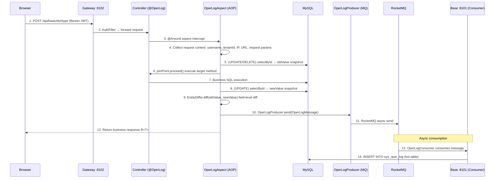

### 10B. Operation Log Archiving Flow (Scheduled Daily at 02:00)

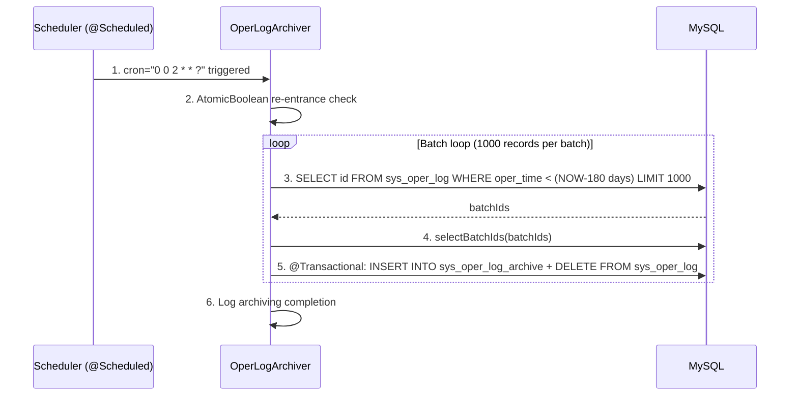

### Key Components

| Component | File Path | Responsibility |
|-----------|-----------|----------------|
| `@OperLog` | `omni-common-core/.../operlog/OperLog.java` | Annotation definition, declares module/operType/entityClass/idExpr |
| `OperType` | `omni-common-core/.../operlog/OperType.java` | Operation type enum: CREATE/UPDATE/DELETE/QUERY/EXPORT/IMPORT |
| `OperLogMessage` | `omni-common-core/.../operlog/OperLogMessage.java` | Log message POJO, implements Serializable |
| `OperLogAspect` | `omni-common-operlog/.../aspect/OperLogAspect.java` | AOP @Around aspect, collects context + entity snapshot + diff |
| `EntityDiffer` | `omni-common-operlog/.../diff/EntityDiffer.java` | Field-level diff comparison, returns only changed fields |
| `OperLogProducer` | `omni-common-operlog/.../producer/OperLogProducer.java` | RocketMQ producer, async log message sending |
| `OperLogConsumer` | `omni-base/.../consumer/OperLogConsumer.java` | RocketMQ consumer, writes to sys_oper_log hot table |
| `OperLogArchiver` | `omni-base/.../service/OperLogArchiver.java` | Scheduled archiving task, 180-day hot-to-cold table migration |

### Audit Trail Dimensions

| Dimension | Field | Description |
|-----------|-------|-------------|
| Who | `oper_username` | Operator username |
| When | `oper_time` | Operation timestamp |
| What | `module` + `oper_type` + `request_url` | Business module + operation type + request URL |
| Changed | `old_value` / `new_value` | Entity before/after JSON snapshot (UPDATE includes only changed fields) |
| Where | `ip_address` + `user_agent` | Source IP and client information |
| How Long | `execution_time` | Method execution duration (ms) |
| Result | `response_status` + `error_msg` | Operation result status and error message |

### Complementary Relationship with Audit Logs

| Log Type | Table | Scope | Collection Method | Service Module |
|----------|-------|-------|-------------------|----------------|
| Operation Log | `sys_oper_log` / `sys_oper_log_archive` | Business data changes (CRUD) | `@OperLog` + AOP + MQ async | omni-base / omni-common-operlog |
| Audit Log | `sys_audit_log` | Security events (login, token, permission changes) | Event-driven (`AuditEventPublisher`) | omni-auth |
| Login Log | `sys_login_log` | Login activity (success/failure) | Recorded within authentication flow | omni-auth |

These three log types each serve their purpose, together forming a complete audit trail system: operation logs record "how business data changed", audit logs record "what security events occurred", and login logs record "who logged in and when".

### Current Status

- **AOP Aspect**: `OperLogAspect` fully implemented, supports CREATE/UPDATE/DELETE/QUERY/EXPORT/IMPORT six operation types
- **Entity Diff**: `EntityDiffer` implements field-level diff comparison; UPDATE operations only record changed fields
- **SpEL Extraction**: Supports expressions like `#id`, `#result.data.id` to extract entity IDs from method parameters and return values
- **MQ Async**: `OperLogProducer` sends asynchronously via RocketMQ, non-blocking to business requests
- **Hot/Cold Archiving**: `OperLogArchiver` runs daily at 02:00, 180-day retention policy, batch processing 1000 records/batch
- **omni-auth Disabled**: The authentication module does not include `omni-common-operlog`; authentication behavior is covered by `sys_login_log` + `sys_audit_log`

---

## Flow 11: User Task Creation — Workbench Self-Service to XXL-JOB Direct Registration

### Overview

Users create scheduled tasks via the workbench "My Tasks" area. The frontend provides task type selection, dynamic parameter forms, and a Cron expression editor. The backend validates type validity, saves to the database, and directly registers with the XXL-JOB scheduling center, achieving instant-effect upon creation.

### Sequence

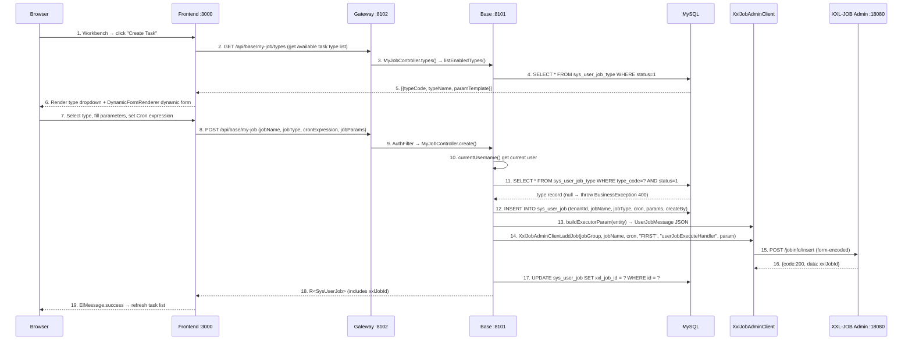

### Error Handling

| Scenario | Handling | Frontend Behavior |
|----------|----------|-------------------|
| Task type not found or disabled | Throws `BusinessException(400)` | ElMessage.error |
| XXL-JOB registration failure | Rollback DB record (`sysUserJobMapper.deleteById`) → throws `BusinessException(500)` | ElMessage.error "Task registration to scheduling center failed" |
| Task name is empty | Jakarta Validation `@NotBlank` | Form validation prompt |
| Cron expression is empty | Jakarta Validation `@NotBlank` | Form validation prompt |

### Key Components

| Component | File Path | Responsibility |
|-----------|-----------|----------------|
| Workbench page | `omni-frontend/src/views/home/index.vue` | Task creation dialog (type selection + CronGenerator + DynamicFormRenderer) |
| Cron editor | `omni-frontend/src/components/CronGenerator.vue` | Frequency type selector + dynamic condition form + human-readable preview |
| Dynamic form | `omni-frontend/src/components/DynamicFormRenderer.vue` | Renders form based on `param_template` JSON Schema |
| API module | `omni-frontend/src/api/myJob.ts` | `createMyJob()`, `getEnabledJobTypes()` |
| Controller | `omni-base/.../controller/MyJobController.java` | `POST /api/base/my-job`, extracts currentUsername |
| Service layer | `omni-base/.../service/impl/UserJobServiceImpl.java` | `createJob()` — validates type + DB insert + XXL-JOB registration + failure rollback |
| XXL-JOB client | `omni-common-job/.../XxlJobAdminClient.java` | `addJob()` — builds form params and calls `/jobinfo/insert` |
| Task type registry | `sys_user_job_type` | `type_code` (unique) + `param_template` (JSON Schema) |
| User task table | `sys_user_job` | `xxl_job_id` links to XXL-JOB scheduling center |

### Ownership Model

`MyJobController` does not use `@PreAuthorize`; instead, it validates task ownership via `verifyOwnership(id, username)`:

```java
private void verifyOwnership(Long id, String username) {
    SysUserJob job = userJobService.getJobById(id);
    if (!username.equals(job.getCreateBy())) {
        throw new BusinessException(403, "No permission to operate this task");
    }
}
```

Each user can only operate tasks they created, achieving row-level data isolation.

### Current Status

- **Task Creation**: End-to-end implementation — workbench creation → DB save → XXL-JOB registration, auto-rollback on failure
- **Type Management**: `UserJobTypeController` supports task type CRUD and parameter template management
- **Dynamic Form**: `DynamicFormRenderer` auto-renders input/select/number/textarea based on `param_template`
- **Cron Editor**: `CronGenerator` supports 7 frequency types (every minute/every X minutes/every hour/every X hours/daily/weekly/monthly)
- **Ownership Validation**: `verifyOwnership()` ensures users can only operate their own tasks

---

## Flow 12: User Task Execution — XXL-JOB Trigger to Frontend Notification

### Overview

The XXL-JOB scheduling center triggers execution based on cron expressions, and `XxlJobSpringExecutor` dispatches requests to `userJobExecuteHandler`. This handler parses task context from the JSON execution parameters, routes to a specific `UserJobHandler` via `UserJobHandlerRegistry`, writes execution logs and updates `lastFireTime`. The frontend workbench polls active task execution logs every 10 seconds and shows a popup notification when new logs are found.

### Sequence

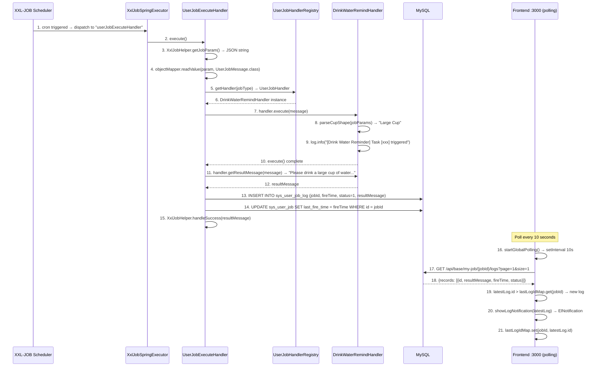

### Frontend Polling Mechanism

The workbench uses `startGlobalPolling()` for global log monitoring:

```
setInterval every 10 seconds:
1. Filter active tasks with status=1 from tableData
2. For each active task:
   a. GET /api/base/my-job/{id}/logs?page=1&size=1
   b. Get latest log ID
   c. Compare with known ID in lastLogIdMap
   d. If latestLog.id > prevId:
      - If lastLogIdMap already has this task record (not first time) → show ElNotification
      - Update lastLogIdMap
3. Refresh loadData() + loadStats()
```

**Duplicate notification prevention**: When `lastLogIdMap` is first initialized, it only records the current latest log ID without showing notifications. Only new logs discovered in subsequent polls (ID > known ID) trigger notifications.

**Lifecycle management**:
- Start polling in `onMounted`
- Clear `setInterval` in `onUnmounted` to prevent memory leaks

### Execution Parameter JSON Format

When `XxlJobAdminClient.addJob()` registers a task, the `executorParam` field contains a `UserJobMessage` JSON:

```json
{
    "jobId": 1,
    "tenantId": 1,
    "jobType": "Task-00001",
    "jobName": "Drink Water Reminder",
    "jobParams": "{\"cupShape\":\"Large Cup\"}"
}
```

`UserJobExecuteHandler` parses via `objectMapper.readValue(param, UserJobMessage.class)` and then routes.

### Error Handling

| Scenario | Handling | XXL-JOB Console Behavior |
|----------|----------|--------------------------|
| JSON parameter parsing failure | `XxlJobHelper.handleFail("Parameter parsing failed: ...")` | Execution failed |
| Handler not found | `log.warn` + `status=0` + `errorMsg` written to log | Execution failed |
| Handler execution exception | catch → `status=0` + `errorMsg` (truncated to 2000 chars) | Execution failed |
| Normal completion | `XxlJobHelper.handleSuccess(resultMessage)` | Execution succeeded |

### Key Components

| Component | File Path | Responsibility |
|-----------|-----------|----------------|
| Generic execution Handler | `omni-base/.../job/UserJobExecuteHandler.java` | `@XxlJob("userJobExecuteHandler")` entry point, JSON parsing + Handler routing + log writing + lastFireTime update |
| Handler registry | `omni-base/.../job/UserJobHandlerRegistry.java` | `Map<String, UserJobHandler>` auto-injection, `getHandler(jobType)` routing |
| SPI interface | `omni-common-core/.../job/UserJobHandler.java` | `execute()` + `getResultMessage()` |
| Message POJO | `omni-common-core/.../job/UserJobMessage.java` | `jobId`, `tenantId`, `jobType`, `jobName`, `jobParams` |
| Drink water handler | `omni-base/.../job/handler/DrinkWaterRemindHandler.java` | `@Component("Task-00001")`, parses `cupShape` param to generate reminder message |
| Execution log table | `sys_user_job_log` | `fire_time`, `execute_time_ms`, `status`, `result_message`, `error_message` |
| Frontend polling | `omni-frontend/src/views/home/index.vue` | `startGlobalPolling()` every 10s + `lastLogIdMap` duplicate prevention |
| Notification component | Element Plus `ElNotification` | 3-second auto-close, displays `resultMessage` |

### Current Status

- **Execution Chain**: XXL-JOB trigger → `userJobExecuteHandler` → Handler routing → log writing → lastFireTime update, fully implemented
- **Frontend Notifications**: 10-second polling + `lastLogIdMap` duplicate prevention + `ElNotification` 3-second auto-close
- **Error Handling**: Parameter parsing failure, Handler not found, and execution exceptions all handled, results written to `sys_user_job_log`
- **lastFireTime**: Updated via `SysUserJobMapper.updateById()` after each execution, displayed in real-time on workbench table
- **Next Execution Time**: Frontend calculates via `cron-parser` library on client side, shown only for enabled tasks

---

## Flow 13: CRM Idempotent Lead Conversion — Customer + Contact + Opportunity + Outbox

### Overview

A salesperson converts a `QUALIFIED` lead into a customer, optionally creating or linking a customer/contact, and can create an opportunity at the same time. The conversion completes in a single-database transaction within `omni_crm`; a lead may produce only one `crm_lead_conversion`, and a duplicate request directly returns the already-generated object IDs. Cross-service calls are used only for pre-transaction data-scope and owner authoritative validation; no real MQ is sent inside the transaction — only the local Outbox is written.

### Sequence

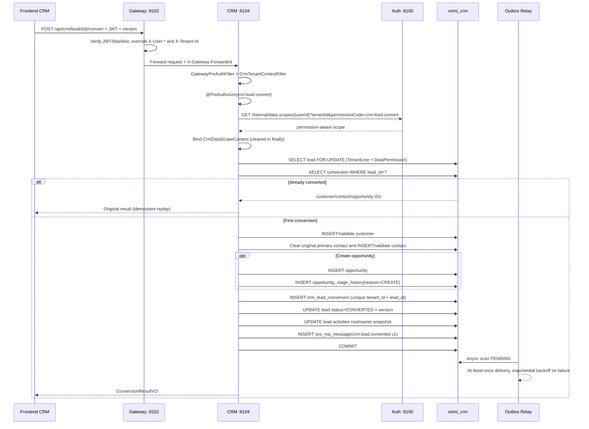

### Consistency Boundaries

- `crm_lead_conversion(tenant_id, lead_id)` is the conversion idempotency fact; the Service's row lock and optimistic version together handle concurrency.
- Customer, Contact, Opportunity, initial Stage History, Lead status and Outbox must commit or roll back together.
- All newly created objects inherit the current lead's owner snapshot; the target user/org come from the Auth authoritative API — the frontend ownerUnitId must not be trusted.
- The Outbox payload contains only tenantId, aggregate IDs, status, version and event ID — no phone, email, address or remark.
- `@OperLog` recursively desensitizes parameters and snapshots before the request leaves the process; the conversion command explicitly excludes customer, contact and opportunity names.

---

## Flow 14: CRM Opportunity Advancement and Permission Isolation — Stage History + Customer Activation

### Overview

An opportunity stage change is not a generic update but a dedicated command. Each request resolves the data scope from Auth using the full permission code `crm:opportunity:stage`, then is jointly constrained by CRM's TenantLine, DataPermission and optimistic lock; a legal transition writes immutable stage history and a domain Outbox. On a win, CRM activates the associated potential customer using dedicated SQL that keeps TenantLine and ignores only DataPermission, avoiding a silent missed update when the Customer and Opportunity owners differ.

### State Advancement

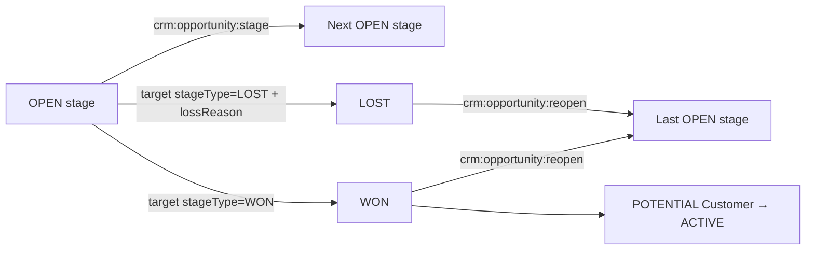

### Command Execution Rules

1. The Gateway verifies the JWT and overrides identity headers; CRM rejects business requests without a forwarding marker, userId or tenantId.
2. `@PreAuthorize` first verifies the functional permission, then `@CrmDataScope` fetches the scope from Auth with the current command's full permissionCode.
3. MyBatis always executes `TenantLine → DataPermission → Pagination`; even `ALL` in an ordinary CRM API means only all data of the current tenant.
4. The Service locks the opportunity and validates the request version, current status, the pipeline the target stage belongs to, and state-machine legality; a no-op to the same stage is rejected directly.
5. Update the opportunity stage/status/probability/loss reason and version, append `crm_opportunity_stage_history`, then write the `stage-changed/won/lost` Outbox.
6. The dedicated Mapper that activates the customer on a win bypasses only the owner data permission, not TenantLine, and explicitly validates the customer id, status and `deleted=0`.
7. Reopen uses `crm:opportunity:reopen`, restores the last open stage and writes `REOPEN` history; the state machine must not be bypassed via an ordinary update.

### PII Return Rules

- Lead, Customer and Contact lists always return masked contact details; full values are returned only with `crm:pii:view`.
- The content of Activity lists/timelines is always `[REDACTED]`; details remain controlled by `crm:pii:view`.
- The frontend re-reads details before editing; without PII permission it disables sensitive fields and omits them from the update payload, avoiding overwriting real data with masked text.

---

## Docker Deployment Flow Configuration Notes

### OAuth2 Callback URL Configuration

When deploying with Docker, the social login `redirect_uri` must use a **host-accessible URL** (not a container-internal address):

| Deployment Environment | redirect_uri Example |
|------------------------|----------------------|
| Local development | `http://localhost:8100/api/auth/oauth2/github/callback` |
| Docker deployment | `http://<host-IP>:8100/api/auth/oauth2/github/callback` |
| Production | `https://your-domain.com/api/auth/oauth2/github/callback` |

**Configuration method** (`application.yml`):

```yaml
omni:
  oauth2:
    github:
      redirect-uri: ${OAUTH2_GITHUB_REDIRECT_URI:http://localhost:8100/api/auth/oauth2/github/callback}
    google:
      redirect-uri: ${OAUTH2_GOOGLE_REDIRECT_URI:http://localhost:8100/api/auth/oauth2/google/callback}
    gitee:
      redirect-uri: ${OAUTH2_GITEE_REDIRECT_URI:http://localhost:8100/api/auth/oauth2/gitee/callback}
```

**Docker Compose environment variable override**:

```yaml
# docker-compose.yml
omni-auth:
  environment:
    OAUTH2_GITHUB_REDIRECT_URI: http://192.168.1.100:8100/api/auth/oauth2/github/callback
    OAUTH2_GOOGLE_REDIRECT_URI: http://192.168.1.100:8100/api/auth/oauth2/google/callback
    OAUTH2_GITEE_REDIRECT_URI: http://192.168.1.100:8100/api/auth/oauth2/gitee/callback
```

> **Note**: In Docker deployment, the Auth service container's internal port is 8080, but the OAuth2 callback URL must use the host-mapped port 8100 (because third-party platforms need to call back to the host's public/LAN-reachable address).

### Frontend Callback Page in Docker Deployment

After successful social login, the Auth service issues a 302 redirect to the frontend callback page:

```
Success: 302 Location: /callback#token=<JWT>&username=<username>
Failure: 302 Location: /login?error=<error_code>&message=<message>
```

In Docker deployment, the Nginx container serves frontend static files, and the `/callback` route is handled by Vue Router client-side (Nginx `try_files $uri $uri/ /index.html`).

### Inter-Container Gateway Network

In Docker deployment, all containers are in the same `omni-network` Bridge network:

```
Frontend browser → Host:8100 → Nginx container(:80)
    ├── Static files → served directly by Nginx
    ├── /api/*   → proxy_pass http://omni-gateway:8080
    └── /oauth2/* → proxy_pass http://omni-gateway:8080

Gateway container(:8080)
    ├── lb://omni-auth → Auth container(:8080) [Nacos service discovery]
    ├── lb://omni-base → Base container(:8080) [Nacos service discovery]
    └── lb://omni-workflow → Workflow container(:8080) [Nacos service discovery]
```

---

## Troubleshooting Guide

### Login Flow Issues

| Problem | Possible Cause | Troubleshooting Method |
|---------|---------------|------------------------|
| **Captcha not showing** | Redis not started or connection failed | Check Redis container status; check Auth service logs for Redis connection errors |
| **Login returns "Invalid username or password"** | Tenant ID mismatch | Confirm frontend `tenantId` parameter is correct; check `tenant_id` field in `sys_user` table |
| **401 after login** | JWT signature verification failed | Check if Gateway can access Auth's `/oauth2/jwks` endpoint; check if `JwkKeyProvider` cache has expired |
| **Frequent token expiration** | JWT validity is only 15 minutes | No refresh token mechanism currently; need to re-login; refresh token flow can be added later |

### Social Login Issues

| Problem | Possible Cause | Troubleshooting Method |
|---------|---------------|------------------------|
| **GitHub callback 404** | redirect_uri misconfiguration | Check that `Authorization callback URL` in GitHub OAuth App matches the `application.yml` configuration |
| **State verification failure** | HMAC signature mismatch | Check Auth service's `omni.oauth2.state-secret` configuration is consistent (not an issue in single-instance deployment) |
| **Google API timeout** | Network proxy issues | Google APIs require proxy access; check `proxy` configuration in `application.yml` |
| **Auto-creation user failure** | Username conflict and fallback also conflicts | Check `sys_user` table for `gh_`/`go_`/`ge_` prefix username conflicts |
| **Docker deployment callback to container-internal address** | redirect_uri uses container-internal port | Ensure redirect_uri uses host-mapped port (8100), not container-internal port (8080) |

### Permission and Menu Issues

| Problem | Possible Cause | Troubleshooting Method |
|---------|---------------|------------------------|
| **Dynamic menus not showing** | Backend `/api/auth/menus` returns empty | Check if JWT contains `authorities` field; check role-permission associations in `sys_role_permission` table |
| **Buttons always hidden** | v-permission code mismatch | Compare frontend `v-permission` value with `permission_code` in `sys_permission` table |
| **API returns 403** | @PreAuthorize permission code mismatch | Compare `@PreAuthorize` value on Controller with user's JWT permission set |

### Data Dictionary Issues

| Problem | Possible Cause | Troubleshooting Method |
|---------|---------------|------------------------|
| **Dictionary data not updating** | Redis cache not invalidated | Manually call `PUT /api/base/dict/data/refresh` to refresh cache; or wait for TTL (30 minutes) to expire |
| **Orphaned data after type deletion** | Cascade delete not triggered | Check if transaction in `DictTypeServiceImpl.deleteType()` is committed successfully |

### Operation Log Issues

| Problem | Possible Cause | Troubleshooting Method |
|---------|---------------|------------------------|
| **Logs not recorded** | RocketMQ not started | Check RocketMQ container status; check `OperLogProducer` logs for send results |
| **Log delay** | MQ consumption backlog | Check omni-base service consumer logs; check RocketMQ console for consumption progress |
| **Archiving task not running** | @Scheduled not triggered | Confirm omni-base service has only one instance (to avoid multi-instance duplicate archiving); check archiving records in logs |

---

## Flow 15: SRM Supplier Admission Approval

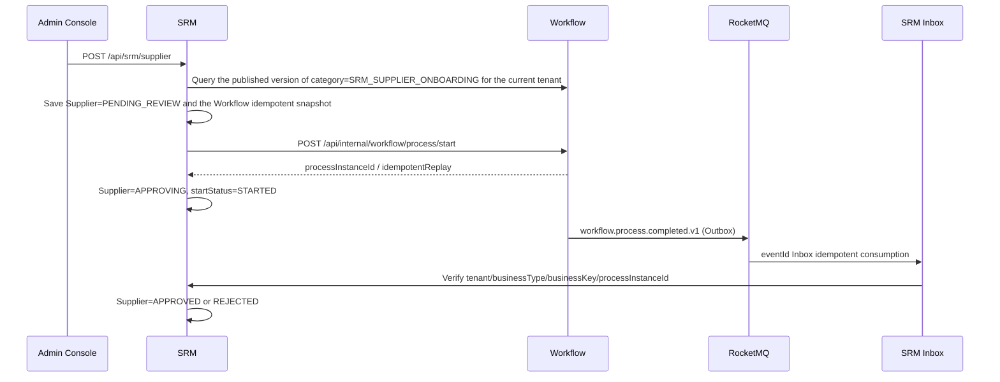

Key constraints:

- Users do not select a model version; SRM always auto-resolves the currently published model by `SRM_SUPPLIER_ONBOARDING`.
- The models required by the default tenant are validated and published by the Workflow startup initializer; Workflow fails to start when they are missing or cannot be published.
- When the start outcome is uncertain, the original `requestId/businessKey/modelVersionId/startUser` is retained and only idempotent retries are allowed.
- Approval completion is written back by reliable events; duplicate, out-of-order, cross-tenant or instance-mismatched events must not change the supplier status.

### Flow 15.1: Requisition Approval Rule Configuration and Match Simulation

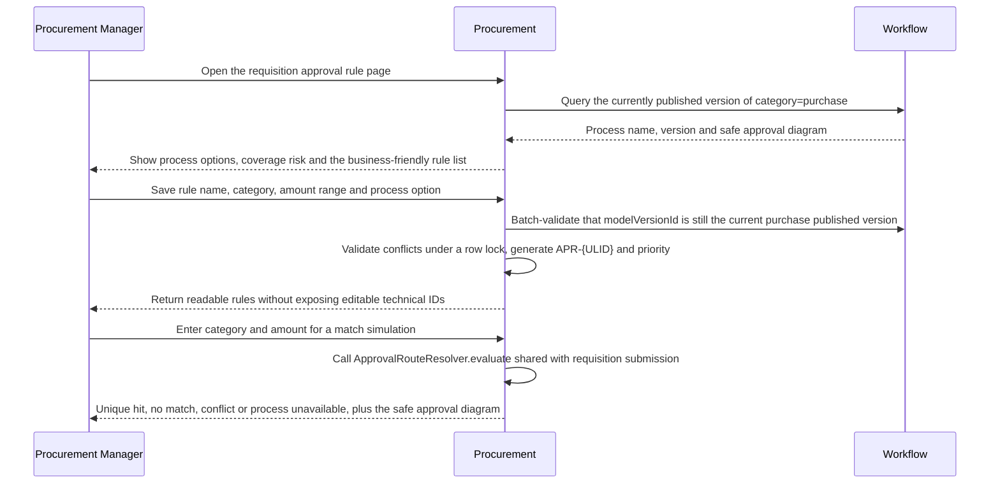

The rule list resolves the current page's model versions in batch through Workflow; per-row calls are forbidden. When Workflow is temporarily unavailable, the read-only list keeps the local rules and marks them `UNAVAILABLE`, while create, update and requisition submission fail closed. The impact analysis before disabling or deleting excludes the target rule in memory only and does not modify the database; the coverage algorithm computes gaps and conflicts from 0 to infinity by "exact category first, default rule fills the gaps".

## Flow 16: Procurement Requisition Approval and Async Write-Back

```mermaid
sequenceDiagram
    participant U as Procurement User
    participant P as Procurement
    participant W as Workflow
    participant O as Workflow Outbox
    participant M as RocketMQ
    participant I as Procurement Inbox

    U->>P: Create draft and submit
    P->>P: Re-check material/category, recompute decimal amounts, select approval route
    P->>P: Save approvalAttempt + idempotent start snapshot
    P->>W: Start process with tenant + businessKey={id}:{attempt}
    W-->>P: processInstanceId
    W->>O: Approval-completed event
    O->>M: Reliable relay
    M->>I: eventId Inbox idempotent consumption
    I->>P: APPROVING → APPROVED/REJECTED
    P-->>U: Page polls silently every 5 seconds; manual refresh on timeout
```

An explicitly failed start is recorded as `FAILED` and may be retried by reusing the original snapshot; when the network outcome is uncertain, a second business key must not be created. The page must distinguish "Workflow completed, business status syncing" from the final business status, and must not present a brief delay as a failure.

The RFQ quotation chain treats Procurement's invitation as authoritative and SRM's quotation as authoritative: the Portal reads invitations on demand and submits quotations, SRM writes the quotation and Outbox in the same transaction, and the Procurement Inbox updates the invitation status; before awarding, Procurement re-checks the current quotation version and saves an immutable snapshot, then creates the purchase order.

## Flow 17: Procurement Goods Receipt to Asset Card Creation, Transfer and Disposal

```mermaid
sequenceDiagram
    participant P as Procurement
    participant O as Procurement Outbox
    participant M as RocketMQ
    participant A as Asset
    participant W as Workflow

    P->>P: Confirm goods receipt / quality check passed
    P->>O: goods-receipt confirmed or quality-passed event
    O->>M: Reliable relay
    M->>A: At-least-once delivery
    A->>A: eventId Inbox + dual idempotency by source line/unit sequence
    A->>A: Create asset card only for PASS + assetManaged + positive integer quantity
    A->>P: Historical candidate cursor backfill (compensation path)
    A->>W: Transfer/disposal auto-resolves model by category and starts idempotently
    W->>M: workflow.process.completed.v1
    M->>A: Approval-result Inbox write-back
    A->>A: Complete operation on approval; restore previousStatus and clear occupancy on rejection/cancellation
```

The asset page's user, org, supplier, and transfer/disposal asset all use search candidates within the current tenant and data scope; the model version is selected automatically by the server. Transfer and disposal share the atomic `active_operation_type/id` occupancy; any termination path must restore the status and clear the occupancy within the same transaction. Monetary amounts always use decimal strings in JSON.

## Flow 18: SRM Portal Invitation Enrollment and Role Assignment Saga

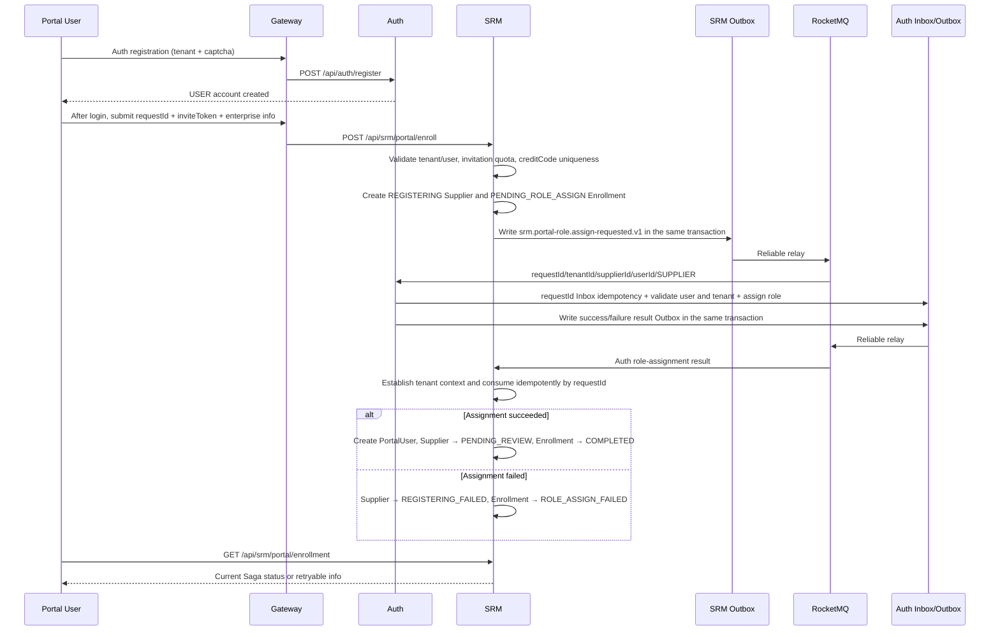

Key constraints:

- USER has only `srm:portal:enroll`; the enterprise profile and evaluation require both the SUPPLIER permission and a valid PortalUser association.
- The raw inviteToken is never persisted, logged, or sent into MQ; the invitation count is incremented atomically under a version condition.
- The Portal userId must not be written into internal owner fields; a Portal Supplier may have an empty owner until an internal responsible party is assigned.
- Both the request and the result use the Transactional Outbox; consumers are idempotent by requestId, and all MQ ThreadLocals are cleared in finally.
