# コアビジネスフロー

> 本ドキュメントは、ブラウザ操作からバックエンド処理を経てレスポンスが返るまでの主要なユーザーフローをエンドツーエンドで追跡します。機能の実装や修正を行う際のリファレンスとしてご活用ください。  
> アーキテクチャの概要については [architecture.jp.md](architecture.jp.md) を参照してください。Docker デプロイメントの設定については [docker-deployment.jp.md](docker-deployment.jp.md) を参照してください。API 契約については [api-contract.jp.md](api-contract.jp.md) を参照してください。

## Flow 1: ユーザーログイン（ユーザー名 + パスワード + CAPTCHA + JWT）

### 概要

ユーザーはフロントエンドのログインページからユーザー名、パスワード、認証コードを送信し、Gateway を経由して Auth サービスで認証を行います。
認証成功後、以降のリクエストで身分認証に使用する JWT Token が返されます。マルチテナントログイン（`tenantId:username` 形式）に対応しています。

### シーケンス

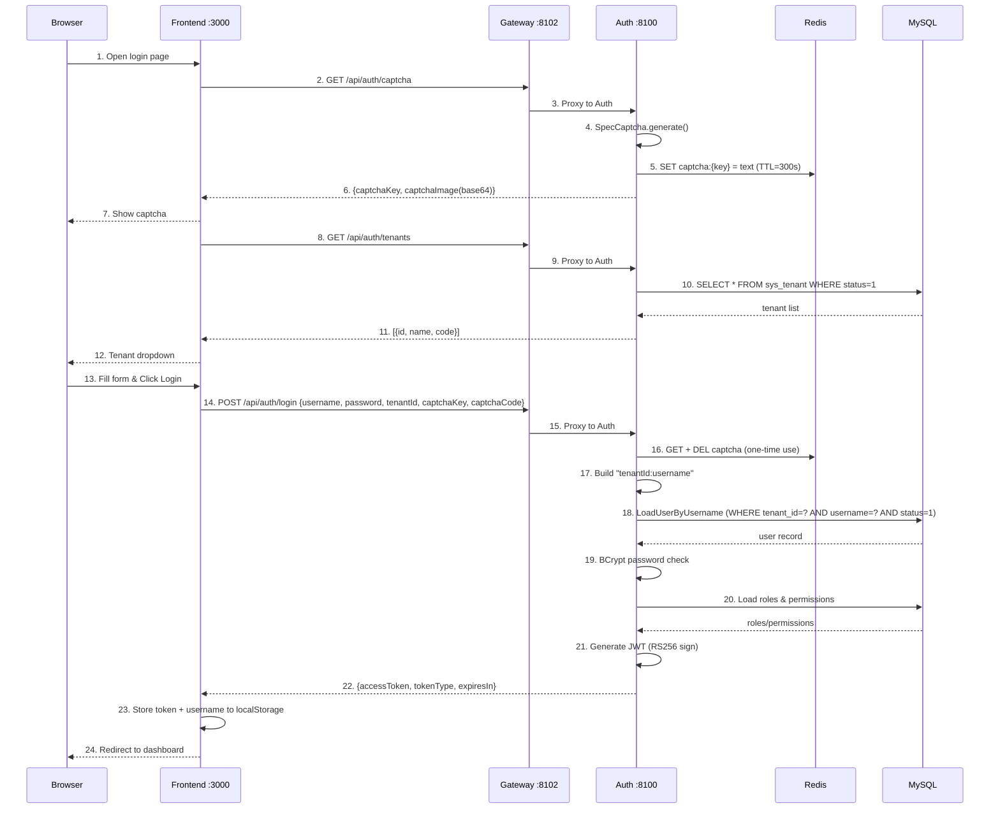

<details>
<summary>ASCII 版（クリックして展開）</summary>

```
Browser            Frontend :3000          Gateway :8102          Auth :8100           Redis              MySQL
  |                    |                       |                     |                   |                  |
  | 1. Open login page |                       |                     |                   |                  |
  |                    |                       |                     |                   |                  |
  |                    | 2. GET /api/auth/captcha                   |                   |                  |
  |                    |---------------------->|                     |                   |                  |
  |                    |                       | 3. Proxy to Auth    |                   |                  |
  |                    |                       |-------------------->|                   |                  |
  |                    |                       |                     | 4. SpecCaptcha    |                  |
  |                    |                       |                     |    generate()     |                  |
  |                    |                       |                     | 5. SET captcha:   |                  |
  |                    |                       |                     |    {key} = text   |                  |
  |                    |                       |                     |    TTL=300s ----->|                  |
  |                    |                       |                     |                   |                  |
  |                    | 6. {captchaKey, captchaImage(base64)}      |                   |                  |
  |                    |<----------------------|<--------------------|                   |                  |
  | 7. Show captcha    |                       |                     |                   |                  |
  |<-------------------|                       |                     |                   |                  |
  |                    |                       |                     |                   |                  |
  |                    | 8. GET /api/auth/tenants                    |                   |                  |
  |                    |---------------------->|                     |                   |                  |
  |                    |                       | 9. Proxy to Auth    |                   |                  |
  |                    |                       |-------------------->|                   |                  |
  |                    |                       |                     | 10. SELECT * FROM |                  |
  |                    |                       |                     |     sys_tenant    |                  |
  |                    |                       |                     |     WHERE status=1|                  |
  |                    |                       |                     |-------------------------------------->|
  |                    |                       |                     |                   |    tenant list    |
  |                    |                       |                     |<--------------------------------------|
  |                    | 11. [{id,name,code}]  |                     |                   |                  |
  |                    |<----------------------|<--------------------|                   |                  |
  | 12. Tenant dropdown|                       |                     |                   |                  |
  |<-------------------|                       |                     |                   |                  |
  |                    |                       |                     |                   |                  |
  | 13. Fill form      |                       |                     |                   |                  |
  |     (username,     |                       |                     |                   |                  |
  |      password,     |                       |                     |                   |                  |
  |      captcha,      |                       |                     |                   |                  |
  |      tenant)       |                       |                     |                   |                  |
  | 14. Click Login -->|                       |                     |                   |                  |
  |                    |                       |                     |                   |                  |
  |                    | 15. POST /api/auth/login                   |                   |                  |
  |                    |   {username, password, |                   |                   |                  |
  |                    |    tenantId, captchaKey,                   |                   |                  |
  |                    |    captchaCode} ------>|                   |                   |                  |
  |                    |                       | 16. Proxy to Auth   |                   |                  |
  |                    |                       |-------------------->|                   |                  |
  |                    |                       |                     |                   |                  |
  |                    |                       |                     | 17. Validate captcha                  |
  |                    |                       |                     |    GET + DEL ---->|                  |
  |                    |                       |                     |    (one-time use) |                  |
  |                    |                       |                     |                   |                  |
  |                    |                       |                     | 18. Build username as                 |
  |                    |                       |                     |     "tenantId:username"               |
  |                    |                       |                     |     (e.g. "1:admin")                  |
  |                    |                       |                     |                   |                  |
  |                    |                       |                     | 19. LoadUserByUsername                |
  |                    |                       |                     |     Parse tenant + username           |
  |                    |                       |                     |     WHERE tenant_id=? AND             |
  |                    |                       |                     |           username=? AND status=1     |
  |                    |                       |                     |-------------------------------------->|
  |                    |                       |                     |                   |    user record    |
  |                    |                       |                     |<--------------------------------------|
  |                    |                       |                     |                   |                  |
  |                    |                       |                     | 20. BCrypt password check             |
  |                    |                       |                     |                   |                  |
  |                    |                       |                     | 21. Load roles & permissions          |
  |                    |                       |                     |-------------------------------------->|
  |                    |                       |                     |                   |   roles/permissions
  |                    |                       |                     |<--------------------------------------|
  |                    |                       |                     |                   |                  |
  |                    |                       |                     | 22. Generate JWT   |                  |
  |                    |                       |                     |     RS256 sign     |                  |
  |                    |                       |                     |     (RSA private   |                  |
  |                    |                       |                     |      key from JWK) |                  |
  |                    |                       |                     |                   |                  |
  |                    | 23. {accessToken, tokenType:"Bearer",       |                   |                  |
  |                    |      expiresIn:900}   |                     |                   |                  |
  |                    |<----------------------|<--------------------|                   |                  |
  |                    |                       |                     |                   |                  |
  |                    | 24. Store token + username to localStorage |                   |                  |
  |                    |                       |                     |                   |                  |
  | 25. Redirect to    |                       |                     |                   |                  |
  |     dashboard      |                       |                     |                   |                  |
  |<-------------------|                       |                     |                   |                  |
  |                    |                       |                     |                   |                  |
```

</details>

### ログイン後：認証済みリクエストフロー

ログイン成功後、フロントエンドのすべての API リクエストには JWT Token が自動的に付与され、Gateway が検証を行います：

```
Browser            Frontend               Gateway :8102           Downstream Service
  |                    |                       |                        |
  | 1. Navigate to     |                       |                        |
  |    protected page  |                       |                        |
  |                    | 2. Axios GET          |                        |
  |                    |    Authorization:      |                        |
  |                    |    Bearer <JWT> ------>|                        |
  |                    |                       |                        |
  |                    |                       | 3. AuthFilter:         |
  |                    |                       |    - Extract Bearer token
  |                    |                       |    - Get RSA public key |
  |                    |                       |      (from JwkKeyProvider,
  |                    |                       |       cached 5min TTL)  |
  |                    |                       |    - RSASSAVerifier:   |
  |                    |                       |      verify RS256 sig  |
  |                    |                       |    - Check exp claim   |
  |                    |                       |                        |
  |                    |                       | 4. Inject headers:     |
  |                    |                       |    X-User-Id: 1        |
  |                    |                       |    X-Tenant-Id: 1      |
  |                    |                       |    X-User-Name: admin  |
  |                    |                       |    X-User-Roles: admin |
  |                    |                       |    X-User-Scopes: read |
  |                    |                       |                        |
  |                    |                       | 5. Forward request --->|
  |                    |                       |                        |
  |                    |                       |    6. Response <-------|
  |                    | 7. JSON data <--------|                        |
  | 8. Render page     |                       |                        |
  |<-------------------|                       |                        |
```

### 主要コンポーネント

| ステップ | ファイル | ロジック |
|------|------|-------|
| フォーム UI | `src/views/login/LoginForm.vue` | Element Plus フォーム：ユーザー名、パスワード、CAPTCHA、テナントドロップダウン |
| CAPTCHA 読み込み | `src/views/login/LoginForm.vue` | `GET /api/auth/captcha` -> base64 PNG を表示、captchaKey を保存 |
| テナント読み込み | `src/views/login/LoginForm.vue` | `GET /api/auth/tenants` -> `<el-select>` ドロップダウンに設定 |
| ログイン送信 | `src/views/login/LoginForm.vue` | `handleLogin()`: フォーム検証 -> POST `/api/auth/login` |
| Token 保存 | `src/stores/user.ts` | `setToken()` + `setUsername()` で `localStorage` に永続化 |
| リクエスト認証 | `src/api/request.ts` | Axios リクエストインターセプター：`Authorization: Bearer <token>` |
| Vite プロキシ | `vite.config.ts` | `/api` -> `http://localhost:8102` (Gateway) |
| Gateway フィルター | `AuthFilter.java` | JWT RS256 署名検証 + claims 抽出 + 身分ヘッダー注入 |
| JWK プロバイダー | `JwkKeyProvider.java` | Auth の `/oauth2/jwks` から RSA 公開鍵を取得し、5 分間キャッシュ |
| CAPTCHA サービス | `CaptchaServiceImpl.java` | SpecCaptcha 生成 + Redis 保存（TTL 300 秒、ワンタイム使用） |
| Auth コントローラー | `AuthController.java` | `POST /login`: CAPTCHA -> 認証 -> ロール -> JWT |
| ユーザー詳細 | `OmniUserDetailsService.java` | マルチテナント解析 `tenantId:username` + BCrypt パスワード検証 |
| JWT サービス | `JwtTokenServiceImpl.java` | RSA 秘密鍵で署名し、ユーザー身分と権限を含む JWT を生成 |

### JWT Token 構造

Auth サービスが発行する JWT には以下の claims が含まれます：

```json
{
  "header": {
    "alg": "RS256",
    "kid": "<key-id-from-jwk>"
  },
  "payload": {
    "sub": "1",
    "tenant_id": "1",
    "username": "admin",
    "roles": ["admin"],
    "scope": "read write",
    "iat": 1748000000,
    "exp": 1748000900
  }
}
```

| Claim | 説明 |
|-------|-------------|
| `sub` | ユーザー ID（`sys_user.id`） |
| `tenant_id` | テナント ID（`sys_tenant.id`） |
| `username` | ログインユーザー名 |
| `roles` | ユーザーロール一覧（例：`["admin", "editor"]`） |
| `scope` | 権限スコープ、スペース区切り |
| `iat` | 発行時刻（Unix タイムスタンプ） |
| `exp` | 有効期限（`iat` + 900 秒 = 15 分） |

### マルチテナントログイン機構

ログイン時に `tenantId` パラメーターでテナントを指定します。Auth サービス内部ではユーザー名を `tenantId:username`（例：`1:admin`）の形式に変換し、
`OmniUserDetailsService.loadUserByUsername()` で解析します：

```
フロントエンド送信: { username: "admin", tenantId: 1 }
  -> AuthController 構築: "1:admin"
  -> OmniUserDetailsService 解析: tenantId=1, actualUsername="admin"
  -> SQL: SELECT * FROM sys_user WHERE tenant_id=1 AND username='admin' AND status=1
```

`:` を含まない場合（ユーザー名のみでログイン）、デフォルトで `tenantId=1` となり、後方互換性を確保します。

### CAPTCHA ライフサイクル

```
1. 生成: SpecCaptcha -> base64 PNG
2. 保存: Redis SET captcha:{uuid} = "a3f8" EX 300
3. 検証: Redis GET captcha:{uuid} -> DELETE captcha:{uuid}（ワンタイム使用、リプレイ防止）
   - key が存在しない -> "Captcha expired"（期限切れまたは使用済み）
   - 値が一致しない   -> "Invalid captcha"
```

### 現在のステータス

- **ログイン**：完全実装済み、CAPTCHA + マルチテナント + JWT Token 発行
- **Gateway JWT 検証**：完全実装済み、RS256 署名チェック + claims 抽出 + 身分ヘッダー注入
- **フロントエンド**：すべての mock コードは削除済み、実 API に接続済み
- **Token 有効期間**：15 分（900 秒）、refresh token 機構は未実装

## Flow 2: OAuth2 Authorization Code + PKCE ログイン

### 概要

フロントエンドは OAuth2 パブリッククライアント（SPA）として、Spring Authorization Server の OAuth2 認可エンドポイント経由で PKCE 認可コードフローを実行します。
ユーザーが Auth サービスの認可確認ページで承認した後、フロントエンドは認可コード + code_verifier を使用して access_token と id_token を取得します。
サードパーティ連携や OAuth2 標準認証が必要なシーンに適しています。

### シーケンス

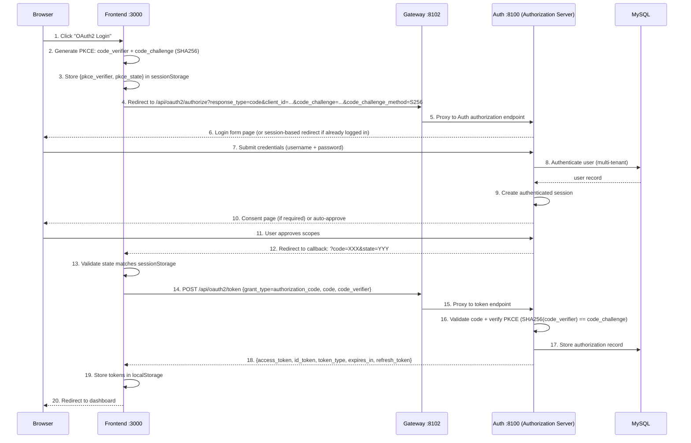

### 主要コンポーネント

| ステップ | ファイル | ロジック |
|------|------|-------|
| PKCE ジェネレーター | `src/utils/oauth2.ts` | code_verifier（43〜128 文字のランダム文字列）+ SHA256 code_challenge を生成 |
| PKCE ストレージ | `src/utils/oauth2.ts` | sessionStorage に `pkce_verifier` と `pkce_state` を保存 |
| 認可リダイレクト | `src/utils/oauth2.ts` | `/oauth2/authorize` URL を構築し、PKCE パラメーターを付与 |
| Token 交換 | `src/api/auth.ts` | POST `/oauth2/token`、code_verifier を Auth サービスに送信して検証 |
| Token 保存 | `src/stores/user.ts` | access_token + id_token を localStorage に保存 |
| 認可エンドポイント | Spring Authorization Server | `/oauth2/authorize` — ログインフォーム + 認可確認 |
| Token エンドポイント | Spring Authorization Server | `/oauth2/token` — 認可コードで Token に交換 |
| PKCE バリデーター | Spring Authorization Server | SHA256(code_verifier) と保存済みの code_challenge を比較 |

### PKCE ストレージキー

| sessionStorage キー | 説明 | ライフサイクル |
|--------------------|-------------|-----------|
| `pkce_verifier` | ランダムな code_verifier 文字列 | 認可開始時に書き込み、Token 交換後に削除 |
| `pkce_state` | CSRF 対策用 state パラメーター | 認可開始時に書き込み、callback 検証後に削除 |

### 現在のステータス

- **Authorization Server**：Spring Authorization Server 7.x 設定済み、RS256 JWK 署名
- **OAuth2 クライアント**：`omni-spa` クライアント登録済み（authorization_code + PKCE grant type）
- **フロントエンド PKCE ユーティリティ**：`src/utils/oauth2.ts` にて verifier/challenge 生成と Token 交換を実装済み
- **Token タイプ**：access_token (opaque) + id_token (JWT, ユーザー情報含む)

---

## Flow 3: OAuth2 Device Authorization Grant

### 概要

デバイス認可フロー（RFC 8628）は、ブラウザを持たないデバイスや入力制限のあるデバイス（IoT、CLI ツールなど）に適しています。デバイス側は `/oauth2/device_authorization` 経由で `device_code` と `user_code` を取得し、ユーザーは別のデバイスで `user_code` を入力して認可を完了します。デバイス側は `/oauth2/token` をポーリングしてアクセストークンを取得します。

フロントエンドにはテスト用のシミュレーション入口（`/device` ページ）が用意されており、ブラウザでデバイス認可フロー全体を簡単にテストできます。

### シーケンス図

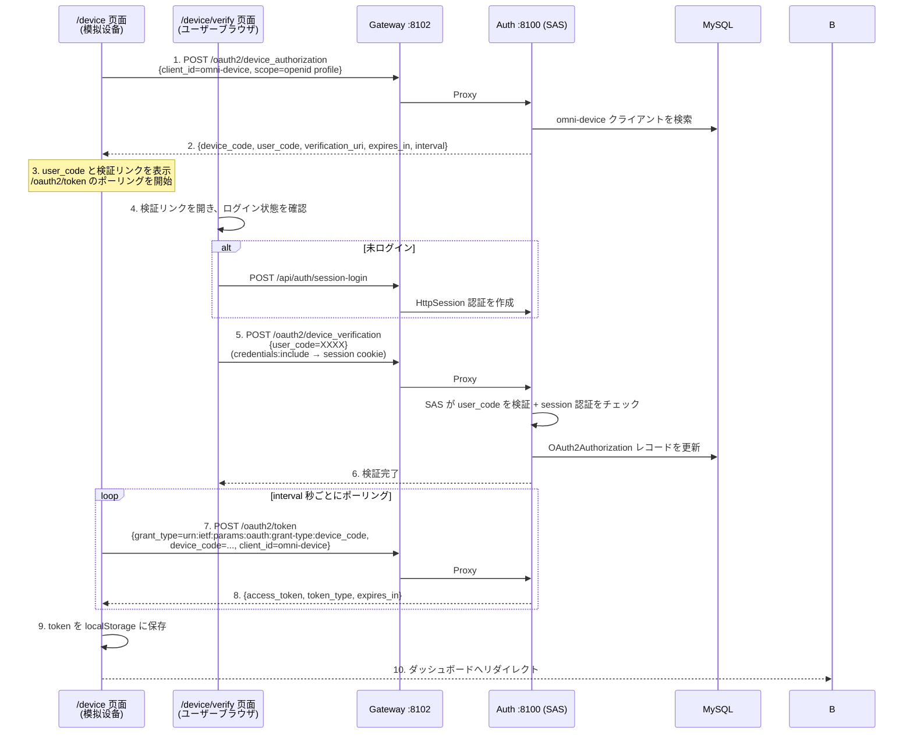

### 主要コンポーネント

| ステップ | ファイル | 責務 |
|------|------|------|
| デバイス認可リクエスト | `src/api/auth.ts` → `requestDeviceAuthorization()` | POST `/oauth2/device_authorization`、デバイスコードを取得 |
| Token ポーリング | `src/api/auth.ts` → `pollDeviceToken()` | POST `/oauth2/token`、`authorization_pending` を処理 |
| デバイスシミュレーターページ | `src/views/device/index.vue` | user_code + カウントダウン + ポーリングを表示 |
| デバイス検証ページ | `src/views/device/verify.vue` | ログイン組み込み + user_code 入力 + 認可確認 |
| ログインページ入口 | `src/components/LoginForm.vue` | 「デバイス認可ログイン」ボタン |
| デバイス認可エンドポイント | Spring Authorization Server | `/oauth2/device_authorization` — SAS 組み込み |
| デバイス検証エンドポイント | Spring Authorization Server | `/oauth2/device_verification` — SAS 組み込み |
| デバイスクライアント | `DeviceClientInitializer.java` | 起動時に `omni-device` クライアントを登録 |
| リダイレクトフィルター | `AuthorizationServerConfig.java` | 未認証ユーザーをフロントエンド検証ページへリダイレクト |

### デバイスクライアント設定

| 設定項目 | 値 |
|--------|-----|
| Client ID | `omni-device` |
| 認証方式 | `NONE`（パブリッククライアント、clientSecret なし） |
| 認可タイプ | `urn:ietf:params:oauth:grant-type:device_code` + `refresh_token` |
| スコープ | `openid`, `profile` |
| PKCE 必須 | `false` |
| 認可同意必須 | `false`（ユーザーが「認可」をクリックすれば同意とみなす、SAS 追加同意フォーム不要） |

### ポーリング動作

| エラーコード | 意味 | 処理方式 |
|--------|------|----------|
| `authorization_pending` | ユーザーがまだ認可を完了していない | ポーリングを継続 |
| `slow_down` | ポーリング頻度が速すぎる | ポーリングを継続（SAS が自動的に interval を増加） |
| `expired_token` | device_code が期限切れ | ポーリングを停止し、ユーザーに再发起を促す |
| `access_denied` | ユーザーが認可を拒否 | ポーリングを停止し、ユーザーに通知 |

### 現在のステータス

- **デバイス認可エンドポイント**：SAS 7 で `deviceAuthorizationEndpoint(Customizer.withDefaults())` により有効化済み
- **デバイス検証エンドポイント**：SAS 7 で `deviceVerificationEndpoint(Customizer.withDefaults())` により有効化済み
- **デバイスクライアント**：`omni-device` クライアントは `DeviceClientInitializer` により起動時に自動登録
- **フロントエンドページ**：`/device`（デバイスシミュレーター）と `/device/verify`（検証ページ）は実装済み
- **ログイン入口**：ログインページに「デバイス認可ログイン」ボタンを追加

---

## Flow 4: OAuth2 ソーシャルログイン（GitHub / Google / Gitee）

### 概要

ユーザーは GitHub、Google、または Gitee のアカウントでワンクリックログインできます。バックエンドは Strategy Pattern を採用し、`OAuth2ProviderHandler` インターフェースで `buildAuthorizationUrl` / `exchangeCodeForAccessToken` / `fetchUserProfile` メソッドを統一定義しています。各プロバイダーは独立した `@Component` として実装され、Spring の `Map<String, OAuth2ProviderHandler>` 自動注入によりマルチプロバイダー配信を実現します。現在、GitHub、Google、Gitee の 3 つのプロバイダーを実装済みで、フロントエンドの WeChat ログインボタンはプレースホルダーです（バックエンド Handler は未実装）。

フロントエンドは `window.location.href` で Auth サービスの `/api/auth/oauth2/{provider}` エンドポイントにナビゲートし、Auth サービスは provider パラメーターに応じて対応する Handler を選択し、HMAC 署名付き state パラメーターを生成した後、302 でサードパーティ認可ページへリダイレクトします。ユーザーがサードパーティプラットフォームで認可した後、Auth サービスにコールバックし、Auth は Handler を通じて state 検証 → Token 交換 → ユーザー情報取得 → ローカルユーザー検索または自動作成 → JWT 発行を完了し、最終的に 302 でフロントエンドコールバックページへリダイレクトします（URL fragment に JWT を含める）。

### シーケンス図

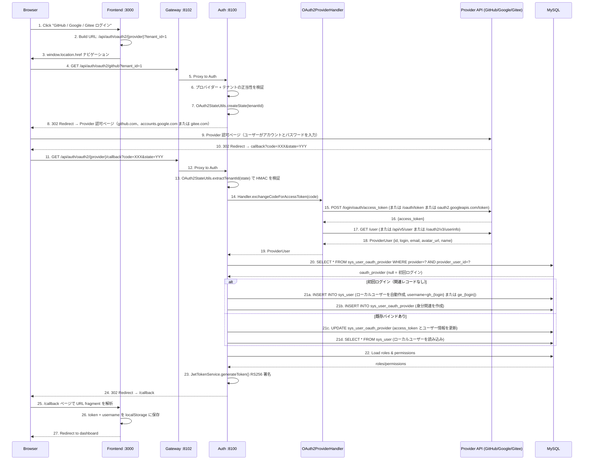

<details>
<summary>ASCII 版（クリックして展開）</summary>

```
Browser            Frontend :3000          Gateway :8102          Auth :8100           Provider API         MySQL
  |                    |                       |                     |                     |                   |
  | 1. Click social    |                       |                     |                     |                   |
  |    login button    |                       |                     |                     |                   |
  |                    | 2. Build URL          |                     |                     |                   |
  |                    |    /api/auth/oauth2/  |                     |                     |                   |
  |                    |    {provider}?tenant_id=1                   |                     |                   |
  | 3. window.location |                       |                     |                     |                   |
  |    .href --------->|                       |                     |                     |                   |
  |                    |                       |                     |                     |                   |
  | 4. GET /api/auth/oauth2/{provider}?tenant_id=1                   |                   |
  |                    |                       |                     |                     |                   |
  |                    |                       | 5. Proxy            |                     |                   |
  |                    |                       |-------------------->|                     |                   |
  |                    |                       |                     | 6. Validate provider |                   |
  |                    |                       |                     |    + tenant          |                   |
  |                    |                       |                     | 7. createState()     |                   |
  |                    |                       |                     |    HMAC-SHA256 sign  |                   |
  |                    |                       |                     |                     |                   |
  | 8. 302 Redirect -> Provider 認可ページ (github.com, accounts.google.com または gitee.com) |                   |
  |                    |                       |                     |                     |                   |
  | 9. Provider login  |                       |                     |                     |                   |
  |    (user/password) |                       |                     |                     |                   |
  |--------------------|-------------------------------------------->|------------------------------------------>|
  |                    |                       |                     |                     |                   |
  | 10. 302 callback?code=XXX&state=YYY        |                     |                     |                   |
  |<---------------------------------------------------------------------------------------|                   |
  |                    |                       |                     |                     |                   |
  | 11. GET /api/auth/oauth2/{provider}/callback                     |                     |                   |
  |--------------------|---------------------->|                     |                     |                   |
  |                    |                       | 12. Proxy           |                     |                   |
  |                    |                       |-------------------->|                     |                   |
  |                    |                       |                     |                     |                   |
  |                    |                       |                     | 13. Verify state     |                   |
  |                    |                       |                     |     HMAC signature   |                   |
  |                    |                       |                     |                     |                   |
  |                    |                       |                     | 14-19. Handler: exchange code,          |
  |                    |                       |                     |   get access_token, fetch user profile  |
  |                    |                       |                     |-------------------->|                   |
  |                    |                       |                     |    ProviderUser     |                   |
  |                    |                       |                     |<--------------------|                   |
  |                    |                       |                     |                     |                   |
  |                    |                       |                     | 20. Lookup oauth provider               |
  |                    |                       |                     |------------------------------------------>|
  |                    |                       |                     |                     |    oauth_provider   |
  |                    |                       |                     |<------------------------------------------|
  |                    |                       |                     |                     |                   |
  |                    |                       |                     | 21. Create/Update user + oauth link      |
  |                    |                       |                     |------------------------------------------>|
  |                    |                       |                     |                     |                   |
  |                    |                       |                     | 22. Load roles/perms |                   |
  |                    |                       |                     |------------------------------------------>|
  |                    |                       |                     |                     |   roles/permissions |
  |                    |                       |                     |<------------------------------------------|
  |                    |                       |                     |                     |                   |
  |                    |                       |                     | 23. Generate JWT (RS256)                |
  |                    |                       |                     |                     |                   |
  | 24. 302 /callback#token=JWT&username=xxx                         |                     |                   |
  |<---------------------------------------------------------------------------------------|                   |
  |                    |                       |                     |                     |                   |
  | 25. /callback page |                       |                     |                     |                   |
  |    parse fragment  |                       |                     |                     |                   |
  |                    | 26. Store token        |                     |                     |                   |
  |                    |     to localStorage    |                     |                     |                   |
  | 27. Redirect to    |                       |                     |                     |                   |
  |     dashboard      |                       |                     |                     |                   |
  |<-------------------|                       |                     |                     |                   |
```

</details>

### 主要コンポーネント

| ステップ | ファイル | 責務 |
|------|------|------|
| ログインボタン | `src/components/LoginForm.vue` | "GitHub / Google / Gitee" サードパーティログインボタン、`getThirdPartyLoginUrl()` を呼び出し |
| フロントエンド発起 | `src/api/auth.ts` | `getThirdPartyLoginUrl(provider, tenantId)` でリダイレクト URL を構築 |
| コールバックページ | `src/views/callback/index.vue` | URL fragment 内の JWT を解析し、localStorage に保存 |
| ログイン発起エンドポイント | `SocialLoginController.java` | `GET /api/auth/oauth2/{provider}` — state 生成 + 302 リダイレクト |
| コールバック処理エンドポイント | `SocialLoginController.java` | `GET /api/auth/oauth2/{provider}/callback` — Token 交換 + ユーザー作成 + JWT 発行 |
| ビジネスオーケストレーション | `SocialLoginServiceImpl.java` | コールバックフロー全体：state 検証 → Handler 配信 → ユーザー検索/作成 → JWT |
| 戦略インターフェース | `OAuth2ProviderHandler.java` | 戦略インターフェース、`buildAuthorizationUrl` / `exchangeCodeForAccessToken` / `fetchUserProfile` を定義 |
| GitHub 実装 | `GitHubOAuth2Handler.java` | GitHub OAuth2 実装（`@Component("github")`）、認可 URL 構築、access_token 交換、ユーザー情報取得 |
| Google 実装 | `GoogleOAuth2Handler.java` | Google OAuth2 実装（`@Component("google")`）、ローカルプロキシ経由で Google API にアクセス、メールからユーザー名を派生 |
| Gitee 実装 | `GiteeOAuth2Handler.java` | Gitee OAuth2 実装（`@Component("gitee")`）、Gitee OAuth2 API に接続 |
| 統一ユーザー DTO | `ProviderUser.java` | 統一されたサードパーティユーザー情報 DTO、各プロバイダーのフィールド差異を吸収 |
| State 署名 | `OAuth2StateUtils.java` | HMAC-SHA256 署名の生成と検証（`tenantId|timestamp|hmac`） |
| 身分関連 | `SysUserOauthProviderMapper.java` | ユーザーとサードパーティ身分のバインド関係の照会と永続化 |
| JWT 発行 | `JwtTokenServiceImpl.java` | ソーシャルログインユーザーにロールと権限を含む RS256 JWT を発行 |

### State 署名メカニズム

OAuth2 state パラメーターは HMAC-SHA256 署名を採用し、形式は `tenantId|timestamp|hmac` です：

```
生成: HMAC-SHA256(tenantId + "|" + timestamp, secretKey) → hmac
形式: "1|1780636194690|9d9d878ba61253dd..."

検証:
1. "|" で分割して [tenantId, timestamp, hmac] を取得
2. HMAC-SHA256(tenantId + "|" + timestamp, secretKey) を再計算
3. 計算結果と受信した hmac を比較
4. timestamp が期限切れかどうかをチェック（リプレイ攻撃防止）
```

### 自動ユーザー作成メカニズム

初回のサードパーティログイン時、システムは自動的にローカルユーザーを作成します：

```
1. ユーザー名: プロバイダーのプレフィックスで生成
   - GitHub: gh_{login}（例：gh_wang-baohai）
   - Google: go_{email_prefix}（例：go_john、john@gmail.com から取得）
   - Gitee:  ge_{login}（例：ge_zhang-san）
   - 競合時の fallback: {prefix}_{login}_{provider_user_id}
2. ニックネーム: サードパーティプラットフォームの display name（なければ login）
3. メール: サードパーティプラットフォームの email
4. アバター: サードパーティプラットフォームの avatar_url
5. パスワード: null（パスワードでのログイン不可、サードパーティログインのみ）
6. ステータス: 有効 (status=1)
7. テナント: ログイン時に指定された tenantId
8. ロール: デフォルトロールなし（管理者が手動で割り当て）
```

### sys_user_oauth_provider テーブル設計

| フィールド | 型 | 説明 |
|------|------|------|
| `id` | BIGINT AUTO_INCREMENT | 主キー |
| `user_id` | BIGINT NOT NULL | `sys_user.id` への関連 |
| `provider` | VARCHAR(32) NOT NULL | プロバイダー識別子（github/google/wechat/gitee） |
| `provider_user_id` | VARCHAR(100) NOT NULL | サードパーティプラットフォームのユーザーユニーク ID |
| `provider_username` | VARCHAR(100) | サードパーティプラットフォームのユーザー名 |
| `provider_email` | VARCHAR(200) | サードパーティプラットフォームのメール |
| `provider_avatar` | VARCHAR(500) | サードパーティプラットフォームのアバター URL |
| `access_token` | VARCHAR(500) | 最新の Access Token |
| `UNIQUE (provider, provider_user_id)` | | 重複バインドを防止 |

### エラーハンドリング

| シナリオ | 処理方式 | フロントエンド表示 |
|------|---------|---------|
| ユーザーが認可を拒否 | 302 → `/login?error=user_denied` | ログインページに「認可が拒否されました」と表示 |
| コールバックパラメーター欠落 | 302 → `/login?error=invalid_callback` | ログインページに「無効なコールバック」と表示 |
| State 検証失敗 | BusinessException をスロー → 302 → `/login?error=social_login_failed` | ログインページにエラーメッセージを表示 |
| サードパーティ API エラー | BusinessException（502）をスロー | ログインページに「認可コードの交換に失敗しました」と表示（GitHub: access_token インターフェース / Google: token インターフェース / Gitee: token インターフェース） |
| ユーザー情報取得失敗 | BusinessException（502）をスロー | ログインページに「ユーザー情報の取得に失敗しました」と表示（GitHub: /user インターフェース / Google: /oauth2/v3/userinfo インターフェース / Gitee: /api/v5/user インターフェース） |
| ユーザーが無効化されている | BusinessException（403）をスロー | ログインページに「ユーザーは無効化されています」と表示 |

### 現在のステータス

- **OAuth2 ソーシャルログイン**：GitHub、Google、Gitee を実装済み、エンドツーエンドの完全実装で検証通過
- **State 署名**：HMAC-SHA256 改ざん防止 + リプレイ防止
- **自動ユーザー作成**：初回サードパーティログインでローカルユーザーを自動登録 + 身分関連（GitHub: `gh_` プレフィックス、Google: `go_` プレフィックス、Gitee: `ge_` プレフィックス）
- **redirect_uri**：設定対応可能（`application.yml` + 環境変数オーバーライド）
- **フロントエンドコールバック**：`/callback` ページで URL fragment 内の JWT を解析し自動ログイン
- **Strategy Pattern**：`OAuth2ProviderHandler` インターフェース + `Map<String, OAuth2ProviderHandler>` 注入、新プロバイダー追加は Handler インターフェースの実装のみ
- **マルチプロバイダー拡張**：`sys_user_oauth_provider` テーブルは github/google/wechat/gitee に対応、現在は GitHub、Google、Gitee を実装済み、WeChat フロントエンドボタンはプレースホルダー

## Flow 5: RBAC 機能権限 — 動的メニュー読み込みとボタン認可

### 概要

ユーザーログイン成功後、フロントエンドはバックエンドから動的メニューツリー（ユーザー権限でフィルタ済み）を取得し、これに基づいてルートを登録しサイドバーをレンダリングします。
ページ内のボタンは `v-permission` ディレクティブで表示/非表示を制御し、API レイヤーでは `@PreAuthorize` で認可を行います。

### シーケンス

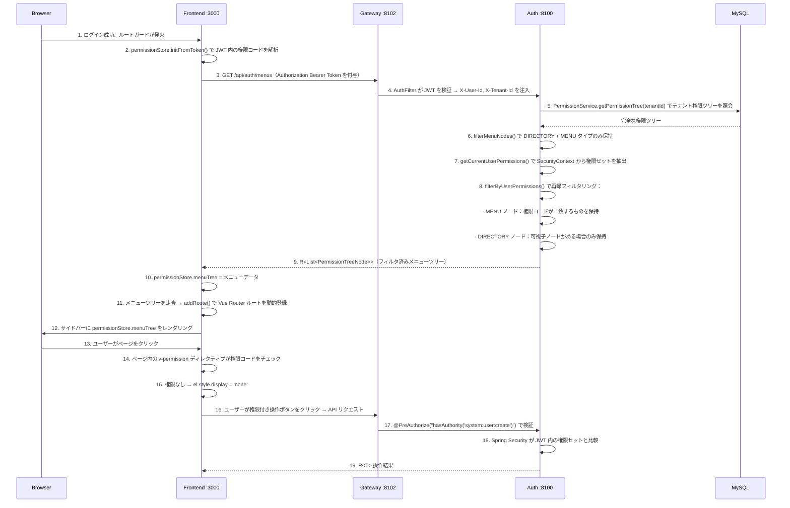

### 主要な実装詳細

**バックエンドメニューフィルタリングロジック**（`MenuController`）：

1. テナントの完全な権限ツリーを照会 → `permissionService.getPermissionTree(tenantId)`
2. 第一段階フィルタ：`type = DIRECTORY | MENU` のノードのみ保持（BUTTON と API を除外）
3. 第二段階フィルタ：`SecurityContext` から現在のユーザー権限セットを抽出（`ROLE_` プレフィックスを除外）
4. 再帰フィルタ：MENU ノードは `permissionCode` が権限セットに含まれるかチェック；DIRECTORY ノードはまず子ノードを再帰処理し、可視子ノードがある場合のみ保持
5. 権限情報を取得できない場合はフォールバックとして全メニューを返す

**フロントエンドボタン権限制御**（`v-permission` ディレクティブ）：

```vue
<el-button v-permission="'system:user:create'" type="primary">新規作成</el-button>
<el-button v-permission="'system:user:update'" size="small">編集</el-button>
<el-button v-permission="'system:user:delete'" size="small" type="danger">削除</el-button>
```

- `removeChild` ではなく `display: none` を使用し、Vue のリアクティブ更新と互換性を確保
- `mounted` および `updated` フックでチェックを実行
- 適用済みページ：ユーザー管理、ロール管理、組織管理、テナント管理、オンラインユーザー、OAuth2 クライアント管理

### 現在のステータス

- **動的メニュー**：バックエンド `MenuController` 完全実装済み、フロントエンド `usePermissionStore` 動的ルート登録
- **ボタン権限**：`v-permission` カスタムディレクティブは 6 つの管理ページに適用済み（合計 20+ ボタン）
- **API 認可**：すべての Controller の書き込み操作メソッドに `@PreAuthorize` を宣言
- **権限コード形式**：`resource:action`（例：`system:user:create`）

## Flow 6: RBAC データ権限 — リクエストレベルの行データフィルタリング

### 概要

HTTP リクエストが到着するたびに、`DataScopeResolveFilter` は現在のユーザーのデータスコープを解析し、
MyBatis-Plus の `DataPermissionInterceptor` は `sys_user` テーブルのクエリに自動的に WHERE 条件を追加し、
行レベルのデータフィルタリングを実現します。ビジネスコードへの侵入はゼロです。

### シーケンス

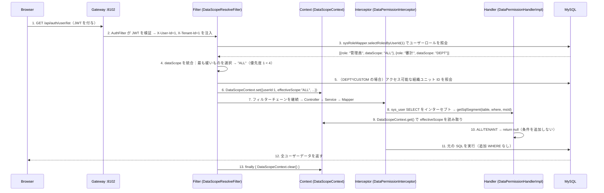

### DataScope フィルタリング条件対照表

| effectiveScope | SQL 追加条件 | 説明 |
|---------------|-------------|------|
| `ALL` | なし | テナント跨ぎで全データ可視 |
| `TENANT` | なし | 既存の `tenant_id` フィルタで十分 |
| `DEPT` | `WHERE sys_user.primary_unit_id IN ({自部門ID})` | 自部門のユーザーのみ |
| `DEPT_AND_BELOW` | `WHERE sys_user.primary_unit_id IN ({自部門および子孫ID})` | 自部門 + 下位 |
| `CUSTOM` | `WHERE sys_user.primary_unit_id IN ({カスタム部門+子孫ID})` | カスタムスコープ |
| `SELF` | `WHERE sys_user.id = {現在のユーザーID}` | 自分のみ |

### 組織ユニットの子孫クエリ

`DEPT_AND_BELOW` と `CUSTOM` スコープは、組織ユニットのすべての子孫ノードを照会する必要があります：

```java
// SysOrgUnitMapper
List<Long> selectDescendantIdsByPath(String path);
// SQL: SELECT id FROM sys_org_unit WHERE path LIKE '{path}%' AND id != {selfId}
```

`sys_org_unit` テーブルの物質化パス（`path` フィールド、例：`1/2/5/`）を活用して、効率的な祖先-子孫クエリを実現します。

### メモリフィルタリングモード（オンラインユーザーシナリオ）

オンラインユーザーデータは Redis に保存されており、SQL インターセプターではフィルタリングできません。Controller は `DataScopeContext` からデータスコープを読み取り、手動でフィルタリングします：

```java
// OnlineUserController.list()
List<OnlineUserVO> list = onlineUserService.listOnlineUsers();
DataScopeContext.DataScopeInfo scope = DataScopeContext.get();
if (scope != null) {
    list = filterByDataScope(list, scope);
}
// ALL/TENANT → 全部、DEPT*/CUSTOM → primaryUnitId でフィルタ、SELF → 自分のみ
```

### 設定登録順序

```java
// MyBatisPlusConfig
MybatisPlusInterceptor interceptor = new MybatisPlusInterceptor();
// データ権限はページネーションインターセプターの前に登録する必要がある
interceptor.addInnerInterceptor(new DataPermissionInterceptor(new DataPermissionHandlerImpl()));
interceptor.addInnerInterceptor(new PaginationInnerInterceptor(DbType.MYSQL));
```

**理由**：ページネーションインターセプターが `SELECT COUNT(*)` クエリを実行する際、データ権限条件が既に追加されている必要があります。そうでないと、COUNT 結果が実際のデータと一致しなくなります。

### 現在のステータス

- **SQL インターセプト**：`DataPermissionInterceptor` + `DataPermissionHandlerImpl` 完全実装済み、現在は `sys_user` テーブルのみフィルタリング
- **リクエストレベルコンテキスト**：`DataScopeResolveFilter` + `DataScopeContext` ThreadLocal 管理
- **マルチロール統合**：最も緩いもの優先ポリシー実装済み
- **メモリフィルタリング**：`OnlineUserController` で `primaryUnitId` ベースのメモリフィルタリング実装済み
- **物質化パス照会**：`SysOrgUnitMapper.selectDescendantIdsByPath()` で子孫ノードを効率的に取得

## Flow 7: ユーザー作成 — 3 つの経路

### 概要

システムは 3 つのユーザー作成経路をサポートし、異なるシナリオをカバーします：ユーザーセルフ登録（新規ユーザー向け）、管理者バックエンド作成（運用担当者向け）、ソーシャルログイン自動作成（サードパーティ OAuth2 初回ログインユーザー向け）。すべての経路で作成されたユーザーには、現在のテナントの `USER` デフォルトロール（`data_scope=SELF`）が自動的に割り当てられ、初期状態では組織ユニット帰属なし（`primaryUnitId` は `null`）で、管理者が後で割り当てる必要があります。

### シーケンス図

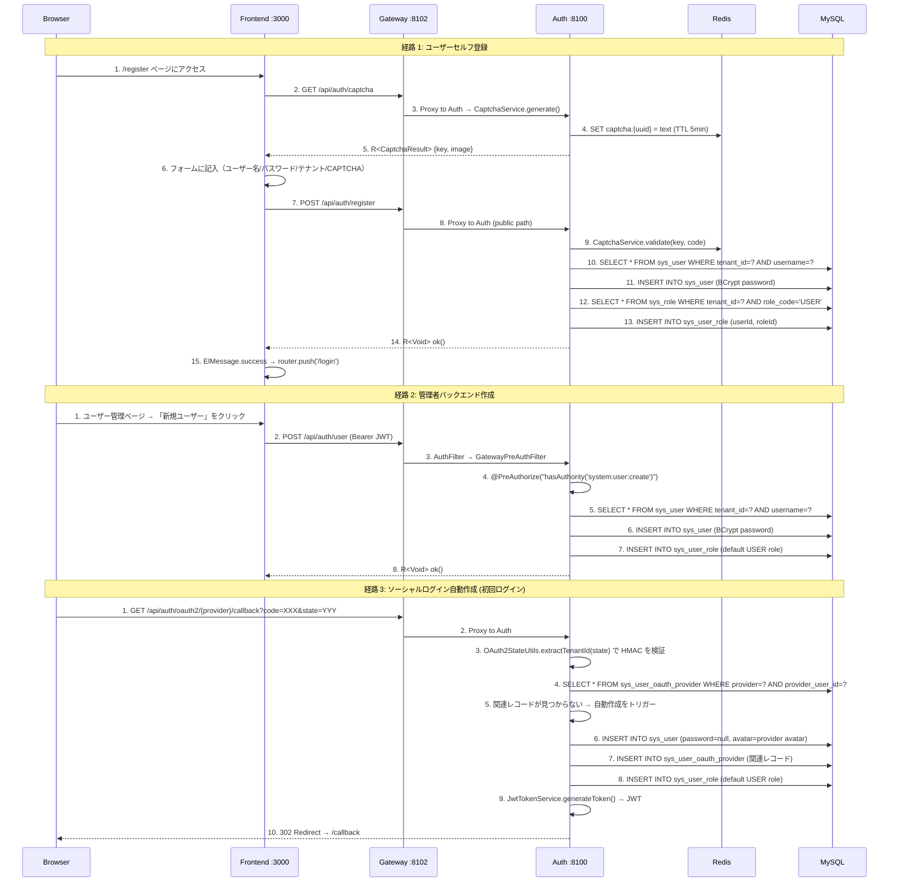

### 3 つの経路の比較

| 項目 | セルフ登録 | 管理者作成 | ソーシャルログイン自動作成 |
|------|---------|-----------|----------------|
| **入口** | `POST /api/auth/register` | `POST /api/auth/user` | OAuth2 コールバック内部 |
| **認証要件** | なし（パブリックエンドポイント） | `system:user:create` 権限 | なし（OAuth2 コールバック） |
| **CAPTCHA** | あり（Redis ワンタイム） | なし | なし |
| **テナント決定** | ユーザーがドロップダウンから選択 | 管理者が指定 | HMAC 署名付き state パラメーター |
| **パスワード** | BCrypt エンコード | BCrypt エンコード | `null`（ソーシャルログインのみ） |
| **ユーザー名** | ユーザーが選択（3〜32 文字） | 管理者が指定（文字数上限なし） | 自動生成：`gh_`/`go_`/`ge_` + サードパーティユーザー名 |
| **デフォルトロール** | `USER`（`data_scope=SELF`） | `USER` | `USER` |
| **組織ユニット** | 割り当てなし（`primaryUnitId=null`） | 割り当てなし | 割り当てなし |
| **ユーザー名競合** | `BusinessException(400)` をスロー | `BusinessException(400)` をスロー | Fallback：`{prefix}{login}_{providerUserId}` |
| **作成後の動作** | 成功メッセージ → ログインページへリダイレクト | ユーザーリストに戻る | 自動的に JWT を発行 → フロントエンドへリダイレクト |

### 主要コンポーネント

| コンポーネント | ファイル | 責務 |
|------|------|------|
| `AuthController.register()` | `omni-auth/.../controller/AuthController.java` | セルフ登録入口、`UserService` に委譲 |
| `UserController.create()` | `omni-auth/.../controller/UserController.java` | 管理者作成入口、`@PreAuthorize` 必須 |
| `SocialLoginServiceImpl.handleCallback()` | `omni-auth/.../service/impl/SocialLoginServiceImpl.java` | ソーシャルログインコールバック処理、自動作成ロジック含む |
| `UserServiceImpl.registerUser()` | `omni-auth/.../service/impl/UserServiceImpl.java` | セルフ登録ビジネス：CAPTCHA 検証 → 一意性チェック → 挿入 → ロール割り当て |
| `UserServiceImpl.createUser()` | `omni-auth/.../service/impl/UserServiceImpl.java` | 管理者作成ビジネス：一意性チェック → 挿入 → ロール割り当て |
| `SocialLoginServiceImpl.createNewUser()` | `omni-auth/.../service/impl/SocialLoginServiceImpl.java` | ソーシャルログイン自動作成：ユーザー名生成 → 挿入 → OAuth 関連レコード → ロール割り当て |
| `UserServiceImpl.assignDefaultRole()` | `omni-auth/.../service/impl/UserServiceImpl.java` | 共通メソッド：テナントの `USER` ロールを照会 → `sys_user_role` に書き込み |
| `RegisterRequest` | `omni-auth/.../dto/RegisterRequest.java` | セルフ登録 DTO（CAPTCHA フィールド含む） |
| `CreateUserRequest` | `omni-auth/.../dto/CreateUserRequest.java` | 管理者作成 DTO（phone/gender 含む） |
| 登録ページ | `omni-frontend/src/views/register/index.vue` | フロントエンド登録フォーム（パスワード確認、テナント選択含む） |

### 現在のステータス

- **セルフ登録**：`POST /api/auth/register` 完全実装済み、フロントエンド登録ページ `/register` 準備完了、Gateway ホワイトリスト設定済み
- **管理者作成**：`POST /api/auth/user` 完全実装済み、フロントエンドユーザー管理ページ準備完了、`@PreAuthorize` 権限制御有効
- **ソーシャルログイン自動作成**：`SocialLoginServiceImpl.createNewUser()` 完全実装済み、GitHub/Google/Gitee 対応、ユーザー名競合時の fallback 機構あり
- **デフォルトロール割り当て**：3 つの経路で `assignDefaultRole()` メソッドを共用、ロール割り当て失敗は警告ログのみで処理をブロックしない
- **組織ユニット**：3 つの経路とも組織ユニットは割り当てなし、`primaryUnitId` は `null` のまま、管理者による後続の手動割り当てが必要

---

## Flow 8: XSS 対策 — リクエストサニタイゼーションと設定管理

### 8A. XSS リクエストサニタイゼーション（各リクエストで自動実行）

```
Client Request
    │
    ▼
┌─────────────────────────────────────────┐
│ Gateway: SecurityHeadersFilter          │
│  → X-Content-Type-Options: nosniff を追加│
│  → X-Frame-Options: DENY を追加         │
│  → Referrer-Policy: strict-origin を追加│
│  → AuthFilter: JWT 検証 + 身分ヘッダー注入│
└────────────────┬────────────────────────┘
                 │ omni-auth へ転送
                 ▼
┌─────────────────────────────────────────┐
│ Layer 2: XssFilter (OncePerRequestFilter)│
│  1. XssConfigProvider.getXssSettings()   │
│     → Redis キャッシュヒット? キャッシュを返す│
│     → ミス? DB を照会 + キャッシュに書き込み│
│  2. enabled=false の場合 → サニタイゼーションをスキップ│
│  3. enabled=true の場合 → Request をラップ│
│     → XssHttpServletRequestWrapper       │
│     → getParameter/getParameterValues をオーバーライド│
│     → XssRuleHolder.set(rules) ThreadLocal│
└────────────────┬────────────────────────┘
                 │
                 ▼
┌─────────────────────────────────────────┐
│ Layer 1: XssStringDeserializer          │
│  (Jackson SimpleModule 自動登録)        │
│  → @RequestBody JSON 内の String フィールド│
│  → 自動的に XssSanitizer.sanitize() を通過│
└────────────────┬────────────────────────┘
                 │
                 ▼
            Controller
```

**XssSanitizer サニタイゼーションルール**（ruleType 別にディスパッチ）：

| ruleType | サニタイゼーション方式 | 例 |
|----------|---------|------|
| `HTML_TAG` | 正規表現でペアタグ `<tag>...</tag>` と自己閉じタグ `<tag/>` を除去 | `<script>alert(1)</script>` → `alert(1)` |
| `EVENT_HANDLER` | 正規表現で `on*` 属性を除去 | `onclick="..."` → 削除 |
| `DANGEROUS_PROTOCOL` | `javascript:` / `vbscript:` / `data:` プロトコル文字列を置換 | `javascript:alert(1)` → 空文字列 |
| `CUSTOM_PATTERN` | カスタム正規表現でマッチして置換 | `expression(...)` → 削除 |

**ThreadLocal クリーンアップ**：`XssFilter` は `finally` ブロック内で `XssRuleHolder.clear()` を呼び出し、メモリリークを防止します。

### 8B. XSS 設定管理（管理者操作）

```
Admin (フロントエンド XSS 対策設定ページ)
    │
    ├─ グローバルスイッチ切り替え
    │  PUT /api/auth/xss-config/toggle
    │  → XssConfigController.toggleGlobal()
    │  → @PreAuthorize("hasAuthority('system:xssconfig:update')")
    │  → XssConfigServiceImpl.toggleGlobal()
    │     → UPDATE sys_xss_config SET enabled = ? WHERE tenant_id = ?
    │     → Redis キャッシュを削除: xss:enabled:{tenantId}, xss:rules:{tenantId}
    │
    ├─ ルール作成
    │  POST /api/auth/xss-config/rules
    │  → @PreAuthorize("hasAuthority('system:xssconfig:create')")
    │  → ruleType 列挙値 + pattern 正規表現の正当性を検証
    │  → INSERT sys_xss_blacklist_rule
    │  → Redis キャッシュを削除
    │
    ├─ ルール更新
    │  PUT /api/auth/xss-config/rules/{id}
    │  → @PreAuthorize("hasAuthority('system:xssconfig:update')")
    │  → UPDATE sys_xss_blacklist_rule
    │  → Redis キャッシュを削除
    │
    ├─ ルール削除
    │  DELETE /api/auth/xss-config/rules/{id}
    │  → @PreAuthorize("hasAuthority('system:xssconfig:delete')")
    │  → DELETE sys_xss_blacklist_rule
    │  → Redis キャッシュを削除
    │
    └─ 個別ルールの有効化/無効化
       PUT /api/auth/xss-config/rules/{id}/toggle
       → @PreAuthorize("hasAuthority('system:xssconfig:update')")
       → UPDATE sys_xss_blacklist_rule SET enabled = NOT enabled
       → Redis キャッシュを削除
```

**キャッシュ戦略**：
- Redis キー：`xss:enabled:{tenantId}`（文字列 "true"/"false"）+ `xss:rules:{tenantId}`（JSON 配列）
- TTL：30 分
- 失効：すべての書き込み操作（toggle、CRUD）後に `DEL` で 2 つのキャッシュキーを積極的に削除
- 復帰元：`XssConfigProviderImpl.loadFromDbAndCache()` はキャッシュミス時に DB を照会しキャッシュに書き戻す

### 主要コンポーネント

| コンポーネント | ファイルパス | 責務 |
|------|---------|------|
| `XssConfigController` | `omni-auth/.../controller/XssConfigController.java` | XSS 設定管理 REST API（7 エンドポイント） |
| `XssConfigServiceImpl` | `omni-auth/.../service/impl/XssConfigServiceImpl.java` | 設定 CRUD + Redis キャッシュ失効 |
| `XssConfigProviderImpl` | `omni-auth/.../security/XssConfigProviderImpl.java` | 設定ロード（Redis 優先 → DB 復帰元） |
| `XssFilter` | `omni-common/.../security/xss/XssFilter.java` | Servlet Filter、設定ロード + ThreadLocal セット |
| `XssSanitizer` | `omni-common/.../security/xss/XssSanitizer.java` | コアサニタイゼーションロジック（4 種のルールタイプ） |
| `XssStringDeserializer` | `omni-common/.../security/xss/XssStringDeserializer.java` | Jackson デシリアライザーラッパー、JSON 文字列を自動洗浄 |
| `SecurityHeadersFilter` | `omni-gateway/.../config/SecurityHeadersFilter.java` | Gateway セキュリティレスポンスヘッダー |
| XSS 管理ページ | `omni-frontend/src/views/system/xssconfig/index.vue` | グローバルスイッチ + ルール CRUD テーブル |

### 現在のステータス

- **3 レイヤーサニタイゼーション**：Jackson デシリアライザー + Servlet Filter + Gateway セキュリティヘッダー すべて実装済みで自動アセンブリ
- **設定管理**：グローバルスイッチ + ルール CRUD + 個別ルール toggle 合計 7 API エンドポイント完全実装
- **フロントエンドページ**：`システム管理 → XSS 対策設定` 準備完了、ページネーション付きルールリスト、作成/編集ダイアログ、v-permission ボタン権限制御対応
- **キャッシュ戦略**：Redis キャッシュ + 書き込み操作時の積極的失効を実装
- **テナント分離**：設定とルールは `tenant_id` で分離

---

## Flow 9: データディクショナリ管理 — タイプ+データ 2 段階構造 CRUD

### 概要

Base サービス（`omni-base :8101`）はデータディクショナリ管理機能を提供し、「タイプ + データ」の 2 段階構造を採用しています。ディクショナリタイプ（`sys_dict_type`）はコード分類（例：`sys_user_gender`）を定義し、ディクショナリデータ（`sys_dict_data`）は具体的なキー値ペア（例：`1=男性, 2=女性, 0=不明`）を定義します。フロントエンドは master-detail レイアウトを採用し、左側にタイプリスト、右側にデータリストを配置し、完全な CRUD 操作と Redis キャッシュ管理に対応しています。

### シーケンス

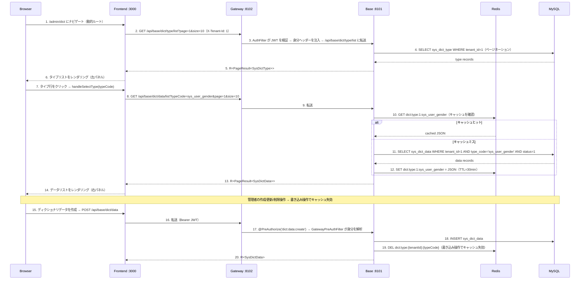

<details>
<summary>ASCII 版（クリックして展開）</summary>

```
Browser            Frontend :3000          Gateway :8102          Base :8101           Redis              MySQL
  |                    |                       |                     |                   |                  |
  | 1. Navigate to     |                       |                     |                   |                  |
  |    /admin/dict     |                       |                     |                   |                  |
  |                    | 2. GET /api/base/dict/type/list              |                   |                  |
  |                    |---------------------->|                     |                   |                  |
  |                    |                       | 3. AuthFilter →     |                   |                  |
  |                    |                       |    forward path     |                   |                  |
  |                    |                       |-------------------->|                   |                  |
  |                    |                       |                     | 4. SELECT         |                  |
  |                    |                       |                     |    sys_dict_type  |                  |
  |                    |                       |                     |    WHERE tenant_id=1                 |
  |                    |                       |                     |-------------------------------------->|
  |                    |                       |                     |                   |    type records   |
  |                    |                       |                     |<--------------------------------------|
  |                    | 5. R<PageResult>      |                     |                   |                  |
  |                    |<----------------------|<--------------------|                   |                  |
  | 6. Render type     |                       |                     |                   |                  |
  |    list (left)     |                       |                     |                   |                  |
  |<-------------------|                       |                     |                   |                  |
  |                    |                       |                     |                   |                  |
  | 7. Click type row  |                       |                     |                   |                  |
  |                    | 8. GET /api/base/dict/data/list?typeCode=... |                   |                  |
  |                    |---------------------->|                     |                   |                  |
  |                    |                       | 9. Forward -------->|                   |                  |
  |                    |                       |                     | 10. GET cache     |                  |
  |                    |                       |                     |------------------>|                  |
  |                    |                       |                     |                   |  hit? cached JSON |
  |                    |                       |                     |<------------------|                  |
  |                    |                       |                     |                   |                  |
  |                    |                       |                     | [if miss: SELECT sys_dict_data ----->|
  |                    |                       |                     |  SET cache <---------------------------|
  |                    |                       |                     |                   |                  |
  |                    | 13. R<PageResult>     |                     |                   |                  |
  |                    |<----------------------|<--------------------|                   |                  |
  | 14. Render data    |                       |                     |                   |                  |
  |     list (right)   |                       |                     |                   |                  |
  |<-------------------|                       |                     |                   |                  |
  |                    |                       |                     |                   |                  |
  | 15. Create data -->|                       |                     |                   |                  |
  |                    | 16. POST /api/base/dict/data                 |                   |                  |
  |                    |---------------------->|                     |                   |                  |
  |                    |                       | 17. @PreAuthorize   |                   |                  |
  |                    |                       |-------------------->|                   |                  |
  |                    |                       |                     | 18. INSERT ------>|                  |
  |                    |                       |                     | 19. DEL cache --->|                  |
  |                    | 20. R<SysDictData>    |                     |                   |                  |
  |                    |<----------------------|<--------------------|                   |                  |
```

</details>

### 主要コンポーネント

| コンポーネント | ファイルパス | 責務 |
|------|---------|------|
| `DictTypeController` | `omni-base/.../controller/DictTypeController.java` | ディクショナリタイプ REST API（6 エンドポイント）、`@PreAuthorize` 権限制御 |
| `DictDataController` | `omni-base/.../controller/DictDataController.java` | ディクショナリデータ REST API（5 エンドポイント）、`@PreAuthorize` 権限制御 |
| `DictTypeServiceImpl` | `omni-base/.../service/impl/DictTypeServiceImpl.java` | タイプ CRUD + カスケード削除データ + キャッシュ失効 |
| `DictDataServiceImpl` | `omni-base/.../service/impl/DictDataServiceImpl.java` | データ CRUD + cache-aside キャッシュ + 手動リフレッシュ |
| `GatewayPreAuthFilter` | `omni-base/.../security/GatewayPreAuthFilter.java` | Gateway から注入された X-User-* ヘッダーから SecurityContext を構築 |
| `XssConfigProviderImpl` | `omni-base/.../security/XssConfigProviderImpl.java` | Redis-only 戦略で XSS SPI を実装（auth サービスが書き込んだキャッシュに依存） |
| ディクショナリ管理ページ | `omni-frontend/src/views/base/dict/index.vue` | Master-detail レイアウト：左タイプリスト + 右データリスト |
| ディクショナリ API モジュール | `omni-frontend/src/api/dict.ts` | 11 個の型付き API 関数 + TypeScript インターフェース定義 |

### キャッシュ戦略

**Cache-aside モード**：

| 項目 | 値 |
|------|-----|
| Redis Key | `dict:type:{tenantId}:{typeCode}` |
| TTL | 30 分 |
| シリアライゼーション | JSON（`GenericJacksonJsonRedisSerializer`） |

**読み取りパス**（`DictDataServiceImpl.listEnabledData()`）：
1. Redis キャッシュを確認 → ヒットすればデシリアライズして返す
2. ミス → DB を照会（`status=1`、`sort` 後に `id` でソート）→ シリアライズして Redis に書き込み（TTL 30min）

**書き込みパス**（すべての CRUD 操作）：
1. まず DB に書き込み（INSERT / UPDATE / DELETE）
2. 次に Redis キーを DEL（書き込み操作でキャッシュ失効、次回の読み取り時に遅延ロード）

**手動リフレッシュ**（`DictDataServiceImpl.refreshCache()`）：
1. Redis キーを DEL
2. DB を照会
3. Redis に書き込み（即座に書き戻し、データ不整合シナリオに対応）

**カスケード削除**：ディクショナリタイプを削除する際、単一の `@Transactional` 操作で関連するすべてのディクショナリデータを同時に削除し、対応するキャッシュも失効させます。

### 権限ツリー

```
base (DIRECTORY, id=50)             ← "基礎データ" 第 1 レベルメニュー
  └── base:dict (MENU, id=51)       ← "ディクショナリ管理" 第 2 レベルメニュー
        ├── dict:type:list     (API, id=52)
        ├── dict:type:create   (API, id=53)
        ├── dict:type:update   (API, id=54)
        ├── dict:type:delete   (API, id=55)
        ├── dict:data:list     (API, id=56)
        ├── dict:data:create   (API, id=57)
        ├── dict:data:update   (API, id=58)
        ├── dict:data:delete   (API, id=59)
        └── dict:data:refresh  (API, id=60)
```

すべての 11 権限ノードは `SUPER_ADMIN` ロール（role_id=1）に割り当てられています。

### 現在のステータス

- **バックエンド**：11 API エンドポイント完全実装（6 タイプ + 5 データ）、`@PreAuthorize` 権限制御有効
- **フロントエンド**：Master-detail レイアウトページ準備完了、`v-permission` ボタン権限制御はすべての操作ボタンに適用済み
- **キャッシュ**：Cache-aside + 書き込み操作失効 + 手動リフレッシュ実装済み
- **シードデータ**：3 つのプリセットディクショナリタイプ（`sys_user_gender`, `sys_common_status`, `sys_notice_type`）+ 7 件のデータ（テナント 1）
- **Gateway ルート**：`Path=/api/base/**` → `lb://omni-base` 設定済み（StripPrefix なし、コントローラーは完全パスを使用）
- **セキュリティアーキテクチャ**：`GatewayPreAuthFilter` は Gateway から注入された身分ヘッダーから Spring Security コンテキストを構築、`XssConfigProviderImpl` は Redis-only 戦略で XSS 対策を継承

---

## Flow 10: 操作ログ — AOP 収集 + RocketMQ 非同期書き込み + ホット/コールドアーカイブ

### 概要

操作ログシステムは `@OperLog` アノテーション + AOP アスペクトによる非侵入型の収集を実現し、RocketMQ 経由でログメッセージを非同期送信し、omni-base サービスが消費してホットテーブル（`sys_oper_log`）に書き込み、定期的にコールドテーブル（`sys_oper_log_archive`）へアーカイブして長期コンプライアンス保管を実現します。フロー全体はビジネスコードへの侵入がゼロで、Controller メソッドにアノテーションを追加するだけです。

### 10A. 操作ログ記録フロー（書き込み操作のたびにトリガー）

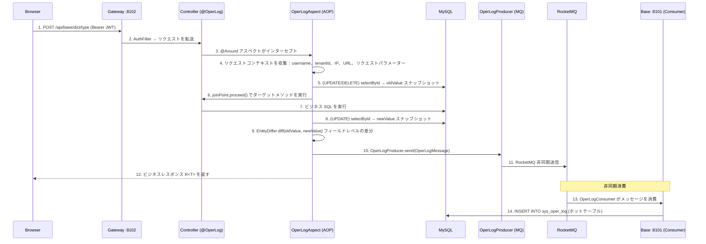

### 10B. 操作ログアーカイブフロー（毎日 02:00 定期実行）

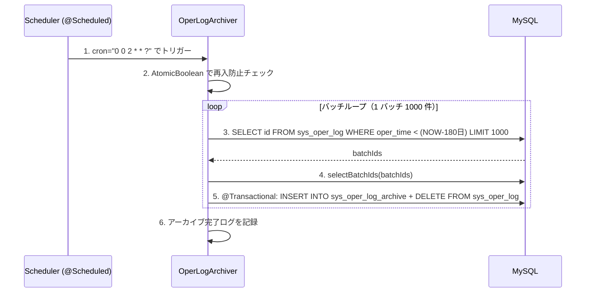

### 主要コンポーネント

| コンポーネント | ファイルパス | 責務 |
|------|---------|------|
| `@OperLog` | `omni-common-core/.../operlog/OperLog.java` | アノテーション定義、module/operType/entityClass/idExpr を宣言 |
| `OperType` | `omni-common-core/.../operlog/OperType.java` | 操作タイプリスト：CREATE/UPDATE/DELETE/QUERY/EXPORT/IMPORT |
| `OperLogMessage` | `omni-common-core/.../operlog/OperLogMessage.java` | ログメッセージ POJO、Serializable を実装 |
| `OperLogAspect` | `omni-common-operlog/.../aspect/OperLogAspect.java` | AOP @Around アスペクト、コンテキスト収集 + エンティティスナップショット + diff |
| `EntityDiffer` | `omni-common-operlog/.../diff/EntityDiffer.java` | フィールドレベル差分比較、変更フィールドのみ返す |
| `OperLogProducer` | `omni-common-operlog/.../producer/OperLogProducer.java` | RocketMQ プロデューサー、ログメッセージを非同期送信 |
| `OperLogConsumer` | `omni-base/.../consumer/OperLogConsumer.java` | RocketMQ コンシューマー、sys_oper_log ホットテーブルに書き込み |
| `OperLogArchiver` | `omni-base/.../service/OperLogArchiver.java` | 定期アーカイブタスク、180 日ホットテーブル→コールドテーブル移行 |

### 監査証跡ディメンション

| ディメンション | フィールド | 説明 |
|------|------|------|
| Who | `oper_username` | 操作者のユーザー名 |
| When | `oper_time` | 操作タイムスタンプ |
| What | `module` + `oper_type` + `request_url` | ビジネスモジュール + 操作タイプ + リクエスト URL |
| Changed | `old_value` / `new_value` | エンティティ変更前後の JSON スナップショット（UPDATE は差分フィールドのみ） |
| Where | `ip_address` + `user_agent` | 操作元の IP とクライアント情報 |
| How Long | `execution_time` | メソッド実行所要時間（ms） |
| Result | `response_status` + `error_msg` | 操作結果のステータスとエラーメッセージ |

### 監査ログとの補完関係

| ログタイプ | テーブル | 記録範囲 | 収集方式 | サービスモジュール |
|---------|------|---------|---------|--------|
| 操作ログ | `sys_oper_log` / `sys_oper_log_archive` | ビジネスデータ変更（CRUD） | `@OperLog` + AOP + MQ 非同期 | omni-base / omni-common-operlog |
| 監査ログ | `sys_audit_log` | セキュリティイベント（ログイン、Token、権限変更） | イベント駆動（`AuditEventPublisher`） | omni-auth |
| ログインログ | `sys_login_log` | ログイン行動（成功/失敗） | 認証フロー内部記録 | omni-auth |

3 種類のログはそれぞれの役割を果たし、完全な監査証跡システムを構成します：操作ログは「ビジネスデータがどう変化したか」を記録し、監査ログは「セキュリティイベントで何が起きたか」を記録し、ログインログは「誰がいつログインしたか」を記録します。

### 現在のステータス

- **AOP アスペクト**：`OperLogAspect` 完全実装済み、CREATE/UPDATE/DELETE/QUERY/EXPORT/IMPORT の 6 種操作タイプに対応
- **エンティティ diff**：`EntityDiffer` はフィールドレベル差分比較を実装、UPDATE 操作は変更フィールドのみ記録
- **SpEL 抽出**：`#id`、`#result.data.id` などの式に対応、メソッドパラメーターと戻り値からエンティティ ID を抽出
- **MQ 非同期**：`OperLogProducer` は RocketMQ 経由で非同期送信、ビジネスリクエストをブロックしない
- **ホット/コールドアーカイブ**：`OperLogArchiver` は毎日 02:00 に実行、180 日保持ポリシー、バッチ処理 1000 件/バッチ
- **omni-auth 無効化**：認証モジュールは `omni-common-operlog` を導入せず、認証行動は `sys_login_log` + `sys_audit_log` でカバー

---

## Flow 11: ユーザータスク作成 — ワークベンチセルフサービスから XXL-JOB 直接登録

### 概要

ユーザーはワークベンチの「マイタスク」エリアでセルフサービスによりスケジュールジョブを作成します。フロントエンドはタスクタイプ選択、動的パラメーターフォーム、Cron 式エディターを提供し、バックエンドはタイプの有効性を検証した後、データベースに保存して直接 XXL-JOB スケジューリングセンターに登録し、作成即有効化を実現します。

### シーケンス図

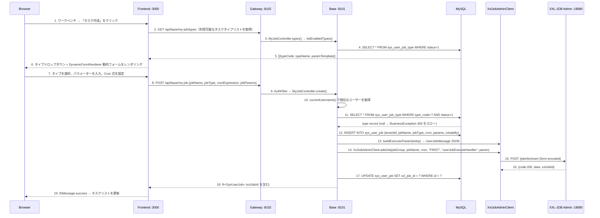

### エラーハンドリング

| シナリオ | 処理方式 | フロントエンド表示 |
|------|---------|----------|
| タスクタイプが存在しないまたは無効化 | `BusinessException(400)` をスロー | ElMessage.error |
| XXL-JOB 登録失敗 | DB レコードをロールバック (`sysUserJobMapper.deleteById`) → `BusinessException(500)` をスロー | ElMessage.error「タスクのスケジューリングセンターへの登録に失敗しました」 |
| タスク名が空 | Jakarta Validation `@NotBlank` | フォーム検証メッセージ |
| Cron 式が空 | Jakarta Validation `@NotBlank` | フォーム検証メッセージ |

### 主要コンポーネント

| コンポーネント | ファイルパス | 責務 |
|------|---------|------|
| ワークベンチページ | `omni-frontend/src/views/home/index.vue` | タスク作成ダイアログ（タイプ選択 + CronGenerator + DynamicFormRenderer） |
| Cron エディター | `omni-frontend/src/components/CronGenerator.vue` | 頻度タイプセレクター + 動的条件フォーム + 人間可読プレビュー |
| 動的フォーム | `omni-frontend/src/components/DynamicFormRenderer.vue` | `param_template` JSON Schema に基づいてフォームをレンダリング |
| API モジュール | `omni-frontend/src/api/myJob.ts` | `createMyJob()`、`getEnabledJobTypes()` |
| コントローラー | `omni-base/.../controller/MyJobController.java` | `POST /api/base/my-job`、currentUsername を抽出 |
| サービスレイヤー | `omni-base/.../service/impl/UserJobServiceImpl.java` | `createJob()` — タイプ検証 + DB 挿入 + XXL-JOB 登録 + 失敗ロールバック |
| XXL-JOB クライアント | `omni-common-job/.../XxlJobAdminClient.java` | `addJob()` — form パラメーターを構築して `/jobinfo/insert` を呼び出し |
| タスクタイプレジストリ | `sys_user_job_type` | `type_code`（ユニーク）+ `param_template`（JSON Schema） |
| ユーザータスクテーブル | `sys_user_job` | `xxl_job_id` で XXL-JOB スケジューリングセンターと関連 |

### 所有権モデル

`MyJobController` は `@PreAuthorize` を使用せず、`verifyOwnership(id, username)` でタスクの所有権を検証します：

```java
private void verifyOwnership(Long id, String username) {
    SysUserJob job = userJobService.getJobById(id);
    if (!username.equals(job.getCreateBy())) {
        throw new BusinessException(403, "このタスクを操作する権限がありません");
    }
}
```

各ユーザーは自分が作成したタスクのみ操作でき、行レベルのデータ分離を実現します。

### 現在のステータス

- **タスク作成**：エンドツーエンド実装、ワークベンチ作成 → DB 保存 → XXL-JOB 登録、失敗時は自動ロールバック
- **タイプ管理**：`UserJobTypeController` はタスクタイプの CRUD とパラメーターテンプレート管理に対応
- **動的フォーム**：`DynamicFormRenderer` は `param_template` に基づいて input/select/number/textarea を自動レンダリング
- **Cron エディター**：`CronGenerator` は 7 種の頻度タイプに対応（毎分/毎 X 分/毎時/毎 X 時/毎日/毎週/毎月）
- **所有権検証**：`verifyOwnership()` はユーザーが自分が作成したタスクのみ操作可能であることを保証

---

## Flow 12: ユーザータスク実行 — XXL-JOB トリガーからフロントエンド通知

### 概要

XXL-JOB スケジューリングセンターは cron 式に基づいて実行をトリガーし、`XxlJobSpringExecutor` はリクエストを `userJobExecuteHandler` に配信します。この handler は JSON 実行パラメーターからタスクコンテキストを解析し、`UserJobHandlerRegistry` 経由で具体的な `UserJobHandler` にルーティングして実行し、実行ログを書き込み `lastFireTime` を更新します。フロントエンドワークベンチは 10 秒ごとにアクティブタスクの実行ログをポーリングし、新しいログを発見した際に通知をポップアップします。

### シーケンス図

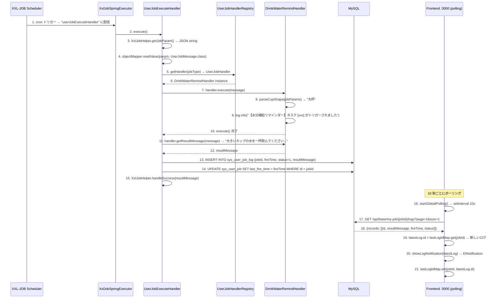

### フロントエンドポーリングメカニズム

ワークベンチは `startGlobalPolling()` を使用してグローバルログ監視を実現します：

```
setInterval 10 秒ごと：
1. tableData 内の status=1 のアクティブタスクをフィルタリング
2. 各アクティブタスクについて：
   a. GET /api/base/my-job/{id}/logs?page=1&size=1
   b. 最新のログ ID を取得
   c. lastLogIdMap 内の既知の ID と比較
   d. latestLog.id > prevId の場合：
      - lastLogIdMap に既にタスク記録がある場合（初回以外）→ ElNotification をポップアップ
      - lastLogIdMap を更新
3. loadData() + loadStats() を更新
```

**重複通知防止**：`lastLogIdMap` は初回初期化時に現在の最新ログ ID のみを記録し、通知はポップアップしません。後続のポーリングで発見された新しいログ（ID > 既知の ID）のみ通知をトリガーします。

**ライフサイクル管理**：
- `onMounted` でポーリングを開始
- `onUnmounted` で `setInterval` をクリアし、メモリリークを防止

### 実行パラメーター JSON 形式

`XxlJobAdminClient.addJob()` でタスクを登録する際、`executorParam` フィールドには `UserJobMessage` JSON が含まれます：

```json
{
    "jobId": 1,
    "tenantId": 1,
    "jobType": "Task-00001",
    "jobName": "水分補給リマインダー",
    "jobParams": "{\"cupShape\":\"大杯\"}"
}
```

`UserJobExecuteHandler` は `objectMapper.readValue(param, UserJobMessage.class)` で解析後にルーティングします。

### エラーハンドリング

| シナリオ | 処理方式 | XXL-JOB コンソール表示 |
|------|---------|-------------------|
| JSON パラメーター解析失敗 | `XxlJobHelper.handleFail("パラメーター解析失敗: ...")` | 実行失敗 |
| Handler が見つからない | `log.warn` + `status=0` + `errorMsg` をログに書き込み | 実行失敗 |
| Handler 実行異常 | catch → `status=0` + `errorMsg`（2000 文字で切り捨て） | 実行失敗 |
| 正常完了 | `XxlJobHelper.handleSuccess(resultMessage)` | 実行成功 |

### 主要コンポーネント

| コンポーネント | ファイルパス | 責務 |
|------|---------|------|
| 汎用実行 Handler | `omni-base/.../job/UserJobExecuteHandler.java` | `@XxlJob("userJobExecuteHandler")` 入口、JSON 解析 + Handler ルーティング + ログ書き込み + lastFireTime 更新 |
| Handler レジストリ | `omni-base/.../job/UserJobHandlerRegistry.java` | `Map<String, UserJobHandler>` 自動注入、`getHandler(jobType)` でルーティング |
| SPI インターフェース | `omni-common-core/.../job/UserJobHandler.java` | `execute()` + `getResultMessage()` |
| メッセージ POJO | `omni-common-core/.../job/UserJobMessage.java` | `jobId`, `tenantId`, `jobType`, `jobName`, `jobParams` |
| 水分補給 Handler | `omni-base/.../job/handler/DrinkWaterRemindHandler.java` | `@Component("Task-00001")`、`cupShape` パラメーターを解析してリマインダーメッセージを生成 |
| 実行ログテーブル | `sys_user_job_log` | `fire_time`, `execute_time_ms`, `status`, `result_message`, `error_message` |
| フロントエンドポーリング | `omni-frontend/src/views/home/index.vue` | `startGlobalPolling()` 10 秒ごと + `lastLogIdMap` で重複防止 |
| 通知コンポーネント | Element Plus `ElNotification` | 3 秒で自動クローズ、`resultMessage` を表示 |

### 現在のステータス

- **実行チェーン**：XXL-JOB トリガー → `userJobExecuteHandler` → Handler ルーティング → ログ書き込み → lastFireTime 更新、完全実装
- **フロントエンド通知**：10 秒ポーリング + `lastLogIdMap` 重複防止 + `ElNotification` 3 秒自動クローズ
- **エラーハンドリング**：パラメーター解析失敗、Handler 未検出、実行異常すべて処理済み、結果は `sys_user_job_log` に書き込み
- **lastFireTime**：実行ごとに `SysUserJobMapper.updateById()` で更新、ワークベンチテーブルにリアルタイム表示
- **次回実行時刻**：フロントエンドは `cron-parser` ライブラリでクライアントサイド計算、有効状態のタスクのみ表示

---

## Flow 13: CRM リード冪等変換 — Customer + Contact + Opportunity + Outbox

### 概要

営業担当者が `QUALIFIED` リードを顧客に変換し、顧客/連絡先の新規作成または関連付けを選択でき、同時に商談を作成できます。変換は `omni_crm` 単一データベーストランザクションで完了します；同一リードは 1 件の `crm_lead_conversion` のみ生成でき、重複リクエストは生成済みのオブジェクト ID をそのまま返します。サービス間呼び出しはトランザクション前のデータ範囲と owner の権威検証にのみ使用し、トランザクション内で実際の MQ は送信せず、ローカル Outbox のみ書き込みます。

### シーケンス

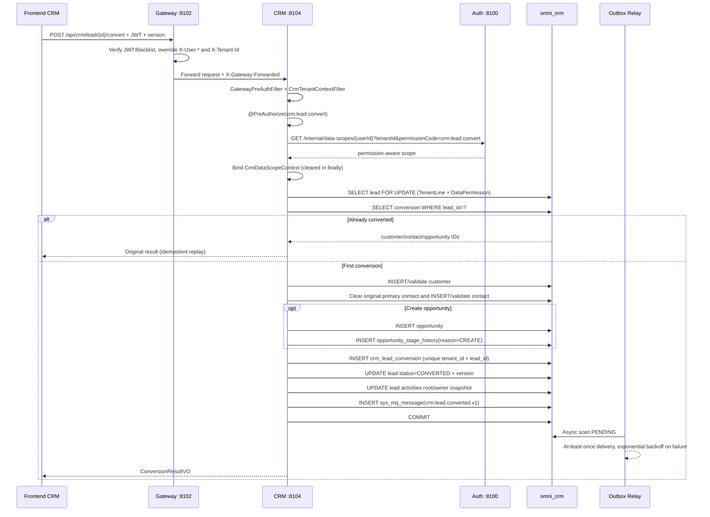

### 整合性境界

- `crm_lead_conversion(tenant_id, lead_id)` が変換の冪等事実；Service の行ロックと楽観的バージョンが並行性を共同で処理します。
- Customer、Contact、Opportunity、初期 Stage History、Lead ステータスと Outbox は同一コミットまたは同一ロールバックでなければなりません。
- 新規作成されるすべてのオブジェクトは現在のリードの owner スナップショットを継承；対象ユーザー/組織は Auth の権威インターフェースに由来し、フロントエンドの ownerUnitId を信頼してはいけません。
- Outbox payload には tenantId、集約 ID、ステータス、バージョン、イベント ID のみを含み、電話、メール、住所、備考は含みません。
- `@OperLog` はリクエストがプロセスを離れる前にパラメータとスナップショットを再帰的に秘匿化；変換コマンドは顧客、連絡先、商談名を明示的に除外します。

---

## Flow 14: CRM 商談推進と権限分離 — Stage History + Customer 活性化

### 概要

商談のステージ変更は汎用更新ではなく独立したコマンドです。各リクエストは完全な権限コード `crm:opportunity:stage` で Auth からデータ範囲を解決し、CRM の TenantLine、DataPermission、楽観的ロックで共同に制約されます；正当な遷移は不変のステージ履歴とドメイン Outbox を書き込みます。受注時、CRM は TenantLine を保持し DataPermission のみを無視する専用 SQL で関連する潜在顧客を活性化し、Customer と Opportunity の owner が異なることによる更新漏れを回避します。

### 状態遷移

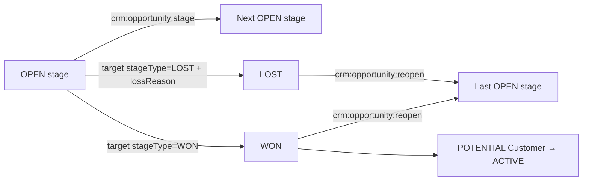

### コマンド実行規則

1. Gateway が JWT を検証し身分ヘッダーを上書き；CRM は転送マーカー、userId、tenantId のないビジネスリクエストを拒否します。
2. `@PreAuthorize` がまず機能権限を検証し、`@CrmDataScope` が現在のコマンドの完全な permissionCode で Auth から scope を取得します。
3. MyBatis は常に `TenantLine → DataPermission → Pagination` を実行；通常の CRM API の `ALL` も現在のテナントの全データを意味するにすぎません。
4. Service は商談をロックし、リクエストの version、現在のステータス、対象ステージが属する pipeline、ステートマシンの正当性を検証；同一ステージへの no-op は即座に拒否します。
5. 商談のステージ/ステータス/確度/失注理由と version を更新し、`crm_opportunity_stage_history` を追加し、`stage-changed/won/lost` Outbox を書き込みます。
6. 受注時に顧客を活性化する専用 Mapper は owner データ権限のみをバイパスし、TenantLine はバイパスせず、customer id、ステータス、`deleted=0` を明示的に検証します。
7. 再開は `crm:opportunity:reopen` を使用し、最後のオープンステージを復元して `REOPEN` 履歴を書き込みます；通常の update でステートマシンをバイパスしてはいけません。

### PII 返却規則

- Lead、Customer、Contact のリストは常に秘匿化された連絡先を返します；完全な値は `crm:pii:view` を持つ場合のみ返されます。
- Activity のリスト/タイムラインの content は常に `[REDACTED]`；詳細は引き続き `crm:pii:view` に制御されます。
- フロントエンドは編集前に詳細を再読込；PII 権限がない場合は機微フィールドを無効化し、update payload に含めず、秘匿化テキストで実データを上書きすることを回避します。

---

## Docker デプロイメントでのフロー設定注意事項

### OAuth2 コールバック URL 設定

Docker デプロイメント時、ソーシャルログインの `redirect_uri` は**ホストマシンからアクセス可能な URL**（コンテナ内部アドレスではなく）を使用する必要があります：

| デプロイ環境 | redirect_uri 例 |
|---------|------------------|
| ローカル開発 | `http://localhost:8100/api/auth/oauth2/github/callback` |
| Docker デプロイメント | `http://<ホストマシンIP>:8100/api/auth/oauth2/github/callback` |
| 本番環境 | `https://your-domain.com/api/auth/oauth2/github/callback` |

**設定方式**（`application.yml`）：

```yaml
omni:
  oauth2:
    github:
      redirect-uri: ${OAUTH2_GITHUB_REDIRECT_URI:http://localhost:8100/api/auth/oauth2/github/callback}
    google:
      redirect-uri: ${OAUTH2_GOOGLE_REDIRECT_URI:http://localhost:8100/api/auth/oauth2/google/callback}
    gitee:
      redirect-uri: ${OAUTH2_GITEE_REDIRECT_URI:http://localhost:8100/api/auth/oauth2/gitee/callback}
```

**Docker Compose 環境変数オーバーライド**：

```yaml
# docker-compose.yml
omni-auth:
  environment:
    OAUTH2_GITHUB_REDIRECT_URI: http://192.168.1.100:8100/api/auth/oauth2/github/callback
    OAUTH2_GOOGLE_REDIRECT_URI: http://192.168.1.100:8100/api/auth/oauth2/google/callback
    OAUTH2_GITEE_REDIRECT_URI: http://192.168.1.100:8100/api/auth/oauth2/gitee/callback
```

> **注意**：Docker デプロイメントでは、Auth サービスコンテナの内部ポートは 8080 ですが、OAuth2 コールバック URL はホストマシンのマッピングポート 8100 を使用する必要があります（サードパーティプラットフォームはホストマシンのパブリック/LAN 到達可能アドレスにコールバックする必要があるため）。

### Docker デプロイメントでのフロントエンドコールバックページ

ソーシャルログイン成功後、Auth サービスは 302 でフロントエンドコールバックページにリダイレクトします：

```
成功: 302 Location: /callback#token=<JWT>&username=<username>
失敗: 302 Location: /login?error=<error_code>&message=<message>
```

Docker デプロイメントでは、Nginx コンテナがフロントエンド静的ファイルのサービスを担当し、`/callback` ルートは Vue Router クライアントサイドで処理されます（Nginx `try_files $uri $uri/ /index.html`）。

### Gateway コンテナ間ネットワーク

Docker デプロイメント時、すべてのコンテナは同一の `omni-network` ブリッジネットワーク内にあります：

```
フロントエンドブラウザ → ホストマシン:8100 → Nginx コンテナ(:80)
    ├── 静的ファイル → Nginx が直接返す
    ├── /api/*   → proxy_pass http://omni-gateway:8080
    └── /oauth2/* → proxy_pass http://omni-gateway:8080

Gateway コンテナ(:8080)
    ├── lb://omni-auth → Auth コンテナ(:8080) [Nacos サービスディスカバリ]
    ├── lb://omni-base → Base コンテナ(:8080) [Nacos サービスディスカバリ]
    └── lb://omni-workflow → Workflow コンテナ(:8080) [Nacos サービスディスカバリ]
```

---

## トラブルシューティングガイド

### ログインフローの問題

| 問題 | 考えられる原因 | 調査方法 |
|------|---------|----------|
| **CAPTCHA が表示されない** | Redis が起動していない、または接続失敗 | Redis コンテナの状態を確認；Auth サービスログ内の Redis 接続エラーを確認 |
| **ログインで「ユーザー名またはパスワードが正しくありません」が返る** | テナント ID の不一致 | フロントエンドの `tenantId` パラメーターが正しいか確認；`sys_user` テーブルの `tenant_id` フィールドを確認 |
| **ログイン後 401** | JWT 署名検証失敗 | Gateway が Auth の `/oauth2/jwks` エンドポイントにアクセスできるか確認；`JwkKeyProvider` キャッシュが期限切れでないか確認 |
| **Token が頻繁に期限切れ** | JWT 有効期間が 15 分のみ | 現在は refresh token 機構なし、再ログインが必要；後続で refresh token フローを追加可能 |

### ソーシャルログインの問題

| 問題 | 考えられる原因 | 調査方法 |
|------|---------|----------|
| **GitHub コールバック 404** | redirect_uri の設定ミス | GitHub OAuth App の `Authorization callback URL` が `application.yml` の設定と一致しているか確認 |
| **State 検証失敗** | HMAC 署名の不一致 | Auth サービスの `omni.oauth2.state-secret` 設定が一致しているか確認（シングルインスタンスデプロイメントではこの問題は発生しない） |
| **Google API タイムアウト** | ネットワークプロキシの問題 | Google API はプロキシ経由でのアクセスが必要；`application.yml` の `proxy` 設定を確認 |
| **自動ユーザー作成失敗** | ユーザー名競合で fallback も競合 | `sys_user` テーブルに `gh_`/`go_`/`ge_` プレフィックスのユーザー名の競合が存在しないか確認 |
| **Docker デプロイメントでコンテナ内部アドレスにコールバック** | redirect_uri がコンテナ内部ポートを使用 | redirect_uri がホストマシンのマッピングポート（8100）を使用していることを確認、コンテナ内部ポート（8080）ではない |

### 権限とメニューの問題

| 問題 | 考えられる原因 | 調査方法 |
|------|---------|----------|
| **動的メニューが表示されない** | バックエンドの `/api/auth/menus` が空を返す | JWT に `authorities` フィールドが含まれているか確認；`sys_role_permission` テーブルのロール-権限関連を確認 |
| **ボタンが常に非表示** | v-permission コードの不一致 | フロントエンドの `v-permission` 値と `sys_permission` テーブルの `permission_code` を比較 |
| **API が 403 を返す** | @PreAuthorize 権限コードの不一致 | Controller の `@PreAuthorize` 値とユーザー JWT 内の権限セットを比較 |

### データディクショナリの問題

| 問題 | 考えられる原因 | 調査方法 |
|------|---------|----------|
| **ディクショナリデータが更新されない** | Redis キャッシュが失効していない | 手動で `PUT /api/base/dict/data/refresh` を呼び出してキャッシュを更新；または TTL（30 分）の期限切れを待つ |
| **ディクショナリタイプ削除後にデータ残留** | カスケード削除がトリガーされていない | `DictTypeServiceImpl.deleteType()` 内のトランザクションが正常にコミットされているか確認 |

### 操作ログの問題

| 問題 | 考えられる原因 | 調査方法 |
|------|---------|----------|
| **ログが記録されていない** | RocketMQ が起動していない | RocketMQ コンテナの状態を確認；`OperLogProducer` ログ内の送信結果を確認 |
| **ログの遅延** | MQ 消費の滞留 | omni-base サービスコンシューマーログを確認；RocketMQ コンソールの消費進捗を確認 |
| **アーカイブタスクが実行されない** | @Scheduled がトリガーされていない | omni-base サービスが 1 インスタンスのみであることを確認（マルチインスタンスでの重複アーカイブを防止）；ログ内のアーカイブ記録を確認 |

---

## Flow 15: SRM サプライヤー参入承認

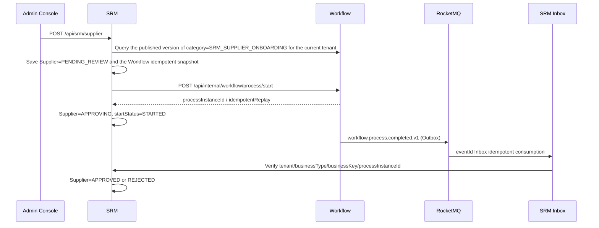

主要な制約：

- ユーザーはモデルバージョンを選択しません；SRM は常に `SRM_SUPPLIER_ONBOARDING` で現在の公開済みモデルを自動解決します。
- デフォルトテナントが必要とするモデルは Workflow 起動イニシャライザが検証し公開します；欠落または公開不可の場合、Workflow は起動に失敗します。
- 起動結果が不確実な場合は元の `requestId/businessKey/modelVersionId/startUser` を保持し、冪等リトライのみを許可します。
- 承認完了は信頼性イベントでライトバックされます；重複、順序不同、クロステナント、またはインスタンス不一致のイベントはサプライヤーステータスを変更してはいけません。

### Flow 15.1: 購買申請承認ルールの設定とマッチング試算

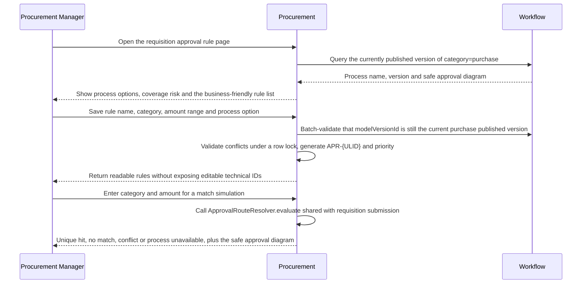

ルールリストは Workflow 経由で現在のページのモデルバージョンを一括解決し、行ごとの呼び出しは禁止します。Workflow が一時的に利用不可の場合、読み取り専用リストはローカルルールを保持して `UNAVAILABLE` とマークし、作成、更新、購買申請の提出はフェイルクローズします。無効化または削除前の影響分析はメモリ内で対象ルールを除外するのみで、データベースは変更しません；カバレッジアルゴリズムは「正確なカテゴリ優先、デフォルトルールで空隙を補完」により 0 から無限までの断絶と競合を計算します。

## Flow 16: Procurement 購買申請承認と非同期ライトバック

```mermaid
sequenceDiagram
    participant U as Procurement User
    participant P as Procurement
    participant W as Workflow
    participant O as Workflow Outbox
    participant M as RocketMQ
    participant I as Procurement Inbox

    U->>P: Create draft and submit
    P->>P: Re-check material/category, recompute decimal amounts, select approval route
    P->>P: Save approvalAttempt + idempotent start snapshot
    P->>W: Start process with tenant + businessKey={id}:{attempt}
    W-->>P: processInstanceId
    W->>O: Approval-completed event
    O->>M: Reliable relay
    M->>I: eventId Inbox idempotent consumption
    I->>P: APPROVING → APPROVED/REJECTED
    P-->>U: Page polls silently every 5 seconds; manual refresh on timeout
```

明示的に失敗した起動は `FAILED` として記録し、元のスナップショットを再利用したリトライを許可します；ネットワーク結果が不確実な場合に第 2 のビジネスキーを作成してはいけません。ページは「Workflow 完了、ビジネスステータス同期中」と最終ビジネスステータスを区別しなければならず、一時的な遅延を失敗として表示してはいけません。

RFQ 見積チェーンは Procurement の招待を権威とし、SRM の見積を権威とします：Portal は必要に応じて招待を読み取り見積を提出し、SRM は同一トランザクションで見積と Outbox を書き込み、Procurement Inbox は招待ステータスを更新します；選定前に Procurement は現在の見積バージョンを再確認して不変スナップショットを保存し、その後購買注文を作成します。

## Flow 17: Procurement 入荷から Asset カード作成・移管・廃棄まで

```mermaid
sequenceDiagram
    participant P as Procurement
    participant O as Procurement Outbox
    participant M as RocketMQ
    participant A as Asset
    participant W as Workflow

    P->>P: Confirm goods receipt / quality check passed
    P->>O: goods-receipt confirmed or quality-passed event
    O->>M: Reliable relay
    M->>A: At-least-once delivery
    A->>A: eventId Inbox + dual idempotency by source line/unit sequence
    A->>A: Create asset card only for PASS + assetManaged + positive integer quantity
    A->>P: Historical candidate cursor backfill (compensation path)
    A->>W: Transfer/disposal auto-resolves model by category and starts idempotently
    W->>M: workflow.process.completed.v1
    M->>A: Approval-result Inbox write-back
    A->>A: Complete operation on approval; restore previousStatus and clear occupancy on rejection/cancellation
```

資産ページの使用者、組織、サプライヤー、移管/廃棄資産はいずれも現在のテナントとデータ範囲内の検索候補を使用します；モデルバージョンはサーバー側で自動選択されます。移管と廃棄は `active_operation_type/id` のアトミックな占有を共有し、いかなる終了パスも同一トランザクション内でステータスを復元し占有をクリアしなければなりません。金額は JSON 内で常に十進文字列を使用します。

## Flow 18: SRM ポータル招待登録とロール割り当て Saga

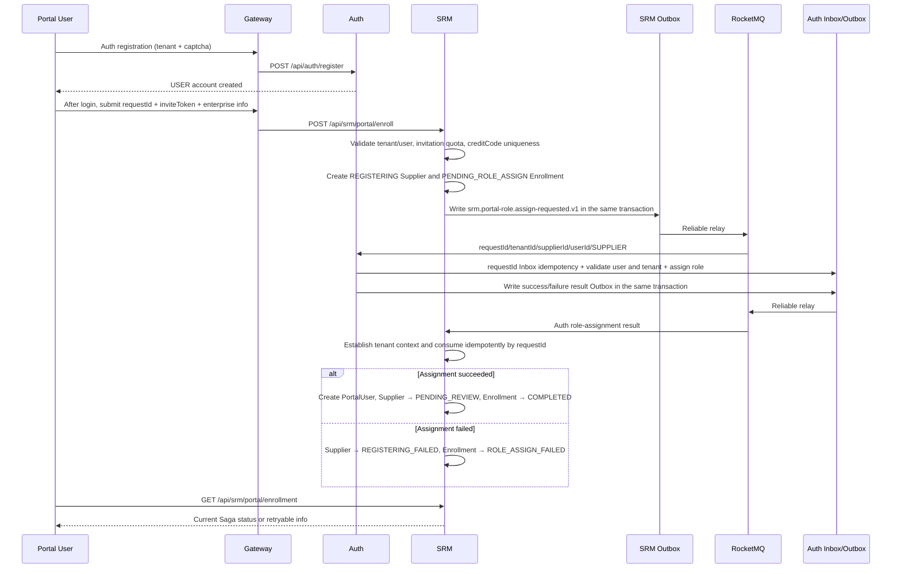

主要な制約：

- USER は `srm:portal:enroll` のみを持ちます；企業プロフィールと評価は SUPPLIER 権限と有効な PortalUser 関連付けの両方を必要とします。
- inviteToken の原文はデータベースに保存せず、ログに残さず、MQ に入れず；招待回数はバージョン条件付きでアトミックに増加します。
- Portal userId を内部 owner フィールドに書き込んではいけません；Portal サプライヤーは内部責任者の割り当て前まで owner が空であることを許可します。
- リクエストと結果はいずれも Transactional Outbox を使用します；コンシューマーは requestId で冪等であり、すべての MQ ThreadLocal は finally でクリアされます。
