# 핵심 비즈니스 플로우

> 본 문서는 브라우저 상호작용부터 백엔드 처리 및 응답까지 주요 사용자 플로우를 엔드투엔드로 추적합니다. 기능 구현 또는 수정 시 이를 참고하십시오.  
> 아키텍처 개요는 [architecture.kr.md](architecture.kr.md)를 참조하십시오. Docker 배포 구성은 [docker-deployment.kr.md](docker-deployment.kr.md)를 참조하십시오. API 계약은 [api-contract.kr.md](api-contract.kr.md)를 참조하십시오.

## Flow 1: 사용자 로그인 (사용자명 + 비밀번호 + 캡차 + JWT)

### 개요

사용자가 프론트엔드 로그인 페이지에서 사용자명, 비밀번호, 캡차를 제출하면 Gateway를 통해 Auth 서비스로 전달되어 인증을 수행하고,
이후 요청의 신원 인증에 사용할 JWT Token을 반환합니다. 다중 테넌트 로그인(`tenantId:username` 형식)을 지원합니다.

### 시퀀스

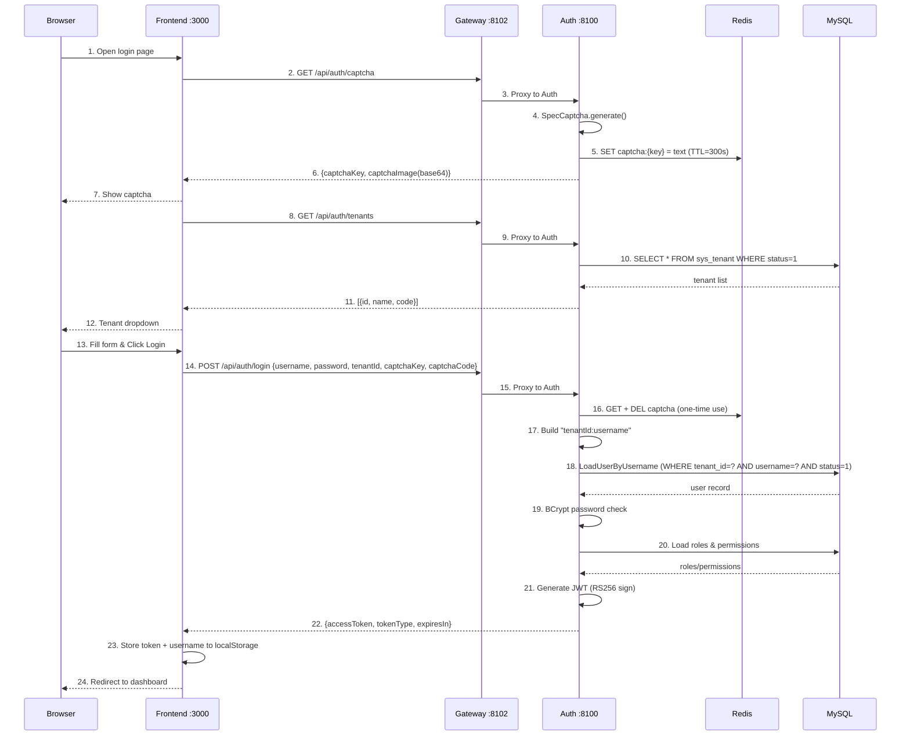

<details>
<summary>ASCII 버전 (클릭하여 펼치기)</summary>

```
Browser            Frontend :3000          Gateway :8102          Auth :8100           Redis              MySQL
  |                    |                       |                     |                   |                  |
  | 1. Open login page |                       |                     |                   |                  |
  |                    |                       |                     |                   |                  |
  |                    | 2. GET /api/auth/captcha                   |                   |                  |
  |                    |---------------------->|                     |                   |                  |
  |                    |                       | 3. Proxy to Auth    |                   |                  |
  |                    |                       |-------------------->|                   |                  |
  |                    |                       |                     | 4. SpecCaptcha    |                  |
  |                    |                       |                     |    generate()     |                  |
  |                    |                       |                     | 5. SET captcha:   |                  |
  |                    |                       |                     |    {key} = text   |                  |
  |                    |                       |                     |    TTL=300s ----->|                  |
  |                    |                       |                     |                   |                  |
  |                    | 6. {captchaKey, captchaImage(base64)}      |                   |                  |
  |                    |<----------------------|<--------------------|                   |                  |
  | 7. Show captcha    |                       |                     |                   |                  |
  |<-------------------|                       |                     |                   |                  |
  |                    |                       |                     |                   |                  |
  |                    | 8. GET /api/auth/tenants                    |                   |                  |
  |                    |---------------------->|                     |                   |                  |
  |                    |                       | 9. Proxy to Auth    |                   |                  |
  |                    |                       |-------------------->|                   |                  |
  |                    |                       |                     | 10. SELECT * FROM |                  |
  |                    |                       |                     |     sys_tenant    |                  |
  |                    |                       |                     |     WHERE status=1|                  |
  |                    |                       |                     |-------------------------------------->|
  |                    |                       |                     |                   |    tenant list    |
  |                    |                       |                     |<--------------------------------------|
  |                    | 11. [{id,name,code}]  |                     |                   |                  |
  |                    |<----------------------|<--------------------|                   |                  |
  | 12. Tenant dropdown|                       |                     |                   |                  |
  |<-------------------|                       |                     |                   |                  |
  |                    |                       |                     |                   |                  |
  | 13. Fill form      |                       |                     |                   |                  |
  |     (username,     |                       |                     |                   |                  |
  |      password,     |                       |                     |                   |                  |
  |      captcha,      |                       |                     |                   |                  |
  |      tenant)       |                       |                     |                   |                  |
  | 14. Click Login -->|                       |                     |                   |                  |
  |                    |                       |                     |                   |                  |
  |                    | 15. POST /api/auth/login                   |                   |                  |
  |                    |   {username, password, |                   |                   |                  |
  |                    |    tenantId, captchaKey,                   |                   |                  |
  |                    |    captchaCode} ------>|                   |                   |                  |
  |                    |                       | 16. Proxy to Auth   |                   |                  |
  |                    |                       |-------------------->|                   |                  |
  |                    |                       |                     |                   |                  |
  |                    |                       |                     | 17. Validate captcha                  |
  |                    |                       |                     |    GET + DEL ---->|                  |
  |                    |                       |                     |    (one-time use) |                  |
  |                    |                       |                     |                   |                  |
  |                    |                       |                     | 18. Build username as                 |
  |                    |                       |                     |     "tenantId:username"               |
  |                    |                       |                     |     (e.g. "1:admin")                  |
  |                    |                       |                     |                   |                  |
  |                    |                       |                     | 19. LoadUserByUsername                |
  |                    |                       |                     |     Parse tenant + username           |
  |                    |                       |                     |     WHERE tenant_id=? AND             |
  |                    |                       |                     |           username=? AND status=1     |
  |                    |                       |                     |-------------------------------------->|
  |                    |                       |                     |                   |    user record    |
  |                    |                       |                     |<--------------------------------------|
  |                    |                       |                     |                   |                  |
  |                    |                       |                     | 20. BCrypt password check             |
  |                    |                       |                     |                   |                  |
  |                    |                       |                     | 21. Load roles & permissions          |
  |                    |                       |                     |-------------------------------------->|
  |                    |                       |                     |                   |   roles/permissions
  |                    |                       |                     |<--------------------------------------|
  |                    |                       |                     |                   |                  |
  |                    |                       |                     | 22. Generate JWT   |                  |
  |                    |                       |                     |     RS256 sign     |                  |
  |                    |                       |                     |     (RSA private   |                  |
  |                    |                       |                     |      key from JWK) |                  |
  |                    |                       |                     |                   |                  |
  |                    | 23. {accessToken, tokenType:"Bearer",       |                   |                  |
  |                    |      expiresIn:900}   |                     |                   |                  |
  |                    |<----------------------|<--------------------|                   |                  |
  |                    |                       |                     |                   |                  |
  |                    | 24. Store token + username to localStorage |                   |                  |
  |                    |                       |                     |                   |                  |
  | 25. Redirect to    |                       |                     |                   |                  |
  |     dashboard      |                       |                     |                   |                  |
  |<-------------------|                       |                     |                   |                  |
  |                    |                       |                     |                   |                  |
```

</details>

### 로그인 후: 인증된 요청 플로우

로그인 성공 후, 프론트엔드의 모든 API 요청은 자동으로 JWT Token을 포함하며, Gateway가 검증을 담당합니다:

```
Browser            Frontend               Gateway :8102           Downstream Service
  |                    |                       |                        |
  | 1. Navigate to     |                       |                        |
  |    protected page  |                       |                        |
  |                    | 2. Axios GET          |                        |
  |                    |    Authorization:      |                        |
  |                    |    Bearer <JWT> ------>|                        |
  |                    |                       |                        |
  |                    |                       | 3. AuthFilter:         |
  |                    |                       |    - Extract Bearer token
  |                    |                       |    - Get RSA public key |
  |                    |                       |      (from JwkKeyProvider,
  |                    |                       |       cached 5min TTL)  |
  |                    |                       |    - RSASSAVerifier:   |
  |                    |                       |      verify RS256 sig  |
  |                    |                       |    - Check exp claim   |
  |                    |                       |                        |
  |                    |                       | 4. Inject headers:     |
  |                    |                       |    X-User-Id: 1        |
  |                    |                       |    X-Tenant-Id: 1      |
  |                    |                       |    X-User-Name: admin  |
  |                    |                       |    X-User-Roles: admin |
  |                    |                       |    X-User-Scopes: read |
  |                    |                       |                        |
  |                    |                       | 5. Forward request --->|
  |                    |                       |                        |
  |                    |                       |    6. Response <-------|
  |                    | 7. JSON data <--------|                        |
  | 8. Render page     |                       |                        |
  |<-------------------|                       |                        |
```

### 주요 구성 요소

| 단계 | 파일 | 로직 |
|------|------|------|
| 폼 UI | `src/views/login/LoginForm.vue` | Element Plus 폼: 사용자명, 비밀번호, 캡차, 테넌트 드롭다운 |
| 캡차 로드 | `src/views/login/LoginForm.vue` | `GET /api/auth/captcha` -> base64 PNG 표시, captchaKey 저장 |
| 테넌트 로드 | `src/views/login/LoginForm.vue` | `GET /api/auth/tenants` -> `<el-select>` 드롭다운 채우기 |
| 로그인 제출 | `src/views/login/LoginForm.vue` | `handleLogin()`: 폼 검증 -> POST `/api/auth/login` |
| 토큰 저장 | `src/stores/user.ts` | `setToken()` + `setUsername()` `localStorage`에 영속화 |
| 요청 인증 | `src/api/request.ts` | Axios 요청 인터셉터: `Authorization: Bearer <token>` |
| Vite 프록시 | `vite.config.ts` | `/api` -> `http://localhost:8102` (Gateway) |
| Gateway 필터 | `AuthFilter.java` | JWT RS256 서명 검증 + claims 추출 + 신원 헤더 주입 |
| JWK 제공자 | `JwkKeyProvider.java` | Auth `/oauth2/jwks`에서 RSA 공개키 획득, 5분 캐싱 |
| 캡차 서비스 | `CaptchaServiceImpl.java` | SpecCaptcha 생성 + Redis 저장 (TTL 300초, 일회성 사용) |
| Auth 컨트롤러 | `AuthController.java` | `POST /login`: 캡차 -> 인증 -> 역할 -> JWT |
| 사용자 상세 | `OmniUserDetailsService.java` | 다중 테넌트 파싱 `tenantId:username` + BCrypt 비밀번호 검증 |
| JWT 서비스 | `JwtTokenServiceImpl.java` | RSA 개인키 서명, 사용자 신원 및 권한을 포함한 JWT 생성 |

### JWT Token 구조

Auth 서비스가 발급하는 JWT는 다음 claims를 포함합니다:

```json
{
  "header": {
    "alg": "RS256",
    "kid": "<key-id-from-jwk>"
  },
  "payload": {
    "sub": "1",
    "tenant_id": "1",
    "username": "admin",
    "roles": ["admin"],
    "scope": "read write",
    "iat": 1748000000,
    "exp": 1748000900
  }
}
```

| Claim | 설명 |
|-------|------|
| `sub` | 사용자 ID (`sys_user.id`) |
| `tenant_id` | 테넌트 ID (`sys_tenant.id`) |
| `username` | 로그인 사용자명 |
| `roles` | 사용자 역할 목록 (예: `["admin", "editor"]`) |
| `scope` | 권한 범위, 공백 구분 |
| `iat` | 발급 시각 (Unix timestamp) |
| `exp` | 만료 시각 (`iat` + 900초 = 15분) |

### 다중 테넌트 로그인 메커니즘

로그인 시 `tenantId` 파라미터로 테넌트를 지정하면, Auth 서비스 내부에서 사용자명을 `tenantId:username` 형식으로 변환하며 (예: `1:admin`),
`OmniUserDetailsService.loadUserByUsername()`에서 파싱합니다:

```
프론트엔드 제출: { username: "admin", tenantId: 1 }
  -> AuthController 구성: "1:admin"
  -> OmniUserDetailsService 파싱: tenantId=1, actualUsername="admin"
  -> SQL: SELECT * FROM sys_user WHERE tenant_id=1 AND username='admin' AND status=1
```

`:`가 포함되지 않은 경우(직접 사용자명으로 로그인), 기본값 `tenantId=1`이 적용되어 하위 호환성을 보장합니다.

### 캡차 수명 주기

```
1. 생성: SpecCaptcha -> base64 PNG
2. 저장: Redis SET captcha:{uuid} = "a3f8" EX 300
3. 검증: Redis GET captcha:{uuid} -> DELETE captcha:{uuid} (일회성 사용, 리플레이 방지)
   - 키가 존재하지 않음 -> "Captcha expired" (만료 또는 이미 사용됨)
   - 값 불일치   -> "Invalid captcha"
```

### 현재 상태

- **로그인**: 완전 구현, 캡차 + 다중 테넌트 + JWT Token 발급
- **Gateway JWT 검증**: 완전 구현, RS256 서명 확인 + claims 추출 + 신원 헤더 주입
- **프론트엔드**: 모든 mock 코드 제거, 실제 API 연동
- **Token 유효기간**: 15분 (900초), 현재 refresh token 메커니즘 없음

## Flow 2: OAuth2 Authorization Code + PKCE 로그인

### 개요

프론트엔드는 OAuth2 공공 클라이언트(SPA)로서 Spring Authorization Server의 OAuth2 인가 엔드포인트를 통해 PKCE 인가 코드 플로우를 수행합니다.
사용자가 Auth 서비스의 인가 확인 페이지에서 동의한 후, 프론트엔드는 인가 코드 + code_verifier로 access_token과 id_token을 교환합니다.
서드파티 연동 또는 OAuth2 표준 인증이 필요한 시나리오에 적합합니다.

### 시퀀스

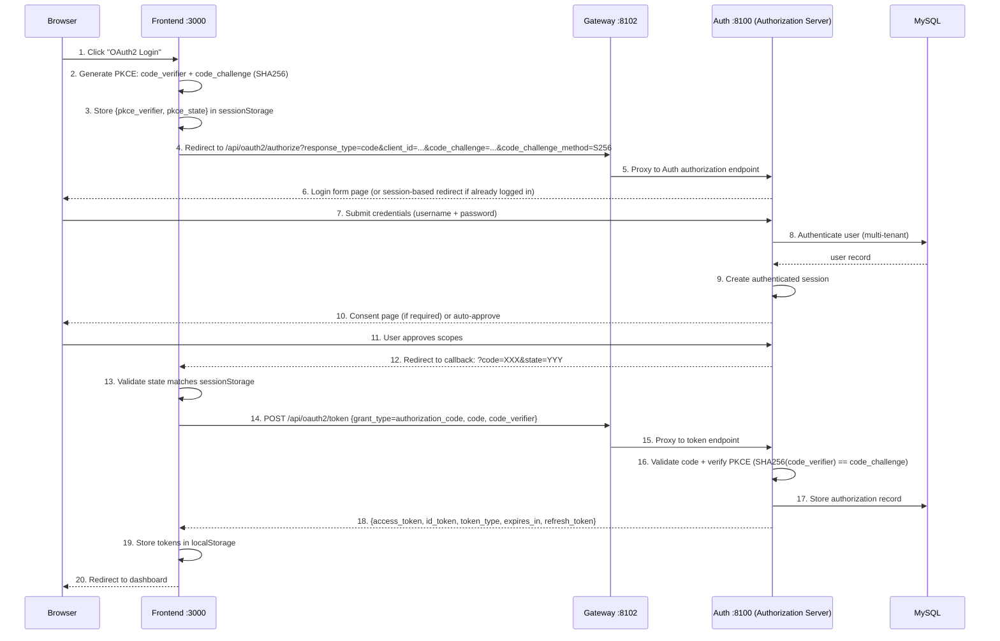

### 주요 구성 요소

| 단계 | 파일 | 로직 |
|------|------|------|
| PKCE 생성기 | `src/utils/oauth2.ts` | code_verifier(43-128자 랜덤 문자열) + SHA256 code_challenge 생성 |
| PKCE 저장 | `src/utils/oauth2.ts` | sessionStorage에 `pkce_verifier` 및 `pkce_state` 저장 |
| 인가 리디렉트 | `src/utils/oauth2.ts` | PKCE 파라미터를 포함하는 `/oauth2/authorize` URL 구성 |
| 토큰 교환 | `src/api/auth.ts` | POST `/oauth2/token`, code_verifier를 Auth 서비스에 전송하여 검증 |
| 토큰 저장 | `src/stores/user.ts` | access_token + id_token을 localStorage에 저장 |
| 인가 엔드포인트 | Spring Authorization Server | `/oauth2/authorize` — 로그인 폼 + 인가 확인 |
| 토큰 엔드포인트 | Spring Authorization Server | `/oauth2/token` — 인가 코드로 토큰 교환 |
| PKCE 검증기 | Spring Authorization Server | SHA256(code_verifier)과 저장된 code_challenge 비교 |

### PKCE 저장 키

| sessionStorage 키 | 설명 | 수명 주기 |
|-------------------|------|-----------|
| `pkce_verifier` | 랜덤 code_verifier 문자열 | 인가 시작 시 기록, 토큰 교환 후 삭제 |
| `pkce_state` | CSRF 방어 state 파라미터 | 인가 시작 시 기록, 콜백 검증 후 삭제 |

### 현재 상태

- **Authorization Server**: Spring Authorization Server 7.x 구성 완료, RS256 JWK 서명
- **OAuth2 클라이언트**: `omni-spa` 클라이언트 등록 완료 (authorization_code + PKCE grant type)
- **프론트엔드 PKCE 유틸**: `src/utils/oauth2.ts`에서 verifier/challenge 생성 및 토큰 교환 구현 완료
- **토큰 유형**: access_token (opaque) + id_token (JWT, 사용자 정보 포함)

---

## Flow 3: OAuth2 Device Authorization Grant

### 개요

디바이스 인가 모드(RFC 8628)는 브라우저가 없거나 입력이 제한된 디바이스(IoT, CLI 도구 등)에 적합합니다. 디바이스 측에서 `/oauth2/device_authorization`을 통해 `device_code`와 `user_code`를 획득하고, 사용자가 다른 디바이스에서 `user_code`를 입력하여 인가를 완료하면, 디바이스 측에서 `/oauth2/token`을 폴링하여 액세스 토큰을 획득합니다.

프론트엔드에서 테스트 진입점(`/device` 페이지)를 제공하여 브라우저에서 전체 디바이스 인가 플로우를 테스트할 수 있습니다.

### 시퀀스

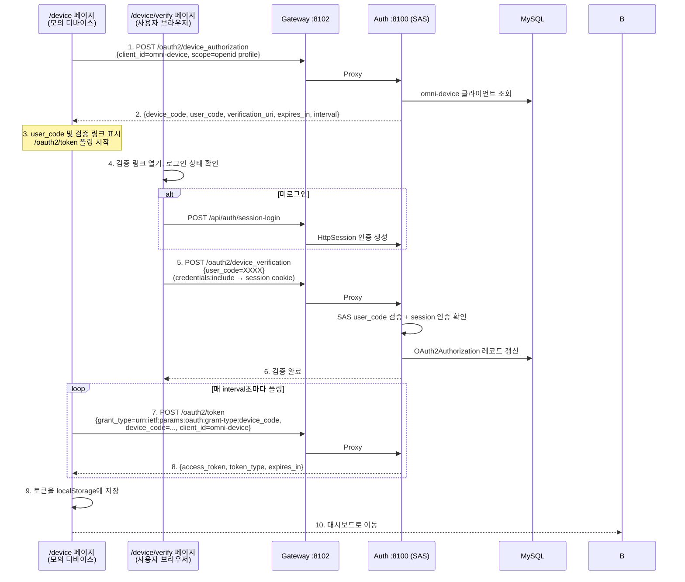

### 주요 구성 요소

| 단계 | 파일 | 역할 |
|------|------|------|
| 디바이스 인가 요청 | `src/api/auth.ts` → `requestDeviceAuthorization()` | POST `/oauth2/device_authorization`, 디바이스 코드 획득 |
| 토큰 폴링 | `src/api/auth.ts` → `pollDeviceToken()` | POST `/oauth2/token`, `authorization_pending` 처리 |
| 디바이스 시뮬레이터 페이지 | `src/views/device/index.vue` | user_code + 카운트다운 + 폴링 표시 |
| 디바이스 검증 페이지 | `src/views/device/verify.vue` | 내장 로그인 + user_code 입력 + 인가 확인 |
| 로그인 페이지 입구 | `src/components/LoginForm.vue` | '디바이스 인가 로그인' 버튼 |
| 디바이스 인가 엔드포인트 | Spring Authorization Server | `/oauth2/device_authorization` — SAS 내장 |
| 디바이스 검증 엔드포인트 | Spring Authorization Server | `/oauth2/device_verification` — SAS 내장 |
| 디바이스 클라이언트 | `DeviceClientInitializer.java` | 기동 시 `omni-device` 클라이언트 등록 |
| 리디렉트 필터 | `AuthorizationServerConfig.java` | 미인증 사용자를 프론트엔드 검증 페이지로 리디렉트 |

### 디바이스 클라이언트 구성

| 구성 항목 | 값 |
|-----------|-----|
| Client ID | `omni-device` |
| 인증 방식 | `NONE` (공공 클라이언트, clientSecret 없음) |
| 인가 유형 | `urn:ietf:params:oauth:grant-type:device_code` + `refresh_token` |
| 스코프 | `openid`, `profile` |
| PKCE 요구 | `false` |
| 인가 동의 요구 | `false` (사용자가 '인가'를 클릭하면 동의로 간주, SAS 추가 동의 폼 불필요) |

### 폴링 동작

| 오류 코드 | 의미 | 처리 방식 |
|-----------|------|-----------|
| `authorization_pending` | 사용자가 아직 인가를 완료하지 않음 | 계속 폴링 |
| `slow_down` | 폴링 빈도가 너무 빠름 | 계속 폴링 (SAS가 자동으로 interval 증가) |
| `expired_token` | device_code가 만료됨 | 폴링 중단, 사용자에게 재시작 안내 |
| `access_denied` | 사용자가 인가를 거부함 | 폴링 중단, 사용자에게 안내 |

### 현재 상태

- **디바이스 인가 엔드포인트**: SAS 7에서 `deviceAuthorizationEndpoint(Customizer.withDefaults())`로 활성화 완료
- **디바이스 검증 엔드포인트**: SAS 7에서 `deviceVerificationEndpoint(Customizer.withDefaults())`로 활성화 완료
- **디바이스 클라이언트**: `omni-device` 클라이언트가 `DeviceClientInitializer`에 의해 기동 시 자동 등록
- **프론트엔드 페이지**: `/device`(디바이스 시뮬레이터) 및 `/device/verify`(검증 페이지) 구현 완료
- **로그인 입구**: 로그인 페이지에 '디바이스 인가 로그인' 버튼 추가 완료

---

## Flow 4: OAuth2 소셜 로그인 (GitHub / Google / Gitee)

### 개요

사용자가 GitHub, Google 또는 Gitee 계정으로 원클릭 로그인합니다. 백엔드는 전략 패턴(Strategy Pattern)을 채용하여, `OAuth2ProviderHandler` 인터페이스를 통해 통합된 `buildAuthorizationUrl` / `exchangeCodeForAccessToken` / `fetchUserProfile` 메서드를 정의하고, 각 공급자는 독립적인 `@Component`로 구현되어 Spring의 `Map<String, OAuth2ProviderHandler>` 자동 주입을 통해 다중 공급자 디스패치를 실현합니다. 현재 GitHub, Google, Gitee 세 공급자가 구현되어 있으며, 프론트엔드의 WeChat 로그인 버튼은 자리 표시자입니다(백엔드 Handler 미구현).

프론트엔드에서 `window.location.href`로 Auth 서비스의 `/api/auth/oauth2/{provider}` 엔드포인트로 내비게이션하면, Auth 서비스는 provider 파라미터에 따라 해당 Handler 구현을 선택하고, HMAC 서명된 state 파라미터를 생성한 후 302 리디렉트로 서드파티 인가 페이지로 이동합니다. 사용자가 서드파티 플랫폼에서 인가한 후 Auth 서비스로 콜백되면, Auth는 Handler를 통해 state 검증 → 토큰 교환 → 사용자 정보 획득 → 로컬 사용자 조회 또는 자동 생성 → JWT 발급을 수행하고, 최종적으로 302 리디렉트로 프론트엔드 콜백 페이지로 이동합니다(URL fragment에 JWT 포함).

### 시퀀스

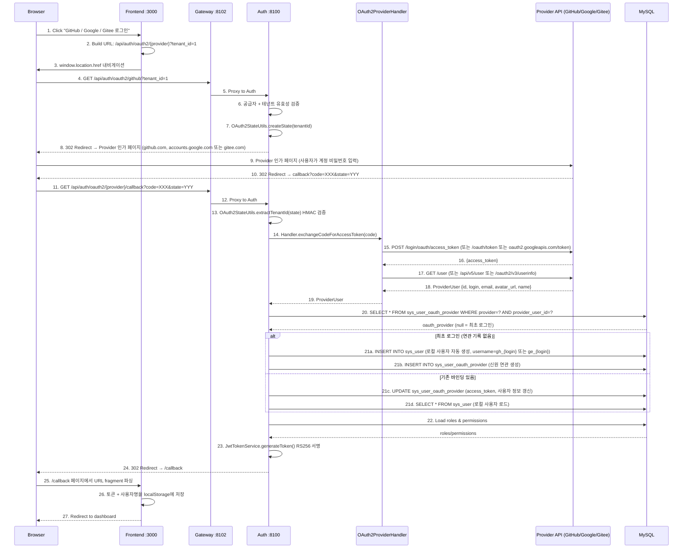

<details>
<summary>ASCII 버전 (클릭하여 펼치기)</summary>

```
Browser            Frontend :3000          Gateway :8102          Auth :8100           Provider API         MySQL
  |                    |                       |                     |                     |                   |
  | 1. Click social    |                       |                     |                     |                   |
  |    login button    |                       |                     |                     |                   |
  |                    | 2. Build URL          |                     |                     |                   |
  |                    |    /api/auth/oauth2/  |                     |                     |                   |
  |                    |    {provider}?tenant_id=1                   |                     |                   |
  | 3. window.location |                       |                     |                     |                   |
  |    .href --------->|                       |                     |                     |                   |
  |                    |                       |                     |                     |                   |
  | 4. GET /api/auth/oauth2/{provider}?tenant_id=1                   |                   |
  |                    |                       |                     |                     |                   |
  |                    |                       | 5. Proxy            |                     |                   |
  |                    |                       |-------------------->|                     |                   |
  |                    |                       |                     | 6. Validate provider |                   |
  |                    |                       |                     |    + tenant          |                   |
  |                    |                       |                     | 7. createState()     |                   |
  |                    |                       |                     |    HMAC-SHA256 sign  |                   |
  |                    |                       |                     |                     |                   |
  | 8. 302 Redirect -> Provider 인가 페이지 (github.com, accounts.google.com 또는 gitee.com) |                   |
  |                    |                       |                     |                     |                   |
  | 9. Provider login  |                       |                     |                     |                   |
  |    (user/password) |                       |                     |                     |                   |
  |--------------------|-------------------------------------------->|------------------------------------------>|
  |                    |                       |                     |                     |                   |
  | 10. 302 callback?code=XXX&state=YYY        |                     |                     |                   |
  |<---------------------------------------------------------------------------------------|                   |
  |                    |                       |                     |                     |                   |
  | 11. GET /api/auth/oauth2/{provider}/callback                     |                     |                   |
  |--------------------|---------------------->|                     |                     |                   |
  |                    |                       | 12. Proxy           |                     |                   |
  |                    |                       |-------------------->|                     |                   |
  |                    |                       |                     |                     |                   |
  |                    |                       |                     | 13. Verify state     |                   |
  |                    |                       |                     |     HMAC signature   |                   |
  |                    |                       |                     |                     |                   |
  |                    |                       |                     | 14-19. Handler: exchange code,          |
  |                    |                       |                     |   get access_token, fetch user profile  |
  |                    |                       |                     |-------------------->|                   |
  |                    |                       |                     |    ProviderUser     |                   |
  |                    |                       |                     |<--------------------|                   |
  |                    |                       |                     |                     |                   |
  |                    |                       |                     | 20. Lookup oauth provider               |
  |                    |                       |                     |------------------------------------------>|
  |                    |                       |                     |                     |    oauth_provider   |
  |                    |                       |                     |<------------------------------------------|
  |                    |                       |                     |                     |                   |
  |                    |                       |                     | 21. Create/Update user + oauth link      |
  |                    |                       |                     |------------------------------------------>|
  |                    |                       |                     |                     |                   |
  |                    |                       |                     | 22. Load roles/perms |                   |
  |                    |                       |                     |------------------------------------------>|
  |                    |                       |                     |                     |   roles/permissions |
  |                    |                       |                     |<------------------------------------------|
  |                    |                       |                     |                     |                   |
  |                    |                       |                     | 23. Generate JWT (RS256)                |
  |                    |                       |                     |                     |                   |
  | 24. 302 /callback#token=JWT&username=xxx                         |                     |                   |
  |<---------------------------------------------------------------------------------------|                   |
  |                    |                       |                     |                     |                   |
  | 25. /callback page |                       |                     |                     |                   |
  |    parse fragment  |                       |                     |                     |                   |
  |                    | 26. Store token        |                     |                     |                   |
  |                    |     to localStorage    |                     |                     |                   |
  | 27. Redirect to    |                       |                     |                     |                   |
  |     dashboard      |                       |                     |                     |                   |
  |<-------------------|                       |                     |                     |                   |
```

</details>

### 주요 구성 요소

| 단계 | 파일 | 역할 |
|------|------|------|
| 로그인 버튼 | `src/components/LoginForm.vue` | "GitHub / Google / Gitee" 서드파티 로그인 버튼, `getThirdPartyLoginUrl()` 호출 |
| 프론트엔드 시작 | `src/api/auth.ts` | `getThirdPartyLoginUrl(provider, tenantId)` 리디렉트 URL 구성 |
| 콜백 페이지 | `src/views/callback/index.vue` | URL fragment의 JWT를 파싱하여 localStorage에 저장 |
| 로그인 시작 엔드포인트 | `SocialLoginController.java` | `GET /api/auth/oauth2/{provider}` — state 생성 + 302 리디렉트 |
| 콜백 처리 엔드포인트 | `SocialLoginController.java` | `GET /api/auth/oauth2/{provider}/callback` — 토큰 교환 + 사용자 생성 + JWT 발급 |
| 비즈니스 오케스트레이션 | `SocialLoginServiceImpl.java` | 전체 콜백 플로우: state 검증 → Handler 디스패치 → 사용자 조회/생성 → JWT |
| 전략 인터페이스 | `OAuth2ProviderHandler.java` | 전략 인터페이스, `buildAuthorizationUrl` / `exchangeCodeForAccessToken` / `fetchUserProfile` 정의 |
| GitHub 구현 | `GitHubOAuth2Handler.java` | GitHub OAuth2 구현 (`@Component("github")`), 인가 URL 구성, access_token 교환, 사용자 프로필 획득 |
| Google 구현 | `GoogleOAuth2Handler.java` | Google OAuth2 구현 (`@Component("google")`), 로컬 프록시를 통해 Google API 접근, 이메일에서 사용자명 파생 |
| Gitee 구현 | `GiteeOAuth2Handler.java` | Gitee OAuth2 구현 (`@Component("gitee")`), Gitee OAuth2 API 연동 |
| 통합 사용자 DTO | `ProviderUser.java` | 통합 서드파티 사용자 정보 DTO, 각 공급자 필드 차이 차폐 |
| State 서명 | `OAuth2StateUtils.java` | HMAC-SHA256 서명 생성 및 검증 (`tenantId|timestamp|hmac`) |
| 신원 연관 | `SysUserOauthProviderMapper.java` | 사용자와 서드파티 신원 간의 바인딩 관계 조회 및 영속화 |
| JWT 발급 | `JwtTokenServiceImpl.java` | 소셜 로그인 사용자를 위해 역할 및 권한을 포함한 RS256 JWT 발급 |

### State 서명 메커니즘

OAuth2 state 파라미터는 HMAC-SHA256 서명을 사용하며, 형식은 `tenantId|timestamp|hmac`입니다:

```
생성: HMAC-SHA256(tenantId + "|" + timestamp, secretKey) → hmac
형식: "1|1780636194690|9d9d878ba61253dd..."

검증:
1. "|"로 분할 → [tenantId, timestamp, hmac]
2. HMAC-SHA256(tenantId + "|" + timestamp, secretKey) 재계산
3. 계산 결과와 전달된 hmac 일치 여부 비교
4. timestamp 만료 여부 확인 (리플레이 공격 방어)
```

### 자동 사용자 생성 메커니즘

최초 서드파티 로그인 시 시스템이 자동으로 로컬 사용자를 생성합니다:

```
1. 사용자명: 공급자별 접두사로 생성
   - GitHub: gh_{login} (예: gh_wang-baohai)
   - Google: go_{email_prefix} (예: go_john, john@gmail.com에서 추출)
   - Gitee:  ge_{login} (예: ge_zhang-san)
   - 충돌 시 fallback: {prefix}_{login}_{provider_user_id}
2. 닉네임: 서드파티 플랫폼 display name (없으면 login)
3. 이메일: 서드파티 플랫폼 email
4. 아바타: 서드파티 플랫폼 avatar_url
5. 비밀번호: null (비밀번호로 로그인 불가, 서드파티 로그인 전용)
6. 상태: 활성화 (status=1)
7. 테넌트: 로그인 시 지정된 tenantId
8. 역할: 기본 역할 없음 (관리자가 수동 배정 필요)
```

### sys_user_oauth_provider 테이블 설계

| 필드 | 유형 | 설명 |
|------|------|------|
| `id` | BIGINT AUTO_INCREMENT | 기본키 |
| `user_id` | BIGINT NOT NULL | `sys_user.id` 연관 |
| `provider` | VARCHAR(32) NOT NULL | 공급자 식별자 (github/google/wechat/gitee) |
| `provider_user_id` | VARCHAR(100) NOT NULL | 서드파티 플랫폼의 사용자 고유 ID |
| `provider_username` | VARCHAR(100) | 서드파티 플랫폼의 사용자명 |
| `provider_email` | VARCHAR(200) | 서드파티 플랫폼의 이메일 |
| `provider_avatar` | VARCHAR(500) | 서드파티 플랫폼의 아바타 URL |
| `access_token` | VARCHAR(500) | 최근 Access Token |
| `UNIQUE (provider, provider_user_id)` | | 중복 연관 방지 |

### 오류 처리

| 시나리오 | 처리 방식 | 프론트엔드 표시 |
|----------|-----------|-----------------|
| 사용자가 인가를 거부함 | 302 → `/login?error=user_denied` | 로그인 페이지에 "인가가 거부되었습니다" 표시 |
| 콜백 파라미터 누락 | 302 → `/login?error=invalid_callback` | 로그인 페이지에 "유효하지 않은 콜백" 표시 |
| State 검증 실패 | BusinessException 발생 → 302 → `/login?error=social_login_failed` | 로그인 페이지에 오류 메시지 표시 |
| 서드파티 API 오류 | BusinessException 발생 (502) | 로그인 페이지에 "인가 코드 교환 실패" 표시 (GitHub: access_token 인터페이스 / Google: token 인터페이스 / Gitee: token 인터페이스) |
| 사용자 정보 획득 실패 | BusinessException 발생 (502) | 로그인 페이지에 "사용자 정보 획득 실패" 표시 (GitHub: /user 인터페이스 / Google: /oauth2/v3/userinfo 인터페이스 / Gitee: /api/v5/user 인터페이스) |
| 사용자 비활성화 | BusinessException 발생 (403) | 로그인 페이지에 "사용자가 비활성화되었습니다" 표시 |

### 현재 상태

- **OAuth2 소셜 로그인**: GitHub, Google, Gitee 구현 완료, 엔드투엔드 구현 및 검증 통과
- **State 서명**: HMAC-SHA256 위변조 방지 + 리플레이 방지
- **자동 사용자 생성**: 최초 서드파티 로그인 시 로컬 사용자 자동 등록 + 신원 연관 (GitHub: `gh_` 접두사, Google: `go_` 접두사, Gitee: `ge_` 접두사)
- **redirect_uri**: 구성 가능 지원 (`application.yml` + 환경 변수 재정의)
- **프론트엔드 콜백**: `/callback` 페이지에서 URL fragment의 JWT를 파싱하여 자동 로그인
- **전략 패턴**: `OAuth2ProviderHandler` 인터페이스 + `Map<String, OAuth2ProviderHandler>` 주입, 신규 공급자는 Handler 인터페이스만 구현하면 됨
- **다중 공급자 확장**: `sys_user_oauth_provider` 테이블이 github/google/wechat/gitee를 지원하며, 현재 GitHub, Google, Gitee 구현 완료, WeChat 프론트엔드 버튼은 자리 표시자

## Flow 5: RBAC 기능 권한 — 동적 메뉴 로딩 및 버튼 인가

### 개요

사용자 로그인 성공 후, 프론트엔드는 백엔드에서 동적 메뉴 트리(사용자 권한에 따라 필터링됨)를 획득하고, 이를 기반으로 라우트를 등록하고 사이드바를 렌더링합니다.
페이지 내 버튼은 `v-permission` 디렉티브로 표시/숨김을 제어하며, API 레이어는 `@PreAuthorize`로 인가합니다.

### 시퀀스

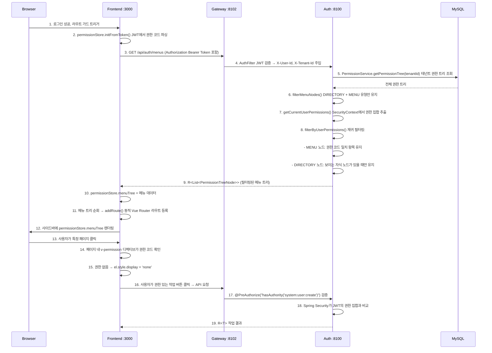

### 주요 구현 세부 사항

**백엔드 메뉴 필터링 로직** (`MenuController`):

1. 테넌트의 전체 권한 트리 조회 → `permissionService.getPermissionTree(tenantId)`
2. 1차 필터링: `type = DIRECTORY | MENU` 노드만 유지 (BUTTON 및 API 제거)
3. 2차 필터링: `SecurityContext`에서 현재 사용자 권한 집합 추출 (`ROLE_` 접두사 제외)
4. 재귀 필터링: MENU 노드는 `permissionCode`가 권한 집합에 있는지 확인; DIRECTORY 노드는 먼저 자식 노드를 재귀 처리하고, 보이는 자식 노드가 있을 때만 유지
5. 권한 정보를 획득할 수 없는 경우 전체 메뉴를 반환하는 폴백

**프론트엔드 버튼 권한 제어** (`v-permission` 디렉티브):

```vue
<el-button v-permission="'system:user:create'" type="primary">신규</el-button>
<el-button v-permission="'system:user:update'" size="small">편집</el-button>
<el-button v-permission="'system:user:delete'" size="small" type="danger">삭제</el-button>
```

- `removeChild` 대신 `display: none`을 사용하여 Vue 반응형 업데이트와 호환
- `mounted` 및 `updated` 훅에서 검증 수행
- 적용된 페이지: 사용자 관리, 역할 관리, 조직 관리, 테넌트 관리, 온라인 사용자, OAuth2 클라이언트 관리

### 현재 상태

- **동적 메뉴**: 백엔드 `MenuController` 완전 구현, 프론트엔드 `usePermissionStore` 동적 라우트 등록
- **버튼 권한**: `v-permission` 커스텀 디렉티브가 6개 관리 페이지에 적용됨 (총 20+ 버튼)
- **API 인가**: 모든 Controller의 쓰기 작업 메서드에 `@PreAuthorize` 선언
- **권한 코드 형식**: `resource:action` (예: `system:user:create`)

## Flow 6: RBAC 데이터 권한 — 요청 레벨 행 데이터 필터링

### 개요

각 HTTP 요청이 도달할 때 `DataScopeResolveFilter`가 현재 사용자의 데이터 범위를 파싱하고,
MyBatis-Plus `DataPermissionInterceptor`가 자동으로 `sys_user` 테이블 쿼리에 WHERE 조건을 추가하여,
행 레벨 데이터 필터링을 구현합니다. 비즈니스 코드에 대한 침입이 전혀 없습니다.

### 시퀀스

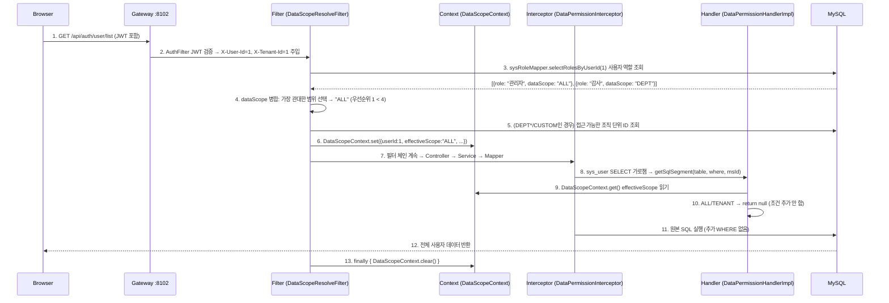

### DataScope 필터 조건 대조표

| effectiveScope | SQL 추가 조건 | 설명 |
|---------------|---------------|------|
| `ALL` | 없음 | 테넌트 간 전체 데이터 조회 가능 |
| `TENANT` | 없음 | 기존 `tenant_id` 필터로 충분 |
| `DEPT` | `WHERE sys_user.primary_unit_id IN ({본 부서 ID})` | 본 부서 사용자만 |
| `DEPT_AND_BELOW` | `WHERE sys_user.primary_unit_id IN ({본 부서 및 하위 ID})` | 본 부서 + 하위 |
| `CUSTOM` | `WHERE sys_user.primary_unit_id IN ({커스텀 본부서 + 하위 ID})` | 커스텀 범위 |
| `SELF` | `WHERE sys_user.id = {현재사용자ID}` | 본인만 |

### 조직 단위 후손 조회

`DEPT_AND_BELOW` 및 `CUSTOM` 범위는 조직 단위의 모든 후손 노드를 조회해야 합니다:

```java
// SysOrgUnitMapper
List<Long> selectDescendantIdsByPath(String path);
// SQL: SELECT id FROM sys_org_unit WHERE path LIKE '{path}%' AND id != {selfId}
```

`sys_org_unit` 테이블의 물질화 경로(`path` 필드, 예: `1/2/5/`)를 활용하여 효율적인 조상-후손 조회를 구현합니다.

### 메모리 필터링 모드 (온라인 사용자 시나리오)

온라인 사용자 데이터는 Redis에 저장되어 SQL 인터셉터로 필터링할 수 없습니다. Controller가 `DataScopeContext`에서 데이터 범위를 읽어 수동으로 필터링합니다:

```java
// OnlineUserController.list()
List<OnlineUserVO> list = onlineUserService.listOnlineUsers();
DataScopeContext.DataScopeInfo scope = DataScopeContext.get();
if (scope != null) {
    list = filterByDataScope(list, scope);
}
// ALL/TENANT → 전체, DEPT*/CUSTOM → primaryUnitId 기준 필터링, SELF → 본인만
```

### 구성 등록 순서

```java
// MyBatisPlusConfig
MybatisPlusInterceptor interceptor = new MybatisPlusInterceptor();
// 데이터 권한은 반드시 페이지네이션 인터셉터 이전에 등록해야 함
interceptor.addInnerInterceptor(new DataPermissionInterceptor(new DataPermissionHandlerImpl()));
interceptor.addInnerInterceptor(new PaginationInnerInterceptor(DbType.MYSQL));
```

**이유**: 페이지네이션 인터셉터가 `SELECT COUNT(*)` 쿼리를 실행할 때 데이터 권한 조건이 이미 추가되어 있어야 합니다. 그렇지 않으면 COUNT 결과가 실제 데이터와 불일치합니다.

### 현재 상태

- **SQL 가로챔**: `DataPermissionInterceptor` + `DataPermissionHandlerImpl` 완전 구현, 현재 `sys_user` 테이블만 필터링
- **요청 레벨 컨텍스트**: `DataScopeResolveFilter` + `DataScopeContext` ThreadLocal 관리
- **다중 역할 병합**: 가장 관대한 범위 우선 전략 구현 완료
- **메모리 필터링**: `OnlineUserController`에서 `primaryUnitId` 기반 메모리 필터링 구현 완료
- **물질화 경로 조회**: `SysOrgUnitMapper.selectDescendantIdsByPath()`로 후손 노드를 효율적으로 획득

## Flow 7: 사용자 생성 — 세 가지 경로

### 개요

시스템은 세 가지 사용자 생성 경로를 지원하여 다양한 시나리오를 커버합니다: 사용자 자체 등록(신규 사용자 대상), 관리자 백엔드 생성(운영자 대상), 소셜 로그인 자동 생성(서드파티 OAuth2 최초 로그인 사용자 대상). 모든 경로로 생성된 사용자는 현재 테넌트의 `USER` 기본 역할을 자동 배정받으며(`data_scope=SELF`), 초기 조직 단위 귀속은 없고(`primaryUnitId`는 `null`), 관리자가 나중에 배정해야 합니다.

### 시퀀스

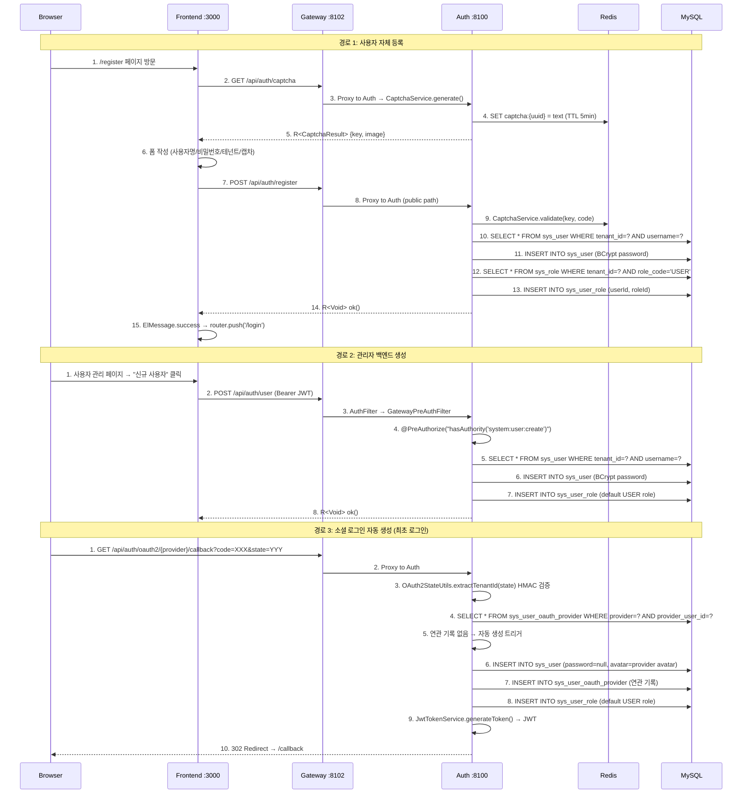

### 세 가지 경로 비교

| 항목 | 자체 등록 | 관리자 생성 | 소셜 로그인 자동 생성 |
|------|-----------|-------------|----------------------|
| **입구** | `POST /api/auth/register` | `POST /api/auth/user` | OAuth2 콜백 내부 |
| **인증 요구** | 없음 (공개 엔드포인트) | `system:user:create` 권한 | 없음 (OAuth2 콜백) |
| **캡차** | 예 (Redis 일회성) | 아니오 | 아니오 |
| **테넌트 결정** | 사용자가 드롭다운에서 선택 | 관리자가 지정 | HMAC 서명된 state 파라미터 |
| **비밀번호** | BCrypt 인코딩 | BCrypt 인코딩 | `null` (소셜 로그인 전용) |
| **사용자명** | 사용자 선택 (3-32자) | 관리자 지정 (길이 제한 없음) | 자동 생성: `gh_`/`go_`/`ge_` + 서드파티 사용자명 |
| **기본 역할** | `USER` (`data_scope=SELF`) | `USER` | `USER` |
| **조직 단위** | 미배정 (`primaryUnitId=null`) | 미배정 | 미배정 |
| **사용자명 충돌** | `BusinessException(400)` 발생 | `BusinessException(400)` 발생 | Fallback: `{prefix}{login}_{providerUserId}` |
| **생성 후 동작** | 성공 안내 → 로그인 페이지로 이동 | 사용자 목록 반환 | JWT 자동 발급 → 프론트엔드 리디렉트 |

### 주요 구성 요소

| 구성 요소 | 파일 | 역할 |
|-----------|------|------|
| `AuthController.register()` | `omni-auth/.../controller/AuthController.java` | 자체 등록 입구, `UserService`에 위임 |
| `UserController.create()` | `omni-auth/.../controller/UserController.java` | 관리자 생성 입구, `@PreAuthorize` 필요 |
| `SocialLoginServiceImpl.handleCallback()` | `omni-auth/.../service/impl/SocialLoginServiceImpl.java` | 소셜 로그인 콜백 처리, 자동 생성 로직 포함 |
| `UserServiceImpl.registerUser()` | `omni-auth/.../service/impl/UserServiceImpl.java` | 자체 등록 비즈니스: 캡차 검증 → 고유성 확인 → 삽입 → 역할 배정 |
| `UserServiceImpl.createUser()` | `omni-auth/.../service/impl/UserServiceImpl.java` | 관리자 생성 비즈니스: 고유성 확인 → 삽입 → 역할 배정 |
| `SocialLoginServiceImpl.createNewUser()` | `omni-auth/.../service/impl/SocialLoginServiceImpl.java` | 소셜 로그인 자동 생성: 사용자명 생성 → 삽입 → OAuth 연관 기록 → 역할 배정 |
| `UserServiceImpl.assignDefaultRole()` | `omni-auth/.../service/impl/UserServiceImpl.java` | 공통 메서드: 테넌트의 `USER` 역할 조회 → `sys_user_role`에 기록 |
| `RegisterRequest` | `omni-auth/.../dto/RegisterRequest.java` | 자체 등록 DTO (캡차 필드 포함) |
| `CreateUserRequest` | `omni-auth/.../dto/CreateUserRequest.java` | 관리자 생성 DTO (phone/gender 포함) |
| 등록 페이지 | `omni-frontend/src/views/register/index.vue` | 프론트엔드 등록 폼 (비밀번호 확인, 테넌트 선택 포함) |

### 현재 상태

- **자체 등록**: `POST /api/auth/register` 완전 구현, 프론트엔드 등록 페이지 `/register` 준비 완료, Gateway 화이트리스트 구성 완료
- **관리자 생성**: `POST /api/auth/user` 완전 구현, 프론트엔드 사용자 관리 페이지 준비 완료, `@PreAuthorize` 권한 제어 적용 완료
- **소셜 로그인 자동 생성**: `SocialLoginServiceImpl.createNewUser()` 완전 구현, GitHub/Google/Gitee 지원, 사용자명 충돌 시 fallback 메커니즘 있음
- **기본 역할 배정**: 세 가지 경로가 모두 `assignDefaultRole()` 메서드를 공유하며, 역할 배정 실패 시 경고만 기록하고 생성을 차단하지 않음
**조직 단위**: 세 가지 경로 모두 조직 단위를 배정하지 않으며, `primaryUnitId`는 `null`로 유지되고, 관리자가 나중에 수동 배정 필요

---

## Flow 8: XSS 방어 — 요청 정화 및 구성 관리

### 8A. XSS 요청 정화 (매 요청마다 자동 실행)

```
Client Request
    │
    ▼
┌─────────────────────────────────────────┐
│ Gateway: SecurityHeadersFilter          │
│  → X-Content-Type-Options: nosniff 추가 │
│  → X-Frame-Options: DENY 추가          │
│  → Referrer-Policy: strict-origin 추가  │
│  → AuthFilter: JWT 검증 + 신원 헤더 주입    │
└────────────────┬────────────────────────┘
                 │ omni-auth로 전달
                 ▼
┌─────────────────────────────────────────┐
│ Layer 2: XssFilter (OncePerRequestFilter)│
│  1. XssConfigProvider.getXssSettings()   │
│     → Redis 캐시 적중? 캐시 반환          │
│     → 미적중? DB 조회 + 캐시 기록       │
│  2. enabled=false인 경우 → 정화 건너뛰기       │
│  3. enabled=true인 경우 → Request 포장    │
│     → XssHttpServletRequestWrapper       │
│     → getParameter/getParameterValues 재정의│
│     → XssRuleHolder.set(rules) ThreadLocal│
└────────────────┬────────────────────────┘
                 │
                 ▼
┌─────────────────────────────────────────┐
│ Layer 1: XssStringDeserializer          │
│  (Jackson SimpleModule 자동 등록)        │
│  → @RequestBody JSON의 String 필드   │
│  → 자동으로 XssSanitizer.sanitize() 적용    │
└────────────────┬────────────────────────┘
                 │
                 ▼
            Controller
```

**XssSanitizer 정화 규칙** (ruleType에 따라 디스패치):

| ruleType | 정화 방식 | 예시 |
|----------|-----------|------|
| `HTML_TAG` | 정규식으로 쌍을 이루는 태그 `<tag>...</tag>` 및 자동 닫힘 태그 `<tag/>` 제거 | `<script>alert(1)</script>` → `alert(1)` |
| `EVENT_HANDLER` | 정규식으로 `on*` 속성 제거 | `onclick="..."` → 제거 |
| `DANGEROUS_PROTOCOL` | `javascript:` / `vbscript:` / `data:` 프로토콜 문자열 교체 | `javascript:alert(1)` → 빈 문자열 |
| `CUSTOM_PATTERN` | 커스텀 정규식 매칭 및 교체 | `expression(...)` → 제거 |

**ThreadLocal 정리**: `XssFilter`가 `finally` 블록에서 `XssRuleHolder.clear()`를 호출하여 메모리 누수를 방지합니다.

### 8B. XSS 구성 관리 (관리자 작업)

```
Admin (프론트엔드 XSS 방어 구성 페이지)
    │
    ├─ 글로벌 스위치 전환
    │  PUT /api/auth/xss-config/toggle
    │  → XssConfigController.toggleGlobal()
    │  → @PreAuthorize("hasAuthority('system:xssconfig:update')")
    │  → XssConfigServiceImpl.toggleGlobal()
    │     → UPDATE sys_xss_config SET enabled = ? WHERE tenant_id = ?
    │     → Redis 캐시 삭제: xss:enabled:{tenantId}, xss:rules:{tenantId}
    │
    ├─ 규칙 생성
    │  POST /api/auth/xss-config/rules
    │  → @PreAuthorize("hasAuthority('system:xssconfig:create')")
    │  → ruleType 열거 + pattern 정규식 유효성 검증
    │  → INSERT sys_xss_blacklist_rule
    │  → Redis 캐시 삭제
    │
    ├─ 규칙 갱신
    │  PUT /api/auth/xss-config/rules/{id}
    │  → @PreAuthorize("hasAuthority('system:xssconfig:update')")
    │  → UPDATE sys_xss_blacklist_rule
    │  → Redis 캐시 삭제
    │
    ├─ 규칙 삭제
    │  DELETE /api/auth/xss-config/rules/{id}
    │  → @PreAuthorize("hasAuthority('system:xssconfig:delete')")
    │  → DELETE sys_xss_blacklist_rule
    │  → Redis 캐시 삭제
    │
    └─ 개별 규칙 활성화/비활성화
       PUT /api/auth/xss-config/rules/{id}/toggle
       → @PreAuthorize("hasAuthority('system:xssconfig:update')")
       → UPDATE sys_xss_blacklist_rule SET enabled = NOT enabled
       → Redis 캐시 삭제
```

**캐시 전략**:
- Redis 키: `xss:enabled:{tenantId}` (문자열 "true"/"false") + `xss:rules:{tenantId}` (JSON 배열)
- TTL: 30분
- 무효화: 모든 쓰기 작업(toggle, CRUD) 후 두 캐시 키를 능동적으로 `DEL`
- 원본 조회: `XssConfigProviderImpl.loadFromDbAndCache()`가 캐시 미적중 시 DB를 조회하고 캐시를 채움

### 주요 구성 요소

| 구성 요소 | 파일 경로 | 역할 |
|-----------|-----------|------|
| `XssConfigController` | `omni-auth/.../controller/XssConfigController.java` | XSS 구성 관리 REST API (7개 엔드포인트) |
| `XssConfigServiceImpl` | `omni-auth/.../service/impl/XssConfigServiceImpl.java` | 구성 CRUD + Redis 캐시 무효화 |
| `XssConfigProviderImpl` | `omni-auth/.../security/XssConfigProviderImpl.java` | 구성 로드 (Redis 우선 → DB 원본 조회) |
| `XssFilter` | `omni-common/.../security/xss/XssFilter.java` | Servlet Filter, 구성 로드 + ThreadLocal 설정 |
| `XssSanitizer` | `omni-common/.../security/xss/XssSanitizer.java` | 핵심 정화 로직 (4가지 규칙 유형) |
| `XssStringDeserializer` | `omni-common/.../security/xss/XssStringDeserializer.java` | Jackson 역직렬화기 래퍼, JSON 문자열 자동 세척 |
| `SecurityHeadersFilter` | `omni-gateway/.../config/SecurityHeadersFilter.java` | Gateway 보안 응답 헤더 |
| XSS 관리 페이지 | `omni-frontend/src/views/system/xssconfig/index.vue` | 글로벌 스위치 + 규칙 CRUD 테이블 |

### 현재 상태

- **3계층 정화**: Jackson 역직렬화기 + Servlet Filter + Gateway 보안 헤더 모두 구현 및 자동 구성 완료
- **구성 관리**: 글로벌 스위치 + 규칙 CRUD + 개별 규칙 toggle 총 7개 API 엔드포인트 완전 구현
- **프론트엔드 페이지**: `시스템 관리 → XSS 방어 구성` 준비 완료, 페이지네이션 규칙 목록, 생성/편집 대화상자, v-permission 버튼 권한 제어 지원
- **캐시 전략**: Redis 캐시 + 쓰기 작업 능동 무효화 구현 완료
- **테넌트 격리**: 구성 및 규칙이 `tenant_id` 기준으로 격리

---

## Flow 9: 데이터 사전 관리 — 유형+데이터 2단계 구조 CRUD

### 개요

Base 서비스(`omni-base :8101`)는 데이터 사전 관리 기능을 제공하며, 「유형 + 데이터」 2단계 구조를 채택합니다. 사전 유형(`sys_dict_type`)은 인코딩 분류를 정의하고(예: `sys_user_gender`), 사전 데이터(`sys_dict_data`)는 구체적인 키-값 쌍을 정의합니다(예: `1=남성, 2=여성, 0=알 수 없음`). 프론트엔드는 master-detail 레이아웃을 사용하여 왼쪽에 유형 목록, 오른쪽에 데이터 목록을 표시하며, 완전한 CRUD 작업과 Redis 캐시 관리를 지원합니다.

### 시퀀스

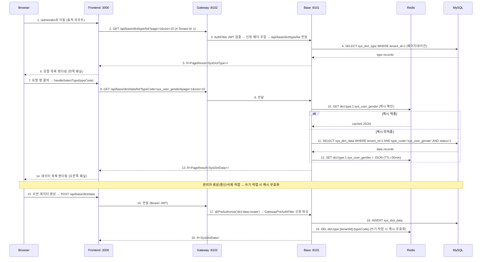

<details>
<summary>ASCII 버전 (클릭하여 펼치기)</summary>

```
Browser            Frontend :3000          Gateway :8102          Base :8101           Redis              MySQL
  |                    |                       |                     |                   |                  |
  | 1. Navigate to     |                       |                     |                   |                  |
  |    /admin/dict     |                       |                     |                   |                  |
  |                    | 2. GET /api/base/dict/type/list              |                   |                  |
  |                    |---------------------->|                     |                   |                  |
  |                    |                       | 3. AuthFilter →     |                   |                  |
  |                    |                       |    forward path     |                   |                  |
  |                    |                       |-------------------->|                   |                  |
  |                    |                       |                     | 4. SELECT         |                  |
  |                    |                       |                     |    sys_dict_type  |                  |
  |                    |                       |                     |    WHERE tenant_id=1                 |
  |                    |                       |                     |-------------------------------------->|
  |                    |                       |                     |                   |    type records   |
  |                    |                       |                     |<--------------------------------------|
  |                    | 5. R<PageResult>      |                     |                   |                  |
  |                    |<----------------------|<--------------------|                   |                  |
  | 6. Render type     |                       |                     |                   |                  |
  |    list (left)     |                       |                     |                   |                  |
  |<-------------------|                       |                     |                   |                  |
  |                    |                       |                     |                   |                  |
  | 7. Click type row  |                       |                     |                   |                  |
  |                    | 8. GET /api/base/dict/data/list?typeCode=... |                   |                  |
  |                    |---------------------->|                     |                   |                  |
  |                    |                       | 9. Forward -------->|                   |                  |
  |                    |                       |                     | 10. GET cache     |                  |
  |                    |                       |                     |------------------>|                  |
  |                    |                       |                     |                   |  hit? cached JSON |
  |                    |                       |                     |<------------------|                  |
  |                    |                       |                     |                   |                  |
  |                    |                       |                     | [if miss: SELECT sys_dict_data ----->|
  |                    |                       |                     |  SET cache <---------------------------|
  |                    |                       |                     |                   |                  |
  |                    | 13. R<PageResult>     |                     |                   |                  |
  |                    |<----------------------|<--------------------|                   |                  |
  | 14. Render data    |                       |                     |                   |                  |
  |     list (right)   |                       |                     |                   |                  |
  |<-------------------|                       |                     |                   |                  |
  |                    |                       |                     |                   |                  |
  | 15. Create data -->|                       |                     |                   |                  |
  |                    | 16. POST /api/base/dict/data                 |                   |                  |
  |                    |---------------------->|                     |                   |                  |
  |                    |                       | 17. @PreAuthorize   |                   |                  |
  |                    |                       |-------------------->|                   |                  |
  |                    |                       |                     | 18. INSERT ------>|                  |
  |                    |                       |                     | 19. DEL cache --->|                  |
  |                    | 20. R<SysDictData>    |                     |                   |                  |
  |                    |<----------------------|<--------------------|                   |                  |
```

</details>

### 주요 구성 요소

| 구성 요소 | 파일 경로 | 역할 |
|-----------|-----------|------|
| `DictTypeController` | `omni-base/.../controller/DictTypeController.java` | 사전 유형 REST API (6개 엔드포인트), `@PreAuthorize` 권한 제어 |
| `DictDataController` | `omni-base/.../controller/DictDataController.java` | 사전 데이터 REST API (5개 엔드포인트), `@PreAuthorize` 권한 제어 |
| `DictTypeServiceImpl` | `omni-base/.../service/impl/DictTypeServiceImpl.java` | 유형 CRUD + 데이터 연쇄 삭제 + 캐시 무효화 |
| `DictDataServiceImpl` | `omni-base/.../service/impl/DictDataServiceImpl.java` | 데이터 CRUD + cache-aside 캐싱 + 수동 새로고침 |
| `GatewayPreAuthFilter` | `omni-base/.../security/GatewayPreAuthFilter.java` | Gateway가 주입한 X-User-* 헤더로 SecurityContext 구성 |
| `XssConfigProviderImpl` | `omni-base/.../security/XssConfigProviderImpl.java` | Redis-only 전략으로 XSS SPI 구현 (auth 서비스가 기록한 캐시에 의존) |
| 사전 관리 페이지 | `omni-frontend/src/views/base/dict/index.vue` | Master-detail 레이아웃: 왼쪽 유형 목록 + 오른쪽 데이터 목록 |
| 사전 API 모듈 | `omni-frontend/src/api/dict.ts` | 11개 typed API 함수 + TypeScript 인터페이스 정의 |

### 캐시 전략

**Cache-aside 모드**:

| 항목 | 값 |
|------|-----|
| Redis Key | `dict:type:{tenantId}:{typeCode}` |
| TTL | 30분 |
| 직렬화 | JSON (`GenericJacksonJsonRedisSerializer`) |

**읽기 경로** (`DictDataServiceImpl.listEnabledData()`):
1. Redis 캐시 확인 → 적중 시 역직렬화하여 반환
2. 미적중 → DB 조회 (`status=1`, `sort` 후 `id` 기준 정렬) → 직렬화하여 Redis에 기록 (TTL 30분)

**쓰기 경로** (모든 CRUD 작업):
1. 먼저 DB에 기록 (INSERT / UPDATE / DELETE)
2. 그 다음 Redis 키 DEL (쓰기 작업 시 캐시 무효화, 다음 읽기 시 지연 로드)

**수동 새로고침** (`DictDataServiceImpl.refreshCache()`):
1. Redis 키 DEL
2. DB 조회
3. Redis에 기록 (즉시 재채움, 데이터 불일치 시나리오에 적합)

**연쇄 삭제**: 사전 유형 삭제 시 단일 `@Transactional` 작업에서 모든 연관 사전 데이터를 동시에 삭제하고 해당 캐시를 무효화합니다.

### 권한 트리

```
base (DIRECTORY, id=50)             ← "기초 데이터" 1단계 메뉴
  └── base:dict (MENU, id=51)       ← "사전 관리" 2단계 메뉴
        ├── dict:type:list     (API, id=52)
        ├── dict:type:create   (API, id=53)
        ├── dict:type:update   (API, id=54)
        ├── dict:type:delete   (API, id=55)
        ├── dict:data:list     (API, id=56)
        ├── dict:data:create   (API, id=57)
        ├── dict:data:update   (API, id=58)
        ├── dict:data:delete   (API, id=59)
        └── dict:data:refresh  (API, id=60)
```

모든 11개 권한 노드가 `SUPER_ADMIN` 역할(role_id=1)에 배정됩니다.

### 현재 상태

- **백엔드**: 11개 API 엔드포인트 완전 구현 (6개 유형 + 5개 데이터), `@PreAuthorize` 권한 제어 적용 완료
- **프론트엔드**: Master-detail 레이아웃 페이지 준비 완료, `v-permission` 버튼 권한 제어가 모든 작업 버튼에 적용됨
- **캐시**: Cache-aside + 쓰기 작업 무효화 + 수동 새로고침 구현 완료
- **시드 데이터**: 3개 사전 정의된 사전 유형 (`sys_user_gender`, `sys_common_status`, `sys_notice_type`) + 7개 데이터 (테넌트 1)
- **Gateway 라우트**: `Path=/api/base/**` → `lb://omni-base` 구성 완료 (StripPrefix 없음, 컨트롤러가 전체 경로 사용)
- **보안 아키텍처**: `GatewayPreAuthFilter`가 Gateway가 주입한 신원 헤더로 Spring Security 컨텍스트를 구성하고, `XssConfigProviderImpl`은 Redis-only 전략으로 XSS 방어를 상속

---

## Flow 10: 작업 로그 — AOP 수집 + RocketMQ 비동기 쓰기 + 핫/콜드 아카이브

### 개요

작업 로그 시스템은 `@OperLog` 애노테이션 + AOP 애스펙트를 기반으로 비침입식 수집을 구현하며, RocketMQ를 통해 로그 메시지를 비동기로 전송하고, omni-base 서비스가 소비하여 핫 테이블(`sys_oper_log`)에 기록합니다. 정기적으로 콜드 테이블(`sys_oper_log_archive`)로 아카이브하여 장기 규정 준수를 보장합니다. 전체 플로우가 비즈니스 코드에 대한 침입이 없으며, Controller 메서드에 애노테이션만 추가하면 됩니다.

### 10A. 작업 로그 기록 플로우 (매 쓰기 작업 시 트리거)

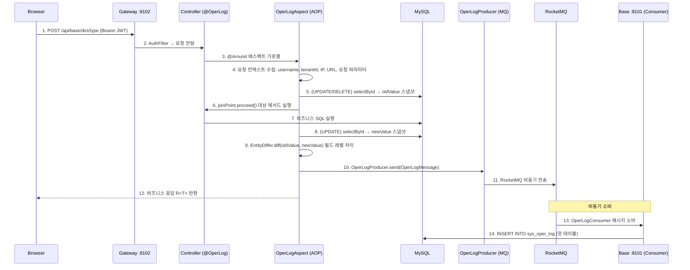

### 10B. 작업 로그 아카이브 플로우 (매일 02:00 정기 실행)

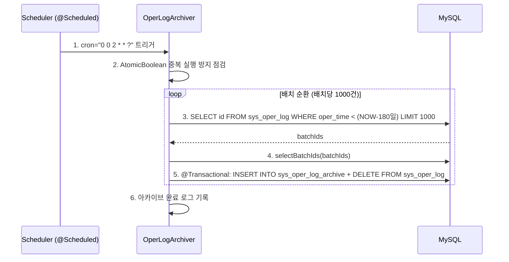

### 주요 구성 요소

| 구성 요소 | 파일 경로 | 역할 |
|-----------|-----------|------|
| `@OperLog` | `omni-common-core/.../operlog/OperLog.java` | 애노테이션 정의, module/operType/entityClass/idExpr 선언 |
| `OperType` | `omni-common-core/.../operlog/OperType.java` | 작업 유형 열거: CREATE/UPDATE/DELETE/QUERY/EXPORT/IMPORT |
| `OperLogMessage` | `omni-common-core/.../operlog/OperLogMessage.java` | 로그 메시지 POJO, Serializable 구현 |
| `OperLogAspect` | `omni-common-operlog/.../aspect/OperLogAspect.java` | AOP @Around 애스펙트, 컨텍스트 수집 + 엔티티 스냅샷 + diff |
| `EntityDiffer` | `omni-common-operlog/.../diff/EntityDiffer.java` | 필드 레벨 차이 비교, 변경된 필드만 반환 |
| `OperLogProducer` | `omni-common-operlog/.../producer/OperLogProducer.java` | RocketMQ 생산자, 로그 메시지 비동기 전송 |
| `OperLogConsumer` | `omni-base/.../consumer/OperLogConsumer.java` | RocketMQ 소비자, sys_oper_log 핫 테이블에 기록 |
| `OperLogArchiver` | `omni-base/.../service/OperLogArchiver.java` | 정기 아카이브 작업, 180일 핫 테이블→콜드 테이블 마이그레이션 |

### 감사 추적 차원

| 차원 | 필드 | 설명 |
|------|------|------|
| Who | `oper_username` | 작업자 사용자명 |
| When | `oper_time` | 작업 타임스탬프 |
| What | `module` + `oper_type` + `request_url` | 비즈니스 모듈 + 작업 유형 + 요청 URL |
| Changed | `old_value` / `new_value` | 엔티티 변경 전후 JSON 스냅샷 (UPDATE는 차이 필드만 포함) |
| Where | `ip_address` + `user_agent` | 작업 소스 IP 및 클라이언트 정보 |
| How Long | `execution_time` | 메서드 실행 소요 시간 (ms) |
| Result | `response_status` + `error_msg` | 작업 결과 상태 및 오류 정보 |

### 감사 로그와의 보완 관계

| 로그 유형 | 테이블 | 기록 범위 | 수집 방식 | 서비스 모듈 |
|-----------|--------|-----------|-----------|-------------|
| 작업 로그 | `sys_oper_log` / `sys_oper_log_archive` | 비즈니스 데이터 변경 (CRUD) | `@OperLog` + AOP + MQ 비동기 | omni-base / omni-common-operlog |
| 감사 로그 | `sys_audit_log` | 보안 이벤트 (로그인, Token, 권한 변경) | 이벤트 기반 (`AuditEventPublisher`) | omni-auth |
| 로그인 로그 | `sys_login_log` | 로그인 행위 (성공/실패) | 인증 플로우 내부 기록 | omni-auth |

세 가지 로그 유형은 각자의 역할을 수행하며 완전한 감사 추적 체계를 구성합니다: 작업 로그는 「비즈니스 데이터가 어떻게 변하는지」를 기록하고, 감사 로그는 「보안 이벤트에서 무엇이 발생하는지」를 기록하고, 로그인 로그는 「누가 언제 로그인하는지」를 기록합니다.

### 현재 상태

- **AOP 애스펙트**: `OperLogAspect` 완전 구현, CREATE/UPDATE/DELETE/QUERY/EXPORT/IMPORT 6가지 작업 유형 지원
- **엔티티 diff**: `EntityDiffer`가 필드 레벨 차이 비교를 구현, UPDATE 작업은 변경된 필드만 기록
- **SpEL 추출**: `#id`, `#result.data.id` 등 표현식을 지원, 메서드 파라미터 및 반환값에서 엔티티 ID 추출
- **MQ 비동기**: `OperLogProducer`가 RocketMQ를 통해 비동기 전송, 비즈니스 요청을 차단하지 않음
- **핫/콜드 아카이브**: `OperLogArchiver` 매일 02:00 실행, 180일 보존 정책, 배치 처리 1000건/배치
- **omni-auth 비활성화**: 인증 모듈은 `omni-common-operlog`를 포함하지 않으며, 인증 행위는 `sys_login_log` + `sys_audit_log`로 커버

---

## Flow 11: 사용자 작업 생성 — 워크벤치 셀프서비스 생성에서 XXL-JOB 직접 등록까지

### 개요

사용자가 워크벤치의 「내 작업」 영역에서 셀프 서비스로 예약 작업을 생성합니다. 프론트엔드는 작업 유형 선택, 동적 파라미터 폼, Cron 표현식 편집기를 제공하고, 백엔드는 유형 유효성을 검증한 후 데이터베이스에 저장하고 XXL-JOB 스케줄링 센터에 직접 등록하여 생성 즉시 적용됩니다.

### 시퀀스

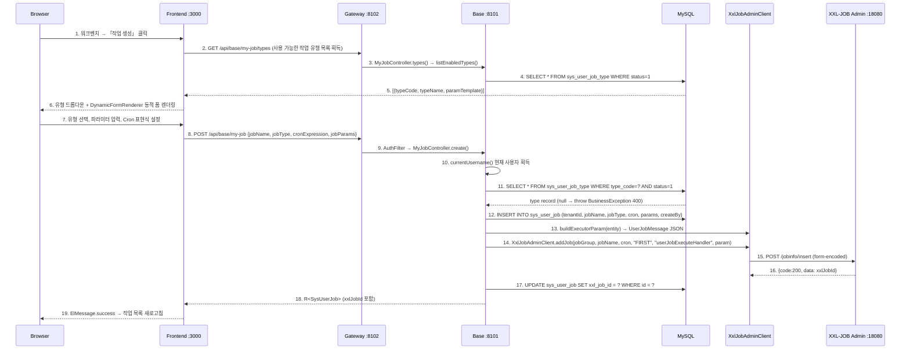

### 오류 처리

| 시나리오 | 처리 방식 | 프론트엔드 표시 |
|----------|-----------|------------------|
| 작업 유형이 존재하지 않거나 비활성화됨 | `BusinessException(400)` 발생 | ElMessage.error |
| XXL-JOB 등록 실패 | DB 기록 롤백 (`sysUserJobMapper.deleteById`) → `BusinessException(500)` 발생 | ElMessage.error 「스케줄링 센터 등록 실패」 |
| 작업 이름이 비어 있음 | Jakarta Validation `@NotBlank` | 폼 검증 안내 |
| Cron 표현식이 비어 있음 | Jakarta Validation `@NotBlank` | 폼 검증 안내 |

### 주요 구성 요소

| 구성 요소 | 파일 경로 | 역할 |
|-----------|-----------|------|
| 워크벤치 페이지 | `omni-frontend/src/views/home/index.vue` | 작업 생성 팝업 (유형 선택 + CronGenerator + DynamicFormRenderer) |
| Cron 편집기 | `omni-frontend/src/components/CronGenerator.vue` | 빈도 유형 선택기 + 동적 조건 폼 + 사람이 읽을 수 있는 미리보기 |
| 동적 폼 | `omni-frontend/src/components/DynamicFormRenderer.vue` | `param_template` JSON Schema에 따라 폼 렌더링 |
| API 모듈 | `omni-frontend/src/api/myJob.ts` | `createMyJob()`, `getEnabledJobTypes()` |
| 컨트롤러 | `omni-base/.../controller/MyJobController.java` | `POST /api/base/my-job`, currentUsername 추출 |
| 서비스 레이어 | `omni-base/.../service/impl/UserJobServiceImpl.java` | `createJob()` — 유형 검증 + DB 삽입 + XXL-JOB 등록 + 실패 시 롤백 |
| XXL-JOB 클라이언트 | `omni-common-job/.../XxlJobAdminClient.java` | `addJob()` — 폼 파라미터 구성하여 `/jobinfo/insert` 호출 |
| 작업 유형 레지스트리 | `sys_user_job_type` | `type_code` (고유) + `param_template` (JSON Schema) |
| 사용자 작업 테이블 | `sys_user_job` | `xxl_job_id`로 XXL-JOB 스케줄링 센터와 연관 |

### 소유권 모델

`MyJobController`는 `@PreAuthorize`를 사용하지 않고, `verifyOwnership(id, username)`으로 작업 소유권을 검증합니다:

```java
private void verifyOwnership(Long id, String username) {
    SysUserJob job = userJobService.getJobById(id);
    if (!username.equals(job.getCreateBy())) {
        throw new BusinessException(403, "이 작업을 조작할 권한이 없습니다");
    }
}
```

각 사용자는 자신이 생성한 작업만 조작할 수 있어 행 레벨 데이터 격리를 구현합니다.

### 현재 상태

- **작업 생성**: 엔드투엔드 구현, 워크벤치 생성 → DB 저장 → XXL-JOB 등록, 실패 시 자동 롤백
- **유형 관리**: `UserJobTypeController`가 작업 유형의 CRUD 및 파라미터 템플릿 관리 지원
- **동적 폼**: `DynamicFormRenderer`가 `param_template`에 따라 input/select/number/textarea를 자동 렌더링
- **Cron 편집기**: `CronGenerator`가 7가지 빈도 유형 지원 (매 분/매 X분/매 시간/매 X시간/매일/매주/매월)
- **소유권 검증**: `verifyOwnership()`이 사용자가 자신이 생성한 작업만 조작할 수 있도록 보장

---

## Flow 12: 사용자 작업 실행 — XXL-JOB 트리거에서 프론트엔드 알림까지

### 개요

XXL-JOB 스케줄링 센터가 cron 표현식에 따라 실행을 트리거하면, `XxlJobSpringExecutor`가 요청을 `userJobExecuteHandler`로 디스패치합니다. 해당 handler는 JSON 실행 파라미터에서 작업 컨텍스트를 파싱하고, `UserJobHandlerRegistry`를 통해 구체적인 `UserJobHandler`로 라우팅하여 실행합니다. 실행 로그를 기록하고 `lastFireTime`을 갱신합니다. 프론트엔드 워크벤치는 매 10초마다 활성 작업의 실행 로그를 폴링하고, 새 로그 발견 시 알림을 팝업합니다.

### 시퀀스

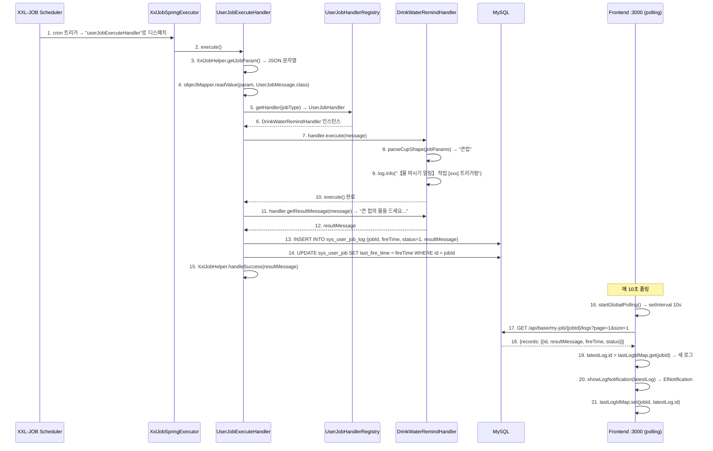

### 프론트엔드 폴링 메커니즘

워크벤치는 `startGlobalPolling()`을 사용하여 전역 로그 모니터링을 구현합니다:

```
setInterval 매 10초:
1. tableData에서 status=1인 활성 작업 필터링
2. 각 활성 작업에 대해:
   a. GET /api/base/my-job/{id}/logs?page=1&size=1
   b. 최신 로그 ID 획득
   c. lastLogIdMap의 알려진 ID와 비교
   d. latestLog.id > prevId인 경우:
      - lastLogIdMap에 이미 해당 작업 기록이 있는 경우 (비최초) → ElNotification 팝업
      - lastLogIdMap 갱신
3. loadData() + loadStats() 새로고침
```

**중복 알림 방지**: `lastLogIdMap`이 최초 초기화 시 현재 최신 로그 ID만 기록하고 알림을 팝업하지 않습니다. 후속 폴링에서 발견된 새 로그(ID > 알려진 ID)만 알림을 트리거합니다.

**수명 주기 관리**:
- `onMounted`에서 폴링 시작
- `onUnmounted`에서 `setInterval` 제거, 메모리 누수 방지

### 실행 파라미터 JSON 형식

`XxlJobAdminClient.addJob()`이 작업을 등록할 때 `executorParam` 필드는 `UserJobMessage` JSON을 포함합니다:

```json
{
    "jobId": 1,
    "tenantId": 1,
    "jobType": "Task-00001",
    "jobName": "물 마시기 알림",
    "jobParams": "{\"cupShape\":\"큰컵\"}"
}
```

`UserJobExecuteHandler`가 `objectMapper.readValue(param, UserJobMessage.class)`를 통해 파싱한 후 라우팅합니다.

### 오류 처리

| 시나리오 | 처리 방식 | XXL-JOB 콘솔 표시 |
|----------|-----------|---------------------|
| JSON 파라미터 파싱 실패 | `XxlJobHelper.handleFail("파라미터 파싱 실패: ...")` | 실행 실패 |
| Handler를 찾지 못함 | `log.warn` + `status=0` + `errorMsg` 로그 기록 | 실행 실패 |
| Handler 실행 예외 | catch → `status=0` + `errorMsg` (2000자까지 잘림) | 실행 실패 |
| 정상 완료 | `XxlJobHelper.handleSuccess(resultMessage)` | 실행 성공 |

### 주요 구성 요소

| 구성 요소 | 파일 경로 | 역할 |
|-----------|-----------|------|
| 범용 실행 Handler | `omni-base/.../job/UserJobExecuteHandler.java` | `@XxlJob("userJobExecuteHandler")` 입구, JSON 파싱 + Handler 라우팅 + 로그 기록 + lastFireTime 갱신 |
| Handler 등록 센터 | `omni-base/.../job/UserJobHandlerRegistry.java` | `Map<String, UserJobHandler>` 자동 주입, `getHandler(jobType)` 라우팅 |
| SPI 인터페이스 | `omni-common-core/.../job/UserJobHandler.java` | `execute()` + `getResultMessage()` |
| 메시지 POJO | `omni-common-core/.../job/UserJobMessage.java` | `jobId`, `tenantId`, `jobType`, `jobName`, `jobParams` |
| 물 마시기 핸들러 | `omni-base/.../job/handler/DrinkWaterRemindHandler.java` | `@Component("Task-00001")`, `cupShape` 파라미터를 파싱하여 알림 메시지 생성 |
| 실행 로그 테이블 | `sys_user_job_log` | `fire_time`, `execute_time_ms`, `status`, `result_message`, `error_message` |
| 프론트엔드 폴링 | `omni-frontend/src/views/home/index.vue` | `startGlobalPolling()` 매 10초 + `lastLogIdMap` 중복 방지 |
| 알림 컴포넌트 | Element Plus `ElNotification` | 3초 후 자동 닫힘, `resultMessage` 표시 |

### 현재 상태

- **실행 체인**: XXL-JOB 트리거 → `userJobExecuteHandler` → Handler 라우팅 → 로그 기록 → lastFireTime 갱신, 완전 구현
- **프론트엔드 알림**: 10초 폴링 + `lastLogIdMap` 중복 방지 + `ElNotification` 3초 자동 닫힘
- **오류 처리**: 파라미터 파싱 실패, Handler 미발견, 실행 예외 모두 처리, 결과 `sys_user_job_log`에 기록
- **lastFireTime**: 매 실행 후 `SysUserJobMapper.updateById()`를 통해 갱신, 워크벤치 테이블에 실시간 표시
- **다음 실행 시간**: 프론트엔드가 `cron-parser` 라이브러리를 통해 클라이언트 측 계산, 활성화된 작업만 표시

---

## Flow 13: CRM 리드 멱등 변환 — Customer + Contact + Opportunity + Outbox

### 개요

영업 담당자가 `QUALIFIED` 리드를 고객으로 변환하며, 고객/연락처를 새로 생성하거나 연결할 수 있고, 동시에 기회를 생성할 수 있습니다. 변환은 `omni_crm` 단일 데이터베이스 트랜잭션으로 완료됩니다; 동일 리드는 하나의 `crm_lead_conversion` 만 생성할 수 있으며, 중복 요청은 이미 생성된 객체 ID 를 그대로 반환합니다. 서비스 간 호출은 트랜잭션 전의 데이터 범위와 owner 권위 검증에만 사용되며, 트랜잭션 내에서 실제 MQ 를 보내지 않고 로컬 Outbox 만 기록합니다.

### 시퀀스

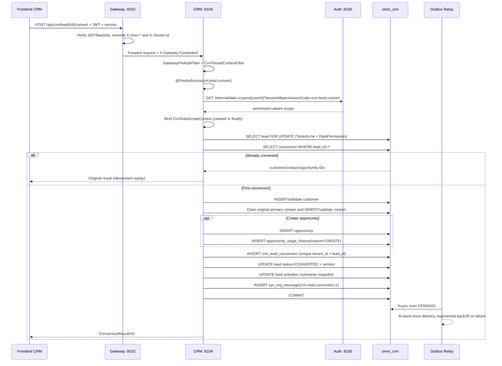

### 일관성 경계

- `crm_lead_conversion(tenant_id, lead_id)` 는 변환 멱등 사실입니다; Service 의 행 잠금과 낙관적 버전이 함께 동시성을 처리합니다.
- Customer, Contact, Opportunity, 초기 Stage History, Lead 상태와 Outbox 는 함께 커밋되거나 함께 롤백되어야 합니다.
- 새로 생성되는 모든 객체는 현재 리드의 owner 스냅샷을 상속합니다; 대상 사용자/조직은 Auth 권위 인터페이스에서 비롯되며, 프론트엔드의 ownerUnitId 를 신뢰해서는 안 됩니다.
- Outbox payload 에는 tenantId, 집계 ID, 상태, 버전, 이벤트 ID 만 포함되고 전화, 이메일, 주소, 비고는 포함되지 않습니다.
- `@OperLog` 는 요청이 프로세스를 떠나기 전에 매개변수와 스냅샷을 재귀적으로 비식별화합니다; 변환 명령은 고객, 연락처, 기회 이름을 명시적으로 제외합니다.

---

## Flow 14: CRM 기회 추진과 권한 격리 — Stage History + Customer 활성화

### 개요

기회 단계 변경은 일반 업데이트가 아니라 독립된 명령입니다. 각 요청은 완전한 권한 코드 `crm:opportunity:stage` 로 Auth 에서 데이터 범위를 해석한 뒤, CRM 의 TenantLine, DataPermission, 낙관적 잠금으로 함께 제약됩니다; 정당한 전이는 불변 단계 이력과 도메인 Outbox 를 기록합니다. 수주 시, CRM 은 TenantLine 을 유지하고 DataPermission 만 무시하는 전용 SQL 로 연관된 잠재 고객을 활성화하여, Customer 와 Opportunity 의 owner 가 다름으로 인한 조용한 업데이트 누락을 방지합니다.

### 상태 전이

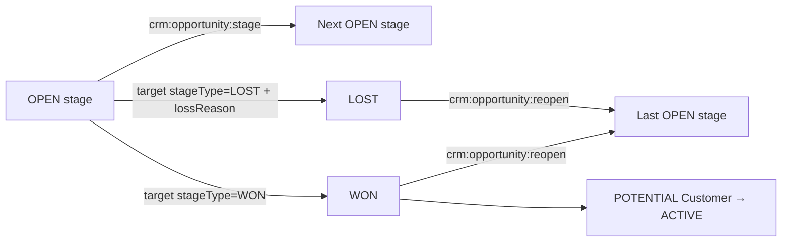

### 명령 실행 규칙

1. Gateway 가 JWT 를 검증하고 신분 헤더를 덮어씁니다; CRM 은 전달 마커, userId 또는 tenantId 가 없는 비즈니스 요청을 거부합니다.
2. `@PreAuthorize` 가 먼저 기능 권한을 검증하고, `@CrmDataScope` 가 현재 명령의 완전한 permissionCode 로 Auth 에서 scope 를 가져옵니다.
3. MyBatis 는 항상 `TenantLine → DataPermission → Pagination` 을 실행합니다; 일반 CRM API 에서 `ALL` 도 현재 테넌트의 전체 데이터를 의미할 뿐입니다.
4. Service 는 기회를 잠그고 요청 version, 현재 상태, 대상 단계가 속한 pipeline, 상태 머신의 정당성을 검증합니다; 동일 단계로의 no-op 은 즉시 거부됩니다.
5. 기회의 단계/상태/확률/실패 사유와 version 을 업데이트하고, `crm_opportunity_stage_history` 를 추가한 뒤, `stage-changed/won/lost` Outbox 를 기록합니다.
6. 수주 시 고객을 활성화하는 전용 Mapper 는 owner 데이터 권한만 우회하고 TenantLine 은 우회하지 않으며, customer id, 상태, `deleted=0` 를 명시적으로 검증합니다.
7. 재개는 `crm:opportunity:reopen` 을 사용하고, 마지막 개방 단계를 복원하여 `REOPEN` 이력을 기록합니다; 일반 update 로 상태 머신을 우회해서는 안 됩니다.

### PII 반환 규칙

- Lead, Customer, Contact 목록은 항상 마스킹된 연락처를 반환합니다; 전체 값은 `crm:pii:view` 를 보유할 때만 반환됩니다.
- Activity 목록/타임라인의 content 는 항상 `[REDACTED]` 입니다; 상세는 계속 `crm:pii:view` 의 통제를 받습니다.
- 프론트엔드는 편집 전 상세를 다시 읽습니다; PII 권한이 없으면 민감 필드를 비활성화하고 update payload 에 넣지 않아, 마스킹 텍스트로 실제 데이터를 덮어쓰는 것을 방지합니다.

---

## Docker 배포 시 플로우 구성 주의사항

### OAuth2 콜백 URL 구성

Docker 배포 시 소셜 로그인의 `redirect_uri`는 **호스트 머신에서 접근 가능한 URL**을 사용해야 합니다 (컨테이너 내부 주소가 아닌):

| 배포 환경 | redirect_uri 예시 |
|-----------|---------------------|
| 로컬 개발 | `http://localhost:8100/api/auth/oauth2/github/callback` |
| Docker 배포 | `http://<호스트IP>:8100/api/auth/oauth2/github/callback` |
| 프로덕션 환경 | `https://your-domain.com/api/auth/oauth2/github/callback` |

**구성 방식** (`application.yml`):

```yaml
omni:
  oauth2:
    github:
      redirect-uri: ${OAUTH2_GITHUB_REDIRECT_URI:http://localhost:8100/api/auth/oauth2/github/callback}
    google:
      redirect-uri: ${OAUTH2_GOOGLE_REDIRECT_URI:http://localhost:8100/api/auth/oauth2/google/callback}
    gitee:
      redirect-uri: ${OAUTH2_GITEE_REDIRECT_URI:http://localhost:8100/api/auth/oauth2/gitee/callback}
```

**Docker Compose 환경 변수 재정의**:

```yaml
# docker-compose.yml
omni-auth:
  environment:
    OAUTH2_GITHUB_REDIRECT_URI: http://192.168.1.100:8100/api/auth/oauth2/github/callback
    OAUTH2_GOOGLE_REDIRECT_URI: http://192.168.1.100:8100/api/auth/oauth2/google/callback
    OAUTH2_GITEE_REDIRECT_URI: http://192.168.1.100:8100/api/auth/oauth2/gitee/callback
```

> **주의**: Docker 배포에서 Auth 서비스 컨테이너 내부 포트는 8080이지만, OAuth2 콜백 URL은 호스트 머신 매핑 포트 8100을 사용해야 합니다 (서드파티 플랫폼이 호스트 머신의 공인/사설 네트워크 주소로 콜백해야 하기 때문입니다).

### Docker 배포 시 프론트엔드 콜백 페이지

소셜 로그인 성공 후 Auth 서비스가 302 리디렉트로 프론트엔드 콜백 페이지로 이동합니다:

```
성공: 302 Location: /callback#token=<JWT>&username=<username>
실패: 302 Location: /login?error=<error_code>&message=<message>
```

Docker 배포에서 Nginx 컨테이너가 프론트엔드 정적 파일을 서비스하며, `/callback` 라우트는 Vue Router 클라이언트 측에서 처리합니다 (Nginx `try_files $uri $uri/ /index.html`).

### Gateway 컨테이너 간 네트워크

Docker 배포 시 모든 컨테이너는 동일한 `omni-network` 브리지 네트워크에 있습니다:

```
프론트엔드 브라우저 → 호스트:8100 → Nginx 컨테이너(:80)
    ├── 정적 파일 → Nginx 직접 반환
    ├── /api/*   → proxy_pass http://omni-gateway:8080
    └── /oauth2/* → proxy_pass http://omni-gateway:8080

Gateway 컨테이너(:8080)
    ├── lb://omni-auth → Auth 컨테이너(:8080) [Nacos 서비스 발견]
    ├── lb://omni-base → Base 컨테이너(:8080) [Nacos 서비스 발견]
    └── lb://omni-workflow → Workflow 컨테이너(:8080) [Nacos 서비스 발견]
```

---

## 문제 해결 가이드

### 로그인 플로우 문제

| 문제 | 가능한 원인 | 문제 해결 방법 |
|------|-------------|----------|
| **캡차가 표시되지 않음** | Redis가 시작되지 않았거나 연결 실패 | Redis 컨테이너 상태 확인; Auth 서비스 로그에서 Redis 연결 오류 확인 |
| **로그인 시 「사용자명 또는 비밀번호 오류」 반환** | 테넌트 ID 불일치 | 프론트엔드 `tenantId` 파라미터 확인; `sys_user` 테이블의 `tenant_id` 필드 확인 |
| **로그인 후 401** | JWT 서명 검증 실패 | Gateway가 Auth의 `/oauth2/jwks` 엔드포인트에 접근 가능한지 확인; `JwkKeyProvider` 캐시 만료 여부 확인 |
| **Token 만료가 빈번** | JWT 유효기간이 15분만 | 현재 refresh token 메커니즘 없음, 재로그인 필요; 추후 refresh token 플로우 추가 가능 |

### 소셜 로그인 문제

| 문제 | 가능한 원인 | 문제 해결 방법 |
|------|-------------|----------|
| **GitHub 콜백 404** | redirect_uri 구성 오류 | GitHub OAuth App의 `Authorization callback URL`이 `application.yml`의 구성과 일치하는지 확인 |
| **State 검증 실패** | HMAC 서명 불일치 | Auth 서비스의 `omni.oauth2.state-secret` 구성이 일치하는지 확인 (단일 인스턴스 배포에서는 해당 문제 없음) |
| **Google API 타임아웃** | 네트워크 프록시 문제 | Google API는 프록시를 통해 접근해야 함; `application.yml`의 `proxy` 구성 확인 |
| **자동 사용자 생성 실패** | 사용자명 충돌 및 fallback도 충돌 | `sys_user` 테이블에 `gh_`/`go_`/`ge_` 접두사의 사용자명 충돌 여부 확인 |
| **Docker 배포 시 컨테이너 내부 주소로 콜백** | redirect_uri가 컨테이너 내부 포트를 사용 | redirect_uri가 컨테이너 내부 포트(8080)가 아닌 호스트 매핑 포트(8100)를 사용하는지 확인 |

### 권한 및 메뉴 문제

| 문제 | 가능한 원인 | 문제 해결 방법 |
|------|-------------|----------|
| **동적 메뉴가 표시되지 않음** | 백엔드 `/api/auth/menus`가 빈 값 반환 | JWT에 `authorities` 필드가 포함되어 있는지 확인; `sys_role_permission` 테이블의 역할-권한 연관 확인 |
| **버튼이 항상 숨겨짐** | v-permission 인코딩 불일치 | 프론트엔드 `v-permission` 값과 `sys_permission` 테이블의 `permission_code` 비교 |
| **API가 403 반환** | @PreAuthorize 권한 인코딩 불일치 | Controller의 `@PreAuthorize` 값과 사용자 JWT의 권한 집합 비교 |

### 데이터 사전 문제

| 문제 | 가능한 원인 | 문제 해결 방법 |
|------|-------------|----------|
| **사전 데이터가 갱신되지 않음** | Redis 캐시가 무효화되지 않음 | 수동으로 `PUT /api/base/dict/data/refresh` 호출하여 캐시 새로고침; 또는 TTL(30분) 만료 대기 |
| **사전 유형 삭제 후 데이터 잔류** | 연쇄 삭제가 트리거되지 않음 | `DictTypeServiceImpl.deleteType()`의 트랜잭션이 정상 커밋되는지 확인 |

### 작업 로그 문제

| 문제 | 가능한 원인 | 문제 해결 방법 |
|------|-------------|----------|
| **로그가 기록되지 않음** | RocketMQ가 시작되지 않음 | RocketMQ 컨테이너 상태 확인; `OperLogProducer` 로그에서 전송 결과 확인 |
| **로그 지연** | MQ 소비 적체 | omni-base 서비스 소비자 로그 확인; RocketMQ 콘솔에서 소비 진행 상황 확인 |
| **아카이브 작업이 실행되지 않음** | @Scheduled가 트리거되지 않음 | omni-base 서비스가 단일 인스턴스인지 확인 (다중 인스턴스 중복 아카이브 방지); 로그에서 아카이브 기록 확인 |

---

## Flow 15: SRM 공급업체 진입 승인

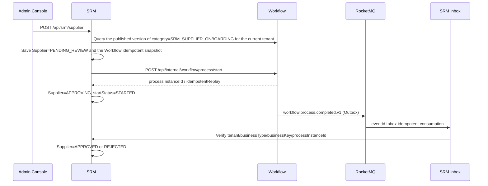

주요 제약:

- 사용자는 모델 버전을 선택하지 않습니다; SRM 은 항상 `SRM_SUPPLIER_ONBOARDING` 으로 현재 게시된 모델을 자동 해석합니다.
- 기본 테넌트에 필요한 모델은 Workflow 시작 초기화 프로그램이 검증하고 게시합니다; 누락 또는 게시 불가 시 Workflow 는 시작에 실패합니다.
- 시작 결과가 불확실한 경우 원래의 `requestId/businessKey/modelVersionId/startUser` 를 유지하고 멱등 재시도만 허용합니다.
- 승인 완료는 신뢰성 이벤트로 라이트백됩니다; 중복, 순서 뒤섞임, 크로스 테넌트 또는 인스턴스 불일치 이벤트는 공급업체 상태를 변경해서는 안 됩니다.

### Flow 15.1: 구매 요청 승인 규칙 구성 및 매칭 시산

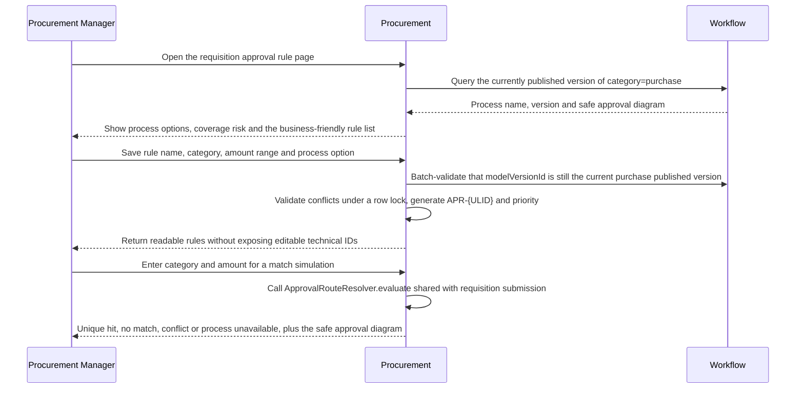

규칙 목록은 Workflow 를 통해 현재 페이지의 모델 버전을 일괄 해석하며, 행별 호출은 금지됩니다. Workflow 가 일시적으로 사용 불가일 때 읽기 전용 목록은 로컬 규칙을 유지하고 `UNAVAILABLE` 로 표시하며, 생성·업데이트·구매 요청 제출은 실패 차단됩니다. 비활성화 또는 삭제 전의 영향 분석은 메모리에서 대상 규칙만 제외하고 데이터베이스는 수정하지 않습니다; 커버리지 알고리즘은 '정확한 품목 우선, 기본 규칙으로 공백 보완' 방식에 따라 0 부터 무한까지의 단절과 충돌을 계산합니다.

## Flow 16: Procurement 구매 요청 승인과 비동기 라이트백

```mermaid
sequenceDiagram
    participant U as Procurement User
    participant P as Procurement
    participant W as Workflow
    participant O as Workflow Outbox
    participant M as RocketMQ
    participant I as Procurement Inbox

    U->>P: Create draft and submit
    P->>P: Re-check material/category, recompute decimal amounts, select approval route
    P->>P: Save approvalAttempt + idempotent start snapshot
    P->>W: Start process with tenant + businessKey={id}:{attempt}
    W-->>P: processInstanceId
    W->>O: Approval-completed event
    O->>M: Reliable relay
    M->>I: eventId Inbox idempotent consumption
    I->>P: APPROVING → APPROVED/REJECTED
    P-->>U: Page polls silently every 5 seconds; manual refresh on timeout
```

명시적으로 실패한 시작은 `FAILED` 로 기록하고 원래 스냅샷을 재사용한 재시도를 허용합니다; 네트워크 결과가 불확실할 때 두 번째 비즈니스 키를 생성해서는 안 됩니다. 페이지는 'Workflow 완료, 비즈니스 상태 동기화 중'과 최종 비즈니스 상태를 구분해야 하며, 짧은 지연을 실패로 표시해서는 안 됩니다.

RFQ 견적 체인은 Procurement 의 초대를 권위로, SRM 의 견적을 권위로 합니다: Portal 은 필요에 따라 초대를 읽고 견적을 제출하며, SRM 은 동일 트랜잭션에서 견적과 Outbox 를 기록하고, Procurement Inbox 는 초대 상태를 업데이트합니다; 선정 전 Procurement 은 현재 견적 버전을 다시 확인하고 불변 스냅샷을 저장한 뒤, 구매 주문을 생성합니다.

## Flow 17: Procurement 입고에서 Asset 카드 생성·이동·처분까지

```mermaid
sequenceDiagram
    participant P as Procurement
    participant O as Procurement Outbox
    participant M as RocketMQ
    participant A as Asset
    participant W as Workflow

    P->>P: Confirm goods receipt / quality check passed
    P->>O: goods-receipt confirmed or quality-passed event
    O->>M: Reliable relay
    M->>A: At-least-once delivery
    A->>A: eventId Inbox + dual idempotency by source line/unit sequence
    A->>A: Create asset card only for PASS + assetManaged + positive integer quantity
    A->>P: Historical candidate cursor backfill (compensation path)
    A->>W: Transfer/disposal auto-resolves model by category and starts idempotently
    W->>M: workflow.process.completed.v1
    M->>A: Approval-result Inbox write-back
    A->>A: Complete operation on approval; restore previousStatus and clear occupancy on rejection/cancellation
```

자산 페이지의 사용자, 조직, 공급업체, 이동/처분 자산은 모두 현재 테넌트와 데이터 범위 내의 검색 후보를 사용합니다; 모델 버전은 서버 측에서 자동 선택됩니다. 이동과 처분은 `active_operation_type/id` 원자적 점유를 공유하며, 모든 종료 경로는 동일 트랜잭션에서 상태를 복원하고 점유를 정리해야 합니다. 금액은 JSON 에서 항상 십진 문자열을 사용합니다.

## Flow 18: SRM 포털 초대 등록과 역할 할당 Saga

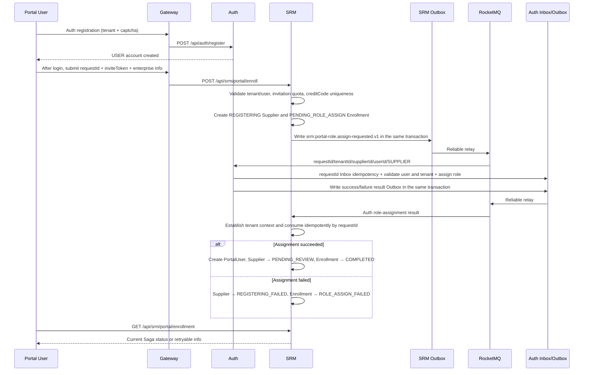

주요 제약:

- USER 는 `srm:portal:enroll` 만 가집니다; 기업 프로필과 평가는 SUPPLIER 권한과 유효한 PortalUser 연관을 모두 갖춰야 합니다.
- inviteToken 원문은 데이터베이스에 저장되지 않고, 로그에 남지 않으며, MQ 에 들어가지 않습니다; 초대 횟수는 버전 조건으로 원자적으로 증가합니다.
- Portal userId 는 내부 owner 필드에 기록해서는 안 됩니다; Portal 공급업체는 내부 담당자 할당 전까지 owner 가 비어 있는 것을 허용합니다.
- 요청과 결과는 모두 Transactional Outbox 를 사용합니다; 컨슈머는 requestId 로 멱등이며, 모든 MQ ThreadLocal 은 finally 에서 정리됩니다.
