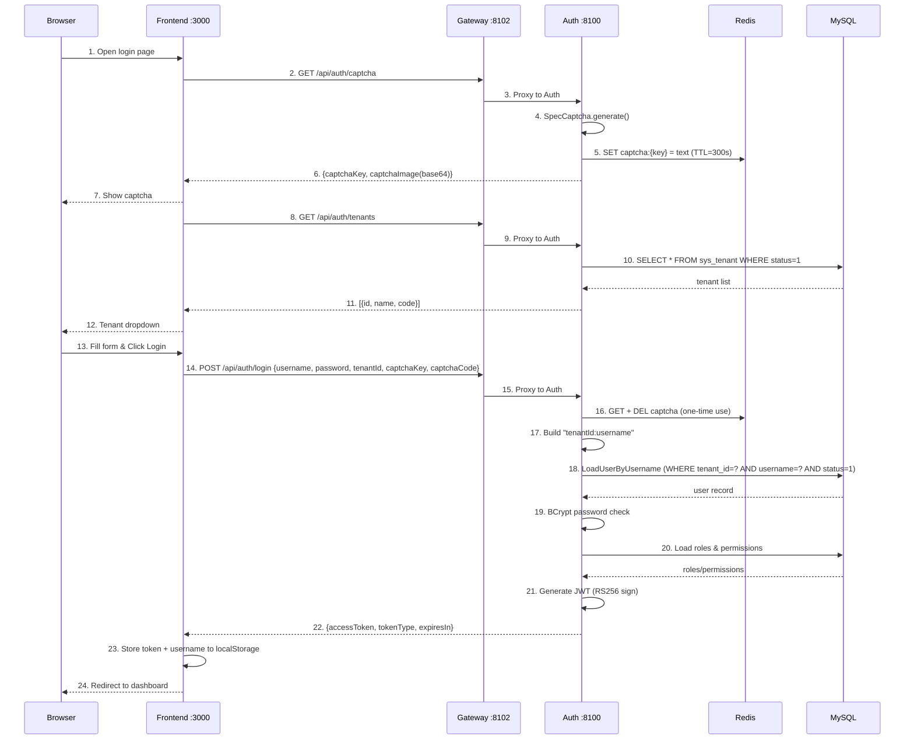
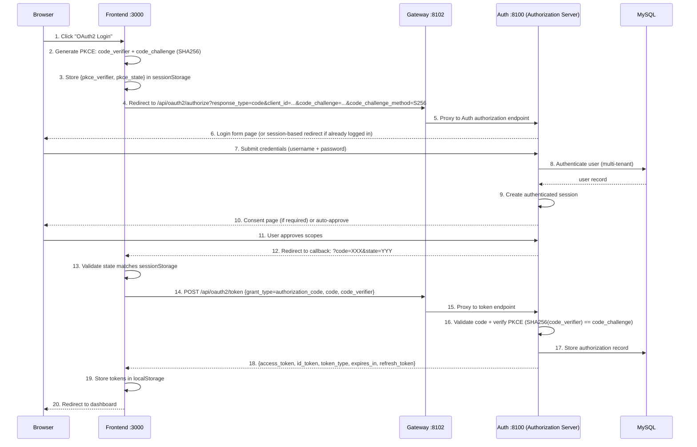
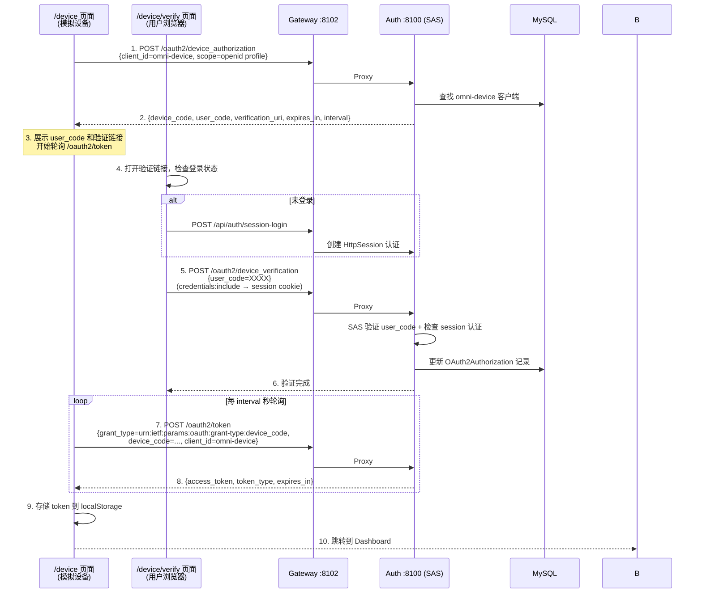

# Core Flows

This document traces the essential user-facing flows end-to-end, from browser interaction to backend processing and back. Use this as a reference when implementing or modifying features.

## Flow 1: User Login (Username + Password + Captcha + JWT)

### Overview

用户通过前端登录页面提交用户名、密码和验证码，经 Gateway 转发到 Auth 服务完成认证，
返回 JWT Token 用于后续请求的身份认证。支持多租户登录（`tenantId:username` 格式）。

### Sequence



<details>
<summary>ASCII 版本（点击展开）</summary>

```
Browser            Frontend :3000          Gateway :8102          Auth :8100           Redis              MySQL
  |                    |                       |                     |                   |                  |
  | 1. Open login page |                       |                     |                   |                  |
  |                    |                       |                     |                   |                  |
  |                    | 2. GET /api/auth/captcha                   |                   |                  |
  |                    |---------------------->|                     |                   |                  |
  |                    |                       | 3. Proxy to Auth    |                   |                  |
  |                    |                       |-------------------->|                   |                  |
  |                    |                       |                     | 4. SpecCaptcha    |                  |
  |                    |                       |                     |    generate()     |                  |
  |                    |                       |                     | 5. SET captcha:   |                  |
  |                    |                       |                     |    {key} = text   |                  |
  |                    |                       |                     |    TTL=300s ----->|                  |
  |                    |                       |                     |                   |                  |
  |                    | 6. {captchaKey, captchaImage(base64)}      |                   |                  |
  |                    |<----------------------|<--------------------|                   |                  |
  | 7. Show captcha    |                       |                     |                   |                  |
  |<-------------------|                       |                     |                   |                  |
  |                    |                       |                     |                   |                  |
  |                    | 8. GET /api/auth/tenants                    |                   |                  |
  |                    |---------------------->|                     |                   |                  |
  |                    |                       | 9. Proxy to Auth    |                   |                  |
  |                    |                       |-------------------->|                   |                  |
  |                    |                       |                     | 10. SELECT * FROM |                  |
  |                    |                       |                     |     sys_tenant    |                  |
  |                    |                       |                     |     WHERE status=1|                  |
  |                    |                       |                     |-------------------------------------->|
  |                    |                       |                     |                   |    tenant list    |
  |                    |                       |                     |<--------------------------------------|
  |                    | 11. [{id,name,code}]  |                     |                   |                  |
  |                    |<----------------------|<--------------------|                   |                  |
  | 12. Tenant dropdown|                       |                     |                   |                  |
  |<-------------------|                       |                     |                   |                  |
  |                    |                       |                     |                   |                  |
  | 13. Fill form      |                       |                     |                   |                  |
  |     (username,     |                       |                     |                   |                  |
  |      password,     |                       |                     |                   |                  |
  |      captcha,      |                       |                     |                   |                  |
  |      tenant)       |                       |                     |                   |                  |
  | 14. Click Login -->|                       |                     |                   |                  |
  |                    |                       |                     |                   |                  |
  |                    | 15. POST /api/auth/login                   |                   |                  |
  |                    |   {username, password, |                   |                   |                  |
  |                    |    tenantId, captchaKey,                   |                   |                  |
  |                    |    captchaCode} ------>|                   |                   |                  |
  |                    |                       | 16. Proxy to Auth   |                   |                  |
  |                    |                       |-------------------->|                   |                  |
  |                    |                       |                     |                   |                  |
  |                    |                       |                     | 17. Validate captcha                  |
  |                    |                       |                     |    GET + DEL ---->|                  |
  |                    |                       |                     |    (one-time use) |                  |
  |                    |                       |                     |                   |                  |
  |                    |                       |                     | 18. Build username as                 |
  |                    |                       |                     |     "tenantId:username"               |
  |                    |                       |                     |     (e.g. "1:admin")                  |
  |                    |                       |                     |                   |                  |
  |                    |                       |                     | 19. LoadUserByUsername                |
  |                    |                       |                     |     Parse tenant + username           |
  |                    |                       |                     |     WHERE tenant_id=? AND             |
  |                    |                       |                     |           username=? AND status=1     |
  |                    |                       |                     |-------------------------------------->|
  |                    |                       |                     |                   |    user record    |
  |                    |                       |                     |<--------------------------------------|
  |                    |                       |                     |                   |                  |
  |                    |                       |                     | 20. BCrypt password check             |
  |                    |                       |                     |                   |                  |
  |                    |                       |                     | 21. Load roles & permissions          |
  |                    |                       |                     |-------------------------------------->|
  |                    |                       |                     |                   |   roles/permissions
  |                    |                       |                     |<--------------------------------------|
  |                    |                       |                     |                   |                  |
  |                    |                       |                     | 22. Generate JWT   |                  |
  |                    |                       |                     |     RS256 sign     |                  |
  |                    |                       |                     |     (RSA private   |                  |
  |                    |                       |                     |      key from JWK) |                  |
  |                    |                       |                     |                   |                  |
  |                    | 23. {accessToken, tokenType:"Bearer",       |                   |                  |
  |                    |      expiresIn:900}   |                     |                   |                  |
  |                    |<----------------------|<--------------------|                   |                  |
  |                    |                       |                     |                   |                  |
  |                    | 24. Store token + username to localStorage |                   |                  |
  |                    |                       |                     |                   |                  |
  | 25. Redirect to    |                       |                     |                   |                  |
  |     dashboard      |                       |                     |                   |                  |
  |<-------------------|                       |                     |                   |                  |
  |                    |                       |                     |                   |                  |
```

</details>

### Post-Login: Authenticated Request Flow

登录成功后，前端所有 API 请求自动携带 JWT Token，Gateway 负责验证：

```
Browser            Frontend               Gateway :8102           Downstream Service
  |                    |                       |                        |
  | 1. Navigate to     |                       |                        |
  |    protected page  |                       |                        |
  |                    | 2. Axios GET          |                        |
  |                    |    Authorization:      |                        |
  |                    |    Bearer <JWT> ------>|                        |
  |                    |                       |                        |
  |                    |                       | 3. AuthFilter:         |
  |                    |                       |    - Extract Bearer token
  |                    |                       |    - Get RSA public key |
  |                    |                       |      (from JwkKeyProvider,
  |                    |                       |       cached 5min TTL)  |
  |                    |                       |    - RSASSAVerifier:   |
  |                    |                       |      verify RS256 sig  |
  |                    |                       |    - Check exp claim   |
  |                    |                       |                        |
  |                    |                       | 4. Inject headers:     |
  |                    |                       |    X-User-Id: 1        |
  |                    |                       |    X-Tenant-Id: 1      |
  |                    |                       |    X-User-Name: admin  |
  |                    |                       |    X-User-Roles: admin |
  |                    |                       |    X-User-Scopes: read |
  |                    |                       |                        |
  |                    |                       | 5. Forward request --->|
  |                    |                       |                        |
  |                    |                       |    6. Response <-------|
  |                    | 7. JSON data <--------|                        |
  | 8. Render page     |                       |                        |
  |<-------------------|                       |                        |
```

### Key Components

| Step | File | Logic |
|------|------|-------|
| Form UI | `src/views/login/LoginForm.vue` | Element Plus form: username, password, captcha, tenant dropdown |
| Captcha load | `src/views/login/LoginForm.vue` | `GET /api/auth/captcha` -> display base64 PNG, store captchaKey |
| Tenant load | `src/views/login/LoginForm.vue` | `GET /api/auth/tenants` -> populate `<el-select>` dropdown |
| Login submit | `src/views/login/LoginForm.vue` | `handleLogin()`: validate form -> POST `/api/auth/login` |
| Token storage | `src/stores/user.ts` | `setToken()` + `setUsername()` persist to `localStorage` |
| Request auth | `src/api/request.ts` | Axios request interceptor: `Authorization: Bearer <token>` |
| Vite proxy | `vite.config.ts` | `/api` -> `http://localhost:8102` (Gateway) |
| Gateway filter | `AuthFilter.java` | JWT RS256 签名验证 + claims 提取 + 身份头注入 |
| JWK provider | `JwkKeyProvider.java` | 从 Auth `/oauth2/jwks` 获取 RSA 公钥，缓存 5 分钟 |
| Captcha service | `CaptchaServiceImpl.java` | SpecCaptcha 生成 + Redis 存储（TTL 300s，一次性使用） |
| Auth controller | `AuthController.java` | `POST /login`: captcha -> authenticate -> roles -> JWT |
| User details | `OmniUserDetailsService.java` | 多租户解析 `tenantId:username` + BCrypt 密码校验 |
| JWT service | `JwtTokenServiceImpl.java` | RSA 私钥签名，生成包含用户身份和权限的 JWT |

### JWT Token Structure

Auth 服务签发的 JWT 包含以下 claims：

```json
{
  "header": {
    "alg": "RS256",
    "kid": "<key-id-from-jwk>"
  },
  "payload": {
    "sub": "1",
    "tenant_id": "1",
    "username": "admin",
    "roles": ["admin"],
    "scope": "read write",
    "iat": 1748000000,
    "exp": 1748000900
  }
}
```

| Claim | Description |
|-------|-------------|
| `sub` | 用户 ID（`sys_user.id`） |
| `tenant_id` | 租户 ID（`sys_tenant.id`） |
| `username` | 登录用户名 |
| `roles` | 用户角色列表（如 `["admin", "editor"]`） |
| `scope` | 权限范围，空格分隔 |
| `iat` | 签发时间（Unix timestamp） |
| `exp` | 过期时间（`iat` + 900 秒 = 15 分钟） |

### Multi-Tenant Login Mechanism

登录时通过 `tenantId` 参数指定租户，Auth 服务内部将用户名格式化为 `tenantId:username`（如 `1:admin`），
由 `OmniUserDetailsService.loadUserByUsername()` 解析：

```
前端提交: { username: "admin", tenantId: 1 }
  -> AuthController 构造: "1:admin"
  -> OmniUserDetailsService 解析: tenantId=1, actualUsername="admin"
  -> SQL: SELECT * FROM sys_user WHERE tenant_id=1 AND username='admin' AND status=1
```

如果不包含 `:`（直接用户名登录），默认 `tenantId=1`，保证向后兼容。

### Captcha Lifecycle

```
1. 生成: SpecCaptcha -> base64 PNG
2. 存储: Redis SET captcha:{uuid} = "a3f8" EX 300
3. 验证: Redis GET captcha:{uuid} -> DELETE captcha:{uuid}（一次性使用，防重放）
   - key 不存在 -> "Captcha expired"（过期或已使用）
   - 值不匹配   -> "Invalid captcha"
```

### Current Status

- **Login**: 完整实现，验证码 + 多租户 + JWT Token 签发
- **Gateway JWT 验证**: 完整实现，RS256 签名检查 + claims 提取 + 身份头注入
- **前端**: 所有 mock 代码已移除，对接真实 API
- **Token 有效期**: 15 分钟（900 秒），暂无 refresh token 机制

## Flow 2: OAuth2 Authorization Code + PKCE Login

### Overview

前端作为 OAuth2 公共客户端（SPA），通过 Spring Authorization Server 的 OAuth2 授权端点完成 PKCE 授权码流程。
用户在 Auth 服务的授权确认页面同意后，前端用授权码 + code_verifier 换取 access_token 和 id_token。
适用于第三方集成或需要 OAuth2 标准化认证的场景。

### Sequence



### Key Components

| Step | File | Logic |
|------|------|-------|
| PKCE generator | `src/utils/oauth2.ts` | 生成 code_verifier（43-128 字符随机串）+ SHA256 code_challenge |
| PKCE storage | `src/utils/oauth2.ts` | sessionStorage 存储 `pkce_verifier` 和 `pkce_state` |
| Authorization redirect | `src/utils/oauth2.ts` | 构造 `/oauth2/authorize` URL，携带 PKCE 参数 |
| Token exchange | `src/api/auth.ts` | POST `/oauth2/token`，code_verifier 发送给 Auth 服务验证 |
| Token storage | `src/stores/user.ts` | 存储 access_token + id_token 到 localStorage |
| Authorization endpoint | Spring Authorization Server | `/oauth2/authorize` — 登录表单 + 授权确认 |
| Token endpoint | Spring Authorization Server | `/oauth2/token` — 授权码换 Token |
| PKCE validator | Spring Authorization Server | SHA256(code_verifier) 与存储的 code_challenge 比对 |

### PKCE Storage Keys

| sessionStorage Key | Description | Lifecycle |
|--------------------|-------------|-----------|
| `pkce_verifier` | 随机 code_verifier 字符串 | 授权发起时写入，token 换取后删除 |
| `pkce_state` | CSRF 防护 state 参数 | 授权发起时写入，callback 验证后删除 |

### Current Status

- **Authorization Server**: Spring Authorization Server 7.x 已配置，RS256 JWK 签名
- **OAuth2 客户端**: `omni-spa` 客户端已注册（authorization_code + PKCE grant type）
- **前端 PKCE 工具**: `src/utils/oauth2.ts` 已实现 verifier/challenge 生成和 token 交换
- **Token 类型**: access_token (opaque) + id_token (JWT, 包含用户信息)

---

## Flow 3: OAuth2 Device Authorization Grant

### 概述

设备授权模式（RFC 8628）适用于没有浏览器或输入受限的设备（IoT、CLI 工具等）。设备端通过 `/oauth2/device_authorization` 获取 `device_code` 和 `user_code`，用户在另一台设备上输入 `user_code` 完成授权，设备端轮询 `/oauth2/token` 获取访问令牌。

前端提供模拟入口（`/device` 页面），方便在浏览器中测试完整的设备授权流程。

### 时序图



### 关键组件

| 步骤 | 文件 | 职责 |
|------|------|------|
| 设备授权请求 | `src/api/auth.ts` → `requestDeviceAuthorization()` | POST `/oauth2/device_authorization`，获取设备码 |
| Token 轮询 | `src/api/auth.ts` → `pollDeviceToken()` | POST `/oauth2/token`，处理 `authorization_pending` |
| 设备模拟器页面 | `src/views/device/index.vue` | 展示 user_code + 倒计时 + 轮询 |
| 设备验证页面 | `src/views/device/verify.vue` | 内嵌登录 + user_code 输入 + 授权确认 |
| 登录页入口 | `src/components/LoginForm.vue` | 「设备授权登录」按钮 |
| 设备授权端点 | Spring Authorization Server | `/oauth2/device_authorization` — SAS 内置 |
| 设备验证端点 | Spring Authorization Server | `/oauth2/device_verification` — SAS 内置 |
| 设备客户端 | `DeviceClientInitializer.java` | 启动时注册 `omni-device` 客户端 |
| 重定向过滤器 | `AuthorizationServerConfig.java` | 未认证用户重定向到前端验证页 |

### 设备客户端配置

| 配置项 | 值 |
|--------|-----|
| Client ID | `omni-device` |
| 认证方式 | `NONE`（公有客户端，无 clientSecret） |
| 授权类型 | `urn:ietf:params:oauth:grant-type:device_code` + `refresh_token` |
| 作用域 | `openid`, `profile` |
| 要求 PKCE | `false` |
| 要求授权同意 | `false`（用户点击"授权"即视为同意，无需 SAS 额外同意表单） |

### 轮询行为

| 错误码 | 含义 | 处理方式 |
|--------|------|----------|
| `authorization_pending` | 用户尚未完成授权 | 继续轮询 |
| `slow_down` | 轮询频率过快 | 继续轮询（SAS 自动增加 interval） |
| `expired_token` | device_code 已过期 | 停止轮询，提示用户重新发起 |
| `access_denied` | 用户拒绝授权 | 停止轮询，提示用户 |

### Current Status

- **设备授权端点**: SAS 7 已通过 `deviceAuthorizationEndpoint(Customizer.withDefaults())` 启用
- **设备验证端点**: SAS 7 已通过 `deviceVerificationEndpoint(Customizer.withDefaults())` 启用
- **设备客户端**: `omni-device` 客户端由 `DeviceClientInitializer` 在启动时自动注册
- **前端页面**: `/device`（设备模拟器）和 `/device/verify`（验证页）已实现
- **登录入口**: 登录页新增「设备授权登录」按钮
