# 核心业务流程

> 本文档端到端追踪关键用户流程，从浏览器交互到后端处理再返回。实现或修改功能时以此为参考。  
> 架构概览详见 [architecture.md](architecture.md)。Docker 部署配置详见 [docker-deployment.md](docker-deployment.md)。API 契约详见 [api-contract.md](api-contract.md)。

## Flow 1: 用户登录（用户名 + 密码 + 验证码 + JWT）

### 概述

用户通过前端登录页面提交用户名、密码和验证码，经 Gateway 转发到 Auth 服务完成认证，
返回 JWT Token 用于后续请求的身份认证。支持多租户登录（`tenantId:username` 格式）。

### 时序图

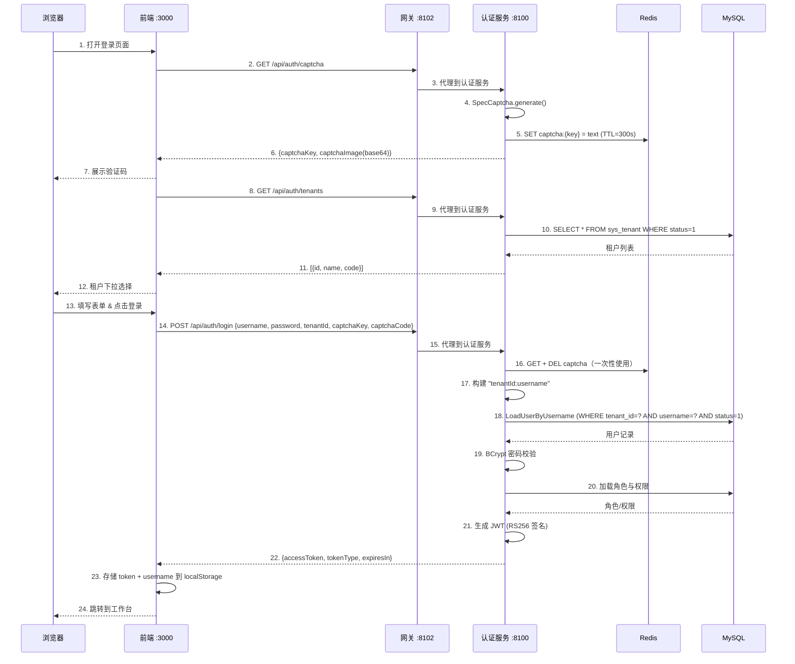

<details>
<summary>ASCII 版本（点击展开）</summary>

```
浏览器               前端 :3000             网关 :8102            认证服务 :8100        Redis              MySQL
  |                    |                       |                     |                   |                  |
  | 1. 打开登录页面    |                       |                     |                   |                  |
  |                    |                       |                     |                   |                  |
  |                    | 2. GET /api/auth/captcha                   |                   |                  |
  |                    |---------------------->|                     |                   |                  |
  |                    |                       | 3. 代理到认证服务   |                   |                  |
  |                    |                       |-------------------->|                   |                  |
  |                    |                       |                     | 4. SpecCaptcha    |                  |
  |                    |                       |                     |    generate()     |                  |
  |                    |                       |                     | 5. SET captcha:   |                  |
  |                    |                       |                     |    {key} = text   |                  |
  |                    |                       |                     |    TTL=300s ----->|                  |
  |                    |                       |                     |                   |                  |
  |                    | 6. {captchaKey, captchaImage(base64)}      |                   |                  |
  |                    |<----------------------|<--------------------|                   |                  |
  | 7. 展示验证码      |                       |                     |                   |                  |
  |<-------------------|                       |                     |                   |                  |
  |                    |                       |                     |                   |                  |
  |                    | 8. GET /api/auth/tenants                    |                   |                  |
  |                    |---------------------->|                     |                   |                  |
  |                    |                       | 9. 代理到认证服务   |                   |                  |
  |                    |                       |-------------------->|                   |                  |
  |                    |                       |                     | 10. SELECT * FROM |                  |
  |                    |                       |                     |     sys_tenant    |                  |
  |                    |                       |                     |     WHERE status=1|                  |
  |                    |                       |                     |-------------------------------------->|
  |                    |                       |                     |                   |    租户列表       |
  |                    |                       |                     |<--------------------------------------|
  |                    | 11. [{id,name,code}]  |                     |                   |                  |
  |                    |<----------------------|<--------------------|                   |                  |
  | 12. 租户下拉选择   |                       |                     |                   |                  |
  |<-------------------|                       |                     |                   |                  |
  |                    |                       |                     |                   |                  |
  | 13. 填写表单       |                       |                     |                   |                  |
  |     (用户名,       |                       |                     |                   |                  |
  |      密码,         |                       |                     |                   |                  |
  |      验证码,       |                       |                     |                   |                  |
  |      租户)         |                       |                     |                   |                  |
  | 14. 点击登录 ----->|                       |                     |                   |                  |
  |                    |                       |                     |                   |                  |
  |                    | 15. POST /api/auth/login                   |                   |                  |
  |                    |   {username, password, |                   |                   |                  |
  |                    |    tenantId, captchaKey,                   |                   |                  |
  |                    |    captchaCode} ------>|                   |                   |                  |
  |                    |                       | 16. 代理到认证服务  |                   |                  |
  |                    |                       |-------------------->|                   |                  |
  |                    |                       |                     |                   |                  |
  |                    |                       |                     | 17. 验证码校验    |                  |
  |                    |                       |                     |    GET + DEL ---->|                  |
  |                    |                       |                     |    (一次性使用)   |                  |
  |                    |                       |                     |                   |                  |
  |                    |                       |                     | 18. 构建用户名为  |                  |
  |                    |                       |                     |     "tenantId:username"               |
  |                    |                       |                     |     (如 "1:admin")                    |
  |                    |                       |                     |                   |                  |
  |                    |                       |                     | 19. LoadUserByUsername                |
  |                    |                       |                     |     解析租户 + 用户名                  |
  |                    |                       |                     |     WHERE tenant_id=? AND             |
  |                    |                       |                     |           username=? AND status=1     |
  |                    |                       |                     |-------------------------------------->|
  |                    |                       |                     |                   |    用户记录       |
  |                    |                       |                     |<--------------------------------------|
  |                    |                       |                     |                   |                  |
  |                    |                       |                     | 20. BCrypt 密码校验                   |
  |                    |                       |                     |                   |                  |
  |                    |                       |                     | 21. 加载角色与权限                     |
  |                    |                       |                     |-------------------------------------->|
  |                    |                       |                     |                   |   角色/权限       |
  |                    |                       |                     |<--------------------------------------|
  |                    |                       |                     |                   |                  |
  |                    |                       |                     | 22. 生成 JWT      |                  |
  |                    |                       |                     |     RS256 签名    |                  |
  |                    |                       |                     |     (RSA 私钥     |                  |
  |                    |                       |                     |      来自 JWK)    |                  |
  |                    |                       |                     |                   |                  |
  |                    | 23. {accessToken, tokenType:"Bearer",       |                   |                  |
  |                    |      expiresIn:900}   |                     |                   |                  |
  |                    |<----------------------|<--------------------|                   |                  |
  |                    |                       |                     |                   |                  |
  |                    | 24. 存储 token + username 到 localStorage   |                   |                  |
  |                    |                       |                     |                   |                  |
  | 25. 跳转到         |                       |                     |                   |                  |
  |     工作台         |                       |                     |                   |                  |
  |<-------------------|                       |                     |                   |                  |
  |                    |                       |                     |                   |                  |
```

</details>

### 登录后：认证请求流程

登录成功后，前端所有 API 请求自动携带 JWT Token，Gateway 负责验证：

```
浏览器               前端                   网关 :8102             下游服务
  |                    |                       |                        |
  | 1. 导航到          |                       |                        |
  |    受保护页面      |                       |                        |
  |                    | 2. Axios GET          |                        |
  |                    |    Authorization:      |                        |
  |                    |    Bearer <JWT> ------>|                        |
  |                    |                       |                        |
  |                    |                       | 3. AuthFilter:         |
  |                    |                       |    - 提取 Bearer token  |
  |                    |                       |    - 获取 RSA 公钥     |
  |                    |                       |      (来自 JwkKeyProvider，
  |                    |                       |       缓存 5 分钟 TTL)  |
  |                    |                       |    - RSASSAVerifier:   |
  |                    |                       |      验证 RS256 签名    |
  |                    |                       |    - 检查 exp 声明     |
  |                    |                       |                        |
  |                    |                       | 4. 注入请求头:          |
  |                    |                       |    X-User-Id: 1        |
  |                    |                       |    X-Tenant-Id: 1      |
  |                    |                       |    X-User-Name: admin  |
  |                    |                       |    X-User-Roles: admin |
  |                    |                       |    X-User-Scopes: read |
  |                    |                       |                        |
  |                    |                       | 5. 转发请求 ---------->|
  |                    |                       |                        |
  |                    |                       |    6. 响应 <-----------|
  |                    | 7. JSON 数据 <--------|                        |
  | 8. 渲染页面        |                       |                        |
  |<-------------------|                       |                        |
```

### 关键组件

| 步骤 | 文件 | 逻辑 |
|------|------|------|
| 表单 UI | `src/views/login/LoginForm.vue` | Element Plus 表单：用户名、密码、验证码、租户下拉 |
| 验证码加载 | `src/views/login/LoginForm.vue` | `GET /api/auth/captcha` -> 展示 base64 PNG，存储 captchaKey |
| 租户加载 | `src/views/login/LoginForm.vue` | `GET /api/auth/tenants` -> 填充 `<el-select>` 下拉框 |
| 登录提交 | `src/views/login/LoginForm.vue` | `handleLogin()`：校验表单 -> POST `/api/auth/login` |
| Token 存储 | `src/stores/user.ts` | `setToken()` + `setUsername()` 持久化到 `localStorage` |
| 请求鉴权 | `src/api/request.ts` | Axios 请求拦截器：`Authorization: Bearer <token>` |
| Vite 代理 | `vite.config.ts` | `/api` -> `http://localhost:8102`（Gateway） |
| 网关过滤器 | `AuthFilter.java` | JWT RS256 签名验证 + claims 提取 + 身份头注入 |
| JWK 提供者 | `JwkKeyProvider.java` | 从 Auth `/oauth2/jwks` 获取 RSA 公钥，缓存 5 分钟 |
| 验证码服务 | `CaptchaServiceImpl.java` | SpecCaptcha 生成 + Redis 存储（TTL 300s，一次性使用） |
| 认证控制器 | `AuthController.java` | `POST /login`：验证码 -> 认证 -> 角色 -> JWT |
| 用户详情 | `OmniUserDetailsService.java` | 多租户解析 `tenantId:username` + BCrypt 密码校验 |
| JWT 服务 | `JwtTokenServiceImpl.java` | RSA 私钥签名，生成包含用户身份和权限的 JWT |

### JWT Token 结构

Auth 服务签发的 JWT 包含以下 claims：

```json
{
  "header": {
    "alg": "RS256",
    "kid": "<key-id-from-jwk>"
  },
  "payload": {
    "sub": "1",
    "tenant_id": "1",
    "username": "admin",
    "roles": ["admin"],
    "scope": "read write",
    "iat": 1748000000,
    "exp": 1748000900
  }
}
```

| 声明 | 说明 |
|------|------|
| `sub` | 用户 ID（`sys_user.id`） |
| `tenant_id` | 租户 ID（`sys_tenant.id`） |
| `username` | 登录用户名 |
| `roles` | 用户角色列表（如 `["admin", "editor"]`） |
| `scope` | 权限范围，空格分隔 |
| `iat` | 签发时间（Unix timestamp） |
| `exp` | 过期时间（`iat` + 900 秒 = 15 分钟） |

### 多租户登录机制

登录时通过 `tenantId` 参数指定租户，Auth 服务内部将用户名格式化为 `tenantId:username`（如 `1:admin`），
由 `OmniUserDetailsService.loadUserByUsername()` 解析：

```
前端提交: { username: "admin", tenantId: 1 }
  -> AuthController 构造: "1:admin"
  -> OmniUserDetailsService 解析: tenantId=1, actualUsername="admin"
  -> SQL: SELECT * FROM sys_user WHERE tenant_id=1 AND username='admin' AND status=1
```

如果不包含 `:`（直接用户名登录），默认 `tenantId=1`，保证向后兼容。

### 验证码生命周期

```
1. 生成: SpecCaptcha -> base64 PNG
2. 存储: Redis SET captcha:{uuid} = "a3f8" EX 300
3. 验证: Redis GET captcha:{uuid} -> DELETE captcha:{uuid}（一次性使用，防重放）
   - key 不存在 -> "Captcha expired"（过期或已使用）
   - 值不匹配   -> "Invalid captcha"
```

### 当前状态

- **登录**：完整实现，验证码 + 多租户 + JWT Token 签发
- **Gateway JWT 验证**：完整实现，RS256 签名检查 + claims 提取 + 身份头注入
- **前端**：所有 mock 代码已移除，对接真实 API
- **Token 有效期**：15 分钟（900 秒），暂无 refresh token 机制

## Flow 2: OAuth2 授权码 + PKCE 登录

### 概述

前端作为 OAuth2 公共客户端（SPA），通过 Spring Authorization Server 的 OAuth2 授权端点完成 PKCE 授权码流程。
用户在 Auth 服务的授权确认页面同意后，前端用授权码 + code_verifier 换取 access_token 和 id_token。
适用于第三方集成或需要 OAuth2 标准化认证的场景。

### 时序图

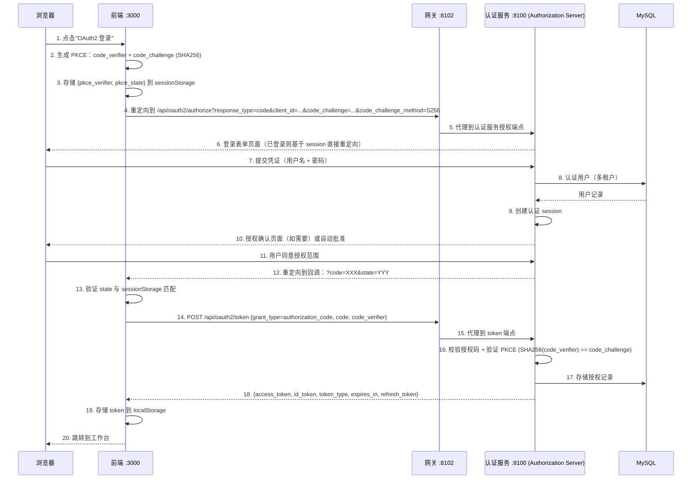

### 关键组件

| 步骤 | 文件 | 逻辑 |
|------|------|------|
| PKCE 生成器 | `src/utils/oauth2.ts` | 生成 code_verifier（43-128 字符随机串）+ SHA256 code_challenge |
| PKCE 存储 | `src/utils/oauth2.ts` | sessionStorage 存储 `pkce_verifier` 和 `pkce_state` |
| 授权重定向 | `src/utils/oauth2.ts` | 构造 `/oauth2/authorize` URL，携带 PKCE 参数 |
| Token 交换 | `src/api/auth.ts` | POST `/oauth2/token`，code_verifier 发送给 Auth 服务验证 |
| Token 存储 | `src/stores/user.ts` | 存储 access_token + id_token 到 localStorage |
| 授权端点 | Spring Authorization Server | `/oauth2/authorize` — 登录表单 + 授权确认 |
| Token 端点 | Spring Authorization Server | `/oauth2/token` — 授权码换 Token |
| PKCE 校验器 | Spring Authorization Server | SHA256(code_verifier) 与存储的 code_challenge 比对 |

### PKCE 存储键

| sessionStorage 键 | 说明 | 生命周期 |
|-------------------|------|----------|
| `pkce_verifier` | 随机 code_verifier 字符串 | 授权发起时写入，token 换取后删除 |
| `pkce_state` | CSRF 防护 state 参数 | 授权发起时写入，callback 验证后删除 |

### 当前状态

- **Authorization Server**：Spring Authorization Server 7.x 已配置，RS256 JWK 签名
- **OAuth2 客户端**：`omni-spa` 客户端已注册（authorization_code + PKCE grant type）
- **前端 PKCE 工具**：`src/utils/oauth2.ts` 已实现 verifier/challenge 生成和 token 交换
- **Token 类型**：access_token (opaque) + id_token (JWT, 包含用户信息)

---

## Flow 3: OAuth2 设备授权许可

### 概述

设备授权模式（RFC 8628）适用于没有浏览器或输入受限的设备（IoT、CLI 工具等）。设备端通过 `/oauth2/device_authorization` 获取 `device_code` 和 `user_code`，用户在另一台设备上输入 `user_code` 完成授权，设备端轮询 `/oauth2/token` 获取访问令牌。

前端提供模拟入口（`/device` 页面），方便在浏览器中测试完整的设备授权流程。

### 时序图

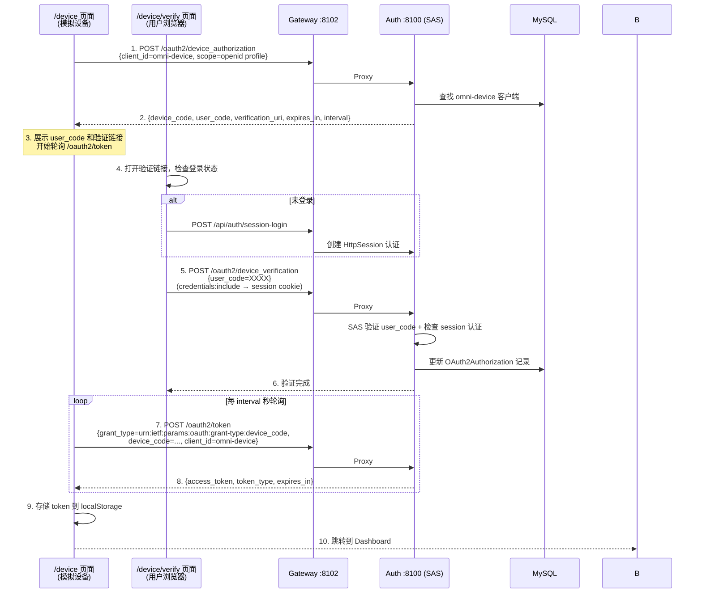

### 关键组件

| 步骤 | 文件 | 职责 |
|------|------|------|
| 设备授权请求 | `src/api/auth.ts` → `requestDeviceAuthorization()` | POST `/oauth2/device_authorization`，获取设备码 |
| Token 轮询 | `src/api/auth.ts` → `pollDeviceToken()` | POST `/oauth2/token`，处理 `authorization_pending` |
| 设备模拟器页面 | `src/views/device/index.vue` | 展示 user_code + 倒计时 + 轮询 |
| 设备验证页面 | `src/views/device/verify.vue` | 内嵌登录 + user_code 输入 + 授权确认 |
| 登录页入口 | `src/components/LoginForm.vue` | 「设备授权登录」按钮 |
| 设备授权端点 | Spring Authorization Server | `/oauth2/device_authorization` — SAS 内置 |
| 设备验证端点 | Spring Authorization Server | `/oauth2/device_verification` — SAS 内置 |
| 设备客户端 | `DeviceClientInitializer.java` | 启动时注册 `omni-device` 客户端 |
| 重定向过滤器 | `AuthorizationServerConfig.java` | 未认证用户重定向到前端验证页 |

### 设备客户端配置

| 配置项 | 值 |
|--------|-----|
| Client ID | `omni-device` |
| 认证方式 | `NONE`（公有客户端，无 clientSecret） |
| 授权类型 | `urn:ietf:params:oauth:grant-type:device_code` + `refresh_token` |
| 作用域 | `openid`, `profile` |
| 要求 PKCE | `false` |
| 要求授权同意 | `false`（用户点击"授权"即视为同意，无需 SAS 额外同意表单） |

### 轮询行为

| 错误码 | 含义 | 处理方式 |
|--------|------|----------|
| `authorization_pending` | 用户尚未完成授权 | 继续轮询 |
| `slow_down` | 轮询频率过快 | 继续轮询（SAS 自动增加 interval） |
| `expired_token` | device_code 已过期 | 停止轮询，提示用户重新发起 |
| `access_denied` | 用户拒绝授权 | 停止轮询，提示用户 |

### 当前状态

- **设备授权端点**：SAS 7 已通过 `deviceAuthorizationEndpoint(Customizer.withDefaults())` 启用
- **设备验证端点**：SAS 7 已通过 `deviceVerificationEndpoint(Customizer.withDefaults())` 启用
- **设备客户端**：`omni-device` 客户端由 `DeviceClientInitializer` 在启动时自动注册
- **前端页面**：`/device`（设备模拟器）和 `/device/verify`（验证页）已实现
- **登录入口**：登录页新增「设备授权登录」按钮

---

## Flow 4: OAuth2 社交登录（GitHub / Google / Gitee）

### 概述

用户通过 GitHub、Google 或 Gitee 账号一键登录系统。后端采用策略模式（Strategy Pattern），通过 `OAuth2ProviderHandler` 接口定义统一的 `buildAuthorizationUrl` / `exchangeCodeForAccessToken` / `fetchUserProfile` 方法，各提供商实现为独立的 `@Component`，由 Spring 的 `Map<String, OAuth2ProviderHandler>` 自动注入实现多提供商分发。当前已实现 GitHub、Google 和 Gitee 三个提供商，前端 WeChat 登录按钮为占位（暂未实现后端 Handler）。

前端发起 `window.location.href` 导航到 Auth 服务的 `/api/auth/oauth2/{provider}` 端点，Auth 服务根据 provider 参数选择对应的 Handler 实现，生成 HMAC 签名的 state 参数后 302 重定向到第三方授权页面。用户在第三方平台授权后，回调 Auth 服务，Auth 通过 Handler 完成 state 验证 → token 交换 → 用户信息获取 → 本地用户查找或自动创建 → JWT 签发，最终 302 重定向到前端回调页面（URL fragment 携带 JWT）。

### 时序图

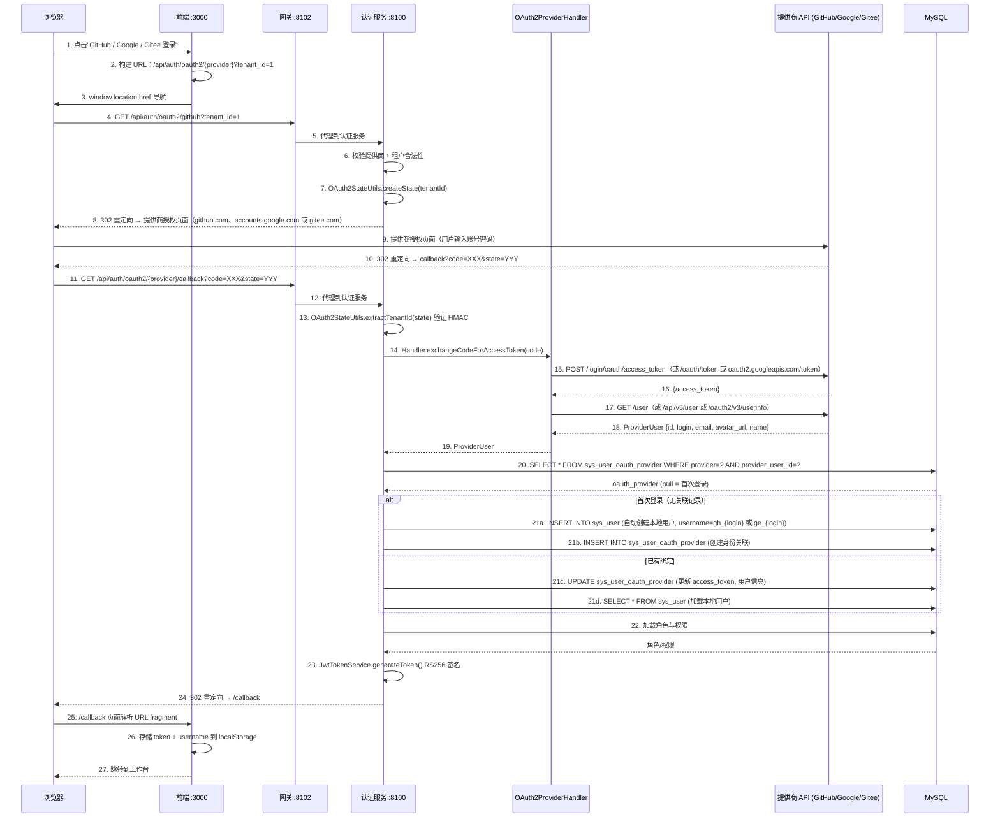

<details>
<summary>ASCII 版本（点击展开）</summary>

```
浏览器               前端 :3000             网关 :8102            认证服务 :8100        提供商 API          MySQL
  |                    |                       |                     |                     |                   |
  | 1. 点击社交        |                       |                     |                     |                   |
  |    登录按钮        |                       |                     |                     |                   |
  |                    | 2. 构建 URL           |                     |                     |                   |
  |                    |    /api/auth/oauth2/  |                     |                     |                   |
  |                    |    {provider}?tenant_id=1                   |                     |                   |
  | 3. window.location |                       |                     |                     |                   |
  |    .href --------->|                       |                     |                     |                   |
  |                    |                       |                     |                     |                   |
  | 4. GET /api/auth/oauth2/{provider}?tenant_id=1                   |                   |
  |                    |                       |                     |                     |                   |
  |                    |                       | 5. 代理             |                     |                   |
  |                    |                       |-------------------->|                     |                   |
  |                    |                       |                     | 6. 校验提供商       |                   |
  |                    |                       |                     |    + 租户           |                   |
  |                    |                       |                     | 7. createState()    |                   |
  |                    |                       |                     |    HMAC-SHA256 签名 |                   |
  |                    |                       |                     |                     |                   |
  | 8. 302 重定向 -> 提供商授权页面 (github.com, accounts.google.com 或 gitee.com)        |                   |
  |                    |                       |                     |                     |                   |
  | 9. 提供商登录      |                       |                     |                     |                   |
  |    (用户名/密码)   |                       |                     |                     |                   |
  |--------------------|-------------------------------------------->|------------------------------------------>|
  |                    |                       |                     |                     |                   |
  | 10. 302 callback?code=XXX&state=YYY        |                     |                     |                   |
  |<---------------------------------------------------------------------------------------|                   |
  |                    |                       |                     |                     |                   |
  | 11. GET /api/auth/oauth2/{provider}/callback                     |                     |                   |
  |--------------------|---------------------->|                     |                     |                   |
  |                    |                       | 12. 代理            |                     |                   |
  |                    |                       |-------------------->|                     |                   |
  |                    |                       |                     |                     |                   |
  |                    |                       |                     | 13. 验证 state      |                   |
  |                    |                       |                     |     HMAC 签名       |                   |
  |                    |                       |                     |                     |                   |
  |                    |                       |                     | 14-19. Handler：交换授权码，             |
  |                    |                       |                     |   获取 access_token，获取用户资料        |
  |                    |                       |                     |-------------------->|                   |
  |                    |                       |                     |    ProviderUser     |                   |
  |                    |                       |                     |<--------------------|                   |
  |                    |                       |                     |                     |                   |
  |                    |                       |                     | 20. 查找 OAuth 提供商                  |
  |                    |                       |                     |------------------------------------------>|
  |                    |                       |                     |                     |    oauth_provider   |
  |                    |                       |                     |<------------------------------------------|
  |                    |                       |                     |                     |                   |
  |                    |                       |                     | 21. 创建/更新用户 + OAuth 关联           |
  |                    |                       |                     |------------------------------------------>|
  |                    |                       |                     |                     |                   |
  |                    |                       |                     | 22. 加载角色/权限    |                   |
  |                    |                       |                     |------------------------------------------>|
  |                    |                       |                     |                     |   角色/权限        |
  |                    |                       |                     |<------------------------------------------|
  |                    |                       |                     |                     |                   |
  |                    |                       |                     | 23. 生成 JWT (RS256)                    |
  |                    |                       |                     |                     |                   |
  | 24. 302 /callback#token=JWT&username=xxx                         |                     |                   |
  |<---------------------------------------------------------------------------------------|                   |
  |                    |                       |                     |                     |                   |
  | 25. /callback 页面 |                       |                     |                     |                   |
  |    解析 fragment   |                       |                     |                     |                   |
  |                    | 26. 存储 token         |                     |                     |                   |
  |                    |     到 localStorage    |                     |                     |                   |
  | 27. 跳转到         |                       |                     |                     |                   |
  |     工作台         |                       |                     |                     |                   |
  |<-------------------|                       |                     |                     |                   |
```

</details>

### 关键组件

| 步骤 | 文件 | 职责 |
|------|------|------|
| 登录按钮 | `src/components/LoginForm.vue` | "GitHub / Google / Gitee" 第三方登录按钮，调用 `getThirdPartyLoginUrl()` |
| 前端发起 | `src/api/auth.ts` | `getThirdPartyLoginUrl(provider, tenantId)` 构建重定向 URL |
| 回调页面 | `src/views/callback/index.vue` | 解析 URL fragment 中的 JWT，存储到 localStorage |
| 登录发起端点 | `SocialLoginController.java` | `GET /api/auth/oauth2/{provider}` — state 生成 + 302 重定向 |
| 回调处理端点 | `SocialLoginController.java` | `GET /api/auth/oauth2/{provider}/callback` — token 交换 + 用户创建 + JWT 签发 |
| 业务编排 | `SocialLoginServiceImpl.java` | 完整回调流程：state 验证 → Handler 分发 → 用户查找/创建 → JWT |
| 策略接口 | `OAuth2ProviderHandler.java` | 策略接口，定义 `buildAuthorizationUrl` / `exchangeCodeForAccessToken` / `fetchUserProfile` |
| GitHub 实现 | `GitHubOAuth2Handler.java` | GitHub OAuth2 实现（`@Component("github")`），构建授权 URL、换取 access_token、获取用户资料 |
| Google 实现 | `GoogleOAuth2Handler.java` | Google OAuth2 实现（`@Component("google")`），通过本地代理访问 Google API，从邮箱派生用户名 |
| Gitee 实现 | `GiteeOAuth2Handler.java` | Gitee OAuth2 实现（`@Component("gitee")`），对接 Gitee OAuth2 API |
| 统一用户 DTO | `ProviderUser.java` | 统一的第三方用户信息 DTO，屏蔽各提供商字段差异 |
| State 签名 | `OAuth2StateUtils.java` | HMAC-SHA256 签名生成与验证（`tenantId|timestamp|hmac`） |
| 身份关联 | `SysUserOauthProviderMapper.java` | 查询和持久化用户与第三方身份的绑定关系 |
| JWT 签发 | `JwtTokenServiceImpl.java` | 为社交登录用户签发包含角色和权限的 RS256 JWT |

### State 签名机制

OAuth2 state 参数采用 HMAC-SHA256 签名，格式为 `tenantId|timestamp|hmac`：

```
生成: HMAC-SHA256(tenantId + "|" + timestamp, secretKey) → hmac
格式: "1|1780636194690|9d9d878ba61253dd..."

验证:
1. 按 "|" 拆分为 [tenantId, timestamp, hmac]
2. 重新计算 HMAC-SHA256(tenantId + "|" + timestamp, secretKey)
3. 比较计算结果与传入的 hmac 是否一致
4. 检查 timestamp 是否过期（防重放攻击）
```

### 自动用户创建机制

首次第三方登录时，系统自动创建本地用户：

```
1. 用户名: 按提供商前缀生成
   - GitHub: gh_{login}（如 gh_wang-baohai）
   - Google: go_{email_prefix}（如 go_john，取自 john@gmail.com）
   - Gitee:  ge_{login}（如 ge_zhang-san）
   - 冲突时 fallback: {prefix}_{login}_{provider_user_id}
2. 昵称: 第三方平台 display name（无则取 login）
3. 邮箱: 第三方平台 email
4. 头像: 第三方平台 avatar_url
5. 密码: null（无法通过密码登录，仅第三方登录）
6. 状态: 启用 (status=1)
7. 租户: 登录时指定的 tenantId
8. 角色: 无默认角色（管理员需手动分配）
```

### sys_user_oauth_provider 表设计

| 字段 | 类型 | 说明 |
|------|------|------|
| `id` | BIGINT AUTO_INCREMENT | 主键 |
| `user_id` | BIGINT NOT NULL | 关联 `sys_user.id` |
| `provider` | VARCHAR(32) NOT NULL | 提供商标识（github/google/wechat/gitee） |
| `provider_user_id` | VARCHAR(100) NOT NULL | 第三方平台的用户唯一 ID |
| `provider_username` | VARCHAR(100) | 第三方平台的用户名 |
| `provider_email` | VARCHAR(200) | 第三方平台的邮箱 |
| `provider_avatar` | VARCHAR(500) | 第三方平台的头像 URL |
| `access_token` | VARCHAR(500) | 最近一次的 Access Token |
| `UNIQUE (provider, provider_user_id)` | | 防止重复关联 |

### 错误处理

| 场景 | 处理方式 | 前端表现 |
|------|---------|---------|
| 用户拒绝授权 | 302 → `/login?error=user_denied` | 登录页提示"授权被拒绝" |
| 回调参数缺失 | 302 → `/login?error=invalid_callback` | 登录页提示"无效回调" |
| State 验证失败 | 抛出 BusinessException → 302 → `/login?error=social_login_failed` | 登录页提示错误信息 |
| 第三方 API 错误 | 抛出 BusinessException（502） | 登录页提示"授权码换取失败"（GitHub: access_token 接口 / Google: token 接口 / Gitee: token 接口） |
| 用户信息获取失败 | 抛出 BusinessException（502） | 登录页提示"获取用户信息失败"（GitHub: /user 接口 / Google: /oauth2/v3/userinfo 接口 / Gitee: /api/v5/user 接口） |
| 用户已禁用 | 抛出 BusinessException（403） | 登录页提示"用户已被禁用" |

### 当前状态

- **OAuth2 社交登录**：已实现 GitHub、Google 和 Gitee，端到端完整实现并验证通过
- **State 签名**：HMAC-SHA256 防篡改 + 防重放
- **自动用户创建**：首次第三方登录自动注册本地用户 + 身份关联（GitHub: `gh_` 前缀，Google: `go_` 前缀，Gitee: `ge_` 前缀）
- **redirect_uri**：支持配置化（`application.yml` + 环境变量覆盖）
- **前端回调**：`/callback` 页面解析 URL fragment 中的 JWT 并自动登录
- **策略模式**：`OAuth2ProviderHandler` 接口 + `Map<String, OAuth2ProviderHandler>` 注入，新增提供商仅需实现 Handler 接口
- **多提供商扩展**：`sys_user_oauth_provider` 表支持 github/google/wechat/gitee，当前已实现 GitHub、Google 和 Gitee，WeChat 前端按钮为占位

## Flow 5: RBAC 功能权限 — 动态菜单加载与按钮鉴权

### 概述

用户登录成功后，前端从后端获取动态菜单树（已按用户权限过滤），据此注册路由和渲染侧边栏。
页面内的按钮通过 `v-permission` 指令控制显隐，API 层通过 `@PreAuthorize` 鉴权。

### 时序图

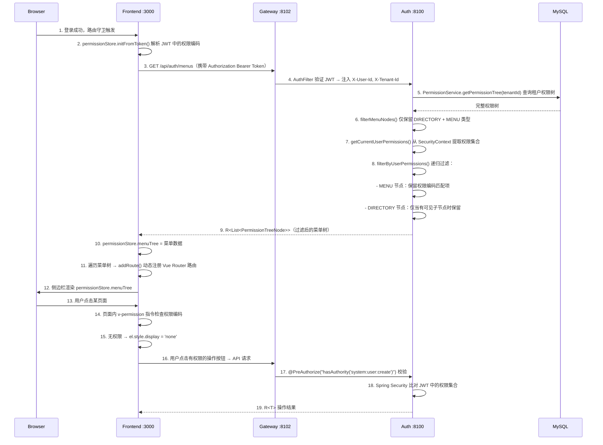

### 关键实现细节

**后端菜单过滤逻辑**（`MenuController`）：

1. 查询租户完整权限树 → `permissionService.getPermissionTree(tenantId)`
2. 第一步过滤：仅保留 `type = DIRECTORY | MENU` 的节点（丢弃 BUTTON 和 API）
3. 第二步过滤：从 `SecurityContext` 提取当前用户权限集合（排除 `ROLE_` 前缀）
4. 递归过滤：MENU 节点检查 `permissionCode` 是否在权限集合中；DIRECTORY 节点先递归处理子节点，仅当有可见子节点时保留
5. 无法获取权限信息时降级返回全部菜单

**前端按钮权限控制**（`v-permission` 指令）：

```vue
<el-button v-permission="'system:user:create'" type="primary">新增</el-button>
<el-button v-permission="'system:user:update'" size="small">编辑</el-button>
<el-button v-permission="'system:user:delete'" size="small" type="danger">删除</el-button>
```

- 使用 `display: none` 而非 `removeChild`，兼容 Vue 响应式更新
- 在 `mounted` 和 `updated` 钩子中执行检查
- 已应用页面：用户管理、角色管理、组织管理、租户管理、在线用户、OAuth2 客户端管理

### 当前状态

- **动态菜单**：后端 `MenuController` 完整实现，前端 `usePermissionStore` 动态路由注册
- **按钮权限**：`v-permission` 自定义指令已应用于 6 个管理页面（共 20+ 按钮）
- **API 鉴权**：所有 Controller 的写操作方法均声明 `@PreAuthorize`
- **权限编码格式**：`resource:action`（如 `system:user:create`）

## Flow 6: RBAC 数据权限 — 请求级行数据过滤

### 概述

每次 HTTP 请求到达时，`DataScopeResolveFilter` 解析当前用户的数据范围，
MyBatis-Plus `DataPermissionInterceptor` 自动为 `sys_user` 表查询追加 WHERE 条件，
实现行级数据过滤，业务代码零侵入。

### 时序图

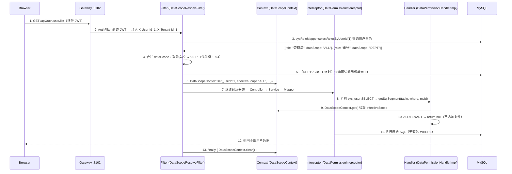

### DataScope 过滤条件对照表

| effectiveScope | SQL 追加条件 | 说明 |
|---------------|-------------|------|
| `ALL` | 无 | 跨租户可见全部数据 |
| `TENANT` | 无 | 现有 `tenant_id` 过滤已满足 |
| `DEPT` | `WHERE sys_user.primary_unit_id IN ({本部门ID})` | 仅本部门用户 |
| `DEPT_AND_BELOW` | `WHERE sys_user.primary_unit_id IN ({本部门及后代ID})` | 本部门+下级 |
| `CUSTOM` | `WHERE sys_user.primary_unit_id IN ({自定义部门+后代ID})` | 自定义范围 |
| `SELF` | `WHERE sys_user.id = {当前用户ID}` | 仅自己 |

### 组织单元后代查询

`DEPT_AND_BELOW` 和 `CUSTOM` 范围需要查询组织单元的所有后代节点：

```java
// SysOrgUnitMapper
List<Long> selectDescendantIdsByPath(String path);
// SQL: SELECT id FROM sys_org_unit WHERE path LIKE '{path}%' AND id != {selfId}
```

利用 `sys_org_unit` 表的物化路径（`path` 字段，如 `1/2/5/`）实现高效的祖先-后代查询。

### 内存过滤模式（在线用户场景）

在线用户数据存储在 Redis 中，无法通过 SQL 拦截器过滤。Controller 从 `DataScopeContext` 读取数据范围，手动过滤：

```java
// OnlineUserController.list()
List<OnlineUserVO> list = onlineUserService.listOnlineUsers();
DataScopeContext.DataScopeInfo scope = DataScopeContext.get();
if (scope != null) {
    list = filterByDataScope(list, scope);
}
// ALL/TENANT → 全部，DEPT*/CUSTOM → 按 primaryUnitId 过滤，SELF → 仅自己
```

### 配置注册顺序

```java
// MyBatisPlusConfig
MybatisPlusInterceptor interceptor = new MybatisPlusInterceptor();
// 数据权限必须在分页拦截器之前注册
interceptor.addInnerInterceptor(new DataPermissionInterceptor(new DataPermissionHandlerImpl()));
interceptor.addInnerInterceptor(new PaginationInnerInterceptor(DbType.MYSQL));
```

**原因**：分页拦截器执行 `SELECT COUNT(*)` 查询时，数据权限条件必须已追加，否则 COUNT 结果与实际数据不一致。

### 当前状态

- **SQL 拦截**：`DataPermissionInterceptor` + `DataPermissionHandlerImpl` 完整实现，当前仅过滤 `sys_user` 表
- **请求级上下文**：`DataScopeResolveFilter` + `DataScopeContext` ThreadLocal 管理
- **多角色合并**：最宽松优先策略已实现
- **内存过滤**：`OnlineUserController` 已实现基于 `primaryUnitId` 的内存过滤
- **物化路径查询**：`SysOrgUnitMapper.selectDescendantIdsByPath()` 高效获取后代节点

## Flow 7: 用户创建 — 三种途径

### 概述

系统支持三种用户创建途径，覆盖不同场景：用户自助注册（面向新用户）、管理员后台创建（面向运维人员）、社交登录自动创建（面向第三方 OAuth2 首次登录用户）。所有途径创建的用户均自动分配当前租户下的 `USER` 默认角色（`data_scope=SELF`），初始无组织单元归属（`primaryUnitId` 为 `null`），需由管理员后续分配。

### 时序图

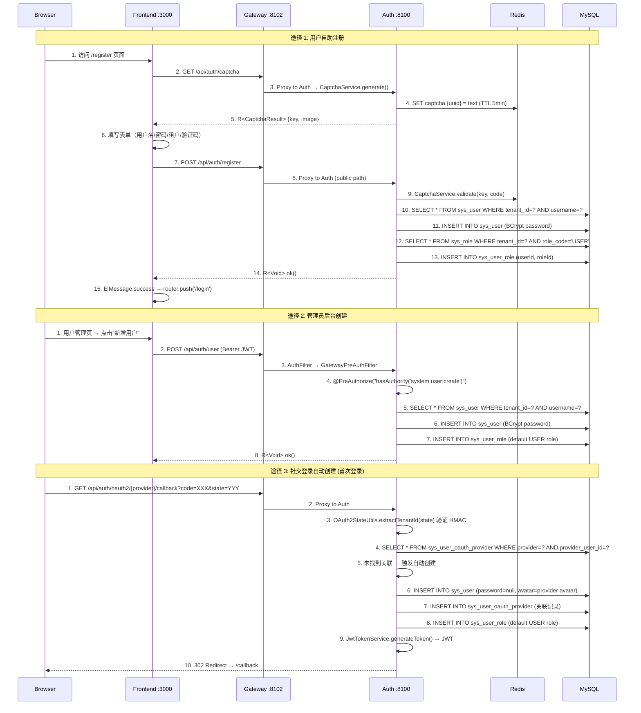

### 三种途径对比

| 维度 | 自助注册 | 管理员创建 | 社交登录自动创建 |
|------|---------|-----------|----------------|
| **入口** | `POST /api/auth/register` | `POST /api/auth/user` | OAuth2 回调内部 |
| **认证要求** | 无（公开端点） | `system:user:create` 权限 | 无（OAuth2 回调） |
| **验证码** | 是（Redis 一次性） | 否 | 否 |
| **租户确定** | 用户从下拉框选择 | 管理员指定 | HMAC 签名的 state 参数 |
| **密码** | BCrypt 编码 | BCrypt 编码 | `null`（仅社交登录） |
| **用户名** | 用户自选（3-32 字符） | 管理员指定（无长度上限） | 自动生成：`gh_`/`go_`/`ge_` + 第三方用户名 |
| **默认角色** | `USER`（`data_scope=SELF`） | `USER` | `USER` |
| **组织单元** | 不分配（`primaryUnitId=null`） | 不分配 | 不分配 |
| **用户名冲突** | 抛 `BusinessException(400)` | 抛 `BusinessException(400)` | Fallback：`{prefix}{login}_{providerUserId}` |
| **创建后行为** | 提示成功 → 跳转登录页 | 返回用户列表 | 自动签发 JWT → 重定向前端 |

### 关键组件

| 组件 | 文件 | 职责 |
|------|------|------|
| `AuthController.register()` | `omni-auth/.../controller/AuthController.java` | 自助注册入口，委托 `UserService` |
| `UserController.create()` | `omni-auth/.../controller/UserController.java` | 管理员创建入口，需 `@PreAuthorize` |
| `SocialLoginServiceImpl.handleCallback()` | `omni-auth/.../service/impl/SocialLoginServiceImpl.java` | 社交登录回调处理，含自动创建逻辑 |
| `UserServiceImpl.registerUser()` | `omni-auth/.../service/impl/UserServiceImpl.java` | 自助注册业务：验证码校验 → 唯一性检查 → 插入 → 分配角色 |
| `UserServiceImpl.createUser()` | `omni-auth/.../service/impl/UserServiceImpl.java` | 管理员创建业务：唯一性检查 → 插入 → 分配角色 |
| `SocialLoginServiceImpl.createNewUser()` | `omni-auth/.../service/impl/SocialLoginServiceImpl.java` | 社交登录自动创建：用户名生成 → 插入 → OAuth 关联记录 → 分配角色 |
| `UserServiceImpl.assignDefaultRole()` | `omni-auth/.../service/impl/UserServiceImpl.java` | 公共方法：查询租户 `USER` 角色 → 写入 `sys_user_role` |
| `RegisterRequest` | `omni-auth/.../dto/RegisterRequest.java` | 自助注册 DTO（含验证码字段） |
| `CreateUserRequest` | `omni-auth/.../dto/CreateUserRequest.java` | 管理员创建 DTO（含 phone/gender） |
| 注册页面 | `omni-frontend/src/views/register/index.vue` | 前端注册表单（含确认密码、租户选择） |

### 当前状态

- **自助注册**：`POST /api/auth/register` 完整实现，前端注册页 `/register` 已就绪，Gateway 白名单已配置
- **管理员创建**：`POST /api/auth/user` 完整实现，前端用户管理页已就绪，`@PreAuthorize` 权限控制已生效
- **社交登录自动创建**：`SocialLoginServiceImpl.createNewUser()` 完整实现，支持 GitHub/Google/Gitee，用户名冲突有 fallback 机制
- **默认角色分配**：三种途径共用 `assignDefaultRole()` 方法，角色分配失败仅记录警告不阻塞创建
- **组织单元**：三种途径均不分配组织单元，`primaryUnitId` 保持 `null`，需管理员后续手动分配

---

## Flow 8: XSS 防护 — 请求净化与配置管理

### 8A. XSS 请求净化（每次请求自动执行）

```
Client Request
    │
    ▼
┌─────────────────────────────────────────┐
│ Gateway: SecurityHeadersFilter          │
│  → 添加 X-Content-Type-Options: nosniff │
│  → 添加 X-Frame-Options: DENY          │
│  → 添加 Referrer-Policy: strict-origin  │
│  → AuthFilter: JWT 验证 + 身份头注入    │
└────────────────┬────────────────────────┘
                 │ 转发至 omni-auth
                 ▼
┌─────────────────────────────────────────┐
│ Layer 2: XssFilter (OncePerRequestFilter)│
│  1. XssConfigProvider.getXssSettings()   │
│     → Redis 缓存命中? 返回缓存          │
│     → 未命中? 查询 DB + 写入缓存       │
│  2. 如果 enabled=false → 跳过净化       │
│  3. 如果 enabled=true → 包装 Request    │
│     → XssHttpServletRequestWrapper       │
│     → 重写 getParameter/getParameterValues│
│     → XssRuleHolder.set(rules) ThreadLocal│
└────────────────┬────────────────────────┘
                 │
                 ▼
┌─────────────────────────────────────────┐
│ Layer 1: XssStringDeserializer          │
│  (Jackson SimpleModule 自动注册)        │
│  → @RequestBody JSON 中的 String 字段   │
│  → 自动经过 XssSanitizer.sanitize()    │
└────────────────┬────────────────────────┘
                 │
                 ▼
            Controller
```

**XssSanitizer 净化规则**（按 ruleType 分派）：

| ruleType | 净化方式 | 示例 |
|----------|---------|------|
| `HTML_TAG` | 正则剥离成对标签 `<tag>...</tag>` 和自闭合标签 `<tag/>` | `<script>alert(1)</script>` → `alert(1)` |
| `EVENT_HANDLER` | 正则剥离 `on*` 属性 | `onclick="..."` → 移除 |
| `DANGEROUS_PROTOCOL` | 替换 `javascript:` / `vbscript:` / `data:` 协议字符串 | `javascript:alert(1)` → 空串 |
| `CUSTOM_PATTERN` | 自定义正则匹配并替换 | `expression(...)` → 移除 |

**ThreadLocal 清理**：`XssFilter` 在 `finally` 块中调用 `XssRuleHolder.clear()` 防止内存泄漏。

### 8B. XSS 配置管理（管理员操作）

```
Admin (前端 XSS防护配置页面)
    │
    ├─ 全局开关切换
    │  PUT /api/auth/xss-config/toggle
    │  → XssConfigController.toggleGlobal()
    │  → @PreAuthorize("hasAuthority('system:xssconfig:update')")
    │  → XssConfigServiceImpl.toggleGlobal()
    │     → UPDATE sys_xss_config SET enabled = ? WHERE tenant_id = ?
    │     → 删除 Redis 缓存: xss:enabled:{tenantId}, xss:rules:{tenantId}
    │
    ├─ 创建规则
    │  POST /api/auth/xss-config/rules
    │  → @PreAuthorize("hasAuthority('system:xssconfig:create')")
    │  → 验证 ruleType 枚举 + pattern 正则合法性
    │  → INSERT sys_xss_blacklist_rule
    │  → 删除 Redis 缓存
    │
    ├─ 更新规则
    │  PUT /api/auth/xss-config/rules/{id}
    │  → @PreAuthorize("hasAuthority('system:xssconfig:update')")
    │  → UPDATE sys_xss_blacklist_rule
    │  → 删除 Redis 缓存
    │
    ├─ 删除规则
    │  DELETE /api/auth/xss-config/rules/{id}
    │  → @PreAuthorize("hasAuthority('system:xssconfig:delete')")
    │  → DELETE sys_xss_blacklist_rule
    │  → 删除 Redis 缓存
    │
    └─ 单条规则启用/禁用
       PUT /api/auth/xss-config/rules/{id}/toggle
       → @PreAuthorize("hasAuthority('system:xssconfig:update')")
       → UPDATE sys_xss_blacklist_rule SET enabled = NOT enabled
       → 删除 Redis 缓存
```

**缓存策略**：
- Redis 键：`xss:enabled:{tenantId}`（字符串 "true"/"false"）+ `xss:rules:{tenantId}`（JSON 数组）
- TTL：30 分钟
- 失效：所有写操作（toggle、CRUD）后主动 `DEL` 两个缓存键
- 回源：`XssConfigProviderImpl.loadFromDbAndCache()` 在缓存未命中时查询 DB 并回填缓存

### 关键组件

| 组件 | 文件路径 | 职责 |
|------|---------|------|
| `XssConfigController` | `omni-auth/.../controller/XssConfigController.java` | XSS 配置管理 REST API（7 个端点） |
| `XssConfigServiceImpl` | `omni-auth/.../service/impl/XssConfigServiceImpl.java` | 配置 CRUD + Redis 缓存失效 |
| `XssConfigProviderImpl` | `omni-auth/.../security/XssConfigProviderImpl.java` | 配置加载（Redis 优先 → DB 回源） |
| `XssFilter` | `omni-common/.../security/xss/XssFilter.java` | Servlet Filter，加载配置 + ThreadLocal 设置 |
| `XssSanitizer` | `omni-common/.../security/xss/XssSanitizer.java` | 核心净化逻辑（4 种规则类型） |
| `XssStringDeserializer` | `omni-common/.../security/xss/XssStringDeserializer.java` | Jackson 反序列化器包装，自动清洗 JSON 字符串 |
| `SecurityHeadersFilter` | `omni-gateway/.../config/SecurityHeadersFilter.java` | Gateway 安全响应头 |
| XSS 管理页面 | `omni-frontend/src/views/system/xssconfig/index.vue` | 全局开关 + 规则 CRUD 表格 |

### 当前状态

- **三层净化**：Jackson 反序列化器 + Servlet Filter + Gateway 安全头均已实现并自动装配
- **配置管理**：全局开关 + 规则 CRUD + 单条规则 toggle 共 7 个 API 端点完整实现
- **前端页面**：`系统管理 → XSS防护配置` 已就绪，支持分页规则列表、创建/编辑对话框、v-permission 按钮权限控制
- **缓存策略**：Redis 缓存 + 写操作主动失效已实现
- **租户隔离**：配置和规则按 `tenant_id` 隔离

---

## Flow 9: 数据字典管理 — 类型+数据两级结构 CRUD

### 概述

Base 服务（`omni-base :8101`）提供数据字典管理功能，采用「类型 + 数据」两级结构。字典类型（`sys_dict_type`）定义编码分类（如 `sys_user_gender`），字典数据（`sys_dict_data`）定义具体的键值对（如 `1=男, 2=女, 0=未知`）。前端采用 master-detail 布局，左侧类型列表，右侧数据列表，支持完整的 CRUD 操作和 Redis 缓存管理。

### 时序图

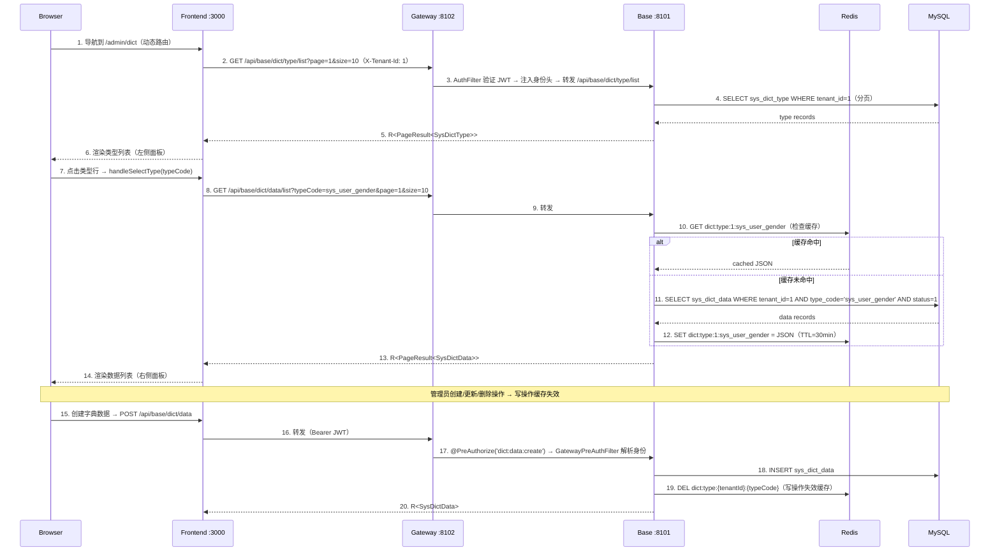

<details>
<summary>ASCII 版本（点击展开）</summary>

```
浏览器               前端 :3000             网关 :8102            Base :8101           Redis              MySQL
  |                    |                       |                     |                   |                  |
  | 1. 导航到          |                       |                     |                   |                  |
  |    /admin/dict     |                       |                     |                   |                  |
  |                    | 2. GET /api/base/dict/type/list              |                   |                  |
  |                    |---------------------->|                     |                   |                  |
  |                    |                       | 3. AuthFilter →     |                   |                  |
  |                    |                       |    转发路径         |                   |                  |
  |                    |                       |-------------------->|                   |                  |
  |                    |                       |                     | 4. SELECT         |                  |
  |                    |                       |                     |    sys_dict_type  |                  |
  |                    |                       |                     |    WHERE tenant_id=1                 |
  |                    |                       |                     |-------------------------------------->|
  |                    |                       |                     |                   |    type records   |
  |                    |                       |                     |<--------------------------------------|
  |                    | 5. R<PageResult>      |                     |                   |                  |
  |                    |<----------------------|<--------------------|                   |                  |
  | 6. 渲染类型        |                       |                     |                   |                  |
  |    列表（左侧）    |                       |                     |                   |                  |
  |<-------------------|                       |                     |                   |                  |
  |                    |                       |                     |                   |                  |
  | 7. 点击类型行      |                       |                     |                   |                  |
  |                    | 8. GET /api/base/dict/data/list?typeCode=... |                   |                  |
  |                    |---------------------->|                     |                   |                  |
  |                    |                       | 9. 转发 ----------->|                   |                  |
  |                    |                       |                     | 10. GET 缓存      |                  |
  |                    |                       |                     |------------------>|                  |
  |                    |                       |                     |                   |  命中? 缓存 JSON  |
  |                    |                       |                     |<------------------|                  |
  |                    |                       |                     |                   |                  |
  |                    |                       |                     | [未命中: SELECT sys_dict_data ------>|
  |                    |                       |                     |  SET cache <---------------------------|
  |                    |                       |                     |                   |                  |
  |                    | 13. R<PageResult>     |                     |                   |                  |
  |                    |<----------------------|<--------------------|                   |                  |
  | 14. 渲染数据       |                       |                     |                   |                  |
  |     列表（右侧）   |                       |                     |                   |                  |
  |<-------------------|                       |                     |                   |                  |
  |                    |                       |                     |                   |                  |
  | 15. 创建数据 ----->|                       |                     |                   |                  |
  |                    | 16. POST /api/base/dict/data                 |                   |                  |
  |                    |---------------------->|                     |                   |                  |
  |                    |                       | 17. @PreAuthorize   |                   |                  |
  |                    |                       |-------------------->|                   |                  |
  |                    |                       |                     | 18. INSERT ------>|                  |
  |                    |                       |                     | 19. DEL cache --->|                  |
  |                    | 20. R<SysDictData>    |                     |                   |                  |
  |                    |<----------------------|<--------------------|                   |                  |
```

</details>

### 关键组件

| 组件 | 文件路径 | 职责 |
|------|---------|------|
| `DictTypeController` | `omni-base/.../controller/DictTypeController.java` | 字典类型 REST API（6 个端点），`@PreAuthorize` 权限控制 |
| `DictDataController` | `omni-base/.../controller/DictDataController.java` | 字典数据 REST API（5 个端点），`@PreAuthorize` 权限控制 |
| `DictTypeServiceImpl` | `omni-base/.../service/impl/DictTypeServiceImpl.java` | 类型 CRUD + 级联删除数据 + 缓存失效 |
| `DictDataServiceImpl` | `omni-base/.../service/impl/DictDataServiceImpl.java` | 数据 CRUD + cache-aside 缓存 + 手动刷新 |
| `GatewayPreAuthFilter` | `omni-base/.../security/GatewayPreAuthFilter.java` | 从 Gateway 注入的 X-User-* 头构建 SecurityContext |
| `XssConfigProviderImpl` | `omni-base/.../security/XssConfigProviderImpl.java` | Redis-only 策略实现 XSS SPI（依赖 auth 服务写入的缓存） |
| 字典管理页面 | `omni-frontend/src/views/base/dict/index.vue` | Master-detail 布局：左类型列表 + 右数据列表 |
| 字典 API 模块 | `omni-frontend/src/api/dict.ts` | 11 个 typed API 函数 + TypeScript 接口定义 |

### 缓存策略

**Cache-aside 模式**：

| 项目 | 值 |
|------|-----|
| Redis Key | `dict:type:{tenantId}:{typeCode}` |
| TTL | 30 分钟 |
| 序列化 | JSON（`GenericJacksonJsonRedisSerializer`） |

**读路径**（`DictDataServiceImpl.listEnabledData()`）：
1. 检查 Redis 缓存 → 命中则反序列化返回
2. 未命中 → 查询 DB（`status=1`，按 `sort` 后 `id` 排序）→ 序列化写入 Redis（TTL 30min）

**写路径**（所有 CRUD 操作）：
1. 先写 DB（INSERT / UPDATE / DELETE）
2. 再 DEL Redis key（写操作失效缓存，下次读取时懒加载）

**手动刷新**（`DictDataServiceImpl.refreshCache()`）：
1. DEL Redis key
2. 查询 DB
3. 写入 Redis（立即回填，适用于数据不一致场景）

**级联删除**：删除字典类型时，在单个 `@Transactional` 操作中同时删除所有关联的字典数据，并失效对应缓存。

### 权限树

```
base (DIRECTORY, id=50)             ← "基础数据" 一级菜单
  └── base:dict (MENU, id=51)       ← "字典管理" 二级菜单
        ├── dict:type:list     (API, id=52)
        ├── dict:type:create   (API, id=53)
        ├── dict:type:update   (API, id=54)
        ├── dict:type:delete   (API, id=55)
        ├── dict:data:list     (API, id=56)
        ├── dict:data:create   (API, id=57)
        ├── dict:data:update   (API, id=58)
        ├── dict:data:delete   (API, id=59)
        └── dict:data:refresh  (API, id=60)
```

所有 11 个权限节点分配给 `SUPER_ADMIN` 角色（role_id=1）。

### 当前状态

- **后端**：11 个 API 端点完整实现（6 类型 + 5 数据），`@PreAuthorize` 权限控制已生效
- **前端**：Master-detail 布局页面已就绪，`v-permission` 按钮权限控制已应用于所有操作按钮
- **缓存**：Cache-aside + 写操作失效 + 手动刷新已实现
- **种子数据**：3 个预置字典类型（`sys_user_gender`, `sys_common_status`, `sys_notice_type`）+ 7 条数据（租户 1）
- **Gateway 路由**：`Path=/api/base/**` → `lb://omni-base` 已配置（无 StripPrefix，控制器使用完整路径）
- **安全架构**：`GatewayPreAuthFilter` 从 Gateway 注入的身份头构建 Spring Security 上下文，`XssConfigProviderImpl` 采用 Redis-only 策略继承 XSS 防护

---

## Flow 10: 操作日志 — AOP 采集 + RocketMQ 异步写入 + 热冷归档

### 概述

操作日志系统基于 `@OperLog` 注解 + AOP 切面实现无侵入式采集，通过 RocketMQ 异步发送日志消息，由 omni-base 服务消费写入热表（`sys_oper_log`），定时归档到冷表（`sys_oper_log_archive`）实现长期合规留存。整个流程对业务代码零侵入，仅在 Controller 方法上添加注解即可。

### 10A. 操作日志记录流程（每次写操作触发）

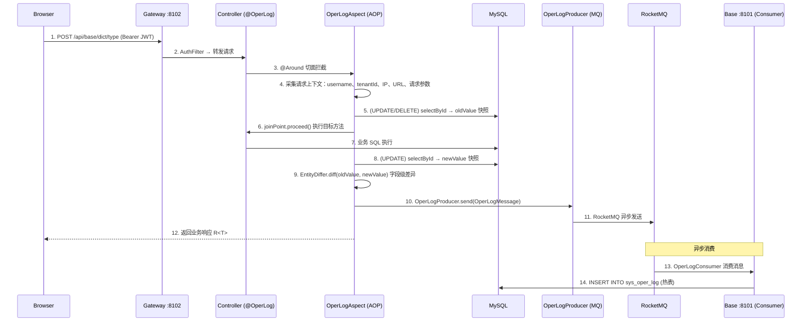

### 10B. 操作日志归档流程（每日 02:00 定时执行）

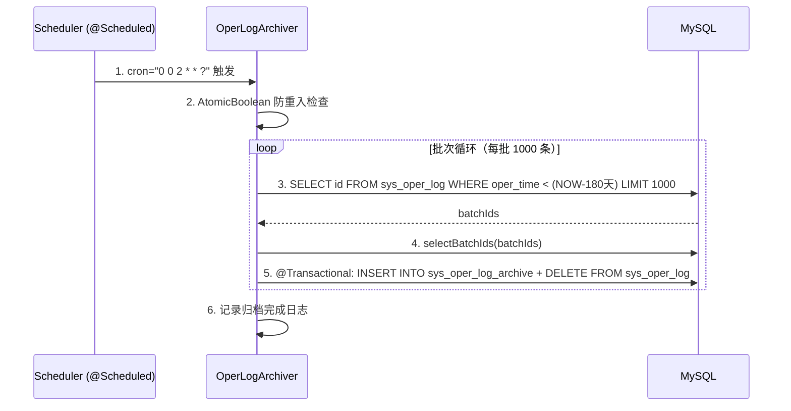

### 关键组件

| 组件 | 文件路径 | 职责 |
|------|---------|------|
| `@OperLog` | `omni-common-core/.../operlog/OperLog.java` | 注解定义，声明 module/operType/entityClass/idExpr |
| `OperType` | `omni-common-core/.../operlog/OperType.java` | 操作类型枚举：CREATE/UPDATE/DELETE/QUERY/EXPORT/IMPORT |
| `OperLogMessage` | `omni-common-core/.../operlog/OperLogMessage.java` | 日志消息 POJO，实现 Serializable |
| `OperLogAspect` | `omni-common-operlog/.../aspect/OperLogAspect.java` | AOP @Around 切面，采集上下文 + 实体快照 + diff |
| `EntityDiffer` | `omni-common-operlog/.../diff/EntityDiffer.java` | 字段级差异比对，仅返回变更字段 |
| `OperLogProducer` | `omni-common-operlog/.../producer/OperLogProducer.java` | RocketMQ 生产者，异步发送日志消息 |
| `OperLogConsumer` | `omni-base/.../consumer/OperLogConsumer.java` | RocketMQ 消费者，写入 sys_oper_log 热表 |
| `OperLogArchiver` | `omni-base/.../service/OperLogArchiver.java` | 定时归档任务，180 天热表→冷表迁移 |

### 审计追踪维度

| 维度 | 字段 | 说明 |
|------|------|------|
| Who | `oper_username` | 操作人用户名 |
| When | `oper_time` | 操作时间戳 |
| What | `module` + `oper_type` + `request_url` | 业务模块 + 操作类型 + 请求 URL |
| Changed | `old_value` / `new_value` | 实体变更前后 JSON 快照（UPDATE 仅包含差异字段） |
| Where | `ip_address` + `user_agent` | 操作来源 IP 和客户端信息 |
| How Long | `execution_time` | 方法执行耗时（ms） |
| Result | `response_status` + `error_msg` | 操作结果状态和错误信息 |

### 与审计日志的互补关系

| 日志类型 | 表 | 记录范围 | 采集方式 | 服务模块 |
|---------|------|---------|---------|--------|
| 操作日志 | `sys_oper_log` / `sys_oper_log_archive` | 业务数据变更（CRUD） | `@OperLog` + AOP + MQ 异步 | omni-base / omni-common-operlog |
| 审计日志 | `sys_audit_log` | 安全事件（登录、Token、权限变更） | 事件驱动（`AuditEventPublisher`） | omni-auth |
| 登录日志 | `sys_login_log` | 登录行为（成功/失败） | 认证流程内部记录 | omni-auth |

三类日志各司其职，共同构成完整的审计追踪体系：操作日志记录「业务数据怎么变」，审计日志记录「安全事件发生了什么」，登录日志记录「谁在什么时候登录」。

### 当前状态

- **AOP 切面**：`OperLogAspect` 完整实现，支持 CREATE/UPDATE/DELETE/QUERY/EXPORT/IMPORT 六种操作类型
- **实体 diff**：`EntityDiffer` 实现字段级差异比对，UPDATE 操作仅记录变更字段
- **SpEL 提取**：支持 `#id`、`#result.data.id` 等表达式，从方法参数和返回值中提取实体 ID
- **MQ 异步**：`OperLogProducer` 通过 RocketMQ 异步发送，不阻塞业务请求
- **热冷归档**：`OperLogArchiver` 每日 02:00 执行，180 天保留策略，批次处理 1000 条/批
- **omni-auth 禁用**：认证模块不引入 `omni-common-operlog`，认证行为由 `sys_login_log` + `sys_audit_log` 覆盖

---

## Flow 11: 用户任务创建 — 工作台自助创建到 XXL-JOB 直注册

### 概述

用户通过工作台「我的任务」区域自助创建定时任务。前端提供任务类型选择、动态参数表单和 Cron 表达式编辑器，后端验证类型有效性后保存到数据库并直接注册到 XXL-JOB 调度中心，实现创建即生效。

### 时序图

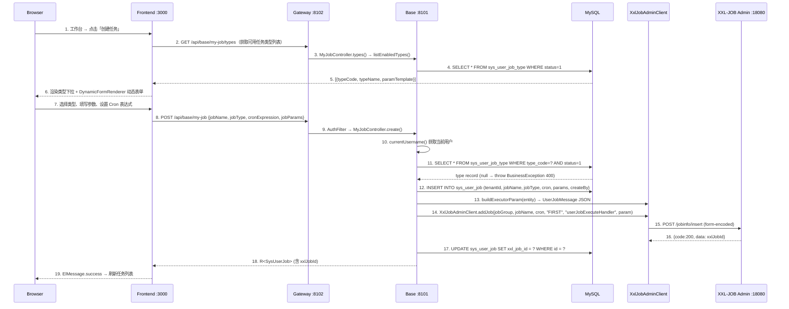

### 错误处理

| 场景 | 处理方式 | 前端表现 |
|------|---------|----------|
| 任务类型不存在或已禁用 | 抛 `BusinessException(400)` | ElMessage.error |
| XXL-JOB 注册失败 | 回滚 DB 记录 (`sysUserJobMapper.deleteById`) → 抛 `BusinessException(500)` | ElMessage.error「任务注册到调度中心失败」 |
| 任务名称为空 | Jakarta Validation `@NotBlank` | 表单验证提示 |
| Cron 表达式为空 | Jakarta Validation `@NotBlank` | 表单验证提示 |

### 关键组件

| 组件 | 文件路径 | 职责 |
|------|---------|------|
| 工作台页面 | `omni-frontend/src/views/home/index.vue` | 任务创建弹窗（类型选择 + CronGenerator + DynamicFormRenderer） |
| Cron 编辑器 | `omni-frontend/src/components/CronGenerator.vue` | 频率类型选择器 + 动态条件表单 + 人类可读预览 |
| 动态表单 | `omni-frontend/src/components/DynamicFormRenderer.vue` | 根据 `param_template` JSON Schema 渲染表单 |
| API 模块 | `omni-frontend/src/api/myJob.ts` | `createMyJob()`、`getEnabledJobTypes()` |
| 控制器 | `omni-base/.../controller/MyJobController.java` | `POST /api/base/my-job`，提取 currentUsername |
| 服务层 | `omni-base/.../service/impl/UserJobServiceImpl.java` | `createJob()` — 验证类型 + DB 插入 + XXL-JOB 注册 + 失败回滚 |
| XXL-JOB 客户端 | `omni-common-job/.../XxlJobAdminClient.java` | `addJob()` — 构建 form 参数调用 `/jobinfo/insert` |
| 任务类型注册表 | `sys_user_job_type` | `type_code`（唯一）+ `param_template`（JSON Schema） |
| 用户任务表 | `sys_user_job` | `xxl_job_id` 关联 XXL-JOB 调度中心 |

### 所有权模型

`MyJobController` 不使用 `@PreAuthorize`，而是通过 `verifyOwnership(id, username)` 校验任务归属：

```java
private void verifyOwnership(Long id, String username) {
    SysUserJob job = userJobService.getJobById(id);
    if (!username.equals(job.getCreateBy())) {
        throw new BusinessException(403, "无权操作此任务");
    }
}
```

每个用户只能操作自己创建的任务，实现行级数据隔离。

### 当前状态

- **任务创建**：端到端实现，工作台创建 → DB 保存 → XXL-JOB 注册，失败自动回滚
- **类型管理**：`UserJobTypeController` 支持任务类型的 CRUD 和参数模板管理
- **动态表单**：`DynamicFormRenderer` 根据 `param_template` 自动渲染 input/select/number/textarea
- **Cron 编辑器**：`CronGenerator` 支持 7 种频率类型（每分钟/每X分钟/每小时/每X小时/每天/每周/每月）
- **所有权校验**：`verifyOwnership()` 确保用户只能操作自己创建的任务

---

## Flow 12: 用户任务执行 — XXL-JOB 触发到前端通知

### 概述

XXL-JOB 调度中心按 cron 表达式触发执行，`XxlJobSpringExecutor` 将请求分发给 `userJobExecuteHandler`。该 handler 从 JSON 执行参数中解析任务上下文，通过 `UserJobHandlerRegistry` 路由到具体 `UserJobHandler` 执行，写入执行日志并更新 `lastFireTime`。前端工作台每 10 秒轮询活跃任务的执行日志，发现新日志时弹出通知。

### 时序图

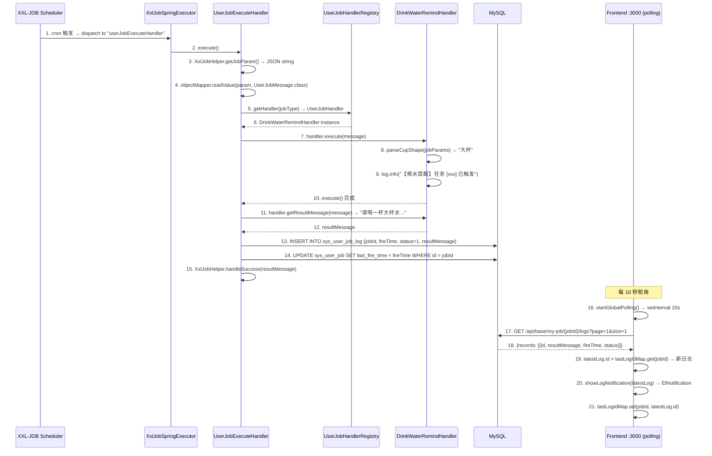

### 前端轮询机制

工作台使用 `startGlobalPolling()` 实现全局日志监控：

```
setInterval 每 10 秒：
1. 过滤 tableData 中 status=1 的活跃任务
2. 对每个活跃任务：
   a. GET /api/base/my-job/{id}/logs?page=1&size=1
   b. 获取最新日志 ID
   c. 与 lastLogIdMap 中的已知 ID 比较
   d. 如果 latestLog.id > prevId：
      - 如果 lastLogIdMap 已有该任务记录（非首次）→ 弹出 ElNotification
      - 更新 lastLogIdMap
3. 刷新 loadData() + loadStats()
```

**防重复通知**：`lastLogIdMap` 首次初始化时只记录当前最新日志 ID，不弹出通知。只有后续轮询发现的新日志（ID > 已知 ID）才触发通知。

**生命周期管理**：
- `onMounted` 中启动轮询
- `onUnmounted` 中清除 `setInterval`，防止内存泄漏

### 执行参数 JSON 格式

`XxlJobAdminClient.addJob()` 注册任务时，`executorParam` 字段包含 `UserJobMessage` JSON：

```json
{
    "jobId": 1,
    "tenantId": 1,
    "jobType": "Task-00001",
    "jobName": "喝水提醒",
    "jobParams": "{\"cupShape\":\"大杯\"}"
}
```

`UserJobExecuteHandler` 通过 `objectMapper.readValue(param, UserJobMessage.class)` 解析后路由。

### 错误处理

| 场景 | 处理方式 | XXL-JOB 控制台表现 |
|------|---------|-------------------|
| JSON 参数解析失败 | `XxlJobHelper.handleFail("参数解析失败: ...")` | 执行失败 |
| Handler 未找到 | `log.warn` + `status=0` + `errorMsg` 写入日志 | 执行失败 |
| Handler 执行异常 | catch → `status=0` + `errorMsg`（截断 2000 字符） | 执行失败 |
| 正常完成 | `XxlJobHelper.handleSuccess(resultMessage)` | 执行成功 |

### 关键组件

| 组件 | 文件路径 | 职责 |
|------|---------|------|
| 通用执行 Handler | `omni-base/.../job/UserJobExecuteHandler.java` | `@XxlJob("userJobExecuteHandler")` 入口，JSON 解析 + Handler 路由 + 日志写入 + lastFireTime 更新 |
| Handler 注册中心 | `omni-base/.../job/UserJobHandlerRegistry.java` | `Map<String, UserJobHandler>` 自动注入，`getHandler(jobType)` 路由 |
| SPI 接口 | `omni-common-core/.../job/UserJobHandler.java` | `execute()` + `getResultMessage()` |
| 消息 POJO | `omni-common-core/.../job/UserJobMessage.java` | `jobId`, `tenantId`, `jobType`, `jobName`, `jobParams` |
| 喝水处理器 | `omni-base/.../job/handler/DrinkWaterRemindHandler.java` | `@Component("Task-00001")`，解析 `cupShape` 参数生成提醒消息 |
| 执行日志表 | `sys_user_job_log` | `fire_time`, `execute_time_ms`, `status`, `result_message`, `error_message` |
| 前端轮询 | `omni-frontend/src/views/home/index.vue` | `startGlobalPolling()` 每 10 秒 + `lastLogIdMap` 防重复 |
| 通知组件 | Element Plus `ElNotification` | 3 秒自动关闭，显示 `resultMessage` |

### 当前状态

- **执行链路**：XXL-JOB 触发 → `userJobExecuteHandler` → Handler 路由 → 日志写入 → lastFireTime 更新，完整实现
- **前端通知**：10 秒轮询 + `lastLogIdMap` 防重复 + `ElNotification` 3 秒自动关闭
- **错误处理**：参数解析失败、Handler 未找到、执行异常均有处理，结果写入 `sys_user_job_log`
- **lastFireTime**：每次执行后通过 `SysUserJobMapper.updateById()` 更新，工作台表格实时显示
- **下次执行时间**：前端通过 `cron-parser` 库客户端计算，仅启用状态任务显示

---

## Docker 部署下的流程配置注意事项

### OAuth2 回调 URL 配置

Docker 部署时，社交登录的 `redirect_uri` 需要使用**宿主机可访问的 URL**（而非容器内部地址）：

| 部署环境 | redirect_uri 示例 |
|---------|------------------|
| 本地开发 | `http://localhost:8100/api/auth/oauth2/github/callback` |
| Docker 部署 | `http://<宿主机IP>:8100/api/auth/oauth2/github/callback` |
| 生产环境 | `https://your-domain.com/api/auth/oauth2/github/callback` |

**配置方式**（`application.yml`）：

```yaml
omni:
  oauth2:
    github:
      redirect-uri: ${OAUTH2_GITHUB_REDIRECT_URI:http://localhost:8100/api/auth/oauth2/github/callback}
    google:
      redirect-uri: ${OAUTH2_GOOGLE_REDIRECT_URI:http://localhost:8100/api/auth/oauth2/google/callback}
    gitee:
      redirect-uri: ${OAUTH2_GITEE_REDIRECT_URI:http://localhost:8100/api/auth/oauth2/gitee/callback}
```

**Docker Compose 环境变量覆盖**：

```yaml
# docker-compose.yml
omni-auth:
  environment:
    OAUTH2_GITHUB_REDIRECT_URI: http://192.168.1.100:8100/api/auth/oauth2/github/callback
    OAUTH2_GOOGLE_REDIRECT_URI: http://192.168.1.100:8100/api/auth/oauth2/google/callback
    OAUTH2_GITEE_REDIRECT_URI: http://192.168.1.100:8100/api/auth/oauth2/gitee/callback
```

> **注意**：Docker 部署中，Auth 服务容器内部端口是 8080，但 OAuth2 回调 URL 必须使用宿主机映射端口 8100（因为第三方平台需要回调到宿主机的公网/局域网可达地址）。

### Docker 部署下的前端回调页面

社交登录成功后，Auth 服务 302 重定向到前端回调页面：

```
成功: 302 Location: /callback#token=<JWT>&username=<username>
失败: 302 Location: /login?error=<error_code>&message=<message>
```

Docker 部署中，Nginx 容器负责服务前端静态文件，`/callback` 路由由 Vue Router 客户端处理（Nginx `try_files $uri $uri/ /index.html`）。

### Gateway 容器间网络

Docker 部署时所有容器在同一个 `omni-network` Bridge 网络中：

```
前端浏览器 → 宿主机:8100 → Nginx 容器(:80)
    ├── 静态文件 → Nginx 直接返回
    ├── /api/*   → proxy_pass http://omni-gateway:8080
    └── /oauth2/* → proxy_pass http://omni-gateway:8080

Gateway 容器(:8080)
    ├── lb://omni-auth → Auth 容器(:8080) [Nacos 服务发现]
    ├── lb://omni-base → Base 容器(:8080) [Nacos 服务发现]
    └── lb://omni-workflow → Workflow 容器(:8080) [Nacos 服务发现]
```

---

## 故障排查指南

### 登录流程问题

| 问题 | 可能原因 | 排查方法 |
|------|---------|----------|
| **验证码不显示** | Redis 未启动或连接失败 | 检查 Redis 容器状态；查看 Auth 服务日志中 Redis 连接错误 |
| **登录返回「用户名或密码错误」** | 租户 ID 不匹配 | 确认前端 `tenantId` 参数正确；检查 `sys_user` 表中 `tenant_id` 字段 |
| **登录后 401** | JWT 签名验证失败 | 检查 Gateway 是否能访问 Auth 的 `/oauth2/jwks` 端点；检查 `JwkKeyProvider` 缓存是否过期 |
| **Token 过期频繁** | JWT 有效期仅 15 分钟 | 当前无 refresh token 机制，需重新登录；后续可增加 refresh token 流程 |

### 社交登录问题

| 问题 | 可能原因 | 排查方法 |
|------|---------|----------|
| **GitHub 回调 404** | redirect_uri 配置错误 | 检查 GitHub OAuth App 中的 `Authorization callback URL` 是否与 `application.yml` 中的配置一致 |
| **State 验证失败** | HMAC 签名不匹配 | 检查 Auth 服务的 `omni.oauth2.state-secret` 配置是否一致（单实例部署不存在此问题） |
| **Google API 超时** | 网络代理问题 | Google API 需要通过代理访问；检查 `application.yml` 中的 `proxy` 配置 |
| **自动创建用户失败** | 用户名冲突且 fallback 也冲突 | 检查 `sys_user` 表是否存在 `gh_`/`go_`/`ge_` 前缀的用户名冲突 |
| **Docker 部署回调到容器内部地址** | redirect_uri 使用了容器内部端口 | 确保 redirect_uri 使用宿主机映射端口（8100），而非容器内部端口（8080） |

### 权限与菜单问题

| 问题 | 可能原因 | 排查方法 |
|------|---------|----------|
| **动态菜单不显示** | 后端 `/api/auth/menus` 返回空 | 检查 JWT 中是否包含 `authorities` 字段；检查 `sys_role_permission` 表中角色-权限关联 |
| **按钮始终隐藏** | v-permission 编码不匹配 | 对比前端 `v-permission` 值与 `sys_permission` 表中的 `permission_code` |
| **API 返回 403** | @PreAuthorize 权限编码不匹配 | 对比 Controller 上的 `@PreAuthorize` 值与用户 JWT 中的权限集合 |

### 数据字典问题

| 问题 | 可能原因 | 排查方法 |
|------|---------|----------|
| **字典数据不更新** | Redis 缓存未失效 | 手动调用 `PUT /api/base/dict/data/refresh` 刷新缓存；或等待 TTL（30 分钟）过期 |
| **字典类型删除后数据残留** | 级联删除未触发 | 检查 `DictTypeServiceImpl.deleteType()` 中的事务是否正常提交 |

### 操作日志问题

| 问题 | 可能原因 | 排查方法 |
|------|---------|----------|
| **日志未记录** | RocketMQ 未启动 | 检查 RocketMQ 容器状态；查看 `OperLogProducer` 日志中发送结果 |
| **日志延迟** | MQ 消费积压 | 检查 omni-base 服务消费者日志；查看 RocketMQ 控制台消费进度 |
| **归档任务未执行** | @Scheduled 未触发 | 确认 omni-base 服务只有一个实例（避免多实例重复归档）；检查日志中归档记录 |