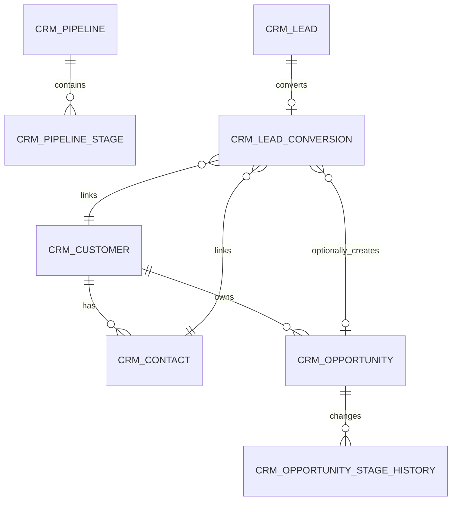

# CRM Sales Pipeline

> This document is the single source of truth for the CRM module. AI agents **must** read it before modifying any CRM code.  
> Related docs: [architecture.en.md](architecture.en.md) · [api-contract.en.md](api-contract.en.md) · [backend-patterns.en.md](backend-patterns.en.md) · [frontend-patterns.en.md](frontend-patterns.en.md) · [crm.md](crm.md) (中文) · [crm.jp.md](crm.jp.md) (日本語) · [crm.kr.md](crm.kr.md) (한국어)  
> Design baseline archive: [design/crm-design.md](design/crm-design.md).

CRM is a standalone microservice (`omni-crm`) covering the pre-sales closed loop: Lead → Follow-up → Customer/Contact → Opportunity → Won or Lost. Products, quotes, contracts, orders, invoicing, collections, marketing automation, and customer-service tickets are **out of scope** for CRM.

## 1. Service Boundaries

| Item | Value |
|---|---|
| Maven module | `omni-crm` |
| Service port | `8104` |
| Management port | `19904` |
| XXL-JOB executor | `omni-crm` / `9904` |
| Database | `omni_crm` |
| Gateway route | `/api/crm/**` → `lb://omni-crm` (no StripPrefix) |
| Redis | DB 0, shares Auth's XSS config, key prefix `crm:` |

**Depends on**: `omni-common-core`, `omni-common`, `omni-common-mybatis`, `omni-common-redis`, `omni-common-operlog`, `omni-common-job`, `omni-common-mqlog`.

**Do NOT depend on** `omni-common-workflow` — that would pull the Flowable engine into CRM.

**Cross-service calls**: Calls Auth internal APIs via OpenFeign + `X-Internal-Token`. CRM only stores userId/unitId and never reads `omni_auth` across databases.

## 2. Domain Model

### 2.1 Aggregates & Tables

| Aggregate | Tables | Responsibility |
|---|---|---|
| Lead | `crm_lead`, `crm_lead_conversion` | Lead lifecycle, idempotent conversion |
| Customer | `crm_customer`, `crm_contact` | Customer profile, contacts, Customer 360 |
| Opportunity | `crm_opportunity`, `crm_opportunity_stage_history` | Stage, amount, probability, won/lost history |
| Activity | `crm_activity` | Plan, complete, cancel follow-ups |
| Pipeline | `crm_pipeline`, `crm_pipeline_stage` | Pipeline & stage definitions |
| Ownership Audit | `crm_owner_change_log` | Immutable history of owner changes |



`crm_activity` uses `root_type + root_id` for polymorphic association with Lead/Customer/Opportunity. The Service layer must verify that the target exists, belongs to the same tenant, and is accessible to the current user.

### 2.2 Common Field Rules

Every `crm_*` table must have `tenant_id`. Authorizable business tables additionally require:

- `tenant_id` — tenant isolation
- `owner_user_id` — SELF scope & business owner
- `owner_unit_id` — DEPT / DEPT_AND_BELOW / CUSTOM scope
- `version` — optimistic locking
- `deleted` — soft delete
- `id/create_time/update_time/create_by/update_by` — audit fields

**Key constraints**:

- User/org IDs are managed by Auth; no cross-database foreign keys; never trust frontend-submitted usernames or ownerUnitId
- Monetary amounts use `DECIMAL(18,2)` / `BigDecimal`; currency uses ISO 4217 three-letter codes; in MVP all opportunities must use the tenant's default currency
- Timestamps use `yyyy-MM-dd HH:mm:ss` uniformly
- `lead_no/customer_no/opportunity_no` are generated from the database ID and are unique per tenant
- Regular PUT requests must not directly modify owner, status, or stage
- External requests must not use bare `selectById/updateById/deleteById`

## 3. Security Architecture

### 3.1 Six-Layer Defense in Depth

```
Gateway JWT verification → CRM Tenant check → Spring Security @PreAuthorize
→ @CrmDataScope aspect → MyBatis DataPermission interceptor → CrmRecordAccessGuard row-level write auth
```

1. Gateway verifies RS256 JWT and injects `X-User-*`, `X-Tenant-Id`, `X-Gateway-Forwarded`
2. `GatewayPreAuthFilter` builds `Authentication` and validates userId/tenantId
3. Controller `@PreAuthorize` checks functional permissions
4. `@CrmDataScope(permissionCode)` aspect calls Auth internal API to resolve dataScope
5. MyBatis-Plus appends tenant + owner conditions
6. `CrmRecordAccessGuard` validates row-level authorization for write operations

**Fail-closed**: Missing tenant → 401, missing scope → `id=-1` (zero data visible), Auth unavailable → 503. Never degrade to unfiltered.

### 3.2 MyBatis Interceptor Order

CRM defines a custom `mybatisPlusInterceptor` with a fixed, non-negotiable order:

```
TenantLineInnerInterceptor → DataPermissionInterceptor → PaginationInnerInterceptor
```

- TenantLine only processes `crm_*` tables
- `sys_mq_message` is excluded from both permission interceptors (Relay scans all tenants by design)
- DataPermission must come before Pagination so that COUNT and records share the same scope
- Pipeline/Stage is only governed by tenant + functional permissions

### 3.3 DataScope Mapping

| dataScope | SQL Condition |
|---|---|
| SELF | `owner_user_id = currentUserId` |
| DEPT | `owner_unit_id = primaryUnitId` |
| DEPT_AND_BELOW / CUSTOM | `owner_unit_id IN accessibleUnitIds` |
| TENANT / ALL | No owner condition; TenantLine always retained |

### 3.4 Row-Level Write Authorization

DataPermissionInterceptor does not protect writes. Every update/delete/convert/transfer/stage command must:

1. Query visible records with `tenant_id + id + data scope` (invisible → 404 to prevent ID enumeration)
2. Validate state machine and business invariants
3. Update with `tenant_id + id + version` conditions
4. Return a concurrency conflict if the affected row count is not exactly 1

### 3.5 Permission Codes

| Resource | Permission Code |
|---|---|
| Overview | `crm:overview:list` |
| Lead | `crm:lead:list/create/update/delete/assign/convert/disqualify` |
| Customer | `crm:customer:list/create/update/delete/transfer/status/blacklist` |
| Contact | `crm:contact:list/create/update/delete` |
| Opportunity | `crm:opportunity:list/create/update/delete/assign/stage/reopen` |
| Activity | `crm:activity:list/create/update/delete/complete/cancel` |
| Owner Candidates | `crm:owner:list` |
| PII View | `crm:pii:view` |

The `/` in the table is shorthand for multiple full permission codes under the same resource; each full code is stored individually. `@PreAuthorize` and `@CrmDataScope` use the same full permission code.

### 3.6 PII Masking

- Full phone, email, and address are only returned to users with `crm:pii:view`
- For other users, the backend VO returns masked values directly (`138****1234`, `a***@example.com`) — no reliance on frontend masking
- Lists are masked by default; detail views depend on permissions
- Duplicate detection only returns minimal candidate summaries

### 3.7 XSS Protection

CRM implements the `XssConfigProvider` SPI, reading `xss:enabled:{tenantId}` and `xss:rules:{tenantId}` from Redis DB 0. On cache miss, it falls back to Auth or uses built-in baseline rules — protection is never disabled. In MVP, notes allow plain text only; `v-html` is forbidden on the frontend.

### 3.8 Roles & dataScope

| Role | dataScope | Capabilities |
|---|---|---|
| `CRM_ADMIN` | TENANT | Full CRM features/data within the current tenant |
| `SALES_MANAGER` | DEPT_AND_BELOW | Department & subordinates, assign/transfer, statistics |
| `SALES_REP` | SELF | Own data and standard sales operations |
| `CRM_VIEWER` | TENANT | Tenant-level read-only, PII not granted by default |
| `SUPER_ADMIN` | ALL | All features, CRM data still scoped to current tenant |

The default USER role does not grant CRM permissions.

## 4. State Machines & Core Flows

### 4.1 Lead Lifecycle

```
[*] → NEW → FOLLOWING → QUALIFIED → CONVERTED → [*]
NEW/FOLLOWING/QUALIFIED → DISQUALIFIED
DISQUALIFIED → FOLLOWING (reactivate)
```

- Only `QUALIFIED` leads can be converted; `DISQUALIFIED` requires a reason; `CONVERTED` is a terminal state

### 4.2 Customer Status

```
POTENTIAL → ACTIVE → DORMANT / LOST / BLACKLISTED
DORMANT / LOST / BLACKLISTED → ACTIVE
```

Winning an opportunity can automatically transition a customer from POTENTIAL to ACTIVE. Customers with open opportunities cannot be deleted directly. BLACKLISTED uses a dedicated command and the `crm:customer:blacklist` permission.

### 4.3 Opportunity Stages

```
DISCOVERY → QUALIFICATION → PROPOSAL → NEGOTIATION → WON / LOST
```

- Open stages can advance or revert; reverting requires a reason
- LOST requires a loss reason; WON/LOST are terminal states
- Reopening requires `crm:opportunity:reopen` and restores the last open stage
- All transitions append Stage History; regular PUT does not accept stage/status

### 4.4 Activity Status

```
PLANNED → COMPLETED / CANCELLED
CANCELLED → PLANNED (reschedule)
```

### 4.5 Lead Conversion Flow

```
POST /lead/{id}/convert → SELECT Lead FOR UPDATE
→ Query existing Conversion (idempotency check)
→ Create or link Customer + Contact
→ Optionally create Opportunity
→ INSERT Conversion + Lead → CONVERTED
→ INSERT Outbox event (same transaction)
```

Conversion uses row-level locking + a `lead_id` unique constraint for double idempotency. Repeated requests on an already-converted Lead return the existing result directly. Feign calls, Workflow, and actual MQ sends are outside the CRM DB transaction — events are only written to the local Outbox.

## 5. API Endpoint Index

### 5.1 Common Contract

- All responses use `R<T>`; paginated responses use `R<PageResult<T>>`
- `page=1`, `size=10`, max `size=100`
- Entities are never used as Request/Response; state commands use dedicated DTOs
- Date parameters use `@DateTimeFormat(pattern = "yyyy-MM-dd HH:mm:ss")`
- State/transition/transfer requests carry `version`
- Write endpoints declare both `@PreAuthorize` and `@OperLog`

### 5.2 Endpoint Overview

All endpoints are prefixed with `/api/crm`.

| Domain | Endpoints |
|---|---|
| Overview | `GET /overview/summary`, `/funnel`, `/follow-ups` |
| Pipeline | `GET /pipeline/list`, `/{id}/stages` |
| Lead | `GET /lead/list`, `/{id}`, `POST /lead`, `PUT/DELETE /lead/{id}` |
| Lead Commands | `POST /lead/duplicate-check`, `/{id}/assign`, `/batch-assign`, `/{id}/qualify`, `/disqualify`, `/reopen`, `/convert` |
| Customer | `GET /customer/list`, `/{id}`, `/{id}/overview`, `POST /customer`, `PUT/DELETE /customer/{id}` |
| Customer Commands | `POST /customer/duplicate-check`, `/{id}/status`, `/{id}/transfer` |
| Contact | `GET /contact/list`, `/customer/{id}/contact/list`, `POST /customer/{id}/contact`, `PUT/DELETE /contact/{id}`, `POST /contact/{id}/primary` |
| Opportunity | `GET /opportunity/list`, `/board`, `/{id}`, `/{id}/stage-history`, `POST /opportunity`, `PUT/DELETE /opportunity/{id}` |
| Opportunity Commands | `POST /opportunity/{id}/assign`, `/stage`, `/reopen` |
| Activity | `GET /activity/list`, `/timeline`, `/{id}`, `POST /activity`, `PUT/DELETE /activity/{id}` |
| Activity Commands | `POST /activity/{id}/complete`, `/cancel`, `/reschedule` |
| Owner Options | `GET /options/owners` |

### 5.3 Customer 360 Chunked Permissions

`/customer/{id}/overview` returns contacts, opportunities, activities, and lead summaries. However, "customer visible" does not mean "all sub-data visible" — each chunk resolves its data scope independently using its respective list permission. If a chunk's permission is missing, that chunk is not queried. The implementation uses `CrmPermissionScopeExecutor` to establish and clean up scope per chunk.

### 5.4 Overview Aggregate Queries

`summary()`, `funnel()`, and `followups()` use Mapper-level aggregate SQL (`GROUP BY` / `UNION ALL`) — never full loads with in-memory filtering. DataPermissionInterceptor automatically applies to aggregate queries.

## 6. Cross-Service Integration

### 6.1 Auth Feign

- CRM only stores userId/unitId; before assignment, it validates via Auth internal API that the user exists, is enabled, and belongs to the same tenant
- ownerUnitId is sourced from Auth's authoritative primary org — never trust the frontend
- List views collect IDs first, then batch-fetch in a single API call; per-row Feign calls (N+1) are forbidden
- When Auth is unavailable: dataScope → 503 fail-closed; display enrichment → may return ID/unknown user

### 6.2 Outbox Events

Uses `ReliableMessageRelay.send("crm-domain-out-0", envelope, tenantId, eventId)` to write to the local Outbox. `tenantId` must be passed explicitly.

Event envelopes contain `eventId`, `eventType`, `tenantId`, `aggregateType/Id/Version`, and `actorUserId`. Events only carry IDs and state snapshots — never full PII.

Defined events: `crm.lead.converted.v1`, `crm.opportunity.stage-changed/won/lost.v1`.

### 6.3 Operation Logs

`@OperLog` already supports PII sanitization. Owner Change and Stage History are synchronous domain facts and cannot be replaced by the async generic log.

## 7. Hard Constraints

Rules that must be followed before modifying CRM code:

1. **Tenant Isolation**: All `crm_*` tables must have `tenant_id`; TenantLine is always appended; regular APIs never cross tenants
2. **Optimistic Locking**: All writes must update with `tenant_id + id + version` conditions
3. **Fail-Closed**: Missing tenant → 401, missing scope → `id=-1`, Auth unavailable → 503 — never degrade
4. **ThreadLocal Cleanup**: `CrmDataScopeContext` must be cleaned up in a `finally` block to prevent memory leaks
5. **Dual Permission Declaration**: Write endpoints must declare both `@PreAuthorize` (functional permission) and `@CrmDataScope` (data scope) with the same full permission code
6. **Backend PII Masking**: Without `crm:pii:view`, the backend VO returns masked values directly — no frontend reliance
7. **Explicit Outbox tenantId**: `ReliableMessageRelay.send()` must receive an explicit `Long tenantId`; ThreadLocal-based implicit passing is forbidden
8. **Interceptor Order**: TenantLine → DataPermission → Pagination — non-negotiable
9. **Write Authorization**: DataPermissionInterceptor does not protect writes; AccessGuard row-level validation is required
10. **State Machine**: Regular PUT does not accept status/stage changes; dedicated command endpoints must be used
11. **MySQL DATETIME Range**: Do not use `LocalDateTime.MIN/MAX` as query parameters; use reasonable values like `LocalDateTime.of(2000,1,1,0,0)`
12. **Pipeline Read-Only**: In MVP, pipelines and stages are auto-created during tenant initialization; no admin UI is provided
13. **Activity Polymorphism**: `root_type + root_id` association; Service must verify target exists and is accessible
14. **`sys_mq_message` Excluded from Permission Interceptors**: Relay scans all tenants; user queries still require explicit tenant filtering

## 8. Frontend Structure

```
omni-frontend/src/
├── api/
│   ├── crm-overview.ts        # Overview aggregate APIs
│   ├── crm-lead.ts            # Lead CRUD + commands
│   ├── crm-customer.ts        # Customer CRUD + 360 + transfer
│   ├── crm-contact.ts         # Contact CRUD
│   ├── crm-opportunity.ts     # Opportunity CRUD + kanban + stage
│   └── crm-activity.ts        # Activity CRUD + timeline
├── views/crm/
│   ├── overview/index.vue     # Sales overview
│   ├── lead/index.vue         # Lead management
│   ├── customer/index.vue     # Customer management
│   ├── contact/index.vue      # Contact management
│   ├── opportunity/index.vue  # Opportunity management
│   └── activity/index.vue     # Follow-up activities
└── components/crm/
    ├── OwnerSelector.vue      # Owner selector
    ├── CustomerPicker.vue     # Customer picker
    ├── ActivityTimeline.vue   # Activity timeline
    ├── OpportunityStageBoard.vue  # Opportunity kanban board
    └── CustomerOverview.vue   # Customer 360 view
```

- `ApiResponse/PageResult` are imported exclusively from `src/types/api.ts`
- Buttons use the `v-permission` directive with the same permission codes, but the backend is the ultimate security boundary
- Customer 360 uses a Drawer component
- Opportunity page provides both Table and Kanban views

## 9. Extension Guide

### Adding a New Aggregate Root

1. Add tables in the `omni_crm` database — must include `tenant_id`, `owner_user_id`, `owner_unit_id`, `version`, `deleted`, and audit fields
2. Create Entity (extends BaseEntity), Mapper, Service interface + Impl, Controller
3. Register the new table's owner column mapping in `CrmDataPermissionHandlerImpl`
4. Add a Liquibase changelog under `database/changelog/crm/`, and provide seed data in `scripts/sql/seed/` (`crm.sql`, `auth.sql`) verified by `database/seed/manifest.yaml`
5. Controller write endpoints declare `@PreAuthorize` + `@CrmDataScope` with new `crm:<resource>:<action>` permission codes

### Adding Opportunity Stages

MVP pipelines are not configurable. If opened up in the future, the following are needed:
1. Backend `crm_pipeline_stage` table CRUD API
2. Frontend pipeline configuration page
3. Migration strategy for existing opportunities referencing old stages

### Adding Permission Codes

1. Insert new permissions into `sys_permission` in `scripts/sql/seed/auth.sql` with type `API`
2. Assign to roles in `sys_role_permission` as needed
3. Controller methods declare `@PreAuthorize("hasAuthority('crm:<resource>:<action>')")` + `@CrmDataScope("crm:<resource>:<action>")`
4. Add `v-permission="'crm:<resource>:<action'"` to the corresponding frontend button

### Connecting Outbox Events

1. In the Service business method, call `ReliableMessageRelay.send("crm-domain-out-0", envelope, tenantId, eventId)` within the same transaction
2. `tenantId` must be explicitly obtained from context; ThreadLocal-based passing is forbidden
3. Event envelopes follow the unified format; payloads must not contain full PII
4. Consumers must be idempotent, using `payload.eventId` for business deduplication

## 10. Testing

The CRM module has 16 test files covering:

- Valid/invalid state machine transitions
- Lead conversion idempotency and concurrency
- Customer transfer cascading
- PII masking
- Six dataScope variants for list and aggregate queries
- Cross-tenant isolation (real MySQL integration tests)
- Missing tenant/scope fail-closed behavior

Run tests:

```bash
cd omni-backend && ./mvnw clean install -pl omni-crm -am
```

Real MySQL interceptor integration tests require an external test database and are skipped by default:

```bash
CRM_TEST_MYSQL_URL='jdbc:mysql://127.0.0.1:3306/crm_it?...' \
./mvnw -pl omni-crm -am -Dtest=CrmMysqlInterceptorIntegrationTest test
```
