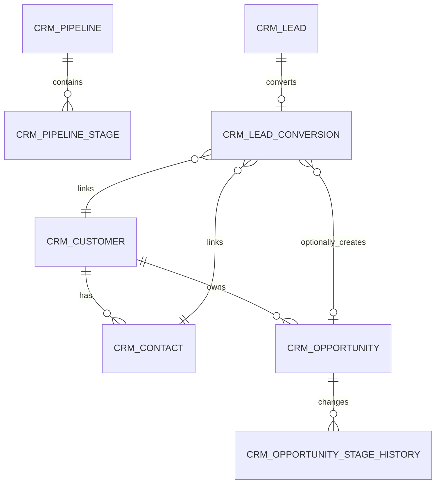

# CRM 販売パイプライン

[中文](crm.md) | [English](crm.en.md) | [한국어](crm.kr.md)

> 本文書は CRM モジュールのシステム上の唯一の真実です。AI が CRM コードを変更する前に必ず読んでください。
> アーキテクチャ全体は [architecture.md](architecture.md)、API 契約は [api-contract.md](api-contract.md)、開発規範は [backend-patterns.md](backend-patterns.md) / [frontend-patterns.md](frontend-patterns.md) を参照してください。
> 設計ベースラインのアーカイブは [design/crm-design.md](design/crm-design.md) にあります。

CRM は独立したマイクロサービス `omni-crm` であり、プリセールスのクローズドループをカバーします：リード → フォロー → 顧客/連絡先 → 商談 → 受注または失注。製品、見積、契約、注文、請求、入金、マーケティング自動化、カスタマーサービスチケットは CRM の範囲外です。

## 1. サービス境界

| 項目 | 値 |
|---|---|
| Maven モジュール | `omni-crm` |
| サービスポート | `8104` |
| 管理ポート | `19904` |
| XXL-JOB エグゼキュータ | `omni-crm` / `9904` |
| データベース | `omni_crm` |
| Gateway ルーティング | `/api/crm/**` → `lb://omni-crm`（StripPrefix を使用しない） |
| Redis | DB 0、Auth の XSS 設定を共有、キープレフィックス `crm:` |

**依存モジュール**：`omni-common-core`、`omni-common`、`omni-common-mybatis`、`omni-common-redis`、`omni-common-operlog`、`omni-common-job`、`omni-common-mqlog`。

**`omni-common-workflow` に依存してはいけません**。依存すると Flowable エンジンが CRM に埋め込まれます。

**クロスサービス呼び出し**：OpenFeign + `X-Internal-Token` を通じて Auth の内部 API を呼び出します。CRM は userId/unitId のみを保持し、`omni_auth` をクロスデータベースで参照しません。

## 2. ドメインモデル

### 2.1 集約とテーブル

| 集約 | テーブル | 責務 |
|---|---|---|
| Lead | `crm_lead`、`crm_lead_conversion` | リードのライフサイクル、変換の冪等性 |
| Customer | `crm_customer`、`crm_contact` | 顧客アーカイブ、連絡先、顧客 360 |
| Opportunity | `crm_opportunity`、`crm_opportunity_stage_history` | 段階、金額、確率、受注/失注履歴 |
| Activity | `crm_activity` | 計画、完了、キャンセルのフォロー |
| Pipeline | `crm_pipeline`、`crm_pipeline_stage` | パイプラインと段階の定義 |
| Ownership Audit | `crm_owner_change_log` | 担当者変更の不変履歴 |



`crm_activity` は `root_type + root_id` により Lead/Customer/Opportunity への多態的関連を行います。Service は対象の存在、同一テナント、および現在のユーザーがアクセス可能であることを検証しなければなりません。

### 2.2 共通フィールドルール

すべての `crm_*` テーブルには `tenant_id` が必須です。認可対象の業務テーブルにはさらに以下が必要です：

- `tenant_id` — テナント分離
- `owner_user_id` — SELF スコープおよび業務担当者
- `owner_unit_id` — DEPT/DEPT_AND_BELOW/CUSTOM スコープ
- `version` — 楽観的ロック
- `deleted` — 論理削除
- `id/create_time/update_time/create_by/update_by` — 監査フィールド

**主要な制約**：

- ユーザー/組織 ID は Auth が管理し、クロスデータベースの外部キーは作成せず、フロントエンドから送信されたユーザー名や ownerUnitId を信頼しません
- 金額は `DECIMAL(18,2)` / `BigDecimal`、通貨は ISO 4217 の3桁コード、MVP ではすべての商談はテナントのデフォルト通貨に固定
- 日時は `yyyy-MM-dd HH:mm:ss` に統一
- `lead_no/customer_no/opportunity_no` はデータベース ID から生成され、テナント内で一意
- 通常の PUT では owner、status、stage の直接変更は許可しません
- 外部リクエストでは生の `selectById/updateById/deleteById` を使用してはいけません

## 3. セキュリティアーキテクチャ

### 3.1 6層の縦深防御

```
Gateway JWT 検証 → CRM Tenant 検証 → Spring Security @PreAuthorize
→ @CrmDataScope アスペクト → MyBatis DataPermission インターセプタ → CrmRecordAccessGuard 行レベル書込み認可
```

1. Gateway は RS256 JWT を検証し、`X-User-*`、`X-Tenant-Id`、`X-Gateway-Forwarded` のヘッダー注入をカバー
2. `GatewayPreAuthFilter` が `Authentication` を構築し、userId/tenantId を検証
3. Controller の `@PreAuthorize` で機能権限を検証
4. `@CrmDataScope(permissionCode)` アスペクトが Auth の内部 API を呼び出して dataScope を解決
5. MyBatis-Plus が tenant + owner 条件を追加
6. `CrmRecordAccessGuard` が書込み操作の行レベル認可を検証

**フェイルクローズド**：tenant 欠落 → 401、scope 欠落 → `id=-1`（データ表示なし）、Auth 利用不可 → 503。決してフィルタリングなしにダウングレードしません。

### 3.2 MyBatis インターセプタの順序

CRM はカスタム `mybatisPlusInterceptor` を定義しており、順序は固定で変更不可です：

```
TenantLineInnerInterceptor → DataPermissionInterceptor → PaginationInnerInterceptor
```

- TenantLine は `crm_*` テーブルのみを処理
- `sys_mq_message` は2つの権限インターセプタを除外（Relay は設計上すべてのテナントをスキャン）
- DataPermission は Pagination の前に配置し、COUNT とレコードが同じスコープになるように保証
- Pipeline/Stage は tenant + 機能権限のみで制御

### 3.3 DataScope マッピング

| dataScope | SQL 条件 |
|---|---|
| SELF | `owner_user_id = currentUserId` |
| DEPT | `owner_unit_id = primaryUnitId` |
| DEPT_AND_BELOW / CUSTOM | `owner_unit_id IN accessibleUnitIds` |
| TENANT / ALL | owner 条件なし、TenantLine は常に保持 |

### 3.4 書込み操作の行レベル認可

DataPermissionInterceptor は書込みを保護しません。各更新/削除/変換/移管/段階コマンドは以下を実行しなければなりません：

1. `tenant_id + id + data scope` で表示可能なレコードを問い合わせ（非表示 → 404、ID 列挙を防止）
2. ステートマシンと業務不変量を検証
3. `tenant_id + id + version` 条件で更新
4. 更新行数が1でない場合に競合の競合を返却

### 3.5 権限コード一覧

| リソース | 権限コード |
|---|---|
| Overview | `crm:overview:list` |
| Lead | `crm:lead:list/create/update/delete/assign/convert/disqualify` |
| Customer | `crm:customer:list/create/update/delete/transfer/status/blacklist` |
| Contact | `crm:contact:list/create/update/delete` |
| Opportunity | `crm:opportunity:list/create/update/delete/assign/stage/reopen` |
| Activity | `crm:activity:list/create/update/delete/complete/cancel` |
| Owner 候補 | `crm:owner:list` |
| PII 表示 | `crm:pii:view` |

表中の `/` は同一リソース内の複数の完全な権限コードの略記で、データベースには各コードを個別に保存します。`@PreAuthorize` と `@CrmDataScope` は同じ完全な権限コードを使用します。

### 3.6 PII マスキング

- 完全な電話番号、メールアドレス、住所は `crm:pii:view` を持つユーザーにのみ返却
- その他のユーザーにはバックエンド VO で直接マスキング値（`138****1234`、`a***@example.com`）を返し、フロントエンド側でのマスキングに依存しません
- 一覧はデフォルトでマスキング、詳細は権限に応じて判定
- 重複検出は最小限の候補サマリーのみを返却

### 3.7 XSS 防御

CRM は `XssConfigProvider` SPI を実装し、Redis DB 0 の `xss:enabled:{tenantId}` と `xss:rules:{tenantId}` を読み取ります。キャッシュミスの場合は Auth にフォールバックするか、組み込みのベースラインルールを使用し、防御を無効化しません。MVP では備考はプレーンテキストのみ許可し、フロントエンドでは `v-html` を禁止します。

### 3.8 ロールと dataScope

| ロール | dataScope | 能力 |
|---|---|---|
| `CRM_ADMIN` | TENANT | 現在のテナントの全 CRM 機能/データ |
| `SALES_MANAGER` | DEPT_AND_BELOW | 部門および下位部門、割り当て/移管、統計 |
| `SALES_REP` | SELF | 自身が担当するデータと通常の販売操作 |
| `CRM_VIEWER` | TENANT | テナントレベルの読み取り専用、PII はデフォルトで付与されない |
| `SUPER_ADMIN` | ALL | 全機能、CRM データは現在のテナントに限定 |

デフォルトの USER ロールには CRM 権限は付与されません。

## 4. ステートマシンとコアフロー

### 4.1 Lead ライフサイクル

```
[*] → NEW → FOLLOWING → QUALIFIED → CONVERTED → [*]
NEW/FOLLOWING/QUALIFIED → DISQUALIFIED
DISQUALIFIED → FOLLOWING（再有効化）
```

- `QUALIFIED` のみが変換可能；`DISQUALIFIED` は理由が必須；`CONVERTED` は終端状態

### 4.2 Customer ステータス

```
POTENTIAL → ACTIVE → DORMANT / LOST / BLACKLISTED
DORMANT / LOST / BLACKLISTED → ACTIVE
```

商談の受注により POTENTIAL から ACTIVE へ自動遷移可能です。顧客にオープンな商談がある場合は直接削除できません。BLACKLISTED は独立したコマンドと `crm:customer:blacklist` 権限を使用します。

### 4.3 Opportunity 段階

```
DISCOVERY → QUALIFICATION → PROPOSAL → NEGOTIATION → WON / LOST
```

- オープン段階では前進または後退可能、後退時は理由の記載が必須
- LOST は失注理由が必須；WON/LOST は終端状態
- 再開には `crm:opportunity:reopen` が必要、最後のオープン段階に復元
- すべての遷移は Stage History を追加、通常の PUT では stage/status を受け付けません

### 4.4 Activity ステータス

```
PLANNED → COMPLETED / CANCELLED
CANCELLED → PLANNED（再計画）
```

### 4.5 Lead 変換フロー

```
POST /lead/{id}/convert → SELECT Lead FOR UPDATE
→ 既存の Conversion を問い合わせ（冪等性チェック）
→ Customer + Contact の作成または関連付け
→ オプションで Opportunity を作成
→ INSERT Conversion + Lead → CONVERTED
→ INSERT Outbox イベント（同一トランザクション）
```

変換は行ロック + `lead_id` 一意制約による二重の冪等性を採用しています。変換済みの Lead への再リクエストは既存の結果を直接返却します。Feign、Workflow、実際の MQ 送信は CRM DB トランザクション外で実行され、イベントはローカル Outbox にのみ書き込まれます。

## 5. API エントリ一覧

### 5.1 共通契約

- すべてのレスポンスは `R<T>`、ページネーションは `R<PageResult<T>>`
- `page=1`、`size=10`、最大 `size=100`
- Entity は Request/Response として使用しない、状態コマンドは独立した DTO を使用
- 日付パラメータは `@DateTimeFormat(pattern = "yyyy-MM-dd HH:mm:ss")`
- 状態/遷移/移管リクエストは `version` を保持
- 書込みインターフェースは `@PreAuthorize` と `@OperLog` の両方を宣言

### 5.2 エンドポイント総覧

すべてのエンドポイントは `/api/crm` をプレフィックスとします。

| ドメイン | エンドポイント |
|---|---|
| Overview | `GET /overview/summary`、`/funnel`、`/follow-ups` |
| Pipeline | `GET /pipeline/list`、`/{id}/stages` |
| Lead | `GET /lead/list`、`/{id}`、`POST /lead`、`PUT/DELETE /lead/{id}` |
| Lead コマンド | `POST /lead/duplicate-check`、`/{id}/assign`、`/batch-assign`、`/{id}/qualify`、`/disqualify`、`/reopen`、`/convert` |
| Customer | `GET /customer/list`、`/{id}`、`/{id}/overview`、`POST /customer`、`PUT/DELETE /customer/{id}` |
| Customer コマンド | `POST /customer/duplicate-check`、`/{id}/status`、`/{id}/transfer` |
| Contact | `GET /contact/list`、`/customer/{id}/contact/list`、`POST /customer/{id}/contact`、`PUT/DELETE /contact/{id}`、`POST /contact/{id}/primary` |
| Opportunity | `GET /opportunity/list`、`/board`、`/{id}`、`/{id}/stage-history`、`POST /opportunity`、`PUT/DELETE /opportunity/{id}` |
| Opportunity コマンド | `POST /opportunity/{id}/assign`、`/stage`、`/reopen` |
| Activity | `GET /activity/list`、`/timeline`、`/{id}`、`POST /activity`、`PUT/DELETE /activity/{id}` |
| Activity コマンド | `POST /activity/{id}/complete`、`/cancel`、`/reschedule` |
| Owner オプション | `GET /options/owners` |

### 5.3 Customer 360 ブロック別権限

`/customer/{id}/overview` は連絡先、商談、活動、リードのサマリーを返却します。ただし「顧客が見える＝すべてのサブデータが見える」ではありません——各ブロックはそれぞれの list permission でデータスコープを独立して解決し、あるブロックの権限がない場合はそのブロックを問い合わせません。実装では `CrmPermissionScopeExecutor` がブロックごとにスコープを確立およびクリアします。

### 5.4 Overview 集約クエリ

`summary()`、`funnel()`、`followups()` は Mapper レイヤーで集約 SQL（`GROUP BY` / `UNION ALL`）を使用し、全量ロードしてメモリでフィルタリングすることはありません。DataPermissionInterceptor は集約クエリにも自動的に適用されます。

## 6. クロスサービス連携

### 6.1 Auth Feign

- CRM は userId/unitId のみを保持し、割り当て前に Auth の内部 API でユーザーの存在、有効状態、同一テナントを検証
- ownerUnitId は Auth の主組織を権威とし、フロントエンドを信頼しません
- 一覧表示ではまず ID を収集してから一括で batch API を呼び出し、行ごとの Feign 呼び出し（N+1）を禁止
- Auth 利用不可時：dataScope → 503 フェイルクローズド；表示の enrich → ID/不明ユーザーを返却可能

### 6.2 Outbox イベント

`ReliableMessageRelay.send("crm-domain-out-0", envelope, tenantId, eventId)` を使用してローカル Outbox に書き込みます。tenantId は明示的に渡す必要があります。

イベントエンベロープには `eventId`、`eventType`、`tenantId`、`aggregateType/Id/Version`、`actorUserId` が含まれます。イベントは ID と状態のスナップショットのみを伝え、完全な PII は送信しません。

定義済みイベント：`crm.lead.converted.v1`、`crm.opportunity.stage-changed/won/lost.v1`。

### 6.3 操作ログ

`@OperLog` は PII の秘匿化に対応済みです。Owner Change と Stage History は同期的なドメインファクトであり、非同期の汎用ログで代替できません。

## 7. ハード制約

CRM コードを変更する前に遵守すべきルール：

1. **テナント分離**：すべての `crm_*` テーブルには `tenant_id` が必須、TenantLine は常に追加、通常 API はクロステナント不可
2. **楽観的ロック**：すべての書込み操作は `tenant_id + id + version` 条件で更新
3. **フェイルクローズド**：tenant 欠落 → 401、scope 欠落 → `id=-1`、Auth 利用不可 → 503、決してダウングレードしない
4. **ThreadLocal クリーンアップ**：`CrmDataScopeContext` は `finally` ブロックで必ずクリーンアップし、メモリリークを防止
5. **権限の二重宣言**：書込みインターフェースは `@PreAuthorize`（機能権限）と `@CrmDataScope`（データスコープ）の両方を宣言し、同じ完全な権限コードを使用
6. **PII バックエンドマスキング**：`crm:pii:view` がない場合はバックエンド VO で直接マスキング値を返し、フロントエンドに依存しない
7. **Outbox tenantId 明示**：`ReliableMessageRelay.send()` は `Long tenantId` を明示的に渡す必要があり、ThreadLocal の暗黙的使用を禁止
8. **インターセプタ順序**：TenantLine → DataPermission → Pagination、変更不可
9. **書込み認可**：DataPermissionInterceptor は書込みを保護しない、AccessGuard による行レベル検証が必須
10. **ステートマシン**：通常の PUT は status/stage の変更を受け付けない、専用のコマンドエンドポイントを経由
11. **MySQL DATETIME 範囲**：`LocalDateTime.MIN/MAX` をクエリパラメータとして使用不可、`LocalDateTime.of(2000,1,1,0,0)` などの適切な値を使用
12. **Pipeline 読み取り専用**：MVP のパイプラインと段階はテナント初期化時に自動作成され、管理 UI は提供しない
13. **Activity 多態**：`root_type + root_id` で関連付け、Service は対象の存在とアクセス可能性を検証
14. **`sys_mq_message` の権限インターセプタ除外**：Relay はすべてのテナントをスキャン、ユーザークエリには明示的な tenant フィルタリングが必要

## 8. フロントエンド構造

```
omni-frontend/src/
├── api/
│   ├── crm-overview.ts        # オーバービュー集約 API
│   ├── crm-lead.ts            # リード CRUD + コマンド
│   ├── crm-customer.ts        # 顧客 CRUD + 360 + 移管
│   ├── crm-contact.ts         # 連絡先 CRUD
│   ├── crm-opportunity.ts     # 商談 CRUD + カンバン + 段階
│   └── crm-activity.ts        # 活動 CRUD + タイムライン
├── views/crm/
│   ├── overview/index.vue     # 販売オーバービュー
│   ├── lead/index.vue         # リード管理
│   ├── customer/index.vue     # 顧客管理
│   ├── contact/index.vue      # 連絡先管理
│   ├── opportunity/index.vue  # 商談管理
│   └── activity/index.vue     # フォロー活動
└── components/crm/
    ├── OwnerSelector.vue      # 担当者セレクタ
    ├── CustomerPicker.vue     # 顧客ピッカー
    ├── ActivityTimeline.vue   # 活動タイムライン
    ├── OpportunityStageBoard.vue  # 商談カンバンボード
    └── CustomerOverview.vue   # 顧客 360 ビュー
```

- `ApiResponse/PageResult` は `src/types/api.ts` からのみインポート
- ボタンは `v-permission` ディレクティブで同じコードを使用しますが、バックエンドが最終的なセキュリティ境界です
- Customer 360 は Drawer コンポーネントを使用
- Opportunity ページはテーブル + カンバンのデュアルビューを提供

## 9. 拡張ガイド

### 新しい集約ルートの追加

1. `omni_crm` データベースにテーブルを追加。`tenant_id`、`owner_user_id`、`owner_unit_id`、`version`、`deleted`、監査フィールドを必ず含める
2. Entity（extends BaseEntity）、Mapper、Service インターフェース + Impl、Controller を作成
3. `CrmDataPermissionHandlerImpl` に新しいテーブルの owner 列マッピングを登録
4. `init-all.sql` に DDL と権限シードデータを追加
5. Controller の書込みインターフェースに `@PreAuthorize` + `@CrmDataScope` を宣言し、新しい `crm:<resource>:<action>` 権限コードを使用

### 新しい Opportunity 段階の追加

MVP のパイプラインは設定不可です。将来的に開放する場合は以下が必要です：
1. バックエンド `crm_pipeline_stage` テーブルの CRUD インターフェース
2. フロントエンドのパイプライン設定ページ
3. 既存の商談が古い段階を参照している場合の移行戦略

### 新しい権限コードの追加

1. `init-all.sql` の `sys_permission` に新しい権限を挿入、type は `API`
2. ロールに応じて `sys_role_permission` に分配
3. Controller メソッドに `@PreAuthorize("hasAuthority('crm:<resource>:<action>')")` + `@CrmDataScope("crm:<resource>:<action>")` を宣言
4. フロントエンドの該当ボタンに `v-permission="'crm:<resource>:<action'"` を追加

### Outbox イベントの連携

1. Service の業務メソッド内で、同一トランザクションにて `ReliableMessageRelay.send("crm-domain-out-0", envelope, tenantId, eventId)` を呼び出し
2. `tenantId` はコンテキストから明示的に取得する必要があり、ThreadLocal は禁止
3. イベントエンベロープは統一フォーマットに従い、payload には完全な PII を含めない
4. コンシューマは冪等性を持ち、`payload.eventId` で業務の重複排除を行う

## 10. テスト

CRM モジュールには 16 のテストファイルがあり、以下をカバーします：

- ステートマシンの合法/非法遷移
- Lead 変換の冪等性と並行性
- Customer 移管のカスケード
- PII マスキング
- 6種類の dataScope の一覧と集約
- クロステナント分離（実際の MySQL 統合テスト）
- tenant/scope 欠落時のフェイルクローズド

テスト実行：

```bash
cd omni-backend && ./mvnw clean install -pl omni-crm -am
```

実際の MySQL インターセプタ統合テストは外部テストデータベースが必要で、デフォルトではスキップされます：

```bash
CRM_TEST_MYSQL_URL='jdbc:mysql://127.0.0.1:3306/crm_it?...' \
./mvnw -pl omni-crm -am -Dtest=CrmMysqlInterceptorIntegrationTest test
```
