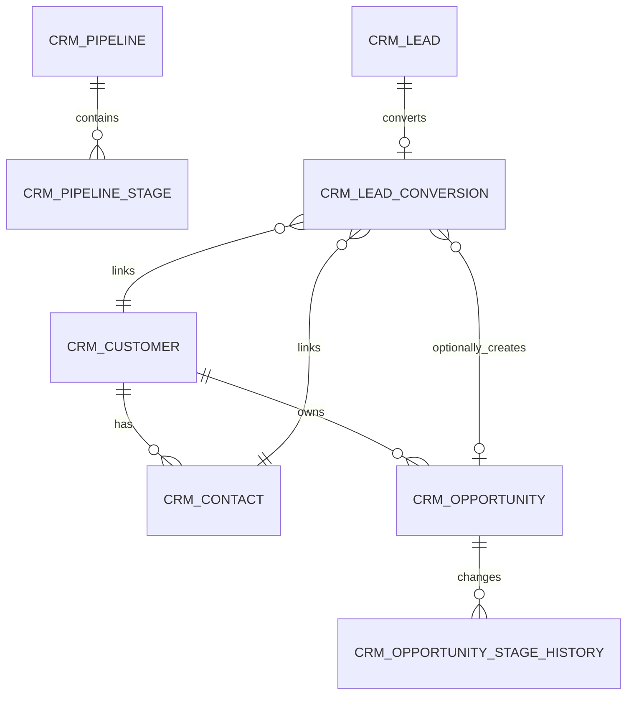

# CRM 세일즈 파이프라인

[中文](crm.md) | [English](crm.en.md) | [日本語](crm.jp.md)

> 이 문서는 CRM 모듈의 단일 진실 출처(Single Source of Truth)입니다. AI가 CRM 코드를 수정하기 전에 반드시 읽어야 합니다.
> 아키텍처 개요는 [architecture.md](architecture.md), API 계약은 [api-contract.md](api-contract.md), 개발 규범은 [backend-patterns.md](backend-patterns.md) / [frontend-patterns.md](frontend-patterns.md)를 참조하십시오.
> 설계 베이스라인 아카이브는 [design/crm-design.md](design/crm-design.md)를 참조하십시오.

CRM은 독립 마이크로서비스 `omni-crm`으로, 세일즈 전단 폐쇄 루프를 담당합니다: 리드 → 팔로우업 → 고객/연락처 → 기회 → 수주 또는 실주. 제품, 견적, 계약, 주문, 청구, 회수, 마케팅 자동화, CS 티켓은 CRM 범위에 포함되지 않습니다.

## 1. 서비스 경계

| 항목 | 값 |
|---|---|
| Maven 모듈 | `omni-crm` |
| 서비스 포트 | `8104` |
| 관리 포트 | `19904` |
| XXL-JOB 실행기 | `omni-crm` / `9904` |
| 데이터베이스 | `omni_crm` |
| Gateway 라우트 | `/api/crm/**` → `lb://omni-crm`(StripPrefix 사용하지 않음) |
| Redis | DB 0, Auth의 XSS 설정 공유, 키 접두사 `crm:` |

**의존 모듈**: `omni-common-service`, `omni-common-core`, `omni-common`, `omni-common-mybatis`, `omni-common-redis`, `omni-common-operlog`, `omni-common-job`, `omni-common-mqlog`.

**의존 금지**: `omni-common-workflow`를 의존하면 Flowable 엔진이 CRM에 포함됩니다.

**크로스 서비스 호출**: OpenFeign + `InternalFeignHeadersFactory`가 생성한 `X-Internal-Token`을 통해 Auth 내부 API를 호출합니다. CRM은 userId/unitId만 저장하며, `omni_auth` 데이터베이스를 크로스 조회하지 않습니다.

## 2. 도메인 모델

### 2.1 애그리거트와 테이블

| 애그리거트 | 테이블 | 책임 |
|---|---|---|
| Lead | `crm_lead`, `crm_lead_conversion` | 리드 수명주기, 전환 멱등성 |
| Customer | `crm_customer`, `crm_contact` | 고객 아카이브, 연락처, 고객 360 |
| Opportunity | `crm_opportunity`, `crm_opportunity_stage_history` | 단계, 금액, 확률, 수주/실주 이력 |
| Activity | `crm_activity` | 계획, 완료, 취소 팔로우업 |
| Pipeline | `crm_pipeline`, `crm_pipeline_stage` | 파이프라인 및 단계 정의 |
| Ownership Audit | `crm_owner_change_log` | 담당자 변경의 불변 이력 |



`crm_activity`는 `root_type + root_id` 다형 연관으로 Lead/Customer/Opportunity에 연결됩니다. Service는 대상이 존재하고, 동일 테넌트이며, 현재 사용자가 접근할 수 있는지 반드시 검증해야 합니다.

### 2.2 공통 필드 규칙

모든 `crm_*` 테이블에는 `tenant_id`가 반드시 있어야 합니다. 권한 부여 가능한 비즈니스 테이블에는 다음 필드도 필수입니다:

- `tenant_id` — 테넌트 격리
- `owner_user_id` — SELF 범위 및 비즈니스 담당자
- `owner_unit_id` — DEPT/DEPT_AND_BELOW/CUSTOM 범위
- `version` — 낙관적 잠금
- `deleted` — 논리 삭제
- `id/create_time/update_time/create_by/update_by` — 감사 필드

**핵심 제약사항**:

- 사용자/조직 ID는 Auth에서 관리하므로, 크로스 DB 외부 키를 생성하지 않고, 프론트엔드에서 제출한 사용자명이나 ownerUnitId를 신뢰하지 않습니다
- 금액은 `DECIMAL(18,2)` / `BigDecimal`을 사용하고, 통화는 ISO 4217 세 자리 코드를 사용합니다. MVP에서는 모든 기회가 테넌트 기본 통화를 강제합니다
- 일시 형식은 `yyyy-MM-dd HH:mm:ss`로 통일합니다
- `lead_no/customer_no/opportunity_no`는 데이터베이스 ID에서 생성되며, 테넌트 내 고유합니다
- 일반 PUT은 owner, status, stage를 직접 수정할 수 없습니다
- 외부 요청은 순수 `selectById/updateById/deleteById`를 사용해서는 안 됩니다

## 3. 보안 아키텍처

### 3.1 6계층 종심방어

```
Gateway JWT 검증 → CRM Tenant 검증 → Spring Security @PreAuthorize
→ @ServiceDataScope AOP → MyBatis DataPermission 인터셉터 → CrmRecordAccessGuard 행 수준 쓰기 권한
```

1. Gateway가 RS256 JWT를 검증하고, `X-User-*`, `X-Tenant-Id`, `X-Gateway-Forwarded` 헤더 주입을 커버합니다
2. `omni-common-service`의 `GatewayPreAuthenticationFilter`가 `Authentication`을 구성하고, `ServiceIdentityFilter`가 userId/tenantId를 검증하여 바인딩합니다
3. Controller `@PreAuthorize`가 기능 권한을 검증합니다
4. `@ServiceDataScope(permissionCode)` 공통 AOP가 Auth 내부 API를 호출하여 dataScope를 해석합니다
5. MyBatis-Plus가 tenant + owner 조건을 추가합니다
6. `CrmRecordAccessGuard`가 쓰기 작업의 행 수준 권한을 검증합니다

**실패 시 차단(Fail-close)**: tenant 누락 → 401, scope 누락 → `id=-1`(데이터 조회 불가), Auth 사용 불가 → 503. 절대로 필터링 없음으로 격하하지 않습니다.

### 3.2 MyBatis 인터셉터 순서

CRM은 `CrmTenantTablePolicy`와 `CrmDataPermissionHandler`를 통해 `omni-common-service`에 도메인 정책을 제공하며, 공통 Starter가 `mybatisPlusInterceptor`를 조립합니다. 순서는 고정되어 변경할 수 없습니다:

```
TenantLineInnerInterceptor → DataPermissionInterceptor → PaginationInnerInterceptor
```

- TenantLine은 `crm_*` 테이블만 처리합니다
- `sys_mq_message`는 두 권한 인터셉터에서 제외됩니다(Relay는 설계상 모든 테넌트를 스캔합니다)
- DataPermission은 반드시 Pagination 앞에 위치하여 COUNT와 records가 동일 범위를 보장해야 합니다
- Pipeline/Stage는 tenant + 기능 권한으로만 제어됩니다

### 3.3 DataScope 매핑

| dataScope | SQL 조건 |
|---|---|
| SELF | `owner_user_id = currentUserId` |
| DEPT | `owner_unit_id = primaryUnitId` |
| DEPT_AND_BELOW / CUSTOM | `owner_unit_id IN accessibleUnitIds` |
| TENANT / ALL | owner 조건 미추가, TenantLine은 항상 유지 |

### 3.4 쓰기 작업 행 수준 권한

DataPermissionInterceptor는 쓰기를 보호하지 않습니다. 모든 업데이트/삭제/전환/이관/단계 명령은 다음을 수행해야 합니다:

1. `tenant_id + id + data scope`로 조회 가능한 레코드를 조회합니다(조회 불가 → 404, ID 열거 방지)
2. 상태 머신 및 비즈니스 불변식을 검증합니다
3. `tenant_id + id + version` 조건으로 업데이트합니다
4. 업데이트된 행 수가 1이 아닐 경우 동시성 충돌을 반환합니다

### 3.5 권한 코드 목록

| 리소스 | 권한 코드 |
|---|---|
| Overview | `crm:overview:list` |
| Lead | `crm:lead:list/create/update/delete/assign/convert/disqualify` |
| Customer | `crm:customer:list/create/update/delete/transfer/status/blacklist` |
| Contact | `crm:contact:list/create/update/delete` |
| Opportunity | `crm:opportunity:list/create/update/delete/assign/stage/reopen` |
| Activity | `crm:activity:list/create/update/delete/complete/cancel` |
| Owner 후보 | `crm:owner:list` |
| PII 조회 | `crm:pii:view` |

표에서 `/`는 동일 리소스 내 여러 전체 권한 코드의 축약형이며, 데이터베이스에 저장할 때 각 코드를 개별적으로 저장합니다. `@PreAuthorize`와 `@ServiceDataScope`은 동일한 전체 권한 코드를 사용합니다.

### 3.6 PII 마스킹

- 전체 휴대폰 번호, 이메일, 주소는 `crm:pii:view` 권한을 가진 사용자에게만 반환됩니다
- 다른 사용자에게는 백엔드 VO에서 직접 마스킹된 값(`138****1234`, `a***@example.com`)을 반환하며, 프론트엔드 마스킹에 의존하지 않습니다
- 목록은 기본적으로 마스킹되며, 상세 조회는 권한에 따라 결정됩니다
- 중복 감지는 최소 후보 요약만 반환합니다

### 3.7 XSS 방어

CRM은 `XssConfigProvider` SPI를 구현하여 Redis DB 0의 `xss:enabled:{tenantId}`와 `xss:rules:{tenantId}`를 읽습니다. 캐시 미스 시 Auth로 폴백하거나 내장 베이스라인 규칙을 사용하며, 방어를 비활성화하지 않습니다. MVP 비고는 순수 텍스트만 허용하며, 프론트엔드에서 `v-html` 사용을 금지합니다.

### 3.8 역할과 dataScope

| 역할 | dataScope | 권한 |
|---|---|---|
| `CRM_ADMIN` | TENANT | 현재 테넌트의 전체 CRM 기능/데이터 |
| `SALES_MANAGER` | DEPT_AND_BELOW | 부서 및 하위 조직, 할당/이관, 통계 |
| `SALES_REP` | SELF | 본인 담당 데이터 및 일반 세일즈 작업 |
| `CRM_VIEWER` | TENANT | 테넌트 수준 읽기 전용, PII는 기본적으로 부여되지 않음 |
| `SUPER_ADMIN` | ALL | 모든 기능, CRM 데이터는 여전히 현재 테넌트로 제한 |

기본 USER 역할에는 CRM 권한이 부여되지 않습니다.

## 4. 상태 머신 및 핵심 흐름

### 4.1 Lead 수명주기

```
[*] → NEW → FOLLOWING → QUALIFIED → CONVERTED → [*]
NEW/FOLLOWING/QUALIFIED → DISQUALIFIED
DISQUALIFIED → FOLLOWING(재활성화)
```

- `QUALIFIED` 상태에서만 전환 가능; `DISQUALIFIED`는 사유 필수; `CONVERTED`는 최종 상태

### 4.2 Customer 상태

```
POTENTIAL → ACTIVE → DORMANT / LOST / BLACKLISTED
DORMANT / LOST / BLACKLISTED → ACTIVE
```

기회 수주 시 POTENTIAL을 ACTIVE로 자동 전환할 수 있습니다. 고객에 열린 기회가 있으면 직접 삭제할 수 없습니다. BLACKLISTED는 독립 명령과 `crm:customer:blacklist` 권한을 사용합니다.

### 4.3 Opportunity 단계

```
DISCOVERY → QUALIFICATION → PROPOSAL → NEGOTIATION → WON / LOST
```

- 열린 단계는 전진 또는 후진 가능, 후진 시 사유를 반드시 기록해야 합니다
- LOST는 실주 사유 필수; WON/LOST는 최종 상태입니다
- 재개는 `crm:opportunity:reopen`이 필요하며, 마지막 열린 단계로 복원합니다
- 모든 전환은 Stage History를 추가하며, 일반 PUT은 stage/status를 허용하지 않습니다

### 4.4 Activity 상태

```
PLANNED → COMPLETED / CANCELLED
CANCELLED → PLANNED(재계획)
```

### 4.5 Lead 전환 흐름

```
POST /lead/{id}/convert → SELECT Lead FOR UPDATE
→ 기존 Conversion 조회(멱등성 검사)
→ Customer + Contact 생성 또는 연관
→ Opportunity 선택적 생성
→ INSERT Conversion + Lead → CONVERTED
→ INSERT Outbox 이벤트(동일 트랜잭션)
```

전환은 행 잠금 + `lead_id` 고유 제약조건으로 이중 멱등성을 보장합니다. 이미 전환된 Lead에 대한 재요청은 기존 결과를 바로 반환합니다. Feign, Workflow, 실제 MQ 전송은 CRM DB 트랜잭션 외부에서 수행되며, 이벤트는 로컬 Outbox에만 기록됩니다.

## 5. API 엔트리 색인

### 5.1 공통 계약

- 모든 응답은 `R<T>`, 페이징은 `R<PageResult<T>>`
- `page=1`, `size=10`, 최대 `size=100`
- Entity는 Request/Response로 사용하지 않으며, 상태 명령은 독립 DTO를 사용합니다
- 날짜 파라미터는 `@DateTimeFormat(pattern = "yyyy-MM-dd HH:mm:ss")`
- 상태/전환/이관 요청은 `version`을 포함합니다
- 쓰기 인터페이스는 `@PreAuthorize`와 `@OperLog`를 동시에 선언합니다

### 5.2 엔드포인트 총람

모든 엔드포인트는 `/api/crm`을 접두사로 사용합니다.

| 도메인 | 엔드포인트 |
|---|---|
| Overview | `GET /overview/summary`, `/funnel`, `/follow-ups` |
| Pipeline | `GET /pipeline/list`, `/{id}/stages` |
| Lead | `GET /lead/list`, `/{id}`, `POST /lead`, `PUT/DELETE /lead/{id}` |
| Lead 명령 | `POST /lead/duplicate-check`, `/{id}/assign`, `/batch-assign`, `/{id}/qualify`, `/disqualify`, `/reopen`, `/convert` |
| Customer | `GET /customer/list`, `/{id}`, `/{id}/overview`, `POST /customer`, `PUT/DELETE /customer/{id}` |
| Customer 명령 | `POST /customer/duplicate-check`, `/{id}/status`, `/{id}/transfer` |
| Contact | `GET /contact/list`, `/customer/{id}/contact/list`, `POST /customer/{id}/contact`, `PUT/DELETE /contact/{id}`, `POST /contact/{id}/primary` |
| Opportunity | `GET /opportunity/list`, `/board`, `/{id}`, `/{id}/stage-history`, `POST /opportunity`, `PUT/DELETE /opportunity/{id}` |
| Opportunity 명령 | `POST /opportunity/{id}/assign`, `/stage`, `/reopen` |
| Activity | `GET /activity/list`, `/timeline`, `/{id}`, `POST /activity`, `PUT/DELETE /activity/{id}` |
| Activity 명령 | `POST /activity/{id}/complete`, `/cancel`, `/reschedule` |
| Owner 옵션 | `GET /options/owners` |

### 5.3 Customer 360 블록별 권한

`/customer/{id}/overview`는 연락처, 기회, 활동, 리드 요약을 반환합니다. 그러나 이것이 "고객이 보이면 모든 하위 데이터도 볼 수 있다"는 의미가 아닙니다. 각 블록은 해당 list permission으로 데이터 범위를 독립적으로 해석하며, 특정 블록 권한이 없으면 해당 블록을 조회하지 않습니다. 구현은 `CrmPermissionScopeExecutor`를 사용하여 블록별로 `ServiceDataScopeContext`를 설정하고 정리합니다.

### 5.4 Overview 집계 쿼리

`summary()`, `funnel()`, `followups()`는 Mapper 계층에서 집계 SQL(`GROUP BY` / `UNION ALL`)을 사용하며, 전체를 로드한 후 메모리에서 필터링하지 않습니다. DataPermissionInterceptor는 집계 쿼리에 자동으로 적용됩니다.

## 6. 크로스 서비스 통합

### 6.1 Auth Feign

- CRM은 userId/unitId만 저장하며, 할당 전에 Auth 내부 API를 통해 사용자 존재, 활성화, 동일 테넌트를 검증합니다
- ownerUnitId는 Auth의 권위 있는 주 조직에서 가져오며, 프론트엔드를 신뢰하지 않습니다
- 목록 표시 시 먼저 ID를 수집한 후 한 번에 batch API로 조회하며, 행별 Feign(N+1)을 금지합니다
- Auth 사용 불가 시: dataScope → 503 실패 시 차단; 표시 enrich → ID/알 수 없는 사용자 반환 가능

### 6.2 Outbox 이벤트

`ReliableMessageRelay.send("crm-domain-out-0", envelope, tenantId, eventId)`를 사용하여 로컬 Outbox에 기록하며, tenantId를 반드시 명시적으로 전달해야 합니다.

이벤트 봉투에는 `eventId`, `eventType`, `tenantId`, `aggregateType/Id/Version`, `actorUserId`가 포함됩니다. 이벤트는 ID와 상태 스냅샷만 전달하며, 전체 PII를 전송하지 않습니다.

정의된 이벤트: `crm.lead.converted.v1`, `crm.opportunity.stage-changed/won/lost.v1`.

### 6.3 작업 로그

`@OperLog`는 PII 마스킹을 지원합니다. Owner Change와 Stage History는 동기 도메인 사실이므로, 비동기 공통 로그로 대체할 수 없습니다.

## 7. 하드 제약

CRM 코드를 수정하기 전에 반드시 준수해야 하는 규칙:

1. **테넌트 격리**: 모든 `crm_*` 테이블에는 `tenant_id`가 필수이며, TenantLine은 항상 추가되고, 일반 API는 절대 크로스 테넌트를 허용하지 않습니다
2. **낙관적 잠금**: 모든 쓰기 작업은 `tenant_id + id + version` 조건으로 업데이트해야 합니다
3. **실패 시 차단**: tenant 누락 → 401, scope 누락 → `id=-1`, Auth 사용 불가 → 503, 절대 격하하지 않습니다
4. **ThreadLocal 정리**: `ServiceIdentityContext`와 `ServiceDataScopeContext`는 반드시 `finally` 블록에서 정리하여 메모리 누수를 방지해야 합니다
5. **권한 이중 선언**: 쓰기 인터페이스는 `@PreAuthorize`(기능 권한)와 `@ServiceDataScope`(데이터 범위)을 동시에 선언해야 하며, 동일한 전체 권한 코드를 사용합니다
6. **PII 백엔드 마스킹**: `crm:pii:view` 권한이 없으면 백엔드 VO에서 직접 마스킹된 값을 반환하며, 프론트엔드에 의존하지 않습니다
7. **Outbox tenantId 명시**: `ReliableMessageRelay.send()`는 `Long tenantId`를 반드시 명시적으로 전달해야 하며, ThreadLocal 암시적 사용을 금지합니다
8. **인터셉터 순서**: TenantLine → DataPermission → Pagination, 변경 불가
9. **쓰기 권한**: DataPermissionInterceptor는 쓰기를 보호하지 않으므로, AccessGuard 행 수준 검증이 필수입니다
10. **상태 머신**: 일반 PUT은 status/stage 변경을 허용하지 않으며, 전용 명령 엔드포인트를 사용해야 합니다
11. **MySQL DATETIME 범위**: `LocalDateTime.MIN/MAX`를 쿼리 파라미터로 사용하지 않으며, `LocalDateTime.of(2000,1,1,0,0)` 등 적절한 값을 사용합니다
12. **Pipeline 읽기 전용**: MVP 파이프라인과 단계는 테넌트 초기화 시 자동 생성되며, 관리 UI를 제공하지 않습니다
13. **Activity 다형성**: `root_type + root_id` 연관, Service는 대상이 존재하고 접근 가능한지 반드시 검증해야 합니다
14. **`sys_mq_message` 권한 인터셉터 제외**: Relay는 모든 테넌트를 스캔하므로, 사용자 쿼리는 여전히 명시적 tenant 필터링이 필요합니다

## 8. 프론트엔드 구조

```
omni-frontend/src/
├── api/
│   ├── crm-overview.ts        # 概览聚合 API
│   ├── crm-lead.ts            # 线索 CRUD + 命令
│   ├── crm-customer.ts        # 客户 CRUD + 360 + 转移
│   ├── crm-contact.ts         # 联系人 CRUD
│   ├── crm-opportunity.ts     # 商机 CRUD + 看板 + 阶段
│   └── crm-activity.ts        # 活动 CRUD + 时间线
├── views/crm/
│   ├── overview/index.vue     # 销售概览
│   ├── lead/index.vue         # 线索管理
│   ├── customer/index.vue     # 客户管理
│   ├── contact/index.vue      # 联系人管理
│   ├── opportunity/index.vue  # 商机管理
│   └── activity/index.vue     # 跟进活动
└── components/crm/
    ├── OwnerSelector.vue      # 负责人选择器
    ├── CustomerPicker.vue     # 客户选择器
    ├── ActivityTimeline.vue   # 活动时间线
    ├── OpportunityStageBoard.vue  # 商机看板
    └── CustomerOverview.vue   # 客户 360 视图
```

- `ApiResponse/PageResult`는 `src/types/api.ts`에서만 가져옵니다
- 버튼은 `v-permission` 동일 코드 디렉티브를 사용하지만, 백엔드가 최종 보안 경계입니다
- Customer 360은 Drawer 컴포넌트를 사용합니다
- Opportunity 페이지는 테이블 + 칸반 이중 뷰를 제공합니다

## 9. 확장 가이드

### 새 애그리거트 루트 추가

1. `omni_crm` 데이터베이스에 테이블을 추가하며, `tenant_id`, `owner_user_id`, `owner_unit_id`, `version`, `deleted` 및 감사 필드를 반드시 포함해야 합니다
2. Entity(BaseEntity 상속), Mapper, Service 인터페이스 + Impl, Controller를 생성합니다
3. `CrmDataPermissionHandlerImpl`에 새 테이블의 owner 열 매핑을 등록합니다
4. `database/changelog/crm/`에 Liquibase changelog를 추가하고, `scripts/sql/seed/`(`crm.sql`, `auth.sql`)에 시드 데이터를 보강하며, `database/seed/manifest.yaml`으로 검증합니다
5. Controller 쓰기 인터페이스에 `@PreAuthorize` + `@ServiceDataScope`를 선언하고, 새 `crm:<resource>:<action>` 권한 코드를 사용합니다

### 새 Opportunity 단계 추가

MVP 파이프라인은 설정 불가합니다. 향후 개방 시 다음이 필요합니다:
1. 백엔드 `crm_pipeline_stage` 테이블 CRUD 인터페이스
2. 프론트엔드 파이프라인 설정 페이지
3. 기존 기회가 이전 단계를 참조할 때의 마이그레이션 전략

### 새 권한 코드 추가

1. `scripts/sql/seed/auth.sql`의 `sys_permission`에 새 권한을 삽입하며, type은 `API`로 설정합니다
2. 역할에 따라 `sys_role_permission`에 할당합니다
3. Controller 메서드에 `@PreAuthorize("hasAuthority('crm:<resource>:<action>')")` + `@ServiceDataScope(permissionCode = "crm:<resource>:<action>")`를 선언합니다
4. 프론트엔드 해당 버튼에 `v-permission="'crm:<resource>:<action'"`를 추가합니다

### Outbox 이벤트 연동

1. Service 비즈니스 메서드에서 동일 트랜잭션 내 `ReliableMessageRelay.send("crm-domain-out-0", envelope, tenantId, eventId)`를 호출합니다
2. `tenantId`는 반드시 컨텍스트에서 명시적으로 가져와야 하며, ThreadLocal 사용을 금지합니다
3. 이벤트 봉투는 통합 형식을 따르며, payload에 전체 PII를 포함하지 않습니다
4. 소비자는 반드시 멱등이어야 하며, `payload.eventId`로 비즈니스 중복 제거를 수행합니다

## 10. 테스트

CRM 모듈은 16개의 테스트 파일을 보유하고 있으며, 다음을 커버합니다:

- 상태 머신 합법/불법 전환
- Lead 전환 멱등성 및 동시성
- Customer 이관 캐스케이드
- PII 마스킹
- 6종 dataScope의 목록 및 집계
- 크로스 테넌트 격리(실제 MySQL 통합 테스트)
- tenant/scope 누락 실패 시 차단

테스트 실행:

```bash
cd omni-backend && ./mvnw clean install -pl omni-crm -am
```

실제 MySQL 인터셉터 통합 테스트는 외부 테스트 데이터베이스가 필요하며, 기본적으로 건너뜁니다:

```bash
CRM_TEST_MYSQL_URL='jdbc:mysql://127.0.0.1:3306/crm_it?...' \
./mvnw -pl omni-crm -am -Dtest=CrmMysqlInterceptorIntegrationTest test
```
