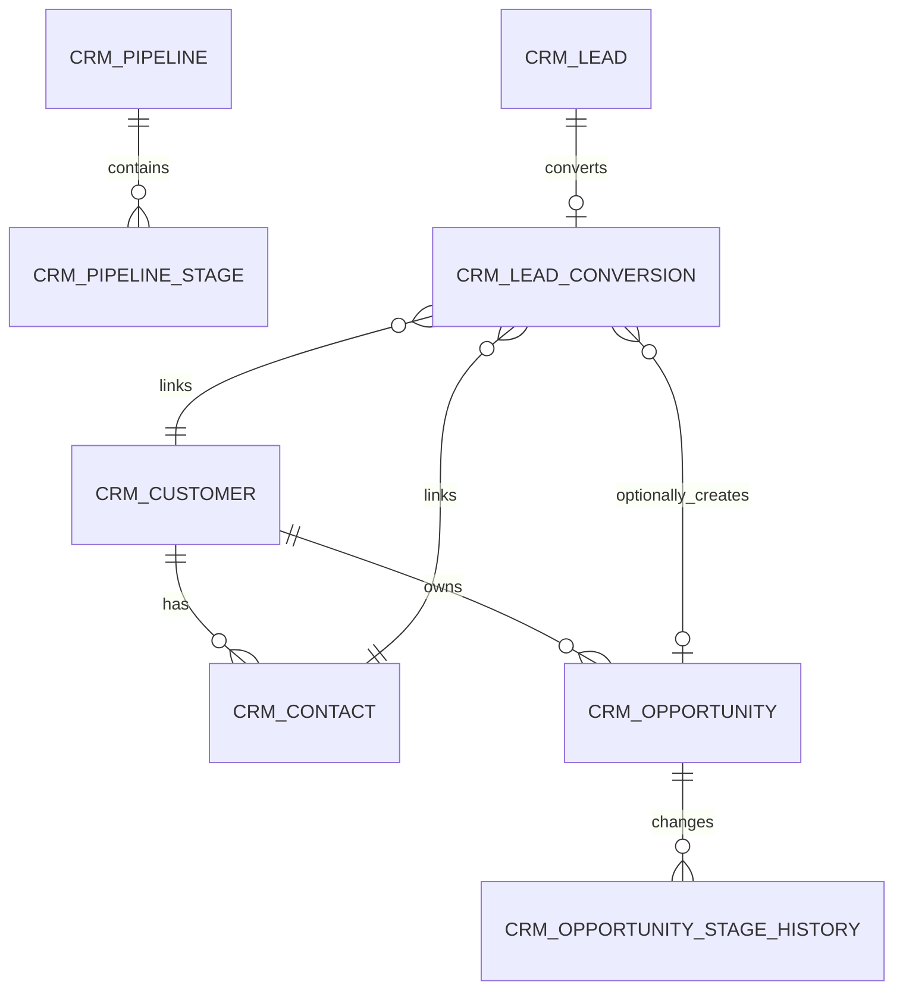

# CRM 销售管道

> 本文档是 CRM 模块的系统真相，AI 修改 CRM 代码前必须先读。
> 架构总览见 [architecture.md](architecture.md)，API 契约见 [api-contract.md](api-contract.md)，开发规范见 [backend-patterns.md](backend-patterns.md) / [frontend-patterns.md](frontend-patterns.md)。
> 设计基线存档见 [design/crm-design.md](design/crm-design.md)。

CRM 是独立微服务 `omni-crm`，覆盖售前闭环：线索 → 跟进 → 客户/联系人 → 商机 → 赢单或输单。产品、报价、合同、订单、开票、回款、营销自动化和客服工单不在 CRM 范围内。

## 1. 服务边界

| 项目 | 值 |
|---|---|
| Maven 模块 | `omni-crm` |
| 服务端口 | `8104` |
| 管理端口 | `19904` |
| XXL-JOB 执行器 | `omni-crm` / `9904` |
| 数据库 | `omni_crm` |
| Gateway 路由 | `/api/crm/**` → `lb://omni-crm`（不使用 StripPrefix） |
| Redis | DB 0，共享 Auth 的 XSS 配置，键前缀 `crm:` |

**依赖模块**：`omni-common-core`、`omni-common`、`omni-common-mybatis`、`omni-common-redis`、`omni-common-operlog`、`omni-common-job`、`omni-common-mqlog`。

**不要依赖** `omni-common-workflow`，否则会把 Flowable 引擎嵌入 CRM。

**跨服务调用**：通过 OpenFeign + `X-Internal-Token` 调用 Auth 内部 API，CRM 只存 userId/unitId，不跨库读取 `omni_auth`。

## 2. 领域模型

### 2.1 聚合与表

| 聚合 | 表 | 职责 |
|---|---|---|
| Lead | `crm_lead`、`crm_lead_conversion` | 线索生命周期、转换幂等 |
| Customer | `crm_customer`、`crm_contact` | 客户档案、联系人、客户 360 |
| Opportunity | `crm_opportunity`、`crm_opportunity_stage_history` | 阶段、金额、概率、赢/输单历史 |
| Activity | `crm_activity` | 计划、完成、取消跟进 |
| Pipeline | `crm_pipeline`、`crm_pipeline_stage` | 管道与阶段定义 |
| Ownership Audit | `crm_owner_change_log` | 负责人变更的不可变历史 |



`crm_activity` 用 `root_type + root_id` 多态关联 Lead/Customer/Opportunity。Service 必须验证目标存在、同租户且当前用户可访问。

### 2.2 通用字段规则

每张 `crm_*` 表都必须有 `tenant_id`。可授权业务表还必须有：

- `tenant_id` — 租户隔离
- `owner_user_id` — SELF 范围和业务负责人
- `owner_unit_id` — DEPT/DEPT_AND_BELOW/CUSTOM 范围
- `version` — 乐观锁
- `deleted` — 逻辑删除
- `id/create_time/update_time/create_by/update_by` — 审计字段

**关键约束**：

- 用户/组织 ID 由 Auth 管理，不建跨库外键，不信任前端提交的用户名或 ownerUnitId
- 金额用 `DECIMAL(18,2)` / `BigDecimal`，币种用 ISO 4217 三位码，MVP 所有商机强制租户默认币种
- 时间统一 `yyyy-MM-dd HH:mm:ss`
- `lead_no/customer_no/opportunity_no` 由数据库 ID 生成，tenant 内唯一
- 普通 PUT 不允许直接修改 owner、status 或 stage
- 外部请求不得使用裸 `selectById/updateById/deleteById`

## 3. 安全架构

### 3.1 六层纵深

```
Gateway JWT 验证 → CRM Tenant 校验 → Spring Security @PreAuthorize
→ @CrmDataScope 切面 → MyBatis DataPermission 拦截器 → CrmRecordAccessGuard 行级写授权
```

1. Gateway 验证 RS256 JWT，覆盖注入 `X-User-*`、`X-Tenant-Id`、`X-Gateway-Forwarded`
2. `GatewayPreAuthFilter` 构建 `Authentication`，校验 userId/tenantId
3. Controller `@PreAuthorize` 验证功能权限
4. `@CrmDataScope(permissionCode)` 切面调 Auth 内部 API 解析 dataScope
5. MyBatis-Plus 追加 tenant + owner 条件
6. `CrmRecordAccessGuard` 校验写操作行级授权

**失败关闭**：缺 tenant → 401，缺 scope → `id=-1`（零数据可见），Auth 不可用 → 503。绝不降级为无过滤。

### 3.2 MyBatis 拦截器顺序

CRM 自定义 `mybatisPlusInterceptor`，顺序固定不可调换：

```
TenantLineInnerInterceptor → DataPermissionInterceptor → PaginationInnerInterceptor
```

- TenantLine 只处理 `crm_*` 表
- `sys_mq_message` 排除两个权限拦截器（Relay 按设计扫描所有租户）
- DataPermission 必须在 Pagination 前，保证 COUNT 和 records 同范围
- Pipeline/Stage 只受 tenant + 功能权限控制

### 3.3 DataScope 映射

| dataScope | SQL 条件 |
|---|---|
| SELF | `owner_user_id = currentUserId` |
| DEPT | `owner_unit_id = primaryUnitId` |
| DEPT_AND_BELOW / CUSTOM | `owner_unit_id IN accessibleUnitIds` |
| TENANT / ALL | 不加 owner 条件，TenantLine 始终保留 |

### 3.4 写操作行级授权

DataPermissionInterceptor 不保护写入。每个更新/删除/转换/转移/阶段命令必须：

1. 以 `tenant_id + id + data scope` 查询可见记录（不可见 → 404，防 ID 枚举）
2. 校验状态机和业务不变量
3. 以 `tenant_id + id + version` 条件更新
4. 更新行数非 1 时返回并发冲突

### 3.5 权限码清单

| 资源 | 权限码 |
|---|---|
| Overview | `crm:overview:list` |
| Lead | `crm:lead:list/create/update/delete/assign/convert/disqualify` |
| Customer | `crm:customer:list/create/update/delete/transfer/status/blacklist` |
| Contact | `crm:contact:list/create/update/delete` |
| Opportunity | `crm:opportunity:list/create/update/delete/assign/stage/reopen` |
| Activity | `crm:activity:list/create/update/delete/complete/cancel` |
| Owner 候选 | `crm:owner:list` |
| PII 查看 | `crm:pii:view` |

表中 `/` 是同一资源下多个完整权限码的简写，落库时逐条保存完整 code。`@PreAuthorize` 与 `@CrmDataScope` 使用同一个完整权限码。

### 3.6 PII 掩码

- 完整手机、邮箱、地址只返回给持有 `crm:pii:view` 的用户
- 其他用户后端 VO 直接返回掩码值（`138****1234`、`a***@example.com`），不依赖前端遮挡
- 列表默认掩码，详情按权限决定
- 重复检测只返回最小候选摘要

### 3.7 XSS 防护

CRM 实现 `XssConfigProvider` SPI，读取 Redis DB 0 的 `xss:enabled:{tenantId}` 和 `xss:rules:{tenantId}`。缓存 miss 时回源 Auth 或使用内置基线规则，不关闭防护。MVP 备注只允许纯文本，前端禁止 `v-html`。

### 3.8 角色与 dataScope

| 角色 | dataScope | 能力 |
|---|---|---|
| `CRM_ADMIN` | TENANT | 当前租户全部 CRM 功能/数据 |
| `SALES_MANAGER` | DEPT_AND_BELOW | 部门及下级、分配/转移、统计 |
| `SALES_REP` | SELF | 自己负责的数据及常规销售操作 |
| `CRM_VIEWER` | TENANT | 租户级只读，不默认授予 PII |
| `SUPER_ADMIN` | ALL | 所有功能，CRM 数据仍限当前租户 |

默认 USER 角色不授予 CRM 权限。

## 4. 状态机与核心流程

### 4.1 Lead 生命周期

```
[*] → NEW → FOLLOWING → QUALIFIED → CONVERTED → [*]
NEW/FOLLOWING/QUALIFIED → DISQUALIFIED
DISQUALIFIED → FOLLOWING（重新激活）
```

- 只有 `QUALIFIED` 可转换；`DISQUALIFIED` 必填原因；`CONVERTED` 为终态

### 4.2 Customer 状态

```
POTENTIAL → ACTIVE → DORMANT / LOST / BLACKLISTED
DORMANT / LOST / BLACKLISTED → ACTIVE
```

Opportunity 赢单可将 POTENTIAL 自动转为 ACTIVE。客户有开放商机时不能直接删除。BLACKLISTED 使用独立命令和 `crm:customer:blacklist` 权限。

### 4.3 Opportunity 阶段

```
DISCOVERY → QUALIFICATION → PROPOSAL → NEGOTIATION → WON / LOST
```

- 开放阶段可前进或回退，回退必须写原因
- LOST 必填输单原因；WON/LOST 为终态
- 重开需要 `crm:opportunity:reopen`，恢复到最后一个开放阶段
- 所有迁移追加 Stage History，普通 PUT 不接受 stage/status

### 4.4 Activity 状态

```
PLANNED → COMPLETED / CANCELLED
CANCELLED → PLANNED（重新计划）
```

### 4.5 Lead 转换流程

```
POST /lead/{id}/convert → SELECT Lead FOR UPDATE
→ 查询已有 Conversion（幂等检查）
→ 创建或关联 Customer + Contact
→ 可选创建 Opportunity
→ INSERT Conversion + Lead → CONVERTED
→ INSERT Outbox 事件（同事务）
```

转换使用行锁 + `lead_id` 唯一约束双重幂等。已转换的 Lead 再次请求直接返回已有结果。Feign、Workflow 和真实 MQ 发送不在 CRM DB 事务内，事件只写本地 Outbox。

## 5. API 入口索引

### 5.1 通用契约

- 所有响应 `R<T>`，分页 `R<PageResult<T>>`
- `page=1`、`size=10`，最大 `size=100`
- Entity 不作为 Request/Response，状态命令使用独立 DTO
- 日期参数 `@DateTimeFormat(pattern = "yyyy-MM-dd HH:mm:ss")`
- 状态/转换/转移请求携带 `version`
- 写接口同时声明 `@PreAuthorize` 和 `@OperLog`

### 5.2 端点总览

所有端点以 `/api/crm` 为前缀。

| 领域 | 端点 |
|---|---|
| Overview | `GET /overview/summary`、`/funnel`、`/follow-ups` |
| Pipeline | `GET /pipeline/list`、`/{id}/stages` |
| Lead | `GET /lead/list`、`/{id}`、`POST /lead`、`PUT/DELETE /lead/{id}` |
| Lead 命令 | `POST /lead/duplicate-check`、`/{id}/assign`、`/batch-assign`、`/{id}/qualify`、`/disqualify`、`/reopen`、`/convert` |
| Customer | `GET /customer/list`、`/{id}`、`/{id}/overview`、`POST /customer`、`PUT/DELETE /customer/{id}` |
| Customer 命令 | `POST /customer/duplicate-check`、`/{id}/status`、`/{id}/transfer` |
| Contact | `GET /contact/list`、`/customer/{id}/contact/list`、`POST /customer/{id}/contact`、`PUT/DELETE /contact/{id}`、`POST /contact/{id}/primary` |
| Opportunity | `GET /opportunity/list`、`/board`、`/{id}`、`/{id}/stage-history`、`POST /opportunity`、`PUT/DELETE /opportunity/{id}` |
| Opportunity 命令 | `POST /opportunity/{id}/assign`、`/stage`、`/reopen` |
| Activity | `GET /activity/list`、`/timeline`、`/{id}`、`POST /activity`、`PUT/DELETE /activity/{id}` |
| Activity 命令 | `POST /activity/{id}/complete`、`/cancel`、`/reschedule` |
| Owner 选项 | `GET /options/owners` |

### 5.3 Customer 360 分块权限

`/customer/{id}/overview` 返回联系人、商机、活动、线索摘要。但这不是"客户可见即所有子数据可见"——每块用各自的 list permission 独立解析数据范围，缺少某块权限时不查询该块。实现用 `CrmPermissionScopeExecutor` 逐块建立和清理 scope。

### 5.4 Overview 聚合查询

`summary()`、`funnel()`、`followups()` 使用 Mapper 层聚合 SQL（`GROUP BY` / `UNION ALL`），不全量加载再内存过滤。DataPermissionInterceptor 自动作用于聚合查询。

## 6. 跨服务集成

### 6.1 Auth Feign

- CRM 只存 userId/unitId，分配前通过 Auth 内部 API 验证用户存在、启用、同租户
- ownerUnitId 取 Auth 权威主组织，不信任前端
- 列表展示先收集 ID 再一次 batch API，禁止逐行 Feign（N+1）
- Auth 不可用时：dataScope → 503 失败关闭；展示 enrich → 可返回 ID/未知用户

### 6.2 Outbox 事件

使用 `ReliableMessageRelay.send("crm-domain-out-0", envelope, tenantId, eventId)` 写本地 Outbox，tenantId 必须显式传入。

事件信封包含 `eventId`、`eventType`、`tenantId`、`aggregateType/Id/Version`、`actorUserId`。事件只传 ID 和状态快照，不传完整 PII。

已定义事件：`crm.lead.converted.v1`、`crm.opportunity.stage-changed/won/lost.v1`。

### 6.3 操作日志

`@OperLog` 已支持 PII 脱敏。Owner Change 和 Stage History 是同步领域事实，不能用异步通用日志代替。

## 7. 硬约束

修改 CRM 代码前必须遵守的规则：

1. **租户隔离**：所有 `crm_*` 表必须有 `tenant_id`，TenantLine 始终追加，普通 API 永不跨租户
2. **乐观锁**：所有写操作必须 `tenant_id + id + version` 条件更新
3. **失败关闭**：缺 tenant → 401，缺 scope → `id=-1`，Auth 不可用 → 503，绝不降级
4. **ThreadLocal 清理**：`CrmDataScopeContext` 必须在 `finally` 块清理，防内存泄漏
5. **权限双声明**：写接口必须同时声明 `@PreAuthorize`（功能权限）和 `@CrmDataScope`（数据范围），使用同一个完整权限码
6. **PII 后端掩码**：无 `crm:pii:view` 时后端 VO 直接返回掩码，不依赖前端
7. **Outbox tenantId 显式**：`ReliableMessageRelay.send()` 必须显式传 `Long tenantId`，禁止 ThreadLocal 隐式
8. **拦截器顺序**：TenantLine → DataPermission → Pagination，不可调换
9. **写授权**：DataPermissionInterceptor 不保护写入，必须 AccessGuard 行级校验
10. **状态机**：普通 PUT 不接受 status/stage 变更，必须走专用命令端点
11. **MySQL DATETIME 范围**：不可用 `LocalDateTime.MIN/MAX` 作为查询参数，用 `LocalDateTime.of(2000,1,1,0,0)` 等合理值
12. **Pipeline 只读**：MVP 管道和阶段由租户初始化自动创建，不提供管理 UI
13. **Activity 多态**：`root_type + root_id` 关联，Service 必须验证目标存在且可访问
14. **`sys_mq_message` 排除权限拦截器**：Relay 扫描所有租户，用户查询仍需显式 tenant 过滤

## 8. 前端结构

```
omni-frontend/src/
├── api/
│   ├── crm-overview.ts        # 概览聚合 API
│   ├── crm-lead.ts            # 线索 CRUD + 命令
│   ├── crm-customer.ts        # 客户 CRUD + 360 + 转移
│   ├── crm-contact.ts         # 联系人 CRUD
│   ├── crm-opportunity.ts     # 商机 CRUD + 看板 + 阶段
│   └── crm-activity.ts        # 活动 CRUD + 时间线
├── views/crm/
│   ├── overview/index.vue     # 销售概览
│   ├── lead/index.vue         # 线索管理
│   ├── customer/index.vue     # 客户管理
│   ├── contact/index.vue      # 联系人管理
│   ├── opportunity/index.vue  # 商机管理
│   └── activity/index.vue     # 跟进活动
└── components/crm/
    ├── OwnerSelector.vue      # 负责人选择器
    ├── CustomerPicker.vue     # 客户选择器
    ├── ActivityTimeline.vue   # 活动时间线
    ├── OpportunityStageBoard.vue  # 商机看板
    └── CustomerOverview.vue   # 客户 360 视图
```

- `ApiResponse/PageResult` 只从 `src/types/api.ts` 导入
- 按钮使用 `v-permission` 同码指令，但后端是最终安全边界
- Customer 360 使用 Drawer 组件
- Opportunity 页面提供表格 + Kanban 双视图

## 9. 扩展指南

### 新增聚合根

1. 在 `omni_crm` 数据库加表，必须包含 `tenant_id`、`owner_user_id`、`owner_unit_id`、`version`、`deleted` 和审计字段
2. 创建 Entity（extends BaseEntity）、Mapper、Service 接口 + Impl、Controller
3. 在 `CrmDataPermissionHandlerImpl` 中注册新表的 owner 列映射
4. 在 `init-all.sql` 中追加 DDL 和权限种子数据
5. Controller 写接口声明 `@PreAuthorize` + `@CrmDataScope`，使用新的 `crm:<resource>:<action>` 权限码

### 新增 Opportunity 阶段

MVP 管道不可配置。如果未来开放，需要：
1. 后端 `crm_pipeline_stage` 表 CRUD 接口
2. 前端管道配置页面
3. 已有商机引用旧阶段时的迁移策略

### 新增权限码

1. 在 `init-all.sql` 的 `sys_permission` 中插入新权限，type 为 `API`
2. 按角色分配到 `sys_role_permission`
3. Controller 方法声明 `@PreAuthorize("hasAuthority('crm:<resource>:<action>')")` + `@CrmDataScope("crm:<resource>:<action>")`
4. 前端对应按钮添加 `v-permission="'crm:<resource>:<action'"`

### 接入 Outbox 事件

1. 在 Service 业务方法中，同事务调用 `ReliableMessageRelay.send("crm-domain-out-0", envelope, tenantId, eventId)`
2. `tenantId` 必须显式从上下文获取，禁止 ThreadLocal
3. 事件信封遵循统一格式，payload 不含完整 PII
4. 消费者必须幂等，以 `payload.eventId` 做业务去重

## 10. 测试

CRM 模块有 16 个测试文件，覆盖：

- 状态机合法/非法迁移
- Lead 转换幂等与并发
- Customer 转移级联
- PII 掩码
- 六种 dataScope 的列表和聚合
- 跨租户隔离（真实 MySQL 集成测试）
- 缺 tenant/scope 失败关闭

运行测试：

```bash
cd omni-backend && ./mvnw clean install -pl omni-crm -am
```

真实 MySQL 拦截器集成测试需外部测试库，默认跳过：

```bash
CRM_TEST_MYSQL_URL='jdbc:mysql://127.0.0.1:3306/crm_it?...' \
./mvnw -pl omni-crm -am -Dtest=CrmMysqlInterceptorIntegrationTest test
```
