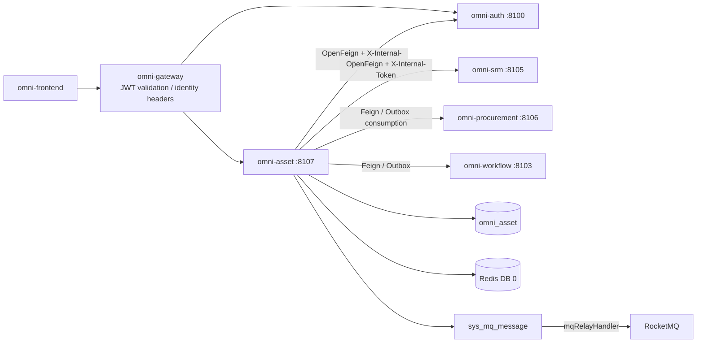
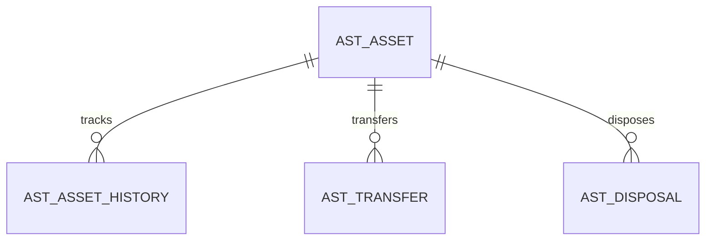
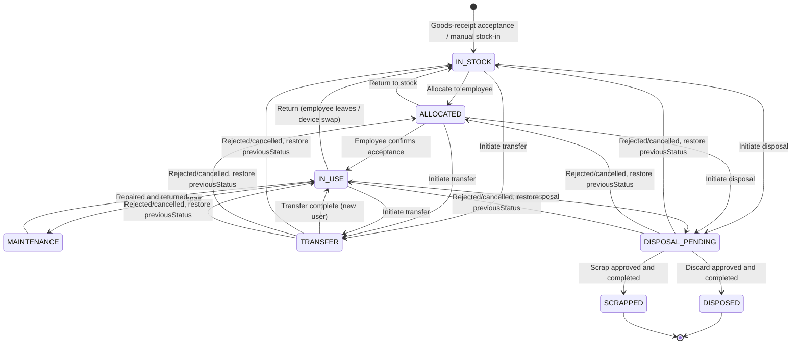
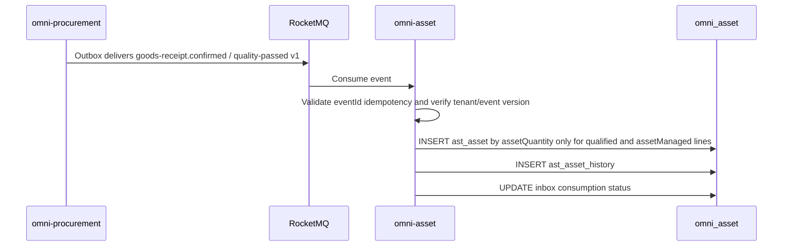
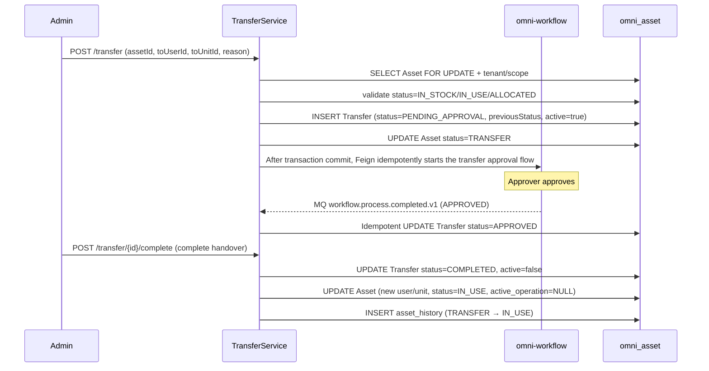
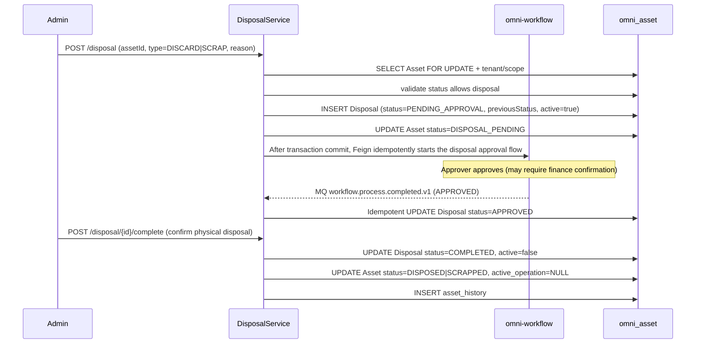

# Asset Management Module Architecture and Implementation Baseline

> Status: MVP implemented and verified
> Project: Omni-Stack
> Date: 2026-07-27
> Goal: Describe the architecture, cross-service contracts, and implementation boundaries of the omni-asset MVP; the implementation entry points are `omni-backend/omni-asset` and `omni-frontend/src/views/asset`.

Design basis: `README.md`, and all topic documents in `docs/` — architecture, api-contract, backend-patterns, frontend-patterns, core-flows, scheduling, workflow, mq-reliability, docker-deployment; also references `docs/design/srm-design.md` and `docs/design/procurement-design.md`.

## 1. Design Conclusion

Asset management should be built as an independent Servlet microservice that manages the complete lifecycle of assets from procurement goods-receipt to final disposal. SRM provides supplier information, Procurement provides the procurement source, and Workflow provides approval capability.

| Item | Decision |
|---|---|
| Maven module / service name | `omni-asset` |
| Local port / management port | `8107` / `19907` |
| XXL-JOB executor | `omni-asset` / `9907` (when depreciation calculation or maintenance reminders are enabled) |
| Database | `omni_asset` |
| Gateway | `/api/asset/**` → `lb://omni-asset`, without `StripPrefix` |
| Redis | DB 0, shares the XSS configuration written by Auth; keys use the `asset:` prefix |
| Frontend | Continue to use `omni-frontend`, add `views/asset/**` |

The Asset MVP covers the closed loop of full asset lifecycle management:

> Procurement goods-receipt → asset acceptance and stock-in → allocation/assignment → in use → transfer → discard disposal / scrap disposal.

Depreciation calculation, asset stocktaking, and maintenance/repair work orders are not included in the MVP.

## 2. Product Scope

### 2.1 Users and Goals

| User | Core need |
|---|---|
| Administration/IT administrator | Manage all company assets, assign them to employees, handle disposal requests |
| Asset user | View assets under their own name, confirm acceptance or initiate a return |
| Department manager | View department assets, approve transfers and disposals |
| Finance staff | View the asset original value and current status, confirm scrapping |
| Asset administrator | Full-tenant asset management, configuration, and statistics |

The MVP should be able to answer: how many assets the company has and where they are distributed; who is currently using a given asset and in what status; which assets are idle and awaiting allocation; the total asset value of a given department; which assets are going through the disposal/scrap flow.

### 2.2 Phasing

| Phase | Capability |
|---|---|
| MVP | Asset ledger, asset acceptance (procurement linkage), asset allocation/return, asset transfer, discard disposal, scrap disposal, asset overview |
| Phase 2 | Asset stocktaking, depreciation calculation, maintenance/repair work orders, asset tags/barcodes, asset import/export |
| Phase 3 | Asset budget control, asset disposal auction, asset lifecycle cost analysis |

## 3. System Boundaries

| Component | Authoritative responsibility | How Asset uses it |
|---|---|---|
| `omni-auth` | Tenant, user, organization, role, permission, data scope, XSS configuration | Internal OpenFeign; stores only user/organization IDs |
| `omni-srm` | Supplier data | Internal OpenFeign to query supplier information (warranty contacts, etc.) |
| `omni-procurement` | Purchase orders, goods-receipt records | Consumes Outbox events to create asset cards; or Feign queries the procurement source |
| `omni-base` | Dictionary, operation logs | Operation log aggregation; asset category/location use dictionary codes |
| `omni-workflow` | BPMN, process instances, approvals, the sole Flowable engine runtime | Internal OpenFeign to start/query flows, consumes approval-result events |
| `omni-asset` | Asset ledger, asset status, asset disposal | The sole business writer |
| RocketMQ | Asynchronous transport | Consumes Procurement goods-receipt events, at-least-once idempotent |



Recommended dependencies: `omni-common-service` (Servlet business-service security, identity, tenant, DataScope, MyBatis, and XSS composition), plus `omni-common-operlog`, `omni-common-job`, and `omni-common-mqlog` enabled as needed. Asset still explicitly uses business dependencies such as Web, Validation, Security, OpenFeign, LoadBalancer, Nacos, RocketMQ Stream, and Actuator.

**Asset does not depend on `omni-common-workflow` and does not embed Flowable.** `omni-workflow` is an independent microservice and the sole Flowable runtime; Asset initiates flows through an internal Feign contract and receives approval results through reliable domain events.

## 4. Domain and Data Design

### 4.1 Aggregates

| Aggregate | Tables | Responsibility |
|---|---|---|
| Asset | `ast_asset`, `ast_asset_history` | Asset master data, immutable status-change history |
| Transfer | `ast_transfer` | Asset transfer records |
| Disposal | `ast_disposal` | Asset disposal records (discard/scrap shared) |



### 4.2 Common Fields and Rules

Every `ast_*` table must contain `tenant_id`. The asset aggregate root `ast_asset` must also contain:

- `tenant_id`: tenant isolation.
- `owner_user_id`: asset administrator (SELF scope).
- `owner_unit_id`: asset management department (DEPT scope).
- `version`: optimistic lock. Transfer and disposal requests also maintain their own `version`.
- `deleted`: logical deletion. The immutable history and the Inbox do not use logical deletion.
- `id/create_time/update_time/create_by/update_by`: audit fields.

Constraints:

- The asset number `asset_no` is unique within the tenant and generated from the database ID.
- User/organization IDs are managed by Auth; no cross-database foreign keys are created.
- Supplier IDs are managed by SRM; only `supplier_id` is stored.
- Procurement source IDs are managed by Procurement; `source_po_id/source_gr_id/source_gr_line_id/source_unit_sequence` are saved as idempotent traceability, and poNo/grNo display snapshots are also saved, without cross-database foreign keys.
- Amounts use `DECIMAL(18,2)` / `BigDecimal`.
- Times are uniformly `yyyy-MM-dd HH:mm:ss`.
- A normal PUT is not allowed to directly modify the asset status, user, or location (dedicated command endpoints are required).
- An asset cannot be recovered after disposal.
- At most one active transfer or disposal request may exist for the same asset at the same moment; `ast_asset.active_operation_type/active_operation_id` atomically occupies via a version-conditional update, uniformly preventing concurrency between the two request tables.

### 4.3 Main Tables

`ast_asset`

- `asset_no/name/category_code`: asset number, name, category (dictionary code).
- `specification/brand/model`: specification, brand, model.
- `supplier_id/supplier_name_snapshot`: supplier ID and the name snapshot at acceptance; the current name is batch-enriched through SRM, and the snapshot does not participate in permission or current-status decisions.
- `source_po_id/source_gr_id/source_gr_line_id/source_unit_sequence/source_po_no/source_gr_no`: procurement source and unit-level idempotency identifiers.
- `purchase_date/purchase_amount/currency_code`: purchase date, original value, currency.
- `location_code`: asset location (dictionary code, e.g., floor + room number).
- `status`: lifecycle status (IN_STOCK/ALLOCATED/IN_USE/MAINTENANCE/TRANSFER/DISPOSAL_PENDING/DISPOSED/SCRAPPED).
- `current_user_id`: current user; the name is batch-enriched from Auth and not persisted.
- `current_unit_id`: current using department; the name is batch-enriched from Auth and not persisted.
- `allocated_time`: allocation time.
- `active_operation_type/active_operation_id`: current active operation (TRANSFER/DISPOSAL) and request ID; NULL when there is no active operation.
- `warranty_expiry_date`: warranty expiry date.
- `expected_life_years`: expected service life (used as a scrapping reference).
- `remark`.
- `owner_user_id/owner_unit_id/version/deleted` and audit fields.
- Core indexes: tenant + owner/status, tenant + current_user_id, tenant + current_unit_id, tenant + category_code/status, tenant + asset_no (unique), tenant + source_gr_line_id + source_unit_sequence (procurement source unique; manual stock-in allows the source fields to be NULL).

`ast_asset_history`

- `asset_id/from_status/to_status/changed_by_user_id/changed_time/remark`.
- Append-only, never updated, never deleted. Records every asset status change and key operation (allocation, return, transfer, disposal).

`ast_transfer`

- `transfer_no/asset_id/from_user_id/from_unit_id/to_user_id/to_unit_id/from_location/to_location`.
- `reason/status/process_instance_id/previous_asset_status/active_flag`.
- `workflow_request_id/workflow_business_key/model_version_id/workflow_start_status/workflow_start_user_id/workflow_start_user_name`: Workflow idempotency snapshot and original initiator identity; `businessType=ASSET_TRANSFER` is fixedly derived from the transfer aggregate type.
- `status`: PENDING_APPROVAL/START_FAILED/APPROVED/REJECTED/COMPLETED/CANCELLED.
- `approved_time/completed_time`.
- `version/deleted` and audit fields.

`ast_disposal`

- `disposal_no/asset_id/disposal_type (DISCARD/SCRAP)/reason/previous_asset_status/active_flag`.
- `residual_value (residual value)/disposal_method (disposal method description)`.
- `status`: PENDING_APPROVAL/START_FAILED/APPROVED/REJECTED/COMPLETED/CANCELLED.
- `process_instance_id`: links to the omni-workflow approval process instance.
- `workflow_request_id/workflow_business_key/model_version_id/workflow_start_status/workflow_start_user_id/workflow_start_user_name`: Workflow idempotency snapshot and original initiator identity; `businessType=ASSET_DISPOSAL` is fixedly derived from the disposal aggregate type.
- `approved_time/completed_time`.
- `version/deleted` and audit fields.

## 5. State Machine and Core Flows

### 5.1 Asset Lifecycle



- `IN_STOCK`: the asset is in stock, unallocated.
- `ALLOCATED`: allocated to an employee, awaiting acceptance confirmation.
- `IN_USE`: the employee is using it.
- `MAINTENANCE`: sent for repair (the MVP only marks the status, no repair work order).
- `TRANSFER`: transfer in progress (awaiting approval and handover).
- `DISPOSAL_PENDING`: going through disposal approval; allocation, return, transfer, or duplicate disposal is forbidden.
- `DISPOSED`: discard disposal completed (terminal state).
- `SCRAPPED`: scrap disposal completed (terminal state).

Only assets in the `IN_STOCK`, `IN_USE`, or `ALLOCATED` status can initiate a transfer or disposal. Assets in the `MAINTENANCE`, `TRANSFER`, or `DISPOSAL_PENDING` status cannot initiate other business operations. The MVP provides two lightweight commands, `maintenance/start` and `maintenance/complete`, which only maintain the status and history without introducing repair work orders.

### 5.2 Asset Acceptance (Procurement Linkage)



**Idempotent consumption**: Asset maintains the `ast_inbox_event` table (`consumer_name + event_id` unique key), and simultaneously uses the `tenant_id + source_gr_line_id + source_unit_sequence` unique key on `ast_asset`. The former prevents duplicate execution of an entire real-time event; the latter uniformly protects real-time consumption, manual replay, and historical compensation rescan.

**Batch creation**: only lines with `qualityStatus=PASS && assetManaged=true && assetQuantity>0` are processed; assetQuantity must be a positive integer. If 5 laptops pass acceptance, 5 independent assets are created with unitSequence=1..5. Consumables, services, kg and other continuous-measure materials, and PENDING/FAIL lines do not create assets.

**Historical compensation**: when Asset goes live or repairs a consumption fault, it rescans historical goods-receipt candidates through Procurement's `/internal/procurement/goods-receipt/asset-candidates` cursor-paginated interface. Compensation data maps to the same source keys and reuses the same creation service; it must not be assumed that the Procurement Outbox or Broker will permanently retain messages for a consumer that is not yet deployed.

### 5.3 Asset Allocation and Return

```text
Allocate:
POST /asset/{id}/allocate (targetUserId, targetUnitId)
→ validate status=IN_STOCK
→ UPDATE asset SET current_user_id, current_unit_id, status=ALLOCATED, allocated_time
→ INSERT asset_history (IN_STOCK → ALLOCATED)

Acceptance confirmation:
POST /asset/{id}/accept
→ validate status=ALLOCATED
→ UPDATE asset SET status=IN_USE
→ INSERT asset_history (ALLOCATED → IN_USE)

Return:
POST /asset/{id}/return
→ validate status=IN_USE or ALLOCATED
→ UPDATE asset SET current_user_id=NULL, current_unit_id=NULL, allocated_time=NULL, status=IN_STOCK
→ INSERT asset_history (IN_USE → IN_STOCK)

Send for repair / repair:
POST /asset/{id}/maintenance/start → IN_USE → MAINTENANCE
POST /asset/{id}/maintenance/complete → MAINTENANCE → IN_USE
```

### 5.4 Asset Transfer



Transfer approval uses a simple single-level approval (approved by an administrator or department manager). The MVP does not do multi-level approval. When Workflow returns REJECTED or the user cancels, Asset must set the Transfer to a terminal state and `active=false` in the same transaction, and restore the Asset to `previous_asset_status`; when the flow-start result is uncertain, it keeps `PENDING_APPROVAL + PENDING` and retries with the same `tenantId + businessType + businessKey`, and local cancellation is not allowed. A Workflow business response of 404 means the model version can no longer be started and no instance was created remotely; it then enters `START_FAILED + FAILED` and can be retried or cancelled to restore.

### 5.5 Asset Disposal (Discard/Scrap)



Discard and scrap use the same approval flow; the difference is:
- **Discard (DISCARD)**: the asset is no longer used and is discarded directly. It may need to record the disposal method (donation, recycling, destruction).
- **Scrap (SCRAP)**: the asset has reached its service life or is damaged beyond repair and is formally scrapped. It may need to record the residual value.

The approval flow can configure different approvers (scrapping may require finance confirmation, while discarding only needs the administration manager).

When a disposal approval is rejected, cancelled, or cancelled after a start failure, the Asset must be restored to `previous_asset_status`, and the request's active_flag and the Asset's `active_operation_*` must be cleared. Both transfer and disposal creation must atomically occupy under the condition `tenant_id + asset_id + version + active_operation_id IS NULL`; if the number of updated rows is not 1, return 409, blocking cross-concurrency between the two request types at the database layer.

## 6. Tenant, RBAC, and Data Permissions

### 6.1 Trust Chain

Consistent with other Servlet business services: Gateway JWT → `GatewayPreAuthenticationFilter` pre-authentication → `ServiceIdentityFilter` tenant/identity validation → `@PreAuthorize` → `@ServiceDataScope` → MyBatis DataPermission → `AssetRecordAccessGuard`.

### 6.2 Permission Tree and Roles

Menus: `asset` (DIRECTORY) and `asset:overview`, `asset:asset`, `asset:transfer`, `asset:disposal` (MENU).

API permissions:

- `asset:overview:list`
- `asset:asset:list/self/create/update/delete/allocate/accept/return/maintenance`
- `asset:transfer:list/create/approve/complete/cancel/retry`
- `asset:disposal:list/create/approve/complete/cancel/retry`

| Role | dataScope | Capability |
|---|---|---|
| `ASSET_ADMIN` | TENANT | All asset functions/data of the current tenant |
| `ASSET_MANAGER` | DEPT_AND_BELOW | Department and below, transfer/disposal approval |
| `ASSET_USER` | SELF | View assets under their own name, confirm acceptance, and initiate returns through the "my assets" endpoint |
| `SUPER_ADMIN` | ALL | All functions; asset data is still limited to the current tenant |

The default USER is not granted asset permissions.

### 6.3 Asset Context and SQL Interception

The cross-module context and persistence-layer assembly are provided by `omni-common-service`: request identity uses `ServiceIdentityContext` / `ServiceRequestIdentity`, data scope uses `@ServiceDataScope` / `ServiceDataScopeContext`, and `ServicePersistenceAutoConfiguration` assembles the interceptors. Asset only keeps the domain policies `AssetTenantTablePolicy`, `AssetDataPermissionHandler`, and the write-operation guard `AssetRecordAccessGuard`.

The interceptor order is fixed: `TenantLineInnerInterceptor → DataPermissionInterceptor → OptimisticLockerInnerInterceptor → PaginationInnerInterceptor`. `AssetTenantTablePolicy` takes effect only on `ast_*` tables; `sys_mq_message` must remain outside tenant interception to allow the background Relay to scan across tenants.

| dataScope | Condition |
|---|---|
| SELF | The owner or current_user column mapped by the current permission equals currentUserId |
| DEPT | The owner_unit or current_unit column mapped by the current permission equals primaryUnitId |
| DEPT_AND_BELOW / CUSTOM | The unit column mapped by the current permission IN accessibleUnitIds |
| TENANT / ALL | No owner condition is added; TenantLine is always retained |

The asset dataScope has a management dimension and a usage dimension; a broad OR must not be used in generic SQL, and it must be explicitly mapped by permissionCode/endpoint:

| Endpoint/permission | Scope column | Rule |
|---|---|---|
| `/asset/list`, detail, management history; `asset:asset:list` | `owner_user_id/owner_unit_id` | For asset management staff, filtered by management ownership |
| `/asset/my`; `asset:asset:self` | `current_user_id` | Fixed to equal the current user, not widened by a broader dataScope of another role |
| accept/return; corresponding command permission | `current_user_id` | RecordAccessGuard enforces that the target asset is currently allocated to currentUserId |
| Transfer/Disposal list/detail | The management dimension of the associated Asset | Child tables inherit through the asset_id of the same tenant, without directly concatenating non-existent owner columns |
| Transfer/Disposal approval-view | Workflow taskId assignment relationship | First verify the current user is the task approver of that tenant/business document, then read the read-only VO by tenant + id |
| Overview | Asset management dimension | The aggregate SQL uses the same scope as `/asset/list` |

If a user holds both ASSET_USER and a management role, the frontend still calls "my assets" and the management list separately; the backend must not OR-merge the two dimensions for write authorization.

## 7. API Design

### 7.1 Common Contract

Consistent with other services.

### 7.2 Endpoints

| Domain | Endpoints |
|---|---|
| Overview | `GET /api/asset/overview/summary`, `/distribution` |
| Asset | `GET /asset/list`, `GET /asset/{id}`, `POST /asset`, `PUT/DELETE /asset/{id}` |
| My assets | `GET /asset/my` |
| Asset commands | `POST /asset/{id}/allocate`, `/accept`, `/return`, `/maintenance/start`, `/maintenance/complete` |
| Asset history | `GET /asset/{id}/history` |
| Transfer | `GET /transfer/list`, `GET /transfer/{id}`, `POST /transfer` |
| Transfer approval view | `GET /transfer/{id}/approval-view?taskId={taskId}` |
| Transfer commands | `POST /transfer/{id}/complete`, `/cancel`, `/retry-start`; approval actions are completed in Workflow |
| Disposal | `GET /disposal/list`, `GET /disposal/{id}`, `POST /disposal` |
| Disposal approval view | `GET /disposal/{id}/approval-view?taskId={taskId}` |
| Disposal commands | `POST /disposal/{id}/complete`, `/cancel`, `/retry-start`; approval actions are completed in Workflow |
| Internal API | `POST /api/internal/asset/procurement/backfill?tenantId={tenantId}&afterId={id}&size={size}`, protected by an internal token |

### 7.3 Endpoint to DataScope Permission Mapping

| Operation | permissionCode |
|---|---|
| Overview | `asset:overview:list` |
| Asset list/detail/history | `asset:asset:list` |
| My Asset | `asset:asset:self` |
| Asset create/update/delete | `asset:asset:create/update/delete` |
| Asset allocate | `asset:asset:allocate` |
| Asset accept (employee self-use) | `asset:asset:accept` |
| Asset return | `asset:asset:return` |
| Asset maintenance start/complete | `asset:asset:maintenance` |
| Transfer list/detail | `asset:transfer:list` |
| Transfer create | `asset:transfer:create` |
| Transfer approval-view | `asset:transfer:approve` |
| Transfer complete | `asset:transfer:complete` |
| Transfer cancel/retry-start | `asset:transfer:cancel/retry` |
| Disposal list/detail | `asset:disposal:list` |
| Disposal create | `asset:disposal:create` |
| Disposal approval-view | `asset:disposal:approve` |
| Disposal complete | `asset:disposal:complete` |
| Disposal cancel/retry-start | `asset:disposal:cancel/retry` |

## 8. Cross-Service Consistency

### 8.1 Auth Feign

Consistent with other services.

### 8.2 SRM Feign

Asset obtains supplier information through the SRM internal API (asset entry candidates, warranty contacts, supplier status):

- `GET /api/internal/supplier/{id}?tenantId={tenantId}`: get the supplier summary.
- `GET /api/internal/supplier/search?...&status=APPROVED&keyword={keyword}`: search approved suppliers of the current tenant.
- The asset entry page calls `/api/asset/options/suppliers`, showing the number and name, and no longer requires the user to manually enter a numeric ID;
  historical details still use the local name snapshot for display when SRM is temporarily unavailable.

### 8.3 Procurement Linkage

**Event consumption**: Asset consumes `procurement.goods-receipt.confirmed.v1` and `procurement.goods-receipt.quality-passed.v1` to create asset cards. Both use the same payload line contract and source-unit idempotency key; quality-passed only contains lines newly turned from PENDING to PASS.

The event envelope takes `procurement-design.md` 8.4 as the authoritative contract and must contain eventId/eventType/occurredAt/tenantId, as well as goodsReceiptId, grNo, purchaseOrderId, poNo, the supplier snapshot, currency, and per-line goodsReceiptLineId, purchaseOrderLineId, material/category, qualityStatus, assetManaged, assetQuantity, unitPrice. When the tenant, source line ID, asset-managed flag, or version is missing or unsupported, it enters consumption failure/dead letter; guessing default values to create assets is forbidden.

Consumption flow:
1. The RocketMQ Consumer receives the message.
2. Validate the event `tenantId`, use `ServiceRequestIdentity` to set `ServiceIdentityContext`, and set the current tenant's `TENANT`-level `ServiceDataScopeContext`; both must be cleared in a `finally` block at the end of consumption.
3. Idempotency check: the `ast_inbox_event` table (`consumer_name + event_id` unique key).
4. Create asset records by unitSequence for goods-receipt lines that meet the asset-managed conditions, relying on the source unique key as a fallback.
5. Update the inbox consumption status in the same transaction.

**Feign query** (optional): Asset can query procurement source details (PO number, amount, supplier) through the Procurement internal API.

**Compensation rescan**: a controlled task after Asset startup calls the Procurement asset-candidate pagination API until the cursor is exhausted; real-time events and the rescan share the same idempotent creation logic. The rescan must likewise explicitly set the current tenant's `TENANT`-level `ServiceDataScopeContext` to avoid the validation query after the source-idempotent write being filtered by the fail-closed rule; the shared identity and DataScope context are cleared after the request ends.

### 8.4 Workflow Integration

Asset does not embed Flowable and integrates through the Workflow internal API and approval-result events. Scenarios requiring approval:

- Asset transfer approval (MVP simple single-level approval).
- Asset discard disposal approval.
- Asset scrap disposal approval (may require finance confirmation).

The approval flow follows the `docs/workflow.md` specification. One BPMN process model per approval type; the model key can be customized by the tenant,
but the model `category` must be precisely bound to the purpose: transfer is `ASSET_TRANSFER`, and discard/scrap disposal is
`ASSET_DISPOSAL`.

When a user creates a transfer or disposal request, `modelVersionId` is not passed. Asset first calls the Workflow
`current-published` internal query by the current tenant and fixed business category, automatically selecting a version that is published, has a process definition, and whose `category` matches the business type, then saves
`requestId/tenantId/modelVersionId/businessType/businessKey/startUser/variables` as a local idempotency snapshot.
At actual startup, Workflow validates the model again, closing the change window between resolution and startup. Workflow is idempotent and unique on
`tenantId + businessType + businessKey`; duplicate calls return the existing instance.

Approvers perform approvals through Workflow `/api/workflow/approval/{taskId}/complete`. A role undertaking asset approval must simultaneously obtain the corresponding `asset:transfer:approve` or `asset:disposal:approve` (to read the dedicated approval-view) and `workflow:approval:complete` (to complete their own task). The approval-view must validate the tenant, businessType, businessKey, and current task assignment, and cannot serve as a generic bypass of the normal dataScope.

Approval completion is published by the Workflow Outbox as `workflow.process.completed.v1`. Asset consumes it idempotently by Inbox eventId and strictly checks the tenantId, businessType, businessKey, processInstanceId, and current request status:

- APPROVED: the request enters APPROVED, awaiting the business `/complete` to finish handover or physical disposal.
- REJECTED/CANCELLED: the request enters the corresponding terminal state, restores Asset.previousStatus, and clears `active_operation_*`.
- Duplicate, out-of-order, or instance-mismatched events only log a warning and do not change the asset.

The MVP completion event does not carry approvers or approval comments that may contain sensitive information, and Asset does not redundantly store such snapshots; the complete task,
handler, and comments always take the Workflow query result as authoritative.

When Workflow is unavailable, returns 409/other uncertain-result responses, or the response is lost, the remote result may already have been accepted; the request keeps `PENDING_APPROVAL + PENDING` and the asset occupancy status, and can only be retried with the original requestId, business key, model version, and initiator identity. A Workflow business response of 404 is an explicit failure that the remote transaction did not create an instance; only after entering `START_FAILED + FAILED` is an authorized user allowed to cancel locally and restore. Asset does not depend on `omni-common-workflow`; Flowable tables exist only in the `omni-workflow` database.

### 8.5 Outbox Events

- `asset.created.v1` (acceptance creation)
- `asset.allocated.v1`
- `asset.returned.v1`
- `asset.transfer.completed.v1`
- `asset.disposed.v1`
- `asset.scrapped.v1`

## 9. Privacy, Operation Logs, and XSS

### 9.1 OperLog

Reuses the existing PII masking capability. Asset has relatively few PII fields, mainly asset user information (already managed in Auth).

### 9.2 PII

The asset itself does not contain sensitive PII. User information is displayed through Auth; Asset stores only the userId.

### 9.3 XSS

Asset obtains the unified XSS configuration through `omni-common-service`'s `CachedServiceXssConfigProvider`: it first reads the Redis DB 0 cache, and on a cache miss falls back to Auth with an internal identity; when Auth or Redis is unavailable, it must fall to the safe baseline, and bypassing sanitization due to a configuration-center failure is forbidden. MVP remarks allow plain text only.

## 10. Frontend Design

```text
omni-frontend/src/
├── api/
│   ├── asset-overview.ts
│   ├── asset-asset.ts
│   ├── asset-transfer.ts
│   └── asset-disposal.ts
├── views/asset/
│   ├── overview/index.vue           # Asset overview (stats + distribution)
│   ├── asset/index.vue              # Asset ledger
│   ├── transfer/index.vue           # Asset transfer
│   └── disposal/index.vue           # Asset disposal
└── components/asset/
    ├── AssetCard.vue                # Asset card (for overview)
    ├── AssetDistribution.vue        # Asset distribution chart
    ├── TransferForm.vue             # Transfer form
    └── DisposalForm.vue             # Disposal form
```

- `ApiResponse/PageResult` are imported only from `src/types/api.ts`.
- The asset ledger supports multi-dimensional filtering by status, category, department, and location.
- The asset detail page shows basic information + user + procurement source + change history + transfer records + disposal records.
- The overview page shows the total number of assets, total value, distribution by status, distribution by department, and distribution by category.
- `router/index.ts` and the `layout/index.vue` iconMap add Asset.

## 11. Engineering Landing Points

### 11.1 New Module

```text
omni-backend/omni-asset/
├── pom.xml
└── src/main/
    ├── java/com/omni/asset/
    │   ├── AssetApplication.java
    │   ├── client/ config/ controller/ dto/ entity/
    │   ├── mapper/ security/ service/ service/impl/
    │   ├── consumer/                  # MQ consumer (goods-receipt events)
    │   └── workflow/                  # Workflow Feign client and approval-result event consumer
    └── resources/
        ├── application.yml
        ├── application-dev.yml
        └── mapper/
```

### 11.2 Files That Must Change

| File | Change |
|---|---|
| `omni-backend/pom.xml` | Add `omni-asset` |
| Gateway `application.yml` | Explicit `/api/asset/**` route |
| `docker/backend/Dockerfile` | POM cache layer |
| `docker-compose.yml` | Asset service, 8107 |
| `start.bat/start.sh` | Add Asset to the build list |
| `database/changelog/asset/` | Add forward-only Liquibase changeSets for asset structure changes |
| `scripts/sql/seed/auth.sql` | Formal idempotent seed for asset permissions and roles; refresh the seed manifest after updating |
| Asset `TenantModuleProvisioner` | Explicitly declare that there is currently no module-owned tenant default fact, keeping the protocol idempotent |
| `omni-workflow` | Reuse/complete the idempotent internal start, task-assignment validation API, and the `workflow.process.completed.v1` Outbox event |
| `omni-procurement` | Confirm the goods-receipt event v1 fields and the historical asset-candidate pagination API |
| Frontend router/layout/menu/locales | Icons, menus, i18n |

Configuration points: server 8107, management 19907, Redis DB 0, XXL appname `omni-asset`/port 9907.

## 12. Non-Functional Design

### Performance

- All lists are paginated, maximum 100.
- Supplier names and user names are batch-enriched once; N+1 is forbidden.
- Overview statistics use Mapper-layer aggregate SQL.

### Concurrency and Idempotency

- Asset allocation/return: row lock + version optimistic lock.
- Transfer/disposal: request row lock + Asset version-conditional update of `active_operation_*`, uniformly preventing cross-concurrency between the two active request types.
- Workflow start: cross-service businessKey idempotency; approval results use Inbox eventId idempotency.
- Goods-receipt event consumption: dual idempotency via `ast_inbox_event` and the asset source-unit unique key.

### Degradation

- SRM unavailable: supplier information degrades to the ID.
- Procurement unavailable: procurement source information degrades to PO-number text.
- Workflow unavailable or uncertain result: return 503; the request keeps `PENDING_APPROVAL + PENDING` retryable with the same key; when the model version is explicitly returned as unstartable, enter `START_FAILED + FAILED`. Approval must not be skipped, nor locally cancelled when the start result is uncertain.
- Auth unavailable: 503 fail-closed.

## 13. Testing and Acceptance

Minimum test set:

- Asset state-machine legal/illegal transitions (all legal paths + illegal paths rejected).
- Idempotent consumption of goods-receipt events (the same event does not create duplicate assets).
- When a real-time event and a historical rescan process the same goods-receipt line simultaneously, no duplicate asset is created.
- Non-asset materials, failed/pending quality checks, continuous-measure, or non-integer quantities do not create assets.
- Batch goods-receipt correctly creates multiple assets (quantity > 1).
- After a transfer completes, the asset user and department are correctly updated.
- After a disposal completes, the asset enters the terminal state.
- Transfer/disposal rejection and local cancellation after `START_FAILED + FAILED` both restore previousStatus and clear the active occupancy; cancellation must not happen when the start result is uncertain.
- When a transfer and a disposal are created concurrently for the same asset, only one succeeds and the other returns 409.
- When Workflow approval results are duplicate, out-of-order, or have mismatched tenant/businessKey/processInstanceId, the asset is not updated.
- An approver can read the Transfer/Disposal approval-view only through a taskId assigned to themselves; a forged taskId or business ID is rejected.
- Concurrent allocation of the same asset succeeds for only one.
- Cross-tenant isolation.
- Fail-closed when tenant/scope is missing.
- `ASSET_USER` can only see assets under their own name.
- "My assets" is fixed to query by current_user_id and is not expanded because the user also holds a management role; the management list queries by the owner dimension.

End-to-end acceptance: procurement goods-receipt → MQ event → asset creation (IN_STOCK) → allocate to employee (ALLOCATED) → employee confirms acceptance (IN_USE) → initiate transfer → approval passed → new user (IN_USE) → initiate scrap → approval passed → SCRAPPED.

## 14. Implementation Order

### Milestone 0: Prerequisite Confirmation

- Confirm SRM and Procurement are built.
- Confirm the Workflow service is available.
- Confirm the Workflow internal start API, approval-result events, and the Procurement goods-receipt event/historical compensation API contracts.

### Milestone 1: Service Setup + Security Foundation

- Create the module, configuration, Gateway, Docker, DB.
- TenantLine + DataPermission + Pagination.
- Permission tree, Asset roles, existing-tenant migration.
- Frontend root menu.

### Milestone 2: Asset Ledger

- Asset CRUD (including manual stock-in).
- Asset allocation/acceptance confirmation/return.
- Asset change history.
- Asset detail page.

### Milestone 3: Procurement Linkage + Acceptance

- MQ consumer (goods-receipt event → create asset).
- `ast_inbox_event` idempotent consumption.
- Source-unit unique key, batch asset creation (assetQuantity > 1), and historical compensation rescan.

### Milestone 4: Transfer + Disposal

- Transfer request + independent Workflow service approval.
- Discard/scrap disposal + independent Workflow service approval.
- Approval-result event → request status update, rejection restore, business complete.

### Milestone 5: Overview + Production Hardening

- Overview statistics (summary + distribution).
- Testing, indexes, security acceptance.
- Update docs/, AGENTS.md.

## 15. ADR Summary

| Decision | Choice | Reason |
|---|---|---|
| Service | Independent `omni-asset` | Separated from SRM/Procurement, clear responsibilities |
| Workflow integration | Independent `omni-workflow` internal API + approval-result events | Keeps Flowable as the sole runtime and preserves database boundaries |
| Procurement linkage | Outbox event consumption | Decouples Procurement and Asset |
| Batch goods-receipt | One asset card per unit | Facilitates independent tracking of each asset |
| Idempotent consumption | Inbox eventId + source line/unitSequence unique key | Covers real-time events, replay, and historical rescan simultaneously |
| Transfer approval | Simple single-level approval | The MVP does not do multi-level approval |
| Disposal types | DISCARD + SCRAP share a table | Consistent flow; the difference is in approvers and terminal state |
| Depreciation calculation | Not done | The MVP does not handle financial depreciation |

## 16. Main Risks

| Priority | Risk | Handling |
|---|---|---|
| P0 | Duplicate consumption of goods-receipt events causes duplicate asset creation | `ast_inbox_event` unique-key idempotency |
| P0 | Workflow unavailability or lost response causes half-started/duplicate flows | Keep PENDING and retry with the same key on uncertain results; enter START_FAILED only when the remote explicitly did not create an instance |
| P0 | Write operations bypass query data permissions | AccessGuard + conditional update |
| P1 | Concurrent allocation of the same asset | Row lock + version optimistic lock |
| P1 | Incomplete asset creation when goods-receipt quantity > 1 | Create line by line within a transaction; all succeed or all roll back |
| P0 | Consumables/failed quality checks/continuous-measure materials are wrongly assetized | Procurement assetManaged + quality/integer validation, Asset fail-closed |
| P1 | Asset stuck after concurrent transfer and disposal or after rejection | active_operation atomic occupancy + previousStatus restore |
| P1 | Wrongful recovery after asset disposal | Terminal state is irreversible; no recovery interface is provided |
| P1 | MQ message backlog or late Asset go-live causes delayed/missed asset creation | Outbox real-time delivery + Procurement historical-candidate compensation rescan |
| P2 | Incomplete category/location dictionary data | Preload common values at tenant initialization |
