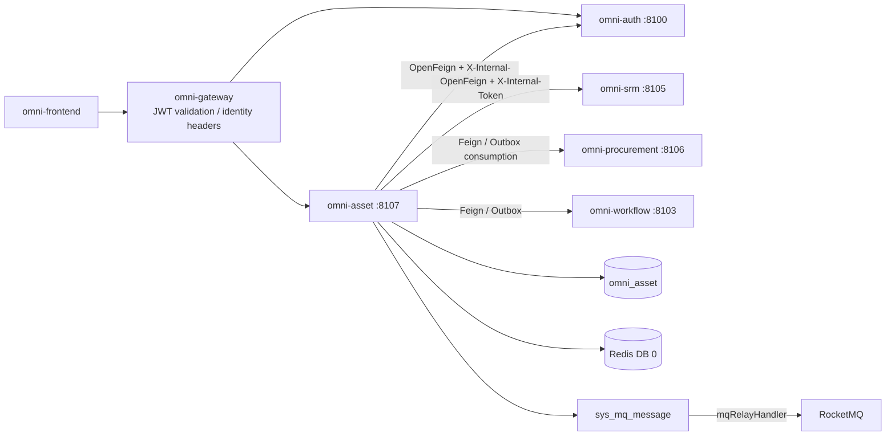
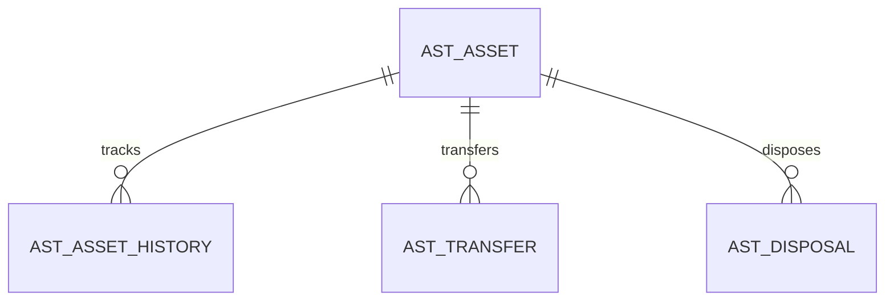
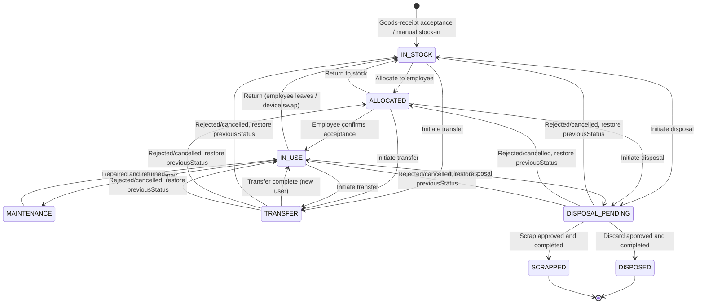
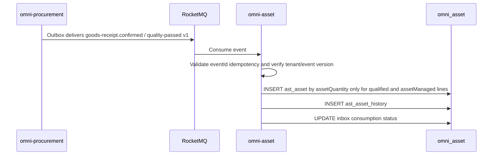
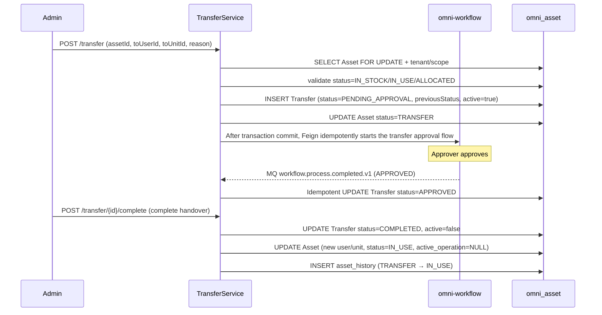
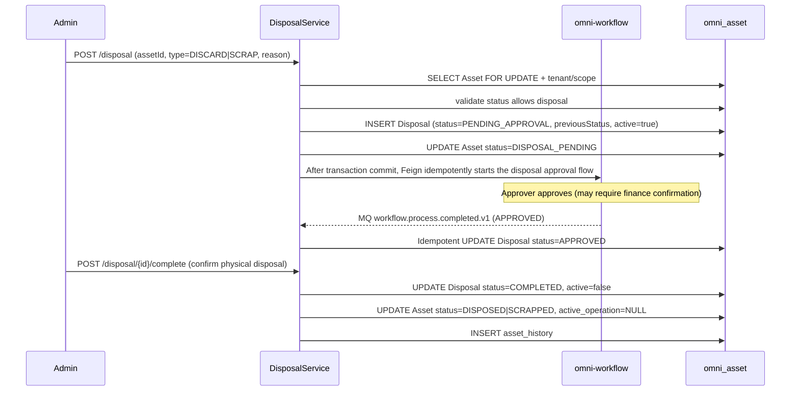

# 資産管理モジュール アーキテクチャと実装ベースライン

> 状態：MVP 実装済み・検証完了
> プロジェクト：Omni-Stack
> 日付：2026-07-27
> 目標：omni-asset MVP のアーキテクチャ、サービス横断契約、実装境界を説明する。実装入口は `omni-backend/omni-asset` と `omni-frontend/src/views/asset`。

設計根拠：`README.md`、および `docs/` 内の architecture、api-contract、backend-patterns、frontend-patterns、core-flows、scheduling、workflow、mq-reliability、docker-deployment の全トピックドキュメント。同時に `docs/design/srm-design.md` と `docs/design/procurement-design.md` を参照。

## 1. 設計結論

資産管理は独立した Servlet マイクロサービスとして構築し、調達入庫から最終処分までの資産の完全なライフサイクルを管理すべきである。SRM はサプライヤー情報を、Procurement は調達ソースを、Workflow は承認能力を提供する。

| 項目 | 決定 |
|---|---|
| Maven モジュール / サービス名 | `omni-asset` |
| ローカルポート / 管理ポート | `8107` / `19907` |
| XXL-JOB 実行体 | `omni-asset` / `9907`（減価償却計算や保守通知を有効化する場合） |
| データベース | `omni_asset` |
| Gateway | `/api/asset/**` → `lb://omni-asset`、`StripPrefix` は使用しない |
| Redis | DB 0、Auth が書き込む XSS 設定を共有；キーは `asset:` プレフィックスを使用 |
| フロントエンド | 引き続き `omni-frontend` を使用し、`views/asset/**` を新設 |

Asset MVP は資産の全ライフサイクル管理の閉ループをカバーする：

> 調達入庫 → 資産検収・入庫 → 払出/割当 → 使用中 → 移管 → 廃棄処分 / スクラップ処分。

減価償却計算、資産棚卸、保守修理工単は MVP に含めない。

## 2. 製品範囲

### 2.1 ユーザーと目標

| ユーザー | コアニーズ |
|---|---|
| 総務/IT 管理者 | 会社の全資産を管理し、従業員に割当て、処分申請を処理する |
| 資産使用者 | 自分名義の資産を確認し、受入を確認または返却を発起する |
| 部門マネージャー | 自部門の資産を確認し、移管と処分を承認する |
| 財務担当者 | 資産の取得原価・現在状態を確認し、スクラップを確認する |
| 資産管理者 | 全テナントの資産管理、設定、統計 |

MVP は次に答えられるべきである：会社に資産がどれだけありどこに分布するか；ある資産を現在誰が使用中でどの状態か；どの資産が遊休で割当待ちか；ある部門の資産総額；どの資産が処分/スクラップフローを進行中か。

### 2.2 フェーズ分け

| フェーズ | 能力 |
|---|---|
| MVP | 資産台帳、資産検収（調達連動）、資産割当/返却、資産移管、廃棄処分、スクラップ処分、資産オーバービュー |
| Phase 2 | 資産棚卸、減価償却計算、保守修理工単、資産タグ/バーコード、資産インポート・エクスポート |
| Phase 3 | 資産予算管理、資産処分オークション、資産ライフサイクルコスト分析 |

## 3. システム境界

| コンポーネント | 権威的責務 | Asset の利用方式 |
|---|---|---|
| `omni-auth` | テナント、ユーザー、組織、ロール、権限、データ範囲、XSS 設定 | 内部 OpenFeign；ユーザー/組織 ID のみ保存 |
| `omni-srm` | サプライヤーデータ | 内部 OpenFeign でサプライヤー情報を照会（保証連絡先など） |
| `omni-procurement` | 購買注文、入庫記録 | Outbox イベントを消費して資産カードを作成；または Feign で調達ソースを照会 |
| `omni-base` | 辞書、操作ログ | 操作ログ集約；資本品目/場所は辞書 code を使用 |
| `omni-workflow` | BPMN、プロセスインスタンス、承認、Flowable エンジンの唯一の実行時 | 内部 OpenFeign でフローを起動/照会し、承認結果イベントを消費 |
| `omni-asset` | 資産台帳、資産状態、資産処分 | 唯一のビジネス書き込み側 |
| RocketMQ | 非同期輸送 | Procurement 入庫イベントを消費、少なくとも一度・冪等 |



推奨依存：`omni-common-service`（Servlet ビジネスサービスのセキュリティ、身分、テナント、DataScope、MyBatis と XSS の組み合わせ）、および必要に応じて有効化する `omni-common-operlog`、`omni-common-job`、`omni-common-mqlog`。Asset は引き続き Web、Validation、Security、OpenFeign、LoadBalancer、Nacos、RocketMQ Stream、Actuator などのビジネス依存を明示的に使用する。

**Asset は `omni-common-workflow` に依存せず、Flowable を埋め込まない。** `omni-workflow` は独立マイクロサービスであり Flowable の唯一の実行時である。Asset は内部 Feign 契約でフローを発起し、信頼できるドメインイベントで承認結果を受信する。

## 4. ドメインとデータ設計

### 4.1 集約

| 集約 | テーブル | 責務 |
|---|---|---|
| Asset | `ast_asset`、`ast_asset_history` | 資産マスタデータ、状態変更の不変履歴 |
| Transfer | `ast_transfer` | 資産移管記録 |
| Disposal | `ast_disposal` | 資産処分記録（廃棄/スクラップ共用） |



### 4.2 共通フィールドとルール

すべての `ast_*` テーブルは `tenant_id` を含まなければならない。資産集約ルート `ast_asset` はさらに次を含める必要がある：

- `tenant_id`：テナント分離。
- `owner_user_id`：資産管理者（SELF 範囲）。
- `owner_unit_id`：資産管理部門（DEPT 範囲）。
- `version`：楽観ロック。移管と処分申請もそれぞれ自身の `version` を維持する。
- `deleted`：論理削除。不変履歴と Inbox は論理削除を使用しない。
- `id/create_time/update_time/create_by/update_by`：監査フィールド。

制約：

- 資産番号 `asset_no` はテナント内でユニークで、データベース ID から生成される。
- ユーザー/組織 ID は Auth が管理し、クロス DB 外部キーは作らない。
- サプライヤー ID は SRM が管理し、`supplier_id` のみ保存する。
- 調達ソース ID は Procurement が管理し、`source_po_id/source_gr_id/source_gr_line_id/source_unit_sequence` を冪等トレーサビリティとして保存し、同時に poNo/grNo 表示スナップショットを保存する。クロス DB 外部キーは作らない。
- 金額は `DECIMAL(18,2)` / `BigDecimal` を使用する。
- 時刻は `yyyy-MM-dd HH:mm:ss` に統一する。
- 通常の PUT では資産の status、使用者、場所を直接変更できない（専用コマンドエンドポイントが必要）。
- 資産は処分後回復できない。
- 同一資産に対し同一時刻に最大 1 件のアクティブな移管または処分申請のみ存在できる。`ast_asset.active_operation_type/active_operation_id` は version 条件付き更新で原子的に占有し、2 つの申請テーブル間の並行を統一的に阻止する。

### 4.3 主要テーブル

`ast_asset`

- `asset_no/name/category_code`：資産番号、名称、品目（辞書 code）。
- `specification/brand/model`：仕様、ブランド、型番。
- `supplier_id/supplier_name_snapshot`：サプライヤー ID と検収時の名称スナップショット；現在の名称は SRM の batch enrich により取得し、スナップショットは権限や現在状態の判定に関与しない。
- `source_po_id/source_gr_id/source_gr_line_id/source_unit_sequence/source_po_no/source_gr_no`：調達ソースと単位レベルの冪等識別子。
- `purchase_date/purchase_amount/currency_code`：購買日、取得原価、通貨。
- `location_code`：資産の場所（辞書 code、例：フロア+部屋番号）。
- `status`：ライフサイクル状態（IN_STOCK/ALLOCATED/IN_USE/MAINTENANCE/TRANSFER/DISPOSAL_PENDING/DISPOSED/SCRAPPED）。
- `current_user_id`：現在の使用者、名称は Auth から batch enrich し、DB に保存しない。
- `current_unit_id`：現在の使用部門、名称は Auth から batch enrich し、DB に保存しない。
- `allocated_time`：割当時刻。
- `active_operation_type/active_operation_id`：現在のアクティブ操作（TRANSFER/DISPOSAL）と申請 ID；アクティブ操作がない場合は NULL。
- `warranty_expiry_date`：保証期限日。
- `expected_life_years`：想定使用年数（スクラップの参考用）。
- `remark`。
- `owner_user_id/owner_unit_id/version/deleted` と監査フィールド。
- コアインデックス：tenant + owner/status、tenant + current_user_id、tenant + current_unit_id、tenant + category_code/status、tenant + asset_no（ユニーク）、tenant + source_gr_line_id + source_unit_sequence（調達ソースユニーク、手動入庫は source フィールドの NULL を許可）。

`ast_asset_history`

- `asset_id/from_status/to_status/changed_by_user_id/changed_time/remark`。
- 追記のみで、更新・削除しない。資産の毎回の状態変更と主要操作（割当、返却、移管、処分）を記録する。

`ast_transfer`

- `transfer_no/asset_id/from_user_id/from_unit_id/to_user_id/to_unit_id/from_location/to_location`。
- `reason/status/process_instance_id/previous_asset_status/active_flag`。
- `workflow_request_id/workflow_business_key/model_version_id/workflow_start_status/workflow_start_user_id/workflow_start_user_name`：Workflow 冪等スナップショットおよび元の起票者身分；`businessType=ASSET_TRANSFER` は移管集約タイプから固定的に導出される。
- `status`：PENDING_APPROVAL/START_FAILED/APPROVED/REJECTED/COMPLETED/CANCELLED。
- `approved_time/completed_time`。
- `version/deleted` と監査フィールド。

`ast_disposal`

- `disposal_no/asset_id/disposal_type（DISCARD/SCRAP）/reason/previous_asset_status/active_flag`。
- `residual_value（残存価値）/disposal_method（処分方式の記述）`。
- `status`：PENDING_APPROVAL/START_FAILED/APPROVED/REJECTED/COMPLETED/CANCELLED。
- `process_instance_id`：omni-workflow の承認プロセスインスタンスに関連付け。
- `workflow_request_id/workflow_business_key/model_version_id/workflow_start_status/workflow_start_user_id/workflow_start_user_name`：Workflow 冪等スナップショットおよび元の起票者身分；`businessType=ASSET_DISPOSAL` は処分集約タイプから固定的に導出される。
- `approved_time/completed_time`。
- `version/deleted` と監査フィールド。

## 5. 状態マシンとコアフロー

### 5.1 Asset ライフサイクル



- `IN_STOCK`：資産は在庫中で未割当。
- `ALLOCATED`：従業員に割当済み、受入確認待ち。
- `IN_USE`：従業員が使用中。
- `MAINTENANCE`：修理送付中（MVP は状態をマークするのみ、修理工単は行わない）。
- `TRANSFER`：移管中（承認と引継ぎを待機）。
- `DISPOSAL_PENDING`：処分承認を進行中、割当・返却・移管・重複処分を禁止。
- `DISPOSED`：廃棄処分完了（終端状態）。
- `SCRAPPED`：スクラップ処分完了（終端状態）。

`IN_STOCK`、`IN_USE`、`ALLOCATED` 状態の資産のみ移管または処分を発起できる。`MAINTENANCE`、`TRANSFER`、`DISPOSAL_PENDING` 状態の資産は他のビジネス操作を発起できない。MVP は `maintenance/start` と `maintenance/complete` の 2 つの軽量コマンドを提供し、状態と履歴のみを維持し、修理工単は導入しない。

### 5.2 資産検収（調達連動）



**冪等消費**：Asset は `ast_inbox_event` テーブル（`consumer_name + event_id` ユニークキー）を維持し、同時に `ast_asset` 上で `tenant_id + source_gr_line_id + source_unit_sequence` ユニークキーを使用する。前者はリアルタイムイベント全体の重複実行を防ぎ、後者はリアルタイム消費・手動リプレイ・履歴補償再スキャンを統一的に保護する。

**一括作成**：`qualityStatus=PASS && assetManaged=true && assetQuantity>0` の行のみ処理する。assetQuantity は正の整数でなければならない。5 台のノート PC が検収合格した場合、unitSequence=1..5 で 5 件の独立資産を作成する。消耗品、サービス、kg などの連続計量資材、および PENDING/FAIL 行は資産を作成しない。

**履歴補償**：Asset の稼働開始時や消費障害の修復時、Procurement の `/internal/procurement/goods-receipt/asset-candidates` カーソルページング API で履歴入庫候補を再スキャンする。補償データは同一のソースキーにマッピングされ同一の作成サービスを再利用する。Procurement Outbox や Broker が未デプロイの消費者のためにメッセージを永久保持すると仮定してはならない。

### 5.3 資産割当と返却

```text
Allocate:
POST /asset/{id}/allocate (targetUserId, targetUnitId)
→ validate status=IN_STOCK
→ UPDATE asset SET current_user_id, current_unit_id, status=ALLOCATED, allocated_time
→ INSERT asset_history (IN_STOCK → ALLOCATED)

Acceptance confirmation:
POST /asset/{id}/accept
→ validate status=ALLOCATED
→ UPDATE asset SET status=IN_USE
→ INSERT asset_history (ALLOCATED → IN_USE)

Return:
POST /asset/{id}/return
→ validate status=IN_USE or ALLOCATED
→ UPDATE asset SET current_user_id=NULL, current_unit_id=NULL, allocated_time=NULL, status=IN_STOCK
→ INSERT asset_history (IN_USE → IN_STOCK)

Send for repair / repair:
POST /asset/{id}/maintenance/start → IN_USE → MAINTENANCE
POST /asset/{id}/maintenance/complete → MAINTENANCE → IN_USE
```

### 5.4 資産移管



移管承認は単純な単段承認（管理者または部門マネージャーが承認）を使用する。MVP は多段承認を行わない。Workflow が REJECTED を返すかユーザーがキャンセルした場合、Asset は同一トランザクション内で Transfer を終端状態・`active=false` にし、Asset を `previous_asset_status` に回復しなければならない。フロー起動結果が不確実な場合は `PENDING_APPROVAL + PENDING` を保持し、同一の `tenantId + businessType + businessKey` でリトライし、ローカルキャンセルは許可しない。Workflow のビジネス応答 404 はモデルバージョンが起動不可かつリモートでインスタンス未作成であることを示し、このとき `START_FAILED + FAILED` に入り、リトライまたはキャンセル回復が可能になる。

### 5.5 資産処分（廃棄/スクラップ）



廃棄とスクラップは同一の承認フローを使用し、違いは次のとおり：
- **廃棄（DISCARD）**：資産を使用せず直接廃棄する。処分方式（寄付、リサイクル、破棄）の記録が必要な場合がある。
- **スクラップ（SCRAP）**：資産が使用年数に達するか損壊して修復不能となり、正式にスクラップする。残存価値の記録が必要な場合がある。

承認フローは異なる承認者を設定できる（スクラップは財務確認が必要な場合があり、廃棄は総務マネージャーのみ）。

処分承認が拒否・キャンセル、または起動失敗後にキャンセルされた場合、Asset を `previous_asset_status` に回復し、申請の active_flag および Asset の `active_operation_*` をクリアしなければならない。移管と処分の作成はいずれも `tenant_id + asset_id + version + active_operation_id IS NULL` 条件で原子的に占有しなければならない。更新行数が 1 でない場合は 409 を返し、データベース層から 2 種の申請の交差並行を阻止する。

## 6. テナント、RBAC とデータ権限

### 6.1 信頼チェーン

他の Servlet ビジネスサービスと一致：Gateway JWT → `GatewayPreAuthenticationFilter` 事前認証 → `ServiceIdentityFilter` テナント/身分検証 → `@PreAuthorize` → `@ServiceDataScope` → MyBatis DataPermission → `AssetRecordAccessGuard`。

### 6.2 権限ツリーとロール

メニュー：`asset`（DIRECTORY）および `asset:overview`、`asset:asset`、`asset:transfer`、`asset:disposal`（MENU）。

API 権限：

- `asset:overview:list`
- `asset:asset:list/self/create/update/delete/allocate/accept/return/maintenance`
- `asset:transfer:list/create/approve/complete/cancel/retry`
- `asset:disposal:list/create/approve/complete/cancel/retry`

| ロール | dataScope | 能力 |
|---|---|---|
| `ASSET_ADMIN` | TENANT | 現在のテナントの全資産機能/データ |
| `ASSET_MANAGER` | DEPT_AND_BELOW | 部門および下位、移管/処分承認 |
| `ASSET_USER` | SELF | 「マイ資産」エンドポイントで自分名義の資産を確認し、受入確認と返却発起を行う |
| `SUPER_ADMIN` | ALL | 全機能、資産データは引き続き現テナントに限定 |

デフォルトの USER には資産権限を付与しない。

### 6.3 Asset コンテキストと SQL インターセプト

モジュール横断コンテキストと永続層の組み立ては `omni-common-service` が提供する：リクエスト身分は `ServiceIdentityContext` / `ServiceRequestIdentity`、データ範囲は `@ServiceDataScope` / `ServiceDataScopeContext` を使用し、`ServicePersistenceAutoConfiguration` がインターセプターの組み立てを担当する。Asset はドメインポリシー `AssetTenantTablePolicy`、`AssetDataPermissionHandler` と書き込み操作ガード `AssetRecordAccessGuard` のみを保持する。

インターセプター順序は固定：`TenantLineInnerInterceptor → DataPermissionInterceptor → OptimisticLockerInnerInterceptor → PaginationInnerInterceptor`。`AssetTenantTablePolicy` は `ast_*` テーブルにのみ有効で、`sys_mq_message` はテナントインターセプトの外に保たなければならず、バックグラウンド Relay のテナント横断スキャンを許可する。

| dataScope | 条件 |
|---|---|
| SELF | 現在の permission がマップする owner または current_user 列が currentUserId に等しい |
| DEPT | 現在の permission がマップする owner_unit または current_unit 列が primaryUnitId に等しい |
| DEPT_AND_BELOW / CUSTOM | 現在の permission がマップする unit 列が accessibleUnitIds に含まれる |
| TENANT / ALL | owner 条件を追加しない、TenantLine は常に保持 |

資産の dataScope には管理次元と使用次元があり、汎用 SQL で広い OR を使用できず、permissionCode/エンドポイントごとに明示的にマップしなければならない：

| エンドポイント/権限 | 範囲列 | ルール |
|---|---|---|
| `/asset/list`、詳細、管理履歴；`asset:asset:list` | `owner_user_id/owner_unit_id` | 資産管理担当向け、管理帰属でフィルタ |
| `/asset/my`；`asset:asset:self` | `current_user_id` | 固定して現在ユーザーに等しく、他ロールのより広い dataScope によって拡大しない |
| accept/return；対応するコマンド権限 | `current_user_id` | RecordAccessGuard が対象資産の現在割当先が currentUserId であることを強制 |
| Transfer/Disposal list/detail | 関連 Asset の管理次元 | 子テーブルは同一テナントの asset_id で継承し、存在しない owner 列を直接連結しない |
| Transfer/Disposal approval-view | Workflow taskId の割当関係 | まず現在ユーザーがその tenant/ビジネス伝票のタスク承認者であることを検証し、その後 tenant + id で読み取り専用 VO を読む |
| Overview | Asset 管理次元 | 集約 SQL は `/asset/list` と同一範囲を使用 |

ユーザーが ASSET_USER と管理ロールを同時に持つ場合でも、フロントエンドは「マイ資産」と管理リストをそれぞれ呼び出す。バックエンドは 2 つの次元を OR 結合して書き込み認可に使用してはならない。

## 7. API 設計

### 7.1 共通契約

他のサービスと一致。

### 7.2 エンドポイント

| ドメイン | エンドポイント |
|---|---|
| Overview | `GET /api/asset/overview/summary`、`/distribution` |
| Asset | `GET /asset/list`、`GET /asset/{id}`、`POST /asset`、`PUT/DELETE /asset/{id}` |
| マイ資産 | `GET /asset/my` |
| Asset コマンド | `POST /asset/{id}/allocate`、`/accept`、`/return`、`/maintenance/start`、`/maintenance/complete` |
| Asset 履歴 | `GET /asset/{id}/history` |
| Transfer | `GET /transfer/list`、`GET /transfer/{id}`、`POST /transfer` |
| Transfer 承認ビュー | `GET /transfer/{id}/approval-view?taskId={taskId}` |
| Transfer コマンド | `POST /transfer/{id}/complete`、`/cancel`、`/retry-start`；承認アクションは Workflow で完了 |
| Disposal | `GET /disposal/list`、`GET /disposal/{id}`、`POST /disposal` |
| Disposal 承認ビュー | `GET /disposal/{id}/approval-view?taskId={taskId}` |
| Disposal コマンド | `POST /disposal/{id}/complete`、`/cancel`、`/retry-start`；承認アクションは Workflow で完了 |
| 内部 API | `POST /api/internal/asset/procurement/backfill?tenantId={tenantId}&afterId={id}&size={size}`、内部トークンで保護 |

### 7.3 エンドポイントと DataScope permission のマッピング

| 操作 | permissionCode |
|---|---|
| Overview | `asset:overview:list` |
| Asset list/detail/history | `asset:asset:list` |
| My Asset | `asset:asset:self` |
| Asset create/update/delete | `asset:asset:create/update/delete` |
| Asset allocate | `asset:asset:allocate` |
| Asset accept（従業員自用） | `asset:asset:accept` |
| Asset return | `asset:asset:return` |
| Asset maintenance start/complete | `asset:asset:maintenance` |
| Transfer list/detail | `asset:transfer:list` |
| Transfer create | `asset:transfer:create` |
| Transfer approval-view | `asset:transfer:approve` |
| Transfer complete | `asset:transfer:complete` |
| Transfer cancel/retry-start | `asset:transfer:cancel/retry` |
| Disposal list/detail | `asset:disposal:list` |
| Disposal create | `asset:disposal:create` |
| Disposal approval-view | `asset:disposal:approve` |
| Disposal complete | `asset:disposal:complete` |
| Disposal cancel/retry-start | `asset:disposal:cancel/retry` |

## 8. サービス横断の一貫性

### 8.1 Auth Feign

他のサービスと一致。

### 8.2 SRM Feign

Asset は SRM 内部 API でサプライヤー情報を取得する（資産登録候補、保証連絡先、サプライヤー状態）：

- `GET /api/internal/supplier/{id}?tenantId={tenantId}`：サプライヤー概要を取得。
- `GET /api/internal/supplier/search?...&status=APPROVED&keyword={keyword}`：現テナントの承認済みサプライヤーを検索。
- 資産登録ページは `/api/asset/options/suppliers` を呼び出し、番号と名称を表示し、ユーザーに数値 ID の手動入力を要求しない；
  履歴詳細は SRM が一時的に利用不可の場合もローカル名称スナップショットで表示する。

### 8.3 Procurement 連動

**イベント消費**：Asset は `procurement.goods-receipt.confirmed.v1` と `procurement.goods-receipt.quality-passed.v1` を消費して資産カードを作成する。両者は同一の payload 行契約とソース単位冪等キーを使用する；quality-passed は PENDING から新たに PASS へ転じた行のみを含む。

イベントエンベロープは `procurement-design.md` 8.4 を権威契約とし、eventId/eventType/occurredAt/tenantId、および goodsReceiptId、grNo、purchaseOrderId、poNo、supplier スナップショット、通貨、行ごとの goodsReceiptLineId、purchaseOrderLineId、material/category、qualityStatus、assetManaged、assetQuantity、unitPrice を含まなければならない。tenant、ソース行 ID、資産化フラグ、またはバージョンが欠落/未対応の場合は消費失敗/デッドレターに入り、デフォルト値を推測して資産を作成することを禁止する。

消費フロー：
1. RocketMQ Consumer がメッセージを受信。
2. イベント `tenantId` を検証し、`ServiceRequestIdentity` で `ServiceIdentityContext` を設定し、現テナントの `TENANT` 級 `ServiceDataScopeContext` を設定する；消費終了時は必ず `finally` で両者をクリアする。
3. 冪等チェック：`ast_inbox_event` テーブル（`consumer_name + event_id` ユニークキー）。
4. 資産化条件を満たす入庫行を unitSequence に従って資産記録として作成し、ソースユニークキーによるフォールバックに依存する。
5. 同一トランザクション内で inbox 消費状態を更新する。

**Feign 照会**（任意）：Asset は Procurement 内部 API で調達ソース詳細（PO 番号、金額、サプライヤー）を照会できる。

**補償再スキャン**：Asset 起動後の制御されたタスクが Procurement 資産候補ページング API をカーソル枯渇まで呼び出す；リアルタイムイベントと再スキャンは同一の冪等作成ロジックを共有する。再スキャンも同様に現テナントの `TENANT` 級 `ServiceDataScopeContext` を明示的に設定し、ソース冪等書き込み後の検証クエリがフェイルクローズドルールでフィルタされるのを避けなければならない；リクエスト終了後に共有身分と DataScope コンテキストをクリアする。

### 8.4 Workflow 統合

Asset は Flowable を埋め込まず、Workflow 内部 API と承認結果イベントで統合する。承認が必要なシナリオ：

- 資産移管承認（MVP 単純単段承認）。
- 資産廃棄処分承認。
- 資産スクラップ処分承認（財務確認が必要な場合あり）。

承認フローは `docs/workflow.md` 仕様に従う。承認タイプごとに 1 つの BPMN プロセスモデル；モデルキーはテナントがカスタマイズできるが、
モデルの `category` は用途と正確に結合しなければならない：移管は `ASSET_TRANSFER`、廃棄/スクラップ処分は
`ASSET_DISPOSAL`。

ユーザーが移管または処分申請を作成する際 `modelVersionId` は渡さない。Asset はまず現テナントと固定ビジネス分類で Workflow の
`current-published` 内部照会を呼び出し、公開済み・プロセス定義が存在し `category` がビジネスタイプと一致するバージョンを自動選択し、次に
`requestId/tenantId/modelVersionId/businessType/businessKey/startUser/variables` をローカル冪等スナップショットとして保存する。
実際の起動時に Workflow がモデルを再検証し、解決と起動の間の変更ウィンドウを閉じる。Workflow は
`tenantId + businessType + businessKey` でユニーク冪等であり、重複呼び出しは既存インスタンスを返す。

承認者は Workflow `/api/workflow/approval/{taskId}/complete` で承認を実行する。資産承認を担うロールは、対応する `asset:transfer:approve` または `asset:disposal:approve`（専用 approval-view の読み取り）および `workflow:approval:complete`（本人タスクの完了）を同時に取得しなければならない。approval-view は tenant、businessType、businessKey と現在タスク割当を検証しなければならず、通常の dataScope の汎用バイパスとして使ってはならない。

承認終了は Workflow Outbox が `workflow.process.completed.v1` を発行する。Asset は Inbox eventId で冪等消費し、tenantId、businessType、businessKey、processInstanceId と現在の申請状態を厳密に照合する：

- APPROVED：申請は APPROVED に入り、ビジネス `/complete` による引継ぎまたは実物処分の完了を待つ。
- REJECTED/CANCELLED：申請は対応する終端状態に入り、Asset.previousStatus を回復し、`active_operation_*` をクリアする。
- 重複、順序不同、またはインスタンス不一致のイベントは警告を記録するのみで、資産を変更しない。

MVP の完了イベントは承認者や承認意見など機微情報を含みうる内容を運ばず、Asset はこのようなスナップショットを冗長化しない；完全なタスク、
処理者、意見は常に Workflow の照会結果を権威とする。

Workflow が利用不可、409/その他結果不確実な応答、または応答喪失の場合、リモート結果は既に受理された可能性があり、申請は `PENDING_APPROVAL + PENDING` と資産占有状態を保持し、元の requestId、ビジネスキー、モデルバージョン、起票者身分でのみリトライできる。Workflow ビジネス応答 404 はリモートトランザクションがインスタンスを作成しなかった明示的失敗で、`START_FAILED + FAILED` に入った後にのみ権限ユーザーのローカルキャンセルと回復を許可する。Asset は `omni-common-workflow` に依存せず、Flowable テーブルは `omni-workflow` データベースにのみ存在する。

### 8.5 Outbox イベント

- `asset.created.v1`（検収作成）
- `asset.allocated.v1`
- `asset.returned.v1`
- `asset.transfer.completed.v1`
- `asset.disposed.v1`
- `asset.scrapped.v1`

## 9. プライバシー、操作ログと XSS

### 9.1 OperLog

既存の PII マスキング能力を再利用する。Asset の PII フィールドは少なく、主に資産使用者情報（既に Auth で管理）。

### 9.2 PII

資産自体は機微 PII を含まない。使用者情報は Auth を通じて表示し、Asset は userId のみ保存する。

### 9.3 XSS

Asset は `omni-common-service` の `CachedServiceXssConfigProvider` で統一 XSS 設定を得る：まず Redis DB 0 キャッシュを読み、キャッシュミス時は内部身分付きの Auth 回源を使用；Auth または Redis が利用不可の場合は必ずセーフティベースラインに落ち、設定センター障害を理由にサニタイズをバイパスすることを禁止する。MVP の備考はプレーンテキストのみ許可。

## 10. フロントエンド設計

```text
omni-frontend/src/
├── api/
│   ├── asset-overview.ts
│   ├── asset-asset.ts
│   ├── asset-transfer.ts
│   └── asset-disposal.ts
├── views/asset/
│   ├── overview/index.vue           # Asset overview (stats + distribution)
│   ├── asset/index.vue              # Asset ledger
│   ├── transfer/index.vue           # Asset transfer
│   └── disposal/index.vue           # Asset disposal
└── components/asset/
    ├── AssetCard.vue                # Asset card (for overview)
    ├── AssetDistribution.vue        # Asset distribution chart
    ├── TransferForm.vue             # Transfer form
    └── DisposalForm.vue             # Disposal form
```

- `ApiResponse/PageResult` は `src/types/api.ts` からのみインポートする。
- 資産台帳は状態、品目、部門、場所の多次元フィルタをサポートする。
- 資産詳細ページは基本情報 + 使用者 + 調達ソース + 変更履歴 + 移管記録 + 処分記録を表示する。
- オーバービューページは資産総数、総額、状態別分布、部門別分布、品目別分布を表示する。
- `router/index.ts` と `layout/index.vue` の iconMap に Asset を補う。

## 11. エンジニアリング着地点

### 11.1 新モジュール

```text
omni-backend/omni-asset/
├── pom.xml
└── src/main/
    ├── java/com/omni/asset/
    │   ├── AssetApplication.java
    │   ├── client/ config/ controller/ dto/ entity/
    │   ├── mapper/ security/ service/ service/impl/
    │   ├── consumer/                  # MQ consumer (goods-receipt events)
    │   └── workflow/                  # Workflow Feign client and approval-result event consumer
    └── resources/
        ├── application.yml
        ├── application-dev.yml
        └── mapper/
```

### 11.2 必ず変更するファイル

| ファイル | 変更 |
|---|---|
| `omni-backend/pom.xml` | `omni-asset` を追加 |
| Gateway `application.yml` | `/api/asset/**` ルートを明示 |
| `docker/backend/Dockerfile` | POM キャッシュ層 |
| `docker-compose.yml` | Asset サービス、8107 |
| `start.bat/start.sh` | build リストに Asset を追加 |
| `database/changelog/asset/` | 資産構造変更に forward-only の Liquibase changeSet を追加 |
| `scripts/sql/seed/auth.sql` | 資産権限とロールの正式冪等シード；更新後に seed manifest をリフレッシュ |
| Asset `TenantModuleProvisioner` | 現在モジュール自有のテナントデフォルト事実が無いことを明示宣言し、プロトコルの冪等性を保持 |
| `omni-workflow` | 冪等内部起動、タスク割当検証 API と `workflow.process.completed.v1` Outbox イベントを再利用/補完 |
| `omni-procurement` | 入庫イベント v1 フィールドと履歴資産候補ページング API を確認 |
| Frontend router/layout/menu/locales | アイコン、メニュー、i18n |

設定要点：server 8107、management 19907、Redis DB 0、XXL appname `omni-asset`/port 9907。

## 12. 非機能設計

### 性能

- すべてのリストはページング、最大 100。
- サプライヤー名称、使用者名称は一度に batch enrich し、N+1 を禁止。
- オーバービュー統計は Mapper 層の集約 SQL を使用する。

### 並行と冪等

- 資産割当/返却：行ロック + version 楽観ロック。
- 移管/処分：申請行ロック + Asset version 条件付き更新 `active_operation_*`、2 種のアクティブ申請の交差並行を統一的に防止。
- Workflow 起動：サービス横断 businessKey 冪等；承認結果は Inbox eventId 冪等を使用。
- 入庫イベント消費：`ast_inbox_event` と資産ソース単位ユニークキーの二重冪等。

### 縮退

- SRM 利用不可：サプライヤー情報は ID に縮退。
- Procurement 利用不可：調達ソース情報は PO 番号テキストに縮退。
- Workflow 利用不可または結果不確実：503 を返し、申請は同一キーでリトライ可能な `PENDING_APPROVAL + PENDING` を保持；モデルバージョンが起動不可と明示的に返された場合は `START_FAILED + FAILED` に入る。承認をスキップしたり、起動結果が不確実なときにローカルキャンセルしてはならない。
- Auth 利用不可：503 フェイルクローズド。

## 13. テストと検収

最小テストセット：

- 資産状態マシンの合法/不正遷移（全合法パス + 不正パスの拒否）。
- 入庫イベントの冪等消費（同一イベントで資産を重複作成しない）。
- リアルタイムイベントと履歴再スキャンが同一入庫行を同時処理しても資産を重複作成しない。
- 非資産資材、品質検査失敗/保留、連続計量または非整数数量は資産を作成しない。
- 一括入庫が複数の資産を正しく作成する（数量 > 1）。
- 移管完了後に資産の使用者と部門が正しく更新される。
- 処分完了後に資産が終端状態に入る。
- 移管/処分拒否および `START_FAILED + FAILED` 後のローカルキャンセルはいずれも previousStatus を回復しアクティブ占有をクリアする；起動結果が不確実なときはキャンセルしてはならない。
- 同一資産に移管と処分を並行作成すると 1 つのみ成功し、もう一方は 409 を返す。
- Workflow 承認結果が重複、順序不同、tenant/businessKey/processInstanceId 不一致のとき資産を更新しない。
- 承認者は自分に割当られた taskId でのみ Transfer/Disposal approval-view を読め、taskId やビジネス ID を偽造した場合は拒否する。
- 同一資産の並行割当は 1 つのみ成功する。
- テナント横断分離。
- tenant/scope 欠落時はフェイルクローズド。
- `ASSET_USER` は自分名義の資産のみ見える。
- 「マイ資産」は固定して current_user_id で照会し、ユーザーが管理ロールを同時に持っていても拡張しない；管理リストは owner 次元で照会する。

エンドツーエンド検収：調達入庫 → MQ イベント → 資産作成（IN_STOCK）→ 従業員に割当（ALLOCATED）→ 従業員が受入確認（IN_USE）→ 移管発起 → 承認通過 → 新使用者（IN_USE）→ スクラップ発起 → 承認通過 → SCRAPPED。

## 14. 実装順序

### Milestone 0：前提確認

- SRM と Procurement が構築済みであることを確認。
- Workflow サービスが利用可能であることを確認。
- Workflow 内部起動 API、承認結果イベント、および Procurement 入庫イベント/履歴補償 API の契約を確認。

### Milestone 1：サービス構築 + セキュリティ基盤

- モジュール、設定、Gateway、Docker、DB を作成。
- TenantLine + DataPermission + Pagination。
- 権限ツリー、Asset ロール、既存テナント移行。
- フロントエンド root メニュー。

### Milestone 2：資産台帳

- 資産 CRUD（手動入庫を含む）。
- 資産割当/受入確認/返却。
- 資産変更履歴。
- 資産詳細ページ。

### Milestone 3：調達連動 + 検収

- MQ 消費者（入庫イベント → 資産作成）。
- `ast_inbox_event` 冪等消費。
- ソース単位ユニークキー、一括資産作成（assetQuantity > 1）と履歴補償再スキャン。

### Milestone 4：移管 + 処分

- 移管申請 + 独立 Workflow サービス承認。
- 廃棄/スクラップ処分 + 独立 Workflow サービス承認。
- 承認結果イベント → 申請状態更新、拒否回復、ビジネス complete。

### Milestone 5：オーバービュー + 本番強化

- オーバービュー統計（summary + distribution）。
- テスト、インデックス、セキュリティ検収。
- docs/、AGENTS.md を更新。

## 15. ADR 要約

| 決定 | 選択 | 理由 |
|---|---|---|
| サービス | 独立 `omni-asset` | SRM/Procurement から分離、責務が明確 |
| Workflow 統合 | 独立 `omni-workflow` 内部 API + 承認結果イベント | Flowable の唯一実行時とデータベース境界を保持 |
| 調達連動 | Outbox イベント消費 | Procurement と Asset を疎結合 |
| 一括入庫 | 単位ごとに 1 つの資産カード | 各資産の独立追跡を容易にする |
| 冪等消費 | Inbox eventId + ソース行/unitSequence ユニークキー | リアルタイムイベント、リプレイ、履歴再スキャンを同時にカバー |
| 移管承認 | 単純単段承認 | MVP は多段承認を行わない |
| 処分タイプ | DISCARD + SCRAP がテーブル共用 | フローは一致、違いは承認者と終端状態 |
| 減価償却計算 | 行わない | MVP は財務減価償却を処理しない |

## 16. 主要リスク

| 優先度 | リスク | 対処 |
|---|---|---|
| P0 | 入庫イベントの重複消費による資産の重複作成 | `ast_inbox_event` ユニークキー冪等 |
| P0 | Workflow 利用不可または応答喪失による半起動/重複フロー | 結果不確実は PENDING を保持し同一キーでリトライ；リモートがインスタンス未作成を明示した時のみ START_FAILED に入る |
| P0 | 書き込み操作がクエリデータ権限をバイパス | AccessGuard + 条件付き更新 |
| P1 | 同一資産の並行割当 | 行ロック + version 楽観ロック |
| P1 | 入庫数量 > 1 のとき資産作成が不完全 | トランザクション内で行ごとに作成、全部成功または全部ロールバック |
| P0 | 消耗品/品質検査失敗/連続計量資材が誤って資産化 | Procurement assetManaged + 品質/整数検証、Asset はフェイルクローズド |
| P1 | 移管と処分の並行または拒否後に資産がスタック | active_operation 原子占有 + previousStatus 回復 |
| P1 | 資産処分後の誤操作回復 | 終端状態は不可逆、回復インターフェースを提供しない |
| P1 | MQ メッセージ滞留や Asset の遅い稼働で資産作成が遅延/漏れ | Outbox リアルタイム配信 + Procurement 履歴候補補償再スキャン |
| P2 | 品目/場所辞書データが不完全 | テナント初期化時に常用値をプリセット |
