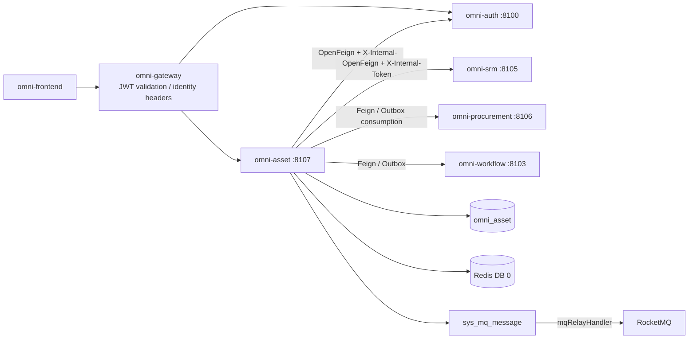
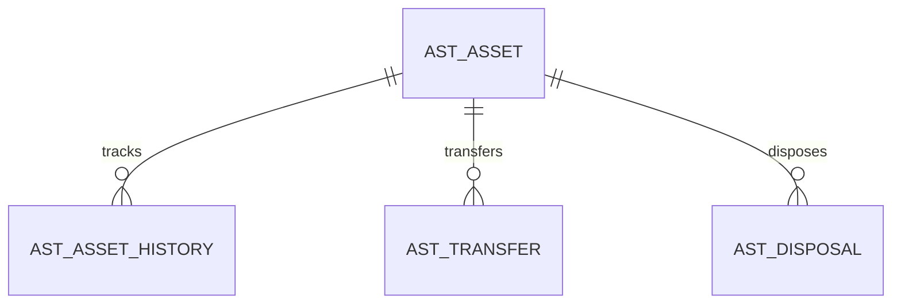
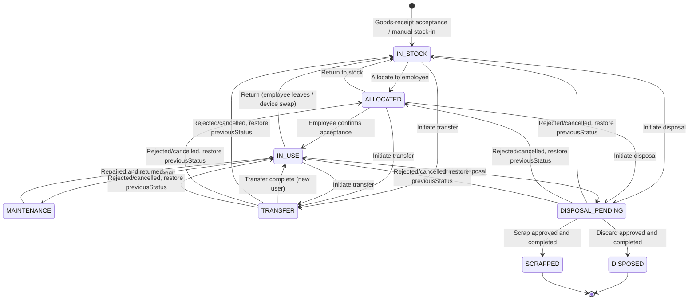
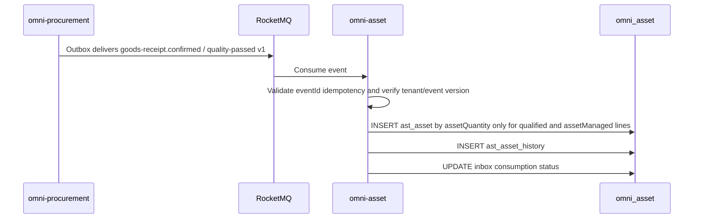
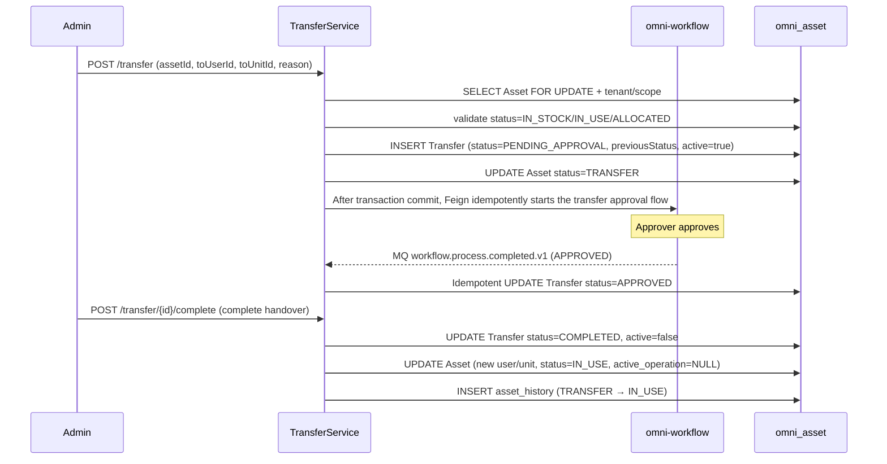
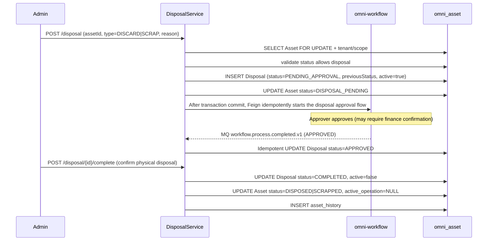

# 자산 관리 모듈 아키텍처와 구현 기준선

> 상태: MVP 구현 완료 및 검증 완료
> 프로젝트: Omni-Stack
> 날짜: 2026-07-27
> 목표: omni-asset MVP의 아키텍처, 서비스 간 계약, 구현 경계를 설명한다. 구현 입구는 `omni-backend/omni-asset`과 `omni-frontend/src/views/asset`이다.

설계 근거: `README.md`, 그리고 `docs/`의 architecture, api-contract, backend-patterns, frontend-patterns, core-flows, scheduling, workflow, mq-reliability, docker-deployment 전체 주제 문서. 동시에 `docs/design/srm-design.md`와 `docs/design/procurement-design.md`를 참조한다.

## 1. 설계 결론

자산 관리는 독립 Servlet 마이크로서비스로 구축하여, 조달 입고부터 최종 처분까지 자산의 전체 라이프사이클을 관리해야 한다. SRM은 공급업체 정보를, Procurement은 조달 출처를, Workflow는 승인 역량을 제공한다.

| 항목 | 결정 |
|---|---|
| Maven 모듈 / 서비스명 | `omni-asset` |
| 로컬 포트 / 관리 포트 | `8107` / `19907` |
| XXL-JOB 실행자 | `omni-asset` / `9907` (감가상각 계산이나 보수 알림을 활성화할 때) |
| 데이터베이스 | `omni_asset` |
| Gateway | `/api/asset/**` → `lb://omni-asset`, `StripPrefix`를 사용하지 않음 |
| Redis | DB 0, Auth가 쓴 XSS 설정을 공유; 키는 `asset:` 접두사를 사용 |
| 프런트엔드 | 계속 `omni-frontend`를 사용하고 `views/asset/**`를 신설 |

Asset MVP는 자산 전체 라이프사이클 관리의 폐루프를 다룬다:

> 조달 입고 → 자산 검수 입고 → 지급/할당 → 사용 중 → 이전 → 폐기 처분 / 스크랩 처분.

감가상각 계산, 자산 재고실사, 보수 정비 작업지시는 MVP에 포함하지 않는다.

## 2. 제품 범위

### 2.1 사용자와 목표

| 사용자 | 핵심 요구 |
|---|---|
| 총무/IT 관리자 | 회사 전체 자산을 관리하고, 직원에 할당하며, 처분 신청을 처리 |
| 자산 사용자 | 본인 명의 자산을 보고, 인수 확인 또는 반납 발기 |
| 부서 매니저 | 본 부서 자산을 보고, 이전과 처분을 승인 |
| 재무 담당 | 자산 취득원가와 현재 상태를 보고, 스크랩을 확인 |
| 자산 관리자 | 전체 테넌트 자산 관리, 설정, 통계 |

MVP는 다음에 답할 수 있어야 한다: 회사에 자산이 얼마나 있고 어디에 분포하는지; 어떤 자산을 현재 누가 사용 중이고 어떤 상태인지; 어떤 자산이 유휴 상태로 할당 대기인지; 어떤 부서의 자산 총액; 어떤 자산이 처분/스크랩 플로우를 진행 중인지.

### 2.2 단계 구분

| 단계 | 역량 |
|---|---|
| MVP | 자산 대장, 자산 검수(조달 연동), 자산 할당/반납, 자산 이전, 폐기 처분, 스크랩 처분, 자산 개요 |
| Phase 2 | 자산 재고실사, 감가상각 계산, 보수 정비 작업지시, 자산 태그/바코드, 자산 가져오기/내보내기 |
| Phase 3 | 자산 예산 통제, 자산 처분 경매, 자산 라이프사이클 비용 분석 |

## 3. 시스템 경계

| 컴포넌트 | 권위 책임 | Asset의 사용 방식 |
|---|---|---|
| `omni-auth` | 테넌트, 사용자, 조직, 역할, 권한, 데이터 범위, XSS 설정 | 내부 OpenFeign; 사용자/조직 ID만 저장 |
| `omni-srm` | 공급업체 데이터 | 내부 OpenFeign으로 공급업체 정보 조회(보증 연락처 등) |
| `omni-procurement` | 구매 주문, 입고 기록 | Outbox 이벤트를 소비하여 자산 카드 생성; 또는 Feign으로 조달 출처 조회 |
| `omni-base` | 사전, 조작 로그 | 조작 로그 집약; 자산 품목/위치는 사전 code 사용 |
| `omni-workflow` | BPMN, 프로세스 인스턴스, 승인, Flowable 엔진의 유일한 런타임 | 내부 OpenFeign으로 플로우 시작/조회, 승인 결과 이벤트 소비 |
| `omni-asset` | 자산 대장, 자산 상태, 자산 처분 | 유일한 비즈니스 쓰기 주체 |
| RocketMQ | 비동기 전송 | Procurement 입고 이벤트 소비, 최소 1회 멱등 |



권장 의존: `omni-common-service`(Servlet 비즈니스 서비스 보안, 신분, 테넌트, DataScope, MyBatis와 XSS 조합), 그리고 필요에 따라 활성화하는 `omni-common-operlog`, `omni-common-job`, `omni-common-mqlog`. Asset은 계속 Web, Validation, Security, OpenFeign, LoadBalancer, Nacos, RocketMQ Stream, Actuator 등 비즈니스 의존을 명시적으로 사용한다.

**Asset은 `omni-common-workflow`에 의존하지 않으며 Flowable을 내장하지 않는다.** `omni-workflow`는 독립 마이크로서비스이자 Flowable의 유일한 런타임이다. Asset은 내부 Feign 계약으로 플로우를 발기하고, 신뢰 가능한 도메인 이벤트로 승인 결과를 수신한다.

## 4. 도메인과 데이터 설계

### 4.1 집계

| 집계 | 테이블 | 책임 |
|---|---|---|
| Asset | `ast_asset`, `ast_asset_history` | 자산 마스터 데이터, 상태 변경 불변 이력 |
| Transfer | `ast_transfer` | 자산 이전 기록 |
| Disposal | `ast_disposal` | 자산 처분 기록(폐기/스크랩 공용) |



### 4.2 공통 필드와 규칙

모든 `ast_*` 테이블은 `tenant_id`를 포함해야 한다. 자산 집계 루트 `ast_asset`은 추가로 다음을 포함해야 한다:

- `tenant_id`: 테넌트 격리.
- `owner_user_id`: 자산 관리자(SELF 범위).
- `owner_unit_id`: 자산 관리 부서(DEPT 범위).
- `version`: 낙관적 락. 이전과 처분 신청도 각각 자신의 `version`을 유지한다.
- `deleted`: 논리 삭제. 불변 이력과 Inbox는 논리 삭제를 사용하지 않는다.
- `id/create_time/update_time/create_by/update_by`: 감사 필드.

제약:

- 자산 번호 `asset_no`는 테넌트 내에서 고유하며 데이터베이스 ID로 생성된다.
- 사용자/조직 ID는 Auth가 관리하며 크로스 DB 외래 키를 만들지 않는다.
- 공급업체 ID는 SRM이 관리하며 `supplier_id`만 저장한다.
- 조달 출처 ID는 Procurement이 관리하며 `source_po_id/source_gr_id/source_gr_line_id/source_unit_sequence`를 멱등 추적용으로 저장하고, 동시에 poNo/grNo 표시 스냅샷을 저장하며, 크로스 DB 외래 키를 만들지 않는다.
- 금액은 `DECIMAL(18,2)` / `BigDecimal`을 사용한다.
- 시각은 `yyyy-MM-dd HH:mm:ss`로 통일한다.
- 일반 PUT으로는 자산 status, 사용자, 위치를 직접 변경할 수 없다(전용 명령 엔드포인트 필요).
- 자산은 처분 후 복구할 수 없다.
- 동일 자산에 대해 동일 시각에 최대 하나의 활성 이전 또는 처분 신청만 존재할 수 있다. `ast_asset.active_operation_type/active_operation_id`는 version 조건부 업데이트로 원자 점유하여, 두 신청 테이블 간의 동시성을 통일적으로 차단한다.

### 4.3 주요 테이블

`ast_asset`

- `asset_no/name/category_code`: 자산 번호, 명칭, 품목(사전 code).
- `specification/brand/model`: 규격, 브랜드, 모델.
- `supplier_id/supplier_name_snapshot`: 공급업체 ID와 검수 시 명칭 스냅샷; 현재 명칭은 SRM batch enrich로 가져오며, 스냅샷은 권한이나 현재 상태 판정에 참여하지 않는다.
- `source_po_id/source_gr_id/source_gr_line_id/source_unit_sequence/source_po_no/source_gr_no`: 조달 출처와 단위 수준 멱등 식별자.
- `purchase_date/purchase_amount/currency_code`: 구매일, 취득원가, 통화.
- `location_code`: 자산 위치(사전 code, 예: 층+방 번호).
- `status`: 라이프사이클 상태(IN_STOCK/ALLOCATED/IN_USE/MAINTENANCE/TRANSFER/DISPOSAL_PENDING/DISPOSED/SCRAPPED).
- `current_user_id`: 현재 사용자, 명칭은 Auth에서 batch enrich하며 DB에 저장하지 않는다.
- `current_unit_id`: 현재 사용 부서, 명칭은 Auth에서 batch enrich하며 DB에 저장하지 않는다.
- `allocated_time`: 할당 시각.
- `active_operation_type/active_operation_id`: 현재 활성 조작(TRANSFER/DISPOSAL)과 신청 ID; 활성 조작이 없으면 NULL.
- `warranty_expiry_date`: 보증 만료일.
- `expected_life_years`: 예상 사용 연한(스크랩 참고용).
- `remark`.
- `owner_user_id/owner_unit_id/version/deleted`와 감사 필드.
- 핵심 인덱스: tenant + owner/status, tenant + current_user_id, tenant + current_unit_id, tenant + category_code/status, tenant + asset_no(고유), tenant + source_gr_line_id + source_unit_sequence(조달 출처 고유, 수동 입고는 source 필드 NULL 허용).

`ast_asset_history`

- `asset_id/from_status/to_status/changed_by_user_id/changed_time/remark`.
- 추가 전용으로, 업데이트하지도 삭제하지도 않는다. 자산의 매 상태 변경과 주요 조작(할당, 반납, 이전, 처분)을 기록한다.

`ast_transfer`

- `transfer_no/asset_id/from_user_id/from_unit_id/to_user_id/to_unit_id/from_location/to_location`.
- `reason/status/process_instance_id/previous_asset_status/active_flag`.
- `workflow_request_id/workflow_business_key/model_version_id/workflow_start_status/workflow_start_user_id/workflow_start_user_name`: Workflow 멱등 스냅샷 및 원래 기안자 신분; `businessType=ASSET_TRANSFER`는 이전 집계 유형으로부터 고정 도출된다.
- `status`: PENDING_APPROVAL/START_FAILED/APPROVED/REJECTED/COMPLETED/CANCELLED.
- `approved_time/completed_time`.
- `version/deleted`와 감사 필드.

`ast_disposal`

- `disposal_no/asset_id/disposal_type(DISCARD/SCRAP)/reason/previous_asset_status/active_flag`.
- `residual_value(잔존가치)/disposal_method(처분 방식 기술)`.
- `status`: PENDING_APPROVAL/START_FAILED/APPROVED/REJECTED/COMPLETED/CANCELLED.
- `process_instance_id`: omni-workflow 승인 프로세스 인스턴스에 연결.
- `workflow_request_id/workflow_business_key/model_version_id/workflow_start_status/workflow_start_user_id/workflow_start_user_name`: Workflow 멱등 스냅샷 및 원래 기안자 신분; `businessType=ASSET_DISPOSAL`는 처분 집계 유형으로부터 고정 도출된다.
- `approved_time/completed_time`.
- `version/deleted`와 감사 필드.

## 5. 상태 머신과 핵심 플로우

### 5.1 Asset 라이프사이클



- `IN_STOCK`: 자산이 재고 중이며 미할당.
- `ALLOCATED`: 직원에 할당됨, 인수 확인 대기.
- `IN_USE`: 직원이 사용 중.
- `MAINTENANCE`: 수리 의뢰 중(MVP는 상태 표시만 하고 수리 작업지는 하지 않음).
- `TRANSFER`: 이전 진행 중(승인과 인수인계 대기).
- `DISPOSAL_PENDING`: 처분 승인 진행 중, 할당·반납·이전·중복 처분 금지.
- `DISPOSED`: 폐기 처분 완료(종료 상태).
- `SCRAPPED`: 스크랩 처분 완료(종료 상태).

`IN_STOCK`, `IN_USE`, `ALLOCATED` 상태의 자산만 이전 또는 처분을 발기할 수 있다. `MAINTENANCE`, `TRANSFER`, `DISPOSAL_PENDING` 상태의 자산은 다른 비즈니스 조작을 발기할 수 없다. MVP는 `maintenance/start`와 `maintenance/complete` 두 개의 경량 명령을 제공하며, 상태와 이력만 유지하고 수리 작업지는 도입하지 않는다.

### 5.2 자산 검수(조달 연동)



**멱등 소비**: Asset은 `ast_inbox_event` 테이블(`consumer_name + event_id` 고유 키)을 유지하고, 동시에 `ast_asset`에서 `tenant_id + source_gr_line_id + source_unit_sequence` 고유 키를 사용한다. 전자는 실시간 이벤트 전체의 중복 실행을 방지하고, 후자는 실시간 소비·수동 재생·이력 보상 재스캔을 통일적으로 보호한다.

**일괄 생성**: `qualityStatus=PASS && assetManaged=true && assetQuantity>0`인 행만 처리한다. assetQuantity는 양의 정수여야 한다. 노트북 5대가 검수 합격하면 unitSequence=1..5로 5건의 독립 자산을 생성한다. 소모품, 서비스, kg 등 연속 계량 자재, 그리고 PENDING/FAIL 행은 자산을 생성하지 않는다.

**이력 보상**: Asset 가동 시점이나 소비 장애 복구 시, Procurement의 `/internal/procurement/goods-receipt/asset-candidates` 커서 페이지네이션 인터페이스로 이력 입고 후보를 재스캔한다. 보상 데이터는 동일한 출처 키로 매핑되고 동일한 생성 서비스를 재사용한다. Procurement Outbox나 Broker가 아직 배포되지 않은 소비자를 위해 메시지를 영구 보존한다고 가정해서는 안 된다.

### 5.3 자산 할당과 반납

```text
Allocate:
POST /asset/{id}/allocate (targetUserId, targetUnitId)
→ validate status=IN_STOCK
→ UPDATE asset SET current_user_id, current_unit_id, status=ALLOCATED, allocated_time
→ INSERT asset_history (IN_STOCK → ALLOCATED)

Acceptance confirmation:
POST /asset/{id}/accept
→ validate status=ALLOCATED
→ UPDATE asset SET status=IN_USE
→ INSERT asset_history (ALLOCATED → IN_USE)

Return:
POST /asset/{id}/return
→ validate status=IN_USE or ALLOCATED
→ UPDATE asset SET current_user_id=NULL, current_unit_id=NULL, allocated_time=NULL, status=IN_STOCK
→ INSERT asset_history (IN_USE → IN_STOCK)

Send for repair / repair:
POST /asset/{id}/maintenance/start → IN_USE → MAINTENANCE
POST /asset/{id}/maintenance/complete → MAINTENANCE → IN_USE
```

### 5.4 자산 이전



이전 승인은 간단한 단일 단계 승인(관리자 또는 부서 매니저가 승인)을 사용한다. MVP는 다단계 승인을 하지 않는다. Workflow가 REJECTED를 반환하거나 사용자가 취소하면, Asset은 동일 트랜잭션에서 Transfer를 종료 상태·`active=false`로 놓고 Asset을 `previous_asset_status`로 복구해야 한다. 플로우 시작 결과가 불확실하면 `PENDING_APPROVAL + PENDING`을 유지하고 동일한 `tenantId + businessType + businessKey`로 재시도하며, 로컬 취소는 허용하지 않는다. Workflow 비즈니스 응답 404는 모델 버전을 더 이상 시작할 수 없고 원격에서 인스턴스를 만들지 않았음을 의미하며, 이때 `START_FAILED + FAILED`로 들어가 재시도하거나 취소 복구할 수 있다.

### 5.5 자산 처분(폐기/스크랩)



폐기와 스크랩은 동일한 승인 플로우를 사용하며, 차이는 다음과 같다:
- **폐기(DISCARD)**: 자산을 더 이상 사용하지 않고 직접 폐기한다. 처분 방식(기부, 재활용, 파기)을 기록해야 할 수 있다.
- **스크랩(SCRAP)**: 자산이 사용 연한에 도달하거나 파손되어 수리 불가 시 정식 스크랩한다. 잔존가치를 기록해야 할 수 있다.

승인 플로우는 서로 다른 승인자를 설정할 수 있다(스크랩은 재무 확인이 필요할 수 있고, 폐기는 총무 매니저만 필요).

처분 승인이 거부·취소되거나 시작 실패 후 취소될 때, Asset을 `previous_asset_status`로 복구하고 신청의 active_flag와 Asset의 `active_operation_*`를 제거해야 한다. 이전과 처분 생성은 모두 `tenant_id + asset_id + version + active_operation_id IS NULL` 조건으로 원자 점유해야 한다. 업데이트 행 수가 1이 아니면 409를 반환하여, 데이터베이스 계층에서 두 종류 신청의 교차 동시성을 차단한다.

## 6. 테넌트, RBAC과 데이터 권한

### 6.1 신뢰 체인

다른 Servlet 비즈니스 서비스와 일치: Gateway JWT → `GatewayPreAuthenticationFilter` 사전 인증 → `ServiceIdentityFilter` 테넌트/신분 검증 → `@PreAuthorize` → `@ServiceDataScope` → MyBatis DataPermission → `AssetRecordAccessGuard`.

### 6.2 권한 트리와 역할

메뉴: `asset`(DIRECTORY) 그리고 `asset:overview`, `asset:asset`, `asset:transfer`, `asset:disposal`(MENU).

API 권한:

- `asset:overview:list`
- `asset:asset:list/self/create/update/delete/allocate/accept/return/maintenance`
- `asset:transfer:list/create/approve/complete/cancel/retry`
- `asset:disposal:list/create/approve/complete/cancel/retry`

| 역할 | dataScope | 역량 |
|---|---|---|
| `ASSET_ADMIN` | TENANT | 현재 테넌트의 전체 자산 기능/데이터 |
| `ASSET_MANAGER` | DEPT_AND_BELOW | 부서 및 하위, 이전/처분 승인 |
| `ASSET_USER` | SELF | "내 자산" 엔드포인트로 본인 명의 자산을 보고, 인수 확인과 반납 발기 |
| `SUPER_ADMIN` | ALL | 모든 기능, 자산 데이터는 계속 현재 테넌트로 제한 |

기본 USER에는 자산 권한을 부여하지 않는다.

### 6.3 Asset 컨텍스트와 SQL 인터셉트

모듈 간 컨텍스트와 영속 계층 조립은 `omni-common-service`가 제공한다: 요청 신분은 `ServiceIdentityContext` / `ServiceRequestIdentity`, 데이터 범위는 `@ServiceDataScope` / `ServiceDataScopeContext`를 사용하고, `ServicePersistenceAutoConfiguration`이 인터셉터 조립을 담당한다. Asset은 도메인 정책 `AssetTenantTablePolicy`, `AssetDataPermissionHandler`와 쓰기 조작 가드 `AssetRecordAccessGuard`만 유지한다.

인터셉터 순서는 고정: `TenantLineInnerInterceptor → DataPermissionInterceptor → OptimisticLockerInnerInterceptor → PaginationInnerInterceptor`. `AssetTenantTablePolicy`는 `ast_*` 테이블에만 적용되고, `sys_mq_message`는 백그라운드 Relay의 테넌트 간 스캔을 허용하도록 테넌트 인터셉트 밖에 유지해야 한다.

| dataScope | 조건 |
|---|---|
| SELF | 현재 permission이 매핑하는 owner 또는 current_user 열이 currentUserId와 같음 |
| DEPT | 현재 permission이 매핑하는 owner_unit 또는 current_unit 열이 primaryUnitId와 같음 |
| DEPT_AND_BELOW / CUSTOM | 현재 permission이 매핑하는 unit 열이 accessibleUnitIds에 포함 |
| TENANT / ALL | owner 조건을 추가하지 않음, TenantLine은 항상 유지 |

자산의 dataScope에는 관리 차원과 사용 차원이 있어, 일반 SQL에서 넓은 OR를 사용할 수 없으며 permissionCode/엔드포인트별로 명시적으로 매핑해야 한다:

| 엔드포인트/권한 | 범위 열 | 규칙 |
|---|---|---|
| `/asset/list`, 상세, 관리 이력; `asset:asset:list` | `owner_user_id/owner_unit_id` | 자산 관리 담당 대상, 관리 귀속으로 필터 |
| `/asset/my`; `asset:asset:self` | `current_user_id` | 고정하여 현재 사용자와 같으며, 다른 역할의 더 넓은 dataScope로 확장하지 않음 |
| accept/return; 해당 명령 권한 | `current_user_id` | RecordAccessGuard가 대상 자산의 현재 할당 대상이 currentUserId임을 강제 |
| Transfer/Disposal list/detail | 연관 Asset의 관리 차원 | 자식 테이블은 동일 테넌트의 asset_id로 상속하며, 존재하지 않는 owner 열을 직접 연결하지 않음 |
| Transfer/Disposal approval-view | Workflow taskId 할당 관계 | 먼저 현재 사용자가 해당 tenant/비즈니스 전표의 작업 승인자임을 검증한 뒤, tenant + id로 읽기 전용 VO를 읽음 |
| Overview | Asset 관리 차원 | 집계 SQL은 `/asset/list`와 동일한 범위를 사용 |

사용자가 ASSET_USER와 관리 역할을 동시에 가져도, 프런트엔드는 여전히 "내 자산"과 관리 목록을 각각 호출한다. 백엔드는 두 차원을 OR 병합하여 쓰기 권한 부여에 사용해서는 안 된다.

## 7. API 설계

### 7.1 공통 계약

다른 서비스와 일치.

### 7.2 엔드포인트

| 도메인 | 엔드포인트 |
|---|---|
| Overview | `GET /api/asset/overview/summary`, `/distribution` |
| Asset | `GET /asset/list`, `GET /asset/{id}`, `POST /asset`, `PUT/DELETE /asset/{id}` |
| 내 자산 | `GET /asset/my` |
| Asset 명령 | `POST /asset/{id}/allocate`, `/accept`, `/return`, `/maintenance/start`, `/maintenance/complete` |
| Asset 이력 | `GET /asset/{id}/history` |
| Transfer | `GET /transfer/list`, `GET /transfer/{id}`, `POST /transfer` |
| Transfer 승인 뷰 | `GET /transfer/{id}/approval-view?taskId={taskId}` |
| Transfer 명령 | `POST /transfer/{id}/complete`, `/cancel`, `/retry-start`; 승인 액션은 Workflow에서 완료 |
| Disposal | `GET /disposal/list`, `GET /disposal/{id}`, `POST /disposal` |
| Disposal 승인 뷰 | `GET /disposal/{id}/approval-view?taskId={taskId}` |
| Disposal 명령 | `POST /disposal/{id}/complete`, `/cancel`, `/retry-start`; 승인 액션은 Workflow에서 완료 |
| 내부 API | `POST /api/internal/asset/procurement/backfill?tenantId={tenantId}&afterId={id}&size={size}`, 내부 토큰으로 보호 |

### 7.3 엔드포인트와 DataScope permission 매핑

| 조작 | permissionCode |
|---|---|
| Overview | `asset:overview:list` |
| Asset list/detail/history | `asset:asset:list` |
| My Asset | `asset:asset:self` |
| Asset create/update/delete | `asset:asset:create/update/delete` |
| Asset allocate | `asset:asset:allocate` |
| Asset accept(직원 자체 사용) | `asset:asset:accept` |
| Asset return | `asset:asset:return` |
| Asset maintenance start/complete | `asset:asset:maintenance` |
| Transfer list/detail | `asset:transfer:list` |
| Transfer create | `asset:transfer:create` |
| Transfer approval-view | `asset:transfer:approve` |
| Transfer complete | `asset:transfer:complete` |
| Transfer cancel/retry-start | `asset:transfer:cancel/retry` |
| Disposal list/detail | `asset:disposal:list` |
| Disposal create | `asset:disposal:create` |
| Disposal approval-view | `asset:disposal:approve` |
| Disposal complete | `asset:disposal:complete` |
| Disposal cancel/retry-start | `asset:disposal:cancel/retry` |

## 8. 서비스 간 일관성

### 8.1 Auth Feign

다른 서비스와 일치.

### 8.2 SRM Feign

Asset은 SRM 내부 API로 공급업체 정보를 가져온다(자산 등록 후보, 보증 연락처, 공급업체 상태):

- `GET /api/internal/supplier/{id}?tenantId={tenantId}`: 공급업체 요약 조회.
- `GET /api/internal/supplier/search?...&status=APPROVED&keyword={keyword}`: 현재 테넌트의 승인된 공급업체 검색.
- 자산 등록 페이지는 `/api/asset/options/suppliers`를 호출하여 번호와 명칭을 표시하고, 사용자에게 숫자 ID 수동 입력을 요구하지 않는다;
  이력 상세는 SRM이 일시적으로 사용 불가할 때도 로컬 명칭 스냅샷으로 표시한다.

### 8.3 Procurement 연동

**이벤트 소비**: Asset은 `procurement.goods-receipt.confirmed.v1`과 `procurement.goods-receipt.quality-passed.v1`을 소비하여 자산 카드를 생성한다. 둘은 동일한 payload 행 계약과 출처 단위 멱등 키를 사용한다; quality-passed는 PENDING에서 새로 PASS로 바뀐 행만 포함한다.

이벤트 엔벨로프는 `procurement-design.md` 8.4를 권위 계약으로 하며, eventId/eventType/occurredAt/tenantId, 그리고 goodsReceiptId, grNo, purchaseOrderId, poNo, supplier 스냅샷, 통화, 행별 goodsReceiptLineId, purchaseOrderLineId, material/category, qualityStatus, assetManaged, assetQuantity, unitPrice를 포함해야 한다. tenant, 출처 행 ID, 자산화 플래그 또는 버전이 누락/미지원이면 소비 실패/데드 레터로 들어가며, 기본값을 추측하여 자산을 생성하는 것을 금지한다.

소비 플로우:
1. RocketMQ Consumer가 메시지를 수신.
2. 이벤트 `tenantId`를 검증하고, `ServiceRequestIdentity`로 `ServiceIdentityContext`를 설정하며, 현재 테넌트의 `TENANT` 급 `ServiceDataScopeContext`를 설정한다; 소비 종료 시 반드시 `finally`에서 둘을 제거한다.
3. 멱등 검사: `ast_inbox_event` 테이블(`consumer_name + event_id` 고유 키).
4. 자산화 조건을 충족하는 입고 행을 unitSequence에 따라 자산 레코드로 생성하고, 출처 고유 키 폴백에 의존한다.
5. 동일 트랜잭션에서 inbox 소비 상태를 업데이트한다.

**Feign 조회**(선택): Asset은 Procurement 내부 API로 조달 출처 상세(PO 번호, 금액, 공급업체)를 조회할 수 있다.

**보상 재스캔**: Asset 가동 후 제어된 태스크가 Procurement 자산 후보 페이지네이션 API를 커서가 고갈될 때까지 호출한다; 실시간 이벤트와 재스캔은 동일한 멱등 생성 로직을 공유한다. 재스캔도 마찬가지로 현재 테넌트의 `TENANT` 급 `ServiceDataScopeContext`를 명시적으로 설정하여, 출처 멱등 쓰기 후의 검증 쿼리가 실패 차단 규칙으로 필터되는 것을 피해야 한다; 요청 종료 후 공유 신분과 DataScope 컨텍스트를 제거한다.

### 8.4 Workflow 통합

Asset은 Flowable을 내장하지 않으며 Workflow 내부 API와 승인 결과 이벤트로 통합한다. 승인이 필요한 시나리오:

- 자산 이전 승인(MVP 간단한 단일 단계 승인).
- 자산 폐기 처분 승인.
- 자산 스크랩 처분 승인(재무 확인이 필요할 수 있음).

승인 플로우는 `docs/workflow.md` 규격을 따른다. 승인 유형마다 하나의 BPMN 프로세스 모델; 모델 키는 테넌트가 커스터마이즈할 수 있지만,
모델의 `category`는 용도와 정확히 결합해야 한다: 이전은 `ASSET_TRANSFER`, 폐기/스크랩 처분은
`ASSET_DISPOSAL`.

사용자가 이전 또는 처분 신청을 만들 때 `modelVersionId`를 넘기지 않는다. Asset은 먼저 현재 테넌트와 고정 비즈니스 분류로 Workflow의
`current-published` 내부 조회를 호출하여, 게시되었고 프로세스 정의가 존재하며 `category`가 비즈니스 유형과 일치하는 버전을 자동 선택한 뒤,
`requestId/tenantId/modelVersionId/businessType/businessKey/startUser/variables`를 로컬 멱등 스냅샷으로 저장한다.
실제 시작 시 Workflow가 모델을 재검증하여, 해석과 시작 사이의 변경 창을 닫는다. Workflow는
`tenantId + businessType + businessKey`로 고유 멱등이며, 중복 호출은 기존 인스턴스를 반환한다.

승인자는 Workflow `/api/workflow/approval/{taskId}/complete`로 승인을 수행한다. 자산 승인을 담당하는 역할은 해당하는 `asset:transfer:approve` 또는 `asset:disposal:approve`(전용 approval-view 읽기)와 `workflow:approval:complete`(본인 작업 완료)를 동시에 취득해야 한다. approval-view는 tenant, businessType, businessKey와 현재 작업 할당을 검증해야 하며, 일반 dataScope의 범용 우회가 되어서는 안 된다.

승인 종료는 Workflow Outbox가 `workflow.process.completed.v1`을 발행한다. Asset은 Inbox eventId로 멱등 소비하고, tenantId, businessType, businessKey, processInstanceId와 현재 신청 상태를 엄격히 대조한다:

- APPROVED: 신청이 APPROVED로 들어가, 비즈니스 `/complete`가 인수인계나 실물 처분을 완료하기를 기다린다.
- REJECTED/CANCELLED: 신청이 해당 종료 상태로 들어가, Asset.previousStatus를 복구하고 `active_operation_*`를 제거한다.
- 중복, 순서 뒤섞임, 또는 인스턴스 불일치 이벤트는 경고만 기록하고 자산을 변경하지 않는다.

MVP 완료 이벤트는 승인자나 승인 의견 등 민감 정보를 포함할 수 있는 내용을 싣지 않으며, Asset은 이런 스냅샷을 중복 저장하지 않는다; 완전한 작업,
처리자, 의견은 항상 Workflow 조회 결과를 권위로 한다.

Workflow가 사용 불가하거나 409/기타 결과 불확실 응답을 주거나 응답을 잃으면, 원격 결과가 이미 수락되었을 수 있어 신청은 `PENDING_APPROVAL + PENDING`과 자산 점유 상태를 유지하며, 원래 requestId, 비즈니스 키, 모델 버전, 기안자 신분으로만 재시도할 수 있다. Workflow 비즈니스 응답 404는 원격 트랜잭션이 인스턴스를 만들지 않은 명시적 실패이며, `START_FAILED + FAILED`에 들어간 후에만 권한 있는 사용자의 로컬 취소와 복구를 허용한다. Asset은 `omni-common-workflow`에 의존하지 않으며, Flowable 테이블은 `omni-workflow` 데이터베이스에만 존재한다.

### 8.5 Outbox 이벤트

- `asset.created.v1`(검수 생성)
- `asset.allocated.v1`
- `asset.returned.v1`
- `asset.transfer.completed.v1`
- `asset.disposed.v1`
- `asset.scrapped.v1`

## 9. 프라이버시, 조작 로그와 XSS

### 9.1 OperLog

기존 PII 마스킹 역량을 재사용한다. Asset의 PII 필드는 적으며, 주로 자산 사용자 정보(이미 Auth에서 관리).

### 9.2 PII

자산 자체는 민감 PII를 포함하지 않는다. 사용자 정보는 Auth를 통해 표시하고, Asset은 userId만 저장한다.

### 9.3 XSS

Asset은 `omni-common-service`의 `CachedServiceXssConfigProvider`로 통일 XSS 설정을 얻는다: 먼저 Redis DB 0 캐시를 읽고, 캐시 미스 시 내부 신분을 갖춘 Auth 폴백을 사용한다; Auth 또는 Redis가 사용 불가하면 반드시 안전 기준선으로 떨어져야 하며, 설정 센터 장애를 이유로 새니타이징을 우회하는 것을 금지한다. MVP 비고는 평문만 허용한다.

## 10. 프런트엔드 설계

```text
omni-frontend/src/
├── api/
│   ├── asset-overview.ts
│   ├── asset-asset.ts
│   ├── asset-transfer.ts
│   └── asset-disposal.ts
├── views/asset/
│   ├── overview/index.vue           # Asset overview (stats + distribution)
│   ├── asset/index.vue              # Asset ledger
│   ├── transfer/index.vue           # Asset transfer
│   └── disposal/index.vue           # Asset disposal
└── components/asset/
    ├── AssetCard.vue                # Asset card (for overview)
    ├── AssetDistribution.vue        # Asset distribution chart
    ├── TransferForm.vue             # Transfer form
    └── DisposalForm.vue             # Disposal form
```

- `ApiResponse/PageResult`는 `src/types/api.ts`에서만 가져온다.
- 자산 대장은 상태, 품목, 부서, 위치 다차원 필터를 지원한다.
- 자산 상세 페이지는 기본 정보 + 사용자 + 조달 출처 + 변경 이력 + 이전 기록 + 처분 기록을 표시한다.
- 개요 페이지는 자산 총수, 총액, 상태별 분포, 부서별 분포, 품목별 분포를 표시한다.
- `router/index.ts`와 `layout/index.vue` iconMap에 Asset을 보탠다.

## 11. 엔지니어링 착지점

### 11.1 새 모듈

```text
omni-backend/omni-asset/
├── pom.xml
└── src/main/
    ├── java/com/omni/asset/
    │   ├── AssetApplication.java
    │   ├── client/ config/ controller/ dto/ entity/
    │   ├── mapper/ security/ service/ service/impl/
    │   ├── consumer/                  # MQ consumer (goods-receipt events)
    │   └── workflow/                  # Workflow Feign client and approval-result event consumer
    └── resources/
        ├── application.yml
        ├── application-dev.yml
        └── mapper/
```

### 11.2 반드시 변경할 파일

| 파일 | 변경 |
|---|---|
| `omni-backend/pom.xml` | `omni-asset` 추가 |
| Gateway `application.yml` | `/api/asset/**` 라우트 명시 |
| `docker/backend/Dockerfile` | POM 캐시 계층 |
| `docker-compose.yml` | Asset 서비스, 8107 |
| `start.bat/start.sh` | build 목록에 Asset 추가 |
| `database/changelog/asset/` | 자산 구조 변경에 forward-only Liquibase changeSet 추가 |
| `scripts/sql/seed/auth.sql` | 자산 권한과 역할의 정식 멱등 시드; 업데이트 후 seed manifest 갱신 |
| Asset `TenantModuleProvisioner` | 현재 모듈 자체 소유 테넌트 기본 사실이 없음을 명시 선언하고, 프로토콜 멱등성을 유지 |
| `omni-workflow` | 멱등 내부 시작, 작업 할당 검증 API와 `workflow.process.completed.v1` Outbox 이벤트를 재사용/보완 |
| `omni-procurement` | 입고 이벤트 v1 필드와 이력 자산 후보 페이지네이션 API를 확인 |
| Frontend router/layout/menu/locales | 아이콘, 메뉴, i18n |

설정 요점: server 8107, management 19907, Redis DB 0, XXL appname `omni-asset`/port 9907.

## 12. 비기능 설계

### 성능

- 모든 목록은 페이지네이션, 최대 100.
- 공급업체 명칭, 사용자 명칭은 한 번에 batch enrich하며 N+1을 금지.
- 개요 통계는 Mapper 계층 집계 SQL을 사용한다.

### 동시성과 멱등

- 자산 할당/반납: 행 락 + version 낙관적 락.
- 이전/처분: 신청 행 락 + Asset version 조건부 업데이트 `active_operation_*`, 두 종류 활성 신청의 교차 동시성을 통일적으로 방지.
- Workflow 시작: 서비스 간 businessKey 멱등; 승인 결과는 Inbox eventId 멱등 사용.
- 입고 이벤트 소비: `ast_inbox_event`와 자산 출처 단위 고유 키의 이중 멱등.

### 저하

- SRM 사용 불가: 공급업체 정보가 ID로 저하.
- Procurement 사용 불가: 조달 출처 정보가 PO 번호 텍스트로 저하.
- Workflow 사용 불가 또는 결과 불확실: 503을 반환하고, 신청은 동일 키로 재시도 가능한 `PENDING_APPROVAL + PENDING`을 유지; 모델 버전을 시작 불가로 명시 반환하면 `START_FAILED + FAILED`로 들어간다. 승인을 건너뛰거나 시작 결과가 불확실할 때 로컬 취소해서는 안 된다.
- Auth 사용 불가: 503 실패 차단.

## 13. 테스트와 검수

최소 테스트 세트:

- 자산 상태 머신의 합법/불법 전이(모든 합법 경로 + 불법 경로 거부).
- 입고 이벤트 멱등 소비(동일 이벤트로 자산을 중복 생성하지 않음).
- 실시간 이벤트와 이력 재스캔이 동일 입고 행을 동시 처리해도 자산을 중복 생성하지 않음.
- 비자산 자재, 품질검사 실패/보류, 연속 계량 또는 비정수 수량은 자산을 생성하지 않음.
- 일괄 입고가 여러 자산을 올바르게 생성(수량 > 1).
- 이전 완료 후 자산 사용자와 부서가 올바르게 업데이트.
- 처분 완료 후 자산이 종료 상태로 진입.
- 이전/처분 거부 및 `START_FAILED + FAILED` 후 로컬 취소 모두 previousStatus를 복구하고 활성 점유를 제거; 시작 결과가 불확실할 때는 취소하면 안 됨.
- 동일 자산에 이전과 처분을 동시 생성하면 하나만 성공하고 다른 하나는 409를 반환.
- Workflow 승인 결과가 중복, 순서 뒤섞임, tenant/businessKey/processInstanceId 불일치 시 자산을 업데이트하지 않음.
- 승인자는 본인에 할당된 taskId로만 Transfer/Disposal approval-view를 읽을 수 있고, taskId나 비즈니스 ID를 위조하면 거부.
- 동일 자산의 동시 할당은 하나만 성공.
- 테넌트 간 격리.
- tenant/scope 누락 시 실패 차단.
- `ASSET_USER`는 본인 명의 자산만 볼 수 있음.
- "내 자산"은 고정하여 current_user_id로 조회하며, 사용자가 관리 역할도 가져도 확장하지 않음; 관리 목록은 owner 차원으로 조회.

엔드투엔드 검수: 조달 입고 → MQ 이벤트 → 자산 생성(IN_STOCK) → 직원에 할당(ALLOCATED) → 직원 인수 확인(IN_USE) → 이전 발기 → 승인 통과 → 새 사용자(IN_USE) → 스크랩 발기 → 승인 통과 → SCRAPPED.

## 14. 구현 순서

### Milestone 0: 선행 확인

- SRM과 Procurement이 구축 완료되었음을 확인.
- Workflow 서비스가 사용 가능함을 확인.
- Workflow 내부 시작 API, 승인 결과 이벤트, 그리고 Procurement 입고 이벤트/이력 보상 API 계약을 확인.

### Milestone 1: 서비스 구축 + 보안 기반

- 모듈, 설정, Gateway, Docker, DB 생성.
- TenantLine + DataPermission + Pagination.
- 권한 트리, Asset 역할, 기존 테넌트 마이그레이션.
- 프런트엔드 root 메뉴.

### Milestone 2: 자산 대장

- 자산 CRUD(수동 입고 포함).
- 자산 할당/인수 확인/반납.
- 자산 변경 이력.
- 자산 상세 페이지.

### Milestone 3: 조달 연동 + 검수

- MQ 소비자(입고 이벤트 → 자산 생성).
- `ast_inbox_event` 멱등 소비.
- 출처 단위 고유 키, 일괄 자산 생성(assetQuantity > 1)과 이력 보상 재스캔.

### Milestone 4: 이전 + 처분

- 이전 신청 + 독립 Workflow 서비스 승인.
- 폐기/스크랩 처분 + 독립 Workflow 서비스 승인.
- 승인 결과 이벤트 → 신청 상태 업데이트, 거부 복구, 비즈니스 complete.

### Milestone 5: 개요 + 운영 강화

- 개요 통계(summary + distribution).
- 테스트, 인덱스, 보안 검수.
- docs/, AGENTS.md 업데이트.

## 15. ADR 요약

| 결정 | 선택 | 이유 |
|---|---|---|
| 서비스 | 독립 `omni-asset` | SRM/Procurement에서 분리, 책임이 명확 |
| Workflow 통합 | 독립 `omni-workflow` 내부 API + 승인 결과 이벤트 | Flowable의 유일 런타임과 데이터베이스 경계를 유지 |
| 조달 연동 | Outbox 이벤트 소비 | Procurement과 Asset을 느슨하게 결합 |
| 일괄 입고 | 단위마다 하나의 자산 카드 | 각 자산의 독립 추적을 용이하게 함 |
| 멱등 소비 | Inbox eventId + 출처 행/unitSequence 고유 키 | 실시간 이벤트, 재생, 이력 재스캔을 동시에 다룸 |
| 이전 승인 | 간단한 단일 단계 승인 | MVP는 다단계 승인을 하지 않음 |
| 처분 유형 | DISCARD + SCRAP 테이블 공용 | 플로우는 일치, 차이는 승인자와 종료 상태 |
| 감가상각 계산 | 하지 않음 | MVP는 재무 감가상각을 처리하지 않음 |

## 16. 주요 리스크

| 우선순위 | 리스크 | 대응 |
|---|---|---|
| P0 | 입고 이벤트 중복 소비로 자산 중복 생성 | `ast_inbox_event` 고유 키 멱등 |
| P0 | Workflow 사용 불가 또는 응답 손실로 반쪽 시작/중복 플로우 | 결과 불확실 시 PENDING을 유지하고 동일 키로 재시도; 원격이 인스턴스를 만들지 않았다고 명시한 경우에만 START_FAILED로 진입 |
| P0 | 쓰기 조작이 쿼리 데이터 권한을 우회 | AccessGuard + 조건부 업데이트 |
| P1 | 동일 자산의 동시 할당 | 행 락 + version 낙관적 락 |
| P1 | 입고 수량 > 1일 때 자산 생성 불완전 | 트랜잭션 내 행별 생성, 전부 성공 또는 전부 롤백 |
| P0 | 소모품/품질검사 실패/연속 계량 자재가 잘못 자산화 | Procurement assetManaged + 품질/정수 검증, Asset은 실패 차단 |
| P1 | 이전과 처분 동시 또는 거부 후 자산이 멈춤 | active_operation 원자 점유 + previousStatus 복구 |
| P1 | 자산 처분 후 오조작 복구 | 종료 상태는 비가역, 복구 인터페이스를 제공하지 않음 |
| P1 | MQ 메시지 적체나 Asset의 늦은 가동으로 자산 생성 지연/누락 | Outbox 실시간 전달 + Procurement 이력 후보 보상 재스캔 |
| P2 | 품목/위치 사전 데이터 불완전 | 테넌트 초기화 시 자주 쓰는 값을 미리 설정 |
