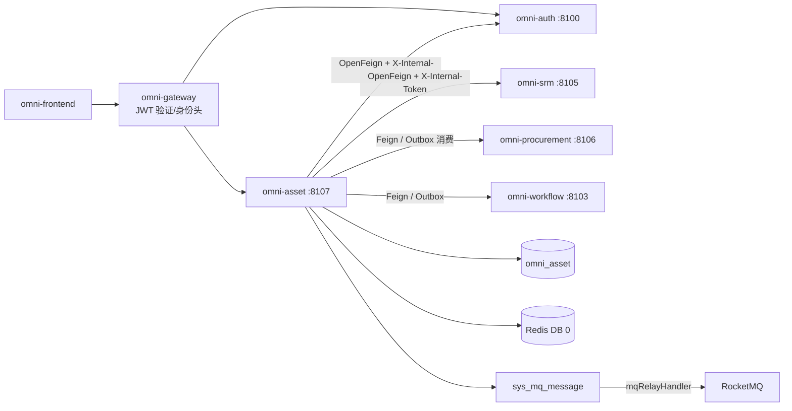
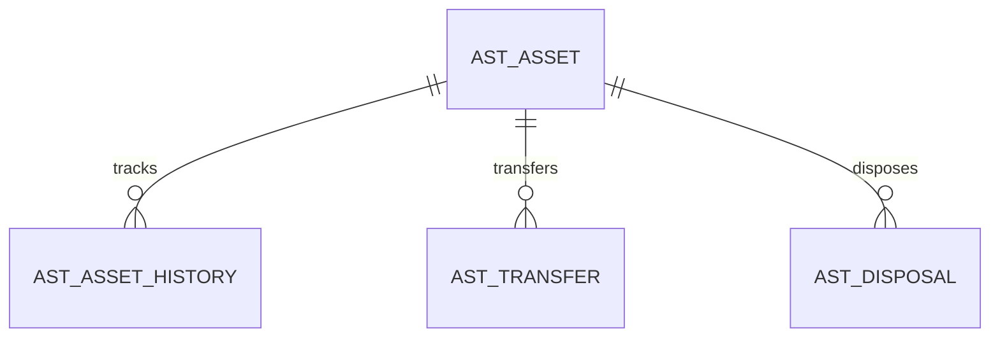
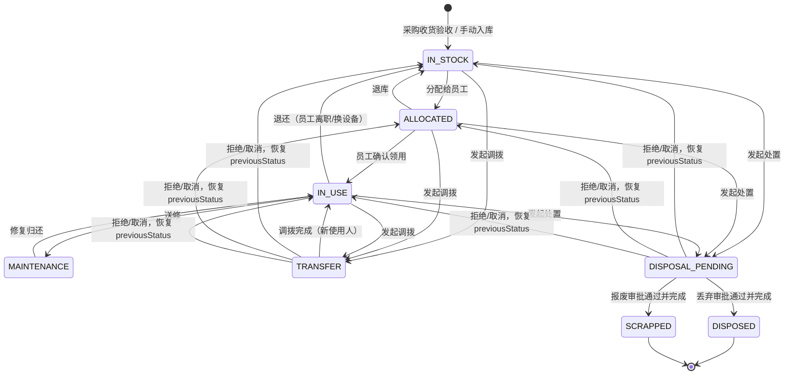
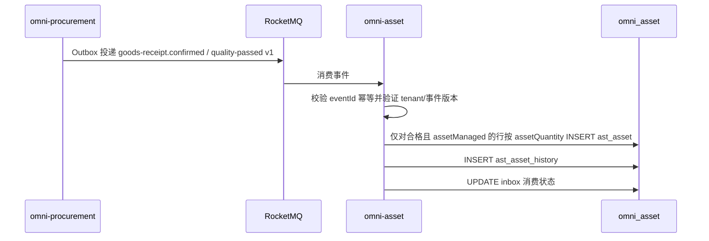
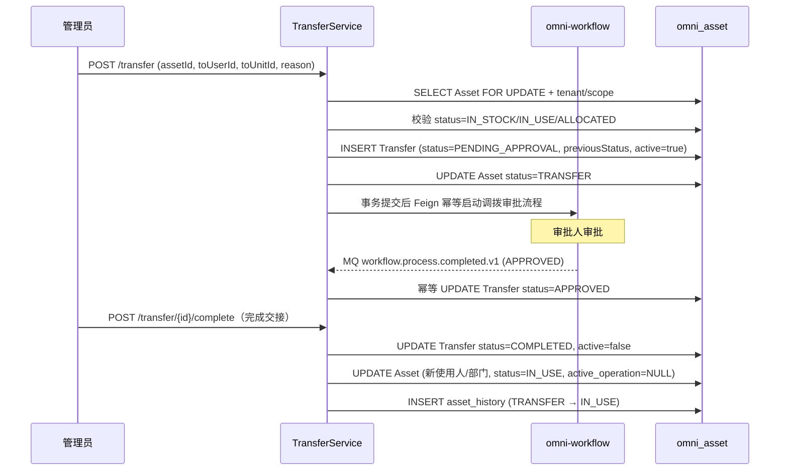
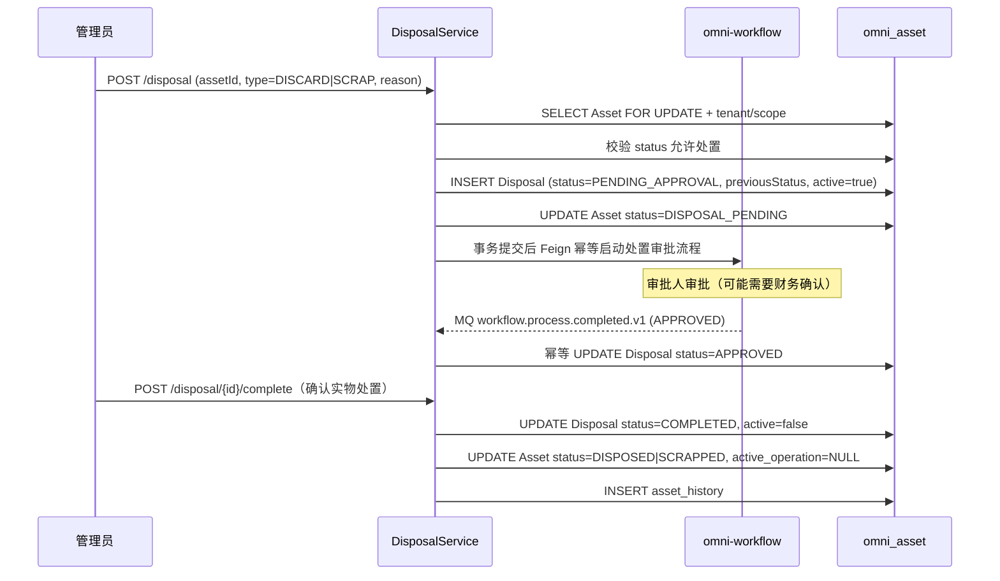

# 资产管理模块架构与实现基线

> 状态：MVP 已实现并完成验证
> 项目：Omni-Stack
> 日期：2026-07-27
> 目标：说明 omni-asset MVP 的架构、跨服务契约和实施边界；实现入口为 `omni-backend/omni-asset` 与 `omni-frontend/src/views/asset`。

设计依据：`README.md`，以及 `docs/` 中 architecture、api-contract、backend-patterns、frontend-patterns、core-flows、scheduling、workflow、mq-reliability、docker-deployment 全部主题文档；同时参照 `docs/design/srm-design.md` 和 `docs/design/procurement-design.md`。

## 1. 设计结论

资产管理应建设为独立 Servlet 微服务，管理资产从采购入库到最终处置的完整生命周期。SRM 提供供应商信息，Procurement 提供采购来源，Workflow 提供审批能力。

| 项目 | 决策 |
|---|---|
| Maven 模块 / 服务名 | `omni-asset` |
| 本地端口 / 管理端口 | `8107` / `19907` |
| XXL-JOB 执行器 | `omni-asset` / `9907`（启用折旧计算或保养提醒时） |
| 数据库 | `omni_asset` |
| Gateway | `/api/asset/**` → `lb://omni-asset`，不使用 `StripPrefix` |
| Redis | DB 0，共享 Auth 写入的 XSS 配置；键使用 `asset:` 前缀 |
| 前端 | 继续使用 `omni-frontend`，新增 `views/asset/**` |

Asset MVP 覆盖资产全生命周期管理闭环：

> 采购收货 → 资产验收入库 → 领用/分配 → 使用中 → 调拨 → 丢弃处置 / 报废处置。

折旧计算、资产盘点、维修保养工单不进入 MVP。

## 2. 产品范围

### 2.1 用户与目标

| 用户 | 核心诉求 |
|---|---|
| 行政/IT 管理员 | 管理公司全部资产，分配给员工，处理处置申请 |
| 资产使用人 | 查看自己名下的资产，确认领用或发起退还 |
| 部门经理 | 查看本部门资产，审批调拨和处置 |
| 财务人员 | 查看资产原值、当前状态，确认报废 |
| 资产管理员 | 全租户资产管理、配置、统计 |

MVP 应能回答：公司有多少资产、分布在哪里；某个资产当前谁在使用、什么状态；哪些资产闲置待分配；某个部门的资产总值；哪些资产正在走处置/报废流程。

### 2.2 分期

| 阶段 | 能力 |
|---|---|
| MVP | 资产台账、资产验收（采购联动）、资产分配/退还、资产调拨、丢弃处置、报废处置、资产概览 |
| Phase 2 | 资产盘点、折旧计算、维修保养工单、资产标签/条码、资产导入导出 |
| Phase 3 | 资产预算管控、资产处置拍卖、资产生命周期成本分析 |

## 3. 系统边界

| 组件 | 权威职责 | Asset 的使用方式 |
|---|---|---|
| `omni-auth` | 租户、用户、组织、角色、权限、数据范围、XSS 配置 | 内部 OpenFeign；只存用户/组织 ID |
| `omni-srm` | 供应商数据 | 内部 OpenFeign 查询供应商信息（保修联系等） |
| `omni-procurement` | 采购订单、收货记录 | 消费 Outbox 事件创建资产卡片；或 Feign 查询采购来源 |
| `omni-base` | 字典、操作日志 | 操作日志汇聚；资产品类/位置用字典 code |
| `omni-workflow` | BPMN、流程实例、审批、Flowable 引擎唯一运行时 | 内部 OpenFeign 启动/查询流程，消费审批结果事件 |
| `omni-asset` | 资产台账、资产状态、资产处置 | 唯一业务写入方 |
| RocketMQ | 异步运输 | 消费 Procurement 收货事件，至少一次幂等 |



推荐依赖：`omni-common-core`、`omni-common`、`omni-common-mybatis`、`omni-common-redis`、`omni-common-operlog`、`omni-common-job`、`omni-common-mqlog`，以及 Web、Validation、Security、AspectJ、OpenFeign、LoadBalancer、Nacos、RocketMQ Stream、Actuator、Lombok。

**Asset 不依赖 `omni-common-workflow`，也不嵌入 Flowable。** `omni-workflow` 是独立微服务和 Flowable 唯一运行时；Asset 通过内部 Feign 契约发起流程，通过可靠领域事件接收审批结果。

## 4. 领域与数据设计

### 4.1 聚合

| 聚合 | 表 | 职责 |
|---|---|---|
| Asset | `ast_asset`、`ast_asset_history` | 资产主数据、状态变更不可变历史 |
| Transfer | `ast_transfer` | 资产调拨记录 |
| Disposal | `ast_disposal` | 资产处置记录（丢弃/报废共用） |



### 4.2 通用字段与规则

每一张 `ast_*` 表都必须包含 `tenant_id`。资产聚合根 `ast_asset` 还必须包含：

- `tenant_id`：租户隔离。
- `owner_user_id`：资产管理员（SELF 范围）。
- `owner_unit_id`：资产管理部门（DEPT 范围）。
- `version`：乐观锁。调拨和处置申请也分别维护自己的 `version`。
- `deleted`：逻辑删除。不可变历史与 Inbox 不使用逻辑删除。
- `id/create_time/update_time/create_by/update_by`：审计字段。

约束：

- 资产编号 `asset_no` 在 tenant 内唯一，由数据库 ID 生成。
- 用户/组织 ID 由 Auth 管理，不建跨库外键。
- 供应商 ID 由 SRM 管理，只存 `supplier_id`。
- 采购来源 ID 由 Procurement 管理，保存 `source_po_id/source_gr_id/source_gr_line_id/source_unit_sequence` 作为幂等溯源，同时保存 poNo/grNo 展示快照，不建跨库外键。
- 金额使用 `DECIMAL(18,2)` / `BigDecimal`。
- 时间统一 `yyyy-MM-dd HH:mm:ss`。
- 普通 PUT 不允许直接修改资产 status、使用人、位置（需通过专用命令端点）。
- 资产处置后不可恢复。
- 同一资产同一时刻最多存在一条活动中的调拨或处置申请；`ast_asset.active_operation_type/active_operation_id` 通过 version 条件更新原子占位，统一阻止两张申请表之间的并发。

### 4.3 主要表

`ast_asset`

- `asset_no/name/category_code`：资产编号、名称、品类（字典 code）。
- `specification/brand/model`：规格、品牌、型号。
- `supplier_id/supplier_name_snapshot`：供应商 ID 与验收时名称快照；当前名称通过 SRM batch enrich，快照不参与权限或当前状态判断。
- `source_po_id/source_gr_id/source_gr_line_id/source_unit_sequence/source_po_no/source_gr_no`：采购来源与单位级幂等标识。
- `purchase_date/purchase_amount/currency_code`：采购日期、原值、币种。
- `location_code`：资产位置（字典 code，如楼层+房间号）。
- `status`：生命周期状态（IN_STOCK/ALLOCATED/IN_USE/MAINTENANCE/TRANSFER/DISPOSAL_PENDING/DISPOSED/SCRAPPED）。
- `current_user_id`：当前使用人，名称从 Auth batch enrich，不落库。
- `current_unit_id`：当前使用部门，名称从 Auth batch enrich，不落库。
- `allocated_time`：分配时间。
- `active_operation_type/active_operation_id`：当前活动操作（TRANSFER/DISPOSAL）及申请 ID；无活动操作时为 NULL。
- `warranty_expiry_date`：保修到期日。
- `expected_life_years`：预期使用年限（用于报废参考）。
- `remark`。
- `owner_user_id/owner_unit_id/version/deleted` 和审计字段。
- 核心索引：tenant + owner/status、tenant + current_user_id、tenant + current_unit_id、tenant + category_code/status、tenant + asset_no（唯一）、tenant + source_gr_line_id + source_unit_sequence（采购来源唯一，手工入库允许 source 字段为 NULL）。

`ast_asset_history`

- `asset_id/from_status/to_status/changed_by_user_id/changed_time/remark`。
- 只追加，不更新、不删除。记录资产每次状态变更和关键操作（分配、退还、调拨、处置）。

`ast_transfer`

- `transfer_no/asset_id/from_user_id/from_unit_id/to_user_id/to_unit_id/from_location/to_location`。
- `reason/status/process_instance_id/previous_asset_status/active_flag`。
- `workflow_request_id/workflow_business_key/model_version_id/workflow_start_status/workflow_start_user_id/workflow_start_user_name`：Workflow 幂等快照及原始发起人身份；`businessType=ASSET_TRANSFER` 由调拨聚合类型固定推导。
- `status`：PENDING_APPROVAL/START_FAILED/APPROVED/REJECTED/COMPLETED/CANCELLED。
- `approved_time/completed_time`。
- `version/deleted` 和审计字段。

`ast_disposal`

- `disposal_no/asset_id/disposal_type（DISCARD/SCRAP）/reason/previous_asset_status/active_flag`。
- `residual_value（残值）/disposal_method（处置方式描述）`。
- `status`：PENDING_APPROVAL/START_FAILED/APPROVED/REJECTED/COMPLETED/CANCELLED。
- `process_instance_id`：关联 omni-workflow 审批流程实例。
- `workflow_request_id/workflow_business_key/model_version_id/workflow_start_status/workflow_start_user_id/workflow_start_user_name`：Workflow 幂等快照及原始发起人身份；`businessType=ASSET_DISPOSAL` 由处置聚合类型固定推导。
- `approved_time/completed_time`。
- `version/deleted` 和审计字段。

## 5. 状态机与核心流程

### 5.1 Asset 生命周期



- `IN_STOCK`：资产在库，未分配。
- `ALLOCATED`：已分配给员工，等待领用确认。
- `IN_USE`：员工正在使用。
- `MAINTENANCE`：送修中（MVP 仅标记状态，不做维修工单）。
- `TRANSFER`：正在调拨中（等待审批和交接）。
- `DISPOSAL_PENDING`：正在走处置审批，禁止分配、退还、调拨或重复处置。
- `DISPOSED`：丢弃处置完成（终态）。
- `SCRAPPED`：报废处置完成（终态）。

只有 `IN_STOCK`、`IN_USE`、`ALLOCATED` 状态的资产可以发起调拨或处置。`MAINTENANCE`、`TRANSFER` 和 `DISPOSAL_PENDING` 状态的资产不可发起其他业务操作。MVP 提供 `maintenance/start` 与 `maintenance/complete` 两个轻量命令，仅维护状态和历史，不引入维修工单。

### 5.2 资产验收（采购联动）



**幂等消费**：Asset 维护 `ast_inbox_event` 表（`consumer_name + event_id` 唯一键），同时在 `ast_asset` 上使用 `tenant_id + source_gr_line_id + source_unit_sequence` 唯一键。前者防止整条实时事件重复执行，后者统一保护实时消费、人工重放和历史补偿回扫。

**批量创建**：只处理 `qualityStatus=PASS && assetManaged=true && assetQuantity>0` 的行；assetQuantity 必须为正整数。如果 5 台笔记本验收合格，则以 unitSequence=1..5 创建 5 条独立资产。耗材、服务、kg 等连续计量物料以及 PENDING/FAIL 行不创建资产。

**历史补偿**：Asset 上线或修复消费故障时，通过 Procurement 的 `/internal/procurement/goods-receipt/asset-candidates` 游标分页接口回扫历史收货候选。补偿数据映射为相同的来源键并复用同一创建服务，不能假设 Procurement Outbox 或 Broker 会为尚未部署的消费者永久保留消息。

### 5.3 资产分配与退还

```text
分配：
POST /asset/{id}/allocate (targetUserId, targetUnitId)
→ 校验 status=IN_STOCK
→ UPDATE asset SET current_user_id, current_unit_id, status=ALLOCATED, allocated_time
→ INSERT asset_history (IN_STOCK → ALLOCATED)

领用确认：
POST /asset/{id}/accept
→ 校验 status=ALLOCATED
→ UPDATE asset SET status=IN_USE
→ INSERT asset_history (ALLOCATED → IN_USE)

退还：
POST /asset/{id}/return
→ 校验 status=IN_USE or ALLOCATED
→ UPDATE asset SET current_user_id=NULL, current_unit_id=NULL, allocated_time=NULL, status=IN_STOCK
→ INSERT asset_history (IN_USE → IN_STOCK)

送修/修复：
POST /asset/{id}/maintenance/start → IN_USE → MAINTENANCE
POST /asset/{id}/maintenance/complete → MAINTENANCE → IN_USE
```

### 5.4 资产调拨



调拨审批使用简单单级审批（管理员或部门经理审批）。MVP 不做多级审批。Workflow 返回 REJECTED 或用户取消时，Asset 必须在同一事务中把 Transfer 置为终态、`active=false`，并将 Asset 恢复为 `previous_asset_status`；流程启动结果不确定时保持 `PENDING_APPROVAL + PENDING` 并使用相同 `tenantId + businessType + businessKey` 重试，不允许本地取消。Workflow 业务响应 404 表示模型版本已不可启动且远端未创建实例，此时进入 `START_FAILED + FAILED`，可重试或取消恢复。

### 5.5 资产处置（丢弃/报废）



丢弃和报废使用相同的审批流程，区别在于：
- **丢弃（DISCARD）**：资产不再使用，直接丢弃。可能需要记录处置方式（捐赠、回收、销毁）。
- **报废（SCRAP）**：资产到达使用年限或损坏无法修复，正式报废。可能需要记录残值。

审批流可以配置不同的审批人（报废可能需要财务确认，丢弃只需行政经理）。

处置审批拒绝、取消或启动失败后取消时，必须将 Asset 恢复为 `previous_asset_status`，清除申请的 active_flag 以及 Asset 的 `active_operation_*`。调拨和处置创建都必须以 `tenant_id + asset_id + version + active_operation_id IS NULL` 条件原子占位；更新行数非 1 返回 409，从数据库层阻止两类申请交叉并发。

## 6. 租户、RBAC 与数据权限

### 6.1 信任链

与其他服务一致：Gateway JWT → Asset Tenant 校验 → @PreAuthorize → @AssetDataScope → MyBatis DataPermission → AssetRecordAccessGuard。

### 6.2 权限树与角色

菜单：`asset`（DIRECTORY）以及 `asset:overview`、`asset:asset`、`asset:transfer`、`asset:disposal`（MENU）。

API 权限：

- `asset:overview:list`
- `asset:asset:list/self/create/update/delete/allocate/accept/return/maintenance`
- `asset:transfer:list/create/approve/complete/cancel/retry`
- `asset:disposal:list/create/approve/complete/cancel/retry`

| 角色 | dataScope | 能力 |
|---|---|---|
| `ASSET_ADMIN` | TENANT | 当前租户全部资产功能/数据 |
| `ASSET_MANAGER` | DEPT_AND_BELOW | 部门及下级、调拨/处置审批 |
| `ASSET_USER` | SELF | 通过“我的资产”端点查看本人名下资产、确认领用和发起退还 |
| `SUPER_ADMIN` | ALL | 所有功能，资产数据仍限当前租户 |

默认 USER 不授予资产权限。

### 6.3 Asset 上下文与 SQL 拦截

与 SRM/CRM/Procurement 模式一致。拦截器顺序固定：`TenantLineInnerInterceptor → DataPermissionInterceptor → PaginationInnerInterceptor`。

| dataScope | 条件 |
|---|---|
| SELF | 当前 permission 映射的 owner 或 current_user 列等于 currentUserId |
| DEPT | 当前 permission 映射的 owner_unit 或 current_unit 列等于 primaryUnitId |
| DEPT_AND_BELOW / CUSTOM | 当前 permission 映射的 unit 列 IN accessibleUnitIds |
| TENANT / ALL | 不加 owner 条件，TenantLine 始终保留 |

资产的 dataScope 有管理维度和使用维度，不能在通用 SQL 中使用宽泛 OR，必须按 permissionCode/端点显式映射：

| 端点/权限 | 范围列 | 规则 |
|---|---|---|
| `/asset/list`、详情、管理历史；`asset:asset:list` | `owner_user_id/owner_unit_id` | 面向资产管理人员，按管理归属过滤 |
| `/asset/my`；`asset:asset:self` | `current_user_id` | 固定等于当前用户，不因其他角色的更宽 dataScope 扩大 |
| accept/return；对应命令权限 | `current_user_id` | RecordAccessGuard 强制目标资产当前分配给 currentUserId |
| Transfer/Disposal list/detail | 关联 Asset 的管理维度 | 子表通过同 tenant 的 asset_id 继承，不直接拼接不存在的 owner 列 |
| Transfer/Disposal approval-view | Workflow taskId 分配关系 | 先验证当前用户是该 tenant/业务单据的任务审批人，再按 tenant + id 读取只读 VO |
| Overview | Asset 管理维度 | 聚合 SQL 使用与 `/asset/list` 相同范围 |

如果用户同时拥有 ASSET_USER 和管理角色，前端仍分别调用“我的资产”和管理列表；后端不得把两种维度 OR 合并后用于写授权。

## 7. API 设计

### 7.1 通用契约

与其他服务一致。

### 7.2 端点

| 领域 | 端点 |
|---|---|
| Overview | `GET /api/asset/overview/summary`、`/distribution` |
| Asset | `GET /asset/list`、`GET /asset/{id}`、`POST /asset`、`PUT/DELETE /asset/{id}` |
| 我的资产 | `GET /asset/my` |
| Asset 命令 | `POST /asset/{id}/allocate`、`/accept`、`/return`、`/maintenance/start`、`/maintenance/complete` |
| Asset 历史 | `GET /asset/{id}/history` |
| Transfer | `GET /transfer/list`、`GET /transfer/{id}`、`POST /transfer` |
| Transfer 审批视图 | `GET /transfer/{id}/approval-view?taskId={taskId}` |
| Transfer 命令 | `POST /transfer/{id}/complete`、`/cancel`、`/retry-start`；审批动作在 Workflow 完成 |
| Disposal | `GET /disposal/list`、`GET /disposal/{id}`、`POST /disposal` |
| Disposal 审批视图 | `GET /disposal/{id}/approval-view?taskId={taskId}` |
| Disposal 命令 | `POST /disposal/{id}/complete`、`/cancel`、`/retry-start`；审批动作在 Workflow 完成 |
| 内部 API | `POST /api/internal/asset/procurement/backfill?tenantId={tenantId}&afterId={id}&size={size}`，受内部令牌保护 |

### 7.3 端点与 DataScope permission 映射

| 操作 | permissionCode |
|---|---|
| Overview | `asset:overview:list` |
| Asset list/detail/history | `asset:asset:list` |
| My Asset | `asset:asset:self` |
| Asset create/update/delete | `asset:asset:create/update/delete` |
| Asset allocate | `asset:asset:allocate` |
| Asset accept（员工自用） | `asset:asset:accept` |
| Asset return | `asset:asset:return` |
| Asset maintenance start/complete | `asset:asset:maintenance` |
| Transfer list/detail | `asset:transfer:list` |
| Transfer create | `asset:transfer:create` |
| Transfer approval-view | `asset:transfer:approve` |
| Transfer complete | `asset:transfer:complete` |
| Transfer cancel/retry-start | `asset:transfer:cancel/retry` |
| Disposal list/detail | `asset:disposal:list` |
| Disposal create | `asset:disposal:create` |
| Disposal approval-view | `asset:disposal:approve` |
| Disposal complete | `asset:disposal:complete` |
| Disposal cancel/retry-start | `asset:disposal:cancel/retry` |

## 8. 跨服务一致性

### 8.1 Auth Feign

与其他服务一致。

### 8.2 SRM Feign

Asset 通过 SRM 内部 API 获取供应商信息（资产录入候选、保修联系、供应商状态）：

- `GET /api/internal/supplier/{id}?tenantId={tenantId}`：获取供应商摘要。
- `GET /api/internal/supplier/search?...&status=APPROVED&keyword={keyword}`：搜索当前租户已批准供应商。
- 资产录入页面调用 `/api/asset/options/suppliers`，展示编号和名称，不再要求用户手工输入数字 ID；
  历史详情在 SRM 暂不可用时仍使用本地名称快照展示。

### 8.3 Procurement 联动

**事件消费**：Asset 消费 `procurement.goods-receipt.confirmed.v1` 和 `procurement.goods-receipt.quality-passed.v1` 创建资产卡片。二者使用同一 payload 行契约和来源单位幂等键；quality-passed 只包含从 PENDING 新转为 PASS 的行。

事件信封以 `procurement-design.md` 8.4 为权威契约，必须包含 eventId/eventType/occurredAt/tenantId，以及 goodsReceiptId、grNo、purchaseOrderId、poNo、supplier 快照、币种和逐行的 goodsReceiptLineId、purchaseOrderLineId、material/category、qualityStatus、assetManaged、assetQuantity、unitPrice。缺少 tenant、来源行 ID、资产化标志或版本不支持时进入消费失败/死信，禁止猜测默认值创建资产。

消费流程：
1. RocketMQ Consumer 接收消息。
2. 校验事件 `tenantId`，同时设置系统 TenantContext 与当前租户 `TENANT` 级 DataScopeContext；消费结束必须在 `finally` 中清理两者。
3. 幂等检查：`ast_inbox_event` 表（`consumer_name + event_id` 唯一键）。
4. 对满足资产化条件的收货行按 unitSequence 创建资产记录，并依赖来源唯一键兜底。
5. 在同一事务中更新 inbox 消费状态。

**Feign 查询**（可选）：Asset 可通过 Procurement 内部 API 查询采购来源详情（PO 号、金额、供应商）。

**补偿回扫**：Asset 启动后的受控任务调用 Procurement 资产候选分页 API，直到游标耗尽；实时事件与回扫共用同一幂等创建逻辑。回扫同样必须显式设置当前租户 `TENANT` 级 DataScopeContext，避免来源幂等写入后的校验查询被失败关闭规则过滤；请求结束后清理上下文。

### 8.4 Workflow 集成

Asset 不嵌入 Flowable，通过 Workflow 内部 API 与审批结果事件集成。需要审批的场景：

- 资产调拨审批（MVP 简单单级审批）。
- 资产丢弃处置审批。
- 资产报废处置审批（可能需要财务确认）。

审批流遵循 `docs/workflow.md` 规范。每个审批类型一个 BPMN 流程模型；模型键可由租户自定义，
但模型 `category` 必须与用途精确绑定：调拨为 `ASSET_TRANSFER`，丢弃/报废处置为
`ASSET_DISPOSAL`。

用户创建调拨或处置申请时不传 `modelVersionId`。Asset 先按当前租户与固定业务分类调用 Workflow
`current-published` 内部查询，自动选择已发布、存在流程定义且 `category` 与业务类型一致的版本，再把
`requestId/tenantId/modelVersionId/businessType/businessKey/startUser/variables` 保存为本地幂等快照。
实际启动时 Workflow 再次校验模型，关闭解析与启动之间的变更窗口。Workflow 对
`tenantId + businessType + businessKey` 唯一幂等，重复调用返回已有实例。

审批人通过 Workflow `/api/workflow/approval/{taskId}/complete` 执行审批。承担资产审批的角色必须同时获得对应的 `asset:transfer:approve` 或 `asset:disposal:approve`（读取专用 approval-view）以及 `workflow:approval:complete`（完成本人任务）。approval-view 必须校验 tenant、businessType、businessKey 和当前任务分配，不能作为普通 dataScope 的通用绕过。

审批结束由 Workflow Outbox 发布 `workflow.process.completed.v1`。Asset 使用 Inbox eventId 幂等消费，并严格核对 tenantId、businessType、businessKey、processInstanceId 和当前申请状态：

- APPROVED：申请进入 APPROVED，等待业务 `/complete` 完成交接或实物处置。
- REJECTED/CANCELLED：申请进入对应终态，恢复 Asset.previousStatus，清除 `active_operation_*`。
- 重复、乱序或实例不匹配事件只记录告警，不改变资产。

MVP 完成事件不携带审批人或审批意见等可能含敏感信息的内容，Asset 不冗余此类快照；完整任务、
处理人和意见始终以 Workflow 查询结果为权威。

Workflow 不可用、返回 409/其他结果不确定响应或响应丢失时，远端结果可能已受理，申请保持 `PENDING_APPROVAL + PENDING` 和资产占位状态，只能使用原始 requestId、业务键、模型版本和发起人身份重试。Workflow 业务响应 404 是远端事务未创建实例的显式失败，进入 `START_FAILED + FAILED` 后才允许有权限用户本地取消并恢复。Asset 不依赖 `omni-common-workflow`，Flowable 表只存在于 `omni-workflow` 数据库。

### 8.5 Outbox 事件

- `asset.created.v1`（验收创建）
- `asset.allocated.v1`
- `asset.returned.v1`
- `asset.transfer.completed.v1`
- `asset.disposed.v1`
- `asset.scrapped.v1`

## 9. 隐私、操作日志与 XSS

### 9.1 OperLog

复用已有的 PII 脱敏能力。Asset 的 PII 字段较少，主要是资产使用人信息（已在 Auth 中管理）。

### 9.2 PII

资产本身不包含敏感 PII。使用人信息通过 Auth 展示，Asset 只存 userId。

### 9.3 XSS

Asset 必须实现 `XssConfigProvider`。MVP 备注只允许纯文本。

## 10. 前端设计

```text
omni-frontend/src/
├── api/
│   ├── asset-overview.ts
│   ├── asset-asset.ts
│   ├── asset-transfer.ts
│   └── asset-disposal.ts
├── views/asset/
│   ├── overview/index.vue           # 资产概览（统计 + 分布）
│   ├── asset/index.vue              # 资产台账
│   ├── transfer/index.vue           # 资产调拨
│   └── disposal/index.vue           # 资产处置
└── components/asset/
    ├── AssetCard.vue                # 资产卡片（概览用）
    ├── AssetDistribution.vue        # 资产分布图表
    ├── TransferForm.vue             # 调拨表单
    └── DisposalForm.vue             # 处置表单
```

- `ApiResponse/PageResult` 只从 `src/types/api.ts` 导入。
- 资产台账支持按状态、品类、部门、位置多维度筛选。
- 资产详情页展示基本信息 + 使用人 + 采购来源 + 变更历史 + 调拨记录 + 处置记录。
- 概览页展示资产总数、总值、按状态分布、按部门分布、按品类分布。
- `router/index.ts` 与 `layout/index.vue` iconMap 补 Asset。

## 11. 工程落点

### 11.1 新模块

```text
omni-backend/omni-asset/
├── pom.xml
└── src/main/
    ├── java/com/omni/asset/
    │   ├── AssetApplication.java
    │   ├── client/ config/ controller/ dto/ entity/
    │   ├── mapper/ security/ service/ service/impl/
    │   ├── consumer/                  # MQ 消费者（收货事件）
    │   └── workflow/                  # Workflow Feign 客户端和审批结果事件消费者
    └── resources/
        ├── application.yml
        ├── application-dev.yml
        └── mapper/
```

### 11.2 必改文件

| 文件 | 修改 |
|---|---|
| `omni-backend/pom.xml` | 加入 `omni-asset` |
| Gateway `application.yml` | 显式 `/api/asset/**` 路由 |
| `docker/backend/Dockerfile` | POM 缓存层 |
| `docker-compose.yml` | Asset 服务、8107 |
| `start.bat/start.sh` | build 列表加入 Asset |
| `scripts/sql/init-all.sql` | `omni_asset` DDL、权限和角色 |
| `scripts/sql/sp_init_tenant.sql` | 新租户初始化同步 |
| `omni-workflow` | 复用/补齐幂等内部启动、任务分配校验 API 和 `workflow.process.completed.v1` Outbox 事件 |
| `omni-procurement` | 确认收货事件 v1 字段与历史资产候选分页 API |
| Frontend router/layout/menu/locales | 图标、菜单、i18n |

配置要点：server 8107、management 19907、Redis DB 0、XXL appname `omni-asset`/port 9907。

## 12. 非功能设计

### 性能

- 所有列表分页，最大 100。
- 供应商名称、使用人名称一次 batch enrich，禁止 N+1。
- 概览统计使用 Mapper 层聚合 SQL。

### 并发与幂等

- 资产分配/退还：行锁 + version 乐观锁。
- 调拨/处置：申请行锁 + Asset version 条件更新 `active_operation_*`，统一防止两类活动申请交叉并发。
- Workflow 启动：跨服务 businessKey 幂等；审批结果使用 Inbox eventId 幂等。
- 收货事件消费：`ast_inbox_event` 与资产来源单位唯一键双重幂等。

### 降级

- SRM 不可用：供应商信息降级为 ID。
- Procurement 不可用：采购来源信息降级为 PO 号文本。
- Workflow 不可用或结果不确定：返回 503，申请保持可同键重试的 `PENDING_APPROVAL + PENDING`；明确返回模型版本不可启动时进入 `START_FAILED + FAILED`。不得跳过审批或在启动结果不确定时本地取消。
- Auth 不可用：503 失败关闭。

## 13. 测试与验收

最低测试集：

- 资产状态机合法/非法迁移（全部合法路径 + 非法路径拒绝）。
- 收货事件幂等消费（同一事件不重复创建资产）。
- 实时事件和历史回扫同时处理同一收货行时不重复创建资产。
- 非资产物料、质检失败/待定、连续计量或非整数数量不会创建资产。
- 批量收货正确创建多条资产（数量 > 1）。
- 调拨完成后资产使用人和部门正确更新。
- 处置完成后资产进入终态。
- 调拨/处置拒绝以及 `START_FAILED + FAILED` 后本地取消均恢复 previousStatus 并清除活动占位；启动结果不确定时不得取消。
- 同一资产并发创建调拨和处置时只有一个成功，另一个返回 409。
- Workflow 审批结果重复、乱序、tenant/businessKey/processInstanceId 不匹配时不更新资产。
- 审批人只能通过分配给自己的 taskId 读取 Transfer/Disposal approval-view，伪造 taskId 或业务 ID 时拒绝。
- 并发分配同一资产只有一个成功。
- 跨租户隔离。
- 缺 tenant/scope 失败关闭。
- `ASSET_USER` 只能看到自己名下的资产。
- “我的资产”固定按 current_user_id 查询，不因用户同时拥有管理角色而扩展；管理列表按 owner 维度查询。

端到端验收：采购收货 → MQ 事件 → 资产创建（IN_STOCK）→ 分配给员工（ALLOCATED）→ 员工确认领用（IN_USE）→ 发起调拨 → 审批通过 → 新使用人（IN_USE）→ 发起报废 → 审批通过 → SCRAPPED。

## 14. 实施顺序

### Milestone 0：前置确认

- 确认 SRM 和 Procurement 已建设完成。
- 确认 Workflow 服务可用。
- 确认 Workflow 内部启动 API、审批结果事件以及 Procurement 收货事件/历史补偿 API 契约。

### Milestone 1：服务搭建 + 安全底座

- 创建模块、配置、Gateway、Docker、DB。
- TenantLine + DataPermission + Pagination。
- 权限树、Asset 角色、已有租户迁移。
- 前端 root 菜单。

### Milestone 2：资产台账

- 资产 CRUD（含手动入库）。
- 资产分配/领用确认/退还。
- 资产变更历史。
- 资产详情页。

### Milestone 3：采购联动 + 验收

- MQ 消费者（收货事件 → 创建资产）。
- `ast_inbox_event` 幂等消费。
- 来源单位唯一键、批量创建资产（assetQuantity > 1）和历史补偿回扫。

### Milestone 4：调拨 + 处置

- 调拨申请 + 独立 Workflow 服务审批。
- 丢弃/报废处置 + 独立 Workflow 服务审批。
- 审批结果事件 → 申请状态更新、拒绝恢复、业务 complete。

### Milestone 5：概览 + 生产加固

- 概览统计（summary + distribution）。
- 测试、索引、安全验收。
- 更新 docs/、AGENTS.md。

## 15. ADR 摘要

| 决策 | 选择 | 原因 |
|---|---|---|
| 服务 | 独立 `omni-asset` | 与 SRM/Procurement 分离，职责清晰 |
| Workflow 集成 | 独立 `omni-workflow` 内部 API + 审批结果事件 | 保持 Flowable 唯一运行时和数据库边界 |
| 采购联动 | Outbox 事件消费 | 解耦 Procurement 和 Asset |
| 批量收货 | 每单位一个资产卡片 | 便于独立追踪每个资产 |
| 幂等消费 | Inbox eventId + 来源行/unitSequence 唯一键 | 同时覆盖实时事件、重放和历史回扫 |
| 调拨审批 | 简单单级审批 | MVP 不做多级审批 |
| 处置类型 | DISCARD + SCRAP 共用表 | 流程一致，区别在审批人和终态 |
| 折旧计算 | 不做 | MVP 不处理财务折旧 |

## 16. 主要风险

| 优先级 | 风险 | 处理 |
|---|---|---|
| P0 | 收货事件重复消费导致资产重复创建 | `ast_inbox_event` 唯一键幂等 |
| P0 | Workflow 不可用或响应丢失导致半启动/重复流程 | 结果不确定保持 PENDING 同键重试；仅远端明确未创建实例时进入 START_FAILED |
| P0 | 写操作绕过查询数据权限 | AccessGuard + 条件更新 |
| P1 | 并发分配同一资产 | 行锁 + version 乐观锁 |
| P1 | 收货数量 > 1 时资产创建不完整 | 事务内逐行创建，全部成功或全部回滚 |
| P0 | 耗材/质检失败/连续计量物料被错误资产化 | Procurement assetManaged + 质量/整数校验，Asset 失败关闭 |
| P1 | 调拨与处置并发或拒绝后资产卡死 | active_operation 原子占位 + previousStatus 恢复 |
| P1 | 资产处置后误操作恢复 | 终态不可逆，不提供恢复接口 |
| P1 | MQ 消息积压或 Asset 晚上线导致资产创建延迟/漏建 | Outbox 实时投递 + Procurement 历史候选补偿回扫 |
| P2 | 品类/位置字典数据不完整 | 租户初始化时预置常用值 |
