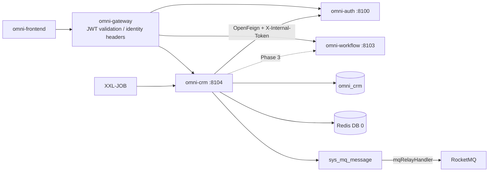
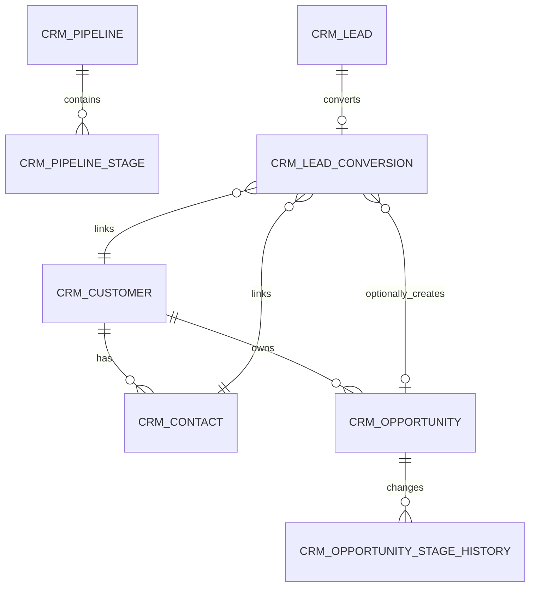
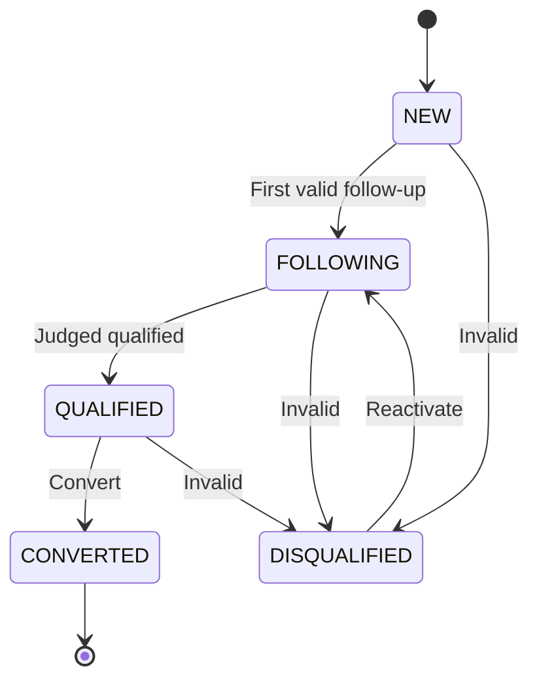
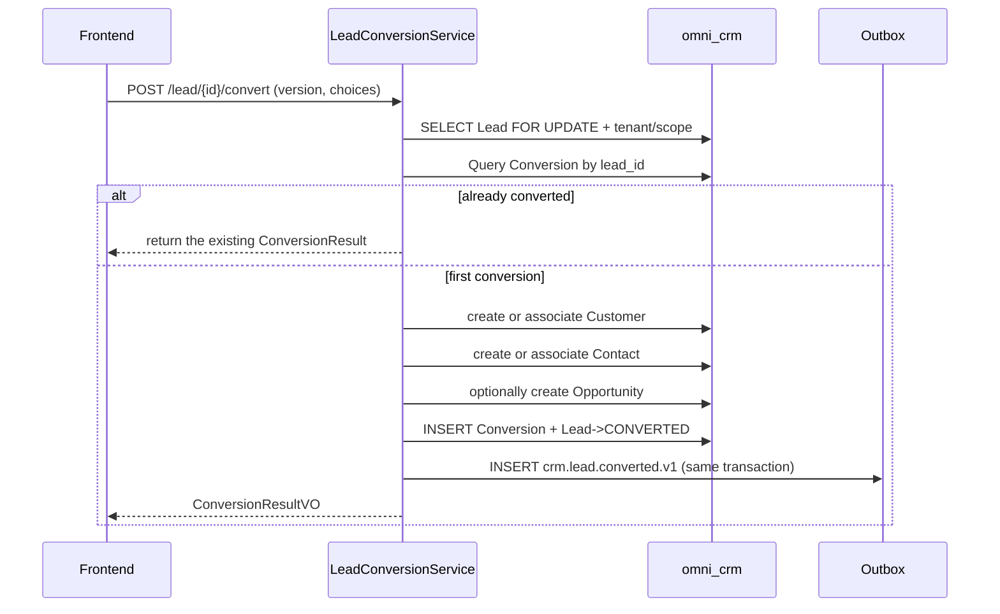

# CRM Module Architecture and Implementation Baseline

> Status: MVP implemented, serving as the baseline for subsequent iterations  
> Project: Omni-Stack  
> Date: 2026-07-12  
> Goal: Describe the architecture, cross-service contracts, and subsequent iteration boundaries of the CRM MVP already persisted to the database; the implementation entry points are `omni-backend/omni-crm` and `omni-frontend/src/views/crm`.

Design basis: `README.md`, and all topic documents in `docs/` — architecture, api-contract, backend-patterns, frontend-patterns, core-flows, scheduling, workflow, mq-reliability, docker-deployment; also cross-checks the documentation examples against the current POM, Gateway, SQL, Docker Compose, and frontend dynamic-routing implementations.

## 1. Design Conclusion

CRM should be built as an independent Servlet microservice rather than continuing to live inside `omni-base`.

| Item | Decision |
|---|---|
| Maven module / service name | `omni-crm` |
| Local port / management port | `8104` / `19904` |
| XXL-JOB executor | `omni-crm` / `9904` (when Outbox/tasks are enabled) |
| Database | `omni_crm` |
| Gateway | `/api/crm/**` → `lb://omni-crm`, without `StripPrefix` |
| Redis | DB 0, shares the XSS configuration written by Auth; CRM keys use the `crm:` prefix |
| Frontend | Continue to use `omni-frontend`, add `views/crm/**` |

The first version of CRM only completes the pre-sales closed loop:

> Lead → follow-up → customer/contact → opportunity → won or lost.

Products, quotations, contracts, orders, invoicing, collections, marketing automation, and support tickets are not included in the MVP. After entering the contract/order stage, splitting out `omni-sales` should be evaluated; do not let CRM evolve into an ERP.

Four P0 prerequisites must be completed before implementation:

1. Auth provides a permission-aware data-scope internal API; CRM does not read `omni_auth` across databases.
2. `@OperLog` adds PII masking/ignore capability for phone numbers, emails, addresses, remarks, etc.
3. CRM tenant and data permissions fail closed; when context is missing, it must not default to tenant 1 nor pass through unconditionally.
4. In CRM, `ALL` is explicitly defined as "all data of the current tenant"; cross-tenant queries use a separate platform permission and a dedicated interface.

## 2. Product Scope

### 2.1 Users and Goals

| User | Core need |
|---|---|
| Sales rep | Manage their own leads, customers, contacts, opportunities, and pending follow-ups |
| Sales manager | View their department and below, assign owners, inspect the funnel and overdue items |
| CRM administrator | Manage all CRM data and business configuration within the tenant |
| Read-only observer | View statistics and records within the authorized scope, without modifying or viewing full PII by default |

The MVP should be able to answer: how many new/qualified/converted leads there are now; which items are due today or overdue; what contacts, follow-ups, and opportunities a customer has; what stage an opportunity is in; the funnel amount, conversion rate, and win rate; who modified a key business record.

### 2.2 Phasing

| Phase | Capability |
|---|---|
| MVP | Lead, assignment, follow-up activity, customer, contact, customer 360, opportunity, stage, won/lost, basic board, duplicate-candidate hints |
| Phase 2 | Public pool, tags, import/export, merge, automatic reminders, sharing, configurable stages, custom fields, field-level encryption |
| Phase 3 | Products, price lists, quotations, contracts, discount/contract approval, collection plans, sales forecasting |
| Independent domains | Marketing campaigns and nurturing, support tickets/SLA, invoicing and financial reconciliation |

## 3. System Boundaries

| Component | Authoritative responsibility | How CRM uses it |
|---|---|---|
| `omni-auth` | Tenant, user, organization, role, permission, data scope, XSS configuration | Internal OpenFeign; CRM stores only user/organization IDs |
| `omni-crm` | Lead, customer, contact, opportunity, follow-up, and CRM status | The sole business writer |
| `omni-base` | Dictionary, operation logs, task/MQ operations | Operation log aggregation; the MVP does not hard-depend on the dictionary being online |
| `omni-workflow` | BPMN, process instances, to-dos, approval history | Phase 3 idempotent integration, without embedding Flowable |
| XXL-JOB | Triggers batch scans | Not the authoritative store for reminders or CRM status |
| RocketMQ | Asynchronous transport | At-least-once; consumers must be idempotent |
| Redis | XSS shared configuration, short cache | Does not store authoritative CRM business data |



Recommended dependencies: `omni-common-core`, `omni-common`, `omni-common-mybatis`, `omni-common-redis`, `omni-common-operlog`, `omni-common-job`, `omni-common-mqlog`, plus Web, Validation, Security, AspectJ, OpenFeign, LoadBalancer, Nacos, RocketMQ Stream, Actuator, and Lombok.

Do not depend on `omni-common-workflow`, otherwise the Flowable engine would be embedded into CRM.

## 4. Domain and Data Design

### 4.1 Aggregates

| Aggregate | Tables | Responsibility |
|---|---|---|
| Lead | `crm_lead`, `crm_lead_conversion` | Lead lifecycle, owner, conversion idempotency |
| Customer | `crm_customer`, `crm_contact` | Customer profile, contacts, customer 360 |
| Opportunity | `crm_opportunity`, `crm_opportunity_stage_history` | Stage, amount, probability, won/lost history |
| Activity | `crm_activity` | Planned, completed, cancelled follow-ups |
| Pipeline | `crm_pipeline`, `crm_pipeline_stage` | Opportunity pipeline and stage definitions |
| Ownership Audit | `crm_owner_change_log` | Immutable history of owner/organization changes |



`crm_activity` uses `root_type + root_id` to associate a Lead, Customer, or Opportunity. A polymorphic relationship cannot use a normal foreign key, so the Service must verify the target exists, is in the same tenant, and is accessible to the current user.

### 4.2 Common Fields and Rules

Every `crm_*` table must contain `tenant_id`, including tenant config, pipeline stage, conversion, stage history, owner history, approval request, and inbox; this way TenantLine will not rewrite to a non-existent column. Authorizable business tables must also contain:

- `tenant_id`: tenant isolation.
- `owner_user_id`: SELF scope and business owner.
- `owner_unit_id`: DEPT/DEPT_AND_BELOW/CUSTOM scope.
- `version`: optimistic lock.
- `deleted`: logical deletion.
- `id/create_time/update_time/create_by/update_by`: project audit fields.

Constraints:

- User/organization IDs are managed by Auth; no cross-database foreign keys are created, and usernames or ownerUnitId submitted by the frontend are not trusted.
- Indexes start with `tenant_id`, then combine owner, status, and follow-up time.
- `create_by` is a username audit field and cannot be used for SELF data permission.
- Amounts use `DECIMAL(18,2)` / `BigDecimal`; currencies use ISO 4217 three-letter codes. In the MVP, all opportunities are forced to use the single default currency configured for the tenant, and statistics must not directly sum across currencies; multi-currency and exchange-rate conversion are left to later versions.
- Times are uniformly `yyyy-MM-dd HH:mm:ss`; the expected close date may use `LocalDate`.
- `lead_no/customer_no/opportunity_no` are generated from an already-generated database ID or a dedicated sequence table and made unique within the tenant; `SELECT MAX(...) + 1` is forbidden.
- A normal PUT is not allowed to directly modify the owner, lifecycle status, or opportunity stage.
- External requests must not use bare `selectById/updateById/deleteById`.
- Logically deleted business entities do not establish crude unique keys; stable configuration codes and Lead Conversion may establish unique constraints.

The current `BaseEntity` comment claims automatic audit filling exists, but there is no verifiable `MetaObjectHandler` in the repository. Before CRM development, the common audit filling should be completed and tested; otherwise the Service explicitly writes audit fields.

### 4.3 Main Tables

`crm_tenant_config`

- `tenant_id` unique, `default_pipeline_id`, `currency_code=CNY`, `lead_duplicate_policy=WARN`, `initialized_time`.
- When a tenant first enters CRM, `CrmTenantInitializer` idempotently creates the default configuration, avoiding Auth writing to the CRM DB in a cross-service transaction.

`crm_pipeline` / `crm_pipeline_stage`

- Pipeline: `tenant_id/code/name/status/default_flag/sort/version/deleted`.
- Stage: `pipeline_id/stage_code/stage_name/stage_type/probability/sort/status/deleted`.
- `stage_type` is fixed to `OPEN/WON/LOST`.
- The MVP presets `DISCOVERY → QUALIFICATION → PROPOSAL → NEGOTIATION → WON/LOST` and does not open a management UI for now.

`crm_lead`

- `lead_no/full_name/company_name/job_title/mobile/phone/email/region/address`.
- `source_code/industry_code/rating/status/disqualify_reason`.
- owner, assigned, lastActivity, nextFollowup, converted, version, and audit fields.
- Core indexes: tenant + owner/status, tenant + unit/status, tenant + nextFollowup/status, tenant + company/mobile/email.

`crm_lead_conversion`

- `tenant_id/lead_id/customer_id/contact_id/opportunity_id/converted_by_user_id/converted_time`.
- `lead_id` is unique, records cannot be deleted, and it is the idempotency basis for Lead conversion.

Phone numbers, emails, and company names are used only for duplicate candidates, not as hard business uniqueness. The same company may have multiple contacts, and the same phone may be a company switchboard. By default, candidates are returned with a warning, and the user chooses to associate an existing record or still create one.

`crm_customer`

- `customer_no/name/normalized_name/customer_type/industry_code/level_code/source_code`.
- `credit_code/website/phone/email/region/address/status`.
- owner, lastActivity, nextFollowup, version, deleted, and audit fields.

`crm_contact`

- `customer_id/name/department/job_title/mobile/phone/email/decision_role/primary_flag/status`.
- owner is a permission snapshot of the Customer owner; it is synchronized in the same transaction when the customer is transferred.
- Each customer has at most one valid primary contact; the Service switches it under a customer row lock, and a generated-column unique index can provide further fallback.

`crm_opportunity`

- `opportunity_no/name/customer_id/primary_contact_id/source_lead_id`.
- `pipeline_id/stage_id/status/amount/currency_code/probability`.
- `expected_close_date/actual_close_time/loss_reason`, owner, stageChange, nextFollowup, version.

`crm_opportunity_stage_history`

- `opportunity_id/from_stage_id/to_stage_id/from_status/to_status/change_reason/changed_by_user_id/changed_time`.
- Append-only, never updated, never deleted.

The Opportunity `status` must stay consistent with the target Stage's `stage_type` and can only be updated together by the Stage command Service; `probability` stores the stage-probability snapshot at the time of migration.

`crm_activity`

- `root_type/root_id` (LEAD/CUSTOMER/OPPORTUNITY), optional `contact_id`.
- `activity_type/subject/content/status`.
- `planned_start_time/planned_end_time/completed_time/next_action_time`.
- `performed_by_user_id` records the actual performer; owner is the current permission snapshot of the access root, plus version, deleted, and audit fields.
- In the MVP, content allows plain text only, and the frontend forbids `v-html`.

`crm_owner_change_log`

- entity, original/new owner user/unit, operationType, reason, operator, and time.
- Append-only; no normal deletion interface is provided.

Contacts and Activities whose access root is a Customer are synchronized with the customer owner; the execution history is preserved by `performed_by_user_id/create_by`. Whether an open Opportunity is transferred with the Customer is explicitly decided by a command parameter, defaulting to no cascade; if the Opportunity is cascaded, its Activities are synchronized as well. When a Lead is converted, the access root of the original Lead Activity is migrated to the new Customer, and the Conversion record preserves the source relationship.

## 5. State Machine and Core Flows

### 5.1 Lead



- Only `QUALIFIED` can be converted; `DISQUALIFIED` requires a reason; `CONVERTED` is a terminal state.
- owner/public-pool is an ownership dimension and is not mixed into the lifecycle status.

### 5.2 Customer

```text
POTENTIAL → ACTIVE → DORMANT
               ├──→ LOST
               └──→ BLACKLISTED
DORMANT / LOST → ACTIVE
BLACKLISTED → ACTIVE (dedicated permission)
```

An opportunity win can automatically turn POTENTIAL into ACTIVE. A customer with open opportunities cannot be deleted directly; prefer turning it into DORMANT/LOST.

### 5.3 Opportunity

```text
DISCOVERY → QUALIFICATION → PROPOSAL → NEGOTIATION → WON / LOST
```

- Open stages can advance or go back; going back must write a reason.
- LOST requires a loss reason; WON/LOST are terminal states.
- Reopening requires `crm:opportunity:reopen` and restores to the last open stage.
- All migrations append Stage History; a normal PUT does not accept stage/status.

### 5.4 Activity

```text
PLANNED → COMPLETED
       └→ CANCELLED
CANCELLED → PLANNED (reschedule)
```

COMPLETED is a terminal state; creating a historically completed activity directly is allowed, but a completion time must be provided.

### 5.5 Lead Conversion



The request explicitly states whether the customer/contact is newly created or associated, and whether to create an opportunity. Feign, Workflow, and real MQ sending cannot happen inside the CRM DB transaction; necessary events are written only to the local Outbox.

## 6. Tenant, RBAC, and Data Permissions

### 6.1 Trust Chain

1. The Gateway validates the RS256 JWT and the blacklist, overriding and injecting `X-User-*`, `X-Tenant-Id`, and `X-Gateway-Forwarded`.
2. The CRM `GatewayPreAuthFilter` builds the `Authentication`.
3. The Controller uses `@PreAuthorize` to validate the functional permission.
4. The CRM tenant filter establishes the tenant context; the `@CrmDataScope(permissionCode)` aspect resolves the dataScope by the current endpoint permission.
5. MyBatis-Plus appends the tenant and the owner condition corresponding to that permission.

`X-Gateway-Forwarded:true` is not a cryptographic proof. Production must not expose CRM business ports; a private network/security group is required, and signed internal headers or downstream JWT validation can be added later.

### 6.2 Permission Tree and Roles

The board menu uses `crm:overview`, not `crm:dashboard`, to avoid conflicting with the static `/admin/dashboard`.

Menus: `crm` (DIRECTORY) and `crm:overview`, `crm:lead`, `crm:customer`, `crm:contact`, `crm:opportunity`, `crm:activity` (MENU).

API permissions:

- `crm:overview:list`
- `crm:lead:list/create/update/delete/assign/convert/disqualify`
- `crm:customer:list/create/update/delete/transfer/status/blacklist`
- `crm:contact:list/create/update/delete`
- `crm:opportunity:list/create/update/delete/assign/stage/reopen`
- `crm:activity:list/create/update/delete/complete/cancel`
- `crm:owner:list` (owner candidate query)
- `crm:pii:view`

The `/` above is shorthand for multiple complete permission codes under the same resource; for example, `crm:lead:list/create` means `crm:lead:list` and `crm:lead:create`, and the complete code must be saved one by one when persisted. The real `sys_permission.type` uses `DIRECTORY/MENU/API`, not the BUTTON from old examples.

| Role | dataScope | Capability |
|---|---|---|
| `CRM_ADMIN` | TENANT | All CRM functions/data of the current tenant |
| `SALES_MANAGER` | DEPT_AND_BELOW | Department and below, assign/transfer, statistics |
| `SALES_REP` | SELF | Data they own and normal sales operations |
| `CRM_VIEWER` | TENANT | Tenant-level read-only, PII not granted by default |
| `SUPER_ADMIN` | ALL | All functions; CRM data is still limited to the current tenant |

The default USER is not granted CRM permissions. The frontend `v-permission` and backend `@PreAuthorize` use the same code; hiding a menu is not a security boundary.

The Phase 2 public pool uses an independent menu/permission and an explicit `owner_user_id IS NULL` query. The DataPermission of normal lists is not relaxed because of the public-pool feature, nor is bypassing the owner condition via request parameters allowed.

### 6.3 Auth Internal Data-Scope Contract

The existing DataScope code lives in Auth and depends on the Auth Mapper. CRM does not copy the Mapper, nor read `omni_auth.*` across databases as Workflow's historical implementation did.

Auth should extract a unified `DataScopeService`, reused by the original Auth Filter and the internal interface:

```text
GET /internal/data-scopes/{userId}?tenantId={tenantId}&permissionCode=crm:lead:update

InternalDataScopeDTO:
  userId, tenantId, permissionCode, primaryUnitId,
  effectiveScope, accessibleUnitIds, securityVersion
```

Rules:

- Validate the user is enabled and belongs to the tenant.
- Merge only the roles that truly grant that `permissionCode`; refuse to resolve when the user does not have the permission.
- Only when multiple roles exist for the same permission, take the broadest scope among them per project rules.
- Do not merge by `resource=crm` alone. Otherwise, combining a TENANT read-only role with a SELF write role would produce a "tenant-level scope + write permission" privilege-splicing vulnerability.
- `X-Internal-Token` authentication, not exposed through the Gateway.
- Auth may cache, and actively invalidate when role permissions, dataScope, user organization, or custom departments change.
- When the CRM call fails/times out/the tenant is inconsistent, return 503/403; do not degrade to no filtering.

The existing Auth user/org internal interfaces do not enforce tenant when querying by ID. Before CRM integration, a tenant parameter and SQL constraint should be added, or at least reject DTOs with an inconsistent tenantId.

### 6.4 CRM Context and SQL Interception

Add `CrmTenantContext`, `CrmTenantContextFilter`, `CrmDataScopeContext`, the `CrmDataScope` annotation/aspect, `CrmDataPermissionHandler`, and `CrmRecordAccessGuard`.

```text
Read Gateway headers
→ Filter validates userId/tenantId, writes tenant ThreadLocal
→ @PreAuthorize validates endpoint functional permission
→ @CrmDataScope(permissionCode) calls Auth to resolve the dataScope of the same permission
→ write scope ThreadLocal
→ OperLog/Controller/Service/Mapper
→ Aspect finally clears scope, Filter finally clears tenant
```

The advisor order must be fixed as "method permission → DataScope → OperLog → business method", ensuring that when OperLog pre-reads the snapshot it already has the correct permission scope. Lists, details, statistics, and each write command declare their own complete permissionCode and do not share a coarse-grained `resource=crm` context.

CRM customizes a `mybatisPlusInterceptor` of the same name, with a fixed order:

```text
TenantLineInnerInterceptor
→ DataPermissionInterceptor
→ PaginationInnerInterceptor
```

- TenantLine only handles `crm_*` tables and always adds the current tenant.
- `sys_mq_message` is excluded from both permission interceptors because the Relay scans all tenants by design; user queries still filter by tenant explicitly.
- DataPermission maps the owner columns of Lead, Customer, Contact, Opportunity, and Activity.
- DataPermission is before Pagination, ensuring COUNT and records have the same scope.
- Pipeline/Stage are controlled only by tenant + functional permission; Conversion, Stage History, and Owner History do not provide generic queries detached from the aggregate root — AccessGuard must first be performed on the root object with the same permission, then query by tenant + rootId.

| dataScope | Condition |
|---|---|
| SELF | `owner_user_id = currentUserId` |
| DEPT | `owner_unit_id = primaryUnitId` |
| DEPT_AND_BELOW / CUSTOM | `owner_unit_id IN accessibleUnitIds` |
| TENANT / ALL | No owner condition added, but TenantLine is always retained |

This is an explicit security hardening: normal CRM APIs never cross tenants. Platform cross-tenant capability uses a separate `platform:crm:cross-tenant`, a dedicated Controller, an explicit tenant, and additional auditing.

### 6.5 Row-Level Authorization for Write Operations

DataPermissionInterceptor cannot replace write authorization. Every update/delete/convert/transfer/stage command must:

1. Query the visible record by `tenant_id + id + data scope`; invisible uniformly returns 404 to prevent ID enumeration.
2. Validate the state machine and business invariants.
3. Update conditionally by `tenant_id + id + version`.
4. Return a concurrency conflict when the number of updated rows is not 1.
5. Use a row lock or optimistic lock for key changes, and write the domain history synchronously.

`CrmRecordAccessGuard` uniformly implements detail, command, and sub-resource access checks.

## 7. API Design

### 7.1 Common Contract

- All responses are `R<T>`; pagination is `R<PageResult<T>>`.
- `page=1`, `size=10`; CRM limits `size <= 100`.
- Entities are not used directly as Request/Response; state commands use dedicated DTOs.
- Date parameters declare `@DateTimeFormat(pattern = "yyyy-MM-dd HH:mm:ss")`; the frontend uses `value-format="YYYY-MM-DD HH:mm:ss"`.
- State, conversion, and transfer requests carry `version`.
- PII duplicate detection uses the POST body, not the URL or access logs.
- Write interfaces declare both `@PreAuthorize` and `@OperLog`; key commands additionally write domain history.

### 7.2 Endpoints

| Domain | Endpoints |
|---|---|
| Overview | `GET /api/crm/overview/summary`, `/funnel`, `/follow-ups` |
| Pipeline | `GET /api/crm/pipeline/list`, `/{id}/stages` |
| Lead | `GET /lead/list`, `GET /lead/{id}`, `POST /lead`, `PUT/DELETE /lead/{id}` |
| Lead commands | `POST /lead/duplicate-check`, `/{id}/assign`, `/batch-assign`, `/{id}/qualify`, `/disqualify`, `/reopen`, `/convert` |
| Customer | `GET /customer/list`, `/{id}`, `/{id}/overview`, `POST /customer`, `PUT/DELETE /customer/{id}` |
| Customer commands | `POST /customer/duplicate-check`, `/{id}/status`, `/{id}/transfer` |
| Contact | `GET /contact/list`, `GET /customer/{id}/contact/list`, `POST /customer/{id}/contact`, `PUT/DELETE /contact/{id}`, `POST /contact/{id}/primary` |
| Opportunity | `GET /opportunity/list`, `/board`, `/{id}`, `/{id}/stage-history`, `POST /opportunity`, `PUT/DELETE /opportunity/{id}` |
| Opportunity commands | `POST /opportunity/{id}/assign`, `/stage`, `/reopen` |
| Activity | `GET /activity/list`, `/timeline`, `/{id}`, `POST /activity`, `PUT/DELETE /activity/{id}` |
| Activity commands | `POST /activity/{id}/complete`, `/cancel`, `/reschedule` |
| Owner options | `GET /api/crm/options/owners`, permission `crm:owner:list` |

Endpoints in the table that omit `/api/crm` all start with that prefix. All list/detail and aggregate statistics apply the same TenantLine/DataPermission. Owner and unit query parameters can only narrow the current scope, not widen it.

Customer 360 returns the customer, contacts, open opportunities, recent activities, and a converted-lead summary. Without `crm:pii:view`, the backend VO directly returns masked values, not relying on frontend masking.

Customer 360 is not "if the customer is visible then all sub-data is visible". The customer, contacts, opportunities, and activities blocks each use their own complete list permission to resolve the data scope; when a block's permission is missing, that block is not queried, and when a sub-record is not within its independent scope, it must not be bypassed via the customer detail. The implementation can use `CrmPermissionScopeExecutor` to establish and clear the scope block by block within the same Facade.

Entering or restoring a customer to `BLACKLISTED` uses dedicated `/customer/{id}/blacklist` and `/restore-from-blacklist` commands and the `crm:customer:blacklist` permission, not reusing the normal status/update permission.

### 7.3 Endpoint to DataScope Permission Mapping

`@PreAuthorize` and `@CrmDataScope` use the same complete business permission code, which cannot be chosen ad hoc by the implementer:

| Operation | permissionCode |
|---|---|
| All Overview statistics | `crm:overview:list` |
| Pipeline/Stage query, Opportunity board/history | `crm:opportunity:list` |
| Each resource list/detail/overview/timeline/duplicate-check | Corresponding `crm:<resource>:list` |
| Each resource create/update/delete | Corresponding `crm:<resource>:create/update/delete` |
| Lead qualify/reopen | `crm:lead:update` |
| Lead disqualify/assign/batch-assign/convert | `crm:lead:disqualify/assign/assign/convert` |
| Customer status/transfer/blacklist/restore | `crm:customer:status/transfer/blacklist/blacklist` |
| Contact primary | `crm:contact:update` |
| Opportunity assign/stage/reopen | `crm:opportunity:assign/stage/reopen` |
| Activity complete/cancel/reschedule | `crm:activity:complete/cancel/update` |
| Owner options | `crm:owner:list` |

The `/` in the table represents the complete permission codes corresponding to multiple endpoints respectively. Create defaults the owner to the current user; specifying another owner at creation also requires the resource's assign/transfer permission, and the target user must be within the accessible organization scope of that command permission.

## 8. Cross-Service Consistency

### 8.1 Users and Organizations

- CRM stores only userId/unitId; before assignment it validates through a tenant-scoped Auth Feign that the user exists, is enabled, and is in the same tenant.
- ownerUnitId takes the authoritative primary organization from Auth and cannot trust the frontend.
- List display first collects IDs, then calls a batch API once; per-row Feign is forbidden.
- Names/avatars may be short-cached; data scope and relationship IDs do not rely on long-term caching.
- A user changing organizations does not silently batch-rewrite historical customer ownership; ownerUnitId keeps the business ownership from the last explicit assignment, later corrected via an auditable batch transfer.
- In Compose, Auth and callers use the same required `OMNI_INTERNAL_API_TOKEN`; the repository provides no default secret, and when missing, Compose directly refuses to start and each service's internal interface also fails closed.

### 8.2 Dictionary

Lifecycle, stageType, and permission semantics are fixed enums; the dictionary cannot change the state machine. The MVP's source, industry, customer level, and activity type use stable codes and built-in default options, avoiding CRM being unusable because a new tenant lacks the Base dictionary. After Phase 2 improves cross-service tenant initialization, purely display options can be migrated to `omni-base`; CRM always stores only codes.

### 8.3 Workflow

The MVP does not connect approvals. Phase 3 can be used for large discounts, contracts, customer merges, and key-account transfers, but Workflow first completes:

1. A `(tenant_id, business_key)` unique constraint or idempotent startup.
2. Reliable `workflow.process.started/completed/terminated.v1` events.
3. Standard results `APPROVED/REJECTED/CANCELLED`.
4. A tenant-safe internal orchestration API.

CRM adds `crm_approval_request`, with status `PENDING_START/RUNNING/APPROVED/REJECTED/CANCELLED/START_FAILED`, businessKey:

```text
crm:{aggregateType}:{tenantId}:{aggregateId}:{approvalRequestId}
```

CRM first commits the approval request locally, then idempotently starts Workflow outside the transaction; the completion event, after Inbox deduplication, drives the CRM local status. Flowable does not directly modify the CRM DB, and the CRM DB transaction does not hold Feign calls.

### 8.4 XXL-JOB

Phase 2 uses the system-task track; each Handler declares both `@XxlJob` and `@SystemJobMeta`:

| Handler | Default frequency | Responsibility |
|---|---:|---|
| `crmFollowupReminderHandler` | Every minute | Scan due follow-ups, generate reminder events |
| `crmLeadSlaHandler` | Every 5 minutes | Identify/recover leads not contacted within the time limit |
| `crmOpportunityStaleHandler` | Every hour or day | Identify opportunities with no follow-up for a long time |
| `crmApprovalReconcileHandler` | Every 10 minutes | Phase 3 reconciliation of the Workflow projection |

Do not create an XXL-JOB for each follow-up. Times are stored in CRM tables; one task batch-scans, atomically claims, and writes to the Outbox. A background task first obtains the list of initialized tenants through a dedicated Mapper that returns only tenantId, then per tenant sets the system TenantContext, executes a batch with an explicit tenant condition, and clears it in `finally`. Only that tenant-enumeration Mapper may use `@InterceptorIgnore(tenantLine = "true")`; normal business Mappers are forbidden from bypassing. The task does not use the user DataScope and prevents re-entry via status claiming, an optimistic lock, or `FOR UPDATE SKIP LOCKED`.

### 8.5 Outbox and Events

Unified event envelope:

```json
{
  "eventId": "UUID",
  "eventType": "crm.lead.converted.v1",
  "occurredAt": "2026-07-12 10:30:00",
  "tenantId": 1,
  "producer": "omni-crm",
  "aggregateType": "LEAD",
  "aggregateId": 1001,
  "aggregateVersion": 4,
  "actorUserId": 12,
  "correlationId": "...",
  "causationId": "...",
  "payload": {}
}
```

Use `ReliableMessageRelay.send("crm-domain-out-0", envelope, tenantId, eventId)`; tenantId must be explicit. The fourth parameter saves eventId as the operational `msg_key`, while the Outbox's own `msg_id` remains an independent UUID; therefore eventId must also exist inside the payload, and consumers can only use the payload eventId for business idempotency.

Suggested events:

- `crm.lead.created/assigned/converted.v1`
- `crm.customer.owner-changed.v1`
- `crm.opportunity.stage-changed/won/lost.v1`
- `crm.activity.completed.v1`

Events carry only IDs, statuses, and necessary snapshots, not full phone numbers, emails, addresses, or remarks. When CRM consumes events such as those from Workflow, it first validates the event tenantId, then sets/clears the system TenantContext for this consumption; it writes `crm_inbox_event` and the business change in the same transaction, deduplicates by the `(consumer_name,event_id)` unique key, and guards against out-of-order by aggregateVersion.

The existing Outbox is at-least-once, and the Relay has no claim/lease. Before the claim mechanism is complete, CRM is deployed as a single instance first; before horizontal scaling, add `PROCESSING + lock_owner/lock_time` or `SKIP LOCKED`.

The current "message records" page mainly queries the `omni-base` local Outbox; after adding CRM, it will not naturally aggregate `omni_crm.sys_mq_message`. Before production, Feign aggregation should be done through each service's internal query capability, or a CRM-dedicated operations entry should be added; the common `schema.sql` must not be treated as the sole guarantee of CRM DDL and observability.

## 9. Privacy, Operation Logs, and XSS

### 9.1 OperLog Prerequisite Refactoring

The current `OperLogAspect` serializes all parameters and entity snapshots; using it directly would let PII enter RocketMQ, the Outbox, and hot/cold log tables. Before developing CRM Controllers, extend common-operlog:

- Field-level sensitive annotations or a unified masker covering password, token, secret, mobile, phone, email, address, idCard, content.
- Handle requestParams, oldValue, newValue, and errorMsg at the same time.
- Support `recordParams=false`, `recordSnapshot=false`, or field exclusion, for import/export/large-text interfaces.
- Log-consumption persistence failures must be retried; exceptions must not be swallowed and then acknowledged.
- Consumption adds a unique eventId to resist duplicate Outbox delivery.
- When AOP reads oldValue/newValue, it must go through the same tenant/dataScope, and when the target command authorization fails, the pre-read snapshot must not be written to the log.

Owner Change and Stage History are synchronous domain facts and cannot be replaced by asynchronous generic logs.

### 9.2 PII

- Full phone numbers, emails, and addresses are returned only to `crm:pii:view`.
- Other users get masked values from the backend VO, e.g., `138****1234`, `a***@example.com`.
- Lists are masked by default; details are decided by permission.
- Duplicate detection returns only the minimal candidate summary, without leaking records the user has no permission for.
- Export is moved to Phase 2, using a separate permission, data scope, and audit.
- Backup, dead letter, and Outbox/MQ operations pages are managed as PII-containing systems.

If explicit compliance requirements arise, add field-level encryption and searchable HMAC; the MVP at least completes minimal permissions, backend masking, auditing, and TLS.

### 9.3 XSS

CRM must implement `XssConfigProvider`, reading `xss:enabled:{tenantId}` and `xss:rules:{tenantId}` from Redis DB 0. It must not use DB 4 from old examples, otherwise it cannot read the Auth configuration and would degrade to disabling XSS.

CRM does not copy the "cache miss → enabled=false" fail-open strategy. It is recommended to call the Auth internal configuration interface to fall back to the source on a miss; when Auth is unavailable, use built-in baseline rules. MVP remarks allow plain text only and forbid `v-html`; future rich text uses an allowlist sanitizer rather than continuing to extend a regex blacklist.

## 10. Frontend Design

```text
omni-frontend/src/
├── api/
│   ├── crm-overview.ts
│   ├── crm-lead.ts
│   ├── crm-customer.ts
│   ├── crm-contact.ts
│   ├── crm-opportunity.ts
│   └── crm-activity.ts
├── views/crm/
│   ├── overview/index.vue
│   ├── lead/index.vue
│   ├── customer/index.vue
│   ├── contact/index.vue
│   ├── opportunity/index.vue
│   └── activity/index.vue
└── components/crm/
    ├── OwnerSelector.vue
    ├── CustomerPicker.vue
    ├── ActivityTimeline.vue
    ├── OpportunityStageBoard.vue
    └── CustomerOverview.vue
```

- Shared `ApiResponse/PageResult` are imported only from `src/types/api.ts`.
- The CRM API uniformly reuses one tenant header helper, or converges `X-Tenant-Id` injection into a shared Axios request interceptor; each function copying its own parsing logic is forbidden.
- Normal CRUD state stays in the page; add Pinia only for cross-page drafts/persistent filters.
- Permission codes map to `views/crm/**/index.vue` by convention; the menu entry must be index.vue.
- Dynamic routes are mounted flat at `/admin/{last segment}`, and the last segment must be globally unique; overview avoids the dashboard conflict.
- `router/index.ts` and `layout/index.vue` each have an iconMap; both must add CRM.
- `constants/menu.ts`, `zh-CN.ts`, and `en-US.ts` are synchronized.
- Customer 360 uses a Drawer/components; if a parameterized route is used, explicitly register a protected static route.
- The Opportunity page provides a table/Kanban; dragging stages ultimately still calls the controlled stage API.
- All buttons use the same-code `v-permission`, but the backend is the final boundary.

## 11. Engineering Landing Points

### 11.1 New Module

```text
omni-backend/omni-crm/
├── pom.xml
└── src/main/
    ├── java/com/omni/crm/
    │   ├── CrmApplication.java
    │   ├── client/ config/ controller/ dto/ entity/
    │   ├── mapper/ security/ service/ service/impl/
    └── resources/
        ├── application.yml
        ├── application-dev.yml
        └── mapper/
```

`CrmApplication` uses `@EnableDiscoveryClient`, `@EnableFeignClients(basePackages="com.omni.crm.client")`, and `@MapperScan("com.omni.crm.mapper")`. The service must bring its own `SecurityConfig`, `GatewayPreAuthFilter`, and `XssConfigProviderImpl`, because common currently has no downstream pre-authentication starter.

### 11.2 Files That Must Change

| File | Change |
|---|---|
| `omni-backend/pom.xml` | Add `omni-crm` |
| Gateway `application.yml` | Explicit `/api/crm/**` route; add CRM to internal-path blocking |
| `docker/backend/Dockerfile` | POM cache layer `COPY omni-crm/pom.xml omni-crm/` |
| `docker-compose.yml` | CRM service, 8104, DB/Redis/Nacos/MQ/XXL/internal token |
| `start.bat/start.sh` | Add CRM to the build list; add 8104 to Windows port protection |
| `database/changelog/crm/` | Add forward-only Liquibase changeSets for CRM structure changes |
| `scripts/sql/seed/crm.sql` | Formal idempotent seed for CRM default configuration; refresh the seed manifest after updating |
| `scripts/sql/seed/auth.sql` | Formal idempotent seed for CRM permissions and roles; refresh the seed manifest after updating |
| CRM `TenantModuleProvisioner` | Idempotent initialization of new-tenant CRM configuration and stages |
| Frontend router/layout/menu/locales | Icons, menus, i18n |

The authoritative structural source of truth is `database/changelog/crm/`; the formal seeds are managed by `scripts/sql/seed/crm.sql` and `scripts/sql/seed/auth.sql`, and validated by `database/seed/manifest.yaml`. Compose uniformly runs `omni-db-migrator` for fresh and upgrade; old aggregate SQL no longer participates in startup.

The permission seed cannot use only a fixed ID + `INSERT IGNORE`: `sys_permission` has no `(tenant_id,permission_code)` unique key. It should idempotently insert by `NOT EXISTS` on tenant + code and correctly rebuild parent/path; also update SUPER_ADMIN, CRM roles, seed manifest assertions, and new-tenant initialization.

When the Gateway already has explicit business routes, production recommends disabling the discovery locator; if it is temporarily kept, service-discovery direct paths such as `/internal/**`, `/api/internal/**`, and `/omni-crm/internal/**` must be blocked at the same time.

Configuration points: server 8104, management 19904, Redis DB 0, XXL appname `omni-crm`/port 9904. The Docker internal application port is still 8080, mapped to 8104 on the host. Workflow is not a CRM startup dependency.

The current `docker compose config --services` actually has 12 services (already including CRM, not including Sentinel). If Sentinel is added back to Compose later, the total number of services is 13; the README and deployment docs are maintained according to the actual Compose.

## 12. Non-Functional Design

### Performance

- All lists are paginated, maximum 100; owner/status/followup use tenant-prefixed composite indexes.
- Users/organizations are batch-enriched once; N+1 is forbidden.
- Customer 360 queries block by block and limits the number of recent activities.
- The funnel first uses index aggregation; after reaching a data threshold, build a daily summary table.

### Concurrency and Idempotency

- Lead conversion: row lock + conversion leadId unique.
- Owner transfer/Stage: version optimistic lock + history table.
- Batch commands are at most 100 items; the API clearly states per-item results or whole-transaction semantics.
- Outbox at-least-once, Inbox deduplication; scheduled scans use atomic claiming and a unique business key.

### Degradation

- Auth dataScope unavailable: 503, fail-closed.
- Auth display enrich unavailable: may return ID/unknown user; assignment and transfer cannot continue.
- RocketMQ unavailable: business and Outbox commit, the Relay backfills later.
- Workflow unavailable: the MVP is unaffected; subsequent approvals stop at PENDING_START and are reconciled.
- Redis XSS miss: fall back to source/baseline rules, do not disable protection.

### Observability

Logs record tenantId, aggregateId, eventId, status, and duration, not PII. Monitor Auth scope latency/failure rate, CRM 5xx/403/concurrency conflicts, Outbox backlog and oldest age, task backlog, conversion/transfer/stage failure rates, slow SQL, and the connection pool.

## 13. Testing and Acceptance

The project had no test foundation before CRM was introduced; CRM involves PII, multi-tenancy, and state machines, so the minimum continuously maintained test set must include:

- State-machine legal/illegal transitions.
- Lead conversion idempotency and concurrency.
- Customer transfer cascade.
- PII masking and OperLog desensitization.
- List, detail, COUNT, and aggregation for the six dataScopes.
- Cross-tenant read, modify, delete, transfer, and conversion all fail.
- Fail-closed when tenant/scope is missing.
- Concurrent update with tenant + id + version.
- DataPermission before Pagination, total consistent with records.
- Business and Outbox commit/roll back together; the Inbox processes a duplicate message only once.
- XSS JSON, query parameters, and plain-text remarks.

End-to-end acceptance: SALES_REP sees only their own; SALES_MANAGER sees their department and below; CRM_ADMIN manages only within the current tenant; without PII permission only masked values are obtained; Lead idempotent conversion; Customer 360 complete; Stage History complete; calling the API bypassing the UI still returns 403; no Token returns 401.

Verification commands:

```powershell
$env:JAVA_HOME='C:\APP\JDK25\jdk-25.0.2'
$env:PATH="$env:JAVA_HOME\bin;$env:PATH"
cd omni-backend
.\mvnw.cmd clean install

cd ..\omni-frontend
npm run build
npm run lint

cd ..
docker compose config
docker compose build omni-crm omni-gateway omni-frontend
```

The real MySQL interceptor integration test is skipped by default when an external test database is missing. After CI or locally starting a one-off MySQL, it can be run explicitly:

```powershell
$env:CRM_TEST_MYSQL_URL='jdbc:mysql://127.0.0.1:3306/crm_it?useUnicode=true&characterEncoding=utf8&serverTimezone=Asia/Shanghai&allowPublicKeyRetrieval=true&useSSL=false'
$env:CRM_TEST_MYSQL_USERNAME='root'
$env:CRM_TEST_MYSQL_PASSWORD='your-test-password'
cd omni-backend
.\mvnw.cmd -pl omni-crm -am '-Dtest=CrmMysqlInterceptorIntegrationTest' '-Dsurefire.failIfNoSpecifiedTests=false' test
```

This test creates and deletes the `crm_lead` table in the test database, so only a dedicated empty test database may be used; it must not point to a development or production database.

## 14. Implementation Order

### Milestone 0: Platform Hardening

- Auth DataScopeService + permission-aware internal interface.
- user/org internal tenant validation and shared Token correction.
- OperLog PII masking, snapshot switch, consumption idempotency.
- XSS miss security strategy.
- Verifiable audit-field filling and a CRM test skeleton.

Completion condition: an incorrect/missing identity context does not return CRM data, and operation logs do not contain full PII.

### Milestone 1: Service and Security Foundation

- Create the module, configuration, Gateway, Docker, DB, default Pipeline.
- TenantLine + DataPermission + Pagination.
- Permission tree, CRM roles, existing-tenant migration, frontend root menu.

Completion condition: registration, routing, 401/403, tenant isolation, XSS, and health checks pass.

### Milestone 2: Lead + Activity

- Lead CRUD, assignment, qualify/disqualify/reopen.
- Activity planning, completion, cancellation, next action.
- Duplicate candidates, list, quick follow-up, and timeline.

Completion condition: the closed loop of entry → assignment → multiple follow-ups → judged qualified.

### Milestone 3: Customer + Contact + Conversion

- Customer/Contact, primary contact, Lead idempotent conversion, Customer 360, Owner Transfer.

Completion condition: concurrent conversion does not duplicate; customer ownership is consistent with sub-record permissions.

### Milestone 4: Opportunity + Pipeline

- Opportunity, stage commands, won/lost/reopen, History, Kanban.

Completion condition: the sales process advances to an auditable WON/LOST.

### Milestone 5: Overview + Production Hardening

- Summary/Funnel/Follow-ups, PII, audit, indexes, security/transaction/E2E tests.
- Update README, architecture, api-contract, core-flows, docker-deployment, AGENTS.

Completion condition: the MVP, backend build, frontend Build/Lint, Docker, and security acceptance all pass.

Phase 2 then does the public pool, reminders, import/export, tags, and merge; Phase 3 adds approvals and contracts only after Workflow's idempotency/event capabilities are in place.

## 15. ADR Summary

| Decision | Choice | Reason |
|---|---|---|
| Service | Independent `omni-crm` | Clear business, data, and deployment boundaries |
| Routing | `/api/crm/**`, no StripPrefix | Matches the repository's real Base/Workflow approach |
| tenant | Normal APIs never cross tenants | CRM contains a large amount of PII |
| ALL | All data of the current tenant | Prevents cross-tenant leakage from role misconfiguration |
| scope | Auth permission-aware + CRM annotation-based local interception | Prevents cross-role privilege splicing, no cross-database, no copying the Auth Mapper |
| Child-table permission | owner snapshot + transactional maintenance | Unified pagination and SQL interception |
| Write authorization | AccessGuard + tenant/id/version | SELECT interception cannot protect writes |
| Conversion | CRM single-database transaction + Outbox | Strong consistency of core objects |
| Workflow | MVP deferred | Currently lacks idempotent startup and reliable completion events |
| Scheduling | One scan task per record type | Avoids XXL-JOB task explosion |
| MQ | Outbox at-least-once + Inbox | Does not assume exactly-once |
| Redis | DB 0 + key namespace | Must share the XSS configuration |
| PII | Backend masks by permission, logs/events minimized | Frontend masking is not a security measure |
| Default role | USER has no CRM permission | CRM can be used only with explicit authorization |

## 16. Main Risks

| Priority | Risk | Handling |
|---|---|---|
| P0 | DataScope only in Auth; an empty context adds no filter | Internal contract + CRM fail closed |
| P0 | OperLog serializes full PII | First change common masking |
| P0 | Direct service connection can forge trust headers | Production port isolation, later signing/JWT |
| P0 | Write operations bypass query data permissions | AccessGuard + conditional update |
| P1 | XSS miss fails open | Auth fallback to source or built-in baseline |
| P1 | Outbox multi-instance contention/duplication | Start single-instance, claim + Inbox |
| P1 | Workflow non-idempotent, no reliable completion event | Defer and complete the contract first |
| P1 | Container count/Sentinel docs inconsistent with Compose | Unify according to Compose |
| P1 | No unified DB Migration | First provide existing migration, then introduce the tool |
| P1 | No test foundation | CRM's first batch builds state-machine/security tests |

This implementation first completed Milestone 0, then introduced business tables such as `crm_lead`. Subsequent iterations must still maintain data-scope fail-closed, operation-log masking, and verifiable tenant boundaries before CRM is suitable for carrying real customer information.
