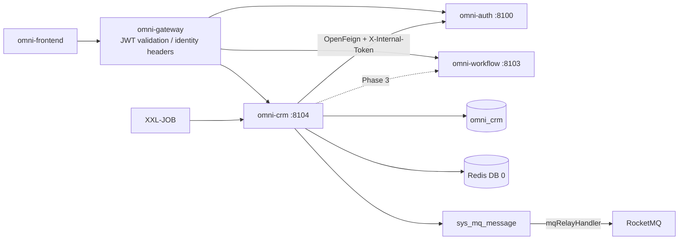
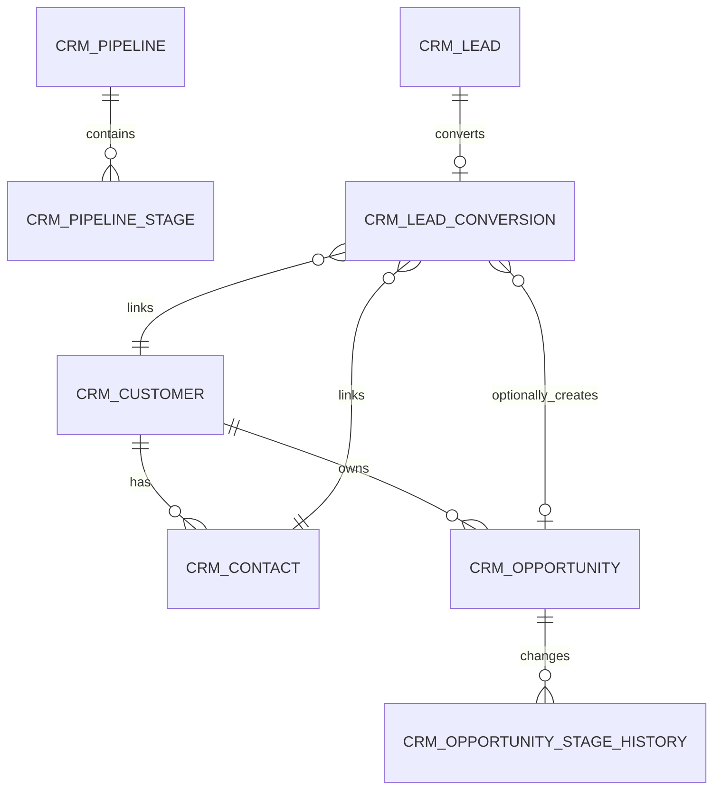
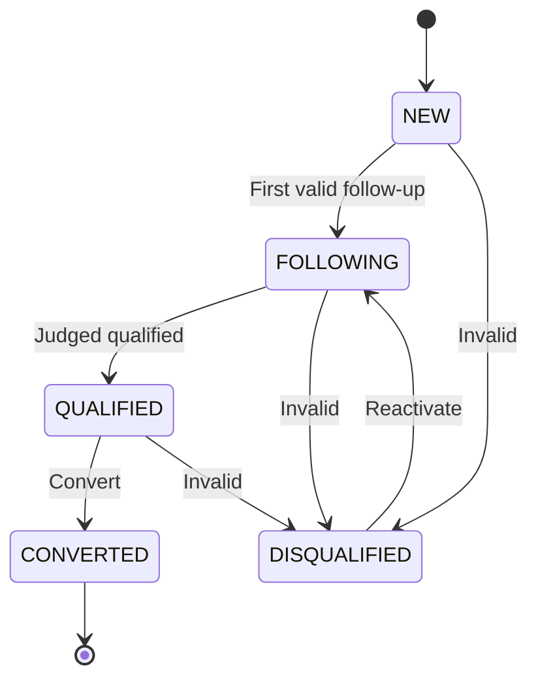
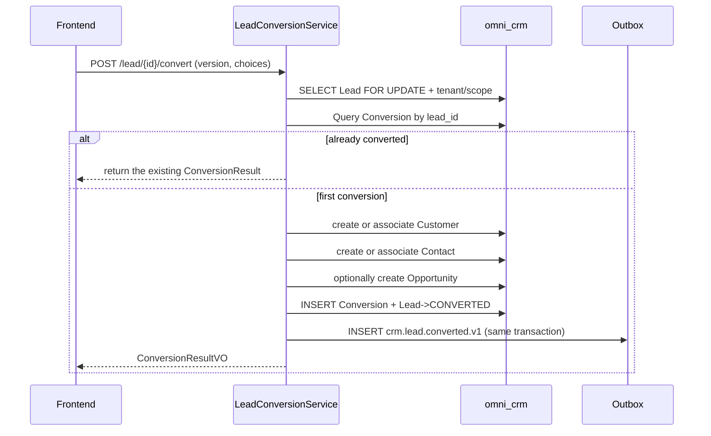

# CRM モジュール アーキテクチャと実装ベースライン

> 状態：MVP 実装済み、後続イテレーションのベースライン  
> プロジェクト：Omni-Stack  
> 日付：2026-07-12  
> 目標：既に DB へ反映済みの CRM MVP のアーキテクチャ、サービス横断契約、後続イテレーションの境界を説明する。実装入口は `omni-backend/omni-crm` と `omni-frontend/src/views/crm`。

設計根拠：`README.md`、および `docs/` 内の architecture、api-contract、backend-patterns、frontend-patterns、core-flows、scheduling、workflow、mq-reliability、docker-deployment の全トピックドキュメント。同時に現在の POM、Gateway、SQL、Docker Compose、フロントエンド動的ルーティング実装でドキュメント例を照合する。

## 1. 設計結論

CRM は `omni-base` に入れ続けるのではなく、独立した Servlet マイクロサービスとして構築すべきである。

| 項目 | 決定 |
|---|---|
| Maven モジュール / サービス名 | `omni-crm` |
| ローカルポート / 管理ポート | `8104` / `19904` |
| XXL-JOB 実行体 | `omni-crm` / `9904`（Outbox/タスク有効時） |
| データベース | `omni_crm` |
| Gateway | `/api/crm/**` → `lb://omni-crm`、`StripPrefix` は使用しない |
| Redis | DB 0、Auth が書き込む XSS 設定を共有；CRM キーは `crm:` プレフィックスを使用 |
| フロントエンド | 引き続き `omni-frontend` を使用し、`views/crm/**` を新設 |

CRM の初版はプリセールスの閉ループのみを完成する：

> リード → フォローアップ → 顧客/連絡先 → 商談 → 受注または失注。

製品、見積、契約、注文、請求書発行、回収、マーケティングオートメーション、サポートチケットは MVP に含めない。契約/注文段階に入った後は `omni-sales` の分離を評価すべきで、CRM を ERP に進化させない。

実施前に必ず 4 つの P0 前提項目を完成しなければならない：

1. Auth が permission-aware のデータ範囲内部 API を提供する；CRM は `omni_auth` をクロス DB で読まない。
2. `@OperLog` に電話番号、メール、住所、備考などの PII マスキング/無視能力を追加する。
3. CRM のテナントとデータ権限はフェイルクローズド；コンテキスト欠落時にテナント 1 をデフォルトにせず、無条件に通さない。
4. CRM の `ALL` は「現テナントの全データ」と明確に定義；テナント横断クエリは別のプラットフォーム権限と専用インターフェースを設ける。

## 2. 製品範囲

### 2.1 ユーザーと目標

| ユーザー | コアニーズ |
|---|---|
| 営業担当 | 自分のリード、顧客、連絡先、商談、フォロー待ち事項を管理 |
| 営業マネージャー | 自部門および下位を確認、担当者を割当、ファネルと期限超過事項を検査 |
| CRM 管理者 | テナント内の全 CRM データとビジネス設定を管理 |
| 読み取り専用オブザーバー | 認可範囲内の統計と記録を閲覧、変更せず、完全な PII をデフォルトで閲覧しない |

MVP は次に答えられるべきである：現在 新規/合格/転換済みリードがどれだけあるか；どの事項が本日または期限超過か；ある顧客にどんな連絡先・フォロー・商談があるか；商談がどのステージか；ファネル金額・転換率・受注率はどうなっているか；誰が主要ビジネス記録を変更したか。

### 2.2 フェーズ分け

| フェーズ | 能力 |
|---|---|
| MVP | リード、割当、フォローアップ活動、顧客、連絡先、顧客 360、商談、ステージ、受注/失注、基本ボード、重複候補ヒント |
| Phase 2 | パブリックプール、タグ、インポート・エクスポート、マージ、自動リマインド、共有、設定可能ステージ、カスタムフィールド、フィールドレベル暗号化 |
| Phase 3 | 製品、価格表、見積、契約、割引/契約承認、回収計画、販売予測 |
| 独立ドメイン | マーケティング活動と育成、サポートチケット/SLA、請求書と財務消込 |

## 3. システム境界

| コンポーネント | 権威的責務 | CRM の利用方式 |
|---|---|---|
| `omni-auth` | テナント、ユーザー、組織、ロール、権限、データ範囲、XSS 設定 | 内部 OpenFeign；CRM はユーザー/組織 ID のみ保存 |
| `omni-crm` | リード、顧客、連絡先、商談、フォローと CRM 状態 | 唯一のビジネス書き込み側 |
| `omni-base` | 辞書、操作ログ、タスク/MQ 運用 | 操作ログ集約；MVP は辞書のオンラインに強依存しない |
| `omni-workflow` | BPMN、プロセスインスタンス、未処理タスク、承認履歴 | Phase 3 で冪等統合、Flowable を埋め込まない |
| XXL-JOB | バッチスキャンのトリガー | リマインドや CRM 状態の権威ストレージとしない |
| RocketMQ | 非同期輸送 | 少なくとも一度；コンシューマーは冪等でなければならない |
| Redis | XSS 共有設定、短期キャッシュ | CRM の権威ビジネスデータを保存しない |



推奨依存：`omni-common-core`、`omni-common`、`omni-common-mybatis`、`omni-common-redis`、`omni-common-operlog`、`omni-common-job`、`omni-common-mqlog`、および Web、Validation、Security、AspectJ、OpenFeign、LoadBalancer、Nacos、RocketMQ Stream、Actuator、Lombok。

`omni-common-workflow` に依存しないこと。さもないと Flowable エンジンを CRM に埋め込んでしまう。

## 4. ドメインとデータ設計

### 4.1 アグリゲート

| アグリゲート | テーブル | 責務 |
|---|---|---|
| Lead | `crm_lead`、`crm_lead_conversion` | リードのライフサイクル、担当者、転換冪等 |
| Customer | `crm_customer`、`crm_contact` | 顧客プロファイル、連絡先、顧客 360 |
| Opportunity | `crm_opportunity`、`crm_opportunity_stage_history` | ステージ、金額、確度、受注/失注履歴 |
| Activity | `crm_activity` | フォローの計画、完了、キャンセル |
| Pipeline | `crm_pipeline`、`crm_pipeline_stage` | 商談パイプラインとステージ定義 |
| Ownership Audit | `crm_owner_change_log` | 担当者/組織変更の不変履歴 |



`crm_activity` は `root_type + root_id` で Lead、Customer、Opportunity に関連付ける。多態関係は通常の外部キーを使えないため、Service は対象が存在し、同一テナントで、現在ユーザーがアクセス可能であることを検証しなければならない。

### 4.2 共通フィールドとルール

すべての `crm_*` テーブルは `tenant_id` を含まなければならない（tenant config、pipeline stage、conversion、stage history、owner history、approval request、inbox を含む）。これにより TenantLine が存在しない列に書き換えない。認可可能なビジネステーブルはさらに次を含める必要がある：

- `tenant_id`：テナント分離。
- `owner_user_id`：SELF 範囲とビジネス担当者。
- `owner_unit_id`：DEPT/DEPT_AND_BELOW/CUSTOM 範囲。
- `version`：楽観ロック。
- `deleted`：論理削除。
- `id/create_time/update_time/create_by/update_by`：プロジェクト監査フィールド。

制約：

- ユーザー/組織 ID は Auth が管理し、クロス DB 外部キーを作らず、フロントエンド提出のユーザー名や ownerUnitId を信頼しない。
- インデックスは `tenant_id` で始まり、次に owner、状態、フォロー時間を組み合わせる。
- `create_by` はユーザー名の監査フィールドで、SELF データ権限に使えない。
- 金額は `DECIMAL(18,2)` / `BigDecimal`、通貨は ISO 4217 三桁コードを使用。MVP の全商談はテナント設定の単一デフォルト通貨を強制使用し、統計で通貨横断の直接合計を禁止；多通貨と為替換算は後続バージョンに残す。
- 時刻は `yyyy-MM-dd HH:mm:ss` に統一；予定成約日は `LocalDate` を使える。
- `lead_no/customer_no/opportunity_no` は生成済みデータベース ID または専用シーケンステーブルで生成しテナント内ユニークにする。`SELECT MAX(...) + 1` は禁止。
- 通常の PUT では owner、ライフサイクル status、opportunity stage を直接変更できない。
- 外部リクエストは素の `selectById/updateById/deleteById` を使用してはならない。
- 論理削除されるビジネスエンティティに粗暴なユニークキーを作らない；安定した設定 code、Lead Conversion はユニーク制約を作れる。

現在の `BaseEntity` の注釈は自動監査充填が存在すると主張するが、リポジトリに検証可能な `MetaObjectHandler` はない。CRM 開発前に共通の監査充填を補完しテストすべき；さもなくば Service が監査フィールドを明示的に書き込む。

### 4.3 主要テーブル

`crm_tenant_config`

- `tenant_id` ユニーク、`default_pipeline_id`、`currency_code=CNY`、`lead_duplicate_policy=WARN`、`initialized_time`。
- テナントが初めて CRM に入る時、`CrmTenantInitializer` が冪等にデフォルト設定を作成し、Auth がクロスサービストランザクションで CRM DB に書き込むことを避ける。

`crm_pipeline` / `crm_pipeline_stage`

- Pipeline：`tenant_id/code/name/status/default_flag/sort/version/deleted`。
- Stage：`pipeline_id/stage_code/stage_name/stage_type/probability/sort/status/deleted`。
- `stage_type` は `OPEN/WON/LOST` に固定。
- MVP は `DISCOVERY → QUALIFICATION → PROPOSAL → NEGOTIATION → WON/LOST` をプリセットし、当面管理 UI を開放しない。

`crm_lead`

- `lead_no/full_name/company_name/job_title/mobile/phone/email/region/address`。
- `source_code/industry_code/rating/status/disqualify_reason`。
- owner、assigned、lastActivity、nextFollowup、converted、version と監査フィールド。
- コアインデックス：tenant + owner/status、tenant + unit/status、tenant + nextFollowup/status、tenant + company/mobile/email。

`crm_lead_conversion`

- `tenant_id/lead_id/customer_id/contact_id/opportunity_id/converted_by_user_id/converted_time`。
- `lead_id` はユニーク、記録は削除不可、Lead 転換の冪等根拠である。

電話番号、メール、会社名は重複候補にのみ使い、ビジネス上のハードユニークにしない。同一会社に複数の連絡先があり得るし、同一電話は会社の代表電話かもしれない。デフォルトでは候補を返し警告し、ユーザーが既存記録への関連付けか新規作成かを選択する。

`crm_customer`

- `customer_no/name/normalized_name/customer_type/industry_code/level_code/source_code`。
- `credit_code/website/phone/email/region/address/status`。
- owner、lastActivity、nextFollowup、version、deleted と監査フィールド。

`crm_contact`

- `customer_id/name/department/job_title/mobile/phone/email/decision_role/primary_flag/status`。
- owner は Customer owner の権限スナップショット；顧客移管時に同一トランザクションで同期。
- 各顧客は有効な主要連絡先を最大 1 つ持つ；Service は顧客行ロック下で切替え、生成列ユニークインデックスでさらにフォールバックできる。

`crm_opportunity`

- `opportunity_no/name/customer_id/primary_contact_id/source_lead_id`。
- `pipeline_id/stage_id/status/amount/currency_code/probability`。
- `expected_close_date/actual_close_time/loss_reason`、owner、stageChange、nextFollowup、version。

`crm_opportunity_stage_history`

- `opportunity_id/from_stage_id/to_stage_id/from_status/to_status/change_reason/changed_by_user_id/changed_time`。
- 追記のみで、更新・削除しない。

Opportunity の `status` は対象 Stage の `stage_type` と一致しなければならず、Stage コマンド Service だけが同時に更新できる；`probability` は移行時のステージ確度スナップショットを保存する。

`crm_activity`

- `root_type/root_id`（LEAD/CUSTOMER/OPPORTUNITY）、任意で `contact_id`。
- `activity_type/subject/content/status`。
- `planned_start_time/planned_end_time/completed_time/next_action_time`。
- `performed_by_user_id` は実際の執行者を記録；owner はアクセスルートの現在権限スナップショット、他に version、deleted と監査フィールド。
- MVP の content はプレーンテキストのみ許可し、フロントエンドは `v-html` を禁止。

`crm_owner_change_log`

- entity、旧/新 owner user/unit、operationType、reason、operator と time。
- 追記のみで、通常の削除インターフェースを提供しない。

連絡先と Customer をアクセスルートとする Activity は顧客 owner に追従して同期；執行履歴は `performed_by_user_id/create_by` が保持する。オープン Opportunity を Customer とともに移管するかはコマンドパラメータで明示的に決め、デフォルトはカスケードしない；Opportunity をカスケードする場合、その Activity も併せて同期する。Lead 転換時に元の Lead Activity のアクセスルートを新しい Customer へ移行し、Conversion 記録はソース関係を保持する。

## 5. 状態マシンとコアフロー

### 5.1 Lead



- `QUALIFIED` のみ転換可能；`DISQUALIFIED` は理由が必須；`CONVERTED` は終端状態。
- owner/public-pool は帰属次元で、ライフサイクル状態に混ぜない。

### 5.2 Customer

```text
POTENTIAL → ACTIVE → DORMANT
               ├──→ LOST
               └──→ BLACKLISTED
DORMANT / LOST → ACTIVE
BLACKLISTED → ACTIVE (dedicated permission)
```

商談の受注は POTENTIAL を自動的に ACTIVE へ変えられる。顧客にオープン商談がある時は直接削除できず、優先して DORMANT/LOST へ変える。

### 5.3 Opportunity

```text
DISCOVERY → QUALIFICATION → PROPOSAL → NEGOTIATION → WON / LOST
```

- オープンステージは前進または後退可能；後退は理由を書かなければならない。
- LOST は失注理由が必須；WON/LOST は終端状態。
- 再開には `crm:opportunity:reopen` が必要で、最後のオープンステージへ回復する。
- すべての移行は Stage History を追記し、通常の PUT は stage/status を受け付けない。

### 5.4 Activity

```text
PLANNED → COMPLETED
       └→ CANCELLED
CANCELLED → PLANNED (reschedule)
```

COMPLETED は終端状態；履歴として完了済み活動を直接作成することを許可するが、完了時刻を提供しなければならない。

### 5.5 Lead 転換



リクエストは顧客/連絡先が新規作成か関連付けか、および商談を作成するかを明示する。Feign、Workflow、実際の MQ 送信は CRM DB トランザクション内で発生させてはならない；必要なイベントはローカル Outbox にのみ書く。

## 6. テナント、RBAC とデータ権限

### 6.1 信頼チェーン

1. Gateway が RS256 JWT とブラックリストを検証し、`X-User-*`、`X-Tenant-Id`、`X-Gateway-Forwarded` を上書き注入する。
2. CRM の `GatewayPreAuthFilter` が `Authentication` を構築する。
3. Controller が `@PreAuthorize` で機能権限を検証する。
4. CRM テナントフィルターが tenant コンテキストを確立；`@CrmDataScope(permissionCode)` アスペクトが現在のエンドポイント権限で dataScope を解決する。
5. MyBatis-Plus が tenant とその permission に対応する owner 条件を追加する。

`X-Gateway-Forwarded:true` は暗号学的証明ではない。本番では CRM ビジネスポートを公開してはならない；プライベートネットワーク/セキュリティグループを使用し、後で署名付き内部ヘッダーや下流 JWT 検証を追加できる。

### 6.2 権限ツリーとロール

ボードメニューは `crm:overview` を使い、`crm:dashboard` は使わない。静的な `/admin/dashboard` との衝突を避けるためである。

メニュー：`crm`（DIRECTORY）および `crm:overview`、`crm:lead`、`crm:customer`、`crm:contact`、`crm:opportunity`、`crm:activity`（MENU）。

API 権限：

- `crm:overview:list`
- `crm:lead:list/create/update/delete/assign/convert/disqualify`
- `crm:customer:list/create/update/delete/transfer/status/blacklist`
- `crm:contact:list/create/update/delete`
- `crm:opportunity:list/create/update/delete/assign/stage/reopen`
- `crm:activity:list/create/update/delete/complete/cancel`
- `crm:owner:list`（担当者候補クエリ）
- `crm:pii:view`

上記の `/` は同一リソース配下の複数の完全な権限コードの簡記である。例えば `crm:lead:list/create` は `crm:lead:list` と `crm:lead:create` を表し、DB 反映時は完全な code を 1 件ずつ保存しなければならない。実際の `sys_permission.type` は `DIRECTORY/MENU/API` を使い、旧例の BUTTON は使わない。

| ロール | dataScope | 能力 |
|---|---|---|
| `CRM_ADMIN` | TENANT | 現テナントの全 CRM 機能/データ |
| `SALES_MANAGER` | DEPT_AND_BELOW | 部門および下位、割当/移管、統計 |
| `SALES_REP` | SELF | 自分が担当するデータと通常の営業操作 |
| `CRM_VIEWER` | TENANT | テナントレベル読み取り専用、PII はデフォルト付与しない |
| `SUPER_ADMIN` | ALL | 全機能、CRM データは引き続き現テナントに限定 |

デフォルトの USER には CRM 権限を付与しない。フロントエンド `v-permission` とバックエンド `@PreAuthorize` は同一コード；メニュー非表示はセキュリティ境界ではない。

Phase 2 のパブリックプールは独立したメニュー/権限と明示的な `owner_user_id IS NULL` クエリを使う。通常リストの DataPermission はパブリックプール機能のために緩和せず、リクエストパラメータで owner 条件をバイパスするのも許可しない。

### 6.3 Auth 内部データ範囲契約

既存の DataScope コードは Auth にあり Auth Mapper に依存する。CRM は Mapper を複製せず、Workflow の歴史的実装のように `omni_auth.*` をクロス DB で読まない。

Auth は統一された `DataScopeService` を抽出し、元の Auth Filter と内部インターフェースで再利用すべきである：

```text
GET /internal/data-scopes/{userId}?tenantId={tenantId}&permissionCode=crm:lead:update

InternalDataScopeDTO:
  userId, tenantId, permissionCode, primaryUnitId,
  effectiveScope, accessibleUnitIds, securityVersion
```

ルール：

- ユーザーが有効で tenant に属することを検証する。
- その `permissionCode` を実際に付与されたロールのみをマージ；ユーザー自身がその権限を持たない場合は解決を拒否。
- 同一 permission に複数のロールがある場合のみ、プロジェクトルールに従って最も広い範囲を取る。
- `resource=crm` だけでマージしてはならない。さもないと TENANT 読み取り専用ロールと SELF 書き込みロールの組み合わせが「テナントレベル範囲 + 書き込み権限」の権限スパイシング脆弱性を生む。
- `X-Internal-Token` 認証で、Gateway 経由で公開しない。
- Auth はキャッシュでき、ロール権限、dataScope、ユーザー組織、カスタム部門の変化時に能動的に無効化する。
- CRM 呼び出しの失敗/タイムアウト/tenant 不一致時は 503/403 を返し、フィルタなしに縮退しない。

既存の Auth user/org 内部インターフェースは ID クエリ時に tenant を強制していない。CRM 接続前に tenant パラメータと SQL 制約を追加するか、少なくとも tenantId が不一致の DTO を拒否すべきである。

### 6.4 CRM コンテキストと SQL インターセプト

`CrmTenantContext`、`CrmTenantContextFilter`、`CrmDataScopeContext`、`CrmDataScope` アノテーション/アスペクト、`CrmDataPermissionHandler`、`CrmRecordAccessGuard` を新設する。

```text
Read Gateway headers
→ Filter validates userId/tenantId, writes tenant ThreadLocal
→ @PreAuthorize validates endpoint functional permission
→ @CrmDataScope(permissionCode) calls Auth to resolve the dataScope of the same permission
→ write scope ThreadLocal
→ OperLog/Controller/Service/Mapper
→ Aspect finally clears scope, Filter finally clears tenant
```

Advisor の順序は「メソッド権限 → DataScope → OperLog → ビジネスメソッド」に固定しなければならず、OperLog がスナップショットを事前読み取りする時点で正しい permission scope を既に持つことを保証する。リスト、詳細、統計と各書き込みコマンドは自身の完全な permissionCode を宣言し、粗粒度の `resource=crm` コンテキストを共有しない。

CRM は同名の `mybatisPlusInterceptor` をカスタマイズし、順序は固定：

```text
TenantLineInnerInterceptor
→ DataPermissionInterceptor
→ PaginationInnerInterceptor
```

- TenantLine は `crm_*` テーブルのみ処理し、常に現在の tenant を追加する。
- `sys_mq_message` は 2 つの権限インターセプターから除外する。Relay が設計上全テナントをスキャンするため；ユーザークエリは引き続き明示的に tenant フィルタする。
- DataPermission は Lead、Customer、Contact、Opportunity、Activity の owner 列をマップする。
- DataPermission は Pagination の前に置き、COUNT と records が同一範囲であることを保証する。
- Pipeline/Stage は tenant + 機能権限のみで制御；Conversion、Stage History、Owner History はアグリゲートルートを離れた汎用クエリを提供せず、必ず先に同一 permission でルートオブジェクトに AccessGuard を実行し、その後 tenant + rootId でクエリする。

| dataScope | 条件 |
|---|---|
| SELF | `owner_user_id = currentUserId` |
| DEPT | `owner_unit_id = primaryUnitId` |
| DEPT_AND_BELOW / CUSTOM | `owner_unit_id IN accessibleUnitIds` |
| TENANT / ALL | owner 条件を追加しない、ただし TenantLine は常に保持 |

これは明確なセキュリティ強化である：通常の CRM API は決してテナントを横断しない。プラットフォームのテナント横断能力は独立した `platform:crm:cross-tenant`、専用 Controller、明示的な tenant と追加監査を使用する。

### 6.5 書き込み操作の行レベル認可

DataPermissionInterceptor は書き込み認可を代替できない。各 update/delete/convert/transfer/stage コマンドは必ず：

1. `tenant_id + id + data scope` で可視レコードをクエリ；不可視は一律 404 で ID 列挙を防ぐ。
2. 状態マシンとビジネス不変条件を検証。
3. `tenant_id + id + version` 条件で更新。
4. 更新行数が 1 でない時は並行競合を返す。
5. 重要な変更は行ロックまたは楽観ロックを使い、ドメイン履歴を同期して書く。

`CrmRecordAccessGuard` が詳細、コマンド、サブリソースのアクセスチェックを統一実装する。

## 7. API 設計

### 7.1 共通契約

- すべてのレスポンスは `R<T>`；ページングは `R<PageResult<T>>`。
- `page=1`、`size=10`、CRM は `size <= 100` に制限。
- Entity を直接 Request/Response にしない；状態コマンドは独立 DTO を使う。
- 日付パラメータは `@DateTimeFormat(pattern = "yyyy-MM-dd HH:mm:ss")` を宣言；フロントエンドは `value-format="YYYY-MM-DD HH:mm:ss"` を使う。
- 状態、転換、移管のリクエストは `version` を携行。
- PII 重複検出は POST body を使い、URL やアクセスログに置かない。
- 書き込みインターフェースは `@PreAuthorize` と `@OperLog` を同時に宣言；主要コマンドは別途ドメイン履歴を書く。

### 7.2 エンドポイント

| ドメイン | エンドポイント |
|---|---|
| Overview | `GET /api/crm/overview/summary`、`/funnel`、`/follow-ups` |
| Pipeline | `GET /api/crm/pipeline/list`、`/{id}/stages` |
| Lead | `GET /lead/list`、`GET /lead/{id}`、`POST /lead`、`PUT/DELETE /lead/{id}` |
| Lead コマンド | `POST /lead/duplicate-check`、`/{id}/assign`、`/batch-assign`、`/{id}/qualify`、`/disqualify`、`/reopen`、`/convert` |
| Customer | `GET /customer/list`、`/{id}`、`/{id}/overview`、`POST /customer`、`PUT/DELETE /customer/{id}` |
| Customer コマンド | `POST /customer/duplicate-check`、`/{id}/status`、`/{id}/transfer` |
| Contact | `GET /contact/list`、`GET /customer/{id}/contact/list`、`POST /customer/{id}/contact`、`PUT/DELETE /contact/{id}`、`POST /contact/{id}/primary` |
| Opportunity | `GET /opportunity/list`、`/board`、`/{id}`、`/{id}/stage-history`、`POST /opportunity`、`PUT/DELETE /opportunity/{id}` |
| Opportunity コマンド | `POST /opportunity/{id}/assign`、`/stage`、`/reopen` |
| Activity | `GET /activity/list`、`/timeline`、`/{id}`、`POST /activity`、`PUT/DELETE /activity/{id}` |
| Activity コマンド | `POST /activity/{id}/complete`、`/cancel`、`/reschedule` |
| Owner 選択肢 | `GET /api/crm/options/owners`、権限 `crm:owner:list` |

表中で `/api/crm` を省略したエンドポイントはいずれもそのプレフィックスで始まる。すべてのリスト/詳細と集約統計は同一の TenantLine/DataPermission を適用する。Owner、unit のクエリパラメータは現在の範囲を狭めるだけで、拡大できない。

Customer 360 は顧客、連絡先、オープン商談、最近の活動、転換リードの要約を返す。`crm:pii:view` がない場合、バックエンド VO は直接マスク値を返し、フロントエンドの遮蔽に依存しない。

Customer 360 は「顧客が見えるなら全サブデータが見える」ではない。顧客、連絡先、商談、活動のブロックは各自の完全な list permission でデータ範囲を解決；あるブロックの権限が欠ける時はそのブロックをクエリせず、あるサブレコードがその独立 scope 内にない時は顧客詳細を介してバイパスしてはならない。実装は `CrmPermissionScopeExecutor` で同一 Facade 内にブロックごとに scope を確立しクリアできる。

顧客の `BLACKLISTED` への進入または復元は独立した `/customer/{id}/blacklist`、`/restore-from-blacklist` コマンドと `crm:customer:blacklist` 権限を使い、通常の status/update 権限を再利用しない。

### 7.3 エンドポイントと DataScope permission のマッピング

`@PreAuthorize` と `@CrmDataScope` は同一の完全なビジネス権限コードを使い、実装者が一時的に選択してはならない：

| 操作 | permissionCode |
|---|---|
| Overview 全統計 | `crm:overview:list` |
| Pipeline/Stage クエリ、Opportunity board/history | `crm:opportunity:list` |
| 各リソース list/detail/overview/timeline/duplicate-check | 対応する `crm:<resource>:list` |
| 各リソース create/update/delete | 対応する `crm:<resource>:create/update/delete` |
| Lead qualify/reopen | `crm:lead:update` |
| Lead disqualify/assign/batch-assign/convert | `crm:lead:disqualify/assign/assign/convert` |
| Customer status/transfer/blacklist/restore | `crm:customer:status/transfer/blacklist/blacklist` |
| Contact primary | `crm:contact:update` |
| Opportunity assign/stage/reopen | `crm:opportunity:assign/stage/reopen` |
| Activity complete/cancel/reschedule | `crm:activity:complete/cancel/update` |
| Owner options | `crm:owner:list` |

表内の `/` は複数のエンドポイントがそれぞれ対応する完全な権限コードを表す。Create はデフォルトで owner を現在ユーザーにする；作成時に他の owner を指定する場合はそのリソースの assign/transfer 権限も必要で、かつ対象ユーザーがそのコマンド permission のアクセス可能組織範囲内になければならない。

## 8. サービス横断の一貫性

### 8.1 ユーザーと組織

- CRM は userId/unitId のみ保存；割当前に tenant 限定の Auth Feign でユーザーが存在し、有効で、同一テナントであることを検証。
- ownerUnitId は Auth の権威的な主組織を取り、フロントエンドを信頼できない。
- リスト表示はまず ID を収集し、次に batch API を一度呼び出す。行ごとの Feign は禁止。
- 名称/アバターは短期キャッシュ可；データ範囲と関係 ID は長期キャッシュに依存しない。
- ユーザーの組織異動は履歴の顧客帰属をサイレントに一括書き換えない；ownerUnitId は前回の明示割当時のビジネス帰属を保持し、後で監査可能な一括移管で修正する。
- Compose で Auth と呼び出し側は同一の必須 `OMNI_INTERNAL_API_TOKEN` を使用；リポジトリ内にデフォルト秘密鍵は提供せず、欠落時は Compose が直接起動を拒否し、各サービスの内部インターフェースもフェイルクローズドする。

### 8.2 辞書

ライフサイクル、stageType、権限セマンティクスは固定列挙で、辞書は状態マシンを変えられない。MVP のソース、業界、顧客レベル、活動タイプは安定した code と組み込みデフォルト選択肢を使い、新テナントが Base 辞書を欠いて CRM が使えなくなることを避ける。Phase 2 でクロスサービスのテナント初期化を整備した後、純粋に表示用の選択肢を `omni-base` へ移せる；CRM は常に code のみ保存する。

### 8.3 Workflow

MVP は承認を接続しない。Phase 3 で高額割引、契約、顧客マージ、大口顧客移管に使えるが、Workflow が先に補完する：

1. `(tenant_id, business_key)` ユニーク制約または冪等起動。
2. 信頼できる `workflow.process.started/completed/terminated.v1` イベント。
3. 標準結果 `APPROVED/REJECTED/CANCELLED`。
4. テナント安全な内部オーケストレーション API。

CRM は `crm_approval_request` を新設し、状態は `PENDING_START/RUNNING/APPROVED/REJECTED/CANCELLED/START_FAILED`、businessKey：

```text
crm:{aggregateType}:{tenantId}:{aggregateId}:{approvalRequestId}
```

CRM はまず承認申請をローカルでコミットし、次にトランザクション外で冪等に Workflow を起動；完了イベントは Inbox の重複排除後に CRM ローカル状態を駆動する。Flowable は CRM DB を直接変更せず、CRM DB トランザクション内で Feign 呼び出しを保持しない。

### 8.4 XXL-JOB

Phase 2 はシステムタスク軌道を使い、各 Handler は `@XxlJob` と `@SystemJobMeta` を同時に宣言する：

| Handler | デフォルト頻度 | 責務 |
|---|---:|---|
| `crmFollowupReminderHandler` | 毎分 | 期限到達のフォローをスキャンし、リマインドイベントを生成 |
| `crmLeadSlaHandler` | 5 分ごと | 時間内に未接触のリードを識別/回収 |
| `crmOpportunityStaleHandler` | 毎時または毎日 | 長期間フォローのない商談を識別 |
| `crmApprovalReconcileHandler` | 10 分ごと | Phase 3 で Workflow 射影を照合 |

フォローごとに XXL-JOB を作らない。時刻は CRM テーブルに保存し、1 つのタスクが一括スキャン・原子的クレーム・Outbox 書き込みを行う。バックグラウンドタスクはまず tenantId のみを返す専用 Mapper で初期化済みテナント一覧を取得し、次にテナントごとにシステム TenantContext を設定し、明示的な tenant 条件のバッチを実行し、`finally` でクリアする。そのテナント列挙 Mapper だけが `@InterceptorIgnore(tenantLine = "true")` を使える；通常のビジネス Mapper はバイパスを禁止。タスクはユーザー DataScope を使わず、状態クレーム、楽観ロック、または `FOR UPDATE SKIP LOCKED` で再入を防ぐ。

### 8.5 Outbox とイベント

統一イベントエンベロープ：

```json
{
  "eventId": "UUID",
  "eventType": "crm.lead.converted.v1",
  "occurredAt": "2026-07-12 10:30:00",
  "tenantId": 1,
  "producer": "omni-crm",
  "aggregateType": "LEAD",
  "aggregateId": 1001,
  "aggregateVersion": 4,
  "actorUserId": 12,
  "correlationId": "...",
  "causationId": "...",
  "payload": {}
}
```

`ReliableMessageRelay.send("crm-domain-out-0", envelope, tenantId, eventId)` を使用；tenantId は明示的でなければならない。第 4 引数は eventId を運用用の `msg_key` として保存し、Outbox 自身の `msg_id` は引き続き独立した UUID；したがって eventId は payload 内にも同時に存在しなければならず、コンシューマーは payload の eventId でのみビジネス冪等を行える。

推奨イベント：

- `crm.lead.created/assigned/converted.v1`
- `crm.customer.owner-changed.v1`
- `crm.opportunity.stage-changed/won/lost.v1`
- `crm.activity.completed.v1`

イベントは ID、状態、必要なスナップショットのみを渡し、完全な電話番号、メール、住所、備考を渡さない。CRM が Workflow などのイベントを消費する際、まずイベントの tenantId を検証し、次に今回の消費のためにシステム TenantContext を設定/クリア；同一トランザクションで `crm_inbox_event` とビジネス変更を書き、`(consumer_name,event_id)` ユニークキーで重複排除し、aggregateVersion で順序不同を防ぐ。

既存の Outbox は少なくとも一度で、Relay に claim/lease はない。クレーム機構の完成前、CRM はまず単一インスタンスでデプロイ；水平スケール前に `PROCESSING + lock_owner/lock_time` または `SKIP LOCKED` を追加する。

現在の「メッセージ記録」ページは主に `omni-base` のローカル Outbox をクエリし、CRM 追加後に自然には `omni_crm.sys_mq_message` を集約しない。本番前に各サービスの内部クエリ能力で Feign 集約を行うか、CRM 専用の運用入口を追加すべき；共通の `schema.sql` を CRM の DDL と可観測性の唯一の保証として扱ってはならない。

## 9. プライバシー、操作ログと XSS

### 9.1 OperLog の前提改修

現在の `OperLogAspect` は全パラメータとエンティティスナップショットをシリアライズし、直接使用すると PII が RocketMQ、Outbox、ホット/コールドログテーブルに入る。CRM Controller 開発前に common-operlog を拡張する：

- フィールドレベルの機微アノテーションまたは統一マスク処理で、password、token、secret、mobile、phone、email、address、idCard、content をカバー。
- requestParams、oldValue、newValue、errorMsg を同時に処理。
- `recordParams=false`、`recordSnapshot=false` またはフィールド除外をサポートし、インポート/エクスポート/大テキストインターフェースに供する。
- ログ消費の永続化失敗は必ずリトライし、例外を飲み込んでから ack してはならない。
- 消費にユニーク eventId を追加し、Outbox の重複配信に対抗。
- AOP が oldValue/newValue を読む時は必ず同一 tenant/dataScope を経由し、対象コマンドの認可失敗時は事前読み取りスナップショットをログに書いてはならない。

Owner Change と Stage History は同期的なドメイン事実で、非同期の汎用ログで代替できない。

### 9.2 PII

- 完全な電話番号、メール、住所は `crm:pii:view` にのみ返す。
- 他のユーザーにはバックエンド VO がマスクを返す、例 `138****1234`、`a***@example.com`。
- リストはデフォルトでマスク；詳細は権限で決める。
- 重複検出は最小の候補要約のみを返し、権限のない記録を漏らさない。
- エクスポートは Phase 2 に移し、独立した権限、データ範囲、監査を使う。
- バックアップ、デッドレター、Outbox/MQ 運用ページは PII を含むシステムとして管理。

明確なコンプライアンス要件が出た場合に、フィールドレベル暗号化と検索可能 HMAC を追加；MVP は少なくとも最小権限、バックエンドマスキング、監査、TLS を完成する。

### 9.3 XSS

CRM は必ず `XssConfigProvider` を実装し、Redis DB 0 の `xss:enabled:{tenantId}` と `xss:rules:{tenantId}` を読む。旧例の DB 4 を使ってはならず、さもないと Auth 設定を読めず XSS を無効化する方向に縮退する。

CRM は「cache miss → enabled=false」のフェイルオープン戦略を複製しない。miss 時は Auth 内部設定インターフェースを呼んでオリジンへフォールバックすることを推奨；Auth が利用不可の時は組み込みベースラインルールを使う。MVP の備考はプレーンテキストのみ許可し `v-html` を禁止；将来のリッチテキストは許可リストサニタイザーを使い、正規表現ブラックリストを拡張し続けない。

## 10. フロントエンド設計

```text
omni-frontend/src/
├── api/
│   ├── crm-overview.ts
│   ├── crm-lead.ts
│   ├── crm-customer.ts
│   ├── crm-contact.ts
│   ├── crm-opportunity.ts
│   └── crm-activity.ts
├── views/crm/
│   ├── overview/index.vue
│   ├── lead/index.vue
│   ├── customer/index.vue
│   ├── contact/index.vue
│   ├── opportunity/index.vue
│   └── activity/index.vue
└── components/crm/
    ├── OwnerSelector.vue
    ├── CustomerPicker.vue
    ├── ActivityTimeline.vue
    ├── OpportunityStageBoard.vue
    └── CustomerOverview.vue
```

- 共有 `ApiResponse/PageResult` は `src/types/api.ts` からのみインポート。
- CRM API は統一して 1 つの tenant ヘッダーヘルパーを再利用するか、`X-Tenant-Id` の注入を共有 Axios request interceptor に収束；各関数が各自に解析ロジックを複製することを禁止。
- 通常の CRUD 状態はページに残す；ページ横断の下書き/永続フィルタのみ Pinia を追加。
- 権限コードは約束どおり `views/crm/**/index.vue` にマップ；メニュー入口は必ず index.vue。
- 動的ルーティングは `/admin/{最後のセグメント}` にフラットにマウントし、最後のセグメントはグローバルにユニークでなければならない；overview は dashboard 衝突を回避。
- `router/index.ts` と `layout/index.vue` にそれぞれ iconMap があり、両方に CRM を補う。
- `constants/menu.ts`、`zh-CN.ts`、`en-US.ts` を同期。
- Customer 360 は Drawer/コンポーネントを使用；パラメータルータを使う場合は保護された静的ルートを明示的に登録。
- Opportunity ページはテーブル/Kanban を提供；ステージのドラッグは最終的に引き続き制御された stage API を呼ぶ。
- すべてのボタンは同一コードの `v-permission` を使うが、バックエンドが最終境界。

## 11. エンジニアリング着地点

### 11.1 新モジュール

```text
omni-backend/omni-crm/
├── pom.xml
└── src/main/
    ├── java/com/omni/crm/
    │   ├── CrmApplication.java
    │   ├── client/ config/ controller/ dto/ entity/
    │   ├── mapper/ security/ service/ service/impl/
    └── resources/
        ├── application.yml
        ├── application-dev.yml
        └── mapper/
```

`CrmApplication` は `@EnableDiscoveryClient`、`@EnableFeignClients(basePackages="com.omni.crm.client")`、`@MapperScan("com.omni.crm.mapper")` を使用。サービスは必ず自身の `SecurityConfig`、`GatewayPreAuthFilter`、`XssConfigProviderImpl` を持つ。common に現在下流の事前認証 Starter がないためである。

### 11.2 必ず変更するファイル

| ファイル | 変更 |
|---|---|
| `omni-backend/pom.xml` | `omni-crm` を追加 |
| Gateway `application.yml` | `/api/crm/**` ルートを明示；内部パス遮断に CRM を追加 |
| `docker/backend/Dockerfile` | POM キャッシュ層 `COPY omni-crm/pom.xml omni-crm/` |
| `docker-compose.yml` | CRM サービス、8104、DB/Redis/Nacos/MQ/XXL/internal token |
| `start.bat/start.sh` | build リストに CRM を追加；Windows ポート保護に 8104 を追加 |
| `database/changelog/crm/` | CRM 構造変更に forward-only の Liquibase changeSet を追加 |
| `scripts/sql/seed/crm.sql` | CRM デフォルト設定の正式冪等シード；更新後に seed manifest をリフレッシュ |
| `scripts/sql/seed/auth.sql` | CRM 権限とロールの正式冪等シード；更新後に seed manifest をリフレッシュ |
| CRM `TenantModuleProvisioner` | 新テナントの CRM 設定とステージの冪等初期化 |
| Frontend router/layout/menu/locales | アイコン、メニュー、i18n |

権威的な構造の事実源は `database/changelog/crm/`；正式シードは `scripts/sql/seed/crm.sql` と `scripts/sql/seed/auth.sql` が管理し、`database/seed/manifest.yaml` が検証する。Compose は fresh と upgrade で統一して `omni-db-migrator` を実行し、旧集約 SQL は起動に関与しない。

権限シードは固定 ID + `INSERT IGNORE` だけではだめ：`sys_permission` に `(tenant_id,permission_code)` ユニークキーがない。tenant + code の `NOT EXISTS` で冪等に挿入し、parent/path を正しく再構築すべき；同時に SUPER_ADMIN、CRM ロール、seed manifest アサーション、新テナント初期化を更新する。

Gateway に明示的なビジネスルートが既にある場合、本番では discovery locator を無効化することを推奨；一時的に保持するなら、`/internal/**`、`/api/internal/**`、`/omni-crm/internal/**` などのサービスディスカバリ直行パスを同時に遮断しなければならない。

設定要点：server 8104、management 19904、Redis DB 0、XXL appname `omni-crm`/port 9904。Docker 内部のアプリケーションポートは引き続き 8080 で、ホストマッピングは 8104。Workflow は CRM の起動依存としない。

現在の `docker compose config --services` は実際に 12 個のサービス（CRM を含み、Sentinel を含まない）。後で Sentinel を Compose に戻す場合、サービス総数は 13；README とデプロイドキュメントは実際の Compose の基準で維持する。

## 12. 非機能設計

### 性能

- すべてのリストはページング、最大 100；owner/status/followup は tenant プレフィックスの複合インデックスを使用。
- ユーザー/組織は一度に batch enrich、N+1 を禁止。
- Customer 360 はブロックごとにクエリし、最近の活動数を制限。
- ファネルはまずインデックス集約；データ閾値に達した後に日次サマリテーブルを作る。

### 並行と冪等

- Lead 転換：行ロック + conversion leadId ユニーク。
- Owner 移管/Stage：version 楽観ロック + 履歴テーブル。
- バッチコマンドは最大 100 件、API は逐件結果または全体トランザクションセマンティクスを明示。
- Outbox は少なくとも一度、Inbox は重複排除；定期スキャンは原子的クレームとユニークビジネスキーを使用。

### 縮退

- Auth dataScope 利用不可：503、フェイルクローズド。
- Auth 表示 enrich 利用不可：ID/不明ユーザーを返せる；割当と移管は継続できない。
- RocketMQ 利用不可：ビジネスと Outbox はコミットし、Relay が後補。
- Workflow 利用不可：MVP は影響なし；後続の承認は PENDING_START で停止し照合。
- Redis XSS miss：オリジン/ベースラインルールへフォールバック、防御を無効化しない。

### 可観測性

ログは tenantId、aggregateId、eventId、状態、所要時間を記録し、PII は記録しない。Auth scope の遅延/失敗率、CRM の 5xx/403/並行競合、Outbox の滞留と最古経過時間、タスク滞留、転換/移管/ステージ失敗率、スロー SQL とコネクションプールを監視する。

## 13. テストと検収

プロジェクトは CRM 導入前にテスト基盤を持たなかった；CRM は PII、マルチテナント、状態マシンに関わるため、継続的に維持する最小テストセットは必ず次を含む：

- 状態マシンの合法/不正遷移。
- Lead 転換の冪等と並行。
- Customer 移管のカスケード。
- PII マスクと OperLog マスキング。
- 6 種の dataScope のリスト、詳細、COUNT、集約。
- テナント横断の読み、変更、削除、移管、転換はすべて失敗。
- tenant/scope 欠落時にフェイルクローズド。
- tenant + id + version の並行更新。
- DataPermission が Pagination の前にあり、total と records が一致。
- ビジネスと Outbox が同一コミット/同一ロールバック；Inbox は重複メッセージを一度だけ処理。
- XSS の JSON、クエリパラメータ、プレーンテキスト備考。

エンドツーエンド検収：SALES_REP は自分のみ見える；SALES_MANAGER は自部門および下位が見える；CRM_ADMIN は現テナント内でのみ管理；PII 権限がなければマスクのみ取得；Lead の冪等転換；Customer 360 が完全；Stage History が完全；UI をバイパスして API を呼んでも 403；Token がなければ 401。

検証コマンド：

```powershell
$env:JAVA_HOME='C:\APP\JDK25\jdk-25.0.2'
$env:PATH="$env:JAVA_HOME\bin;$env:PATH"
cd omni-backend
.\mvnw.cmd clean install

cd ..\omni-frontend
npm run build
npm run lint

cd ..
docker compose config
docker compose build omni-crm omni-gateway omni-frontend
```

実際の MySQL インターセプター統合テストは、外部テスト DB がない場合デフォルトでスキップされる。CI またはローカルで一度限りの MySQL を起動した後、明示的に実行できる：

```powershell
$env:CRM_TEST_MYSQL_URL='jdbc:mysql://127.0.0.1:3306/crm_it?useUnicode=true&characterEncoding=utf8&serverTimezone=Asia/Shanghai&allowPublicKeyRetrieval=true&useSSL=false'
$env:CRM_TEST_MYSQL_USERNAME='root'
$env:CRM_TEST_MYSQL_PASSWORD='your-test-password'
cd omni-backend
.\mvnw.cmd -pl omni-crm -am '-Dtest=CrmMysqlInterceptorIntegrationTest' '-Dsurefire.failIfNoSpecifiedTests=false' test
```

このテストはテスト DB に `crm_lead` テーブルを作成して削除するため、専用の空テスト DB のみを使用でき、開発または本番データベースを指してはならない。

## 14. 実装順序

### Milestone 0：プラットフォーム強化

- Auth DataScopeService + permission-aware 内部インターフェース。
- user/org 内部 tenant 検証と共有 Token の修正。
- OperLog PII マスキング、スナップショットスイッチ、消費冪等。
- XSS miss のセキュリティ戦略。
- 検証可能な監査フィールド充填と CRM テスト骨格。

完了条件：誤った/欠落した身分コンテキストが CRM データを返さず、操作ログに完全な PII が現れない。

### Milestone 1：サービスとセキュリティ基盤

- モジュール、設定、Gateway、Docker、DB、デフォルト Pipeline を作成。
- TenantLine + DataPermission + Pagination。
- 権限ツリー、CRM ロール、既存テナント移行、フロントエンド root メニュー。

完了条件：登録、ルーティング、401/403、テナント分離、XSS、ヘルスチェックが通過。

### Milestone 2：Lead + Activity

- Lead CRUD、割当、合格/無効/再開。
- Activity の計画、完了、キャンセル、次回アクション。
- 重複候補、リスト、クイックフォロー、タイムライン。

完了条件：入力 → 割当 → 複数回フォロー → 合格判定の閉ループ。

### Milestone 3：Customer + Contact + Conversion

- Customer/Contact、主要連絡先、Lead 冪等転換、Customer 360、Owner Transfer。

完了条件：並行転換が重複せず、顧客帰属とサブレコード権限が一致。

### Milestone 4：Opportunity + Pipeline

- Opportunity、ステージコマンド、受注/失注/再開、History、Kanban。

完了条件：営業プロセスが監査可能な WON/LOST まで進行。

### Milestone 5：Overview + 本番強化

- Summary/Funnel/Follow-ups、PII、監査、インデックス、セキュリティ/トランザクション/E2E テスト。
- README、architecture、api-contract、core-flows、docker-deployment、AGENTS を更新。

完了条件：MVP、バックエンドビルド、フロントエンド Build/Lint、Docker とセキュリティ検収がすべて通過。

Phase 2 でパブリックプール、リマインド、インポート・エクスポート、タグ、マージを行う；Phase 3 は Workflow の冪等/イベント能力が整った後にのみ承認と契約を追加する。

## 15. ADR 要約

| 決定 | 選択 | 理由 |
|---|---|---|
| サービス | 独立 `omni-crm` | ビジネス、データ、デプロイの境界が明確 |
| ルーティング | `/api/crm/**`、StripPrefix なし | リポジトリの実際の Base/Workflow 方式に合致 |
| tenant | 通常 API は決してテナント横断しない | CRM は大量の PII を含む |
| ALL | 現テナントの全データ | ロール誤設定によるテナント横断漏洩を防ぐ |
| scope | Auth permission-aware + CRM アノテーション式ローカルインターセプト | ロール横断の権限スパイシングを防ぎ、クロス DB せず Auth Mapper を複製しない |
| サブテーブル権限 | owner スナップショット + トランザクション維持 | ページングと SQL インターセプトを統一 |
| 書き込み認可 | AccessGuard + tenant/id/version | SELECT インターセプトは書き込みを保護できない |
| Conversion | CRM 単一 DB トランザクション + Outbox | コアオブジェクトの強一貫性 |
| Workflow | MVP は延期 | 現在 冪等起動と信頼できる完了イベントを欠く |
| スケジューリング | 1 種の記録に 1 つのスキャンタスク | XXL-JOB タスク爆発を避ける |
| MQ | Outbox は少なくとも一度 + Inbox | ちょうど一度を仮定しない |
| Redis | DB 0 + key namespace | XSS 設定を必ず共有 |
| PII | バックエンドが権限でマスク、ログ/イベントを最小化 | フロントエンド遮蔽はセキュリティ対策ではない |
| デフォルトロール | USER に CRM 権限なし | 明示的な認可があって初めて CRM を使える |

## 16. 主要リスク

| 優先度 | リスク | 対処 |
|---|---|---|
| P0 | DataScope が Auth のみ、空コンテキストでフィルタを追加しない | 内部契約 + CRM フェイルクローズド |
| P0 | OperLog が完全な PII をシリアライズ | まず common のマスキングを改修 |
| P0 | サービス直結で信頼ヘッダーを偽造可能 | 本番ポート分離、後で署名/JWT |
| P0 | 書き込み操作がクエリデータ権限をバイパス | AccessGuard + 条件付き更新 |
| P1 | XSS miss がフェイルオープン | Auth オリジンフォールバックまたは組み込みベースライン |
| P1 | Outbox のマルチインスタンス競合/重複 | 単一インスタンスで開始、claim + Inbox |
| P1 | Workflow が非冪等、信頼できる完了イベントなし | 延期してまず契約を補完 |
| P1 | コンテナ数/Sentinel ドキュメントが Compose と不一致 | Compose を基準に統一 |
| P1 | 統一 DB Migration なし | まず existing migration を提供し、その後ツールを導入 |
| P1 | テスト基盤なし | CRM の第一弾で状態マシン/セキュリティテストを構築 |

今回の実装はまず Milestone 0 を完成し、その後 `crm_lead` などのビジネステーブルを導入した。後続イテレーションでもデータ範囲のフェイルクローズド、操作ログのマスキング、テナント境界の検証可能性を維持しなければ、CRM は実際の顧客情報を担うのに適さない。
