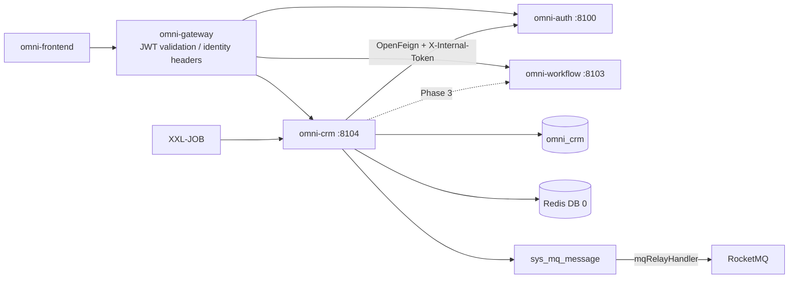
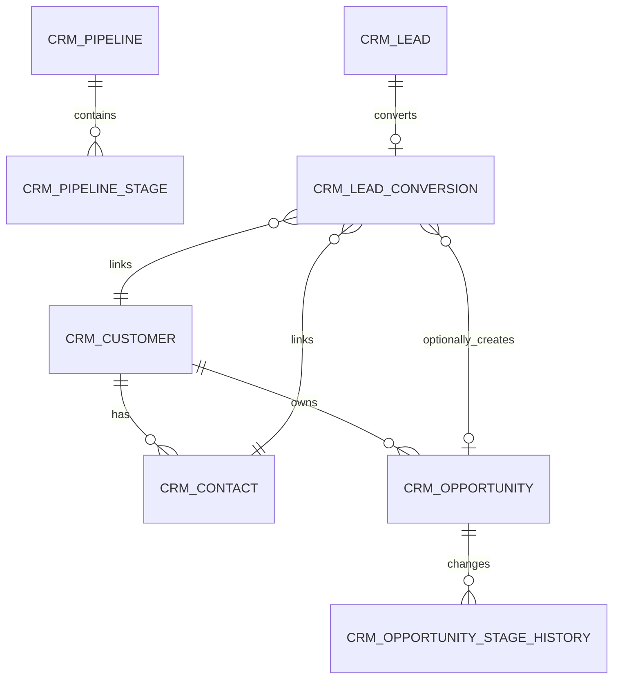
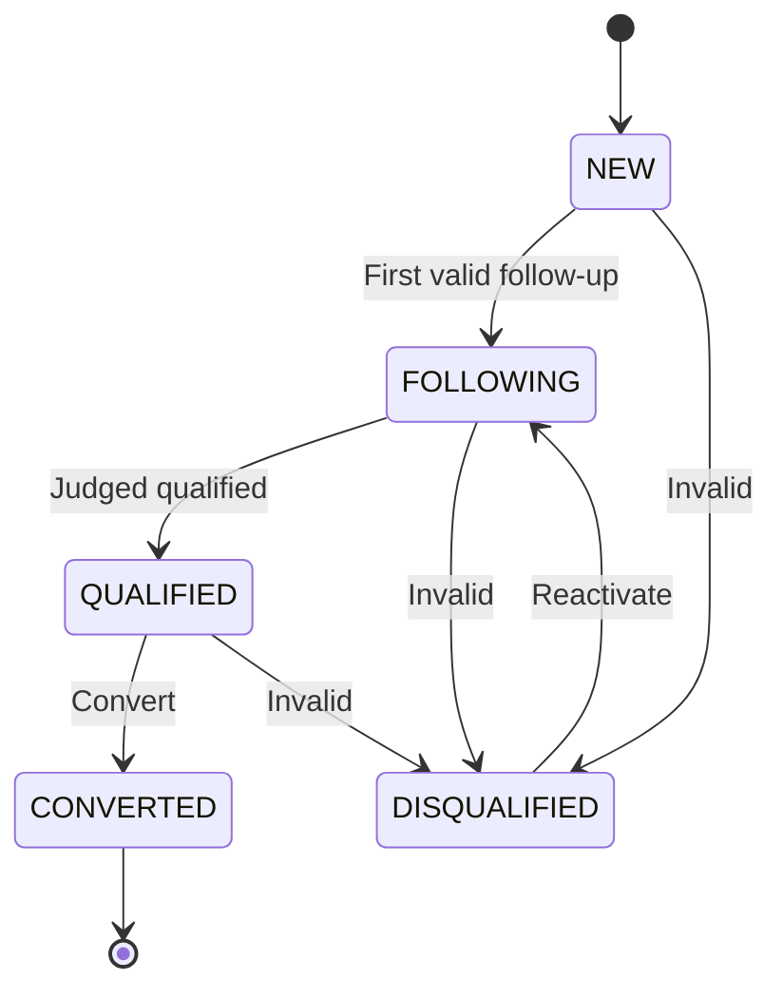
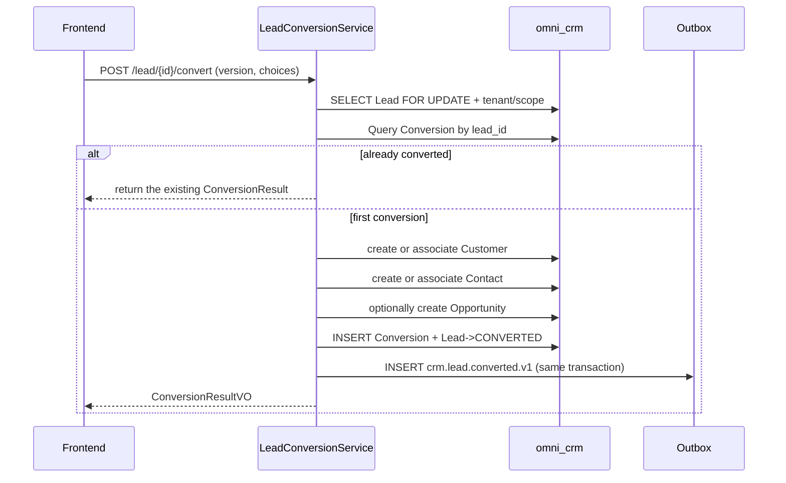

# CRM 모듈 아키텍처와 구현 기준선

> 상태: MVP 구현 완료, 후속 반복의 기준선  
> 프로젝트: Omni-Stack  
> 날짜: 2026-07-12  
> 목표: 이미 DB에 반영된 CRM MVP의 아키텍처, 서비스 간 계약, 후속 반복 경계를 설명한다. 구현 입구는 `omni-backend/omni-crm`과 `omni-frontend/src/views/crm`이다.

설계 근거: `README.md`, 그리고 `docs/`의 architecture, api-contract, backend-patterns, frontend-patterns, core-flows, scheduling, workflow, mq-reliability, docker-deployment 전체 주제 문서. 동시에 현재 POM, Gateway, SQL, Docker Compose, 프런트엔드 동적 라우팅 구현으로 문서 예시를 대조한다.

## 1. 설계 결론

CRM은 `omni-base`에 계속 넣어 두지 말고 독립 Servlet 마이크로서비스로 구축해야 한다.

| 항목 | 결정 |
|---|---|
| Maven 모듈 / 서비스명 | `omni-crm` |
| 로컬 포트 / 관리 포트 | `8104` / `19904` |
| XXL-JOB 실행자 | `omni-crm` / `9904` (Outbox/태스크 활성화 시) |
| 데이터베이스 | `omni_crm` |
| Gateway | `/api/crm/**` → `lb://omni-crm`, `StripPrefix`를 사용하지 않음 |
| Redis | DB 0, Auth가 쓴 XSS 설정을 공유; CRM 키는 `crm:` 접두사 사용 |
| 프런트엔드 | 계속 `omni-frontend`를 사용하고 `views/crm/**`를 신설 |

CRM 첫 버전은 프리세일즈 폐루프만 완성한다:

> 리드 → 후속 조치 → 고객/연락처 → 영업 기회 → 수주 또는 실패.

제품, 견적, 계약, 주문, 청구서 발행, 회수, 마케팅 자동화, 고객지원 티켓은 MVP에 포함하지 않는다. 계약/주문 단계에 진입한 후에는 `omni-sales` 분리를 평가해야 하며, CRM을 ERP로 변질시키지 않는다.

구현 전에 반드시 네 개의 P0 선행 항목을 완성해야 한다:

1. Auth가 permission-aware 데이터 범위 내부 API를 제공한다; CRM은 `omni_auth`를 크로스 DB로 읽지 않는다.
2. `@OperLog`에 전화번호, 이메일, 주소, 비고 등 PII 마스킹/무시 역량을 추가한다.
3. CRM 테넌트와 데이터 권한은 실패 차단; 컨텍스트가 없을 때 테넌트 1을 기본값으로 하지 않고, 무조건 통과시키지도 않는다.
4. CRM에서 `ALL`은 "현재 테넌트의 전체 데이터"로 명확히 정의; 테넌트 간 조회는 별도의 플랫폼 권한과 전용 인터페이스를 둔다.

## 2. 제품 범위

### 2.1 사용자와 목표

| 사용자 | 핵심 요구 |
|---|---|
| 영업 담당 | 본인의 리드, 고객, 연락처, 영업 기회, 후속 조치 대기 항목을 관리 |
| 영업 매니저 | 본 부서 및 하위를 보고, 담당자를 할당하며, 퍼널과 기한 초과 항목을 점검 |
| CRM 관리자 | 테넌트 내 전체 CRM 데이터와 비즈니스 설정을 관리 |
| 읽기 전용 관찰자 | 인가 범위 내 통계와 기록을 보고, 수정하지 않으며, 전체 PII를 기본적으로 보지 않음 |

MVP는 다음에 답할 수 있어야 한다: 현재 신규/적격/전환된 리드가 얼마나 있는지; 어떤 항목이 오늘 기한이거나 초과인지; 한 고객에 어떤 연락처, 후속 조치, 영업 기회가 있는지; 영업 기회가 어떤 단계인지; 퍼널 금액, 전환율, 수주율이 어떤지; 누가 주요 비즈니스 기록을 수정했는지.

### 2.2 단계 구분

| 단계 | 역량 |
|---|---|
| MVP | 리드, 할당, 후속 조치 활동, 고객, 연락처, 고객 360, 영업 기회, 단계, 수주/실패, 기본 보드, 중복 후보 힌트 |
| Phase 2 | 공용 풀, 태그, 가져오기/내보내기, 병합, 자동 알림, 공유, 설정 가능 단계, 커스텀 필드, 필드 수준 암호화 |
| Phase 3 | 제품, 가격표, 견적, 계약, 할인/계약 승인, 회수 계획, 판매 예측 |
| 독립 도메인 | 마케팅 캠페인과 양성, 고객지원 티켓/SLA, 청구서와 재무 정리 |

## 3. 시스템 경계

| 컴포넌트 | 권위 책임 | CRM의 사용 방식 |
|---|---|---|
| `omni-auth` | 테넌트, 사용자, 조직, 역할, 권한, 데이터 범위, XSS 설정 | 내부 OpenFeign; CRM은 사용자/조직 ID만 저장 |
| `omni-crm` | 리드, 고객, 연락처, 영업 기회, 후속 조치와 CRM 상태 | 유일한 비즈니스 쓰기 주체 |
| `omni-base` | 사전, 조작 로그, 태스크/MQ 운영 | 조작 로그 집약; MVP는 사전 온라인에 강하게 의존하지 않음 |
| `omni-workflow` | BPMN, 프로세스 인스턴스, 대기, 승인 이력 | Phase 3 멱등 통합, Flowable을 내장하지 않음 |
| XXL-JOB | 일괄 스캔 트리거 | 알림이나 CRM 상태의 권위 저장소로 쓰지 않음 |
| RocketMQ | 비동기 전송 | 최소 1회; 컨슈머는 멱등이어야 함 |
| Redis | XSS 공유 설정, 단기 캐시 | CRM 권위 비즈니스 데이터를 저장하지 않음 |



권장 의존: `omni-common-core`, `omni-common`, `omni-common-mybatis`, `omni-common-redis`, `omni-common-operlog`, `omni-common-job`, `omni-common-mqlog`, 그리고 Web, Validation, Security, AspectJ, OpenFeign, LoadBalancer, Nacos, RocketMQ Stream, Actuator, Lombok.

`omni-common-workflow`에 의존하지 말 것. 그렇지 않으면 Flowable 엔진을 CRM에 내장하게 된다.

## 4. 도메인과 데이터 설계

### 4.1 집계

| 집계 | 테이블 | 책임 |
|---|---|---|
| Lead | `crm_lead`, `crm_lead_conversion` | 리드 라이프사이클, 담당자, 전환 멱등 |
| Customer | `crm_customer`, `crm_contact` | 고객 프로필, 연락처, 고객 360 |
| Opportunity | `crm_opportunity`, `crm_opportunity_stage_history` | 단계, 금액, 확률, 수주/실패 이력 |
| Activity | `crm_activity` | 후속 조치의 계획, 완료, 취소 |
| Pipeline | `crm_pipeline`, `crm_pipeline_stage` | 영업 기회 파이프라인과 단계 정의 |
| Ownership Audit | `crm_owner_change_log` | 담당자/조직 변경의 불변 이력 |



`crm_activity`는 `root_type + root_id`로 Lead, Customer, Opportunity에 연결된다. 다형 관계는 일반 외래 키를 쓸 수 없으므로, Service는 대상이 존재하고, 동일 테넌트이며, 현재 사용자가 접근 가능함을 검증해야 한다.

### 4.2 공통 필드와 규칙

모든 `crm_*` 테이블은 `tenant_id`를 포함해야 하며, tenant config, pipeline stage, conversion, stage history, owner history, approval request, inbox도 마찬가지다. 그러면 TenantLine이 존재하지 않는 열로 고쳐 쓰지 않는다. 인가 가능한 비즈니스 테이블은 추가로 다음을 포함해야 한다:

- `tenant_id`: 테넌트 격리.
- `owner_user_id`: SELF 범위와 비즈니스 담당자.
- `owner_unit_id`: DEPT/DEPT_AND_BELOW/CUSTOM 범위.
- `version`: 낙관적 락.
- `deleted`: 논리 삭제.
- `id/create_time/update_time/create_by/update_by`: 프로젝트 감사 필드.

제약:

- 사용자/조직 ID는 Auth가 관리하며, 크로스 DB 외래 키를 만들지 않고, 프런트엔드가 제출한 사용자명이나 ownerUnitId를 신뢰하지 않는다.
- 인덱스는 `tenant_id`로 시작하고, 이어서 owner, 상태, 후속 조치 시각을 조합한다.
- `create_by`는 사용자명 감사 필드로, SELF 데이터 권한에 쓸 수 없다.
- 금액은 `DECIMAL(18,2)` / `BigDecimal`을, 통화는 ISO 4217 세 글자 코드를 사용한다. MVP의 모든 영업 기회는 테넌트 설정의 단일 기본 통화를 강제로 사용하고, 통계에서 통화 간 직접 합산을 금지한다; 다중 통화와 환율 변환은 후속 버전으로 미룬다.
- 시각은 `yyyy-MM-dd HH:mm:ss`로 통일; 예상 성사일은 `LocalDate`를 쓸 수 있다.
- `lead_no/customer_no/opportunity_no`는 이미 생성된 데이터베이스 ID 또는 전용 시퀀스 테이블로 생성하고 테넌트 내 고유로 만든다. `SELECT MAX(...) + 1`은 금지한다.
- 일반 PUT으로는 owner, 라이프사이클 status, opportunity stage를 직접 변경할 수 없다.
- 외부 요청은 맨 `selectById/updateById/deleteById`를 사용해서는 안 된다.
- 논리 삭제되는 비즈니스 엔티티에는 난폭한 고유 키를 만들지 않는다; 안정된 설정 code, Lead Conversion은 고유 제약으로 만들 수 있다.

현재 `BaseEntity` 주석은 자동 감사 채우기가 존재한다고 주장하지만, 저장소에 검증 가능한 `MetaObjectHandler`가 없다. CRM 개발 전에 공통 감사 채우기를 보완하고 테스트해야 한다; 그렇지 않으면 Service가 감사 필드를 명시적으로 쓴다.

### 4.3 주요 테이블

`crm_tenant_config`

- `tenant_id` 고유, `default_pipeline_id`, `currency_code=CNY`, `lead_duplicate_policy=WARN`, `initialized_time`.
- 테넌트가 처음 CRM에 진입하면, `CrmTenantInitializer`가 멱등으로 기본 설정을 생성하여, Auth가 크로스 서비스 트랜잭션으로 CRM DB에 쓰는 것을 피한다.

`crm_pipeline` / `crm_pipeline_stage`

- Pipeline: `tenant_id/code/name/status/default_flag/sort/version/deleted`.
- Stage: `pipeline_id/stage_code/stage_name/stage_type/probability/sort/status/deleted`.
- `stage_type`은 `OPEN/WON/LOST`로 고정.
- MVP는 `DISCOVERY → QUALIFICATION → PROPOSAL → NEGOTIATION → WON/LOST`를 미리 설정하고, 당분간 관리 UI를 개방하지 않는다.

`crm_lead`

- `lead_no/full_name/company_name/job_title/mobile/phone/email/region/address`.
- `source_code/industry_code/rating/status/disqualify_reason`.
- owner, assigned, lastActivity, nextFollowup, converted, version과 감사 필드.
- 핵심 인덱스: tenant + owner/status, tenant + unit/status, tenant + nextFollowup/status, tenant + company/mobile/email.

`crm_lead_conversion`

- `tenant_id/lead_id/customer_id/contact_id/opportunity_id/converted_by_user_id/converted_time`.
- `lead_id`는 고유하고, 기록은 삭제할 수 없으며, Lead 전환의 멱등 근거이다.

전화번호, 이메일, 회사명은 중복 후보에만 쓰고, 비즈니스 하드 고유로 삼지 않는다. 동일 회사에 여러 연락처가 있을 수 있고, 동일 전화는 회사 대표 전화일 수 있다. 기본적으로 후보를 반환하고 경고하며, 사용자가 기존 기록 연결 또는 계속 생성을 선택한다.

`crm_customer`

- `customer_no/name/normalized_name/customer_type/industry_code/level_code/source_code`.
- `credit_code/website/phone/email/region/address/status`.
- owner, lastActivity, nextFollowup, version, deleted와 감사 필드.

`crm_contact`

- `customer_id/name/department/job_title/mobile/phone/email/decision_role/primary_flag/status`.
- owner는 Customer owner의 권한 스냅샷; 고객 이전 시 동일 트랜잭션에서 동기화.
- 각 고객은 유효한 주요 연락처를 최대 하나 갖는다; Service는 고객 행 락 아래에서 전환하며, 생성 열 고유 인덱스로 추가 폴백할 수 있다.

`crm_opportunity`

- `opportunity_no/name/customer_id/primary_contact_id/source_lead_id`.
- `pipeline_id/stage_id/status/amount/currency_code/probability`.
- `expected_close_date/actual_close_time/loss_reason`, owner, stageChange, nextFollowup, version.

`crm_opportunity_stage_history`

- `opportunity_id/from_stage_id/to_stage_id/from_status/to_status/change_reason/changed_by_user_id/changed_time`.
- 추가 전용으로, 업데이트하지도 삭제하지도 않는다.

Opportunity의 `status`는 대상 Stage의 `stage_type`과 일치해야 하며, Stage 명령 Service만 동시에 업데이트할 수 있다; `probability`는 전이 시점의 단계 확률 스냅샷을 저장한다.

`crm_activity`

- `root_type/root_id`(LEAD/CUSTOMER/OPPORTUNITY), 선택적으로 `contact_id`.
- `activity_type/subject/content/status`.
- `planned_start_time/planned_end_time/completed_time/next_action_time`.
- `performed_by_user_id`는 실제 수행자를 기록; owner는 접근 루트의 현재 권한 스냅샷이며, 그 외 version, deleted와 감사 필드.
- MVP의 content는 평문만 허용하고, 프런트엔드는 `v-html`을 금지한다.

`crm_owner_change_log`

- entity, 구/신 owner user/unit, operationType, reason, operator와 time.
- 추가 전용이며, 일반 삭제 인터페이스를 제공하지 않는다.

연락처와 Customer를 접근 루트로 하는 Activity는 고객 owner를 따라 동기화된다; 수행 이력은 `performed_by_user_id/create_by`가 보존한다. 오픈 영업 기회를 Customer와 함께 이전할지는 명령 매개변수로 명시적으로 결정하며, 기본은 캐스케이드하지 않는다; 영업 기회를 캐스케이드하면 그 Activity도 함께 동기화한다. Lead 전환 시 원래 Lead Activity의 접근 루트를 새 Customer로 옮기고, Conversion 기록은 출처 관계를 보존한다.

## 5. 상태 머신과 핵심 플로우

### 5.1 Lead



- `QUALIFIED`만 전환 가능; `DISQUALIFIED`는 사유 필수; `CONVERTED`는 종료 상태.
- owner/public-pool은 귀속 차원이며, 라이프사이클 상태에 섞지 않는다.

### 5.2 Customer

```text
POTENTIAL → ACTIVE → DORMANT
               ├──→ LOST
               └──→ BLACKLISTED
DORMANT / LOST → ACTIVE
BLACKLISTED → ACTIVE (dedicated permission)
```

영업 기회 수주는 POTENTIAL을 자동으로 ACTIVE로 바꿀 수 있다. 고객에 오픈 영업 기회가 있으면 직접 삭제할 수 없고, 우선 DORMANT/LOST로 바꾼다.

### 5.3 Opportunity

```text
DISCOVERY → QUALIFICATION → PROPOSAL → NEGOTIATION → WON / LOST
```

- 오픈 단계는 전진 또는 후퇴할 수 있다; 후퇴는 반드시 사유를 쓴다.
- LOST는 실패 사유 필수; WON/LOST는 종료 상태.
- 재개에는 `crm:opportunity:reopen`이 필요하며, 마지막 오픈 단계로 복구한다.
- 모든 전이는 Stage History를 추가하며, 일반 PUT은 stage/status를 받지 않는다.

### 5.4 Activity

```text
PLANNED → COMPLETED
       └→ CANCELLED
CANCELLED → PLANNED (reschedule)
```

COMPLETED는 종료 상태; 이력으로 완료된 활동을 직접 생성하는 것을 허용하되, 완료 시각을 제공해야 한다.

### 5.5 Lead 전환



요청은 고객/연락처가 신규 생성인지 연결인지, 그리고 영업 기회를 생성할지를 명시한다. Feign, Workflow, 실제 MQ 전송은 CRM DB 트랜잭션 안에서 일어나면 안 된다; 필요한 이벤트는 로컬 Outbox에만 쓴다.

## 6. 테넌트, RBAC과 데이터 권한

### 6.1 신뢰 체인

1. Gateway가 RS256 JWT와 블랙리스트를 검증하고, `X-User-*`, `X-Tenant-Id`, `X-Gateway-Forwarded`를 덮어쓰고 주입한다.
2. CRM `GatewayPreAuthFilter`가 `Authentication`을 구성한다.
3. Controller가 `@PreAuthorize`로 기능 권한을 검증한다.
4. CRM 테넌트 필터가 tenant 컨텍스트를 확립; `@CrmDataScope(permissionCode)` 애스펙트가 현재 엔드포인트 권한으로 dataScope를 해석한다.
5. MyBatis-Plus가 tenant와 해당 permission에 대응하는 owner 조건을 추가한다.

`X-Gateway-Forwarded:true`는 암호학적 증명이 아니다. 운영에서는 CRM 비즈니스 포트를 공개하면 안 되며, 프라이빗 네트워크/보안 그룹을 사용해야 하고, 이후 서명된 내부 헤더나 하류 JWT 검증을 추가할 수 있다.

### 6.2 권한 트리와 역할

보드 메뉴는 `crm:overview`를 쓰고 `crm:dashboard`는 쓰지 않아, 정적 `/admin/dashboard`와의 충돌을 피한다.

메뉴: `crm`(DIRECTORY) 그리고 `crm:overview`, `crm:lead`, `crm:customer`, `crm:contact`, `crm:opportunity`, `crm:activity`(MENU).

API 권한:

- `crm:overview:list`
- `crm:lead:list/create/update/delete/assign/convert/disqualify`
- `crm:customer:list/create/update/delete/transfer/status/blacklist`
- `crm:contact:list/create/update/delete`
- `crm:opportunity:list/create/update/delete/assign/stage/reopen`
- `crm:activity:list/create/update/delete/complete/cancel`
- `crm:owner:list` (담당자 후보 조회)
- `crm:pii:view`

위의 `/`는 동일 리소스 아래 여러 완전한 권한 코드의 축약이다. 예를 들어 `crm:lead:list/create`는 `crm:lead:list`와 `crm:lead:create`를 의미하며, DB 반영 시 완전한 code를 한 건씩 저장해야 한다. 실제 `sys_permission.type`은 `DIRECTORY/MENU/API`를 쓰고, 옛 예시의 BUTTON는 쓰지 않는다.

| 역할 | dataScope | 역량 |
|---|---|---|
| `CRM_ADMIN` | TENANT | 현재 테넌트의 전체 CRM 기능/데이터 |
| `SALES_MANAGER` | DEPT_AND_BELOW | 부서 및 하위, 할당/이전, 통계 |
| `SALES_REP` | SELF | 본인이 담당하는 데이터와 일반 영업 조작 |
| `CRM_VIEWER` | TENANT | 테넌트 수준 읽기 전용, PII는 기본 부여하지 않음 |
| `SUPER_ADMIN` | ALL | 모든 기능, CRM 데이터는 계속 현재 테넌트로 제한 |

기본 USER에는 CRM 권한을 부여하지 않는다. 프런트엔드 `v-permission`와 백엔드 `@PreAuthorize`는 동일 코드를 쓴다; 메뉴 숨김은 보안 경계가 아니다.

Phase 2 공용 풀은 독립 메뉴/권한과 명시적 `owner_user_id IS NULL` 조회를 사용한다. 일반 목록의 DataPermission은 공용 풀 기능 때문에 완화되지 않으며, 요청 매개변수로 owner 조건을 우회하는 것도 허용하지 않는다.

### 6.3 Auth 내부 데이터 범위 계약

기존 DataScope 코드는 Auth에 있고 Auth Mapper에 의존한다. CRM은 Mapper를 복제하지 않으며, Workflow의 역사적 구현처럼 `omni_auth.*`를 크로스 DB로 읽지 않는다.

Auth는 통일된 `DataScopeService`를 추출하여, 원래 Auth Filter와 내부 인터페이스가 재사용해야 한다:

```text
GET /internal/data-scopes/{userId}?tenantId={tenantId}&permissionCode=crm:lead:update

InternalDataScopeDTO:
  userId, tenantId, permissionCode, primaryUnitId,
  effectiveScope, accessibleUnitIds, securityVersion
```

규칙:

- 사용자가 활성화되어 있고 tenant에 속함을 검증한다.
- 해당 `permissionCode`를 실제로 부여받은 역할만 병합; 사용자 자신이 그 권한을 갖지 않으면 해석을 거부한다.
- 동일 permission에 여러 역할이 있을 때만, 프로젝트 규칙에 따라 그중 가장 넓은 범위를 취한다.
- `resource=crm`만으로 병합하면 안 된다. 그렇지 않으면 TENANT 읽기 전용 역할과 SELF 쓰기 역할의 조합이 "테넌트 수준 범위 + 쓰기 권한"의 권한 결합 취약점을 만든다.
- `X-Internal-Token` 인증으로, Gateway를 통해 노출하지 않는다.
- Auth는 캐시할 수 있고, 역할 권한, dataScope, 사용자 조직 또는 커스텀 부서 변화 시 능동적으로 무효화한다.
- CRM 호출 실패/시간 초과/tenant 불일치 시 503/403을 반환하고, 필터 없음으로 저하하지 않는다.

기존 Auth user/org 내부 인터페이스는 ID 조회 시 tenant를 강제하지 않는다. CRM 접속 전에 tenant 매개변수와 SQL 제약을 추가하거나, 적어도 tenantId가 불일치하는 DTO를 거부해야 한다.

### 6.4 CRM 컨텍스트와 SQL 인터셉트

`CrmTenantContext`, `CrmTenantContextFilter`, `CrmDataScopeContext`, `CrmDataScope` 애노테이션/애스펙트, `CrmDataPermissionHandler`, `CrmRecordAccessGuard`를 신설한다.

```text
Read Gateway headers
→ Filter validates userId/tenantId, writes tenant ThreadLocal
→ @PreAuthorize validates endpoint functional permission
→ @CrmDataScope(permissionCode) calls Auth to resolve the dataScope of the same permission
→ write scope ThreadLocal
→ OperLog/Controller/Service/Mapper
→ Aspect finally clears scope, Filter finally clears tenant
```

Advisor 순서는 "메서드 권한 → DataScope → OperLog → 비즈니스 메서드"로 고정해야 하며, OperLog가 스냅샷을 사전 읽기할 때 이미 올바른 permission scope를 갖도록 보장한다. 목록, 상세, 통계와 각 쓰기 명령은 자신의 완전한 permissionCode를 선언하고, 거친 `resource=crm` 컨텍스트를 공유하지 않는다.

CRM은 같은 이름의 `mybatisPlusInterceptor`를 커스터마이즈하며, 순서는 고정:

```text
TenantLineInnerInterceptor
→ DataPermissionInterceptor
→ PaginationInnerInterceptor
```

- TenantLine은 `crm_*` 테이블만 처리하고, 항상 현재 tenant를 추가한다.
- `sys_mq_message`는 두 권한 인터셉터에서 제외한다. Relay가 설계상 모든 테넌트를 스캔하기 때문; 사용자 조회는 계속 명시적으로 tenant 필터한다.
- DataPermission은 Lead, Customer, Contact, Opportunity, Activity의 owner 열을 매핑한다.
- DataPermission은 Pagination 앞에 두어, COUNT와 records가 동일 범위임을 보장한다.
- Pipeline/Stage는 tenant + 기능 권한으로만 통제; Conversion, Stage History, Owner History는 집계 루트를 벗어난 범용 조회를 제공하지 않으며, 반드시 먼저 동일 permission으로 루트 객체에 AccessGuard를 수행한 뒤, tenant + rootId로 조회한다.

| dataScope | 조건 |
|---|---|
| SELF | `owner_user_id = currentUserId` |
| DEPT | `owner_unit_id = primaryUnitId` |
| DEPT_AND_BELOW / CUSTOM | `owner_unit_id IN accessibleUnitIds` |
| TENANT / ALL | owner 조건을 추가하지 않음, 단 TenantLine은 항상 유지 |

이는 명확한 보안 강화다: 일반 CRM API는 결코 테넌트를 넘지 않는다. 플랫폼의 테넌트 간 역량은 별도 `platform:crm:cross-tenant`, 전용 Controller, 명시적 tenant와 추가 감사를 사용한다.

### 6.5 쓰기 조작의 행 수준 인가

DataPermissionInterceptor는 쓰기 인가를 대체할 수 없다. 각 update/delete/convert/transfer/stage 명령은 반드시:

1. `tenant_id + id + data scope`로 가시 기록을 조회; 불가시는 일괄 404로 ID 열거를 방지.
2. 상태 머신과 비즈니스 불변 조건을 검증.
3. `tenant_id + id + version` 조건으로 업데이트.
4. 업데이트 행 수가 1이 아니면 동시성 충돌을 반환.
5. 주요 변경은 행 락 또는 낙관적 락을 쓰고, 도메인 이력을 동기로 쓴다.

`CrmRecordAccessGuard`가 상세, 명령, 하위 리소스 접근 검사를 통일 구현한다.

## 7. API 설계

### 7.1 공통 계약

- 모든 응답은 `R<T>`; 페이지네이션은 `R<PageResult<T>>`.
- `page=1`, `size=10`, CRM은 `size <= 100`으로 제한.
- Entity를 직접 Request/Response로 쓰지 않는다; 상태 명령은 독립 DTO를 사용.
- 날짜 매개변수는 `@DateTimeFormat(pattern = "yyyy-MM-dd HH:mm:ss")`을 선언; 프런트엔드는 `value-format="YYYY-MM-DD HH:mm:ss"`를 사용.
- 상태, 전환, 이전 요청은 `version`을 지닌다.
- PII 중복 감지는 POST body를 쓰고, URL과 접근 로그에 두지 않는다.
- 쓰기 인터페이스는 `@PreAuthorize`와 `@OperLog`를 동시에 선언; 주요 명령은 별도로 도메인 이력을 쓴다.

### 7.2 엔드포인트

| 도메인 | 엔드포인트 |
|---|---|
| Overview | `GET /api/crm/overview/summary`, `/funnel`, `/follow-ups` |
| Pipeline | `GET /api/crm/pipeline/list`, `/{id}/stages` |
| Lead | `GET /lead/list`, `GET /lead/{id}`, `POST /lead`, `PUT/DELETE /lead/{id}` |
| Lead 명령 | `POST /lead/duplicate-check`, `/{id}/assign`, `/batch-assign`, `/{id}/qualify`, `/disqualify`, `/reopen`, `/convert` |
| Customer | `GET /customer/list`, `/{id}`, `/{id}/overview`, `POST /customer`, `PUT/DELETE /customer/{id}` |
| Customer 명령 | `POST /customer/duplicate-check`, `/{id}/status`, `/{id}/transfer` |
| Contact | `GET /contact/list`, `GET /customer/{id}/contact/list`, `POST /customer/{id}/contact`, `PUT/DELETE /contact/{id}`, `POST /contact/{id}/primary` |
| Opportunity | `GET /opportunity/list`, `/board`, `/{id}`, `/{id}/stage-history`, `POST /opportunity`, `PUT/DELETE /opportunity/{id}` |
| Opportunity 명령 | `POST /opportunity/{id}/assign`, `/stage`, `/reopen` |
| Activity | `GET /activity/list`, `/timeline`, `/{id}`, `POST /activity`, `PUT/DELETE /activity/{id}` |
| Activity 명령 | `POST /activity/{id}/complete`, `/cancel`, `/reschedule` |
| Owner 옵션 | `GET /api/crm/options/owners`, 권한 `crm:owner:list` |

표에서 `/api/crm`을 생략한 엔드포인트는 모두 그 접두사로 시작한다. 모든 목록/상세와 집계 통계는 동일한 TenantLine/DataPermission을 적용한다. Owner, unit 조회 매개변수는 현재 범위를 좁히기만 하고, 넓힐 수 없다.

Customer 360은 고객, 연락처, 오픈 영업 기회, 최근 활동, 전환 리드 요약을 반환한다. `crm:pii:view`가 없으면 백엔드 VO가 직접 마스크 값을 반환하고, 프런트엔드 가림에 의존하지 않는다.

Customer 360은 "고객이 보이면 모든 하위 데이터가 보인다"가 아니다. 고객, 연락처, 영업 기회, 활동 블록은 각자의 완전한 list permission으로 데이터 범위를 해석한다; 어떤 블록의 권한이 없으면 그 블록을 조회하지 않고, 어떤 하위 기록이 자신의 독립 scope 안에 없으면 고객 상세를 통해 우회해서도 안 된다. 구현은 `CrmPermissionScopeExecutor`로 동일 Facade 안에서 블록별로 scope를 확립하고 제거할 수 있다.

고객의 `BLACKLISTED` 진입 또는 복원은 독립 `/customer/{id}/blacklist`, `/restore-from-blacklist` 명령과 `crm:customer:blacklist` 권한을 사용하고, 일반 status/update 권한을 재사용하지 않는다.

### 7.3 엔드포인트와 DataScope permission 매핑

`@PreAuthorize`와 `@CrmDataScope`는 동일한 완전한 비즈니스 권한 코드를 사용하며, 구현자가 임시로 선택하면 안 된다:

| 조작 | permissionCode |
|---|---|
| Overview 전체 통계 | `crm:overview:list` |
| Pipeline/Stage 조회, Opportunity board/history | `crm:opportunity:list` |
| 각 리소스 list/detail/overview/timeline/duplicate-check | 대응 `crm:<resource>:list` |
| 각 리소스 create/update/delete | 대응 `crm:<resource>:create/update/delete` |
| Lead qualify/reopen | `crm:lead:update` |
| Lead disqualify/assign/batch-assign/convert | `crm:lead:disqualify/assign/assign/convert` |
| Customer status/transfer/blacklist/restore | `crm:customer:status/transfer/blacklist/blacklist` |
| Contact primary | `crm:contact:update` |
| Opportunity assign/stage/reopen | `crm:opportunity:assign/stage/reopen` |
| Activity complete/cancel/reschedule | `crm:activity:complete/cancel/update` |
| Owner options | `crm:owner:list` |

표에서 `/`는 여러 엔드포인트가 각각 대응하는 완전한 권한 코드를 나타낸다. Create는 기본적으로 owner를 현재 사용자로 한다; 생성 시 다른 owner를 지정하려면 해당 리소스의 assign/transfer 권한도 있어야 하고, 대상 사용자가 그 명령 permission의 접근 가능 조직 범위 안에 있어야 한다.

## 8. 서비스 간 일관성

### 8.1 사용자와 조직

- CRM은 userId/unitId만 저장; 할당 전에 tenant로 제한된 Auth Feign으로 사용자가 존재하고, 활성화되어 있고, 동일 테넌트임을 검증.
- ownerUnitId는 Auth의 권위 있는 주 조직을 취하며, 프런트엔드를 신뢰할 수 없다.
- 목록 표시는 먼저 ID를 수집하고, 이어서 batch API를 한 번 호출한다. 행별 Feign은 금지.
- 이름/아바타는 단기 캐시 가능; 데이터 범위와 관계 ID는 장기 캐시에 의존하지 않는다.
- 사용자의 조직 이동은 이력의 고객 귀속을 조용히 일괄 고쳐 쓰지 않는다; ownerUnitId는 지난 명시 할당 시점의 비즈니스 귀속을 유지하고, 이후 감사 가능한 일괄 이정으로 수정한다.
- Compose에서 Auth와 호출 측은 동일한 필수 `OMNI_INTERNAL_API_TOKEN`을 사용; 저장소 안에 기본 비밀키를 제공하지 않으며, 누락 시 Compose가 직접 시작을 거부하고 각 서비스의 내부 인터페이스도 실패 차단한다.

### 8.2 사전

라이프사이클, stageType, 권한 의미는 고정 열거이며, 사전이 상태 머신을 바꿀 수 없다. MVP의 출처, 업종, 고객 등급, 활동 유형은 안정된 code와 내장 기본 옵션을 사용하여, 새 테넌트가 Base 사전을 갖지 않아 CRM을 못 쓰는 상황을 피한다. Phase 2에서 크로스 서비스 테넌트 초기화를 완비한 후, 순수 표시용 옵션을 `omni-base`로 옮길 수 있다; CRM은 항상 code만 저장한다.

### 8.3 Workflow

MVP는 승인을 연결하지 않는다. Phase 3에서 고액 할인, 계약, 고객 병합, 대형 고객 이전에 쓸 수 있으나, Workflow가 먼저 보완해야 한다:

1. `(tenant_id, business_key)` 고유 제약 또는 멱등 시작.
2. 신뢰 가능한 `workflow.process.started/completed/terminated.v1` 이벤트.
3. 표준 결과 `APPROVED/REJECTED/CANCELLED`.
4. 테넌트 안전한 내부 오케스트레이션 API.

CRM은 `crm_approval_request`를 신설하고, 상태는 `PENDING_START/RUNNING/APPROVED/REJECTED/CANCELLED/START_FAILED`, businessKey:

```text
crm:{aggregateType}:{tenantId}:{aggregateId}:{approvalRequestId}
```

CRM은 먼저 승인 신청을 로컬에서 커밋하고, 이어서 트랜잭션 밖에서 멱등으로 Workflow를 시작한다; 완료 이벤트는 Inbox 중복 제거 후 CRM 로컬 상태를 구동한다. Flowable은 CRM DB를 직접 바꾸지 않고, CRM DB 트랜잭션 안에서 Feign 호출을 보유하지 않는다.

### 8.4 XXL-JOB

Phase 2는 시스템 태스크 트랙을 사용하고, 각 Handler는 `@XxlJob`과 `@SystemJobMeta`를 동시에 선언한다:

| Handler | 기본 주기 | 책임 |
|---|---:|---|
| `crmFollowupReminderHandler` | 매 분 | 기한 도달 후속 조치를 스캔하여 알림 이벤트 생성 |
| `crmLeadSlaHandler` | 5분마다 | 시간 내 미연락 리드 식별/회수 |
| `crmOpportunityStaleHandler` | 매 시간 또는 매일 | 장기 후속 조치 없는 영업 기회 식별 |
| `crmApprovalReconcileHandler` | 10분마다 | Phase 3에서 Workflow 프로젝션 대사 |

후속 조치마다 XXL-JOB을 만들지 않는다. 시각은 CRM 테이블에 저장하고, 하나의 태스크가 일괄 스캔·원자 클레임·Outbox 쓰기를 수행한다. 백그라운드 태스크는 먼저 tenantId만 반환하는 전용 Mapper로 초기화된 테넌트 목록을 가져오고, 이어서 테넌트별로 시스템 TenantContext를 설정하고, 명시적 tenant 조건의 배치를 실행하고, `finally`에서 제거한다. 그 테넌트 열거 Mapper만 `@InterceptorIgnore(tenantLine = "true")`를 쓸 수 있고, 일반 비즈니스 Mapper는 우회를 금지한다. 태스크는 사용자 DataScope를 쓰지 않으며, 상태 클레임, 낙관적 락 또는 `FOR UPDATE SKIP LOCKED`로 재진입을 방지한다.

### 8.5 Outbox와 이벤트

통일 이벤트 엔벨로프:

```json
{
  "eventId": "UUID",
  "eventType": "crm.lead.converted.v1",
  "occurredAt": "2026-07-12 10:30:00",
  "tenantId": 1,
  "producer": "omni-crm",
  "aggregateType": "LEAD",
  "aggregateId": 1001,
  "aggregateVersion": 4,
  "actorUserId": 12,
  "correlationId": "...",
  "causationId": "...",
  "payload": {}
}
```

`ReliableMessageRelay.send("crm-domain-out-0", envelope, tenantId, eventId)`를 사용; tenantId는 명시적이어야 한다. 네 번째 매개변수는 eventId를 운영용 `msg_key`로 저장하고, Outbox 자신의 `msg_id`는 계속 독립 UUID다; 따라서 eventId는 payload 안에도 동시에 존재해야 하고, 컨슈머는 payload eventId로만 비즈니스 멱등을 할 수 있다.

권장 이벤트:

- `crm.lead.created/assigned/converted.v1`
- `crm.customer.owner-changed.v1`
- `crm.opportunity.stage-changed/won/lost.v1`
- `crm.activity.completed.v1`

이벤트는 ID, 상태, 필요한 스냅샷만 전달하고, 전체 전화번호, 이메일, 주소, 비고는 전달하지 않는다. CRM이 Workflow 등 이벤트를 소비할 때, 먼저 이벤트 tenantId를 검증하고, 이어서 이번 소비를 위해 시스템 TenantContext를 설정/제거한다; 동일 트랜잭션에서 `crm_inbox_event`와 비즈니스 변경을 쓰고, `(consumer_name,event_id)` 고유 키로 중복 제거하며, aggregateVersion로 순서 뒤섞임을 방지한다.

기존 Outbox는 최소 1회이며, Relay에 claim/lease가 없다. 클레임 기제 완성 전 CRM은 먼저 단일 인스턴스로 배포; 수평 확장 전에 `PROCESSING + lock_owner/lock_time` 또는 `SKIP LOCKED`를 추가한다.

현재 "메시지 기록" 페이지는 주로 `omni-base` 로컬 Outbox를 조회하며, CRM 추가 후 `omni_crm.sys_mq_message`를 자연스럽게 집계하지 않는다. 운영 전에 각 서비스의 내부 조회 역량으로 Feign 집계를 하거나, CRM 전용 운영 입구를 추가해야 한다; 공통 `schema.sql`을 CRM DDL과 관측 가능성의 유일한 보장으로 삼아서는 안 된다.

## 9. 프라이버시, 조작 로그와 XSS

### 9.1 OperLog 선행 개조

현재 `OperLogAspect`는 모든 매개변수와 엔티티 스냅샷을 직렬화하며, 직접 사용하면 PII가 RocketMQ, Outbox, 핫/콜드 로그 테이블에 들어간다. CRM Controller 개발 전에 common-operlog를 확장한다:

- 필드 수준 민감 어노테이션 또는 통일 마스커로 password, token, secret, mobile, phone, email, address, idCard, content를 다룬다.
- requestParams, oldValue, newValue, errorMsg를 동시에 처리.
- `recordParams=false`, `recordSnapshot=false` 또는 필드 제외를 지원하여, 가져오기/내보내기/대용량 텍스트 인터페이스에 제공한다.
- 로그 소비 영속화 실패는 반드시 재시도하고, 예외를 삼킨 뒤 확인하면 안 된다.
- 소비에 고유 eventId를 추가하여 Outbox 중복 전달에 방어.
- AOP가 oldValue/newValue를 읽을 때 반드시 동일 tenant/dataScope를 거쳐야 하며, 대상 명령 인가 실패 시 사전 읽기 스냅샷을 로그에 쓰면 안 된다.

Owner Change와 Stage History는 동기 도메인 사실이며, 비동기 범용 로그로 대체할 수 없다.

### 9.2 PII

- 전체 전화번호, 이메일, 주소는 `crm:pii:view`에만 반환.
- 다른 사용자에게는 백엔드 VO가 마스크를 반환, 예 `138****1234`, `a***@example.com`.
- 목록은 기본 마스크; 상세는 권한으로 결정.
- 중복 감지는 최소 후보 요약만 반환하고, 무권한 기록을 유출하지 않음.
- 내보내기는 Phase 2로 옮기고, 독립 권한, 데이터 범위, 감사를 사용.
- 백업, 데드 레터, Outbox/MQ 운영 페이지는 PII 포함 시스템으로 관리.

명시적 컴플라이언스 요구가 생기면, 필드 수준 암호화와 검색 가능 HMAC을 추가; MVP는 적어도 최소 권한, 백엔드 마스킹, 감사, TLS를 완성한다.

### 9.3 XSS

CRM은 반드시 `XssConfigProvider`를 구현하고, Redis DB 0의 `xss:enabled:{tenantId}`와 `xss:rules:{tenantId}`를 읽는다. 옛 예시의 DB 4를 쓰면 안 되며, 그렇지 않으면 Auth 설정을 읽지 못하고 XSS를 끄는 방향으로 저하한다.

CRM은 "cache miss → enabled=false" 실패 개방 전략을 복제하지 않는다. miss 시 Auth 내부 설정 인터페이스를 호출해 원본으로 폴백하는 것을 권장; Auth 사용 불가 시 내장 기준선 규칙을 사용. MVP 비고는 평문만 허용하고 `v-html`을 금지; 향후 리치 텍스트는 허용 목록 새니타이저를 쓰고, 정규식 블랙리스트를 계속 확장하지 않는다.

## 10. 프런트엔드 설계

```text
omni-frontend/src/
├── api/
│   ├── crm-overview.ts
│   ├── crm-lead.ts
│   ├── crm-customer.ts
│   ├── crm-contact.ts
│   ├── crm-opportunity.ts
│   └── crm-activity.ts
├── views/crm/
│   ├── overview/index.vue
│   ├── lead/index.vue
│   ├── customer/index.vue
│   ├── contact/index.vue
│   ├── opportunity/index.vue
│   └── activity/index.vue
└── components/crm/
    ├── OwnerSelector.vue
    ├── CustomerPicker.vue
    ├── ActivityTimeline.vue
    ├── OpportunityStageBoard.vue
    └── CustomerOverview.vue
```

- 공유 `ApiResponse/PageResult`는 `src/types/api.ts`에서만 가져온다.
- CRM API는 통일하여 하나의 tenant 헤더 헬퍼를 재사용하거나, `X-Tenant-Id` 주입을 공유 Axios request interceptor로 수렴; 각 함수가 제각각 파싱 로직을 복제하는 것을 금지.
- 일반 CRUD 상태는 페이지에 두고; 페이지 간 초안/영속 필터에만 Pinia를 추가.
- 권한 코드는 규약대로 `views/crm/**/index.vue`에 매핑; 메뉴 입구는 반드시 index.vue.
- 동적 라우팅은 `/admin/{마지막 세그먼트}`에 플랫으로 연결하고, 마지막 세그먼트는 전역 고유여야 한다; overview는 dashboard 충돌을 회피.
- `router/index.ts`와 `layout/index.vue`에 각각 iconMap이 있으며, 두 곳 모두 CRM을 보탠다.
- `constants/menu.ts`, `zh-CN.ts`, `en-US.ts`를 동기화.
- Customer 360은 Drawer/컴포넌트를 사용; 매개변수 라우팅을 쓰면 보호된 정적 라우트를 명시 등록.
- Opportunity 페이지는 테이블/Kanban을 제공; 단계 드래그는 최종적으로 계속 통제된 stage API를 호출.
- 모든 버튼은 동일 코드 `v-permission`을 쓰지만, 백엔드가 최종 경계.

## 11. 엔지니어링 착지점

### 11.1 새 모듈

```text
omni-backend/omni-crm/
├── pom.xml
└── src/main/
    ├── java/com/omni/crm/
    │   ├── CrmApplication.java
    │   ├── client/ config/ controller/ dto/ entity/
    │   ├── mapper/ security/ service/ service/impl/
    └── resources/
        ├── application.yml
        ├── application-dev.yml
        └── mapper/
```

`CrmApplication`은 `@EnableDiscoveryClient`, `@EnableFeignClients(basePackages="com.omni.crm.client")`, `@MapperScan("com.omni.crm.mapper")`를 사용한다. 서비스는 반드시 자체 `SecurityConfig`, `GatewayPreAuthFilter`, `XssConfigProviderImpl`을 갖춰야 한다. common에 현재 하류 사전 인증 Starter가 없기 때문이다.

### 11.2 반드시 변경할 파일

| 파일 | 변경 |
|---|---|
| `omni-backend/pom.xml` | `omni-crm` 추가 |
| Gateway `application.yml` | `/api/crm/**` 라우트 명시; 내부 경로 차단에 CRM 추가 |
| `docker/backend/Dockerfile` | POM 캐시 계층 `COPY omni-crm/pom.xml omni-crm/` |
| `docker-compose.yml` | CRM 서비스, 8104, DB/Redis/Nacos/MQ/XXL/internal token |
| `start.bat/start.sh` | build 목록에 CRM 추가; Windows 포트 보호에 8104 추가 |
| `database/changelog/crm/` | CRM 구조 변경에 forward-only Liquibase changeSet 추가 |
| `scripts/sql/seed/crm.sql` | CRM 기본 설정의 정식 멱등 시드; 업데이트 후 seed manifest 갱신 |
| `scripts/sql/seed/auth.sql` | CRM 권한과 역할의 정식 멱등 시드; 업데이트 후 seed manifest 갱신 |
| CRM `TenantModuleProvisioner` | 새 테넌트 CRM 설정과 단계의 멱등 초기화 |
| Frontend router/layout/menu/locales | 아이콘, 메뉴, i18n |

권위 있는 구조 사실 출처는 `database/changelog/crm/`이다; 정식 시드는 `scripts/sql/seed/crm.sql`과 `scripts/sql/seed/auth.sql`이 관리하고, `database/seed/manifest.yaml`이 검증한다. Compose는 fresh와 upgrade에서 통일하여 `omni-db-migrator`를 실행하고, 옛 집계 SQL은 더 이상 시작에 참여하지 않는다.

권한 시드는 고정 ID + `INSERT IGNORE`만으로 하면 안 된다: `sys_permission`에 `(tenant_id,permission_code)` 고유 키가 없다. tenant + code의 `NOT EXISTS`로 멱등 삽입하고, parent/path를 올바르게 재구축해야 한다; 동시에 SUPER_ADMIN, CRM 역할, seed manifest 단정, 새 테넌트 초기화를 업데이트한다.

Gateway에 이미 명시적 비즈니스 라우트가 있으면, 운영에서는 discovery locator를 끄는 것을 권장한다; 임시로 유지한다면 `/internal/**`, `/api/internal/**`, `/omni-crm/internal/**` 등 서비스 디스커버리 직통 경로를 동시에 차단해야 한다.

설정 요점: server 8104, management 19904, Redis DB 0, XXL appname `omni-crm`/port 9904. Docker 내부 애플리케이션 포트는 계속 8080이고, 호스트 매핑은 8104다. Workflow는 CRM 시작 의존으로 삼지 않는다.

현재 `docker compose config --services`는 실제로 12개 서비스(CRM 포함, Sentinel 미포함)다. 이후 Sentinel을 Compose에 되돌리면 서비스 총수는 13; README와 배포 문서는 실제 Compose 기준으로 유지한다.

## 12. 비기능 설계

### 성능

- 모든 목록은 페이지네이션, 최대 100; owner/status/followup는 tenant 접두 복합 인덱스 사용.
- 사용자/조직은 한 번에 batch enrich, N+1 금지.
- Customer 360은 블록별 조회하고 최근 활동 수를 제한.
- 퍼널은 먼저 인덱스 집계; 데이터 임계값 도달 후 일일 요약 테이블 생성.

### 동시성과 멱등

- Lead 전환: 행 락 + conversion leadId 고유.
- Owner 이전/Stage: version 낙관적 락 + 이력 테이블.
- 일괄 명령은 최대 100건, API는 건별 결과 또는 전체 트랜잭션 의미를 명시.
- Outbox 최소 1회, Inbox 중복 제거; 정기 스캔은 원자 클레임과 고유 비즈니스 키 사용.

### 저하

- Auth dataScope 사용 불가: 503, 실패 차단.
- Auth 표시 enrich 사용 불가: ID/알 수 없는 사용자를 반환 가능; 할당과 이전은 계속할 수 없음.
- RocketMQ 사용 불가: 비즈니스와 Outbox는 커밋, Relay가 나중에 보완.
- Workflow 사용 불가: MVP는 영향 없음; 후속 승인은 PENDING_START에서 멈추고 대사.
- Redis XSS miss: 원본/기준선 규칙으로 폴백, 방어를 끄지 않음.

### 관측 가능성

로그는 tenantId, aggregateId, eventId, 상태, 소요 시간을 기록하고 PII는 기록하지 않는다. Auth scope 지연/실패율, CRM 5xx/403/동시성 충돌, Outbox 적체와 최고 경과 시간, 태스크 적체, 전환/이전/단계 실패율, 느린 SQL과 커넥션 풀을 모니터링한다.

## 13. 테스트와 검수

프로젝트는 CRM 도입 전에 테스트 기반이 없었다; CRM은 PII, 멀티테넌트, 상태 머신에 관여하므로, 지속 유지보수하는 최소 테스트 세트는 반드시 다음을 포함해야 한다:

- 상태 머신 합법/불법 전이.
- Lead 전환 멱등과 동시성.
- Customer 이전 캐스케이드.
- PII 마스크와 OperLog 마스킹.
- 여섯 종류 dataScope의 목록, 상세, COUNT, 집계.
- 테넌트 간 읽기, 수정, 삭제, 이전, 전환 모두 실패.
- tenant/scope 누락 시 실패 차단.
- tenant + id + version 동시 업데이트.
- DataPermission이 Pagination 앞에 있어 total과 records가 일치.
- 비즈니스와 Outbox 동일 커밋/동일 롤백; Inbox는 중복 메시지를 한 번만 처리.
- XSS JSON, 조회 매개변수, 평문 비고.

엔드투엔드 검수: SALES_REP는 본인 것만 본다; SALES_MANAGER는 본 부서 및 하위를 본다; CRM_ADMIN은 현재 테넌트에서만 관리; PII 권한이 없으면 마스크만 얻는다; Lead 멱등 전환; Customer 360 완전; Stage History 완전; UI를 우회해 API를 호출해도 403; Token이 없으면 401.

검증 명령:

```powershell
$env:JAVA_HOME='C:\APP\JDK25\jdk-25.0.2'
$env:PATH="$env:JAVA_HOME\bin;$env:PATH"
cd omni-backend
.\mvnw.cmd clean install

cd ..\omni-frontend
npm run build
npm run lint

cd ..
docker compose config
docker compose build omni-crm omni-gateway omni-frontend
```

실제 MySQL 인터셉터 통합 테스트는 외부 테스트 DB가 없으면 기본적으로 건너뛴다. CI 또는 로컬에서 1회성 MySQL을 시작한 후, 명시적으로 실행할 수 있다:

```powershell
$env:CRM_TEST_MYSQL_URL='jdbc:mysql://127.0.0.1:3306/crm_it?useUnicode=true&characterEncoding=utf8&serverTimezone=Asia/Shanghai&allowPublicKeyRetrieval=true&useSSL=false'
$env:CRM_TEST_MYSQL_USERNAME='root'
$env:CRM_TEST_MYSQL_PASSWORD='your-test-password'
cd omni-backend
.\mvnw.cmd -pl omni-crm -am '-Dtest=CrmMysqlInterceptorIntegrationTest' '-Dsurefire.failIfNoSpecifiedTests=false' test
```

이 테스트는 테스트 DB에 `crm_lead` 테이블을 생성하고 삭제하므로, 전용 빈 테스트 DB만 사용해야 하며, 개발 또는 운영 데이터베이스를 가리켜서는 안 된다.

## 14. 구현 순서

### Milestone 0: 플랫폼 보강

- Auth DataScopeService + permission-aware 내부 인터페이스.
- user/org 내부 tenant 검증과 공유 Token 수정.
- OperLog PII 마스킹, 스냅샷 스위치, 소비 멱등.
- XSS miss 보안 전략.
- 검증 가능한 감사 필드 채우기와 CRM 테스트 골격.

완료 조건: 잘못되거나 누락된 신분 컨텍스트가 CRM 데이터를 반환하지 않고, 조작 로그에 전체 PII가 나타나지 않는다.

### Milestone 1: 서비스와 보안 기반

- 모듈, 설정, Gateway, Docker, DB, 기본 Pipeline 생성.
- TenantLine + DataPermission + Pagination.
- 권한 트리, CRM 역할, 기존 테넌트 마이그레이션, 프런트엔드 root 메뉴.

완료 조건: 등록, 라우팅, 401/403, 테넌트 격리, XSS, 헬스체크 통과.

### Milestone 2: Lead + Activity

- Lead CRUD, 할당, 적격/무효/재개.
- Activity 계획, 완료, 취소, 다음 액션.
- 중복 후보, 목록, 빠른 후속 조치와 타임라인.

완료 조건: 입력 → 할당 → 여러 번 후속 조치 → 적격 판정 폐루프.

### Milestone 3: Customer + Contact + Conversion

- Customer/Contact, 주요 연락처, Lead 멱등 전환, Customer 360, Owner Transfer.

완료 조건: 동시 전환이 중복되지 않고, 고객 귀속과 하위 기록 권한이 일치.

### Milestone 4: Opportunity + Pipeline

- Opportunity, 단계 명령, 수주/실패/재개, History, Kanban.

완료 조건: 영업 프로세스가 감사 가능한 WON/LOST까지 진행.

### Milestone 5: Overview + 운영 강화

- Summary/Funnel/Follow-ups, PII, 감사, 인덱스, 보안/트랜잭션/E2E 테스트.
- README, architecture, api-contract, core-flows, docker-deployment, AGENTS 업데이트.

완료 조건: MVP, 백엔드 빌드, 프런트엔드 Build/Lint, Docker와 보안 검수가 모두 통과.

Phase 2에서 공용 풀, 알림, 가져오기/내보내기, 태그, 병합을 한다; Phase 3은 Workflow 멱등/이벤트 역량이 갖춰진 후에만 승인과 계약을 추가한다.

## 15. ADR 요약

| 결정 | 선택 | 이유 |
|---|---|---|
| 서비스 | 독립 `omni-crm` | 비즈니스, 데이터, 배포 경계가 명확 |
| 라우팅 | `/api/crm/**`, StripPrefix 없음 | 저장소의 실제 Base/Workflow 방식에 부합 |
| tenant | 일반 API는 결코 테넌트를 넘지 않음 | CRM은 대량 PII를 포함 |
| ALL | 현재 테넌트 전체 데이터 | 역할 오설정으로 인한 테넌트 간 유출 방지 |
| scope | Auth permission-aware + CRM 애노테이션식 로컬 인터셉트 | 역할 간 권한 결합 방지, 크로스 DB 안 함, Auth Mapper 복제 안 함 |
| 하위 테이블 권한 | owner 스냅샷 + 트랜잭션 유지 | 페이지네이션과 SQL 인터셉트 통일 |
| 쓰기 인가 | AccessGuard + tenant/id/version | SELECT 인터셉트는 쓰기를 보호할 수 없음 |
| Conversion | CRM 단일 DB 트랜잭션 + Outbox | 핵심 객체 강한 일관성 |
| Workflow | MVP 연기 | 현재 멱등 시작과 신뢰 가능한 완료 이벤트 부재 |
| 스케줄링 | 한 종류 기록에 하나의 스캔 태스크 | XXL-JOB 태스크 폭발 회피 |
| MQ | Outbox 최소 1회 + Inbox | 정확히 1회를 가정하지 않음 |
| Redis | DB 0 + key namespace | 반드시 XSS 설정 공유 |
| PII | 백엔드가 권한으로 마스크, 로그/이벤트 최소화 | 프런트엔드 가림은 보안 조치가 아님 |
| 기본 역할 | USER에 CRM 권한 없음 | 명시 인가가 있어야 CRM 사용 가능 |

## 16. 주요 리스크

| 우선순위 | 리스크 | 대응 |
|---|---|---|
| P0 | DataScope가 Auth에만 있고, 빈 컨텍스트에서 필터를 추가하지 않음 | 내부 계약 + CRM 실패 차단 |
| P0 | OperLog가 전체 PII를 직렬화 | 먼저 common 마스킹 개조 |
| P0 | 서비스 직결로 신뢰 헤더 위조 가능 | 운영 포트 격리, 이후 서명/JWT |
| P0 | 쓰기 조작이 조회 데이터 권한을 우회 | AccessGuard + 조건부 업데이트 |
| P1 | XSS miss 실패 개방 | Auth 원본 폴백 또는 내장 기준선 |
| P1 | Outbox 다중 인스턴스 경합/중복 | 단일 인스턴스로 시작, claim + Inbox |
| P1 | Workflow 비멱등, 신뢰 가능한 완료 이벤트 없음 | 연기하고 먼저 계약 보완 |
| P1 | 컨테이너 수/Sentinel 문서가 Compose와 불일치 | Compose 기준으로 통일 |
| P1 | 통일 DB Migration 없음 | 먼저 existing migration 제공, 이후 도구 도입 |
| P1 | 테스트 기반 없음 | CRM 첫 배치에서 상태 머신/보안 테스트 구축 |

이번 구현은 먼저 Milestone 0을 완성하고, 이어서 `crm_lead` 등 비즈니스 테이블을 도입했다. 후속 반복에서도 데이터 범위 실패 차단, 조작 로그 마스킹, 테넌트 경계 검증 가능성을 유지해야, CRM이 실제 고객 정보를 담기에 적합하다.
