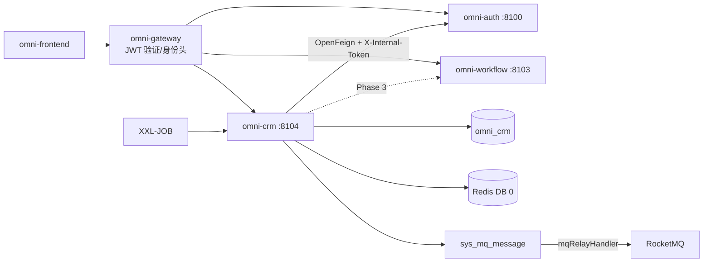
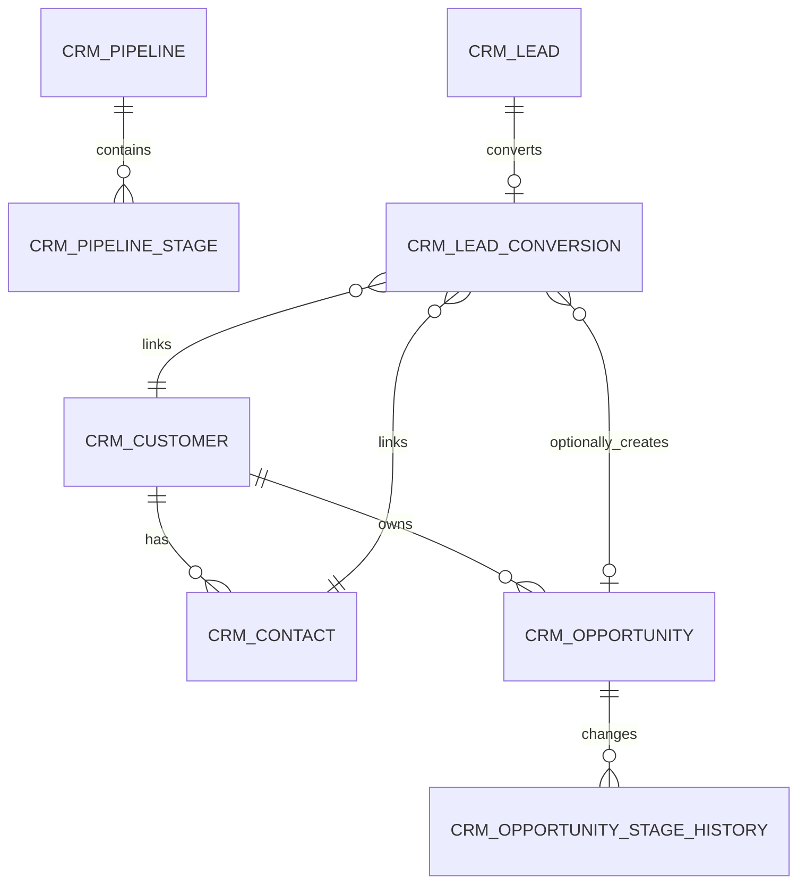
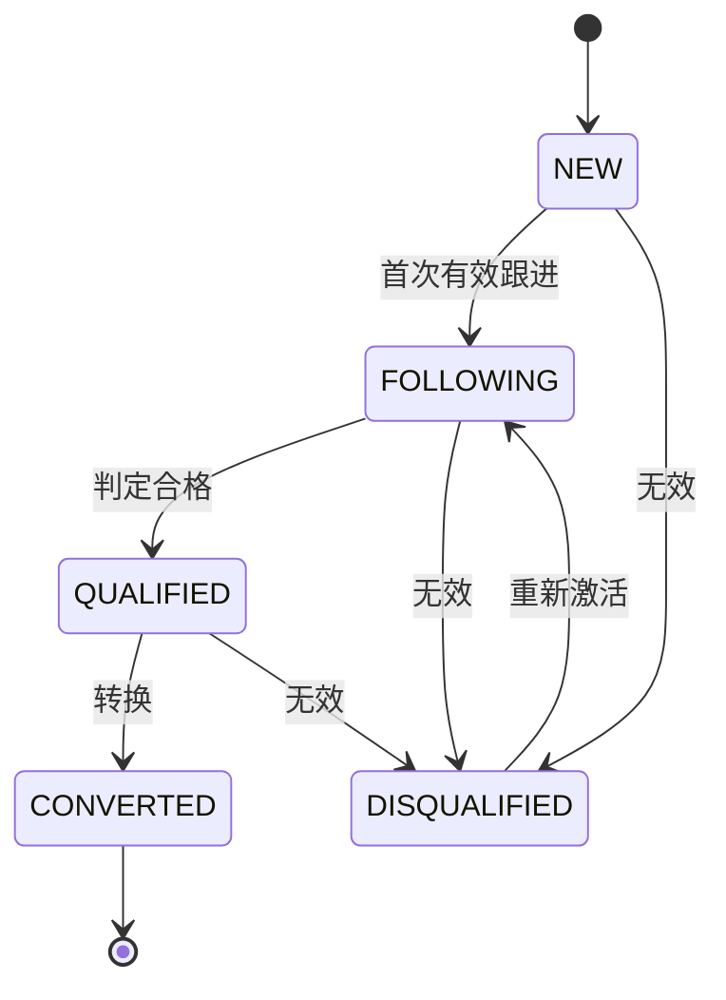
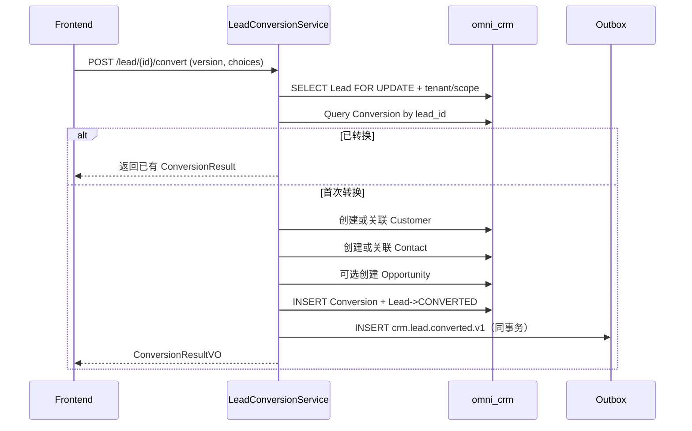

# CRM 模块架构与实现基线

> 状态：MVP 已实现，作为后续迭代基线  
> 项目：Omni-Stack  
> 日期：2026-07-12  
> 目标：说明已落库的 CRM MVP 架构、跨服务契约和后续迭代边界；实现入口为 `omni-backend/omni-crm` 与 `omni-frontend/src/views/crm`。

设计依据：`README.md`，以及 `docs/` 中 architecture、api-contract、backend-patterns、frontend-patterns、core-flows、scheduling、workflow、mq-reliability、docker-deployment 全部主题文档；同时以当前 POM、Gateway、SQL、Docker Compose 和前端动态路由实现核对文档示例。

## 1. 设计结论

CRM 应建设为独立 Servlet 微服务，而不是继续放入 `omni-base`。

| 项目 | 决策 |
|---|---|
| Maven 模块 / 服务名 | `omni-crm` |
| 本地端口 / 管理端口 | `8104` / `19904` |
| XXL-JOB 执行器 | `omni-crm` / `9904`（启用 Outbox/任务时） |
| 数据库 | `omni_crm` |
| Gateway | `/api/crm/**` → `lb://omni-crm`，不使用 `StripPrefix` |
| Redis | DB 0，共享 Auth 写入的 XSS 配置；CRM 键使用 `crm:` 前缀 |
| 前端 | 继续使用 `omni-frontend`，新增 `views/crm/**` |

CRM 第一版只完成售前闭环：

> 线索 → 跟进 → 客户/联系人 → 商机 → 赢单或输单。

产品、报价、合同、订单、开票、回款、营销自动化和客服工单不进入 MVP。进入合同/订单阶段后，应评估拆出 `omni-sales`，不要让 CRM 演变为 ERP。

实施前必须先完成四个 P0 前置项：

1. Auth 提供 permission-aware 数据范围内部 API；CRM 不跨库读取 `omni_auth`。
2. `@OperLog` 增加手机号、邮箱、地址、备注等 PII 脱敏/忽略能力。
3. CRM 租户与数据权限失败关闭；缺上下文时不能默认租户 1，也不能无条件放行。
4. CRM 中 `ALL` 明确定义为“当前租户全部数据”；跨租户查询另设平台权限和专用接口。

## 2. 产品范围

### 2.1 用户与目标

| 用户 | 核心诉求 |
|---|---|
| 销售人员 | 管理自己的线索、客户、联系人、商机和待跟进事项 |
| 销售经理 | 查看本部门及下级、分配负责人、检查漏斗和逾期事项 |
| CRM 管理员 | 管理租户内全部 CRM 数据和业务配置 |
| 只读观察者 | 查看授权范围内的统计与记录，不修改、不默认查看完整 PII |

MVP 应能回答：现在有多少新/合格/已转换线索；哪些事项今日或逾期；一个客户有哪些联系人、跟进和商机；商机处于什么阶段；漏斗金额、转换率和赢单率如何；谁修改了关键业务记录。

### 2.2 分期

| 阶段 | 能力 |
|---|---|
| MVP | 线索、分配、跟进活动、客户、联系人、客户 360、商机、阶段、赢单/输单、基础看板、重复候选提示 |
| Phase 2 | 公海池、标签、导入导出、合并、自动提醒、共享、可配置阶段、自定义字段、字段级加密 |
| Phase 3 | 产品、价目表、报价、合同、折扣/合同审批、回款计划、销售预测 |
| 独立领域 | 营销活动与培育、客服工单/SLA、发票和财务核销 |

## 3. 系统边界

| 组件 | 权威职责 | CRM 的使用方式 |
|---|---|---|
| `omni-auth` | 租户、用户、组织、角色、权限、数据范围、XSS 配置 | 内部 OpenFeign；CRM 只存用户/组织 ID |
| `omni-crm` | 线索、客户、联系人、商机、跟进和 CRM 状态 | 唯一业务写入方 |
| `omni-base` | 字典、操作日志、任务/MQ 运维 | 操作日志汇聚；MVP 不强依赖字典在线 |
| `omni-workflow` | BPMN、流程实例、待办、审批历史 | Phase 3 幂等集成，不嵌入 Flowable |
| XXL-JOB | 触发批量扫描 | 不作为提醒或 CRM 状态的权威存储 |
| RocketMQ | 异步运输 | 至少一次；消费者必须幂等 |
| Redis | XSS 共享配置、短缓存 | 不保存 CRM 权威业务数据 |



推荐依赖：`omni-common-core`、`omni-common`、`omni-common-mybatis`、`omni-common-redis`、`omni-common-operlog`、`omni-common-job`、`omni-common-mqlog`，以及 Web、Validation、Security、AspectJ、OpenFeign、LoadBalancer、Nacos、RocketMQ Stream、Actuator、Lombok。

不要依赖 `omni-common-workflow`，否则会把 Flowable 引擎嵌入 CRM。

## 4. 领域与数据设计

### 4.1 聚合

| 聚合 | 表 | 职责 |
|---|---|---|
| Lead | `crm_lead`、`crm_lead_conversion` | 线索生命周期、负责人、转换幂等 |
| Customer | `crm_customer`、`crm_contact` | 客户档案、联系人、客户 360 |
| Opportunity | `crm_opportunity`、`crm_opportunity_stage_history` | 阶段、金额、概率、赢/输单历史 |
| Activity | `crm_activity` | 计划、完成、取消跟进 |
| Pipeline | `crm_pipeline`、`crm_pipeline_stage` | 商机管道与阶段定义 |
| Ownership Audit | `crm_owner_change_log` | 负责人/组织变更的不可变历史 |



`crm_activity` 使用 `root_type + root_id` 关联 Lead、Customer 或 Opportunity。多态关系无法使用普通外键，因此 Service 必须验证目标存在、同租户且当前用户可访问。

### 4.2 通用字段与规则

每一张 `crm_*` 表都必须包含 `tenant_id`，包括 tenant config、pipeline stage、conversion、stage history、owner history、approval request 和 inbox；这样 TenantLine 不会改写到不存在的列。可授权业务表还必须包含：

- `tenant_id`：租户隔离。
- `owner_user_id`：SELF 范围和业务负责人。
- `owner_unit_id`：DEPT/DEPT_AND_BELOW/CUSTOM 范围。
- `version`：乐观锁。
- `deleted`：逻辑删除。
- `id/create_time/update_time/create_by/update_by`：项目审计字段。

约束：

- 用户/组织 ID 由 Auth 管理，不建跨库外键，不信任前端提交的用户名或 ownerUnitId。
- 索引以 `tenant_id` 开头，再组合 owner、状态、跟进时间。
- `create_by` 是用户名审计字段，不能用于 SELF 数据权限。
- 金额使用 `DECIMAL(18,2)` / `BigDecimal`，币种使用 ISO 4217 三位码。MVP 所有商机强制使用租户配置的单一默认币种，统计禁止跨币种直接求和；多币种与汇率换算留到后续版本。
- 时间统一 `yyyy-MM-dd HH:mm:ss`；预计成交日可用 `LocalDate`。
- `lead_no/customer_no/opportunity_no` 由已生成的数据库 ID 或专用序列表生成并做 tenant 内唯一，禁止 `SELECT MAX(...) + 1`。
- 普通 PUT 不允许直接修改 owner、生命周期 status 或 opportunity stage。
- 外部请求不得使用裸 `selectById/updateById/deleteById`。
- 逻辑删除业务实体不建立粗暴唯一键；稳定配置 code、Lead Conversion 可以建立唯一约束。

当前 `BaseEntity` 注释声称存在自动审计填充，但仓库中没有可验证的 `MetaObjectHandler`。CRM 开发前应补齐并测试公共审计填充；否则 Service 显式写入审计字段。

### 4.3 主要表

`crm_tenant_config`

- `tenant_id` 唯一、`default_pipeline_id`、`currency_code=CNY`、`lead_duplicate_policy=WARN`、`initialized_time`。
- 租户首次进入 CRM 时，`CrmTenantInitializer` 幂等创建默认配置，避免 Auth 跨服务事务写 CRM DB。

`crm_pipeline` / `crm_pipeline_stage`

- Pipeline：`tenant_id/code/name/status/default_flag/sort/version/deleted`。
- Stage：`pipeline_id/stage_code/stage_name/stage_type/probability/sort/status/deleted`。
- `stage_type` 固定为 `OPEN/WON/LOST`。
- MVP 预置 `DISCOVERY → QUALIFICATION → PROPOSAL → NEGOTIATION → WON/LOST`，暂不开放管理 UI。

`crm_lead`

- `lead_no/full_name/company_name/job_title/mobile/phone/email/region/address`。
- `source_code/industry_code/rating/status/disqualify_reason`。
- owner、assigned、lastActivity、nextFollowup、converted、version 和审计字段。
- 核心索引：tenant + owner/status、tenant + unit/status、tenant + nextFollowup/status、tenant + company/mobile/email。

`crm_lead_conversion`

- `tenant_id/lead_id/customer_id/contact_id/opportunity_id/converted_by_user_id/converted_time`。
- `lead_id` 唯一，记录不可删除，是 Lead 转换幂等依据。

手机号、邮箱、公司名只用于重复候选，不做业务硬唯一。同一公司可能有多个联系人，同一电话可能是公司总机。默认返回候选并警告，由用户选择关联已有记录或仍然创建。

`crm_customer`

- `customer_no/name/normalized_name/customer_type/industry_code/level_code/source_code`。
- `credit_code/website/phone/email/region/address/status`。
- owner、lastActivity、nextFollowup、version、deleted 和审计字段。

`crm_contact`

- `customer_id/name/department/job_title/mobile/phone/email/decision_role/primary_flag/status`。
- owner 是 Customer owner 的权限快照；客户转移时在同一事务中同步。
- 每个客户最多一个有效主要联系人；Service 在客户行锁下切换，可用生成列唯一索引进一步兜底。

`crm_opportunity`

- `opportunity_no/name/customer_id/primary_contact_id/source_lead_id`。
- `pipeline_id/stage_id/status/amount/currency_code/probability`。
- `expected_close_date/actual_close_time/loss_reason`、owner、stageChange、nextFollowup、version。

`crm_opportunity_stage_history`

- `opportunity_id/from_stage_id/to_stage_id/from_status/to_status/change_reason/changed_by_user_id/changed_time`。
- 只追加，不更新、不删除。

Opportunity 的 `status` 必须与目标 Stage 的 `stage_type` 保持一致，只能由 Stage 命令 Service 同时更新；`probability` 保存迁移时的阶段概率快照。

`crm_activity`

- `root_type/root_id`（LEAD/CUSTOMER/OPPORTUNITY）、可选 `contact_id`。
- `activity_type/subject/content/status`。
- `planned_start_time/planned_end_time/completed_time/next_action_time`。
- `performed_by_user_id` 记录实际执行人；owner 是访问根的当前权限快照，另有 version、deleted 和审计字段。
- MVP 的 content 只允许纯文本，前端禁止 `v-html`。

`crm_owner_change_log`

- entity、原/新 owner user/unit、operationType、reason、operator 和 time。
- 只追加，不提供普通删除接口。

联系人和以 Customer 为访问根的 Activity 随客户 owner 同步；执行历史由 `performed_by_user_id/create_by` 保留。开放 Opportunity 是否随 Customer 转移由命令参数显式决定，默认不级联；若级联 Opportunity，其 Activity 一并同步。Lead 转换时把原 Lead Activity 的访问根迁移到新 Customer，Conversion 记录保留来源关系。

## 5. 状态机与核心流程

### 5.1 Lead



- 只有 `QUALIFIED` 可转换；`DISQUALIFIED` 必填原因；`CONVERTED` 为终态。
- owner/public-pool 是归属维度，不混入生命周期状态。

### 5.2 Customer

```text
POTENTIAL → ACTIVE → DORMANT
               ├──→ LOST
               └──→ BLACKLISTED
DORMANT / LOST → ACTIVE
BLACKLISTED → ACTIVE（专门权限）
```

Opportunity 赢单可将 POTENTIAL 自动转为 ACTIVE。客户有开放商机时不能直接删除，优先转为 DORMANT/LOST。

### 5.3 Opportunity

```text
DISCOVERY → QUALIFICATION → PROPOSAL → NEGOTIATION → WON / LOST
```

- 开放阶段可前进或回退；回退必须写原因。
- LOST 必填输单原因；WON/LOST 为终态。
- 重开需要 `crm:opportunity:reopen`，恢复到最后一个开放阶段。
- 所有迁移追加 Stage History，普通 PUT 不接受 stage/status。

### 5.4 Activity

```text
PLANNED → COMPLETED
       └→ CANCELLED
CANCELLED → PLANNED（重新计划）
```

COMPLETED 为终态；允许直接创建历史已完成活动，但必须提供完成时间。

### 5.5 Lead 转换



请求明确客户/联系人是新建还是关联，以及是否创建商机。Feign、Workflow 和真实 MQ 发送不能发生在 CRM DB 事务内；必要事件只写本地 Outbox。

## 6. 租户、RBAC 与数据权限

### 6.1 信任链

1. Gateway 验证 RS256 JWT 和黑名单，覆盖并注入 `X-User-*`、`X-Tenant-Id`、`X-Gateway-Forwarded`。
2. CRM `GatewayPreAuthFilter` 构建 `Authentication`。
3. Controller 用 `@PreAuthorize` 验证功能权限。
4. CRM 租户过滤器建立 tenant 上下文；`@CrmDataScope(permissionCode)` 切面按当前端点权限解析 dataScope。
5. MyBatis-Plus 追加 tenant 和该 permission 对应的 owner 条件。

`X-Gateway-Forwarded:true` 不是密码学证明。生产环境不得公开 CRM 业务端口；需使用私有网络/安全组，后续可增加签名内部头或下游 JWT 校验。

### 6.2 权限树与角色

看板菜单使用 `crm:overview`，不使用 `crm:dashboard`，避免与静态 `/admin/dashboard` 冲突。

菜单：`crm`（DIRECTORY）以及 `crm:overview`、`crm:lead`、`crm:customer`、`crm:contact`、`crm:opportunity`、`crm:activity`（MENU）。

API 权限：

- `crm:overview:list`
- `crm:lead:list/create/update/delete/assign/convert/disqualify`
- `crm:customer:list/create/update/delete/transfer/status/blacklist`
- `crm:contact:list/create/update/delete`
- `crm:opportunity:list/create/update/delete/assign/stage/reopen`
- `crm:activity:list/create/update/delete/complete/cancel`
- `crm:owner:list`（负责人候选查询）
- `crm:pii:view`

上面的 `/` 是同一资源下多个完整权限码的简写，例如 `crm:lead:list/create` 表示 `crm:lead:list` 与 `crm:lead:create`，落库时必须逐条保存完整 code。真实 `sys_permission.type` 使用 `DIRECTORY/MENU/API`，不使用旧示例中的 BUTTON。

| 角色 | dataScope | 能力 |
|---|---|---|
| `CRM_ADMIN` | TENANT | 当前租户全部 CRM 功能/数据 |
| `SALES_MANAGER` | DEPT_AND_BELOW | 部门及下级、分配/转移、统计 |
| `SALES_REP` | SELF | 自己负责的数据及常规销售操作 |
| `CRM_VIEWER` | TENANT | 租户级只读，不默认授予 PII |
| `SUPER_ADMIN` | ALL | 所有功能，CRM 数据仍限当前租户 |

默认 USER 不授予 CRM 权限。前端 `v-permission` 和后端 `@PreAuthorize` 同码；菜单隐藏不是安全边界。

Phase 2 公海池使用独立菜单/权限和显式 `owner_user_id IS NULL` 查询。普通列表的 DataPermission 不因公海功能而放宽，也不允许通过请求参数绕过 owner 条件。

### 6.3 Auth 内部数据范围契约

现有 DataScope 代码位于 Auth 并依赖 Auth Mapper。CRM 不复制 Mapper，也不照 Workflow 的历史实现跨库读 `omni_auth.*`。

Auth 应抽取统一 `DataScopeService`，由原 Auth Filter 和内部接口复用：

```text
GET /internal/data-scopes/{userId}?tenantId={tenantId}&permissionCode=crm:lead:update

InternalDataScopeDTO:
  userId, tenantId, permissionCode, primaryUnitId,
  effectiveScope, accessibleUnitIds, securityVersion
```

规则：

- 校验用户启用且属于 tenant。
- 只合并真正授予该 `permissionCode` 的角色；用户本身不具备该权限时拒绝解析。
- 对同一个 permission 有多个角色时，才按项目规则取其中最宽松范围。
- 不能只按 `resource=crm` 合并。否则 TENANT 只读角色与 SELF 写角色组合后，会产生“租户级范围 + 写权限”的权限拼接漏洞。
- `X-Internal-Token` 认证，不经 Gateway 暴露。
- Auth 可缓存，角色权限、dataScope、用户组织或自定义部门变化时主动失效。
- CRM 调用失败/超时/tenant 不一致时返回 503/403，不降级为无过滤。

现有 Auth user/org 内部接口按 ID 查询时没有强制 tenant。CRM 接入前应增加 tenant 参数和 SQL 约束，或至少拒绝 tenantId 不一致的 DTO。

### 6.4 CRM 上下文与 SQL 拦截

新增 `CrmTenantContext`、`CrmTenantContextFilter`、`CrmDataScopeContext`、`CrmDataScope` 注解/切面、`CrmDataPermissionHandler`、`CrmRecordAccessGuard`。

```text
读取 Gateway 头
→ Filter 校验 userId/tenantId，写 tenant ThreadLocal
→ @PreAuthorize 验证端点功能权限
→ @CrmDataScope(permissionCode) 调 Auth 解析同一权限的 dataScope
→ 写 scope ThreadLocal
→ OperLog/Controller/Service/Mapper
→ Aspect finally 清 scope，Filter finally 清 tenant
```

Advisor 顺序必须固定为“方法权限 → DataScope → OperLog → 业务方法”，保证 OperLog 预读取快照时已经有正确的 permission scope。列表、详情、统计和每个写命令都声明自己的完整 permissionCode，不共享粗粒度 `resource=crm` 上下文。

CRM 自定义同名 `mybatisPlusInterceptor`，顺序固定：

```text
TenantLineInnerInterceptor
→ DataPermissionInterceptor
→ PaginationInnerInterceptor
```

- TenantLine 只处理 `crm_*` 表，永远添加当前 tenant。
- `sys_mq_message` 排除两个权限拦截器，因为 Relay 按设计扫描所有租户；用户查询仍显式 tenant 过滤。
- DataPermission 映射 Lead、Customer、Contact、Opportunity、Activity 的 owner 列。
- DataPermission 在 Pagination 前，保证 COUNT 和 records 同范围。
- Pipeline/Stage 只受 tenant + 功能权限控制；Conversion、Stage History、Owner History 不提供脱离聚合根的通用查询，必须先用相同 permission 对根对象执行 AccessGuard，再按 tenant + rootId 查询。

| dataScope | 条件 |
|---|---|
| SELF | `owner_user_id = currentUserId` |
| DEPT | `owner_unit_id = primaryUnitId` |
| DEPT_AND_BELOW / CUSTOM | `owner_unit_id IN accessibleUnitIds` |
| TENANT / ALL | 不加 owner 条件，但 TenantLine 始终保留 |

这是明确的安全强化：普通 CRM API 永不跨租户。平台跨租户能力使用独立 `platform:crm:cross-tenant`、专用 Controller、显式 tenant 和额外审计。

### 6.5 写操作行级授权

DataPermissionInterceptor 不能替代写授权。每个更新/删除/转换/转移/阶段命令必须：

1. 以 `tenant_id + id + data scope` 查询可见记录；不可见统一 404，防 ID 枚举。
2. 校验状态机和业务不变量。
3. 以 `tenant_id + id + version` 条件更新。
4. 更新行数非 1 时返回并发冲突。
5. 关键变化使用行锁或乐观锁，并同步写领域历史。

`CrmRecordAccessGuard` 统一实现详情、命令和子资源访问检查。

## 7. API 设计

### 7.1 通用契约

- 所有响应为 `R<T>`；分页为 `R<PageResult<T>>`。
- `page=1`、`size=10`，CRM 限制 `size <= 100`。
- Entity 不直接作为 Request/Response；状态命令使用独立 DTO。
- 日期参数声明 `@DateTimeFormat(pattern = "yyyy-MM-dd HH:mm:ss")`；前端使用 `value-format="YYYY-MM-DD HH:mm:ss"`。
- 状态、转换和转移请求携带 `version`。
- PII 重复检测用 POST body，不放 URL 和访问日志。
- 写接口同时声明 `@PreAuthorize` 和 `@OperLog`；关键命令另写领域历史。

### 7.2 端点

| 领域 | 端点 |
|---|---|
| Overview | `GET /api/crm/overview/summary`、`/funnel`、`/follow-ups` |
| Pipeline | `GET /api/crm/pipeline/list`、`/{id}/stages` |
| Lead | `GET /lead/list`、`GET /lead/{id}`、`POST /lead`、`PUT/DELETE /lead/{id}` |
| Lead 命令 | `POST /lead/duplicate-check`、`/{id}/assign`、`/batch-assign`、`/{id}/qualify`、`/disqualify`、`/reopen`、`/convert` |
| Customer | `GET /customer/list`、`/{id}`、`/{id}/overview`、`POST /customer`、`PUT/DELETE /customer/{id}` |
| Customer 命令 | `POST /customer/duplicate-check`、`/{id}/status`、`/{id}/transfer` |
| Contact | `GET /contact/list`、`GET /customer/{id}/contact/list`、`POST /customer/{id}/contact`、`PUT/DELETE /contact/{id}`、`POST /contact/{id}/primary` |
| Opportunity | `GET /opportunity/list`、`/board`、`/{id}`、`/{id}/stage-history`、`POST /opportunity`、`PUT/DELETE /opportunity/{id}` |
| Opportunity 命令 | `POST /opportunity/{id}/assign`、`/stage`、`/reopen` |
| Activity | `GET /activity/list`、`/timeline`、`/{id}`、`POST /activity`、`PUT/DELETE /activity/{id}` |
| Activity 命令 | `POST /activity/{id}/complete`、`/cancel`、`/reschedule` |
| Owner 选项 | `GET /api/crm/options/owners`，权限 `crm:owner:list` |

表中省略 `/api/crm` 的端点均以该前缀开头。所有列表/详情和聚合统计应用相同 TenantLine/DataPermission。Owner、unit 查询参数只能缩小当前范围，不能扩大范围。

Customer 360 返回客户、联系人、开放商机、最近活动和转换线索摘要。无 `crm:pii:view` 时后端 VO 直接返回掩码值，不依赖前端遮挡。

Customer 360 不是“客户可见即所有子数据可见”。客户、联系人、商机和活动分块使用各自完整的 list permission 解析数据范围；缺少某块权限时不查询该块，某条子记录不在其独立 scope 内时也不得借客户详情绕过。实现可用 `CrmPermissionScopeExecutor` 在同一 Facade 内逐块建立并清理 scope。

客户进入或恢复 `BLACKLISTED` 使用独立 `/customer/{id}/blacklist`、`/restore-from-blacklist` 命令和 `crm:customer:blacklist` 权限，不复用普通 status/update 权限。

### 7.3 端点与 DataScope permission 映射

`@PreAuthorize` 与 `@CrmDataScope` 使用同一个完整业务权限码，不能由实现者临时选择：

| 操作 | permissionCode |
|---|---|
| Overview 全部统计 | `crm:overview:list` |
| Pipeline/Stage 查询、Opportunity board/history | `crm:opportunity:list` |
| 各资源 list/detail/overview/timeline/duplicate-check | 对应 `crm:<resource>:list` |
| 各资源 create/update/delete | 对应 `crm:<resource>:create/update/delete` |
| Lead qualify/reopen | `crm:lead:update` |
| Lead disqualify/assign/batch-assign/convert | `crm:lead:disqualify/assign/assign/convert` |
| Customer status/transfer/blacklist/restore | `crm:customer:status/transfer/blacklist/blacklist` |
| Contact primary | `crm:contact:update` |
| Opportunity assign/stage/reopen | `crm:opportunity:assign/stage/reopen` |
| Activity complete/cancel/reschedule | `crm:activity:complete/cancel/update` |
| Owner options | `crm:owner:list` |

表内 `/` 表示多个端点分别对应的完整权限码。Create 默认 owner 为当前用户；创建时指定其他 owner 还必须具备该资源 assign/transfer 权限，并且目标用户处于该命令 permission 的可访问组织范围内。

## 8. 跨服务一致性

### 8.1 用户与组织

- CRM 只保存 userId/unitId；分配前通过 tenant 限定的 Auth Feign 验证用户存在、启用、同租户。
- ownerUnitId 取 Auth 权威主组织，不能信任前端。
- 列表展示先收集 ID，再调用一次 batch API，禁止逐行 Feign。
- 名称/头像可短缓存；数据范围和关系 ID 不依赖长期缓存。
- 用户调换组织不静默批量改写历史客户归属；ownerUnitId 保持上次明确分配时的业务归属，后续通过可审计的批量转移修正。
- Compose 中 Auth 和调用方使用同一个必填的 `OMNI_INTERNAL_API_TOKEN`；仓库内不提供默认密钥，缺失时 Compose 直接拒绝启动，各服务内部接口也会失败关闭。

### 8.2 字典

生命周期、stageType 和权限语义是固定枚举，字典不能改变状态机。MVP 的来源、行业、客户级别、活动类型使用稳定 code 和内置默认选项，避免新租户缺少 Base 字典导致 CRM 不可用。Phase 2 完善跨服务租户初始化后，可把纯展示选项迁到 `omni-base`；CRM 始终只存 code。

### 8.3 Workflow

MVP 不接审批。Phase 3 可用于大额折扣、合同、客户合并和大客户转移，但 Workflow 先补齐：

1. `(tenant_id, business_key)` 唯一约束或幂等启动。
2. 可靠的 `workflow.process.started/completed/terminated.v1` 事件。
3. 标准结果 `APPROVED/REJECTED/CANCELLED`。
4. 租户安全的内部编排 API。

CRM 新增 `crm_approval_request`，状态为 `PENDING_START/RUNNING/APPROVED/REJECTED/CANCELLED/START_FAILED`，businessKey：

```text
crm:{aggregateType}:{tenantId}:{aggregateId}:{approvalRequestId}
```

CRM 先本地提交审批申请，再在事务外幂等启动 Workflow；完成事件经 Inbox 去重后驱动 CRM 本地状态。Flowable 不直接改 CRM DB，CRM DB 事务内也不持有 Feign 调用。

### 8.4 XXL-JOB

Phase 2 使用系统任务轨道，每个 Handler 同时声明 `@XxlJob` 与 `@SystemJobMeta`：

| Handler | 默认频率 | 职责 |
|---|---:|---|
| `crmFollowupReminderHandler` | 每分钟 | 扫描到期跟进，生成提醒事件 |
| `crmLeadSlaHandler` | 每 5 分钟 | 识别/回收超时未联系线索 |
| `crmOpportunityStaleHandler` | 每小时或每天 | 识别长期无跟进商机 |
| `crmApprovalReconcileHandler` | 每 10 分钟 | Phase 3 对账 Workflow 投影 |

不为每条跟进创建 XXL-JOB。时间保存在 CRM 表，一个任务批量扫描、原子领取并写 Outbox。后台任务先通过专用、只返回 tenantId 的 Mapper 获取已初始化租户列表，再逐 tenant 设置系统 TenantContext、执行显式 tenant 条件的批次、并在 `finally` 清理。只有该租户枚举 Mapper 可使用 `@InterceptorIgnore(tenantLine = "true")`；普通业务 Mapper 禁止绕过。任务不使用用户 DataScope，并以状态领取、乐观锁或 `FOR UPDATE SKIP LOCKED` 防重入。

### 8.5 Outbox 与事件

统一事件信封：

```json
{
  "eventId": "UUID",
  "eventType": "crm.lead.converted.v1",
  "occurredAt": "2026-07-12 10:30:00",
  "tenantId": 1,
  "producer": "omni-crm",
  "aggregateType": "LEAD",
  "aggregateId": 1001,
  "aggregateVersion": 4,
  "actorUserId": 12,
  "correlationId": "...",
  "causationId": "...",
  "payload": {}
}
```

使用 `ReliableMessageRelay.send("crm-domain-out-0", envelope, tenantId, eventId)`；tenantId 必须显式。第四个参数把 eventId 保存为运维用 `msg_key`，Outbox 自己的 `msg_id` 仍是独立 UUID；因此 eventId 必须同时存在于 payload 内，消费者只能以 payload eventId 做业务幂等。

建议事件：

- `crm.lead.created/assigned/converted.v1`
- `crm.customer.owner-changed.v1`
- `crm.opportunity.stage-changed/won/lost.v1`
- `crm.activity.completed.v1`

事件只传 ID、状态和必要快照，不传完整手机、邮箱、地址、备注。CRM 消费 Workflow 等事件时，先校验事件 tenantId，再为本次消费设置/清理系统 TenantContext；在同一事务写 `crm_inbox_event` 和业务变更，以 `(consumer_name,event_id)` 唯一键去重，并按 aggregateVersion 防乱序。

现有 Outbox 是至少一次，Relay 无 claim/lease。完成领取机制前 CRM 先单实例部署；水平扩展前增加 `PROCESSING + lock_owner/lock_time` 或 `SKIP LOCKED`。

当前“消息记录”页面主要查询 `omni-base` 本地 Outbox，新增 CRM 后不会天然聚合 `omni_crm.sys_mq_message`。生产前应通过各服务内部查询能力做 Feign 聚合，或增加 CRM 专属运维入口；不能把 common `schema.sql` 当作 CRM DDL 和可观测性的唯一保障。

## 9. 隐私、操作日志与 XSS

### 9.1 OperLog 前置改造

当前 `OperLogAspect` 会序列化全部参数和实体快照，直接使用会让 PII 进入 RocketMQ、Outbox、热/冷日志表。开发 CRM Controller 前先扩展 common-operlog：

- 字段级敏感注解或统一脱敏器，覆盖 password、token、secret、mobile、phone、email、address、idCard、content。
- 同时处理 requestParams、oldValue、newValue、errorMsg。
- 支持 `recordParams=false`、`recordSnapshot=false` 或排除字段，供导入/导出/大文本接口使用。
- 日志消费持久化失败必须重试，不能吞异常后确认。
- 消费增加唯一 eventId，抵御 Outbox 重复投递。
- AOP 读取 oldValue/newValue 时必须经过同一 tenant/dataScope，且目标命令授权失败时不得把预读取快照写入日志。

Owner Change 和 Stage History 是同步领域事实，不能用异步通用日志代替。

### 9.2 PII

- 完整手机、邮箱、地址只返回给 `crm:pii:view`。
- 其他用户由后端 VO 返回掩码，例如 `138****1234`、`a***@example.com`。
- 列表默认掩码；详情按权限决定。
- 重复检测只返回最小候选摘要，不泄露无权记录。
- 导出放到 Phase 2，使用独立权限、数据范围和审计。
- 备份、死信、Outbox/MQ 运维页面按含 PII 系统管理。

若出现明确合规要求，再加字段级加密与可检索 HMAC；MVP 至少完成最小权限、后端脱敏、审计和 TLS。

### 9.3 XSS

CRM 必须实现 `XssConfigProvider`，读取 Redis DB 0 的 `xss:enabled:{tenantId}` 与 `xss:rules:{tenantId}`。不能使用旧示例的 DB 4，否则读取不到 Auth 配置且会降级关闭 XSS。

CRM 不复制“cache miss → enabled=false”的失败开放策略。推荐 miss 时调用 Auth 内部设置接口回源；Auth 不可用时使用内置基线规则。MVP 备注只允许纯文本且禁止 `v-html`；未来富文本使用允许列表 Sanitizer，而非继续扩展正则黑名单。

## 10. 前端设计

```text
omni-frontend/src/
├── api/
│   ├── crm-overview.ts
│   ├── crm-lead.ts
│   ├── crm-customer.ts
│   ├── crm-contact.ts
│   ├── crm-opportunity.ts
│   └── crm-activity.ts
├── views/crm/
│   ├── overview/index.vue
│   ├── lead/index.vue
│   ├── customer/index.vue
│   ├── contact/index.vue
│   ├── opportunity/index.vue
│   └── activity/index.vue
└── components/crm/
    ├── OwnerSelector.vue
    ├── CustomerPicker.vue
    ├── ActivityTimeline.vue
    ├── OpportunityStageBoard.vue
    └── CustomerOverview.vue
```

- Shared `ApiResponse/PageResult` 只从 `src/types/api.ts` 导入。
- CRM API 统一复用一个 tenant header helper，或把 `X-Tenant-Id` 注入收敛到共享 Axios request interceptor；禁止每个函数各自复制解析逻辑。
- 普通 CRUD 状态留在页面；仅跨页面草稿/持久筛选再加 Pinia。
- 权限码按约定映射 `views/crm/**/index.vue`；菜单入口必须是 index.vue。
- 动态路由扁平挂在 `/admin/{最后一段}`，最后一段必须全局唯一；overview 避免 dashboard 冲突。
- `router/index.ts` 与 `layout/index.vue` 各有 iconMap，两处都要补 CRM。
- `constants/menu.ts`、`zh-CN.ts`、`en-US.ts` 同步。
- Customer 360 使用 Drawer/组件；若使用参数路由，显式注册受保护静态路由。
- Opportunity 页面提供表格/Kanban；拖动阶段最终仍调用受控 stage API。
- 所有按钮使用同码 `v-permission`，但后端是最终边界。

## 11. 工程落点

### 11.1 新模块

```text
omni-backend/omni-crm/
├── pom.xml
└── src/main/
    ├── java/com/omni/crm/
    │   ├── CrmApplication.java
    │   ├── client/ config/ controller/ dto/ entity/
    │   ├── mapper/ security/ service/ service/impl/
    └── resources/
        ├── application.yml
        ├── application-dev.yml
        └── mapper/
```

`CrmApplication` 使用 `@EnableDiscoveryClient`、`@EnableFeignClients(basePackages="com.omni.crm.client")`、`@MapperScan("com.omni.crm.mapper")`。服务必须自带 `SecurityConfig`、`GatewayPreAuthFilter`、`XssConfigProviderImpl`，因为 common 当前没有下游预认证 Starter。

### 11.2 必改文件

| 文件 | 修改 |
|---|---|
| `omni-backend/pom.xml` | 加入 `omni-crm` |
| Gateway `application.yml` | 显式 `/api/crm/**` 路由；内部路径阻断加入 CRM |
| `docker/backend/Dockerfile` | POM 缓存层 `COPY omni-crm/pom.xml omni-crm/` |
| `docker-compose.yml` | CRM 服务、8104、DB/Redis/Nacos/MQ/XXL/internal token |
| `start.bat/start.sh` | build 列表加入 CRM；Windows 端口保护加入 8104 |
| `scripts/sql/init-all.sql` | `omni_crm` DDL、默认配置、权限和角色 |
| `scripts/sql/sp_init_tenant.sql` | 与内嵌过程同步 |
| `scripts/sql/init-tenant-a.sql` | 演示租户同步（若继续维护） |
| `scripts/sql/migrate-crm-mvp.sql` | 已有库/已有租户幂等迁移 |
| Frontend router/layout/menu/locales | 图标、菜单、i18n |

权威 DDL 目前是 `scripts/sql/init-all.sql`；仓库没有统一启用 Flyway。Docker entrypoint 也只在空卷首次执行，因此必须提供已有环境迁移，后续再引入版本化迁移工具。

权限迁移不能只用固定 ID + `INSERT IGNORE`：`sys_permission` 没有 `(tenant_id,permission_code)` 唯一键。应按 tenant + code 的 `NOT EXISTS` 幂等插入，并正确重建 parent/path；同时更新 SUPER_ADMIN、CRM 角色及新租户初始化。

Gateway 已有显式业务路由时，生产推荐关闭 discovery locator；若暂时保留，必须同时阻断 `/internal/**`、`/api/internal/**` 和 `/omni-crm/internal/**` 等服务发现直达路径。

配置要点：server 8104、management 19904、Redis DB 0、XXL appname `omni-crm`/port 9904。Docker 内部应用端口仍为 8080，宿主映射 8104。Workflow 不作为 CRM 启动依赖。

当前 `docker compose config --services` 实际有 12 个服务（已包含 CRM，未包含 Sentinel）。若后续把 Sentinel 补回 Compose，则服务总数为 13；README 与部署文档按实际 Compose 口径维护。

## 12. 非功能设计

### 性能

- 所有列表分页，最大 100；owner/status/followup 使用 tenant 前缀联合索引。
- 用户/组织一次 batch enrich，禁止 N+1。
- Customer 360 分块查询并限制最近活动数量。
- 漏斗先用索引聚合；达到数据阈值后再建日汇总表。

### 并发与幂等

- Lead 转换：行锁 + conversion leadId 唯一。
- Owner 转移/Stage：version 乐观锁 + 历史表。
- 批量命令最多 100 条，API 明确逐条结果或整体事务语义。
- Outbox 至少一次、Inbox 去重；定时扫描用原子领取和唯一业务键。

### 降级

- Auth dataScope 不可用：503，失败关闭。
- Auth 展示 enrich 不可用：可返回 ID/未知用户；分配和转移不能继续。
- RocketMQ 不可用：业务与 Outbox 提交，Relay 后补。
- Workflow 不可用：MVP 不受影响；后续审批停在 PENDING_START 并对账。
- Redis XSS miss：回源/基线规则，不关闭防护。

### 可观测性

日志记录 tenantId、aggregateId、eventId、状态和耗时，不记录 PII。监控 Auth scope 延迟/失败率、CRM 5xx/403/并发冲突、Outbox 积压与最老年龄、任务积压、转换/转移/阶段失败率、慢 SQL 和连接池。

## 13. 测试与验收

项目在 CRM 引入前没有测试基础；CRM 涉及 PII、多租户和状态机，持续维护的最低测试集必须包含：

- 状态机合法/非法迁移。
- Lead 转换幂等与并发。
- Customer 转移级联。
- PII 掩码和 OperLog 脱敏。
- 六种 dataScope 的列表、详情、COUNT 和聚合。
- 跨租户读、改、删、转移、转换全部失败。
- 缺 tenant/scope 时失败关闭。
- tenant + id + version 并发更新。
- DataPermission 在 Pagination 前，total 与 records 一致。
- 业务与 Outbox 同提交/同回滚；Inbox 对重复消息只处理一次。
- XSS JSON、查询参数和纯文本备注。

端到端验收：SALES_REP 只能看自己；SALES_MANAGER 看本部门及下级；CRM_ADMIN 只在当前租户管理；无 PII 权限只得掩码；Lead 幂等转换；Customer 360 完整；Stage History 完整；绕过 UI 调 API 仍 403；无 Token 401。

验证命令：

```powershell
$env:JAVA_HOME='C:\APP\JDK25\jdk-25.0.2'
$env:PATH="$env:JAVA_HOME\bin;$env:PATH"
cd omni-backend
.\mvnw.cmd clean install

cd ..\omni-frontend
npm run build
npm run lint

cd ..
docker compose config
docker compose build omni-crm omni-gateway omni-frontend
```

真实 MySQL 拦截器集成测试默认在缺少外部测试库时跳过。CI 或本地启动一次性 MySQL 后，可显式运行：

```powershell
$env:CRM_TEST_MYSQL_URL='jdbc:mysql://127.0.0.1:3306/crm_it?useUnicode=true&characterEncoding=utf8&serverTimezone=Asia/Shanghai&allowPublicKeyRetrieval=true&useSSL=false'
$env:CRM_TEST_MYSQL_USERNAME='root'
$env:CRM_TEST_MYSQL_PASSWORD='your-test-password'
cd omni-backend
.\mvnw.cmd -pl omni-crm -am '-Dtest=CrmMysqlInterceptorIntegrationTest' '-Dsurefire.failIfNoSpecifiedTests=false' test
```

该测试会创建并删除测试库中的 `crm_lead` 表，因此只能使用专用空测试库，不能指向开发或生产数据库。

## 14. 实施顺序

### Milestone 0：平台补强

- Auth DataScopeService + permission-aware 内部接口。
- user/org internal tenant 校验和共享 Token 修正。
- OperLog PII 脱敏、快照开关、消费幂等。
- XSS miss 安全策略。
- 可验证的审计字段填充和 CRM 测试骨架。

完成条件：错误/缺失身份上下文不会返回 CRM 数据，操作日志不出现完整 PII。

### Milestone 1：服务与安全底座

- 创建模块、配置、Gateway、Docker、DB、默认 Pipeline。
- TenantLine + DataPermission + Pagination。
- 权限树、CRM 角色、已有租户迁移、前端 root 菜单。

完成条件：注册、路由、401/403、租户隔离、XSS、健康检查通过。

### Milestone 2：Lead + Activity

- Lead CRUD、分配、合格/无效/重开。
- Activity 计划、完成、取消、下一次行动。
- 重复候选、列表、快速跟进和时间线。

完成条件：录入 → 分配 → 多次跟进 → 判定合格闭环。

### Milestone 3：Customer + Contact + Conversion

- Customer/Contact、主要联系人、Lead 幂等转换、Customer 360、Owner Transfer。

完成条件：并发转换不重复，客户归属与子记录权限一致。

### Milestone 4：Opportunity + Pipeline

- Opportunity、阶段命令、赢/输单/重开、History、Kanban。

完成条件：销售过程推进到可审计 WON/LOST。

### Milestone 5：Overview + 生产加固

- Summary/Funnel/Follow-ups、PII、审计、索引、安全/事务/E2E 测试。
- 更新 README、architecture、api-contract、core-flows、docker-deployment、AGENTS。

完成条件：MVP、后端构建、前端 Build/Lint、Docker 和安全验收全部通过。

Phase 2 再做公海池、提醒、导入导出、标签和合并；Phase 3 仅在 Workflow 幂等/事件能力具备后加入审批和合同。

## 15. ADR 摘要

| 决策 | 选择 | 原因 |
|---|---|---|
| 服务 | 独立 `omni-crm` | 业务、数据和部署边界清晰 |
| 路由 | `/api/crm/**`，不 StripPrefix | 符合仓库真实 Base/Workflow 方式 |
| tenant | 普通 API 永不跨租户 | CRM 含大量 PII |
| ALL | 当前租户全部数据 | 防角色误配跨租户泄露 |
| scope | Auth permission-aware + CRM 注解式本地拦截 | 防跨角色权限拼接，不跨库、不复制 Auth Mapper |
| 子表权限 | owner 快照 + 事务维护 | 统一分页和 SQL 拦截 |
| 写授权 | AccessGuard + tenant/id/version | SELECT 拦截不能保护写入 |
| Conversion | CRM 单库事务 + Outbox | 核心对象强一致 |
| Workflow | MVP 延后 | 当前缺幂等启动和可靠完成事件 |
| 调度 | 一类记录一个扫描任务 | 避免 XXL-JOB 任务爆炸 |
| MQ | Outbox 至少一次 + Inbox | 不假设恰好一次 |
| Redis | DB 0 + key namespace | 必须共享 XSS 配置 |
| PII | 后端按权限掩码，日志/事件最小化 | 前端遮挡不是安全措施 |
| 默认角色 | USER 无 CRM 权限 | 显式授权才可使用 CRM |

## 16. 主要风险

| 优先级 | 风险 | 处理 |
|---|---|---|
| P0 | DataScope 只在 Auth，空上下文不加过滤 | 内部契约 + CRM fail closed |
| P0 | OperLog 序列化完整 PII | 先改 common 脱敏 |
| P0 | 直连服务可伪造信任头 | 生产端口隔离，后续签名/JWT |
| P0 | 写操作绕过查询数据权限 | AccessGuard + 条件更新 |
| P1 | XSS miss 失败开放 | Auth 回源或内置基线 |
| P1 | Outbox 多实例竞争/重复 | 单实例起步，claim + Inbox |
| P1 | Workflow 非幂等、无可靠完成事件 | 延后并先补契约 |
| P1 | 容器数/Sentinel 文档与 Compose 不一致 | 以 Compose 为准统一 |
| P1 | 无统一 DB Migration | 先提供 existing migration，再引入工具 |
| P1 | 无测试基础 | CRM 第一批即建设状态机/安全测试 |

本次实现先完成了 Milestone 0，再引入 `crm_lead` 等业务表。后续迭代仍必须维持数据范围失败关闭、操作日志脱敏和租户边界可验证，CRM 才适合承载真实客户信息。
