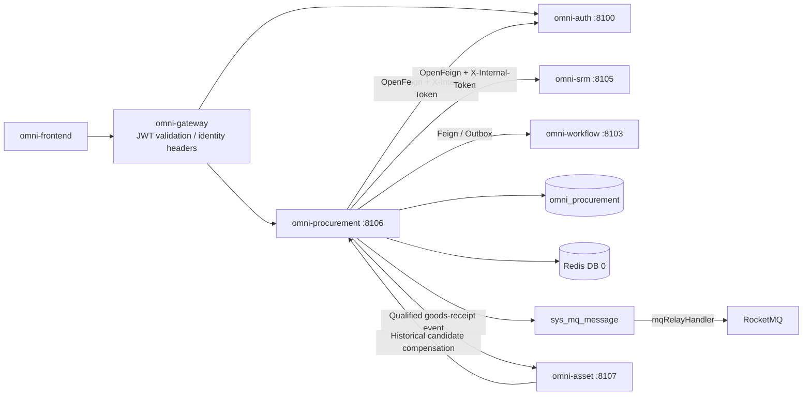
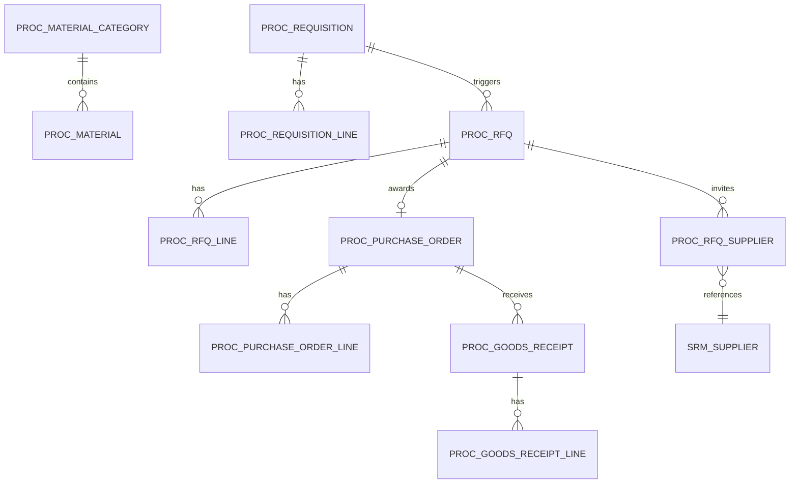
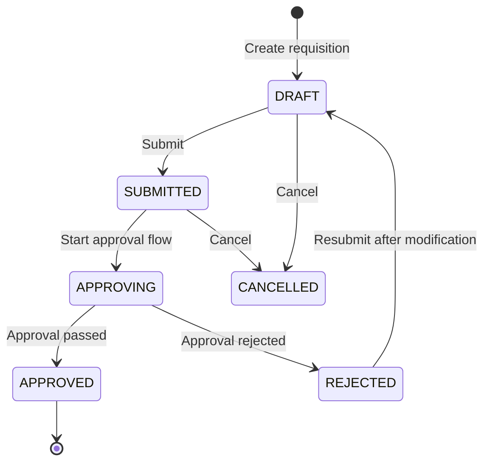
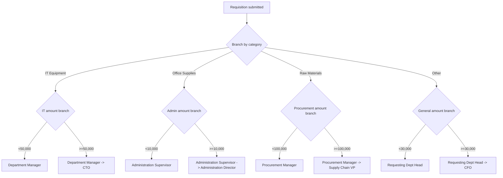
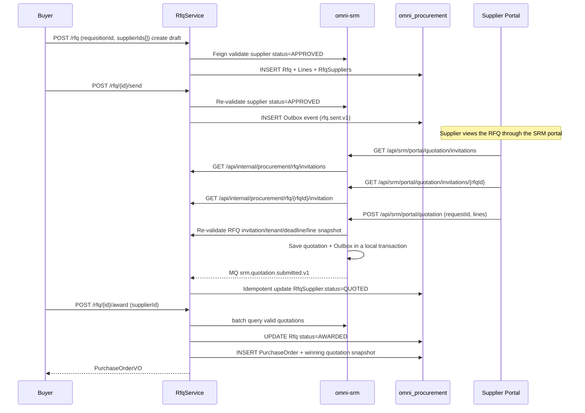
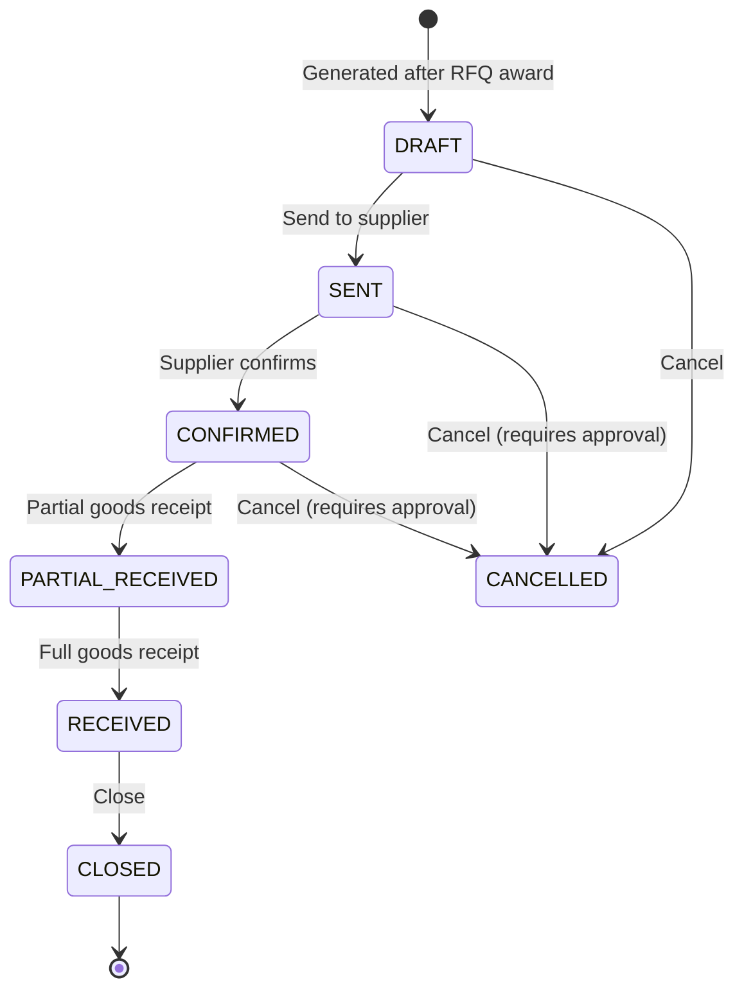
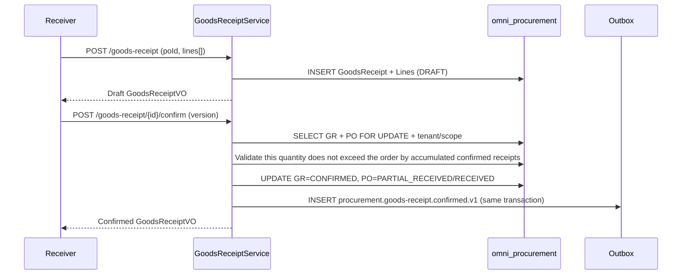

# Procurement Execution Module Architecture and Implementation Baseline

> Status: MVP implemented and verified
> Project: Omni-Stack
> Date: 2026-07-27
> Goal: Describe the architecture, cross-service contracts, and implementation boundaries of the omni-procurement MVP; the implementation entry points are `omni-backend/omni-procurement` and `omni-frontend/src/views/procurement`.

Design basis: `README.md`, and all topic documents in `docs/` — architecture, api-contract, backend-patterns, frontend-patterns, core-flows, scheduling, workflow, mq-reliability, docker-deployment; also references the SRM supplier model in `docs/design/srm-design.md`.

## 1. Design Conclusion

Procurement execution should be built as an independent Servlet microservice, separated from supplier management (`omni-srm`) and asset management (`omni-asset`). SRM is the foundation; Procurement depends on SRM's supplier data, and Asset depends on Procurement's procurement-source data.

| Item | Decision |
|---|---|
| Maven module / service name | `omni-procurement` |
| Local port / management port | `8106` / `19906` |
| XXL-JOB executor | `omni-procurement` / `9906` (when scheduled reminders are enabled) |
| Database | `omni_procurement` |
| Gateway | `/api/procurement/**` → `lb://omni-procurement`, without `StripPrefix` |
| Redis | DB 0, shares the XSS configuration written by Auth; keys use the `proc:` prefix |
| Frontend | Continue to use `omni-frontend`, add `views/procurement/**` |

The Procurement MVP covers the procurement-execution closed loop:

> Material catalog → requisition → approval → RFQ/price comparison → award → purchase order → goods-receipt confirmation.

Three-way matching (PO + goods receipt + invoice) and payment are not included in the MVP; they are left to the ERP or finance system. Contract management is introduced in Phase 2.

## 2. Product Scope

### 2.1 Users and Goals

| User | Core need |
|---|---|
| Requesting-department employee | Submit purchase requests, track requisition progress |
| Procurement staff | Manage RFQs, price comparison, ordering, and track order progress |
| Procurement manager | Approve requisitions, manage the procurement process, view procurement statistics |
| Department manager/executive | Approve requisitions (by amount threshold), view procurement spend |
| Supplier | View RFQs and submit quotations through the portal (reusing the SRM portal) |

The MVP should be able to answer: how many requisitions await approval; what step a given requisition's approval has reached; which RFQs are waiting for supplier quotations; the goods-receipt status of a given purchase order; procurement-spend statistics by category/supplier/department.

### 2.2 Phasing

| Phase | Capability |
|---|---|
| MVP | Material catalog, requisition, approval flow (category + amount multi-dimensional branching), RFQ/price comparison, purchase order, goods-receipt confirmation, procurement overview |
| Phase 2 | Contract management, reverse auction, procurement templates, framework agreements, three-way matching, supplier-performance linkage |
| Phase 3 | Procurement analytics (price trends, supplier concentration), budget control, automatic replenishment suggestions |

## 3. System Boundaries

| Component | Authoritative responsibility | How Procurement uses it |
|---|---|---|
| `omni-auth` | Tenant, user, organization, role, permission, data scope, XSS configuration | Internal OpenFeign; stores only user/organization IDs |
| `omni-srm` | Supplier data (admission, grading, risk) | Internal OpenFeign to query suppliers; supplier portal quotations go through the SRM service |
| `omni-base` | Dictionary, operation logs | Operation log aggregation |
| `omni-workflow` | BPMN, process instances, approvals, the sole Flowable engine runtime | Internal OpenFeign to start/query/cancel flows, consumes approval-result events |
| `omni-procurement` | Material, requisition, RFQ, purchase order, goods receipt | The sole business writer |
| `omni-asset` | Asset management | After goods-receipt acceptance passes, creates asset cards through Outbox events and controlled historical compensation |
| XXL-JOB | Triggers batch scans | Order-overdue reminders (Phase 2) |
| RocketMQ | Asynchronous transport | At-least-once; consumers must be idempotent |



Recommended dependencies: `omni-common-core`, `omni-common`, `omni-common-mybatis`, `omni-common-redis`, `omni-common-operlog`, `omni-common-job`, `omni-common-mqlog`, plus Web, Validation, Security, AspectJ, OpenFeign, LoadBalancer, Nacos, RocketMQ Stream, Actuator, and Lombok.

**Procurement does not depend on `omni-common-workflow` and does not embed Flowable in this service.** `omni-workflow` is an independent microservice and the sole Flowable runtime; Procurement initiates flows through an internal Feign contract and receives approval results through reliable domain events. Cross-service DTOs should live in a pure contract module or be defined locally by the Feign client, and must not introduce the Flowable Starter because of this.

## 4. Domain and Data Design

### 4.1 Aggregates

| Aggregate | Tables | Responsibility |
|---|---|---|
| ProcurementConfig | `proc_tenant_config`, `proc_approval_route` | Tenant currency and category/amount approval-model routing |
| Material | `proc_material_category`, `proc_material` | Material category tree, material catalog |
| Requisition | `proc_requisition`, `proc_requisition_line` | Requisition, detail lines; approval tasks and records are authoritatively managed by omni-workflow |
| RFQ | `proc_rfq`, `proc_rfq_line`, `proc_rfq_supplier` | RFQ, detail lines, invited suppliers |
| PurchaseOrder | `proc_purchase_order`, `proc_purchase_order_line` | Purchase order, detail lines |
| GoodsReceipt | `proc_goods_receipt`, `proc_goods_receipt_line` | Goods receipt, detail lines |



### 4.2 Common Fields and Rules

Every `proc_*` table must contain `tenant_id`. Authorizable business tables must also contain:

- `tenant_id`: tenant isolation.
- `owner_user_id`: SELF scope (requisition requester / procurement staff).
- `owner_unit_id`: DEPT/DEPT_AND_BELOW scope.
- `version`: optimistic lock.
- `deleted`: logical deletion.
- `id/create_time/update_time/create_by/update_by`: audit fields.

Constraints:

- Supplier IDs are managed by SRM; Procurement stores only `supplier_id`, without cross-database foreign keys.
- The material code `material_code` is unique within the tenant.
- The requisition number `requisition_no`, RFQ number `rfq_no`, order number `po_no`, and goods-receipt number `gr_no` are generated from database IDs and are unique within the tenant.
- Quantities and unit prices use `DECIMAL(19,6)` / `BigDecimal`; line amounts and total amounts use `DECIMAL(19,4)` / `BigDecimal`; HTTP JSON uniformly carries them as decimal strings, and computing via the JavaScript `number` type is forbidden. Currencies use ISO 4217 three-letter codes (the MVP enforces the tenant default currency).
- Times are uniformly `yyyy-MM-dd HH:mm:ss`.
- A normal PUT is not allowed to directly modify the approval status or order status.
- External requests must not use bare `selectById/updateById/deleteById`.

### 4.3 Main Tables

`proc_tenant_config`

- `tenant_id/currency_code/initialized_time/version` and audit fields, unique within the tenant.

`proc_approval_route`

- `route_code/category_code/min_amount/max_amount/model_version_id/priority/status/version/deleted` and audit fields.
- An exact category takes precedence over the `category_code='*'` default route; the interval semantics are `min_amount <= total_amount < max_amount`, with an empty max meaning no upper limit.
- Active amount intervals of the same category must not overlap; when a requisition submission matches zero or multiple routes, return 409, and the client must not pass modelVersionId.

`proc_material_category`

- `tenant_id/parent_id/category_code/category_name/sort/status/version/deleted` and audit fields.
- Supports an arbitrary-level category tree (parent_id of 0 means a top-level category); a material can only be associated with a leaf category.
- The MVP provides category-tree management on the material-catalog page; `category_code` cannot be modified after creation, and updates and deletes must carry `version` and perform a conditional update.

`proc_material`

- `tenant_id/category_id/material_code/material_name/specification/unit/asset_managed/status/version/deleted`.
- `specification` is a text description (the MVP does not do structured specification parameters).
- `unit` is a normalized uppercase unit of measure (e.g., EA, PCS, UNIT, SET, KG).
- `asset_managed` indicates whether, after qualified goods receipt, it enters Asset as "one asset card per unit"; only `EA/PCS/UNIT/SET` can be enabled, and consumables, services, and continuous-measure materials such as KG must be false.
- Indexes: tenant + category_id/status, tenant + material_code (unique).

`proc_requisition`

- `requisition_no/title/requester_user_id/requester_unit_id/reason/primary_category_code/total_amount/currency_code`.
- `status`: DRAFT/SUBMITTED/APPROVING/APPROVED/REJECTED/CANCELLED.
- `approval_attempt/workflow_request_id/workflow_business_key/workflow_model_version_id/process_instance_id`: the current approval round and the Workflow idempotency snapshot; businessKey is fixed to `{requisitionId}:{approvalAttempt}`.
- `workflow_start_status`: NOT_STARTED/PENDING/FAILED/STARTED; separated from the business status; on failure, the business status is still SUBMITTED.
- `approved_time/workflow_completed_time`: the approval-completion time snapshot; approval comments still take Workflow as authoritative, and Procurement does not copy or forge the final comment.
- `owner_user_id/owner_unit_id/version/deleted` and audit fields.

`proc_requisition_line`

- `line_no/requisition_id/material_id/material_code/material_name/category_code/unit/quantity/estimated_unit_price/estimated_total_price/remark`; the material code, name, category, and unit are all snapshots at submission time.
- The requisition total amount = SUM(line.estimated_total_price).
- The MVP enforces that all lines of one requisition belong to the same category; cross-category needs are split into multiple requisitions, avoiding uncertain single-value approval-routing semantics.

`proc_rfq`

- `rfq_no/requisition_id/title/quotation_deadline/currency_code/status/sent_time/owner_user_id/owner_unit_id/version/deleted`.
- `status`: DRAFT/SENT/CLOSED/AWARDED/CANCELLED.
- `awarded_supplier_id/awarded_quotation_id/awarded_quotation_version/awarded_time`: the award and quotation-version snapshot.
- Associated requisition (one requisition can generate multiple RFQs, split by category).

`proc_rfq_line`

- `rfq_id/line_no/material_id/material_code/material_name/category_code/unit/quantity/remark/version/deleted`, all snapshots of the requisition lines.

`proc_rfq_supplier`

- `rfq_id/supplier_id/supplier_name_snapshot/invited_time/quotation_id/quotation_version/quotation_request_id/quotation_time/status/version/deleted`.
- `status`: INVITED/QUOTED/EXPIRED/AWARDED/REJECTED. `AWARDED/REJECTED` are read-only historical terminal states after the award and cannot continue quoting.
- A quotation can be submitted or updated only when the RFQ `status=SENT`, the invitation `status IN (INVITED, QUOTED)`, and the current time is not later than the deadline.
- `quotation_id` logically associates SRM's `srm_quotation` (no cross-database foreign key); `supplier_name_snapshot` is only for historical display and is not a basis for the current supplier status or permission.

`proc_purchase_order`

- `po_no/rfq_id/supplier_id/quotation_id/quotation_version/title/total_amount/currency_code`.
- The winning quotation's supplier name, per-line unit prices, delivery dates, etc. are copied directly to the PO/PO Line to form an immutable business snapshot; quotation_id/version are only for traceability.
- `status`: DRAFT/SENT/CONFIRMED/PARTIAL_RECEIVED/RECEIVED/CLOSED/CANCELLED.
- `order_time/expected_delivery_date/actual_delivery_date`.
- `delivery_address/contact_name/contact_phone`.
- `owner_user_id/owner_unit_id/version/deleted` and audit fields.

`proc_purchase_order_line`

- `po_id/material_id/material_name/unit/quantity/unit_price/total_price/remark`.

`proc_goods_receipt`

- `gr_no/po_id/receiver_user_id/receive_time/remark/status/owner_user_id/owner_unit_id/version/deleted`.
- `status`: DRAFT/CONFIRMED.
- After confirmation, an Outbox event is triggered to notify Asset to create asset cards.

`proc_goods_receipt_line`

- `goods_receipt_id/po_line_id/material_id/material_name/unit/ordered_quantity/received_quantity/quality_status/remark`.
- `quality_status`: PASS/FAIL/PENDING.
- The received quantity may be less than or equal to the ordered quantity (partial goods receipt).

## 5. State Machine and Core Flows

### 5.1 Requisition



After the requisition is submitted, the Flowable approval flow starts. The approval flow uses an Exclusive Gateway to route to different approvers by material category and amount.

### 5.2 Approval Flow Design (integrated with omni-workflow)



Implementation:
- In `omni-workflow`, create one BPMN process model per category (e.g., `procurement_approval_it`, `procurement_approval_office`, etc.).
- Or use one generic BPMN, routing through two-level nesting of Exclusive Gateways (category → amount).
- When the requisition is submitted, the Procurement service selects a published modelVersionId from `proc_approval_route` based on the requisition's unique category and the server-recomputed total amount, and starts the flow through the Workflow internal API; the client cannot specify the model version.
- Approvers are dynamically resolved by Flowable's `ScopedRoleAssignmentListener` (using the existing organization structure + role system).

Cross-service startup must be retryable: each time it is submitted from DRAFT, first increment `approvalAttempt + 1`, generate and persist the requestId and `businessKey={requisitionId}:{approvalAttempt}`; Procurement uses `tenantId + businessType(PROCUREMENT_REQUISITION) + businessKey` as the idempotency key for the current round. First update to `status=SUBMITTED, workflow_start_status=PENDING` in a local transaction, then call Workflow after the transaction commits; on success, write the processInstanceId, set workflow_start_status=STARTED, and advance to APPROVING. When the response is lost or the call fails, keep `status=SUBMITTED, workflow_start_status=FAILED`; a retry must reuse the saved requestId/businessKey/modelVersionId and must not increment the attempt. After a REJECTED modification succeeds, it returns to DRAFT, and only resubmission opens a new attempt, avoiding the Workflow permanent-business-key unique constraint replaying an old flow.

**MVP constraint**: a single requisition allows only one category; approval routing supports an exact category and a `*` default route, and the BPMN can branch by amount. When cross-category requisitions are needed later, define an explicit primary-category or multi-flow strategy; the current version is forbidden from implicitly taking the first line.

### 5.2.1 Requisition Approval Rule Management

The management UI centers on the business name, applicable category, amount range, and flow name, and does not require business staff to enter technical codes, model version IDs,
or priority. `route_code` is generated by the server as `APR-{ULID}` and shown read-only only under advanced information; `route_name` is a required business name.
The bindable flow is fixed to the currently published version of Workflow `category=purchase`, while running instances continue to use
`businessType=PROCUREMENT_REQUISITION`; the two identifiers must not be mixed.

The list deduplicates `modelVersionId` for the current page, then uses a batch internal interface of no more than 200 items to supplement flow metadata; per-row calls are forbidden.
When Workflow is unavailable, the read-only list keeps the local rules and marks `UNAVAILABLE`; create, update, and requisition submission still fail closed.
The match test calls the same `ApprovalRouteResolver.evaluate` as requisition submission, explicitly returning a unique hit, no match, and multiple matches from historical dirty data.
Coverage analysis splits each valid category into half-open intervals from 0 to infinity, applying exact rules first, then filling gaps with the default rule;
before disabling and deleting, it excludes the target rule in memory and reuses the same algorithm to generate an impact hint.

### 5.3 RFQ/Price Comparison



Price-comparison method: the MVP provides a simple comparison view — listing the valid quotations (unit price, total price, delivery days) of invited suppliers through `GET /api/internal/quotation/batch`, and the procurement staff manually selects the awarded supplier. No automatic bid-evaluation algorithm is done. The award transaction must save the quotationId, quotation version, and an immutable amount/delivery snapshot; subsequent SRM quotation changes must not alter the existing award and purchase order.

### 5.4 Purchase Order



### 5.5 Goods Receipt



Creating a DRAFT does not occupy the order's received quantity and does not send an event. On confirmation, the PO must be locked and re-validated cumulatively based on all CONFIRMED goods-receipt lines, preventing over-receipt caused by concurrent confirmation of multiple drafts. After a successful confirmation, the Outbox event `procurement.goods-receipt.confirmed.v1` is written; when Asset is not yet built, Procurement is not blocked, but it must not be assumed that historical events stay in the Outbox/Broker indefinitely — when Asset goes live, it must perform the historical-compensation rescan defined below.

Only goods-receipt lines with `quality_status=PASS`, `asset_managed=true`, and a positive-integer receivedQuantity can be assetized. PENDING/FAIL lines, consumables, services, and continuous-measure materials do not create assets. When a PENDING line later becomes PASS through `POST /goods-receipt/{id}/quality-result`, Procurement publishes `procurement.goods-receipt.quality-passed.v1`, carrying only the lines newly passed this time; modifying or reusing an already-sent confirmed event is forbidden.

## 6. Tenant, RBAC, and Data Permissions

### 6.1 Trust Chain

Consistent with SRM: Gateway JWT → `GatewayPreAuthenticationFilter` → `ServiceIdentityFilter` (Tenant/user identity validation) → `@PreAuthorize` → `@ServiceDataScope` → MyBatis DataPermission → `ProcRecordAccessGuard`.

### 6.2 Permission Tree and Roles

Menus: `procurement` (DIRECTORY) and `procurement:overview`, `procurement:material`, `procurement:approval-route`, `procurement:requisition`, `procurement:rfq`, `procurement:purchase-order`, `procurement:goods-receipt` (MENU). Only seed MENU for pages already delivered, to avoid dead links in the dynamic sidebar.

API permissions:

- `procurement:overview:list`
- `procurement:material:list/create/update/delete`
- `procurement:approval-route:list/create/update/delete`
- `procurement:requisition:list/create/update/delete/submit/approve/cancel`
- `procurement:rfq:list/create/update/delete/send/award/cancel`
- `procurement:purchase-order:list/update/delete/send/confirm/cancel` (a purchase order is generated only by an RFQ award)
- `procurement:goods-receipt:list/create/confirm`

| Role | dataScope | Capability |
|---|---|---|
| `PROCUREMENT_MANAGER` | DEPT_AND_BELOW | Department and below, approval, statistics |
| `PROCUREMENT_STAFF` | SELF | Requisitions, RFQs, and orders they own, and the SELF-scope overview |
| `EMPLOYEE` | SELF | Submit and view their own requisitions |
| `TEAM_LEADER` | DEPT | Approvals assigned to them by Workflow and the department approval business view |
| `DEPT_LEADER` | DEPT_AND_BELOW | Approvals assigned to them by Workflow and the department-tree approval business view |
| `SUPER_ADMIN` | ALL | All functions; procurement data is still limited to the current tenant |

The default USER is not granted procurement permissions.

### 6.3 Procurement Context and SQL Interception

The common request identity, DataScope context, and aspect are provided by `omni-common-service`: `ServiceIdentityContext`, `ServiceDataScopeContext`, `@ServiceDataScope`, and `ServicePersistenceAutoConfiguration`. The procurement module keeps only the domain differences: `ProcTenantTablePolicy`, `ProcDataPermissionHandler`, and `ProcRecordAccessGuard`.

The interceptor order is fixed: `TenantLineInnerInterceptor → DataPermissionInterceptor → OptimisticLockerInnerInterceptor → PaginationInnerInterceptor`. `ProcTenantTablePolicy` enables TenantLine only on `proc_*` tables; `sys_mq_message` must be excluded to ensure the cross-tenant Outbox Relay can scan pending messages. The data-permission mapping of domain tables is still defined by `ProcDataPermissionHandler` per the table below.

| dataScope | Condition |
|---|---|
| SELF | `requester_user_id = currentUserId` or `owner_user_id = currentUserId` |
| DEPT | `requester_unit_id = primaryUnitId` |
| DEPT_AND_BELOW / CUSTOM | `requester_unit_id IN accessibleUnitIds` |
| TENANT / ALL | No owner condition added; TenantLine is always retained |

The table above only describes scope semantics; the actual SQL must be mapped per table, and mechanically appending `requester_user_id OR owner_user_id` to all `proc_*` tables is forbidden:

| Resource/table | SELF column | DEPT/CUSTOM column | Sub-resource constraint |
|---|---|---|---|
| Requisition | `requester_user_id` | `requester_unit_id` | Line inherits through the requisition_id of the same tenant |
| RFQ | `owner_user_id` | `owner_unit_id` | Line/Supplier inherit through the rfq_id of the same tenant |
| PurchaseOrder | `owner_user_id` | `owner_unit_id` | Line inherits through the po_id of the same tenant |
| GoodsReceipt | `owner_user_id` (goods-receipt owner) | `owner_unit_id` | Line inherits through the goods_receipt_id of the same tenant |
| Material/Category | No SELF private semantics | Controlled by functional permission, shared within the tenant | TenantLine is always retained |
| Overview | Mapped by the current permissionCode to the corresponding business table's owner/requester column | Same as left | Aggregate SQL must apply the same scope as the list |

### 6.4 Approval Flow Permissions

Requisition approval is driven by the independent `omni-workflow`, and approvers are dynamically resolved by `ScopedRoleAssignmentListener`. The user completes the task at Workflow's `/api/workflow/approval/{taskId}/complete`; Workflow must validate both the functional permission and the current task candidate/assignee identity.

`TEAM_LEADER/DEPT_LEADER/PROCUREMENT_MANAGER` undertaking requisition approval must simultaneously obtain `procurement:requisition:approve` (to read the dedicated business approval VO) and `workflow:approval:complete` (to complete their own Workflow task). Neither can be missing; tenant initialization and role seeds must maintain them in sync.

When viewing the business form, an approver uses the `procurement:requisition:approve` permission, but the approval visibility scope is not limited by the normal requester/owner dataScope. To avoid forming a generic bypass, Procurement provides a dedicated `GET /api/procurement/requisition/{id}/approval-view?taskId={taskId}`: first validate through the Workflow internal API that the taskId belongs to the current tenant, the businessKey equals that requisitionId, and the task is assigned to the current user, then read the read-only approval VO by `tenant_id + id`. The normal detail interface still enforces DataPermission; reusing this exception is forbidden.

## 7. API Design

### 7.1 Common Contract

Consistent with SRM: `R<T>`, `R<PageResult<T>>`, `page=1`, `size=10`, `size <= 100`.

### 7.2 Endpoints

| Domain | Endpoints |
|---|---|
| Overview | `GET /api/procurement/overview/summary`, `/spend-analysis` |
| Material Category | `GET /material/category/list`, `POST /material/category`, `PUT/DELETE /material/category/{id}`; both the update body and delete query carry `version` |
| Material | `GET /material/list`, `GET /material/{id}`, `POST /material`, `PUT/DELETE /material/{id}`; both the update body and delete query carry `version` |
| Approval Route | `GET /approval-route/list`, `POST /approval-route`, `PUT/DELETE /approval-route/{id}` |
| Requisition | `GET /requisition/list`, `GET /requisition/{id}`, `POST /requisition`, `PUT/DELETE /requisition/{id}` |
| Requisition approval view | `GET /requisition/{id}/approval-view?taskId={taskId}` (validates the Workflow task assignment first) |
| Requisition commands | `POST /requisition/{id}/submit`, `/retry-start`, `/cancel` |
| RFQ | `GET /rfq/list`, `GET /rfq/{id}`, `POST /rfq`, `PUT/DELETE /rfq/{id}` |
| RFQ commands | `POST /rfq/{id}/send`, `/award`, `/cancel` |
| Purchase Order | `GET /purchase-order/list`, `GET /purchase-order/{id}`, `POST /purchase-order`, `PUT/DELETE /purchase-order/{id}` |
| PO commands | `POST /purchase-order/{id}/send`, `/confirm`, `/cancel` |
| Goods Receipt | `GET /goods-receipt/list`, `GET /goods-receipt/{id}`, `POST /goods-receipt` |
| GR commands | `POST /goods-receipt/{id}/confirm`, `/quality-result` |

The Overview summary fixedly returns the number of requisitions under approval, the number of `SENT` RFQs that still have `INVITED` suppliers within the deadline,
the counts of each purchase-order status, the number of goods-receipt drafts, and the confirmed procurement commitment amount grouped by `currencyCode`.
Procurement commitment and spend count only `CONFIRMED/PARTIAL_RECEIVED/RECEIVED/CLOSED` orders, excluding
`DRAFT/SENT/CANCELLED`. The `dimension` of `spend-analysis` supports
`CATEGORY/SUPPLIER/DEPARTMENT`, where DEPARTMENT means the purchase order's `owner_unit_id`;
results are sorted first by currency, then by amount descending, and `limit` ranges from 1–100. No interface may sum directly across currencies.

### 7.3 Endpoint to DataScope Permission Mapping

| Operation | permissionCode |
|---|---|
| Overview | `procurement:overview:list` |
| Material list/detail | `procurement:material:list` |
| Material create/update/delete | `procurement:material:create/update/delete` |
| Approval route list/create/update/delete | `procurement:approval-route:list/create/update/delete` |
| Requisition list/detail | `procurement:requisition:list` |
| Requisition create/update/delete | `procurement:requisition:create/update/delete` |
| Requisition submit | `procurement:requisition:submit` |
| Requisition retry-start | `procurement:requisition:submit` |
| Requisition approve | `procurement:requisition:approve` |
| Requisition cancel | `procurement:requisition:cancel` |
| RFQ list/detail | `procurement:rfq:list` |
| RFQ create/update/delete/send/award/cancel | `procurement:rfq:create/update/delete/send/award/cancel` |
| PO list/detail | `procurement:purchase-order:list` |
| PO update/delete/send/confirm/cancel | `procurement:purchase-order:update/delete/send/confirm/cancel` (no external create; an order is generated only by an RFQ award) |
| GR list/detail | `procurement:goods-receipt:list` |
| GR create/confirm/quality-result | `procurement:goods-receipt:create/confirm` (quality-result reuses the confirm permission) |

## 8. Cross-Service Consistency

### 8.1 Auth Feign

Consistent with SRM: store only userId/unitId, and validate before assignment that the user exists, is enabled, and is in the same tenant. Lists batch-enrich; N+1 is forbidden.

### 8.2 SRM Feign

Procurement obtains supplier data through the SRM internal API:

- `GET /api/internal/supplier/{id}?tenantId={tenantId}`: get the supplier summary.
- `GET /api/internal/supplier/search?tenantId={tenantId}&status=APPROVED&categoryCode={code}`: search qualified suppliers.
- `GET /api/internal/quotation/batch?tenantId={tenantId}&rfqId={rfqId}`: return the valid quotations, versions, and complete line snapshots of invited suppliers, for price comparison and the award snapshot.
- When creating an RFQ, validate the supplier status is APPROVED and it is not blacklisted.
- When displaying supplier names in a list, collect supplier_id and then do one batch Feign.

Procurement also provides two kinds of internal read-only interfaces to SRM:

- `GET /api/internal/procurement/rfq/invitations?supplierId={supplierId}`: return the current supplier's invitation list, containing at least `rfqId/rfqNo/title/status/invitationStatus/quotationDeadline/currencyCode/invitedTime`.
- `GET /api/internal/procurement/rfq/{rfqId}/invitation?supplierId={supplierId}`: return the invitation detail and the RFQ line snapshot, with lines containing at least `rfqLineId/materialCode/materialName/unit/quantity/remark`.

SRM must call these interfaces with the supplierId obtained from the PortalUser association, not the supplierId passed in the portal request. Before submission, re-validate that the RFQ `status=SENT`, the invitation `status IN (INVITED, QUOTED)`, and the quotationDeadline is not exceeded; the quotation `validUntil` must not be earlier than the quotationDeadline, and the submitted rfqLineId set must exactly match the detail. After SRM saves the quotation, it publishes `srm.quotation.submitted.v1`; Procurement consumes it idempotently by eventId Inbox and updates its own `proc_rfq_supplier`; SRM must not write Procurement tables across databases.

All the above internal interfaces uniformly use the `/api/internal/**` prefix and require `X-Internal-Token` and `X-Tenant-Id`; if an interface also carries a query/body tenant, it must be consistent with the header tenant. The Gateway does not forward this prefix.

When SRM is unavailable:
- Supplier display: may return ID/unknown supplier.
- RFQ/ordering: cannot continue, return 503.

### 8.3 Workflow Integration

Procurement does not embed Flowable and integrates through the Workflow internal API protected by `X-Internal-Token`. The requisition approval flow:

1. Procurement conditionally updates the requisition to SUBMITTED, then calls Workflow `POST /api/internal/workflow/process-instance/start` after the transaction commits.
2. The request contains the persisted `requestId`, `tenantId`, `modelVersionId`, `businessType=PROCUREMENT_REQUISITION`, `businessKey={requisitionId}:{approvalAttempt}`, `startUserId`, and variables.
3. `variables` contains `requisitionId`, `approvalAttempt`, `materialCategory` (the unique category code), `totalAmount` (the total amount as a decimal string), and `requesterUnitId` (the requesting department); Workflow starts the instance by the published BPMN corresponding to modelVersionId.
4. Workflow builds a unique idempotency constraint on `tenantId + businessType + businessKey`; a duplicate request returns the existing processInstanceId.
5. Procurement saves the processInstanceId and advances the status to APPROVING. On timeout or a lost response, it retries with the same requestId/businessKey.
6. After approval ends, Workflow publishes `workflow.process.completed.v1` in a local transaction, carrying eventId, tenantId, businessType, businessKey, processInstanceId, result, and completedTime.
7. Procurement consumes idempotently by the Inbox unique key, updating to APPROVED, REJECTED, or CANCELLED only when tenant/businessKey (including the current attempt)/processInstanceId all match and the current status is APPROVING, and sends a procurement domain event. If the completion event arrives before the local `markStarted`, it must throw a retryable exception and must not mark the Inbox as processed; an old-attempt event is only idempotently ignored.

The workflow integration follows the specification in `docs/workflow.md`:
- `model_key` is unique within the tenant.
- Start the flow through `processDefinitionId`, not `processKey`.
- Process-instance traceability fields are recorded in `wf_process_instance_ext`.
- Flowable tables and runtime exist only in the `omni-workflow` database; Procurement does not depend on `omni-common-workflow`.
- Do not use the undefined and unreliable synchronous `WorkflowCallbackService`; approval results are delivered through Workflow Outbox events.

### 8.4 Asset Linkage

After goods-receipt confirmation, the Outbox event `procurement.goods-receipt.confirmed.v1` is written. The event payload contains:

```json
{
  "eventId": "018f...uuid",
  "eventType": "procurement.goods-receipt.confirmed.v1",
  "occurredAt": "2026-07-13 10:30:00",
  "tenantId": 1,
  "payload": {
    "goodsReceiptId": 301,
    "grNo": "GR202607130001",
    "purchaseOrderId": 201,
    "poNo": "PO202607100001",
    "supplierId": 101,
    "supplierNameSnapshot": "Acme Technology",
    "purchaseDate": "2026-07-13 10:30:00",
    "currencyCode": "CNY",
    "ownerUserId": 1001,
    "ownerUnitId": 2001,
    "lines": [
      {
        "goodsReceiptLineId": 401,
        "purchaseOrderLineId": 501,
        "materialId": 601,
        "materialCode": "IT-NB-001",
        "materialNameSnapshot": "ThinkPad X1 Carbon",
        "categoryCode": "IT_DEVICE",
        "unit": "PCS",
        "receivedQuantity": "5.000000",
        "qualityStatus": "PASS",
        "assetManaged": true,
        "assetQuantity": 5,
        "unitPrice": "12000.000000",
        "totalPrice": "60000.0000"
      }
    ]
  }
}
```

`ownerUserId/ownerUnitId` are the indispensable snapshot of the goods-receipt management ownership; Asset inherits them directly as the manager and management department of the new asset. They must not be guessed from the supplier portal user or the message-consumption thread identity. Quantity, unit price, and amount follow the Procurement decimal-string contract; only the integer count `assetQuantity` uses a JSON number.

`omni-asset` creates asset cards by `assetQuantity` only for lines that meet the assetization conditions. Real-time events use the
`consumerName + eventId` Inbox unique key for idempotency; real-time consumption and historical rescan jointly use the
`tenantId + goodsReceiptLineId + unitSequence` asset-source unique key as a fallback; when the same idempotency key binds a different complete business intent, return a conflict and do not silently overwrite.

The Outbox only guarantees reliable event delivery to the Broker; once a message is sent successfully it enters SENT, and it is not guaranteed to be retained indefinitely for a consumer not yet deployed. When Asset goes live, it must perform a compensation rescan: read all confirmed and assetizable historical goods-receipt lines through the paginated `GET /api/internal/procurement/goods-receipt/asset-candidates?tenantId={tenantId}&afterId={id}&size={size}`, and backfill by the same idempotency key. Real-time consumption and historical rescan can run in parallel; the Inbox unique constraint guarantees no duplication.

### 8.5 Outbox Events

- `procurement.requisition.submitted.v1`
- `procurement.requisition.approved.v1`
- `procurement.requisition.rejected.v1`
- `procurement.rfq.sent.v1`
- `procurement.rfq.awarded.v1`
- `procurement.purchase-order.created.v1`
- `procurement.purchase-order.confirmed.v1`
- `procurement.goods-receipt.confirmed.v1`
- `procurement.goods-receipt.quality-passed.v1`

## 9. Privacy, Operation Logs, and XSS

### 9.1 OperLog Masking

Reuses the existing PII masking capability. Fields Procurement needs to mask:

- Delivery address (`delivery_address`)
- Contact mobile number (`contact_phone`)

### 9.2 PII

- The delivery address and contact mobile number are masked by default on the list page.
- Details are shown by permission.
- When printing/exporting a purchase order (Phase 2), full values are needed, using a separate permission.

### 9.3 XSS

Procurement obtains the XSS configuration through `omni-common-service`'s `CachedServiceXssConfigProvider`, no longer re-implementing a module-level `XssConfigProvider`. The configuration first reads Redis DB 0 and falls back to Auth on a cache miss; when Auth is unavailable and there is no cache, it uses the safe baseline to continue filtering. MVP remarks allow plain text only.

## 10. Frontend Design

```text
omni-frontend/src/
├── api/
│   ├── procurement-overview.ts
│   ├── procurement-material.ts
│   ├── procurement-requisition.ts
│   ├── procurement-rfq.ts
│   ├── procurement-purchase-order.ts
│   └── procurement-goods-receipt.ts
├── views/procurement/
│   ├── overview/index.vue           # Procurement overview + spend analysis
│   ├── material/index.vue           # Material catalog management
│   ├── requisition/index.vue        # Requisition management
│   ├── rfq/index.vue                # RFQ management
│   ├── purchase-order/index.vue     # Purchase order management
│   └── goods-receipt/index.vue      # Goods receipt management
└── components/procurement/
    ├── RequisitionForm.vue          # Requisition form (with dynamic line add/remove)
    ├── RfqCompareView.vue           # Price comparison view (multi-supplier quotation comparison table)
    ├── PurchaseOrderTracker.vue     # Order progress tracker
    └── GoodsReceiptForm.vue         # Goods receipt form (with quality status)
```

- `ApiResponse/PageResult` are imported only from `src/types/api.ts`.
- The requisition form supports dynamic add/remove of detail lines (add/remove material lines).
- The price-comparison view uses an Element Plus table to compare each supplier's quotation side by side.
- The Workflow to-do list itself does not carry the Procurement businessKey; when opening a task, first call `/api/workflow/task/{taskId}/form`, read `businessType/requisitionId` from variables, then load the Procurement `approval-view`. When the business form fails to load or the task-assignment validation fails, submitting the approval must be forbidden.
- `router/index.ts` and the `layout/index.vue` iconMap add Procurement.
- `constants/menu.ts`, `zh-CN.ts`, and `en-US.ts` are synchronized.

## 11. Engineering Landing Points

### 11.1 New Module

```text
omni-backend/omni-procurement/
├── pom.xml
└── src/main/
    ├── java/com/omni/procurement/
    │   ├── ProcurementApplication.java
    │   ├── client/ config/ controller/ dto/ entity/
    │   ├── mapper/ security/ service/ service/impl/
    │   └── workflow/                    # Workflow Feign client and approval-result event consumer
    └── resources/
        ├── application.yml
        ├── application-dev.yml
        └── mapper/
```

`ProcurementApplication` uses `@EnableDiscoveryClient`, `@EnableFeignClients(basePackages="com.omni.procurement.client")`, and `@MapperScan("com.omni.procurement.mapper")`.

### 11.2 Files That Must Change

| File | Change |
|---|---|
| `omni-backend/pom.xml` | Add `omni-procurement` |
| Gateway `application.yml` | Explicit `/api/procurement/**` route |
| `docker/backend/Dockerfile` | POM cache layer |
| `docker-compose.yml` | Procurement service, 8106 |
| `start.bat/start.sh` | Add Procurement to the build list |
| `database/changelog/procurement/` | Add forward-only Liquibase changeSets for procurement structure changes |
| `scripts/sql/seed/procurement.sql` | Formal idempotent seed for material categories, etc.; refresh the seed manifest after updating |
| `scripts/sql/seed/auth.sql` | Formal idempotent seed for procurement permissions and roles; refresh the seed manifest after updating |
| Procurement `TenantModuleProvisioner` | Idempotent initialization of the new tenant's 13 material classifications |
| `omni-workflow` | Add the idempotent internal start/task-assignment validation API and the `workflow.process.completed.v1` Outbox event |
| `docs/workflow.md` | Supplement the cross-service idempotent start, result events, and procurement approval flow model description |
| Frontend router/layout/menu/locales | Icons, menus, i18n |

Configuration points: server 8106, management 19906, Redis DB 0, XXL appname `omni-procurement`/port 9906.

## 12. Non-Functional Design

### Performance

- All lists are paginated, maximum 100.
- Supplier names are batch-enriched once; N+1 is forbidden.
- Overview statistics use Mapper-layer aggregate SQL (procurement spend `GROUP BY` category/supplier/owning department and currency);
  each aggregate root continues to apply the same requester/owner DataScope as its list, and cross-currency summing and per-record queries are forbidden.

### Concurrency and Idempotency

- Requisition submission → approval-flow start: local-status conditional update + Workflow's `tenantId + businessType + businessKey` unique idempotency; retry with the same requestId on timeout.
- Goods-receipt quantity validation: `received_quantity <= ordered_quantity - already_received`, using an optimistic lock.
- RFQ award: version optimistic lock + RFQ status validation.
- Portal quotation submission: SRM uses a permanent request-history table for idempotency by `(tenantId, requestId)`, requestHash to prevent the same key with a different intent, and constrains a unique valid quotation by `(tenantId, rfqId, supplierId)`; a replay of the same intent returns the current snapshot without re-publishing the event.
- Quotation events and approval-result events: each consumes idempotently by the Inbox eventId unique key; an old quotationVersion of the same quotationId must not overwrite a newer version.

### Degradation

- SRM unavailable: supplier display degrades to ID; RFQ/ordering is rejected (503).
- Workflow unavailable: the submission interface returns 503, and the requisition keeps the retryable state `status=SUBMITTED, workflow_start_status=FAILED`; approval must not be skipped, nor the flow started duplicately.
- Auth unavailable: 503 fail-closed.
- RocketMQ unavailable: the Outbox commits, and the Relay backfills later.

## 13. Testing and Acceptance

Minimum test set:

- Requisition state-machine legal/illegal transitions.
- Requisition approval-flow start and result consumption (mock the Workflow Feign/MQ; do not start Flowable in the Procurement tests).
- When approval-result events are duplicate, out-of-order, or have mismatched tenant/businessKey/processInstanceId, the requisition is not wrongly updated.
- An approver can read the approval-view only through a taskId assigned to themselves, and cannot use this interface to read an arbitrary requisition.
- Correctness of the approval flow routing by amount branch.
- RFQ award generates a purchase order.
- Idempotent consumption of the SRM quotation event; SRM cannot directly update Procurement tables.
- Modifying the SRM quotation after the award does not affect the saved winning snapshot and purchase order.
- The goods-receipt quantity does not exceed the order quantity.
- Partial goods-receipt accumulation is correct.
- Creating a DRAFT does not update the PO's received quantity and sends no event; only on confirmation does it lock the PO, validate cumulatively, and deliver.
- When two drafts, each individually valid but together over-receiving, are confirmed concurrently, only one succeeds.
- A PENDING quality check turning to PASS publishes a quality-passed event only for the newly passed lines; a duplicate submission does not assetize duplicately.
- Non-asset materials, failed/pending quality checks, and non-integer continuous-measure receipts do not generate asset candidates.
- Asset real-time consumption and historical-compensation rescan running in parallel do not create duplicate assets.
- Cross-tenant isolation.
- Fail-closed when tenant/scope is missing.
- Outbox event write integrity.

End-to-end acceptance: create material → submit requisition → approval passed → create RFQ → invite suppliers → supplier quotation → price comparison and award → generate purchase order → goods-receipt confirmation → Outbox event sent.

## 14. Implementation Order

### Milestone 0: Prerequisite Confirmation

- Confirm SRM is built and the supplier internal API is available.
- Confirm the Workflow service is available and the Flowable engine is normal.
- Confirm the Workflow internal start/task-validation API and the `workflow.process.completed.v1` event contract are ready; Procurement does not introduce `omni-common-workflow`.

### Milestone 1: Service Setup + Security Foundation

- Create the module, configuration, Gateway, Docker, DB.
- TenantLine + DataPermission + Pagination.
- Permission tree, Procurement roles, existing-tenant migration.
- Frontend root menu.

### Milestone 2: Material Catalog

- Category tree (arbitrary levels) and material CRUD.
- Material code unique within the tenant.

### Milestone 3: Requisition + Approval Flow

- Requisition CRUD (including dynamic add/remove of detail lines).
- Requisition submission → Flowable approval-flow start.
- Idempotent consumption of approval-result events → requisition status update.
- BPMN process-model creation (routed by category + amount).

### Milestone 4: RFQ/Price Comparison + Purchase Order

- RFQ CRUD + invite suppliers.
- Price-comparison view (manual award).
- Purchase-order generation + status tracking.

### Milestone 5: Goods Receipt + Production Hardening

- Goods-receipt confirmation (including quality status).
- Partial goods receipt.
- Outbox events (goods-receipt confirmation → Asset linkage).
- Asset historical-compensation rescan internal API.
- Overview statistics.
- Testing, indexes, security acceptance.
- Update docs/, AGENTS.md.

## 15. ADR Summary

| Decision | Choice | Reason |
|---|---|---|
| Service | Independent `omni-procurement` | Separated from SRM/Asset, clear responsibilities |
| Workflow integration | Independent `omni-workflow` internal API + approval-result events | Keeps Flowable as the sole runtime and preserves database boundaries |
| Approval routing | Exclusive Gateway by category + amount | Multi-dimensional approval decisions, extensible |
| Price-comparison method | Manual award | The MVP does not do automatic bid evaluation |
| Goods receipt → Asset | Outbox real-time event + historical-compensation rescan | Decoupled and does not rely on the Broker retaining messages permanently for future consumers |
| Supplier data | Feign call to SRM | Does not read SRM data across databases |
| Three-way matching | Not done | Left to the ERP/finance system |
| MVP category management | Frontend management UI already opened | Supports self-maintenance of an arbitrary-level category tree |

## 16. Main Risks

| Priority | Risk | Handling |
|---|---|---|
| P0 | Workflow unavailability or a lost response causes a half-started/duplicate approval start | 503 + SUBMITTED/FAILED retryable start status + cross-service business-key idempotency |
| P0 | SRM unavailability prevents RFQ/ordering | 503 rejects the operation, does not bypass supplier validation |
| P0 | Write operations bypass query data permissions | AccessGuard + conditional update |
| P1 | The approval-flow BPMN is too complex | The MVP first uses a single amount dimension, then adds category later |
| P1 | Over-receipt of goods-receipt quantity | Optimistic lock + quantity validation |
| P0 | The SRM portal writes RFQ status across databases | SRM quotation event + Procurement Inbox consumption; cross-database writes are forbidden |
| P1 | Asset not ready causes historical goods receipts to be missed for consumption | Real-time Outbox + paginated compensation rescan after Asset goes live |
| P2 | The number of category approval branches expands | Reserve a generic approval template + make it configurable |
