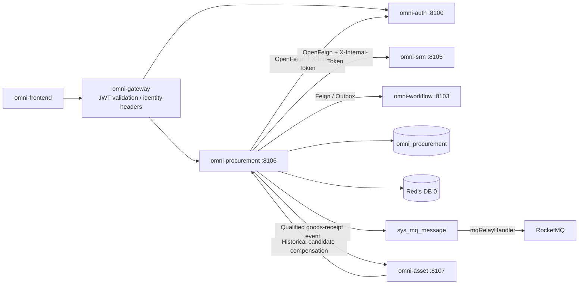
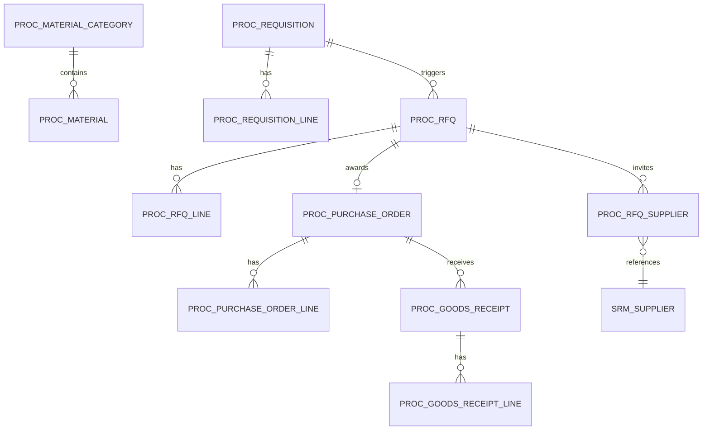
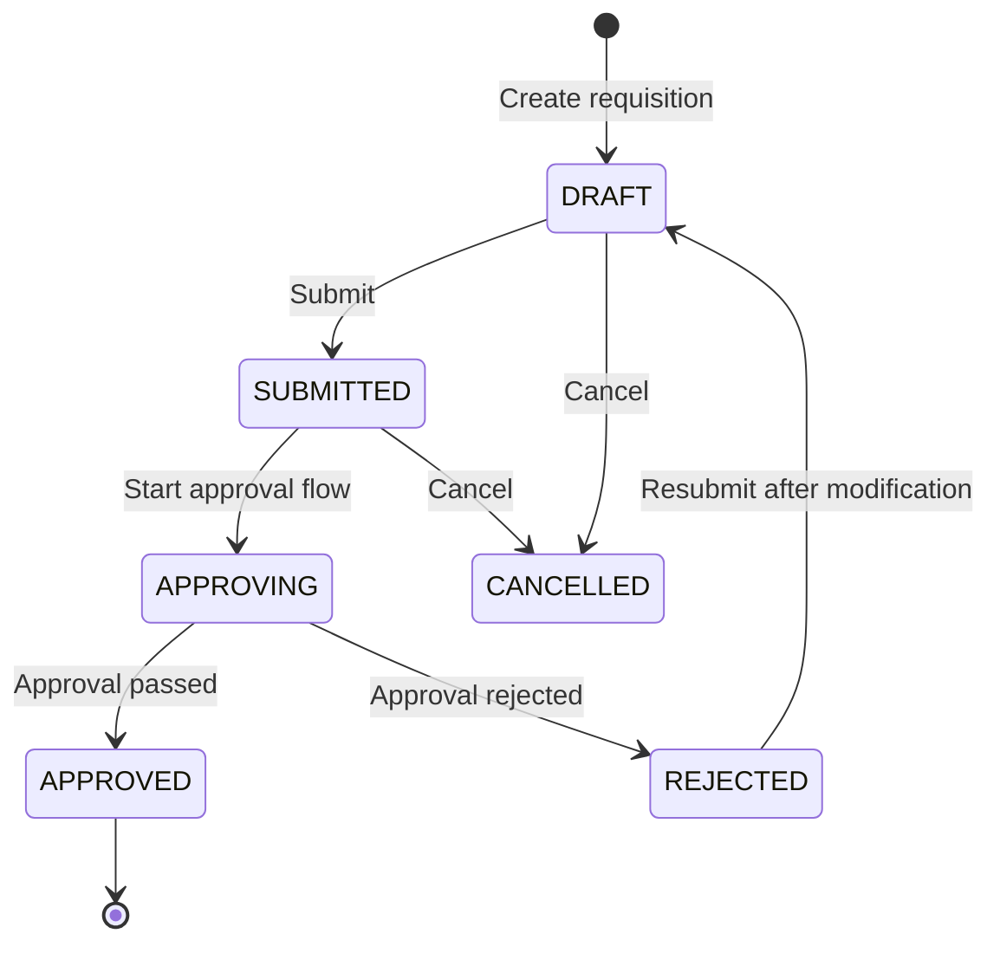
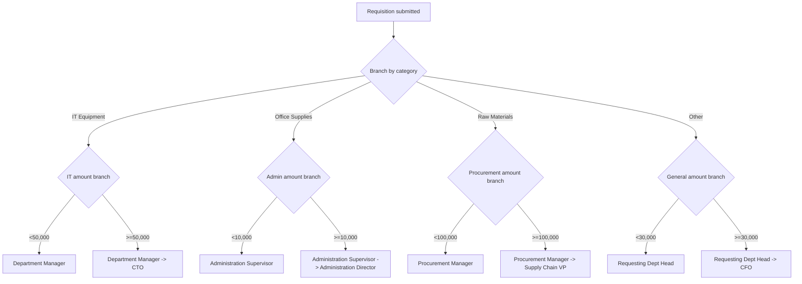
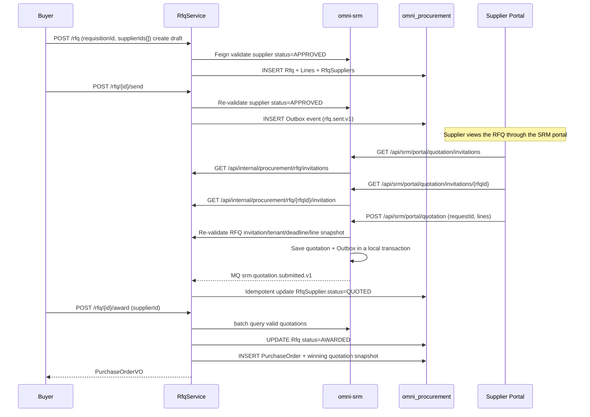
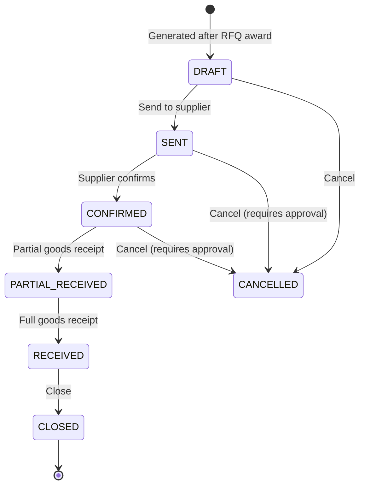
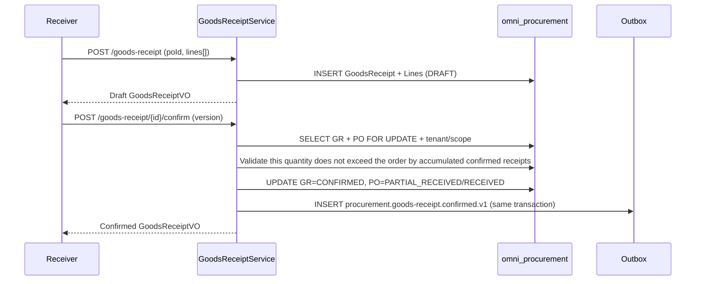

# 調達実行モジュール アーキテクチャと実装ベースライン

> 状態：MVP 実装済み・検証完了
> プロジェクト：Omni-Stack
> 日付：2026-07-27
> 目標：omni-procurement MVP のアーキテクチャ、サービス横断契約、実装境界を説明する。実装入口は `omni-backend/omni-procurement` と `omni-frontend/src/views/procurement`。

設計根拠：`README.md`、および `docs/` 内の architecture、api-contract、backend-patterns、frontend-patterns、core-flows、scheduling、workflow、mq-reliability、docker-deployment の全トピックドキュメント。同時に `docs/design/srm-design.md` の SRM サプライヤーモデルを参照。

## 1. 設計結論

調達実行は独立した Servlet マイクロサービスとして構築し、サプライヤー管理（`omni-srm`）と資産管理（`omni-asset`）から分離すべきである。SRM は土台で、Procurement は SRM のサプライヤーデータに依存し、Asset は Procurement の調達ソースデータに依存する。

| 項目 | 決定 |
|---|---|
| Maven モジュール / サービス名 | `omni-procurement` |
| ローカルポート / 管理ポート | `8106` / `19906` |
| XXL-JOB 実行体 | `omni-procurement` / `9906`（定期リマインド有効時） |
| データベース | `omni_procurement` |
| Gateway | `/api/procurement/**` → `lb://omni-procurement`、`StripPrefix` は使用しない |
| Redis | DB 0、Auth が書き込む XSS 設定を共有；キーは `proc:` プレフィックスを使用 |
| フロントエンド | 引き続き `omni-frontend` を使用し、`views/procurement/**` を新設 |

Procurement MVP は調達実行の閉ループをカバーする：

> 資材カタログ → 購買申請 → 承認 → RFQ/価格比較 → 選定 → 購買注文 → 入庫確認。

三-way マッチング（PO + 入庫伝票 + 請求書）と支払は MVP に含めず、ERP または財務システムに残す。契約管理は Phase 2 で導入する。

## 2. 製品範囲

### 2.1 ユーザーと目標

| ユーザー | コアニーズ |
|---|---|
| 要求部門の従業員 | 購買申請を提出し、購買申請の進捗を追跡 |
| 調達担当 | RFQ、価格比較、発注を管理し、注文進捗を追跡 |
| 調達マネージャー | 購買申請を承認し、調達プロセスを管理し、調達統計を閲覧 |
| 部門マネージャー/役員 | 購買申請を承認（金額閾値別）し、調達支出を閲覧 |
| サプライヤー | ポータルで RFQ を閲覧し見積を提出（SRM ポータルを再利用） |

MVP は次に答えられるべきである：承認待ちの購買申請がどれだけあるか；ある購買申請の承認がどの段階まで進んだか；どの RFQ がサプライヤーの見積を待っているか；ある購買注文の入庫状態；品目/サプライヤー/部門別の調達支出統計。

### 2.2 フェーズ分け

| フェーズ | 能力 |
|---|---|
| MVP | 資材カタログ、購買申請、承認フロー（品目+金額の多次元分岐）、RFQ/価格比較、購買注文、入庫確認、調達オーバービュー |
| Phase 2 | 契約管理、リバースオークション、調達テンプレート、フレームワーク契約、三-way マッチング、サプライヤー業績連動 |
| Phase 3 | 調達分析（価格トレンド、サプライヤー集中度）、予算統制、自動補充提案 |

## 3. システム境界

| コンポーネント | 権威的責務 | Procurement の利用方式 |
|---|---|---|
| `omni-auth` | テナント、ユーザー、組織、ロール、権限、データ範囲、XSS 設定 | 内部 OpenFeign；ユーザー/組織 ID のみ保存 |
| `omni-srm` | サプライヤーデータ（参入、グレーディング、リスク） | 内部 OpenFeign でサプライヤーを照会；サプライヤーポータル見積は SRM サービス経由 |
| `omni-base` | 辞書、操作ログ | 操作ログ集約 |
| `omni-workflow` | BPMN、プロセスインスタンス、承認、Flowable エンジンの唯一の実行時 | 内部 OpenFeign でフローを起動/照会/取消し、承認結果イベントを消費 |
| `omni-procurement` | 資材、購買申請、RFQ、購買注文、入庫 | 唯一のビジネス書き込み側 |
| `omni-asset` | 資産管理 | 入庫検収通過後、Outbox イベントと制御された履歴補償で資産カードを作成 |
| XXL-JOB | バッチスキャンのトリガー | 注文期限超過リマインド（Phase 2） |
| RocketMQ | 非同期輸送 | 少なくとも一度；コンシューマーは冪等でなければならない |



推奨依存：`omni-common-core`、`omni-common`、`omni-common-mybatis`、`omni-common-redis`、`omni-common-operlog`、`omni-common-job`、`omni-common-mqlog`、および Web、Validation、Security、AspectJ、OpenFeign、LoadBalancer、Nacos、RocketMQ Stream、Actuator、Lombok。

**Procurement は `omni-common-workflow` に依存せず、本サービスに Flowable を埋め込まない。** `omni-workflow` は独立マイクロサービスであり Flowable の唯一の実行時である；Procurement は内部 Feign 契約でフローを発起し、信頼できるドメインイベントで承認結果を受信する。サービス横断 DTO は純粋な契約モジュールに置くか Feign クライアントでローカルに定義し、これによって Flowable Starter を導入してはならない。

## 4. ドメインとデータ設計

### 4.1 アグリゲート

| アグリゲート | テーブル | 責務 |
|---|---|---|
| ProcurementConfig | `proc_tenant_config`、`proc_approval_route` | テナント通貨と品目/金額承認モデルのルーティング |
| Material | `proc_material_category`、`proc_material` | 資材品目ツリー、資材カタログ |
| Requisition | `proc_requisition`、`proc_requisition_line` | 購買申請、明細行；承認タスクと記録は omni-workflow が権威的に管理 |
| RFQ | `proc_rfq`、`proc_rfq_line`、`proc_rfq_supplier` | RFQ、明細行、招待サプライヤー |
| PurchaseOrder | `proc_purchase_order`、`proc_purchase_order_line` | 購買注文、明細行 |
| GoodsReceipt | `proc_goods_receipt`、`proc_goods_receipt_line` | 入庫伝票、明細行 |



### 4.2 共通フィールドとルール

すべての `proc_*` テーブルは `tenant_id` を含まなければならない。認可可能なビジネステーブルはさらに次を含める必要がある：

- `tenant_id`：テナント分離。
- `owner_user_id`：SELF 範囲（購買申請者 / 調達担当）。
- `owner_unit_id`：DEPT/DEPT_AND_BELOW 範囲。
- `version`：楽観ロック。
- `deleted`：論理削除。
- `id/create_time/update_time/create_by/update_by`：監査フィールド。

制約：

- サプライヤー ID は SRM が管理し、Procurement は `supplier_id` のみ保存、クロス DB 外部キーを作らない。
- 資材番号 `material_code` はテナント内でユニーク。
- 購買申請番号 `requisition_no`、RFQ 番号 `rfq_no`、注文番号 `po_no`、入庫伝票番号 `gr_no` はデータベース ID から生成し、テナント内でユニーク。
- 数量と単価は `DECIMAL(19,6)` / `BigDecimal`、行金額と総金額は `DECIMAL(19,4)` / `BigDecimal` を使用；HTTP JSON は一律に十進文字列で受け渡し、JavaScript の `number` による計算を禁止。通貨は ISO 4217 三桁コードを使用（MVP はテナントデフォルト通貨を強制）。
- 時刻は `yyyy-MM-dd HH:mm:ss` に統一。
- 通常の PUT では承認状態、注文状態を直接変更できない。
- 外部リクエストは素の `selectById/updateById/deleteById` を使用してはならない。

### 4.3 主要テーブル

`proc_tenant_config`

- `tenant_id/currency_code/initialized_time/version` と監査フィールド、テナント内でユニーク。

`proc_approval_route`

- `route_code/category_code/min_amount/max_amount/model_version_id/priority/status/version/deleted` と監査フィールド。
- 正確な品目が `category_code='*'` デフォルトルートより優先；区間セマンティクスは `min_amount <= total_amount < max_amount`、max が空は上限なしを表す。
- 同一品目のアクティブな金額区間は重複してはならない；購買申請提出時にゼロ件または複数件マッチした場合はいずれも 409 を返し、クライアントは modelVersionId を渡してはならない。

`proc_material_category`

- `tenant_id/parent_id/category_code/category_name/sort/status/version/deleted` と監査フィールド。
- 任意階層の品目ツリーをサポート（parent_id が 0 は最上位品目）、資材はリーフ品目にのみ関連付けできる。
- MVP は資材カタログページで品目ツリー管理を提供；`category_code` は作成後変更不可、更新と削除は必ず `version` を携行し条件付き更新を実行。

`proc_material`

- `tenant_id/category_id/material_code/material_name/specification/unit/asset_managed/status/version/deleted`。
- `specification` はテキスト記述（MVP は構造化された規格パラメータを作らない）。
- `unit` は正規化された大文字の計量単位（例 EA、PCS、UNIT、SET、KG）。
- `asset_managed` は合格入庫後に「単位ごとに 1 枚の資産カード」として Asset に入るかを示す；`EA/PCS/UNIT/SET` のみ有効化でき、消耗品、サービス、KG などの連続計量資材は必ず false。
- インデックス：tenant + category_id/status、tenant + material_code（ユニーク）。

`proc_requisition`

- `requisition_no/title/requester_user_id/requester_unit_id/reason/primary_category_code/total_amount/currency_code`。
- `status`：DRAFT/SUBMITTED/APPROVING/APPROVED/REJECTED/CANCELLED。
- `approval_attempt/workflow_request_id/workflow_business_key/workflow_model_version_id/process_instance_id`：現在の承認ラウンドと Workflow 冪等スナップショット；businessKey は `{requisitionId}:{approvalAttempt}` に固定。
- `workflow_start_status`：NOT_STARTED/PENDING/FAILED/STARTED；ビジネス status と分離、失敗時もビジネス状態は SUBMITTED のまま。
- `approved_time/workflow_completed_time`：承認完了時刻のスナップショット；承認意見は引き続き Workflow を権威とし、Procurement は最終意見を複製も捏造もしない。
- `owner_user_id/owner_unit_id/version/deleted` と監査フィールド。

`proc_requisition_line`

- `line_no/requisition_id/material_id/material_code/material_name/category_code/unit/quantity/estimated_unit_price/estimated_total_price/remark`；資材コード、名称、品目、単位はいずれも提出時のスナップショット。
- 購買申請の総金額 = SUM(line.estimated_total_price)。
- MVP は 1 件の購買申請の全行が同一品目に属することを強制；品目横断の要求は複数の購買申請に分割し、単一値の承認ルートセマンティクスの不確実性を避ける。

`proc_rfq`

- `rfq_no/requisition_id/title/quotation_deadline/currency_code/status/sent_time/owner_user_id/owner_unit_id/version/deleted`。
- `status`：DRAFT/SENT/CLOSED/AWARDED/CANCELLED。
- `awarded_supplier_id/awarded_quotation_id/awarded_quotation_version/awarded_time`：選定と見積バージョンのスナップショット。
- 購買申請に関連付け（1 件の購買申請から複数の RFQ を生成でき、品目で分割）。

`proc_rfq_line`

- `rfq_id/line_no/material_id/material_code/material_name/category_code/unit/quantity/remark/version/deleted`、すべて購買申請行のスナップショット。

`proc_rfq_supplier`

- `rfq_id/supplier_id/supplier_name_snapshot/invited_time/quotation_id/quotation_version/quotation_request_id/quotation_time/status/version/deleted`。
- `status`：INVITED/QUOTED/EXPIRED/AWARDED/REJECTED。`AWARDED/REJECTED` は選定後の読み取り専用履歴終端状態で、見積を継続できない。
- RFQ `status=SENT`、招待 `status IN (INVITED, QUOTED)`、かつ現在時刻が deadline を超えない場合のみ見積を提出または更新できる。
- `quotation_id` は SRM の `srm_quotation` に論理的に関連付け（クロス DB 外部キーを作らない）；`supplier_name_snapshot` は履歴表示専用で、現在のサプライヤー状態や権限の根拠にしない。

`proc_purchase_order`

- `po_no/rfq_id/supplier_id/quotation_id/quotation_version/title/total_amount/currency_code`。
- 落札見積のサプライヤー名称、行ごとの単価、納期などを直接 PO/PO Line にコピーして不変ビジネススナップショットを形成；quotation_id/version はトレーサビリティ専用。
- `status`：DRAFT/SENT/CONFIRMED/PARTIAL_RECEIVED/RECEIVED/CLOSED/CANCELLED。
- `order_time/expected_delivery_date/actual_delivery_date`。
- `delivery_address/contact_name/contact_phone`。
- `owner_user_id/owner_unit_id/version/deleted` と監査フィールド。

`proc_purchase_order_line`

- `po_id/material_id/material_name/unit/quantity/unit_price/total_price/remark`。

`proc_goods_receipt`

- `gr_no/po_id/receiver_user_id/receive_time/remark/status/owner_user_id/owner_unit_id/version/deleted`。
- `status`：DRAFT/CONFIRMED。
- 確認後に Outbox イベントをトリガーして Asset に資産カード作成を通知。

`proc_goods_receipt_line`

- `goods_receipt_id/po_line_id/material_id/material_name/unit/ordered_quantity/received_quantity/quality_status/remark`。
- `quality_status`：PASS/FAIL/PENDING。
- 入庫数量は注文数量以下でよい（分割入庫）。

## 5. 状態マシンとコアフロー

### 5.1 購買申請（Requisition）



購買申請の提出後に Flowable 承認フローを起動する。承認フローは Exclusive Gateway を使い、資材品目と金額で異なる承認者にルーティングする。

### 5.2 承認フロー設計（omni-workflow との統合）



実装方式：
- `omni-workflow` で品目ごとに 1 つの BPMN プロセスモデルを作成（例 `procurement_approval_it`、`procurement_approval_office` など）。
- または 1 つの汎用 BPMN を使い、Exclusive Gateway の二段ネスト（品目 → 金額）でルーティングを実現。
- Procurement サービスは購買申請提出時に、購買申請の一意の品目とサーバー側再計算の総金額に基づき、`proc_approval_route` から公開済み modelVersionId を選択し、Workflow 内部 API でフローを起動；クライアントはモデルバージョンを指定できない。
- 承認者は Flowable の `ScopedRoleAssignmentListener` で動的に解決（既存の組織構造+ロール体系を利用）。

サービス横断の起動はリトライ可能でなければならない：DRAFT から提出するたびにまず `approvalAttempt + 1` し、requestId と `businessKey={requisitionId}:{approvalAttempt}` を生成・永続化；Procurement は `tenantId + businessType(PROCUREMENT_REQUISITION) + businessKey` を現在のラウンドの冪等キーとする。まずローカルトランザクションで `status=SUBMITTED, workflow_start_status=PENDING` に更新し、トランザクションコミット後に Workflow を呼ぶ；成功後に processInstanceId を書き込み、workflow_start_status=STARTED に設定し APPROVING へ進める。応答喪失や呼び出し失敗時は `status=SUBMITTED, workflow_start_status=FAILED` を保持し、retry は必ず保存済みの requestId/businessKey/modelVersionId を再利用し attempt を増やしてはならない。REJECTED の修正成功後は DRAFT に戻り、再提出して初めて新しい attempt を開く。Workflow の永久ビジネスキーユニーク制約が古いフローをリプレイするのを避ける。

**MVP 制約**：1 件の購買申請は 1 品目のみ許可；承認ルートは正確な品目と `*` デフォルトルートをサポートし、BPMN は金額で分岐できる。後で品目横断の購買申請が必要になったら、明示的な主品目または複数フロー戦略を定義する。現行バージョンが暗黙に先頭行を取ることを禁止する。

### 5.2.1 購買申請承認ルールの管理

管理画面はビジネス名、適用品目、金額範囲、フロー名を中心とし、ビジネス担当者に技術コード、モデルバージョン ID、
priority の入力を要求しない。`route_code` はサーバー側が `APR-{ULID}` を生成し、詳細情報内でのみ読み取り専用で表示；`route_name` はビジネス必須名。
バインド可能なフローは Workflow `category=purchase` の現在の公開済みバージョンに固定され、実行インスタンスは引き続き
`businessType=PROCUREMENT_REQUISITION` を使う。2 種類の識別子は混用できない。

リストは現在のページの `modelVersionId` を重複排除した後、200 件を超えないバッチ内部インターフェースでフローメタデータを補完し、行ごとの呼び出しを禁止する。
Workflow が利用不可のとき、読み取り専用リストはローカルルールを保持し `UNAVAILABLE` とマーク；作成、更新、購買申請提出は引き続きフェイルクローズドする。
マッチテストは購買申請提出と同一の `ApprovalRouteResolver.evaluate` を呼び、一意ヒット、マッチなし、履歴ダーティデータの
複数マッチを明示的に返す。カバレッジ分析は各有効品目を 0 から無限まで半開区間に分割し、まず正確なルールを適用し、次にデフォルトルールで欠落を補う；
停用と削除の前にメモリ内で対象ルールを除外し、同一アルゴリズムを再利用して影響ヒントを生成する。

### 5.3 RFQ/価格比較



価格比較方式：MVP は簡単な比較ビューを提供する——`GET /api/internal/quotation/batch` で招待サプライヤーの有効な見積（単価、総価、納期）を列挙し、調達担当が手動で選定サプライヤーを選ぶ。自動入札評価アルゴリズムは行わない。選定トランザクションは必ず quotationId、見積バージョン、および金額/納期の不変スナップショットを保存し、後続の SRM 見積変更は既存の選定と購買注文を変えてはならない。

### 5.4 購買注文（Purchase Order）



### 5.5 入庫確認（Goods Receipt）



DRAFT の作成は注文の入庫済み数量を占有せず、イベントも送信しない。確認時は必ず PO をロックし、すべての CONFIRMED 入庫行に基づいて累計で再検証し、複数の下書きの並行確認による超過入庫を防ぐ。確認成功後に Outbox イベント `procurement.goods-receipt.confirmed.v1` を書く；Asset が未構築のとき Procurement をブロックしないが、履歴イベントが Outbox/Broker に無期限に滞留すると仮定してはならない——Asset の稼働開始時は必ず以下で定義する履歴補償再スキャンを実行する。

`quality_status=PASS`、`asset_managed=true`、かつ receivedQuantity が正の整数の入庫行のみ資産化できる。PENDING/FAIL 行、消耗品、サービス、連続計量資材は資産を作成しない。PENDING が後で `POST /goods-receipt/{id}/quality-result` により PASS になったとき、Procurement は `procurement.goods-receipt.quality-passed.v1` を発行し、今回新たに通過した行のみを携行；送信済みの confirmed イベントの変更や再利用を禁止する。

## 6. テナント、RBAC とデータ権限

### 6.1 信頼チェーン

SRM と一致：Gateway JWT → `GatewayPreAuthenticationFilter` → `ServiceIdentityFilter`（Tenant/ユーザー身分検証）→ `@PreAuthorize` → `@ServiceDataScope` → MyBatis DataPermission → `ProcRecordAccessGuard`。

### 6.2 権限ツリーとロール

メニュー：`procurement`（DIRECTORY）および `procurement:overview`、`procurement:material`、`procurement:approval-route`、`procurement:requisition`、`procurement:rfq`、`procurement:purchase-order`、`procurement:goods-receipt`（MENU）。既に提供済みのページにのみ MENU をシードし、動的サイドバーにデッドリンクが出ることを避ける。

API 権限：

- `procurement:overview:list`
- `procurement:material:list/create/update/delete`
- `procurement:approval-route:list/create/update/delete`
- `procurement:requisition:list/create/update/delete/submit/approve/cancel`
- `procurement:rfq:list/create/update/delete/send/award/cancel`
- `procurement:purchase-order:list/update/delete/send/confirm/cancel`（購買注文は RFQ 選定でのみ生成）
- `procurement:goods-receipt:list/create/confirm`

| ロール | dataScope | 能力 |
|---|---|---|
| `PROCUREMENT_MANAGER` | DEPT_AND_BELOW | 部門および下位、承認、統計 |
| `PROCUREMENT_STAFF` | SELF | 自分が担当する購買申請、RFQ、注文および SELF 範囲のオーバービュー |
| `EMPLOYEE` | SELF | 自分の購買申請を提出し閲覧 |
| `TEAM_LEADER` | DEPT | Workflow が本人に割り当てた承認および部門承認ビジネスビュー |
| `DEPT_LEADER` | DEPT_AND_BELOW | Workflow が本人に割り当てた承認および部門ツリー承認ビジネスビュー |
| `SUPER_ADMIN` | ALL | 全機能、調達データは引き続き現テナントに限定 |

デフォルトの USER には調達権限を付与しない。

### 6.3 Procurement コンテキストと SQL インターセプト

汎用のリクエスト身分、DataScope コンテキストとアスペクトは `omni-common-service` が提供する：`ServiceIdentityContext`、`ServiceDataScopeContext`、`@ServiceDataScope`、`ServicePersistenceAutoConfiguration`。調達モジュールはドメインの差異のみを保持する：`ProcTenantTablePolicy`、`ProcDataPermissionHandler`、`ProcRecordAccessGuard`。

インターセプター順序は固定：`TenantLineInnerInterceptor → DataPermissionInterceptor → OptimisticLockerInnerInterceptor → PaginationInnerInterceptor`。`ProcTenantTablePolicy` は `proc_*` テーブルにのみ TenantLine を有効化；`sys_mq_message` は必ず除外し、テナント横断の Outbox Relay が送信待ちメッセージをスキャンできるようにする。ドメインテーブルのデータ権限マッピングは引き続き `ProcDataPermissionHandler` が下表のとおり定義する。

| dataScope | 条件 |
|---|---|
| SELF | `requester_user_id = currentUserId` または `owner_user_id = currentUserId` |
| DEPT | `requester_unit_id = primaryUnitId` |
| DEPT_AND_BELOW / CUSTOM | `requester_unit_id IN accessibleUnitIds` |
| TENANT / ALL | owner 条件を追加しない、TenantLine は常に保持 |

上表はスコープのセマンティクスのみを記述し、実際の SQL は必ずテーブルごとにマップする。`requester_user_id OR owner_user_id` をすべての `proc_*` テーブルに機械的に追加することを禁止する：

| リソース/テーブル | SELF 列 | DEPT/CUSTOM 列 | サブリソース制約 |
|---|---|---|---|
| Requisition | `requester_user_id` | `requester_unit_id` | Line は同一 tenant の requisition_id で継承 |
| RFQ | `owner_user_id` | `owner_unit_id` | Line/Supplier は同一 tenant の rfq_id で継承 |
| PurchaseOrder | `owner_user_id` | `owner_unit_id` | Line は同一 tenant の po_id で継承 |
| GoodsReceipt | `owner_user_id`（入庫担当者） | `owner_unit_id` | Line は同一 tenant の goods_receipt_id で継承 |
| Material/Category | SELF 私有セマンティクスなし | 機能権限で制御、テナント内で共有 | 常に TenantLine を保持 |
| Overview | 現在の permissionCode で対応するビジネステーブルの owner/requester 列にマップ | 左に同じ | 集約 SQL は必ずリストと同一範囲を適用 |

### 6.4 承認フロー権限

購買申請承認は独立した `omni-workflow` が駆動し、承認者は `ScopedRoleAssignmentListener` が動的に解決する。ユーザーは Workflow の `/api/workflow/approval/{taskId}/complete` でタスクを完了する；Workflow は必ず機能権限と現在のタスク候補者/受理者の身分を同時に検証しなければならない。

購買申請承認を担う `TEAM_LEADER/DEPT_LEADER/PROCUREMENT_MANAGER` は必ず `procurement:requisition:approve`（専用ビジネス承認 VO の読み取り）と `workflow:approval:complete`（本人の Workflow タスク完了）を同時に取得しなければならない。どちらも欠かせず、テナント初期化とロール seed は同期して保守しなければならない。

承認者はビジネスフォームを閲覧する際に `procurement:requisition:approve` 権限を使うが、承認の可視範囲は通常の requester/owner dataScope に制限されない。汎用バイパスの形成を避けるため、Procurement は専用の `GET /api/procurement/requisition/{id}/approval-view?taskId={taskId}` を提供する：まず Workflow 内部 API で taskId が現在の tenant に属し、businessKey がその requisitionId に等しく、タスクが現在ユーザーに割り当て済みであることを検証し、次に `tenant_id + id` で読み取り専用の承認 VO を読む。通常の詳細インターフェースは引き続き DataPermission を実行し、この例外の再利用を禁止する。

## 7. API 設計

### 7.1 共通契約

SRM と一致：`R<T>`、`R<PageResult<T>>`、`page=1`、`size=10`、`size <= 100`。

### 7.2 エンドポイント

| ドメイン | エンドポイント |
|---|---|
| Overview | `GET /api/procurement/overview/summary`、`/spend-analysis` |
| Material Category | `GET /material/category/list`、`POST /material/category`、`PUT/DELETE /material/category/{id}`；更新 body と削除 query はいずれも `version` を携行 |
| Material | `GET /material/list`、`GET /material/{id}`、`POST /material`、`PUT/DELETE /material/{id}`；更新 body と削除 query はいずれも `version` を携行 |
| Approval Route | `GET /approval-route/list`、`POST /approval-route`、`PUT/DELETE /approval-route/{id}` |
| Requisition | `GET /requisition/list`、`GET /requisition/{id}`、`POST /requisition`、`PUT/DELETE /requisition/{id}` |
| Requisition 承認ビュー | `GET /requisition/{id}/approval-view?taskId={taskId}`（まず Workflow タスク割当を検証） |
| Requisition コマンド | `POST /requisition/{id}/submit`、`/retry-start`、`/cancel` |
| RFQ | `GET /rfq/list`、`GET /rfq/{id}`、`POST /rfq`、`PUT/DELETE /rfq/{id}` |
| RFQ コマンド | `POST /rfq/{id}/send`、`/award`、`/cancel` |
| Purchase Order | `GET /purchase-order/list`、`GET /purchase-order/{id}`、`POST /purchase-order`、`PUT/DELETE /purchase-order/{id}` |
| PO コマンド | `POST /purchase-order/{id}/send`、`/confirm`、`/cancel` |
| Goods Receipt | `GET /goods-receipt/list`、`GET /goods-receipt/{id}`、`POST /goods-receipt` |
| GR コマンド | `POST /goods-receipt/{id}/confirm`、`/quality-result` |

Overview のサマリは固定で次を返す：承認中の購買申請数、締切内にまだ `INVITED` サプライヤーがいる `SENT` RFQ 数、
購買注文の各状態の数、入庫下書き数、および `currencyCode` でグループ化した確認済み調達コミット金額。
調達コミットと支出は `CONFIRMED/PARTIAL_RECEIVED/RECEIVED/CLOSED` 注文のみを集計し、
`DRAFT/SENT/CANCELLED` を含まない。`spend-analysis` の `dimension` は
`CATEGORY/SUPPLIER/DEPARTMENT` をサポートし、DEPARTMENT は購買注文の `owner_unit_id` を表す；
結果はまず通貨別、次に金額降順に並べ、`limit` の範囲は 1–100。どのインターフェースも通貨横断で直接合計してはならない。

### 7.3 エンドポイントと DataScope permission のマッピング

| 操作 | permissionCode |
|---|---|
| Overview | `procurement:overview:list` |
| Material list/detail | `procurement:material:list` |
| Material create/update/delete | `procurement:material:create/update/delete` |
| Approval route list/create/update/delete | `procurement:approval-route:list/create/update/delete` |
| Requisition list/detail | `procurement:requisition:list` |
| Requisition create/update/delete | `procurement:requisition:create/update/delete` |
| Requisition submit | `procurement:requisition:submit` |
| Requisition retry-start | `procurement:requisition:submit` |
| Requisition approve | `procurement:requisition:approve` |
| Requisition cancel | `procurement:requisition:cancel` |
| RFQ list/detail | `procurement:rfq:list` |
| RFQ create/update/delete/send/award/cancel | `procurement:rfq:create/update/delete/send/award/cancel` |
| PO list/detail | `procurement:purchase-order:list` |
| PO update/delete/send/confirm/cancel | `procurement:purchase-order:update/delete/send/confirm/cancel`（外部 create なし、注文は RFQ 選定でのみ生成） |
| GR list/detail | `procurement:goods-receipt:list` |
| GR create/confirm/quality-result | `procurement:goods-receipt:create/confirm`（quality-result は confirm 権限を再利用） |

## 8. サービス横断の一貫性

### 8.1 Auth Feign

SRM と一致：userId/unitId のみ保存し、割当前にユーザーが存在し、有効で、同一テナントであることを検証。リストは batch enrich、N+1 を禁止。

### 8.2 SRM Feign

Procurement は SRM 内部 API でサプライヤーデータを取得する：

- `GET /api/internal/supplier/{id}?tenantId={tenantId}`：サプライヤー概要を取得。
- `GET /api/internal/supplier/search?tenantId={tenantId}&status=APPROVED&categoryCode={code}`：合格サプライヤーを検索。
- `GET /api/internal/quotation/batch?tenantId={tenantId}&rfqId={rfqId}`：招待サプライヤーの有効な見積、バージョン、完全な行スナップショットを返し、価格比較と選定スナップショットに使用。
- RFQ 時にサプライヤー状態が APPROVED で、ブラックリストにないことを検証。
- リストでサプライヤー名称を表示する際、supplier_id を収集した後一度に batch Feign。

Procurement は SRM に 2 種類の内部読み取り専用インターフェースも提供する：

- `GET /api/internal/procurement/rfq/invitations?supplierId={supplierId}`：現在のサプライヤーの招待リストを返し、少なくとも `rfqId/rfqNo/title/status/invitationStatus/quotationDeadline/currencyCode/invitedTime` を含む。
- `GET /api/internal/procurement/rfq/{rfqId}/invitation?supplierId={supplierId}`：招待詳細と RFQ 行スナップショットを返し、行は少なくとも `rfqLineId/materialCode/materialName/unit/quantity/remark` を含む。

SRM は必ず PortalUser 関連付けで得た supplierId でこれらのインターフェースを呼び、ポータルリクエストが渡す supplierId を使ってはならない。提出前に RFQ `status=SENT`、招待 `status IN (INVITED, QUOTED)`、かつ quotationDeadline を超えていないことを再検証し、見積 `validUntil` は quotationDeadline より早くならず、提出する rfqLineId 集合が詳細と完全一致することを検証する。SRM は見積保存後に `srm.quotation.submitted.v1` を発行；Procurement は eventId Inbox で冪等に消費して自身の `proc_rfq_supplier` を更新し、SRM は Procurement テーブルをクロス DB で書いてはならない。

上記のすべての内部インターフェースは統一して `/api/internal/**` プレフィックスを使い、`X-Internal-Token` と `X-Tenant-Id` を要求する；インターフェースが query/body tenant も携行する場合は header tenant と一致しなければならない。Gateway はこのプレフィックスを転送しない。

SRM が利用不可のとき：
- サプライヤー表示：ID/不明サプライヤーを返せる。
- RFQ/発注：継続できず、503 を返す。

### 8.3 Workflow 統合

Procurement は Flowable を埋め込まず、`X-Internal-Token` で保護された Workflow 内部 API で統合する。購買申請承認フロー：

1. Procurement は購買申請を SUBMITTED に条件更新し、トランザクションコミット後に Workflow `POST /api/internal/workflow/process-instance/start` を呼ぶ。
2. リクエストは永続化済みの `requestId`、`tenantId`、`modelVersionId`、`businessType=PROCUREMENT_REQUISITION`、`businessKey={requisitionId}:{approvalAttempt}`、`startUserId` と variables を含む。
3. `variables` は `requisitionId`、`approvalAttempt`、`materialCategory`（一意の品目 code）、`totalAmount`（総金額の十進文字列）、`requesterUnitId`（申請部門）を含む；Workflow は modelVersionId に対応する公開済み BPMN でインスタンスを起動する。
4. Workflow は `tenantId + businessType + businessKey` にユニーク冪等制約を作る；重複リクエストは既存の processInstanceId を返す。
5. Procurement は processInstanceId を保存し、状態を APPROVING へ進める。タイムアウトや応答喪失時は同一の requestId/businessKey でリトライする。
6. 承認終了後、Workflow はローカルトランザクションで `workflow.process.completed.v1` を発行し、eventId、tenantId、businessType、businessKey、processInstanceId、result、completedTime を携行する。
7. Procurement は Inbox ユニークキーで冪等に消費し、tenant/businessKey（現在の attempt を含む）/processInstanceId がすべて一致し現在の状態が APPROVING のときのみ APPROVED、REJECTED、CANCELLED に更新し、調達ドメインイベントを送信する。完了イベントがローカルの `markStarted` より先に到着した場合、リトライ可能な例外をスローしなければならず、Inbox を処理済みにしてはならない；古い attempt のイベントは冪等に無視するのみ。

ワークフロー統合は `docs/workflow.md` の仕様に従う：
- `model_key` はテナント内でユニーク。
- `processDefinitionId` でフローを起動し、`processKey` は使わない。
- プロセスインスタンスのトレーサビリティフィールドは `wf_process_instance_ext` に記録。
- Flowable のテーブルと実行時は `omni-workflow` データベースにのみ存在し、Procurement は `omni-common-workflow` に依存しない。
- 未定義で信頼できない同期的な `WorkflowCallbackService` は使わない；承認結果は Workflow Outbox イベントで配送する。

### 8.4 Asset 連動

入庫確認後に Outbox イベント `procurement.goods-receipt.confirmed.v1` を書く。イベント payload は次を含む：

```json
{
  "eventId": "018f...uuid",
  "eventType": "procurement.goods-receipt.confirmed.v1",
  "occurredAt": "2026-07-13 10:30:00",
  "tenantId": 1,
  "payload": {
    "goodsReceiptId": 301,
    "grNo": "GR202607130001",
    "purchaseOrderId": 201,
    "poNo": "PO202607100001",
    "supplierId": 101,
    "supplierNameSnapshot": "Acme Technology",
    "purchaseDate": "2026-07-13 10:30:00",
    "currencyCode": "CNY",
    "ownerUserId": 1001,
    "ownerUnitId": 2001,
    "lines": [
      {
        "goodsReceiptLineId": 401,
        "purchaseOrderLineId": 501,
        "materialId": 601,
        "materialCode": "IT-NB-001",
        "materialNameSnapshot": "ThinkPad X1 Carbon",
        "categoryCode": "IT_DEVICE",
        "unit": "PCS",
        "receivedQuantity": "5.000000",
        "qualityStatus": "PASS",
        "assetManaged": true,
        "assetQuantity": 5,
        "unitPrice": "12000.000000",
        "totalPrice": "60000.0000"
      }
    ]
  }
}
```

`ownerUserId/ownerUnitId` は入庫伝票の管理帰属の欠くことのできないスナップショットで、Asset はこれを新資産の管理人と管理部門として直接継承する；サプライヤーポータルユーザーやメッセージ消費スレッドの身分で推測してはならない。数量、単価、金額は Procurement の十進文字列契約に従い、整数カウントの `assetQuantity` のみ JSON number を使う。

`omni-asset` は資産化条件を満たす行にのみ `assetQuantity` に従って資産カードを作成する。リアルタイムイベントは
`consumerName + eventId` の Inbox ユニークキーで冪等を行い、リアルタイム消費と履歴再スキャンは共同で
`tenantId + goodsReceiptLineId + unitSequence` の資産ソースユニークキーをフォールバックに使う；同一冪等キーが異なる完全なビジネス意図にバインドされた場合は競合を返し、サイレントに上書きしてはならない。

Outbox はイベントが Broker へ確実に配送されることのみを保証する；メッセージは一度送信成功すると SENT に入り、将来まだデプロイされていないコンシューマーのために無期限に保持されることは保証されない。Asset の稼働開始時は必ず補償再スキャンを実行する：ページングされた `GET /api/internal/procurement/goods-receipt/asset-candidates?tenantId={tenantId}&afterId={id}&size={size}` で確認済みかつ資産化可能な履歴入庫行をすべて読み、同一冪等キーで補建する。リアルタイム消費と履歴再スキャンは並行でき、Inbox ユニーク制約が重複しないことを保証する。

### 8.5 Outbox イベント

- `procurement.requisition.submitted.v1`
- `procurement.requisition.approved.v1`
- `procurement.requisition.rejected.v1`
- `procurement.rfq.sent.v1`
- `procurement.rfq.awarded.v1`
- `procurement.purchase-order.created.v1`
- `procurement.purchase-order.confirmed.v1`
- `procurement.goods-receipt.confirmed.v1`
- `procurement.goods-receipt.quality-passed.v1`

## 9. プライバシー、操作ログと XSS

### 9.1 OperLog マスキング

既存の PII マスキング能力を再利用する。Procurement がマスキングを必要とするフィールド：

- 入庫住所（`delivery_address`）
- 連絡先の携帯電話（`contact_phone`）

### 9.2 PII

- 入庫住所と連絡先の携帯電話はリストページでデフォルトマスク。
- 詳細は権限で表示。
- 購買注文の印刷/エクスポート時（Phase 2）は完全な値が必要で、独立した権限を使う。

### 9.3 XSS

Procurement は `omni-common-service` の `CachedServiceXssConfigProvider` で XSS 設定を得て、モジュールレベルの `XssConfigProvider` を再実装しない。設定はまず Redis DB 0 を読み、キャッシュ未ヒット時は Auth へ回源；Auth が利用不可かつキャッシュがない場合はセーフティベースラインでフィルタを継続する。MVP の備考はプレーンテキストのみ許可。

## 10. フロントエンド設計

```text
omni-frontend/src/
├── api/
│   ├── procurement-overview.ts
│   ├── procurement-material.ts
│   ├── procurement-requisition.ts
│   ├── procurement-rfq.ts
│   ├── procurement-purchase-order.ts
│   └── procurement-goods-receipt.ts
├── views/procurement/
│   ├── overview/index.vue           # Procurement overview + spend analysis
│   ├── material/index.vue           # Material catalog management
│   ├── requisition/index.vue        # Requisition management
│   ├── rfq/index.vue                # RFQ management
│   ├── purchase-order/index.vue     # Purchase order management
│   └── goods-receipt/index.vue      # Goods receipt management
└── components/procurement/
    ├── RequisitionForm.vue          # Requisition form (with dynamic line add/remove)
    ├── RfqCompareView.vue           # Price comparison view (multi-supplier quotation comparison table)
    ├── PurchaseOrderTracker.vue     # Order progress tracker
    └── GoodsReceiptForm.vue         # Goods receipt form (with quality status)
```

- `ApiResponse/PageResult` は `src/types/api.ts` からのみインポート。
- 購買申請フォームは明細行の動的追加/削除（資材行の追加/除去）をサポート。
- 価格比較ビューは Element Plus テーブルで各サプライヤーの見積を横に比較。
- Workflow の未処理リスト自体は Procurement の businessKey を携行しない；タスクを開くときまず `/api/workflow/task/{taskId}/form` を呼び、variables から `businessType/requisitionId` を読み、次に Procurement の `approval-view` をロードする。ビジネスフォームのロードやタスク割当検証が失敗したときは必ず承認提出を禁止する。
- `router/index.ts` と `layout/index.vue` の iconMap に Procurement を補う。
- `constants/menu.ts`、`zh-CN.ts`、`en-US.ts` を同期。

## 11. エンジニアリング着地点

### 11.1 新モジュール

```text
omni-backend/omni-procurement/
├── pom.xml
└── src/main/
    ├── java/com/omni/procurement/
    │   ├── ProcurementApplication.java
    │   ├── client/ config/ controller/ dto/ entity/
    │   ├── mapper/ security/ service/ service/impl/
    │   └── workflow/                    # Workflow Feign client and approval-result event consumer
    └── resources/
        ├── application.yml
        ├── application-dev.yml
        └── mapper/
```

`ProcurementApplication` は `@EnableDiscoveryClient`、`@EnableFeignClients(basePackages="com.omni.procurement.client")`、`@MapperScan("com.omni.procurement.mapper")` を使用。

### 11.2 必ず変更するファイル

| ファイル | 変更 |
|---|---|
| `omni-backend/pom.xml` | `omni-procurement` を追加 |
| Gateway `application.yml` | `/api/procurement/**` ルートを明示 |
| `docker/backend/Dockerfile` | POM キャッシュ層 |
| `docker-compose.yml` | Procurement サービス、8106 |
| `start.bat/start.sh` | build リストに Procurement を追加 |
| `database/changelog/procurement/` | 調達構造変更に forward-only の Liquibase changeSet を追加 |
| `scripts/sql/seed/procurement.sql` | 資材品目などの正式冪等シード；更新後に seed manifest をリフレッシュ |
| `scripts/sql/seed/auth.sql` | 調達権限とロールの正式冪等シード；更新後に seed manifest をリフレッシュ |
| Procurement `TenantModuleProvisioner` | 新テナントの 13 項目の資材分類の冪等初期化 |
| `omni-workflow` | 冪等内部起動/タスク割当検証 API、および `workflow.process.completed.v1` Outbox イベントを追加 |
| `docs/workflow.md` | サービス横断の冪等起動、結果イベント、調達承認フローモデルの説明を補足 |
| Frontend router/layout/menu/locales | アイコン、メニュー、i18n |

設定要点：server 8106、management 19906、Redis DB 0、XXL appname `omni-procurement`/port 9906。

## 12. 非機能設計

### 性能

- すべてのリストはページング、最大 100。
- サプライヤー名称は一度に batch enrich、N+1 を禁止。
- オーバービュー統計は Mapper 層の集約 SQL を使用（品目/サプライヤー/担当部門および通貨別の調達支出 `GROUP BY`）、
  各アグリゲートルートは引き続きそのリストと同一の requester/owner DataScope を適用し、通貨横断の合計とレコードごとのクエリを禁止する。

### 並行と冪等

- 購買申請提出 → 承認フロー起動：ローカル状態の条件更新 + Workflow の `tenantId + businessType + businessKey` ユニーク冪等；タイムアウト時は同一 requestId でリトライ。
- 入庫数量検証：`received_quantity <= ordered_quantity - already_received`、楽観ロックを使用。
- RFQ 選定：version 楽観ロック + RFQ 状態検証。
- ポータル見積提出：SRM は永久リクエスト履歴テーブルで `(tenantId, requestId)` により冪等を行い、requestHash で同一キー異意図を防ぎ、`(tenantId, rfqId, supplierId)` でユニークな有効見積を制約；同一意図のリプレイは現在のスナップショットを返し、イベントを重複発行しない。
- 見積イベントと承認結果イベント：各自 Inbox eventId ユニークキーで冪等消費；同一 quotationId の古い quotationVersion は新しいバージョンを上書きしてはならない。

### 縮退

- SRM 利用不可：サプライヤー表示は ID に縮退；RFQ/発注は拒否（503）。
- Workflow 利用不可：提出インターフェースは 503 を返し、購買申請はリトライ可能な状態 `status=SUBMITTED, workflow_start_status=FAILED` を保持；承認をスキップしたり、フローを重複起動してはならない。
- Auth 利用不可：503 フェイルクローズド。
- RocketMQ 利用不可：Outbox はコミットし、Relay が後補。

## 13. テストと検収

最小テストセット：

- 購買申請状態マシンの合法/不正遷移。
- 購買申請承認フローの起動と結果消費（Workflow Feign/MQ を Mock し、Procurement テストで Flowable を起動しない）。
- 承認結果イベントが重複、順序不同、tenant/businessKey/processInstanceId 不一致のとき購買申請を誤って更新しない。
- 承認者は自分に割り当てられた taskId でのみ approval-view を読め、このインターフェースで任意の購買申請を読めない。
- 承認フローの金額分岐ルーティングの正確性。
- RFQ 選定が購買注文を生成。
- SRM 見積イベントの冪等消費；SRM は Procurement テーブルを直接更新できない。
- 選定後に SRM 見積を変更しても保存済みの落札スナップショットと購買注文に影響しない。
- 入庫数量が注文数量を超えない。
- 分割入庫の累計が正しい。
- DRAFT の作成は PO の入庫済み数量を更新せずイベントも送らない；確認時にのみ PO をロックし累計検証し配送する。
- 個別には成立するが合計で超過入庫となる 2 つの下書きを並行確認すると 1 つのみ成功。
- PENDING 品質検査が PASS に転じたとき新たに通過した行の quality-passed イベントのみ発行し、重複提出で重複資産化しない。
- 非資産資材、品質検査失敗/保留、非整数の連続計量入庫は資産候補を生成しない。
- Asset のリアルタイム消費と履歴補償再スキャンが並行しても資産を重複作成しない。
- テナント横断分離。
- tenant/scope 欠落時にフェイルクローズド。
- Outbox イベント書き込みの完全性。

エンドツーエンド検収：資材作成 → 購買申請提出 → 承認通過 → RFQ 作成 → サプライヤー招待 → サプライヤー見積 → 価格比較選定 → 購買注文生成 → 入庫確認 → Outbox イベント発行。

## 14. 実装順序

### Milestone 0：前提確認

- SRM が構築済みでサプライヤー内部 API が利用可能であることを確認。
- Workflow サービスが利用可能で Flowable エンジンが正常であることを確認。
- Workflow 内部起動/タスク検証 API と `workflow.process.completed.v1` イベント契約が準備済みであることを確認；Procurement は `omni-common-workflow` を導入しない。

### Milestone 1：サービス構築 + セキュリティ基盤

- モジュール、設定、Gateway、Docker、DB を作成。
- TenantLine + DataPermission + Pagination。
- 権限ツリー、Procurement ロール、既存テナント移行。
- フロントエンド root メニュー。

### Milestone 2：資材カタログ

- 品目ツリー（任意階層）と資材 CRUD。
- 資材番号はテナント内でユニーク。

### Milestone 3：購買申請 + 承認フロー

- 購買申請 CRUD（明細行の動的追加/削除を含む）。
- 購買申請提出 → Flowable 承認フロー起動。
- 承認結果イベントの冪等消費 → 購買申請状態更新。
- BPMN プロセスモデル作成（品目+金額でルーティング）。

### Milestone 4：RFQ/価格比較 + 購買注文

- RFQ CRUD + サプライヤー招待。
- 価格比較ビュー（手動選定）。
- 購買注文生成 + 状態追跡。

### Milestone 5：入庫 + 本番強化

- 入庫確認（品質検査状態を含む）。
- 分割入庫。
- Outbox イベント（入庫確認 → Asset 連動）。
- Asset 履歴補償再スキャン内部 API。
- オーバービュー統計。
- テスト、インデックス、セキュリティ検収。
- docs/、AGENTS.md を更新。

## 15. ADR 要約

| 決定 | 選択 | 理由 |
|---|---|---|
| サービス | 独立 `omni-procurement` | SRM/Asset から分離、責務が明確 |
| Workflow 統合 | 独立 `omni-workflow` 内部 API + 承認結果イベント | Flowable の唯一実行時とデータベース境界を保持 |
| 承認ルーティング | Exclusive Gateway で品目+金額別 | 多次元の承認決定、拡張可能 |
| 価格比較方式 | 手動選定 | MVP は自動入札評価をしない |
| 入庫 → Asset | Outbox リアルタイムイベント + 履歴補償再スキャン | 疎結合かつ Broker が将来のコンシューマーのためにメッセージを永久保存することに依存しない |
| サプライヤーデータ | SRM への Feign 呼び出し | SRM データをクロス DB で読まない |
| 三-way マッチング | 行わない | ERP/財務システムに残す |
| MVP 品目管理 | フロントエンド管理 UI を開放済み | 任意階層の品目ツリーの自主保守をサポート |

## 16. 主要リスク

| 優先度 | リスク | 対処 |
|---|---|---|
| P0 | Workflow 利用不可または応答喪失による承認の半起動/重複起動 | 503 + SUBMITTED/FAILED のリトライ可能な起動状態 + サービス横断ビジネスキー冪等 |
| P0 | SRM 利用不可で RFQ/発注ができない | 503 で操作を拒否、サプライヤー検証をバイパスしない |
| P0 | 書き込み操作がクエリデータ権限をバイパス | AccessGuard + 条件付き更新 |
| P1 | 承認フロー BPMN が複雑すぎる | MVP はまず金額単一次元、後で品目を追加 |
| P1 | 入庫数量の超過 | 楽観ロック + 数量検証 |
| P0 | SRM ポータルが RFQ 状態をクロス DB で書く | SRM 見積イベント + Procurement Inbox 消費、クロス DB 書き込みを禁止 |
| P1 | Asset 未準備で履歴入庫の消費を逃す | リアルタイム Outbox + Asset 稼働後のページング補償再スキャン |
| P2 | 品目承認分岐数の膨張 | 汎用承認テンプレートを予備 + 設定化 |
