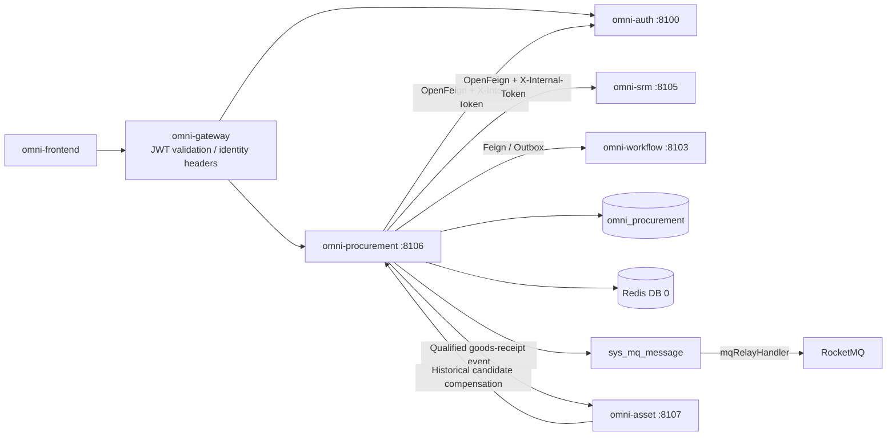
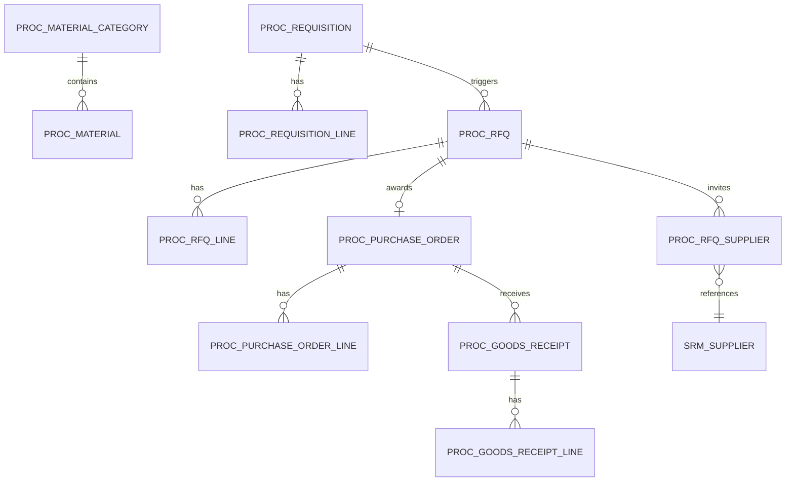
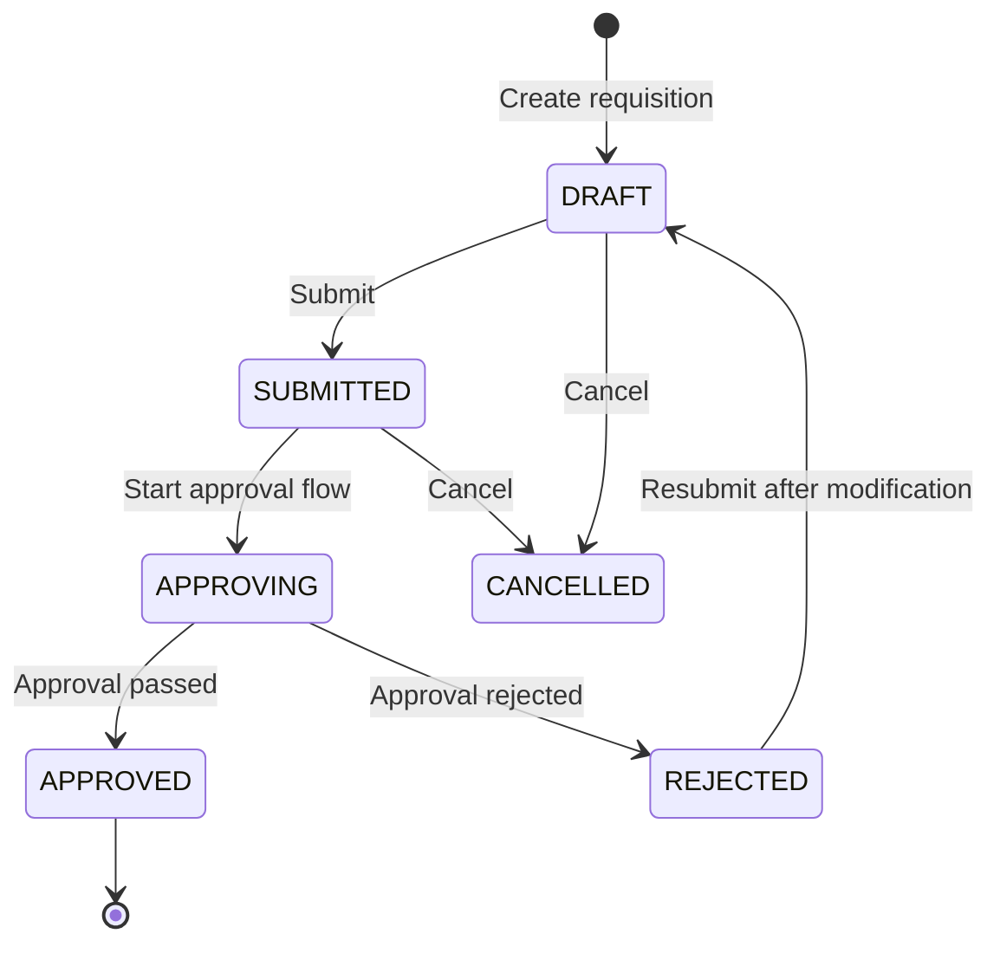
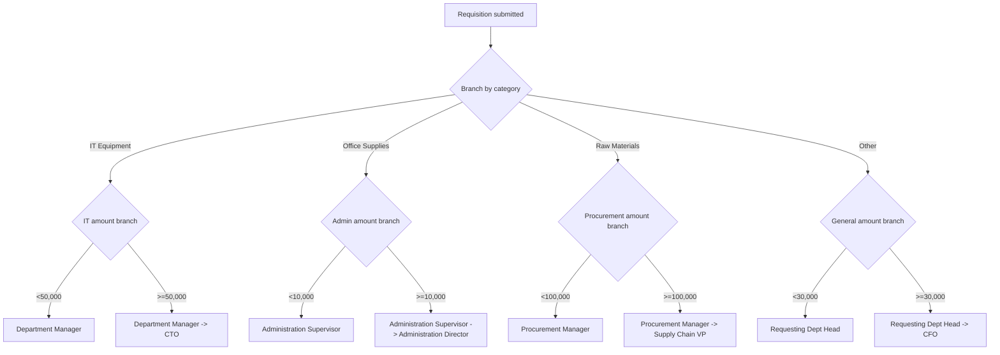
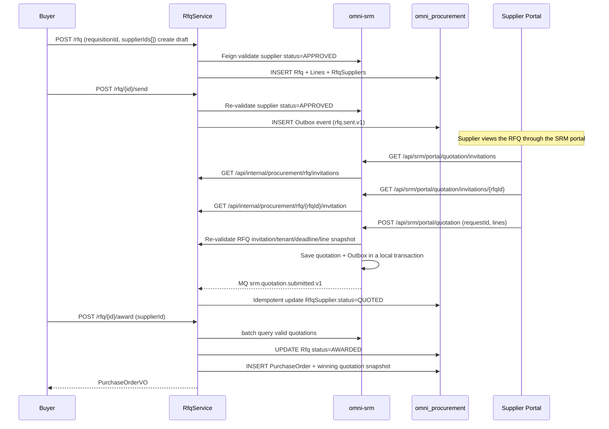
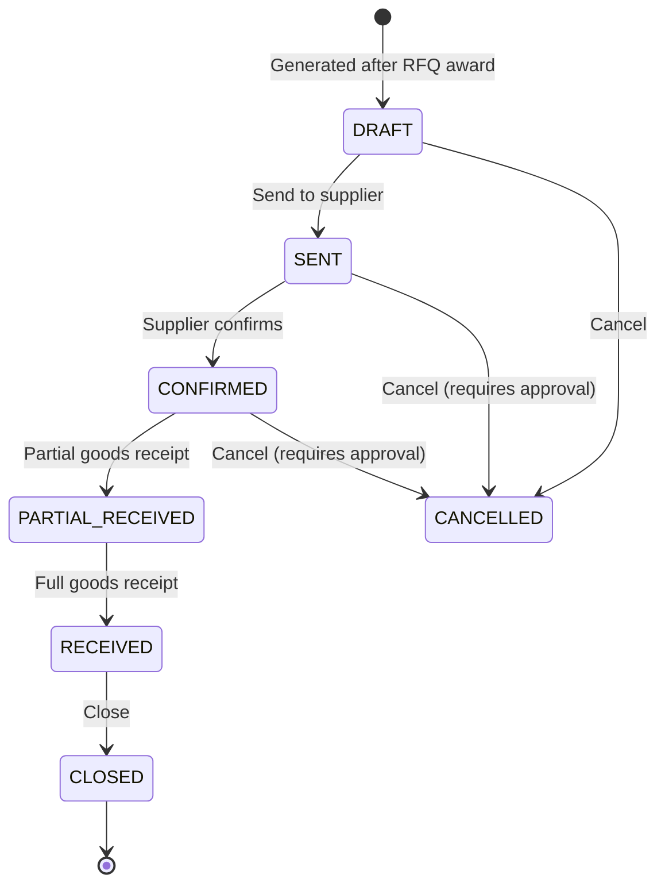
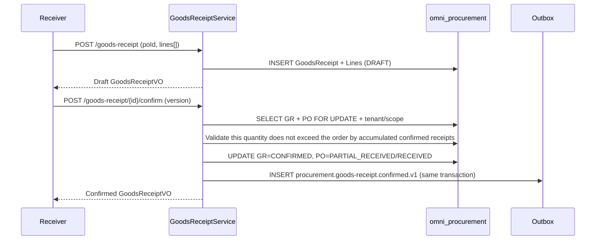

# 조달 실행 모듈 아키텍처와 구현 기준선

> 상태: MVP 구현 완료 및 검증 완료
> 프로젝트: Omni-Stack
> 날짜: 2026-07-27
> 목표: omni-procurement MVP의 아키텍처, 서비스 간 계약, 구현 경계를 설명한다. 구현 입구는 `omni-backend/omni-procurement`과 `omni-frontend/src/views/procurement`이다.

설계 근거: `README.md`, 그리고 `docs/`의 architecture, api-contract, backend-patterns, frontend-patterns, core-flows, scheduling, workflow, mq-reliability, docker-deployment 전체 주제 문서. 동시에 `docs/design/srm-design.md`의 SRM 공급업체 모델을 참조한다.

## 1. 설계 결론

조달 실행은 독립 Servlet 마이크로서비스로 구축하여, 공급업체 관리(`omni-srm`)와 자산 관리(`omni-asset`)에서 분리해야 한다. SRM은 기반이며, Procurement은 SRM의 공급업체 데이터에 의존하고, Asset은 Procurement의 조달 출처 데이터에 의존한다.

| 항목 | 결정 |
|---|---|
| Maven 모듈 / 서비스명 | `omni-procurement` |
| 로컬 포트 / 관리 포트 | `8106` / `19906` |
| XXL-JOB 실행자 | `omni-procurement` / `9906` (정기 알림 활성화 시) |
| 데이터베이스 | `omni_procurement` |
| Gateway | `/api/procurement/**` → `lb://omni-procurement`, `StripPrefix`를 사용하지 않음 |
| Redis | DB 0, Auth가 쓴 XSS 설정을 공유; 키는 `proc:` 접두사 사용 |
| 프런트엔드 | 계속 `omni-frontend`를 사용하고 `views/procurement/**`를 신설 |

Procurement MVP는 조달 실행 폐루프를 다룬다:

> 자재 카탈로그 → 구매요청 → 승인 → RFQ/가격 비교 → 선정 → 구매 주문 → 입고 확인.

3-way 매칭(PO + 입고 전표 + 청구서)과 지불은 MVP에 포함하지 않고, ERP 또는 재무 시스템에 남긴다. 계약 관리는 Phase 2에서 도입한다.

## 2. 제품 범위

### 2.1 사용자와 목표

| 사용자 | 핵심 요구 |
|---|---|
| 요구 부서 직원 | 구매 신청을 제출하고 구매요청 진행을 추적 |
| 조달 담당 | RFQ, 가격 비교, 발주를 관리하고 주문 진행을 추적 |
| 조달 매니저 | 구매요청을 승인하고 조달 프로세스를 관리하며 조달 통계를 열람 |
| 부서 매니저/임원 | 구매요청을 승인(금액 임계값별)하고 조달 지출을 열람 |
| 공급업체 | 포털로 RFQ를 열람하고 견적을 제출(SRM 포털 재사용) |

MVP는 다음에 답할 수 있어야 한다: 승인 대기 구매요청이 얼마나 있는지; 어떤 구매요청의 승인이 어느 단계까지 갔는지; 어떤 RFQ가 공급업체 견적을 기다리는지; 어떤 구매 주문의 입고 상태; 품목/공급업체/부서별 조달 지출 통계.

### 2.2 단계 구분

| 단계 | 역량 |
|---|---|
| MVP | 자재 카탈로그, 구매요청, 승인 플로우(품목+금액 다차원 분기), RFQ/가격 비교, 구매 주문, 입고 확인, 조달 개요 |
| Phase 2 | 계약 관리, 역경매, 조달 템플릿, 프레임워크 계약, 3-way 매칭, 공급업체 성과 연동 |
| Phase 3 | 조달 분석(가격 추세, 공급업체 집중도), 예산 통제, 자동 보충 제안 |

## 3. 시스템 경계

| 컴포넌트 | 권위 책임 | Procurement의 사용 방식 |
|---|---|---|
| `omni-auth` | 테넌트, 사용자, 조직, 역할, 권한, 데이터 범위, XSS 설정 | 내부 OpenFeign; 사용자/조직 ID만 저장 |
| `omni-srm` | 공급업체 데이터(진입, 등급, 리스크) | 내부 OpenFeign으로 공급업체 조회; 공급업체 포털 견적은 SRM 서비스 경유 |
| `omni-base` | 사전, 조작 로그 | 조작 로그 집약 |
| `omni-workflow` | BPMN, 프로세스 인스턴스, 승인, Flowable 엔진의 유일한 런타임 | 내부 OpenFeign으로 플로우 시작/조회/취소, 승인 결과 이벤트 소비 |
| `omni-procurement` | 자재, 구매요청, RFQ, 구매 주문, 입고 | 유일한 비즈니스 쓰기 주체 |
| `omni-asset` | 자산 관리 | 입고 검수 통과 후, Outbox 이벤트와 통제된 이력 보상으로 자산 카드 생성 |
| XXL-JOB | 일괄 스캔 트리거 | 주문 기한 초과 알림(Phase 2) |
| RocketMQ | 비동기 전송 | 최소 1회; 컨슈머는 멱등이어야 함 |



권장 의존: `omni-common-core`, `omni-common`, `omni-common-mybatis`, `omni-common-redis`, `omni-common-operlog`, `omni-common-job`, `omni-common-mqlog`, 그리고 Web, Validation, Security, AspectJ, OpenFeign, LoadBalancer, Nacos, RocketMQ Stream, Actuator, Lombok.

**Procurement은 `omni-common-workflow`에 의존하지 않으며 본 서비스에 Flowable을 내장하지 않는다.** `omni-workflow`는 독립 마이크로서비스이자 Flowable의 유일한 런타임이다; Procurement은 내부 Feign 계약으로 플로우를 발기하고, 신뢰 가능한 도메인 이벤트로 승인 결과를 수신한다. 서비스 간 DTO는 순수 계약 모듈에 두거나 Feign 클라이언트가 로컬로 정의해야 하며, 이로 인해 Flowable Starter를 도입해서는 안 된다.

## 4. 도메인과 데이터 설계

### 4.1 집계

| 집계 | 테이블 | 책임 |
|---|---|---|
| ProcurementConfig | `proc_tenant_config`, `proc_approval_route` | 테넌트 통화와 품목/금액 승인 모델 라우팅 |
| Material | `proc_material_category`, `proc_material` | 자재 품목 트리, 자재 카탈로그 |
| Requisition | `proc_requisition`, `proc_requisition_line` | 구매요청, 명세 행; 승인 태스크와 기록은 omni-workflow가 권위적으로 관리 |
| RFQ | `proc_rfq`, `proc_rfq_line`, `proc_rfq_supplier` | RFQ, 명세 행, 초대된 공급업체 |
| PurchaseOrder | `proc_purchase_order`, `proc_purchase_order_line` | 구매 주문, 명세 행 |
| GoodsReceipt | `proc_goods_receipt`, `proc_goods_receipt_line` | 입고 전표, 명세 행 |



### 4.2 공통 필드와 규칙

모든 `proc_*` 테이블은 `tenant_id`를 포함해야 한다. 인가 가능한 비즈니스 테이블은 추가로 다음을 포함해야 한다:

- `tenant_id`: 테넌트 격리.
- `owner_user_id`: SELF 범위(구매요청 신청자 / 조달 담당).
- `owner_unit_id`: DEPT/DEPT_AND_BELOW 범위.
- `version`: 낙관적 락.
- `deleted`: 논리 삭제.
- `id/create_time/update_time/create_by/update_by`: 감사 필드.

제약:

- 공급업체 ID는 SRM이 관리하며, Procurement은 `supplier_id`만 저장하고 크로스 DB 외래 키를 만들지 않는다.
- 자재 번호 `material_code`는 테넌트 내 고유.
- 구매요청 번호 `requisition_no`, RFQ 번호 `rfq_no`, 주문 번호 `po_no`, 입고 전표 번호 `gr_no`는 데이터베이스 ID로 생성하고 테넌트 내 고유.
- 수량과 단가는 `DECIMAL(19,6)` / `BigDecimal`을, 행 금액과 총 금액은 `DECIMAL(19,4)` / `BigDecimal`을 사용; HTTP JSON은 일괄 십진 문자열로 주고받으며, JavaScript `number`로 계산하는 것을 금지. 통화는 ISO 4217 세 글자 코드를 사용(MVP는 테넌트 기본 통화를 강제).
- 시각은 `yyyy-MM-dd HH:mm:ss`로 통일.
- 일반 PUT으로는 승인 상태, 주문 상태를 직접 변경할 수 없다.
- 외부 요청은 맨 `selectById/updateById/deleteById`를 사용해서는 안 된다.

### 4.3 주요 테이블

`proc_tenant_config`

- `tenant_id/currency_code/initialized_time/version`과 감사 필드, 테넌트 내 고유.

`proc_approval_route`

- `route_code/category_code/min_amount/max_amount/model_version_id/priority/status/version/deleted`와 감사 필드.
- 정확한 품목이 `category_code='*'` 기본 라우트보다 우선; 구간 의미는 `min_amount <= total_amount < max_amount`, max가 비면 상한 없음.
- 동일 품목의 활성 금액 구간은 겹치면 안 됨; 구매요청 제출 시 0건 또는 여러 건 매칭되면 모두 409를 반환하고, 클라이언트는 modelVersionId를 넘겨선 안 됨.

`proc_material_category`

- `tenant_id/parent_id/category_code/category_name/sort/status/version/deleted`와 감사 필드.
- 임의 계층 품목 트리를 지원(parent_id가 0이면 최상위 품목), 자재는 리프 품목에만 연결 가능.
- MVP는 자재 카탈로그 페이지에서 품목 트리 관리를 제공; `category_code`는 생성 후 수정 불가, 업데이트와 삭제는 반드시 `version`을 지니고 조건부 업데이트를 실행.

`proc_material`

- `tenant_id/category_id/material_code/material_name/specification/unit/asset_managed/status/version/deleted`.
- `specification`은 텍스트 기술(MVP는 구조화된 규격 파라미터를 하지 않음).
- `unit`은 정규화된 대문자 계량 단위(예 EA, PCS, UNIT, SET, KG).
- `asset_managed`는 적격 입고 후 "단위마다 자산 카드 한 장"으로 Asset에 들어가는지 나타냄; `EA/PCS/UNIT/SET`만 활성화할 수 있고, 소모품, 서비스, KG 등 연속 계량 자재는 반드시 false.
- 인덱스: tenant + category_id/status, tenant + material_code(고유).

`proc_requisition`

- `requisition_no/title/requester_user_id/requester_unit_id/reason/primary_category_code/total_amount/currency_code`.
- `status`: DRAFT/SUBMITTED/APPROVING/APPROVED/REJECTED/CANCELLED.
- `approval_attempt/workflow_request_id/workflow_business_key/workflow_model_version_id/process_instance_id`: 현재 승인 라운드와 Workflow 멱등 스냅샷; businessKey는 `{requisitionId}:{approvalAttempt}`로 고정.
- `workflow_start_status`: NOT_STARTED/PENDING/FAILED/STARTED; 비즈니스 status와 분리, 실패 시에도 비즈니스 상태는 SUBMITTED 유지.
- `approved_time/workflow_completed_time`: 승인 완료 시각 스냅샷; 승인 의견은 계속 Workflow를 권위로 하고, Procurement은 최종 의견을 복제하거나 날조하지 않음.
- `owner_user_id/owner_unit_id/version/deleted`와 감사 필드.

`proc_requisition_line`

- `line_no/requisition_id/material_id/material_code/material_name/category_code/unit/quantity/estimated_unit_price/estimated_total_price/remark`; 자재 코드, 명칭, 품목, 단위는 모두 제출 시 스냅샷.
- 구매요청 총 금액 = SUM(line.estimated_total_price).
- MVP는 한 구매요청의 모든 행이 동일 품목에 속함을 강제; 품목 교차 요구는 여러 구매요청으로 나누어, 단일 값 승인 라우트 의미의 불확실성을 피함.

`proc_rfq`

- `rfq_no/requisition_id/title/quotation_deadline/currency_code/status/sent_time/owner_user_id/owner_unit_id/version/deleted`.
- `status`: DRAFT/SENT/CLOSED/AWARDED/CANCELLED.
- `awarded_supplier_id/awarded_quotation_id/awarded_quotation_version/awarded_time`: 선정과 견적 버전 스냅샷.
- 구매요청에 연결(한 구매요청에서 여러 RFQ를 생성할 수 있고 품목으로 분할).

`proc_rfq_line`

- `rfq_id/line_no/material_id/material_code/material_name/category_code/unit/quantity/remark/version/deleted`, 모두 구매요청 행 스냅샷.

`proc_rfq_supplier`

- `rfq_id/supplier_id/supplier_name_snapshot/invited_time/quotation_id/quotation_version/quotation_request_id/quotation_time/status/version/deleted`.
- `status`: INVITED/QUOTED/EXPIRED/AWARDED/REJECTED. `AWARDED/REJECTED`는 선정 후 읽기 전용 이력 종료 상태로, 견적을 계속할 수 없음.
- RFQ `status=SENT`, 초대 `status IN (INVITED, QUOTED)`, 그리고 현재 시각이 deadline을 넘지 않을 때만 견적을 제출하거나 업데이트할 수 있음.
- `quotation_id`는 SRM의 `srm_quotation`에 논리적으로 연결(크로스 DB 외래 키를 만들지 않음); `supplier_name_snapshot`은 이력 표시 전용으로, 현재 공급업체 상태나 권한의 근거로 삼지 않음.

`proc_purchase_order`

- `po_no/rfq_id/supplier_id/quotation_id/quotation_version/title/total_amount/currency_code`.
- 낙찰 견적의 공급업체 명칭, 행별 단가, 납기 등을 직접 PO/PO Line에 복사하여 불변 비즈니스 스냅샷을 형성; quotation_id/version은 추적 전용.
- `status`: DRAFT/SENT/CONFIRMED/PARTIAL_RECEIVED/RECEIVED/CLOSED/CANCELLED.
- `order_time/expected_delivery_date/actual_delivery_date`.
- `delivery_address/contact_name/contact_phone`.
- `owner_user_id/owner_unit_id/version/deleted`와 감사 필드.

`proc_purchase_order_line`

- `po_id/material_id/material_name/unit/quantity/unit_price/total_price/remark`.

`proc_goods_receipt`

- `gr_no/po_id/receiver_user_id/receive_time/remark/status/owner_user_id/owner_unit_id/version/deleted`.
- `status`: DRAFT/CONFIRMED.
- 확인 후 Outbox 이벤트를 트리거하여 Asset에 자산 카드 생성을 통지.

`proc_goods_receipt_line`

- `goods_receipt_id/po_line_id/material_id/material_name/unit/ordered_quantity/received_quantity/quality_status/remark`.
- `quality_status`: PASS/FAIL/PENDING.
- 입고 수량은 주문 수량 이하일 수 있음(분할 입고).

## 5. 상태 머신과 핵심 플로우

### 5.1 구매요청(Requisition)



구매요청 제출 후 Flowable 승인 플로우를 시작한다. 승인 플로우는 Exclusive Gateway를 사용하여 자재 품목과 금액으로 서로 다른 승인자에게 라우팅한다.

### 5.2 승인 플로우 설계(omni-workflow와 통합)



구현 방식:
- `omni-workflow`에서 품목마다 하나의 BPMN 프로세스 모델을 생성(예 `procurement_approval_it`, `procurement_approval_office` 등).
- 또는 하나의 범용 BPMN을 사용하여, Exclusive Gateway의 2중 네스트(품목 → 금액)로 라우팅을 구현.
- Procurement 서비스는 구매요청 제출 시, 구매요청의 고유 품목과 서버 측 재계산 총 금액에 따라 `proc_approval_route`에서 게시된 modelVersionId를 선택하고, Workflow 내부 API로 플로우를 시작; 클라이언트는 모델 버전을 지정할 수 없음.
- 승인자는 Flowable의 `ScopedRoleAssignmentListener`로 동적 해석(기존 조직 구조+역할 체계를 활용).

서비스 간 시작은 재시도 가능해야 한다: DRAFT에서 제출할 때마다 먼저 `approvalAttempt + 1`을 하고, requestId와 `businessKey={requisitionId}:{approvalAttempt}`를 생성·영속화; Procurement은 `tenantId + businessType(PROCUREMENT_REQUISITION) + businessKey`를 현재 라운드의 멱등 키로 사용. 먼저 로컬 트랜잭션으로 `status=SUBMITTED, workflow_start_status=PENDING`으로 업데이트하고, 트랜잭션 커밋 후 Workflow를 호출; 성공 후 processInstanceId를 쓰고, workflow_start_status=STARTED로 설정하고 APPROVING으로 진행. 응답 손실이나 호출 실패 시 `status=SUBMITTED, workflow_start_status=FAILED`를 유지하고, retry는 반드시 저장된 requestId/businessKey/modelVersionId를 재사용하며 attempt를 늘리면 안 됨. REJECTED 수정 성공 후 DRAFT로 돌아가고, 재제출해야 새 attempt가 열리며, Workflow 영구 비즈니스 키 고유 제약이 오래된 플로우를 재생하는 것을 피함.

**MVP 제약**: 하나의 구매요청은 하나의 품목만 허용; 승인 라우트는 정확 품목과 `*` 기본 라우트를 지원하고, BPMN은 금액으로 분기할 수 있음. 이후 품목 교차 구매요청이 필요하면 명시적 주 품목 또는 다중 플로우 전략을 정의하며, 현재 버전이 암묵적으로 첫 행을 취하는 것을 금지.

### 5.2.1 구매요청 승인 규칙 관리

관리 화면은 비즈니스 명칭, 적용 품목, 금액 범위, 플로우 명칭을 중심으로 하고, 비즈니스 담당자에게 기술 코드, 모델 버전 ID,
priority 입력을 요구하지 않는다. `route_code`는 서버 측이 `APR-{ULID}`를 생성하고 고급 정보에서만 읽기 전용으로 표시; `route_name`은 비즈니스 필수 명칭.
바인딩 가능한 플로우는 Workflow `category=purchase`의 현재 게시 버전으로 고정되고, 실행 인스턴스는 계속
`businessType=PROCUREMENT_REQUISITION`을 사용; 두 jenis 식별자는 혼용할 수 없음.

목록은 현재 페이지의 `modelVersionId`를 중복 제거한 뒤, 200건을 넘지 않는 일괄 내부 인터페이스로 플로우 메타데이터를 보완하고, 행별 호출을 금지.
Workflow 사용 불가 시 읽기 전용 목록은 로컬 규칙을 보존하고 `UNAVAILABLE`로 표시; 생성, 업데이트, 구매요청 제출은 계속 실패 차단.
매칭 테스트는 구매요청 제출과 동일한 `ApprovalRouteResolver.evaluate`를 호출하여, 고유 히트, 매칭 없음, 이력 더티 데이터의
다중 매칭을 명시적으로 반환. 커버리지 분석은 각 유효 품목을 0부터 무한까지 반개 구간으로 나누고, 먼저 정확 규칙을 적용한 뒤 기본 규칙으로 결손을 보충;
사용 중지와 삭제 전에 메모리에서 대상 규칙을 제외하고 동일 알고리즘을 재사용하여 영향 힌트를 생성.

### 5.3 RFQ/가격 비교



가격 비교 방식: MVP는 간단한 비교 뷰를 제공한다——`GET /api/internal/quotation/batch`로 초대된 공급업체의 유효 견적(단가, 총가, 납기)을 나열하고, 조달 담당이 수동으로 선정 공급업체를 고른다. 자동 입찰 평가 알고리즘은 하지 않는다. 선정 트랜잭션은 반드시 quotationId, 견적 버전, 그리고 금액/납기의 불변 스냅샷을 보존해야 하며, 후속 SRM 견적 변경은 기존 선정과 구매 주문을 바꾸면 안 된다.

### 5.4 구매 주문(Purchase Order)



### 5.5 입고 확인(Goods Receipt)



DRAFT 생성은 주문의 입고 완료 수량을 점유하지 않고, 이벤트도 보내지 않는다. 확인 시 반드시 PO를 잠그고, 모든 CONFIRMED 입고 행을 기반으로 누적 재검증하여, 여러 초안의 동시 확인으로 인한 초과 입고를 방지한다. 확인 성공 후 Outbox 이벤트 `procurement.goods-receipt.confirmed.v1`을 쓴다; Asset이 아직 구축되지 않았을 때 Procurement을 막지 않지만, 이력 이벤트가 Outbox/Broker에 무기한 머물 것이라고 가정해선 안 된다——Asset 가동 시 반드시 아래에서 정의하는 이력 보상 재스캔을 실행해야 한다.

`quality_status=PASS`, `asset_managed=true`, 그리고 receivedQuantity가 양의 정수인 입고 행만 자산화할 수 있다. PENDING/FAIL 행, 소모품, 서비스, 연속 계량 자재는 자산을 생성하지 않는다. PENDING이 이후 `POST /goods-receipt/{id}/quality-result`로 PASS가 되면, Procurement은 `procurement.goods-receipt.quality-passed.v1`을 발행하고 이번에 새로 통과한 행만 싣는다; 이미 전송된 confirmed 이벤트를 수정하거나 재사용하는 것을 금지한다.

## 6. 테넌트, RBAC과 데이터 권한

### 6.1 신뢰 체인

SRM과 일치: Gateway JWT → `GatewayPreAuthenticationFilter` → `ServiceIdentityFilter`(Tenant/사용자 신분 검증) → `@PreAuthorize` → `@ServiceDataScope` → MyBatis DataPermission → `ProcRecordAccessGuard`.

### 6.2 권한 트리와 역할

메뉴: `procurement`(DIRECTORY) 그리고 `procurement:overview`, `procurement:material`, `procurement:approval-route`, `procurement:requisition`, `procurement:rfq`, `procurement:purchase-order`, `procurement:goods-receipt`(MENU). 이미 제공된 페이지만 MENU로 시드하여, 동적 사이드바에 죽은 링크가 나타나지 않게 한다.

API 권한:

- `procurement:overview:list`
- `procurement:material:list/create/update/delete`
- `procurement:approval-route:list/create/update/delete`
- `procurement:requisition:list/create/update/delete/submit/approve/cancel`
- `procurement:rfq:list/create/update/delete/send/award/cancel`
- `procurement:purchase-order:list/update/delete/send/confirm/cancel`(구매 주문은 RFQ 선정으로만 생성)
- `procurement:goods-receipt:list/create/confirm`

| 역할 | dataScope | 역량 |
|---|---|---|
| `PROCUREMENT_MANAGER` | DEPT_AND_BELOW | 부서 및 하위, 승인, 통계 |
| `PROCUREMENT_STAFF` | SELF | 본인이 담당하는 구매요청, RFQ, 주문 및 SELF 범위 개요 |
| `EMPLOYEE` | SELF | 본인 구매요청을 제출하고 열람 |
| `TEAM_LEADER` | DEPT | Workflow가 본인에 할당한 승인 및 부서 승인 비즈니스 뷰 |
| `DEPT_LEADER` | DEPT_AND_BELOW | Workflow가 본인에 할당한 승인 및 부서 트리 승인 비즈니스 뷰 |
| `SUPER_ADMIN` | ALL | 모든 기능, 조달 데이터는 계속 현재 테넌트로 제한 |

기본 USER에는 조달 권한을 부여하지 않는다.

### 6.3 Procurement 컨텍스트와 SQL 인터셉트

범용 요청 신분, DataScope 컨텍스트와 애스펙트는 `omni-common-service`가 제공한다: `ServiceIdentityContext`, `ServiceDataScopeContext`, `@ServiceDataScope`, `ServicePersistenceAutoConfiguration`. 조달 모듈은 도메인 차이만 보존한다: `ProcTenantTablePolicy`, `ProcDataPermissionHandler`, `ProcRecordAccessGuard`.

인터셉터 순서는 고정: `TenantLineInnerInterceptor → DataPermissionInterceptor → OptimisticLockerInnerInterceptor → PaginationInnerInterceptor`. `ProcTenantTablePolicy`는 `proc_*` 테이블에만 TenantLine을 활성화; `sys_mq_message`는 반드시 제외하여, 테넌트 간 Outbox Relay가 전송 대기 메시지를 스캔할 수 있게 한다. 도메인 테이블의 데이터 권한 매핑은 계속 `ProcDataPermissionHandler`가 아래 표대로 정의한다.

| dataScope | 조건 |
|---|---|
| SELF | `requester_user_id = currentUserId` 또는 `owner_user_id = currentUserId` |
| DEPT | `requester_unit_id = primaryUnitId` |
| DEPT_AND_BELOW / CUSTOM | `requester_unit_id IN accessibleUnitIds` |
| TENANT / ALL | owner 조건을 추가하지 않음, TenantLine은 항상 유지 |

위 표는 범위 의미만 기술하며, 실제 SQL은 반드시 테이블별로 매핑한다. `requester_user_id OR owner_user_id`를 모든 `proc_*` 테이블에 기계적으로 추가하는 것을 금지한다:

| 리소스/테이블 | SELF 열 | DEPT/CUSTOM 열 | 하위 리소스 제약 |
|---|---|---|---|
| Requisition | `requester_user_id` | `requester_unit_id` | Line은 동일 tenant의 requisition_id로 상속 |
| RFQ | `owner_user_id` | `owner_unit_id` | Line/Supplier는 동일 tenant의 rfq_id로 상속 |
| PurchaseOrder | `owner_user_id` | `owner_unit_id` | Line은 동일 tenant의 po_id로 상속 |
| GoodsReceipt | `owner_user_id`(입고 담당자) | `owner_unit_id` | Line은 동일 tenant의 goods_receipt_id로 상속 |
| Material/Category | SELF 사유 의미 없음 | 기능 권한으로 통제, 테넌트 내 공유 | 항상 TenantLine을 유지 |
| Overview | 현재 permissionCode로 대응 비즈니스 테이블의 owner/requester 열에 매핑 | 좌측과 동일 | 집계 SQL은 반드시 목록과 동일 범위를 적용 |

### 6.4 승인 플로우 권한

구매요청 승인은 독립된 `omni-workflow`가 구동하고, 승인자는 `ScopedRoleAssignmentListener`가 동적 해석한다. 사용자는 Workflow의 `/api/workflow/approval/{taskId}/complete`에서 태스크를 완료; Workflow는 반드시 기능 권한과 현재 태스크 후보자/수리자 신분을 동시에 검증해야 한다.

구매요청 승인을 담당하는 `TEAM_LEADER/DEPT_LEADER/PROCUREMENT_MANAGER`는 반드시 `procurement:requisition:approve`(전용 비즈니스 승인 VO 읽기)와 `workflow:approval:complete`(본인 Workflow 태스크 완료)를 동시에 취득해야 한다. 둘 다 필수이며, 테넌트 초기화와 역할 seed는 동기 유지보수해야 한다.

승인자는 비즈니스 양식을 볼 때 `procurement:requisition:approve` 권한을 쓰지만, 승인 가시 범위는 일반 requester/owner dataScope로 제한되지 않는다. 범용 우회 형성을 피하기 위해, Procurement은 전용 `GET /api/procurement/requisition/{id}/approval-view?taskId={taskId}`를 제공한다: 먼저 Workflow 내부 API로 taskId가 현재 tenant에 속하고, businessKey가 해당 requisitionId와 같으며, 태스크가 현재 사용자에게 할당되었음을 검증한 뒤, `tenant_id + id`로 읽기 전용 승인 VO를 읽는다. 일반 상세 인터페이스는 계속 DataPermission을 실행하며, 이 예외의 재사용을 금지한다.

## 7. API 설계

### 7.1 공통 계약

SRM과 일치: `R<T>`, `R<PageResult<T>>`, `page=1`, `size=10`, `size <= 100`.

### 7.2 엔드포인트

| 도메인 | 엔드포인트 |
|---|---|
| Overview | `GET /api/procurement/overview/summary`, `/spend-analysis` |
| Material Category | `GET /material/category/list`, `POST /material/category`, `PUT/DELETE /material/category/{id}`; 업데이트 body와 삭제 query 모두 `version`을 지님 |
| Material | `GET /material/list`, `GET /material/{id}`, `POST /material`, `PUT/DELETE /material/{id}`; 업데이트 body와 삭제 query 모두 `version`을 지님 |
| Approval Route | `GET /approval-route/list`, `POST /approval-route`, `PUT/DELETE /approval-route/{id}` |
| Requisition | `GET /requisition/list`, `GET /requisition/{id}`, `POST /requisition`, `PUT/DELETE /requisition/{id}` |
| Requisition 승인 뷰 | `GET /requisition/{id}/approval-view?taskId={taskId}`(먼저 Workflow 태스크 할당을 검증) |
| Requisition 명령 | `POST /requisition/{id}/submit`, `/retry-start`, `/cancel` |
| RFQ | `GET /rfq/list`, `GET /rfq/{id}`, `POST /rfq`, `PUT/DELETE /rfq/{id}` |
| RFQ 명령 | `POST /rfq/{id}/send`, `/award`, `/cancel` |
| Purchase Order | `GET /purchase-order/list`, `GET /purchase-order/{id}`, `POST /purchase-order`, `PUT/DELETE /purchase-order/{id}` |
| PO 명령 | `POST /purchase-order/{id}/send`, `/confirm`, `/cancel` |
| Goods Receipt | `GET /goods-receipt/list`, `GET /goods-receipt/{id}`, `POST /goods-receipt` |
| GR 명령 | `POST /goods-receipt/{id}/confirm`, `/quality-result` |

Overview 요약은 다음을 고정 반환한다: 승인 중 구매요청 수, 마감 내에 아직 `INVITED` 공급업체가 있는 `SENT` RFQ 수,
구매 주문 각 상태 수, 입고 초안 수, 그리고 `currencyCode`로 그룹한 확정 조달 커밋 금액.
조달 커밋과 지출은 `CONFIRMED/PARTIAL_RECEIVED/RECEIVED/CLOSED` 주문만 집계하고,
`DRAFT/SENT/CANCELLED`를 포함하지 않는다. `spend-analysis`의 `dimension`은
`CATEGORY/SUPPLIER/DEPARTMENT`를 지원하며, DEPARTMENT는 구매 주문의 `owner_unit_id`를 의미;
결과는 먼저 통화별, 이어서 금액 내림차순으로 정렬하고, `limit` 범위는 1–100. 어떤 인터페이스도 통화 간 직접 합산하면 안 된다.

### 7.3 엔드포인트와 DataScope permission 매핑

| 조작 | permissionCode |
|---|---|
| Overview | `procurement:overview:list` |
| Material list/detail | `procurement:material:list` |
| Material create/update/delete | `procurement:material:create/update/delete` |
| Approval route list/create/update/delete | `procurement:approval-route:list/create/update/delete` |
| Requisition list/detail | `procurement:requisition:list` |
| Requisition create/update/delete | `procurement:requisition:create/update/delete` |
| Requisition submit | `procurement:requisition:submit` |
| Requisition retry-start | `procurement:requisition:submit` |
| Requisition approve | `procurement:requisition:approve` |
| Requisition cancel | `procurement:requisition:cancel` |
| RFQ list/detail | `procurement:rfq:list` |
| RFQ create/update/delete/send/award/cancel | `procurement:rfq:create/update/delete/send/award/cancel` |
| PO list/detail | `procurement:purchase-order:list` |
| PO update/delete/send/confirm/cancel | `procurement:purchase-order:update/delete/send/confirm/cancel`(외부 create 없음, 주문은 RFQ 선정으로만 생성) |
| GR list/detail | `procurement:goods-receipt:list` |
| GR create/confirm/quality-result | `procurement:goods-receipt:create/confirm`(quality-result는 confirm 권한 재사용) |

## 8. 서비스 간 일관성

### 8.1 Auth Feign

SRM과 일치: userId/unitId만 저장하고, 할당 전에 사용자가 존재하고, 활성화되어 있고, 동일 테넌트임을 검증. 목록은 batch enrich, N+1 금지.

### 8.2 SRM Feign

Procurement은 SRM 내부 API로 공급업체 데이터를 가져온다:

- `GET /api/internal/supplier/{id}?tenantId={tenantId}`: 공급업체 요약을 가져옴.
- `GET /api/internal/supplier/search?tenantId={tenantId}&status=APPROVED&categoryCode={code}`: 적격 공급업체를 검색.
- `GET /api/internal/quotation/batch?tenantId={tenantId}&rfqId={rfqId}`: 초대된 공급업체의 유효 견적, 버전, 완전한 행 스냅샷을 반환하여 가격 비교와 선정 스냅샷에 사용.
- RFQ 시 공급업체 상태가 APPROVED이고 블랙리스트에 없음을 검증.
- 목록에서 공급업체 명칭을 표시할 때, supplier_id를 수집한 뒤 한 번에 batch Feign.

Procurement은 SRM에 두 종류 내부 읽기 전용 인터페이스도 제공한다:

- `GET /api/internal/procurement/rfq/invitations?supplierId={supplierId}`: 현재 공급업체의 초대 목록을 반환, 최소 `rfqId/rfqNo/title/status/invitationStatus/quotationDeadline/currencyCode/invitedTime`을 포함.
- `GET /api/internal/procurement/rfq/{rfqId}/invitation?supplierId={supplierId}`: 초대 상세와 RFQ 행 스냅샷을 반환, 행은 최소 `rfqLineId/materialCode/materialName/unit/quantity/remark`를 포함.

SRM은 반드시 PortalUser 연결로 얻은 supplierId로 이 인터페이스들을 호출하고, 포털 요청이 넘기는 supplierId를 쓰면 안 된다. 제출 전에 RFQ `status=SENT`, 초대 `status IN (INVITED, QUOTED)`, 그리고 quotationDeadline을 넘지 않음을 재검증하고, 견적 `validUntil`이 quotationDeadline보다 이르지 않으며, 제출 rfqLineId 집합이 상세와 완전 일치함을 검증한다. SRM은 견적 저장 후 `srm.quotation.submitted.v1`을 발행; Procurement은 eventId Inbox로 멱등 소비하여 자신의 `proc_rfq_supplier`를 업데이트하고, SRM은 Procurement 테이블을 크로스 DB로 쓰면 안 된다.

위 모든 내부 인터페이스는 통일하여 `/api/internal/**` 접두사를 쓰고, `X-Internal-Token`과 `X-Tenant-Id`를 요구; 인터페이스가 query/body tenant도 지니면 header tenant와 일치해야 한다. Gateway는 이 접두사를 전달하지 않는다.

SRM 사용 불가 시:
- 공급업체 표시: ID/알 수 없는 공급업체를 반환 가능.
- RFQ/발주: 계속할 수 없고 503을 반환.

### 8.3 Workflow 통합

Procurement은 Flowable을 내장하지 않고, `X-Internal-Token`으로 보호되는 Workflow 내부 API로 통합한다. 구매요청 승인 플로우:

1. Procurement은 구매요청을 SUBMITTED로 조건부 업데이트하고, 트랜잭션 커밋 후 Workflow `POST /api/internal/workflow/process-instance/start`를 호출.
2. 요청은 영속화된 `requestId`, `tenantId`, `modelVersionId`, `businessType=PROCUREMENT_REQUISITION`, `businessKey={requisitionId}:{approvalAttempt}`, `startUserId`, variables를 포함.
3. `variables`는 `requisitionId`, `approvalAttempt`, `materialCategory`(고유 품목 code), `totalAmount`(총 금액 십진 문자열), `requesterUnitId`(신청 부서)를 포함; Workflow는 modelVersionId에 대응하는 게시된 BPMN으로 인스턴스를 시작.
4. Workflow는 `tenantId + businessType + businessKey`에 고유 멱등 제약을 만듦; 중복 요청은 기존 processInstanceId를 반환.
5. Procurement은 processInstanceId를 보존하고 상태를 APPROVING으로 진행. 시간 초과나 응답 손실 시 동일 requestId/businessKey로 재시도.
6. 승인 종료 후, Workflow는 로컬 트랜잭션에서 `workflow.process.completed.v1`을 발행하고, eventId, tenantId, businessType, businessKey, processInstanceId, result, completedTime을 싣는다.
7. Procurement은 Inbox 고유 키로 멱등 소비하여, tenant/businessKey(현재 attempt 포함)/processInstanceId가 모두 일치하고 현재 상태가 APPROVING일 때만 APPROVED, REJECTED, CANCELLED로 업데이트하고, 조달 도메인 이벤트를 전송. 완료 이벤트가 로컬 `markStarted`보다 먼저 도착하면, 재시도 가능 예외를 던져야 하고 Inbox를 처리됨으로 표시하면 안 됨; 오래된 attempt 이벤트는 멱등 무시만 함.

워크플로우 통합은 `docs/workflow.md`의 규격을 따른다:
- `model_key`는 테넌트 내 고유.
- `processDefinitionId`로 플로우를 시작하고, `processKey`는 쓰지 않음.
- 프로세스 인스턴스 추적 필드는 `wf_process_instance_ext`에 기록.
- Flowable 테이블과 런타임은 `omni-workflow` 데이터베이스에만 존재하고, Procurement은 `omni-common-workflow`에 의존하지 않음.
- 미정의되고 신뢰할 수 없는 동기 `WorkflowCallbackService`를 쓰지 않음; 승인 결과는 Workflow Outbox 이벤트로 전달.

### 8.4 Asset 연동

입고 확인 후 Outbox 이벤트 `procurement.goods-receipt.confirmed.v1`을 쓴다. 이벤트 payload는 다음을 포함:

```json
{
  "eventId": "018f...uuid",
  "eventType": "procurement.goods-receipt.confirmed.v1",
  "occurredAt": "2026-07-13 10:30:00",
  "tenantId": 1,
  "payload": {
    "goodsReceiptId": 301,
    "grNo": "GR202607130001",
    "purchaseOrderId": 201,
    "poNo": "PO202607100001",
    "supplierId": 101,
    "supplierNameSnapshot": "Acme Technology",
    "purchaseDate": "2026-07-13 10:30:00",
    "currencyCode": "CNY",
    "ownerUserId": 1001,
    "ownerUnitId": 2001,
    "lines": [
      {
        "goodsReceiptLineId": 401,
        "purchaseOrderLineId": 501,
        "materialId": 601,
        "materialCode": "IT-NB-001",
        "materialNameSnapshot": "ThinkPad X1 Carbon",
        "categoryCode": "IT_DEVICE",
        "unit": "PCS",
        "receivedQuantity": "5.000000",
        "qualityStatus": "PASS",
        "assetManaged": true,
        "assetQuantity": 5,
        "unitPrice": "12000.000000",
        "totalPrice": "60000.0000"
      }
    ]
  }
}
```

`ownerUserId/ownerUnitId`는 입고 전표 관리 귀속의 누락될 수 없는 스냅샷으로, Asset은 이를 새 자산의 관리자와 관리 부서로 직접 상속한다; 공급업체 포털 사용자나 메시지 소비 스레드 신분으로 추측하면 안 된다. 수량, 단가, 금액은 Procurement 십진 문자열 계약을 따르고, 정수 카운트인 `assetQuantity`만 JSON number를 쓴다.

`omni-asset`는 자산화 조건을 충족하는 행에만 `assetQuantity`에 따라 자산 카드를 생성한다. 실시간 이벤트는
`consumerName + eventId`의 Inbox 고유 키로 멱등을 수행하고, 실시간 소비와 이력 재스캔은 공동으로
`tenantId + goodsReceiptLineId + unitSequence` 자산 출처 고유 키를 폴백으로 쓴다; 동일 멱등 키가 다른 완전한 비즈니스 의도에 바인딩되면 충돌을 반환하고, 조용히 덮어쓰면 안 된다.

Outbox는 이벤트가 Broker로 신뢰 있게 전달됨만 보장한다; 메시지는 한 번 전송 성공하면 SENT로 들어가며, 아직 배포되지 않은 미래 컨슈머를 위해 무기한 보존된다고 보장하지 않는다. Asset 가동 시 반드시 보상 재스캔을 실행해야 한다: 페이지네이션되는 `GET /api/internal/procurement/goods-receipt/asset-candidates?tenantId={tenantId}&afterId={id}&size={size}`로 확정되고 자산화 가능한 모든 이력 입고 행을 읽고, 동일 멱등 키로 보충 생성한다. 실시간 소비와 이력 재스캔은 병행할 수 있고, Inbox 고유 제약이 중복되지 않음을 보장한다.

### 8.5 Outbox 이벤트

- `procurement.requisition.submitted.v1`
- `procurement.requisition.approved.v1`
- `procurement.requisition.rejected.v1`
- `procurement.rfq.sent.v1`
- `procurement.rfq.awarded.v1`
- `procurement.purchase-order.created.v1`
- `procurement.purchase-order.confirmed.v1`
- `procurement.goods-receipt.confirmed.v1`
- `procurement.goods-receipt.quality-passed.v1`

## 9. 프라이버시, 조작 로그와 XSS

### 9.1 OperLog 마스킹

기존 PII 마스킹 역량을 재사용한다. Procurement이 마스킹해야 할 필드:

- 입고 주소(`delivery_address`)
- 연락처 휴대전화(`contact_phone`)

### 9.2 PII

- 입고 주소와 연락처 휴대전화는 목록 페이지에서 기본 마스크.
- 상세는 권한으로 표시.
- 구매 주문 인쇄/내보내기 시(Phase 2) 전체 값이 필요하며, 독립 권한을 사용.

### 9.3 XSS

Procurement은 `omni-common-service`의 `CachedServiceXssConfigProvider`로 XSS 설정을 얻고, 모듈 수준 `XssConfigProvider`를 다시 구현하지 않는다. 설정은 먼저 Redis DB 0을 읽고, 캐시 미스 시 Auth로 원본 폴백; Auth 사용 불가이고 캐시가 없으면 안전 기준선으로 필터링을 계속한다. MVP 비고는 평문만 허용.

## 10. 프런트엔드 설계

```text
omni-frontend/src/
├── api/
│   ├── procurement-overview.ts
│   ├── procurement-material.ts
│   ├── procurement-requisition.ts
│   ├── procurement-rfq.ts
│   ├── procurement-purchase-order.ts
│   └── procurement-goods-receipt.ts
├── views/procurement/
│   ├── overview/index.vue           # Procurement overview + spend analysis
│   ├── material/index.vue           # Material catalog management
│   ├── requisition/index.vue        # Requisition management
│   ├── rfq/index.vue                # RFQ management
│   ├── purchase-order/index.vue     # Purchase order management
│   └── goods-receipt/index.vue      # Goods receipt management
└── components/procurement/
    ├── RequisitionForm.vue          # Requisition form (with dynamic line add/remove)
    ├── RfqCompareView.vue           # Price comparison view (multi-supplier quotation comparison table)
    ├── PurchaseOrderTracker.vue     # Order progress tracker
    └── GoodsReceiptForm.vue         # Goods receipt form (with quality status)
```

- `ApiResponse/PageResult`는 `src/types/api.ts`에서만 가져온다.
- 구매요청 양식은 명세 행의 동적 추가/삭제(자재 행 추가/제거)를 지원.
- 가격 비교 뷰는 Element Plus 테이블로 각 공급업체 견적을 가로로 비교.
- Workflow 대기 목록 자체는 Procurement businessKey를 싣지 않는다; 태스크를 열 때 먼저 `/api/workflow/task/{taskId}/form`을 호출하고, variables에서 `businessType/requisitionId`를 읽은 뒤, Procurement `approval-view`를 로드. 비즈니스 양식 로드나 태스크 할당 검증이 실패하면 반드시 승인 제출을 금지.
- `router/index.ts`와 `layout/index.vue` iconMap에 Procurement을 보탠다.
- `constants/menu.ts`, `zh-CN.ts`, `en-US.ts`를 동기화.

## 11. 엔지니어링 착지점

### 11.1 새 모듈

```text
omni-backend/omni-procurement/
├── pom.xml
└── src/main/
    ├── java/com/omni/procurement/
    │   ├── ProcurementApplication.java
    │   ├── client/ config/ controller/ dto/ entity/
    │   ├── mapper/ security/ service/ service/impl/
    │   └── workflow/                    # Workflow Feign client and approval-result event consumer
    └── resources/
        ├── application.yml
        ├── application-dev.yml
        └── mapper/
```

`ProcurementApplication`은 `@EnableDiscoveryClient`, `@EnableFeignClients(basePackages="com.omni.procurement.client")`, `@MapperScan("com.omni.procurement.mapper")`를 사용한다.

### 11.2 반드시 변경할 파일

| 파일 | 변경 |
|---|---|
| `omni-backend/pom.xml` | `omni-procurement` 추가 |
| Gateway `application.yml` | `/api/procurement/**` 라우트 명시 |
| `docker/backend/Dockerfile` | POM 캐시 계층 |
| `docker-compose.yml` | Procurement 서비스, 8106 |
| `start.bat/start.sh` | build 목록에 Procurement 추가 |
| `database/changelog/procurement/` | 조달 구조 변경에 forward-only Liquibase changeSet 추가 |
| `scripts/sql/seed/procurement.sql` | 자재 품목 등 정식 멱등 시드; 업데이트 후 seed manifest 갱신 |
| `scripts/sql/seed/auth.sql` | 조달 권한과 역할의 정식 멱등 시드; 업데이트 후 seed manifest 갱신 |
| Procurement `TenantModuleProvisioner` | 새 테넌트 13개 자재 분류의 멱등 초기화 |
| `omni-workflow` | 멱등 내부 시작/태스크 할당 검증 API, 그리고 `workflow.process.completed.v1` Outbox 이벤트 추가 |
| `docs/workflow.md` | 서비스 간 멱등 시작, 결과 이벤트, 조달 승인 플로우 모델 설명 보충 |
| Frontend router/layout/menu/locales | 아이콘, 메뉴, i18n |

설정 요점: server 8106, management 19906, Redis DB 0, XXL appname `omni-procurement`/port 9906.

## 12. 비기능 설계

### 성능

- 모든 목록은 페이지네이션, 최대 100.
- 공급업체 명칭은 한 번에 batch enrich, N+1 금지.
- 개요 통계는 Mapper 계층 집계 SQL을 사용(품목/공급업체/담당 부서 및 통화별 조달 지출 `GROUP BY`),
  각 집계 루트는 계속 그 목록과 동일한 requester/owner DataScope를 적용하고, 통화 간 합산과 레코드별 조회를 금지.

### 동시성과 멱등

- 구매요청 제출 → 승인 플로우 시작: 로컬 상태 조건부 업데이트 + Workflow의 `tenantId + businessType + businessKey` 고유 멱등; 시간 초과 시 동일 requestId로 재시도.
- 입고 수량 검증: `received_quantity <= ordered_quantity - already_received`, 낙관적 락 사용.
- RFQ 선정: version 낙관적 락 + RFQ 상태 검증.
- 포털 견적 제출: SRM은 영구 요청 이력 테이블로 `(tenantId, requestId)` 멱등, requestHash로 동일 키 다른 의도 방지, `(tenantId, rfqId, supplierId)`로 고유 유효 견적 제약; 동일 의도 재생은 현재 스냅샷을 반환하고 이벤트를 중복 발행하지 않음.
- 견적 이벤트와 승인 결과 이벤트: 각자 Inbox eventId 고유 키로 멱등 소비; 동일 quotationId의 오래된 quotationVersion은 새 버전을 덮어쓰면 안 됨.

### 저하

- SRM 사용 불가: 공급업체 표시는 ID로 저하; RFQ/발주는 거부(503).
- Workflow 사용 불가: 제출 인터페이스는 503을 반환하고, 구매요청은 재시도 가능 상태 `status=SUBMITTED, workflow_start_status=FAILED`를 유지; 승인을 건너뛰거나 플로우를 중복 시작하면 안 됨.
- Auth 사용 불가: 503 실패 차단.
- RocketMQ 사용 불가: Outbox는 커밋, Relay가 나중에 보완.

## 13. 테스트와 검수

최소 테스트 세트:

- 구매요청 상태 머신 합법/불법 전이.
- 구매요청 승인 플로우 시작과 결과 소비(Workflow Feign/MQ를 Mock, Procurement 테스트에서 Flowable을 시작하지 않음).
- 승인 결과 이벤트가 중복, 순서 뒤섞임, tenant/businessKey/processInstanceId 불일치 시 구매요청을 잘못 업데이트하지 않음.
- 승인자는 본인에 할당된 taskId로만 approval-view를 읽을 수 있고, 이 인터페이스로 임의 구매요청을 읽을 수 없음.
- 승인 플로우의 금액 분기 라우팅 정확성.
- RFQ 선정이 구매 주문을 생성.
- SRM 견적 이벤트 멱등 소비; SRM은 Procurement 테이블을 직접 업데이트할 수 없음.
- 선정 후 SRM 견적을 수정해도 보존된 낙찰 스냅샷과 구매 주문에 영향 없음.
- 입고 수량이 주문 수량을 넘지 않음.
- 분할 입고 누적이 정확.
- DRAFT 생성은 PO의 입고 완료 수량을 업데이트하지 않고 이벤트도 보내지 않음; 확인 시에만 PO를 잠그고 누적 검증하고 전달.
- 각각은 성립하지만 합계로 초과 입고가 되는 두 초안을 동시 확인하면 하나만 성공.
- PENDING 품질검사가 PASS로 바뀌면 새로 통과한 행의 quality-passed 이벤트만 발행, 중복 제출로 중복 자산화하지 않음.
- 비자산 자재, 품질검사 실패/보류, 비정수 연속 계량 입고는 자산 후보를 생성하지 않음.
- Asset 실시간 소비와 이력 보상 재스캔이 병행해도 자산을 중복 생성하지 않음.
- 테넌트 간 격리.
- tenant/scope 누락 시 실패 차단.
- Outbox 이벤트 쓰기 완전성.

엔드투엔드 검수: 자재 생성 → 구매요청 제출 → 승인 통과 → RFQ 생성 → 공급업체 초대 → 공급업체 견적 → 가격 비교 선정 → 구매 주문 생성 → 입고 확인 → Outbox 이벤트 발행.

## 14. 구현 순서

### Milestone 0: 선행 확인

- SRM이 구축 완료되고 공급업체 내부 API가 사용 가능함을 확인.
- Workflow 서비스가 사용 가능하고 Flowable 엔진이 정상임을 확인.
- Workflow 내부 시작/태스크 검증 API와 `workflow.process.completed.v1` 이벤트 계약이 준비되었음을 확인; Procurement은 `omni-common-workflow`를 도입하지 않음.

### Milestone 1: 서비스 구축 + 보안 기반

- 모듈, 설정, Gateway, Docker, DB 생성.
- TenantLine + DataPermission + Pagination.
- 권한 트리, Procurement 역할, 기존 테넌트 마이그레이션.
- 프런트엔드 root 메뉴.

### Milestone 2: 자재 카탈로그

- 품목 트리(임의 계층)와 자재 CRUD.
- 자재 번호 테넌트 내 고유.

### Milestone 3: 구매요청 + 승인 플로우

- 구매요청 CRUD(명세 행 동적 추가/삭제 포함).
- 구매요청 제출 → Flowable 승인 플로우 시작.
- 승인 결과 이벤트 멱등 소비 → 구매요청 상태 업데이트.
- BPMN 프로세스 모델 생성(품목+금액으로 라우팅).

### Milestone 4: RFQ/가격 비교 + 구매 주문

- RFQ CRUD + 공급업체 초대.
- 가격 비교 뷰(수동 선정).
- 구매 주문 생성 + 상태 추적.

### Milestone 5: 입고 + 운영 강화

- 입고 확인(품질검사 상태 포함).
- 분할 입고.
- Outbox 이벤트(입고 확인 → Asset 연동).
- Asset 이력 보상 재스캔 내부 API.
- 개요 통계.
- 테스트, 인덱스, 보안 검수.
- docs/, AGENTS.md 업데이트.

## 15. ADR 요약

| 결정 | 선택 | 이유 |
|---|---|---|
| 서비스 | 독립 `omni-procurement` | SRM/Asset에서 분리, 책임이 명확 |
| Workflow 통합 | 독립 `omni-workflow` 내부 API + 승인 결과 이벤트 | Flowable의 유일 런타임과 데이터베이스 경계를 유지 |
| 승인 라우팅 | Exclusive Gateway로 품목+금액별 | 다차원 승인 결정, 확장 가능 |
| 가격 비교 방식 | 수동 선정 | MVP는 자동 입찰 평가를 하지 않음 |
| 입고 → Asset | Outbox 실시간 이벤트 + 이력 보상 재스캔 | 느슨하게 결합되고 Broker가 미래 컨슈머를 위해 메시지를 영구 보존하는 것에 의존하지 않음 |
| 공급업체 데이터 | SRM으로 Feign 호출 | SRM 데이터를 크로스 DB로 읽지 않음 |
| 3-way 매칭 | 하지 않음 | ERP/재무 시스템에 남김 |
| MVP 품목 관리 | 프런트엔드 관리 UI 이미 개방 | 임의 계층 품목 트리의 자주 유지보수를 지원 |

## 16. 주요 리스크

| 우선순위 | 리스크 | 대응 |
|---|---|---|
| P0 | Workflow 사용 불가 또는 응답 손실로 승인 반쪽 시작/중복 시작 | 503 + SUBMITTED/FAILED 재시도 가능 시작 상태 + 서비스 간 비즈니스 키 멱등 |
| P0 | SRM 사용 불가로 RFQ/발주 불가 | 503으로 조작 거부, 공급업체 검증을 우회하지 않음 |
| P0 | 쓰기 조작이 조회 데이터 권한을 우회 | AccessGuard + 조건부 업데이트 |
| P1 | 승인 플로우 BPMN이 너무 복잡 | MVP는 먼저 금액 단일 차원, 이후 품목 추가 |
| P1 | 입고 수량 초과 | 낙관적 락 + 수량 검증 |
| P0 | SRM 포털이 RFQ 상태를 크로스 DB로 씀 | SRM 견적 이벤트 + Procurement Inbox 소비, 크로스 DB 쓰기 금지 |
| P1 | Asset 미준비로 이력 입고 소비를 놓침 | 실시간 Outbox + Asset 가동 후 페이지네이션 보상 재스캔 |
| P2 | 품목 승인 분기 수 팽창 | 범용 승인 템플릿 예비 + 설정화 |
