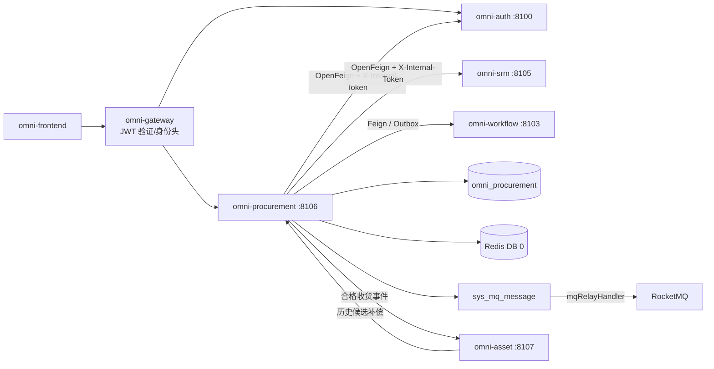
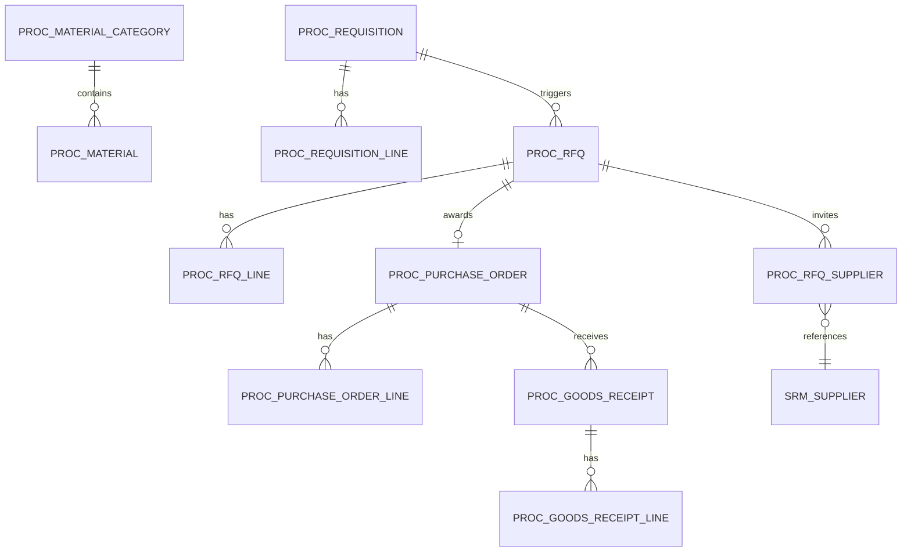
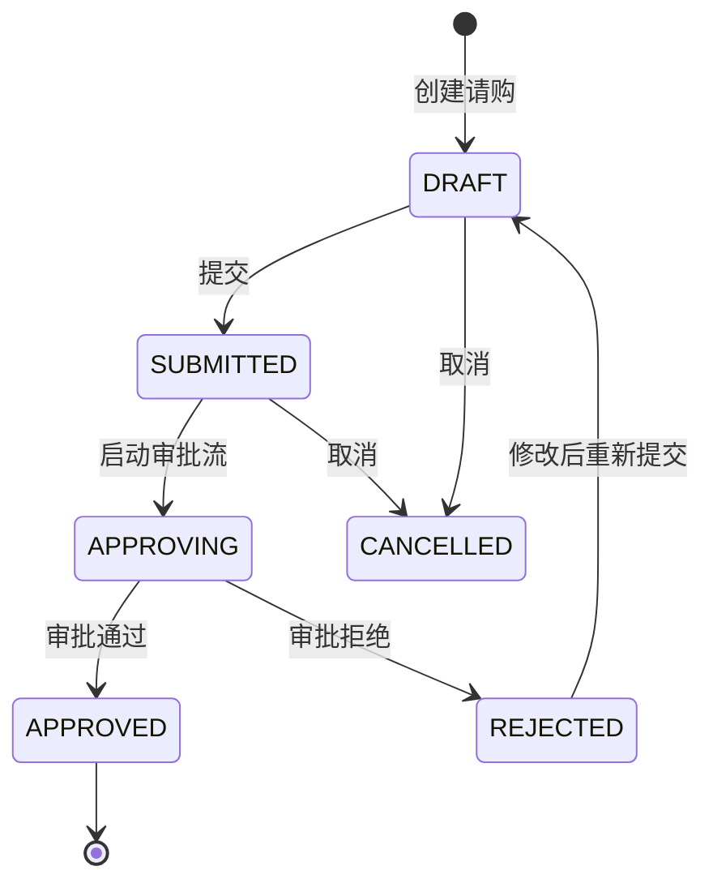
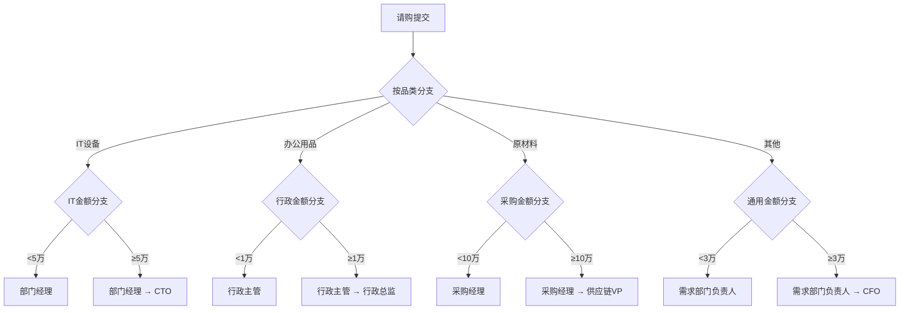
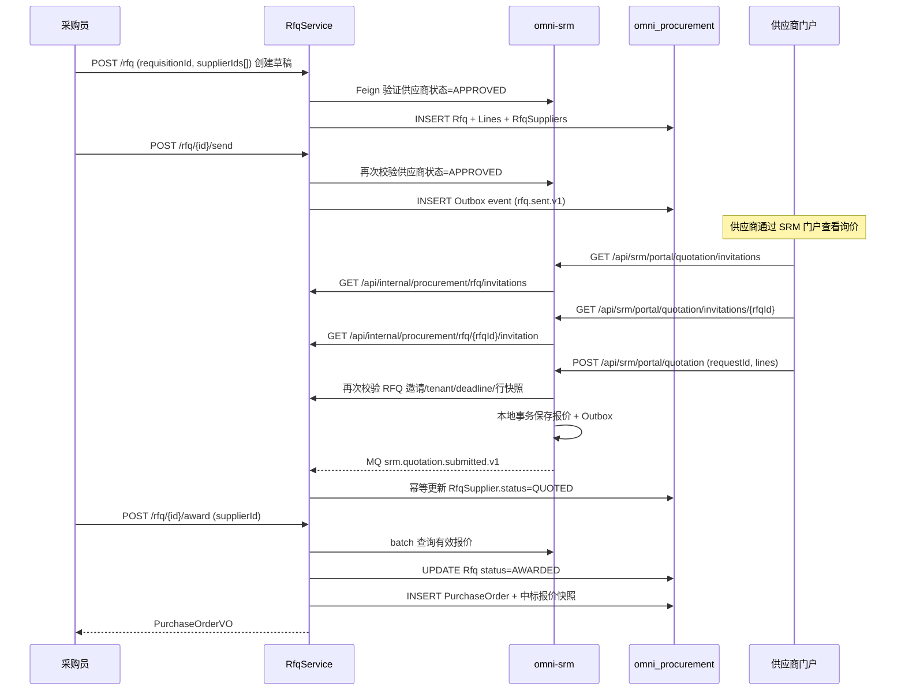
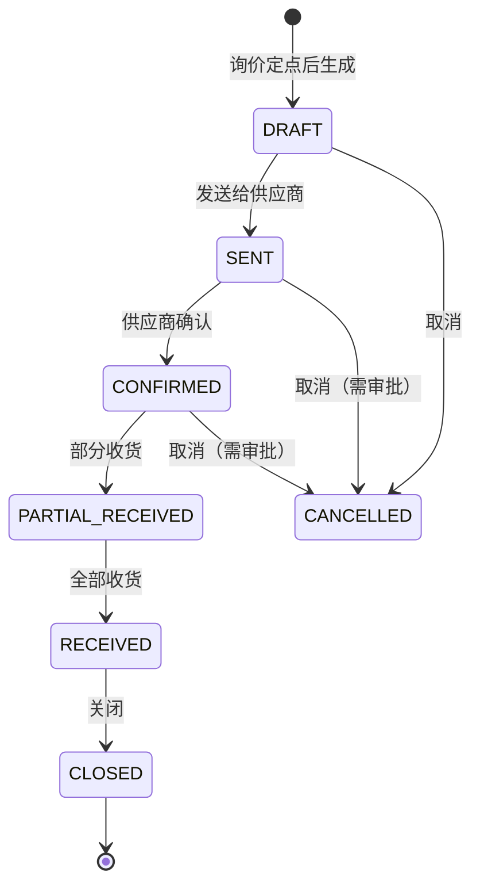
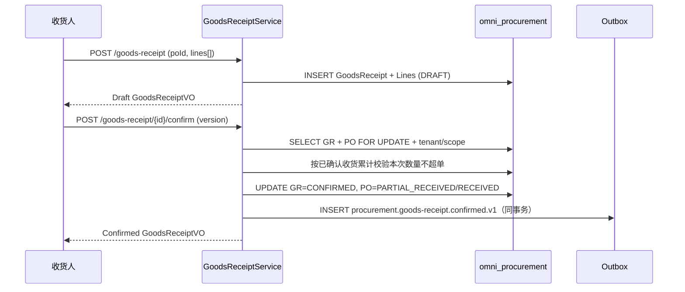

# 采购执行模块架构与实现基线

> 状态：MVP 已实现并完成验证
> 项目：Omni-Stack
> 日期：2026-07-27
> 目标：说明 omni-procurement MVP 的架构、跨服务契约和实施边界；实现入口为 `omni-backend/omni-procurement` 与 `omni-frontend/src/views/procurement`。

设计依据：`README.md`，以及 `docs/` 中 architecture、api-contract、backend-patterns、frontend-patterns、core-flows、scheduling、workflow、mq-reliability、docker-deployment 全部主题文档；同时参照 `docs/design/srm-design.md` 的 SRM 供应商模型。

## 1. 设计结论

采购执行应建设为独立 Servlet 微服务，与供应商管理（`omni-srm`）和资产管理（`omni-asset`）分离。SRM 是地基，Procurement 依赖 SRM 的供应商数据，Asset 依赖 Procurement 的采购来源数据。

| 项目 | 决策 |
|---|---|
| Maven 模块 / 服务名 | `omni-procurement` |
| 本地端口 / 管理端口 | `8106` / `19906` |
| XXL-JOB 执行器 | `omni-procurement` / `9906`（启用定时提醒时） |
| 数据库 | `omni_procurement` |
| Gateway | `/api/procurement/**` → `lb://omni-procurement`，不使用 `StripPrefix` |
| Redis | DB 0，共享 Auth 写入的 XSS 配置；键使用 `proc:` 前缀 |
| 前端 | 继续使用 `omni-frontend`，新增 `views/procurement/**` |

Procurement MVP 覆盖采购执行闭环：

> 物料目录 → 请购申请 → 审批 → 询价/比价 → 定点 → 采购订单 → 收货确认。

三单匹配（PO + 收货单 + 发票）和付款不进入 MVP，留给 ERP 或财务系统。合同管理在 Phase 2 引入。

## 2. 产品范围

### 2.1 用户与目标

| 用户 | 核心诉求 |
|---|---|
| 需求部门员工 | 提交采购申请，跟踪请购进度 |
| 采购员 | 管理询价、比价、下单、跟踪订单进度 |
| 采购经理 | 审批请购、管理采购流程、查看采购统计 |
| 部门经理/高管 | 审批请购（按金额阈值），查看采购支出 |
| 供应商 | 通过门户查看询价单并提交报价（复用 SRM 门户） |

MVP 应能回答：有多少待审批请购单；某个请购单审批到哪一步了；哪些询价单等待供应商报价；某个采购订单的收货状态；按品类/供应商/部门的采购支出统计。

### 2.2 分期

| 阶段 | 能力 |
|---|---|
| MVP | 物料目录、请购申请、审批流（品类+金额多维分支）、询价/比价、采购订单、收货确认、采购概览 |
| Phase 2 | 合同管理、反向拍卖、采购模板、框架协议、三单匹配、供应商绩效联动 |
| Phase 3 | 采购分析（价格趋势、供应商集中度）、预算管控、自动补货建议 |

## 3. 系统边界

| 组件 | 权威职责 | Procurement 的使用方式 |
|---|---|---|
| `omni-auth` | 租户、用户、组织、角色、权限、数据范围、XSS 配置 | 内部 OpenFeign；只存用户/组织 ID |
| `omni-srm` | 供应商数据（准入、分级、风险） | 内部 OpenFeign 查询供应商；供应商门户报价通过 SRM 服务 |
| `omni-base` | 字典、操作日志 | 操作日志汇聚 |
| `omni-workflow` | BPMN、流程实例、审批、Flowable 引擎唯一运行时 | 内部 OpenFeign 启动/查询/取消流程，消费审批结果事件 |
| `omni-procurement` | 物料、请购、询价、采购订单、收货 | 唯一业务写入方 |
| `omni-asset` | 资产管理 | 收货验收通过后，通过 Outbox 事件和受控历史补偿创建资产卡片 |
| XXL-JOB | 触发批量扫描 | 订单超期提醒（Phase 2） |
| RocketMQ | 异步运输 | 至少一次；消费者必须幂等 |



推荐依赖：`omni-common-core`、`omni-common`、`omni-common-mybatis`、`omni-common-redis`、`omni-common-operlog`、`omni-common-job`、`omni-common-mqlog`，以及 Web、Validation、Security、AspectJ、OpenFeign、LoadBalancer、Nacos、RocketMQ Stream、Actuator、Lombok。

**Procurement 不依赖 `omni-common-workflow`，也不在本服务嵌入 Flowable。** `omni-workflow` 是独立微服务和 Flowable 唯一运行时；Procurement 通过内部 Feign 契约发起流程，通过可靠领域事件接收审批结果。跨服务 DTO 应位于纯契约模块或由 Feign 客户端本地定义，不能因此引入 Flowable Starter。

## 4. 领域与数据设计

### 4.1 聚合

| 聚合 | 表 | 职责 |
|---|---|---|
| ProcurementConfig | `proc_tenant_config`、`proc_approval_route` | 租户币种与品类/金额审批模型路由 |
| Material | `proc_material_category`、`proc_material` | 物料品类树、物料目录 |
| Requisition | `proc_requisition`、`proc_requisition_line` | 请购申请、明细行；审批任务和记录由 omni-workflow 权威管理 |
| RFQ | `proc_rfq`、`proc_rfq_line`、`proc_rfq_supplier` | 询价单、明细行、受邀供应商 |
| PurchaseOrder | `proc_purchase_order`、`proc_purchase_order_line` | 采购订单、明细行 |
| GoodsReceipt | `proc_goods_receipt`、`proc_goods_receipt_line` | 收货单、明细行 |



### 4.2 通用字段与规则

每一张 `proc_*` 表都必须包含 `tenant_id`。可授权业务表还必须包含：

- `tenant_id`：租户隔离。
- `owner_user_id`：SELF 范围（请购申请人 / 采购员）。
- `owner_unit_id`：DEPT/DEPT_AND_BELOW 范围。
- `version`：乐观锁。
- `deleted`：逻辑删除。
- `id/create_time/update_time/create_by/update_by`：审计字段。

约束：

- 供应商 ID 由 SRM 管理，Procurement 只存 `supplier_id`，不建跨库外键。
- 物料编号 `material_code` 在 tenant 内唯一。
- 请购单号 `requisition_no`、询价单号 `rfq_no`、订单号 `po_no`、收货单号 `gr_no` 由数据库 ID 生成，tenant 内唯一。
- 数量和单价使用 `DECIMAL(19,6)` / `BigDecimal`，行金额和总金额使用 `DECIMAL(19,4)` / `BigDecimal`；HTTP JSON 一律使用十进制字符串承接，禁止经 JavaScript `number` 计算。币种使用 ISO 4217 三位码（MVP 强制租户默认币种）。
- 时间统一 `yyyy-MM-dd HH:mm:ss`。
- 普通 PUT 不允许直接修改审批状态、订单状态。
- 外部请求不得使用裸 `selectById/updateById/deleteById`。

### 4.3 主要表

`proc_tenant_config`

- `tenant_id/currency_code/initialized_time/version` 与审计字段，tenant 内唯一。

`proc_approval_route`

- `route_code/category_code/min_amount/max_amount/model_version_id/priority/status/version/deleted` 与审计字段。
- 精确品类优先于 `category_code='*'` 默认路由；区间语义为 `min_amount <= total_amount < max_amount`，max 为空表示无上限。
- 同品类活动金额区间不得重叠；提交请购时匹配零条或多条都返回 409，客户端不得传 modelVersionId。

`proc_material_category`

- `tenant_id/parent_id/category_code/category_name/sort/status/version/deleted` 与审计字段。
- 支持任意层级品类树（parent_id 为 0 表示顶级品类），物料只能关联叶子品类。
- MVP 在物料目录页提供品类树管理；`category_code` 创建后不可修改，更新和删除必须携带 `version` 并执行条件更新。

`proc_material`

- `tenant_id/category_id/material_code/material_name/specification/unit/asset_managed/status/version/deleted`。
- `specification` 为文本描述（MVP 不做结构化规格参数）。
- `unit` 为规范化的大写计量单位（如 EA、PCS、UNIT、SET、KG）。
- `asset_managed` 表示合格收货后是否按“每个单位一张资产卡片”进入 Asset；仅 `EA/PCS/UNIT/SET` 可启用，耗材、服务和 KG 等连续计量物料必须为 false。
- 索引：tenant + category_id/status、tenant + material_code（唯一）。

`proc_requisition`

- `requisition_no/title/requester_user_id/requester_unit_id/reason/primary_category_code/total_amount/currency_code`。
- `status`：DRAFT/SUBMITTED/APPROVING/APPROVED/REJECTED/CANCELLED。
- `approval_attempt/workflow_request_id/workflow_business_key/workflow_model_version_id/process_instance_id`：当前审批轮次及 Workflow 幂等快照；businessKey 固定为 `{requisitionId}:{approvalAttempt}`。
- `workflow_start_status`：NOT_STARTED/PENDING/FAILED/STARTED；与业务 status 分离，失败时业务状态仍为 SUBMITTED。
- `approved_time/workflow_completed_time`：审批完成时间快照；审批意见仍以 Workflow 为权威，Procurement 不复制或伪造最终意见。
- `owner_user_id/owner_unit_id/version/deleted` 和审计字段。

`proc_requisition_line`

- `line_no/requisition_id/material_id/material_code/material_name/category_code/unit/quantity/estimated_unit_price/estimated_total_price/remark`；物料编码、名称、品类和单位均为提交时快照。
- 请购单总金额 = SUM(line.estimated_total_price)。
- MVP 强制一张请购的所有行属于同一品类；跨品类需求拆成多张请购，避免单值审批路由语义不确定。

`proc_rfq`

- `rfq_no/requisition_id/title/quotation_deadline/currency_code/status/sent_time/owner_user_id/owner_unit_id/version/deleted`。
- `status`：DRAFT/SENT/CLOSED/AWARDED/CANCELLED。
- `awarded_supplier_id/awarded_quotation_id/awarded_quotation_version/awarded_time`：定点与报价版本快照。
- 关联请购单（一个请购可生成多个询价单，按品类拆分）。

`proc_rfq_line`

- `rfq_id/line_no/material_id/material_code/material_name/category_code/unit/quantity/remark/version/deleted`，全部为请购行快照。

`proc_rfq_supplier`

- `rfq_id/supplier_id/supplier_name_snapshot/invited_time/quotation_id/quotation_version/quotation_request_id/quotation_time/status/version/deleted`。
- `status`：INVITED/QUOTED/EXPIRED/AWARDED/REJECTED。`AWARDED/REJECTED` 为定点后的只读历史终态，不能继续报价。
- 仅当 RFQ `status=SENT`、邀请 `status IN (INVITED, QUOTED)` 且当前时间不晚于 deadline 时可提交或更新报价。
- `quotation_id` 逻辑关联 SRM 的 `srm_quotation`（不建跨库外键）；`supplier_name_snapshot` 仅用于历史展示，不作为当前供应商状态或权限依据。

`proc_purchase_order`

- `po_no/rfq_id/supplier_id/quotation_id/quotation_version/title/total_amount/currency_code`。
- 中标报价的供应商名称、逐行单价、交期等直接复制到 PO/PO Line 形成不可变业务快照；quotation_id/version 仅用于追溯。
- `status`：DRAFT/SENT/CONFIRMED/PARTIAL_RECEIVED/RECEIVED/CLOSED/CANCELLED。
- `order_time/expected_delivery_date/actual_delivery_date`。
- `delivery_address/contact_name/contact_phone`。
- `owner_user_id/owner_unit_id/version/deleted` 和审计字段。

`proc_purchase_order_line`

- `po_id/material_id/material_name/unit/quantity/unit_price/total_price/remark`。

`proc_goods_receipt`

- `gr_no/po_id/receiver_user_id/receive_time/remark/status/owner_user_id/owner_unit_id/version/deleted`。
- `status`：DRAFT/CONFIRMED。
- 确认后触发 Outbox 事件通知 Asset 创建资产卡片。

`proc_goods_receipt_line`

- `goods_receipt_id/po_line_id/material_id/material_name/unit/ordered_quantity/received_quantity/quality_status/remark`。
- `quality_status`：PASS/FAIL/PENDING。
- 收货数量可小于等于订单数量（分批收货）。

## 5. 状态机与核心流程

### 5.1 请购申请（Requisition）



请购提交后启动 Flowable 审批流程。审批流使用 Exclusive Gateway 按物料品类和金额路由到不同审批人。

### 5.2 审批流设计（与 omni-workflow 集成）



实现方式：
- 在 `omni-workflow` 中为每个品类创建一个 BPMN 流程模型（如 `procurement_approval_it`、`procurement_approval_office` 等）。
- 或者使用一个通用 BPMN，通过 Exclusive Gateway 的两级嵌套（品类 → 金额）实现路由。
- Procurement 服务在请购提交时，根据请购的唯一品类和服务端重算总金额，从 `proc_approval_route` 选择已发布的 modelVersionId，通过 Workflow 内部 API 启动流程；客户端不能指定模型版本。
- 审批人通过 Flowable 的 `ScopedRoleAssignmentListener` 动态解析（利用已有的组织架构+角色体系）。

跨服务启动必须可重试：每次从 DRAFT 提交时先将 `approvalAttempt + 1`，生成并持久化 requestId 与 `businessKey={requisitionId}:{approvalAttempt}`；Procurement 以 `tenantId + businessType(PROCUREMENT_REQUISITION) + businessKey` 作为当前轮次幂等键。先以本地事务更新为 `status=SUBMITTED, workflow_start_status=PENDING`，事务提交后调用 Workflow；成功后写入 processInstanceId，设置 workflow_start_status=STARTED 并推进到 APPROVING。响应丢失或调用失败时保留 `status=SUBMITTED, workflow_start_status=FAILED`，retry 必须复用已保存的 requestId/businessKey/modelVersionId 且不得增加 attempt。REJECTED 修改成功后回到 DRAFT，再提交才开启新 attempt，避免 Workflow 永久业务键唯一约束重放旧流程。

**MVP 约束**：单张请购仅允许一个品类；审批路由支持精确品类与 `*` 默认路由，BPMN 可按金额分支。后续需要跨品类请购时再定义明确的主品类或多流程策略，禁止当前版本隐式取第一行。

### 5.3 询价/比价（RFQ）



比价方式：MVP 提供简单的比价视图——通过 `GET /api/internal/quotation/batch` 列出受邀供应商的有效报价（单价、总价、交期），采购员手动选择定点供应商。不做自动评标算法。定点事务必须保存 quotationId、报价版本以及金额/交期不可变快照，后续 SRM 报价变更不得改变既有定点和采购订单。

### 5.4 采购订单（Purchase Order）



### 5.5 收货确认（Goods Receipt）



创建 DRAFT 不占用订单已收数量，也不发送事件。确认时必须锁定 PO，重新基于所有 CONFIRMED 收货行累计校验，防止多个草稿并发确认导致超收。确认成功后写 Outbox 事件 `procurement.goods-receipt.confirmed.v1`；Asset 尚未建设时不阻塞 Procurement，但不能假设历史事件会一直滞留在 Outbox/Broker，Asset 上线必须执行下文定义的历史补偿回扫。

只有 `quality_status=PASS`、`asset_managed=true` 且 receivedQuantity 为正整数的收货行可以资产化。PENDING/FAIL 行、耗材、服务和连续计量物料不会创建资产。PENDING 后续通过 `POST /goods-receipt/{id}/quality-result` 变为 PASS 时，Procurement 发布 `procurement.goods-receipt.quality-passed.v1`，仅携带本次新通过的行；禁止修改或复用已经发送的 confirmed 事件。

## 6. 租户、RBAC 与数据权限

### 6.1 信任链

与 SRM 一致：Gateway JWT → Procurement Tenant 校验 → @PreAuthorize → @ProcDataScope → MyBatis DataPermission → ProcRecordAccessGuard。

### 6.2 权限树与角色

菜单：`procurement`（DIRECTORY）以及 `procurement:overview`、`procurement:material`、`procurement:approval-route`、`procurement:requisition`、`procurement:rfq`、`procurement:purchase-order`、`procurement:goods-receipt`（MENU）。只为已经交付的页面种 MENU，避免动态侧栏出现死链接。

API 权限：

- `procurement:overview:list`
- `procurement:material:list/create/update/delete`
- `procurement:approval-route:list/create/update/delete`
- `procurement:requisition:list/create/update/delete/submit/approve/cancel`
- `procurement:rfq:list/create/update/delete/send/award/cancel`
- `procurement:purchase-order:list/update/delete/send/confirm/cancel`（采购订单仅由 RFQ 定点生成）
- `procurement:goods-receipt:list/create/confirm`

| 角色 | dataScope | 能力 |
|---|---|---|
| `PROCUREMENT_MANAGER` | DEPT_AND_BELOW | 部门及下级、审批、统计 |
| `PROCUREMENT_STAFF` | SELF | 自己负责的请购、询价、订单及 SELF 范围概览 |
| `EMPLOYEE` | SELF | 提交和查看自己的请购 |
| `TEAM_LEADER` | DEPT | Workflow 分配给本人的审批及部门审批业务视图 |
| `DEPT_LEADER` | DEPT_AND_BELOW | Workflow 分配给本人的审批及部门树审批业务视图 |
| `SUPER_ADMIN` | ALL | 所有功能，采购数据仍限当前租户 |

默认 USER 不授予采购权限。

### 6.3 Procurement 上下文与 SQL 拦截

与 SRM/CRM 模式一致：`ProcTenantContext`、`ProcDataScopeContext`、`@ProcDataScope` 切面、`ProcDataPermissionHandler`、`ProcRecordAccessGuard`。

拦截器顺序固定：`TenantLineInnerInterceptor → DataPermissionInterceptor → PaginationInnerInterceptor`。

| dataScope | 条件 |
|---|---|
| SELF | `requester_user_id = currentUserId` 或 `owner_user_id = currentUserId` |
| DEPT | `requester_unit_id = primaryUnitId` |
| DEPT_AND_BELOW / CUSTOM | `requester_unit_id IN accessibleUnitIds` |
| TENANT / ALL | 不加 owner 条件，TenantLine 始终保留 |

上表仅描述作用域语义，实际 SQL 必须按表映射，禁止把 `requester_user_id OR owner_user_id` 机械追加到所有 `proc_*` 表：

| 资源/表 | SELF 列 | DEPT/CUSTOM 列 | 子资源约束 |
|---|---|---|---|
| Requisition | `requester_user_id` | `requester_unit_id` | Line 通过同 tenant 的 requisition_id 继承 |
| RFQ | `owner_user_id` | `owner_unit_id` | Line/Supplier 通过同 tenant 的 rfq_id 继承 |
| PurchaseOrder | `owner_user_id` | `owner_unit_id` | Line 通过同 tenant 的 po_id 继承 |
| GoodsReceipt | `owner_user_id`（收货负责人） | `owner_unit_id` | Line 通过同 tenant 的 goods_receipt_id 继承 |
| Material/Category | 无 SELF 私有语义 | 由功能权限控制，租户内共享 | 始终保留 TenantLine |
| Overview | 按当前 permissionCode 映射到对应业务表 owner/requester 列 | 同左 | 聚合 SQL 必须应用与列表相同范围 |

### 6.4 审批流权限

请购审批由独立的 `omni-workflow` 驱动，审批人由 `ScopedRoleAssignmentListener` 动态解析。用户在 Workflow 的 `/api/workflow/approval/{taskId}/complete` 完成任务；Workflow 必须同时校验功能权限和当前任务候选人/受理人身份。

承担请购审批的 `TEAM_LEADER/DEPT_LEADER/PROCUREMENT_MANAGER` 必须同时获得 `procurement:requisition:approve`（读取专用业务审批 VO）和 `workflow:approval:complete`（完成本人 Workflow 任务）。两者缺一不可，租户初始化和角色 seed 必须同步维护。

审批人在查看业务表单时使用 `procurement:requisition:approve` 权限，但审批可见范围不受普通 requester/owner dataScope 限制。为避免形成通用绕过，Procurement 提供专用 `GET /api/procurement/requisition/{id}/approval-view?taskId={taskId}`：先通过 Workflow 内部 API 校验 taskId 属于当前 tenant、businessKey 等于该 requisitionId，且任务已分配给当前用户，再按 `tenant_id + id` 读取只读审批 VO。普通详情接口仍执行 DataPermission，禁止复用此例外。

## 7. API 设计

### 7.1 通用契约

与 SRM 一致：`R<T>`、`R<PageResult<T>>`、`page=1`、`size=10`、`size <= 100`。

### 7.2 端点

| 领域 | 端点 |
|---|---|
| Overview | `GET /api/procurement/overview/summary`、`/spend-analysis` |
| Material Category | `GET /material/category/list`、`POST /material/category`、`PUT/DELETE /material/category/{id}`；更新 body 和删除 query 均携带 `version` |
| Material | `GET /material/list`、`GET /material/{id}`、`POST /material`、`PUT/DELETE /material/{id}`；更新 body 和删除 query 均携带 `version` |
| Approval Route | `GET /approval-route/list`、`POST /approval-route`、`PUT/DELETE /approval-route/{id}` |
| Requisition | `GET /requisition/list`、`GET /requisition/{id}`、`POST /requisition`、`PUT/DELETE /requisition/{id}` |
| Requisition 审批视图 | `GET /requisition/{id}/approval-view?taskId={taskId}`（先校验 Workflow 任务分配） |
| Requisition 命令 | `POST /requisition/{id}/submit`、`/retry-start`、`/cancel` |
| RFQ | `GET /rfq/list`、`GET /rfq/{id}`、`POST /rfq`、`PUT/DELETE /rfq/{id}` |
| RFQ 命令 | `POST /rfq/{id}/send`、`/award`、`/cancel` |
| Purchase Order | `GET /purchase-order/list`、`GET /purchase-order/{id}`、`POST /purchase-order`、`PUT/DELETE /purchase-order/{id}` |
| PO 命令 | `POST /purchase-order/{id}/send`、`/confirm`、`/cancel` |
| Goods Receipt | `GET /goods-receipt/list`、`GET /goods-receipt/{id}`、`POST /goods-receipt` |
| GR 命令 | `POST /goods-receipt/{id}/confirm`、`/quality-result` |

Overview 摘要固定返回审批中的请购数量、截止时间内仍有 `INVITED` 供应商的 `SENT` RFQ 数量、
采购订单各状态数量、收货草稿数量，以及按 `currencyCode` 分组的已确认采购承诺金额。
采购承诺与支出仅统计 `CONFIRMED/PARTIAL_RECEIVED/RECEIVED/CLOSED` 订单，不包含
`DRAFT/SENT/CANCELLED`。`spend-analysis` 的 `dimension` 支持
`CATEGORY/SUPPLIER/DEPARTMENT`，其中 DEPARTMENT 表示采购订单 `owner_unit_id`；
结果先按币种、再按金额降序排列，`limit` 范围为 1–100。任何接口都不得跨币种直接求和。

### 7.3 端点与 DataScope permission 映射

| 操作 | permissionCode |
|---|---|
| Overview | `procurement:overview:list` |
| Material list/detail | `procurement:material:list` |
| Material create/update/delete | `procurement:material:create/update/delete` |
| Approval route list/create/update/delete | `procurement:approval-route:list/create/update/delete` |
| Requisition list/detail | `procurement:requisition:list` |
| Requisition create/update/delete | `procurement:requisition:create/update/delete` |
| Requisition submit | `procurement:requisition:submit` |
| Requisition retry-start | `procurement:requisition:submit` |
| Requisition approve | `procurement:requisition:approve` |
| Requisition cancel | `procurement:requisition:cancel` |
| RFQ list/detail | `procurement:rfq:list` |
| RFQ create/update/delete/send/award/cancel | `procurement:rfq:create/update/delete/send/award/cancel` |
| PO list/detail | `procurement:purchase-order:list` |
| PO update/delete/send/confirm/cancel | `procurement:purchase-order:update/delete/send/confirm/cancel`（无外部 create，订单仅由 RFQ 定点生成） |
| GR list/detail | `procurement:goods-receipt:list` |
| GR create/confirm/quality-result | `procurement:goods-receipt:create/confirm`（quality-result 复用 confirm 权限） |

## 8. 跨服务一致性

### 8.1 Auth Feign

与 SRM 一致：只存 userId/unitId，分配前验证用户存在、启用、同租户。列表 batch enrich，禁止 N+1。

### 8.2 SRM Feign

Procurement 通过 SRM 内部 API 获取供应商数据：

- `GET /api/internal/supplier/{id}?tenantId={tenantId}`：获取供应商摘要。
- `GET /api/internal/supplier/search?tenantId={tenantId}&status=APPROVED&categoryCode={code}`：搜索合格供应商。
- `GET /api/internal/quotation/batch?tenantId={tenantId}&rfqId={rfqId}`：返回受邀供应商的有效报价、版本和完整行快照，用于比价和定点快照。
- 询价时验证供应商状态为 APPROVED，且不在黑名单。
- 列表展示供应商名称时，收集 supplier_id 后一次 batch Feign。

Procurement 同时向 SRM 提供两类内部只读接口：

- `GET /api/internal/procurement/rfq/invitations?supplierId={supplierId}`：返回当前供应商的邀请列表，至少包含 `rfqId/rfqNo/title/status/invitationStatus/quotationDeadline/currencyCode/invitedTime`。
- `GET /api/internal/procurement/rfq/{rfqId}/invitation?supplierId={supplierId}`：返回邀请详情和 RFQ 行快照，行至少包含 `rfqLineId/materialCode/materialName/unit/quantity/remark`。

SRM 必须以 PortalUser 关联得到的 supplierId 调用这些接口，不能使用门户请求传入的 supplierId。提交前再次校验 RFQ `status=SENT`、邀请 `status IN (INVITED, QUOTED)` 且未超过 quotationDeadline，报价 `validUntil` 不得早于 quotationDeadline，并校验提交 rfqLineId 集合与详情完全一致。SRM 保存报价后发布 `srm.quotation.submitted.v1`；Procurement 以 eventId Inbox 幂等消费并更新自己的 `proc_rfq_supplier`，SRM 不得跨库写 Procurement 表。

所有上述内部接口统一使用 `/api/internal/**` 前缀，要求 `X-Internal-Token` 和 `X-Tenant-Id`；若接口同时携带 query/body tenant，则必须与 header tenant 一致。Gateway 不转发该前缀。

SRM 不可用时：
- 供应商展示：可返回 ID/未知供应商。
- 询价/下单：不能继续，返回 503。

### 8.3 Workflow 集成

Procurement 不嵌入 Flowable，通过 `X-Internal-Token` 保护的 Workflow 内部 API 集成。请购审批流程：

1. Procurement 将请购条件更新为 SUBMITTED，事务提交后调用 Workflow `POST /api/internal/workflow/process-instance/start`。
2. 请求包含已持久化的 `requestId`、`tenantId`、`modelVersionId`、`businessType=PROCUREMENT_REQUISITION`、`businessKey={requisitionId}:{approvalAttempt}`、`startUserId` 和 variables。
3. `variables` 包含 `requisitionId`、`approvalAttempt`、`materialCategory`（唯一品类 code）、`totalAmount`（总金额十进制字符串）、`requesterUnitId`（申请部门）；Workflow 按 modelVersionId 对应的已发布 BPMN 启动实例。
4. Workflow 对 `tenantId + businessType + businessKey` 建唯一幂等约束；重复请求返回已有 processInstanceId。
5. Procurement 保存 processInstanceId，将状态推进到 APPROVING。超时或响应丢失时以同一 requestId/businessKey 重试。
6. 审批结束后，Workflow 在本地事务中发布 `workflow.process.completed.v1`，携带 eventId、tenantId、businessType、businessKey、processInstanceId、result 和 completedTime。
7. Procurement 使用 Inbox 唯一键幂等消费，仅当 tenant/businessKey（含当前 attempt）/processInstanceId 均匹配且当前状态为 APPROVING 时更新为 APPROVED、REJECTED 或 CANCELLED，并发送采购领域事件。若完成事件早于本地 `markStarted` 到达，必须抛出可重试异常且不能把 Inbox 标成已处理；旧 attempt 事件只做幂等忽略。

工作流集成遵循 `docs/workflow.md` 的规范：
- `model_key` 在租户内唯一。
- 通过 `processDefinitionId` 启动流程，不使用 `processKey`。
- 流程实例追溯字段记录在 `wf_process_instance_ext`。
- Flowable 表和运行时只存在于 `omni-workflow` 数据库，Procurement 不依赖 `omni-common-workflow`。
- 不使用未定义且不可靠的同步 `WorkflowCallbackService`；审批结果通过 Workflow Outbox 事件交付。

### 8.4 Asset 联动

收货确认后写 Outbox 事件 `procurement.goods-receipt.confirmed.v1`。事件 payload 包含：

```json
{
  "eventId": "018f...uuid",
  "eventType": "procurement.goods-receipt.confirmed.v1",
  "occurredAt": "2026-07-13 10:30:00",
  "tenantId": 1,
  "payload": {
    "goodsReceiptId": 301,
    "grNo": "GR202607130001",
    "purchaseOrderId": 201,
    "poNo": "PO202607100001",
    "supplierId": 101,
    "supplierNameSnapshot": "某某科技",
    "purchaseDate": "2026-07-13 10:30:00",
    "currencyCode": "CNY",
    "ownerUserId": 1001,
    "ownerUnitId": 2001,
    "lines": [
      {
        "goodsReceiptLineId": 401,
        "purchaseOrderLineId": 501,
        "materialId": 601,
        "materialCode": "IT-NB-001",
        "materialNameSnapshot": "ThinkPad X1 Carbon",
        "categoryCode": "IT_DEVICE",
        "unit": "台",
        "receivedQuantity": "5.000000",
        "qualityStatus": "PASS",
        "assetManaged": true,
        "assetQuantity": 5,
        "unitPrice": "12000.000000",
        "totalPrice": "60000.0000"
      }
    ]
  }
}
```

`ownerUserId/ownerUnitId` 是收货单管理归属的不可缺失快照，Asset 直接继承为新资产的管理人和管理部门；不得用供应商门户用户或消息消费线程身份猜测。数量、单价和金额沿用 Procurement 十进制字符串契约，只有整型计数 `assetQuantity` 使用 JSON number。

`omni-asset` 只对满足资产化条件的行按 `assetQuantity` 创建资产卡片。实时事件使用
`consumerName + eventId` 的 Inbox 唯一键幂等，实时消费和历史回扫共同使用
`tenantId + goodsReceiptLineId + unitSequence` 的资产来源唯一键兜底；同一幂等键绑定不同完整业务意图时返回冲突，不得静默覆盖。

Outbox 只保证事件可靠投递到 Broker；消息一旦发送成功会进入 SENT，不保证为未来尚未部署的消费者无限期保留。Asset 上线时必须执行补偿回扫：通过 `GET /api/internal/procurement/goods-receipt/asset-candidates?tenantId={tenantId}&afterId={id}&size={size}` 分页读取全部已确认且可资产化的历史收货行，按同一幂等键补建。实时消费与历史回扫可以并行，Inbox 唯一约束保证不会重复。

### 8.5 Outbox 事件

- `procurement.requisition.submitted.v1`
- `procurement.requisition.approved.v1`
- `procurement.requisition.rejected.v1`
- `procurement.rfq.sent.v1`
- `procurement.rfq.awarded.v1`
- `procurement.purchase-order.created.v1`
- `procurement.purchase-order.confirmed.v1`
- `procurement.goods-receipt.confirmed.v1`
- `procurement.goods-receipt.quality-passed.v1`

## 9. 隐私、操作日志与 XSS

### 9.1 OperLog 脱敏

复用已有的 PII 脱敏能力。Procurement 需要脱敏的字段：

- 收货地址（`delivery_address`）
- 联系人手机（`contact_phone`）

### 9.2 PII

- 收货地址和联系人手机在列表页默认掩码。
- 详情按权限展示。
- 采购订单打印/导出时（Phase 2）需完整值，使用独立权限。

### 9.3 XSS

Procurement 必须实现 `XssConfigProvider`，读取 Redis DB 0 配置。MVP 备注只允许纯文本。

## 10. 前端设计

```text
omni-frontend/src/
├── api/
│   ├── procurement-overview.ts
│   ├── procurement-material.ts
│   ├── procurement-requisition.ts
│   ├── procurement-rfq.ts
│   ├── procurement-purchase-order.ts
│   └── procurement-goods-receipt.ts
├── views/procurement/
│   ├── overview/index.vue           # 采购概览 + 支出分析
│   ├── material/index.vue           # 物料目录管理
│   ├── requisition/index.vue        # 请购管理
│   ├── rfq/index.vue                # 询价管理
│   ├── purchase-order/index.vue     # 采购订单管理
│   └── goods-receipt/index.vue      # 收货管理
└── components/procurement/
    ├── RequisitionForm.vue          # 请购表单（含明细行动态增删）
    ├── RfqCompareView.vue           # 比价视图（多供应商报价对比表格）
    ├── PurchaseOrderTracker.vue     # 订单进度跟踪
    └── GoodsReceiptForm.vue         # 收货表单（含质检状态）
```

- `ApiResponse/PageResult` 只从 `src/types/api.ts` 导入。
- 请购表单支持明细行动态增删（添加/移除物料行）。
- 比价视图使用 Element Plus 表格横向对比各供应商报价。
- Workflow 待办列表本身不携带 Procurement businessKey；打开任务时先调用 `/api/workflow/task/{taskId}/form`，从 variables 读取 `businessType/requisitionId`，再加载 Procurement `approval-view`。业务表单加载或任务分配校验失败时必须禁止提交审批。
- `router/index.ts` 与 `layout/index.vue` iconMap 补 Procurement。
- `constants/menu.ts`、`zh-CN.ts`、`en-US.ts` 同步。

## 11. 工程落点

### 11.1 新模块

```text
omni-backend/omni-procurement/
├── pom.xml
└── src/main/
    ├── java/com/omni/procurement/
    │   ├── ProcurementApplication.java
    │   ├── client/ config/ controller/ dto/ entity/
    │   ├── mapper/ security/ service/ service/impl/
    │   └── workflow/                    # Workflow Feign 客户端和审批结果事件消费者
    └── resources/
        ├── application.yml
        ├── application-dev.yml
        └── mapper/
```

`ProcurementApplication` 使用 `@EnableDiscoveryClient`、`@EnableFeignClients(basePackages="com.omni.procurement.client")`、`@MapperScan("com.omni.procurement.mapper")`。

### 11.2 必改文件

| 文件 | 修改 |
|---|---|
| `omni-backend/pom.xml` | 加入 `omni-procurement` |
| Gateway `application.yml` | 显式 `/api/procurement/**` 路由 |
| `docker/backend/Dockerfile` | POM 缓存层 |
| `docker-compose.yml` | Procurement 服务、8106 |
| `start.bat/start.sh` | build 列表加入 Procurement |
| `scripts/sql/init-all.sql` | `omni_procurement` DDL、物料品类种子数据、权限和角色 |
| `scripts/sql/sp_init_tenant.sql` | 新租户初始化同步 |
| `omni-workflow` | 增加幂等内部启动/任务分配校验 API，以及 `workflow.process.completed.v1` Outbox 事件 |
| `docs/workflow.md` | 补充跨服务幂等启动、结果事件和采购审批流程模型说明 |
| Frontend router/layout/menu/locales | 图标、菜单、i18n |

配置要点：server 8106、management 19906、Redis DB 0、XXL appname `omni-procurement`/port 9906。

## 12. 非功能设计

### 性能

- 所有列表分页，最大 100。
- 供应商名称一次 batch enrich，禁止 N+1。
- 概览统计使用 Mapper 层聚合 SQL（按品类/供应商/负责部门及币种的采购支出 `GROUP BY`），
  每个聚合根继续应用与其列表相同的 requester/owner DataScope，禁止跨币种求和和逐记录查询。

### 并发与幂等

- 请购提交 → 审批流启动：本地状态条件更新 + Workflow 的 `tenantId + businessType + businessKey` 唯一幂等；超时使用相同 requestId 重试。
- 收货数量校验：`received_quantity <= ordered_quantity - already_received`，使用乐观锁。
- 询价定点：version 乐观锁 + RFQ 状态校验。
- 门户报价提交：SRM 用永久请求历史表以 `(tenantId, requestId)` 幂等、requestHash 防止同键异意图，并以 `(tenantId, rfqId, supplierId)` 约束唯一有效报价；相同意图重放返回当前快照，不重复发布事件。
- 报价事件和审批结果事件：各自使用 Inbox eventId 唯一键幂等消费；同一 quotationId 的旧 quotationVersion 不得覆盖新版本。

### 降级

- SRM 不可用：供应商展示降级为 ID；询价/下单拒绝（503）。
- Workflow 不可用：提交接口返回 503，请购保留 `status=SUBMITTED, workflow_start_status=FAILED` 可重试态；不得跳过审批，也不得重复启动流程。
- Auth 不可用：503 失败关闭。
- RocketMQ 不可用：Outbox 提交，Relay 后补。

## 13. 测试与验收

最低测试集：

- 请购状态机合法/非法迁移。
- 请购审批流启动和结果消费（Mock Workflow Feign/MQ，不在 Procurement 测试中启动 Flowable）。
- 审批结果事件重复、乱序、tenant/businessKey/processInstanceId 不匹配时不会错误更新请购。
- 审批人只能通过分配给自己的 taskId 读取 approval-view，不能利用该接口读取任意请购。
- 审批流按金额分支路由正确性。
- 询价定点生成采购订单。
- SRM 报价事件幂等消费；SRM 不能直接更新 Procurement 表。
- 定点后修改 SRM 报价不影响已保存的中标快照和采购订单。
- 收货数量不超过订单数量。
- 分批收货累计正确。
- 创建 DRAFT 不更新 PO 已收数量且不发事件；确认时才锁 PO、累计校验并投递。
- 两个可分别成立但合计超收的草稿并发确认时只有一个成功。
- PENDING 质检转 PASS 只发布新通过行的 quality-passed 事件，重复提交不重复资产化。
- 非资产物料、质检失败/待定、非整数连续计量收货不会生成资产候选。
- Asset 实时消费与历史补偿回扫并行时不重复创建资产。
- 跨租户隔离。
- 缺 tenant/scope 失败关闭。
- Outbox 事件写入完整性。

端到端验收：创建物料 → 提交请购 → 审批通过 → 创建询价 → 邀请供应商 → 供应商报价 → 比价定点 → 生成采购订单 → 收货确认 → Outbox 事件发出。

## 14. 实施顺序

### Milestone 0：前置确认

- 确认 SRM 已建设完成，供应商内部 API 可用。
- 确认 Workflow 服务可用，Flowable 引擎正常。
- 确认 Workflow 内部启动/任务校验 API 与 `workflow.process.completed.v1` 事件契约已就绪；Procurement 不引入 `omni-common-workflow`。

### Milestone 1：服务搭建 + 安全底座

- 创建模块、配置、Gateway、Docker、DB。
- TenantLine + DataPermission + Pagination。
- 权限树、Procurement 角色、已有租户迁移。
- 前端 root 菜单。

### Milestone 2：物料目录

- 品类树（任意层级）和物料 CRUD。
- 物料编号 tenant 内唯一。

### Milestone 3：请购 + 审批流

- 请购 CRUD（含明细行动态增删）。
- 请购提交 → Flowable 审批流启动。
- 审批结果事件幂等消费 → 请购状态更新。
- BPMN 流程模型创建（按品类+金额路由）。

### Milestone 4：询价/比价 + 采购订单

- 询价单 CRUD + 邀请供应商。
- 比价视图（手动定点）。
- 采购订单生成 + 状态跟踪。

### Milestone 5：收货 + 生产加固

- 收货确认（含质检状态）。
- 分批收货。
- Outbox 事件（收货确认 → Asset 联动）。
- Asset 历史补偿回扫内部 API。
- 概览统计。
- 测试、索引、安全验收。
- 更新 docs/、AGENTS.md。

## 15. ADR 摘要

| 决策 | 选择 | 原因 |
|---|---|---|
| 服务 | 独立 `omni-procurement` | 与 SRM/Asset 分离，职责清晰 |
| Workflow 集成 | 独立 `omni-workflow` 内部 API + 审批结果事件 | 保持 Flowable 唯一运行时和数据库边界 |
| 审批路由 | Exclusive Gateway 按品类+金额 | 多维审批决策，可扩展 |
| 比价方式 | 手动定点 | MVP 不做自动评标 |
| 收货 → Asset | Outbox 实时事件 + 历史补偿回扫 | 解耦且不依赖 Broker 为未来消费者永久保存消息 |
| 供应商数据 | Feign 调用 SRM | 不跨库读取 SRM 数据 |
| 三单匹配 | 不做 | 留给 ERP/财务系统 |
| MVP 品类管理 | 已开放前端管理 UI | 支持任意层级品类树自主维护 |

## 16. 主要风险

| 优先级 | 风险 | 处理 |
|---|---|---|
| P0 | Workflow 不可用或响应丢失造成审批半启动/重复启动 | 503 + SUBMITTED/FAILED 可重试启动状态 + 跨服务业务键幂等 |
| P0 | SRM 不可用导致无法询价/下单 | 503 拒绝操作，不绕过供应商校验 |
| P0 | 写操作绕过查询数据权限 | AccessGuard + 条件更新 |
| P1 | 审批流 BPMN 过于复杂 | MVP 先按金额单维度，后续加品类 |
| P1 | 收货数量超收 | 乐观锁 + 数量校验 |
| P0 | SRM 门户跨库写 RFQ 状态 | SRM 报价事件 + Procurement Inbox 消费，禁止跨库写 |
| P1 | Asset 未就绪导致历史收货错过消费 | 实时 Outbox + Asset 上线后的分页补偿回扫 |
| P2 | 品类审批分支数量膨胀 | 预留通用审批模板 + 配置化 |
