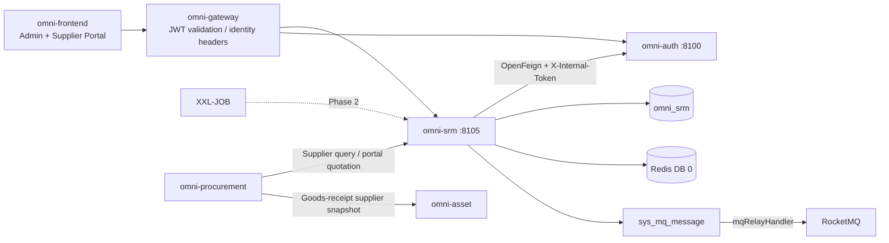
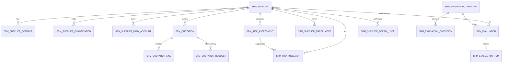
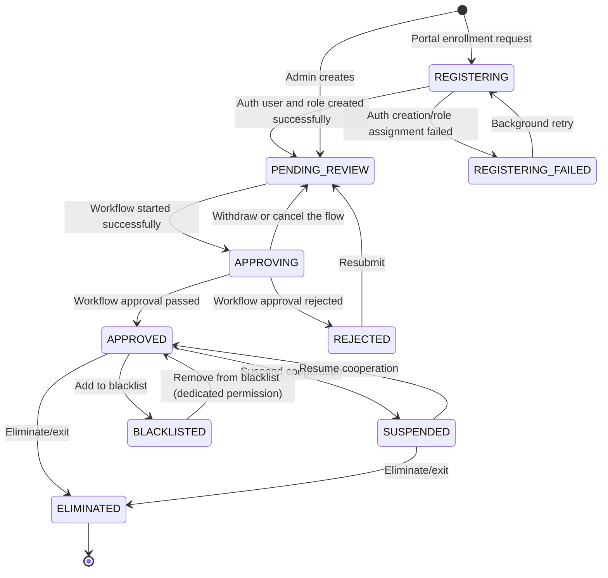
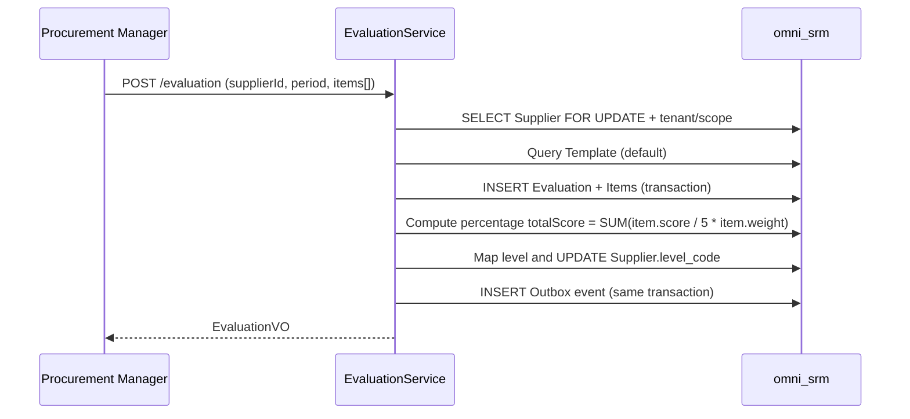
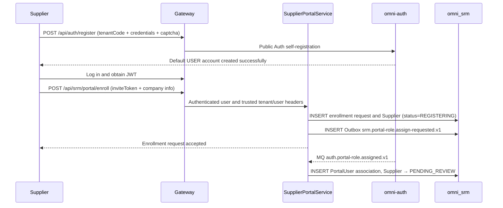

# SRM Supplier Management Module Architecture and Implementation Baseline

> Status: MVP implemented and hardened end-to-end
> Project: Omni-Stack
> Date: 2026-07-27
> Goal: Describe the architecture, cross-service contracts, and implementation boundaries of the omni-srm MVP; the implementation entry points are `omni-backend/omni-srm`, `omni-frontend/src/views/srm`, and `omni-frontend/src/views/supplier-portal`.

Design basis: `README.md`, and all topic documents in `docs/` — architecture, api-contract, backend-patterns, frontend-patterns, core-flows, scheduling, workflow, mq-reliability, docker-deployment; also references the CRM implementation pattern in `docs/design/crm-design.md`.

## 1. Design Conclusion

SRM should be built as an independent Servlet microservice, separated from procurement execution (`omni-procurement`) and asset management (`omni-asset`). The three are built step by step according to their dependencies: SRM → Procurement → Asset.

| Item | Decision |
|---|---|
| Maven module / service name | `omni-srm` |
| Local port / management port | `8105` / `19905` |
| XXL-JOB executor | `omni-srm` / `9905` (when scheduled evaluation or qualification alerts are enabled) |
| Database | `omni_srm` |
| Gateway | `/api/srm/**` → `lb://omni-srm`, without `StripPrefix` |
| Redis | DB 0, shares the XSS configuration written by Auth; SRM keys use the `srm:` prefix |
| Frontend | Continue to use `omni-frontend`, add `views/srm/**` (admin side) and `views/portal/**` (supplier portal) |

The SRM MVP covers the closed loop of full supplier lifecycle management:

> Supplier registration/admission → review → grading and classification → performance evaluation → risk control → elimination/exit.

Procurement execution (requisition, RFQ, order, goods receipt) and asset disposal (acceptance, transfer, scrap) are not included in the SRM MVP; they are implemented in `omni-procurement` and `omni-asset` respectively.

The SRM core supplier aggregate is the foundation among the three services; supplier master data depends only on Auth's user/permission system. The implemented portal-quotation increment validates RFQ invitations and line snapshots through the Procurement internal contract; Procurement depends directly on SRM, while Asset inherits supplier data indirectly through Procurement goods-receipt snapshots.

## 2. Product Scope

### 2.1 Users and Goals

| User | Core need |
|---|---|
| Procurement manager | Manage the supplier library, evaluate supplier performance, control supply risk |
| Procurement staff | Daily supplier queries, initiate evaluations, view risk information |
| SRM administrator | Manage all supplier data and configuration within the tenant |
| Supplier | Self-register through the portal, maintain company information, view their own performance; submit quotations within the Procurement invitation scope |
| Read-only observer | View supplier statistics and records within the authorized scope |

The MVP should be able to answer: how many qualified/frozen/eliminated suppliers there are; when a given supplier's qualification expires; the score of the last performance evaluation; which suppliers have a red risk level; who modified key supplier information.

### 2.2 Phasing

| Phase | Capability |
|---|---|
| MVP | Supplier information library, admission review, grading and classification, supplier portal, performance evaluation, risk dashboard, supplier 360 |
| MVP increment (implemented) | Procurement/RFQ integration and supplier self-service quotation |
| Phase 2 | Dynamic evaluation-template configuration UI, third-party credit-reporting integration, risk-event workflow, certificate attachment management |
| Phase 3 | Supplier collaboration platform (order confirmation, shipment notification, reconciliation), intelligent alerts (public-opinion monitoring) |

## 3. System Boundaries

| Component | Authoritative responsibility | How SRM uses it |
|---|---|---|
| `omni-auth` | Tenant, user, organization, role, permission, data scope, XSS configuration | Internal OpenFeign; SRM stores only user/organization IDs |
| `omni-srm` | Supplier, evaluation, risk, supplier portal account association | The sole SRM business writer; authentication accounts are still authoritatively managed by Auth |
| `omni-base` | Dictionary, operation logs, task/MQ operations | Operation log aggregation; category/industry etc. use dictionary codes |
| `omni-workflow` | BPMN, process instances, approvals | Starts supplier admission approval through internal Feign, consumes reliable completion events to write back status |
| `omni-procurement` | Procurement execution | Queries suppliers through internal Feign and coordinates portal quotations |
| `omni-asset` | Asset management | Inherits the supplier snapshot in Procurement goods-receipt events, does not depend directly on SRM |
| XXL-JOB | Triggers batch scans | Qualification-expiry alert scan (optional in the MVP) |
| RocketMQ | Asynchronous transport | At-least-once; consumers must be idempotent |
| Redis | XSS shared configuration, short cache | Does not store authoritative SRM business data |



Recommended dependencies: `omni-common-core`, `omni-common`, `omni-common-mybatis`, `omni-common-redis`, `omni-common-operlog`, `omni-common-job`, `omni-common-mqlog`, plus Web, Validation, Security, AspectJ, OpenFeign, LoadBalancer, Nacos, RocketMQ Stream, Actuator, and Lombok.

SRM does not depend on `omni-common-workflow` and does not embed Flowable in this service; admission approval is completed through the independent
`omni-workflow`'s internal API and the `workflow.process.completed.v1` event; the Flowable runtime and tables belong only to the
Workflow service.

## 4. Domain and Data Design

### 4.1 Aggregates

| Aggregate | Tables | Responsibility |
|---|---|---|
| Supplier | `srm_supplier`, `srm_supplier_contact`, `srm_supplier_qualification`, `srm_supplier_bank_account` | Supplier master data, contacts, qualifications, bank accounts |
| Evaluation | `srm_evaluation_template`, `srm_evaluation_dimension`, `srm_evaluation`, `srm_evaluation_item` | Evaluation template, evaluation records, scoring details |
| Risk | `srm_risk_indicator`, `srm_risk_assessment` | Risk indicators, overall risk assessment |
| Portal | `srm_supplier_invite`, `srm_supplier_enrollment`, `srm_supplier_portal_user` | Enrollment invitation/Saga, portal account association |
| Quotation | `srm_quotation`, `srm_quotation_line`, `srm_quotation_request` | RFQ quotation snapshot, quotation lines, request idempotency history |



### 4.2 Common Fields and Rules

Every `srm_*` table must contain `tenant_id`, including evaluation templates, evaluation dimensions, and qualification records; this way TenantLine will not rewrite to a non-existent column. Authorizable business tables must also contain:

- `tenant_id`: tenant isolation.
- `owner_user_id`: SELF scope and business owner.
- `owner_unit_id`: DEPT/DEPT_AND_BELOW/CUSTOM scope.
- `version`: optimistic lock.
- `deleted`: logical deletion.
- `id/create_time/update_time/create_by/update_by`: project audit fields.

`srm_quotation_request` is an append-only idempotency ledger accessed only internally by the service, not an authorizable business resource: it keeps tenant and audit fields but deliberately has no `deleted/version`, to avoid historical requestIds being deleted or reused. The quotation header/lines are authorized through the PortalUser → Supplier relationship, without appending internal owner columns to these tables.

Constraints:

- User/organization IDs are managed by Auth; no cross-database foreign keys are created, and usernames or ownerUnitId submitted by the frontend are not trusted.
- Indexes start with `tenant_id`, then combine owner, status, and category.
- `create_by` is a username audit field and cannot be used for SELF data permission.
- Bank account numbers use PII masking; the full value is returned only to `srm:pii:view`.
- Times are uniformly `yyyy-MM-dd HH:mm:ss`.
- `supplier_no` is generated from an already-generated database ID and made unique within the tenant; `SELECT MAX(...) + 1` is forbidden.
- A normal PUT is not allowed to directly modify the owner or lifecycle status.
- External requests must not use bare `selectById/updateById/deleteById`.
- `owner_user_id` represents only the internal business owner within the tenant; supplier portal accounts must be associated through `srm_supplier_portal_user`, and reusing the owner field is forbidden.

### 4.3 Main Tables

`srm_supplier`

- `supplier_no/name/normalized_name/supplier_type/industry_code`.
- `credit_code (Unified Social Credit Code)/website/phone/email/region/address`.
- `category_code`: the supplier's category (IT, raw materials, administration, services, etc.), using a dictionary code.
- `level_code`: supplier level (STRATEGIC/PREFERRED/QUALIFIED/ELIMINATED), automatically adjusted by evaluation or set manually.
- `status`: lifecycle status (REGISTERING/REGISTERING_FAILED/PENDING_REVIEW/APPROVING/REJECTED/APPROVED/SUSPENDED/BLACKLISTED/ELIMINATED). `REGISTERING*` is used only for portal cross-service registration; admin creation enters PENDING_REVIEW and automatically prepares the admission Workflow.
- `owner_user_id/owner_unit_id/assigned_time/last_evaluation_time`.
- `version/deleted` and audit fields.
- Core indexes: tenant + owner/status, tenant + unit/status, tenant + category/status, tenant + name/credit_code.

`srm_supplier_contact`

- `supplier_id/name/department/job_title/mobile/phone/email/decision_role/primary_flag/status`.
- owner is a permission snapshot of the Supplier owner; it is synchronized in the same transaction when the supplier is transferred.
- Each supplier has at most one valid primary contact.

`srm_supplier_qualification`

- `supplier_id/qualification_name/certificate_no/issuing_authority/issue_date/expiry_date/status`.
- `expiry_date` is used for qualification-expiry alerts (marked yellow when expiring within 30 days, red when already expired).
- The MVP does not store attachments, only text information.

`srm_supplier_bank_account`

- `supplier_id/account_name/account_no/bank_name/bank_branch/bank_code/status`.
- `account_no` is a PII field; the full value is returned only to `srm:pii:view`.
- Each supplier may maintain multiple bank accounts, marking one as default.

`srm_supplier_portal_user`

- `supplier_id/user_id/status/last_login_time/version/deleted`.
- `tenant_id + user_id` is unique, ensuring one Auth user is associated with only one supplier entity within the same tenant.
- `tenant_id + supplier_id + user_id` is used for portal row-level authorization; a portal user cannot switch companies by modifying the supplierId in the request.
- `owner_user_id` and the portal `user_id` are strictly separated in semantics: the former is the internal procurement owner, the latter is the supplier login account.

`srm_supplier_enrollment`

- `request_id/supplier_id/user_id/status/retry_count/last_error_code/next_retry_time/version/deleted`.
- `status`: PENDING_ROLE_ASSIGN/ROLE_ASSIGN_FAILED/COMPLETED/CANCELLED.
- `tenant_id + request_id` is unique; the same tenant + user_id has at most one active enrollment request at a time.
- Only the identifier/digest and validation result of the inviteToken are stored, not the original inviteToken, and certainly not passwords or verification codes.

`srm_supplier_invite`

- `invite_code_hash/status/expires_time/max_uses/used_count/version/deleted`, optionally recording the expected credit_code or a contact-email digest.
- The original inviteToken is returned only once at creation; the database stores only a SHA-256/HMAC digest; validation checks tenant, ACTIVE, validity period, purpose, and remaining uses at the same time.
- The enrollment transaction atomically increments used_count under a version condition, preventing concurrent over-use of the same invitation; after revocation, enrollment is no longer possible.

`srm_evaluation_template`

- `tenant_id/name/status/default_flag/version/deleted`.
- In the MVP, each tenant has one default template set, with no dynamic configuration UI.
- At tenant initialization, `SrmTenantInitializer` idempotently creates the default template.

`srm_evaluation_dimension`

- `tenant_id/template_id/indicator_name/weight/sort/status/deleted`.
- The MVP presets four dimensions: Quality (30%), Delivery (30%), Price (20%), Service (20%).
- `weight` is `DECIMAL(5,2)`; the sum of all dimension weights under the same template must equal 100.

`srm_evaluation`

- `supplier_id/template_id/evaluation_period (e.g., 2026-Q2)/total_score/evaluator_user_id/evaluation_time/status/version/deleted`.
- `total_score` is automatically weighted and summarized by the system, not accepted from the frontend.
- After the evaluation completes, first normalize the 1-5 scores to a percentage scale: `total_score = SUM(item.score / 5 × item.weight)`, with a result range of 20-100; then map the supplier level: ≥90 STRATEGIC, ≥75 PREFERRED, ≥60 QUALIFIED, <60 to be eliminated.

`srm_evaluation_item`

- `evaluation_id/dimension_id/indicator_name/score/weight/remark`.
- `score` is 1-5, `DECIMAL(3,1)`.
- Append-only, written once when the evaluation is submitted, with no subsequent modification interface (to correct, create a new evaluation record).

`srm_risk_indicator`

- `supplier_id/indicator_type/indicator_value/risk_level/assessment_time/remark`.
- `indicator_type` enum: FINANCIAL (financial risk), COMPLIANCE (compliance risk), SUPPLY (supply risk), COOPERATION (cooperation risk), QUALITY (quality risk), CERTIFICATE (qualification risk).
- `risk_level` enum: GREEN/YELLOW/RED.
- Some indicators can be computed automatically (days from the qualification expiry date to today → CERTIFICATE indicator); the rest are marked manually.

`srm_risk_assessment`

- `supplier_id/overall_level/assessment_time/assessor_user_id/remark/version/deleted`.
- `overall_level` is the overall risk level, taking the highest level among the indicators (RED > YELLOW > GREEN).

`srm_quotation`

- `supplier_id/rfq_id/rfq_no/supplier_name_snapshot/request_id/quotation_time/valid_until/total_amount/currency_code/status/version/deleted`.
- `request_id` records the client request ID of the last successful change to this quotation, used for current-snapshot audit; the complete request idempotency history is stored by `srm_quotation_request`.
- A `(tenant_id, rfq_id, active_supplier_guard)` unique constraint ensures at most one non-deleted quotation per RFQ per supplier; a duplicate submission updates the original quotation and increments `version`, without creating a parallel valid quotation.
- `total_amount DECIMAL(19,4)`, `currency_code CHAR(3)`, and the RFQ/supplier snapshots are all computed by the server from the Procurement invitation details and quotation lines; the portal must not specify them directly.

`srm_quotation_line`

- `quotation_id/rfq_line_id/material_code/material_name/unit/unit_price/quantity/line_amount/delivery_days/remark/version/deleted`.
- `rfq_line_id` is required, and the submitted line set must exactly match the RFQ line snapshot returned by Procurement; material, unit, and quantity are copied by the server, and the portal submits only unit price, delivery days, and remark.
- `unit_price/quantity` use `DECIMAL(19,6)` and must be greater than 0; `line_amount` uses `DECIMAL(19,4)` and must be greater than 0; `delivery_days` is 0–3650. The server computes and summarizes line by line; trusting client amounts is forbidden.
- `(tenant_id, quotation_id, active_rfq_line_guard)` is unique; duplicate RFQ lines within the same quotation are forbidden.

`srm_quotation_request`

- `request_id/quotation_id/rfq_id/supplier_id/request_hash/target_version/status`, with status only `RESERVED/COMPLETED`, no logical deletion.
- `(tenant_id, request_id)` is permanently unique; `request_hash` is the SHA-256 of the normalized request body, used to reject different intents under the same requestId.
- `(tenant_id, quotation_id, target_version)` is unique, storing the quotation version corresponding to each successful update; therefore an old requestId replayed after the quotation continues to be updated can still be recognized and will not duplicately write the quotation, details, or Outbox.

## 5. State Machine and Core Flows

### 5.1 Supplier Lifecycle



- Only suppliers in the `APPROVED` status can be referenced by the procurement module.
- `BLACKLISTED` requires the `srm:supplier:blacklist` permission to operate.
- `ELIMINATED` is a terminal state and cannot be recovered.
- After supplier registration (portal self-service or admin creation), it first enters `PENDING_REVIEW`; when a model published by the current tenant with
  `category=SRM_SUPPLIER_ONBOARDING` exists, the service persists an idempotent start snapshot and advances to `APPROVING`.

### 5.2 Performance Evaluation Flow



The evaluation cycle is recommended once per quarter, but the MVP does not enforce it; it is initiated manually by an administrator. After the evaluation completes, the system automatically:
1. Computes the weighted total score.
2. Maps a new supplier level according to the total score.
3. Updates `srm_supplier.level_code`.
4. Records `last_evaluation_time`.

### 5.3 Risk Assessment Flow

```text
Manually/automatically update risk indicators
→ Recompute the overall risk level (take the highest level among indicators)
→ INSERT/UPDATE srm_risk_assessment
→ If the level changes to RED, write an Outbox event notification
```

Qualification-expiry alert logic:
- `expiry_date - today <= 30` days → the CERTIFICATE indicator is automatically set to YELLOW.
- `expiry_date < today` → the CERTIFICATE indicator is automatically set to RED.
- The alert scan is implemented through an XXL-JOB scheduled task (enabled in Phase 2; manually triggered or not enabled in the MVP).

### 5.4 Supplier Portal Account Opening and Enrollment



Portal account opening and enrollment are split into two security boundaries:

- Account opening uses only the existing public `POST /api/auth/register`; Auth validates the tenantCode, captcha, and username uniqueness and assigns the default `USER` role; SRM does not receive, persist, or transmit passwords via MQ.
- After logging in, the user calls `POST /api/srm/portal/enroll`. This write interface declares `@PreAuthorize("hasAuthority('srm:portal:enroll')")`; the default USER is granted only this one SRM enrollment permission; the server-side tenantId/userId come only from the trusted identity headers injected by the Gateway.
- Enrollment must carry a tenant-specific inviteToken, validating its tenant, validity period, use count, and purpose; bare tenantId/userId in the request body must not be accepted.
- The Unified Social Credit Code (credit_code) is unique within the tenant.
- The enrollment request uses requestId/credit_code for idempotency, and the same userId can be associated with only one supplier entity.
- SRM requests Auth via the Outbox to add the `SUPPLIER` role to the existing USER account. When role assignment fails, the enrollment request stays `REGISTERING_FAILED`, handled by background retry or manually; an unauthorized account must not be treated as successfully enrolled.
- After the Auth role-assignment success event returns the userId, SRM writes `srm_supplier_portal_user`, then advances the supplier status to `PENDING_REVIEW`.

Enrollment authorization spans SRM and Auth; the assumption that "an in-transaction Feign call can roll back the remote" is forbidden. A local transaction + Outbox/Saga ensures eventual consistency; duplicate events are handled idempotently by the `requestId` unique constraint.

## 6. Tenant, RBAC, and Data Permissions

### 6.1 Trust Chain

1. The Gateway validates the RS256 JWT and the blacklist, overriding and injecting `X-User-*`, `X-Tenant-Id`, and `X-Gateway-Forwarded`.
2. The common Starter's `GatewayPreAuthenticationFilter` builds the `Authentication`.
3. The Controller uses `@PreAuthorize` to validate the functional permission.
4. The common `ServiceIdentityFilter` establishes an immutable request identity; the `@ServiceDataScope(permissionCode)` aspect resolves the dataScope by the current endpoint permission.
5. MyBatis-Plus appends the tenant and the owner condition corresponding to that permission.

`X-Gateway-Forwarded:true` is not a cryptographic proof. Production must not expose SRM business ports.

### 6.2 Permission Tree and Roles

Menus: `srm` (DIRECTORY) and `srm:overview`, `srm:supplier`, `srm:evaluation`, `srm:risk` (MENU).

Supplier portal permission tree: `srm:portal` (DIRECTORY) and `srm:portal:profile`, `srm:portal:evaluation`, `srm:portal:quotation`; the enrollment interface is `srm:portal:enroll`. Portal profile, performance, and quotation are open only to the `SUPPLIER` role that has completed the association.

API permissions:

- `srm:overview:list`
- `srm:supplier:list/create/update/delete/approve/reject/suspend/resume/blacklist/restore/eliminate/transfer`
- `srm:contact:list/create/update/delete`
- `srm:qualification:list/create/update/delete`
- `srm:bank-account:list/create/update/delete`
- `srm:evaluation:list/create/view`
- `srm:risk:list/update/assess`
- `srm:owner:list`
- `srm:pii:view`
- `srm:invite:list/create/revoke`, `srm:portal:invite` (admin-side invitation)
- `srm:portal:enroll/profile/evaluation/quotation` (supplier portal)

The `/` above is shorthand for multiple complete permission codes under the same resource; for example, `srm:supplier:list/create` means `srm:supplier:list` and `srm:supplier:create`, and the complete code must be saved one by one when persisted. The real `sys_permission.type` uses `DIRECTORY/MENU/API`.

| Role | dataScope | Capability |
|---|---|---|
| `SRM_ADMIN` | TENANT | Current-tenant SRM internal management functions/data, excluding the supplier self-service portal |
| `PROCUREMENT_MANAGER` | DEPT_AND_BELOW | Department and below, supplier evaluation, risk management, excluding the supplier self-service portal |
| `PROCUREMENT_STAFF` | SELF | Data they own and daily operations |
| `SUPPLIER` | SELF | Portal self-service: after enrollment, maintain company information, view their own performance, quote by invitation |
| `SUPER_ADMIN` | ALL | All functions; SRM data is still limited to the current tenant |

The default USER is granted only `srm:portal:enroll`, not SRM management or portal profile/performance/quotation permissions; only after enrollment completes and the SUPPLIER role is added can profile/evaluation/quotation be accessed. `srm:portal:quotation` is strictly granted only to `SUPPLIER` and to `SUPER_ADMIN` who owns the entire permission tree per platform rules; internal roles such as `SRM_ADMIN` and `PROCUREMENT_MANAGER` must not obtain supplier proxy-quotation capability. The Controller still requires both the `SUPPLIER` role and a valid PortalUser association, so a mere SUPER_ADMIN cannot impersonate a supplier to quote. The frontend `v-permission` and backend `@PreAuthorize` use the same code.

### 6.3 Auth Internal Data-Scope Contract

SRM reuses the Auth DataScope internal interface already built for CRM:

```text
GET /api/internal/data-scopes/{userId}?tenantId={tenantId}&permissionCode=srm:supplier:list
```

The rules are consistent with CRM:
- Validate the user is enabled and belongs to the tenant.
- Merge only the roles that grant that `permissionCode`.
- When the SRM call fails/times out/the tenant is inconsistent, return 503/403; do not degrade.

### 6.4 Common Context and SRM SQL Policy

SRM depends on `omni-common-service`, reusing `ServiceIdentityContext`, `ServiceDataScopeContext`,
`@ServiceDataScope`, the internal API Token Filter, XSS fallback-to-source/safe baseline, and MyBatis-Plus auto-configuration.
SRM only implements the domain policies `SrmTenantTablePolicy`, `SrmDataPermissionHandler`, and
`SrmRecordAccessGuard`; the supplier portal temporarily switches to the PORTAL/TENANT scope through `SrmPortalScope` and restores the
original DataScope after execution, no longer maintaining a second set of ThreadLocal, Filter, or aspect.

The interceptor order after the common Starter combines the SRM policies is fixed:

```text
TenantLineInnerInterceptor
→ DataPermissionInterceptor
→ OptimisticLockerInnerInterceptor
→ PaginationInnerInterceptor
```

- TenantLine only handles `srm_*` tables and always adds the current tenant.
- `sys_mq_message` is excluded from both permission interceptors.
- DataPermission maps the Supplier's owner columns; evaluation and risk are permission-checked by associating to the Supplier's owner through supplier_id.

| dataScope | Condition |
|---|---|
| SELF | `owner_user_id = currentUserId` |
| DEPT | `owner_unit_id = primaryUnitId` |
| DEPT_AND_BELOW / CUSTOM | `owner_unit_id IN accessibleUnitIds` |
| TENANT / ALL | No owner condition added; TenantLine is always retained |

Supplier portal users (SUPPLIER role) do not reuse the internal owner dataScope. Portal queries and commands must first query `srm_supplier_portal_user` by `tenant_id + currentUserId`, then constrain the Supplier and its sub-resources by the associated supplierId; when no valid association is found, fail closed.

The actual SQL is mapped per resource; mechanically appending the owner condition to all `srm_*` tables is forbidden:

| Resource/table | Scope rule |
|---|---|
| Supplier | Uses `owner_user_id/owner_unit_id` |
| Contact/Qualification/BankAccount | Inherits the Supplier scope through the supplier_id of the same tenant |
| Evaluation/EvaluationItem | Inherits the Supplier scope through the supplier_id/evaluation_id of the same tenant |
| RiskIndicator/RiskAssessment | Inherits the Supplier scope through the supplier_id of the same tenant |
| Template/Dimension | Shared within the tenant; only TenantLine and functional permission apply |
| Portal profile/evaluation | Fixed to use the supplierId associated via `srm_supplier_portal_user`, not the internal owner dataScope |
| Overview/360 | Aggregate and block queries use the same scope as the Supplier list |

### 6.5 Row-Level Authorization for Write Operations

DataPermissionInterceptor cannot replace write authorization. Every update/delete/review/suspend/blacklist command must:

1. Query the visible record by `tenant_id + id + data scope`; invisible uniformly returns 404.
2. Validate the state machine and business invariants.
3. Update conditionally by `tenant_id + id + version`.
4. Return a concurrency conflict when the number of updated rows is not 1.

`SrmRecordAccessGuard` uniformly implements detail, command, and sub-resource access checks.

## 7. API Design

### 7.1 Common Contract

- All responses are `R<T>`; pagination is `R<PageResult<T>>`.
- `page=1`, `size=10`; SRM limits `size <= 100`.
- Entities are not used directly as Request/Response; state commands use dedicated DTOs.
- Date parameters declare `@DateTimeFormat(pattern = "yyyy-MM-dd HH:mm:ss")`; the frontend uses `value-format="YYYY-MM-DD HH:mm:ss"`.
- State, review, and evaluation requests carry `version`.
- Write interfaces declare both `@PreAuthorize` and `@OperLog`.

### 7.2 Endpoints

| Domain | Endpoints |
|---|---|
| Overview | `GET /api/srm/overview/summary`, `/risk-dashboard` |
| Supplier | `GET /supplier/list`, `GET /supplier/{id}`, `POST /supplier`, `PUT/DELETE /supplier/{id}` |
| Supplier commands | `POST /supplier/{id}/approve`, `/reject`, `/suspend`, `/resume`, `/blacklist`, `/restore-from-blacklist`, `/eliminate`, `/transfer` |
| Supplier sub-resources | `GET /supplier/{id}/contact/list`, `POST /supplier/{id}/contact`, `PUT/DELETE /contact/{id}` |
| Supplier sub-resources | `GET /supplier/{id}/qualification/list`, `POST /supplier/{id}/qualification`, `PUT/DELETE /qualification/{id}` |
| Supplier sub-resources | `GET /supplier/{id}/bank-account/list`, `POST /supplier/{id}/bank-account`, `PUT/DELETE /bank-account/{id}` |
| Supplier 360 | `GET /supplier/{id}/overview` |
| Evaluation | `GET /evaluation/list`, `GET /evaluation/{id}`, `POST /evaluation` |
| Evaluation | `GET /supplier/{id}/evaluation/history` |
| Risk | `GET /risk/list`, `GET /supplier/{id}/risk`, `PUT /risk/indicator/{id}` |
| Risk | `POST /risk/assessment/{supplierId}` |
| Owner options | `GET /api/srm/options/owners`, permission `srm:owner:list` |
| Portal account opening | `POST /api/auth/register` (Auth public interface, SRM does not handle credentials) |
| Portal invitation | `GET /portal/invite/list`, `POST /portal/invite`, `POST /portal/invite/{id}/revoke` (admin side) |
| Portal enrollment | `POST /api/srm/portal/enroll` (authenticated; the request carries inviteToken, does not accept bare tenantId/userId) |
| Portal company info | `GET /portal/profile`, `PUT /portal/profile` |
| Portal quotation | `GET /portal/quotation/invitations`, `GET /portal/quotation/invitations/{rfqId}`, `POST /portal/quotation` |

Endpoints in the table that omit `/api/srm` all start with that prefix. All list/detail and aggregate statistics apply the same TenantLine/DataPermission.

### 7.3 Endpoint to DataScope Permission Mapping

| Operation | permissionCode |
|---|---|
| All Overview statistics | `srm:overview:list` |
| Supplier list/detail/overview | `srm:supplier:list` |
| Supplier create/update/delete | `srm:supplier:create/update/delete` |
| Supplier approve/reject | `srm:supplier:approve` / `srm:supplier:reject` |
| Supplier suspend/resume/eliminate | `srm:supplier:suspend` / `srm:supplier:resume` / `srm:supplier:eliminate` |
| Supplier blacklist/restore | `srm:supplier:blacklist` / `srm:supplier:restore` |
| Supplier owner transfer (`POST /supplier/{id}/transfer`) | `srm:supplier:transfer`; a normal `PUT /supplier/{id}` is forbidden from modifying the owner |
| Evaluation list/history | `srm:evaluation:list` |
| Evaluation create | `srm:evaluation:create` |
| Risk list/indicator/history | `srm:risk:list` |
| Risk indicator update / assessment | `srm:risk:update` / `srm:risk:assess` |
| Owner options | `srm:owner:list` |
| Portal enroll | `srm:portal:enroll` (the default USER gets only this enrollment permission, plus inviteToken validation) |
| Portal invite list/create/revoke | `srm:portal:invite` |
| Portal profile | `srm:portal:profile`, plus validation of the `srm_supplier_portal_user` association |
| Portal quotation list/detail/submit | `srm:portal:quotation`, plus validation of PortalUser, the Procurement invitation, and the RFQ status and deadline |

## 8. Cross-Service Consistency

### 8.1 Users and Organizations

- SRM stores only userId/unitId; before assignment it validates through a tenant-scoped Auth Feign that the user exists, is enabled, and is in the same tenant.
- ownerUnitId takes the authoritative primary organization from Auth and does not trust the frontend.
- List display first collects IDs, then calls a batch API once; per-row Feign is forbidden.
- SRM does not maintain authentication data such as passwords; accounts are created by the existing Auth self-registration. The SRM enrollment flow only requests Auth via Outbox/Saga to add the SUPPLIER role to an existing userId, and stores the authorization association between the userId and the Supplier in `srm_supplier_portal_user`.

### 8.2 Dictionary

Categories use the `srm_supplier_category` dictionary of `omni-base`; the MVP presets `ELECTRONICS/IT/RAW_MATERIAL/ADMIN/SERVICE`, and SRM stores only `category_code`. Migration and new-tenant initialization both idempotently normalize these codes, without a hard dependency on Base being online.

### 8.3 Workflow

Supplier admission is already connected to the independent `omni-workflow`, but SRM itself does not introduce Flowable. On creation or resubmission,
`SupplierWorkflowCoordinator` automatically resolves the currently published model by tenant and `category=SRM_SUPPLIER_ONBOARDING`,
persists the `requestId/businessKey/modelVersionId/startUser` idempotency snapshot, then calls the Workflow internal start API.
After a successful start, the supplier enters `APPROVING`; an uncertain failure keeps the original snapshot for retry. Workflow publishes the completion event via the Outbox;
SRM consumes it idempotently via the Inbox and advances to `APPROVED/REJECTED`. Withdrawal or cancellation must first terminate the matching process instance, then restore
`PENDING_REVIEW`. The default tenant model is validated and automatically published by the startup initializer; when a required model is missing, the service fails to start.

### 8.4 Procurement and Asset Integration

SRM provides the following capabilities for Procurement/Asset to call:

- Internal API: `GET /api/internal/supplier/{id}?tenantId={tenantId}`, returns the supplier summary (ID, name, status, level).
- Internal API: `GET /api/internal/supplier/search?tenantId={tenantId}&status=APPROVED&categoryCode={code}`, searches qualified suppliers by condition.
- Internal API: `POST /api/internal/supplier/batch`, body is `{tenantId,supplierIds}`; 1–100 positive integers are deduplicated in first-appearance order, missing IDs are omitted, and it returns `id/supplierNo/name/status/levelCode/categoryCode` without PII.
- Internal API: `GET /api/internal/quotation/batch?tenantId={tenantId}&rfqId={rfqId}`, returns the valid quotations, versions, and per-line snapshots of that RFQ, for price comparison and award.
- All internal APIs use `X-Internal-Token` and `X-Tenant-Id`; the query/body tenant must be consistent with the header, and they are not exposed through the Gateway.

Quotations are persisted by SRM, but the RFQ invitation status is persisted by Procurement; no service may update another service's tables across databases:

1. The Supplier portal queries the invitation list/detail through SRM; SRM calls Procurement's `GET /api/internal/procurement/rfq/invitations?supplierId={supplierId}` and `GET /api/internal/procurement/rfq/{rfqId}/invitation?supplierId={supplierId}` respectively, the tenant is passed by the required `X-Tenant-Id`, and it queries by the supplierId obtained from the PortalUser association, never accepting the frontend supplierId.
2. Before the Supplier portal submits a quotation, SRM reads the invitation detail again, validating the tenant, RFQ `status=SENT`, invitation `status IN (INVITED, QUOTED)`, deadline, and the complete RFQ line snapshot.
3. SRM first queries `srm_quotation_request` by `(tenantId, requestId)`: if the hash is the same, return the current quotation snapshot; if the hash differs, return 409; a new request must ensure `validUntil` is not earlier than the RFQ quotation deadline. The first request carries the creation sentinel `version=0`, the first version starts from `version=1`, and afterwards only the current version may be carried for an update; the quotation, details, idempotency history, and the Outbox event `srm.quotation.submitted.v1` are committed in the same transaction.
4. Procurement consumes the event idempotently by eventId Inbox and updates its own `proc_rfq_supplier.quotation_id/status`.
5. Before awarding, Procurement obtains the quotation through the SRM batch internal API and stores the quotationId, quotationVersion, and an immutable quotation snapshot in the award/order; subsequent SRM changes must not affect an already-awarded result.

### 8.5 Outbox and Events

Use `ReliableMessageRelay.send("srm-domain-out-0", envelope, tenantId, eventId)`; tenantId must be explicit.

All events use the unified envelope `eventId/eventType/occurredAt/tenantId/payload`. The portal role-assignment request/result contains at least requestId, tenantId, supplierId, userId, roleCode, result/errorCode, and consumers are idempotent by requestId; passwords, verification codes, or inviteToken are never carried in events. The `srm.quotation.submitted.v1` payload contains at least requestId, quotationId, quotationVersion, rfqId, rfqNo, supplierId, status, totalAmount, currencyCode, validUntil; full bank accounts or contact PII are not carried in events.

Suggested events:

- `srm.supplier.registered.v1`
- `srm.supplier.approved.v1`
- `srm.supplier.rejected.v1`
- `srm.supplier.suspended.v1`
- `srm.supplier.blacklisted.v1`
- `srm.supplier.eliminated.v1`
- `srm.portal-role.assign-requested.v1`
- `auth.portal-role.assigned.v1` (returned by Auth, consumed by SRM)
- `auth.portal-role.assign-failed.v1` (returned by Auth, SRM marks failure and schedules a retry)
- `srm.quotation.submitted.v1`
- `srm.evaluation.completed.v1`
- `srm.risk.level-changed.v1`

Events carry only IDs, statuses, and necessary snapshots, not full bank accounts, contact phone numbers, or emails.

## 9. Privacy, Operation Logs, and XSS

### 9.1 OperLog Masking

Reuses the `omni-common-operlog` PII masking capability already built for CRM. Fields SRM needs to mask:

- Bank account number (`account_no`)
- Contact mobile number (`mobile`)
- Contact email (`email`)
- Supplier phone (`phone`)
- Original enrollment invitation (`inviteToken`, treated as a credential; writing it to logs or the database is forbidden)

### 9.2 PII

- Full bank accounts, contact mobile numbers, and emails are returned only to `srm:pii:view`.
- Other users get masked values from the backend VO, e.g., `6222****1234`, `138****1234`, `a***@example.com`.
- Lists are masked by default; details are decided by permission.
- In the supplier portal, a supplier can view the full information associated with themselves (the SUPPLIER role implies `srm:pii:view` for their own data).

### 9.3 XSS

SRM must implement `XssConfigProvider`, reading `xss:enabled:{tenantId}` and `xss:rules:{tenantId}` from Redis DB 0. On a cache miss, fall back to Auth or use built-in baseline rules. MVP remarks allow plain text only and forbid `v-html`.

## 10. Frontend Design

```text
omni-frontend/src/
├── api/
│   ├── srm-overview.ts
│   ├── srm-supplier.ts
│   ├── srm-evaluation.ts
│   ├── srm-risk.ts
│   └── srm-portal.ts
├── views/
│   ├── srm/
│   │   ├── overview/index.vue         # Supplier overview + risk dashboard
│   │   ├── supplier/index.vue         # Supplier management
│   │   ├── evaluation/index.vue       # Performance evaluation
│   │   └── risk/index.vue             # Risk management
│   └── supplier-portal/
│       ├── enrollment/index.vue       # Invitation enrollment and Saga status
│       ├── profile/index.vue          # Company information maintenance
│       └── evaluation/index.vue       # View own performance
└── components/srm/
    ├── SupplierOverview.vue           # Supplier 360 view
    ├── SupplierPicker.vue             # Supplier picker
    ├── EvaluationScorecard.vue        # Evaluation scorecard
    ├── RiskIndicator.vue              # Risk indicator card
    └── RiskDashboard.vue              # Risk dashboard component
```

- Shared `ApiResponse/PageResult` are imported only from `src/types/api.ts`.
- The supplier portal uses role routing: `USER + SUPPLIER` (or only `SUPPLIER`) belongs to portal accounts and can see only `portal/**`; only when also holding independent internal management roles such as `SUPER_ADMIN`, procurement, or CRM is it treated as a true dual-role account with the admin entry retained; inferring a management identity from the read-only permission prefix that USER carries by default is forbidden.
- `router/index.ts` and `layout/index.vue` each have an iconMap; both must add SRM and Portal.
- `constants/menu.ts`, `zh-CN.ts`, and `en-US.ts` are synchronized.
- Supplier 360 uses a Drawer component.
- All buttons use the same-code `v-permission`, but the backend is the final boundary.
- The risk dashboard uses red/yellow/green light card components and supports filtering by risk level.

## 11. Engineering Landing Points

### 11.1 New Module

```text
omni-backend/omni-srm/
├── pom.xml
└── src/main/
    ├── java/com/omni/srm/
    │   ├── SrmApplication.java
    │   ├── client/ config/ controller/ dto/ entity/
    │   ├── mapper/ security/ service/ service/impl/
    └── resources/
        ├── application.yml
        ├── application-dev.yml
        └── mapper/
```

`SrmApplication` uses `@EnableDiscoveryClient`, `@EnableFeignClients(basePackages="com.omni.srm.client")`, and `@MapperScan("com.omni.srm.mapper")`. The service keeps a domain `SecurityConfig`; the common `omni-common-service` provides Gateway pre-authentication, request identity, internal API authentication, DataScope, the persistence interceptor chain, and XSS configuration capabilities.

### 11.2 Files That Must Change

| File | Change |
|---|---|
| `omni-backend/pom.xml` | Add `omni-srm` |
| Gateway `application.yml` | Explicit `/api/srm/**` route; add SRM to internal-path blocking |
| `docker/backend/Dockerfile` | POM cache layer `COPY omni-srm/pom.xml omni-srm/` |
| `docker-compose.yml` | SRM service, 8105, DB/Redis/Nacos/MQ/XXL/internal token |
| `start.bat/start.sh` | Add SRM to the build list; add 8105 to Windows port protection |
| `database/changelog/srm/` | Add forward-only Liquibase changeSets for SRM structure changes |
| `scripts/sql/seed/srm.sql` | Formal idempotent seed for the default evaluation template, etc.; refresh the seed manifest after updating |
| `scripts/sql/seed/auth.sql` | Formal idempotent seed for SRM permissions and roles; refresh the seed manifest after updating |
| SRM `TenantModuleProvisioner` | Idempotent initialization of the new-tenant template and risk catalog |
| `omni-auth` | Consume the portal-role assign request and idempotently assign the SUPPLIER role by requestId, publishing success/failure result events |
| Frontend router/layout/menu/locales | Icons, menus, i18n |

The permission seed idempotently inserts by `NOT EXISTS` on tenant + code and correctly rebuilds parent/path; it also updates SUPER_ADMIN, SRM roles, seed manifest assertions, and new-tenant initialization. The default USER only adds `srm:portal:enroll`; SUPPLIER adds profile/evaluation/quotation; SRM management roles add invite management but explicitly exclude all supplier self-service portal capabilities; management permissions must not be granted wholesale to USER. `srm:portal:quotation` is granted only to SUPPLIER and SUPER_ADMIN.

Configuration points: server 8105, management 19905, Redis DB 0, XXL appname `omni-srm`/port 9905.

## 12. Non-Functional Design

### Performance

- All lists are paginated, maximum 100; owner/status/category use tenant-prefixed composite indexes.
- Users/organizations are batch-enriched once; N+1 is forbidden.
- Supplier 360 queries block by block and limits the number of evaluation and risk records.
- Overview statistics use Mapper-layer aggregate SQL.

### Concurrency and Idempotency

- Supplier review/suspend/blacklist: version optimistic lock.
- Evaluation submission: supplier row lock + one-time write within the transaction.
- Portal enrollment: credit_code unique within the tenant; the same tenant + userId allows only one valid supplier association.
- Invitation use count: invite version-conditional update; validation and used_count increment are in the same transaction.
- SUPPLIER role assignment: requestId idempotency + Outbox/Saga; failures can be retried, without relying on distributed transactions.

### Degradation

- Auth dataScope unavailable: 503, fail-closed.
- Auth display enrich unavailable: may return ID/unknown user.
- RocketMQ unavailable: business and Outbox commit, the Relay backfills later.
- Redis XSS miss: fall back to source/baseline rules, do not disable protection.

## 13. Testing and Acceptance

Minimum test set:

- Supplier state-machine legal/illegal transitions.
- Correctness of the evaluation weighted-summary computation.
- The boundary of normalizing evaluation 1-5 scores to a percentage scale (all 1s = 20, all 5s = 100) and the 60/75/90 level-adjustment thresholds.
- Correctness of the evaluation automatic level-adjustment mapping.
- The logic of taking the highest level for the overall risk level.
- PII masking (bank account, contact mobile/email).
- List and aggregation for the six dataScopes.
- Cross-tenant read, modify, and delete all fail.
- Fail-closed when tenant/scope is missing.
- Concurrent update with tenant + id + version.
- Portal enrollment idempotency (a duplicate credit_code or the same userId re-enrolling is rejected/returns the original requestId).
- Auth account opening rejects a missing/forged tenantCode; SRM enrollment rejects a missing/forged inviteToken or a forged tenantId/userId in the request body.
- Duplicate consumption of the Auth role-assignment success event does not duplicately associate the portal account.
- When SUPPLIER role assignment fails, enrollment stays in the failed/retry state, with no half-successful authorization.
- The SUPPLIER role can only see its own data.
- Even if a SUPPLIER forges the supplierId, it cannot access another supplier's profile or performance.
- The inviteToken is returned only once and does not appear in the database/OperLog in original form; expiry, revocation, cross-tenant, and concurrent over-use are all rejected.

End-to-end acceptance: Auth self-registration account opening → supplier enrollment after login → SUPPLIER role assignment → admin review passed → procurement manager creates an evaluation → scoring summary → automatic level adjustment → risk indicator update → supplier 360 fully displayed.

Verification commands:

```powershell
$env:JAVA_HOME='C:\APP\JDK25\jdk-25.0.2'
$env:PATH="$env:JAVA_HOME\bin;$env:PATH"
cd omni-backend
.\mvnw.cmd clean install

cd ..\omni-frontend
npm run build
npm run lint

cd ..
docker compose config
docker compose build omni-srm omni-gateway omni-frontend
```

## 14. Implementation Order

### Milestone 0: Prerequisite Confirmation

- Confirm the Auth DataScope internal interface, OperLog PII masking, and XSS miss strategy are ready (already built for CRM, reused directly).
- Confirm the Gateway internal-path blocking rules include the unified prefix `/api/internal/**`.

### Milestone 1: Service Setup + Security Foundation

- Create the module, configuration, Gateway, Docker, DB.
- TenantLine + DataPermission + Pagination.
- Permission tree, SRM roles, SUPPLIER role, existing-tenant migration.
- Frontend root menu (admin side + portal).

Completion condition: registration, routing, 401/403, tenant isolation, XSS, and health checks pass.

### Milestone 2: Supplier Management + State Machine

- Supplier CRUD, admission/review/suspend/resume/blacklist/eliminate.
- Contact, qualification, and bank-account sub-tables.
- Supplier 360 view.
- PII masking.

Completion condition: admin creates a supplier → review → grading/suspend/eliminate can be walked through.

### Milestone 3: Supplier Portal

- Supplier self-service account opening and enrollment (Auth public registration + authenticated SRM enroll + inviteToken + credit_code unique + role-assignment Saga).
- Portal login (SUPPLIER role routing).
- Company information maintenance.

Completion condition: Auth account opening → authenticated enrollment → SUPPLIER role assignment → review → portal maintains company information can be walked through.

### Milestone 4: Performance Evaluation

- Evaluation template presets (database seed data).
- Evaluation scoring → weighted summary → automatic level adjustment.
- Evaluation history and trends.

Completion condition: the closed loop from evaluation creation to automatic level adjustment.

### Milestone 5: Risk Dashboard + Production Hardening

- Risk indicator entry and display.
- Red/yellow/green lights + qualification-expiry alerts.
- Overview statistics (summary + risk-dashboard).
- Testing, indexes, security acceptance.
- Update README, architecture, api-contract, AGENTS.

Completion condition: the MVP, backend build, frontend Build/Lint, Docker, and security acceptance all pass.

## 15. ADR Summary

| Decision | Choice | Reason |
|---|---|---|
| Service | Independent `omni-srm` | Separated from procurement and asset, clear responsibilities |
| Three-service split | SRM/Procurement/Asset independent | Each has an independent database and security architecture |
| Build order | SRM → Procurement → Asset | SRM is the foundation; subsequent services depend on supplier data |
| User system | Shared Auth | Supplier = sys_user + SUPPLIER role, reusing multi-tenancy + RBAC |
| Dual portal | Admin side + supplier portal share the frontend | Distinguished by role routing, no separate frontend project needed |
| Admission approval | Independent Workflow service | SRM does not embed Flowable; collaborates through an idempotent internal API and reliable completion events |
| Evaluation template | Database preset | The MVP does not do a dynamic configuration UI |
| Evaluation level adjustment | System automatic mapping | Reduces manual intervention, ensures consistency |
| Risk indicators | Manual-first + automatic qualification alerts | The MVP does not connect third-party data |
| Portal account opening/enrollment | Auth handles public account opening; SRM handles authenticated enrollment and the role-assignment Saga | Credentials do not enter SRM/MQ; tenant/user come from the trusted JWT |
| Portal authorization | Independent `srm_supplier_portal_user` association | Does not mix with the internal owner; binds the supplier precisely by login account |
| PII | Backend masks by permission | Consistent security strategy with CRM |
| Workflow | Already connected to `omni-workflow` | The model category is fixed to `SRM_SUPPLIER_ONBOARDING`; the server automatically resolves the currently published version |

## 16. Main Risks

| Priority | Risk | Handling |
|---|---|---|
| P0 | DataScope only in Auth; an empty context adds no filter | Internal contract + SRM fail closed |
| P0 | Portal account opening/enrollment abused or tenant forged | Auth tenantCode+captcha; SRM JWT tenant/user + inviteToken + credit_code unique + rate limiting |
| P0 | Bank account PII leakage | Backend masking + OperLog desensitization |
| P0 | Write operations bypass query data permissions | AccessGuard + conditional update |
| P1 | SUPPLIER role over-privilege views admin-side data | Frontend role routing + backend dataScope enforces SELF |
| P1 | Evaluation level-adjustment concurrency conflict | supplier row lock + version optimistic lock |
| P1 | Qualification-expiry alerts not timely | Enable XXL-JOB scheduled scan in Phase 2 |
| P0 | Portal account over-privilege accesses other suppliers | Independent PortalUser association + tenant/user/supplier triple validation |
| P1 | SUPPLIER role assignment across Auth/SRM ends half-successful | requestId idempotency + local transaction + Outbox/Saga + retryable failure state |
