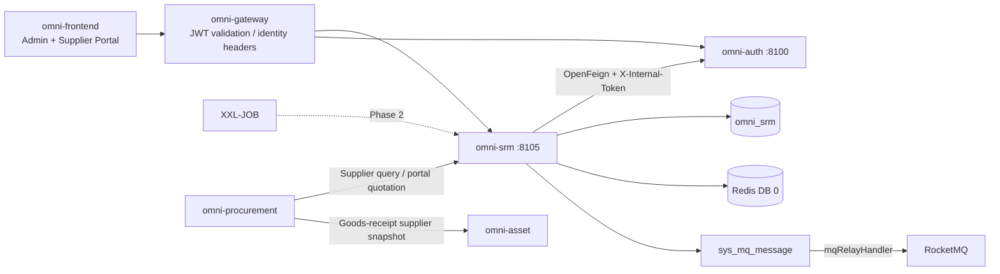
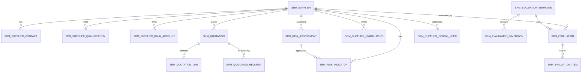
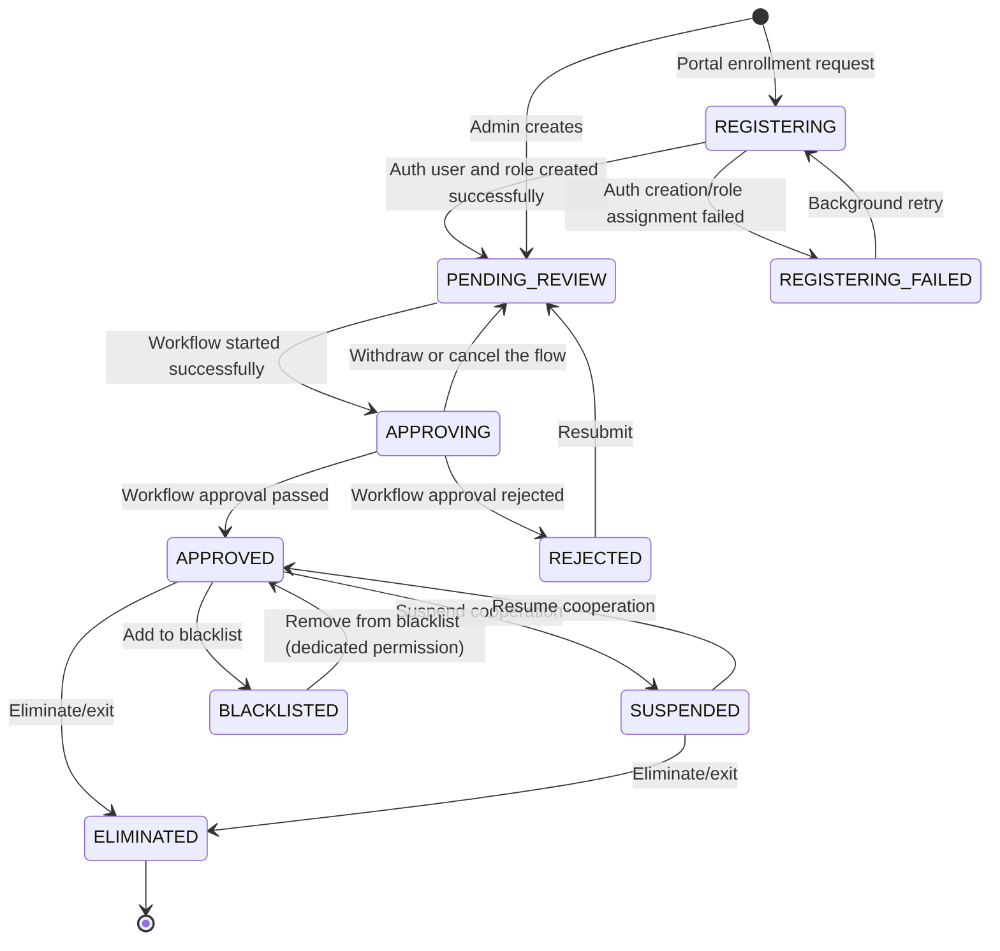
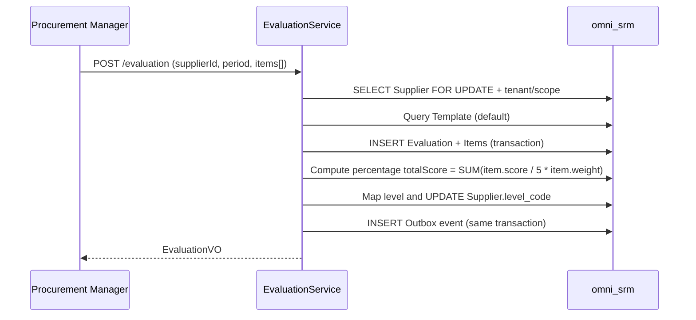
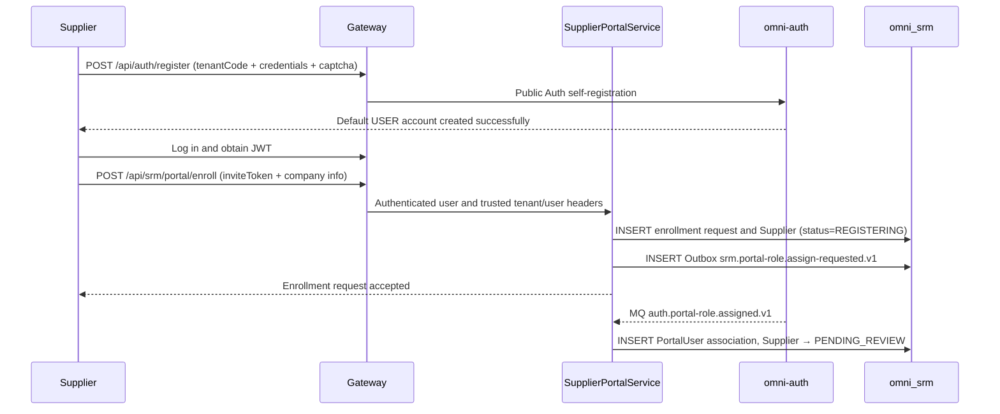

# SRM サプライヤー管理モジュール アーキテクチャと実装ベースライン

> 状態：MVP 実装済み・エンドツーエンド強化完了
> プロジェクト：Omni-Stack
> 日付：2026-07-27
> 目標：omni-srm MVP のアーキテクチャ、サービス横断契約、実装境界を説明する。実装入口は `omni-backend/omni-srm`、`omni-frontend/src/views/srm`、`omni-frontend/src/views/supplier-portal`。

設計根拠：`README.md`、および `docs/` 内の architecture、api-contract、backend-patterns、frontend-patterns、core-flows、scheduling、workflow、mq-reliability、docker-deployment の全トピックドキュメント。同時に `docs/design/crm-design.md` の CRM 実装パターンを参照。

## 1. 設計結論

SRM は独立した Servlet マイクロサービスとして構築し、調達実行（`omni-procurement`）と資産管理（`omni-asset`）から分離すべきである。三者は依存関係に従って段階的に構築する：SRM → Procurement → Asset。

| 項目 | 決定 |
|---|---|
| Maven モジュール / サービス名 | `omni-srm` |
| ローカルポート / 管理ポート | `8105` / `19905` |
| XXL-JOB 実行体 | `omni-srm` / `9905`（定期評価や資格警告を有効化する場合） |
| データベース | `omni_srm` |
| Gateway | `/api/srm/**` → `lb://omni-srm`、`StripPrefix` は使用しない |
| Redis | DB 0、Auth が書き込む XSS 設定を共有；SRM キーは `srm:` プレフィックスを使用 |
| フロントエンド | 引き続き `omni-frontend` を使用し、`views/srm/**`（管理側）と `views/portal/**`（サプライヤーポータル）を新設 |

SRM MVP はサプライヤー全ライフサイクル管理の閉ループをカバーする：

> サプライヤー登録/参入 → 審査 → グレーディング分類 → 業績評価 → リスク管理 → 淘汰退出。

調達実行（購買申請、RFQ、注文、入庫）と資産処分（検収、移管、スクラップ）は SRM MVP に含めず、それぞれ `omni-procurement` と `omni-asset` で実装する。

SRM のコアサプライヤーアグリゲートは三サービスの土台である；サプライヤーマスタデータは Auth のユーザー/権限体系のみに依存する。実装済みのポータル見積インクリメントは Procurement 内部契約で RFQ 招待と行スナップショットを検証し、Procurement は SRM に直接依存し、Asset は Procurement の入庫スナップショットを介してサプライヤーデータを間接的に継承する。

## 2. 製品範囲

### 2.1 ユーザーと目標

| ユーザー | コアニーズ |
|---|---|
| 調達マネージャー | サプライヤーライブラリの管理、サプライヤー業績の評価、供給リスクの管理 |
| 調達担当 | 日常のサプライヤー照会、評価の発起、リスク情報の閲覧 |
| SRM 管理者 | テナント内の全サプライヤーデータと設定の管理 |
| サプライヤー | ポータルでセルフ登録、企業情報の保守、自身の業績の閲覧；Procurement の招待範囲内で見積を提出 |
| 読み取り専用オブザーバー | 認可範囲内のサプライヤー統計と記録の閲覧 |

MVP は次に答えられるべきである：合格/凍結/淘汰サプライヤーがどれだけいるか；あるサプライヤーの資格はいつ期限切れになるか；前回の業績評価の得点はいくつか；どのサプライヤーのリスクレベルが赤か；誰がサプライヤーの重要情報を変更したか。

### 2.2 フェーズ分け

| フェーズ | 能力 |
|---|---|
| MVP | サプライヤー情報ライブラリ、参入審査、グレーディング分類、サプライヤーポータル、業績評価、リスクボード、サプライヤー 360 |
| MVP インクリメント（実装済み） | Procurement/RFQ 統合とサプライヤーセルフ見積 |
| Phase 2 | 評価テンプレート動的設定 UI、第三者信用調査接続、リスクイベントワークフロー、証明書添付管理 |
| Phase 3 | サプライヤーコラボレーション基盤（注文確認、出荷通知、照合）、インテリジェント警告（パブリックオピニオン監視） |

## 3. システム境界

| コンポーネント | 権威的責務 | SRM の利用方式 |
|---|---|---|
| `omni-auth` | テナント、ユーザー、組織、ロール、権限、データ範囲、XSS 設定 | 内部 OpenFeign；SRM はユーザー/組織 ID のみ保存 |
| `omni-srm` | サプライヤー、評価、リスク、サプライヤーポータルアカウント関連付け | SRM ビジネスの唯一の書き込み側；認証アカウントは引き続き Auth が権威的に管理 |
| `omni-base` | 辞書、操作ログ、タスク/MQ 運用 | 操作ログ集約；品目/業界などは辞書 code を使用 |
| `omni-workflow` | BPMN、プロセスインスタンス、承認 | 内部 Feign でサプライヤー参入承認を起動し、信頼できる完了イベントを消費して状態を書き戻す |
| `omni-procurement` | 調達実行 | 内部 Feign でサプライヤーを照会しポータル見積を調整 |
| `omni-asset` | 資産管理 | Procurement 入庫イベント内のサプライヤースナップショットを継承し、SRM に直接依存しない |
| XXL-JOB | バッチスキャンのトリガー | 資格期限警告スキャン（MVP は任意） |
| RocketMQ | 非同期輸送 | 少なくとも一度；コンシューマーは冪等でなければならない |
| Redis | XSS 共有設定、短期キャッシュ | SRM の権威ビジネスデータを保存しない |



推奨依存：`omni-common-core`、`omni-common`、`omni-common-mybatis`、`omni-common-redis`、`omni-common-operlog`、`omni-common-job`、`omni-common-mqlog`、および Web、Validation、Security、AspectJ、OpenFeign、LoadBalancer、Nacos、RocketMQ Stream、Actuator、Lombok。

SRM は `omni-common-workflow` に依存せず、本サービスに Flowable を埋め込まない；参入承認は独立した
`omni-workflow` の内部 API と `workflow.process.completed.v1` イベントで完了し、Flowable の実行時とテーブルは
Workflow サービスにのみ属する。

## 4. ドメインとデータ設計

### 4.1 アグリゲート

| アグリゲート | テーブル | 責務 |
|---|---|---|
| Supplier | `srm_supplier`、`srm_supplier_contact`、`srm_supplier_qualification`、`srm_supplier_bank_account` | サプライヤーマスタデータ、連絡先、資格、銀行口座 |
| Evaluation | `srm_evaluation_template`、`srm_evaluation_dimension`、`srm_evaluation`、`srm_evaluation_item` | 評価テンプレート、評価記録、採点明細 |
| Risk | `srm_risk_indicator`、`srm_risk_assessment` | リスク指標、総合リスク評価 |
| Portal | `srm_supplier_invite`、`srm_supplier_enrollment`、`srm_supplier_portal_user` | オンボーディング招待/Saga、ポータルアカウント関連付け |
| Quotation | `srm_quotation`、`srm_quotation_line`、`srm_quotation_request` | RFQ 見積スナップショット、見積行、リクエスト冪等履歴 |



### 4.2 共通フィールドとルール

すべての `srm_*` テーブルは `tenant_id` を含まなければならない（評価テンプレート、評価次元、資格記録を含む）。これにより TenantLine が存在しない列に書き換えない。認可可能なビジネステーブルはさらに次を含める必要がある：

- `tenant_id`：テナント分離。
- `owner_user_id`：SELF 範囲とビジネス担当者。
- `owner_unit_id`：DEPT/DEPT_AND_BELOW/CUSTOM 範囲。
- `version`：楽観ロック。
- `deleted`：論理削除。
- `id/create_time/update_time/create_by/update_by`：プロジェクト監査フィールド。

`srm_quotation_request` はサービス内部からのみアクセスされる追記型の冪等台帳であり、認可可能なビジネスリソースではない：tenant と監査フィールドは保持するが、意図的に `deleted/version` を設けず、履歴 requestId が削除または再利用されることを避ける。見積ヘッダー/行は PortalUser → Supplier 関係で認可し、これらのテーブルに内部 owner 列を追加しない。

制約：

- ユーザー/組織 ID は Auth が管理し、クロス DB 外部キーを作らず、フロントエンド提出のユーザー名や ownerUnitId を信頼しない。
- インデックスは `tenant_id` で始まり、次に owner、状態、品目を組み合わせる。
- `create_by` はユーザー名の監査フィールドで、SELF データ権限に使えない。
- 銀行口座番号は PII マスクを使用し、完全な値は `srm:pii:view` にのみ返す。
- 時刻は `yyyy-MM-dd HH:mm:ss` に統一する。
- `supplier_no` は生成済みデータベース ID から生成しテナント内ユニークにする。`SELECT MAX(...) + 1` は禁止。
- 通常の PUT では owner やライフサイクル status を直接変更できない。
- 外部リクエストは素の `selectById/updateById/deleteById` を使用してはならない。
- `owner_user_id` はテナント内部のビジネス担当者のみを表す；サプライヤーポータルアカウントは必ず `srm_supplier_portal_user` で関連付け、owner フィールドの再利用を禁止する。

### 4.3 主要テーブル

`srm_supplier`

- `supplier_no/name/normalized_name/supplier_type/industry_code`。
- `credit_code（統一社会信用コード）/website/phone/email/region/address`。
- `category_code`：サプライヤーの所属品目（IT、原材料、総務、サービスなど）、辞書 code を使用。
- `level_code`：サプライヤー等級（STRATEGIC/PREFERRED/QUALIFIED/ELIMINATED）、評価により自動調整または手動設定。
- `status`：ライフサイクル状態（REGISTERING/REGISTERING_FAILED/PENDING_REVIEW/APPROVING/REJECTED/APPROVED/SUSPENDED/BLACKLISTED/ELIMINATED）。`REGISTERING*` はポータルのクロスサービス登録専用；管理者作成は PENDING_REVIEW に入り、参入 Workflow を自動的に準備する。
- `owner_user_id/owner_unit_id/assigned_time/last_evaluation_time`。
- `version/deleted` と監査フィールド。
- コアインデックス：tenant + owner/status、tenant + unit/status、tenant + category/status、tenant + name/credit_code。

`srm_supplier_contact`

- `supplier_id/name/department/job_title/mobile/phone/email/decision_role/primary_flag/status`。
- owner は Supplier owner の権限スナップショット；サプライヤー移管時に同一トランザクションで同期。
- 各サプライヤーは有効な主要連絡先を最大 1 つ持つ。

`srm_supplier_qualification`

- `supplier_id/qualification_name/certificate_no/issuing_authority/issue_date/expiry_date/status`。
- `expiry_date` は資格期限警告に使用（30 日以内に期限なら黄色、期限切れなら赤）。
- MVP は添付を保存せず、テキスト情報のみ保存する。

`srm_supplier_bank_account`

- `supplier_id/account_name/account_no/bank_name/bank_branch/bank_code/status`。
- `account_no` は PII フィールドで、完全な値は `srm:pii:view` にのみ返す。
- 各サプライヤーは複数の銀行口座を保守でき、1 つをデフォルトとしてマークする。

`srm_supplier_portal_user`

- `supplier_id/user_id/status/last_login_time/version/deleted`。
- `tenant_id + user_id` はユニークで、1 つの Auth ユーザーが同一テナントで 1 つのサプライヤー主体にのみ関連付くことを保証する。
- `tenant_id + supplier_id + user_id` はポータルの行レベル認可に使用；ポータルユーザーはリクエスト中の supplierId を変更して企業を切替えられない。
- `owner_user_id` とポータル `user_id` は意味が厳密に分離：前者は内部調達担当者、後者はサプライヤーログインアカウント。

`srm_supplier_enrollment`

- `request_id/supplier_id/user_id/status/retry_count/last_error_code/next_retry_time/version/deleted`。
- `status`：PENDING_ROLE_ASSIGN/ROLE_ASSIGN_FAILED/COMPLETED/CANCELLED。
- `tenant_id + request_id` はユニーク；同一 tenant + user_id は同時に最大 1 つのアクティブなオンボーディング申請。
- inviteToken の識別子/ダイジェストと検証結果のみを保存し、元の inviteToken は保存せず、パスワードや認証コードはなおさら保存しない。

`srm_supplier_invite`

- `invite_code_hash/status/expires_time/max_uses/used_count/version/deleted`、任意で予期される credit_code や連絡先メールのダイジェストを記録。
- 元の inviteToken は作成時に一度だけ返し、データベースは SHA-256/HMAC ダイジェストのみ保存；検証時に tenant、ACTIVE、有効期間、用途、残回数を同時に検査する。
- オンボーディングトランザクションは version 条件で used_count を原子的にインクリメントし、同一招待の並行超過使用を防ぐ；無効化後は再度オンボーディングできない。

`srm_evaluation_template`

- `tenant_id/name/status/default_flag/version/deleted`。
- MVP はテナントごとに 1 組のデフォルトテンプレートで、動的設定 UI は提供しない。
- テナント初期化時に `SrmTenantInitializer` が冪等にデフォルトテンプレートを作成する。

`srm_evaluation_dimension`

- `tenant_id/template_id/indicator_name/weight/sort/status/deleted`。
- MVP は 4 つの次元をプリセット：品質（30%）、納期（30%）、価格（20%）、サービス（20%）。
- `weight` は `DECIMAL(5,2)`、同一テンプレート配下の全次元の weight の合計は 100 でなければならない。

`srm_evaluation`

- `supplier_id/template_id/evaluation_period（例 2026-Q2）/total_score/evaluator_user_id/evaluation_time/status/version/deleted`。
- `total_score` はシステムが自動的に加重集計して計算し、フロントエンドからの入力を受け付けない。
- 評価完了後、まず 1-5 点を百分率に正規化：`total_score = SUM(item.score / 5 × item.weight)`、結果範囲は 20-100；次にサプライヤー等級へマッピング：≥90 戦略級、≥75 優選級、≥60 合格級、<60 淘汰待ち。

`srm_evaluation_item`

- `evaluation_id/dimension_id/indicator_name/score/weight/remark`。
- `score` は 1-5 点、`DECIMAL(3,1)`。
- 追記のみで、評価提出時に一度だけ書き込み、後続の変更インターフェースは提供しない（修正が必要なら新しい評価記録を作成）。

`srm_risk_indicator`

- `supplier_id/indicator_type/indicator_value/risk_level/assessment_time/remark`。
- `indicator_type` 列挙：FINANCIAL（財務リスク）、COMPLIANCE（コンプライアンスリスク）、SUPPLY（供給リスク）、COOPERATION（協力リスク）、QUALITY（品質リスク）、CERTIFICATE（資格リスク）。
- `risk_level` 列挙：GREEN/YELLOW/RED。
- 一部の指標は自動計算可能（資格期限日から今日までの日数 → CERTIFICATE 指標）、他は手動でマークする。

`srm_risk_assessment`

- `supplier_id/overall_level/assessment_time/assessor_user_id/remark/version/deleted`。
- `overall_level` は総合リスクレベルで、各指標の最高レベルを取る（RED > YELLOW > GREEN）。

`srm_quotation`

- `supplier_id/rfq_id/rfq_no/supplier_name_snapshot/request_id/quotation_time/valid_until/total_amount/currency_code/status/version/deleted`。
- `request_id` はその見積を最後に変更した成功クライアントリクエスト ID を記録し、現在スナップショットの監査に使用；完全なリクエスト冪等履歴は `srm_quotation_request` が保存する。
- `(tenant_id, rfq_id, active_supplier_guard)` ユニーク制約で、同一 RFQ・同一サプライヤーに未削除の見積が最大 1 件であることを保証；重複提出は元の見積を更新して `version` をインクリメントし、並行する有効見積を作成しない。
- `total_amount DECIMAL(19,4)`、`currency_code CHAR(3)` と RFQ/サプライヤースナップショットはすべてサーバー側が Procurement の招待詳細と見積行から計算し、ポータルが直接指定してはならない。

`srm_quotation_line`

- `quotation_id/rfq_line_id/material_code/material_name/unit/unit_price/quantity/line_amount/delivery_days/remark/version/deleted`。
- `rfq_line_id` は必須で、提出する行集合は Procurement が返す RFQ 行スナップショットと完全一致しなければならない；資材、単位、数量はサーバー側がコピーし、ポータルは単価、納期、備考のみ提出する。
- `unit_price/quantity` は `DECIMAL(19,6)` を使い 0 より大きくなければならず、`line_amount` は `DECIMAL(19,4)` を使い 0 より大きくなければならない；`delivery_days` は 0–3650。サーバー側が行ごとに計算して集計し、クライアント金額の信頼を禁止する。
- `(tenant_id, quotation_id, active_rfq_line_guard)` はユニークで、同一見積内の RFQ 行の重複を禁止する。

`srm_quotation_request`

- `request_id/quotation_id/rfq_id/supplier_id/request_hash/target_version/status`、状態は `RESERVED/COMPLETED` のみで、論理削除しない。
- `(tenant_id, request_id)` は永久にユニーク；`request_hash` は正規化されたリクエストボディの SHA-256 で、同一 requestId の異なる意図を拒否するのに使う。
- `(tenant_id, quotation_id, target_version)` はユニークで、各成功更新に対応する見積バージョンを保存する；したがって古い requestId が見積の更新継続後にリプレイされても識別でき、見積・明細・Outbox を重複書き込みしない。

## 5. 状態マシンとコアフロー

### 5.1 Supplier ライフサイクル



- `APPROVED` 状態のサプライヤーのみ調達モジュールから参照できる。
- `BLACKLISTED` は `srm:supplier:blacklist` 権限があって初めて操作できる。
- `ELIMINATED` は終端状態で、回復できない。
- サプライヤー登録（ポータルセルフまたは管理者作成）後、まず `PENDING_REVIEW` に入る；現テナントに公開済みかつ
  `category=SRM_SUPPLIER_ONBOARDING` のモデルが存在する場合、サービスは冪等起動スナップショットを永続化して `APPROVING` へ進める。

### 5.2 業績評価フロー



評価サイクルは四半期ごとに一度を推奨するが、MVP は強制せず、管理者が手動で発起する。評価完了後、システムは自動的に：
1. 加重総合得点を計算する。
2. 総合得点に基づき新しいサプライヤー等級へマッピングする。
3. `srm_supplier.level_code` を更新する。
4. `last_evaluation_time` を記録する。

### 5.3 リスク評価フロー

```text
Manually/automatically update risk indicators
→ Recompute the overall risk level (take the highest level among indicators)
→ INSERT/UPDATE srm_risk_assessment
→ If the level changes to RED, write an Outbox event notification
```

資格期限警告ロジック：
- `expiry_date - today <= 30` 日 → CERTIFICATE 指標を自動的に YELLOW に設定。
- `expiry_date < today` → CERTIFICATE 指標を自動的に RED に設定。
- 警告スキャンは XXL-JOB 定期タスクで実装（Phase 2 で有効化、MVP は手動トリガーまたは未有効化）。

### 5.4 サプライヤーポータルの開設とオンボーディング



ポータル開設とオンボーディングは 2 つのセキュリティ境界に分かれる：

- アカウント開設は既存の公開 `POST /api/auth/register` のみを使用し、Auth が tenantCode、認証コード、ユーザー名ユニーク性を検証してデフォルトの `USER` ロールを割り当てる；SRM はパスワードを受信・永続化・MQ 経由で伝達しない。
- ユーザーはログイン後に `POST /api/srm/portal/enroll` を呼ぶ。この書き込みインターフェースは `@PreAuthorize("hasAuthority('srm:portal:enroll')")` を宣言し、デフォルト USER はこの 1 条の SRM オンボーディング権限のみを得る；サーバー側の tenantId/userId は Gateway が注入する信頼できる身分ヘッダーからのみ取る。
- オンボーディングは必ずテナント専用の inviteToken を携行し、その tenant、有効期間、使用回数、用途を検証する；リクエストボディ内の素の tenantId/userId を受け入れてはならない。
- 統一社会信用コード（credit_code）はテナント内でユニーク。
- オンボーディングリクエストは requestId/credit_code で冪等を行い、同一 userId は 1 つのサプライヤー主体にしか関連付けられない。
- SRM は Outbox を介して Auth に既存 USER アカウントへの `SUPPLIER` ロール追加を要求する。ロール割当失敗時はオンボーディング申請を `REGISTERING_FAILED` に保ち、バックグラウンドリトライまたは手動で処理し、未認可アカウントをオンボーディング成功と見なしてはならない。
- Auth のロール割当成功イベントが userId を返した後、SRM は `srm_supplier_portal_user` を書き込み、次にサプライヤー状態を `PENDING_REVIEW` へ進める。

オンボーディング認可は SRM と Auth にまたがり、「トランザクション内 Feign でリモートをロールバックできる」という仮定の使用を禁止する。ローカルトランザクション + Outbox/Saga で結果整合性を保証；重複イベントは `requestId` ユニーク制約で冪等に処理する。

## 6. テナント、RBAC とデータ権限

### 6.1 信頼チェーン

1. Gateway が RS256 JWT とブラックリストを検証し、`X-User-*`、`X-Tenant-Id`、`X-Gateway-Forwarded` を上書き注入する。
2. 共通 Starter の `GatewayPreAuthenticationFilter` が `Authentication` を構築する。
3. Controller が `@PreAuthorize` で機能権限を検証する。
4. 共通の `ServiceIdentityFilter` が不変のリクエスト身分を確立；`@ServiceDataScope(permissionCode)` アスペクトが現在のエンドポイント権限で dataScope を解決する。
5. MyBatis-Plus が tenant とその permission に対応する owner 条件を追加する。

`X-Gateway-Forwarded:true` は暗号学的証明ではない。本番では SRM ビジネスポートを公開してはならない。

### 6.2 権限ツリーとロール

メニュー：`srm`（DIRECTORY）および `srm:overview`、`srm:supplier`、`srm:evaluation`、`srm:risk`（MENU）。

サプライヤーポータル権限ツリー：`srm:portal`（DIRECTORY）および `srm:portal:profile`、`srm:portal:evaluation`、`srm:portal:quotation`；オンボーディングインターフェースは `srm:portal:enroll`。ポータルの資料、業績、見積は関連付けを完了した `SUPPLIER` ロールにのみ開放される。

API 権限：

- `srm:overview:list`
- `srm:supplier:list/create/update/delete/approve/reject/suspend/resume/blacklist/restore/eliminate/transfer`
- `srm:contact:list/create/update/delete`
- `srm:qualification:list/create/update/delete`
- `srm:bank-account:list/create/update/delete`
- `srm:evaluation:list/create/view`
- `srm:risk:list/update/assess`
- `srm:owner:list`
- `srm:pii:view`
- `srm:invite:list/create/revoke`、`srm:portal:invite`（管理側の招待）
- `srm:portal:enroll/profile/evaluation/quotation`（サプライヤーポータル）

上記の `/` は同一リソース配下の複数の完全な権限コードの簡記である。例えば `srm:supplier:list/create` は `srm:supplier:list` と `srm:supplier:create` を表し、DB 反映時は完全な code を 1 件ずつ保存しなければならない。実際の `sys_permission.type` は `DIRECTORY/MENU/API` を使う。

| ロール | dataScope | 能力 |
|---|---|---|
| `SRM_ADMIN` | TENANT | 現テナントの SRM 内部管理機能/データ、サプライヤーセルフポータルを含まない |
| `PROCUREMENT_MANAGER` | DEPT_AND_BELOW | 部門および下位、サプライヤー評価、リスク管理、サプライヤーセルフポータルを含まない |
| `PROCUREMENT_STAFF` | SELF | 自分が担当するデータと日常操作 |
| `SUPPLIER` | SELF | ポータルセルフ：オンボーディング後の企業情報保守、自身の業績閲覧、招待に基づく見積 |
| `SUPER_ADMIN` | ALL | 全機能、SRM データは引き続き現テナントに限定 |

デフォルトの USER には `srm:portal:enroll` のみを付与し、SRM 管理やポータル資料/業績/見積権限は付与しない；オンボーディングが完了し SUPPLIER ロールを追加して初めて profile/evaluation/quotation にアクセスできる。`srm:portal:quotation` は厳密に `SUPPLIER` と、プラットフォームルールで全権限ツリーを持つ `SUPER_ADMIN` にのみ付与し、`SRM_ADMIN`、`PROCUREMENT_MANAGER` などの内部ロールはサプライヤー代理見積の能力を得てはならない。Controller は引き続き `SUPPLIER` ロールと有効な PortalUser 関連付けの両方を要求するため、SUPER_ADMIN だけではサプライヤーになりすまして見積できない。フロントエンド `v-permission` とバックエンド `@PreAuthorize` は同一コード。

### 6.3 Auth 内部データ範囲契約

SRM は CRM が既に構築した Auth DataScope 内部インターフェースを再利用する：

```text
GET /api/internal/data-scopes/{userId}?tenantId={tenantId}&permissionCode=srm:supplier:list
```

ルールは CRM と一致：
- ユーザーが有効で tenant に属することを検証する。
- その `permissionCode` を付与されたロールのみをマージする。
- SRM 呼び出しの失敗/タイムアウト/tenant 不一致時は 503/403 を返し、縮退しない。

### 6.4 共通コンテキストと SRM SQL ポリシー

SRM は `omni-common-service` に依存し、`ServiceIdentityContext`、`ServiceDataScopeContext`、
`@ServiceDataScope`、内部 API Token Filter、XSS 回源/セーフティベースライン、および MyBatis-Plus 自動構成を再利用する。
SRM はドメインポリシー `SrmTenantTablePolicy`、`SrmDataPermissionHandler`、
`SrmRecordAccessGuard` のみを実装する；サプライヤーポータルは `SrmPortalScope` で一時的に PORTAL/TENANT 範囲へ切替え、実行後に
元の DataScope へ復元し、第 2 の ThreadLocal、Filter、アスペクトは保守しない。

共通 Starter が SRM ポリシーを組み合わせた後のインターセプター順序は固定：

```text
TenantLineInnerInterceptor
→ DataPermissionInterceptor
→ OptimisticLockerInnerInterceptor
→ PaginationInnerInterceptor
```

- TenantLine は `srm_*` テーブルのみ処理し、常に現在の tenant を追加する。
- `sys_mq_message` は 2 つの権限インターセプターから除外する。
- DataPermission は Supplier の owner 列をマップする；評価とリスクは supplier_id で Supplier の owner に関連付けて権限チェックする。

| dataScope | 条件 |
|---|---|
| SELF | `owner_user_id = currentUserId` |
| DEPT | `owner_unit_id = primaryUnitId` |
| DEPT_AND_BELOW / CUSTOM | `owner_unit_id IN accessibleUnitIds` |
| TENANT / ALL | owner 条件を追加しない、TenantLine は常に保持 |

サプライヤーポータルユーザー（SUPPLIER ロール）は内部 owner dataScope を再利用しない。ポータルのクエリとコマンドは必ずまず `tenant_id + currentUserId` で `srm_supplier_portal_user` を照会し、次に関連付けられた supplierId で Supplier とそのサブリソースを限定する；有効な関連付けが見つからない場合はフェイルクローズドする。

実際の SQL はリソースごとにマップし、owner 条件をすべての `srm_*` テーブルに機械的に追加することを禁止する：

| リソース/テーブル | 範囲ルール |
|---|---|
| Supplier | `owner_user_id/owner_unit_id` を使用 |
| Contact/Qualification/BankAccount | 同一 tenant の supplier_id で Supplier 範囲を継承 |
| Evaluation/EvaluationItem | 同一 tenant の supplier_id/evaluation_id で Supplier 範囲を継承 |
| RiskIndicator/RiskAssessment | 同一 tenant の supplier_id で Supplier 範囲を継承 |
| Template/Dimension | テナント内で共有、TenantLine と機能権限のみ適用 |
| Portal profile/evaluation | 固定して `srm_supplier_portal_user` に関連付けられた supplierId を使用し、内部 owner dataScope を使わない |
| Overview/360 | 集約とブロッククエリは Supplier リストと同一範囲を使用 |

### 6.5 書き込み操作の行レベル認可

DataPermissionInterceptor は書き込み認可を代替できない。各 update/delete/審査/凍結/ブラックリストコマンドは必ず：

1. `tenant_id + id + data scope` で可視レコードをクエリ；不可視は一律 404。
2. 状態マシンとビジネス不変条件を検証。
3. `tenant_id + id + version` 条件で更新。
4. 更新行数が 1 でない時は並行競合を返す。

`SrmRecordAccessGuard` が詳細、コマンド、サブリソースのアクセスチェックを統一実装する。

## 7. API 設計

### 7.1 共通契約

- すべてのレスポンスは `R<T>`；ページングは `R<PageResult<T>>`。
- `page=1`、`size=10`、SRM は `size <= 100` に制限。
- Entity を直接 Request/Response にしない；状態コマンドは独立 DTO を使う。
- 日付パラメータは `@DateTimeFormat(pattern = "yyyy-MM-dd HH:mm:ss")` を宣言；フロントエンドは `value-format="YYYY-MM-DD HH:mm:ss"` を使う。
- 状態、審査、評価のリクエストは `version` を携行。
- 書き込みインターフェースは `@PreAuthorize` と `@OperLog` を同時に宣言。

### 7.2 エンドポイント

| ドメイン | エンドポイント |
|---|---|
| Overview | `GET /api/srm/overview/summary`、`/risk-dashboard` |
| Supplier | `GET /supplier/list`、`GET /supplier/{id}`、`POST /supplier`、`PUT/DELETE /supplier/{id}` |
| Supplier コマンド | `POST /supplier/{id}/approve`、`/reject`、`/suspend`、`/resume`、`/blacklist`、`/restore-from-blacklist`、`/eliminate`、`/transfer` |
| Supplier サブリソース | `GET /supplier/{id}/contact/list`、`POST /supplier/{id}/contact`、`PUT/DELETE /contact/{id}` |
| Supplier サブリソース | `GET /supplier/{id}/qualification/list`、`POST /supplier/{id}/qualification`、`PUT/DELETE /qualification/{id}` |
| Supplier サブリソース | `GET /supplier/{id}/bank-account/list`、`POST /supplier/{id}/bank-account`、`PUT/DELETE /bank-account/{id}` |
| Supplier 360 | `GET /supplier/{id}/overview` |
| Evaluation | `GET /evaluation/list`、`GET /evaluation/{id}`、`POST /evaluation` |
| Evaluation | `GET /supplier/{id}/evaluation/history` |
| Risk | `GET /risk/list`、`GET /supplier/{id}/risk`、`PUT /risk/indicator/{id}` |
| Risk | `POST /risk/assessment/{supplierId}` |
| Owner 選択肢 | `GET /api/srm/options/owners`、権限 `srm:owner:list` |
| Portal 開設 | `POST /api/auth/register`（Auth 公開インターフェース、SRM は認証情報を処理しない） |
| Portal 招待 | `GET /portal/invite/list`、`POST /portal/invite`、`POST /portal/invite/{id}/revoke`（管理側） |
| Portal オンボーディング | `POST /api/srm/portal/enroll`（認証済み；リクエストは inviteToken を携行し、素の tenantId/userId を受け付けない） |
| Portal 企業情報 | `GET /portal/profile`、`PUT /portal/profile` |
| Portal 見積 | `GET /portal/quotation/invitations`、`GET /portal/quotation/invitations/{rfqId}`、`POST /portal/quotation` |

表中で `/api/srm` を省略したエンドポイントはいずれもそのプレフィックスで始まる。すべてのリスト/詳細と集約統計は同一の TenantLine/DataPermission を適用する。

### 7.3 エンドポイントと DataScope permission のマッピング

| 操作 | permissionCode |
|---|---|
| Overview 全統計 | `srm:overview:list` |
| Supplier list/detail/overview | `srm:supplier:list` |
| Supplier create/update/delete | `srm:supplier:create/update/delete` |
| Supplier approve/reject | `srm:supplier:approve` / `srm:supplier:reject` |
| Supplier suspend/resume/eliminate | `srm:supplier:suspend` / `srm:supplier:resume` / `srm:supplier:eliminate` |
| Supplier blacklist/restore | `srm:supplier:blacklist` / `srm:supplier:restore` |
| Supplier owner transfer (`POST /supplier/{id}/transfer`) | `srm:supplier:transfer`；通常の `PUT /supplier/{id}` は owner の変更を禁止 |
| Evaluation list/history | `srm:evaluation:list` |
| Evaluation create | `srm:evaluation:create` |
| Risk list/indicator/history | `srm:risk:list` |
| Risk indicator update / assessment | `srm:risk:update` / `srm:risk:assess` |
| Owner options | `srm:owner:list` |
| Portal enroll | `srm:portal:enroll`（デフォルト USER はこのオンボーディング権限のみ取得、別途 inviteToken を検証） |
| Portal invite list/create/revoke | `srm:portal:invite` |
| Portal profile | `srm:portal:profile`、かつ `srm_supplier_portal_user` の関連付けを検証 |
| Portal quotation list/detail/submit | `srm:portal:quotation`、かつ PortalUser、Procurement 招待、RFQ 状態と締切を検証 |

## 8. サービス横断の一貫性

### 8.1 ユーザーと組織

- SRM は userId/unitId のみ保存；割当前に tenant 限定の Auth Feign でユーザーが存在し、有効で、同一テナントであることを検証。
- ownerUnitId は Auth の権威的な主組織を取り、フロントエンドを信頼しない。
- リスト表示はまず ID を収集し、次に batch API を一度呼び出す。行ごとの Feign は禁止。
- SRM はパスワードなどの認証データを保守しない；アカウントは既存の Auth セルフ登録で作成される。SRM のオンボーディングフローは Outbox/Saga を介して Auth に既存 userId への SUPPLIER ロール追加を要求するのみで、`srm_supplier_portal_user` に userId と Supplier の認可関連付けを保存する。

### 8.2 辞書

品目は `omni-base` の `srm_supplier_category` 辞書を使用し、MVP は `ELECTRONICS/IT/RAW_MATERIAL/ADMIN/SERVICE` をプリセット、SRM は `category_code` のみ保存する。移行と新テナント初期化はいずれもこれらの code を冪等に正規化し、Base のオンラインに強依存しない。

### 8.3 Workflow

サプライヤー参入は既に独立した `omni-workflow` に接続済みだが、SRM 自体は Flowable を導入しない。作成または再提出時に、
`SupplierWorkflowCoordinator` がテナントと `category=SRM_SUPPLIER_ONBOARDING` で現在の公開済みモデルを自動解決し、
`requestId/businessKey/modelVersionId/startUser` の冪等スナップショットを永続化し、次に Workflow 内部起動 API を呼ぶ。
起動成功後サプライヤーは `APPROVING` に入る；不確実な失敗は元のスナップショットをリトライ用に保持する。Workflow は Outbox で完了イベントを発行し、
SRM は Inbox で冪等に消費して `APPROVED/REJECTED` へ進める。撤回またはキャンセルは必ずまず一致するプロセスインスタンスを終了し、次に
`PENDING_REVIEW` を復元する。デフォルトテナントモデルは起動初期化器が検証して自動公開し、必須モデルが欠ける場合はサービスの起動に失敗する。

### 8.4 Procurement と Asset の統合

SRM は Procurement/Asset が呼び出す次の能力を提供する：

- 内部 API：`GET /api/internal/supplier/{id}?tenantId={tenantId}`、サプライヤー概要（ID、名称、状態、等級）を返す。
- 内部 API：`GET /api/internal/supplier/search?tenantId={tenantId}&status=APPROVED&categoryCode={code}`、条件で合格サプライヤーを検索する。
- 内部 API：`POST /api/internal/supplier/batch`、body は `{tenantId,supplierIds}`；1–100 個の正整数を初出順で重複排除し、欠落 ID は省略し、`id/supplierNo/name/status/levelCode/categoryCode` を返し PII を含まない。
- 内部 API：`GET /api/internal/quotation/batch?tenantId={tenantId}&rfqId={rfqId}`、その RFQ の有効な見積、バージョン、行ごとのスナップショットを返し、価格比較と選定に供する。
- すべての内部 API は `X-Internal-Token` と `X-Tenant-Id` を使い、query/body の tenant は header と一致しなければならず、Gateway 経由で公開しない。

見積は SRM が永続化するが、RFQ 招待状態は Procurement が永続化する。どのサービスも他サービスのテーブルをクロス DB で更新してはならない：

1. Supplier ポータルは SRM を介して招待リスト/詳細を照会する；SRM はそれぞれ Procurement の `GET /api/internal/procurement/rfq/invitations?supplierId={supplierId}` と `GET /api/internal/procurement/rfq/{rfqId}/invitation?supplierId={supplierId}` を呼び、テナントは必須の `X-Tenant-Id` で渡し、PortalUser 関連付けで得た supplierId で照会し、決してフロントエンドの supplierId を受け付けない。
2. Supplier ポータルが見積を提出する前に、SRM は招待詳細を再度読み、tenant、RFQ `status=SENT`、招待 `status IN (INVITED, QUOTED)`、締切時間、完全な RFQ 行スナップショットを検証する。
3. SRM はまず `(tenantId, requestId)` で `srm_quotation_request` を照会する：hash が同一なら現在の見積スナップショットを返し、hash が異なれば 409 を返す；新しいリクエストは必ず `validUntil` が RFQ 見積締切より早くないことを保証する。初回リクエストは作成センチネル `version=0` を携行し、初版は `version=1` から始まり、以降は現在のバージョンのみ携行して更新できる；見積、明細、冪等履歴、Outbox イベント `srm.quotation.submitted.v1` は同一トランザクションでコミットする。
4. Procurement は eventId Inbox で冪等にイベントを消費し、自身の `proc_rfq_supplier.quotation_id/status` を更新する。
5. Procurement は選定前に SRM batch 内部 API で見積を取得し、選定/注文に quotationId、quotationVersion と不変の見積スナップショットを保存する；SRM の後続変更は選定済み結果に影響してはならない。

### 8.5 Outbox とイベント

`ReliableMessageRelay.send("srm-domain-out-0", envelope, tenantId, eventId)` を使用；tenantId は明示的でなければならない。

すべてのイベントは統一エンベロープ `eventId/eventType/occurredAt/tenantId/payload` を使う。ポータルロール割当のリクエスト/結果は少なくとも requestId、tenantId、supplierId、userId、roleCode、result/errorCode を含み、コンシューマーは requestId で冪等；イベントにパスワード、認証コード、inviteToken を決して伝えない。`srm.quotation.submitted.v1` の payload は少なくとも requestId、quotationId、quotationVersion、rfqId、rfqNo、supplierId、status、totalAmount、currencyCode、validUntil を含む；イベントに完全な銀行口座や連絡先 PII を伝えない。

推奨イベント：

- `srm.supplier.registered.v1`
- `srm.supplier.approved.v1`
- `srm.supplier.rejected.v1`
- `srm.supplier.suspended.v1`
- `srm.supplier.blacklisted.v1`
- `srm.supplier.eliminated.v1`
- `srm.portal-role.assign-requested.v1`
- `auth.portal-role.assigned.v1`（Auth が返し、SRM が消費）
- `auth.portal-role.assign-failed.v1`（Auth が返し、SRM が失敗をマークしてリトライを手配）
- `srm.quotation.submitted.v1`
- `srm.evaluation.completed.v1`
- `srm.risk.level-changed.v1`

イベントは ID、状態、必要なスナップショットのみを渡し、完全な銀行口座、連絡先の電話番号、メールを渡さない。

## 9. プライバシー、操作ログと XSS

### 9.1 OperLog マスキング

CRM が既に構築した `omni-common-operlog` の PII マスキング能力を再利用する。SRM がマスキングを必要とするフィールド：

- 銀行口座番号（`account_no`）
- 連絡先の携帯電話番号（`mobile`）
- 連絡先のメール（`email`）
- サプライヤー電話（`phone`）
- オンボーディング招待の原文（`inviteToken`、認証情報として扱い、ログやデータベースへの書き込みを禁止）

### 9.2 PII

- 完全な銀行口座、連絡先の携帯電話、メールは `srm:pii:view` にのみ返す。
- 他のユーザーにはバックエンド VO がマスクを返す、例 `6222****1234`、`138****1234`、`a***@example.com`。
- リストはデフォルトでマスク；詳細は権限で決める。
- サプライヤーポータルでは、サプライヤーは自分に関連付けられた完全な情報を閲覧できる（SUPPLIER ロールは自身のデータに対し `srm:pii:view` を暗黙に持つ）。

### 9.3 XSS

SRM は必ず `XssConfigProvider` を実装し、Redis DB 0 の `xss:enabled:{tenantId}` と `xss:rules:{tenantId}` を読む。キャッシュ miss 時は Auth へ回源するか組み込みベースラインルールを使う。MVP の備考はプレーンテキストのみ許可し `v-html` を禁止。

## 10. フロントエンド設計

```text
omni-frontend/src/
├── api/
│   ├── srm-overview.ts
│   ├── srm-supplier.ts
│   ├── srm-evaluation.ts
│   ├── srm-risk.ts
│   └── srm-portal.ts
├── views/
│   ├── srm/
│   │   ├── overview/index.vue         # Supplier overview + risk dashboard
│   │   ├── supplier/index.vue         # Supplier management
│   │   ├── evaluation/index.vue       # Performance evaluation
│   │   └── risk/index.vue             # Risk management
│   └── supplier-portal/
│       ├── enrollment/index.vue       # Invitation enrollment and Saga status
│       ├── profile/index.vue          # Company information maintenance
│       └── evaluation/index.vue       # View own performance
└── components/srm/
    ├── SupplierOverview.vue           # Supplier 360 view
    ├── SupplierPicker.vue             # Supplier picker
    ├── EvaluationScorecard.vue        # Evaluation scorecard
    ├── RiskIndicator.vue              # Risk indicator card
    └── RiskDashboard.vue              # Risk dashboard component
```

- 共有 `ApiResponse/PageResult` は `src/types/api.ts` からのみインポート。
- サプライヤーポータルはロールルーティングを使用：`USER + SUPPLIER`（または `SUPPLIER` のみ）はポータルアカウントに属し、`portal/**` のみ見える；`SUPER_ADMIN`、調達、CRM などの独立した内部管理ロールも同時に持つ場合のみ真のデュアルロールアカウントと見なし管理側入口を保持する。USER が既定で持つ読み取り専用権限プレフィックスから管理身分を推測することを禁止する。
- `router/index.ts` と `layout/index.vue` にそれぞれ iconMap があり、両方に SRM と Portal を補う。
- `constants/menu.ts`、`zh-CN.ts`、`en-US.ts` を同期。
- サプライヤー 360 は Drawer コンポーネントを使用。
- すべてのボタンは同一コードの `v-permission` を使うが、バックエンドが最終境界。
- リスクボードは赤黄緑ランプのカートコンポーネントを使用し、リスクレベルでのフィルタをサポートする。

## 11. エンジニアリング着地点

### 11.1 新モジュール

```text
omni-backend/omni-srm/
├── pom.xml
└── src/main/
    ├── java/com/omni/srm/
    │   ├── SrmApplication.java
    │   ├── client/ config/ controller/ dto/ entity/
    │   ├── mapper/ security/ service/ service/impl/
    └── resources/
        ├── application.yml
        ├── application-dev.yml
        └── mapper/
```

`SrmApplication` は `@EnableDiscoveryClient`、`@EnableFeignClients(basePackages="com.omni.srm.client")`、`@MapperScan("com.omni.srm.mapper")` を使用。サービスはドメインの `SecurityConfig` を保持し、共通の `omni-common-service` が Gateway 事前認証、リクエスト身分、内部 API 認証、DataScope、永続化インターセプターチェーン、XSS 設定能力を提供する。

### 11.2 必ず変更するファイル

| ファイル | 変更 |
|---|---|
| `omni-backend/pom.xml` | `omni-srm` を追加 |
| Gateway `application.yml` | `/api/srm/**` ルートを明示；内部パス遮断に SRM を追加 |
| `docker/backend/Dockerfile` | POM キャッシュ層 `COPY omni-srm/pom.xml omni-srm/` |
| `docker-compose.yml` | SRM サービス、8105、DB/Redis/Nacos/MQ/XXL/internal token |
| `start.bat/start.sh` | build リストに SRM を追加；Windows ポート保護に 8105 を追加 |
| `database/changelog/srm/` | SRM 構造変更に forward-only の Liquibase changeSet を追加 |
| `scripts/sql/seed/srm.sql` | デフォルト評価テンプレートなどの正式冪等シード；更新後に seed manifest をリフレッシュ |
| `scripts/sql/seed/auth.sql` | SRM 権限とロールの正式冪等シード；更新後に seed manifest をリフレッシュ |
| SRM `TenantModuleProvisioner` | 新テナントのテンプレートとリスクカタログの冪等初期化 |
| `omni-auth` | portal-role assign リクエストを消費し requestId で冪等に SUPPLIER ロールを割当、成功/失敗結果イベントを発行 |
| Frontend router/layout/menu/locales | アイコン、メニュー、i18n |

権限シードは tenant + code の `NOT EXISTS` で冪等に挿入し、parent/path を正しく再構築する；同時に SUPER_ADMIN、SRM ロール、seed manifest アサーション、新テナント初期化を更新する。デフォルト USER には `srm:portal:enroll` のみを追加し、SUPPLIER には profile/evaluation/quotation を追加し、SRM 管理ロールには invite 管理を追加するがすべてのサプライヤーセルフポータル能力を明示的に除外する；管理権限を丸ごと USER に付与してはならない。`srm:portal:quotation` は SUPPLIER と SUPER_ADMIN にのみ付与する。

設定要点：server 8105、management 19905、Redis DB 0、XXL appname `omni-srm`/port 9905。

## 12. 非機能設計

### 性能

- すべてのリストはページング、最大 100；owner/status/category は tenant プレフィックスの複合インデックスを使用。
- ユーザー/組織は一度に batch enrich、N+1 を禁止。
- サプライヤー 360 はブロックごとにクエリし、評価とリスク記録の数を制限。
- オーバービュー統計は Mapper 層の集約 SQL を使用する。

### 並行と冪等

- サプライヤー審査/凍結/ブラックリスト：version 楽観ロック。
- 評価提出：supplier 行ロック + トランザクション内の一度の書き込み。
- ポータルオンボーディング：credit_code のテナント内ユニーク制約、同一 tenant + userId は 1 つの有効なサプライヤー関連付けのみ許可。
- 招待使用回数：invite の version 条件更新、検証と used_count インクリメントは同一トランザクション。
- SUPPLIER ロール割当：requestId 冪等 + Outbox/Saga；失敗はリトライ可能で、分散トランザクションに依存しない。

### 縮退

- Auth dataScope 利用不可：503、フェイルクローズド。
- Auth 表示 enrich 利用不可：ID/不明ユーザーを返せる。
- RocketMQ 利用不可：ビジネスと Outbox はコミットし、Relay が後補。
- Redis XSS miss：回源/ベースラインルールへフォールバック、防御を無効化しない。

## 13. テストと検収

最小テストセット：

- サプライヤー状態マシンの合法/不正遷移。
- 評価の加重集計計算の正確性。
- 評価 1-5 点から百分率への境界（全部 1 点=20、全部 5 点=100）および 60/75/90 の調級閾値。
- 評価の自動調級マッピングの正確性。
- リスク総合レベルが最高レベルを取るロジック。
- PII マスク（銀行口座、連絡先の携帯電話/メール）。
- 6 種の dataScope のリストと集約。
- テナント横断の読み、変更、削除はすべて失敗。
- tenant/scope 欠落時にフェイルクローズド。
- tenant + id + version の並行更新。
- ポータルオンボーディングの冪等性（重複 credit_code または同一 userId の重複オンボーディングを拒否/元の requestId を返す）。
- Auth 開設で tenantCode が欠落/偽造された場合拒否；SRM オンボーディングで inviteToken が欠落/偽造、またはリクエストボディで tenantId/userId を偽造した場合拒否。
- Auth のロール割当成功イベントの重複消費でポータルアカウントを重複関連付けしない。
- SUPPLIER ロール割当失敗時にオンボーディングは失敗/リトライ状態を保ち、半成功の認可が現れない。
- SUPPLIER ロールは自分のデータのみ見える。
- SUPPLIER は supplierId を偽造しても他のサプライヤーの資料や業績にアクセスできない。
- inviteToken は一度だけ返され、データベース/OperLog に原文が現れない；期限切れ、無効化、テナント横断、並行超過使用はいずれも拒否。

エンドツーエンド検収：Auth セルフ登録開設 → ログイン後のサプライヤーオンボーディング → SUPPLIER ロール割当 → 管理者審査通過 → 調達マネージャーが評価を作成 → 採点集計 → 自動調級 → リスク指標更新 → サプライヤー 360 の完全表示。

検証コマンド：

```powershell
$env:JAVA_HOME='C:\APP\JDK25\jdk-25.0.2'
$env:PATH="$env:JAVA_HOME\bin;$env:PATH"
cd omni-backend
.\mvnw.cmd clean install

cd ..\omni-frontend
npm run build
npm run lint

cd ..
docker compose config
docker compose build omni-srm omni-gateway omni-frontend
```

## 14. 実装順序

### Milestone 0：前提確認

- Auth DataScope 内部インターフェース、OperLog PII マスキング、XSS miss ポリシーが準備済みであることを確認（CRM が構築済み、直接再利用）。
- Gateway 内部パス遮断ルールが統一プレフィックス `/api/internal/**` を含むことを確認。

### Milestone 1：サービス構築 + セキュリティ基盤

- モジュール、設定、Gateway、Docker、DB を作成。
- TenantLine + DataPermission + Pagination。
- 権限ツリー、SRM ロール、SUPPLIER ロール、既存テナント移行。
- フロントエンド root メニュー（管理側 + ポータル）。

完了条件：登録、ルーティング、401/403、テナント分離、XSS、ヘルスチェックが通過。

### Milestone 2：サプライヤー管理 + 状態マシン

- サプライヤー CRUD、参入/審査/凍結/復元/ブラックリスト/淘汰。
- 連絡先、資格、銀行口座のサブテーブル。
- サプライヤー 360 ビュー。
- PII マスク。

完了条件：管理者がサプライヤーを作成 → 審査 → グレーディング/凍結/淘汰が通せる。

### Milestone 3：サプライヤーポータル

- サプライヤーのセルフ開設とオンボーディング（Auth 公開登録 + 認証済み SRM enroll + inviteToken + credit_code ユニーク + ロール割当 Saga）。
- ポータルログイン（SUPPLIER ロールルーティング）。
- 企業情報の保守。

完了条件：Auth 開設 → 認証済みオンボーディング → SUPPLIER ロール割当 → 審査 → ポータルで企業情報を保守、が通せる。

### Milestone 4：業績評価

- 評価テンプレートのプリセット（データベース seed data）。
- 評価採点 → 加重集計 → 自動調級。
- 評価履歴とトレンド。

完了条件：評価作成から自動調級までの閉ループ。

### Milestone 5：リスクボード + 本番強化

- リスク指標の入力と表示。
- 赤黄緑ランプ + 資格期限警告。
- オーバービュー統計（summary + risk-dashboard）。
- テスト、インデックス、セキュリティ検収。
- README、architecture、api-contract、AGENTS を更新。

完了条件：MVP、バックエンドビルド、フロントエンド Build/Lint、Docker とセキュリティ検収がすべて通過。

## 15. ADR 要約

| 決定 | 選択 | 理由 |
|---|---|---|
| サービス | 独立 `omni-srm` | 調達、資産から分離、責務が明確 |
| 三サービス分割 | SRM/Procurement/Asset を独立 | 各自が独立したデータベースとセキュリティアーキテクチャを持つ |
| 構築順序 | SRM → Procurement → Asset | SRM は土台、後続サービスはサプライヤーデータに依存 |
| ユーザー体系 | Auth を共有 | サプライヤー = sys_user + SUPPLIER ロール、マルチテナント + RBAC を再利用 |
| デュアルポータル | 管理側 + サプライヤーポータルがフロントエンドを共用 | ロールルーティングで区別、独立フロントエンドプロジェクトは不要 |
| 参入承認 | 独立 Workflow サービス | SRM は Flowable を埋め込まず、冪等内部 API と信頼できる完了イベントで協調 |
| 評価テンプレート | データベースプリセット | MVP は動的設定 UI を作らない |
| 評価調級 | システム自動マッピング | 人手介入を減らし、一貫性を保証 |
| リスク指標 | 手動主体 + 資格自動警告 | MVP は第三者データに接続しない |
| ポータル開設/オンボーディング | Auth が公開開設を担当、SRM が認証済みオンボーディングとロール割当 Saga を担当 | 認証情報は SRM/MQ に入らず、tenant/user は信頼できる JWT 由来 |
| ポータル認可 | 独立した `srm_supplier_portal_user` 関連付け | 内部 owner と混用せず、ログインアカウントでサプライヤーを正確にバインド |
| PII | バックエンドが権限でマスク | CRM と一貫したセキュリティ戦略 |
| Workflow | 既に `omni-workflow` に接続済み | モデル分類は `SRM_SUPPLIER_ONBOARDING` に固定、サーバー側が現在の公開バージョンを自動解決 |

## 16. 主要リスク

| 優先度 | リスク | 対処 |
|---|---|---|
| P0 | DataScope が Auth のみ、空コンテキストでフィルタを追加しない | 内部契約 + SRM フェイルクローズド |
| P0 | ポータル開設/オンボーディングの悪用やテナント偽造 | Auth tenantCode+認証コード；SRM JWT tenant/user + inviteToken + credit_code ユニーク + レート制限 |
| P0 | 銀行口座 PII の漏洩 | バックエンドマスク + OperLog マスキング |
| P0 | 書き込み操作がクエリデータ権限をバイパス | AccessGuard + 条件付き更新 |
| P1 | SUPPLIER ロールが権限を越えて管理側データを閲覧 | フロントエンドロールルーティング + バックエンド dataScope が SELF を強制 |
| P1 | 評価調級の並行競合 | supplier 行ロック + version 楽観ロック |
| P1 | 資格期限警告が間に合わない | Phase 2 で XXL-JOB 定期スキャンを有効化 |
| P0 | ポータルアカウントが権限を越えて他のサプライヤーにアクセス | 独立した PortalUser 関連付け + tenant/user/supplier の三要素検証 |
| P1 | SUPPLIER ロール割当が Auth/SRM をまたいで半成功 | requestId 冪等 + ローカルトランザクション + Outbox/Saga + リトライ可能な失敗状態 |
