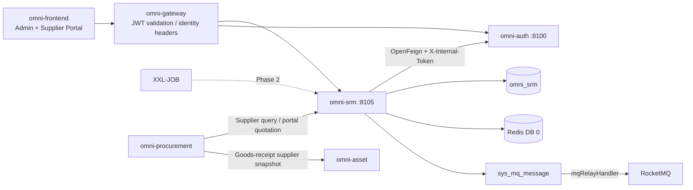
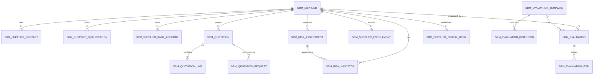
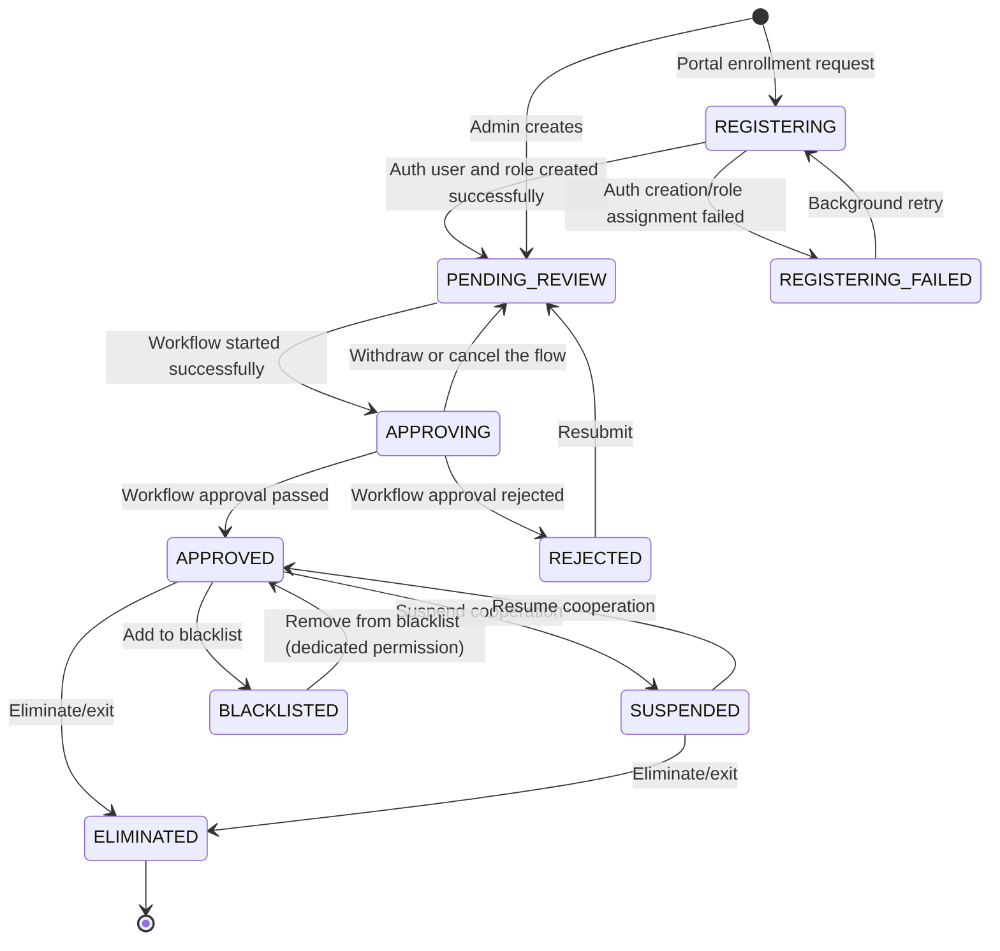
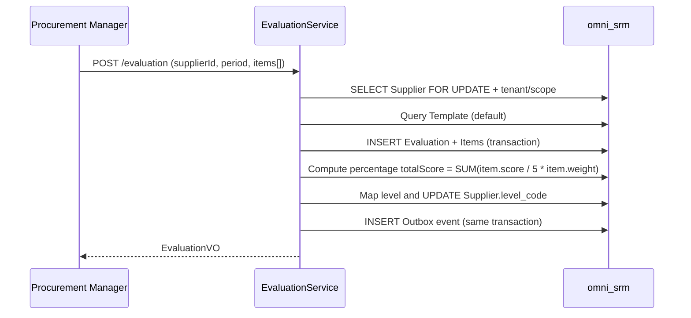
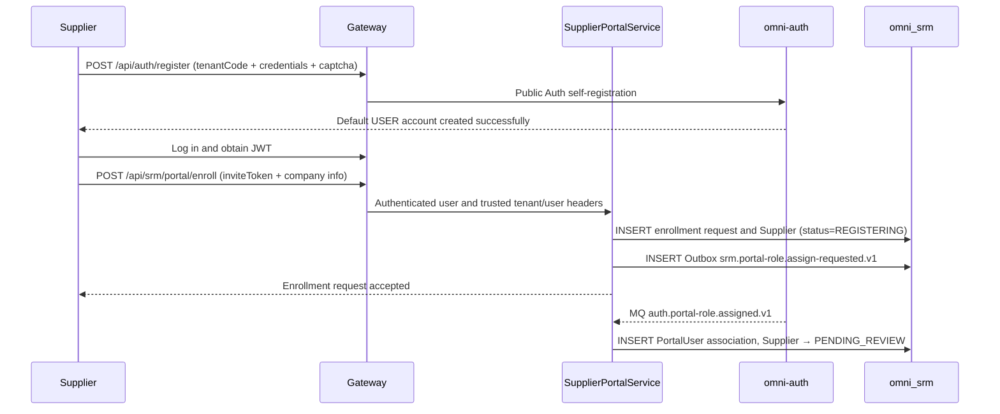

# SRM 공급업체 관리 모듈 아키텍처와 구현 기준선

> 상태: MVP 구현 완료 및 엔드투엔드 강화 완료
> 프로젝트: Omni-Stack
> 날짜: 2026-07-27
> 목표: omni-srm MVP의 아키텍처, 서비스 간 계약, 구현 경계를 설명한다. 구현 입구는 `omni-backend/omni-srm`, `omni-frontend/src/views/srm`, `omni-frontend/src/views/supplier-portal`이다.

설계 근거: `README.md`, 그리고 `docs/`의 architecture, api-contract, backend-patterns, frontend-patterns, core-flows, scheduling, workflow, mq-reliability, docker-deployment 전체 주제 문서. 동시에 `docs/design/crm-design.md`의 CRM 구현 패턴을 참조한다.

## 1. 설계 결론

SRM은 독립 Servlet 마이크로서비스로 구축하여, 조달 실행(`omni-procurement`)과 자산 관리(`omni-asset`)에서 분리해야 한다. 셋은 의존 관계에 따라 단계적으로 구축한다: SRM → Procurement → Asset.

| 항목 | 결정 |
|---|---|
| Maven 모듈 / 서비스명 | `omni-srm` |
| 로컬 포트 / 관리 포트 | `8105` / `19905` |
| XXL-JOB 실행자 | `omni-srm` / `9905` (정기 평가나 자격 경고를 활성화할 때) |
| 데이터베이스 | `omni_srm` |
| Gateway | `/api/srm/**` → `lb://omni-srm`, `StripPrefix`를 사용하지 않음 |
| Redis | DB 0, Auth가 쓴 XSS 설정을 공유; SRM 키는 `srm:` 접두사 사용 |
| 프런트엔드 | 계속 `omni-frontend`를 사용하고 `views/srm/**`(관리 측)와 `views/portal/**`(공급업체 포털)를 신설 |

SRM MVP는 공급업체 전체 라이프사이클 관리의 폐루프를 다룬다:

> 공급업체 등록/진입 → 심사 → 등급 분류 → 성과 평가 → 리스크 관리 → 탈락 퇴출.

조달 실행(구매요청, RFQ, 주문, 입고)과 자산 처분(검수, 이전, 스크랩)은 SRM MVP에 포함하지 않으며, 각각 `omni-procurement`과 `omni-asset`에서 구현한다.

SRM 핵심 공급업체 집계는 세 서비스의 기반이다; 공급업체 마스터 데이터는 Auth의 사용자/권한 체계에만 의존한다. 구현된 포털 견적 증분은 Procurement 내부 계약으로 RFQ 초대와 행 스냅샷을 검증하며, Procurement은 SRM에 직접 의존하고, Asset은 Procurement 입고 스냅샷을 통해 공급업체 데이터를 간접 상속한다.

## 2. 제품 범위

### 2.1 사용자와 목표

| 사용자 | 핵심 요구 |
|---|---|
| 조달 매니저 | 공급업체 라이브러리 관리, 공급업체 성과 평가, 공급 리스크 관리 |
| 조달 담당 | 일상적 공급업체 조회, 평가 발의, 리스크 정보 열람 |
| SRM 관리자 | 테넌트 내 전체 공급업체 데이터와 설정 관리 |
| 공급업체 | 포털로 셀프 등록, 기업 정보 유지보수, 본인 성과 열람; Procurement 초대 범위 내에서 견적 제출 |
| 읽기 전용 관찰자 | 인가 범위 내 공급업체 통계와 기록 열람 |

MVP는 다음에 답할 수 있어야 한다: 적격/동결/탈락 공급업체가 얼마나 있는지; 어떤 공급업체의 자격이 언제 만료되는지; 지난 성과 평가 점수가 얼마인지; 어떤 공급업체의 리스크 등급이 적색인지; 누가 공급업체 핵심 정보를 수정했는지.

### 2.2 단계 구분

| 단계 | 역량 |
|---|---|
| MVP | 공급업체 정보 라이브러리, 진입 심사, 등급 분류, 공급업체 포털, 성과 평가, 리스크 보드, 공급업체 360 |
| MVP 증분(구현됨) | Procurement/RFQ 통합과 공급업체 셀프 견적 |
| Phase 2 | 평가 템플릿 동적 설정 UI, 제3자 신용조사 연동, 리스크 이벤트 워크플로우, 증명서 첨부 관리 |
| Phase 3 | 공급업체 협업 플랫폼(주문 확인, 발송 통지, 대사), 지능형 경고(여론 모니터링) |

## 3. 시스템 경계

| 컴포넌트 | 권위 책임 | SRM의 사용 방식 |
|---|---|---|
| `omni-auth` | 테넌트, 사용자, 조직, 역할, 권한, 데이터 범위, XSS 설정 | 내부 OpenFeign; SRM은 사용자/조직 ID만 저장 |
| `omni-srm` | 공급업체, 평가, 리스크, 공급업체 포털 계정 연결 | SRM 비즈니스의 유일한 쓰기 주체; 인증 계정은 계속 Auth가 권위적으로 관리 |
| `omni-base` | 사전, 조작 로그, 태스크/MQ 운영 | 조작 로그 집약; 품목/업종 등은 사전 code 사용 |
| `omni-workflow` | BPMN, 프로세스 인스턴스, 승인 | 내부 Feign으로 공급업체 진입 승인을 시작하고, 신뢰 가능한 완료 이벤트를 소비하여 상태를 되돌려 씀 |
| `omni-procurement` | 조달 실행 | 내부 Feign으로 공급업체를 조회하고 포털 견적을 조정 |
| `omni-asset` | 자산 관리 | Procurement 입고 이벤트의 공급업체 스냅샷을 상속하며, SRM에 직접 의존하지 않음 |
| XXL-JOB | 일괄 스캔 트리거 | 자격 만료 경고 스캔(MVP는 선택) |
| RocketMQ | 비동기 전송 | 최소 1회; 컨슈머는 멱등이어야 함 |
| Redis | XSS 공유 설정, 단기 캐시 | SRM 권위 비즈니스 데이터를 저장하지 않음 |



권장 의존: `omni-common-core`, `omni-common`, `omni-common-mybatis`, `omni-common-redis`, `omni-common-operlog`, `omni-common-job`, `omni-common-mqlog`, 그리고 Web, Validation, Security, AspectJ, OpenFeign, LoadBalancer, Nacos, RocketMQ Stream, Actuator, Lombok.

SRM은 `omni-common-workflow`에 의존하지 않으며 본 서비스에 Flowable을 내장하지 않는다; 진입 승인은 독립된
`omni-workflow`의 내부 API와 `workflow.process.completed.v1` 이벤트로 완료되며, Flowable 런타임과 테이블은
Workflow 서비스에만 속한다.

## 4. 도메인과 데이터 설계

### 4.1 집계

| 집계 | 테이블 | 책임 |
|---|---|---|
| Supplier | `srm_supplier`, `srm_supplier_contact`, `srm_supplier_qualification`, `srm_supplier_bank_account` | 공급업체 마스터 데이터, 연락처, 자격, 은행 계좌 |
| Evaluation | `srm_evaluation_template`, `srm_evaluation_dimension`, `srm_evaluation`, `srm_evaluation_item` | 평가 템플릿, 평가 기록, 채점 명세 |
| Risk | `srm_risk_indicator`, `srm_risk_assessment` | 리스크 지표, 종합 리스크 평가 |
| Portal | `srm_supplier_invite`, `srm_supplier_enrollment`, `srm_supplier_portal_user` | 온보딩 초대/Saga, 포털 계정 연결 |
| Quotation | `srm_quotation`, `srm_quotation_line`, `srm_quotation_request` | RFQ 견적 스냅샷, 견적 행, 요청 멱등 이력 |



### 4.2 공통 필드와 규칙

모든 `srm_*` 테이블은 `tenant_id`를 포함해야 하며, 평가 템플릿, 평가 차원, 자격 기록도 마찬가지다. 그러면 TenantLine이 존재하지 않는 열로 고쳐 쓰지 않는다. 인가 가능한 비즈니스 테이블은 추가로 다음을 포함해야 한다:

- `tenant_id`: 테넌트 격리.
- `owner_user_id`: SELF 범위와 비즈니스 담당자.
- `owner_unit_id`: DEPT/DEPT_AND_BELOW/CUSTOM 범위.
- `version`: 낙관적 락.
- `deleted`: 논리 삭제.
- `id/create_time/update_time/create_by/update_by`: 프로젝트 감사 필드.

`srm_quotation_request`는 서비스 내부에서만 접근하는 추가식 멱등 원장이며, 인가 가능한 비즈니스 리소스가 아니다: tenant와 감사 필드는 보존하지만, 의도적으로 `deleted/version`을 두지 않아 역사적 requestId가 삭제되거나 재사용되는 것을 피한다. 견적 헤더/행은 PortalUser → Supplier 관계로 인가하며, 이 테이블들에 내부 owner 열을 추가하지 않는다.

제약:

- 사용자/조직 ID는 Auth가 관리하며, 크로스 DB 외래 키를 만들지 않고, 프런트엔드가 제출한 사용자명이나 ownerUnitId를 신뢰하지 않는다.
- 인덱스는 `tenant_id`로 시작하고, 이어서 owner, 상태, 품목을 조합한다.
- `create_by`는 사용자명 감사 필드로, SELF 데이터 권한에 쓸 수 없다.
- 은행 계좌 번호는 PII 마스킹을 사용하고, 전체 값은 `srm:pii:view`에만 반환한다.
- 시각은 `yyyy-MM-dd HH:mm:ss`로 통일한다.
- `supplier_no`는 이미 생성된 데이터베이스 ID로 생성하고 테넌트 내 고유로 만든다. `SELECT MAX(...) + 1`은 금지한다.
- 일반 PUT으로는 owner나 라이프사이클 status를 직접 변경할 수 없다.
- 외부 요청은 맨 `selectById/updateById/deleteById`를 사용해서는 안 된다.
- `owner_user_id`는 테넌트 내부 비즈니스 담당자만 나타낸다; 공급업체 포털 계정은 반드시 `srm_supplier_portal_user`로 연결하고, owner 필드 재사용을 금지한다.

### 4.3 주요 테이블

`srm_supplier`

- `supplier_no/name/normalized_name/supplier_type/industry_code`.
- `credit_code(통일 사회 신용 코드)/website/phone/email/region/address`.
- `category_code`: 공급업체 소속 품목(IT, 원자재, 총무, 서비스 등), 사전 code 사용.
- `level_code`: 공급업체 등급(STRATEGIC/PREFERRED/QUALIFIED/ELIMINATED), 평가로 자동 조정하거나 수동 설정.
- `status`: 라이프사이클 상태(REGISTERING/REGISTERING_FAILED/PENDING_REVIEW/APPROVING/REJECTED/APPROVED/SUSPENDED/BLACKLISTED/ELIMINATED). `REGISTERING*`은 포털 크로스 서비스 등록 전용; 관리자 생성은 PENDING_REVIEW로 진입하고 진입 Workflow를 자동 준비한다.
- `owner_user_id/owner_unit_id/assigned_time/last_evaluation_time`.
- `version/deleted`와 감사 필드.
- 핵심 인덱스: tenant + owner/status, tenant + unit/status, tenant + category/status, tenant + name/credit_code.

`srm_supplier_contact`

- `supplier_id/name/department/job_title/mobile/phone/email/decision_role/primary_flag/status`.
- owner는 Supplier owner의 권한 스냅샷; 공급업체 이전 시 동일 트랜잭션에서 동기화.
- 각 공급업체는 유효한 주요 연락처를 최대 하나 갖는다.

`srm_supplier_qualification`

- `supplier_id/qualification_name/certificate_no/issuing_authority/issue_date/expiry_date/status`.
- `expiry_date`는 자격 만료 경고에 사용(30일 이내 만료는 노랑, 이미 만료는 빨강).
- MVP는 첨부를 저장하지 않고 텍스트 정보만 저장한다.

`srm_supplier_bank_account`

- `supplier_id/account_name/account_no/bank_name/bank_branch/bank_code/status`.
- `account_no`는 PII 필드로, 전체 값은 `srm:pii:view`에만 반환한다.
- 각 공급업체는 여러 은행 계좌를 유지보수할 수 있고, 하나를 기본으로 표시한다.

`srm_supplier_portal_user`

- `supplier_id/user_id/status/last_login_time/version/deleted`.
- `tenant_id + user_id`는 고유하여, 한 Auth 사용자가 동일 테넌트에서 하나의 공급업체 주체에만 연결되도록 보장한다.
- `tenant_id + supplier_id + user_id`는 포털 행 수준 인가에 사용; 포털 사용자는 요청 중 supplierId를 바꿔 기업을 전환할 수 없다.
- `owner_user_id`와 포털 `user_id`는 의미가 엄격히 분리된다: 전자는 내부 조달 담당자, 후자는 공급업체 로그인 계정.

`srm_supplier_enrollment`

- `request_id/supplier_id/user_id/status/retry_count/last_error_code/next_retry_time/version/deleted`.
- `status`: PENDING_ROLE_ASSIGN/ROLE_ASSIGN_FAILED/COMPLETED/CANCELLED.
- `tenant_id + request_id`는 고유; 동일 tenant + user_id는 동시에 최대 하나의 활성 온보딩 신청.
- inviteToken의 식별자/다이제스트와 검증 결과만 저장하고, 원본 inviteToken은 저장하지 않으며, 비밀번호나 인증코드는 더욱 저장하지 않는다.

`srm_supplier_invite`

- `invite_code_hash/status/expires_time/max_uses/used_count/version/deleted`, 선택적으로 예상 credit_code나 연락처 이메일 다이제스트를 기록.
- 원본 inviteToken은 생성 시 한 번만 반환하고, 데이터베이스는 SHA-256/HMAC 다이제스트만 저장; 검증 시 tenant, ACTIVE, 유효기간, 용도, 잔여 횟수를 동시에 검사한다.
- 온보딩 트랜잭션은 version 조건으로 used_count를 원자 증가시켜, 동일 초대의 동시 초과 사용을 방지한다; 무효화 후에는 다시 온보딩할 수 없다.

`srm_evaluation_template`

- `tenant_id/name/status/default_flag/version/deleted`.
- MVP는 테넌트별로 하나의 기본 템플릿 세트를 두고, 동적 설정 UI를 제공하지 않는다.
- 테넌트 초기화 시 `SrmTenantInitializer`가 멱등으로 기본 템플릿을 생성한다.

`srm_evaluation_dimension`

- `tenant_id/template_id/indicator_name/weight/sort/status/deleted`.
- MVP는 네 개 차원을 미리 설정한다: 품질(30%), 납기(30%), 가격(20%), 서비스(20%).
- `weight`는 `DECIMAL(5,2)`이며, 동일 템플릿 아래 모든 차원 weight의 합은 100이어야 한다.

`srm_evaluation`

- `supplier_id/template_id/evaluation_period(예 2026-Q2)/total_score/evaluator_user_id/evaluation_time/status/version/deleted`.
- `total_score`는 시스템이 자동으로 가중 집계하여 계산하며, 프런트엔드 입력을 받지 않는다.
- 평가 완료 후 먼저 1-5점을 백분율로 정규화한다: `total_score = SUM(item.score / 5 × item.weight)`, 결과 범위는 20-100; 이어서 공급업체 등급으로 매핑한다: ≥90 전략급, ≥75 우선급, ≥60 적격급, <60 탈락 대기.

`srm_evaluation_item`

- `evaluation_id/dimension_id/indicator_name/score/weight/remark`.
- `score`는 1-5점, `DECIMAL(3,1)`.
- 추가 전용으로, 평가 제출 시 한 번만 쓰고, 후속 수정 인터페이스를 제공하지 않는다(수정이 필요하면 새 평가 기록을 생성).

`srm_risk_indicator`

- `supplier_id/indicator_type/indicator_value/risk_level/assessment_time/remark`.
- `indicator_type` 열거: FINANCIAL(재무 리스크), COMPLIANCE(컴플라이언스 리스크), SUPPLY(공급 리스크), COOPERATION(협력 리스크), QUALITY(품질 리스크), CERTIFICATE(자격 리스크).
- `risk_level` 열거: GREEN/YELLOW/RED.
- 일부 지표는 자동 계산 가능(자격 만료일로부터 오늘까지의 일수 → CERTIFICATE 지표), 나머지는 수동으로 표시한다.

`srm_risk_assessment`

- `supplier_id/overall_level/assessment_time/assessor_user_id/remark/version/deleted`.
- `overall_level`은 종합 리스크 등급으로, 각 지표의 최고 등급을 취한다(RED > YELLOW > GREEN).

`srm_quotation`

- `supplier_id/rfq_id/rfq_no/supplier_name_snapshot/request_id/quotation_time/valid_until/total_amount/currency_code/status/version/deleted`.
- `request_id`는 해당 견적을 마지막으로 변경한 성공 클라이언트 요청 ID를 기록하여, 현재 스냅샷 감사에 사용; 완전한 요청 멱등 이력은 `srm_quotation_request`가 보존한다.
- `(tenant_id, rfq_id, active_supplier_guard)` 고유 제약으로 동일 RFQ·동일 공급업체에 미삭제 견적이 최대 하나임을 보장; 중복 제출은 원 견적을 업데이트하고 `version`을 증가시키며, 병행 유효 견적을 만들지 않는다.
- `total_amount DECIMAL(19,4)`, `currency_code CHAR(3)`와 RFQ/공급업체 스냅샷은 모두 서버 측이 Procurement 초대 상세와 견적 행으로부터 계산하며, 포털이 직접 지정해서는 안 된다.

`srm_quotation_line`

- `quotation_id/rfq_line_id/material_code/material_name/unit/unit_price/quantity/line_amount/delivery_days/remark/version/deleted`.
- `rfq_line_id`는 필수이며, 제출하는 행 집합은 Procurement이 반환하는 RFQ 행 스냅샷과 완전히 일치해야 한다; 자재, 단위, 수량은 서버 측이 복사하고, 포털은 단가, 납기, 비고만 제출한다.
- `unit_price/quantity`는 `DECIMAL(19,6)`을 쓰고 0보다 커야 하며, `line_amount`는 `DECIMAL(19,4)`를 쓰고 0보다 커야 한다; `delivery_days`는 0–3650. 서버 측이 행별로 계산하고 집계하며, 클라이언트 금액을 신뢰하는 것을 금지한다.
- `(tenant_id, quotation_id, active_rfq_line_guard)`는 고유하며, 동일 견적 내 RFQ 행 중복을 금지한다.

`srm_quotation_request`

- `request_id/quotation_id/rfq_id/supplier_id/request_hash/target_version/status`, 상태는 `RESERVED/COMPLETED`뿐이며 논리 삭제하지 않는다.
- `(tenant_id, request_id)`는 영구 고유; `request_hash`는 정규화된 요청 본문의 SHA-256로, 동일 requestId의 다른 의도를 거부하는 데 쓴다.
- `(tenant_id, quotation_id, target_version)`은 고유하며, 각 성공 업데이트에 대응하는 견적 버전을 보존한다; 따라서 오래된 requestId가 견적 업데이트 지속 후 재생되어도 식별할 수 있고, 견적·명세·Outbox를 중복 쓰지 않는다.

## 5. 상태 머신과 핵심 플로우

### 5.1 Supplier 라이프사이클



- `APPROVED` 상태의 공급업체만 조달 모듈에서 참조할 수 있다.
- `BLACKLISTED`는 `srm:supplier:blacklist` 권한이 있어야 조작할 수 있다.
- `ELIMINATED`는 종료 상태이며 복구할 수 없다.
- 공급업체 등록(포털 셀프 또는 관리자 생성) 후 먼저 `PENDING_REVIEW`로 진입한다; 현재 테넌트에 게시되었고
  `category=SRM_SUPPLIER_ONBOARDING`인 모델이 존재하면, 서비스는 멱등 시작 스냅샷을 영속화하고 `APPROVING`으로 진행한다.

### 5.2 성과 평가 플로우



평가 주기는 분기별 한 번을 권장하지만, MVP는 강제하지 않으며 관리자가 수동으로 발의한다. 평가 완료 후 시스템은 자동으로:
1. 가중 총점을 계산한다.
2. 총점에 따라 새 공급업체 등급으로 매핑한다.
3. `srm_supplier.level_code`를 업데이트한다.
4. `last_evaluation_time`을 기록한다.

### 5.3 리스크 평가 플로우

```text
Manually/automatically update risk indicators
→ Recompute the overall risk level (take the highest level among indicators)
→ INSERT/UPDATE srm_risk_assessment
→ If the level changes to RED, write an Outbox event notification
```

자격 만료 경고 로직:
- `expiry_date - today <= 30`일 → CERTIFICATE 지표를 자동으로 YELLOW로 설정.
- `expiry_date < today` → CERTIFICATE 지표를 자동으로 RED로 설정.
- 경고 스캔은 XXL-JOB 정기 태스크로 구현(Phase 2에서 활성화, MVP는 수동 트리거 또는 미활성).

### 5.4 공급업체 포털 계정 개설과 온보딩



포털 계정 개설과 온보딩은 두 개의 보안 경계로 나뉜다:

- 계정 개설은 기존 공개 `POST /api/auth/register`만 사용하고, Auth가 tenantCode, 인증코드, 사용자명 고유성을 검증하고 기본 `USER` 역할을 할당한다; SRM은 비밀번호를 수신·영속·MQ 경유 전달하지 않는다.
- 사용자는 로그인 후 `POST /api/srm/portal/enroll`을 호출한다. 이 쓰기 인터페이스는 `@PreAuthorize("hasAuthority('srm:portal:enroll')")`를 선언하고, 기본 USER는 이 하나의 SRM 온보딩 권한만 얻는다; 서버 측 tenantId/userId는 Gateway가 주입한 신뢰할 수 있는 신분 헤더에서만 가져온다.
- 온보딩은 반드시 테넌트 전용 inviteToken을 지니고, 그 tenant, 유효기간, 사용 횟수, 용도를 검증한다; 요청 본문의 맨 tenantId/userId를 받아서는 안 된다.
- 통일 사회 신용 코드(credit_code)는 테넌트 내 고유하다.
- 온보딩 요청은 requestId/credit_code로 멱등을 수행하고, 동일 userId는 하나의 공급업체 주체에만 연결될 수 있다.
- SRM은 Outbox를 통해 Auth에 기존 USER 계정으로의 `SUPPLIER` 역할 추가를 요청한다. 역할 할당 실패 시 온보딩 신청을 `REGISTERING_FAILED`로 유지하고, 백그라운드 재시도 또는 수동으로 처리하며, 미인가 계정을 온보딩 성공으로 간주해서는 안 된다.
- Auth 역할 할당 성공 이벤트가 userId를 반환한 후, SRM은 `srm_supplier_portal_user`를 쓰고, 이어서 공급업체 상태를 `PENDING_REVIEW`로 진행한다.

온보딩 인가는 SRM과 Auth에 걸쳐 있으며, "트랜잭션 내 Feign으로 원격를 롤백할 수 있다"는 가정을 사용하는 것을 금지한다. 로컬 트랜잭션 + Outbox/Saga로 최종 일관성을 보장하고; 중복 이벤트는 `requestId` 고유 제약으로 멱등 처리한다.

## 6. 테넌트, RBAC과 데이터 권한

### 6.1 신뢰 체인

1. Gateway가 RS256 JWT와 블랙리스트를 검증하고, `X-User-*`, `X-Tenant-Id`, `X-Gateway-Forwarded`를 덮어쓰고 주입한다.
2. 공통 Starter의 `GatewayPreAuthenticationFilter`가 `Authentication`을 구성한다.
3. Controller가 `@PreAuthorize`로 기능 권한을 검증한다.
4. 공통 `ServiceIdentityFilter`가 불변 요청 신분을 확립; `@ServiceDataScope(permissionCode)` 애스펙트가 현재 엔드포인트 권한으로 dataScope를 해석한다.
5. MyBatis-Plus가 tenant와 해당 permission에 대응하는 owner 조건을 추가한다.

`X-Gateway-Forwarded:true`는 암호학적 증명이 아니다. 운영에서는 SRM 비즈니스 포트를 공개하면 안 된다.

### 6.2 권한 트리와 역할

메뉴: `srm`(DIRECTORY) 그리고 `srm:overview`, `srm:supplier`, `srm:evaluation`, `srm:risk`(MENU).

공급업체 포털 권한 트리: `srm:portal`(DIRECTORY) 그리고 `srm:portal:profile`, `srm:portal:evaluation`, `srm:portal:quotation`; 온보딩 인터페이스는 `srm:portal:enroll`. 포털 자료, 성과, 견적은 연결을 완료한 `SUPPLIER` 역할에만 개방된다.

API 권한:

- `srm:overview:list`
- `srm:supplier:list/create/update/delete/approve/reject/suspend/resume/blacklist/restore/eliminate/transfer`
- `srm:contact:list/create/update/delete`
- `srm:qualification:list/create/update/delete`
- `srm:bank-account:list/create/update/delete`
- `srm:evaluation:list/create/view`
- `srm:risk:list/update/assess`
- `srm:owner:list`
- `srm:pii:view`
- `srm:invite:list/create/revoke`, `srm:portal:invite`(관리 측 초대)
- `srm:portal:enroll/profile/evaluation/quotation`(공급업체 포털)

위의 `/`는 동일 리소스 아래 여러 완전한 권한 코드의 축약이다. 예를 들어 `srm:supplier:list/create`는 `srm:supplier:list`와 `srm:supplier:create`를 의미하며, DB 반영 시 완전한 code를 한 건씩 저장해야 한다. 실제 `sys_permission.type`은 `DIRECTORY/MENU/API`를 사용한다.

| 역할 | dataScope | 역량 |
|---|---|---|
| `SRM_ADMIN` | TENANT | 현재 테넌트 SRM 내부 관리 기능/데이터, 공급업체 셀프 포털은 포함하지 않음 |
| `PROCUREMENT_MANAGER` | DEPT_AND_BELOW | 부서 및 하위, 공급업체 평가, 리스크 관리, 공급업체 셀프 포털은 포함하지 않음 |
| `PROCUREMENT_STAFF` | SELF | 본인이 담당하는 데이터와 일상 조작 |
| `SUPPLIER` | SELF | 포털 셀프: 온보딩 후 기업 정보 유지보수, 본인 성과 열람, 초대에 따른 견적 |
| `SUPER_ADMIN` | ALL | 모든 기능, SRM 데이터는 계속 현재 테넌트로 제한 |

기본 USER에는 `srm:portal:enroll`만 부여하고, SRM 관리나 포털 자료/성과/견적 권한은 부여하지 않는다; 온보딩이 완료되고 SUPPLIER 역할이 추가된 후에야 profile/evaluation/quotation에 접근할 수 있다. `srm:portal:quotation`은 엄격히 `SUPPLIER`와, 플랫폼 규칙으로 전체 권한 트리를 가진 `SUPER_ADMIN`에만 부여하며, `SRM_ADMIN`, `PROCUREMENT_MANAGER` 등 내부 역할은 공급업체 대리 견적 역량을 얻어선 안 된다. Controller는 계속 `SUPPLIER` 역할과 유효한 PortalUser 연결을 모두 요구하므로, SUPER_ADMIN만으로는 공급업체를 사칭해 견적할 수 없다. 프런트엔드 `v-permission`와 백엔드 `@PreAuthorize`는 동일 코드다.

### 6.3 Auth 내부 데이터 범위 계약

SRM은 CRM이 이미 구축한 Auth DataScope 내부 인터페이스를 재사용한다:

```text
GET /api/internal/data-scopes/{userId}?tenantId={tenantId}&permissionCode=srm:supplier:list
```

규칙은 CRM과 일치:
- 사용자가 활성화되어 있고 tenant에 속함을 검증한다.
- 해당 `permissionCode`를 부여받은 역할만 병합한다.
- SRM 호출 실패/시간 초과/tenant 불일치 시 503/403을 반환하고, 저하하지 않는다.

### 6.4 공통 컨텍스트와 SRM SQL 정책

SRM은 `omni-common-service`에 의존하여, `ServiceIdentityContext`, `ServiceDataScopeContext`,
`@ServiceDataScope`, 내부 API Token Filter, XSS 원본 폴백/안전 기준선, 그리고 MyBatis-Plus 자동 구성을 재사용한다.
SRM은 도메인 정책 `SrmTenantTablePolicy`, `SrmDataPermissionHandler`,
`SrmRecordAccessGuard`만 구현한다; 공급업체 포털은 `SrmPortalScope`로 일시적으로 PORTAL/TENANT 범위로 전환하고, 실행 후
원래 DataScope로 복구하며, 두 번째 ThreadLocal, Filter, 애스펙트를 유지보수하지 않는다.

공통 Starter가 SRM 정책을 조합한 후의 인터셉터 순서는 고정:

```text
TenantLineInnerInterceptor
→ DataPermissionInterceptor
→ OptimisticLockerInnerInterceptor
→ PaginationInnerInterceptor
```

- TenantLine은 `srm_*` 테이블만 처리하고, 항상 현재 tenant를 추가한다.
- `sys_mq_message`는 두 권한 인터셉터에서 제외한다.
- DataPermission은 Supplier의 owner 열을 매핑한다; 평가와 리스크는 supplier_id로 Supplier의 owner에 연결되어 권한 검사한다.

| dataScope | 조건 |
|---|---|
| SELF | `owner_user_id = currentUserId` |
| DEPT | `owner_unit_id = primaryUnitId` |
| DEPT_AND_BELOW / CUSTOM | `owner_unit_id IN accessibleUnitIds` |
| TENANT / ALL | owner 조건을 추가하지 않음, TenantLine은 항상 유지 |

공급업체 포털 사용자(SUPPLIER 역할)는 내부 owner dataScope를 재사용하지 않는다. 포털 조회와 명령은 반드시 먼저 `tenant_id + currentUserId`로 `srm_supplier_portal_user`를 조회하고, 이어서 연결된 supplierId로 Supplier와 그 하위 리소스를 제한한다; 유효한 연결을 찾지 못하면 실패 차단한다.

실제 SQL은 리소스별로 매핑하며, owner 조건을 모든 `srm_*` 테이블에 기계적으로 추가하는 것을 금지한다:

| 리소스/테이블 | 범위 규칙 |
|---|---|
| Supplier | `owner_user_id/owner_unit_id` 사용 |
| Contact/Qualification/BankAccount | 동일 tenant의 supplier_id로 Supplier 범위를 상속 |
| Evaluation/EvaluationItem | 동일 tenant의 supplier_id/evaluation_id로 Supplier 범위를 상속 |
| RiskIndicator/RiskAssessment | 동일 tenant의 supplier_id로 Supplier 범위를 상속 |
| Template/Dimension | 테넌트 내 공유, TenantLine과 기능 권한만 적용 |
| Portal profile/evaluation | 고정하여 `srm_supplier_portal_user`에 연결된 supplierId를 사용하고, 내부 owner dataScope를 쓰지 않음 |
| Overview/360 | 집계와 블록 조회는 Supplier 목록과 동일 범위를 사용 |

### 6.5 쓰기 조작의 행 수준 인가

DataPermissionInterceptor는 쓰기 인가를 대체할 수 없다. 각 update/delete/심사/동결/블랙리스트 명령은 반드시:

1. `tenant_id + id + data scope`로 가시 기록을 조회; 불가시는 일괄 404.
2. 상태 머신과 비즈니스 불변 조건을 검증.
3. `tenant_id + id + version` 조건으로 업데이트.
4. 업데이트 행 수가 1이 아니면 동시성 충돌을 반환.

`SrmRecordAccessGuard`가 상세, 명령, 하위 리소스 접근 검사를 통일 구현한다.

## 7. API 설계

### 7.1 공통 계약

- 모든 응답은 `R<T>`; 페이지네이션은 `R<PageResult<T>>`.
- `page=1`, `size=10`, SRM은 `size <= 100`으로 제한.
- Entity를 직접 Request/Response로 쓰지 않는다; 상태 명령은 독립 DTO를 사용.
- 날짜 매개변수는 `@DateTimeFormat(pattern = "yyyy-MM-dd HH:mm:ss")`을 선언; 프런트엔드는 `value-format="YYYY-MM-DD HH:mm:ss"`를 사용.
- 상태, 심사, 평가 요청은 `version`을 지닌다.
- 쓰기 인터페이스는 `@PreAuthorize`와 `@OperLog`를 동시에 선언.

### 7.2 엔드포인트

| 도메인 | 엔드포인트 |
|---|---|
| Overview | `GET /api/srm/overview/summary`, `/risk-dashboard` |
| Supplier | `GET /supplier/list`, `GET /supplier/{id}`, `POST /supplier`, `PUT/DELETE /supplier/{id}` |
| Supplier 명령 | `POST /supplier/{id}/approve`, `/reject`, `/suspend`, `/resume`, `/blacklist`, `/restore-from-blacklist`, `/eliminate`, `/transfer` |
| Supplier 하위 리소스 | `GET /supplier/{id}/contact/list`, `POST /supplier/{id}/contact`, `PUT/DELETE /contact/{id}` |
| Supplier 하위 리소스 | `GET /supplier/{id}/qualification/list`, `POST /supplier/{id}/qualification`, `PUT/DELETE /qualification/{id}` |
| Supplier 하위 리소스 | `GET /supplier/{id}/bank-account/list`, `POST /supplier/{id}/bank-account`, `PUT/DELETE /bank-account/{id}` |
| Supplier 360 | `GET /supplier/{id}/overview` |
| Evaluation | `GET /evaluation/list`, `GET /evaluation/{id}`, `POST /evaluation` |
| Evaluation | `GET /supplier/{id}/evaluation/history` |
| Risk | `GET /risk/list`, `GET /supplier/{id}/risk`, `PUT /risk/indicator/{id}` |
| Risk | `POST /risk/assessment/{supplierId}` |
| Owner 옵션 | `GET /api/srm/options/owners`, 권한 `srm:owner:list` |
| Portal 계정 개설 | `POST /api/auth/register`(Auth 공개 인터페이스, SRM은 자격 증명을 처리하지 않음) |
| Portal 초대 | `GET /portal/invite/list`, `POST /portal/invite`, `POST /portal/invite/{id}/revoke`(관리 측) |
| Portal 온보딩 | `POST /api/srm/portal/enroll`(인증됨; 요청은 inviteToken을 지니고, 맨 tenantId/userId를 받지 않음) |
| Portal 기업 정보 | `GET /portal/profile`, `PUT /portal/profile` |
| Portal 견적 | `GET /portal/quotation/invitations`, `GET /portal/quotation/invitations/{rfqId}`, `POST /portal/quotation` |

표에서 `/api/srm`을 생략한 엔드포인트는 모두 그 접두사로 시작한다. 모든 목록/상세와 집계 통계는 동일한 TenantLine/DataPermission을 적용한다.

### 7.3 엔드포인트와 DataScope permission 매핑

| 조작 | permissionCode |
|---|---|
| Overview 전체 통계 | `srm:overview:list` |
| Supplier list/detail/overview | `srm:supplier:list` |
| Supplier create/update/delete | `srm:supplier:create/update/delete` |
| Supplier approve/reject | `srm:supplier:approve` / `srm:supplier:reject` |
| Supplier suspend/resume/eliminate | `srm:supplier:suspend` / `srm:supplier:resume` / `srm:supplier:eliminate` |
| Supplier blacklist/restore | `srm:supplier:blacklist` / `srm:supplier:restore` |
| Supplier owner transfer (`POST /supplier/{id}/transfer`) | `srm:supplier:transfer`; 일반 `PUT /supplier/{id}`는 owner 변경 금지 |
| Evaluation list/history | `srm:evaluation:list` |
| Evaluation create | `srm:evaluation:create` |
| Risk list/indicator/history | `srm:risk:list` |
| Risk indicator update / assessment | `srm:risk:update` / `srm:risk:assess` |
| Owner options | `srm:owner:list` |
| Portal enroll | `srm:portal:enroll`(기본 USER는 이 온보딩 권한만 얻음, 별도로 inviteToken 검증) |
| Portal invite list/create/revoke | `srm:portal:invite` |
| Portal profile | `srm:portal:profile`, 그리고 `srm_supplier_portal_user` 연결 검증 |
| Portal quotation list/detail/submit | `srm:portal:quotation`, 그리고 PortalUser, Procurement 초대, RFQ 상태와 마감 검증 |

## 8. 서비스 간 일관성

### 8.1 사용자와 조직

- SRM은 userId/unitId만 저장; 할당 전에 tenant로 제한된 Auth Feign으로 사용자가 존재하고, 활성화되어 있고, 동일 테넌트임을 검증.
- ownerUnitId는 Auth의 권위 있는 주 조직을 취하며, 프런트엔드를 신뢰하지 않는다.
- 목록 표시는 먼저 ID를 수집하고, 이어서 batch API를 한 번 호출한다. 행별 Feign은 금지.
- SRM은 비밀번호 등 인증 데이터를 유지보수하지 않는다; 계정은 기존 Auth 자체 등록으로 생성된다. SRM 온보딩 플로우는 Outbox/Saga를 통해 Auth에 기존 userId로의 SUPPLIER 역할 추가만 요청하고, `srm_supplier_portal_user`에 userId와 Supplier의 인가 연결을 보존한다.

### 8.2 사전

품목은 `omni-base`의 `srm_supplier_category` 사전을 사용하고, MVP는 `ELECTRONICS/IT/RAW_MATERIAL/ADMIN/SERVICE`를 미리 설정하며, SRM은 `category_code`만 저장한다. 마이그레이션과 새 테넌트 초기화 모두 이 code를 멱등으로 정규화하며, Base 온라인에 강하게 의존하지 않는다.

### 8.3 Workflow

공급업체 진입은 이미 독립된 `omni-workflow`에 연결되었지만, SRM 자체는 Flowable을 도입하지 않는다. 생성 또는 재제출 시,
`SupplierWorkflowCoordinator`가 테넌트와 `category=SRM_SUPPLIER_ONBOARDING`으로 현재 게시된 모델을 자동 해석하고,
`requestId/businessKey/modelVersionId/startUser` 멱등 스냅샷을 영속화한 뒤, Workflow 내부 시작 API를 호출한다.
시작 성공 후 공급업체는 `APPROVING`으로 진입; 불확실한 실패는 원래 스냅샷을 재시도용으로 보존한다. Workflow는 Outbox로 완료 이벤트를 발행하고,
SRM은 Inbox로 멱등 소비하여 `APPROVED/REJECTED`로 진행한다. 철회 또는 취소는 반드시 먼저 일치하는 프로세스 인스턴스를 종료한 뒤,
`PENDING_REVIEW`를 복구해야 한다. 기본 테넌트 모델은 시작 초기화기가 검증하고 자동 게시하며, 필수 모델이 없으면 서비스 시작에 실패한다.

### 8.4 Procurement과 Asset 통합

SRM은 Procurement/Asset이 호출할 다음 역량을 제공한다:

- 내부 API: `GET /api/internal/supplier/{id}?tenantId={tenantId}`, 공급업체 요약(ID, 명칭, 상태, 등급)을 반환.
- 내부 API: `GET /api/internal/supplier/search?tenantId={tenantId}&status=APPROVED&categoryCode={code}`, 조건으로 적격 공급업체를 검색.
- 내부 API: `POST /api/internal/supplier/batch`, body는 `{tenantId,supplierIds}`; 1–100개의 양의 정수를 첫 출현 순서로 중복 제거하고, 누락 ID는 생략하며, `id/supplierNo/name/status/levelCode/categoryCode`를 반환하고 PII를 포함하지 않음.
- 내부 API: `GET /api/internal/quotation/batch?tenantId={tenantId}&rfqId={rfqId}`, 해당 RFQ의 유효 견적, 버전, 행별 스냅샷을 반환하여 가격 비교와 선정에 제공.
- 모든 내부 API는 `X-Internal-Token`과 `X-Tenant-Id`를 사용하고, query/body tenant는 header와 일치해야 하며, Gateway를 통해 노출하지 않는다.

견적은 SRM이 영속화하지만, RFQ 초대 상태는 Procurement이 영속화한다. 어떤 서비스도 다른 서비스의 테이블을 크로스 DB로 업데이트해선 안 된다:

1. Supplier 포털은 SRM을 통해 초대 목록/상세를 조회한다; SRM은 각각 Procurement의 `GET /api/internal/procurement/rfq/invitations?supplierId={supplierId}`와 `GET /api/internal/procurement/rfq/{rfqId}/invitation?supplierId={supplierId}`를 호출하고, 테넌트는 필수 `X-Tenant-Id`로 전달하며, PortalUser 연결로 얻은 supplierId로 조회하고, 결코 프런트엔드 supplierId를 받지 않는다.
2. Supplier 포털이 견적을 제출하기 전에, SRM은 초대 상세를 다시 읽어 tenant, RFQ `status=SENT`, 초대 `status IN (INVITED, QUOTED)`, 마감 시각, 완전한 RFQ 행 스냅샷을 검증한다.
3. SRM은 먼저 `(tenantId, requestId)`로 `srm_quotation_request`를 조회한다: hash가 같으면 현재 견적 스냅샷을 반환하고, hash가 다르면 409를 반환한다; 새 요청은 반드시 `validUntil`이 RFQ 견적 마감보다 이르지 않음을 보장해야 한다. 첫 요청은 생성 센티널 `version=0`을 지니고, 첫 버전은 `version=1`부터 시작하며, 이후에는 현재 버전만 지니고 업데이트할 수 있다; 견적, 명세, 멱등 이력, Outbox 이벤트 `srm.quotation.submitted.v1`은 동일 트랜잭션에서 커밋한다.
4. Procurement은 eventId Inbox로 멱등 소비하여 자신의 `proc_rfq_supplier.quotation_id/status`를 업데이트한다.
5. Procurement은 선정 전에 SRM batch 내부 API로 견적을 가져오고, 선정/주문에 quotationId, quotationVersion과 불변 견적 스냅샷을 보존한다; SRM의 후속 변경은 이미 선정된 결과에 영향을 주면 안 된다.

### 8.5 Outbox와 이벤트

`ReliableMessageRelay.send("srm-domain-out-0", envelope, tenantId, eventId)`를 사용; tenantId는 명시적이어야 한다.

모든 이벤트는 통일 엔벨로프 `eventId/eventType/occurredAt/tenantId/payload`를 쓴다. 포털 역할 할당 요청/결과는 최소한 requestId, tenantId, supplierId, userId, roleCode, result/errorCode를 포함하고, 컨슈머는 requestId로 멱등; 이벤트에 비밀번호, 인증코드, inviteToken을 결코 싣지 않는다. `srm.quotation.submitted.v1` payload는 최소한 requestId, quotationId, quotationVersion, rfqId, rfqNo, supplierId, status, totalAmount, currencyCode, validUntil을 포함; 이벤트에 전체 은행 계좌나 연락처 PII를 싣지 않는다.

권장 이벤트:

- `srm.supplier.registered.v1`
- `srm.supplier.approved.v1`
- `srm.supplier.rejected.v1`
- `srm.supplier.suspended.v1`
- `srm.supplier.blacklisted.v1`
- `srm.supplier.eliminated.v1`
- `srm.portal-role.assign-requested.v1`
- `auth.portal-role.assigned.v1`(Auth가 반환, SRM이 소비)
- `auth.portal-role.assign-failed.v1`(Auth가 반환, SRM이 실패를 표시하고 재시도를 예약)
- `srm.quotation.submitted.v1`
- `srm.evaluation.completed.v1`
- `srm.risk.level-changed.v1`

이벤트는 ID, 상태, 필요한 스냅샷만 전달하고, 전체 은행 계좌, 연락처 전화번호, 이메일을 전달하지 않는다.

## 9. 프라이버시, 조작 로그와 XSS

### 9.1 OperLog 마스킹

CRM이 이미 구축한 `omni-common-operlog` PII 마스킹 역량을 재사용한다. SRM이 마스킹해야 할 필드:

- 은행 계좌 번호(`account_no`)
- 연락처 휴대전화 번호(`mobile`)
- 연락처 이메일(`email`)
- 공급업체 전화(`phone`)
- 온보딩 초대 원문(`inviteToken`, 자격 증명으로 취급, 로그나 데이터베이스 쓰기를 금지)

### 9.2 PII

- 전체 은행 계좌, 연락처 휴대전화, 이메일은 `srm:pii:view`에만 반환.
- 다른 사용자에게는 백엔드 VO가 마스크를 반환, 예 `6222****1234`, `138****1234`, `a***@example.com`.
- 목록은 기본 마스크; 상세는 권한으로 결정.
- 공급업체 포털에서, 공급업체는 본인에게 연결된 전체 정보를 볼 수 있다(SUPPLIER 역할은 본인 데이터에 대해 `srm:pii:view`를 암묵적으로 가짐).

### 9.3 XSS

SRM은 반드시 `XssConfigProvider`를 구현하고, Redis DB 0의 `xss:enabled:{tenantId}`와 `xss:rules:{tenantId}`를 읽는다. 캐시 miss 시 Auth로 원본 폴백하거나 내장 기준선 규칙을 사용. MVP 비고는 평문만 허용하고 `v-html`을 금지.

## 10. 프런트엔드 설계

```text
omni-frontend/src/
├── api/
│   ├── srm-overview.ts
│   ├── srm-supplier.ts
│   ├── srm-evaluation.ts
│   ├── srm-risk.ts
│   └── srm-portal.ts
├── views/
│   ├── srm/
│   │   ├── overview/index.vue         # Supplier overview + risk dashboard
│   │   ├── supplier/index.vue         # Supplier management
│   │   ├── evaluation/index.vue       # Performance evaluation
│   │   └── risk/index.vue             # Risk management
│   └── supplier-portal/
│       ├── enrollment/index.vue       # Invitation enrollment and Saga status
│       ├── profile/index.vue          # Company information maintenance
│       └── evaluation/index.vue       # View own performance
└── components/srm/
    ├── SupplierOverview.vue           # Supplier 360 view
    ├── SupplierPicker.vue             # Supplier picker
    ├── EvaluationScorecard.vue        # Evaluation scorecard
    ├── RiskIndicator.vue              # Risk indicator card
    └── RiskDashboard.vue              # Risk dashboard component
```

- 공유 `ApiResponse/PageResult`는 `src/types/api.ts`에서만 가져온다.
- 공급업체 포털은 역할 라우팅을 사용한다: `USER + SUPPLIER`(또는 `SUPPLIER`만)는 포털 계정에 속하며 `portal/**`만 볼 수 있다; `SUPER_ADMIN`, 조달, CRM 등 독립 내부 관리 역할도 동시에 가질 때만 진정한 이중 역할 계정으로 보고 관리 측 입구를 보존한다. USER가 기본으로 갖는 읽기 전용 권한 접두사로 관리 신분을 추론하는 것을 금지한다.
- `router/index.ts`와 `layout/index.vue`에 각각 iconMap이 있으며, 두 곳 모두 SRM과 Portal을 보탠다.
- `constants/menu.ts`, `zh-CN.ts`, `en-US.ts`를 동기화.
- 공급업체 360은 Drawer 컴포넌트를 사용.
- 모든 버튼은 동일 코드 `v-permission`을 쓰지만, 백엔드가 최종 경계.
- 리스크 보드는 적황녹 등 카드 컴포넌트를 사용하고, 리스크 등급별 필터를 지원.

## 11. 엔지니어링 착지점

### 11.1 새 모듈

```text
omni-backend/omni-srm/
├── pom.xml
└── src/main/
    ├── java/com/omni/srm/
    │   ├── SrmApplication.java
    │   ├── client/ config/ controller/ dto/ entity/
    │   ├── mapper/ security/ service/ service/impl/
    └── resources/
        ├── application.yml
        ├── application-dev.yml
        └── mapper/
```

`SrmApplication`은 `@EnableDiscoveryClient`, `@EnableFeignClients(basePackages="com.omni.srm.client")`, `@MapperScan("com.omni.srm.mapper")`를 사용한다. 서비스는 도메인 `SecurityConfig`를 보존하고, 공통 `omni-common-service`가 Gateway 사전 인증, 요청 신분, 내부 API 인증, DataScope, 영속화 인터셉터 체인, XSS 설정 역량을 제공한다.

### 11.2 반드시 변경할 파일

| 파일 | 변경 |
|---|---|
| `omni-backend/pom.xml` | `omni-srm` 추가 |
| Gateway `application.yml` | `/api/srm/**` 라우트 명시; 내부 경로 차단에 SRM 추가 |
| `docker/backend/Dockerfile` | POM 캐시 계층 `COPY omni-srm/pom.xml omni-srm/` |
| `docker-compose.yml` | SRM 서비스, 8105, DB/Redis/Nacos/MQ/XXL/internal token |
| `start.bat/start.sh` | build 목록에 SRM 추가; Windows 포트 보호에 8105 추가 |
| `database/changelog/srm/` | SRM 구조 변경에 forward-only Liquibase changeSet 추가 |
| `scripts/sql/seed/srm.sql` | 기본 평가 템플릿 등 정식 멱등 시드; 업데이트 후 seed manifest 갱신 |
| `scripts/sql/seed/auth.sql` | SRM 권한과 역할의 정식 멱등 시드; 업데이트 후 seed manifest 갱신 |
| SRM `TenantModuleProvisioner` | 새 테넌트 템플릿과 리스크 카탈로그의 멱등 초기화 |
| `omni-auth` | portal-role assign 요청을 소비하고 requestId로 멱등하게 SUPPLIER 역할을 할당, 성공/실패 결과 이벤트 발행 |
| Frontend router/layout/menu/locales | 아이콘, 메뉴, i18n |

권한 시드는 tenant + code의 `NOT EXISTS`로 멱등 삽입하고, parent/path를 올바르게 재구축한다; 동시에 SUPER_ADMIN, SRM 역할, seed manifest 단정, 새 테넌트 초기화를 업데이트한다. 기본 USER에는 `srm:portal:enroll`만 추가하고, SUPPLIER에는 profile/evaluation/quotation을 추가하며, SRM 관리 역할에는 invite 관리를 추가하지만 모든 공급업체 셀프 포털 역량을 명시적으로 제외한다; 관리 권한을 통째로 USER에 부여해선 안 된다. `srm:portal:quotation`은 SUPPLIER와 SUPER_ADMIN에만 부여한다.

설정 요점: server 8105, management 19905, Redis DB 0, XXL appname `omni-srm`/port 9905.

## 12. 비기능 설계

### 성능

- 모든 목록은 페이지네이션, 최대 100; owner/status/category는 tenant 접두 복합 인덱스 사용.
- 사용자/조직은 한 번에 batch enrich, N+1 금지.
- 공급업체 360은 블록별 조회하고 평가와 리스크 기록 수를 제한.
- 개요 통계는 Mapper 계층 집계 SQL을 사용.

### 동시성과 멱등

- 공급업체 심사/동결/블랙리스트: version 낙관적 락.
- 평가 제출: supplier 행 락 + 트랜잭션 내 한 번 쓰기.
- 포털 온보딩: credit_code 테넌트 내 고유 제약, 동일 tenant + userId는 하나의 유효한 공급업체 연결만 허용.
- 초대 사용 횟수: invite version 조건부 업데이트, 검증과 used_count 증가가 동일 트랜잭션.
- SUPPLIER 역할 할당: requestId 멱등 + Outbox/Saga; 실패는 재시도 가능, 분산 트랜잭션에 의존하지 않음.

### 저하

- Auth dataScope 사용 불가: 503, 실패 차단.
- Auth 표시 enrich 사용 불가: ID/알 수 없는 사용자를 반환 가능.
- RocketMQ 사용 불가: 비즈니스와 Outbox는 커밋, Relay가 나중에 보완.
- Redis XSS miss: 원본/기준선 규칙으로 폴백, 방어를 끄지 않음.

## 13. 테스트와 검수

최소 테스트 세트:

- 공급업체 상태 머신 합법/불법 전이.
- 평가 가중 집계 계산의 정확성.
- 평가 1-5점에서 백분율로의 경계(전부 1점=20, 전부 5점=100) 및 60/75/90 조정 등급 임계값.
- 평가 자동 등급 조정 매핑의 정확성.
- 리스크 종합 등급이 최고 등급을 취하는 로직.
- PII 마스크(은행 계좌, 연락처 휴대전화/이메일).
- 여섯 종류 dataScope의 목록과 집계.
- 테넌트 간 읽기, 수정, 삭제 모두 실패.
- tenant/scope 누락 시 실패 차단.
- tenant + id + version 동시 업데이트.
- 포털 온보딩 멱등성(중복 credit_code 또는 동일 userId 중복 온보딩 거부/원래 requestId 반환).
- Auth 계정 개설에서 tenantCode 누락/위조 시 거부; SRM 온보딩에서 inviteToken 누락/위조 또는 요청 본문에서 tenantId/userId 위조 시 거부.
- Auth 역할 할당 성공 이벤트 중복 소비로 포털 계정을 중복 연결하지 않음.
- SUPPLIER 역할 할당 실패 시 온보딩은 실패/재시도 상태를 유지하고, 반쪽 성공 인가가 나타나지 않음.
- SUPPLIER 역할은 본인 데이터만 볼 수 있음.
- SUPPLIER는 supplierId를 위조해도 다른 공급업체의 자료나 성과에 접근할 수 없음.
- inviteToken은 한 번만 반환되고 데이터베이스/OperLog에 원문이 나타나지 않음; 만료, 무효화, 테넌트 간, 동시 초과 사용 모두 거부.

엔드투엔드 검수: Auth 자체 등록 계정 개설 → 로그인 후 공급업체 온보딩 → SUPPLIER 역할 할당 → 관리자 심사 통과 → 조달 매니저가 평가 생성 → 채점 집계 → 자동 등급 조정 → 리스크 지표 업데이트 → 공급업체 360 완전 표시.

검증 명령:

```powershell
$env:JAVA_HOME='C:\APP\JDK25\jdk-25.0.2'
$env:PATH="$env:JAVA_HOME\bin;$env:PATH"
cd omni-backend
.\mvnw.cmd clean install

cd ..\omni-frontend
npm run build
npm run lint

cd ..
docker compose config
docker compose build omni-srm omni-gateway omni-frontend
```

## 14. 구현 순서

### Milestone 0: 선행 확인

- Auth DataScope 내부 인터페이스, OperLog PII 마스킹, XSS miss 전략이 준비되었음을 확인(CRM이 이미 구축, 직접 재사용).
- Gateway 내부 경로 차단 규칙이 통일 접두사 `/api/internal/**`를 포함함을 확인.

### Milestone 1: 서비스 구축 + 보안 기반

- 모듈, 설정, Gateway, Docker, DB 생성.
- TenantLine + DataPermission + Pagination.
- 권한 트리, SRM 역할, SUPPLIER 역할, 기존 테넌트 마이그레이션.
- 프런트엔드 root 메뉴(관리 측 + 포털).

완료 조건: 등록, 라우팅, 401/403, 테넌트 격리, XSS, 헬스체크 통과.

### Milestone 2: 공급업체 관리 + 상태 머신

- 공급업체 CRUD, 진입/심사/동결/복원/블랙리스트/탈락.
- 연락처, 자격, 은행 계좌 하위 테이블.
- 공급업체 360 뷰.
- PII 마스크.

완료 조건: 관리자가 공급업체 생성 → 심사 → 등급/동결/탈락이 통과됨.

### Milestone 3: 공급업체 포털

- 공급업체 셀프 계정 개설과 온보딩(Auth 공개 등록 + 인증된 SRM enroll + inviteToken + credit_code 고유 + 역할 할당 Saga).
- 포털 로그인(SUPPLIER 역할 라우팅).
- 기업 정보 유지보수.

완료 조건: Auth 계정 개설 → 인증된 온보딩 → SUPPLIER 역할 할당 → 심사 → 포털에서 기업 정보 유지보수가 통과됨.

### Milestone 4: 성과 평가

- 평가 템플릿 미리 설정(데이터베이스 seed data).
- 평가 채점 → 가중 집계 → 자동 등급 조정.
- 평가 이력과 추세.

완료 조건: 평가 생성부터 자동 등급 조정까지 폐루프.

### Milestone 5: 리스크 보드 + 운영 강화

- 리스크 지표 입력과 표시.
- 적황녹 등 + 자격 만료 경고.
- 개요 통계(summary + risk-dashboard).
- 테스트, 인덱스, 보안 검수.
- README, architecture, api-contract, AGENTS 업데이트.

완료 조건: MVP, 백엔드 빌드, 프런트엔드 Build/Lint, Docker와 보안 검수가 모두 통과.

## 15. ADR 요약

| 결정 | 선택 | 이유 |
|---|---|---|
| 서비스 | 독립 `omni-srm` | 조달, 자산에서 분리, 책임이 명확 |
| 세 서비스 분할 | SRM/Procurement/Asset 독립 | 각자 독립 데이터베이스와 보안 아키텍처를 가짐 |
| 구축 순서 | SRM → Procurement → Asset | SRM은 기반, 후속 서비스는 공급업체 데이터에 의존 |
| 사용자 체계 | Auth 공유 | 공급업체 = sys_user + SUPPLIER 역할, 멀티테넌트 + RBAC 재사용 |
| 이중 포털 | 관리 측 + 공급업체 포털이 프런트엔드를 공용 | 역할 라우팅으로 구분, 독립 프런트엔드 프로젝트 불필요 |
| 진입 승인 | 독립 Workflow 서비스 | SRM은 Flowable을 내장하지 않고, 멱등 내부 API와 신뢰 가능한 완료 이벤트로 협동 |
| 평가 템플릿 | 데이터베이스 미리 설정 | MVP는 동적 설정 UI를 하지 않음 |
| 평가 등급 조정 | 시스템 자동 매핑 | 수동 개입을 줄이고 일관성을 보장 |
| 리스크 지표 | 수동 위주 + 자격 자동 경고 | MVP는 제3자 데이터에 연결하지 않음 |
| 포털 계정 개설/온보딩 | Auth가 공개 계정 개설을 담당, SRM이 인증된 온보딩과 역할 할당 Saga를 담당 | 자격 증명이 SRM/MQ에 들어가지 않고, tenant/user는 신뢰 가능한 JWT에서 옴 |
| 포털 인가 | 독립 `srm_supplier_portal_user` 연결 | 내부 owner와 혼용하지 않고, 로그인 계정으로 공급업체를 정확히 바인딩 |
| PII | 백엔드가 권한으로 마스크 | CRM과 일관된 보안 전략 |
| Workflow | 이미 `omni-workflow`에 연결됨 | 모델 분류는 `SRM_SUPPLIER_ONBOARDING`으로 고정, 서버 측이 현재 게시 버전을 자동 해석 |

## 16. 주요 리스크

| 우선순위 | 리스크 | 대응 |
|---|---|---|
| P0 | DataScope가 Auth에만 있고, 빈 컨텍스트에서 필터를 추가하지 않음 | 내부 계약 + SRM 실패 차단 |
| P0 | 포털 계정 개설/온보딩 남용이나 테넌트 위조 | Auth tenantCode+인증코드; SRM JWT tenant/user + inviteToken + credit_code 고유 + 속도 제한 |
| P0 | 은행 계좌 PII 유출 | 백엔드 마스크 + OperLog 마스킹 |
| P0 | 쓰기 조작이 조회 데이터 권한을 우회 | AccessGuard + 조건부 업데이트 |
| P1 | SUPPLIER 역할이 월권하여 관리 측 데이터를 열람 | 프런트엔드 역할 라우팅 + 백엔드 dataScope가 SELF 강제 |
| P1 | 평가 등급 조정 동시성 충돌 | supplier 행 락 + version 낙관적 락 |
| P1 | 자격 만료 경고가 제때 되지 않음 | Phase 2에서 XXL-JOB 정기 스캔 활성화 |
| P0 | 포털 계정이 월권하여 다른 공급업체에 접근 | 독립 PortalUser 연결 + tenant/user/supplier 3요소 검증 |
| P1 | SUPPLIER 역할 할당이 Auth/SRM을 걸쳐 반쪽 성공 | requestId 멱등 + 로컬 트랜잭션 + Outbox/Saga + 재시도 가능 실패 상태 |
