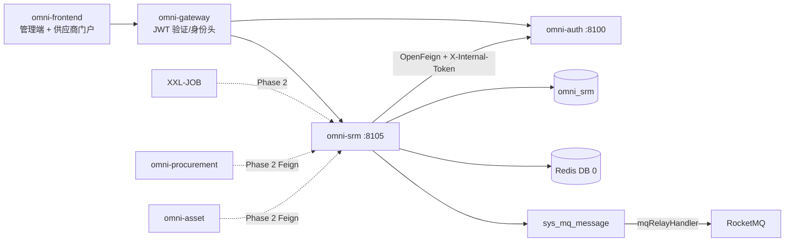
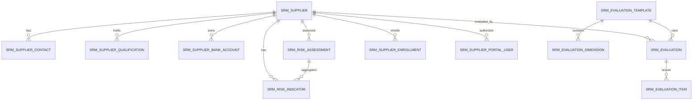
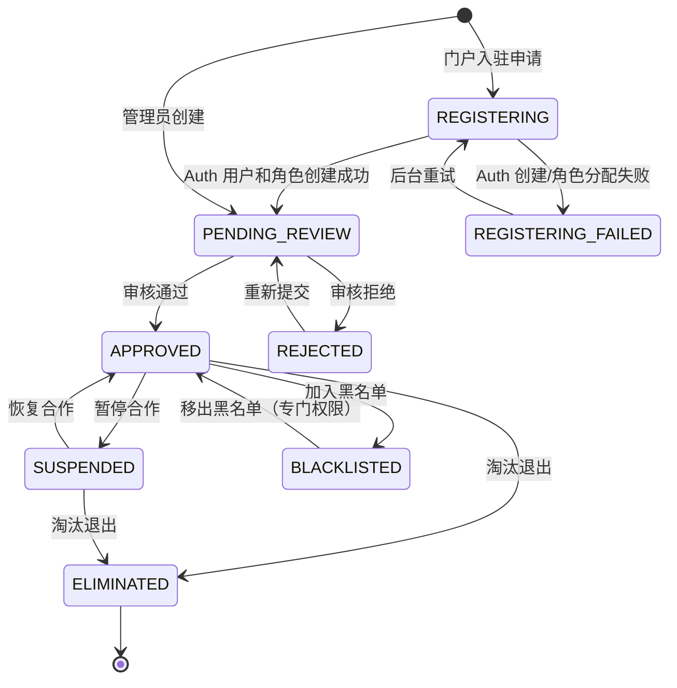
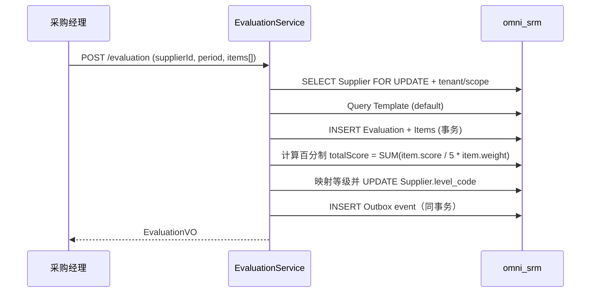
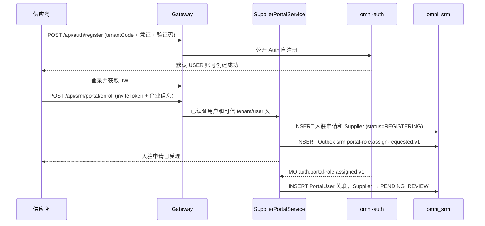

# SRM 供应商管理模块架构与实现基线

> 状态：MVP 已实现并完成端到端加固  
> 项目：Omni-Stack  
> 日期：2026-07-17  
> 目标：说明 omni-srm MVP 的架构、跨服务契约和实施边界；实现入口为 `omni-backend/omni-srm`、`omni-frontend/src/views/srm` 与 `omni-frontend/src/views/supplier-portal`。

设计依据：`README.md`，以及 `docs/` 中 architecture、api-contract、backend-patterns、frontend-patterns、core-flows、scheduling、workflow、mq-reliability、docker-deployment 全部主题文档；同时参照 `docs/design/crm-design.md` 的 CRM 实现模式。

## 1. 设计结论

SRM 应建设为独立 Servlet 微服务，与采购执行（`omni-procurement`）和资产管理（`omni-asset`）分离。三者按依赖关系分步建设：SRM → Procurement → Asset。

| 项目 | 决策 |
|---|---|
| Maven 模块 / 服务名 | `omni-srm` |
| 本地端口 / 管理端口 | `8105` / `19905` |
| XXL-JOB 执行器 | `omni-srm` / `9905`（启用定时评估或资质预警时） |
| 数据库 | `omni_srm` |
| Gateway | `/api/srm/**` → `lb://omni-srm`，不使用 `StripPrefix` |
| Redis | DB 0，共享 Auth 写入的 XSS 配置；SRM 键使用 `srm:` 前缀 |
| 前端 | 继续使用 `omni-frontend`，新增 `views/srm/**`（管理端）和 `views/portal/**`（供应商门户） |

SRM MVP 覆盖供应商全生命周期管理闭环：

> 供应商注册/准入 → 审核 → 分级分类 → 绩效评估 → 风险管控 → 淘汰退出。

采购执行（请购、询价、订单、收货）和资产处置（验收、调拨、报废）不进入 SRM MVP，分别在 `omni-procurement` 和 `omni-asset` 中实现。

SRM 作为三服务中的地基，无外部业务依赖（仅依赖 Auth 的用户/权限体系），后续两个服务均依赖 SRM 的供应商数据。

## 2. 产品范围

### 2.1 用户与目标

| 用户 | 核心诉求 |
|---|---|
| 采购经理 | 管理供应商库、评估供应商绩效、管控供应风险 |
| 采购员 | 日常供应商查询、发起评估、查看风险信息 |
| SRM 管理员 | 管理租户内全部供应商数据和配置 |
| 供应商 | 通过门户自助注册、维护企业信息、查看自身绩效；报价在 Phase 2 接入 Procurement 后开放 |
| 只读观察者 | 查看授权范围内的供应商统计与记录 |

MVP 应能回答：有多少合格/冻结/淘汰供应商；某个供应商的资质什么时候到期；上次绩效评估得分多少；哪些供应商风险等级为红色；谁修改了供应商关键信息。

### 2.2 分期

| 阶段 | 能力 |
|---|---|
| MVP | 供应商信息库、准入审核、分级分类、供应商门户、绩效评估、风险看板、供应商 360 |
| Phase 2 | Procurement/RFQ 集成与供应商自助报价、评估模板动态配置 UI、第三方征信接入、风险事件工作流、证书附件管理 |
| Phase 3 | 供应商协同平台（订单确认、发货通知、对账）、智能预警（舆情监控） |

## 3. 系统边界

| 组件 | 权威职责 | SRM 的使用方式 |
|---|---|---|
| `omni-auth` | 租户、用户、组织、角色、权限、数据范围、XSS 配置 | 内部 OpenFeign；SRM 只存用户/组织 ID |
| `omni-srm` | 供应商、评估、风险、供应商门户账号关联 | SRM 业务唯一写入方；认证账号仍由 Auth 权威管理 |
| `omni-base` | 字典、操作日志、任务/MQ 运维 | 操作日志汇聚；品类/行业等用字典 code |
| `omni-workflow` | BPMN、流程实例、审批 | MVP 不接审批（准入审核走简单状态机）；Phase 2 可接入复杂审批 |
| `omni-procurement` | 采购执行（后续服务） | 通过 Feign 查询供应商数据 |
| `omni-asset` | 资产管理（后续服务） | 通过 Feign 查询供应商数据 |
| XXL-JOB | 触发批量扫描 | 资质到期预警扫描（MVP 可选） |
| RocketMQ | 异步运输 | 至少一次；消费者必须幂等 |
| Redis | XSS 共享配置、短缓存 | 不保存 SRM 权威业务数据 |



推荐依赖：`omni-common-core`、`omni-common`、`omni-common-mybatis`、`omni-common-redis`、`omni-common-operlog`、`omni-common-job`、`omni-common-mqlog`，以及 Web、Validation、Security、AspectJ、OpenFeign、LoadBalancer、Nacos、RocketMQ Stream、Actuator、Lombok。

不依赖 `omni-common-workflow`，MVP 阶段的供应商准入审核用简单状态机实现，不引入 Flowable 引擎。

## 4. 领域与数据设计

### 4.1 聚合

| 聚合 | 表 | 职责 |
|---|---|---|
| Supplier | `srm_supplier`、`srm_supplier_contact`、`srm_supplier_qualification`、`srm_supplier_bank_account` | 供应商主数据、联系人、资质、银行账户 |
| Evaluation | `srm_evaluation_template`、`srm_evaluation_dimension`、`srm_evaluation`、`srm_evaluation_item` | 评估模板、评估记录、评分明细 |
| Risk | `srm_risk_indicator`、`srm_risk_assessment` | 风险指标、综合风险评估 |
| Portal | `srm_supplier_invite`、`srm_supplier_enrollment`、`srm_supplier_portal_user` | 入驻邀请/Saga、门户账号关联 |



### 4.2 通用字段与规则

每一张 `srm_*` 表都必须包含 `tenant_id`，包括评估模板、评估维度、资质记录；这样 TenantLine 不会改写到不存在的列。可授权业务表还必须包含：

- `tenant_id`：租户隔离。
- `owner_user_id`：SELF 范围和业务负责人。
- `owner_unit_id`：DEPT/DEPT_AND_BELOW/CUSTOM 范围。
- `version`：乐观锁。
- `deleted`：逻辑删除。
- `id/create_time/update_time/create_by/update_by`：项目审计字段。

约束：

- 用户/组织 ID 由 Auth 管理，不建跨库外键，不信任前端提交的用户名或 ownerUnitId。
- 索引以 `tenant_id` 开头，再组合 owner、状态、品类。
- `create_by` 是用户名审计字段，不能用于 SELF 数据权限。
- 银行账户账号使用 PII 掩码，完整值只返回给 `srm:pii:view`。
- 时间统一 `yyyy-MM-dd HH:mm:ss`。
- `supplier_no` 由已生成的数据库 ID 生成并做 tenant 内唯一，禁止 `SELECT MAX(...) + 1`。
- 普通 PUT 不允许直接修改 owner 或生命周期 status。
- 外部请求不得使用裸 `selectById/updateById/deleteById`。
- `owner_user_id` 只表示租户内部业务负责人；供应商门户账号必须通过 `srm_supplier_portal_user` 关联，禁止复用 owner 字段。

### 4.3 主要表

`srm_supplier`

- `supplier_no/name/normalized_name/supplier_type/industry_code`。
- `credit_code（统一社会信用代码）/website/phone/email/region/address`。
- `category_code`：供应商所属品类（IT、原材料、行政、服务等），使用字典 code。
- `level_code`：供应商等级（STRATEGIC/PREFERRED/QUALIFIED/ELIMINATED），由评估自动调整或手动设置。
- `status`：生命周期状态（REGISTERING/REGISTERING_FAILED/PENDING_REVIEW/REJECTED/APPROVED/SUSPENDED/BLACKLISTED/ELIMINATED）。`REGISTERING*` 仅用于门户跨服务注册；管理员创建直接进入 PENDING_REVIEW。
- `owner_user_id/owner_unit_id/assigned_time/last_evaluation_time`。
- `version/deleted` 和审计字段。
- 核心索引：tenant + owner/status、tenant + unit/status、tenant + category/status、tenant + name/credit_code。

`srm_supplier_contact`

- `supplier_id/name/department/job_title/mobile/phone/email/decision_role/primary_flag/status`。
- owner 是 Supplier owner 的权限快照；供应商转移时在同一事务中同步。
- 每个供应商最多一个有效主要联系人。

`srm_supplier_qualification`

- `supplier_id/qualification_name/certificate_no/issuing_authority/issue_date/expiry_date/status`。
- `expiry_date` 用于资质到期预警（30 天内到期标黄，已过期标红）。
- MVP 不存储附件，仅保存文本信息。

`srm_supplier_bank_account`

- `supplier_id/account_name/account_no/bank_name/bank_branch/bank_code/status`。
- `account_no` 是 PII 字段，完整值只返回给 `srm:pii:view`。
- 每个供应商可维护多个银行账户，标记一个为默认。

`srm_supplier_portal_user`

- `supplier_id/user_id/status/last_login_time/version/deleted`。
- `tenant_id + user_id` 唯一，确保一个 Auth 用户在同一租户只关联一个供应商主体。
- `tenant_id + supplier_id + user_id` 用于门户行级授权；门户用户不能通过修改请求中的 supplierId 切换企业。
- `owner_user_id` 与门户 `user_id` 语义严格分离：前者是内部采购负责人，后者是供应商登录账号。

`srm_supplier_enrollment`

- `request_id/supplier_id/user_id/status/retry_count/last_error_code/next_retry_time/version/deleted`。
- `status`：PENDING_ROLE_ASSIGN/ROLE_ASSIGN_FAILED/COMPLETED/CANCELLED。
- `tenant_id + request_id` 唯一；同一 tenant + user_id 同时最多一个活动入驻申请。
- 仅保存 inviteToken 的标识/摘要和校验结果，不保存原始 inviteToken，更不保存密码或验证码。

`srm_supplier_invite`

- `invite_code_hash/status/expires_time/max_uses/used_count/version/deleted`，可选记录预期 credit_code 或联系人邮箱摘要。
- 原始 inviteToken 只在创建时返回一次，数据库仅保存 SHA-256/HMAC 摘要；校验时同时检查 tenant、ACTIVE、有效期、用途和剩余次数。
- 入驻事务以 version 条件原子递增 used_count，防止同一邀请并发超用；作废后不可再入驻。

`srm_evaluation_template`

- `tenant_id/name/status/default_flag/version/deleted`。
- MVP 每个租户一套默认模板，不提供动态配置 UI。
- 租户初始化时 `SrmTenantInitializer` 幂等创建默认模板。

`srm_evaluation_dimension`

- `tenant_id/template_id/indicator_name/weight/sort/status/deleted`。
- MVP 预设四个维度：质量（30%）、交期（30%）、价格（20%）、服务（20%）。
- `weight` 为 `DECIMAL(5,2)`，同一模板下所有维度 weight 之和必须等于 100。

`srm_evaluation`

- `supplier_id/template_id/evaluation_period（如 2026-Q2）/total_score/evaluator_user_id/evaluation_time/status/version/deleted`。
- `total_score` 由系统自动加权汇总计算，不接受前端传入。
- 评估完成后先将 1-5 分归一化为百分制：`total_score = SUM(item.score / 5 × item.weight)`，结果范围为 20-100；再映射供应商等级：≥90 战略级、≥75 优选级、≥60 合格级、<60 待淘汰。

`srm_evaluation_item`

- `evaluation_id/dimension_id/indicator_name/score/weight/remark`。
- `score` 为 1-5 分，`DECIMAL(3,1)`。
- 只追加，评估提交时一次性写入，不提供后续修改接口（如需修正，创建新的评估记录）。

`srm_risk_indicator`

- `supplier_id/indicator_type/indicator_value/risk_level/assessment_time/remark`。
- `indicator_type` 枚举：FINANCIAL（财务风险）、COMPLIANCE（合规风险）、SUPPLY（供应风险）、COOPERATION（合作风险）、QUALITY（质量风险）、CERTIFICATE（资质风险）。
- `risk_level` 枚举：GREEN/YELLOW/RED。
- 部分指标可自动计算（资质到期日距今天数 → CERTIFICATE 指标），其余手动标记。

`srm_risk_assessment`

- `supplier_id/overall_level/assessment_time/assessor_user_id/remark/version/deleted`。
- `overall_level` 为综合风险等级，取各指标最高等级（RED > YELLOW > GREEN）。

`srm_quotation` / `srm_quotation_line`（Phase 2 预留）

- 报价依赖尚未建设的 `omni-procurement` RFQ 与邀请关系，因此不属于本次 MVP 可执行范围。
- MVP 不创建报价表、不注册报价端点、不下发 `srm:portal:quotation` 权限，也不展示报价菜单，避免形成无法校验 RFQ 的孤立写入链路。
- Phase 2 接入时再落地 `srm_quotation`（`supplier_id/rfq_id/rfq_no/quotation_time/valid_until/total_amount/currency_code/status/version/deleted`）与 `srm_quotation_line`（`quotation_id/material_code/material_name/unit_price/quantity/delivery_days/remark`），并同步补充 fresh DDL、升级脚本、权限与事件契约。

## 5. 状态机与核心流程

### 5.1 Supplier 生命周期



- 只有 `APPROVED` 状态的供应商可被采购模块引用。
- `BLACKLISTED` 需要 `srm:supplier:blacklist` 权限才能操作。
- `ELIMINATED` 为终态，不可恢复。
- 供应商注册（门户自助或管理员创建）后状态为 `PENDING_REVIEW`。

### 5.2 绩效评估流程



评估周期建议每季度一次，但 MVP 不强制，由管理员手动发起。评估完成后系统自动：
1. 计算加权总分。
2. 根据总分映射新的供应商等级。
3. 更新 `srm_supplier.level_code`。
4. 记录 `last_evaluation_time`。

### 5.3 风险评估流程

```text
手动/自动更新风险指标
→ 重新计算综合风险等级（取各指标最高等级）
→ INSERT/UPDATE srm_risk_assessment
→ 若等级变更为 RED，写 Outbox 事件通知
```

资质到期预警逻辑：
- `expiry_date - today <= 30` 天 → CERTIFICATE 指标自动设为 YELLOW。
- `expiry_date < today` → CERTIFICATE 指标自动设为 RED。
- 预警扫描通过 XXL-JOB 定时任务实现（Phase 2 启用，MVP 手动触发或不启用）。

### 5.4 供应商门户开户与入驻



门户开户与入驻分成两个安全边界：

- 账号开户只使用现有公开 `POST /api/auth/register`，由 Auth 校验 tenantCode、验证码、用户名唯一性并分配默认 `USER` 角色；SRM 不接收、持久化或通过 MQ 传递密码。
- 用户登录后调用 `POST /api/srm/portal/enroll`。该写接口声明 `@PreAuthorize("hasAuthority('srm:portal:enroll')")`，默认 USER 仅获得这一条 SRM 入驻权限；服务端 tenantId/userId 只取 Gateway 注入的可信身份头。
- 入驻必须携带租户专属 inviteToken，校验其 tenant、有效期、使用次数和用途；不得接受请求体中的裸 tenantId/userId。
- 统一社会信用代码（credit_code）在 tenant 内唯一。
- 入驻请求使用 requestId/credit_code 做幂等，且同一 userId 只能关联一个供应商主体。
- SRM 通过 Outbox 请求 Auth 为既有 USER 账号增加 `SUPPLIER` 角色。角色分配失败时保持入驻申请为 `REGISTERING_FAILED`，由后台重试或人工处理，不能把未授权账号视为入驻成功。
- Auth 角色分配成功事件返回 userId 后，SRM 写入 `srm_supplier_portal_user`，再将供应商状态推进到 `PENDING_REVIEW`。

入驻授权横跨 SRM 与 Auth，禁止使用“事务内 Feign 即可回滚远端”的假设。采用本地事务 + Outbox/Saga 保证最终一致性；重复事件由 `requestId` 唯一约束幂等处理。

## 6. 租户、RBAC 与数据权限

### 6.1 信任链

1. Gateway 验证 RS256 JWT 和黑名单，覆盖并注入 `X-User-*`、`X-Tenant-Id`、`X-Gateway-Forwarded`。
2. SRM `GatewayPreAuthFilter` 构建 `Authentication`。
3. Controller 用 `@PreAuthorize` 验证功能权限。
4. SRM 租户过滤器建立 tenant 上下文；`@SrmDataScope(permissionCode)` 切面按当前端点权限解析 dataScope。
5. MyBatis-Plus 追加 tenant 和该 permission 对应的 owner 条件。

`X-Gateway-Forwarded:true` 不是密码学证明。生产环境不得公开 SRM 业务端口。

### 6.2 权限树与角色

菜单：`srm`（DIRECTORY）以及 `srm:overview`、`srm:supplier`、`srm:evaluation`、`srm:risk`（MENU）。

供应商门户权限树：`srm:portal`（DIRECTORY）以及 `srm:portal:profile`、`srm:portal:evaluation`；入驻接口为 `srm:portal:enroll`。门户资料与绩效仅对已完成关联的 `SUPPLIER` 角色开放。

API 权限：

- `srm:overview:list`
- `srm:supplier:list/create/update/delete/approve/reject/suspend/resume/blacklist/restore/eliminate/transfer`
- `srm:contact:list/create/update/delete`
- `srm:qualification:list/create/update/delete`
- `srm:bank-account:list/create/update/delete`
- `srm:evaluation:list/create/view`
- `srm:risk:list/update/assess`
- `srm:owner:list`
- `srm:pii:view`
- `srm:invite:list/create/revoke`、`srm:portal:invite`（管理端邀请）
- `srm:portal:enroll/profile/evaluation`（供应商门户）

上面的 `/` 是同一资源下多个完整权限码的简写，例如 `srm:supplier:list/create` 表示 `srm:supplier:list` 与 `srm:supplier:create`，落库时必须逐条保存完整 code。真实 `sys_permission.type` 使用 `DIRECTORY/MENU/API`。

| 角色 | dataScope | 能力 |
|---|---|---|
| `SRM_ADMIN` | TENANT | 当前租户全部 SRM 功能/数据 |
| `PROCUREMENT_MANAGER` | DEPT_AND_BELOW | 部门及下级、供应商评估、风险管理 |
| `PROCUREMENT_STAFF` | SELF | 自己负责的数据及日常操作 |
| `SUPPLIER` | SELF | 门户自助：入驻后企业信息维护、查看自身绩效 |
| `SUPER_ADMIN` | ALL | 所有功能，SRM 数据仍限当前租户 |

默认 USER 仅授予 `srm:portal:enroll`，不授予 SRM 管理或门户资料/绩效权限；入驻完成并增加 SUPPLIER 角色后才能访问 profile/evaluation。前端 `v-permission` 和后端 `@PreAuthorize` 同码。

### 6.3 Auth 内部数据范围契约

SRM 复用 CRM 已建设的 Auth DataScope 内部接口：

```text
GET /internal/data-scopes/{userId}?tenantId={tenantId}&permissionCode=srm:supplier:list
```

规则与 CRM 一致：
- 校验用户启用且属于 tenant。
- 只合并授予该 `permissionCode` 的角色。
- SRM 调用失败/超时/tenant 不一致时返回 503/403，不降级。

### 6.4 SRM 上下文与 SQL 拦截

新增 `SrmTenantContext`、`SrmTenantContextFilter`、`SrmDataScopeContext`、`SrmDataScope` 注解/切面、`SrmDataPermissionHandler`、`SrmRecordAccessGuard`。

SRM 自定义同名 `mybatisPlusInterceptor`，顺序固定：

```text
TenantLineInnerInterceptor
→ DataPermissionInterceptor
→ PaginationInnerInterceptor
```

- TenantLine 只处理 `srm_*` 表，永远添加当前 tenant。
- `sys_mq_message` 排除两个权限拦截器。
- DataPermission 映射 Supplier 的 owner 列；评估和风险通过 supplier_id 关联到 Supplier 的 owner 进行权限检查。

| dataScope | 条件 |
|---|---|
| SELF | `owner_user_id = currentUserId` |
| DEPT | `owner_unit_id = primaryUnitId` |
| DEPT_AND_BELOW / CUSTOM | `owner_unit_id IN accessibleUnitIds` |
| TENANT / ALL | 不加 owner 条件，TenantLine 始终保留 |

供应商门户用户（SUPPLIER 角色）不复用内部 owner dataScope。门户查询和命令必须先按 `tenant_id + currentUserId` 查询 `srm_supplier_portal_user`，再以关联的 supplierId 限定 Supplier 及其子资源；找不到有效关联时失败关闭。

实际 SQL 按资源映射，禁止将 owner 条件机械追加到所有 `srm_*` 表：

| 资源/表 | 范围规则 |
|---|---|
| Supplier | 使用 `owner_user_id/owner_unit_id` |
| Contact/Qualification/BankAccount | 通过同 tenant 的 supplier_id 继承 Supplier 范围 |
| Evaluation/EvaluationItem | 通过同 tenant 的 supplier_id/evaluation_id 继承 Supplier 范围 |
| RiskIndicator/RiskAssessment | 通过同 tenant 的 supplier_id 继承 Supplier 范围 |
| Template/Dimension | 租户内共享，只应用 TenantLine 和功能权限 |
| Portal profile/evaluation | 固定使用 `srm_supplier_portal_user` 关联的 supplierId，不使用内部 owner dataScope |
| Overview/360 | 聚合和分块查询使用与 Supplier 列表相同范围 |

### 6.5 写操作行级授权

DataPermissionInterceptor 不能替代写授权。每个更新/删除/审核/冻结/黑名单命令必须：

1. 以 `tenant_id + id + data scope` 查询可见记录；不可见统一 404。
2. 校验状态机和业务不变量。
3. 以 `tenant_id + id + version` 条件更新。
4. 更新行数非 1 时返回并发冲突。

`SrmRecordAccessGuard` 统一实现详情、命令和子资源访问检查。

## 7. API 设计

### 7.1 通用契约

- 所有响应为 `R<T>`；分页为 `R<PageResult<T>>`。
- `page=1`、`size=10`，SRM 限制 `size <= 100`。
- Entity 不直接作为 Request/Response；状态命令使用独立 DTO。
- 日期参数声明 `@DateTimeFormat(pattern = "yyyy-MM-dd HH:mm:ss")`；前端使用 `value-format="YYYY-MM-DD HH:mm:ss"`。
- 状态、审核和评估请求携带 `version`。
- 写接口同时声明 `@PreAuthorize` 和 `@OperLog`。

### 7.2 端点

| 领域 | 端点 |
|---|---|
| Overview | `GET /api/srm/overview/summary`、`/risk-dashboard` |
| Supplier | `GET /supplier/list`、`GET /supplier/{id}`、`POST /supplier`、`PUT/DELETE /supplier/{id}` |
| Supplier 命令 | `POST /supplier/{id}/approve`、`/reject`、`/suspend`、`/resume`、`/blacklist`、`/restore-from-blacklist`、`/eliminate`、`/transfer` |
| Supplier 子资源 | `GET /supplier/{id}/contact/list`、`POST /supplier/{id}/contact`、`PUT/DELETE /contact/{id}` |
| Supplier 子资源 | `GET /supplier/{id}/qualification/list`、`POST /supplier/{id}/qualification`、`PUT/DELETE /qualification/{id}` |
| Supplier 子资源 | `GET /supplier/{id}/bank-account/list`、`POST /supplier/{id}/bank-account`、`PUT/DELETE /bank-account/{id}` |
| Supplier 360 | `GET /supplier/{id}/overview` |
| Evaluation | `GET /evaluation/list`、`GET /evaluation/{id}`、`POST /evaluation` |
| Evaluation | `GET /supplier/{id}/evaluation/history` |
| Risk | `GET /risk/list`、`GET /supplier/{id}/risk`、`PUT /risk/indicator/{id}` |
| Risk | `POST /risk/assessment/{supplierId}` |
| Owner 选项 | `GET /api/srm/options/owners`，权限 `srm:owner:list` |
| Portal 开户 | `POST /api/auth/register`（Auth 公开接口，SRM 不处理凭证） |
| Portal 邀请 | `GET /portal/invite/list`、`POST /portal/invite`、`POST /portal/invite/{id}/revoke`（管理端） |
| Portal 入驻 | `POST /api/srm/portal/enroll`（已认证；请求携带 inviteToken，不接受裸 tenantId/userId） |
| Portal 企业信息 | `GET /portal/profile`、`PUT /portal/profile` |
| Portal 报价 | Phase 2 接入 Procurement 后再提供；MVP 不暴露报价端点 |

表中省略 `/api/srm` 的端点均以该前缀开头。所有列表/详情和聚合统计应用相同 TenantLine/DataPermission。

### 7.3 端点与 DataScope permission 映射

| 操作 | permissionCode |
|---|---|
| Overview 全部统计 | `srm:overview:list` |
| Supplier list/detail/overview | `srm:supplier:list` |
| Supplier create/update/delete | `srm:supplier:create/update/delete` |
| Supplier approve/reject | `srm:supplier:approve` / `srm:supplier:reject` |
| Supplier suspend/resume/eliminate | `srm:supplier:suspend` / `srm:supplier:resume` / `srm:supplier:eliminate` |
| Supplier blacklist/restore | `srm:supplier:blacklist` / `srm:supplier:restore` |
| Supplier owner transfer (`POST /supplier/{id}/transfer`) | `srm:supplier:transfer`；普通 `PUT /supplier/{id}` 禁止修改 owner |
| Evaluation list/history | `srm:evaluation:list` |
| Evaluation create | `srm:evaluation:create` |
| Risk list/indicator/history | `srm:risk:list` |
| Risk indicator update / assessment | `srm:risk:update` / `srm:risk:assess` |
| Owner options | `srm:owner:list` |
| Portal enroll | `srm:portal:enroll`（默认 USER 仅获此入驻权限，另校验 inviteToken） |
| Portal invite list/create/revoke | `srm:portal:invite` |
| Portal profile | `srm:portal:profile`，并校验 `srm_supplier_portal_user` 关联 |

## 8. 跨服务一致性

### 8.1 用户与组织

- SRM 只保存 userId/unitId；分配前通过 tenant 限定的 Auth Feign 验证用户存在、启用、同租户。
- ownerUnitId 取 Auth 权威主组织，不信任前端。
- 列表展示先收集 ID，再调用一次 batch API，禁止逐行 Feign。
- SRM 不维护密码等认证数据；账号由现有 Auth 自注册创建。SRM 入驻流程只通过 Outbox/Saga 请求 Auth 给既有 userId 增加 SUPPLIER 角色，并在 `srm_supplier_portal_user` 保存 userId 与 Supplier 的授权关联。

### 8.2 字典

品类使用 `omni-base` 的 `srm_supplier_category` 字典，MVP 预置 `ELECTRONICS/IT/RAW_MATERIAL/ADMIN/SERVICE`，SRM 只存 `category_code`。迁移和新租户初始化均幂等归一这些 code，不强制依赖 Base 在线。

### 8.3 Workflow

MVP 不接审批。供应商准入审核使用简单状态机（管理员直接审核通过/拒绝）。Phase 2 可接入 `omni-workflow` 实现复杂审批流（多级审核、会签等）。

### 8.4 Procurement 和 Asset 集成

MVP 阶段 `omni-procurement` 和 `omni-asset` 尚未建设。SRM 预留以下能力供后续服务调用：

- 内部 API：`GET /api/internal/supplier/{id}?tenantId={tenantId}`，返回供应商摘要（ID、名称、状态、等级）。
- 内部 API：`GET /api/internal/supplier/search?tenantId={tenantId}&status=APPROVED&categoryCode={code}`，按条件搜索合格供应商。
- 所有内部 API 使用 `X-Internal-Token` 认证，不经 Gateway 暴露。

以下报价一致性流程属于 Phase 2 目标契约，本次 MVP 未创建报价表或端点。接入后，报价由 SRM 持久化，但 RFQ 邀请状态由 Procurement 持久化，任何服务都不得跨库更新另一服务的表：

1. Supplier 门户提交报价前，SRM 调用 Procurement 内部 API 校验 RFQ、邀请关系、截止时间与 tenant。
2. SRM 在本地事务中写入 `srm_quotation`、明细和 Outbox 事件 `srm.quotation.submitted.v1`。
3. Procurement 幂等消费事件，更新自己的 `proc_rfq_supplier.quotation_id/status`。
4. Procurement 定点前通过 SRM batch 内部 API 获取报价，并在定点/订单中保存不可变报价快照；SRM 后续变更不得影响已定点结果。

### 8.5 Outbox 与事件

使用 `ReliableMessageRelay.send("srm-domain-out-0", envelope, tenantId, eventId)`；tenantId 必须显式。

所有事件使用统一信封 `eventId/eventType/occurredAt/tenantId/payload`。门户角色分配请求/结果至少包含 requestId、tenantId、supplierId、userId、roleCode、result/errorCode，消费者以 requestId 幂等；事件中绝不传密码、验证码或 inviteToken。Phase 2 的 `srm.quotation.submitted.v1` payload 至少包含 quotationId、quotationVersion、rfqId、rfqNo、supplierId、status、totalAmount、currencyCode、validUntil；不在事件中传完整银行账户或联系人 PII。

建议事件：

- `srm.supplier.registered.v1`
- `srm.supplier.approved.v1`
- `srm.supplier.rejected.v1`
- `srm.supplier.suspended.v1`
- `srm.supplier.blacklisted.v1`
- `srm.supplier.eliminated.v1`
- `srm.portal-role.assign-requested.v1`
- `auth.portal-role.assigned.v1`（由 Auth 返回，SRM 消费）
- `auth.portal-role.assign-failed.v1`（由 Auth 返回，SRM 标记失败并安排重试）
- `srm.quotation.submitted.v1`（Phase 2）
- `srm.evaluation.completed.v1`
- `srm.risk.level-changed.v1`

事件只传 ID、状态和必要快照，不传完整银行账户、联系人手机、邮箱。

## 9. 隐私、操作日志与 XSS

### 9.1 OperLog 脱敏

复用 CRM 已建设的 `omni-common-operlog` PII 脱敏能力。SRM 需要脱敏的字段：

- 银行账户账号（`account_no`）
- 联系人手机号（`mobile`）
- 联系人邮箱（`email`）
- 供应商电话（`phone`）
- 入驻邀请原文（`inviteToken`，按凭证处理，禁止写入日志或数据库）

### 9.2 PII

- 完整银行账户、联系人手机、邮箱只返回给 `srm:pii:view`。
- 其他用户由后端 VO 返回掩码，例如 `6222****1234`、`138****1234`、`a***@example.com`。
- 列表默认掩码；详情按权限决定。
- 供应商门户中，供应商可以查看自己关联的完整信息（SUPPLIER 角色隐含 `srm:pii:view` 对自身数据）。

### 9.3 XSS

SRM 必须实现 `XssConfigProvider`，读取 Redis DB 0 的 `xss:enabled:{tenantId}` 与 `xss:rules:{tenantId}`。缓存 miss 时回源 Auth 或使用内置基线规则。MVP 备注只允许纯文本且禁止 `v-html`。

## 10. 前端设计

```text
omni-frontend/src/
├── api/
│   ├── srm-overview.ts
│   ├── srm-supplier.ts
│   ├── srm-evaluation.ts
│   ├── srm-risk.ts
│   └── srm-portal.ts
├── views/
│   ├── srm/
│   │   ├── overview/index.vue         # 供应商概览 + 风险看板
│   │   ├── supplier/index.vue         # 供应商管理
│   │   ├── evaluation/index.vue       # 绩效评估
│   │   └── risk/index.vue             # 风险管理
│   └── supplier-portal/
│       ├── enrollment/index.vue       # 邀请入驻与 Saga 状态
│       ├── profile/index.vue          # 企业信息维护
│       └── evaluation/index.vue       # 自身绩效查看
└── components/srm/
    ├── SupplierOverview.vue           # 供应商 360 视图
    ├── SupplierPicker.vue             # 供应商选择器
    ├── EvaluationScorecard.vue        # 评估评分卡
    ├── RiskIndicator.vue              # 风险指标卡片
    └── RiskDashboard.vue              # 风险看板组件
```

- Shared `ApiResponse/PageResult` 只从 `src/types/api.ts` 导入。
- 供应商门户使用角色路由：`USER + SUPPLIER`（或仅 `SUPPLIER`）属于门户账号，只可见 `portal/**`；只有同时拥有 `SUPER_ADMIN`、采购、CRM 等独立内部管理角色时才视为真实双角色账号并保留管理端入口，禁止用 USER 自带的只读权限前缀推断管理身份。
- `router/index.ts` 与 `layout/index.vue` 各有 iconMap，两处都要补 SRM 和 Portal。
- `constants/menu.ts`、`zh-CN.ts`、`en-US.ts` 同步。
- 供应商 360 使用 Drawer 组件。
- 所有按钮使用同码 `v-permission`，但后端是最终边界。
- 风险看板使用红黄绿灯卡片组件，支持按风险等级筛选。

## 11. 工程落点

### 11.1 新模块

```text
omni-backend/omni-srm/
├── pom.xml
└── src/main/
    ├── java/com/omni/srm/
    │   ├── SrmApplication.java
    │   ├── client/ config/ controller/ dto/ entity/
    │   ├── mapper/ security/ service/ service/impl/
    └── resources/
        ├── application.yml
        ├── application-dev.yml
        └── mapper/
```

`SrmApplication` 使用 `@EnableDiscoveryClient`、`@EnableFeignClients(basePackages="com.omni.srm.client")`、`@MapperScan("com.omni.srm.mapper")`。服务自带 `SecurityConfig`、`GatewayPreAuthFilter`、`XssConfigProviderImpl`。

### 11.2 必改文件

| 文件 | 修改 |
|---|---|
| `omni-backend/pom.xml` | 加入 `omni-srm` |
| Gateway `application.yml` | 显式 `/api/srm/**` 路由；内部路径阻断加入 SRM |
| `docker/backend/Dockerfile` | POM 缓存层 `COPY omni-srm/pom.xml omni-srm/` |
| `docker-compose.yml` | SRM 服务、8105、DB/Redis/Nacos/MQ/XXL/internal token |
| `start.bat/start.sh` | build 列表加入 SRM；Windows 端口保护加入 8105 |
| `scripts/sql/init-all.sql` | `omni_srm` DDL、默认评估模板、权限和角色 |
| `scripts/sql/sp_init_tenant.sql` | 与内嵌过程同步 |
| `omni-auth` | 消费 portal-role assign 请求并以 requestId 幂等分配 SUPPLIER 角色，发布成功/失败结果事件 |
| Frontend router/layout/menu/locales | 图标、菜单、i18n |

权限迁移按 tenant + code 的 `NOT EXISTS` 幂等插入，正确重建 parent/path；同时更新 SUPER_ADMIN、SRM 角色及新租户初始化。默认 USER 只增加 `srm:portal:enroll`，SUPPLIER 增加 profile/evaluation，SRM 管理角色增加 invite 管理；不得把管理权限整体授给 USER。Phase 2 报价权限在 Procurement 契约落地前不预置。

配置要点：server 8105、management 19905、Redis DB 0、XXL appname `omni-srm`/port 9905。

## 12. 非功能设计

### 性能

- 所有列表分页，最大 100；owner/status/category 使用 tenant 前缀联合索引。
- 用户/组织一次 batch enrich，禁止 N+1。
- 供应商 360 分块查询并限制评估和风险记录数量。
- 概览统计使用 Mapper 层聚合 SQL。

### 并发与幂等

- 供应商审核/冻结/黑名单：version 乐观锁。
- 评估提交：supplier 行锁 + 事务内一次性写入。
- 门户入驻：credit_code tenant 内唯一约束，同一 tenant + userId 仅允许一个有效供应商关联。
- 邀请使用次数：invite version 条件更新，校验与 used_count 递增在同一事务。
- SUPPLIER 角色分配：requestId 幂等 + Outbox/Saga；失败可重试，不依赖分布式事务。

### 降级

- Auth dataScope 不可用：503，失败关闭。
- Auth 展示 enrich 不可用：可返回 ID/未知用户。
- RocketMQ 不可用：业务与 Outbox 提交，Relay 后补。
- Redis XSS miss：回源/基线规则，不关闭防护。

## 13. 测试与验收

最低测试集：

- 供应商状态机合法/非法迁移。
- 评估加权汇总计算正确性。
- 评估 1-5 分到百分制的边界（全 1 分=20、全 5 分=100）及 60/75/90 调级阈值。
- 评估自动调级映射正确性。
- 风险综合等级取最高等级逻辑。
- PII 掩码（银行账户、联系人手机/邮箱）。
- 六种 dataScope 的列表和聚合。
- 跨租户读、改、删全部失败。
- 缺 tenant/scope 时失败关闭。
- tenant + id + version 并发更新。
- 门户入驻幂等性（重复 credit_code 或同一 userId 重复入驻拒绝/返回原 requestId）。
- Auth 开户缺少/伪造 tenantCode 时拒绝；SRM 入驻缺少/伪造 inviteToken 或请求体伪造 tenantId/userId 时拒绝。
- Auth 角色分配成功事件重复消费不会重复关联门户账号。
- SUPPLIER 角色分配失败时入驻保持失败/重试态，不出现半成功授权。
- SUPPLIER 角色只能看到自己的数据。
- SUPPLIER 即使伪造 supplierId 也不能访问其他供应商资料或绩效。
- inviteToken 只返回一次且数据库/OperLog 不出现原文；过期、作废、跨租户和并发超用均拒绝。

端到端验收：Auth 自注册开户 → 登录后供应商入驻 → SUPPLIER 角色分配 → 管理员审核通过 → 采购经理创建评估 → 打分汇总 → 自动调级 → 风险指标更新 → 供应商 360 完整展示。

验证命令：

```powershell
$env:JAVA_HOME='C:\APP\JDK25\jdk-25.0.2'
$env:PATH="$env:JAVA_HOME\bin;$env:PATH"
cd omni-backend
.\mvnw.cmd clean install

cd ..\omni-frontend
npm run build
npm run lint

cd ..
docker compose config
docker compose build omni-srm omni-gateway omni-frontend
```

## 14. 实施顺序

### Milestone 0：前置确认

- 确认 Auth DataScope 内部接口、OperLog PII 脱敏、XSS miss 策略已就绪（CRM 已建设，直接复用）。
- 确认 Gateway 内部路径阻断规则包含 `/internal/**`。

### Milestone 1：服务搭建 + 安全底座

- 创建模块、配置、Gateway、Docker、DB。
- TenantLine + DataPermission + Pagination。
- 权限树、SRM 角色、SUPPLIER 角色、已有租户迁移。
- 前端 root 菜单（管理端 + 门户）。

完成条件：注册、路由、401/403、租户隔离、XSS、健康检查通过。

### Milestone 2：供应商管理 + 状态机

- 供应商 CRUD、准入/审核/冻结/恢复/黑名单/淘汰。
- 联系人、资质、银行账户子表。
- 供应商 360 视图。
- PII 掩码。

完成条件：管理员创建供应商 → 审核 → 分级/冻结/淘汰可走通。

### Milestone 3：供应商门户

- 供应商自助开户与入驻（Auth 公开注册 + 已认证 SRM enroll + inviteToken + credit_code 唯一 + 角色分配 Saga）。
- 门户登录（SUPPLIER 角色路由）。
- 企业信息维护。

完成条件：Auth 开户 → 已认证入驻 → SUPPLIER 角色分配 → 审核 → 门户维护企业信息可走通。

### Milestone 4：绩效评估

- 评估模板预设（数据库 seed data）。
- 评估打分 → 加权汇总 → 自动调级。
- 评估历史和趋势。

完成条件：评估创建到自动调级闭环。

### Milestone 5：风险看板 + 生产加固

- 风险指标录入和展示。
- 红黄绿灯 + 资质到期预警。
- 概览统计（summary + risk-dashboard）。
- 测试、索引、安全验收。
- 更新 README、architecture、api-contract、AGENTS。

完成条件：MVP、后端构建、前端 Build/Lint、Docker 和安全验收全部通过。

## 15. ADR 摘要

| 决策 | 选择 | 原因 |
|---|---|---|
| 服务 | 独立 `omni-srm` | 与采购、资产分离，职责清晰 |
| 三服务拆分 | SRM/Procurement/Asset 独立 | 各自有独立数据库和安全架构 |
| 建设顺序 | SRM → Procurement → Asset | SRM 是地基，后续服务依赖供应商数据 |
| 用户体系 | 共享 Auth | 供应商 = sys_user + SUPPLIER 角色，复用多租户 + RBAC |
| 双门户 | 管理端 + 供应商门户共用前端 | 角色路由区分，无需独立前端项目 |
| MVP 审批 | 简单状态机 | 不引入 Flowable，降低 MVP 复杂度 |
| 评估模板 | 数据库预设 | MVP 不做动态配置 UI |
| 评估调级 | 系统自动映射 | 减少人工干预，保证一致性 |
| 风险指标 | 手动为主 + 资质自动预警 | MVP 不接第三方数据 |
| 门户开户/入驻 | Auth 负责公开开户，SRM 负责已认证入驻和角色分配 Saga | 凭证不进入 SRM/MQ，tenant/user 来自可信 JWT |
| 门户授权 | 独立 `srm_supplier_portal_user` 关联 | 不混用内部 owner，按登录账号精确绑定供应商 |
| PII | 后端按权限掩码 | 与 CRM 保持一致的安全策略 |
| Workflow | MVP 不接入 | Phase 2 再接入复杂审批 |

## 16. 主要风险

| 优先级 | 风险 | 处理 |
|---|---|---|
| P0 | DataScope 只在 Auth，空上下文不加过滤 | 内部契约 + SRM fail closed |
| P0 | 门户开户/入驻被滥用或伪造租户 | Auth tenantCode+验证码；SRM JWT tenant/user + inviteToken + credit_code 唯一 + 限流 |
| P0 | 银行账户 PII 泄露 | 后端掩码 + OperLog 脱敏 |
| P0 | 写操作绕过查询数据权限 | AccessGuard + 条件更新 |
| P1 | SUPPLIER 角色越权查看管理端数据 | 前端角色路由 + 后端 dataScope 强制 SELF |
| P1 | 评估调级并发冲突 | supplier 行锁 + version 乐观锁 |
| P1 | 资质到期预警不及时 | Phase 2 启用 XXL-JOB 定时扫描 |
| P0 | 门户账号越权访问其他供应商 | 独立 PortalUser 关联 + tenant/user/supplier 三元校验 |
| P1 | SUPPLIER 角色分配跨 Auth/SRM 出现半成功 | requestId 幂等 + 本地事务 + Outbox/Saga + 可重试失败态 |
