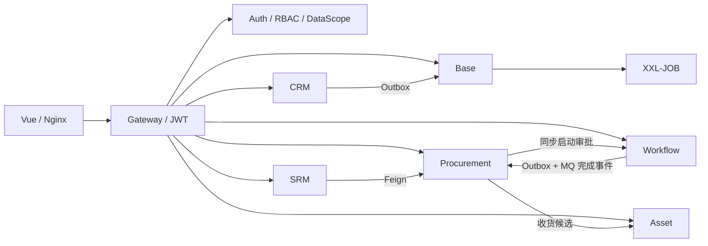

# Omni-Stack 全功能审查报告

> 审查日期：2026-08-14  
> 审查对象：当前工作区（包含尚未提交的本地修改和未跟踪的 Procurement、Asset 等实现），不是仅针对 `main` 最新提交。  
> 审查方式：代码与文档对照、前后端构建、后端测试、数据库种子核对、真实 Docker 运行、API 冒烟、跨服务业务闭环、三角色登录后浏览器交互与移动端抽样检查。  
> 重要边界：已获得 CAPTCHA 代解许可，并经 Frontend/Nginx 代理和 Gateway 使用管理员、普通员工、供应商三类真实账号完成真实表单登录、JWT、动态菜单、页面点击、代表性表单、权限隔离、异常反馈和供应商门户移动端布局复验。管理员 42 个后台业务路由已逐页遍历；未执行会改变重要业务数据的破坏性写操作，也未执行真实第三方 OAuth 回调。

> **后续状态（2026-08-17）**：本报告记录的 32 项问题已全部完成修复与复验。逐条对照、验证证据和成熟度结论见 [全功能审查修复报告](full-functional-audit-remediation-2026-08-17.md)。本文件保留为修复前历史基线。

## 1. 结论先行

当前系统已经不是“空壳脚手架”，CRM、Procurement 审批、Workflow、用户调度任务以及多租户数据范围都有真实可运行的闭环；但系统还不能被认定为“所有功能完善”，也不适合直接进入无条件内测或生产发布。

本报告共记录 5 项阻断级、12 项严重级、15 项一般级问题，并给出公共能力与各模块的优化建议。

主要原因不是单页细节，而是以下跨模块或公共能力缺陷：

1. 公共 Feign/Jackson 日期反序列化不兼容，实际同时阻断 SRM 报价、Asset 采购收货建卡和 Base MQ 管理页面。
2. Auth 用户查询把 BCrypt 密码哈希返回给普通用户。
3. XSS 开关和规则已真实加载，但 JSON 请求体仍可原样持久化 `<script>` 和 `onerror`。
4. SRM 默认数据没有已发布的供应商准入流程，管理员无法创建供应商。
5. Asset 默认流程模型类别为小写，而代码要求大写，调拨和处置默认不可用。
6. 主后端测试、Procurement 测试和前端 lint 均未全部通过。

### 发布成熟度

| 场景 | 结论 | 说明 |
|---|---|---|
| 定向演示 | 有条件可用 | 可演示 CRM、请购审批、用户任务、部分 Asset 生命周期；需避开 SRM 新建、SRM 报价、采购建卡、Asset 调拨/处置、MQ 管理等断点。 |
| 内部试用 | 暂不建议 | 密码哈希泄露、XSS 失效、跨服务日期解码故障会影响数据安全和主要业务闭环。 |
| 生产发布 | 不可发布 | 安全、网络隔离、数据持久化、质量门禁、端到端自动化和文档真实性均未达到生产条件。 |

## 2. 审查目标与验收口径

本次审查的目标不是确认“页面存在”，而是回答以下问题：

- 当前到底实现了哪些用户可见能力、后台能力和基础设施能力。
- 每项能力能否从页面/API 进入，完成正常路径，并在异常路径下给出清晰结果。
- Frontend、Gateway、Backend、Database、RBAC、Workflow、MQ 之间的契约是否一致。
- 模块之间的同步调用、异步事件、幂等、状态回写和失败处理是否形成闭环。
- 默认 SQL、Docker 编排和启动脚本能否把代码宣称的能力真实启动出来。
- 文档是否描述当前代码，而不是历史设计或理想状态。
- 每个模块应归类为“基本完善”“存在明显缺口”还是“不可交付”。

通过标准：核心路径可重复、权限和租户边界正确、异常可解释、默认数据可用、构建/测试/lint 全绿、文档与代码一致，并且关键流程拥有可执行的自动化回归。

## 3. 实现盘点

当前代码包含 8 个业务/平台服务、Gateway、Vue 前端和多个公共 starter。静态盘点约有 70 个 Controller、58 个 Vue 页面、43 个前端 API 模块。

| 模块 | 已实现能力概览 | 代码/测试规模 | 初步结论 |
|---|---|---:|---|
| Auth | 密码+验证码、社交登录、设备码、注册、JWT/JWKS、租户、用户、角色、权限、菜单、数据范围、登录/认证记录、XSS 配置 | 约 138 个 Java 类；26 个测试通过 | 不可交付 |
| Base | 字典、操作日志、MQ 消息管理、系统任务、用户任务类型、我的任务工作台 | 约 66 个 Java 类；无模块测试 | 存在明显缺口 |
| Workflow | 模型、版本、BPMN 校验/发布、流程定义、实例、任务、审批、候选人解析、内部幂等启动 | 约 82 个 Java 类；32 个测试通过 | 基本完善 |
| CRM | 概览、线索、客户、联系人、商机、活动、分配、状态机、线索转化、数据权限 | 约 77 个 Java 类；45 个测试通过，4 个 MySQL 集成测试跳过 | 基本完善 |
| SRM | 供应商生命周期、邀请/门户、评价、风险、准入 Workflow、报价 | 约 143 个 Java 类；108 个测试中 1 个错误 | 不可交付 |
| Procurement | 物料/分类、审批路线、请购、Workflow、RFQ、报价集成、采购订单、收货、概览 | 约 120 个 Java 类；156 个测试中 1 个失败 | 存在明显缺口 |
| Asset | 台账、采购收货建卡、分配/接收/退还、维护、调拨、处置、概览 | 约 73 个 Java 类；95 个测试全部通过 | 不可交付 |
| Gateway | JWT 验证、路由、限流/熔断配置入口、安全响应头、内部路径阻断 | 约 7 个 Java 类；无测试 | 存在明显缺口 |
| Frontend | 认证入口、系统管理、工作流、CRM、SRM/门户、Procurement、Asset、任务与日志页面 | 58 个 Vue 页面；仅截图型 Playwright 脚本 | 存在明显缺口 |
| 公共基础层 | 统一响应、MyBatis、Redis、XSS、Feign 重试、任务、Workflow、操作日志、Transactional Outbox | 多个 starter，公共层测试覆盖不足 | 不可交付（生产口径） |

## 4. 真实构建与质量门禁

| 检查 | 结果 | 证据摘要 |
|---|---|---|
| Frontend `npm run build` | 通过 | Vue 类型检查和 Vite 生产构建成功；主包约 1.35 MB，gzip 约 430 KB，并有大包警告。 |
| Frontend `npm run lint` | 失败 | 2 个 error：`views/srm/risk/index.vue`、`views/srm/supplier/index.vue` 缺尾逗号；另有约 200 个 warning。 |
| Backend `./mvnw clean install` | 失败 | 在 SRM `SupplierServiceImplTest.shouldCreateAdministratorSupplierPendingReview` 因 `workflowCoordinator` 为 null 报错。 |
| Backend `-DskipTests clean install` | 通过 | 18 个 Maven 模块均可编译打包；Dockerfile 也使用跳过测试的构建方式。 |
| Procurement tests | 失败 | `RequisitionWorkflowCoordinatorTest` 期望金额变量为字符串，实际为 `BigDecimal`。 |
| Asset tests | 通过 | 95 个测试全部通过。 |
| Base/Gateway tests | 缺失 | Maven 报告无测试可运行。 |

因此，“能打包镜像”不能等同于“质量门禁通过”。当前 Docker 构建会绕过已知失败测试。

## 5. 核心端到端流程结果

| 流程 | 结果 | 真实验证内容 |
|---|---|---|
| CRM 线索全生命周期 | 闭环 | 创建线索、重复检测、非法状态转换 409、活动完成推进状态、合格、转化为客户/联系人/商机均成功。对已转化线索重复调用两次均返回同一 conversion/customer/contact/opportunity ID 且 `idempotentReplay=true`。 |
| Procurement 请购审批 | 闭环 | 创建请购、提交、Workflow 生成任务、完成审批、Outbox 发送、Procurement Inbox 消费、请购最终变为 `APPROVED`。 |
| Procurement 驳回与业务恢复 | 闭环 | 请购被 Workflow 驳回后最终变为 `REJECTED`；重新编辑会清理旧 Workflow 快照并回到 `DRAFT`；随后可取消为 `CANCELLED`。重复取消返回业务码 409。 |
| Procurement 启动失败与重试 | 闭环 | 临时停止 Workflow 后提交返回业务码 503，数据库保留 `SUBMITTED + FAILED`、审批次数和业务键；恢复 Workflow 后 `retry-start` 复用 `17:1` 幂等业务键，最终审批为 `APPROVED`。再次重试返回 409。 |
| 用户调度任务 | 闭环 | 普通用户创建任务，注册到 XXL-JOB，立即触发，约 2 秒产生成功日志，统计更新，随后删除任务。 |
| 用户任务 ownership | 通过 | 用户 300 对用户 100 创建任务的触发、日志和删除均返回 403，原任务仍由所有者可见并可正常删除。 |
| 多租户数据范围 | 通过抽样 | 用户 100 的 `SELF` 只看到自己的请购；用户 300 的 `DEPT_AND_BELOW` 看到本人及部门范围数据；无权限用户返回 403。把 tenant header 改为用户不属于的 tenant 2，即使同时伪造 SUPER_ADMIN/scopes，也因 Auth 无法解析该租户数据权限返回 403。 |
| Supplier Portal 双重隔离 | 通过抽样 | 用户 200 具备 SUPPLIER 角色且存在 active association，可读取 supplier 1；同用户去掉 SUPPLIER 角色时 Spring Security HTTP 403；用户 100 即使伪造 SUPPLIER 角色和 scope，也因无 association 返回业务码 403。 |
| 登录后 UI 与路由 | 部分通过 | 管理员、普通员工、供应商均通过真实登录表单进入系统；管理员 42 个后台业务路由均能渲染，字典联动、BPMN 设计器及代表性新增/跟进/分配对话框可打开。员工菜单、数据和写按钮按权限收敛，供应商访问后台会返回门户；但员工直达无权限 CRM 深链时出现空白页，多个故障页面把失败呈现为无数据。 |
| Workflow 任务处理人校验 | 通过 | 非任务 assignee 的用户 300 尝试完成用户 1 的任务返回 403，任务保持未处理。重复完成已结束任务没有重复变更，但返回业务码 500 而非 404/409。 |
| SRM 新建供应商 → Workflow | 阻断 | 返回 503：没有已发布的供应商准入审批流程；事务回滚。 |
| SRM 门户 → Procurement RFQ | 阻断 | SRM 返回“采购询价服务暂时不可用”；相同 token 直接访问 Procurement 内部接口返回 200。 |
| Procurement 收货 → Asset 建卡 | 阻断 | Procurement 内部候选接口有有效数据；Asset backfill 对有数据响应返回 503，对空数据响应成功。 |
| Asset 基础台账生命周期 | 部分闭环 | 手工建卡、分配、接收、维护开始/完成、退还均成功；调拨和处置因流程类别不匹配返回 409。 |
| Base MQ 管理 | 阻断 | 有 CRM 消息后聚合列表返回 503；Base 容器直接访问 CRM 内部 MQ 列表返回 200。 |
| MQ Relay 本身 | 可用 | Procurement 审批完成事件和 CRM 操作日志的 Outbox 均成功发送；故障集中在管理端聚合解码，而非 Relay。 |
| XSS 三层防护 | 失败 | Redis 已确认 `xss:enabled:1=true` 且 10 条规则已缓存，CRM JSON 中 `<script>` 和 `` 仍原样持久化。 |

API 结果还通过数据库交叉核对：请购 16 最终为 `CANCELLED/NOT_STARTED/version=5`，请购 17 为 `APPROVED/STARTED/version=5`；`wf_process_start_request` 分别只有业务键 `16:1`、`17:1` 的启动快照；Procurement Inbox 对两次完成事件各只有一条 `PROCESSED` 记录且无错误信息。

### 跨服务日期故障的共同模式

三个表面上不同的故障具有相同特征：

- SRM 调 Procurement 的 RFQ 响应包含 `LocalDateTime` 时失败。
- Asset 调 Procurement 的收货候选响应包含 `purchaseDate` 时失败；空数组时成功。
- Base 聚合 CRM MQ 消息时，响应包含 `createTime/updateTime` 后失败；直接 HTTP 返回有效 JSON。
- 不含日期字段的 Feign 调用（Auth 数据范围、Workflow 启动/模型守卫、SRM supplier batch）正常。

结合 `omni-common/config/JacksonConfig.java` 只配置 MVC Converter、未配置 Feign Decoder，可判定这是 Spring Boot 4 / Jackson 2、3 并存下的公共 Feign 日期解码缺口，而不是三个服务同时宕机。

## 6. Frontend、API、数据库、权限一致性

### 6.1 权限

静态抽取结果：

- 后端约 193 个直接 `hasAuthority(...)` 权限引用，另有 `hasAnyAuthority(...)` 等组合写法。
- 前端约 134 个真实 `v-permission` 权限码。
- `scripts/sql/init-all.sql` 约 246 个权限码。
- 未发现真实前端按钮权限缺少 SQL 种子。
- `srm:portal:invite` 由后端 `hasAnyAuthority(...)` 接受，不是缺失。
- `user:read` 和字符串拼接结果是文档/测试正则噪声，不应算运行缺陷。

权限“编码存在”总体一致，但权限数据存在并不能抵消 Auth 返回敏感字段、直连服务伪造 Header 和租户边界依赖拦截器等安全问题。

### 6.2 数据库与默认数据

默认数据库包含用户、角色、权限、Workflow 模型、CRM 示例数据、SRM/Procurement 示例聚合。关键问题：

- `supplier-onboarding` 只有 `DRAFT`，而 SRM 新建逻辑强制要求已发布模型。
- Asset transfer/disposal 模型已发布，但 category 为 `asset_transfer` / `asset_disposal`；代码要求 `ASSET_TRANSFER` / `ASSET_DISPOSAL`。
- Procurement 收货候选数据真实存在，Asset 初始台账仍为 0，说明默认闭环并未跑通。
- Compose 没有声明稳定、命名的 MySQL 数据卷；当前出现的是 Docker 创建的匿名本地卷，`down`/重建行为与文档表述不清。

### 6.3 页面与 API

- 公开页面 `/login`、`/register`、`/portal-login`、`/portal-register`、`/device`、`/device/verify` 均能渲染。
- `/device` 能生成设备码、二维码和倒计时。
- 通过 Frontend/Nginx `3010` 入口真实获取 CAPTCHA、填写登录表单并登录成功；`/admin/dashboard` 深链返回 SPA HTML，受保护菜单请求通过同一路径返回 200。
- 三类真实账号均可登录：管理员 JWT 包含 5 个角色、255 个 scope，动态菜单 45 项；普通员工包含 `USER/EMPLOYEE`、43 个 scope，动态菜单 13 项；供应商仅含 `SUPPLIER`、5 个 scope，动态菜单 3 项。
- 管理员 42 个后台业务路由逐页遍历后均能渲染，没有后台菜单级空白页；用户、角色、权限、组织、租户、认证审计、字典、任务、日志、Workflow、CRM、SRM、Procurement、Asset 页面均有真实 DOM 内容。Workflow 模型“设计”可进入 BPMN 画布，字典类型可联动右侧数据，代表性新增/跟进/分配对话框均能打开。
- 管理员的用户、字典、Workflow 模型、CRM 线索、SRM 供应商、Procurement 请购、Asset 台账、系统任务首屏 API 均为 200；Base MQ 仍稳定返回业务码 503。普通员工只读用户自身和 3 条 SELF 请购，写按钮通过 `v-permission` 实际隐藏，CRM/SRM API 越权为 HTTP 403；但直接输入无权限 CRM 路由会停留在空白页。供应商档案和评价为 200，后台路由会被送回门户，报价邀请仍为业务码 503。
- 真实 UI 暴露出静态检查无法发现的反馈问题：Base MQ 与供应商报价在短暂错误 toast 后显示 `No Data/Total 0`；供应商进入企业信息页就提前请求报价并弹错；Asset 分配缺少目标人/部门时确认按钮无任何提示；审批空态文案错误地引导创建定时任务；退出登录可能误弹“登录过期”。
- 供应商门户在 390×844 视口能够渲染，但页头、Tab、描述表格和编辑表单明显拥挤，标签出现逐字换行和输入内容截断，尚未达到流畅的移动端使用标准。
- Dashboard 的用户数、服务数、调用量、错误率为硬编码模拟值，且显示 Vite 6，而项目实际是 Vite 8。
- Asset 多处要求用户手工输入用户 ID、组织 ID、供应商 ID、模型版本 ID；Procurement 页面还直接显示分类代码、4 位金额和 6 位数量小数，操作和阅读成本明显高于 CRM/SRM 的选择器交互。

### 6.4 文档—前端—后端—数据库—权限对应矩阵

说明：`闭环` 表示已用真实运行数据完成主流程；`冒烟` 表示主要列表/详情 API 可用但未执行全部写操作；`阻断` 表示默认环境存在可重复故障；`UI 已验` 表示真实浏览器已验证页面和代表性交互，但不代表执行了所有会改变业务数据的写操作。

#### Auth、Base、Gateway 与公共能力

| 功能域 | 主要文档 | 前端入口 | 后端入口 | 核心数据 | 权限/边界 | 审查状态 |
|---|---|---|---|---|---|---|
| 密码、验证码、注册 | `core-flows.md` Flow 1、`api-contract.md` | `login`、`register` | `AuthController` | `sys_user`、验证码 Redis key | 登录/注册为 public；注册必须分配默认 USER | CAPTCHA 一次性校验、三角色真实表单登录、Frontend 代理与 JWT 均通过；登录页有凭据预填问题 |
| 社交登录 | `core-flows.md` Flow 2/3 | `login`、`callback`、`consent` | `SocialLoginController`、`OAuth2ClientController` | `sys_user_oauth_provider`、`oauth2_registered_client` | public 回调 + OAuth client scope | 代码/API 配套；真实第三方回调未执行 |
| Device Code | `core-flows.md` Flow 4 | `device/index.vue`、`device/verify.vue` | `AuthController` OAuth device endpoints | OAuth2 authorization 数据 | device public，verify 需用户认证 | 设备码、QR、倒计时可用；授权完成待登录复验 |
| 租户、组织、用户 | `architecture.md`、`backend-patterns.md` | `system/tenant`、`org`、`user` | `TenantController`、`OrgUnitController`、`UserController` | `sys_tenant`、`sys_org_unit`、`sys_user` | `system:tenant:*`、`system:org:*`、`system:user:*` + DataScope | 列表/详情冒烟；用户响应泄露 password，阻断 |
| 角色、权限、动态菜单 | `architecture.md`、`core-flows.md` Flow 5 | `system/role`、`permission`、Sidebar | `RoleController`、`PermissionController`、`MenuController` | `sys_role`、`sys_permission`、`sys_user_role_scope` | `system:role:*`、`system:permission:*` | 管理员/员工/供应商分别返回 45/13/3 个菜单项，代表性越权请求 403；空权限集合存在菜单 fail-open |
| 登录/认证/在线审计 | `core-flows.md`、`architecture.md` | `system/authrecord`、`auditlog`、`online` | `AuthRecordController`、`AuditLogController`、`OnlineUserController` | 登录/审计表与在线 Redis 数据 | 对应 `system:*:list`/管理权限 | 页面与列表 UI 已验；下线等破坏性操作未执行 |
| XSS 配置 | `core-flows.md` Flow 8 | `system/xssconfig` | `XssConfigController`、`InternalXssController`、公共 XSS starter | `sys_xss_config`、`sys_xss_blacklist_rule`、Redis | `system:xssconfig:*` | 配置 CRUD/缓存失效存在；JSON body 防护真实失效，阻断 |
| 字典 | `architecture.md` | `base/dict` | `DictTypeController`、`DictDataController` | `sys_dict_type`、`sys_dict_data` | `dict:type:*`、`dict:data:*` | 页面、类型筛选与右侧数据联动 UI 已验；未提交写操作 |
| 操作日志 | `mq-reliability.md`、`architecture.md` | `monitor/oper-log` | `OperLogController`、OperLog starter | `sys_oper_log`、`sys_oper_log_archive` | `monitor:operlog:list` 等 | CRM 操作真实产生 Outbox/日志；列表冒烟 |
| MQ 管理 | `mq-reliability.md` | `base/mqmessage` | `MqMessageController`、各服务 `MqMessageInternalController` | 各服务 `sys_mq_message` | `base:mqmessage:*`，查询必须 tenantId | Relay 发送可用；有日期数据时 Base 聚合 503，UI 短暂报错后误显示空列表，阻断 |
| 用户/系统调度 | `scheduling.md` | `home`、`job/system-job`、`job/user-job-type` | `MyJobController`、`SystemJobController`、`UserJobTypeController` | `sys_user_job`、`sys_user_job_log`、`sys_user_job_type` + XXL DB | 我的任务按 createBy ownership；系统任务 RBAC | 创建→注册→触发→日志→删除闭环；越权 403 |
| Gateway 路由与身份 | `architecture.md`、`docker-deployment.md` | N/A | `AuthFilter`、`SecurityHeadersFilter`、路由配置 | Nacos 注册、JWT/JWKS | JWT、内部路径禁止、下游 Header 信任 | 路由/API 头基本可用；无测试、默认网络暴露、静态 HTML 缺安全头 |

#### Workflow 与 CRM

| 功能域 | 主要文档 | 前端入口 | 后端入口 | 核心数据 | 权限/边界 | 审查状态 |
|---|---|---|---|---|---|---|
| 流程模型与版本 | `workflow.md` | `workflow/model` | `WorkflowModelController`、BPMN engine tools | `wf_process_model`、`wf_process_model_version`、Flowable repository tables | `workflow:model:*` | 5 个模型列表及 BPMN 设计器画布 UI 已验；默认模型种子存在类别/发布状态问题 |
| 定义、实例、统计 | `workflow.md` | `workflow/definition`、`instance`、`stats` | `ProcessDefinitionController`、`ProcessInstanceController`、`WorkflowStatsController` | `wf_process_instance_ext`、Flowable runtime/history tables | `workflow:definition:*`、`workflow:instance:*` | API 冒烟；真实请购实例闭环 |
| 待办与审批 | `workflow.md` | `workflow/instance` 中的任务入口 | `TaskController`、`ApprovalController` | `wf_todo_task`、Flowable task/history tables | assignee + tenant 校验；`workflow:approval:*` | 通过、驳回、非处理人 403、完成事件均验证；结束任务错误码语义需改进 |
| 幂等跨服务启动 | `workflow.md` | 无独立页面 | `InternalWorkflowController` | `wf_process_start_request` | 内部 token + tenant + requestId | Workflow 故障恢复后复用同一业务键成功，闭环 |
| CRM 概览/选项 | `crm.md` | `crm/overview` | `OverviewController`、`OptionsController`、`PipelineController` | `crm_tenant_config`、`crm_pipeline*` | `crm:overview:list` 等 | 读 API 冒烟；Dashboard 另有假数据，二者需区分 |
| 线索 | `crm.md` | `crm/lead` | `LeadController`、`LeadServiceImpl` | `crm_lead`、`crm_lead_conversion`、`crm_owner_change_log` | `crm:lead:*` + CrmDataScope | 创建、非法迁移、活动推进、合格、转化闭环；重复转化幂等返回原结果 |
| 客户与联系人 | `crm.md` | `crm/customer`、`contact` | `CustomerController`、`ContactController` | `crm_customer`、`crm_contact` | `crm:customer:*`、`crm:contact:*` + DataScope | 由线索转化真实生成；列表/详情冒烟 |
| 商机与阶段 | `crm.md` | `crm/opportunity` | `OpportunityController`、`PipelineController` | `crm_opportunity`、`crm_opportunity_stage_history` | `crm:opportunity:*` + DataScope | 转化建商机成功；列表路由 UI 已验，未拖动阶段看板 |
| 活动 | `crm.md` | `crm/activity`、时间线组件 | `ActivityController` | `crm_activity` | `crm:activity:*` + 关联记录可见性 | 创建计划活动并完成，线索状态/时间回写成功 |

#### SRM、Procurement 与 Asset

| 功能域 | 主要文档 | 前端入口 | 后端入口 | 核心数据 | 权限/边界 | 审查状态 |
|---|---|---|---|---|---|---|
| SRM 概览/供应商 | `design/srm-design.md`、`srm.md` | `srm/overview`、`srm/supplier` | `OverviewController`、`SupplierController`、`SupplierInsightController` | `srm_supplier`、联系人/银行/资质表 | `srm:supplier:*` + SrmDataScope | 种子供应商可读；新建因 onboarding 模型未发布而 503，阻断 |
| SRM 邀请与门户关联 | `design/srm-design.md` | `srm/invite`、`portal-register`、`supplier-portal` | `PortalInviteController`、`PortalController` | `srm_supplier_invite`、`srm_supplier_enrollment`、`srm_supplier_portal_user`、`sys_portal_role_request` | 管理端 `srm:portal:invite`；门户必须 SUPPLIER + active association | 角色和 active association 双重校验、供应商门户资料页及后台路由隔离 UI 已验；完整注册 Saga 未执行 |
| SRM 评价 | `design/srm-design.md` | `srm/evaluation`、供应商门户 | `EvaluationController`、`PortalEvaluationController` | `srm_evaluation*` | 管理端权限；门户只访问自身关联供应商 | 列表/详情冒烟；新供应商入口被阻断，完整闭环未证实 |
| SRM 风险 | `design/srm-design.md` | `srm/risk`、`srm/risk/config` | `RiskController`、`RiskIndicatorConfigController` | `srm_risk_*`、`srm_risk_indicator*` | `srm:risk:*` + DataScope | 风险与配置路由 UI 已验；lint 在风险页有 error，未提交写操作 |
| SRM 报价 | `design/srm-design.md`、`design/procurement-design.md` | `supplier-portal` | `PortalQuotationController`、`InternalQuotationController` | `srm_quotation_request`、`srm_quotation`、`srm_quotation_line`、`srm_event_inbox` | SUPPLIER + association + 内部 token | Procurement 直接接口 200；经 SRM Feign 对有日期数据 503，阻断 |
| 物料与分类 | `design/procurement-design.md` | `procurement/material` | `MaterialController` | `proc_material`、`proc_material_category` | `procurement:material:*`，租户共享配置 | 列表/详情冒烟；真实请购使用种子物料成功 |
| 审批路线 | `design/procurement-design.md` | `procurement/approval-route` | `ApprovalRouteController` | `proc_approval_route` | `procurement:approval-route:*` | 默认路线可启动请购；前端仍保留模型版本数字输入后备路径 |
| 请购 | `design/procurement-design.md` | `procurement/requisition` | `RequisitionController`、Workflow coordinator/state service | `proc_requisition`、`proc_requisition_line`、`proc_event_inbox` | `procurement:requisition:*` + requester DataScope | 通过、驳回、编辑恢复、取消、服务故障、retry-start、重复命令均真实验证 |
| RFQ/报价接收 | `design/procurement-design.md` | `procurement/rfq` | `RfqController`、`InternalRfqInvitationController`、Quotation consumer | `proc_rfq`、`proc_rfq_line`、`proc_rfq_supplier`、`proc_event_inbox` | `procurement:rfq:*` + owner DataScope | 内部邀请数据可直接读取；SRM 端被公共日期解码阻断 |
| PO 与收货 | `design/procurement-design.md` | `procurement/purchase-order`、`goods-receipt` | `PurchaseOrderController`、`GoodsReceiptController`、`InternalAssetCandidateController` | `proc_purchase_order*`、`proc_goods_receipt*` | `procurement:po:*`、`procurement:gr:*` + owner DataScope | 列表/详情冒烟；合格收货候选直接接口 200 |
| Asset 概览/台账 | `design/asset-design.md` | `asset/overview`、`asset/asset` | `AssetOverviewController`、`AssetController` | `ast_asset`、`ast_asset_history` | `asset:asset:*`；管理用 owner，自助用 current_user | 手工建卡、分配、接收、维护、退还闭环；台账/录入/分配 UI 已验，数字 ID 多且空目标提交无反馈 |
| Procurement 建卡 | `design/asset-design.md` | 台账列表/回填入口 | `InternalProcurementBackfillController`、GR consumer | `ast_inbox_event`、`ast_asset` | 内部 token；事件 ID + source line/unit 双幂等 | 空候选成功，有日期候选 503；默认无自动资产，阻断 |
| Asset 调拨 | `design/asset-design.md` | `asset/transfer` | `AssetTransferController`、workflow coordinator | `ast_transfer`、`ast_asset` occupancy | `asset:transfer:*` + inherited scope | 默认模型 category 小写导致 409，阻断 |
| Asset 处置 | `design/asset-design.md` | `asset/disposal` | `AssetDisposalController`、workflow coordinator | `ast_disposal`、`ast_asset` occupancy | `asset:disposal:*` + inherited scope | 默认模型 category 小写导致 409，阻断 |

矩阵结论：页面、Controller、表和权限码的“形态配套度”较高；真正影响交付的是默认模型/种子、公共序列化、安全输出和缺少可执行 E2E，而不是大量缺页面或缺表。

## 7. 问题清单

### 7.1 阻断级

#### B-01 公共 Feign 日期反序列化阻断三个跨模块流程

- 证据：SRM 报价、Asset backfill、Base MQ 聚合均在返回数据包含 `yyyy-MM-dd HH:mm:ss` 日期时 503；相同内部接口直接 HTTP 200；空数据或无日期 DTO 正常。
- 影响：SRM→Procurement、Procurement→Asset、Base→业务服务 MQ 管理三个闭环不可用。
- 复现：分别调用门户邀请列表、Asset backfill `afterId=0`、Base MQ list；再从调用方容器直接 curl 被调服务内部接口比较。
- 建议：在公共 starter 中提供统一 Feign `Decoder`/`ObjectMapper`，明确 Jackson 3 与 Jackson 2 边界；为含 `LocalDateTime` 的 R/PageResult DTO 增加跨服务契约测试。

#### B-02 Auth 用户接口泄露 BCrypt 密码哈希

- 证据：`GET /api/auth/user/list` 返回实体 `SysUser`；普通用户 100 在 SELF 数据范围下可看到自己的 `password` 哈希。
- 代码：`omni-auth/controller/UserController.java`、`service/impl/UserServiceImpl.java`、`entity/SysUser.java`。
- 影响：泄露密码验证材料，扩大离线爆破、日志/前端缓存泄露风险。
- 建议：所有外部返回使用专用 UserVO，密码字段 `@JsonIgnore` 作为第二道防线；补普通用户列表/详情的敏感字段回归测试。

#### B-03 XSS JSON 请求体防护实际失效

- 证据：先将 Auth XSS 开关设为 true；Redis 中确认 `xss:enabled:1=true` 和 10 条规则存在；向 CRM 创建线索提交 `<script>`、`onerror`，查询详情仍为原文；测试后已恢复开关为 false。
- 代码：`omni-common/security/xss/XssAutoConfiguration.java`、`XssStringDeserializer.java`、`config/JacksonConfig.java`。
- 原因：XSS 模块注册在 Jackson 2，而 HTTP 请求体使用被手动替换的 Jackson 3 Converter；手工创建 Jackson 2 mapper 也没有继承 Spring 模块。Filter 主要覆盖参数，不覆盖 JSON body。
- 影响：文档声明的三层防护与真实行为相反，可形成存储型 XSS。
- 建议：为 Jackson 3 注册等价 String deserializer，或统一 HTTP JSON 栈；增加真实 MockMvc/容器级 JSON body 测试，不只测试 sanitizer 工具类。

#### B-04 SRM 默认无法创建供应商

- 证据：默认管理员创建供应商返回 503“未找到已发布的供应商准入审批流程模型”；数据库 `supplier-onboarding` 为 DRAFT。
- 影响：供应商生命周期的入口被阻断，后续门户、评价、风险流程无法从正常入口产生数据。
- 建议：默认发布可用模型，或把“先保存草稿、后发起审批”设计成明确状态；启动健康检查应校验必需 Workflow 模型。

#### B-05 Asset 调拨、处置默认模型类别与代码不一致

- 证据：代码守卫要求 `ASSET_TRANSFER`、`ASSET_DISPOSAL`；`init-all.sql` 种子为小写；真实调拨/处置请求返回 409。
- 影响：两条核心资产审批流程默认全部不可用。
- 建议：统一枚举常量并修正 init/migration SQL；为“默认 SQL 初始化后启动调拨/处置”增加容器集成测试。

### 7.2 严重级

#### S-01 用户更新接口存在实体直绑和批量赋值风险

- `UserController` 接受 `@RequestBody SysUser`，再调用通用 `updateById`。
- 请求可携带 password、tenantId、status、审计字段等非本操作目标字段。
- 应改为白名单 UpdateUserRequest，并在 Service 显式映射允许字段。

#### S-02 主测试和 lint 门禁为红色，但 Docker 构建跳过测试

- SRM 1 个测试错误、Procurement 1 个测试失败、Frontend lint 2 个 error。
- Dockerfile 使用 `-DskipTests`，因此镜像成功会掩盖回归。
- CI 应把测试、lint、镜像构建拆成顺序门禁，任何一步失败都禁止发布。

#### S-03 默认部署边界不安全

- Auth、Base、Workflow、CRM、Gateway 以及 Redis、MySQL、Nacos、RocketMQ、XXL-JOB 多个端口绑定 `0.0.0.0`。
- 下游服务仅以可伪造的 `X-Gateway-Forwarded: true` 和身份 Header 重建认证；本地验证可直接伪造访问。
- XXL-JOB accessToken 为空，Redis 无密码，多个中间件使用默认凭据。
- 文档虽说明生产需要网络隔离，但默认编排不应被误用为生产模板。生产必须只公开 Frontend/Gateway，并使用独立网络、安全组、密钥和服务间认证。

#### S-04 静态 HTML 缺少浏览器安全响应头

- Gateway API 有 `X-Content-Type-Options`、`X-Frame-Options`、`Referrer-Policy`。
- Nginx 返回的 `/login` 文档没有上述头，也没有 CSP。
- 影响点击劫持和浏览器侧纵深防御；应在 Nginx 层覆盖 HTML/静态资源响应。

#### S-05 前端 E2E 不能证明功能可用

- `e2e/screenshots.spec.ts` 只截图，无业务断言；npm scripts 没有 test/e2e 命令。
- 多个脚本路由是旧路径，例如 `/admin/user`，真实动态路由是 `/admin/system/user`。
- 未覆盖 Procurement 和 Asset；脚本还从 Redis 读取 CAPTCHA，不适合普通 CI 安全基线。
- 应改成按角色登录、真实创建/提交/审批/回写的断言型测试。

#### S-06 Base 和 Gateway 完全缺少模块测试

- Base 包含调度、MQ 聚合、字典等重要能力；Gateway 负责身份与安全边界，但 Maven 均无测试。
- 本次真实运行已证明 Base MQ 聚合可因公共解码问题整体不可用。
- 应优先补安全 Header、内部路径阻断、身份 Header 清洗、任务 ownership、MQ 聚合降级测试。

#### S-07 Dashboard 展示虚假运营数据

- `omni-frontend/src/views/dashboard/index.vue` 硬编码 1,024 用户、12 服务、8,432 API 调用、0.12% 错误率。
- 页面没有明显“示例数据”提示，并把 Vite 版本写成 6。
- 影响演示可信度和日常判断；上线前必须连接真实 overview/actuator/metrics API，或明确标为示例并默认隐藏。

#### S-08 默认数据库持久化与文档表述矛盾

- Compose 未声明可管理的 MySQL named volume；Docker 当前创建匿名卷。
- README/部署文档同时出现“已有数据卷/持久化”和“无状态开发编排”等冲突表述。
- 应明确 dev 与 prod compose，生产使用显式命名卷或外部数据库，并写清 `down`、`down -v`、重建的后果。

#### S-09 公共 XSS 失效时的基线规则也有 fail-open 风险

- 基线 HTML_TAG pattern 为 `script|iframe|object|embed|style`，`stripHtmlTag` 却把整个字符串 `Pattern.quote` 成单一标签名。
- 协议规则同样把 `javascript:|vbscript:|...` 作为字面量处理。
- Auth 不可用时声称启用基线防护，实际规则无法按设计匹配。

#### S-10 动态菜单加载失败会形成重复导航/请求循环

- `permissionStore.loadMenus()` 捕获异常后清空 `menuTree`，但没有把 `menusLoaded` 设为 true，也没有继续抛出异常。
- 路由守卫 `await loadMenus()` 后无条件 `next({ path: to.fullPath, replace: true })`；下一次进入守卫时 `menusLoaded` 仍为 false，于是再次请求菜单并再次 replace。
- Auth/menu 服务不可用时，登录用户可能看到页面闪烁、导航卡死和持续 API 请求，且无法进入稳定错误页。
- 建议为菜单状态使用 `idle/loading/loaded/failed` 状态机；失败时只提示一次并导航到明确的恢复页，提供“重试加载菜单”操作。

#### S-11 动态菜单在权限集合为空时 fail-open

- `MenuController.filterByUserPermissions()` 在 `permissions.isEmpty()` 时直接返回全部目录与菜单，代码注释称为“降级处理”。
- 正常种子账号都有 scope，因此管理员、普通员工、供应商的真实登录菜单分别收敛为 45、13、3 项；但角色权限误配、旧 token、迁移缺失或异常认证上下文会让空权限账号看到全部管理菜单。
- 后端写接口仍有 `@PreAuthorize`，因此这不是直接授权绕过；但会泄露系统功能结构、制造大量 403，并违背权限系统应 fail-closed 的原则。
- 建议空权限集合返回空菜单并记录安全告警；补“有角色无权限”“scope 为空”“菜单服务异常”三类回归测试。

#### S-12 无权限动态路由会落入无提示空白页

- 普通员工真实登录后，菜单中正确不包含 CRM；直接输入 `/admin/crm/lead` 时 URL 保持不变，主内容区为空，持续等待也没有 403 页面、无权限提示或返回入口。
- 同一账号直接请求 CRM API 会得到 HTTP 403，说明后端权限边界生效；问题发生在前端动态路由未注册/未匹配时的恢复策略。
- 这会把书签、历史记录、权限变更后的旧链接和人工输入都变成无解释的白屏，用户无法区分无权限、页面不存在和系统故障。
- 建议为管理端增加明确的 403/404 catch-all，并在动态路由重建完成后重新判定目标；无权限时展示原因和返回可用首页的操作。

### 7.3 一般级

#### M-01 跨服务异常被统一包装为“服务暂时不可用”

Feign 解码异常被捕获后只返回 503，业务日志缺少明确响应类型、URL、根异常和 traceId，导致三个相同根因被误判为三个服务故障。应保留根异常并建立关联 ID。

#### M-02 Asset 操作大量依赖手工数字 ID

分配、调拨、处置等页面要求输入用户、组织、供应商或模型版本数字 ID。建议改为可搜索选择器、按权限过滤候选项，并展示名称与编码。

#### M-03 异步审批状态缺少清晰的处理中反馈

Procurement 审批完成后约 10 秒由 Outbox/Inbox 回写业务状态。流程最终正确，但页面需要明确“审批已完成，业务状态同步中”、自动轮询和超时重试入口。

#### M-04 Gateway 安全头重复且文档冲突

- 公开 API 出现重复的 `nosniff`、`DENY` 头，原因是多个层使用 add/default 叠加。
- `SecurityHeadersFilter` 实际是 `DENY`，其 Javadoc 和 `docs/api-contract.md` 写 `SAMEORIGIN`，`docs/core-flows.md` 写 `DENY`。
- 应选定唯一策略、使用 set 并统一文档。

#### M-05 启动脚本端口清单与 Compose 不一致

`start.bat` 检查/提示 MySQL 3306，但 Compose 默认映射 13306；脚本遗漏 Asset 8107。默认启动在本机还真实遇到了受限端口冲突。

#### M-06 前端包体过大

主 chunk 约 1.35 MB，BPMN/模型相关依赖也产生大包警告。建议路由懒加载、拆分 BPMN designer、Element Plus/图表按需加载，并设包体预算。

#### M-07 CRM MySQL 集成测试默认跳过

45 个测试通过，但 4 个需要 MySQL 环境的测试被跳过。数据权限和复杂 SQL 恰恰需要真实数据库验证，应在 CI 提供 Testcontainers 或固定 MySQL job。

#### M-08 公开页面预填默认凭据

标准登录页会保留并预填上一账号凭据，供应商门户登录页预填 `supplier1/supplier123`，设备验证页预填 `admin/admin123`；管理员“新增用户”对话框甚至预填 `admin/admin123`。即使仅用于演示，也应由 dev profile 控制，生产构建不得携带，新增用户表单必须默认空白。

#### M-09 运行日志存在可行动告警

包括 Nacos 空配置、Spring LoadBalancer 使用默认缓存而未引入 Caffeine、XXL-JOB accessToken 为空和 JDK 兼容警告。应区分开发期噪声和必须清零的生产告警。

#### M-10 已结束 Workflow 任务使用通用 500 业务码

- 重复完成已经结束的审批任务不会重复改变业务状态，但返回 `R.code=500` 和“审批任务不存在”。
- 这是可预期的资源/并发状态，不应归为服务器内部错误；前端也难以给出准确恢复建议。
- 建议根据 API 契约返回 404（任务已不存在）或 409（已被处理），并在消息中明确“请刷新待办列表”。

#### M-11 登出/登录失效恢复错误且没有保留回跳地址

- `request.ts` 的注释承诺 401 后携带当前页面 `redirect`，实现却直接 `router.push('/')`。
- 未登录访问普通受保护路由也跳 Home，只有 Supplier Portal 路由保存 `redirect`。
- 管理端和供应商门户的真实退出都曾因并发中的后台请求再次收到 401，退出后误弹“登录过期 / 请先登录”；点击“重新登录”只停留在公开 Home，而不是进入登录页。
- 用户重新登录后必须重新寻找原菜单和操作位置。建议把显式登出与 token 过期设为互斥状态，取消/忽略登出后的在途请求，并统一跳到登录页、携带经过白名单校验的 `to.fullPath`，登录成功后恢复原位置。

#### M-12 接口故障被页面呈现为“无数据”

- Base MQ 在聚合接口 503 时先短暂提示“CRM 服务暂不可用”，随后表格显示 `No Data`、`Total 0`，没有持久错误态或重试入口。
- 供应商报价也在 503 后显示“暂无询价邀请”；刷新仍只有瞬时 toast。更糟的是，用户停留在“企业信息”Tab 时页面就提前请求报价并弹错，使无关功能被故障模块干扰。
- 空数据、无权限和加载失败必须是三种不同状态；建议保留错误面板、显示 traceId/重试按钮，并把各 Tab 数据改为按需加载和独立错误边界。

#### M-13 Asset 分配表单缺少可见校验反馈

管理员打开资产分配对话框后，在目标用户和目标部门都为空时点击“确认分配”，对话框保持不变，没有字段错误、toast、loading 或说明。用户无法判断按钮未生效、校验失败还是请求卡住。至少应明确二选一/必填规则、定位首个错误字段，并禁止无效提交。

#### M-14 审批空态文案跨功能复用错误

普通员工的“待我审批 (0)”Tab 显示“暂无任务，点击创建您的第一个定时任务”。当前上下文是 Workflow 审批而不是调度任务，文案会把用户引向错误功能。应按待办、我发起、我已办、定时任务分别维护空态标题、说明与操作。

#### M-15 供应商门户移动端布局不流畅

在 390×844 视口下，门户页头与标签拥挤，企业信息描述表标签逐字换行，编辑表单仍保持过宽的多列布局，输入内容被截断。功能可渲染但无法视为顺畅的移动端体验；应为窄屏切为单列、允许 Tab 滚动/折叠，并对描述表使用移动端卡片布局。

### 7.4 优化级

- 为跨服务 DTO 生成/共享 JSON Schema 或 contract fixtures，特别是日期、金额字符串、分页和错误响应。
- 建立从 Controller、Feign、MQ、数据库到页面的统一 traceId。
- 对前端筛选、批量操作、审批回写增加 loading、空态、错误恢复和幂等提示。
- 对公共 starter 建立独立测试矩阵，覆盖 Servlet/WebFlux、Jackson 2/3、Redis、Feign、MyBatis 插件顺序。
- 把静态示例数据、默认账号、调试脚本和生产配置严格分 profile 管理。

## 8. 文档真实性审查

### 已经较完整的部分

- `docs/backend-patterns.md`、`frontend-patterns.md`、`api-contract.md` 对分层、返回格式、权限和日期格式给出了统一约束。
- Workflow、Procurement、Asset 的领域设计文档对状态机和边界描述较细。
- `docs/mq-reliability.md` 对 Outbox、重试、租户隔离和 broker 策略描述与 Relay 实现总体一致。
- 生产只公开 Frontend/Gateway、下游 Header 不是密码学边界的说明是正确的。

### 与真实代码不一致的部分

| 文档位置 | 文档陈述 | 真实代码/运行 |
|---|---|---|
| `docs/design/srm-design.md` | 部分章节仍称 SRM 不接 Workflow/Flowable；文档又称 MVP 已闭环加固 | `SupplierServiceImpl` 现在强制启动 Workflow，默认模型未发布导致创建失败。 |
| `docs/design/asset-design.md` | 要求大写 Workflow model category | `init-all.sql` 种子使用小写，真实调拨/处置失败。 |
| `README.md` | 宣称 SRM→Procurement→Asset 闭环 | 报价和建卡均被公共 Feign 日期解码阻断。 |
| `docs/architecture.md` | 链接 `[crm-design.md](crm-design.md)` | `docs/crm-design.md` 不存在，实际文件为 `docs/design/crm-design.md` 和 `docs/crm.md`。 |
| `docs/api-contract.md` | `X-Frame-Options: SAMEORIGIN` | Gateway 实际为 DENY；`core-flows.md` 也写 DENY。 |
| `docs/core-flows.md` | 核心流入口 | 尚未纳入 Procurement、Asset 的完整主流程，也没有反映新的 SRM Workflow 强制依赖。 |
| Dashboard | 展示技术栈/运营指标 | Vite 版本和运营数字均不真实。 |
| README/部署文档/start.bat | Docker 端口和持久化 | MySQL 映射、Asset 端口、数据卷描述互相冲突。 |
| AGENTS/README | 包含 Sentinel | 当前 `docker-compose.yml` 未定义 Sentinel 服务。 |

文档当前可以帮助理解设计，但不能作为“系统已按文档完整交付”的证明。建议将设计目标、当前实现、已验证状态拆成三个明确字段，并由自动化检查维护链接、端口和权限表。

## 9. 分模块最终判定

### Auth：不可交付

认证入口、RBAC、菜单、数据范围等主体已实现并能运行，但密码哈希泄露和用户实体直绑属于安全阻断；XSS 管理页面控制的公共能力与真实请求行为不一致。修复后需补普通用户、租户管理员、超级管理员三角色回归。

### Base：存在明显缺口

用户调度任务真实闭环可用，系统任务也处于 RUNNING；但 MQ 聚合在存在真实消息时 503，且模块没有测试。业务可局部使用，不能视为完整平台能力。

### Workflow：基本完善

请购通过、驳回、处理人校验、历史和完成事件链均工作；Workflow 停止后恢复也能让 Procurement 复用原业务键继续启动，32 个测试通过，模型列表和 BPMN 设计器也可真实进入。主要风险来自上游模型种子、类别契约和结束任务错误码，而非引擎主路径本身。

### CRM：基本完善

线索到客户/联系人/商机的主流程和状态机真实闭环，数据权限抽样有效。公共 XSS 缺陷会降低生产安全等级，4 个真实 MySQL 测试仍需纳入 CI。

### SRM：不可交付

默认入口无法创建供应商，门户报价被跨服务解码阻断，模块测试也失败，且文档仍保留旧架构描述。当前只能展示已有种子数据和部分只读页面。

### Procurement：存在明显缺口

请购的通过、驳回、编辑恢复、取消、Workflow 停机失败保存、幂等重试和重复命令保护均真实闭环；内部供应商/RFQ/收货候选生产接口也能返回正确数据。但面向 SRM、Asset 的消费者链断裂，金额变量契约测试失败。修复公共解码后应重新跑 RFQ→报价→PO→GR→Asset 全链。

### Asset：不可交付

手工台账基础生命周期和 95 个测试表现良好；但采购自动建卡、调拨、处置三项核心卖点在默认环境不可用，故模块整体不能交付。

### Gateway：存在明显缺口

JWT 路由、内部路径阻断和 API 安全头基本工作；但无测试、静态文档安全头缺失、Header 信任高度依赖网络隔离，默认编排又暴露多个服务端口。

### Frontend：存在明显缺口

生产构建通过，管理员 42 个后台业务路由全部可渲染，三类账号的真实登录、菜单收敛、代表性表单和门户隔离总体有效；但 lint 未通过、E2E 不具备断言能力、菜单加载失败可能导航循环、无权限深链会白屏、登出/过期恢复不正确、故障态被伪装为空数据、Dashboard 数据不真实、Asset 操作依赖数字 ID，供应商门户移动端布局也不流畅。

### 文档与部署：存在明显缺口

设计文档数量和深度足够，但多个关键陈述已落后于代码，默认 Docker/启动脚本也不能作为稳定生产基线。

## 10. 分阶段整改计划

### P0：先恢复安全和核心闭环

1. 修复公共 Feign 日期 Decoder，并一次性复验 SRM 报价、Asset backfill、Base MQ list。
2. 用户接口改用 VO/DTO，彻底移除 password 输出；更新接口改为白名单请求。
3. 修复 Jackson 3 JSON body XSS 注册和基线规则，增加真实 HTTP 测试。
4. 修复并发布 SRM onboarding 模型；统一 Asset Workflow category。
5. 修复 SRM/Procurement 测试和两个 lint error，要求全量门禁绿。

P0 退出条件：以上 5 项全部通过，且对应复现步骤不再失败。

### P1：建立可重复的跨模块回归

1. 增加 CRM 转化、请购审批、RFQ 报价、收货建卡、Asset 调拨/处置、用户调度任务的容器级测试。
2. 用契约测试固定 `R<T>`、`PageResult<T>`、日期和金额字符串格式。
3. 为 Base/Gateway/公共 starter 补测试；启用 CRM MySQL 集成测试。
4. 把截图 E2E 改为断言型 E2E，并覆盖三种角色和失败路径。

### P2：优化真实操作体验

1. Asset 的所有数字 ID 改为搜索选择器。
2. 异步审批/事件回写增加处理中状态、自动刷新、超时提示和重试入口。
3. Dashboard 接真实 API，修正技术栈版本。
4. 为 403/404、跨服务故障和空数据建立不同页面状态；修复登出并发 401、错误空态和 Asset 表单无反馈。
5. 重做供应商门户窄屏单列布局，并统一 Procurement 金额、数量和分类名称的展示格式。
6. 收敛 lint warning、拆包并建立性能预算。

### P3：生产化和文档收口

1. 拆分 dev/prod Compose，只公开 Frontend/Gateway，启用服务间认证、Redis/XXL token 和密钥管理。
2. 配置显式数据库持久化、备份恢复和迁移流程。
3. Nginx 增加 CSP、XFO、nosniff、Referrer-Policy；Gateway 去重响应头。
4. 更新 architecture、core-flows、SRM/Asset 设计、README、部署文档和多语言文档。
5. 建立“文档链接、端口表、权限表、模型类别、默认种子”的自动一致性检查。

## 11. 复验清单

- [ ] `./mvnw clean install` 全部通过，无跳过关键集成测试。
- [ ] `npm run build`、`npm run lint`、断言型 E2E 全部通过。
- [ ] 普通用户列表/详情响应不含 password、salt、token 等敏感字段。
- [ ] XSS 开启后，JSON body、query、form 三种输入均被相同规则处理。
- [ ] SRM 新建供应商可启动并完成 onboarding Workflow。
- [ ] Supplier Portal 可读取 RFQ、提交报价，Procurement 可收到并继续定标/下单。
- [ ] 合格且 assetManaged 的收货数据可自动建卡，重复消费不重复建卡。
- [ ] Asset 调拨/处置可启动、审批、回写并正确清理 occupancy。
- [ ] Base MQ 页面在各服务存在消息时仍能列表、详情、重发、跳过。
- [ ] 普通员工、部门经理、供应商、租户管理员、超级管理员的数据范围符合预期。
- [ ] 登录后所有页面完成浏览器级点击、表单、异常恢复和响应式检查。
- [ ] 默认生产配置只公开 Frontend/Gateway，中间件无默认密码，数据可恢复。
- [ ] README、architecture、core-flows、模块设计与真实代码、SQL、端口一致。

## 12. 本次审查产生的运行数据和限制

- 审查使用独立 Docker 运行环境和临时端口覆盖；没有修改业务代码。
- 为验证闭环，创建过 CRM 线索、Procurement 请购、Asset 台账和用户调度任务；用户任务已通过业务接口删除，XSS 开关已恢复为 false。用于验证 XSS 的线索 L1-10/L1-11 仍保留在审查数据库，浏览器列表会把原始 `<script>`/`` 当作文本转义显示，但后端持久化内容仍未被清洗。
- 已完成的 Procurement 审批、CRM 转化和 Asset 生命周期记录作为审查证据保留在审查数据库中。
- 当前工作区在审查前已有大量未提交/未跟踪修改；本报告不把这些修改归属为审查产生，也没有覆盖或清理它们。
- CAPTCHA 仅用于本地一次性登录验证，未记录、未展示；JWT 仅存在于测试进程内，未写入文件。
- 浏览器复验已覆盖三角色登录、管理员全部动态业务路由、代表性查看/筛选/弹窗/设计器交互、越权深链、登出和 390×844 供应商门户布局。审查没有真实调用第三方 OAuth，也没有逐一提交删除、停用、审批等会改变重要数据的 UI 操作；这些仍应由修复后的隔离测试环境和断言型 E2E 覆盖。
