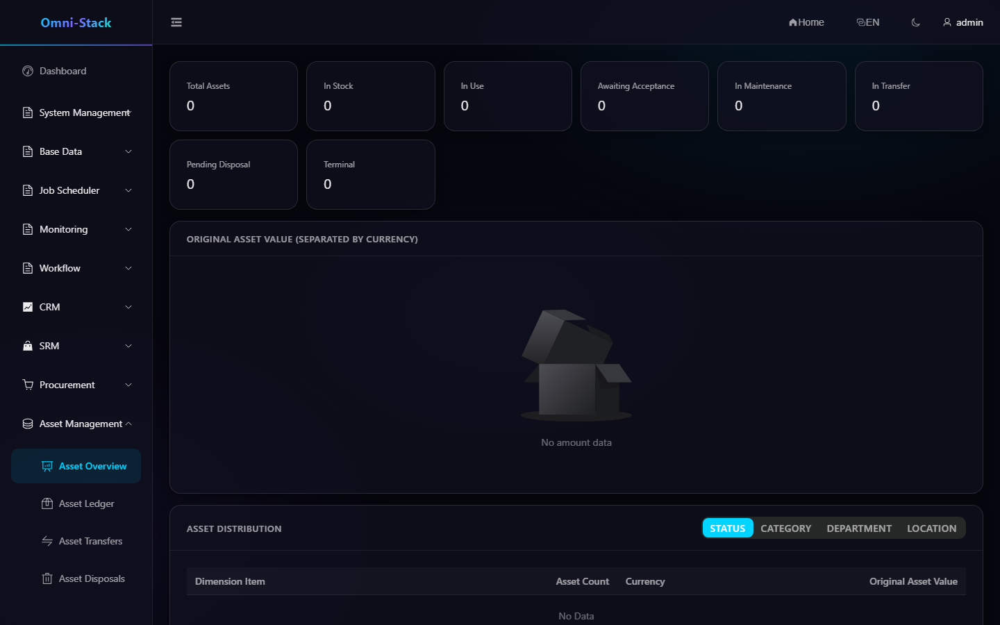

# Complete Asset Receipt, Assignment, Return, Transfer, and Disposal Flow

Asset creates cards from accepted procurement events and manages ledger, assignment, acceptance, return, transfer, and disposal. Monetary JSON fields are decimal strings, never floating-point numbers.

## 1. Receipt Card Creation

The consumer creates cards only when `qualityStatus=PASS`, `assetManaged=true`, and `assetQuantity` is an exact positive integer. Inbox event ID and source receipt-line/unit sequence provide dual idempotency. Each card retains its source receipt and purchase facts.

## 2. Ledger

Management views apply data scope on `owner_user_id/owner_unit_id`; My Assets uses fixed `current_user_id`. Search supports number, name, state, category, department, and location. Every lifecycle action is a dedicated command with state and optimistic-lock validation.

### Screenshot

#### Figure 1 `asset-overview-en-US`: Asset overview

- Prerequisites: log in as an asset administrator with overview access
- Actor: asset administrator
- Action: open Asset → Overview
- Expected result: the main area shows the "Asset Overview" title with ledger aggregates

## 3. Assignment, Acceptance, and Return

An administrator assigns an in-stock asset to a user and location. The recipient accepts it in My Assets. An in-use asset can be returned, which clears the current user and restores the appropriate stock state. Acceptance and return always validate `current_user_id`.

## 4. Transfer Approval

A transfer moves responsibility or location and starts Workflow. `active_operation_type/active_operation_id` atomically occupies the asset so transfer and disposal cannot overlap. Approval applies the new responsibility and clears occupancy. Cancellation or rejection restores `previous_asset_status` and clears occupancy in the same transaction.

## 5. Disposal Approval

Disposal covers scrapping, sale, donation, and other end-of-life actions. Submission checks occupancy; approval records method, date, residual value, and reason. A terminal asset cannot be reassigned or transferred. Approval runtime remains in `omni-workflow`; Asset maintains domain state only through the coordinator.

## 6. Maintenance Boundary

Assets may enter maintenance and return after repair. Full depreciation, financial ledger, and advanced inventory algorithms are outside the current MVP and must be introduced as explicit aggregates and migrations.

## 7. Troubleshooting

- No card after receipt: inspect quality, asset flag, exact quantity, and Inbox.
- Duplicate card: inspect event ID and source unit uniqueness.
- Transfer/disposal blocked: inspect active operation occupancy.
- Rejected operation did not restore: inspect coordinator compensation and transaction.
- User cannot see an asset: distinguish owner management scope from current-user scope.

See the [Asset Design](../design/asset-design.md).

