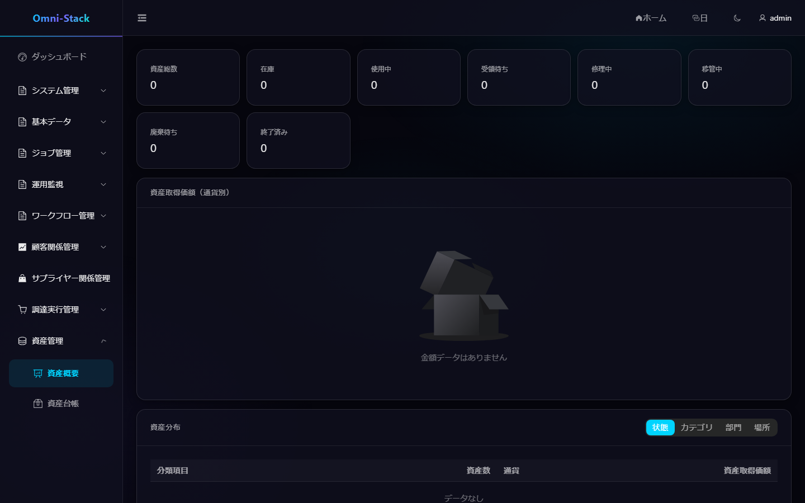

# 資産計上、割当、返却、移管、廃棄の完全フロー

Asset は調達の合格入荷イベントからカードを作成し、台帳、割当、受領、返却、移管、廃棄を管理します。金額 JSON は浮動小数ではなく十進文字列です。

## 1. 入荷カード作成

`qualityStatus=PASS`、`assetManaged=true`、`assetQuantity` が正確な正整数の場合のみ作成します。Inbox イベント ID と「入荷明細 + 単位番号」で二重冪等を保証し、各カードは入荷元と購入情報を保持します。

## 2. 台帳

管理ビューは `owner_user_id/owner_unit_id` にデータ権限を適用し、「自分の資産」は `current_user_id` で固定フィルタリングします。番号、名称、状態、カテゴリ、部門、場所で検索できます。ライフサイクル操作は状態と楽観ロックを検証する専用コマンドです。

### スクリーンショット

#### 図 1 `asset-overview-ja-JP`：資産概要

- 前提条件：資産概照照閲権限を持つ資産管理者としてログイン
- 操作者：資産管理者
- 操作：「資産管理 → 資産概要」を開く
- 期待結果：メイン領域に「資産概要」タイトルと台帳集計が表示される

## 3. 割当、受領、返却

管理者が在庫資産をユーザーと場所へ割り当て、受領者が自分の資産で確認します。使用中資産を返却すると現ユーザーを消去し、適切な在庫状態へ戻します。受領・返却は必ず `current_user_id` を検証します。

## 4. 移管承認

移管は責任者または場所を変更して Workflow を開始します。`active_operation_type/active_operation_id` が資産を原子的に占有し、移管と廃棄の同時実行を防ぎます。承認は変更と占有解除、取消/拒否は同一トランザクションで `previous_asset_status` を復元します。

## 5. 廃棄承認

廃棄、売却、寄付などの終末処理です。占有を検証し、承認後に方式、日付、残存価値、理由を記録します。終端資産は再割当・移管できません。承認ランタイムは引き続き `omni-workflow` にあり、Asset はコーディネーターを通じてドメイン状態のみ管理します。

## 6. 保守境界

修理中と修理完了は扱いますが、完全な減価償却、会計元帳、高度な棚卸は現 MVP 外です。拡張時は明示的な集約と移行を追加します。

## 7. 調査

カードなしは品質・フラグ・数量・Inbox、重複はイベントと単位一意性、移管/廃棄不可は active operation、復元失敗はコーディネーター、可視性は owner と current user の違いを確認します。

[Asset 設計](../design/asset-design.md)を参照してください。

