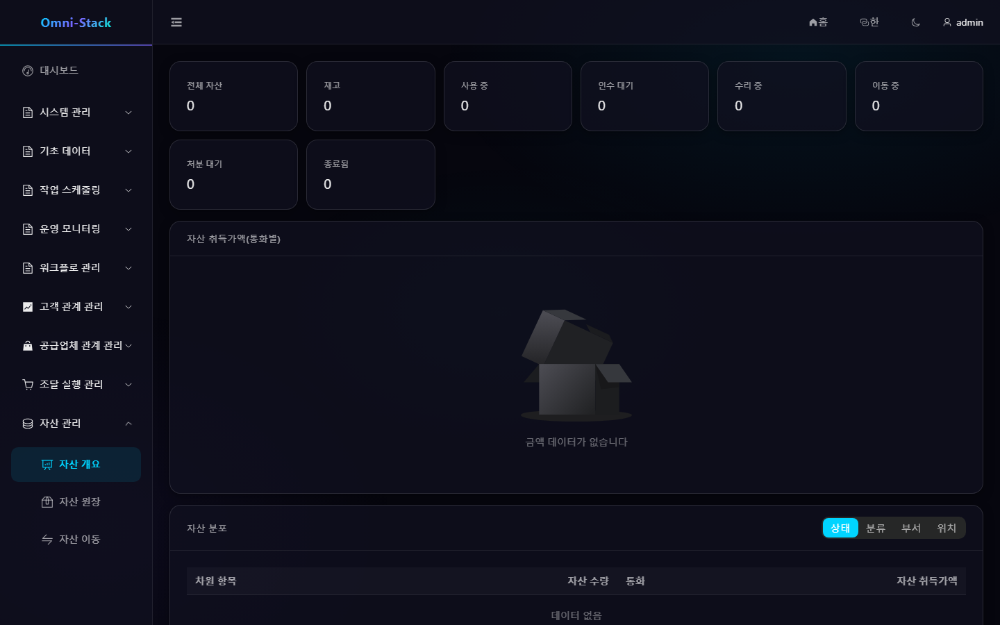

# 자산 등록, 배정, 반환, 이동과 처분 전체 흐름

Asset은 조달 합격 입고 이벤트에서 카드를 만들고 원장, 배정, 인수, 반환, 이동, 처분을 관리합니다. 금액 JSON은 부동소수 숫자가 아니라 십진 문자열입니다.

## 1. 입고 카드 생성

`qualityStatus=PASS`, `assetManaged=true`, `assetQuantity`가 정확한 양의 정수일 때만 생성합니다. Inbox 이벤트 ID와 “입고 행 + 단위 순번”으로 이중 멱등을 보장하며 각 카드는 원본 입고와 구매 정보를 보존합니다.

## 2. 원장

관리 화면은 `owner_user_id/owner_unit_id`에 데이터 권한을 적용하고, 내 자산은 `current_user_id`로 고정 필터링합니다. 번호, 이름, 상태, 카테고리, 부서, 위치로 검색할 수 있습니다. 수명주기 작업은 상태와 낙관 잠금을 검증하는 전용 명령입니다.

### 스크린숏

#### 그림 1 `asset-overview-ko-KR`: 자산 개요

- 전제 조건: 자산 개요 조회 권한을 가진 자산 관리자로 로그인
- 작업자: 자산 관리자
- 작업: 자산 관리 → 자산 개요 열기
- 예상 결과: 메인 영역에 '자산 개요' 제목과 원장 집계가 표시됨

## 3. 배정, 인수, 반환

관리자가 재고 자산을 사용자와 위치에 배정하고 수령자가 내 자산에서 인수합니다. 사용 중 자산을 반환하면 현재 사용자를 지우고 적절한 재고 상태로 복원합니다. 인수와 반환은 항상 `current_user_id`를 검증합니다.

## 4. 이동 승인

이동은 책임자나 위치를 바꾸며 Workflow를 시작합니다. `active_operation_type/active_operation_id`가 자산을 원자 점유해 이동과 처분의 동시 실행을 막습니다. 승인 시 변경과 점유 해제, 취소/거절 시 같은 트랜잭션에서 `previous_asset_status`를 복원합니다.

## 5. 처분 승인

폐기, 매각, 기부 등의 수명 종료 작업입니다. 점유를 검사하고 승인 후 방식, 날짜, 잔존 가치와 이유를 기록합니다. 종단 자산은 다시 배정하거나 이동할 수 없습니다. 승인 런타임은 계속 `omni-workflow`에 있으며, Asset은 코디네이터를 통해서만 도메인 상태를 관리합니다.

## 6. 유지보수 경계

수리 중과 수리 완료는 다루지만 전체 감가상각, 회계 원장, 고급 재고 조사는 현재 MVP 밖입니다. 확장 시 명시적 집계와 마이그레이션을 추가합니다.

## 7. 진단

카드 없음은 품질·플래그·수량·Inbox, 중복은 이벤트와 단위 고유성, 이동/처분 차단은 active operation, 복원 실패는 조정자, 가시성은 owner와 current user 차이를 확인합니다.

[Asset 설계](../design/asset-design.md)를 참고하세요.

