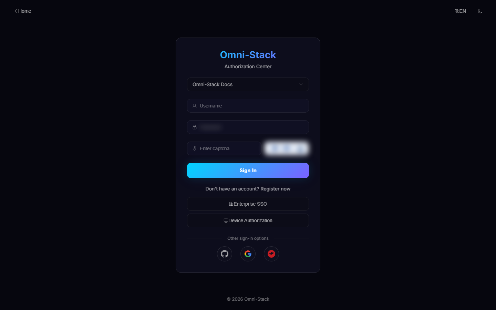
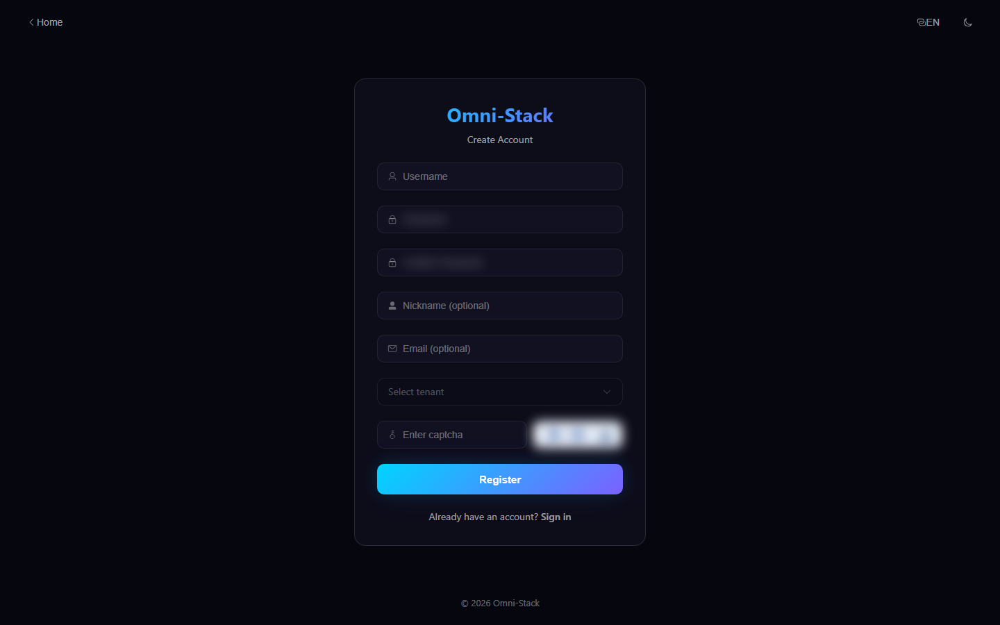
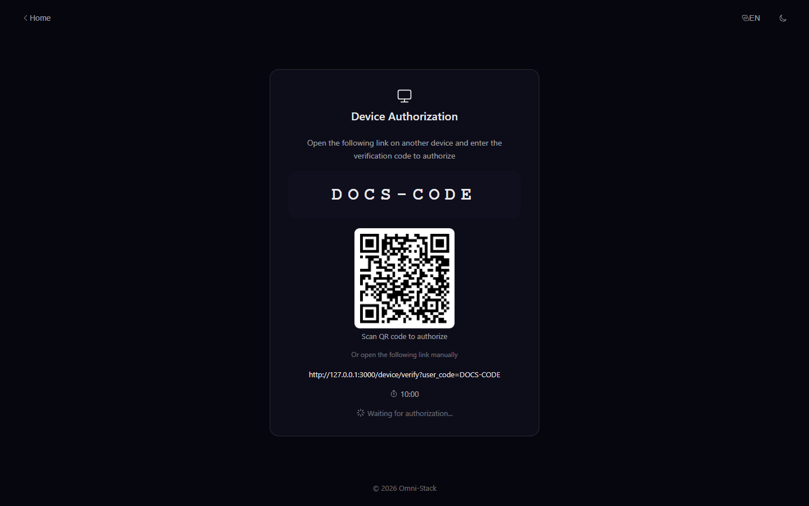
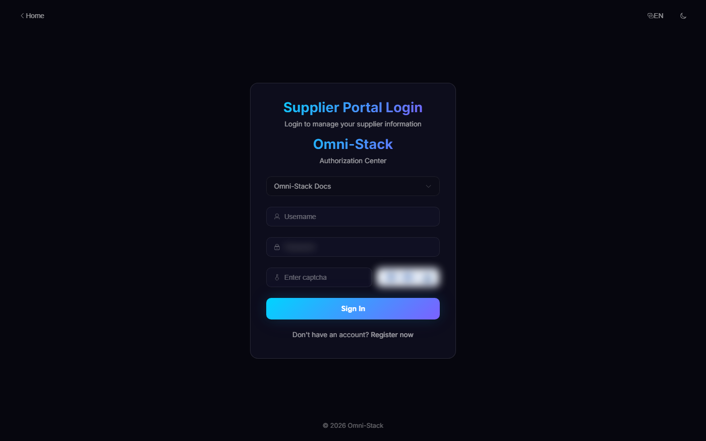
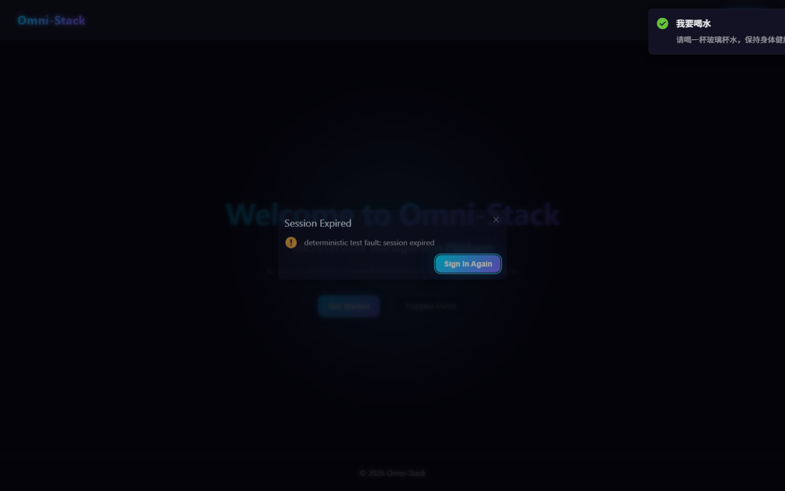

# Login, CAPTCHA, Social Login, and Tenant Selection

Audience: end users, tenant administrators, and identity maintainers.

## 1. Entry Points and Tenant Selection

Administrators and regular users sign in at `/login`; suppliers may use `/portal-login`. A username is unique only within a tenant, so password login begins with tenant selection. The backend builds the authentication context from tenant ID, username, and login method.

The public tenant endpoint returns only the minimum login information. After login, tenant identity comes from the issued token and trusted Gateway headers; clients cannot expand scope by constructing their own tenant header.

## 2. Password and CAPTCHA

1. Request `GET /api/auth/captcha`.
2. Display `captchaImage` and keep the matching `captchaKey` in memory.
3. Collect tenant, username, password, and `captchaCode`.
4. Call `POST /api/auth/login`.
5. Discard the password, CAPTCHA answer, and key immediately after success.

Rules:

- CAPTCHA values are single-use. Never cache answers or reuse keys.
- Frontend logs, screenshots, and reports must not contain passwords, CAPTCHA answers, or access tokens.
- Automation uses a short-lived token injected by a trusted environment or a human-handled real CAPTCHA. It must not crack, disable, or bypass production CAPTCHA.
- Failure messages must remain actionable without enabling account enumeration.

## 3. Self-Registration

`POST /api/auth/register` is public but validates tenant, CAPTCHA, tenant-local username uniqueness, and password rules. Every creation path attempts to assign the default `USER` role. A role-assignment failure is logged without leaving an unusable partial user transaction.

Supplier registration creates only an authentication account. The user must then enroll with a supplier invitation, receive the `SUPPLIER` role, and obtain an active Portal association before accessing company profile, evaluation, and quotation features.

## 4. Social Login

GitHub, Google, and Gitee OAuth2 login follow this flow:

1. The frontend generates PKCE values and random `state`.
2. The browser visits the authorization server or identity provider.
3. The callback verifies `state` and exchanges the code.
4. First login creates a provider-prefixed local name such as `gh_`, `go_`, or `ge_`.
5. The user returns to the protected page or role-appropriate workspace.

Callback addresses, client secrets, and allowed origins come from environment configuration. Production must not reuse repository development clients.

## 5. Device Authorization

`/device` obtains a device code and presents a user code and QR code. The user signs in and confirms at `/device/verify`; the device only polls the token endpoint and never handles the password. An expired, rejected, or consumed code requires a new request.

Device authorization is for input-constrained devices, not a general CAPTCHA bypass.

### Screenshot

#### Figure 1 `auth-login-en-US`: Login entry

- Prerequisites: public, no login required
- Actor: any user
- Action: open `/login`
- Expected result: tenant, username, password, CAPTCHA (masked), and sign-in methods are visible

#### Figure 2 `auth-register-en-US`: Self-registration

- Prerequisites: public
- Actor: new user
- Action: open the register page from login
- Expected result: username, password, confirm password, and CAPTCHA inputs are visible

#### Figure 3 `auth-device-code-en-US`: Device authorization

- Prerequisites: a headless device starts the OAuth2 device flow
- Actor: device user
- Action: open `/device` for the user code, then enter it at `/device/verify`
- Expected result: the device user code is shown with a fixed 10:00 countdown

#### Figure 4 `supplier-portal-login-en-US`: Supplier portal login

- Prerequisites: public
- Actor: supplier user
- Action: open the supplier portal login page
- Expected result: the portal login form and registration entry are visible

#### Figure 5 `session-expired-dialog-en-US`: Session expired dialog

- Precondition: Logged in; a deterministic 401 fault is injected into a business API within the test process (in real usage this is Token expiry)
- Operator: Logged-in user
- Action: When a business API returns 401, the app pops up the expiry dialog
- Expected result: A "Session expired" dialog appears (localized title + re-login button); after confirmation it redirects to the login page with a validated `redirect` parameter; no internal exception is leaked

## 6. Expired Sessions

When a token expires or permissions change, the client clears local authentication, returns to login, and preserves only a validated in-app redirect. `javascript:`, cross-origin, and protocol-relative redirect targets are rejected. A failed menu request displays a retryable error page instead of an infinite request loop.

## 7. Troubleshooting Order

1. Verify the tenant.
2. Refresh CAPTCHA and enter the new value.
3. Inspect Auth login records; `omni-auth` does not replace them with operation logs.
4. For social login, inspect callback URI, client ID, PKCE, and `state`.
5. For Portal access, inspect the `SUPPLIER` role and `srm_supplier_portal_user` association.

See the [API Contract](../api-contract.en.md) and [Core Flows](../core-flows.en.md).

