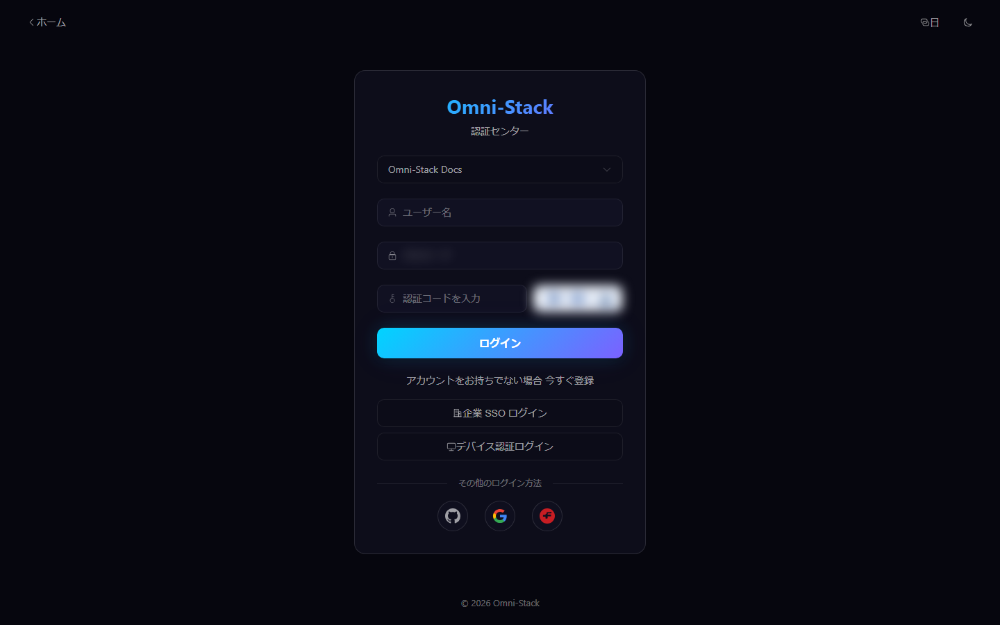
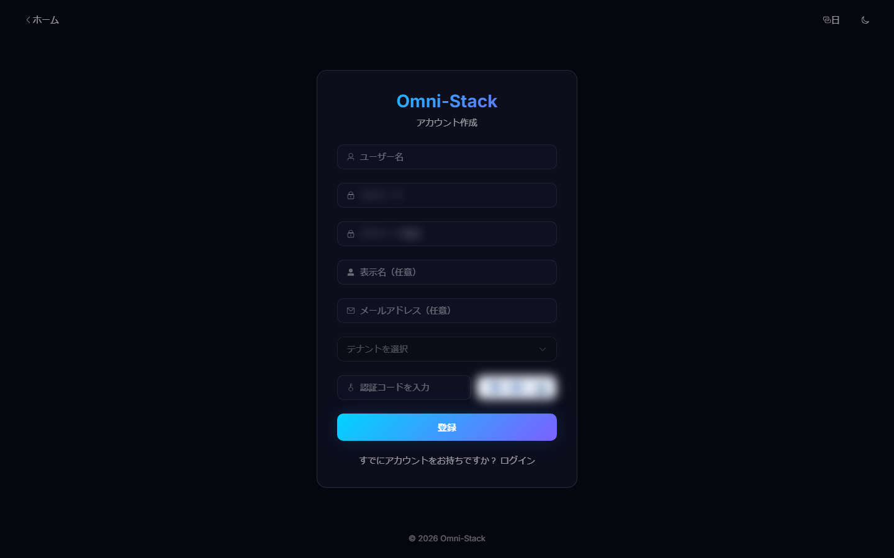
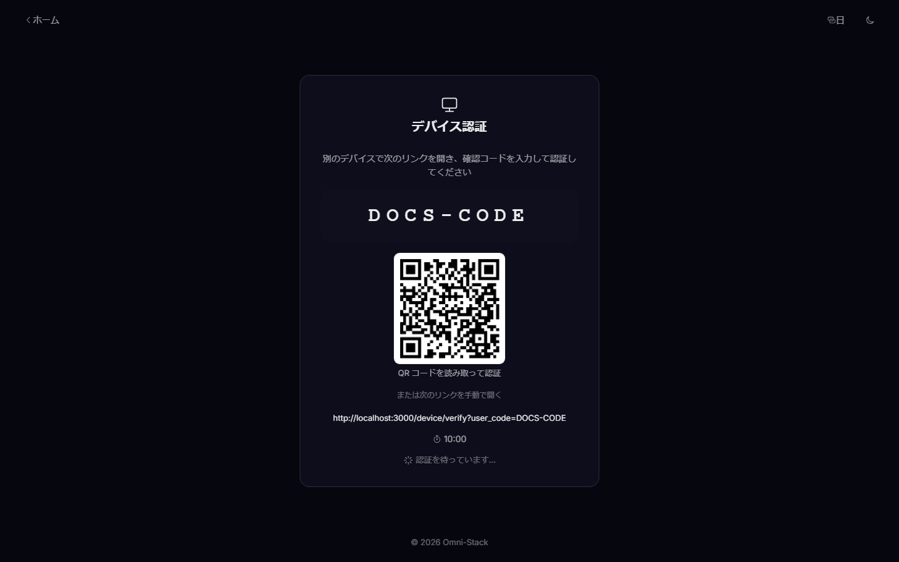
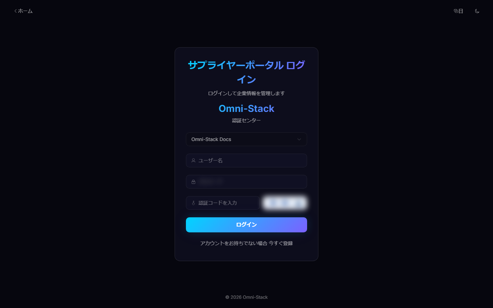
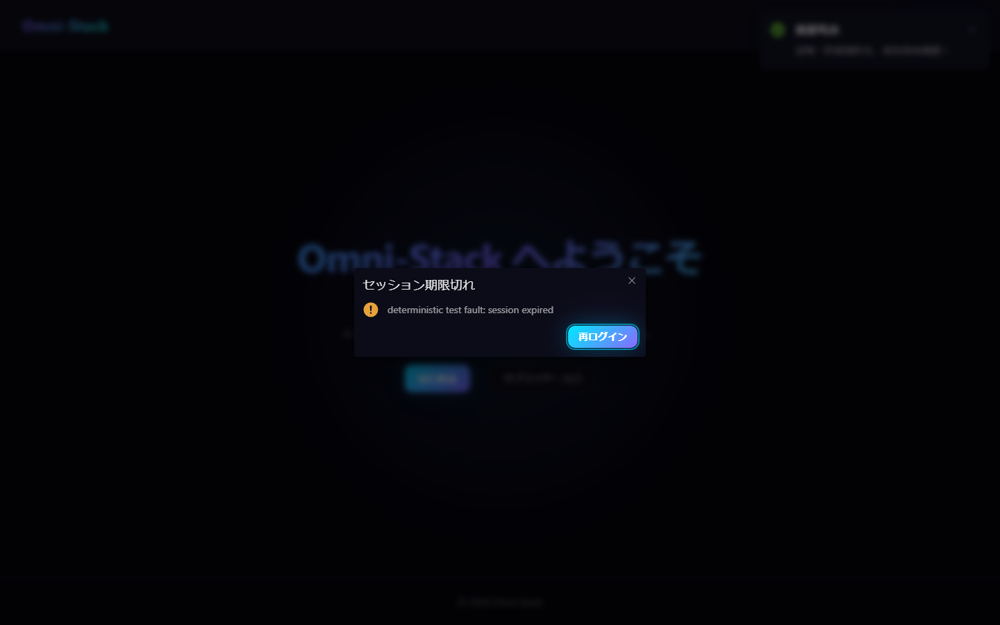

# ログイン、CAPTCHA、ソーシャルログイン、テナント選択

対象：エンドユーザー、テナント管理者、認証基盤の保守担当者。

## 1. 入口とテナント

管理者と一般ユーザーは `/login`、サプライヤーは `/portal-login` を利用できます。ユーザー名はテナント内でのみ一意なため、パスワードログインでは先にテナントを選択します。

公開テナント API はログインに必要な最小情報のみ返します。ログイン後のテナントは発行トークンと Gateway の信頼済みヘッダーで決まり、クライアントが任意に範囲を拡張することはできません。

## 2. パスワードと CAPTCHA

1. `GET /api/auth/captcha` を呼び出します。
2. `captchaImage` を表示し、対応する `captchaKey` をメモリに保持します。
3. テナント、ユーザー名、パスワード、`captchaCode` を入力します。
4. `POST /api/auth/login` を呼び出します。
5. 成功後、パスワード、CAPTCHA 回答、Key を直ちに破棄します。

CAPTCHA は一回限りで、回答のキャッシュや Key の再利用は禁止です。ログ、スクリーンショット、テストレポートにパスワード、回答、アクセストークンを残しません。自動化は信頼済み環境の短期トークンまたは人が処理する実 CAPTCHA を使用し、本番 CAPTCHA を解除・解析・迂回しません。

## 3. セルフ登録

公開 `POST /api/auth/register` はテナント、CAPTCHA、テナント内ユーザー名一意性、パスワード規則を検証します。すべての作成経路で既定 `USER` ロールを割り当てます。

サプライヤー登録は認証アカウントのみ作成します。その後、招待による Portal 入居、`SUPPLIER` ロール、有効な関連付けが必要です。

## 4. ソーシャルログイン

GitHub、Google、Gitee は PKCE とランダム `state` を生成し、認可後のコールバックで `state` を検証してコードを交換します。初回は `gh_`、`go_`、`ge_` 接頭辞のローカル名を作成します。コールバック URL、クライアント秘密、許可 Origin は環境設定から提供し、本番で開発用クライアントを再利用しません。

## 5. デバイス認可

`/device` がデバイスコード、ユーザーコード、QR コードを表示し、ユーザーは `/device/verify` でログインして許可します。デバイスはトークンエンドポイントのみをポーリングし、パスワードを扱いません。期限切れ・拒否・使用済みコードは再発行します。

### スクリーンショット

#### 図 1 `auth-login-ja-JP`：ログイン入口

- 前提条件：ログイン不要、公開アクセス
- 操作者：任意のユーザー
- 操作：`/login` を開く
- 期待結果：テナント、ユーザー名、パスワード、認証コード（マスク済み）、ログイン方法が表示される

#### 図 2 `auth-register-ja-JP`：セルフ登録

- 前提条件：公開
- 操作者：新規ユーザー
- 操作：ログイン画面から登録画面へ
- 期待結果：ユーザー名、パスワード、確認パスワード、認証コード入力が表示される

#### 図 3 `auth-device-code-ja-JP`：デバイス認証

- 前提条件：ヘッドレスデバイスが OAuth2 デバイスフローを開始
- 操作者：デバイス利用者
- 操作：`/device` でユーザーコードを取得し `/device/verify` で入力
- 期待結果：デバイスユーザーコード（固定 10:00 カウントダウン）と確認入口が表示される

#### 図 4 `supplier-portal-login-ja-JP`：サプライヤーポータルログイン

- 前提条件：公開
- 操作者：サプライヤーユーザー
- 操作：ポータルログイン画面を開く
- 期待結果：ポータルログインフォームと登録入口が表示される

#### 図 5 `session-expired-dialog-ja-JP`：セッション失効ダイアログ

- 前提条件：ログイン済み。テストプロセス内で業務 API に確定的な 401 障害を注入する（実際の利用では Token の失効）
- 操作者：ログイン済みユーザー
- 操作：業務 API が 401 を返したとき、アプリが失効ダイアログを表示する
- 期待結果：「セッションが失効しました」ダイアログ（ローカライズされたタイトル + 再ログインボタン）が表示される。確認後に検証済みの `redirect` パラメーターを付けてログインページへ遷移する。内部例外は漏えいしない

## 6. セッション失効

トークン失効または権限変更時、クライアントは認証状態を消去してログインへ戻り、安全検証済みのアプリ内リダイレクトだけを保持します。`javascript:`、外部 URL、プロトコル相対 URL は拒否します。メニュー障害は再試行可能なエラー画面を表示します。

## 7. 確認順序

1. 正しいテナントが選択されていることを確認します。
2. CAPTCHA を更新してから再入力します。
3. Auth ログイン記録を確認します。`omni-auth` では操作ログをログイン記録の代わりに使用しません。

[API 契約](../api-contract.jp.md)と[コアフロー](../core-flows.jp.md)も参照してください。

