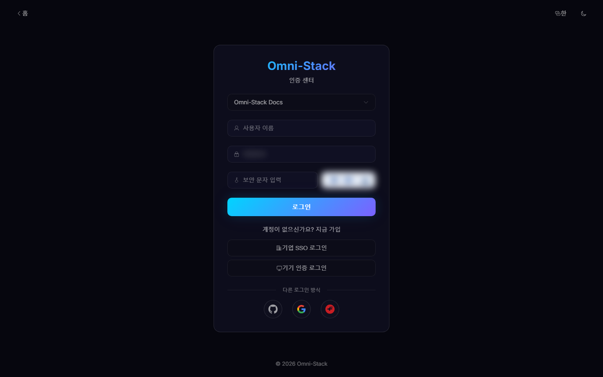
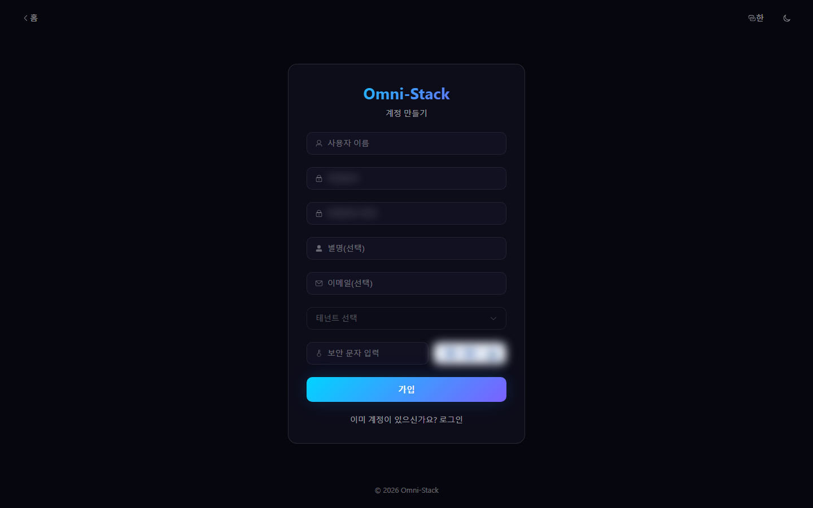
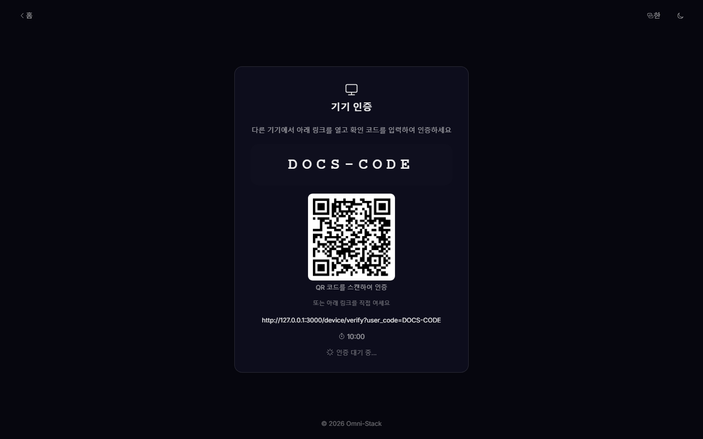
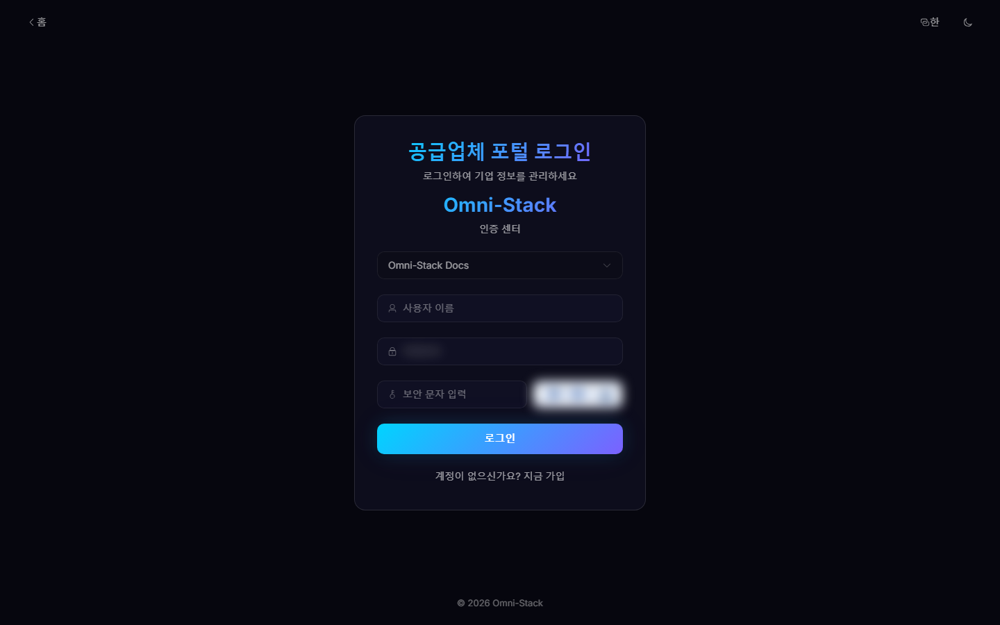
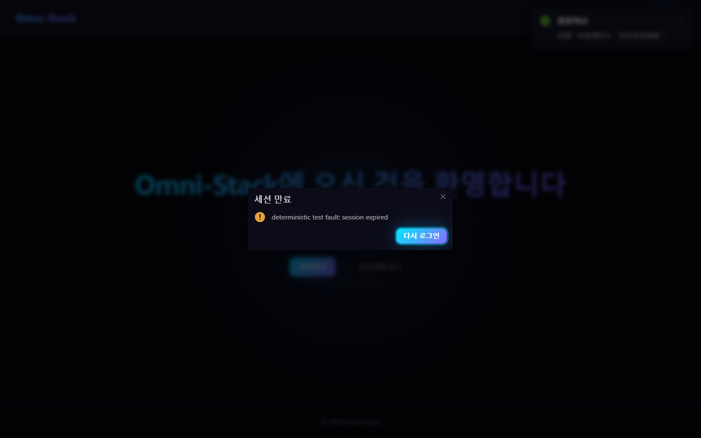

# 로그인, CAPTCHA, 소셜 로그인과 테넌트 선택

대상: 최종 사용자, 테넌트 관리자, 인증 시스템 유지보수자.

## 1. 진입점과 테넌트

관리자와 일반 사용자는 `/login`, 공급업체는 `/portal-login`을 사용할 수 있습니다. 사용자 이름은 테넌트 안에서만 고유하므로 비밀번호 로그인 전에 테넌트를 선택합니다.

공개 테넌트 API는 로그인에 필요한 최소 정보만 반환합니다. 로그인 후 테넌트는 발급 토큰과 Gateway 신뢰 헤더로 결정되며 클라이언트가 임의 헤더로 범위를 넓힐 수 없습니다.

## 2. 비밀번호와 CAPTCHA

1. `GET /api/auth/captcha`를 요청합니다.
2. `captchaImage`를 표시하고 대응하는 `captchaKey`를 메모리에 보관합니다.
3. 테넌트, 사용자 이름, 비밀번호, `captchaCode`를 입력합니다.
4. `POST /api/auth/login`을 호출합니다.
5. 성공 후 비밀번호, CAPTCHA 답, Key를 즉시 폐기합니다.

CAPTCHA는 일회용이며 답이나 Key를 재사용하지 않습니다. 로그, 스크린샷, 테스트 보고서에 비밀번호, 답, 액세스 토큰을 남기지 않습니다. 자동화는 신뢰 환경의 단기 토큰이나 사람이 처리한 실제 CAPTCHA를 사용하고 운영 CAPTCHA를 해제·분석·우회하지 않습니다.

## 3. 셀프 등록

공개 `POST /api/auth/register`는 테넌트, CAPTCHA, 테넌트 내 이름 고유성, 비밀번호 규칙을 검증합니다. 모든 사용자 생성 경로는 기본 `USER` 역할을 할당합니다.

공급업체 등록은 인증 계정만 만듭니다. 이후 초대 기반 Portal 입점, `SUPPLIER` 역할, 활성 연결이 필요합니다.

## 4. 소셜 로그인

GitHub, Google, Gitee는 PKCE와 임의 `state`를 생성하고 콜백에서 `state`를 검증해 코드를 교환합니다. 최초 로그인은 `gh_`, `go_`, `ge_` 접두사의 로컬 이름을 만듭니다. 콜백 URI, 클라이언트 비밀, 허용 Origin은 환경 설정으로 제공하고 운영에서 개발 클라이언트를 재사용하지 않습니다.

## 5. 디바이스 인증

`/device`가 디바이스 코드, 사용자 코드, QR 코드를 표시하고 사용자는 `/device/verify`에서 로그인해 승인합니다. 디바이스는 토큰 엔드포인트만 폴링하며 비밀번호를 처리하지 않습니다. 만료·거부·사용된 코드는 새로 발급합니다.

### 스크린숏

#### 그림 1 `auth-login-ko-KR`: 로그인 진입

- 전제 조건: 공개, 로그인 불필요
- 작업자: 모든 사용자
- 작업: `/login` 열기
- 예상 결과: 테넌트, 사용자 이름, 비밀번호, CAPTCHA(마스킹), 로그인 방식이 표시됨

#### 그림 2 `auth-register-ko-KR`: 셀프 등록

- 전제 조건: 공개
- 작업자: 신규 사용자
- 작업: 로그인 화면에서 등록 화면으로 이동
- 예상 결과: 사용자 이름, 비밀번호, 비밀번호 확인, CAPTCHA 입력이 표시됨

#### 그림 3 `auth-device-code-ko-KR`: 디바이스 인증

- 전제 조건: 헤드리스 기기가 OAuth2 디바이스 플로 시작
- 작업자: 기기 사용자
- 작업: `/device`에서 사용자 코드를 받아 `/device/verify`에 입력
- 예상 결과: 디바이스 사용자 코드(고정 10:00 카운트다운)와 확인 진입점이 표시됨

#### 그림 4 `supplier-portal-login-ko-KR`: 공급사 포털 로그인

- 전제 조건: 공개
- 작업자: 공급사 사용자
- 작업: 공급사 포털 로그인 화면 열기
- 예상 결과: 포털 로그인 폼과 등록 진입점이 표시됨

#### 그림 5 `session-expired-dialog-ko-KR`: 세션 만료 다이얼로그

- 전제 조건: 로그인됨. 테스트 프로세스 내에서 비즈니스 API에 결정론적 401 장애를 주입(실제 사용에서는 Token 만료)
- 작업자: 로그인된 사용자
- 작업: 비즈니스 API가 401을 반환하면 앱이 만료 다이얼로그를 표시
- 예상 결과: "세션이 만료되었습니다" 다이얼로그(현지화된 제목 + 재로그인 버튼)가 표시됨. 확인 후 검증된 `redirect` 파라미터와 함께 로그인 페이지로 이동. 내부 예외 노출 없음

## 6. 세션 만료

토큰 만료나 권한 변경 시 로컬 인증을 지우고 로그인으로 돌아가며 검증된 앱 내부 리다이렉트만 유지합니다. `javascript:`, 외부 URL, 프로토콜 상대 URL은 거부합니다. 메뉴 실패는 무한 요청 대신 재시도 화면을 표시합니다.

## 7. 점검 순서

1. 올바른 테넌트가 선택되었는지 확인합니다.
2. CAPTCHA를 새로 고친 후 다시 입력합니다.
3. Auth 로그인 기록을 확인합니다. `omni-auth`에서는 로그인 기록 대신 작업 로그를 사용하지 않습니다.

[API 계약](../api-contract.kr.md)과 [핵심 흐름](../core-flows.kr.md)을 참고하세요.

