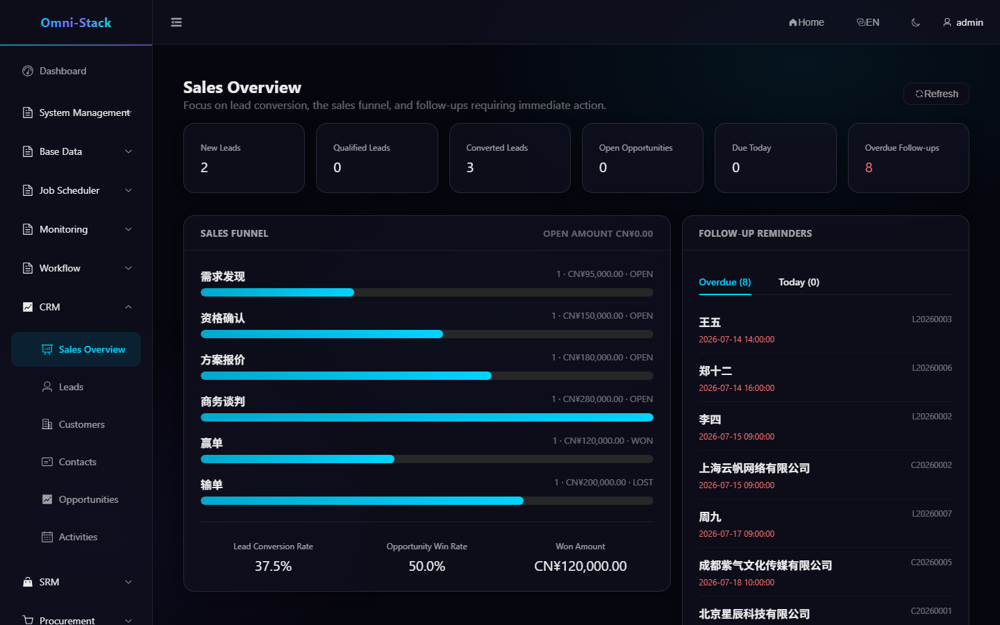
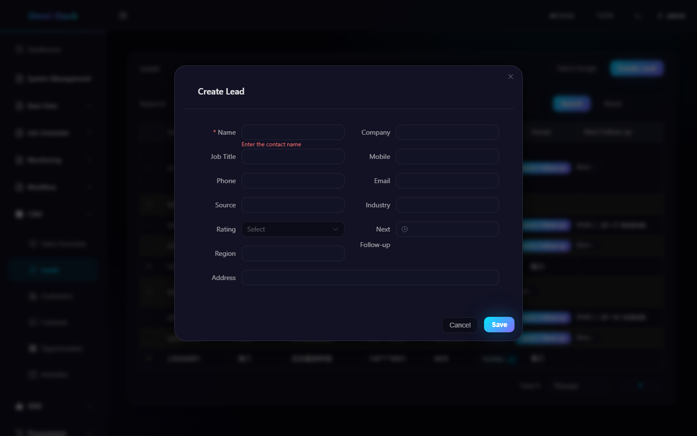
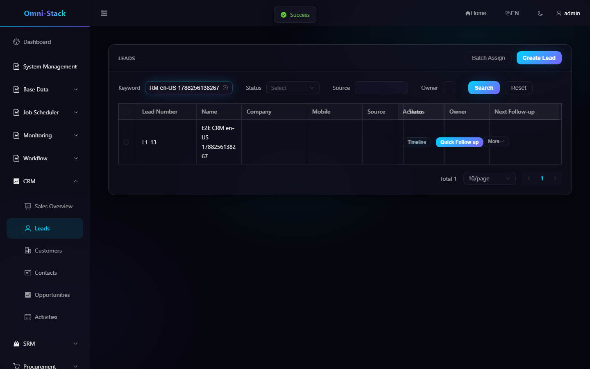
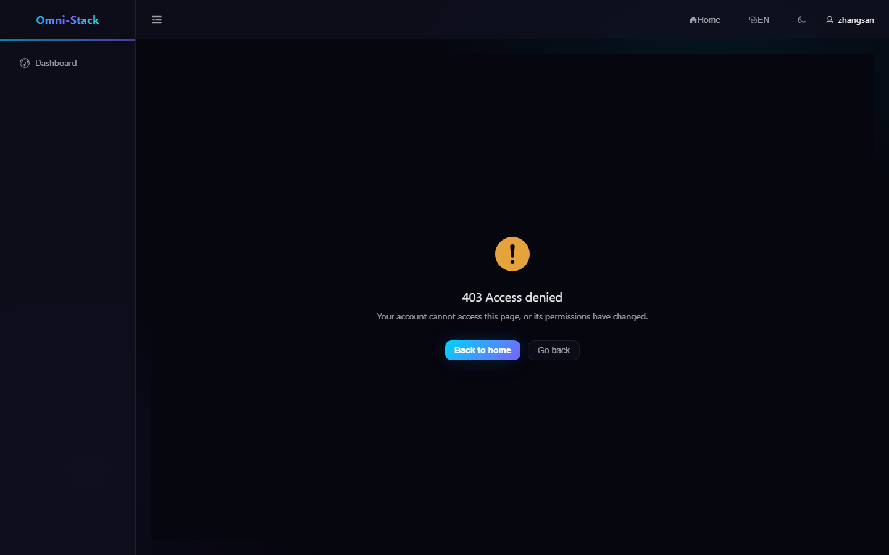

# Complete CRM Business Flow

CRM covers sales overview, leads, customers, contacts, opportunities, and activities. Tenant isolation is combined with owner, organizational data scope, and record-level guards.

## 1. Recommended Flow

```text
Capture Lead → Duplicate Check and Qualification → Convert Customer/Contact/Opportunity
→ Advance Opportunity → Record Activities → Win or Lose
```

## 2. Leads

Create a lead, review duplicate candidates, assign owner and source, and qualify or disqualify it. A qualified lead can atomically create a customer, contact, and optional opportunity. A lead converts only once; transaction and state-machine checks prevent duplicate records.

## 3. Customers and Contacts

Customer 360 aggregates profile, contacts, opportunities, and activities. Status moves among potential, active, dormant, lost, and blacklisted states. Open opportunities may prevent deletion.

Every contact belongs to a customer. Visibility of contacts and other children is inherited through the customer aggregate when owner or organization changes.

## 4. Opportunities

An opportunity records pipeline, stage, amount, currency, probability, close date, and owner. The table supports precise search; the board supports stage progression. Backend state rules reject invalid jumps. Won or lost opportunities are closed and use a dedicated reopen action that preserves history.

## 5. Activities

Activities associate calls, meetings, emails, visits, and notes with a lead, customer, contact, or opportunity. Date-time uses `yyyy-MM-dd HH:mm:ss`. The timeline is permission-filtered and cannot reveal an inaccessible aggregate.

## 6. Overview

The overview uses real backend aggregates for funnels, customer state, opportunity amount, stage distribution, and recent activity. Empty data shows an explicit empty state rather than mock metrics.

### Screenshot

#### Figure 1 `crm-overview-en-US`: Sales overview

- Prerequisites: log in as a salesperson or sales administrator
- Actor: salesperson
- Action: open CRM → Overview
- Expected result: the main area shows the "Sales Overview" title with real aggregated metrics



#### Figure 2 `crm-lead-create-validation-en-US`: New-lead required-field validation

- Prerequisites: log in as a user with CRM permission and open the lead list
- Actor: sales user
- Action: click "New Lead" to open the dialog and submit without entering a name
- Expected result: the required-field error "Please enter a contact name" appears deterministically, and no data is created



#### Figure 3 `crm-lead-create-success-en-US`: Lead created successfully

- Prerequisites: same as Figure 2; in the E2E scenario a unique name is auto-created and auto-cleaned
- Actor: sales user
- Action: fill in the contact name, save, and search by name
- Expected result: the dialog closes and the new lead really appears in the list (creation-success result)



#### Figure 4 `crm-lead-forbidden-403-en-US`: Forbidden CRM access

- Prerequisites: log in as the ordinary employee zhangsan (not granted CRM permission)
- Actor: ordinary employee
- Action: access the lead-management page directly
- Expected result: the 403 page with a return entry (AUTHENTICATED_BUT_FORBIDDEN, not a login redirect)



## 7. Permission Acceptance

Test with a super administrator, departmental salesperson, and self-only user:

- Menus and action permissions.
- List totals and detail visibility.
- Cross-unit direct ID access returns 403 or 404.
- Conversion, assignment, stage movement, blacklist, and deletion.

See [CRM](../crm.en.md) and the [CRM Design](../design/crm-design.md).

