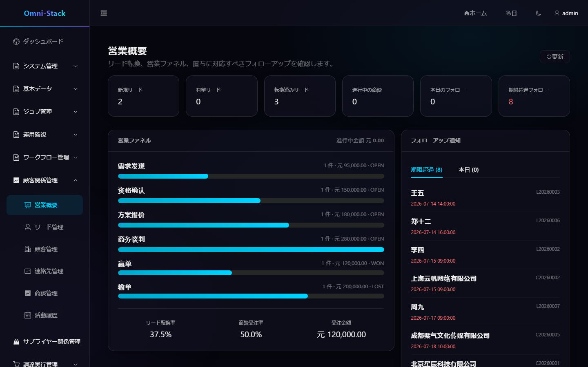
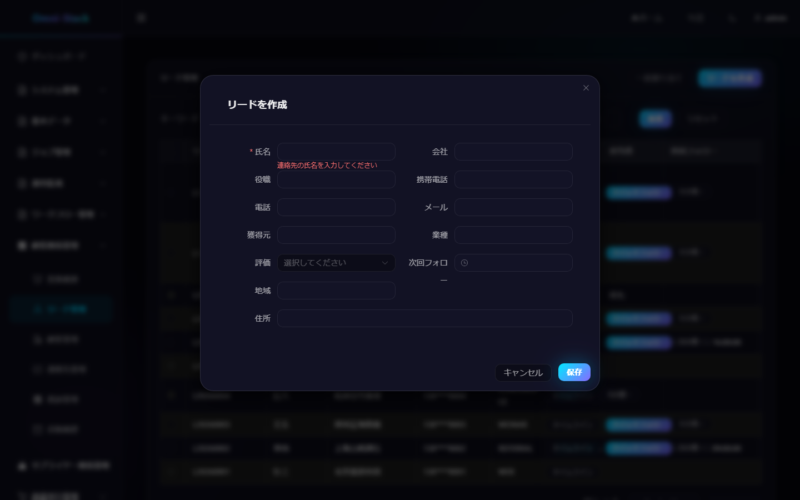
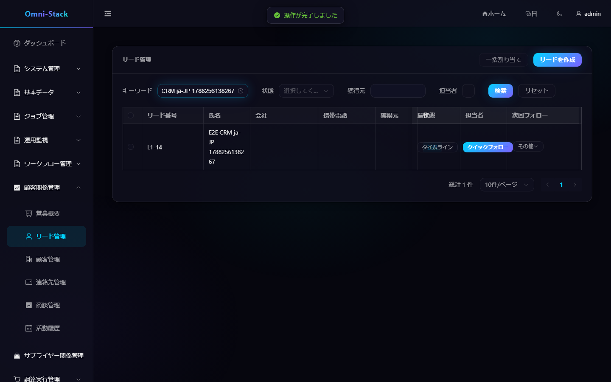
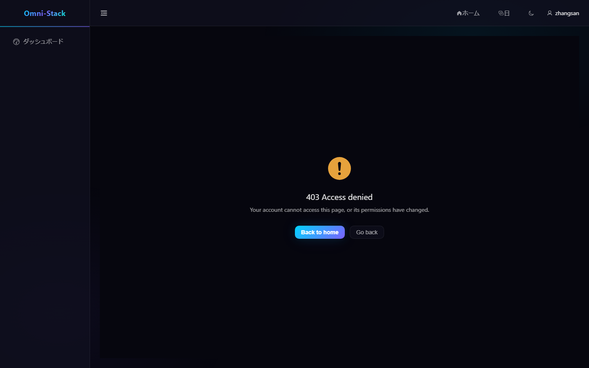

# CRM 完全業務フロー

CRM は営業概要、リード、顧客、連絡先、商談、フォローアップ活動をカバーします。すべての集約はテナントで分離され、担当者、組織データ範囲、レコードレベルのアクセスガードが重ねられます。

## 1. 推奨メインフロー

```text
リード登録 → 重複確認と判定 → 顧客/連絡先/商談へ変換 → 商談ステージ更新 → 活動記録 → 受注または失注
```

## 2. リード

1. 「CRM → リード管理」でリードを作成。
2. システムが連絡先などの情報で重複候補を返す；業務担当が確認後にのみ作成を継続できる。
3. ソース、担当者、フォローアップ情報を補完。
4. リードを適格または無効と判定。
5. 適格リードは顧客、連絡先、任意の商談へ原子的に変換できる。

同一リードは一度だけ変換できる。重複リクエストは状態機械とトランザクションで保護され、フロントエンドの重複クリックで複数の顧客データを生成できない。

## 3. 顧客と連絡先

顧客 360 ビューは基本情報、連絡先、商談、活動を集約する。顧客は潜在から活動中、休眠、流失、ブラックリストへ変わりうる；未完了商談がある場合、バックエンドは削除を拒否することがある。

連絡先は顧客に帰属しなければならない。顧客の担当者や組織範囲を変更する際は、連絡先と関連子リソースの可視性が引き続き顧客集約ルートから継承されることを同期検証する。

## 4. 商談

商談はパイプライン、ステージ、金額、通貨、成功確度、予定成約日、担当者を含む。リストビューは精密検索に、ステージボードは営業プロセスの推進に適する。

ステージ遷移はバックエンド状態機械で検証され、クローズ規則をスキップできない。受注や失注後に商談はクローズ；再開が必要な場合は専用操作を使い履歴を保持し、状態を直接 `OPEN` に戻さない。

## 5. フォローアップ活動

活動はリード、顧客、連絡先、商談に関連付けられ、電話、会議、メール、訪問、メモを記録する。日時は統一して `yyyy-MM-dd HH:mm:ss` を使用。活動タイムラインは権限でフィルタされ、参照不可の集約の情報を漏らしてはいけない。

## 6. 概要と指標

CRM 概要はバックエンドの実際の集計データのみを表示し、リードファネル、顧客状態、商談金額、ステージ分布、最近の活動を含む。データがない場合は明確な空状態を表示し、模擬の運営数値を使わない。

### 操作スクリーンショット

#### 図 1 `crm-overview-ja-JP`：営業概要

- 前提条件：営業担当または営業管理者としてログイン
- 操作者：営業担当
- 操作：「顧客関係管理 → 営業概要」に入る
- 期待結果：メイン領域に「営業概要」タイトルと実際の集計指標が表示される



#### 図 2 `crm-lead-create-validation-ja-JP`：新規リード必須項目検証

- 前提条件：CRM 権限を持つユーザーでログインし、リードリストに入る
- 操作者：営業ユーザー
- 操作：「新規リード」をクリックしてダイアログを開き、氏名を入力せず直接提出
- 期待結果：必須項目検証エラー「連絡先氏名を入力してください」が確定的に表示され、データは生成されない



#### 図 3 `crm-lead-create-success-ja-JP`：リード作成成功

- 前提条件：図 2 と同じ；E2E シナリオでは一意な名称で自動作成し自動クリーンアップ
- 操作者：営業ユーザー
- 操作：連絡先氏名を入力して保存し、名称で検索
- 期待結果：ダイアログが閉じ、リストに新リードが実際に表示される（作成成功結果）



#### 図 4 `crm-lead-forbidden-403-ja-JP`：CRM への無権限アクセス

- 前提条件：一般社員 zhangsan（CRM 権限未付与）でログイン
- 操作者：一般社員
- 操作：リード管理ページに直接アクセス
- 期待結果：403 ページと戻る入口（AUTHENTICATED_BUT_FORBIDDEN、ログインリダイレクトではない）



## 7. 権限検証

少なくともスーパー管理者、部門営業担当、本人のみの範囲ユーザーで検証：

- メニューとボタン権限。
- リスト件数と詳細の可視性。
- 組織外 ID の直接アクセスは 403 または 404 を返す。
- 変換、割当、ステージ遷移、ブラックリスト、削除操作。

ドメイン状態機械、6 層セキュリティモデル、拡張制約は [CRM 文書](../crm.jp.md) と [CRM 設計](../design/crm-design.md) を参照。
