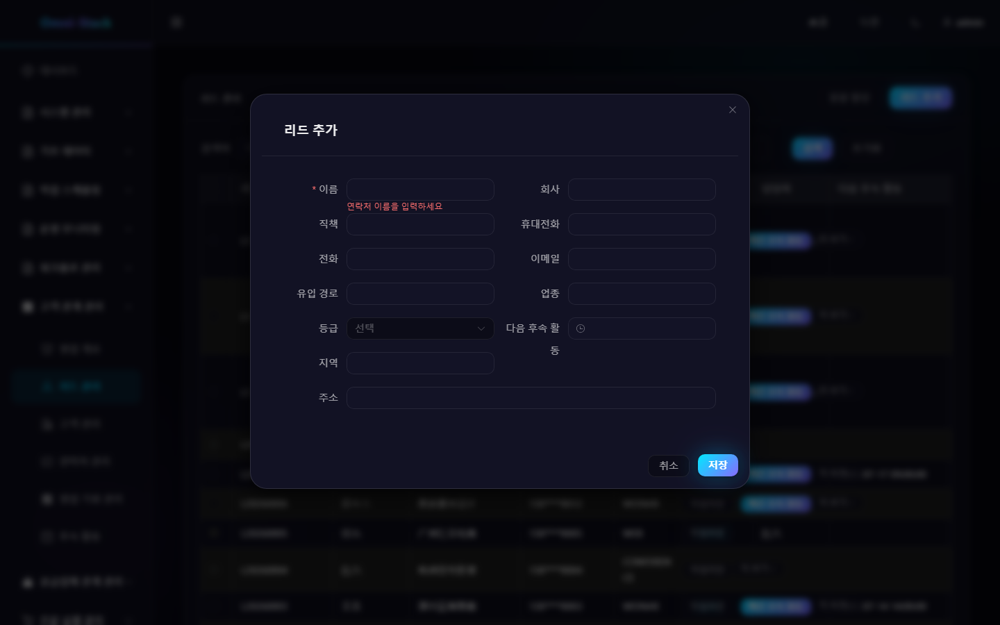
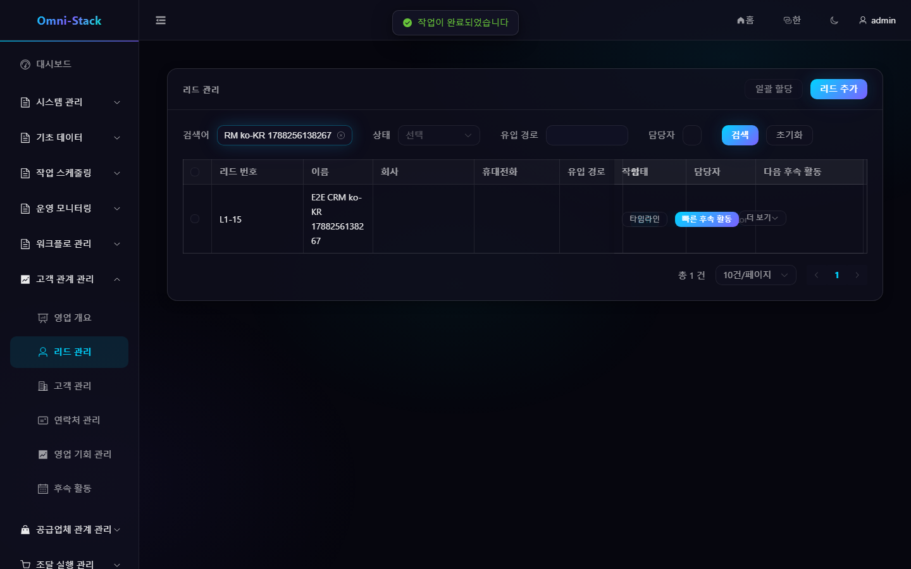

# CRM 전체 업무 흐름

CRM 은 영업 개요, 리드, 고객, 연락처, 영업 기회, 후속 활동을 다룹니다. 모든 집계는 테넌트로 격리되고, 담당자, 조직 데이터 범위, 레코드 수준 접근 가드가 겹쳐집니다.

## 1. 권장 메인 흐름

```text
리드 등록 → 중복 확인과 판정 → 고객/연락처/영업 기회 전환 → 영업 기회 단계 진행 → 활동 기록 → 수주 또는 실패
```

## 2. 리드

1. 「CRM → 리드 관리」에서 리드를 생성.
2. 시스템이 연락처 등 정보로 중복 후보를 반환; 업무 담당자가 확인한 후에만 생성을 계속할 수 있음.
3. 출처, 담당자, 후속 정보를 보완.
4. 리드를 적격 또는 무효로 판정.
5. 적격 리드는 고객, 연락처, 선택적 영업 기회로 원자 전환 가능.

동일 리드는 한 번만 전환할 수 있습니다. 중복 요청은 상태 머신과 트랜잭션이 보호하며, 프론트엔드 중복 클릭으로 여러 고객 데이터를 생성할 수 없습니다.

## 3. 고객과 연락처

고객 360 뷰는 기본 정보, 연락처, 영업 기회, 활동을 집계합니다. 고객은 잠재에서 활성, 휴면, 이탈, 블랙리스트로 바뀔 수 있으며; 열린 영업 기회가 있으면 백엔드가 삭제를 거부할 수 있습니다.

연락처는 고객에 귀속되어야 합니다. 고객 담당자나 조직 범위를 변경할 때, 연락처와 관련 하위 리소스의 가시성이 계속 고객 집계 루트에서 상속되는지 동기 검증합니다.

## 4. 영업 기회

영업 기회는 파이프라인, 단계, 금액, 통화, 성공 확률, 예상 성사일, 담당자를 포함합니다. 목록 뷰는 정밀 검색에, 단계 보드는 영업 과정 진행에 적합합니다.

단계 전이는 백엔드 상태 머신으로 검증되며 종료 규칙을 건너뛸 수 없습니다. 수주나 실패 후 영업 기회는 종료되고; 재개시가 필요하면 전용 작업을 사용하고 이력을 보존하며, 상태를 직접 `OPEN` 으로 되돌리지 않습니다.

## 5. 후속 활동

활동은 리드, 고객, 연락처, 영업 기회에 연결되어 전화, 회의, 이메일, 방문, 메모를 기록합니다. 날짜는 통일하여 `yyyy-MM-dd HH:mm:ss` 를 사용합니다. 활동 타임라인은 권한으로 필터링되며, 볼 수 없는 집계의 정보를 누설해선 안 됩니다.

## 6. 개요와 지표

CRM 개요는 백엔드의 실제 집계 데이터만 표시하며, 리드 퍼널, 고객 상태, 영업 기회 금액, 단계 분포, 최근 활동을 포함합니다. 데이터가 없으면 명확한 빈 상태를 표시하고 모의 운영 수치를 쓰지 않습니다.

### 조작 스크린샷

#### 그림 1 `crm-overview-ko-KR`: 영업 개요

- 전제 조건: 영업 담당자 또는 영업 관리자로 로그인
- 작업자: 영업 담당자
- 작업: 「고객 관계 관리 → 영업 개요」 진입
- 예상 결과: 메인 영역에 「영업 개요」 제목과 실제 집계 지표 표시


#### 그림 2 `crm-lead-create-validation-ko-KR`: 신규 리드 필수 항목 검증

- 전제 조건: CRM 권한이 있는 사용자로 로그인해 리드 목록 진입
- 작업자: 영업 사용자
- 작업: 「신규 리드」를 클릭해 대화상자를 열고 이름을 입력하지 않은 채 제출
- 예상 결과: 필수 항목 검증 오류 「연락처 이름을 입력하세요」가 확정적으로 나타나고 데이터가 생성되지 않음



#### 그림 3 `crm-lead-create-success-ko-KR`: 리드 생성 성공

- 전제 조건: 그림 2와 동일; E2E 시나리오에서는 고유 이름으로 자동 생성하고 자동 정리
- 작업자: 영업 사용자
- 작업: 연락처 이름을 입력해 저장하고 이름으로 검색
- 예상 결과: 대화상자가 닫히고 목록에 새 리드가 실제로 표시됨(생성 성공 결과)



#### 그림 4 `crm-lead-forbidden-403-ko-KR`: CRM 무단 접근

- 전제 조건: 일반 사원 zhangsan(CRM 권한 미부여)으로 로그인
- 작업자: 일반 사원
- 작업: 리드 관리 페이지에 직접 접근
- 예상 결과: 403 페이지와 복귀 입구(AUTHENTICATED_BUT_FORBIDDEN, 로그인 리디렉션 아님)


## 7. 권한 검증

최소 슈퍼 관리자, 부서 영업 담당자, 본인 전용 범위 사용자로 검증:

- 메뉴와 버튼 권한.
- 목록 총수와 상세 가시성.
- 조직 밖 ID 직접 접근은 403 또는 404 반환.
- 전환, 배정, 단계 전이, 블랙리스트, 삭제 작업.

도메인 상태 머신, 6계층 보안 모델, 확장 제약은 [CRM 문서](../crm.kr.md) 와 [CRM 설계](../design/crm-design.md)를 참고하세요.
