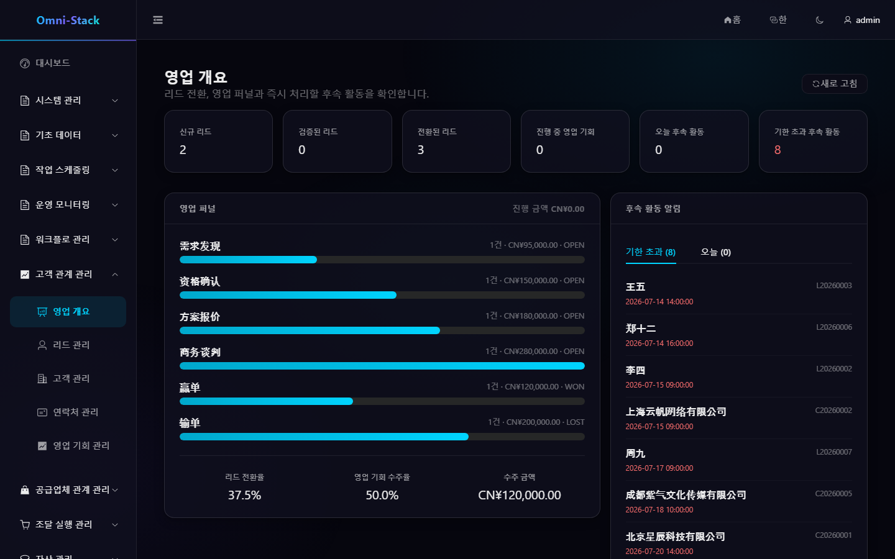

# CRM 전체 업무 흐름

CRM은 영업 개요, 리드, 고객, 연락처, 영업 기회와 활동을 다룹니다. 테넌트 격리에 소유자, 조직 데이터 범위와 레코드 접근 가드를 더합니다.

## 1. 권장 흐름

```text
리드 등록 → 중복 확인과 적격 판정 → 고객/연락처/영업 기회 전환
→ 단계 진행 → 활동 기록 → 수주 또는 실패
```

## 2. 리드

리드를 만들고 중복 후보를 확인한 뒤 출처와 담당자를 설정합니다. 적격 리드는 고객, 연락처, 선택적 영업 기회로 원자 전환됩니다. 한 번만 전환되며 상태 머신과 트랜잭션이 중복 생성을 막습니다.

## 3. 고객과 연락처

고객 360은 기본 정보, 연락처, 영업 기회와 활동을 집계합니다. 잠재, 활성, 휴면, 이탈, 블랙리스트 상태가 있으며 열린 영업 기회가 있는 고객은 삭제를 거부할 수 있습니다. 자식 가시성은 고객 집계에서 상속됩니다.

## 4. 영업 기회

파이프라인, 단계, 금액, 통화, 확률, 예상일, 담당자를 관리합니다. 표는 정밀 검색, 보드는 단계 진행에 사용합니다. 백엔드 상태 규칙이 잘못된 이동을 거부하고 수주/실패 후 재개는 전용 작업으로 이력을 보존합니다.

## 5. 활동

전화, 회의, 이메일, 방문, 메모를 각 집계에 연결합니다. 날짜는 `yyyy-MM-dd HH:mm:ss`이며 타임라인은 권한으로 필터링합니다.

## 6. 개요

퍼널, 고객 상태, 영업 금액, 단계 분포, 최근 활동은 실제 집계만 표시하고 데이터가 없으면 명시적 빈 상태를 표시합니다.

### 스크린숏

#### 그림 1 `crm-overview-ko-KR`: 영업 개요

- 전제 조건: 영업 담당자 또는 영업 관리자로 로그인
- 작업자: 영업 담당자
- 작업: CRM → 개요 열기
- 예상 결과: 메인 영역에 '영업 개요' 제목과 실제 집계 지표가 표시됨



## 7. 권한 인수

슈퍼 관리자, 부서 영업, 본인 전용 사용자로 메뉴, 작업, 목록 수, 상세, 조직 밖 ID의 403/404, 전환, 배정, 단계, 블랙리스트, 삭제를 검증합니다.

[CRM 문서](../crm.kr.md)와 [CRM 설계](../design/crm-design.md)를 참고하세요.

