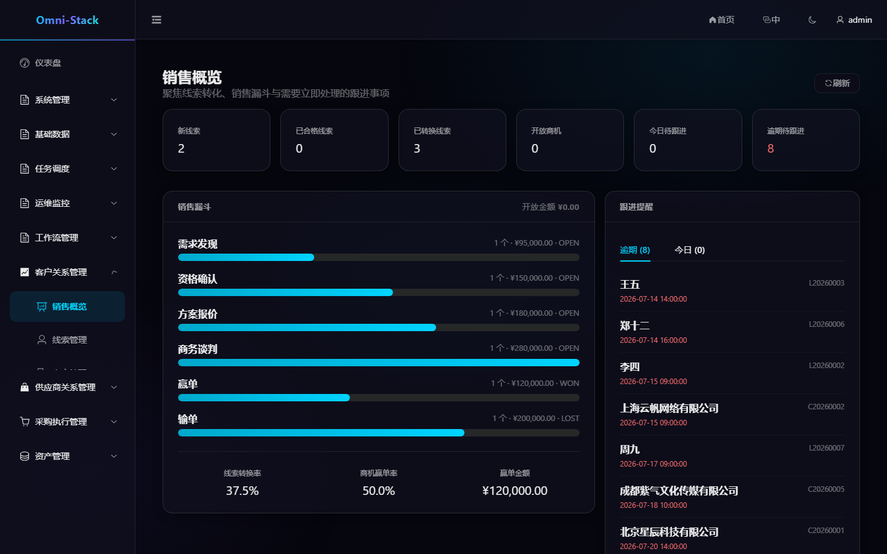
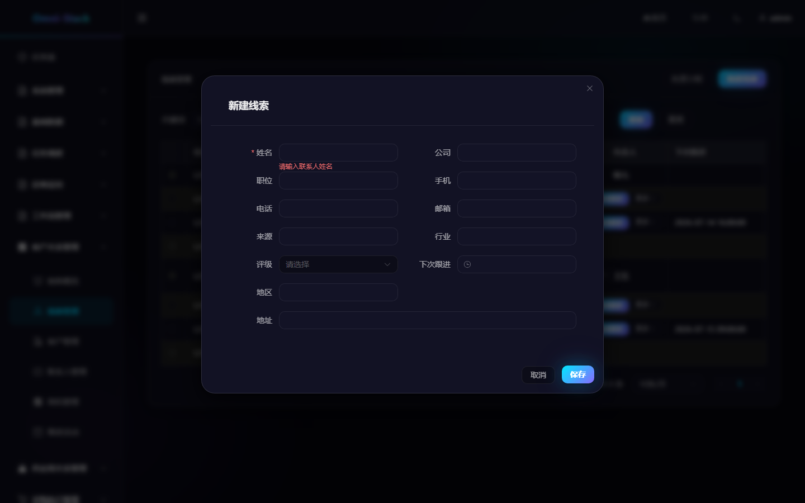
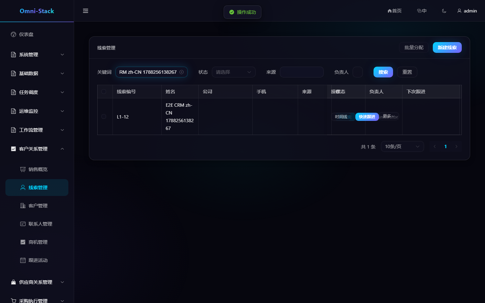

# CRM 完整业务流程

CRM 覆盖销售概览、线索、客户、联系人、商机和跟进活动。所有聚合按租户隔离，并叠加负责人、组织数据范围和记录级访问守卫。

## 1. 推荐主流程

```text
录入线索 → 查重与判定 → 转换客户/联系人/商机 → 推进商机阶段 → 记录活动 → 赢单或输单
```

## 2. 线索

1. 在“CRM → 线索管理”创建线索。
2. 系统按联系方式等信息返回重复候选；业务人员确认后才能继续创建。
3. 补充来源、负责人和跟进信息。
4. 将线索判定为合格或无效。
5. 合格线索可原子转换为客户、联系人和可选商机。

同一线索只允许转换一次。重复请求由状态机和事务保护，不能通过前端重复点击生成多套客户数据。

## 3. 客户与联系人

客户 360 视图聚合基本信息、联系人、商机和活动。客户可从潜在变为活跃、休眠、流失或黑名单；存在开放商机时后端可能拒绝删除。

联系人必须归属客户。修改客户负责人或组织范围时，要同步验证联系人和相关子资源的可见性仍从客户聚合根继承。

## 4. 商机

商机包含管道、阶段、金额、币种、成功概率、预计成交日期和负责人。列表视图适合精确查询，阶段看板适合推进销售过程。

阶段迁移由后端状态机校验，不能跳过关闭规则。赢单或输单后商机关闭；需要重开时使用专用操作并保留历史，不直接把状态改回 `OPEN`。

## 5. 跟进活动

活动可以关联线索、客户、联系人或商机，记录电话、会议、邮件、拜访和备注。时间统一使用 `yyyy-MM-dd HH:mm:ss`。活动时间线按权限过滤，不应泄漏不可见聚合的信息。

## 6. 概览与指标

CRM 概览只展示后端真实聚合数据，包括线索漏斗、客户状态、商机金额、阶段分布和近期活动。没有数据时显示明确空状态，不使用模拟运营数字。

### 操作截图

#### 图 1 `crm-overview-zh-CN`：销售概览

- 前置条件：以销售人员或销售管理员身份登录
- 操作者：销售人员
- 操作：进入「客户关系管理 → 销售概览」
- 预期结果：主内容区显示「销售概览」标题与真实聚合指标



#### 图 2 `crm-lead-create-validation-zh-CN`：新建线索必填校验

- 前置条件：以具备 CRM 权限的用户登录，进入线索列表
- 操作者：销售用户
- 操作：点击「新建线索」打开对话框，不填姓名直接提交
- 预期结果：必填校验错误「请输入联系人姓名」确定性出现，不产生数据



#### 图 3 `crm-lead-create-success-zh-CN`：创建线索成功

- 前置条件：同图 2；E2E 场景下使用唯一名称自动创建并自动清理
- 操作者：销售用户
- 操作：填写联系人姓名后保存，并按名称检索
- 预期结果：对话框关闭，列表真实出现新线索（创建成功结果）



#### 图 4 `crm-lead-forbidden-403-zh-CN`：无权限访问 CRM

- 前置条件：以普通员工 zhangsan（未授予 CRM 权限）登录
- 操作者：普通员工
- 操作：直接访问线索管理页
- 预期结果：403 页面与返回入口（AUTHENTICATED_BUT_FORBIDDEN，非登录跳转）


## 7. 权限验证

至少使用超级管理员、部门销售人员和仅本人范围用户验证：

- 菜单与按钮权限。
- 列表总数和详情可见性。
- 跨组织 ID 直访返回 403 或 404。
- 转换、分配、阶段迁移、黑名单和删除操作。

领域状态机、六层安全模型和扩展约束见 [CRM 文档](../crm.md) 与 [CRM 设计](../design/crm-design.md)。

