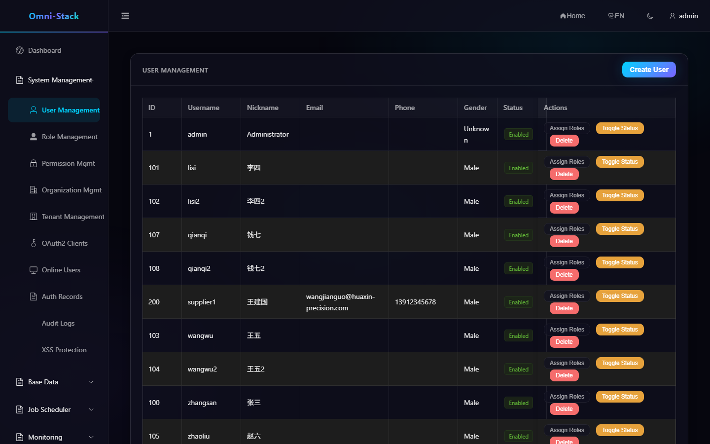
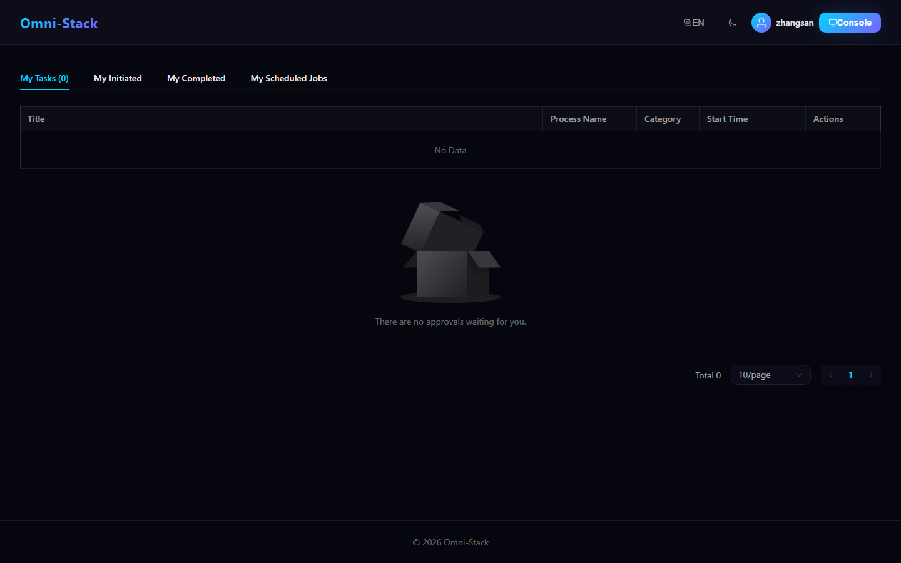
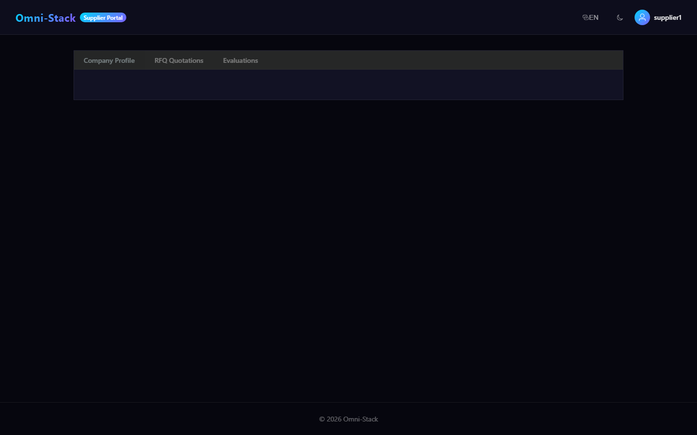
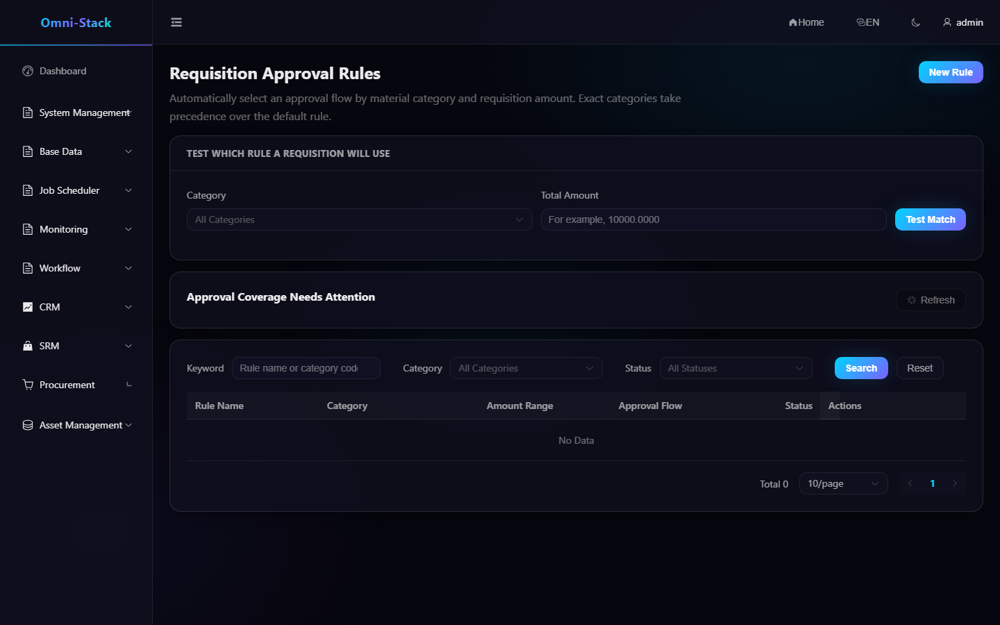
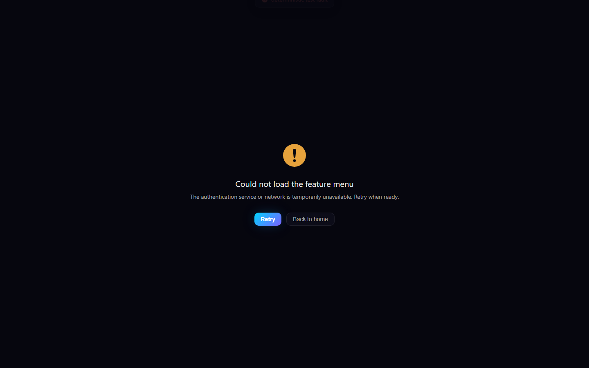

# Menus, Roles, Functional Permissions, and Data Permissions

Omni-Stack separates what a user may do from which records the user may see. Hiding a button is not a security boundary; every write API performs backend authorization.

## 1. Relationship Model

```text
User → User Role Scope → Role → Permission Tree
                       ↘ Data Scope
```

Permissions are `DIRECTORY`, `MENU`, or `BUTTON/API` nodes. Codes use `resource:action`, for example `procurement:requisition:create`. A user role scope grants a role within an organizational unit.

## 2. Dynamic Menus

After login, the frontend calls `GET /api/auth/menus`. Auth returns a permission-filtered tree; the frontend converts only `MENU` nodes into dynamic routes and uses a shared mapping to translate labels.

For a missing menu, verify in order:

1. The selected preset includes the module.
2. `sys_permission` contains its directory, menu, and actions.
3. `sys_role_permission` grants them to the role.
4. The current JWT contains updated authorities; log in again after a change.
5. Page buttons use the same `v-permission` code.

Do not expose an unauthorized page through a hard-coded static route.

## 3. Functional Permissions

Backend writes declare `@PreAuthorize`; frontend actions use the same code with `v-permission`. The directive uses `display:none` to preserve Vue reactivity, but it never replaces backend enforcement.

`MyJobController` is a deliberate exception: personal jobs use row ownership (`createBy`) rather than endpoint RBAC. Supplier Portal endpoints also require Portal permission, the `SUPPLIER` role, and an active association.

## 4. Data Permissions

Common scopes include all data, tenant, organization, organization and descendants, self, and a custom organization set. Servlet services establish identity from trusted Gateway headers; MyBatis then adds domain-specific predicates. DataPermission must run before Pagination, and ThreadLocal state is cleared in `finally`.

Domain mappings are not interchangeable:

- CRM, SRM, Procurement, and Asset define their own aggregate visibility.
- Child tables inherit through the aggregate root instead of receiving nonexistent owner columns.
- Requisitions use requester columns; RFQ, orders, and receipts use owner columns.
- Asset self-service uses `current_user_id`; management views use owner columns.

## 5. Role Maintenance

1. Create or select a role.
2. Grant functional permissions.
3. Configure data scope.
4. Assign the role to the user within a unit.
5. Sign in as that user and verify menus, buttons, APIs, and visible records.
6. Verify at least one backend 403 path.

Do not validate permission behavior only with the super administrator.

### Screenshot

#### Figure 1 `system-users-en-US`: User management

- Prerequisites: log in as a system administrator with user management access
- Actor: system administrator
- Action: open System → Users
- Expected result: the main area shows the "User Management" list with role assignment and status actions



#### Figure 2 `employee-forbidden-403-en-US`: Employee forbidden access denied

- Prerequisites: log in as the ordinary employee zhangsan (EMPLOYEE role), not granted `procurement:approval-route:list`
- Actor: ordinary employee
- Action: access the Requisition Approval Rules admin page `/admin/procurement/approval-route` directly
- Expected result: the page shows 403 with a return entry (AUTHENTICATED_BUT_FORBIDDEN, not a login redirect); the same API returns HTTP 403


#### Figure 3 `employee-workspace-scope-en-US`: Employee visible scope

- Prerequisites: log in as the ordinary employee zhangsan
- Actor: ordinary employee
- Action: after login, open the approval workbench home
- Expected result: the workbench shows only the employee's visible to-do and personal jobs, without admin menus or a 403



#### Figure 4 `supplier-portal-scope-en-US`: Supplier portal scope

- Prerequisites: log in as the official seed supplier account supplier1 (SUPPLIER role)
- Actor: supplier user
- Action: open `/supplier-portal`
- Expected result: the portal page renders with the login identity supplier1, accessible only within the supplier's legitimate scope



#### Figure 5 `resource-not-found-404-en-US`: Unknown route 404

- Prerequisites: log in as an administrator
- Actor: any user
- Action: access an undefined route (catch-all NotFound, statusCode=404)
- Expected result: the product NotFound page shows the 404 text


#### Figure 6 `approval-route-list-failure-en-US`: List-API failure presentation

- Prerequisites: log in as an administrator; a deterministic 500 fault is injected into the approval-rule list API within the test process
- Actor: administrator (with a deterministic test fault)
- Action: open the Requisition Approval Rules page; the list API returns 500
- Expected result: the page frame holds and the list area shows the real product behavior under an API failure



#### Figure 7 `admin-menu-load-failure-en-US`: Menu-load-failure fallback page

- Prerequisites: log in as an administrator; a deterministic 500 fault is injected into the menu API within the test process
- Actor: administrator (with a deterministic test fault)
- Action: access an admin page; the menu API returns 500
- Expected result: the guard redirects to the menu-load-failure fallback page, showing a localized error title and Reload/Back-home recovery entries, without a blank screen or faking a successful menu



## 6. Adding a Permission

Update together:

1. Controller `@PreAuthorize`.
2. `scripts/sql/seed/auth.sql` nodes and default role relations.
3. `database/seed/manifest.yaml` digest and assertions.
4. Frontend route or entry mapping.
5. Button `v-permission`.
6. Functional, data-scope, and cross-tenant tests.
7. Module documentation and screenshots.

See [Backend Patterns](../backend-patterns.en.md), [Frontend Patterns](../frontend-patterns.en.md), and [Core Flows](../core-flows.en.md).

