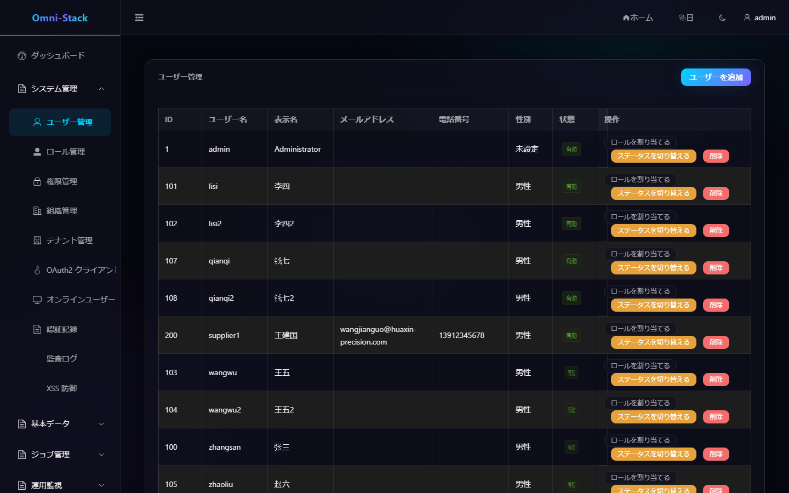

# メニュー、ロール、機能権限、データ権限

Omni-Stack は「実行できる機能」と「参照できるデータ」を分離します。ボタン非表示はセキュリティ境界ではなく、書き込み API は必ずバックエンドで認可します。

## 1. 関係モデル

```text
ユーザー → ユーザーロール範囲 → ロール → 権限ツリー
                              ↘ データ範囲
```

権限ノードは `DIRECTORY`、`MENU`、`BUTTON/API` です。コードは `resource:action` 形式です。

## 2. 動的メニュー

ログイン後に `GET /api/auth/menus` を呼び出し、Auth が権限で絞り込んだツリーを返します。フロントエンドは `MENU` のみ動的ルートへ変換し、共有マップで表示名を翻訳します。

メニューがない場合は、プリセット、`sys_permission`、`sys_role_permission`、JWT authorities、`v-permission` を順に確認し、権限変更後は再ログインします。静的ルートで迂回しません。

## 3. 機能権限

書き込み Controller は `@PreAuthorize`、フロントエンド操作は同じコードの `v-permission` を使用します。ディレクティブは Vue のリアクティブ性を保つため `display:none` を使いますが、バックエンド認可の代替ではありません。

個人タスクは例外として `createBy` の行所有権を検証します。Supplier Portal は権限に加え、`SUPPLIER` ロールと有効な関連付けが必要です。

## 4. データ権限

全件、テナント、組織、組織と配下、本人、カスタム組織などの範囲があります。Servlet サービスは Gateway の信頼済み ID を使い、MyBatis がドメイン固有条件を追加します。DataPermission は Pagination より前、ThreadLocal は `finally` で消去します。

CRM、SRM、Procurement、Asset は別々の集約マッピングを持ちます。子テーブルは集約ルートから継承し、存在しない owner 列を追加しません。購買申請は申請者、RFQ/注文/入荷は所有者、資産セルフサービスは `current_user_id` を使用します。

## 5. ロール保守

ロール選択、機能権限、データ範囲、組織内ユーザー割当の順に設定し、対象ユーザーで再ログインしてメニュー、ボタン、API、データ件数、403 を確認します。スーパー管理者だけで検証しません。

### スクリーンショット

#### 図 1 `system-users-ja-JP`：ユーザー管理

- 前提条件：ユーザー管理権限を持つシステム管理者としてログイン
- 操作者：システム管理者
- 操作：「システム管理 → ユーザー管理」を開く
- 期待結果：メイン領域に「ユーザー管理」一覧とロール割当・状態操作が表示される



## 6. 新規権限

`@PreAuthorize`、`scripts/sql/seed/auth.sql`、seed manifest、フロントエンド入口、`v-permission`、負向きテスト、ドキュメントと画像を同時に更新します。

[バックエンド規約](../backend-patterns.jp.md)、[フロントエンド規約](../frontend-patterns.jp.md)、[コアフロー](../core-flows.jp.md)を参照してください。

