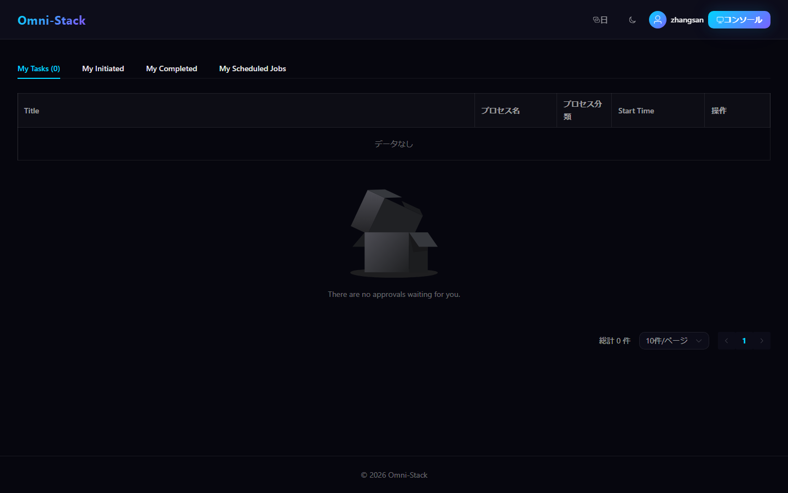
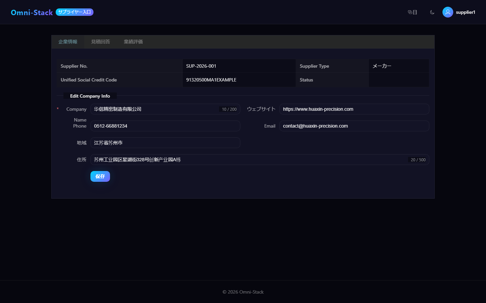
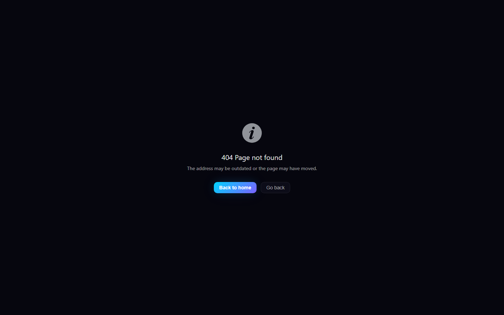
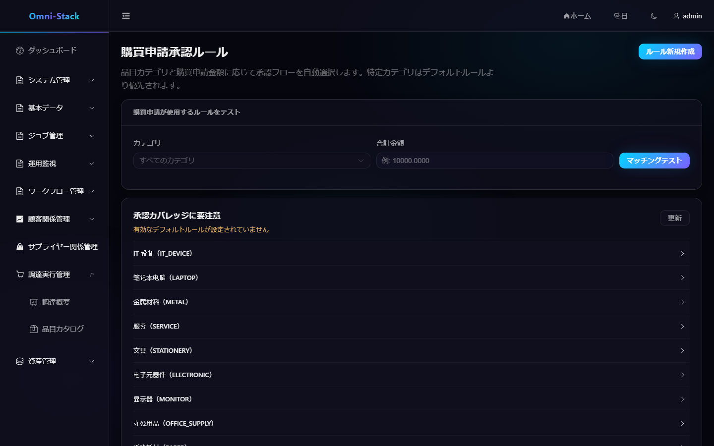

# メニュー、ロール、機能権限、データ権限

Omni-Stack は「機能を実行できるか」と「どのデータを参照できるか」を分離して処理します。ボタンを隠すだけではセキュリティ制御にならず、すべての書き込みインターフェースはバックエンドで再認可しなければなりません。

## 1. 4 層の関係

```text
ユーザー → ユーザーロール範囲 → ロール → 権限ツリー
                              ↘ データ範囲
```

- ユーザー：テナント内のアカウント。
- ロール：一組の安定した権限コードとデータ範囲戦略。
- 権限：`DIRECTORY`、`MENU`、`BUTTON/API` の 3 種ノード。
- ユーザーロール範囲：ユーザーが特定の組織ユニット内で某ロールを持つ。

権限コードは `resource:action` 形式を使用し、例は `procurement:requisition:create`。ディレクトリとメニューはナビゲーション用、ボタン/API 権限は実際の操作用。

## 2. 動的メニュー

ログイン後フロントエンドは `GET /api/auth/menus` を呼びます。Auth サービスは現在の権限でツリー形メニューを返し；フロントエンドは `MENU` ノードのみを動的ルートに変換し、共有マッピングでメニュー名を翻訳します。

メニューが表示されない場合は順に確認：

1. 現在のプリセットが対象モジュールを含むか。
2. `sys_permission` に対応するディレクトリ、メニュー、操作権限が存在するか。
3. 現在のロールが `sys_role_permission` で権限を得ているか。
4. JWT に最新の authorities が含まれるか；権限変更後は再ログインすべき。
5. ページボタンが同一の `v-permission` 権限コードを使うか。

権限のないページをハードコード静的ルートで公開してはいけない。

## 3. 機能権限

バックエンドの書き込み操作は `@PreAuthorize` を宣言しなければならず、フロントエンドボタンは同一権限コードの `v-permission` を使用します。ディレクティブは Vue のリアクティブ構造を保つため `display:none` を採用しますが、それは画面体験を改善するだけで、バックエンドチェックの代わりにはなりません。

`MyJobController` は例外です：個人タスクは行ごとに `createBy` で帰属を検証し、エンドポイントレベル RBAC を使いません。サプライヤー Portal は Portal 権限、`SUPPLIER` ロール、有効な関連付けを同時に要求します。

## 4. データ権限

DataScope はクエリと書き込み操作が到達できるデータ集合を決めます。一般的な範囲：

- 全データ。
- 現在のテナント。
- 現在の組織。
- 現在の組織および下位。
- 本人のみ。
- カスタム組織集合。

Servlet ビジネスサービスは信頼できる Gateway 身分でリクエストコンテキストを確立し、MyBatis データ権限インターセプターが条件を追加します。インターセプター順は DataPermission が Pagination の前でなければならず；リクエスト終了時は `finally` で ThreadLocal を消去しなければなりません。

ドメインマッピングは同一の owner 列を使い回せません：

- CRM、SRM、Procurement、Asset はそれぞれ集約ルートの可視性を維持。
- 子テーブルは集約ルート経由で範囲を継承し、owner 列を持たない子テーブルに条件を追加しない。
- 購買申請は申請者列、RFQ・注文・入荷は責任者列を使用。
- 資産の「マイ資産」、受領、返却は現在ユーザー固定；管理ビューは owner 列を使用。

## 5. ロール保守フロー

1. ロールを作成または選択。
2. 機能権限ツリーを割当。
3. データ範囲を設定。
4. 具体的な組織範囲内でユーザーにロールを付与。
5. 対象ユーザーで再ログインしメニュー、ボタン、API、データ集合を検証。
6. 少なくとも 1 つの 403 シナリオを検証し、バックエンドが越権リクエストを拒否することを確認。

スーパー管理者だけで権限機能を受け入れてはいけない。

### 操作スクリーンショット

#### 図 1 `system-users-ja-JP`：ユーザー管理

- 前提条件：ユーザー管理権限を持つシステム管理者としてログイン
- 操作者：システム管理者
- 操作：「システム管理 → ユーザー管理」を開く
- 期待結果：メイン領域に「ユーザー管理」一覧が表示され、ロール割当と有効/無効を実行できる


#### 図 2 `employee-forbidden-403-ja-JP`：社員の越権アクセス拒否

- 前提条件：一般社員 zhangsan（EMPLOYEE ロール）でログイン、`procurement:approval-route:list` 未付与
- 操作者：一般社員
- 操作：「購買申請承認ルール」管理ページ `/admin/procurement/approval-route` に直接アクセス
- 期待結果：ページが 403 と戻る入口を表示（AUTHENTICATED_BUT_FORBIDDEN、ログインリダイレクトではない）；同一インターフェース API は HTTP 403 を返す


#### 図 3 `employee-workspace-scope-ja-JP`：社員の可視範囲

- 前提条件：一般社員 zhangsan でログイン
- 操作者：一般社員
- 操作：ログイン後に承認ワークベンチのホームに入る
- 期待結果：ワークベンチは社員が参照できるToDoタスクと個人タスクのみを表示し、管理側メニューと 403 を含まない



#### 図 4 `supplier-portal-scope-ja-JP`：サプライヤーポータルの範囲

- 前提条件：正式 seed サプライヤーアカウント supplier1（SUPPLIER ロール）でログイン
- 操作者：サプライヤーユーザー
- 操作：`/supplier-portal` を開く
- 期待結果：ポータルページがレンダリングされログイン身分が supplier1、サプライヤーの正当な範囲のみアクセス可能



#### 図 5 `resource-not-found-404-ja-JP`：未知ルート 404

- 前提条件：管理者でログイン
- 操作者：任意のユーザー
- 操作：未定義ルートにアクセス（catch-all NotFound、statusCode=404）
- 期待結果：製品の NotFound ページが 404 文言を表示



#### 図 6 `approval-route-list-failure-ja-JP`：リストインターフェース失敗の表現

- 前提条件：管理者でログイン；テストプロセス内で承認ルールリストインターフェースに確定的な 500 障害を注入
- 操作者：管理者（確定的なテスト障害を併用）
- 操作：「購買申請承認ルール」ページを開き、リストインターフェースが 500 を返す
- 期待結果：ページ枠は保たれ、リスト領域はインターフェース失敗下の実際の製品表現を示す



#### 図 7 `admin-menu-load-failure-ja-JP`：メニュー読み込み失敗のフォールバックページ

- 前提条件：管理者でログイン；テストプロセス内でメニューインターフェースに確定的な 500 障害を注入
- 操作者：管理者（確定的なテスト障害を併用）
- 操作：管理側ページにアクセスし、メニューインターフェースが 500 を返す
- 期待結果：ガードがメニュー読み込み失敗フォールバックページへリダイレクトし、ローカライズされたエラータイトルと「再読み込み/ホームへ戻る」復旧入口を表示、白画面や成功メニューの偽装をしない


## 6. 新規権限のコードチェックリスト

書き込み機能を追加する際は同時に更新：

1. Controller `@PreAuthorize`。
2. `scripts/sql/seed/auth.sql` 権限ノードとデフォルトロール関係。
3. `database/seed/manifest.yaml` SHA-256 とアサーション。
4. フロントエンド動的ルートマッピングやページ入口。
5. 操作ボタン `v-permission`。
6. 機能権限、データ範囲、クロステナント自動テスト。
7. 対応モジュールのドキュメントとスクリーンショット。

詳細実装は [バックエンド規約](../backend-patterns.jp.md)、[フロントエンド規約](../frontend-patterns.jp.md)、[コアフロー](../core-flows.jp.md) を参照。
