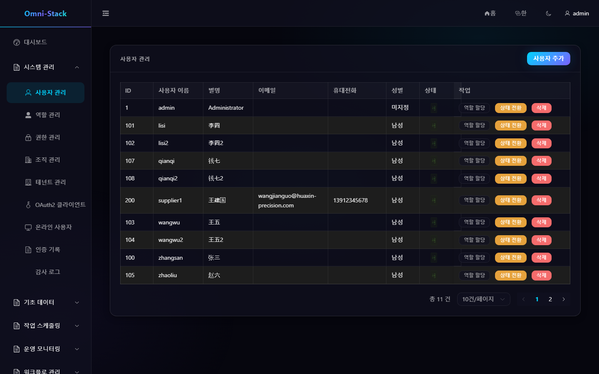
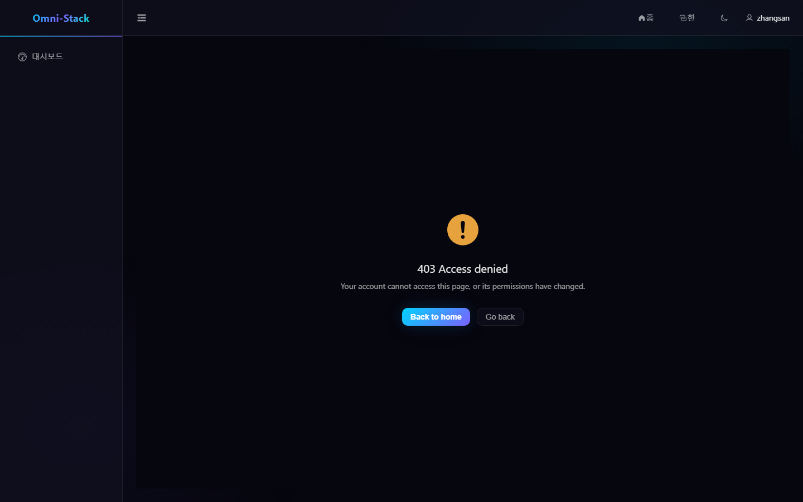
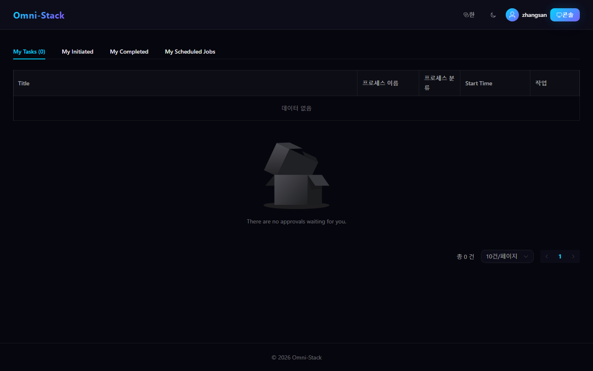
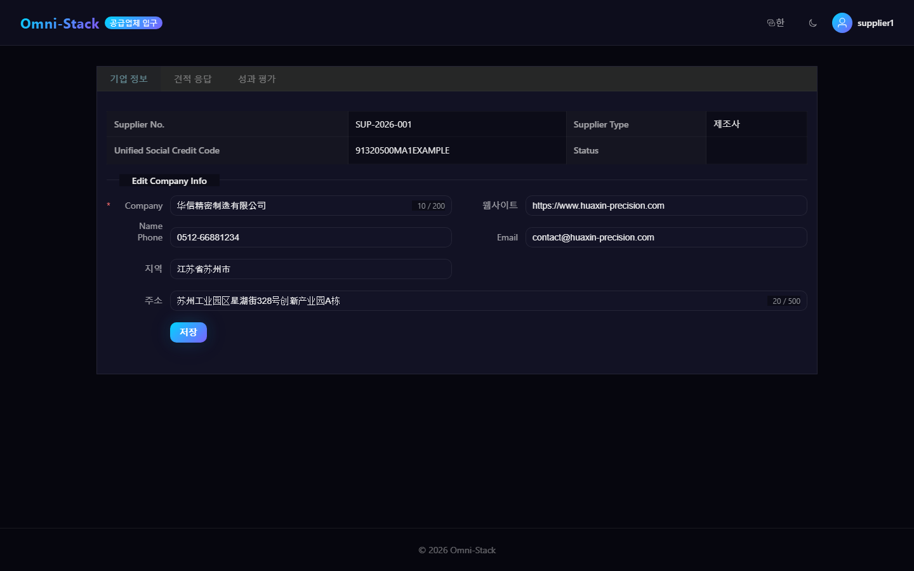
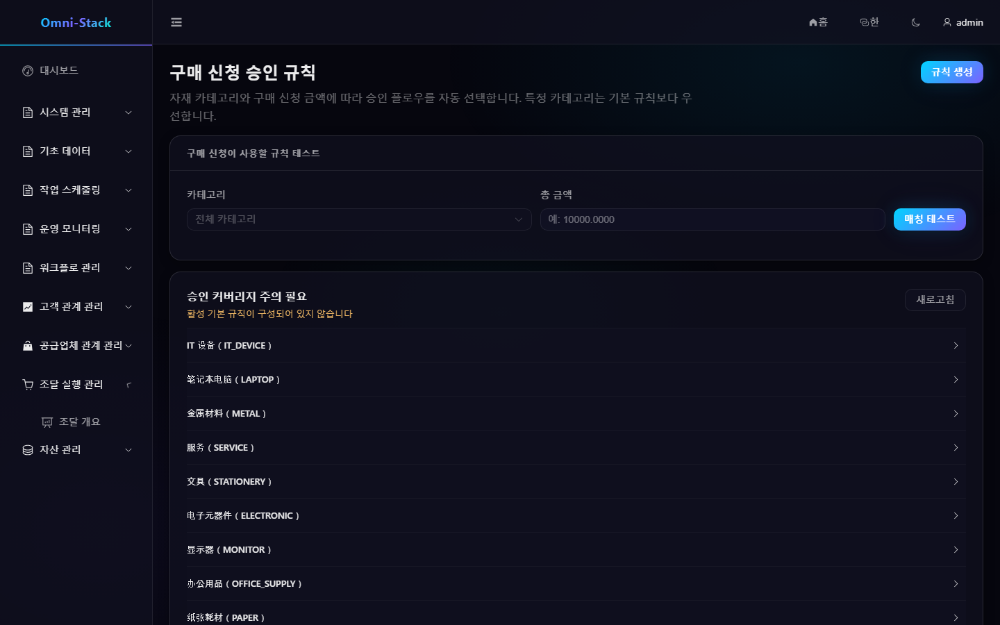
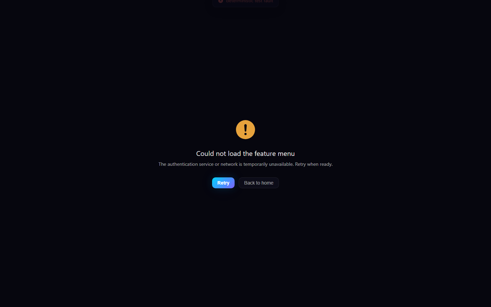

# 메뉴, 역할, 기능 권한과 데이터 권한

Omni-Stack 은 "기능을 실행할 수 있는지"와 "어떤 데이터를 볼 수 있는지"를 분리해 처리합니다. 버튼을 숨기는 것만으로는 보안 통제가 되지 않으며, 모든 쓰기 인터페이스는 백엔드에서 다시 인가해야 합니다.

## 1. 네 계층 관계

```text
사용자 → 사용자 역할 범위 → 역할 → 권한 트리
                          ↘ 데이터 범위
```

- 사용자: 테넌트 내 계정.
- 역할: 안정된 권한 코드와 데이터 범위 전략의 집합.
- 권한: `DIRECTORY`, `MENU`, `BUTTON/API` 세 종 노드.
- 사용자 역할 범위: 사용자가 특정 조직 단위 내에서 어떤 역할을 가짐.

권한 코드는 `resource:action` 형식을 사용하며 예는 `procurement:requisition:create`. 디렉터리와 메뉴는 내비게이션용, 버튼/API 권한은 실제 조작용.

## 2. 동적 메뉴

로그인 후 프론트엔드는 `GET /api/auth/menus` 를 호출합니다. Auth 서비스는 현재 권한으로 트리형 메뉴를 반환하고; 프론트엔드는 `MENU` 노드만 동적 라우트로 변환하며 공유 매핑으로 메뉴 이름을 번역합니다.

메뉴가 나타나지 않으면 순서대로 확인:

1. 현재 프리셋이 대상 모듈을 포함하는지.
2. `sys_permission` 에 대응 디렉터리, 메뉴, 조작 권한이 존재하는지.
3. 현재 역할이 `sys_role_permission` 으로 권한을 얻었는지.
4. JWT 에 최신 authorities 가 포함되는지; 권한 변경 후 다시 로그인해야 함.
5. 페이지 버튼이 동일한 `v-permission` 권한 코드를 쓰는지.

권한 없는 페이지를 하드코딩 정적 라우트로 노출하지 마세요.

## 3. 기능 권한

백엔드 쓰기 조작은 `@PreAuthorize` 를 선언해야 하고, 프론트엔드 버튼은 동일 권한 코드의 `v-permission` 을 사용합니다. 지시자는 Vue 반응형 구조를 유지하려고 `display:none` 을 채택하지만, 화면 경험만 개선할 뿐 백엔드 검사를 대체하지 않습니다.

`MyJobController` 는 예외입니다: 개인 작업은 행별 `createBy` 로 귀속을 검증하고 엔드포인트 수준 RBAC 를 쓰지 않습니다. 공급업체 Portal 은 Portal 권한, `SUPPLIER` 역할, 유효한 연결을 동시에 요구합니다.

## 4. 데이터 권한

DataScope 는 조회와 쓰기 조작이 닿을 수 있는 데이터 집합을 정합니다. 일반적인 범위:

- 전체 데이터.
- 현재 테넌트.
- 현재 조직.
- 현재 조직 및 하위.
- 본인만.
- 사용자 지정 조직 집합.

Servlet 비즈니스 서비스는 신뢰할 수 있는 Gateway 신원으로 요청 컨텍스트를 세우고, MyBatis 데이터 권한 인터셉터가 조건을 추가합니다. 인터셉터 순서는 DataPermission 이 Pagination 앞이어야 하며; 요청 종료 시 `finally` 에서 ThreadLocal 을 지워야 합니다.

도메인 매핑은 동일 owner 열을 돌려 쓸 수 없습니다:

- CRM, SRM, Procurement, Asset 은 각자 집계 루트 가시성을 유지.
- 자식 테이블은 집계 루트를 통해 범위를 상속하고, owner 열이 없는 자식 테이블에 조건을 추가하지 않음.
- 구매 요청은 요청자 열, RFQ·주문·입고는 책임자 열을 사용.
- 자산 "내 자산", 수령, 반환은 현재 사용자 고정; 관리 뷰는 owner 열 사용.

## 5. 역할 유지보수 흐름

1. 역할을 생성하거나 선택.
2. 기능 권한 트리를 할당.
3. 데이터 범위를 설정.
4. 구체적 조직 범위 내에서 사용자에 역할을 부여.
5. 대상 사용자로 다시 로그인해 메뉴, 버튼, API, 데이터 집합을 검증.
6. 최소 한 개의 403 시나리오를 검증해 백엔드가 월권 요청을 거부하는지 확인.

슈퍼 관리자로만 권한 기능을 검수하지 마세요.

### 조작 스크린샷

#### 그림 1 `system-users-ko-KR`: 사용자 관리

- 전제 조건: 사용자 관리 권한을 가진 시스템 관리자로 로그인
- 작업자: 시스템 관리자
- 작업: 「시스템 관리 → 사용자 관리」 진입
- 예상 결과: 메인 영역에 「사용자 관리」 목록이 표시되고 역할 할당과 활성/비활성을 실행할 수 있음



#### 그림 2 `employee-forbidden-403-ko-KR`: 직원 월권 접근 거부

- 전제 조건: 일반 직원 zhangsan(EMPLOYEE 역할)으로 로그인, `procurement:approval-route:list` 미부여
- 작업자: 일반 직원
- 작업: 「구매 요청 승인 규칙」 관리 페이지 `/admin/procurement/approval-route` 에 직접 접근
- 예상 결과: 페이지가 403 과 복귀 입구를 표시(AUTHENTICATED_BUT_FORBIDDEN, 로그인 리디렉션 아님); 동일 인터페이스 API 는 HTTP 403 반환



#### 그림 3 `employee-workspace-scope-ko-KR`: 직원 가시 범위

- 전제 조건: 일반 직원 zhangsan 으로 로그인
- 작업자: 일반 직원
- 작업: 로그인 후 승인 워크벤치 홈 진입
- 예상 결과: 워크벤치는 직원이 볼 수 있는 할 일 작업과 개인 작업만 표시하고, 관리측 메뉴와 403 은 포함하지 않음



#### 그림 4 `supplier-portal-scope-ko-KR`: 공급업체 포털 범위

- 전제 조건: 공식 seed 공급업체 계정 supplier1(SUPPLIER 역할)으로 로그인
- 작업자: 공급업체 사용자
- 작업: `/supplier-portal` 열기
- 예상 결과: 포털 페이지가 렌더링되고 로그인 신원이 supplier1 이며, 공급업체의 정당한 범위만 접근 가능



#### 그림 5 `resource-not-found-404-ko-KR`: 알 수 없는 라우트 404

- 전제 조건: 관리자로 로그인
- 작업자: 임의 사용자
- 작업: 정의되지 않은 라우트 접근(catch-all NotFound, statusCode=404)
- 예상 결과: 제품 NotFound 페이지가 404 문구를 표시


#### 그림 6 `approval-route-list-failure-ko-KR`: 목록 인터페이스 실패 표현

- 전제 조건: 관리자로 로그인; 테스트 프로세스 내에서 승인 규칙 목록 인터페이스에 확정적 500 장애 주입
- 작업자: 관리자(확정적 테스트 장애 병행)
- 작업: 「구매 요청 승인 규칙」 페이지를 열고 목록 인터페이스가 500 반환
- 예상 결과: 페이지 골격은 유지되고 목록 영역은 인터페이스 실패 상황의 실제 제품 표현을 보임



#### 그림 7 `admin-menu-load-failure-ko-KR`: 메뉴 로드 실패 폴백 페이지

- 전제 조건: 관리자로 로그인; 테스트 프로세스 내에서 메뉴 인터페이스에 확정적 500 장애 주입
- 작업자: 관리자(확정적 테스트 장애 병행)
- 작업: 관리측 페이지에 접근하고 메뉴 인터페이스가 500 반환
- 예상 결과: 가드가 메뉴 로드 실패 폴백 페이지로 리디렉션하고, 현지화된 오류 제목과 「다시 로드/홈으로」 복구 입구를 표시하며, 흰 화면이나 성공 메뉴를 위장하지 않음



## 6. 새 권한 코드 체크리스트

쓰기 기능을 추가할 때 함께 갱신:

1. Controller `@PreAuthorize`.
2. `scripts/sql/seed/auth.sql` 권한 노드와 기본 역할 관계.
3. `database/seed/manifest.yaml` SHA-256 과 단정.
4. 프론트엔드 동적 라우트 매핑이나 페이지 진입점.
5. 조작 버튼 `v-permission`.
6. 기능 권한, 데이터 범위, 크로스 테넌트 자동화 테스트.
7. 대응 모듈 문서와 스크린샷.

상세 구현은 [백엔드 패턴](../backend-patterns.kr.md), [프론트엔드 패턴](../frontend-patterns.kr.md), [핵심 흐름](../core-flows.kr.md) 을 참고하세요.
