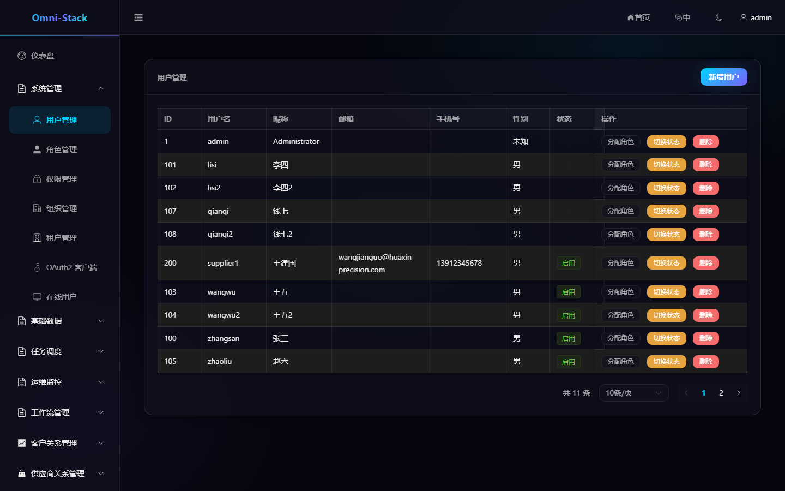
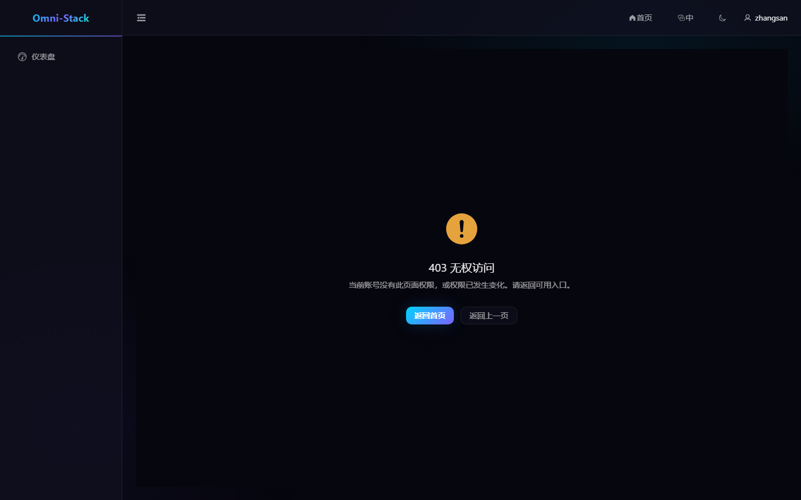
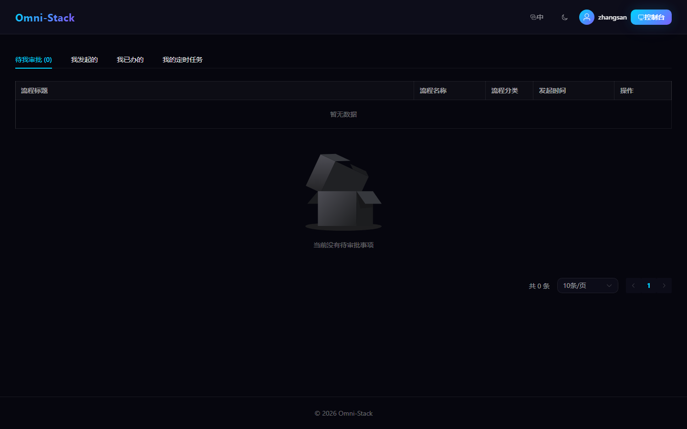
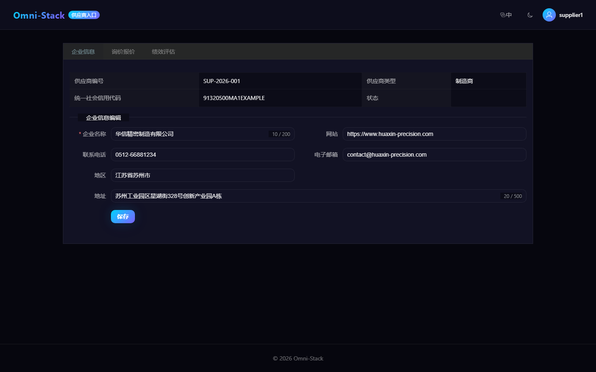
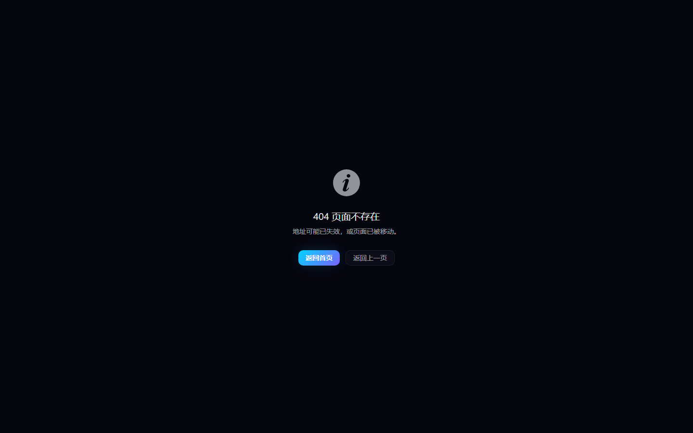
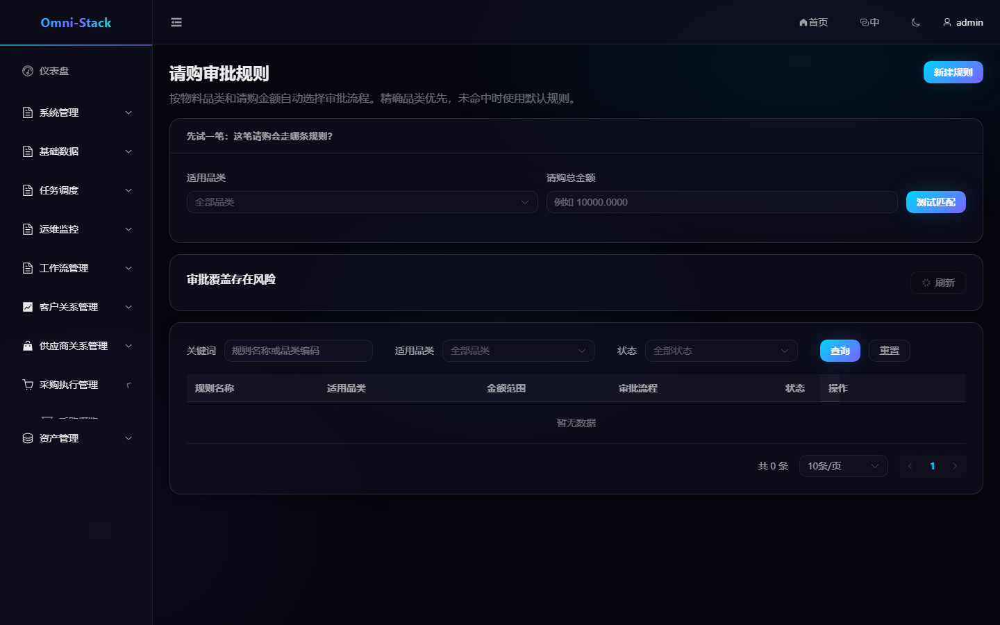
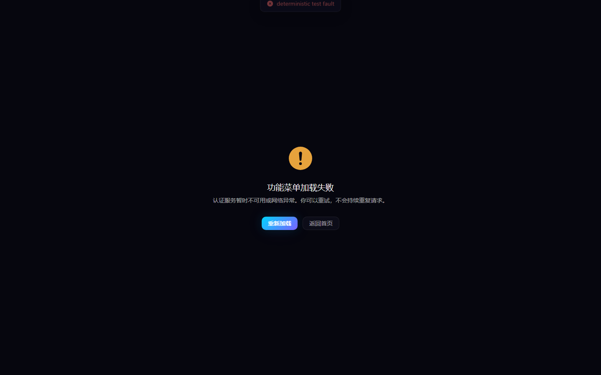

# 菜单、角色、功能权限与数据权限

Omni-Stack 将“能否执行功能”和“能看到哪些数据”分开处理。只隐藏按钮不能构成安全控制，所有写接口都必须由后端再次鉴权。

## 1. 四层关系

```text
用户 → 用户角色范围 → 角色 → 权限树
                    ↘ 数据范围
```

- 用户：租户内账号。
- 角色：一组稳定权限码和数据范围策略。
- 权限：`DIRECTORY`、`MENU`、`BUTTON/API` 三类节点。
- 用户角色范围：用户在特定组织单元内拥有某角色。

权限码使用 `resource:action` 格式，例如 `procurement:requisition:create`。目录和菜单用于导航，按钮/API 权限用于实际操作。

## 2. 动态菜单

登录后前端调用 `GET /api/auth/menus`。Auth 服务按当前权限返回树形菜单；前端只把 `MENU` 节点转换为动态路由，并通过共享映射翻译菜单名称。

菜单不出现时按顺序检查：

1. 当前预设是否包含目标模块。
2. `sys_permission` 是否存在对应目录、菜单和操作权限。
3. 当前角色是否通过 `sys_role_permission` 获得权限。
4. JWT 中是否包含最新 authorities；权限变更后应重新登录。
5. 页面按钮是否使用同一个 `v-permission` 权限码。

不要把没有权限的页面通过硬编码静态路由暴露出来。

## 3. 功能权限

后端写操作必须声明 `@PreAuthorize`，前端按钮使用同一权限码的 `v-permission`。指令采用 `display:none` 保持 Vue 响应式结构，但它只改善界面体验，不代替后端检查。

`MyJobController` 是例外：个人任务按每行 `createBy` 校验归属，不使用端点级 RBAC。供应商 Portal 同时要求 Portal 权限、`SUPPLIER` 角色和有效关联。

## 4. 数据权限

DataScope 决定查询和写操作能够触达的数据集合。常见范围包括：

- 全部数据。
- 当前租户。
- 当前组织。
- 当前组织及下级。
- 仅本人。
- 自定义组织集合。

Servlet 业务服务通过可信 Gateway 身份建立请求上下文，再由 MyBatis 数据权限拦截器追加条件。拦截器顺序必须为 DataPermission 在 Pagination 之前；请求结束必须在 `finally` 清理 ThreadLocal。

领域映射不能套用同一 owner 列：

- CRM、SRM、Procurement、Asset 各自维护聚合根可见性。
- 子表通过聚合根继承范围，不能给不存在 owner 列的子表追加条件。
- 采购申请使用申请人列，RFQ、订单和收货使用负责人列。
- 资产“我的资产”、接收和归还固定按当前用户；管理视图使用 owner 列。

## 5. 角色维护流程

1. 建立或选择角色。
2. 分配功能权限树。
3. 设置数据范围。
4. 在具体组织范围内把角色授予用户。
5. 使用目标用户重新登录验证菜单、按钮、API 和数据集合。
6. 至少验证一个 403 场景，确认后端拒绝越权请求。

不要只使用超级管理员验收权限功能。

### 操作截图

#### 图 1 `system-users-zh-CN`：用户管理

- 前置条件：以系统管理员身份登录，具备用户管理权限
- 操作者：系统管理员
- 操作：进入「系统管理 → 用户管理」
- 预期结果：主内容区显示「用户管理」列表，可执行角色分配与启停



#### 图 2 `employee-forbidden-403-zh-CN`：员工越权访问被拒

- 前置条件：以普通员工 zhangsan（EMPLOYEE 角色）登录，未授予 `procurement:approval-route:list`
- 操作者：普通员工
- 操作：直接访问「请购审批规则」管理页 `/admin/procurement/approval-route`
- 预期结果：页面显示 403 与返回入口（AUTHENTICATED_BUT_FORBIDDEN，非登录跳转）；同接口 API 返回 HTTP 403



#### 图 3 `employee-workspace-scope-zh-CN`：员工可见范围

- 前置条件：以普通员工 zhangsan 登录
- 操作者：普通员工
- 操作：登录后进入审批工作台首页
- 预期结果：工作台仅展示员工可见的待办任务与个人任务，不含管理端菜单与 403



#### 图 4 `supplier-portal-scope-zh-CN`：供应商门户范围

- 前置条件：以正式 seed 供应商账号 supplier1（SUPPLIER 角色）登录
- 操作者：供应商用户
- 操作：打开 `/supplier-portal`
- 预期结果：门户页面渲染且登录身份为 supplier1，仅可访问供应商合法范围



#### 图 5 `resource-not-found-404-zh-CN`：未知路由 404

- 前置条件：以管理员登录
- 操作者：任意用户
- 操作：访问未定义路由（catch-all NotFound，statusCode=404）
- 预期结果：产品 NotFound 页显示 404 文案



#### 图 6 `approval-route-list-failure-zh-CN`：列表接口失败表现

- 前置条件：以管理员登录；测试进程内对审批规则列表接口注入确定性 500 故障
- 操作者：管理员（配合确定性测试故障）
- 操作：打开「请购审批规则」页，列表接口返回 500
- 预期结果：页面框架保持，列表区呈现接口失败下的真实产品表现



#### 图 7 `admin-menu-load-failure-zh-CN`：菜单加载失败降级页

- 前置条件：以管理员登录；测试进程内对菜单接口注入确定性 500 故障
- 操作者：管理员（配合确定性测试故障）
- 操作：访问管理端页面，菜单接口返回 500
- 预期结果：守卫重定向菜单加载失败降级页，显示本地化错误标题与「重新加载/返回首页」恢复入口，不白屏、不伪装成功菜单



## 6. 新增权限的代码清单

新增写功能时必须同时更新：

1. Controller `@PreAuthorize`。
2. `scripts/sql/seed/auth.sql` 权限节点和默认角色关系。
3. `database/seed/manifest.yaml` SHA-256 与断言。
4. 前端动态路由映射或页面入口。
5. 操作按钮 `v-permission`。
6. 功能权限、数据范围和跨租户自动化测试。
7. 对应模块文档与截图。

详细实现见 [后端规范](../backend-patterns.md)、[前端规范](../frontend-patterns.md) 和 [核心流程](../core-flows.md)。

