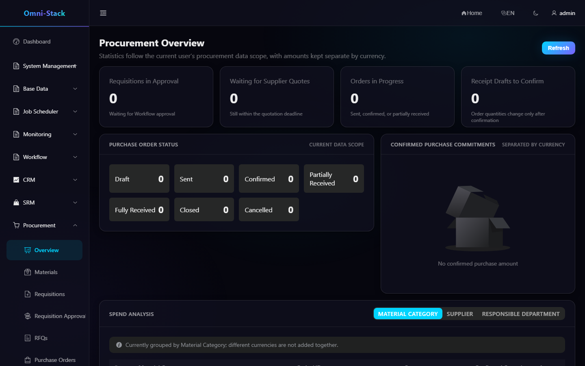
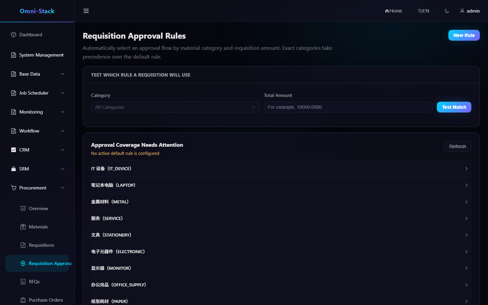
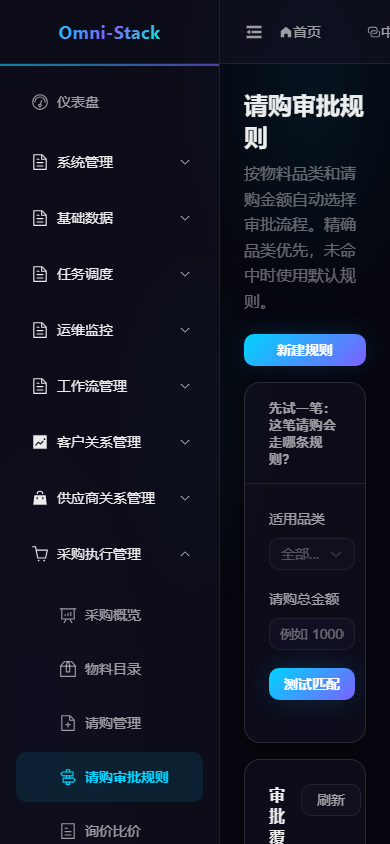
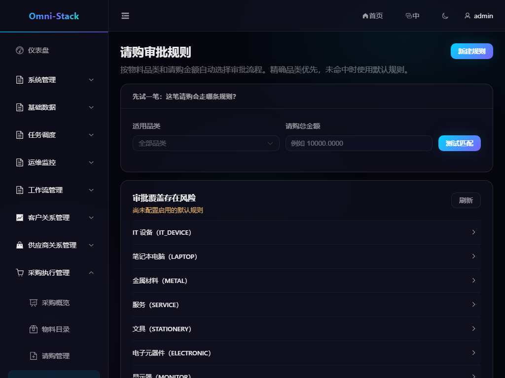

# Complete Requisition, RFQ, Quotation, Order, and Receipt Flow

Procurement owns materials, requisition approval rules, requisitions, RFQs, quotations, purchase orders, and receipts. Approval runtime stays in `omni-workflow`; Procurement does not depend on Flowable.

## 1. End-to-End Flow

```text
Maintain Materials → Configure Approval Rules → Create and Approve Requisition → Create RFQ
→ Invite Suppliers → Receive and Compare Quotations → Create Order → Supplier Confirms → Receive Goods
```

Each stage has an independent state machine. Never skip prerequisites by changing database status.

### Screenshot

#### Figure 1 `procurement-overview-en-US`: Procurement overview

- Prerequisites: log in as a procurement administrator with the `procurement:overview:view` permission
- Actor: procurement administrator
- Action: open Procurement → Overview
- Expected result: the main area shows the "Procurement Overview" title with amounts grouped per currency



## 2. Materials

Categories and materials are tenant-shared master data. A material defines code, name, category, unit, asset-management flag, and default asset quantity semantics. Check references before deletion.

Only accepted asset-managed receipt lines emit asset candidates. `assetQuantity` is an exact positive integer; monetary and quantity values follow explicit decimal precision contracts.

## 3. Requisition Approval Rules

The business-oriented UI asks users to:

1. Select a category or default scope.
2. Define an inclusive minimum and exclusive maximum amount.
3. Select a current published procurement approval flow.
4. Preview the actual approval path.
5. Test a category and amount against the server resolver.
6. Resolve coverage gaps or conflicts before enabling.

Deactivation and deletion show newly uncovered scope. The server owns matching logic; the frontend never duplicates it.

### Screenshot

#### Figure 2 `procurement-approval-rules-en-US`: Approval rules entry

- Prerequisites: log in as a procurement administrator with `procurement:approval-route:list`
- Actor: procurement administrator
- Action: open Procurement → Requisition Approval Rules
- Expected result: the main area shows the "Requisition Approval Rules" title, the match tester, and coverage risk cards



#### Figure 3 `procurement-approval-rules-mobile-zh-CN`: 390×844 responsive (layout reference, captured in zh-CN)

- Prerequisites: same as Figure 2
- Actor: procurement administrator
- Action: open the same page at 390×844
- Expected result: the page renders without horizontal scroll and core copy stays intact. Responsive captures are currently provided in zh-CN only; other locales follow the same fixture and viewport.



#### Figure 4 `procurement-approval-rules-tablet-zh-CN`: 1024×768 responsive (layout reference, captured in zh-CN)

- Prerequisites: same as Figure 2
- Actor: procurement administrator
- Action: open the same page at 1024×768
- Expected result: adaptive layout with all entry points available.



## 4. Requisitions

A draft contains requester, unit, purpose, and lines. Submission locks critical fields and starts Workflow using a persistent idempotent start request. A `START_FAILED` record can be retried without creating a second process. Approval, rejection, withdrawal, and cancellation follow domain rules.

## 5. RFQ and Quotations

Create an RFQ from approved demand, invite active suppliers, and send it. Portal quotations arrive through reliable messaging and are consumed idempotently by event ID. Comparison covers price, tax, delivery, and notes. Confirm currency, tax basis, deadline, and supplier eligibility before award.

## 6. Purchase Orders

An awarded quotation produces a draft order, then sent, supplier-confirmed, partially received, fully received, or cancelled states. After sending, supplier and commercial terms are protected. Cancellation checks existing receipts.

## 7. Goods Receipt

Each receipt line records the actual received quantity, quality status, and asset quantity. Asset candidate events are published only when `qualityStatus=PASS`, the material has `assetManaged=true`, and the asset quantity is an exact positive integer. Duplicate submission, message redelivery, and Asset backfill must remain idempotent. After completion, verify order and receipt status in the Procurement overview and the actual card results in the Asset ledger.

## 8. Permissions and Diagnostics

Procurement administrators manage master data and rules; requesters manage visible requisitions; buyers own RFQ/orders/receipts; suppliers see only their Portal invitations and quotations. Correlate document number, Workflow instance, Outbox message, Inbox event, and Trace ID.

See the [Procurement Design](../design/procurement-design.md).

